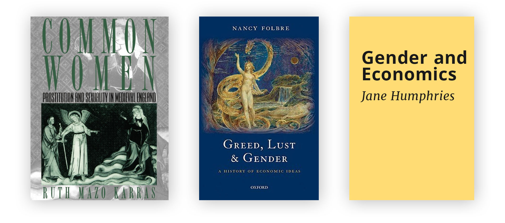

Dr Bateman is a fellow in economics at Gonville & Caius college Cambridge. Her research encompasses economic history, macroeconomics, and feminism.

We begin by laying why the Industrial Revolution was so important and why understanding its causes is key to understanding modern economic growth. We hear Dr Bateman explain the range of arguments economic historians have given for why it was Britain that became the first industrialised nation] in the world before delving into her own research about why she believes women and fertility were a critical aspect to this that often gets neglected. We then draw out what lessons this has for developing countries today, particularly the links between female empowerment and economic growth].

## Book Recommendations

Victoria Bateman's book recommendations:

- [Common women: Prostitution and sexuality in Medieval England](https://www.amazon.co.uk/Common-Women-Prostitution-Sexuality-Medieval/dp/0195124987/ref=sr_1_1?keywords=common+women&qid=1579181934&sr=8-1) by Ruth Mazo Karas
- [Greed, lust and gender: A History of Economic Ideas](https://www.amazon.co.uk/Greed-Lust-Gender-History-Economic-ebook/dp/B005PUWTOU/ref=sr_1_1?crid=2AXS8BSP4ILFZ&keywords=greed+lust+and+gender&qid=1579181816&sprefix=greed+lust+an%2Cstripbooks%2C152&sr=8-1) by Nancy Folbre
- [Gender and Economics](https://books.google.co.uk/books?id=36MEAQAAIAAJ&q=gender+and+economics&dq=gender+and+economics&hl=en&sa=X&ved=0ahUKEwiVzrHl8obnAhWPh1wKHejADiEQ6AEIKDAA) by Jane Humphries

## The Industrial Revolution and why it matters

> Is there some action a government of India could take that would lead the Indian economy to grow like Indonesia’s or Egypt’s? If so, *what,* exactly? If not, what is it about the “nature of India” that makes it so? The consequences for human welfare involved in questions like these are simply staggering: **Once one starts to think about them, it is hard to think about anything else.**
>
> —"[On the Mechanics of Economic Development](https://www.parisschoolofeconomics.eu/docs/darcillon-thibault/lucasmechanicseconomicgrowth.pdf)" by Robert Lucas (1988)

[00:04:30] Reflecting on the Industrial Revolution is reflecting on how new and still uncertain our relationship with economic growth is. Our World in Data has an excellent [article](https://ourworldindata.org/economic-growth) summarising this. The first thing to note is how a significant break the Industrial Revolution was with all of prior history: In GDP terms, there wasn't much going on before 17th Century Britain.

[00:05:25] Whilst nowadays a lot of people mock the pessimism Malthus described in "[An Essay on the Principle of Population](http://www.esp.org/books/malthus/population/malthus.pdf)", the fact is that for much of human history he was right. An excellent, modern interpretation of Malthus with a formal economic model can be found in "[Malthus’s Theory of Population](https://link.springer.com/chapter/10.1007/978-1-349-21315-3_52)" by David Weir.

<iframe src="https://ourworldindata.org/grapher/GDP-per-capita-in-the-uk-since-1270?time=1270..2016" style="width: 100%; height: 600px; border: 0px none;"></iframe>
<iframe src="https://ourworldindata.org/grapher/the-malthusian-trap" style="width: 100%; height: 600px; border: 0px none;"></iframe>
[00:06:30] Perhaps most relevant to today is the threat of environmental degradation. The Diplomat [writes](https://thediplomat.com/2016/11/chinas-tangled-environmental-history/) about how over extraction ended economic expansion in Qing Dynasty. Simillar warnings are now being given by organisations such as [The Club of Rome](https://www.clubofrome.org/).

[00:07:10] Another reason growth may be threatened is because inventing more and more new machines to make more productive is much more difficult than we are often led to believe. For example, Robert Gordon argues in "[The Rise and Fall of American Growth](https://press.princeton.edu/books/hardcover/9780691147727/the-rise-and-fall-of-american-growth)" that the revolution in computer technology is much less productive than expected. In "[Why Nations Fail](http://whynationsfail.com/)", Daron Acemoglu and James Robinson note that one challenge is that 'extractive institutions' hinder innovations as this would hurt the rents of vested interests.

[00:08:48]  Another important thing to consider is that economic growth no longer ensures that everyone in society will be better of. Milanovic unpacks recent trends in inequality in his book "[Global Inequality: A New Approach](https://www.hup.harvard.edu/catalog.php?isbn=9780674737136)" whilst Walter Schneidel argues in "The Great Leveler" that the only times we have seen reductions in inequality during human history have been following violent shocks.

## Investigating the causes of the Industrial Revolution

> From the perspective of the modern-day, we tend to look back at history and assume that “the West has always been best” [...] However, **this commonly accepted story is nothing but a myth**.
>
> -- "[The Changing Axis of Economic Power in the Early Modern Period](https://lif.blob.core.windows.net/lif/docs/default-source/publications/an-introduction-to-the-history-of-capitalism-600-1900-ad.pdf?sfvrsn=4)" by Victoria Bateman (2016)

[10:00] From a historical perspective, Britain was an unlikely place for the Industrial Revolution to begin. Identifying the underlying causes is hence incredibly interesting.

[11:30] Traditionally, the reason given is that Britain industrialised because of market institutions. This is summarised and extended by North (1991) in his seminal papers "[Institutions](https://www.aeaweb.org/articles?id=10.1257/jep.5.1.97)", emphasising the ability of markets to overcome transaction costs (i.e. agency and enforcement of contracts).

[12:55] However, the main criticism of this approach is that is not clear how Britain was distinct in this aspect and why it took until the 18th Century to ignite growth. This is illustrated in Bateman's (2015) thesis "[Markets and growth in early modern Europe](https://content.taylorfrancis.com/books/download?dac=C2015-0-64822-1&isbn=9781317321736&format=googlePreviewPdf)".

[12:54] Joel Mokyr hence argues that the key ingredient was the European Enlightenment. The latest iteration of this is presented in his book "[A Culture of Growth](https://press.princeton.edu/books/paperback/9780691180960/a-culture-of-growth)". Mokyr (2016) argues that "the beliefs, values, and preferences in society that are capable of changing behaviour—was a deciding factor in societal transformations." In particular, "a politically fragmented Europe fostered a competitive “market for ideas” and a willingness to investigate the secrets of nature."

[14:15] The focus on culture also touches upon earlier ideas presented by Hirschmann (1997) in "[The Passions and the Interests](https://press.princeton.edu/books/paperback/9780691160252/the-passions-and-the-interests)" and McCloskey (2010) in "[The Bourgeois Virtues](https://www.press.uchicago.edu/ucp/books/book/chicago/B/bo3750637.html)", both of which argue that the ethics of capitalism was critical in legitimising wealth accumulation. Think "greed is good".

[22:25] The rivalling theory to this is presented by Allen (2009) in "[The British Industrial Revolution in Global Perspective](https://www.cambridge.org/core/books/british-industrial-revolution-in-global-perspective/29A277672CCD093D152846CE7ED82BD9)". A summary of this book is given in his [VoxEu article](https://voxeu.org/article/why-was-industrial-revolution-british). Allen argues that technology during the Industrial Revolution is not "manna from heaven" but instead inherently capital-intensive given that it was driven by machines. Hence, the more expensive labour (i.e. wages) was relative to machines (i.e. coal), the more profitable it was to invest in capital-intensive technology. Thus, because Europe/Britain had the highest wage: coal ratio it made sense that the Industrial Revolution began there.

For more discussion about the special role that coal played in the Industrial Revolution in allowing Britain to escape the upper limit set by 'plant photosynthesis' see Wrigley's (2013) "[Energy and the English Industrial Revolution](https://royalsocietypublishing.org/doi/full/10.1098/rsta.2011.0568)".

[25:20] However, Allen's argument is far from uncontroversial. In particular, there is much debate about whether it is accurate to say that Britain had significantly higher wages than elsewhere. For example, Humphries (2010) notes in "[Childhood and Child Labour in the British Industrial Revolution](https://www.cambridge.org/core/books/childhood-and-child-labour-in-the-british-industrial-revolution/552A7B5B3F79D65220920F2DE3113D2E)" that much of the Industrial Revolution relied on cheap labour in the form of child workers. This is fundamentally at odds with the 'high wage argument'.

Resolving this question is difficult because measuring real wages from hundreds of years ago is difficult, requiring data on wages and cost of living. For Allen's (2015) rebuttal see "[The High Wage Economy and the Industrial Revolution: A Restatement](https://www.economics.ox.ac.uk/oxford-economic-and-social-history-working-papers/the-high-wage-economy-and-the-industrial-revolution-a-restatement)".

## Fertility, female empowerment, and economic growth

[27:27] Bateman notes that what is missing from this debate is fertility. One thing that distinguished Europe is what John Hajnal described as the 'European Marriage Pattern': Late age of marriage, high female celibacy rates outside of marriage, and nuclear family structures. An overview by Hajnal (2017) of these trends can be read [here](https://www.taylorfrancis.com/books/e/9781315127019/chapters/10.4324/9781315127019-7). 

[31:00] De Moor & Van Zanden (2010) argue in "[Girl Power](https://econpapers.repec.org/article/blaehsrev/v_3a63_3ay_3a2010_3ai_3a1_3ap_3a1-33.htm)" that following the Black Death there was an acute scarcity in labour, resulting in women moving into the workforce. With women now having an option outside of being a wife/mother, they could calibrate of marriage and fertility decisions to economic fluctuations (i.e. only have children when they can afford to). This link between fertility to economic performance allowed Europe to sustain a higher wage and break free from its Malthusian trap.

However, it is important to note this view has not gone unchallenged. For example, Dennison & Ogilvie's (2014) article "[Does the European Marriage Pattern explain Economic Growth?](https://www.cambridge.org/core/journals/journal-of-economic-history/article/does-the-european-marriage-pattern-explain-economic-growth/6B90AE4652BA0B021897CCF66A9DD52A)" found that in fact "the most extreme manifestations of the EMP were associated with economic stagnation rather than growth".

[35:55] In "[The Sex Factor](http://vnbateman.com/the-sex-factor.html)", Bateman (2019) goes on to identify five channels through which we can generally link female empowerment and higher rates of growth:

- If women link fertility decisions to economic performance, the economy can sustain a higher wage as per the discussion above.
- If women can choose to have fewer children, parents (and society) are able to invest more human capital in each child.
- Parents in nuclear families need to save for their retirement (since their children will support them less in old age). There incentivise savings, which in turn fuel investment.
- As nuclear families can only be set up with a minimum level of affluence, people have a stronger incentive to accumulate wealth and gain qualifications. Contrast to Weber's (1905) "[Protestant Work Ethic](https://content.taylorfrancis.com/books/download?dac=C2006-0-00901-3&isbn=9781135973988&format=googlePreviewPdf)".
- Societies that empower women are also more likely to be conducive of effective political institutions and market developments. Contrast to Lipset's (1959) "[Some Social Requisites of Democracy](https://www.semanticscholar.org/paper/Some-Social-Requisites-of-Democracy%3A-Economic-and-Lipset/affd89086e3cfb3a70ea3faf4002d5f28f20e6dd)".

[43:55] For more modern evidence of this we can look at the performance of developing countries today. Bateman (2016) does so in her working paper "[Women and Economic growth](https://ideas.repec.org/p/ehs/wpaper/16023.html)", which notes that: "had the birth rate in China not fallen over the last forty years, the poverty rate in the country today would now be 37% instead of the current 11%" 

[49:30] Another possible channel to consider is that when women have a political voice government addresses problems that a purely male electorate would neglect. For example, Miller (2008) found in his [paper](https://www.ncbi.nlm.nih.gov/pmc/articles/PMC3046394/) that women's suffrage in the US resulted in increased public health expenditure.

[49:53] Incorporating women perspectives into economics has also resulted in so-called bargaining power models of households. For an introduction to this literature see Manser & Brown's (1980) original paper "[Marriage and Household Decision-Making](https://www.jstor.org/stable/2526238?casa_token=BP5IO08mWa4AAAAA:S7cIzPfDaOHsUEKIRwVtup1Akv_X-00XDw6-NUPh5fSKHQTxCBq07VgspqCkOOtqPFLuqQk2ZWk00sXxcMyy6VuuOw1miES5asnxH4gcDAxS3rnbdzfL&seq=1#metadata_info_tab_contents)".

_ _ _

### References in order:

- Roser, M. (2020). Economic Growth. Published online at OurWorldInData.org. Retrieved from: 'https://ourworldindata.org/economic-growth' [Online Resource]
- Weir, D. R. (1991). Malthus’s Theory of Population. In: Eatwell J., Milgate M., Newman P. (eds) The World of Economics. The New Palgrave. Palgrave Macmillan, London
- Gordon, R. J. (2017). The rise and fall of American growth: The US standard of living since the civil war (Vol. 70). Princeton University Press.
- Acemoglu, D., & Robinson, J. A. (2012). Why nations fail: The origins of power, prosperity, and poverty. Crown Books.
- Milanovic, B. (2016). Global inequality: A new approach for the age of globalization. Harvard University Press.
- Scheidel, W. (2018). The great leveler: Violence and the history of inequality from the stone age to the twenty-first century (Vol. 74). Princeton University Press.

- Bateman V. N. (2015), The changing axis of economic power in the early modern period. In An Introduction to the History of Capitalism (Legatum)
- North, D. C. (1991). "Institutions." Journal of Economic Perspectives, 5 (1): 97-112.
- Bateman, V. N. (2016). Markets and growth in early modern Europe. Routledge.
- Mokyr, J. (2016). A culture of growth: the origins of the modern economy. Princeton University Press.
- Hirschman, A. O. (1997). The passions and the interests: Political arguments for capitalism before its triumph. Greenwood Publishing Group.
- McCloskey, D. N. (2010). The bourgeois virtues: Ethics for an age of commerce. University of Chicago Press.
- Allen, R. (2009). The British Industrial Revolution in Global Perspective (New Approaches to Economic and Social History). Cambridge: Cambridge University Press.
- Wrigley, E. A. (2013). Energy and the English industrial revolution. Philosophical Transactions of the Royal Society A: Mathematical, Physical and Engineering Sciences, 371(1986), 20110568.
- Humphries, J. (2010). Childhood and child labour in the British Industrial Revolution. Cambridge, UK New York: Cambridge University Press.
- Allen, R. C. (2015). The high wage economy and the industrial revolution: a restatement. The Economic History Review, 68(1), 1-22.

- Hajnal, J. (2017). European marriage patterns in perspective. In Population in history (pp. 101-144). Routledge.

- De Moor, T. & van Zanden J. L. (2010). Girl power: the European marriage pattern and labour markets in the North Sea region in the late medieval and early modern period. Economic History Review, 63, issue 1, p. 1-33.

- Dennison, T., & Ogilvie, S. (2014). Does the European Marriage Pattern Explain Economic Growth? The Journal of Economic History, 74(3), 651-693. doi:10.1017/S0022050714000564

- Bateman V. N. (2019). The Sex Factor: How Women Made the West Rich. Polity Books.

- Weber, M. (2013). The Protestant ethic and the spirit of capitalism. Routledge.

- Lipset, S.M. (1959). Some Social Requisites of Democracy: Economic Development and Political Legitimacy.

- Victoria Bateman, 2016. "Women and economic growth: the European marriage pattern in the context of modern day countries" Working Papers 16023, Economic History Society.

- Miller G. (2008). Women's Suffrage, Political Responsiveness, and Child Survivial in American History. The quarterly journal of economics, 123 (3), 1287–1327.

- Manser, M., & Brown, M. (1980). Marriage and Household Decision-Making: A Bargaining Analysis. International Economic Review, 21 (1), 31-44.

- Dennison, T., & Ogilvie, S. (2014). Does the European marriage pattern explain economic growth?. The journal of economic history, 74(3), 651-693.

- Manser, M., & Brown, M. (1980). Marriage and Household Decision-Making: A Bargaining Analysis. International Economic Review, 21 (1), 31-44.