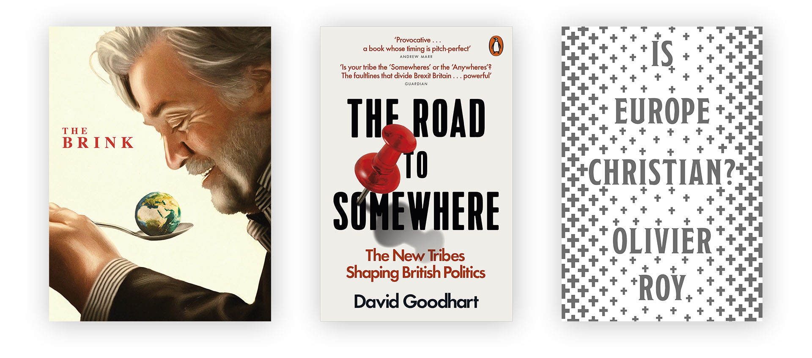
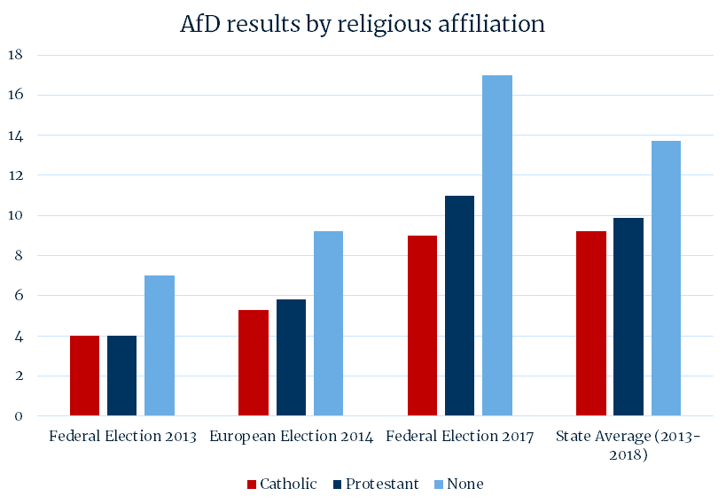

Tobias Cremer is a PhD student in Politics and International Studies. His thesis examines the relationship between right-wing populism and religion in Western Europe and North America.

We begin by discussing Toby’s background in international relations, and his family’s history with the Lutheran church. Next, we hear what motivated the research in the first place: a wave of right-wing populist parties sweeping through Europe and garnering unprecedented support. Toby describes the complex and surprising links between the Christian church. On one hand, these parties reference Christendom as central to their identity, portraying themselves as ‘defenders of the faith’. On the other hand, church attendance is a predictor of *not* voting for these parties, and major churches in Europe have publicly denounced their views. 

## Recommendations

- [The Brink](https://letterboxd.com/film/the-brink-2019/), directed by Alison Klayman
- [The Road to Somewhere](https://www.goodreads.com/en/book/show/32446555) by David Goodhart
- [Is Europe Christian?](https://www.goodreads.com/book/show/48715693) by Olivier Roy

## Religion as belief or cultural identity?

In the last half-decade or so, this relationship has seen some curious changes. On one hand, right-wing nationalist political movements across Europe have embraced their role as purported ‘protectors of the faith’: carrying the torch for Christianity in a darkening age and in defense from the perceived threats of the encroach of secularism from within, and Islam from without. On the other hand, and particularly in the United States, the new populist right has effectively shrugged off religious associations: Trump is perceived to be the [least religious](https://time.com/4194738/poll-religious-voters-embrace-donald-trump-even-if-he-lacks-faith/) GOP candidate in [recent history](https://www.pewresearch.org/fact-tank/2016/01/27/key-findings-faith-and-politics-in-2016-presidential-race/). Throughout Europe, church attendance is one of the strongest predictors for *not* voting right-wing populist, and in Germany supporters of right wing populism tend to be disproportionately irreligious. We read about a new backlash against the advance of [liberalism](https://www.cambridge.org/core/journals/perspectives-on-politics/article/trump-and-the-populist-authoritarian-parties-the-silent-revolution-in-reverse/FE06E514F88A13C8DBFD41984D12D88D), and a new and aggressive ‘culture war’ between [secularism, Christianity, and Islam](https://www.goodreads.com/book/show/15893689); but we also know that measures of religious attendance are declining in the developed world. How do we explain all that?

## Christian immunity

Toby’s account begins with the claim that right-wing populists attempt to embrace Christianity as an *identity marker* while remaining, when necessary, at arms length from ‘genuine’ Christian values and beliefs. They help themselves to its distinctive symbols and language while failing to engage with the teaching itself. Curiously, this strategy is most successful among irreligious voters and non-practicing ‘cultural’ Christian voters. On the other hand, practicing (church-going) Christians apparently remain immune to the ‘new look’ populist parties. Here the success of the right-wing nationalist AfD (Alternative for Germany) party is plotted over recent elections and broken down by religious affiliation.

Similarly, the Front National in France and the Lega in Italy perform badly among Catholics and regular churchgoers. Trump, too, did better among non-practicing evangelicals than regular churchgoers (although the picture is more nuanced in Trump’s case).

Next, Toby asks what explains this ‘immunising’ effect. He argues there are at least two explanations. Firstly, he cites the availability of a Christian alternative in the mainstream / moderate party spectrum. Secondly, he identifies the church’s willingness and ability to create a social taboo around voting for the more radical right-wing parties.  It is clear, then, that in certain very significant respects the Christian church is more of an antidote to right-wing populism than a provocation or driver.

The difference between Christianity as a set of beliefs, and Christianity as a cultural or identity marker, becomes clear in Toby’s interviews. Consider this excerpt from a high-ranking AfD politician:

> The people (in the AfD), who are speaking of the Christian occident actually mean ethnic *Germanity* (“Deutschtum”). Björn Höcke also talks of the Christian occident - but you have to take a closer look at what he actually does there (...) That has nothing to do with Christianity. These are references to Germanic Mythology - this is about a Germanic movement.

While the populists framed their movements as protecting and championing Christianity, the churches themselves often publicly criticised their key policies: in Germany, both Pegida and the AfD had originally sought the votes of conservative Christians. But the German churches themselves effectively denounced them and warned against their co-opting Christian themes, through excluding AfD activists from church positions, and turning off cathedral lights in the background of demonstrations.

## Us and them

Taking a step back, we might ask what characterises right-wing populism, as against (say) plain conservatism, or left-wing populism. Toby mentions a useful way of thinking about the most basic elements of the right-wing populist ‘story’. All populists, Toby suggests, have some notion of an ‘us’ and a ‘them’. Left-wing populists identify an internal ‘them’: roughly the hoarders of capital who shore up enormous wealth and make headlines about [inequality in the developed world](https://www.cbpp.org/research/poverty-and-inequality/a-guide-to-statistics-on-historical-trends-in-income-inequality). Right-wing populists split the ‘other’ into two: the internal other, who in this instance are more or less the liberals supposedly intent on undermining traditions and cherished institutions; and the external other: basically the immigrant or foreigner. And it is this triangle that characterises right-wing populism. Further, left-wing populists emphasise the rights and interests of minority groups, while their right-wing counterparts typically emphasise the right of the *majority* (which in Western Europe is predominantly Christian).

Following on this, Toby suggests that the Christian identity has become for these populists a way of expressing the essential ‘us’ component of the triangle. Correspondingly, Islam often plays to a large extend the role of the external ‘other’. Perhaps, he continues, these religious identities work as proxies for other dimensions of identity: principally racial. It is, of course, unacceptable even for the most distasteful right-wing populist parties to explicitly reference racial identity as a part of their cause. Nor would it be fair to say that it even does at all in every case. But some do understand language about protecting Christendom from the threat of Islam as a veiled reference to racial antagonisms. Similarly, it is less acceptable to stake one’s identity on place of upbringing, or class, and even religion (in certain ways). In a cosmopolitan and globalised world, the last really acceptable identity marker is one’s nationality. 

In this way, the right has developed an identity politics of its own. Toby suggests (provocatively) that the white, Christian identity of European right-wing populists emerged from the identity politics of the left. Better, he concludes, just to return to a kind of universalism in politics where similarities are emphasised more than differences.

## A downward trend

In this sense, argues Tobias, Christian churches often work as a ‘social firewall’ of immunisation against the uglier kinds of right-wing populism that have taken root in Europe and beyond. But while national identity becomes more popular than religious identity, and the Christian churches of Europe denounce and repudiate right-wing populists, these parties are discovering that they can do without religion. Trump was viewed as the least [religious Republican candidate](https://www.pewforum.org/2016/01/27/faith-and-the-2016-campaign/) in recent history, while Americans increasingly say religion should be [left out of politics](https://www.pewforum.org/2019/11/15/americans-have-positive-views-about-religions-role-in-society-but-want-it-out-of-politics/).