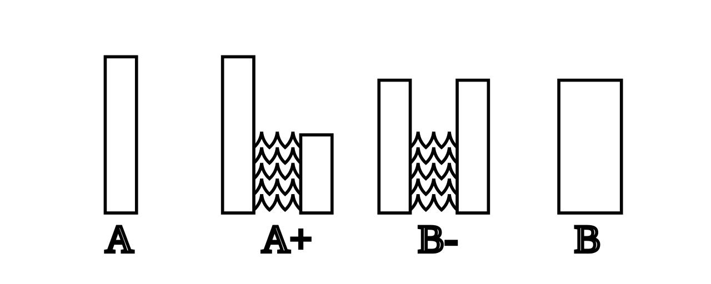

Dr Vasileios Kotsidis is a teaching and research fellow in economics at St Catherine’s College, Cambridge. His research applies methods from game theory and other formal models in economics to social interactions with strategic motives. His work is also beginning to address questions from moral philosophy in the same way.

We begin by discussing the reasons Vasilis became interested in these formal models, before laying out the basic building blocks of ‘rational choice theory’ (RCT) in economics. We focus on some of the trickier or more surprising aspects: what *doesn’t* RCT explain or describe? And what is meant by *transitive* preferences, or lexical ordering? Next, Vasilis introduces the argument for the so-called ‘repugnant conclusion’. Applying RCT to the argument, we can give it a formal gloss: everything seems to follow from this apparently watertight formal framework. Yet, the conclusion is (as the name suggests) preposterous. What, if anything, has gone wrong? The last part of the discussion addresses the shortcomings of formal models like RCT. As elegant and clear as they are, Vasilis argues, important questions about morality might just evade their grasp.

## Book recommendations

- [Reasons and Persons](https://www.goodreads.com/book/show/327051.Reasons_and_Persons?from_search=true&qid=9VDJ9tTkj6&rank=1) by Derek Parfit
- [Formal Logic](https://www.goodreads.com/book/show/829692.Formal_Logic?from_search=true&qid=44Pc3pDKu6&rank=2) by Richard C. Jeffrey
- [Why Free Will Is Real](https://www.goodreads.com/book/show/42525004-why-free-will-is-real) by Christian List

## Rational choice theory

*Rational choice theory* (RCT) is a way of formally modelling all kinds of social and economic behaviour. It gives us a usefully minimal description of what counts as a rational way to make choices and order preferences. Whenever we have a person or bunch of people, and some decision to be made over a range of options, we might apply RCT. There are often one two reasons for using it. On one hand, economists and social scientists use the model to describe actual human behaviour in order to explain or predict it. This isn’t always effective because (newsflash) not all people are rational, at least not according to the theory. On the other hand, it provides a model for what kind of decisions we ought to make if we want to be rational. These are the *descriptive* and *normative* uses.

Suppose there is a fruit bowl in front of you (as there was in the interview) and you feel peckish. In the bowl are three options: an apple, a pear, and a chocolate. RCT begins by listing every *pair* of options: (apple, pear), (pear, chocolate), (chocolate, apple). Now you, the agent, rank the options within each pair: you express a preference. So, between apples and pears, you might prefer the apple. More specifically, you *weakly prefer* X to Y just in case either you prefer X to Y, or you are indifferent between X and Y. Building on this, you strongly prefer X to Y if you weakly prefer X to Y and you do not weakly prefer Y to X. You are indifferent between X and Y if you weakly prefer both X to Y and Y to X. Take a moment to check this makes sense!

Rational choice theory says that a rational agent must form a preference between *every* pair of options (where being indifferent counts as a preference). Further, it says that our preferences must all be *transitive*. For a preference ordering to be transitive, if I prefer X to Y and Y to Z then I must necessarily prefer X to Z. This should make intuitive sense: suppose I preferred the chocolate to the apple and the apple to the pear. It would be *very* strange to also prefer the pear to the chocolate, unless something got me to change my mind after having formed the initial preference. How would I possibly decide what to eat? So-called *intransitive* preferences are also vulnerable to a ‘money pump’ argument, where they can be exploited for money. It should be fairly intuitive why preferences ought to be transitive, at least for rational agents.

At this point in the discussion, some worries begin to creep in about whether RCT describes actual behaviour very well. There is a famous passage in Sartre’s *Existentialism is a Humanism* where he is approached by a student with a pressing dilemma:

> His mother was living alone with him, deeply afflicted by the  semi-treason of his father and by the death of her eldest son, and her  one consolation was in this young man. But he, at this moment, had the  choice between going to England to join the Free French Forces or of  staying near his mother and helping her to live. He fully realised that  this woman lived only for him and that his disappearance – or perhaps  his death – would plunge her into despair… At the same time, he was hesitating between two  kinds of morality; on the one side the morality of sympathy, of personal devotion and, on the other side, a morality of wider scope but of more  debatable validity. He had to choose between those two. What could help  him to choose?

What would rational choice theory say about this student’s predicament? He doesn’t know whether to join the resistance or to care for his mother. So he obviously does not strictly prefer either option over the other. But is he *indifferent* between the two? That seems wrong too. To be indifferent is to judge two options as totally equal. But in that case, the student might be moved to make a decision by a negligibly small bribe. But clearly this conflict is too serious to be settled by something that insignificant. So rational choice theory is mute on where the student actually stands: he is, apparently, not rational.

The conversation continues to build out our understanding of rational choice theory. Vas mentions the idea of *lexicographic preference orderings*. Lexicographic preferences are when an agent prefers any amount of one good X to another, Y. Continuing the example we discussed in this writeup and in the episode, I might prefer any amount of chocolate to any amount of fruit. Faced with a choice between any ‘bundle’ (combination) of goods, I will always choose the one with the most chocolate, no matter how much fruit it contains. However, if the amount of chocolate is equal, then the amount of fruit acts like a tiebreaker: I will then prefer the bundle with the most fruit. Think of lexicographic preferences in terms of how words are ordered in a dictionary: when ordering two words, the position in the alphabet of their second letters counts for nothing if their first letters are not the same. If they are the same, *then* we look to the second letters. And so on. Keep this in mind, because it applies later on. We also briefly discuss the so-called *continuity* assumption, but we can skip that.

It is important at this stage to mention that rational choice theory doesn’t say *anything* about *what* our preferences actually ought to be, for any pair of choices. It doesn’t say whether a rational person would prefer chocolate to fruit, or vice-versa. Hume had it right: “Tis not contrary to reason to prefer the destruction of the whole world to the scratching of my finger. **Reason's** only purpose is to help us to satisfy our desires.” What RCT does do is tell us how a rational agent would arrange her preferences, whatever they may be.

Now the discussion turned to the (arguably) more interesting part, where we get to apply RCT in the context of the *repugnant conclusion*. We owe the repugnant conclusion, and indeed the modern field of population ethics, to the late philosopher Derek Parfit. He asks you to imagine you get to choose between different  possible *populations* of people. Your first choice is between populations **A** and **A+**. Population **A** contains some initial number (say one billion) of very happy people, and nobody else. Population A+ contains everybody from A, *plus* the same number of extra happy people; although their lives are not *quite* as happy as the people in A. If you could only bring one state of affairs into existence, which would it be? Almost everybody chooses A+. Why? Because it’s the same as A, plus *more* happy lives. Now consider a choice between A+ and B. In A+ we have two groups of people with slightly different levels of happiness. In B- we raise the quality of life of the less happy group and lower that of the more happy group. But, to be sure, we lower the more happy group by *less* than we raise the other group. Since the two parts of B- are now the same in terms of both number and happiness, we might as well treat them as one group of people. Call this population B. Would you choose B over A+? Again, most people say yes. Since we raised the less happy group more than we lowered the more happy group, we might say there is more happiness in B than in A+. Moreover, B has a more equal distribution of happiness relative to A+. We might think there is something good about equality in itself, and prefer B for that reason also. So, almost everybody prefers population A+ to A, and B to A+. At this point, recall the idea of *transitive* preferences. Rational choice theory tells us that if we are choosing rationally, then we also ought to prefer B to A. So far, so unobjectionable. Do you agree? Or do you have different intuitions?

It is useful to think in terms of rectangles representing populations. We couldn’t depict that in the podcast, but we can here! In the image below, rectangles stand for groups of people. The height of the rectangle stands for the average happiness of everybody in that group, while the width stands for the number of people. Letters indicate populations.

At this point in the episode, Vas mentions that a natural way to think about what is going on, particularly when presented with the rectangle example, is that all we care about is the total area of the rectangles of each population. Since B has more area than A, we should prefer B to A. Roughly speaking, it’s a kind of [*total utilitarian*](https://www.utilitarianism.net/types-of-utilitarianism#population-ethics) reasoning: we only care about maximising the sum total of happiness. It is true that total utilitarians are going to be particularly keen to prefer B to A; and that most people’s preferences match those of the total utilitarian. **But** it would be a mistake to think the problem we are about to meet only matters for total utilitarians. Notice that in the argument above, we never relied on any explicitly [utilitarian](https://www.utilitarianism.net/) rules or maxims: we just appealed to the value of *mere addition*, and the value (if any) of *equality*.

## From Mozart to muzak and potatoes

Now we continue the argument to its repugnant conclusion. Take population B, and imagine moving through the same steps to a population C: a population of about twice as many people, all slightly less happy than those people in B, but nonetheless still happy (living lives worth living). If you went along with the argument for preferring B to A, you should also prefer C to B, and therefore C to A. Now keep going: from population C all the way to population Z. When should you stop, and why? Imagine you’re at some population $\phi$ and you are considering population $\phi +$. When would $\phi +$ be worse than $\phi$? When the addition of new, less happy people, is a bad thing. And this happens when the new people you are adding are living lives *not worth living*; that is, worse than death / sleep / unconsciousness / not existing at all. So the last population you would end up preferring to population A, which following Parfit we are calling world Z, would be filled with many many people all living lives *barely worth living*; that is, jut barely better than not existing at all. Parfit uses the phrase ‘muzak and potatoes’ to describe such a sorry state of affairs. So here is why the conclusion is repugnant: because following an innocuous and reasonable-sounding chain of transitive preferences, any rational person (you included if you preferred B to A!) should *prefer* population Z to population A: you should prefer some astronomical number of people living lives barely worth living to a smaller number of people living extremely happy lives. Most people who preferred B to A cannot stand this thought, and think something has gone badly wrong.

## Responses

In moving from A to B, we assumed that just adding more happy people was preferable, even if they were slightly less happy on average than the original group. This suggests (but doesn’t constitute!) the *total utilitarian* view already mentioned. But perhaps the sum total of happiness is not what matters. An alternative view says that we should only care about the *average* happiness (or wellbeing, quality of life, utility, etc) of the population. The *number* of people is either not relevant at all, or at most breaks ties in the case of equal average happiness (recall the idea of lexicographic preferences). This is sometimes called *averagism*. On this view, B isn’t preferable to A because the average happiness is lower. In this way, we resist the slide towards the repugnant conclusion before it even begins. The problem is that the view that the average happiness of the population is the only thing that matters in such choices begins to look really implausible in other situations. Suppose you had to choose between a population of one million very *unhappy* people, and a ‘population’ of a single very, *very* unhappy person. The average utilitarian would prefer the first population, on the grounds that the *average* happiness is a bit higher. But this is even more repugnant than the repugnant conclusion!

In reasoning from A to Z, we assumed that the ‘(all things considered) better than’ relation was transitive. This was the assumption that we introduced in rational choice theory, and it sounded reasonable then. But notice how some relations are not transitive: *is a parent of* is not, for instance. If Alice is a parent of Beth, and Beth is a parent of Charlie, it does not follow that Alice is a parent of Charlie (unless something has gone very wrong). But if, all things considered, option A is better than B, and B better than C, is it not obvious that A must be better than C? One intriguing response to the repugnant conclusion is to deny this. Maybe the ‘all things considered better than’ relation is not transitive. The philosopher Larry Temkin has written about this, which you can read about here.

> “Are our choices among those populations complete and transitive? There are quite a few philosophers who argue this is not the case. And Temkin is a reasonably prominent example.”

Further, Vasilis points out that to say that one population is better than another is not to say that it is not worse. This is a slightly technical point. Consider how it applies to the repugnant conclusion: I might say that population B is not worse than A, but can I say it is better? Correspondingly, can I say that population Z is better than A, even if it is not worse?

Next, Vasilis asks what we are really comparing when we decide between A, A+, and B. To be sure, no particular people are better off in A+ compared to A. Everyone in A enjoys the same quality of life as in A+. And nobody in the additional group of people in A+ exists in A! We are also presumably not answering the question *which population would I prefer to live in?*. In that case, the answer is always going to be A, because I am guaranteed the highest quality of life. One response to the repugnant conclusion says that we should only consider how our decision to prefer B to A makes things worse for people already existing in A. Indeed it does: those people in A are made marginally less happy when they are living in B. This is sometimes called the *person affecting view*, which says that “an act can be *wrong* only if that act makes things *worse for*, or (we can say) *harms*, some existing or future person” ([source](https://plato.stanford.edu/entries/nonidentity-problem/)). As Parfit puts it, a good or bad act must be good or bad *for* someone. This would block the repugnant conclusion, because either B is worse than Z, or else we just can’t form a preference at all between the two populations. However, there are various reasons why the person-affecting view cannot possibly be right. Principally, the person-affecting view faces a challenge from the so-called *nonidentity problem*. You can read about that [here](https://plato.stanford.edu/entries/nonidentity-problem/).

A final response that we considered just accepts the repugnant conclusion. Perhaps it only seems repugnant, or perhaps (to some) it just doesn’t seem repugnant at all. For what it’s worth, I (Fin) think this is the right way to go. One thought that motivates this says that we imagine the wrong thing when we try to imagine a ‘life barely worth living’. Perhaps (this is a slightly morbid thought, depending on your perspective) such a life is really not so different from a typical privileged modern life. When we realise that life in population Z is not so bad, the argument loses its force.

Luca wonders whether we might reverse the intuitions if we imagine *starting* with population Z, and asking whether we would prefer to move to population A. If you were living in Z, you might strongly object to that suggestion, because such a population would not include you at all: you wouldn’t exist in A. Sure, your life in Z is only barely worth living; but it’s still worth living!

## Does it matter?

Next, we discuss whether the repugnant conclusion is just an interesting thought experiment, or if it might tell us something about the real world. Vasilis mentions that the questions we have considered do apply to current considerations about the environment. We are facing a climate crisis which will significantly harm the lives of future people. Collectively, we also have the capacity to improve the lives of future generations by making large sacrifices today, which might leave *us* slightly worse off. Some people argue we don’t have obligations towards future people: that is, people who do not yet exist. [Others](https://globalprioritiesinstitute.org/hilary-greaves-william-macaskill-the-case-for-strong-longtermism/) object that the interests of future people matter *just as much* as the interests of existing people (holding constant factors like just how easy it is to effect their lives). The question of just how much to sacrifice today for future generations begins to look like a kind of intertemporal repugnant conclusion:

> “Because we could exhaust our resources right now and enjoy a very extravagant life which we might associate with a higher quality, or we could be conservative with our resources and ensure that there will be resources left for future life. So then we will be comparing A with a population with a lower average quality of life in an intertemporal sense, across time. One of the fallacies here… is to link the consumption of material resources to one’s quality of life. That’s perhaps heretical for a mainstream economist to say, [but] here is at least some evidence that a larger degree of affluence in terms of material possessions does no necessarily translate to a higher quality of life.”

And at this point we briefly consider to what extent material possessions determine happiness or subjective well-being. This is very interesting, but maybe one red herring too many!

## In Search of Theory X

In his book *Reasons and Persons*, in which the repugnant conclusion is first introduced, Parfit expresses a hope that a theory might be found which does not lead to the repugnant conclusion, and avoids other pitfalls in population ethics not mentioned here. He calls the prospective theory ‘Theory X’. Parfit did not believe he had found Theory X, but expressed hope that his successors might. Since then, the hopes of finding a formal theory which will satisfy everyone, or at least not generate counterintuitive conclusions, have been damped somewhat by some [impossibility proofs](http://users.ox.ac.uk/~mert2255/papers/population_axiology). But that does not mean we should give up trying:

> Do I think there’s a possibility one [a satisfactory population ethics] exists? Perhaps. Do I think there’s a possibility that we get to know it? No… [But] coincidentally it might result in a progressively better quality of population ethics, and to that extent I think the pursuit is worthwhile.

---

## References

Here is a list of references mentioned in the podcast, or chosen by me, which you may find interesting if you want to learn more about any of the topics discussed in the episode:

- Parfit, D. (1984). [*Reasons and Persons*](https://www.goodreads.com/book/show/327051.Reasons_and_Persons?from_search=true&qid=9VDJ9tTkj6&rank=1). Oxford.

- Tannsjo, T., [Why We Ought to Accept the Repugnant Conclusion](https://www.cambridge.org/core/journals/utilitas/article/why-we-ought-to-accept-the-repugnant-conclusion/F60DB3A1B9CA4460650EA5DF9AA0540D)

- Temkin, L. S., Intransitivity and the Mere Addition Paradox, Philosophy and Public Affairs.

- Greaves, H., & MacAskill, W. (2018).  [The Case for Strong Longtermism](https://globalprioritiesinstitute.org/hilary-greaves-william-macaskill-the-case-for-strong-longtermism/). 

- Greaves, H. (2017). [Population axiology](http://users.ox.ac.uk/~mert2255/papers/population_axiology.pdf). Philosophy Compass.