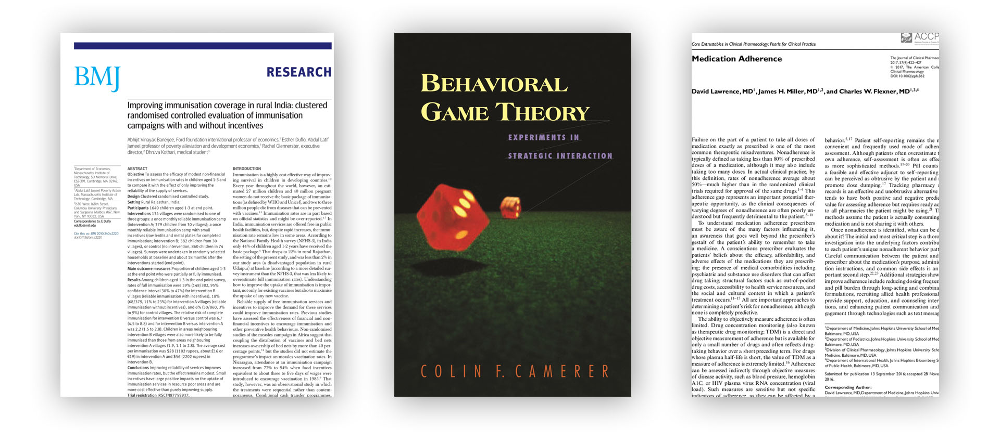

Tads is an undergraduate economist at St John’s College, Cambridge and current Director of the Cambridge Development Initiative. His dissertation looks at how behavioural economics can help explain patterns in gym membership.

We begin by discussing what economics assumes by rationality and how behavioural economics shows this may not be realistic. We then discuss the seminal paper by Della Vigna & Malmendier on how people are “paying not to go the gym”, how their evidence compares to his own and how he is looking to develop this phenomenon further. We then explore what implications behavioural economics has for public health policy, such as vaccinations and medication adherence, as well as nudges more generally.

## Book Recommendations

Tads Ciecierski-Holmes's book recommendations:

-  *Improving immunisation coverage in rural India* by Banerjee, Duflo, Glennerster, & Kothari
- *[Behavioural Game Theory](https://www.amazon.co.uk/Behavioral-Game-Theory-Experiments-Interaction/dp/0691090394/ref=sr_1_1?keywords=Behavioural+Game+Theory&qid=1579202944&sr=8-1)* by Colin Camerer. You can also see his [Ted Talk](https://www.ted.com/talks/colin_camerer_when_you_re_making_a_deal_what_s_going_on_in_your_brain)
- *[Medication Adherence](https://accp1.onlinelibrary.wiley.com/doi/abs/10.1002/jcph.862)* by Lawrence, Miller, & Flexner

## Rationality and behavioural economics

Behavioural economics began with the work of Daniel Kahneman and Richard Thaler. For general introductions see their respective book "[Thinking Fast and Slow](https://www.amazon.co.uk/Thinking-Fast-Slow-Daniel-Kahneman/dp/0141033576/ref=sr_1_1?keywords=thinking+fast+and+slow&qid=1579183148&sr=8-1)" (2011) and "[Nudge](https://www.amazon.co.uk/Nudge-Improving-Decisions-Health-Happiness/dp/0141040017/ref=pd_aw_sbs_14_1/258-7272145-2954334?_encoding=UTF8&pd_rd_i=0141040017&pd_rd_r=85f58bd5-61f2-4b2c-a3e4-907a1d6bbea0&pd_rd_w=qXGS3&pd_rd_wg=t6Q6T&pf_rd_p=0208d703-a674-4413-8899-c3889837d212&pf_rd_r=ANA91KCFAG4KZ629RWZH&psc=1&refRID=ANA91KCFAG4KZ629RWZH)" (2009). An excellent online resource can be found online [here](https://www.behavioraleconomics.com/resources/introduction-behavioral-economics/).

[03:20] When discussing how people may behave irrationally it is important to understand what economists mean by 'rationality' in the first place. A simple guide to this is produced by the Ecnmy project [here](https://www.ecnmy.org/learn/you/choices-behavior/what-is-rationality/), a more advanced discussion can be found in Hammond's (1997) article "[Rationality in Economics](https://web.stanford.edu/~hammond/ratEcon.pdf)".

> **Rationality, for economists, simply means that when you make a choice, you will choose the thing you like best**. This is very different from the way we normally think about rationality. Usually, when we talk about rationality we use it to mean sensible, or reasonable. **To economists—as long as you’re doing what you want given your situation, you’re acting rationally.**
>
> — Ecnmy.org

If an agent is rational we can write this as a utility function to be maximized: $max*{x \in X} \sum*{s \in S} \pi(s)U(x|s)$.

[06:55] Rabin (2002) [identifies](https://www.sciencedirect.com/science/article/pii/S0014292101002070) three broad criticisms that behavioural economics makes to this traditional approach:

- People may be maximizing according to non-standard utility (i.e. preferences)
- People may be according to non standard beliefs about the future $p(s) \neq \pi(s)$
- People may be making non-standard decisions, and so not maximizing their utility at all

[11:50] In our discussion we also touch upon the famous 'Dunning-Kruger' effect, which states that "those people who are least competent at a task often incorrectly rate themselves as high-performers because they are too ignorant to know otherwise." For more information on this, [DecisionLab](https://thedecisionlab.com/biases/dunning-kruger-effect) is a great online resource.

## Hitting the gym

[15:00] Our discussion is framed around Della Vigna & Malmendier's (2006) paper "Paying not to go to the gym". We look at four trends they find that do not fit the 'rational' homo economicus predictions:

- The average price per attendance was higher than day pass prices, implying people are spending unnecessarily much
- Cancellation lags (between last attendance and quitting) were, on average, 2.31 months, further implying people are spending unnecessarily much
- Forecasted attendance was double actual attendance, showing people have false beliefs
- Average attendance over time falls, suggesting that those who chose not to quit were those who are getting the least value out of their membership

[22:30] two proposed theories attempt to explain this irrational behaviour. The first is that people have non-standard beliefs and consistently underestimate how much they will use the gym. The second is that people initially underestimate how difficult it is to cancel membership, as in the US this is purposefully so and people have to do so in person.

[27:07] We briefly go on a tangent about the difference between natural experiments, randomised controlled trials, and lab experiments. The latter offers several benefits but also challenges, such as the [Hawthorne Effect](https://dictionary.apa.org/hawthorne-effect), the [John Henry effect](https://dictionary.apa.org/john-henry-effect), and relying on [WEIRD](https://www.apa.org/monitor/2010/05/weird) participants.

[32:58] Tads own research attempts to see if these findings are replicable using a larger sample from a US gym chain and the Caltech gym. Doing so he finds that Della Vigna & Malmendier were indeed correct:

- 38% of participants paid more in membership fees than they would have had they switched to day-passes.
- Average cancellation lags were even higher, lasting 3.17 months and costing $142.
- The average (mean and median) realised gym attendance is approximately half expected.
- Gym members average attendance falls over time.
- Additionally, Tads finds that price per average attendance and cancellation lags are positively correlated.

[43:12] The next step is identifying whether we can explain what differentiates sophisticated agents from those who are 'naive'. [As this is still a work-in-progress we will try to upload his dissertation once completed/published. Until then please see his presentation for more details!]

## Implications for public health policy.

[47:37] There are many lessons that public health can take from behavioural economics. For an example related to vaccinations see [Milkman et al (2011)](https://www.pnas.org/content/108/26/10415.short); for a more critical take see [Loewenstein (2012)](https://www.bmj.com/content/344/bmj.e3482.short?casa_token=t6gp_Blv9l4AAAAA:5nCAt2X8aLw9zZ9gF3cOMZzRjBKiWYaHST00Q64OWkOn40y-AOgcATMWPnDxz4yMu0bkcVf1XDgL)

[52:25] Some people have argued that by making drugs/treatments free people will go on to undervalue them. However, much research has shown this not to be the case. For an article see J-PAL's [website](https://www.povertyactionlab.org/case-study/preventing-malaria-free-insecticide-treated-bednets); for the original academic article see Cohen & Dupas' (2010) "[Free distribution or cost-sharing?](https://www.povertyactionlab.org/evaluation/free-distribution-or-cost-sharing-evidence-malaria-prevention-experiment-kenya)"

[53:25] Many public policies have unintended consequences. For example, Gneezy & Rustichini (2000) find that people treat "[A Fine is a Price](https://www.journals.uchicago.edu/doi/abs/10.1086/468061)"

> Parents used to arrive late to collect their children, forcing a teacher to stay after closing time. We introduced a monetary fine for late‐coming parents. As a result, the number of late‐coming parents increased significantly. 
>
> — "A Fine is a Price" by Gneezy & Rustichini (2000)

_ _ _

**References** (In Order)

- Kahneman, D. (2011). Thinking, fast and slow. Macmillan.
- Thaler, R. H., & Sunstein, C. R. (2009). Nudge: Improving decisions about health, wealth, and happiness. Penguin.
- Hammond, P. J. (1997). Rationality in economics. Rivista internazionale di scienze sociali, 105(3), 247-288.
- Rabin, M. (2002). A perspective on psychology and economics. European economic review, 46 (4-5), 657-685.
- DellaVigna, S., & Malmendier, U. (2006). Paying not to go to the gym. *American economic Review*, *96*(3), 694-719.
- Milkman, K. L., Beshears, J., Choi, J. J., Laibson, D., & Madrian, B. C. (2011). Using implementation intentions prompts to enhance influenza vaccination rates. Proceedings of the National Academy of Sciences, 108(26), 10415-10420.
- Loewenstein George, Asch David A, Friedman Joelle Y, Melichar Lori A, Volpp Kevin G. Can behavioural economics make us healthier? BMJ 2012; 344 :e3482
- Cohen, J., & Dupas, P. (2010). Free distribution or cost-sharing? Evidence from a randomized malaria prevention experiment. Quarterly journal of Economics, 125(1), 1.
- Gneezy, U., & Rustichini, A. (2000). A fine is a price. The Journal of Legal Studies, 29(1), 1-17.