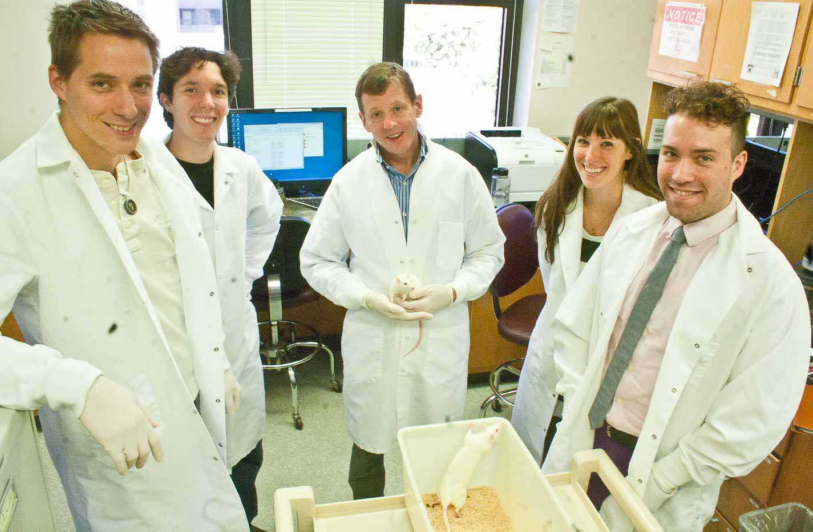
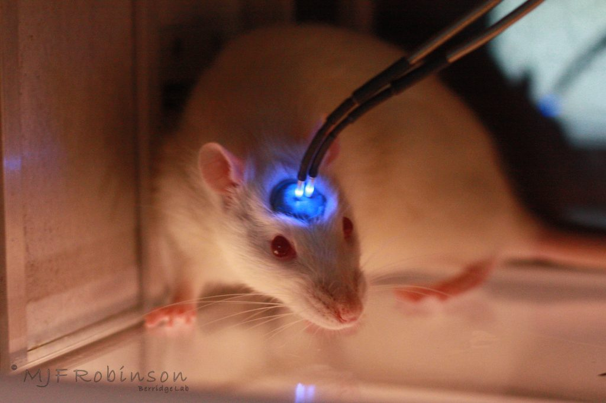
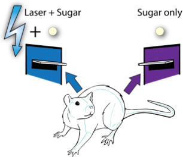
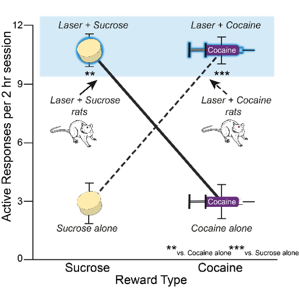
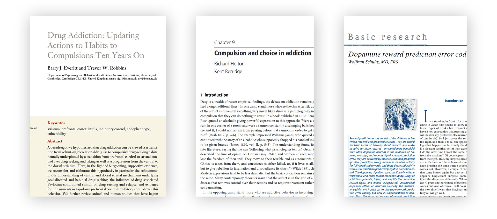

Kent Berridge is a distinguished professor of psychology and neuroscience at the university of Michigan and the joint recipient of the 2019 [Grawemeyer Award for psychology](http://grawemeyer.org/theory-explaining-addiction-wins-grawemeyer-psychology-award/). Through experiments on rodents, his research addresses questions about how pleasure is generated in the brain, the relation of fear to desire, and what causes addiction.

We begin by discussing the ‘prediction error’ theory of associative learning, and the role of dopamine between pleasure and wanting. Kent introduces his ‘incentive salience’ theory of addiction, and we consider the role of pleasure. Then we hear about Kent’s recent experimental results involving *shining lasers into the brains of rats on cocaine*. Kent and his team have apparently found a way of making rats become addicted to electric shocks. We discuss the implications for our view of human addiction, and if the results suggest new kinds of treatment. Finally, Kent reflects on how he has changed his mind during his career.

## Prediction error

Prediction error is a simple kind of ‘Pavlovian’ or ‘classical’ conditioning. It is a way humans and animals come to associate stimuli with outcomes. These can be positive (appetitive) or negative (aversive) reactions: for instance an organism might learn to approach the smell of nice food, or feel nauseous and disgusted by the smell of rotting food. A cue or *stimulus* signals some outcome. When they are new, the stimuli often start with neutral relevance. Learning requires that the occurrence of the outcome is unexpected or surprising. With each pairing of the cue and its outcome, expectation of the outcome increases and surprise decreases. Take Pavlov’s dogs as an example. When they first heard the bell before their food arrived, they did not associate the sound of the bell with food, so the bell was not useful for predicting the onset of food. The arrival of food was therefore surprising (assuming it was not dinner time!) and the dogs had failed to predict it. Eventually, the bell is associated with food and the dogs become less and less surprised when food arrives after the bell is rung. When previously the dogs salivated when the food arrived, *now* they salivate when they hear the bell. It’s as if the bell itself has the same significance of the arrival of food. This whole process is modeled by the [Rescorla-Wagner rule](http://www.scholarpedia.org/article/Rescorla-Wagner_model).

Don’t worry if this is too complicated: the key idea is that neutral cues are gradually associated with an outcome over time. The prediction error is the difference between the actual and predicted outcomes. Pavolv’s dogs didn’t have to do anything to receive their food; but this applies equally to cases where animals learn some behaviour which gets a reward. For instance, a mouse might discover which button releases a sugar pill, and repeatedly press it. Dopamine fits into this story because it signals reward prediction errors: dopamine neurons are activated (at least in humans, monkeys, and rodents) when the organism receives more reward than predicted. In short, dopamine helps us learn to strongly associate cues with rewards. Ideally, that provides ‘motivational oomph’ to get us to seek out those things we desire. It’s useful, for instance, to learn to strongly desire sugary foods in an evolutionary environment in which they are scarce.

Drugs like alcohol, amphetamines, and alcohol “seem to hijack the neuronal systems that have evolved for processing natural rewards” (Schulz). This is because they artificially stimulate a release of dopamine just like in cases of genuine, useful reward prediction error learning. Schulz continues, “this stimulation is not limited by the sensory receptors that  process the environmental information, because the drugs act directly on the brain”. 

That, at least, was the story before Kent Berridge and his laboratory began to examine the ‘prediction error’ story of dopamine and addiction. Berridge admits - 

> When a reward value is being determined solely by new increments in learning… in that situation, the dopamine neurons follow the temporal difference model beautifully.

However, the first place the story begins to come apart is when the cue being has not been experience before, and doesn’t fit in to an existing ‘model’ of the world. But cues are not always like this; some learning is ‘model-based’. Here’s an experiment Kent mentions: take some Dead Dea salt water, which is three times saltier than normal seawater. Now introduce a rat to two levers. One lever would be paired with a release of sugary water, and it does not take long for the rats to become fixated with activating the sugar water lever. The other lever released salty water. The rats would quickly learn to avoid activating that lever. Now the rats are placed into brain states that mimic the effects of sodium deficiency (salt appetite), such that the salty water would be delicious and good for the rat. The question is, when the rat wakes up in this state, would the rat have to gradually learn to press the salty-water lever more often? The prediction error model says **yes**, because the rats have learned a strong aversive (negative) reaction to the lever which can only be reversed after successive trials. If, for instance, the salty water were replaced by sugar water, the rats would take a few tentative trials before becoming confident that the lever is reliably paired with a good outcome. But that is not what happened: when the rat woke up, it jumped on the salt water lever without any period of relearning. Berridge notes that there’s no way the standard model-free prediction error story can make sense of this.

Previously, it was assumed that the ‘mesolimbic dopamine system’ (and just dopamine in general) was responsible for the experience of pleasure. The story went that substances like sugar or cocaine would trigger a release of dopamine which signaled that *this feels good* and would thereby lead to associative learning through prediction error. But Berridge’s work shows that the mesolimbic dopamine system is in fact associated with *wanting* instead. Dopamine-deprived rats still appear to enjoy the same substances, and elevated dopamine levels do not appear to increase liking. Liking, or pleasure, in fact seems to be associated with a more delicate and distributed series of small ‘hotspots’ in the brain. Berridge describes the process of moving away from this theory in the interview:

> I was absolutely convinced that dopamine was pleasure when I began my career, I loved that hypothesis and we started our experiment intending to add one more little bit of evidence to the conclusion that dopamine was pleasure. It was painful, literally painful, to have results that didn’t fit that. 

## The Incentive Salience theory

Berridge and his colleague Terry Robinson developed an updated theory of addiction called the ‘incentive salience’ theory, which says that the essence of drug addiction is amplification of *wanting* (particularly triggered by drug-related cues) without any necessary amplification of *liking* ([Berridge & Robinson](https://www.ncbi.nlm.nih.gov/pmc/articles/PMC5171207/)). The theory, Berridge says, derives from the psychology of motivation. Most of the thinking in the 60s and earlier said that we are motivated to do things in order to avoid nasty things. This is called *drive reduction*. For instance, we are plausibly motivated to seek out food because hunger is uncomfortable. But this turned out not to be wholly accurate. As Berridge puts it, “the taste of the food is far more motivating than just making hunger go away.” Most of us knows what it feels like to really want to eat some food despite knowing we’re not hungry, and don’t need to eat. Incentive salience says that often the cue is wanted (and liked) *as if it is* the reward.

‘Liking’ here just means actually enjoying something when you get it, while ‘wanting’ means having some reason or motivation to get it. It isn’t immediately obvious that you ever need to draw a distinction between wanting and liking. Don’t we basically always want what we like, and like what we want? Berridge’s theory says otherwise: the key insight is that wanting and liking are often totally separable. In cases of addiction, the incentive salience theory says that addicts experience a ‘hyperactivity’ of wanting in response to drug-related cues. Sometimes this extreme level of wanting is useful: if we were starved of food for days on end, we would begin to obsess and dream of food. But addiction appears to be a case of this system misfiring - Berridge describes it as “a starved want in an unstarved brain”.

It is important to distinguish the wanting of the incentive salience theory from conscious, cognitive wants which you can reason about, visualise, plan around, and so on. Beridge relates the two kinds in the sense that, “The mesolimbic wanting system evolved to give motivational oomph to the things you already want.” The two can occur together, to be sure; but they can also pull in opposite directions. And it is this strange thought that it might be possible to really want something you *know* you won’t like, that Berridge’s recent experiments explore.

## Optogenetics

In the recent series of experiments which he describes in the interview, Berridge and his team used a technique called *optogenetics*. First, a virus is used which carries the gene for opsin photoreceptors. The virus  is then gutted / sterilised so that it can’t reproduce, before being injected into a specific area of the rat’s brain. In Berridge’s case, it was injected into a region of the amygdala. The neurons in the brain with this new gene begin to make photoreceptor (light-sensitive) molecules that twist in light. So now, when wavelengths of light are fired on those neurons, they activate (by transferring certain ions). Finally, that brain region is targeted with a fiber-optic cable attached to a laser. A cap is placed on the open cut-away area of the rat’s head, and the rats are anesthetised during the entire process, so they wake up having experiences no pain. The result is that this very specific region of their brains can effectively be ‘activated’ with millisecond-precision. I think it’s worth pausing to appreciate how amazing that all is!

## Rats, lasers, and electric shocks

Berridge and his team used optogenetic techniques in a recent series of experiments investigating the effects of activating the central amygdala on the **intensity** and **focus** of wanting.

In the first experiment Berridge describes, a mouse is presented with two buttons, both of which release a sugar pill when the mouse nibbles them. For one of the levers, the laser is activated just when the rat nibbles it. The rats became fixated on the lever paired with the laser activation at the total expense of the other lever; even when there was a time delay between successive deliveries of sugar pills which mean the rat could get more sugar pills if it nibbled both levers. When the sugar pills are swapped out for intravenous doses of cocaine.

In the second experiment, one lever was paired with sugar pills and the other with cocaine. Regardless of whether the laser was paired with the cocaine or with the sugar pill, the rats inevitably became fixated on the lever paired with the laser.

The natural explanation for this is just that the laser itself is a kind of reward for the rats -  this would explain the previous two experiments because the laser just acts like *more* reward. But, surprisingly, this is not the case: rats do not just ‘want’ laser. This can just be showed by giving the rats a choice between a lever that releases a sugar pill or cocaine hit, and a lever that activates the laser. In that choice, the rats did not become interested in the laser lever, and always preferred the sugar / cocaine lever.

A very similar explanation is that the laser makes the rats ‘like’ the sugar or cocaine more (remember the wanting / liking distinction). Maybe it’s just really nice to have your amygdala zapped by blue light! But when the rats facial expressions are compared between laser+sugar and sugar alone, we see no significant difference. So that explanation doesn’t seem quite right either. Instead, So somehow the laser is directing the focus of wanting toward whatever reward it is paired with.

Things get even stranger when Berridge and his team paired the laser with frightening or painful targets. This time, the rats were placed in enclosures with a metal rod which delivers a nasty electric shock. When the laser was not paired with the shock, rats would maybe take a couple of nibbles of the rod before very quickly learning not to do so again. But when the laser did activate just when the rats received a shock, the rats became fixated on the rod, just like they were fixated on the levers which delivered sugar or cocaine. Somehow, activating the central amygdala when the rats nibbled the electric shock rod made the rats *want* to do it more. Yet just as in the cases of sugar and cocaine, the laser did not appear to make the rats remotely *like* the shocks any more than normal, or enjoy the laser itself. In other circumstances, the laser activation of the central amygdala increased fear reactions - so its effect seems to depend on the circumstances in ways which are not fully understood.A final curious piece of this story is that when the laser was paired with a *neutral* stimulus, like a dummy rod which did not give electric shocks, the rats did *not* become fixed on it like they did when it *did* give painful shocks. So there is something about the fact that the stimulus has some valence, whether negative or positive, that is necessary for activation of the central amygdala to lead to strong wanting and addictive behaviour. When I described all this to my little sister, she asked me whether a laser like that could make her really want to do her homework. I guess so!

Although the central amygdala is normally associated with fearful responses, in these experiments it has focused the target of appetitive responses - of *wanting* rather than aversion. Why this is the case, and why activating the central amygdala can cause aversive learning to ‘flip’ to appetitive learning, is the mystery that these experiments leave us with.

## Implications for human addiction

Of course, for the most part scientists use experiments on rats because they hope what they learn might transfer in some relevant way to humans. Incidentally, this excellent [Twitter account](https://twitter.com/justsaysinmice) exists solely to call out over-hasty generalisations from rodents to humans.

Broadly speaking, there are two rough view about what goes on in human addiction. This is, necessarily, a gross simplification of the existing views of addiction; but as Berridge writes in a [paper](http://web.mit.edu/holton/www/pubs/abcc.pdf) co-authored with philosopher Richard Holton, “despite  a  wealth  of  recent  empirical  findings,  the  debate  on  addiction  remains  polarized  along traditional  lines.” One camp sees addiction as a kind of disease involving “pathologically intense” compulsions which are near-impossible to resist. For instance, William James quotes an alcoholic saying:

> Were  a  keg  of  rum  in  one  corner  of  a room,  and  were  a cannon constantly  discharging  balls between me  and  it,  I  could not  refrain  from  passing  before  that  cannon  in  order  to  get  at  the rum.

Similarly, Oscar Wilde describes opium addiction in *The Picture of Dorian Gray*:

> Men and women  at  such moments  lose  the  freedom  of  their  will.  they  move  to  their  terrible end  as  automatons  move.  Choice  is  taken  from  them,  and  conscience  is  either  killed,  or, if  it lives at all, lives but to give rebellion its fascination and disobedience its charm.

The other camp sees addiction as a more standard kind of choice based on reasons, desires and beliefs; while being subject to self-control. It might still be true that an addict would experience very painful withdrawal symptoms were they not to continue taking their drug, but they make the decision to do so, roughly speaking, on the basis of considering what would be the best thing to do or what would lead to the best balance of pleasure over pain. Members of this camp point out that addicts respond to incentives in apparently standard ways: Berridge and Holton write “Anesthesiologists  and airline  pilots  who,  having  been  once  detected  in  their  addiction,  are  required  to  pass  random and frequent drug tests on pain of dismissal, are remarkably good at giving up.” Opponents of this view frame it as an all-too-convenient way of blaming addicts for behaviour which is, in truth, beyond their control.

Berridge’s research suggests a kind of middle path between these two views. On one hand, the authors write:

> There  is  good  evidence  that  the  brain  of  an  addict  is  importantly  different  from  that  of  a normal  non-addicted  individual—indeed  there  is  even  some  reason  to  think  that  the  addict’s brain  might  have  started  out  with  a  vulnerability  to  addiction.  Certainly  once  addiction  is under  way,  the  desire for  the  addictive  drug  takes  on  a  life  of its  own,  with  an  intensity  that  is particularly, perhaps uniquely, high… More  surprisingly,  addicts   need  not  even  like  the  thing  that  they  are addicted  to:  they  need gain  no pleasure from it, nor  anticipate  that  they  will. Nor need they be motivated  by  a  desire  to  avoid  the  horrors  of  withdrawal.  Alcohol  or  heroin  addicts  often relapse  long  after  withdrawal  is  over[.]

On the other hand, “[t]he  intensity and power  of an  addictive  desire  does  not  mean that  addicts  are automata, standing  powerless  spectators  as  they are moved by  their desires. For whilst addictive desires are very strong, the human  capacity  for self-control is  also highly  developed;  much  more developed, it seems, than  in  rats.” So addiction is best understood as an extremely powerful desire (‘want’) for a drug that is nonetheless answerable to willpower and self-control. Other views of addiction see drug addiction as a kind of powerful habit that persists despite the addict’s best intentions to quit; or else as developing from the disproportionate amount of pleasure that drugs give. The habit account seems to omit the powerful desires associates with addiction (compare biting your nails with drinking water after being stranded in the desert). The pleasure account has an element of truth - obviously taking drugs is often extremely pleasurable for addicts. But it seems to assume that the mesolimbic dopamine system is associated with *liking* rather than wanting, which Berridge’s research contradicts. Moreover, suppressing the dopamine system does not seem to diminish the pleasure they derive from sweet foods (judging by their facial expressions). Nor do elevated dopamine levels in humans lead to higher subjective ratings of pleasure.

A frightening fact about drug addiction is that an addict can quit, and endure withdrawal symptoms for some length of time before they eventually fade away. Yet even many years later, seeing a drug-related cue can re-ignite long-dormant desires to relapse that apparently come out of left-field and take the addict by surprise. In fact, these urges that develop during the so-called ‘incubation period’ (often during rehab) can be *stronger* than they were originally. Berridge mentions that there is some research that indicates this long-term learned wanting might be reversible in rats, and perhaps one day in humans; but that we shouldn’t hold out for such an outcome in the near future.

## Reading recommendations

1. [Dopamine reward prediction error coding](https://www.ncbi.nlm.nih.gov/pmc/articles/PMC4826767/) by Wolfram Schultz
2. [Drug Addiction: Updating Actions to Habits to Compulsions](https://www.ncbi.nlm.nih.gov/pubmed/16251991) by Barry J. Everitt and Trevor W. Robbins (plus its [follow-up](https://www.ncbi.nlm.nih.gov/pubmed/26253543)).
3. [Compulsion and choice in addiction](https://lsa.umich.edu/psych/research&labs/berridge/publications/2017%20Holton%20&%20Berridge%20Compulsions%20&%20choice%20in%20addiction%20chapt.pdf) by Kent Berridge and Richard Holton
4. [Liking, Wanting and the Incentive-Sensitization Theory of Addiction](https://www.ncbi.nlm.nih.gov/pmc/articles/PMC5171207/) by Terry Robinson

[Click here](https://lsa.umich.edu/psych/research&labs/berridge/research/affectiveneuroscience.html) for a big list of Professor Berridge’s publications, plus photos and brief explanations. [Click here](https://sites.lsa.umich.edu/berridge-lab/) for the Berridge Lab website, with some cool photos of the experiments.

*This article does not necessarily accurately represent the present views of the guest.*