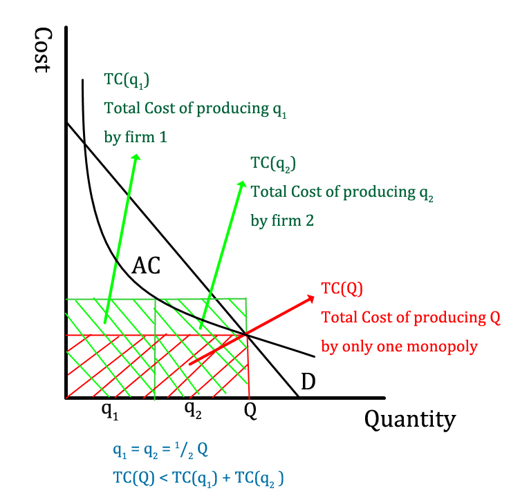
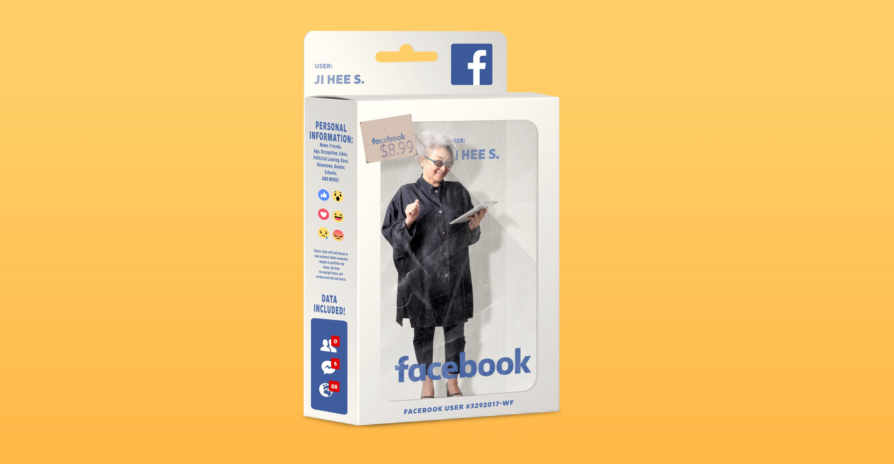

Professor Diane Coyle co-directs the Bennett Institute for Public Policy in Cambridge and was previously Professor of Economics at the University of Manchester. She is the author of more than 15 books and runs the popular [Enlightened Economics](http://enlightenmenteconomics.com/) blog.

We begin by discussing how tech giants are different from previous big monopolies and how economics attempts to explain this. This helps inform us of the challenges that regulators face and why simply "breaking them up" is not as easy as it sounds. We also take a critical look at some of the arguments made in defense of digital monopolies and what we still do not know.

We also go on some interesting tangents, such as the idea of companies creating consumer 'wants' through advertisement and manipulation.

## Book Recommendations

Professor Diane Coyle's book recommendations:

- "[Market, State and People](https://www.amazon.co.uk/gp/product/0691179263/ref=dbs_a_def_rwt_bibl_vppi_i0)" by Diane Coyle
- "[The Great Reversal](https://www.amazon.co.uk/Great-Reversal-Thomas-Philippon/dp/0674237544/ref=sr_1_1?keywords=the+great+reversal&qid=1582302104&s=books&sr=1-1)" by Thomas Philippon
- "[Goliath](https://www.amazon.co.uk/Goliath-100-year-Between-Monopoly-Populism/dp/1508292620)" by Matt Stoller

## Tech giants are not 'traditional' monopolies

### Motivation

The economy, government, and society have all "been turned upside down by digital technology and global business" as Professor Coyle notes in her book '[The Weightless World](https://mitpress.mit.edu/books/weightless-world)'. The following graph by [Our World In Data](https://ourworldindata.org/internet) shows just how rapid this change has been. 

<iframe src="https://ourworldindata.org/grapher/technology-adoption-by-households-in-the-united-states?time=1930..2019&country=Automobile+Cellular%20phone+Colour%20TV+Computer+Ebook%20reader+Internet+Podcasting+Radio+Smartphone%20usage+Social%20media%20usage+Tablet" style="width: 100%; height: 600px; border: 0px none;"></iframe>

An incredibly pertinent feature of this 'tech ecosystem' is that it has been dominated by five companies: Apple, Alphabet (a.k.a. Google), Microsoft, Facebook and Amazon. [In 2017](https://www.bloomberg.com/opinion/articles/2017-11-15/the-big-five-could-destroy-the-tech-ecosystem) they collectively had a combined valuation of $3.3 trillion or 40% of the NASDAQ-100 Index. Whilst 'big businesses' or monopolies are nothing new in of themselves (see [Jeff Desjardins](https://www.visualcapitalist.com/chart-evolution-standard-oil/)' visual history of Standard Oil) there are several notable features inherent in 'digital' that forces us to re-evaluate our traditional economic toolkit to deal with them. To better define our scope we are particularly focusing on what are known as "multi-sided digital platforms".

### Superstar firms

One explanation proposed as to why digital platforms tend to be dominated by monopolies is that such markets exhibit 'superstar' features. This term was originally proposed by [Rosen (1981)](https://www.jstor.org/stable/1803469?seq=2#metadata_info_tab_contents) to describe why so few 'superstars' exist in music, comedy, and acting markets but equally applies to the digital world today. Some examples of such features are as follows:

- **High fixed costs** with **zero marginal costs**. That is whilst setting up a digital platform is expensive for a firm to do, once this has been done the cost of adding one more user is essentially free. This creates 'increasing returns to scale' whereby firms are more competitive (i.e. can charge a lower price to consumers) when they are free and we get the classic 'natural monopoly' scenario.

- **Network Effects**. With digital platforms, there is an inherent want for a single, large platform where we match all buyers and sellers. For example, if I am looking to rent out my apartment I want to use the platform with the most customers; if I am looking to rent an apartment I want to use the platform with the most buyers. This is especially pertinent when supply and demand are heterogeneous. Likewise, I want to use the social media platform that has most of my friends on it. Hence there is a tendency to have a single platform (e.g. AirBnB or Facebook) and we get what is known as a *"winner takes all"* market.
- **Experience Goods**. When choosing a product consumers rely heavily on 'word of mouth' recommendations and established reputations. Thus we converge to those firms with an early established customer base even if they do not offer the best service.
- **Data Loop**. When digital platforms have more users they have more data available, which they can use to improve their service, which acquires more customers etc. This thus heavily favours the incumbent as barriers to entry high. Similar arguments can be made with Research & Development more generally.

What is interesting is that we have a much stronger tendency to form monopolies than normal. Critically, this is not just because of the cost structure but also because consumers want larger companies!

For a more advanced model of 'superstar firms' and its macroeconomic implications see [Autor et al (2019)](https://economics.mit.edu/files/12979) or their brief [video summary](https://www.youtube.com/watch?time_continue=138&v=PW4dPJzj3cU&feature=emb_title).

### Pricing

In traditional economics, we model perfect competition where firms charge a price equal to the 'marginal cost' and thus makes zero profit. A monopoly uses its market power to charge more and thus makes super-normal profits. (For a basic explanation, [Jacob Clifford](https://www.youtube.com/watch?v=ZiuBWSFlfoU) and [Khan Academy](https://www.youtube.com/watch?v=PEFEnss--mU) are useful resources).

However, this framework does not translate easily in the case of digital monopolies. We as consumers pay very little or anything at all for most of these services: Facebook and YouTube are completely free; Uber and Amazon are much cheaper than 'traditional' alternatives. Thus the fear of monopolies raising prices does not appear to be a real concern. As noted by [Coyle (2018)](https://www.bennettinstitute.cam.ac.uk/media/uploads/files/Practical_competition_policy_tools_for_digital_platforms.pdf), "when the consumer-side price is zero, as on many platforms, all the direct competitive pressure is exerted through service quality and innovative features" from which consumers stand to benefit tremendously. Consider the several following intangible benefits: 

- Increased variety and discovery benefits (e.g. Spotify)
- Intense use of idle assets (e.g. Airbnb and Uber)
- Highly differentiated and specialized to individuals (e.g. everyone's Facebook newsfeed is tailored to them)

We thus require a different explanation for digital monopolies and pricing.

> Photo illustration by Natalie Matthews-Ramo/Slate. Photos by Thinkstock

In the world of advertisement, one answer to this problem is that we are not the customers. To quote [Schoolman & Serra (1973)](https://www.youtube.com/watch?v=LvZYwaQlJsg) in their short film 'Television Delivers People' "It is the consumer who is consumed [...] You are the end product." As per this notion, it is our attention-span (or personal data) that is being sold. For a critical long-read about this idea see [Oremus (2018)](https://slate.com/technology/2018/04/are-you-really-facebooks-product-the-history-of-a-dangerous-idea.html) in Slate Magazine.

Economic provides a perhaps more nuanced explanation through the notion of two-sided markets. For example, Facebook users and advertisers are two different sides of the social media platform market. We have a double coincidence of wants that Facebook helps to facilitate: Users want to connect to their friends and are willing to look at adverts; Advertisers want to show users their products and are willing to pay for a platform to do so. Critically, one side of the market will be more likely to switch (i.e. users are more likely to switch than advertisers) and can thus be made to 'subsidise' the other. [Coyle (2018)](https://www.bennettinstitute.cam.ac.uk/media/uploads/files/Practical_competition_policy_tools_for_digital_platforms.pdf) notes that hence the "price on each side of the market will not be reflective of marginal cost on that side, as the price structure and level will be set separately. "

## In defense of digital monopolies

### Antitrust Paradox

[Bork (1978)](https://www.amazon.co.uk/Antitrust-Paradox-Policy-War-Itself/dp/0029044561) notes in his book 'The Antitrust Paradox' that it is mistaken to view monopolies as bad in of themselves. Instead, we should only be concerned if they harm economic efficiency, that is if they hurt consumer welfare and/or prevent competitive innovation. This is important because legal intervention itself can have several unintended consequences. For example, California's AB5 statue, which was motivated to force Uber to treat drivers as employees, caused [severe redundancies](https://www.latimes.com/business/story/2019-12-17/vox-media-cuts-hundreds-freelancers-ab5) in freelance journalism.

In our context of digital monopolies, we have already touched upon at least two reasons why digital monopolies do not harm consumer welfare: (1) Consumers depend on large scale monopolies to gain network effects; (2) Prices are already low/free whilst there numerous intangible benefits appear to exist.

### Sleepless Monopolies

One defense made in favour of digital monopolies being exempt from regulation is that they do face competition, just not in the traditional way.

#### Competition for the market

[Evans (2017)](https://papers.ssrn.com/sol3/papers.cfm?abstract_id=3009438) argues that whilst we may not have competition *in* the market the fact that we have competition *for* the market means that monopolies cannot afford to be complacent. For example, just like how Facebook was able to topple the then-dominant monopoly MySpace, Facebook now fears a new market entrant may replace it in the future. It must thus stay at the forefront of disruptive innovation, which is dynamic and unpredictable, and treat its users fairly. Evans writes, "the palpable threat of displacement prevents online platforms from taking their customers for granted."

#### Oligopolistic competition

Another argument that digital monopolies still face competitive pressures is made by Hal Varian, the chief economist at Google. In his [2018 lecture](https://www.youtube.com/watch?v=t5nxrxkXYM4), he states:

> "If we take the big internet companies (Amazon, Apple, Google, Facebook, and Microsoft), they have an unusual industrial structure in that each company has its own area of expertise where it's got a competitive advantage. But at the same time, they are competing quite intensely with the other companies. [...] They are all providing online advertising, [...] operating systems, [...] or browsers [...]. You see this incredible competition among these companies across the company boundaries because the information technology is so flexible. [...] And the great thing is it's not just the big companies competing against each other [as Venture Capital funding is robust]. 

Intense competitive pressures thus still exist but are exhibited between a few key players rather than the traditional large number of small players.

### Monopoly profits pay off investments

Another defence is that whilst digital monopolies do indeed make supernormal profits, these are justified as they are necessary to pay off prior investments. Many digital platforms, whilst holding dominant market positions, are currently not profitable as they sacrifice financials for continued growth. Such behaviour is indeed incentivized by the previously mentioned 'winner takes all' dynamics. 

[Investopedia](https://www.investopedia.com/insights/how-netflix-makes-money/) notes that "Netflix has posted negative cash flow since 2011 due largely to the company's strategy of spending heavily to finance growth, including the production of original entertainment.". Likewise, [Forbes](https://www.forbes.com/sites/bizcarson/2019/11/04/uber-q3-earnings-revenue-beat-lost-another-billion/#40d069c1306a) reports that Uber lost over a billion dollars a quarter whilst still being worth more than $50bn.

Hence, with digital monopolies being unprofitable for such long period of times, it makes sense that they go on to earn monopoly rents for some time to pay off their debts and reward investors who took on a significant amount of risk.

## Other reasons for concern

### Envelopment

One reason why digital monopolies have been viewed as particularly problematic is that they are increasingly not just dominant in their market but can use their position to 'creep' into other markets as well.

[Eisenmann et al (2010)](https://papers.ssrn.com/sol3/papers.cfm?abstract_id=1496336) describe this as 'platform envelopment': "A provider in one platform market can enter another platform market, combining its own functionality with the target’s in a multi-platform bundle that leverages shared user relationships". For example, Google is using its established user base and technology in search engines to promote other services, such as Docs.

[Amelio & Jullien (2012)](https://econpapers.repec.org/article/eeeindorg/v_3a30_3ay_3a2012_3ai_3a5_3ap_3a436-446.htm) note that a similarly "bundling or tying of services in order to cross-subsidise between different groups of users when they are unable to set a negative price to subsidize one side directly". For example, Uber may use its profitable ride-hailing service to implicitly subsidize its unprofitable food delivery business until it has fended off a competition there.

Alternatively, digital monopolies can also use their wealth to buy out potential rivals. Recently the Federal Trade Commission has announced it will retrospectively review several acquisitions, such as Facebook buying Instagram. Two contrasting views of this are presented by the [New York Times](https://www.nytimes.com/2020/02/11/technology/ftc-tech-giants-acquisitions.html) and the [American Action Forum](https://www.americanactionforum.org/insight/understanding-the-latest-big-tech-antitrust-investigation-news/). 

[Coyle (2018)](https://www.bennettinstitute.cam.ac.uk/media/uploads/files/Practical_competition_policy_tools_for_digital_platforms.pdf) writes, "this may build barriers to entry in the ‘enveloped’ markets. For it will become harder for smaller platforms, without so many groups on board, to match the prices or services of the bigger incumbent able to take advantage of cross-subsidies." Tolerating digital monopolies in one market may thus threaten competition more broadly.

### Lobbying Power

In terms of Political Economy, it is also important to note that allowing digital monopolies to earn supernormal profits can allow them to exert lobbying power that may skew the 'rules of the game'. The New York Times notes "[Tech Giants Amass a Lobbying Army for an Epic Washington Battle](https://www.nytimes.com/2019/06/05/us/politics/amazon-apple-facebook-google-lobbying.html)".

### Consumer Exploitation

#### Price Discrimination

One concern is that companies may use the personal data they acquire from customers via digital platforms to charge more 'personalised' prices and/or products to consumers with different histories. Note that this concern is not exclusive to digital monopolies (in fact, as mentioned platforms are generally free/cheap for customers) but relevant to future business more generally. For a more in-depth discussion of this threat see the OECD's [resources](https://www.oecd.org/competition/personalised-pricing-in-the-digital-era.htm) on the topic.

### Manipulation

Economics often assumes that consumers have ‘fixed preferences’ over time. Sometimes this is a functional first approximation, but critics point out that it misses a key effect of many new technologies and industries: the fact that they *change* and *create* preferences. After all, very few people wanted the services offered by the major tech companies which now enjoy a combined market cap of more than 3 trillion dollars. “If I had asked people what they wanted”, Henry Ford supposedly once remarked, “they would have said faster horses”. Maybe it wasn’t such a bad thing to create a new ‘want’ for the automobile; but some critics have warned against the powerful and pernicious influence of tech platforms in manipulating preferences and making people more predictable. The philosopher Shoshana Zuboff has argued that modern tech companies are spawning a worrying new offshoot of ‘surveillance capitalism’ which trades on predictions about human behaviour:

> Surveillance capitalism unilaterally claims human experience as free raw material for  translation into behavioural data. Although some of these data are  applied to service improvement, the rest are declared as a proprietary *behavioural surplus*, fed into advanced manufacturing processes known as ‘machine intelligence’, and fabricated into *prediction products* that anticipate what you will do now, soon, and later. Finally, these  prediction products are traded in a new kind of marketplace that I call *behavioural futures markets*. Surveillance capitalists have grown immensely wealthy from these  trading operations, for many companies are willing to lay bets on our  future behaviour.
>
> — [The Age of Surveillance Capitalism](https://www.goodreads.com/book/show/26195941-the-age-of-surveillance-capitalism?from_search=true&qid=aT1K8vP3mG&rank=1)

So the worry about manipulation comes down to a trade-of between the benefits of more effective prediction capabilities (better book or film recommendations on Amazon or Netflix) and the risk of making people themselves more predictable. What do you think?

---

If you want to read more about this topic, check out the recommended reading at the top of the page, and Diane’s blog [The Enlightened Economist](http://www.enlightenmenteconomics.com/blog/).

