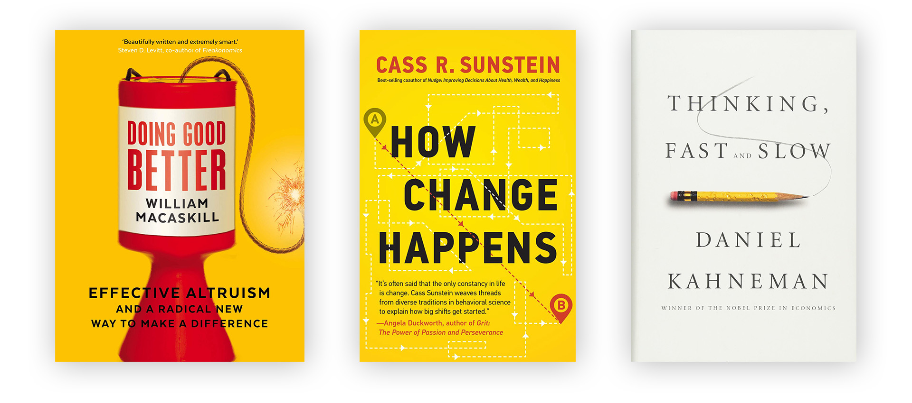
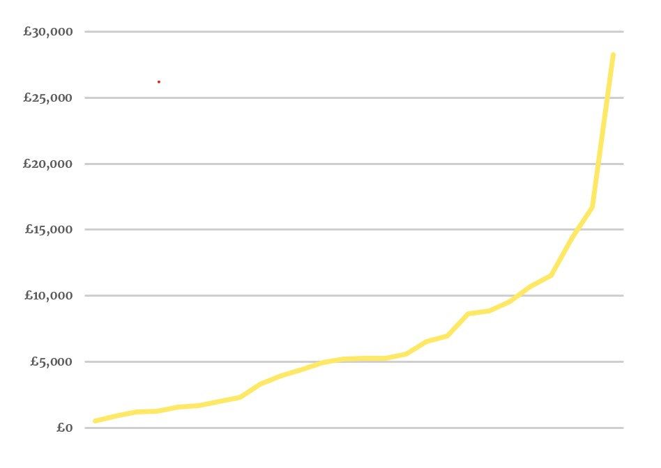
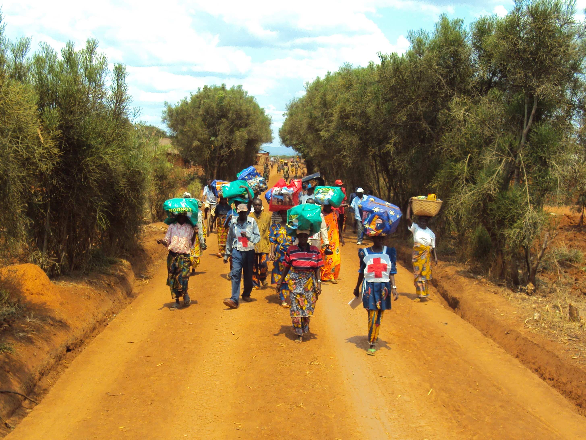

George Rosenfeld is a student of HSPS at the University of Cambridge, and the founder of [May Week Alternative](http://mayweekalternative.org.uk/), an initiative encouraging students to celebrate the post-exam period by donating a significant amount of money to charity. After the donations period, they host a summer party to mark their collective impact.

This was our longest episode so far, and we cover a lot of ground. If you’re interested in starting a charitable movement, or in how to use your career or time to do more good, then I hope you’ll find this especially useful. We talk about George’s inspiration for starting May Week Alternative, and what he has learned about growing and sustaining a student-based charity. We discuss the psychology of what gets people to join the movement and donate their own money, and the myths and misperceptions surrounding what it means to have a positive impact, and the most credible ways to do so. And a lot more besides.

## Book Recommendations

- *[Doing Good Better](https://www.goodreads.com/book/show/23398748-doing-good-better?from_search=true&qid=frfMyj9ENv&rank=2)* by Will MacAskill
- Cass Sunstein discusses *[How Change Happens](https://80000hours.org/podcast/episodes/cass-sunstein-how-change-happens/)* on the [80,000 Hours Podcast](https://80000hours.org/podcast/)
- *[Thinking, Fast and Slow](https://www.goodreads.com/book/show/11468377-thinking-fast-and-slow)* by Daniel Kahneman

## What is May Week Alternative?

The post-exam period in the University of Cambridge is called ‘May Week’. Confusingly, May Week takes place over June. It is a time to relax and enjoy student life minus the stress of studying. It is also the time to attend extravagant ‘[May Balls](https://en.wikipedia.org/wiki/May_Ball_in_Cambridge)’ - huge and opulent parties known around the world. There are fireworks, unlimited food and drink, glamorous black (or white) tie dress codes, and plenty more. They stretch on until well after sunrise and often end up plastered over [tabloid newspapers](https://www.dailymail.co.uk/news/article-5859681/Britains-brightest-students-celebrate-end-exams-Cambridges-Ball.html) the day after. Tickets cost about £150 (~ $200) on average, and it is often expected that students will attend at least one ball during May Week.

May Week Alternative (MWA) is a student charity initiative which encourages students to put charity at the heart of their May Week in order to make an enormous positive impact and have a great time in the process. They do this by inviting students to make a donation significant to them – roughly the cost of a May Ball ticket if they can afford it – to charity. Almost all donations go to the recommended charity, the [Against Malaria Foundation](https://www.againstmalaria.com/), independently rated as one of the most cost-effective charities in the world. All donations are matched, so that 200% of the money that students give goes directly to charity. MWA then hosts our Summer Party during May Week where everyone who has joined MWA is invited to come and celebrate the end of the exams as well as the impact of their donation.

In under three years, May Week Alternative has raised over £160,000 and protected about 180,000 people from malaria. That’s many times the number of people you are likely to meet in your entire life. [Here’s](https://youtu.be/nefUw0xT75Y) a short video I made introducing MWA.

### Origins

George explains how he got the idea for MWA while attending a lecture by Rob Mather, the founder and CEO of the Against Malaria Foundation. Rob explained the work his charity did, and the impact it had on the lives of people living in sub-Saharan Africa. 

> **George: ** I remember thinking that it’s incredible that it’s normalised to spend that amount of money on ourselves. Imagine if we could also use May Week to normalise spending that amount of money on others: to look outside of Cambridge and create the sort of impact Rob was able to create through the Against Malaria Foundation. I was desperate for the talk to finish so I could turn around to the people sitting next to me and say: shall we do this?

## Framing Charity

Most people will be familiar with a trend in how charities, particularly aid or development charities, frame their message in terms of invoking a sense of guilt. The phrase picked up by the media is ‘poverty porn’: where advertising campaigns generate sympathy and donations through bleak and arguable objectifying depictions of poverty. And this approach does work in getting people to donate: as George points out, there is only so much of this kind of depiction of poverty a remotely compassionate person can withstand before feeling compelled to do something. “But that experience of giving through guilt”, argues George, “is a fundamentally negative one”.

But is this the most effective way of getting people to give over the long run? Presumably, the marketing departments for major charities have done their research and concluded that, however negative it might be, inducing feelings of guilt or shame do provoke more spontaneous donations than, for instance, merely presenting the unembellished facts about the extent and severity of an issue, and how they are able to address it. 

### Replacing Guilt

However, this fails to consider the potential long-term effects of portraying charity in terms of guilt. We have much less evidence about this, but it seems likely that people are far less likely to build charitable giving into their sense of identity if it is widely portrayed as something to do out of a sense of obligation. By contrast, would it not be more promising to frame charity as an *opportunity* to do good which is worth celebrating? Here is Nate Soares, from his excellent ‘[Replacing Guilt](http://mindingourway.com/guilt/)’ series.

> [So much] charity is lost from people convincing themselves that their altruistic desires are external obligations and then resenting them. I expect that most people who feel obligated to improve the world only do it because they “should” will become much more effective if they stop forcing themselves.
>
> … most importantly, guilt doesn’t seem like a good long-term motivator: if you want to join the ranks of people saving the world, I would rather join them proudly.

This is the decision George faced in pitching May Week Alternative. On one hand, MWA could appeal to the excess or unnecessary extravagance associated with buying a May Ball ticket. How could you do this, they might argue, when there is still so much easily preventable suffering in the world? How can you justify spending so much money on yourself when it could be spend to make a much larger difference elsewhere?

On the other hand, MWA could appeal to the celebratory atmosphere of May Week. They might appeal to the enormous potential to do good, and “to frame the act of giving as going hand-in-hand with the celebrations of May Week”. George chose this framing; not because the more negative arguments are necessarily bad or erroneous, but because the positive framing is more likely to attract more people initially, motivate those who join to engage with the movement for longer, and to spread ideas about effective charitable giving beyond people’s time at university and into the rest of their lives.

### The power of positive framing

George points out that it is interesting to consider how consumer goods are advertised. Consider a standard advert for a pair of trainers. It’s not going to explain the downsides of heart disease and obesity associated with not exercising, nor is it going to painstakingly explain why this pair of trainers is better than the rest. Rather, the ad will emphasise the positive potential associated with owning that pair of trainers. It might feature a celebrity endorsement. The trainers stand as an an emblem of a broader, aspirational, identity. “This is all common sense in business advertising” says George, but the positive, identity-related approach seems to be less popular for charity campaigns.

Facing up to the severe problems global charities aim to help can often be paralysing, George continues; it is often useful in those cases to present charity as empowering and hopeful.

### Charity as identity

Framing charity in this way encourages people to build the habit of charitable giving into their sense of *identity* in a way which seems far less likely when we are only ever provoked to donate to charity through more negative or guilt-inducing means.

## Student charity

Student charity faces a particularly challenging task in convincing cash-strapped young people to part with their money. Because of this, George notes, it seems to fall into one of two models:

1. **Transactional**: donations are framed as benevolent purchases, in exchange for something. A clear example is a bake sale or raffle; but charity balls and events work in a similar way, by marking up ticket prices by 40% or so above the cost of running the event.
2. **Imperceptible**: the idea here is to minimise the sense of having made a significant sacrifice by either embedding donation into routine habits, or by making them negligibly small, or by framing them as an ‘after-thought’ in the context of a significant purchase. For instance, some transactions can be [rounded up](https://en.wikipedia.org/wiki/Charity_rounding_up) to the nearest decimal or Pound/Dollar with the excess going to charity. A new app called [Percent](https://wearepercent.com/) lets users raise money for the causes they care about for free, through a scheme where participating retailers contribute a small amount of their purchases. Finally, expensive purchases often come with an option to donate some comparatively small amount of money to charity. After all, what’s some extra change as a fraction of this bigger cost?

Both these models work really well, especially for students typically without significant disposable income. It can barely be a bad thing to make donations to charity which are made to feel transactional or imperceptible if that makes the difference between some and no money going to charity.

George suggests an assumption runs through these methods that students on shoestring budgets are going to be unwilling to part with obviously significant amounts of cash. The two models of student charity, broadly speaking, encourage students to donate because either they’ll get something in return or else the donation will be imperceptible and small. But nobody was asking whether students might actually be happy to give up an amount of money which is palpably significant to them just because of its good effects. To George, that question was “screaming out to be asked”.

By straightforwardly inviting students to freely and deliberately choose to donate a significant amount of money, MWA gives students an opportunity to incorporate charitable giving into their sense of identity. Rather than concealing the subjective sense of making a charitable sacrifice, students can tell themselves and others, “I am the kind of person who freely and deliberately chooses to donate to charity”. If you only give to charity on those instances where you were made to feel sufficiently guilty, or where donating was made to feel sufficiently invisible, then what is your attitude towards charity likely to be over the longer-term course of your life? And if framing charity as an opportunity to make an unforced and positive decision is more likely to cultivate lasting habits, then in addition to being more enjoyable it will also, ultimately, raise more money in the long run.

Making donations positively *perceptible* (i.e. subjectively significant) is also the reason MWA has been able to raise more than £160,000 in just under 3 years from around 500 donors. “The reason we got to that number” notes George, “is not just the number of students, it’s the *average donation*” – over £80 on average. “Even when we had relatively few students on board, we were still raising as much as charities which had thousands of students”

Although this hypothesis about long-term benefits sounds plausible (at least to me), it is still conjecture. As far as I know, there aren’t any good longtitudinal studies on the effects of a) framings of charitable giving or b) the effects of large, early donations on later donation habits. Note that the evidence needs to be longtitudinal (examining the same individuals over time), because it is very likely that marketing departments for charities have already established that more negative framings of charity beat out positive framings in *particular instances*. This is perfectly compatible with the possibility that they lose out, in terms of net donations, to more positive framings over the long run. So we might be stuck in a kind of bad equilibrium. An early indication comes from Hudson et al. (2019), ‘[Making and Unmaking Cosmopolitans: An Experimental Test of the Mediating Role of Emotions in International Development Appeals](https://onlinelibrary.wiley.com/doi/full/10.1111/ssqu.12587)’. The authors find that although negative framings of global poverty do invoke a short-lived sense of guilt which drives spontaneous donations, they also erode potential donors’ senses of hope and cosmopolitanism – which very likely lead to more generous patterns of donation over the long-term.

### Celebrating giving

Something that sets May Week Alternative apart from other charitable initiatives is that it provides an opportunity for donors to literally celebrate their donations together in the Summer Party. It is not often that you get to physically meet the other people who care equally about a cause you care about, and that feature of May Week Alternative has wonderful consequences.

The MWA model breaks from other charitable events in that 100% (or 200% after doubling) of student donations go directly to charity. The party, therefore, is facilitated by volunteer businesses and donations from colleges and other institutions. There is also no pressure or expectation to attend at all. Indeed, George tells us the MWA Summer Party “must be the only event in Cambridge that’s happy with a low percentage of turnout, because it means donors understand what we’re about– that it’s completely within our framework to make that donation and not turn up”. The point is that the act of giving and the party are separated: students are donating money, *not* buying a ticket. George mentions there is something psychologically liberating about this separation – it means there is no pressure whatsoever to enjoy the party. Unlike May Balls, there is no ‘sunk cost’ to justify, which means that people often end up having far more fun than they expected. George told us about one person who said that when you go to a May Ball, you feel like you should be drinking or dancing all night long in order to get your money’s worth; but that with the MWA Summer Party there is no shame in turning up an hour or so late and taking things at your own pace, because you’ve already made your positive impact– you’ve already got your money’s worth. 

A second consequence of this model is that, through fostering a sense of in-person community, donors report feeling a sense of belonging to a shared purpose, and a resolved intent to donate next year. In turn, the hope is that this leads to longer-term charitable attitudes and even encourages members to start their own communities elsewhere: “it’s a chance to create something out of what would normally be a very individual experience.”

## Building a movement

All charitable movements begin as an unrealised idea in somebody’s head. Years later, some of those ideas have raised thousands or even millions in donations and mobilised hundreds of volunteers. What drives that growth? What makes some charities succeed while others struggle to take off? And are the mechanisms behind this kind of growth different from those familiar to the commercial, for-profit sector?

“It is unsurprising that people didn’t say yes at the beginning” George explains. His suggestion was the “opposite” of normalised: there was just no precedent. Year one, then, was about proof of concept. The key to early growth, for George, were [network effects](https://www.investopedia.com/terms/n/network-effect.asp). Firstly, more people involved with the movement means more conversations with people who are not: exposure scales with membership. But that would be no good if nobody was convinced to join.

> In order to get to that first 10, I just needed to find one, and then we both needed to find 4. Once you find that first person, you’re no longer just a crazy person with an idea.

The second network effect is where the number of people already on board improves the likelihood of any additional person joining.

> The idea hasn't changed, but people’s receptiveness to it does. There came a point where all we had to say was ‘look how many other people are doing this!’

For George, this is an example of irrationality. After all, the money goes to the exact same place irrespective of how many people in the group are raising money for it, and has the same expected effects. However, I wonder if there’s more to it than that. Although the donations are explicitly not ‘tickets’ to the Summer Party, it remains true that if more of your peers have donated and plan to go to the party, then joining the movement becomes more attractive; and in turn the donation becomes easier to justify.

There is a large literature on what causes to follow the herd, conform to trends, and buy in to fads. Some of this suggests that fad-following can be less irrational than it seems. For instance, Abhijit Banerjee [suggested a model](https://economics.mit.edu/files/8869) where decision makers (rationally) follow the decisions made before them, because previous decision makers may have information that is important for them. The resulting equilibrium resembles herd behaviour. This may partly explain the ‘legitimacy’ of large numbers: because people are especially likely to be suspicious of charities asking for large amounts of money, so the fact that many of my peers are already involved is likely to mollify my bullshit-detection instincts.

Growth also comes from the track record which successive years leave behind. This year, George is aiming to establish May Week Alternative in Oxford. Although the city is similar in many significant respects to Cambridge, almost nobody in Oxford has heard of May Week Alternative, so there is no ‘legitimacy through numbers’ effect. But MWA were able to use their previous success to establish support for the idea far quicker than they did during year one in Cambridge.

Here’s a quick TED talk illustrating the idea of legitimacy through numbers, and the importance of early joiners:

<iframe width="560" height="315" src="https://www.youtube.com/embed/V74AxCqOTvg" frameborder="0" allow="accelerometer; autoplay; encrypted-media; gyroscope; picture-in-picture" allowfullscreen></iframe>

### The University Setting

Is there something special about the university setting – and the campus university in particular? On one hand, lots of like-minded students are living in close proximity, so there’s more opportunity to share enthusiasm for an idea like May Week Alternative. On the other hand, students are only here for 3–4 years. That means a high turnover of already invested students, and a new batch of uninitiated ones every year.

George says that the first thing to notice is the ‘bubble’-like social environment of a university, which makes it much easier to hit a ‘critical mass’ of interested students. The high turnover may also play to their advantage, with students graduating this year who have known MWA since their first year. What George noticed is that you’re sometimes able to reach a critical mass within certain groups or segments of Cambridge life before the idea has caught on more widely, because the university is divided up into clubs, societies, friendship groups, and colleges.

### Anchoring Effects

In a now famous experiment, social scientists Dan Ariely et al. asked students to write down the last two digits of their Social Security number (which are distributed randomly from 00–99). They then offered to sell various consumer products (wine bottles, books, etc) to students for an amount equal to those digits. They were then asked to state the most they would pay for them. The students with the top 80% of social security digits (80–99) were on average willing to pay about **three times** as much for the very same products compared to those with the lowest 20%. In this way, the students’ valuations were anchored to information which shouldn’t (rationally) influence them. There are countless examples of how anchoring is used in [business and marketing](http://www.singulariteam.com/TheAnchoringEffect.html), but it is also used to good effect [in charity](https://www.thirdsector.co.uk/richard-shotton-tips-behavioural-science/communications/article/1462303). Consider the familiar sight on online donation portals of ‘recommended’ donations, which are often (presumably) much higher than the average donation – though over time average donations too become higher as a result.

For May Week Alternative, the existing culture of paying a large amount of money on May Balls provides the perfect anchor for a recommended donation. In drawing a clear parity between the $\approx$£150 that students are happy to spend on themselves, and the suggested donation to the Against Malaria Foundation, the average donation size is (very likely) increased compared to the counterfactual where MWA just ask for ‘a significant amount’ or just ‘as much as you feel comfortable’. There is also a kind of social anchoring at play on the donations page, where (despite the option for anonymity) most donation amounts and names of donors are publicly visible. 

Interestingly but tangentially, anchoring *low* can also increase average donations. Social scientists [Robert Cialdini and David Schroeder](https://www.researchgate.net/publication/232512497_Increasing_Compliance_by_Legitimizing_Paltry_Contributions_When_Even_a_Penny_Helps) recruited researchers to pose as door-to-door fundraisers in a suburban area. A control group told residents, “I am collecting money for the American Cancer Society. Would you be willing to help by giving a donation?”. The experimental group simply added, “Even a penny will help.” That tiny addition led to a increase in the number of people who contributed from 29% to 50%, while also making *no* difference in the size of contribution.

### Deadlines

Students love to hate deadlines. So the idea of putting a deadline on the donation period seems strange. Surprisingly, imposing a deadline has actually proved to be an effective way of encouraging more donations. Why is that? For starters, many students hear about MWA (or something like it) and decide it sounds like a nice idea, and maybe they’ll get round to doing something about it when they get a free moment. The deadline *forces* a decision from indecision. It turns a ‘maybe one day’ to a ‘definitely either now or never’. That can have a powerful effect of resolving a vague intention into a concrete action. Another effect of the deadline is that it provides a time to focus efforts on galvanising actual donations, which in turn frees up the rest of the year for discussing the MWA idea and building positive associations without the pressure or scary ask associated with of constantly ‘selling’ it.

For proof students leave donations as close to the deadline as they do essays, the graph below depicts total donations over the month leading up to the 2019 deadline.

However, there’s also a real tension with the idea of imposing a donation deadline. Because although it may  encourage lots of donations close to the deadline, we also have to consider the social effects already discussed: the fact that people are more likely to donate once other people have (conspicuously) donated. How do you generate those social snowball effects without the initial lump of snow? And how can you capitalise on the momentum of big, fast snowballs if they grow at an agonising crawl before abruptly hurtling into the deadline (see graph)? Of course, MWA could just explain this problem and encourage people to donate earlier. But that’s unlikely to work on a mass scale without real incentives. The solution MWA came up with this year was offering to **triple** donations within the first 10 days of donations. This proved to be hugely successful, with more than double the number of individual donors and more total donations in those first 10 days alone than the entire previous year. The main benefit, however, was that the period after tripling ended but *before* the donation deadline now increased the likelihood that those who might not otherwise have joined to more seriously consider doing so, based on the new legitimacy-through-numbers of those who donated *during* tripling.

## Changing Attitudes

I asked George at this stage what kinds of questions he would like to answer in the next couple of years of working with MWA. In its nascent stages, MWA relied on in-person conversations with a team of volunteer reps to persuade new donors. But as it scales up, George said that he is curious to know the percentage of donations could come from people who decided to get involved on the basis of watching a video, reading the website, or seeing a poster. In other words, how powerful can these social normalisation effects be? “Is there a point at which more than half of new donors donate or join without having conversations? … Can you get this normalisation to a point where people *just join*? The implications of that [question] are quite profound.” This is because the question of how easily social norms around charitable giving can be changed is relevant not just for MWA, but for society at large also. George notes that average charitable donations per person as a proportion of income are surprisingly low (about [0.54% of GDP](https://www.cafonline.org/docs/default-source/about-us-policy-and-campaigns/gross-domestic-philanthropy-feb-2016.pdf) in the UK), meaning there is a *lot* of room for a shift in cultural attitudes towards giving. Moreover, the least well-off in the UK actually give more  (as a proportion of income) than the rich. Even the ‘radical’ [Giving What We Can Pledge](https://www.givingwhatwecan.org/pledge/) to donate 10% of your lifetime income to effective charitable organisations is entirely within most people’s means.

Further, there seems to be a kind of taboo around ‘[conspicuous giving](https://www.deseret.com/2012/8/14/20505575/new-term-conspicuous-giving-delves-into-psychology-of-giving#american-actor-sean-penn-carries-the-belongings-of-a-person-displaced-by-the-earthquake-as-people-are-relocated-from-the-petion-ville-golf-club-to-a-new-camp-corail-cesselesse-in-port-au-prince-saturday-april-10-2010-haitis-government-is-beginning-to-relocate-thousands-of-people-in-a-multi-agency-effort-to-move-people-to-higher-ground-before-the-rainy-season)’. It may nowadays be more acceptable to advertise a recent purchase of a fancy watch or nice car than a large charitable donation– the latter being viewed as a kind of virtue signalling, or ‘holier than thou’ posturing. Of course, there is nothing wrong with anonymous donations. But that stigma might in fact impede the growth of a new culture of generosity. A great deal of research in the [social sciences](https://repository.arizona.edu/bitstream/handle/10150/247271/azu_etd_12303_sip1_m.pdf;jsessionid=537ACC28ACA322C9FEEA42EF29C8B842?sequence=1) shows that a large predictor of how likely a person is to donate to a charity is their beliefs about whether other people are also likely to do so. So there is, in fact, a case for giving openly and outwardly– as argued by [Peter Singer](https://www.theguardian.com/money/2008/jun/22/charitablegiving) and [Thomas Sittler](https://www.thelifeyoucansave.org/blog/the-case-for-bragging/).

### The long run

A second unanswered question George has is about how to track the long-term effects on giving habits of initiatives like May Week Alternative has. Considering how much money students are likely to make over the course of their careers, it is these long-term recurrent donations which are likely to have a far larger total impact than the one or two donations made during a person’s time at uni. Given how insignificant student donations are likely to be as a proportion of the overall charitable impact of a career, it seems plausible that student charity ought to be more focused on making decisions or commitments about future giving.

> There are a few different levels this might operate on. One of them is that for people who thought that donating lots of money was a really good idea in principle but hadn’t yet done it, maybe simply doing it on one occasion through MWA in this framework which we’ve created breaks down the barriers to future giving and makes people more comfortable to donate in the future… I probably include myself within that.

One way of testing this is to see how, anecdotally, this way of framing charity has become “second nature” to many of the reps and committee members over the course of volunteering for MWA. Maybe, George conjectures, there is something about the process of pitching a concept which helps with “taking something from being a social norm—maybe you joined because lots of other people did—to being an *internalised norm*.” That strikes me as a fascinating (and testable?) hypothesis. Is there something about telling people that you’re involved with a movement, about updating your profile picture to advertise your support, and to voluntarily sinking your free time into hours of committee meetings and events, that embeds that culture into your own sense of identity?

Another example of this is student overseas volunteering. This so-called ‘voluntourism’ is often criticised ([often legitimately](https://www.theguardian.com/news/2018/sep/13/the-business-of-voluntourism-do-western-do-gooders-actually-do-harm)) for being an ineffective and potentially even harmful waste of money. After all, the money spent on flights, visas, kit (+ opportunity cost) could often just be directly transferred to more competent locals with the skills and knowledge to achieve far more practical results in the same space of time than a volunteer possibly could. But a point raised in defense of overseas volunteering is that, through affording young people an opportunity to actually spend time with the places and people that receive charitable assistance, those students are more likely to prioritise global charitable giving over the course of their careers. Of course, George notes, it ideally *shouldn’t* take a flight to another continent to be convinced of the importance of effective charitable giving. But perhaps people aren’t always wired that way: even if the short-term impact “can be rounded to zero”, the significance is “the connection the young person is developing with that charity.” Neither I nor Luca know of any studies on this question, but it would be a great thing to actually test!

To summarise, the early success of MWA prompts two important questions. Firstly, can the movement spread without the aid of face-to-face conversations, and by extension can a culture of generosity spread in society at large? Secondly, can involvement with and donations to a charitable movement like MWA during young adulthood reliably influence long-term habits of charitable giving?

## Does charity actually work?

I can imagine a reader nodding along with most of these points, and charmed by the feel-good success story of May Week Alternative, but (regretfully) skeptical that it’ll actually make much of a difference. After all:

1. Problems like global poverty, infant mortality, tropical diseases, hunger, crop failure, etc. are so enormous that they’re *overwhelming*: there’s nothing we (or anyone) can do to even scratch the surface.

2. Many charitable initiatives oriented around development and global health actually ended up doing more harm than good. They might foster a culture of dependence, they uproot cultural traditions and tie down nomadic peoples, they treat the recipients of aid patronisingly, impose our (white, Western) vision of improvement on communities who might not want it, and fail to address deeper causes of global poverty rather than just the symptoms (and so on).

Both points say something very important. To address either of them fully is well beyond this write-up; hopefully we’ll get the opportunity to do some episodes on these questions in particular. It is true that many problems in the world are just unfathomably big – but it does not follow there is *nothing* that can be done about them. On the second point, all of these worries are totally legitimate. Some well-intentioned development charities did in fact do more harm than good, often by accidentally fostering cultures of dependency. The point that George emphasises is that we don’t need to make any sweeping assertions about the effectiveness (or uselessness) of all charities, or charity in general. As long as you are confident that at least *one* charity really is having a positive impact, then you can place your trust in that and that alone.

### The Against Malaria Foundation

The relatively recent emergence of ‘charity evaluators’ (principally [GiveWell](https://www.givewell.org/)) has led to an abundance of freely available and high-quality research on the measurable impact of many charities. GiveWell alone spends over 20,000 hours annually on this enterprise, drawing on randomised controlled trials, interviews, site visits, budget reviews, and so on. As it happens, charity evaluators like GiveWell have established beyond any reasonable doubt that many charities do an shocking amount of good: saving human lives for very little money. Among those [select few charities](https://www.givewell.org/charities/top-charities) is the Against Malaria Foundation (AMF), the recommended charity for May Week Alternative. AMF which provides funding for insecticide-treated bed nets in developing countries; primarily protecting young children and pregnant women.

Around 400,000 people die every year from malaria. The risk of contracting malaria can be greatly reduced by sleeping under a bed net; which cost less than $5 to purchase and distribute.

> It’s really important to us that we’re making this recommendation because when we’re inviting students to make a significant donation, we have a responsibility to do our homework.

The recommended £150 donation to May Week Alternative is doubled through matched funding to £300, which can protect more than 350 people from malaria. Since starting less than three years ago, May Week Alternative have protected more than 180,000 people from malaria.

You can read more about AMF on GiveWell’s comprehensive [overview](https://www.givewell.org/charities/AMF).

### Effective Altruism

Effective Altruism is a social and philosophical movement which seeks to use reason and evidence to determine how to do the most good with our resources. A key message of the movement is that, in the first place, it really *is* possible to make an extremely large positive impact with your money and time. Further, the difference in impact or effectiveness (insofar as they are measurable, such as in terms of lives saved per dollar) between the most effective charities and the average charity is not, as some expect, a two- or three-fold difference. Rather, the differences are expressed in *orders of magnitude*; often around 100.

There is an obvious and natural affinity between effective altruism and May Week Alternative. Where perhaps they differ is in the way they encourage people to get involved. There is a case to be made that some attempts to pitch effective altruism to ‘outsiders’ can rely *too* much on arguments, facts, statistics, and reasons; at the expense of the more ‘intangible’ appeals to community, identity, and celebration associated with MWA. The contention is not that those arguments are wrong– they really *ought* to be persuasive enough. The problem is that, as we have seen, people are just not wired that way. In failing to pay attention to the ‘fuzzier’ factors that influence the growth of a social movement, it is possible to miss out on appealing to a broader range of people who are otherwise put off by ‘cold’ or ‘impersonal’ arguments. The key point is that the question of how to think about charity (in terms of evaluation, comparison, cause prioritisation, emphasising impartial evidence and statistics) is separable from the question of how to best convince people that this is a cause worth getting involved with. Don’t get the impression from this that effective altruism as a movement does in fact neglect these considerations of community and identity; quite the opposite. But there are lessons from the success of MWA which can be applied to adjacent movements, and to the ‘EA’ movement in particular.

As George notes, it also wouldn’t be fair to brand effective altruists as ‘heartless’ or ‘mechanical’ on the basis of their preoccupation with cost-benefit analysis and ‘lives saved per dollar’. After all, the reason people care about those things is precisely because they have been moved to spend a great deal of effort, time, and money helping other human beings less fortunate than themselves. “The fact that that gets converted into the idea that they care less than the average person is kind of problematic”.

## Advice for Starting a Charity

When it comes to advice for others thinking about starting a similar kind of charitable movement, George has three main lessons which he has learned from starting MWA: **cause selection**, **counterfactual impact**, and **future planning**.

### Cause selection

One of the first decisions you make in deciding to start any kind of fundraising initiative is where the money you raise ends up. Very often, this is done without careful deliberation: the thought being ‘I want to do something for charity, so I should spend almost all my effort in doing that thing. As for the charity, I like the sound of charity X; and their marketing makes me really warm to them. I also have a personal connection to them. Besides, other people are unlikely to judge my choice of charity as long as it sounds broadly worthwhile.’ However, this kind of thinking might obscure the fact mentioned earlier that the difference in effectiveness (impact per dollar) along any number of measures (lives saved, years of schooling made possible, cases of debilitating disease cured) between the most effective charities and the average charities is a difference in *order of magnitude*. Most people estimate those differences to be more like 100-200% – the actual figure is more like $\approx$10,000%.

Suppose you are planning a sponsored group bike ride, and your aim is just to have as big a positive impact as possible. In particular, alleviating blindness is the cause closest to your heart. You really care about making a difference, so you spend a lot of time preparing for the trip, advertising your fundraising page, and trying to get as many other cyclists on board as possible; all after spending 5 minutes at the very beginning picking a charity: a local guide dog charity. In the UK and US, providing someone with a guide dog costs around £30,000. You get 100 people on board, and each person raises £300. Together, you raise enough money to provide a guide dog to a blind person and improve their quality of life enormously.

Suppose an extra 30 minutes of reading through charity evaluator websites means that you discover that [charities exists](https://www.givewell.org/international/technical/programs/SAFE) which are able to prevent or cure blindness caused by trachoma for about £20-50. With that extra half an hour of research, the same amount of money raised could have prevented around *3,000* people of blindness. Sure, those people live in a different part of the world–it’s unlikely you’ll get to meet them– but it isn’t clear why that matters. After all, your commitment was just to eliminating as many cases of blindness as you could. What that means is that that extra half an hour of *cause selection* had a roughly equivalent positive effect on your overall impact as doing a few thousand extra charity bike rides, or recruiting nearly an extra half a million people.

> Which cause you choose will be responsible for above 90%, maybe above 99%, of the overall impact of your initiative. But if you look at the amount of time people spend thinking about the cause, it’s less than 1% of the time.

Credit to [Toby Ord](https://www.lesswrong.com/posts/iCa9JXAXAuCzuv3DT/taking-charity-seriously-toby-ord-talk-on-charity) for this example. See here for some [fact-checking](https://forum.effectivealtruism.org/posts/SMRHnGXirRNpvB8LJ/fact-checking-comparison-between-trachoma-surgeries-and).

### Counterfactual impact

The second important lesson is understanding the idea of *counterfactual impact*. Consider two questions:

- How much money did we raise for charity X?
- How much money went to charity X compared to if we did not exist?

Crucially, these might have very different answers. It might be that I raised a lot of money; but money which would have otherwise been given to that same charity some other way. That also applies to charities within cause areas. If I start a charity doing roughly the same job as an existing one, and I raise lots of money, then that might not necessarily mean I’m actually having a net positive impact *if* all the money I raised would *otherwise* have gone to that existing charity, which is now comparatively worse off. Yet, often charities and fundraising initiatives don’t think this way– George notes “the things which people consider a success do not necessarily align with what is actually impactful… the incentive structure isn’t necessarily set up to have this focus on what I would call ‘new money’.” This is a potentially worrying thought! If charities only care about maximising *their* donations, then there is little incentive to maximise the overall size of the charitable ‘pie’. So if you’re thinking about starting a fundraising initiative or charity, pay close attention to your actual marginal impact– not just the total money you raise.

### Future planning

The last point relates to the earlier discussion about the importance of long-term effects on giving habits. Recall that the overall, long-run impact of a fundraising initiative like May Week Alternative is likely to be defined by the habits and senses of identity it instills in students over the course of their careers; as well as the long-term viability of the movement itself. Unfortunately, it is all too easy to become preoccupied with this year’s performance at the expense of that long-term view. Whether this year goes a bit better or worse this year is dwarfed in importance by orders of magnitude compared to whether it makes a significant difference over the long run.

> If it ever comes to a question whereby you could spend a little bit more time thinking about increasing the chances of future existence versus optimising what’s currently happening now, then I would advise almost always going for that future planning.

More information about May Week Alternative can be found on their website at www.mayweekalternative.org.uk. Thanks for reading!

