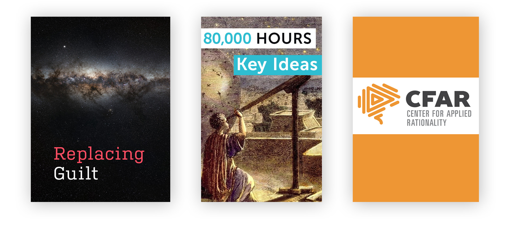
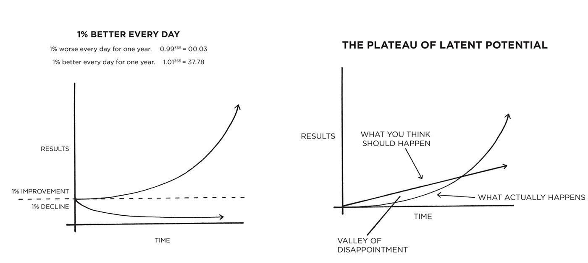

Neel Nanda is a final year maths undergraduate at the University of Cambridge, and a gold medalist in the International Mathematical Olympiad. He teaches regularly – from revision lectures to a recent  ‘public rationality’ workshop. Neel is also an active member in [rationalist](https://www.lesswrong.com/rationality) and [effective altruism](https://www.effectivealtruism.org/) communities.

In the first half of our conversation, Neel discusses how to build and think about useful habits, and introduces the ‘trigger action pattern’ framework. In the second half, we learn about ‘effective planning’: “the art of looking at things you want to happen and both making sure they happen and making sure they happen well.” Why, for instance, are we normally so overoptimistic in forecasting the time to complete a project? We also consider illustrations from failed construction projects, experimental psychology, and insect behaviour. 

We hope this episode and write-up will be useful for anyone enthusiastic about improving their productivity and ‘learning how to learn’ over the long-term. These are not (unfortunately) instant, effort-free ‘hacks’, but evidence-based methods which pay off in the long-run. We haven’t done a self-improvement episode before, but we hope you find it useful!

## Book Recommendations :book:

- “[Replacing Guilt](http://mindingourway.com/guilt/)” by Nate Soares
- The 80,000 Hours [Key Idea Series](https://80000hours.org/key-ideas/)
  - Also available as a [podcast episode](https://80000hours.org/podcast/episodes/ben-todd-key-ideas-of-80000hours/).
- The CFAR [Participant Handbook](https://rationality.org/files/cfar-handbook.pdf)

## Why care about productivity?

We began by asking Neel about what ‘productivity’ means. Although it’s often used in the context of work and studying, the concepts gleaned from learning about productivity can be put to use in the rest of our lives: “basically everything we ever do is some form of achieving goals.” It can be rewarding to apply an attitude of continual learning to any time we have a goal, and want to get there effectively. For Neel, this attitude is transparently desirable:

> “I have things that I value. Every day I’m taking actions to bring me closer of further from these. If I can find ways of taking the actions that get me more of what I want, I’m kind of an idiot for not doing that.. I definitely feel much, much happier with where my life is than a few years ago, in large part because of this kind of thinking”

Even when it comes to work or studying, most of us are biased against exploration. We have our preferred routines, methods, and tools; and too rarely experiment with alternatives. After all, experimenting in this way carries obvious costs: it takes time and effort to switch to a new way of doing things, and there is always a risk or even a likelihood that this new way turns out to be no improvement on your familiar way. Yet, this kind of experimentation is often dramatically undervalued:

> “If you’re going to spend 1000 hours over your [university] career learning, finding a better system that can get you 1% better is worth 10 hours of additional productivity. And so it would easily be worth 5 hours of trying out a new system.”

Therefore, even if trying out a new work routine or learning a new study tool carries a chance of failure, it is very often totally worth *trying*. So let’s look at two ways you can begin to improve in this way.

## Building Good Habits

In order to understand what is meant by ‘habit’, consider the [Sphex](https://en.wikipedia.org/wiki/Sphex) wasp. Some species of this genus prepare nests for their eggs, which they stock with insect prey for the hatched baby wasps to feed on. The wasp will drop a paralysed insect near the opening of the nest, and will then enter the nest to inspect it. Normally, it will emerge from the nest after the inspection and carry the insect inside. But during this inspection, an experimenter can move the insect a few inches away from the opening. When the wasp sees this, it locates the insect and carries it back to the opening. Then something strange happens: the wasp inspects the nest again, before re-emerging to carry the insect inside. On some accounts, this can be repeated endlessly. Although the wasp behaves *as if* it were thinking through its behaviour, their vulnerability to being ‘short-circuited’ tells us that this behaviour is really *habitual* in the strongest sense: it is the product of a near-enough hard-coded if/then pattern. You can watch a video of this [here](https://www.youtube.com/watch?v=YNvi_j2z96w).

Although humans are rarely so easily blindsided by such simple tricks, our minds do nonetheless also exhibit very similar kinds of if/then pattern. For instance, how many of us have absent-mindedly browsed our go-to social media app, closed the app out of boredom, and then reflexively *re-opened* the app to read the exact same content; before catching ourselves a few seconds later? How many of us instinctively pull out our phone when we feel a notification buzz, even if we know what the notification was?

Habits, then, can be characterised by a few features. They are **triggered** by some concrete event – dragging an insect to your nest, or feeling your phone buzz. The trigger is **immediately** followed by an action: the delay between trigger and action rarely takes longer than a few seconds. And habitual actions are **reflexive** – they require minimal (or no) conscious deliberation. They are not effortful, and in fact often take effort to override. They are also neither inherently good nor inherently bad: at any one time, we can name bad habits we’re trying to kick, and desirable habits we’re trying to learn. Yet, this is often far more difficult than we expect: so bad habits linger and good habits go unlearned after a few days or weeks of effort. No wonder: almost all your habits were learned accidentally.

### Trigger Action Patterns

However, we can utilise this understanding  to more effectively change our habits – by inventing our own trigger-action patterns, or ‘TAPs’. The first step is to choose the habit you want to learn. Since habits are bite-sized, concrete, and immediate; vague intentions like ‘work out more’ or ‘study harder’ won’t do. What small habitual actions can you translate your intention into? For instance, Neel gives the example of wanting to be more active – which he translated into a set of more concrete goals. One of these goals was ‘take the stairs when I walk into the office’. A good litmus test for a realistic, learnable habit is to imagine what you would do if somebody tapped you on the shoulder to remind you to do it just before you normally forget to do so. In Neel’s case, although he took the elevator reflexively, he *would* take the stairs the stairs without much fuss if only he was reminded to at the right moment. If Neel chose to cultivate the habit of sprinting up the stairs to the top floor, he would probably fail: a habit must fall within the bounds of gentle encouragement and far short of requiring willpower. Nobody takes the elevator just because they *forgot* to sprint full-tilt up the stairs!

The next stage is identify a **trigger**. A bad trigger is easy to miss, too rare or unreliable, or comes too late. For instance: if I want to turn my phone off earlier before I go to sleep, a bad trigger would be ‘notice I’ve spent too long on my phone’. An ideal trigger is visceral, regular, easy to notice, and familiar. In Neel’s example, he chose ‘opening the office door’. A test for a good trigger is to close your eyes and visualise it: can you imagine sounds, feelings, or a clear image? In Neel’s case, the distinctively cold, metallic feeling of the door handle was enough to make sure the trigger gets noticed.

Once you have found a suitable trigger, pair it with an action. Just like the trigger, your action should be concrete, specific, brief. And remember that habits *qua* habits should require minimal willpower. In Neel’s case, he did not choose ‘take the stairs’ as his action. This is because an early morning bleary-eyed Neel walking into the office is likely to override his long-term intention to build a habit of taking the stairs with a more immediate desire to take the lift. Instead, Neel chose ‘look at the stairs’. This might sound weirdly noncommittal – what good is *looking* at the stairs? But remember how a habit is often something you would do if only you were reminded at the crucial moment: and looking at the stairs serves as that reminder. If your goal is to shrug off a bad habit, consider the trigger that normally causes the habit, and try pairing it with the action of just *noticing* that ‘no is when I normally do my bad habit’. You might even say it out loud.

Having established your trigger–action pair, it is left to begin the process of *ingraining* the habit. The most obvious way of doing this is to dutifully carry out the action whenever the trigger occurs. Just like any other kind of practice, the habit begins to embed itself through being repeatedly exercised. There may be a nice runaway effect after a while: the more automatic a habit becomes, the less effortful it becomes, the more likely you are to repeat it. However, suppose you want to kick your habit of scrolling through your phone: you choose the trigger of ‘my head hits the pillow’ and the action of ‘I turn off my phone and pick up a book’. A good TAP, to be sure, but you only get one chance to practice it per day. What if you wanted to accelerate the learning process? The solution is to artificially bring about the trigger: literally rehearse getting into bed and lying down. You lie back, your head hits the pillow, you roll over and grab a book. Rinse, repeat. 10 times, Neel suggests. This is going to feel weird and unnatural; but treat it like any other kind of practice. After all, learns a killer forehand or masters the violin just be forming an intention to do so – no matter how strong.

You might be wondering what good are such small, incremental habits in achieving the really big changes that we want to make. We started by considering big general goals like ‘get fit’, ‘learn to code’, ‘ace my exams’, but we ended up with bite-size actions like ‘look at the stairs’. But the beauty of TAPs is that one action can produce a trigger for *another* habit, and so on. In this way, habits can be ‘chained’ or ‘stacked’ indefinitely. This is particularly applicable to morning routines, where each stage (getting out of bed, brushing teeth, etc) provides clear triggers for successive actions.

Moreover, although no single exercising of a habitual action makes a significant change, sticking to a habit over the long-term can lead to exponential returns. Suppose you invest the money you normally spend on take-out coffee every day, or smoke one less cigarette/drink/pizza slice per day, or commit to learning a skill for a few minutes each day. If the returns come in small fractional increments, then at first they might be dispiritingly small; before snowballing into noticeable changes. Consider these two self-explanatory graphs from James Clear’s excellent ‘[Atomic Habits](https://www.goodreads.com/book/show/40121378-atomic-habits)’.

## Effective Planning

The psychologists Amos Tversky and Daniel Kahneman are famous for having introduced the distinction between ‘System 1’ and ‘System 2’: a way of dividing human minds into separate but communicating modules that illuminates a range of otherwise puzzling phenomena. System 1 is fast, reflexive, and unconscious; while System 2 is slow, deliberative, and conscious. We exercise System 1 when we notice where a sound is coming from, understand sentence meaning from letter on a page, or (crucially) perform a habitual action. We exercise System 2 when we focus our attention on a task that does not come automatically: when we solve tricky maths questions, retrieve a recondite nugget of information from our memory stores, or (crucially) make plans.

The goal of habit-forming is to shift the burden for some behaviour away from System 2 (effortful, unsustainable, easily forgotten) over to System 1 (automatic, unconscious). Real habitual behaviour is performed by our System 1s; which is great, because it frees up energy and time to deliberate and strain over more complicated things. As habits are to System 1, *planning* is to System 2.

Most of us make plans before undertaking big projects, particularly if they involve other people. Plans help coordinate all those people’s efforts, and can provide direction and timing cues (‘We’re behind schedule! Better speed up!’). But Neel stresses that planning needn’t exclusively apply to large-scale projects: it just as useful to plan out your approach to an essay or assignment, your day of studying, or even the next few hours of work.

Wherever you look, people suck at planning. Even critical, multi-million dollar projects run over time and over budget like clockwork. Consider New York’s [Second Avenue Subway](https://en.wikipedia.org/wiki/Second_Avenue_Subway). The line, a short stretch of subway tunnel running under Second Avenue on the East Side of Manhattan, was originally proposed in 1920. Overground lines were demolished in anticipation of the new route in 1942 and 1955. Construction on the line itself finally began in 1972, with governor Nelson Rockerfeller holding a victorious ground-breaking ceremony. But a few years later, the plan was halted again due to a fiscal crisis, after only completing a few short sections. At this point, the subway had become its own punchline: New Yorkers would make promises “once the Second Avenue Subway was built.” New plans were drawn to finally complete the project in 2004 over four phases. Phase 1 was estimated to cost \$3.8 billion, but eventually ran \$500 million over budget, in part because the poor rock quality forced the constructors to literally *freeze* close to two blocks of earth. Phase 2 was estimated to cost \$3.4 billion, but that too ratcheted up to c. \$6 billion. The second phase is expected to open by 2027-2029, and I couldn’t even find any information about the third and fourth phases. Sure, running more than half a century and more than a billion dollars over expectations is a *particularly* embarrassing, but were you shocked? On the whole, we’re desensitised to megaprojects running over budget and past successive deadlines: the real surprises are big projects that finish on time and within budget.  

Yet, small-scale plans go wrong just as often as big institutional projects. If you are a student, you will be painfully familiar with the feeling of setting yourself the best part of a week to write an essay, only to find yourself pulling an all-nighter and handing in a botched job hours after the deadline (even though the same thing happened the previous week, and the week before that…). Despite knowing that our standard plan normally fails, we endlessly repeat it. *This* time always feels like the time you’ll make it work, the time you’ll finally stop procrastinating and hand in that essay well before the deadline.

> [Hofstadter’s law](https://en.wikipedia.org/wiki/Hofstadter%27s_law): *It always takes longer than you expect, even when you take into account Hofstadter's Law.*

Why does all this happen? Why are we normally so bad at adapting our plans to past failures? And why this amnesic optimism?

For Neel, a useful way to understand planning failures is with the concepts of the ‘inside view’ and the ‘outside view’ – another idea from the prolific pair Kahneman and Tversky. The *inside* view (or *internal perspective*) is the one that we spontaneously adopt when we start to plan out some new particular new project in our imagination. We help ourselves to the information immediately available to us: are there currently any obvious impediments to my finishing this on time? Nope. Do I feel motivated right now to get it done? Absolutely. And do I have enough time from now until the deadline? More than enough. In adopting the inside view, we ignore the ‘unknown unknowns’ that befall most projects.

By contrast, the *outside* view (or *external perspective*) gathers information about all the other instances of this kind of project. It estimates the *base rate* of failure or success based on the other times I or people similar to me have attempted a similar thing with similar constraints. The base rate is just the ‘prior’ probability of success: the proportion of similar projects that ended up successful. The kind of information this perspective relies on is not particular (special to this case) but *distributional* (spread across many past cases). Suppose I’m writing an essay, and give myself 5 days to finish it. I like the topic, I feel fired up to get it done, and 5 days seems like more than enough. But when I consider my track record, I remember that I end up handing in late pretty much every time. The inside view tells me that this time is special: this time I’ll just work a bit harder and learn from my mistakes. The outside view reminds me that this is what I thought *every other time, too*:

> “Remember that a lot of the previous things that I screwed up were also things that I thought were special and I thought I was going to take more seriously.”

The inside view typically falls foul to an ‘optimism bias’, focusing on the evidence that we are likely to succeed on time and ignoring the lessons from previous instances. The chance of success extrapolated from the outside view tends to be far more accurate; but adopting the outside view is also less natural, less automatic, and often less comfortable. Yet, we are all capable of using it accurately, because although we underestimate completion times for our own plans, [we do not do so](http://web.mit.edu/curhan/www/docs/Articles/biases/67_J_Personality_and_Social_Psychology_366,_1994.pdf) for other people’s plans: presumably because we are less prone to adopting the internal view when thinking about others.

How can we get better at planning, and make use of the outside view?

## An Algorithm for Better Plans

As Neel points out, the first failure mode is often failing to make a plan in the first place. So the zeroth step in planning more effectively is to decide to do so. Even if you do spend a few minutes to plan out your time, it is too easy to almost instantly forget about it:

> “Most plans fail at the point where you don’t even think about them and when you don’t take any action to make them happen.”

The next useful concept for better planning is the idea of an ‘inner simulator’: our ability to imagine hypothetical scenarios. Our ‘System 1’ is often amazingly good at doing this without too much conscious effort. For instance, Neel asks us to imagine throwing a bucket of water over your friend as they’re sitting at their desk. We can immediately bring to mind their reaction, the look on their face, and how the situation plays out over time. We will make use of this in thinking about a more effective way to make plans.

The **first** stage is to come up with an initial plan: it can be optimistic, because we will be using our inner simulators to refine it. For instance, I need to write 12 pieces of coursework in just under two months for my degree. My initial plan is to punch in 6 hours a day, every day, for the next two months. That’ll give me $\approx \frac{60}{12}=5$ hours per essay.

The **second** stage is to fast-forward in your imagination to the last moment of your plan, and imagine that things went wrong. Ask yourself: are you surprised? We can put our inner simulators to good use here: make an effort to picture where you’ll be sitting, what you’ll be seeing, the kind of emotions you’ll be feeling. This probably doesn’t sound fun. But remember that we are typically most vulnerable to failing to predict failure precisely when we flinch away from imagining the possibility. In my case, it’s so much *nicer* to imagine a seamlessly productive two months, than the more realistic ebbs and bumps in motivation and procrastination.

Now you’re imagining failure, ask yourself what happened. Imagine you’re using hindsight (pre-hindsight?) from your perspective in the imagined future, looking back over the next few hours, days or weeks. In my case, I only began to feel real time pressure in the last fortnight; by which point I knew I had to rush some of the essays I put off to a standard I wouldn’t be happy with. After a couple of all nighters, and feeling disappointed with myself, I handed in a set of sub-par essays.

The next step is the constructive part: now adjust your plan so that scenario is less likely to occur. Try setting a five-minute timer for coming up with ideas. For instance, you might build in a social accountability system: tell a friend about your plan, and ask them to hold your feet to the fire if you fall behind schedule. In my case, I’m going to give myself the weekends to focus on other hobbies, and I’m going to make sure every essay at least gets written before I worry about refining any of them. Now go back to the previous step. Imagine you’ve reached the end of *this* plan, and you’ve failed again. Are you surprised? If, in your imagination, you honestly do feel surprised that such a well-laid plan could have failed, then congratulations! You’ve created a watertight plan. But suppose you only feel a shade more surprised.  In this case, rinse and repeat: update your plan, and imagine the failure mode again, until you’ve hit on a plan which causes genuine surprise when you try to imagine how it failed.

This might sound needlessly uncomfortable, but it is far more valuable to imagine failure in advance rather than success, because you can adjust course before it’s too late:

> “If I notice right now my plan’s going to go wrong, that’s amazing, because right now that’s cost nothing, I can do something differently to prepare for this. Noticing something in advance isn’t a failure; it’s a success.”

Gmail recently introduced a button that allows you to undo sending an email within a few seconds. This is great: we’ve all sent an email only to *immediately* notice you forgot to attach the file. Imagining and adjusting for unsurprising failures is like an undo button for plans: you get to notice the problem just *before* it’s too late. Neel suggests that building a habit of effective planning and imagining failure modes can pay dividends in the long-run. Next time you face an opportunity to make a plan before starting a project, notice the voice in your head that says “oh, I’ll get round to that” or “I have a good feeling about this one” and remember the uncomfortable lessons of the outside view.

> “This kind of thing should be really exciting. If you can make better decisions solely in your head by asking the right questions, that’s an amazing skill. This is something I want to understand and I want to practice.”

There is a nice interplay between effective planning and building good habits: you can build a mental habit of imagining failure modes for your plans, and you can also make plans for building habits – would I be surprised if I fail to see through my plan to make a habit of doing 50 pushups every time I get out of bed?

If you feel like you want to try this, imagine yourself in a couple of week’s time: would you be surprised if you never got round to it? If so, is there a reason you can’t try making a plan this way *right now*? 

## Implementation Intentions

When you think about how to update your plans to make them more likely to succeed, there’s a good chance that *motivation* came to mind. You might think ‘last time, when I fell short of my plan, it was because I just didn’t *care* enough’.

Or maybe you want to instill a habit through sheer force of will: ‘sure, my last attempt at making a routine of exercise trailed off, but this time I *really* want to get fit!’.

A growing body of research shows that sheer motivation is ineffective. In [one study](https://www.ncbi.nlm.nih.gov/pubmed/14596707), researchers wanted to examine what improved the likelihood of building better exercise habits. Subjects were divided into three groups. The first group were just asked to track how often they exercised. The second were asked in addition to get motivated by learning about the benefits of exercise, and the health risks of failing to exercise. The third group received the same ‘motivational’ material as the second, but were also asked to make a plan detailing exactly when and where they would exercise. They completed the following sentence:

>“During the next week, I will partake in at least 20 minutes of vigorous exercise on [DAY] at [TIME] in [PLACE].”

The researchers found that the ‘motivational’ material had no meaningful effect on building an exercise routine: the second group almost exactly matched the first, with 35%-38% exercising at least once per week. However, nearly 91% of the third group exercised at least once per week!

The name given to what the third group did is an **implementation intention**: a specific (when and where) plan. Implementation intentions work best when a specific response is paired with a specific situation – evidence which underpins the effectiveness of TAPs in building habits.

Other studies show that asking participants to form implementation intentions can improve the likelihood of behaviours ranging from [voting in a presidential election](https://www.researchgate.net/publication/43348201_Do_You_Have_a_Voting_Plan_Implementation_Intentions_Voter_Turnout_and_Organic_Plan_Making) to [taking vitamins, obtaining a mammography, or changing eating habits](https://www.researchgate.net/publication/232586066_Implementation_Intentions_Strong_Effects_of_Simple_Plans).

## More Advice

Neel’s suggestions for building habits and effective planning are useful frameworks, but they won’t tell you how to adapt them for your personal circumstances. Neither are they anything like the final word on productivity (there is, after all, a cottage industry of productivity books and workshops, each claiming to be the final word on productivity). For instance, the ‘adapt your plan’ stage of the effective planning algorithm doesn’t tell us anything about *how* to improve your plan. Here are some potentially useful extra details which Neel discussed in our conversation:

- If you’re trying to learn lots of structured information (e.g. for an exam), **[spaced repetition](https://collegeinfogeek.com/spaced-repetition-memory-technique/)** is an extremely [well-evidenced](https://www.pnas.org/content/116/10/3988) technique which might improve on your existing approach. Computer and mobile apps exist which automate the process. Neel recommends ‘[Anki](https://apps.ankiweb.net/)’, a cross-platform flashcard program. I might also put a shout in for ‘[Msenome](https://mnemosyne-proj.org/)’.
- When planning towards a goal, it’s easy to get hung up on proxies for the goal, and optimise them at the expense of the goal itself. For instance, if you want to ace an exam, you might start to really care about how much time you spend studying. But it’s possible to become so hung up on the hours you clock in front of your books that you work yourself into a tired wreck poring through textbooks for the sake of it. Remember it’s the goal that counts!
- It’s equally easy to forget the overreaching significance of your work or study in the heat of the moment. For instance, if you’re a student, there’s a good chance that you choose your subject because you find at least some aspects of your subject genuinely interesting; or because your subject opens doors to a career you actually look forwards to. Try to replace feelings of guilt (I’m so unmotivated!) with reminders of why you’re doing this thing you’re doing. Neel says, “it’s much harder to motivate myself to care about things when I lose sight of why it matters to me.”
- The [Pareto principle](https://en.wikipedia.org/wiki/Pareto_principle) tends to apply to learning: 80% of the really useful information often comes from 20% of the total information you digest. In order to discover for yourself the information that’s doing the heavy lifting, imagine how you might explain something you’ve just learned to a friend.
- Time tracking software can be useful for recording periods of work and keeping schedule. Neel recommends an app called [toggl](https://toggl.com/) for time tracking. Also, distraction blocking / device locking apps can help beat phone-based procrastination. There are lots to choose from: [Offtime](https://offtime.app/), [SPACE](https://play.google.com/store/apps/details?id=mrigapps.andriod.breakfree.deux&hl=en_GB), [Forest](https://www.forestapp.cc/), and [QualityTime](https://www.qualitytimeapp.com/).
- Try sticking post-it notes in conspicuous places to remind you of habits.
- A few of Neel’s habit ideas:
  - Noticing when you’re confused by something somebody explains to you ⟶ (if possible) repeating your understanding back to them for correction.
  - Take the first bite of a meal ⟶ savour the food.
  - Remember a friend you’re grateful for ⟶ text them something nice!

## Useful Links :newspaper:

- Neel’s [Public Rationality Teaching Notes](https://dynalist.io/d/pgngbu6nDQbQzu1Gcof3Dj1i) (Web resource 💻)
- The [Centre for Applied Rationality (CFAR)](https://www.rationality.org/) (Web resource 💻)
- [Thinking, Fast and Slow](https://www.goodreads.com/book/show/11468377-thinking-fast-and-slow?ac=1&from_search=true&qid=ss4S6X2w7G&rank=1) (Book :book:)
- [Atomic Habits](https://jamesclear.com/atomic-habits) (Book  :book:)
- [Daniel Kahneman: Beware the ‘inside view’](https://www.mckinsey.com/business-functions/strategy-and-corporate-finance/our-insights/daniel-kahneman-beware-the-inside-view) (Web article 💻)
- [Implementation Intentions: Strong Effects of Simple Plans](https://www.researchgate.net/publication/232586066_Implementation_Intentions_Strong_Effects_of_Simple_Plans) (Academic :microscope:)
- [What You Should Know About Megaprojects, And Why: An Overview](https://arxiv.org/ftp/arxiv/papers/1409/1409.0003.pdf) (*Project Management Journal*, 2014) (​Research article :memo:)
- [Exploring the “Planning Fallacy”: Why People Underestimate Their Task Completion Times](http://web.mit.edu/curhan/www/docs/Articles/biases/67_J_Personality_and_Social_Psychology_366,_1994.pdf) (*Journal of Personality and Social Psychology*, 1994) (Research article :memo:)
- [Here’s Why All Your Projects Are Always Late — and What to Do About It](https://freakonomics.com/podcast/project-management/) (Podcast episode:headphones:)

