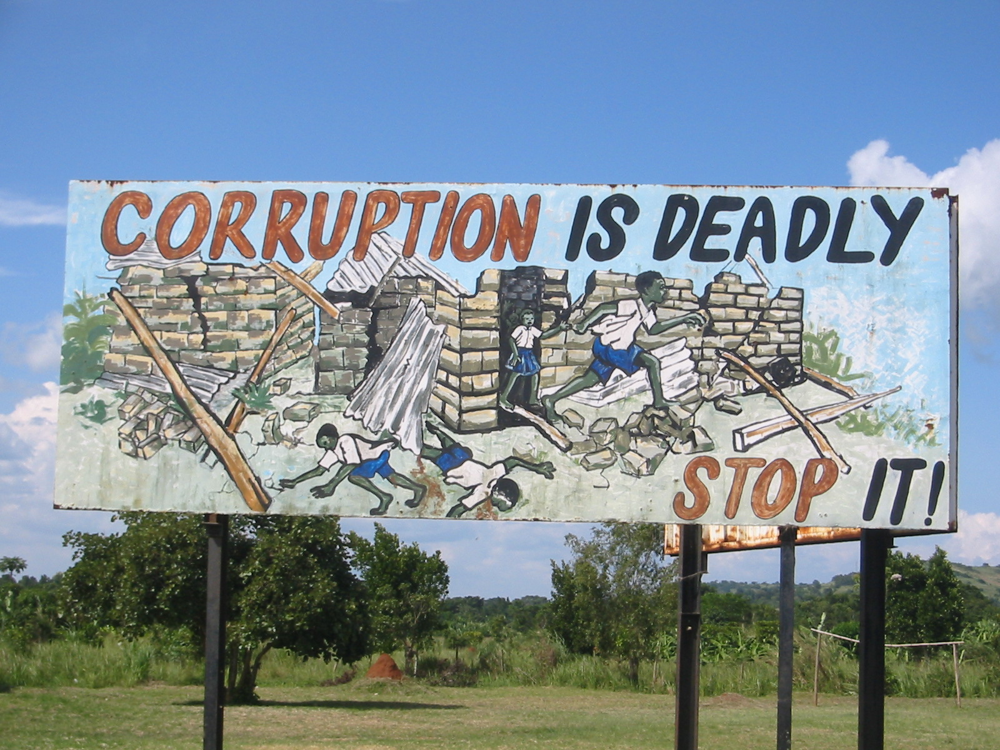
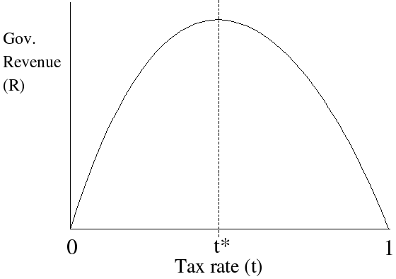
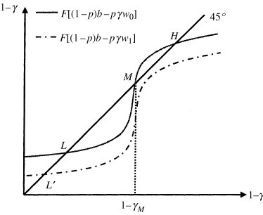

Dr Toke Aidt is Director of Studies in economics at Jesus College, Cambridge; and director of the Keynes Fund. We begin by talking about why some economists have argued that political corruption can actually be a force for good, or at least a lesser evil– before Toke explains why he believes this view does not hold up to scrutiny. We then explore other models of corruption, particularly the idea that it can be self-reinforcing and what role culture might play. We covered a lot of ground in this episode: from the existing literature as well as Toke’s work. This write-up summarises our conversation and includes links and references for more information.

## Book Recommendations 📚

- "[The Mystery of Capital](https://www.amazon.co.uk/Mystery-Capital-Hernando-Soto/dp/0552999237)" by Hermando De Soto
- "[The Grabbing Hand](https://www.amazon.co.uk/Grabbing-Hand-Government-Pathologies-Their/dp/0674358872/ref=sr_1_1?dchild=1&keywords=The+Grabbing+Hand&qid=1587891885&s=books&sr=1-1)" by  Andrei Shleifer and Robery Vishny
- "[Why Nations Fail](https://www.amazon.co.uk/Why-Nations-Fail-Origins-Prosperity/dp/1846684307/ref=tmm_pap_swatch_0?_encoding=UTF8&qid=1587891922&sr=1-1)" by Daron Acemoglu and James Robinson

<Book url="https://www.goodreads.com/book/show/86154.The_Mystery_of_Capital" image="book-toke-1"/>
<Book url="https://www.goodreads.com/book/show/2278124.The_Grabbing_Hand" image="book-toke-2"/>
<Book url="https://www.goodreads.com/book/show/12158480-why-nations-fail" image="book-toke-3"/>

## Can corruption be good?

Corruption is almost synonymous with bad, broken government. However, in political economics several prominent academics have proposed theories for why corruption may actually increase social welfare. We explore these counter-intuitive models and see if there is any evidence for them.

### Can corruption increase efficiency?

Suppose that you live in a country where the government is frequently incompetent and creates a lot of bad laws that hurt the economy. In such cases, having a corrupt bureaucracy that is prepared to undermine bad policies can act as a fail safe. This was first noted by [Leff (1964)](https://journals.sagepub.com/doi/abs/10.1177/000276426400800303) who found a stark difference in outcomes between Chile and Brazil when they both introduced price freezes: Chile's fairly honest government implemented this policy and thereby created huge stagnations in production; Brazil's fairly corrupt agency sabotaged the policy and thereby actually made consumers better off.

This argument is obviously very controversial but it has sparked a huge amount of research by other academics to try and see if corruption might 'grease' the wheels. One of the most famous models that emerged from this is [Lui's (1985)](https://www.jstor.org/stable/1832136) **queue model**. Consider the following example:

- Imagine you are setting up a new business. Your government has introduced an industrial licensing system, where before you can begin to operate you must be approved by Ministry of Industry.
- At the moment this process is a very inefficient and time intensive process, where applications are checked on a 'first come first serve' basis.
- In fact, you are willing to pay up to $100 to skip the queue, knowing that once your business is approved you will be so successful that this is actually profitable.
- Now imagine the bureaucrats for the Ministry of Industry are corrupt and you can pay a bribe to skip the queue. Clearly this is something you will want to do.
- If we repeat this for every business we effectively sort our queue from 'first come first serve' to based on how much they are willing to pay for the license i.e. those who need them the most. We can show mathematically that the "average time costs are minimised".
- Moreover, the bureaucrats will have every incentive to make the queue go as quickly as possible. The faster it moves, the more people enter the queue and pay a bribe. Win-win, right?

In economics this is known as a **covert auction** where corruption effectively introduces a price mechanism where the government decided to remove it. And prices/auctions can be really good at rationing out resources in short supply to those who need them the most. This is closely linked to what is known as the [Coase Theorem](http://www2.econ.iastate.edu/classes/tsc220/hallam/Coase.pdf)  (see also [McCloskey's](https://www.jstor.org/stable/40325879?seq=1#metadata_info_tab_contents) take on it), which shows how under the right circumstances bargaining can be a very powerful tool create 'Pareto efficient' outcomes.

### Aidt shows there is little evidence for efficient corruption

So how do we go about testing if this is actually the case? [Aidt (2009)](https://academic.oup.com/oxrep/article/25/2/271/420435) asks us to think what a world with efficient corruption would look like. 'Efficient corruption' helps it correct government failures so it should only boost economic growth if there are government failures to correct! This is known as a **non-monotnic** relationship between growth and corruption. More specifically, we would expect...

1. The *marginal* effect of corruption on growth is positive in countries with *deficient political institutions* and negative elsewhere;

2. At *low* levels of corruption the beneficial effects of corruption dominates detrimental effects;

3. In *good governance* countries the effect of corruption on growth is negative, while in countries with poor governance, the effect is positive (or less negative)

Aidt looks at 60 countries to see if this is the case. Whilst there is clear evidence that corruption hurts good governance, we cannot say that it helps poor governance countries as the data becomes mixed once we control for other variables. For example, it could be that corruption has less of an impact in poor governance countries because things cannot get much worse.

### The 'fallacy of efficient corruption'

So what was wrong with our queue example above? Aidt argues that the mistake made is that we implicitly treat government being inept and the bureaucracy being corrupt separately. The 'queue' models argues that bureaucratic corruption is good because the government license system is bad. Yet bureaucratic corruption may have caused bad government policy in the first place:

- Corrupt bureaucrats want to maximise the total amount of bribes gained. This is equal to price * quantity

- But price depends on quantity. The fewer licenses there are, the higher a price you can charge. This creates a trade-off that we can show by what is known as a **laffer curve**:

  

-  If there was an unlimited supply of licenses, no one would be willing to pay a bribe. If there were no licenses at all no one is able to pay a bribe. There exists some sweet spot in-between.

- To reach this sweet spot, bureaucrats want to create some form of artificial scarcity of licenses and lobby the government from the inside. Hence we say bad government policy is **endogenous**.

- The very reason government policy is bad in the first place is so that paying a bribe becomes the best solution for start-ups. But clearly an even better solution would be to not have any corruption at all! 

Further criticisms of the queue model include:

- Not everyone is able to pay bribes, even if they desperately need a license.
- If a price mechanism is good, we would surely want any revenues from this to go to the government (to pay for public services) rather than to corrupt bureaucrats.
- By keeping bribes secret we waste resources that could be used elsewhere.

Indeed, there is a huge amount of micro-evidence suggesting that businesses do not benefit from paying bribes. For example, [Djankov et al. (2002)](https://academic.oup.com/qje/article/117/1/1/1851750) find a strong correlation between hurdles to set up small start-up firm and corruption. Likewise, [Fisman and Svensson (2007)](https://econpapers.repec.org/article/eeedeveco/v_3a83_3ay_3a2007_3ai_3a1_3ap_3a63-75.htm) use a survey of Ugandan firms to show a 1%-point increase in the bribery rate is associated with 3%-point reduction in firm growth.

## Corruption as the lesser of two evils

So far, we have shown there is a strong case to think that corruption cannot be beneficial on its own. However, some have argued that it might still be less costly to tolerate it than to try and eliminate it. 

To explain this argument, we use a simplified **principle-agent model**. A principle-agent problem occurs when one persons makes a decision on the behalf of someone else but has a different goal in mind. In our case, the government (principal) wants to collect taxes but the bureaucrat (agent) wants to maximize their own income. This can create conflict. The government (principal) is wants to collect taxes and pays the bureaucrat (agent) a wage $w$ to do this. The corrupt bureaucrat goes to collect taxes and finds out they are worth $\pi$. She now has two choices: be honest and hand them to the government or lie and tell the government there weren't any, keeping them for herself. Of course, if she lies there is a probability $p \in [0,1]$ (between 0 and 1) that she is discovered and fired, losing her wage. What happens?

- If the bureaucrat is honest she is guaranteed her wage $w$, but nothing more. If the bureaucrat is corrupt she gets $w+\pi$ with probability $1-p$ but else nothing.
- She will thus be honest only if it is better to do so: $w\geq(1-p)(w+\pi)$.
- Rearranging, we can see that the government must pay a wage $w\geq \dfrac{1-p}{p} \pi$ to eliminate corruption. Intuitively, by paying bureaucrats more, they have a bigger incentive to keep their job and are thus less likely to engage in behaviour that will get them fired.
- But paying such a high **efficiency wage** (or investing in monitoring equipment to increase $p$) might be more expensive than just accepting the fact that sometimes corruption will go undetected.
- If the government pays the efficiency wage it is guaranteed to get a net $\pi - \dfrac{1-p}{p}\pi$. If the government pays no wages it expects to get $p\pi$.
- It is profitable to eliminate corruption only if $\pi-\dfrac{1-p}{p}\pi > p\pi$.
- Rearranging we can see this will never be the case: $0 > (p-1)^{2}$.

Don’t worry if you don’t understand all the math here– the idea is also explained by Toke in the episode! For a much more comprehensive but still understandable model as well as this argument's limitations, see [Shleifer and Vishny (1993)](https://academic.oup.com/qje/article/108/3/599/1881822).

Intuitively, paying people to stop being corrupt has a huge **opportunity cost**, as this money could be spent elsewhere. Moreover, [Murphy et al (1993)](https://www.jstor.org/stable/2117699?casa_token=rJ910edkSosAAAAA:Wa6_bt5AzOKrYUobjVkG8FFuDTc9trWof_zVKcEdXUHs513-ShYASXt05nB4fQbJBd66W9NHw9PGz_EFccx01y1viMzV9N5AlMk9fhG1dyAPjGemGcC8&seq=1#metadata_info_tab_contents) also note this has the unintended consequence of misallocating money: If being corrupt pays an above market wages this attracts people who would have been productive elsewhere. Instead, the government will find the optimal level of corruption (and bureaucrat wage) that balances out the trade off between more tax collection but also higher cost.

Testing this argument is an almost impossible task. It implies that anything above the optimal corruption level should harm growth, and anything below the optimal corruption should also harm growth. But evaluating what this optimal level is and whether a country is above or below it is clearly not feasible.

## Corruption Traps

So far we have discussed corruption in terms of a single bureaucrat, or better a mass of bureaucrats acting *independently*. However, in practice it is clear that one person's decision may affect another, known as **strategic complementarities**. For example, It is harder audit corrupt officials in societies where it is more prevalent or the moral cost of being corrupt depends on behaviour of colleagues. This can have important consequences.

Let us think how a corruption trap works in practice. Imagine we begin in a high equilibrium H where everyone is corrupt. The government increases its anti-corruption efforts and some people switch to being honest. But a lot of corruption remains and the detection rate is fairly low. It is hence profitable for at least one honest person to switch back to being corrupt. This lowers the detection rate even further and another honest person switches back too. This repeats until all our hard work is undone. It is infeasible to gradually reduce corruption over time.

[Aidt (2003)](https://onlinelibrary.wiley.com/doi/10.1046/j.0013-0133.2003.00171.x) notes that this may create **multiple equilibria** and self-reinforcing cycles [this also gives an excellent advanced overview of the literature]. Consider two different worlds:

- We begin with a lot of corruption. This means the risk of any single corrupt individual being detected is very low. Hence a lot of people choose to be corrupt. This reinforces the fact we have a lot of corruption. The cycle repeats.
- We begin with little corruption. This means the risk of any single corrupt individual being detected is very high. Hence few people choose to be corrupt. This reinforces the fact we have little corruption. The cycle repeats.
- These cycles cause a convergence to either stable equilibirum H or L. There is also unstable equilibirum (i.e. cut-off point) M where a nudge to either side can completely change the trajectory.

If we are in world H, this makes fighting corruption very difficult. Any nudges along the line will be self-defeating as the reinforcing cycles just push us back to where we began. The only solution is a a 'big push' i.e. escape all the way up to M or eliminate high equilibirums all together (see dotted line). What this means in practice has been shown by [Skidmore (1996)](https://journals.sagepub.com/doi/abs/10.1177/0002716296547001010): a drastic change in corruption attitudes and huge punishments for those caught was the only thing that could eliminate entrenched corruption in Hong Kong in the 70s.