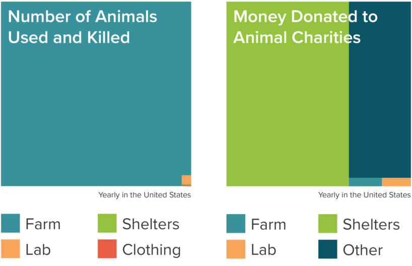

Eve McCormick is the co-director of Effective Altruism Cambridge and a grant recipient from the Centre for Effective Altruism. We begin by discussing some of the philosophical arguments that originally motivated the effective altruism (or ‘EA’) movement — before learning about its (fairly new) history. Next, Eve briefly surveyed some of the central concepts of EA: how are charities evaluated, what is ‘counterfactual reasoning’, and what is the ‘ITN’ framework? Some of these ideas are broadly applicable to a range of decision-making contexts. Effective altruism encompasses a diverse set of ‘cause areas’, which Eve also introduces. As well as donating money, an effective way to do good is to use your own time and skills to join those seeking to make a difference in some of the world’s most pressing problems. To this end, Eve explains how to begin thinking about a career-oriented around doing good. This write-up summarises our conversation and includes links and references for more information. Since this is such a big topic, this article provides only a satellite’s eye-view — you can dig deeper by following the links provided.

## **Book Recommendations 📚**

- "[Strangers Drowning](https://www.goodreads.com/book/show/24611937-strangers-drowning)" by Larissa MacFarquhar
- "[The Precipice](https://www.goodreads.com/book/show/50485582-the-precipice)" by Toby Ord
- "[When is your help special?](http://www.givinggladly.com/2012/06/when-is-your-help-special.html)" by Julia Wise

<Book url="https://www.goodreads.com/book/show/24611937-strangers-drowning" image="book-eve-1"/>
<Book url="https://www.goodreads.com/book/show/50485582-the-precipice" image="book-eve-2"/>
<Book url="http://www.givinggladly.com/2012/06/when-is-your-help-special.html" image="book-eve-3"/>

## **Introduction**

The [Centre for Effective Altruism](https://www.centreforeffectivealtruism.org/), an organisation set up to support the growing community, defines effective altruism as follows:

> Effective altruism is about using evidence and reason to figure out how to benefit others as much as possible, and taking action on that basis.

This highlights two components:

1. The **intellectual** project of using reason and evidence to identifying most effective approaches, methods, initiatives, and cause areas for doing good or improving lives — where ‘improving lives’ and ‘doing good’ and construed in [welfarist](https://plato.stanford.edu/entries/well-being/#Wel) terms (the idea that the goodness of an act or outcome is to be ultimately determined either primarily or exclusively by *well-being*).
2. The **practical** project (and associated global movement) of following through on (1) and volunteering significant time, money, or resources to implement such ideas and actually do good. This now involves a worldwide community of people interested in EA, an [EA forum](https://forum.effectivealtruism.org/), [annual conferences](https://www.eaglobal.org/), and local groups.

For an extended discussion of the definition of effective altruism, as well as a discussion of common misconceptions, see Will MacAskill’s ‘[The Definition of Effective Altruism](https://www.oxfordscholarship.com/view/10.1093/oso/9780198841364.001.0001/oso-9780198841364-chapter-1)’.

## **Philosophical Arguments**

What motivates any given individual to spend significant amounts of their time or money in helping strangers is often highly personal, and might involve an experience or story that can’t easily be communicated or replicated. However, a striking number of people have been convinced to change their behaviour in significant ways by a series of *philosophical* arguments.

The most significant of these was suggested by the moral philosopher [Peter Singer](https://www.utilitarianism.net/utilitarian-thinker/peter-singer) in a landmark 1972 paper ‘[Famine, Affluence, and Morality](http://personal.lse.ac.uk/robert49/teaching/mm/articles/Singer_1972Famine.pdf)’. At the time, East Bengal was experiencing a widespread shortage of food, shelter, and medical care. Singer was curious whether individuals and governments from affluent countries have a responsibility to provide assistance, in order to prevent many thousands of deaths. His conclusion — that they do — had implications that reached far beyond the immediate context of the article. But what made Singer reach that conclusion?

### **The Drowning Child**

Singer’s article featured a thought experiment that has probably been described and argued over in intro ethics classes more times than any other. It’s extremely simple, and each step seems unobjectionable. Yet, many people are extremely uncomfortable with the demandingness of the conclusion.

Imagine you’re walking home, and your route passes a shallow pond. You notice that a child has fallen in, and looks to be drowning. You can rescue the child from the pond — but only at the cost of getting your clothes soggy. What’s worse, you haven’t got time to pry the expensive watch from your wrist. Should you save the child? This is about the easiest ethical question you’ll have to face: *clearly* you should.

Now suppose there are other people walking past the pond, who don’t seem to have noticed but are similarly capable of saving the drowning child. Does this make a difference to whether you have an obligation to save the child? No — the fact that others could save the child doesn’t mean I have no obligation to do so myself. To see this, notice that if everyone followed this reasoning, *everyone* would successfully exempt themselves from any obligation to save the drowning child, and thus nobody would be responsible if the child drowned. “It’s not my fault”, you might shrug — “that other guy could have helped too”.

*Now* imagine (and this requires some imagination) that the drowning child was not right in front of you, but on another continent. All the other facts remain the same: she is facing an equal risk of dying, and you are equally capable of saving her at equal cost to before. Maybe, for instance, you are remotely piloting a little photography drone when you spot the child, and rescuing the child involves getting the drone wet and breaking it. Would this geographical difference make a difference as to whether you have an obligation to rescue the drowning child? Again, it seems obvious that neither physical distance nor nationality, race, or relatedness make a difference here.

Now quoting Singer:

> I then point out that we are all in that situation of the person passing the shallow pond: we can all save lives of people, both children and adults, who would otherwise die, and we can do so at a very small cost to us: the cost of a new CD, a shirt or a night out at a restaurant or concert, can mean the difference between life and death to more than one person somewhere in the world.

How could this be the case? Well, it happens that many charities exist, operating in the poorest parts of the world, which we know beyond reasonable doubt are capable of saving lives at very little cost and with no perceptible downside. One example is the [Against Malaria Foundation](https://www.givewell.org/charities/amf).

It is certainly true that some charities are inefficient; some even do harm — either through inadvertently directing resources to corrupt regimes or politicians, by fostering a culture of reliance and undermining longer-term economic growth, or else unreflectively playing off culturally insensitive ‘white saviour’ tropes. Maybe this is the case for the majority of charities operating in the developing world. If it is, that fact is nor morally relevant — because it is *demonstrably* true that some charities are *not* inefficient, harmful, or insensitive.

The conclusion is straightforward: if it is clearly the right thing to do to save the drowning child at some small cost to yourself in the first instance, then it is clearly the right thing to do to donate to effective (viz. well-evidenced and cost-effective) charities at equivalent cost. Effective Altruists take this conclusion seriously — and now you can see where the interest in ‘using evidence and reason to figure out how to benefit others as much as possible’ comes from, at least in part. Laid out in argument form:

1. Suffering and death from lack of food, shelter and medical care are bad.
2. If it is in your power to prevent something bad from happening, without sacrificing anything nearly as important, it is wrong not to do so.
3. By donating to aid agencies, you can prevent suffering and death from lack of food, shelter and medical care, without sacrificing anything nearly as important.
4. Conclusion: Therefore, if you do not donate to aid agencies, you are doing something wrong.

You can read Singer’s reflections on the drowning child argument [here](https://www.utilitarian.net/singer/by/199704--.htm).

### **The Expanding Moral Circle**

Singer continues:

> I am always struck by how few students challenge the underlying ethics of the idea that we ought to save the lives of strangers when we can do so at relatively little cost to ourselves. At the end of the nineteenth century WH Lecky wrote of human concern as an expanding circle which begins with the individual, then embraces the family and ‘soon the circle... includes first a class, then a nation, then a coalition of nations, then all humanity, and finally, its influence is felt in the dealings of man [sic] with the animal world’. On this basis the overwhelming majority of my students seem to be already in the penultimate stage – at least – of Lecky’s expanding circle. There is, of course, for many students and for various reasons a gap between acknowledging what we ought to do, and doing it; but I shall come back to that issue shortly.

In *[The Expanding Circle: Ethics, Evolution, and Moral Progress](https://www.goodreads.com/book/show/11417583-the-expanding-circle)*, Singer elaborates on this idea: that just as there is clearly no reason to weigh the interests of other people less because they live in the next village over, or belong to a different church, or a different gender — so there is no reason to weigh the interests of another person less because they live on a different part of the world. Of course, it is normally much easier to help somebody close to you: you know each other better, you can directly exchange goods, and so on. But holding fixed those practical considerations: where you have an opportunity to dramatically improve or even save a human life, the mere fact about that person’s nationality (or whatever else) should not figure in deliberating about whether you have an obligation to take up that opportunity and help that person. Although it is simple to appreciate this idea intellectually, it is equally clear that many people’s behaviour in the developed world falls short of enacting it.

The same pattern of reasoning can suggest that we should not consider the interests of a sentient being any more or less because of facts about species membership. Where we have an obligation to relieve a human of immense suffering at some small cost to ourselves, we must also have an obligation to relieve an animal of that same amount of suffering. To do otherwise, argues Singer, is an instance of ‘speciesism’. Of course, this is *not* the claim that we ought to always weigh animal lives equally with human lives (you can kill 5 ants to save a human!) or that all or even any animals are capable of some psychological states that humans are capable of (like appreciating art, or feeling complex moral or spiritual emotions). Singer elaborates this idea in the book *[Animal Liberation](https://www.goodreads.com/book/show/29380.Animal_Liberation)*. This latter thought, that the ‘expanding moral circle’ ought to encompass non-human animals, motivates effective altruists to find ways of alleviating unnecessary animal suffering, such as in egregious factory farming practices.

### **Effectiveness**

Maybe effective altruists are right in emphasising that it is the obviously right thing to do to donate to charities in the developing world, or to organisations promoting animal welfare. But why the emphasis on *effectiveness*? It might seem strange to name your movement after what might seem like a bonus, or an afterthought, or a technical boost — especially relative to other considerations of justice or equality.

One reason, as Eve emphasises, is that some charities (i) sound really wonderful; and (ii) actually do harm. A salient example is the ‘PlayPump’ [initiative](https://www.theguardian.com/commentisfree/2009/nov/24/africa-charity-water-pumps-roundabouts) to build roundabouts which lift water out of wells when kids use them. Here’s [Alex Tabarrok](https://marginalrevolution.com/marginalrevolution/2015/07/doing-good-better.html):

> The PlayPump uses a merry-go-round to pump water. Fun transformed into labor and life saving clean water! The energetic driver of the idea quits his job and invests his life in the project. Africa! Children on merry-go-rounds! Innovation! What could be better? It’s the perfect charitable meme and the idea attracts millions of dollars of funding from celebrities like Steve Case, Jay-Z, Laura Bush and Bill Clinton.

And here’s Will MacAskill writing in *[Doing Good Better](https://www.goodreads.com/book/show/23398748-doing-good-better)*:

> …despite the hype and the awards and the millions of dollars spent, no one had really considered the practicalities of the PlayPump. Most playground merry-go-rounds spin freely once they’ve gained sufficient momentum–that’s what makes them fun. But in order to pump water,  PlayPumps need constant force, and children playing on them would quickly get exhausted.

Indeed, the women of the recipient villages would often end up taking over from the children on a mechanism which was more expansive and less efficient than a conventional pump. Despite sounding wonderful, the PlayPump was a disaster.

A second reason is that even when charities appear to do some good rather than harm, the differences in how much good they do per dollar spent can vary not by multiples of 2 or 3, but by many *orders of magnitude*. It is not unusual that the difference in the number of lives saved or people otherwise helped per amount donated between an average and the most effective charity is in the order of 10,000%. For that reason, [argues the philosopher](https://www.cgdev.org/publication/moral-imperative-toward-cost-effectiveness-global-health) Toby Ord, there is something like a *moral* imperative towards cost-effectiveness when considering which charities to donate to. Ord gives a compelling example:

> Suppose we have a £40,000 budget which we can spend as we wish to fight blindness. One thing we could do is to provide guide dogs to blind people in the United States to help them overcome their disability. This costs about £40,000 due to the training required for the dog and its recipient. Another option is to pay for surgeries to reverse the effects of trachoma in Africa. This costs less than ​£20 per patient cured… We could thus use our entire budget to provide a single guide dog, helping one person overcome the challenges of blindness, or we could use it to cure more than 2,000 people of blindness. If we think that people have equal moral value, then the second option is more than 2,000 times better than the first. Put another way, the first option squanders about 99.95% of the value that we could have produced.

A similarly eye-opening disparity emerges when we look at the (effective) value of e.g. an additional year of human life in rich countries, as compared to the equivalent costs involved to enable an effective charity to prevent untimely deaths. To its credit, the [UK government explicitly estimates](https://assets.publishing.service.gov.uk/government/uploads/system/uploads/attachment_data/file/685903/The_Green_Book.pdf) the monetary value of a single year of ‘quality-adjusted’ life of a British citizen at £60,000. By contrast, the approximate cost of a quality-adjusted life year in donating to the Against Malaria Foundation (through preventing deaths and sickness from malaria) is [in the order of £100](https://www.givewell.org/how-we-work/our-criteria/cost-effectiveness/cost-effectiveness-models).

These disparities in costs and effectiveness, of course, extend beyond global health charities to animal welfare charities and even further afield.

## **Key Concepts**

In the episode, we discussed some key concepts which effective altruists make use of. This began with…

### **Cause Selection**

In the passage just quotes, Ord noted the difference in effectiveness between two ways of helping people with impaired vision. The lesson derived — that differences in effectiveness are often so dramatic that we have a moral imperative towards considering them — extends beyond the particular choice of intervention within that cause, to the selection of cause itself. For instance, in our [interview](https://hearthisidea.com/episodes/george) with George Rosenfeld, he noted:

> Which cause you choose will be responsible for above 90%, maybe above  99%, of the overall impact of your initiative. But if you look at the amount of time people spend thinking about the cause, it’s less than 1%  of the time.

For more information, see [this post](https://www.openphilanthropy.org/research/cause-selection) by Open Philanthropy about how they go about cause selection.

### **The ‘ITN’ Framework**

NTI stands for importance / tractability / neglectedness. Thinking in these terms is a useful way of choosing a cause. As the [EA Concepts page](https://concepts.effectivealtruism.org/concepts/importance-neglectedness-tractability/) writes:

1. **Importance:** What is the scale of the problem in the area? If all problems in the area could be solved, how much better would the world be?
2. **Tractability:** How solvable is the problem in this area?
3. **Neglectedness:** How neglected is the area?

A cause area is more promising when it is important, tractable, and neglected; or else when there is reason to think it is likely to be any of these things.

### **Charity Evaluators**

In order to actually determine which charities are effective, ‘charity evaluator’ organisations exist to scrutinise existing empirical evidence, and often themselves conduct novel research. Aspiring donors can then consult the resulting lists of recommended charities with robust evidence for their effectiveness. This provides an incentive for charities themselves to conduct and document evidence for their effectiveness, in order to feature on such lists. The most prominent such organisation with respect to global health and extreme poverty interventions is [GiveWell](https://www.givewell.org/), founded in [2007](https://www.givewell.org/about/story). In animal advocacy, [Animal Charity Evaluators](https://animalcharityevaluators.org/) does equivalent work.

### **Counterfactual Reasoning**

It is possible to get the impression you’re doing good by getting involved with a good cause, while in fact not making a difference at all — or even making a negative difference. For instance, suppose your friend tells you that they will donate to the Against Malaria Foundation if and only if you don’t donate money to them. You decide to donate anyway because you like the feeling of being personally involved with the charity — so you give £30. Unbeknownst to you, your friend was planning on giving £50; which she now spends on something else. The *difference* you made in donating to AMF, in the short run, was actually negative: £20 didn’t go to AMF which otherwise would have.

This is what is meant by a ‘counterfactual’: the scenario that would (or would likely) have occurred has something happened contrary to what in fact happened. In the present example, the counterfactual scenario where you didn’t give money actually resulted in more money going to AMF. This is a contrived example, of course — although it has [recently been suggested](https://www.oxfordscholarship.com/view/10.1093/oso/9780198841364.001.0001/oso-9780198841364-chapter-12) that giving to charities where billionaires have pledged to ‘top-up’ their donations to some annual fundraising goal may sometimes have zero counterfactual impact (or, more precisely, the impact of functionally transferring money to a billionaire).

Suppose instead you see somebody in urgent need of CPR. A stranger rushes ahead of you to begin administering it. Although you have no reason to believe you are more experienced at CPR than this person, suppose you push them away in order to save the dying person yourself, because you think it’s better to be a hero than to stand by and watch someone else be a hero? This is silly, because your pushing the stranger away makes *no counterfactual difference*.

A related idea which Eve mentioned in our interview was the idea of ‘replaceability’.  When thinking about the counterfactual impact of your career, it is worth asking whether, for any given role, some other person might fill that role just as well as you could if you took it up. On the other hand, it is worth considering whether you have a specific set of skill which makes you especially well-suited to another role, where it is less likely that another person could fill that role as well as you could (at least, not for the same pay or without a significant talent search). In other words: don’t be the person pushing the first stranger away just because you want to be a hero — do it when you have good reason to think you might be better at CPR!

You can read more about counterfactual reasoning [here](https://concepts.effectivealtruism.org/concepts/counterfactual-considerations/).

## **Cause Areas**

In giving examples, I have emphasised one cause area that effective altruists pay significant attention to: namely, global health. This is particularly popular because interventions targeted at alleviating some of the worst diseases and health burdens that afflict low-income countries — such as [malaria](https://www.who.int/news-room/fact-sheets/detail/malaria), [schistosomiasis](https://www.who.int/news-room/fact-sheets/detail/schistosomiasis), [trachoma](https://www.hki.org/what-we-do/saving-sight/trachoma/), and [malnutrition](https://www.hki.org/what-we-do/nourishing-families/eliminating-malnutrition/) — are clearly important, often extremely neglected relative to diseases in the developed world, and tractable (most often the vaccines and treatments already exist, and the task is large-scale distribution and training). More generally, other [effective charities](https://www.givedirectly.org/) involve a transfer of money or other resources to those living in extreme poverty.

I also briefly mentioned another cause area: animal welfare. Since the vast majority of animals used and killed by humans are farm animals, efforts in this regard tend to focus on pressuring governments and producers to improve animal welfare standards, and on advocating for consumers to make choices which send price signals to those producers (such as giving up meat). In this chart taken from Animal Charity Evaluators, we see how charitable giving is starkly and sadly inconsistent with the numbers:

### **Longtermism**

If, broadly speaking, one had to divide the cause areas that receive the most attention from effective altruists into three, then global health/poverty and animal welfare advocacy would certainly take up two of the spots. The third spot would probably go to an idea which is rapidly gaining interest and prominence, within and beyond effective altruism. This is the idea of ‘longtermism’, and, correspondingly, of ‘existential risk reduction’. This topic deserves many articles all of its own (or maybe even an episode…) so take a look the links in this section if it sounds interesting.

Loosely speaking, longtermism is the thought that the effects of our actions today on the lives of future people, stretching out indefinitely over the long term, are currently neglected and ought to be considered of high importance. There are many ways to approach longtermism and existential risk. One way is to think back to the idea of the expanding moral circle, and the drowning child argument. Suppose you find out that a child *will* drown in fifty years time, unless you act now (I don’t have the imagination to come up with a reason). Acting now would involve some small immediate cost, like losing your watch. Should you act? Of course. Similarly, [Derek Parfit](https://www.goodreads.com/book/show/327051.Reasons_and_Persons) gives an example of burying some broken glass in a forest path. Consider two cases:

1. A child steps on the broken glass in 10 years time.
2. A child steps on the broken glass in 110 years time.

How much worse is (2) than (1)? Longtermists claim—all other things being equal—not at all. Suppose instead you thought we should ‘discount’ future welfare by some fixed amount year-on-year. Suppose that the annual discount rate was 5%. Well, if you run the numbers, this apparently modest discounting entails that (2) is over one hundred times less bad than (1). So it looks like discounting future welfare is not a very sensible thing to do. People already recognise this they engage in environmentally-friendly behaviour or advocacy, where they know that they might not live to see the worse effects of climate change, but nonetheless appreciate that taking steps to avoid the worse effects of climate change is the right thing to do.

A second approach to longtermism is simply to grasp just how stupendous the future of humanity might be — in terms of timescale, population, and progress. Here's the back-of-the-envelope calculation that philosopher [Nick Beckstead](https://sites.google.com/site/nbeckstead/research) proposes: let's say (conservatively) humanity has a 1% chance of surviving for another billion years. This will almost certainly involve developing the technology for colonising space—so *conditional* on surviving that long, let's say humanity again has at least a 1% chance of spreading through the stars and thereby surviving for 100 *trillion* years. The expected duration of humanity's future lifespan is therefore at least 1% × 1% × 100 trillion = *10 billion years*. Like Toby Ord’s comparisons of cost effectiveness, that figure alone might be enough to make the longtermist case.

What can be done to improve the expected vale of the long-run fate of humanity? One obvious answer is to make efforts to avoid somehow squandering its enormous potential in some kind of ‘existential catastrophe’. To this end, many effective altruists work in mitigating the risks from natural pandemics, artificial biological weapons, artificial general intelligence (AI), nuclear war, and so on. For an excellent survey of the importance and nature of existential risk, Eve recommends Toby Ord’s new book ‘[The Precipice](https://www.goodreads.com/en/book/show/50485582)’.

Effective altruists are interested in a great deal more cause areas besides these main three. This includes:

- **[Immigration reform](https://concepts.effectivealtruism.org/concepts/immigration-reform/)** — in particular, advocating for (more) [open borders](https://openborders.info/), on the grounds that increased labour mobility could bring enormous economic gains, reduce extreme poverty, and expand the right to free movement.
- **Prioritisation research** — this is the job of find out which causes show the most promise for doing good (based, roughly, on the NTI framework).
- **[‘Meta’ causes](https://app.effectivealtruism.org/funds/ea-community)** — i.e. promoting effective altruism. This could involve funding student groups, career advice, or larger-scale advocacy.
- **[Improving (institutional)](https://80000hours.org/problem-profiles/improving-institutional-decision-making/) [decision making](https://80000hours.org/topic/causes/meta-causes/improving-decision-making/)** — an enormous amount of harm is caused, and benefits forgone, not through malign intentions or lack of effort but through poor decision-making processes. Since (i) [improving decision-making](https://eageneva.org/blog/2019/2/27/tactical-models-to-improve-institutional-decision-making) given some initial goal can apparently be improved, and often in fairly simple ways, and (ii) this looks like a.
- **Geoengineering research** — this involves finding technological solutions to prevent the worse outcomes of climate change through artificially altering the climate. That isn’t so say this is a obviously good idea (the jury appears to be out) but that it promises such a high upside *if* it worked that further research is warranted.
- **Biomedical research** — this is scientific research to improve health, often with respect to neglected afflictions or diseases.
- **Improving and understanding innovation and growth** — this involves discovering which (neglected) factors contribute most to [economic growth and technological development](https://patrickcollison.com/growth), given in particular the enormous difference this makes to the lives of future people.

See [this page](https://80000hours.org/problem-profiles/) for more details.

## **Criticisms**

Many of the ideas associated with effective altruism, as well as the movement as a whole, have received a wide range of often perceptive criticisms. Here is a small selection, some of which we discuss in the episode:

- **Demandingness** — Some proponents of effective altruism (although by no means all) seek to establish that people in rich countries have an *obligation* to give significant amounts of time and resources to charity. It has been objected that such a view is unrealistically and unacceptably demanding in what it requires of normal people. More generally, [this criticism](https://en.wikipedia.org/wiki/Demandingness_objection) is often directed towards those moral theories that do not distinguish between obligation and ‘supererogation’— most significantly consequentialism. See [this article](https://www.oxfordscholarship.com/view/10.1093/oso/9780198841364.001.0001/oso-9780198841364-chapter-9) for a discussion of the empirical question of whether imposing demands, in fact, motivate behaviour.
- **Callousness** — in insisting on weighing the interests of all lives impartially, effective altruism unacceptably neglects the fact that the interests of close kin do count for more. In other words, it turns the ideal moral agent into a coldly calculating machine, rather than a person who empathises with particular people. Indeed, by their own reasoning, effective altruists may seem to be committed to *ignoring* the drowning child when saving the child would involve some cost (e.g. ruining your expensive shoes) which might instead save many more lives by being spent on effective charities. This, for many, is objectionably ‘callous’. For an extended discussion, see [this article](https://www.oxfordscholarship.com/view/10.1093/oso/9780198841364.001.0001/oso-9780198841364-chapter-15) by Andreas Mogensen.
- **Paternalism** — [paternalism](https://plato.stanford.edu/entries/paternalism/), loosely speaking, involves interfering with somebody’s life on the basis that you think you know what’s better for them, or how they should be kept from harm. For instance, some drug legislation is motivated by a view that potential drug-takers don’t know what’s good for them (viz. not taking drugs). Similarly, some people choose to give food or clothes to homeless people, rather than the money to buy those things themselves, for similar reasons. Some charities, which choose which resources are best for their recipients, may be criticised on these grounds that they are paternalistic. This might be because recipients of charitable aid have a right to autonomy and free choice which is undermined by the social and political relation which is reinforced by charitable aid: because development aid and global health charities serve to entrench the roles of rich ‘saviours’ and poor, helpless ‘recipients’ in need of others’ assistance and guidance. At least in the medium to long-term, this approach might be expected to have bad consequences — and quite aside from those consequences, might just involve an intrinsic wrong (like offending somebody's autonomy) which needs to be weighed against the outcome in terms of welfare. It might also, more simply, be because people just are better at deciding what is best for them than charitable donors from different countries, and different cultural backgrounds, are. For instance, there is a good amount of evidence that [direct cash transfers](https://www.givedirectly.org/research-at-give-directly/) are at least as effective as donating particular goods, treatments, or services for an equivalent amount of money. It has been suggested that this is *specifically* a problem for effective altruists for at least two reasons. Firstly and most straightforwardly, because effective altruists tend to advocate for the kind of aid organisations vulnerable to the charge of paternalism. Secondly, because effective altruists are perceived by some to be deciding what is best for other people without sufficiently considering the perspectives or moral views of the actual recipients of aid. In doing so, effective altruists might be criticised for 'elitism', unjustifiably claiming the 'moral high ground', or being "moralistic in the worst sense of the word"; as [this article](https://ssir.org/articles/entry/the_elitist_philanthropy_of_so_called_effective_altruism) argues.
- **Neglect of systemic change** — it is often alleged that, through an otherwise commendable emphasis on valuing robust and easily available empirical data, effective altruists end up far overweighting the importance of measurable interventions over less epistemically secure but more important ‘systemic change’. In slogan form: the kinds of charitable aid effective altruists favour *treats the symptoms, not the disease*. Two responses deserve a brief mention: firstly, that helping people e.g. not get sick likely empowers them to improve their own situation and bring about systemic change; and secondly, that tackling ‘symptoms’ may be worthwhile as a way of supporting people right now while systemic issues are tackled.
- **Further empirical worries about development** — relatedly, this is the suggestion that ‘effective’ aid may have undesirable longer-term consequences, even on the broadly welfarist criteria effective altruists themselves endorse. This may be because, as Angus Deaton has argued, (i) sustainable economic growth (rather than small-scale charitable interventions) is overwhelmingly the main reason previously poor countries are no longer poor; and (ii) aid which is ‘effective’ in the short-run (e.g. by preventing many cases of disease) may in fact undermine the recipient countries’ capacity for growth — by e.g. fostering a culture of reliance, empowering corrupt and ‘extractive’ political leaders or institutions, inefficiently diverting talent away from government jobs towards lower-skilled but higher-payed NGO roles, or reducing the responsiveness of national governments to the demands of their citizens (given the knowledge that aid organisations will likely intervene if they fall short of citizen’s demands). For an extended discussion, see [Larry Temkin’s 2017 Uehiro lectures](https://www.practicalethics.ox.ac.uk/uehiro-lectures-2017#tab-420621); particularly lecture 3. The previous three criticisms are unique, of course, to international aid and global health initiatives rather than animal welfare, longtermist, or many other causes. Will MacAskill has addressed Temkin and others' points in [this paper](https://papers.ssrn.com/sol3/papers.cfm?abstract_id=3413628).
- **Philosophical problems for longtermism** — longtermists claim we should consider the effects of our action on future people in deciding how to act (indeed, we should consider them very seriously). But this generates a number of philosophical worries. One is a version of the demandingness objection: full-blooded longtermism qua equal consideration of all future people’s interests seems to generate unreasonably strong obligations to, for instance, spend a large amount of GDP on reducing existential risk. Moreover, ‘[person affecting views](https://en.wikipedia.org/wiki/Person-affecting_view)’ appeal to the intuition that an act is good or bad only in proportion to its being good or bad *for* someone. Since future people don’t presently exist, the goodness or badness of acts shouldn’t be influenced by them. This, in turn, faces the so-called ‘[nonidentity problem](https://plato.stanford.edu/entries/nonidentity-problem/#Prob)’. On the other hand, the (non person-affecting) views that do more straightforwardly motivate longtermism are vulnerable to the ‘[repugnant conclusion](https://plato.stanford.edu/entries/repugnant-conclusion/)’. You can listen to / read our interview with Vasileios Kotsidis [on the repugnant conclusion here](https://hearthisidea.com/episodes/vasilis).

For an extended discussion of these and other *philosophical* criticisms, see [this post](https://forum.effectivealtruism.org/posts/hvYvH6wabAoXHJjsC/philosophical-critiques-of-effective-altruism-by-prof-jeff). For a more general discussion of frequently asked questions, criticisms, and objections — see [this](https://www.effectivealtruism.org/faqs-criticism-objections/).

## **What Can I Do?**

If you’ve found some of these ideas interesting, here are some ways to get involved:

- Listen to the [80,000 Hours podcast](https://80000hours.org/podcast/) — features interviews with a wide range of in-depth interviews with EA-related guests. *Might* even rival our own in quality.
- Browse the 80,000 Hours [job board](https://80000hours.org/job-board/).
- Learn about some key ideas in ‘using your career to help solve the world’s most pressing problems’ with the [‘key ideas’ section](https://80000hours.org/key-ideas/) from the 80,000 Hours website.
- If you are thinking about setting up a for-profit organisation, consider taking the ‘[Founders Pledge](https://founderspledge.com/)’.
- Read about top-rated charities on [GiveWell](https://www.givewell.org/) and [Animal Charity Evaluators](https://animalcharityevaluators.org/).
- Read posts on the [Effective Altruism Forum](https://forum.effectivealtruism.org/).
- Find a [local EA group](https://eahub.org/groups/): for speakers, discussions, and socials.
- If you’re a student, and you’re not sure what to write your thesis or dissertation on: consider the ‘[Effective Thesis](https://effectivethesis.org/)’ project.
- [Watch talks](https://www.eaglobal.org/talks/) from previous EA Global conferences.
- Read or listen to Peter Singer’s [The Life You Can Save](https://www.thelifeyoucansave.org/the-book/) for free online.

In the interview, Eve also discusses the psychological aspects of getting involved with EA — so check out the full interview for that.

Finally, if you found any of this interesting or you even did any of the above, we would love to hear from you! Drop an email to hello[at]hearthisidea[dot]com.