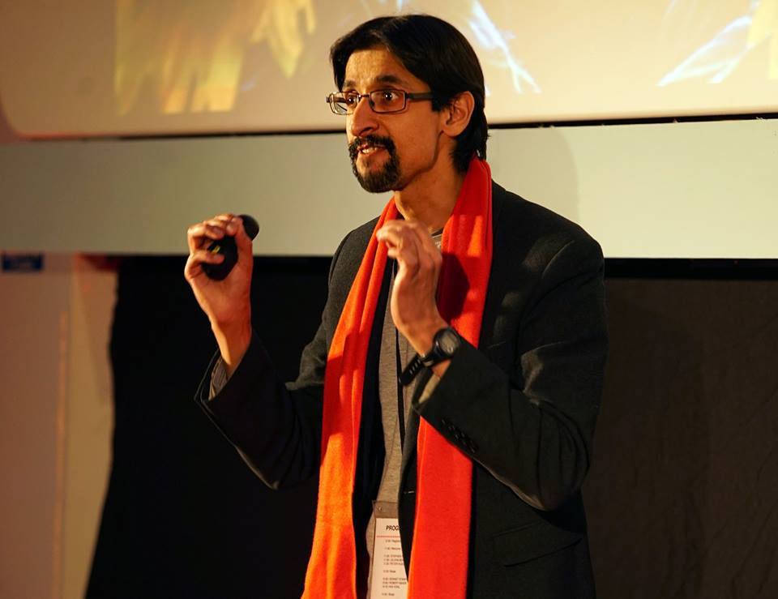
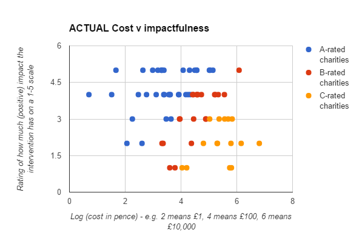
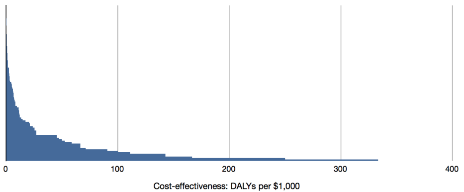
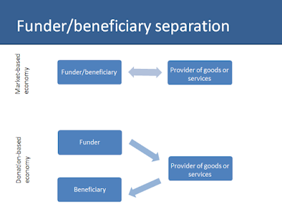
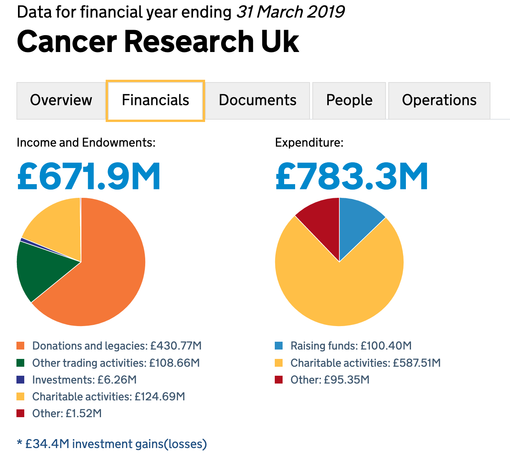
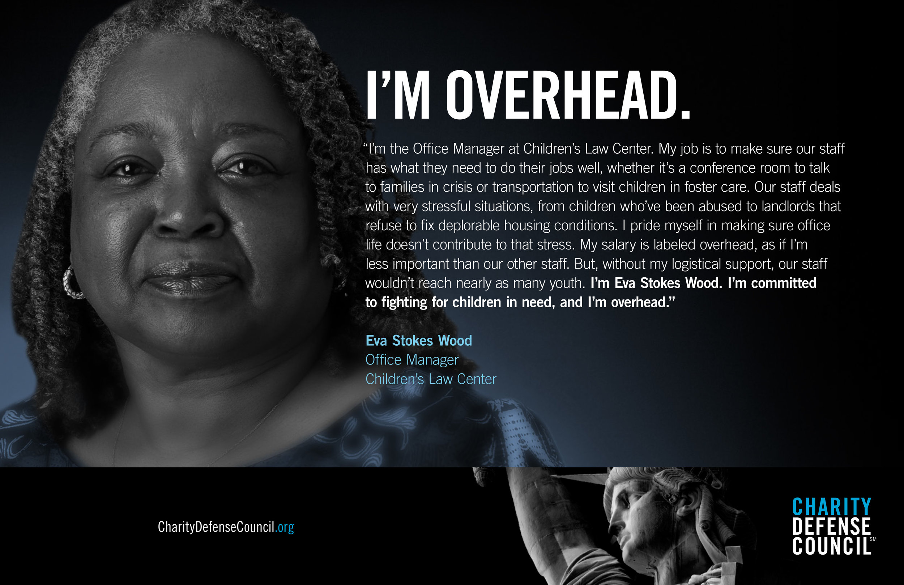
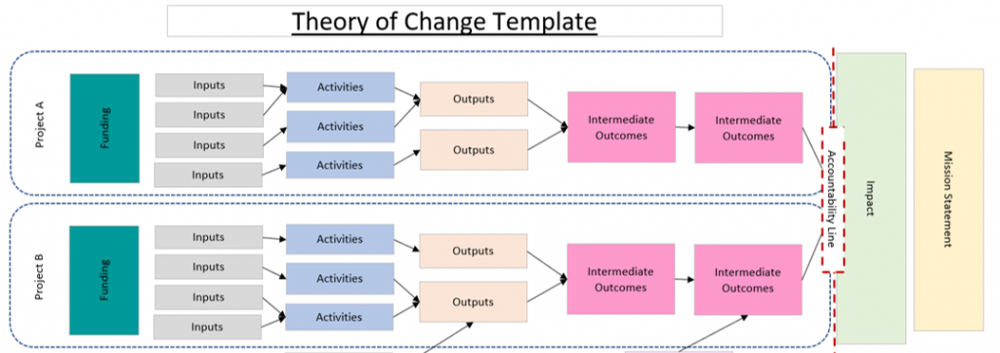
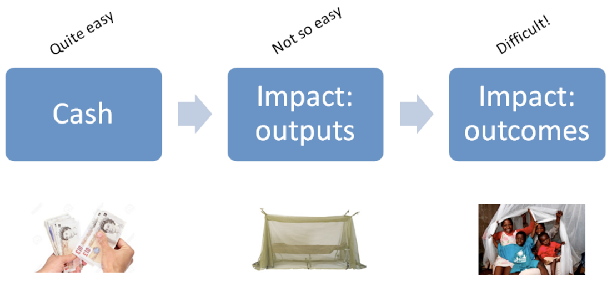
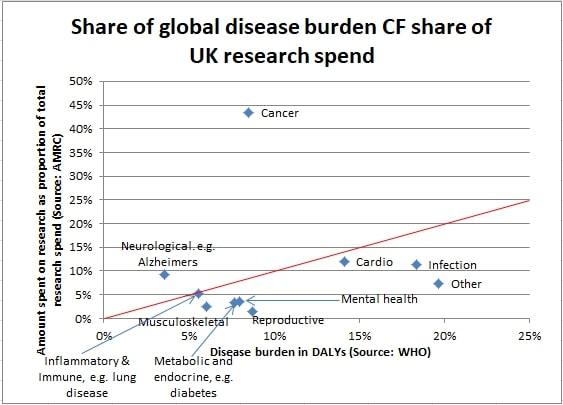
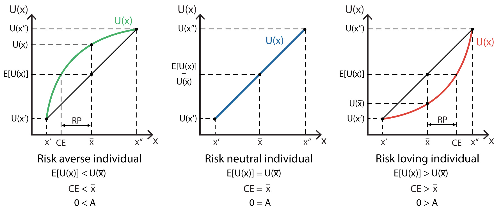

Sanjay Joshi is the co-founder and CEO of SoGive, a non-profit whose database evaluates the impact and cost-effectiveness of UK charities. We begin by discussing why cost-effectiveness is an important but often neglected concept in the charity space, and how the incentives for companies and nonprofits fundamentally differ. This helps explain why donating to different charities can have hugely different levels of impact. Next, Sanjay argues why some commonly used measures, like admin costs and CEO pay, are misleading criteria to judge charities by. Instead, he explains So-Give's "two-question framework" and how it overcomes some common challenges when comparing charities' outcomes. Lastly, Sanjay advises people looking to get involved in charity entrepreneurship, reflecting on some of the obstacles he had to overcome.

Our write-ups help you delve deeper into the ideas discussed in the podcast, including links and references to further readings.

## **Book Recommendations 📚**

- "[The Moral Imperative toward Cost-Effectiveness in Global Health](https://pdfs.semanticscholar.org/1016/bb6788716e7b489c08853ce64f0063870a4b.pdf)" by Toby Ord
- "[Thinking about charity](http://thinkingaboutcharity.blogspot.com/)" by SoGive
- "[Your Philanthropy News Round-Up](https://mailchi.mp/cd49b5e3de8a/your-philanthropy-news-roundup-from-sogive)" by SoGive

<Book url="https://pdfs.semanticscholar.org/1016/bb6788716e7b489c08853ce64f0063870a4b.pdf" image="book-sanjay-1"/>
<Book url="http://thinkingaboutcharity.blogspot.com/" image="book-sanjay-2"/>
<Book url="https://mailchi.mp/cd49b5e3de8a/your-philanthropy-news-roundup-from-sogive" image="book-sanjay-3"/>

## Why care about charity cost-effectiveness?

In our previous episodes on effective altruism, we have often talked about how vital "cause selection" is when trying to do good: [George Rosenfeld](https://hearthisidea.com/episodes/george) emphasised the importance of "counterfactual impact" when setting up MWA (e.g. How much money went to charity X compared to if we did not exist?); [Eve McCormick](https://hearthisidea.com/episodes/eve) explained the "ITN framework", which can be particularly useful when first thinking about how best your career can have a social impact.

### Expectations versus reality

SoGive is very much based on this cause selection thinking, applying it to the charity space and taking it further. What SoGive essentially asks us to think is "how much good will donating £1 to charity X be, and is this the best option out there?".

Most people, when asked if they care where their donations go and what good it will do, would naturally say yes. If everyone behaved 'rationally' and donated to the best charities possible, then we would therefore expect that all charities have fairly similar levels of cost-effectiveness.

Suppose charity X can save one life for £100, charity Y can save one life for £200, and charity Z can save ten lives for £1,000. No one should donate to Y; if they donate to X instead they can save twice as many lives! Charity Y cannot 'compete' and they receive no donations. This is a bit like Adam Smith's "invisible hand", only that here people are rationally *unselfish* in choosing what charities to donate to. There is also no difference between X and Z — per marginal £1 donated, they are just as good as each other. Thus, we are only left with the most cost-effective charities, with a positive and linear relationship between impact and cost.

##### Source: [Thinking about charity](http://thinkingaboutcharity.blogspot.com/)

Wonky Aside: You can also think of this as people donating to the charity with the highest marginal benefit. Thus charities with diminishing returns will receive funding up to a given point (and thus in a perfectly competitive market, all charities will be operating at the same marginal benefit). For example, supplying malaria nets to a small village of 1,000 is high impact at first, but supplying the 1,001st net has a pretty low marginal benefit. Rational donors might fund the first 1,000 nets but then 'switch' to other charities until every other better alternative has been exhausted.

However, looking at the actual data, we see nothing of the sort! This is what Sanjay discovered when he did his first [Excel analysis](http://thinkingaboutcharity.blogspot.com/2016/09/most-charities-are-not-cost-effective_21.html?view=sidebar). There are huge differences in how cost-effective charities are: some perform incredibly well (blue), others relatively poorly (yellow). Looking at this, it seems pretty hard to argue that donors care *in practice* about how much "bang for buck" charities end up having. Note that, in the graph below, costs are depicted on a log scale: there is a ten-thousandfold difference between 2 and 6.

##### Source: [Thinking about charity](http://thinkingaboutcharity.blogspot.com/). Note that this is an early iteration of the SoGive rating methodology, which is not the same as the current SoGive rating approach.

### The moral imperative towards cost-effectiveness

So far, this has been a very technical argument; and many people may remain unconvinced that the existing state of affairs with respect to charitable effectiveness is something worth spending time and energy to change. A common objection is that it seems counter-productive to dissuade people from donating to causes that at least still do *some* good. But in a world where resources to the charity sector are finite, choosing to support one charity does imply an *opportunity cost* of not supporting another. Thus, we *should* be concerned with if our choice is the "right one".

Toby Ord's [article](https://pdfs.semanticscholar.org/1016/bb6788716e7b489c08853ce64f0063870a4b.pdf) (and [talk](https://www.youtube.com/watch?v=iGCVRA7T7FE&feature=youtu.be)) examines the tremendous human cost that inefficient giving causes in global health. Using DCP3 systematic [assessment](http://dcp-3.org/) of interventions, we can see how many more potential disability-adjusted life-years could be saved with the same budget if we just prioritised funds better. Toby Ord strikingly notes that:

> The difference between the most and least cost-effective interventions can **produce as much as 15,000 times the benefit** in disability-adjusted life-years. From the moral perspective, this means that hundreds, thousands, or even **millions of deaths are a direct result of our inability to allocate** according to maximum health gain.

Even under much more conservative estimates, effective prioritisation could have a huge impact. If for the same price we can save 1,000 lives with one intervention and 10,000 with another, moving funding from the former to latter saves 9,000 lives. "Redirecting funding is so important that it is almost as good as adding new funding directly toward the superior intervention".

##### Source: Ord (2013)

And this is all in the context of global health, an area that is on the whole pretty cost-effective because interventions are medical (i.e. high impact of saving lives) and in the developing world (i.e. low cost). Extending prioritisation to the wider charity space — which includes funding expensive art galleries, recreational programs and homoeopathy — the moral imperative could be even larger.

### Funder-beneficiary separation

Why does this situation of ineffective giving come about in the first place? Sanjay [argues](http://thinkingaboutcharity.blogspot.com/2017/04/funder-beneficiary-separation.html) that much of this has to do with "funder-beneficiary separation". That is the one paying for a thing (donor) and the one who benefits from a thing (beneficiary) are different people.

##### Source: [Thinking about charity](http://thinkingaboutcharity.blogspot.com/2017/04/funder-beneficiary-separation.html)

Think about how much time we can frustratingly spend looking at what laptop to buy, how many different models and specs we compare, how many online articles and reviews we read. Now think about how little time we spent evaluating the last charity we donated to. Similarly, we all know how much a pint of [soy] milk costs — but when asked how much a malaria net or a suicide helpline costs, most of us would struggle (you can test yourself [here](https://youtu.be/HJnOfOjeaQ0?list=PLlgnXAv3sBTaqXqnkJ25buHE5n6kHHWrG&t=132)). We have a personal *incentive* to know about the benefits of a laptop and cost of milk because this affects us; we do not have the same incentive for charities because we are not the ones who are impacted.

Stefan Schubert [proposes](https://www.effectivealtruism.org/articles/ea-global-2018-psychology-of-ea/) that donors might also have different preferences that deviate from effective giving. Firstly, people might want to get a "warm glow" from charities. For example, we might care more about projects that have resonated personally or where we can first-hand see the impact. Secondly, people might want to signal to their community with their donation. For example, we might donate more to a school's official choice of charity because of charity or because we get a t-shirt that shows we are part of the crowd.

If donors do not care much about cost-effectiveness, then charities also have very little incentive to care, so long as they get continued funding. Charities might even have to be purposefully inefficient to meet the 'demand' of donors — such as in spending money on PR to legitimise their activities.

## How not to evaluate charity cost-effectiveness

Having shown that we should care about charity cost-effectiveness, we must now think about how to measure it. Sanjay warns that some of the most common criteria are deeply flawed.

### Admin Costs

One aspect that many people focus on is overheads, which encompasses all "administrative" costs like bookkeeping, fundraising, and human resources. This is not money that directly benefits people in need, so it is a clear sign of inefficiency — right? Indeed, this is certainly the impression one gets when looking at the UK Government's Charity Commission website: The bigger the share of yellow "charitable actives", the better the charity.

##### Source: [UK Charity Commission](https://beta.charitycommission.gov.uk/charity-details/?regId=1089464&subId=0)

But Sanjay [warns](http://thinkingaboutcharity.blogspot.com/2015/10/stop-looking-at-admin-expense-ratios.html?view=sidebar) there are many reasons to dispute this claim that any spend not on 'charitable activities' should be minimised (for a deeper discussion and data see also Chapter 2 of Caroline Fiennes's [book](https://www.goodreads.com/book/show/13819362-it-ain-t-what-you-give-it-s-the-way-that-you-give-it?from_search=true&from_srp=true&qid=fvmdlhPCmm&rank=1)).

Fundamentally, charitable actives do not straightforwardly equate to impact. As was discussed at length in the previous section, the actual outcomes for beneficiaries are what matters, and this has nothing to do with admin costs. Charity Science Foundation considers an extreme [example](https://www.charityscience.com/blog/how-charities-are-actually-wasting-your-money-video-and-infographic): Is an AIDS charity that spends 30% on overhead less effective than a homoeopathy charity that has zero overhead?

We "confuse morality with frugality" when thinking that overheads are not part of the impact, as noted by the entrepreneur and activist Dan Pallotta.. Overhead is key to make charities operate smoothly and invest in its growth. A charity that wants to grow should invest in a website, hire offices, and recruit excellent staff. Likewise, investing in fundraising activities is often a very smart thing to do. Dan Pallotta's [TED talk](https://www.ted.com/talks/dan_pallotta_the_way_we_think_about_charity_is_dead_wrong/transcript) (and [article](https://ideas.ted.com/correcting-the-overhead-myth-how-dan-pallottas-ted-talk-has-begun-to-change-the-conversation/)) gives a powerful example from his charity:

> Now, if you were a philanthropist really interested in breast cancer, what would make more sense: go out and find the most innovative researcher in the world and give her 350,000 dollars for research, or give her fundraising department the 350,000 dollars to multiply it into 194 million dollars for breast cancer research?

##### Source: [Charity Defence Council](https://www.charitydefensecouncil.org/creative)

### Salaries and CEO pay

A similar argument comes when looking at charity salaries. "Fatcat pay" of non-profit CEOs is a common source of outrage in the media (from the [Daily Mail](https://www.dailymail.co.uk/news/article-7389327/Five-figure-rise-charity-bosses-vast-wages-executive-paid-300-000-receives-134-000-boost.html) to the [Guardian](https://www.theguardian.com/voluntary-sector-network/2017/jan/20/salaries-charity-ceos-criticism-marketing-supporters)). But Sanjay [argues](http://thinkingaboutcharity.blogspot.com/2014/08/focus-on-charitys-impact-not-its-exec.html?view=sidebar) this again distracts from what matters for charities, which is what *impact* charities have.

It may very well be that paying a salary is necessary to attract the right talent with a unique skill set. If paying a CEO £100,000 means that the charity can create an extra £200,000 of value for people in need, this seems the right thing to do. It is worth noting that even if headline salary figures, non-profit CEOs are essentially taking a huge pay cut with their career. An NCVO [report](https://www.ncvo.org.uk/images/documents/about_us/our-finances-and-pay/Executive_Pay_Report.pdf) found that charity leaders receive "between 25% and 45% less pay than they could command elsewhere".

In any case, CEO salaries make up a very small part of the budget, often less than 1%, and so it is dubious that this can be a critical source of inefficiency — a point Sanjay makes in [this blog post](https://thinkingaboutcharity.blogspot.com/2014/08/focus-on-charitys-impact-not-its-exec.html). It is also interesting to note that worrying about non-profit CEO pay seems like a double standard, as Dan Pallotta notes (see also [here](https://www.ted.com/talks/dan_pallotta_the_way_we_think_about_charity_is_dead_wrong/reading-list)):

> We have a visceral reaction to the idea that anyone would make very much money helping other people. Interestingly, we don't have a visceral reaction to the notion that people would make a lot of money not helping other people.

Overall, the key takeaway is that just looking at overhead and CEO pay is almost certainly going to be misleading. It is unlikely that we, as members of the general public, have a better understanding of how a charity should spend its money than the charity itself. Indeed, Sanjay [notes](http://thinkingaboutcharity.blogspot.com/2015/12/what-can-bouncers-teach-us-about.html?view=sidebar](http://thinkingaboutcharity.blogspot.com/2015/12/what-can-bouncers-teach-us-about.html?view=sidebar)) that obsession with these two measures probably has more to do with a fear of being cheated than actually wanting to do good. If we cared about beneficiaries, then we should look at the outcomes that a charity provides for them.

## How to evaluate charity cost-effectiveness

### Theory of Change

To evaluate a charity's outcomes, Sanjay says we can use the 'theory of change' as a guideline. Theory of change is a framework that many nonprofits and social enterprises use to guide their missions (you can find a comprehensive guide [here](https://www.thinknpc.org/wp-content/uploads/2018/07/Creating-your-theory-of-change1.pdf)). In simple terms, it gets charities to question *why* they take activities by thinking through what inputs are required, what outputs it will achieve, and in turn what outcomes this will create. At each step, we might also question what assumptions are needed for us to be successful.

##### Source: [Analytics in Actions](https://analyticsinaction.co/theory-of-change-vs-logic-model)

### The SoGive Method

The key insight is that we can use the same theory of change framework to evaluate charities. For each project/activity a charity does, we can identify the inputs and outcomes accordingly. This gives rise to the ["two-question method"](http://thinkingaboutcharity.blogspot.com/2019/08/the-sogive-approach-to-assessing.html?view=sidebar):

1. How much does the charity's intervention cost?
2. And what do the beneficiaries get for that money?

To answer these two questions, SoGive looks at the publicly available information, particularly at charities' annual reports and financial accounts. If a charity engages in multiple projects/activities then SoGive chooses the most representative project (i.e. where the next donation is most likely to go to), breaking down inputs and outcomes accordingly.

Finding information about costs is pretty straight forward since registered charities are legally required to report this. There is no such requirement for outcomes. Charities more often report their outputs, as these are more easily observable. For example, it is much easier to know how many calls a suicide hotline answered than how many lives it ended up saving. Even if a charity produces its own estimates there is reason to remain sceptical about how reliable the underlying assumptions are. This may thus require looking at academic papers, collaborating with other charity evaluators (like [Give Well](https://www.givewell.org/) and [Animal Charity Evaluators](https://animalcharityevaluators.org/)), or conducting original research oneself.

##### Source: [SoGive](https://sogive.org/faq.html)

Once this is worked out, we can then judge a charity's effectiveness by benchmarking "outcomes for inputs" it against the best-found alternatives. Give Well's in-depth [assessment](https://www.givewell.org/how-we-work/our-criteria/cost-effectiveness/cost-effectiveness-models) of global health charities shows many excellent charities can save a human life for $1,000-$4,000, and thus SoGive uses £1,500 as its approximate benchmark. If a charity can create an outcome that is credibly about as good as saving a life for £1,500 it can be deemed as cost-effective; if it cannot then donating to it does not maximize the potential impact of our donation.

For more details, see SoGive's [FAQ](https://sogive.org/faq.html)

### Challenges

There are many challenges to correctly evaluating a charity's cost-effectiveness. We consider a few major ones here.

**Comparing vastly different outcomes:** Clearly, saving two lives is better than one. But in practice, we might face ethical dilemmas that are more ambiguous. For example, is it better to spend £1,500 saving a human life or restoring sight to 100 people?

Sanjay notes that fortunately, most of the trade-offs that SoGive encounters in practice are much less controversial. This is due to just how extreme differences in cost-effectiveness currently are. For example, most moral frameworks would agree that saving a life is better than funding a holiday for an inner-city child. To answer these more difficult cases, SoGive is currently conducting a "moral judgement survey" to elicit what people think and provide recommendations to one's values accordingly.

**Measuring less tangible impacts:** Whilst measuring direct work seems pretty straightforward, other activities are much harder to assess. For example, when we fund cancer research we have no idea how "productive" it will be (an initially promising drug may turn out to be a dead-end) but there could be huge upshots in the future.

Sanjay notes that these causes are difficult to measure, but SoGive is finding better ways to do it. In particular, we should look at how much funding a research area is *already* receiving and how much good it might do if a cure/treatment is found. The figure below plots a disease's research funding share against the disease burden (measured in how many disability-adjusted life years lost). Looking at the graph below we see that some causes receive disproportionally high funding, especially cancer (9% of disease burden but 43% of research spend). Others, like mental health and diabetes, receive much less. For Sanjay's full and nuanced take on this, see this [blog post](http://thinkingaboutcharity.blogspot.com/2017/08/donating-to-medical-research-heres-why.html?view=sidebar).

##### Source: [Thinking About Charity](http://thinkingaboutcharity.blogspot.com/2017/08/donating-to-medical-research-heres-why.html?view=sidebar)

**Dealing with risk and uncertainty:** Often we cannot be exactly sure about what impact a charity will have. For example, what is better, spending £1,000 to save one life with certainty or have a 1% chance of saving 100 lives? Many people have risk-averse preferences and would say the former option is better. SoGive's approach is to remain risk-neutral. That is, in our example, it would say both options are just as good as each other since the *expected* life saved is 1 in each case.

##### Source: [Policonomics](https://policonomics.com/wp-content/uploads/2016/02/Risk-aversion.jpg)

Risks involve a range of different outcomes with some known probabilities. They can therefore be measured and controlled. However, in some cases we might not even know the underlying probability — that is, we have *uncertainty* about a charity's impact. For example, it is hard to quantify in any way how much an anti-nuclear group reduces the probabilistic threat of armageddon (we don't have any past data points from armageddon previously occurring). In such cases, Sanjay's current approach is to take a sceptical attitude towards modelling: the prior is that the charity is not achieving much and we need much evidence to change our mind.

**Measuring can skew incentives:** The last worry is to think about some of the unintended consequences that scrutinising charity's cost-effectiveness can have. Note that SoGive's "two-question method" is pretty flexible and holistic, so we might be able to discount the threat of [Goodhart's Law](https://en.wikipedia.org/wiki/Goodhart's_law), whereby charities begin to optimize for a strict target rather than 'true' impact (contrast this to admin costs and CEO pay). Likewise, because SoGives allows for a borad interpretation of 'good' outcomes we may also avoid the [McNamara fallacy](https://en.wikipedia.org/wiki/McNamara_fallacy), where simply ignoring things that cannot be easily measured means we miss out on a lot of important information.

However, it might be the case that by constantly assessing charity's annual reports, we encourage them to become too focused on the short-term. Charities may become discouraged from undertaking ambitious long-term projects that do not show any measurable returns for many years. Think of how many hugely successful tech companies did not return a profit for many years because they were still growing and investing in their capabilities (Amazon, Uber, etc.).  This concern is in fact addressed by SoGive, since their in-depth analysis often does also consider long-term and ambitious projects.

A related concern is that by placing so much emphasis on 'successes', we penalise the 'failures' that underlie the innovation process. Charities may become discouraged from experimenting and trying out new things. To avoid these skewed incentives, it is important that SoGive takes a long-term perspective and evaluates a charity's record over multiples period; and continually updates it over time.
## Get Involved

If you found these ideas interesting and want to get involved, there are many opportunities out there:

- You can *volunteer* for SoGive! They have regular cohorts of charity evaluators that they advertise on their [website](https://sogive.org/careers.html). You can also email Sanjay if you think you can contribute —sanjay[at]sogive[dot]org.
- GiveWell hire *full-time positions* researchers, ranging from analyst (finished undergrad) to fellow (finished PhD). You can check out their [job board](https://www.givewell.org/about/jobs). They are located in San Francisco.
- Animal Charity Evaluators have an internship program that lasts 3-6 months. These are done remotely (so anywhere from the world!). You can find out more [here](https://animalcharityevaluators.org/about/contributors/join-our-team/).
