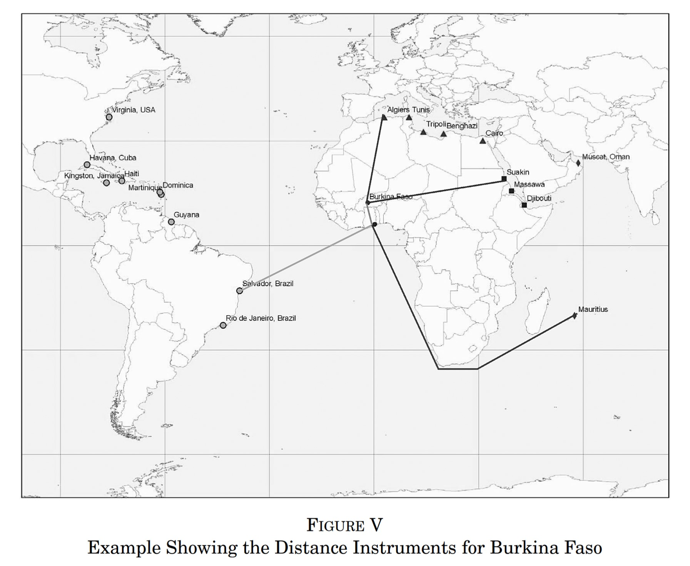
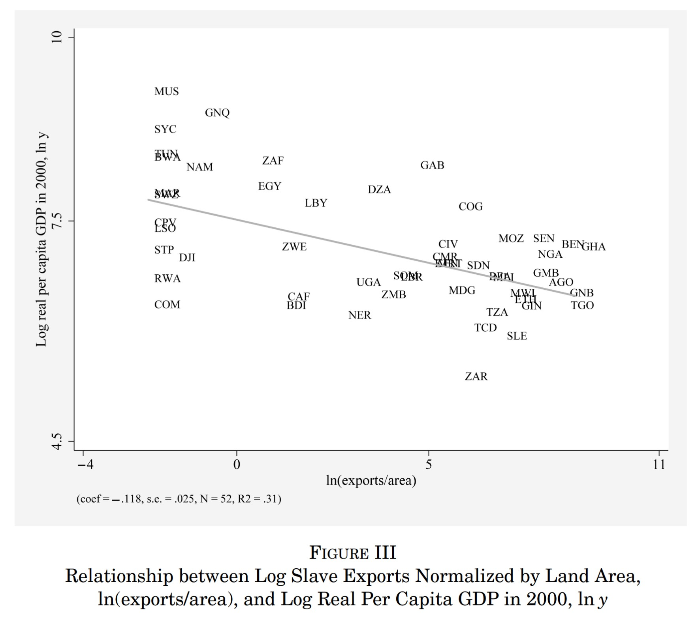

Jaime Sevilla Molina is a visiting researcher at the [Center for the Study of Existential Risk](https://www.cser.ac.uk/), and this year begins his PhD at the University of Aberdeen studying [Bayesian](https://www.lesswrong.com/posts/x7kL42bnATuaL4hrD/bayesian-reasoning-explained-like-you-re-five) [reasoning](https://arbital.com/p/bayes_rule/?l=1zq). Previously, he was a  Research Fellow at the [Future of Humanity Institute](https://www.fhi.ox.ac.uk/), and his academic background is in mathematics and computer science. We covered a lot of topics in this episode. First, we discuss how the social sciences infer causation from observed correlations, particularly in historical economic data. We apply this to a case study: [Nathan Nunn's](https://scholar.harvard.edu/nunn/home) et al.'s work investigating 'cultural persistence' mainly in the context of the slave trade. Next, we discuss forecasting: what it is and why it matters. Also — if it matters so much, why are good forecasting skills not more ubiquitous? Jaime finally walks us through an example of forecasting emerging technologies in quantum computing. This write-up summarises our conversation and includes links and references for more information.

## Jaime’s Recommended Reading

- [Superforecasting](https://www.goodreads.com/book/show/23995360-superforecasting) by Philip E. Tetlock & Dan Gardner
- [Understanding Cultural Persistence](https://scholar.harvard.edu/nunn/publications/understanding-cultural-persistence-and-change) and [other papers](https://econpapers.repec.org/RAS/pnu17.htm) by Nathan Nunn
- [The Precipice](https://www.goodreads.com/book/show/50485582-the-precipice) by Toby Ord

 <Book url="https://www.goodreads.com/book/show/23995360-superforecasting" image="book-jaime-1"/> <Book url="https://econpapers.repec.org/RAS/pnu17.htm" image="book-jaime-2"/> <Book url="https://www.goodreads.com/book/show/50485582-the-precipice" image="book-jaime-3"/> 

## Inferring Causation

### Motivation

Jaime describes the overriding aim of his research as to "predict the counterfactual economic and social impact of emerging technologies, cultural interventions and policies in a decision-relevant way". Why does this matter?

Firstly, a more accurate understanding of the timelines over which technologies are expected to develop, and their likely impact when they do develop, can inform which kinds of research should be *prioritised*. In particular, work on mitigating the negative impacts of some outcome should be prioritised for those outcomes which are (i) most likely and (ii) could have the most negative impacts when or if they do come about. Since research budgets and brains are finite, we need to know how to allocate them best. For instance, many [prominent researchers](https://www.goodreads.com/book/show/44767248-human-compatible) have been discussing a number of serious risks related to the development of artificial general intelligence. In order to prioritise which among those risks should be given the most attention, it is necessary to forecast the approximate probability and impact of each of the outcomes which have been suggested. See e.g. [this recent interview](https://80000hours.org/podcast/episodes/ben-garfinkel-classic-ai-risk-arguments/) with Ben Garfinkel for more.

Secondly, making counterfactual predictions matters for *planning* and *action*. Suppose some hyped new technology turns out to be less positively impactful than most people thought — then it may have been wise to divert investments to more promising technologies. Predicting these outcomes in advance not only saves wasted resources which might be better allocated elsewhere, but may also sound the alarm in advance of potentially disastrous non-obvious consequences. The same thought applies to policies and cultural interventions (such as mass movements). For instance, both [academics](https://www.oxfordmartin.ox.ac.uk/downloads/academic/The_Future_of_Employment.pdf) and [politicians](https://www.nytimes.com/2019/11/14/opinion/andrew-yang-jobs.html) have raised serious concerns about the threat of widespread job losses from automation. In order to determine what policies are likely to best address the issue, it is necessary to forecast who will be most effected by automation, to what extent, and over what kind of timelines.

### Counterfactuals and causality

The 'counterfactual impact' of some intervention is just the difference between an outcome where that intervention happened, and the outcome when it did not. In this sense we can also think of it being the causal effect of our intervention. For example, the 'counterfactual impact' of medicine is the difference between how healthy I am if I take the medicine versus if I do not. This is *not* the same as how healthy I am after taking the medicine versus before. It could be that the medicine does nothing at all and I just recover in time, regardless of I take the medicine or not. It is also *not* the difference between people who take medicine versus not — the only reason you take medicine is if you are unhealthy in the first place. In practice, it is often extremely hard to discern true causal effects from mere correlations.

Thinking for too long about what really constitutes causation might seem artificial, or contrived. That may be because just about everybody has a robust intuitive sense for when one thing causes another. When the white snooker ball collides with the red ball, nothing could be more obvious than the fact that the movement of the first ball caused the movement of the second. As such, Jaime notes, the social sciences have traditionally proceeded by appealing to intuitions about causation in one form or another. Naturally, they make use of a large repertoire of statistical methods — but often this conceals some informal, intuitive judgement call about what could most plausibly be causing what. For more, see [this article](https://plato.stanford.edu/entries/causation-counterfactual/) on the philosophy behind counterfactual theories of causation.

Over the past half century or so, says Jaime, this has been slowly changing. More formal, unified, and mathematically precise models of causality have emerged — revealing and clarifying the common structure shared by these various statistical methods and intuitions. For more, see this slide deck: <a href='http://www.homepages.ucl.ac.uk/~ucgtrbd/talks/bayesnetmeetup_causality.pdf'>Bayesian Networks and the Search for Causality</a>.
    

### An Econometric Model of Causality

Suppose $Y_{i}$ is how healthy person $i$ is. The **causal effect** $\Delta_{i}$ is the difference between how healthy a person feels if they received treatment ($Y_{1i}$) and if they did not ($Y_{0i}$). Taking expectations $E[ ]$ we thus get:

$E[\Delta_{i}]=E[Y_{1i}-Y_{0i}]$

To make this applicable to the real world, we need to now specify if this is "given that" person $i$ received treatment ($| D_{i}=1$) or not ($| D_{i}=0$). Let us assume for our example that they did:

$E[\Delta_{i}|D_{i}=1]=E[Y_{1i}-Y_{0i}|D_{i}=1]=E[Y_{1i}|D_{i}=1]-E[Y_{0i}|D_{i}=1]$

What this last bit says is that we would like to look at person $i$'s health where they simultaneously received treatment and no treatment. However, in the real world we can only observe one such outcome. We already said person $i$ received treatment so it is impossible to observe the counterfactual $E[Y_{0i}|D_{i}=1]$ (how healthy someone feels after not receiving treatment given that they received treatment).

So if we can never observe counterfactuals of person $i$, how do we go about estimating the causal effect? We compare them to a different person $k$ who is not treated. This gives us the **observed effect**:

$E[Y_{1i}|D_{i}=1]-E[Y_{0k}|D_{k}=0]$

Substituting in the equation from above we get:

$E[\Delta_{i}|D_{i}=1]+\{E[Y_{0i}|D_{i}=1]-E[Y_{0k}|D_{k}=0]\}$

We can thus see that the observed effect is made of two components. The first term is the causal effect, the second term {curly brackets} is the **selection bias**. The observed effect is only a good measure of the causal effect if the selection bias is zero: $E[Y_{0i}|D_{i}=1]=E[Y_{0k}|D_{k}=0]$. That is, the counterfactual $i$ (who in a parallel universe receives no treatment) is expected to be equivalent to person $k$ (who in the real world receives no treatment).

There are many reasons why selection bias might exist. Take the fact that people who use medicine may have underlying health conditions and thus lower health outcomes regardless ($E[Y_{0i}|D_{i}=1]<E[Y_{0k}|D_{k}=0]$). Thus, if we just compared health outcomes between treatment and non-treated, we might falsely conclude that the medicine is causing $k$ to be less healthy!

### Eliminating Selection Bias

When economists are trying to establish causality they are essentially trying to ensure that we have no selection bias. One way is to manually control for any such **confounding variables** $X$ that cause selection bias, in our case underlying health conditions. This is known as the "conditional independence assumption", which says there is no selection bias once we control for $X$:

$E[Y_{0i}|D_{i}=1,X_{i}]=E[Y_{0k}|D_{k}=0,X_{k}]$

But controlling for every such variable is hard. We might not have data available on $X$, such as how much people smoke or their genes. We also might not even know what variables $X$ are or how to specify them. Does age have a linear or a quadratic effect? Does screen time matter for health? Does sport improve health or do you need to be healthy to do sport? These questions may not be easy to answer.

An alternative to this are using **randomised control trials**. If we *randomly* assign people to treated and non-treated groups, then we expect that on *average* people would have identical outcomes in absence of our experiment. That is, we eliminate selection-bias through randomisation. This is very popular in medicine and has recently received much attention in economics after the [2019 Nobel Prize](https://www.nobelprize.org/prizes/economic-sciences/2019/summary). However, RCTs are very expensive and have a whole range of other problems. For instance – because they are inherently small in size, it can be problematic to "scale-up" their conclusions or generalize to other contexts. A well-balanced discussion of RCTs can be found in this [blog post](https://afinetheorem.wordpress.com/2019/10/17/what-randomization-can-and-cannot-do-the-2019-nobel-prize/).

A **natural experiment** is when this randomisation happens by accident, rather than being intentionally set up by some economist. Of course, finding these is very hard and thus limits what economists can study.

Fortunately, there are some clever statistical methods we can use. Perhaps the most popular one is the **instrumental variable**.  This is a variable $Z$ that is related to how likely someone receives treatment $D$ (the relevance condition) but is *uncorrelated* with the error $e$ i.e. selection bias (the exclusion restriction). We can show this graphically:

If these two conditions are fulfilled, then an instrumental variable can identify the true causal effect using linear regression. The exact reasons why are more complicated, but see this [textbook](http://www.mostlyharmlesseconometrics.com/book-contents/) for a intuitive explanation, this [chapter](https://www.sciencedirect.com/topics/economics-econometrics-and-finance/instrumental-variables) for a academic overview, and this [video](https://www.youtube.com/watch?v=pI9YGSJ2qPk) for an applied example.

There are many famous [examples](https://www.aeaweb.org/articles?id=10.1257/jep.15.4.69) of instrumental variables. One of the most famous ones is [Angrist and Krueger (1990)](https://www.jstor.org/stable/2937954), which studied the causal effect of education on earnings. They note that in the US compulsory schooling is based on if you are 16 years old when school starts. Someone born on the 31st of December is thus required to complete one more year of school than someone born on the 1st of January. Hence your birth quarter is related to treatment (education) but not error. The authors thus find that an additional year of compulsory schooling raises earnings by ~7.5%.

Now that we (hopefully) have a clearer idea of what causality is and how to estimate it, we can apply it to cases where causality isn't as clear as 'snooker ball hits red ball'.

Going further, '[Bayesian networks](https://en.wikipedia.org/wiki/Bayesian_network)' represent a popular way of modelling (and graphically representing) more complex joint probability distributions. For introductions, see [here](https://www.bayesserver.com/docs/introduction/bayesian-networks) or [here](https://machinelearningmastery.com/introduction-to-bayesian-belief-networks/). For interactive examples, see [this site](https://www.bayesserver.com/examples/). More recently, the formalism of Bayesian networks have been augmented to understand and represent causal relationships, as in [structural causal models](https://plato.stanford.edu/entries/causal-models/) and [causal Bayesian networks](https://deepmind.com/blog/article/Causal_Bayesian_Networks).

## Cultural Persistence

Jaime has recently been investigating the evidence for 'cultural persistence'. This is the belief that cultural features can persist over time and be a significant determinant of (economic) development. Crudely put: History  → Culture → Economics.

### The African Slave Trade

We discuss the seminal work by Nathan Nunn (2008) "[The Long Term Effects of Africa's Slave Trades](https://scholar.harvard.edu/nunn/publications/long-term-effects-africas-slave-trades)". The paper specifically looks at the example of the African slave trade to see if it can explain country's underdevelopment today. It bases this hypothesis on a rich historical literature on how people of similar African ethnicities enslaved each other to sell to European traders, creating ethnic fractionalisation that influences today's civil strife and low level of trusts. Or crudely put, Slave trade → Historically ethnic fractionalisation → Post-colonial low levels of trust → Underdevelopment.

##### Source: Nunn (2008)

To empirically quantify this effect, Nunn makes use of a novel instrumental variable, whereby the sailing distances from each African country to the ports where slaves were traded 'instruments' for the number of slaves exported. Doing this, he finds a significant negative relationship between slave trade and economic development today.

##### Source: Nunn (2008)

Some challenges have been raised to Nunn's findings, in particular whether the instrumental variable satisfies the **exclusion** restriction or not. The distances to slave markets is very likely to be related to other forms of trade, which also matter for economic development. If this is the case, then we are overestimating the causal effect of the slave-trade. Nunn has disputed this, but it remains an active debate.

Another point of contention is the exact causal mechanism through which the slave trade affects economic development. Merely observing causality does not reveal the underlying mechanisms and mediators — a point that Jaime emphasises. In a [later paper](https://scholar.harvard.edu/files/nunn/files/nunn_wantchekon_aer_2011.pdf), Nunn provides evidence that ethnic fractionalization plays a role through creating lower levels of trust. Making use of data on immigrants, Nunn shows that slave trade exposure based on ethnicity matters almost twice as much as based on location. This suggests that the effect is through cultural persistence and not just institutions. However, in practice such distinctions are always blurry (culture affects institutions *and* vice versa) and there may be other slave-trade channels (e.g. lost labour).

If you are interested in cultural persistence, here are some other papers to look at:

- [Alesina et al (2013)](https://academic.oup.com/qje/article-abstract/128/2/469/1943509): "Even among these individuals, all born and raised in the same country, those with a heritage of traditional plough use exhibit less equal beliefs about gender roles today"
- [Schulz et al. (2019)](https://science.sciencemag.org/content/366/6466/eaau5141): "Historical Church exposure and kin-based institutions across populations [...] accounted for individual differences in 20 psychological outcomes"
- [Guiso et al. (2016)](https://onlinelibrary.wiley.com/doi/abs/10.1111/jeea.12177): "Italian cities that achieved self‐government in the Middle Ages have a higher level of civic capital today than similar cities in the same area that did not."
- [Teso (2018)](https://academic.oup.com/jeea/article-abstract/17/2/497/4958443): "Women whose ancestors were more exposed to [the transatlantic slave trade] are today more likely to be in the labor force, have lower levels of fertility, and are more likely to participate in household decisions"
- [Tabellini (2010)](https://onlinelibrary.wiley.com/doi/abs/10.1111/j.1542-4774.2010.tb00537.x): "The exogenous component of culture due to history is strongly correlated with current regional economic development [in European regions]"
- [Dell (2010)](https://scholar.harvard.edu/dell/publications/persistent-effects-perus-mining-mita): "Mita effect lowers household consumption by around 25% and increases the prevalence of stunted growth in children by around 6%-points in subjected districts today"

### Lessons for the future

Whilst cultural persistence is by itself already interesting, Jaime notes how it can also have important lessons for the future. If we know that culture in the past is important in determining outcomes today, then it follows that culture today will be important in determining outcomes tomorrow. Thus, we may want to put even more thought into what values we promote and what cultural values, norms or attitudes we foster. Indeed, figures from Effective Altruism (see our [episode](https://hearthisidea.com/episodes/eve)) are seriously consider how this might be done. William MacAskill talks about it [here](https://www.youtube.com/watch?v=vHTWU-_ruoc); and we will post a link when the book is published.

## Forecasting

### Forecasting with History

In the first part of this episode, we discussed the historical effects of specific 'impact factors' (cultural interventions, institutional changes, new technologies). This is an interesting topic in its own right, but it is also presumably relevant to Jaime's overall research aim — *predicting* the effects of present or future impact factors. So how do these historical examples relate to the project of forecasting the future?

The first reason is the most obvious: history tells us about how the world works, and learning how the world works improves forecasts. Imperceptibly slow future trends may already have played out many times in history: identifying them might help to foresee future developments which would be far more difficult to read off the present state of the world or derive from general principles.

With long stretches of time between making and settling predictions, forecasting involves impractically long 'feedback loops' — the stretches of time between making predictions and finding out if they're accurate. This raises a problem: how can somebody develop the skill of accurate forecasting if they can't rapidly learn from feedback?

This is a second useful application of historical research: to function as a kind of testing ground for 'retroactive forecasts'. Choose some place and time in history, and ask yourself a question about how some factor develops over the next few decades. Make sure this is a question you don't know the answer to. Next, find out how wrong your 'prediction' was, and in which direction. Repeat. In this way, history can sharpen forecasting skills far more rapidly than waiting for forecasts about the present. "Prediction is very difficult", the saying goes, "particularly about the future".

### Counterfactual Thinking

History alone is not sufficient for accurately forecasting the counterfactual effects of impact factors. The key word here is *counterfactual*: **historical events have a frustrating habit of only ever going one way — they never go differently to how they ended up going. Yet, we need a way of talking about 'what-if' questions: "how *would* things have gone if this thing was different?". For instance, what would the economic fate of Nigeria have likely been if the Atlantic slave trade had not occurred? No number of historical facts alone can tell us the answer to such questions without some additional  principles, models, and processes for answering them. Yet, whatever principles are best for answering counterfactual questions about history must also be best for answering counterfactual questions about the impact of future events and developments.

> [A counterfactual question is] a thought exercise which is really important to build your intuitions, but where you do not have access to a historical truth about it. So it's important to not only look at the past, but also have a very strong formal theory that helps you build this ground-truth of counterfactual reasoning.

### Case Studies

Accurate forecasts of particular technologies or outcomes will remain impossible without detailed knowledge of those particular things — irrespective of how good your historical knowledge and principles for counterfactual reasoning may be. Indeed, sometimes history comes up short in the search for precedents of any kind. No amount of history is likely to determine the most reasonable timeline for the arrival of transformative artificial intelligence — because nothing like it has ever been created. Therefore, Jaime tells us, the third and final aspect of his broad research agenda is to embark on detailed research into specific case studies.

For Jaime, this has so far involved research into the applications of artificial intelligence to [climate change](https://medium.com/@jaimesevillamolina/a-brief-introduction-to-the-climate-emergency-af70974b3bb1); and the impacts of [quantum computing](https://arxiv.org/abs/1908.07613) (including its likely implications for AI safety).

> So those are the three pillars of my research. Detailed case studies, doing historical research of impact factors, and understanding the general principles and mathematical foundations behind forecasting — as well as how these forecasts can be fed into decision making.

### Reflectivity

Suppose a team of forecasters anticipate that there is an X% chance of some bad outcome occurring within the next five years. Suppose this X is higher than most people thought — so people take notice of this ominous prediction, and work to reduce the chance that X occurs. Now it would not be accurate to say there is an X% chance of the bad outcome occurring — the forecasters update their guess to Y%, where Y is much lower than X. Why didn't they say Y% in the first place? Well, it might have been the case that an initial guess of Y% would not be sufficient to generate worry, and in turn the actions needed to mitigate the risk. There is an air of paradox here — a sense that it may sometimes be impossible to make accurate forecasts where forecasts themselves interact with the parts of the world being forecast.

For better or worse, Jaime notes, this isn't currently a major problem. A good first approximation of making forecasts is just to picture yourself causally removed from the world, looking in — the same way you might try to predict what happens next in a book or film. That's fortunate, because it make the business of forecasting less complicated than it might otherwise be. It's also *unfortunate*, because the fact forecasts don't much influence the world is, perhaps, indicative that people don't take good forecasts sufficiently seriously.

An obvious example is the scientific consensus around the harmful expected effects of climate change. A rational course of action for a government or large institution to take may be to incur some costs now (such as investments in new sources of energy) in order to avoid much larger costs later. Given these forecasts, and the credibility of the people making them, it instead looks as if these decision-makers are behaving irrationally: against even their own (long-run) interests.

> It's this sad situation. If we were in a world in which we took seriously the forecasts about, like, climate change — and we acted upon them — then sure, that would invalidate our forecasts!

This suggests a related question: why are good forecasting skills so hard to come by? Why don't people take quantifiable forecasting as seriously as some people think they should? First, a note on how forecasting works.

### How forecasting works

Forecasting, in its essence, is the business of making informed predictions about future events. For instance, companies forecast their sales by extrapolating past sales data and adjusting for more general anticipated trends which might affect sales differently. The content of the forecast can take many forms: it can be a binary decision ("Will Donald Trump win the 2020 US presidential election?"), a choice between more than two options ("Who will win the 2020 Democratic vice presidential nomination?"), or a quantitative estimate ("What will Tesla's market capitalization be on 1 January 2021?", "When will we have a coronavirus vaccine?).

Often, there is a clear profit incentive for making accurate forecasts. For instance, Tesla's [share price](https://www.marketwatch.com/investing/stock/tsla) reflects and collects people's best efforts at predicting, among other things, the future of electric cars: crucially, the present value of some asset or publicly traded company integrates predictions about its *longer-term* future. Very often, however, there are fewer incentives for accurate forecasting. Rigorous answers to important questions are therefore comparatively neglected. Such questions may play out over longer timescales, or they may not simply be relevant (enough) to existing share prices. Moreover, as economist [Robin Hanson](http://mason.gmu.edu/~rhanson/ideafutures.html) notes, stocks and bonds "are bets on big bundles of ideas: underlying technology, business strategy, marketing skill, prices of input factors, market demand, etc. You want to bet on just what you think you know about."

When making predictions about e.g. emerging technologies, we may have to wait many decades before the opportunity arises to learn how accurate our prediction was. By its nature, forecasting involves such long stretches of time, because shorter-term questions are often either less interesting, less decision-relevant, or else far from neglected.

Yet, the forecast itself omits information about your *confidence* in making it. Therefore, most forecasts also come with some indication of your confidence, or the *probability* you assign to it. Here's Jaime:

> You have certain information, and you're trying to make a calibrated prediction of what's going to happen. For that, you need to spread your probability mass over different outcomes; you have to entertain different possibilities. That's how it's always going to be. You're never going to have perfect information.

Suppose, over the past 5 national elections, Alice and Bob made predictions about which party would win in each of 50 regions. The next election is coming up, and you want to know who to trust — who has the strongest track record as an accurate forecaster. For each election and district, you have a record of the prediction Alice and Bob made (e.g. 'Blue party') and of their confidence in that prediction expressed as a percentage. You also know which party in fact won in each region. This election, Alice and Bob are making different predictions about which party is most likely to win overall. Suppose you only have this past information to go on — you're new to this country's politics and know nothing yourself about the current election. Here's a question: how do you figure out who to trust? What kind of rule can you apply, using the 250 data points for both Alice and Bob, to learn who is most credible? Take a moment to think about this.

Well, suppose for one region in one election that both Alice and Bob predict that the Orange party will win; but Alice assigns a 95% probability to her prediction while Bob only assigns a 60% to his. If the Orange party ended up losing, intuitively this should count *more* against Alice than it should against Bob. Equivalently, if the Orange party ended up winning, then Alice should get credit for sticking her neck out while we should update less on how credible we think Bob is with what (by his own admission) turned out to be a lucky guess. There is, of course, nothing wrong with making predictions with less than 95% confidence. We *should* however expect a 'well-calibrated' forecaster to get predictions with an X% confidence rating wrong about X% of the time: over-confidence should be penalised. Suppose also we told Alice and Bob the process we use to 'score' their forecasting accuracy in advance. In that case, we shouldn't provide any reason for Alice and Bob to predict anything other than the actual probability they assign to each result. In other words, there should be no way to 'game' our scoring system.

The mathematical details of such scoring are too involved and besides the point (which is another way of saying that this author doesn't understand them). If you're curious, you can read how the forecasting website [Metaculus](https://www.metaculus.com/help/faq/#howscore) scores its users. Simpler and more widely used scoring rules include the [Brier score](https://en.wikipedia.org/wiki/Brier_score) and [Logarithmic score](https://en.wikipedia.org/wiki/Scoring_rule#Logarithmic_scoring_rule).

To be well-calibrated, then, means that the probabilities you assign to your forecasts accurately track the actual weight of evidence you have for those forecasts. By contrast, a forecaster is over-confident if they assign unjustifiably high probabilities to their predictions — in effect, if they are right about their predictions less often than their subjective probabilities would suggest. A single prediction can be over-confident: I might predict with 99% confidence that the price of one Bitcoin will be higher by the end of next month than it is right now, and I might very well turn out to be right. But I'm no Bitcoin expert, so I was not really justified in making such a confident prediction. Less common are underconfident forecasters, where their predictions are correct over the long-run more often than their subjective probabilities would suggest. For Jaime, forecasting is as much about better recognising our own limitations as it is about mere accuracy:

> When people think about forecasting, I think they put a lot of emphasis on precision. They want their forecasts to be as close to the truth as possible. But that generally leads to people making very over-confident statements. For me, it's far more important to be well-calibrated. It's important that the forecasts you make correctly reflect the uncertainty you have around the topic.

To see and even contribute to crowd-sourced forecasting, take a look at the website [Metaculus](https://www.metaculus.com). On this site, anybody is free to create an account and start making predictions about open questions. For illustration, one of the most popular questions on the front page right now is, "Will an AI system do credibly well on a full math SAT exam by 2025?". If you start making predictions, they will start resolving, and you will begin to find out if your guesses were more or less accurate than the average user. The track record of the overall system (aggregating everybody's guesses) is [remarkably good](https://www.metaculus.com/questions/track-record/).

The words 'probability' and 'confidence' have been used interchangeably here. Elsewhere, a distinction is sometimes drawn between 'subjective' and 'objective' probabilities, or else between risk and uncertainty. These distinctions do mark out some practical differences between cases. But here we are not assuming any fundamental distinction between these 'kinds' of probability. Probabilities are best understood here as <i>degrees of belief</i> manifested in terms of betting preferences: roughly speaking you assign probability p to X when you would pay no more than p dollars (or whatever it is you value) to take a bet which pays 1 dollar if X, and nothing otherwise. For more, see <a href='https://plato.stanford.edu/entries/probability-interpret/'>this overview</a> of interpretations of probability.

### Why Quantified Forecasting Matters

Quantified, as contrasted with qualitative forecasting, involves putting a number on it: agreeing on clear conditions under which your prediction will turn out to be right or wrong, making the prediction, and attaching to it a probability (or confidence intervals). This might well be appealing to wonks, nerds, and gamblers — but what use is this quantitative approach for the rest of us? Jaime suggests three reasons.

The first reason is clarity. Quantified forecasting makes it impossible to miss when your predictions turn out wrong. And by accumulating a track record, you can get an impression of which aspects of the world are more or less predictable than you thought they would be. As such:

> [Quantified forecasting] exposes flaws in your reasoning that you would not have noticed otherwise.

The second reason is that quantified forecasting provides a clear and publicly transparent way to find out who is credible: bullshit, hot air, empty gesturing, and profound-sounding platitudes have absolutely nowhere to hide. Suppose two academics have been invited onto the radio to discuss the prospects of, for example, an upcoming recession. They disagree, but they both seem to be making wise-sounding points. As an outside observer, one way to decide who is more credible is to look at their forecasting track records: which speaker has successfully predicted big economic events in the past? One academic may stand out by virtue of her more reliably accurate and well-calibrated track record. More likely, one academic may stand out because they have been bold enough to establish any kind of forecasting record in the first place: why make publicly verifiable and unambiguous predictions in the first place when they might turn out to be verifiably and unambiguously *wrong*? Naturally, this applies to academics in just the same way it applies to politicians, business executives, policymakers, television pundits, and anybody else whose predictions influence decision-making, directly or indirectly.

The third advantage is that quantified forecasting allows for **communication** and **corroboration**. Suppose the two academics from the previous paragraph agree that there is a 'serious likelihood' of a recession this year. This superficial agreement may in fact conceal a substantial disagreement. One might intent to mean 'I assign about a 20% chance to this very serious thing happening". The other might mean, "I assign a serious chance — about 80% — to this thing happening". This disagreement has serious consequences, and prompting our academics to spell out their predictions in quantitative terms would have made it clear. In this way, putting numbers on predictions allows for them to be communicated without loss of information.

> The exercise of putting numbers on our forecasts allows for more precise communication with one another. That's a great strength, and I believe it's the way to go going forward.

Similarly, predictions can be *corroborated* by additional forecasts, as long as those forecasts are well-calibrated. In general, evidence corroborates some claim when it provides additional support beyond your existing evidence. Suppose 10 experts are all 60% confident that some outcome X will occur. Suppose they all reached their conclusion by different means, and using different sources of evidence. Intuitively, you might update your own subjective confidence that X will occur to something higher than 60%.

> If I have lots of forecasts which are vague in the sense of being uncertain, but which are well calibrated, then they are going to aggregate well together. If I have a bunch of calibrated forecasts, I can combine them and get a better forecast. If I have a bunch of over-confident predictions, then there is no sensible way of aggregating them in order to get closer to the truth.

Naturally, quantified forecasting is not a panacea. Some predictions are extremely long-term and/or unprecedented by their nature; in which case a person's relevant 'track record' will either not exist or be far less relevant.

Another way of framing the value of quantified forecasting is by considering 'prediction markets'. Consider the simple binary-type forecasts of the kind "Will Donald Trump win the 2020 US presidential election?".  A prediction market, such as [PredictIt](https://www.predictit.org/), is in effect a kind of futures market. Anybody can effectively bet on such questions by buying some amount of either the 'yes' or 'no' options at their market price — between \$0 and ​\$1. Each option you bought pays out \$1 if the predicted outcome materialises, and ​\$0 if not. Just like buying and selling shares in companies, if you are able to make more accurate predictions than the market then you stand to win money. As such, the *only* major incentive in a prediction market is forecasting accuracy — *whenever* you make a prediction for any other reason, you stand to lose money in expectation. Contrast this with pressures for making forecasts in other environments, such as on social media or in the company of your peers; where extraneous incentives might also influence your predictions such as the pressure to signal ethical beliefs, political allegiances, or just that you are less clueless than you in fact are.

Here is [Alex Tabarrock](https://marginalrevolution.com/marginalrevolution/2012/11/a-bet-is-a-tax-on-bullshit.html) on betting as an unbeatable test of honest belief:

> Overall, I am for betting because I am against bullshit. Bullshit is polluting our discourse and drowning the facts. A bet costs the bullshitter more than the non-bullshitter so the willingness to bet signals honest belief. A bet is a tax on bullshit; and it is a just tax, tribute paid by the bullshitters to those with genuine knowledge.

And here is economist [Robin Hanson](http://mason.gmu.edu/~rhanson/ideafutures.html):

> Our policy-makers and media rely too much on the "expert" advice of a self-interested insider's club of pundits and big-shot academics. These pundits are rewarded too much for telling good stories, and for supporting each other, rather than for being "right". Instead, let us create betting markets on most controversial questions, and treat the current market odds as our best expert consensus. The real experts (maybe you), would then be rewarded for their contributions, while clueless pundits would learn to stay away.

Naturally, quantified forecasting is no replacement for all other forms of prediction. There will always be a central role for the more generative, qualitative kinds of prediction — not least in order to generate the "will X occur" questions to which any numbers can be attached in the first place. This is especially true for identifying remote but extremely consequential possible outcomes — be them speculative life-enhancing technologies or existential catastrophes which could curtail all or most of humanity's potential. Even for less speculative questions, qualitative methods are often necessary to generate the most plausible stories about how different outcomes could materialise. For instance, a book about China that convincingly ties together all kinds of (even anecdotal) evidence into a coherent story might influence your predictions about e.g. whether China will be the world's largest economy by 2040.

### What makes a good forecaster?

The evidence tells us two potentially surprising things. First, people without quantitative forecasting experience — acclaimed political pundits or lionised academics — are shockingly bad at making reliably accurate forecasts. Second, forecasting skills can in fact be trained somewhat reliably with some exposure to the principles of quantified forecasting.

### Dart-throwing chimps

The psychologist Philip Tetlock has done more to advance our understanding of forecasting than anybody else — indeed, his research is a significant reason we are discussing forecasting as a measurable and learnable skill at all. In the late 80s, Tetlock and his team recruited 284 people who made their living by, "comment[ing] or offer[ing] advice on political and economic trends" — political pundits, academics, policy and government advisors, etc. Between 1987 and 2003, he asked them all the same series of questions about international politics. They ranged from the Gorbachev's prospects of a coup to the future of apartheid in South Africa. By the end of the project, 82,361 predictions had been collected in all.

The headline result was this: on the whole, these 'expert' forecasts did absolutely no better than random guessing. They would have been matched by dart-throwing chimps. In many cases, the chimps would have *won.*

An easy conclusion to draw from this is that predicting these kind of non-trivial questions about world events is simply impossible. After the sobering jolt these findings delivered, Tetlock embarked on a project to establish if *anybody*, reputation or none, was able to 'beat the chimps'. Around 20,00 people volunteered to participate. So began the '[Good Judgement Project](https://goodjudgment.com/)'.

The results were far more encouraging: some so-called 'superforecasters' were able to predict the questions Tetlock's team had posed far better than random. This was no statistical artefact of the larger number of participants: their track-record continues to improve. Moreover, the project found that organising superforecasters into collaborative teams improved their forecasting accuracy even further.

This isn't to say that arbitrarily distant can be forecast with better-than-random accuracy. Nobody is claiming that even the most accomplished team of superforecasters could help you know which horse or football team to bet on. Nor can 'black swan' or chaotic events be forecast, often even in principle. If somebody could confidently forecast the development of a world-changing technology before it has been conceived, they must know enough to develop it themselves. And so many events, such as the bat infected with SARS COVID-19 that happened to bite the wrong, could never have been precisely predicted — but lead to major international changes. Such events pile up over time, with the result that certain questions cannot be forecast better than chance beyond the time horizon of a few years (although broader trends may nonetheless remain on track).

### Learning to tell the future

One of the most surprising results from Tetlock's research, Jaime tells us, was the finding that getting people to engage with a one-hour program to learn forecasting skills in a randomised controlled trial measurably improved their forecasting skills (see section 4 of [this report](https://aiimpacts.org/evidence-on-good-forecasting-practices-from-the-good-judgment-project-an-accompanying-blog-post/)). The program was designed by first identifying the common attributes of the most reliably successful forecasters — so-called 'superforecasters' — and condensing them into a document titled 'Ten Commandments for Aspiring Superforecasters'. You can read it [here](https://fs.blog/2015/12/ten-commandments-for-superforecasters/).

What are these magical skills which so reliably improve forecasting ability? Jaime suggests one prominent example: the use of 'reference classes'. A reference class in this context is a class of similar past answers to the question currently being answered. When forecasting some event, you want to locate it in a larger class of similar events. In the episode, Jaime gives the example of answering the question "what's the probability a particular cryptographic code be broken this year?". Rather than reasoning from first principles, you should look for comparable cryptographic codes. How many of them have been broken, and how long did it take to break the ones that were? The best approach is to use this reference class as your initial 'prior' probability, and only then consider the details pertaining to this particular code. As you learn those details, you 'update' away from your initial probability to an increasingly fine-tuned answer.

> When it comes to updating these reference class probabilities, people tend to do it in an intuitive way — it's not something we understand very well now, but people get surprisingly competent with practice.

Of course, it will sometimes be tricky to find an obvious reference class. Consider: "what is the probability that humanity will become extinct this century?". Well, humanity has never gone extinct before. As such, what could possibly play the role of our initial 'prior' estimate? Here Jaime suggests there is scope to get creative: for instance, we might look to the past instances of civilisation collapse, or maybe the lifetimes of other extinct mammalian species.

This links to <a href='https://hearthisidea.com/episodes/neel'>episode 9</a> with Neel Nanda, where Neel discusses the value of using the 'outside view' to avoid the planning fallacy.

Using a reference class is one example of a skill which reliably improves forecasting accuracy, and Tetlock's team list many more: identifying which questions are predictable in principle, breaking problems down [Fermi-style](https://en.wikipedia.org/wiki/Fermi_problem), balancing inside and outside views, updating beliefs in line with [Bayes' rule](https://en.wikipedia.org/wiki/Bayes'_theorem), acknowledging counterarguments, and managing your team.

All the same, Jaime notes, the science of good forecasting still partly resembles a [cargo cult](https://en.wikipedia.org/wiki/Cargo_cult). We may have a good idea of which attributes accurate forecasters have in common, but it is less clear which of those attributes are actually responsible for their accuracy. More research remains to be done to better understand the conditions under which the very best forecasting is done — exciting times!

## Where are all the good forecasters?

Recall the question from a few paragraphs ago: why are good forecasting skills so hard to come by? We put this question to Jaime, and his response was that "this has to do with the lack of effective feedback loops." Suppose, he says, you put a 40% chance on something happening.

> It has happened or it has not. But in either case, were you wrong? Were you right? Should the probability have been higher or lower? Are there going to be any consequences for you for getting this wrong? I see us as a society starting to build those feedback loops.

Traditionally, good forecasting has been so rare because feedback loops have been undervalued. But, as Jaime points out, this may be starting to change. One example is the US government's [Centre for Security and Emerging Technology](https://cset.georgetown.edu/), which has explicitly called for successful forecasters to contribute to their program predicting the security implications of emerging technologies.

If institutions are waking up to the value of good forecasting, it's more of a lazy Sunday morning than a leap out of bed. You might think, for instance, that encouraging a culture of quantified forecasting and good calibration is likely to improve the prospects of for-profit companies (at least in the long-run). As such, neglecting to implement some mention of good forecasting skills in your companies' training apparently amounts to leaving money on the table!

Jaime suggests two initial reason for this. First, the outcomes people are most often interested in from the self-interested perspective of making money are often extremely hard or impossible to predict. Second, it is often 'good enough' to make somewhat vague 'qualitative' forecasts: getting the overall direction of the trend right may be the main challenge.

Another factor to consider is that while it may be in a companies' overall interest to implement some way of sharing and verifying one another's forecasts, it may not be in the interests of those people with the power to implement such a system — because there's a good chance these venerated senior figures might just turn out to be mediocre forecasters of the outcomes that matter most for that company. Mere authority is no guarantee of forecasting accuracy!

Finally, the befits of forecasting spill over beyond the company or team that makes them, weakening the self-interested incentives for doing it well. In other words, the costs may outweigh the benefits of doing good forecasts for any single actor even if the *overall* benefits far outweigh the costs.

> Good forecasting is a public good — good forecasting requires extensive collaboration. We need something like a Wikipedia of forecasts where people aggregate their forecasts, because the world is complex. In order to predict whether your profits are going to go up or down, you need to take into account a lot of things about the world. And building that infrastructure is a huge coordination problem. No single company is going to want to be the sucker to build it.

This is similar to switching to green energy. In the absence of legislation or carbon taxes, it may be in every individual actor's self-interest not to switch: you incur all the costs and inconvenience of switching, but you enjoy some tiny fraction of the overall benefits. Yet, the world in which everyone switches (including you) is way preferable to the world in which nobody does.

## Quantum Computing

In the last part of this episode, we discussed a case study: anticipating the effects and relevance of quantum computing.

Jaime explained that there just isn't any intuitively satisfying 5-minute summary of what quantum computing is. For listeners/readers who do want to find out more, Jaime recommends the website [Quantum Country](https://quantum.country/) — a free online introduction to quantum computing and quantum mechanics.

For the rest of us, Jaime suggests it is more useful to discuss what quantum computers can do better or worse than classical computers (i.e. every computer you have ever used). "One of the most widely useful results is the fact that you get a quadratic speedup for pretty much everything."

Suppose you're given a big unordered pile of integers, and you're told that exactly one of them is prime. You need to instruct a computer to search through the numbers in order to find the prime. It turns out you can't do much better than this: take one number from the pile and check if it's prime. If it is, stop — you've found it. If it's not, throw away that number and take the next number from the pile. Repeat until you have one number left. You don't need to check that one, because it's definitely prime. How should we expect the amount of time the computer takes to scale with the number of integers? In the worst case, you get unlucky and check through *every* number before you realise the last number you checked was the prime you were looking for. On average, you should expect to check through roughly half the numbers before you find the prime. In any case, the length of time you should *expect* your computer to take in finding the prime will scale more or less linearly with the size of the pile of numbers: doubling the size of the pile doubles the time you should expect your computer to take. For n integers, your computer will take some constant multiplied by n steps.

Things are different for quantum computers. A clever trick called '[Grover's algorithm](https://en.wikipedia.org/wiki/Grover's_algorithm)' allows a quantum computer to perform this search more efficiently, such that the steps you should expect the quantum computer to take scales not with the size of the pile of numbers, but with the *square root* of the size. Now *quadrupling* the size of the pile doubles the time you should expect the computer to take (roughly speaking). This result extends beyond the present example, and even beyond this kind of unstructured search problem to all kinds of application. "This is super general in pretty much any problem where once you find a solution you can easily check that the solution is correct".

This is all true in theory, but there's a reason that we still use classical computers to perform this kind of search. The relevant question is: does this quadratic speedup provide a strong practical reason to replace classical computers with quantum computers? And will it lead to the proliferation of new fields and technical endeavours? One historical example that Jaime mentions is the development of the [fast Fourier transform](https://en.wikipedia.org/wiki/Fast_Fourier_transform#History) (FFT) algorithm, which delivered an equivalent speedup compared to previous approaches; in turn enabling the field of [signal processing](https://en.wikipedia.org/wiki/Signal_processing) to flourish.

However, Jaime is less enthusiastic about the prospects of the general speedup that quantum computing allows. Firstly, quantum computing requires specialist hardware. The cost of this hardware will clearly reduce over time, but perhaps never to a point where a significant proportion of computations are most cost-effectively performed by quantum computers — not least because the cost of classical computation also continues to fall. Secondly, quantum algorithms parallelise worse than classical algorithms. Recall the prime search example. One way we might speed the search up in the classical case is to split the pile into equal parts, and give each sub-pile to a separate computer. When one of the computers finds the prime, it can effectively shout "found it!" and the job is done. As it happens, it is infeasible to do something similar in the case of quantum computers without losing their quadratic speedup.

> You cannot really split a task in four, send each to a quantum computer, and get the same quadratic speedup.

Suppose you have 90 billion possible solutions to check. For classical computers, you could split the task across something like 900 million separate processes, and each could check 100 possible solutions in roughly 100 steps. You’ve gone from the 90 billion steps required of a single process to 100 steps over many parallel processes. On the other hand, an array of roughly 9 million quantum computers could each check roughly 10,000 solutions, each taking $\sqrt{10,000}=100$ steps. So you would need either (roughly) 900 million parallel classical computers or 9 million parallel quantum computers to find a solution in the same number of steps. Quantum computers still require fewer parallel processes, but notice that the advantage is no longer *quadratic*, because 9 million is much greater than the square root of 900 million (30 thousand). The more you parallelise, the more you lose that quantum advantage.

So it's not clear, contrary to some popular depictions, that quantum computers will soon replace classical computers because they're just like classical computers except sci-fi sounding and super-fast. However, there are some problems where quantum computers deliver not just a quadratic speedup, but an *exponential* speedup. As Jaime points out, "that is literally the difference between being able to factorise a number in a matter of days versus factoring a number in a matter of until the universe ends." Where $N$ is the size of the input data, recall that a quadratic speedup is a matter of reducing the number of steps required to answer a problem from $N^2$ to $N$. By contrast, an exponential speedup is a matter of reducing the required steps from some number $c$ raised to the power of $N$ to just $N$. That is an *enormous* difference. Suppose $c$ is just 2, and we're feeding the computer a pile of 50 inputs. The exponential algorithm is required to take more than a quadrillion  (1,125,899,906,842,624) steps, while the linear algorithm may be required to take around 50 steps.

This kind of massive speedup is made possible by '[Shor's algorithm](https://en.wikipedia.org/wiki/Shor's_algorithm)'. Given an integer $N$, Shor's algorithm finds its prime factors. The speedup it delivers over classical algorithms is (almost) exponential, as in the example above. As it stands, this is interesting but not obviously important. However, it turns out that many cryptography schemes rely on the assumption that factoring big numbers is computationally intractable: there are no shortcuts around the algorithm requiring roughly $\sqrt{N}$ steps for an input number $N$. Long story short — securely communicating and buying things online relies on this assumption. Therefore, Shor's algorithm could in theory be used to break these kinds of cryptography.

Should we be worried? Firstly, it's tricky in practice to set up a quantum computer to factorise even moderately large numbers before it succumbs to noise and [decoherence](https://en.wikipedia.org/wiki/Quantum_decoherence). In fact, the [largest number](https://crypto.stackexchange.com/questions/59795/largest-integer-factored-by-shors-algorithm) [successfully factorised](https://arxiv.org/abs/1111.4147) by a quantum computer implementing Shor's algorithm as of July 2020 is... 21. That is not to say quantum computers will ever be able to factor larger numbers — indeed, an interesting forecasting question is to predict when they will be able to. Jaime tells us that expert opinion says quantum computers will be able to break existing cryptographic standards using Shor's algorithm by roughly 2035 with 50% probability. Secondly, however, not all forms of cryptography are vulnerable to attacks by quantum computers. Many fairly well-developed and understood such 'quantum-resistant' standards have already [been developed](https://en.wikipedia.org/wiki/Post-quantum_cryptography). Therefore, in the event that quantum computers crack existing public-key standards, we could just replace those standards with new ones — a large-scale but feasible task within the approximately 15 years we have.

So quantum computing doesn't pose a serious or inescapable threat to cryptographic standards. Another more speculative application of quantum computing is to artificial intelligence. In particular, the field of '[quantum machine learning](https://en.wikipedia.org/wiki/Quantum_machine_learning)' promises gains in efficiency and pattern-spotting capabilities. Jaime is somewhat sceptical of this application of quantum computing. To begin with, he mentions that the problems must meet a fairly narrow set of requirements in order to be amenable to existing quantum machine learning methods (Scott Aaronson has written about this [here](https://scottaaronson.com/papers/qml.pdf)). More importantly, in order for these new approaches to be useful, they require a "fast way of loading the problem into a quantum state". However, it is currently the case that "in the process of loading [the data], you waste so much time that you no longer get a speedup." That said, there are [suggested](https://en.wikipedia.org/wiki/Quantum_memory) ways of circumventing this problem. Furthermore, there are a number of examples of a quantum algorithm delivering a speedup over any existing classical algorithm for a particular kind of problem being discovered, followed closely by a new classical algorithm which closes the gap.

> Not all apparent speedups we know of today are actually speedups. Maybe it's just the case that we haven't yet figured out how to do it as fast on a classical computer.

The bottom line for Jaime is that quantum computing is likely to have at most a very small impact on the development of artificial intelligence. And it does turn out that physical systems can be simulated by quantum computers. This has been touted as potentially useful in simulating the effects of new pharmaceutical drugs, as well as more efficiently solving certain problems in physics. However, Jaime again expresses some doubts:

> The bottleneck right now in simulating nature doesn't have so much to do with solving equations faster, which is what quantum computing is good for, but actually modelling reality and writing down the equations that describe reality... for example, people often say "if you can simulate the effects of medicines, this is going to help with drug discovery"; and it's like — well, not really.

The final application of quantum computing we considered in the episode is the simulation of physical systems. This is intuitively attractive: physical reality is instantiated by quantum processes, so it should follow that aspects of physical reality should be most effectively simulated by exploiting those same processes.

Zooming out from the particular applications, this quick tour of quantum computing's effects provides a nice example of how accurate forecasting can involve scrutinising hyped-up claims and buzzwords in order to think carefully about what we have reasons to actually anticipate. Of course, another great advantage of this kind of forecasting is that it may well turn out to be wrong. If this website is still alive in 20 years' time — watch this space!

This was necessarily an extremely high-level tour. Take a look at the ‘Resources and Further Reading’ below to learn more.

Thanks to Jaime Sevilla Molina for taking the time to talk to us about his work. You can follow Jaime on Twitter [here](https://twitter.com/jsevillamol).

Finally, if you have any feedback on this write-up, we would love to hear from you! Drop an email to hello[at]hearthisidea[dot]com or leave a note on our [anonymous feedback form](https://forms.gle/TvDjN1f7wRgGokfy8).

## Resources and Further Reading

### Inferring Causation in the Social Sciences

- [Judea Pearl](https://youtu.be/pEBI0vF45ic?t=1394) discusses Bayesian networks
- Introduction to [causal inference](https://ftp.cs.ucla.edu/pub/stat_ser/r354-corrected-reprint.pdf)

### Persistence

- The [publications](https://scholar.harvard.edu/nunn/publications) of Nathan Nunn
- The [publications](https://scholar.harvard.edu/dell/publications) of Melissa Dell
- [Will MacAskill](https://youtu.be/vHTWU-_ruoc) discusses persistence in the context of his upcoming book

### Forecasting

Many of these are taken from the [Metaculus](https://www.metaculus.com) website, which has a more [comprehensive list](https://www.metaculus.com/help/prediction-resources/).

- [Guesstimate](https://www.getguesstimate.com/) is spreadsheet software for making probabilistic predictions.
- If you think you have a good idea which experiments in social psychology will and will not replicate, you can try your hand at [Replication Markets](https://www.replicationmarkets.com/). Prizes to be won!
- [Open Philanthropy](https://www.openphilanthropy.org/calibration) have a tool for testing and improving your forecast calibration. You will need to sign in.
- Francis Diebold has collected some open textbooks and materials on forecasting [here](https://www.sas.upenn.edu/~fdiebold/Textbooks.html).
- [AI Impacts](https://aiimpacts.org/evidence-on-good-forecasting-practices-from-the-good-judgment-project/) has a summary of evidence about good forecasting practices from the [Good Judgement Project](https://www.gjopen.com/).
- [Forecasting: Principles and Practice](https://otexts.com/fpp2/index.html) is a free online introductory textbook to forecasting using R.
- A list of scoring rules for the accuracy of probabilistic predictions can be found on [Wikipedia](https://en.wikipedia.org/wiki/Scoring_rule).
- This [Vox article](https://www.vox.com/2015/8/20/9179657/tetlock-forecasting), which the paragraphs about Tetlock's political judgement project were based on.
- Tetlock's [Expert Political Judgement](https://www.goodreads.com/book/show/89158.Expert_Political_Judgment) pits the big-shots against the dart throwing chimps.

### Quantum Computing

- [Kurzgesagt](https://www.youtube.com/watch?v=JhHMJCUmq28) give an overview of quantum computing in general
- [minutephysics](https://www.youtube.com/watch?v=lvTqbM5Dq4Q) has a video on Shor's algorithm
- [Robert Miles](https://www.youtube.com/watch?v=GSIDS_lvRv4) introduces public key cryptography
- [3Blue1Brown](https://www.youtube.com/watch?v=spUNpyF58BY) explains Fourier transforms
- [This lecture](http://www.quiprocone.org/Protected/Lecture_6.htm) by physicist David Deutsch on Grover's search algorithm may be useful
- Jaime's has written up his own research on the [implications of quantum computing for artificial intelligence alignment research](https://arxiv.org/abs/1908.07613)
- [Quantum Country](https://quantum.country/) is a free introduction to quantum computing and quantum mechanics using a spaced repetition approach.
- [Quantum Computing Since Democritus](https://www.goodreads.com/book/show/17471298-quantum-computing-since-democritus) by Scott Aaronson provides an oblique and entertaining introduction to some ideas behind quantum computing.