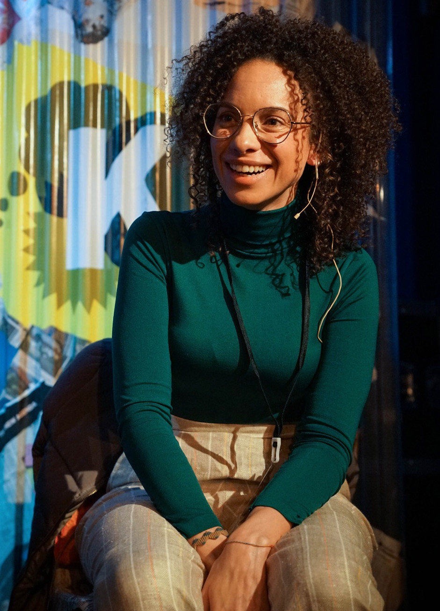
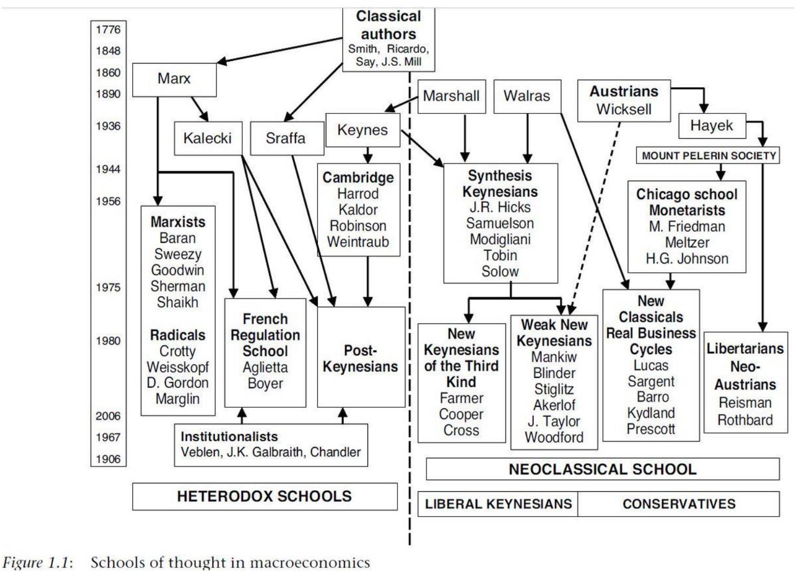

[Dr Carolina Alves](https://www.girton.cam.ac.uk/directory/alves-carolina/) is the Joan Robinson Research Fellow in Heterodox Economics at Girton College, Cambridge. She is also a co-founder of [D-Econ](https://d-econ.org/): Diversifying and Decolonizing Economics Initiative. Carolina's work focuses on macroeconomics and international political economy, with a particular focus on her home-country Brazil. We first ask Carolina to explain to us what Heterodox Economics is, how it differs from mainstream Economics, and how reaching a definition can be incredibly difficult. We then discuss the political debate that can arise around Heterodox Economics, and how viewing it as just a left-right divide may be overly simplistic. Lastly, Carolina explains why D-Econ is pushing for the academic field of Economics to be more inclusive in terms of gender, race, and the Global South.

##### Photo credit: [Alina Kisina](https://alinakisina.co.uk/)

## **Book Recommendations 📚**

- "[A History of Heterodox Economics](https://www.goodreads.com/book/show/7248202-a-history-of-heterodox-economics)" by Frederic Lee
- "[Postcolonialism Meets Economics](https://www.goodreads.com/book/show/5602605-postcolonialism-meets-economics)" by S. Charusheela and Eiman O. Zein-Elabdin
- "[The Market](https://www.goodreads.com/book/show/34896701-the-market)" by Matthew Watson
- **Bonus**: "[Lament for Economics](https://www.goodreads.com/book/show/17844747-lament-for-economics)" by Barbara Wootton

 <Book url="https://www.goodreads.com/book/show/7248202-a-history-of-heterodox-economics" image="book-carolina-1"/> <Book url="https://www.goodreads.com/book/show/5602605-postcolonialism-meets-economics" image="book-carolina-2"/> <Book url="https://www.goodreads.com/book/show/34896701-the-market" image="book-carolina-3"/> 

## Heterodox Economics

### Defining Economics

Before delving into heterodox economics, it is worth first trying to understand what economics is and what "[the dismal science](https://en.wikipedia.org/wiki/The_dismal_science)" hopes to achieve. Many people have attempted to give a definition, and perhaps the only successful attempt comes from Jacob Viner: "economics is what economists do".

But to try and give a more concrete answer, the American Economics Association [defines](https://www.aeaweb.org/resources/students/what-is-economics) the field as "the study of scarcity, the study of how people use resources and respond to incentives or the study of decision-making". A central feature then is the idea of choice. We may have unlimited wants but only limited means, and thus we will always have to make some sort of trade-off. This is true both for individuals (What subject do I want to study at university? What meal should I order in the restaurant?) and collective groups (What project should the government fund? What markets should a company compete in?).

This often expresses itself in terms of money and markets. Indeed, colloquially economics is often seen as synonymous with these with Merriam-Webster [defining](https://www.merriam-webster.com/dictionary/economics) economics as "a social science concerned chiefly with description and analysis of the production, distribution, and consumption of goods and services". But note that neither money nor markets is an inherent part of the AEA definition. Indeed, economics has been applied to many other areas, such as [voting](https://en.wikipedia.org/wiki/Public_choice) (see our episode with [Toke Aidt](https://hearthisidea.com/episodes/toke)) and [psychology](https://en.wikipedia.org/wiki/Behavioral_economics) (see our episode with [Tads Ciecierski-Holmes](https://hearthisidea.com/episodes/tads)).

A perhaps more fundamental question is "Why do we study economics?". The obvious answer would be that economists do research to gain a better understanding of the economic world: Why are some countries rich and other poor? What causes the gender wage gap? Should we tax CO2? But when we ask *why* we want to gain a better understanding, we inevitably get the response that answering these questions is done to make the world a better place.

Indeed, there are few other academic disciplines that are so directly related to public policy and carry so much influence amongst government officials. As John Maynard Keynes famously noted:

> The ideas of economists and political philosophers, both when they are right and when they are wrong are more powerful than is commonly understood. Indeed, the world is ruled by little else. Practical men, who believe themselves to be quite exempt from any intellectual influences, are usually slaves of some defunct economist.

In pop-culture we often think that the work of economists is to produce these huge and all-encompassing treatises, like Karl Marx's "Das Kapital" or Adam Smith's "Wealth of Nations". However, the day-to-day work of most economists is much more nitty-gritty, answering narrow questions to gain broader insights (e.g. Did New Jersey's 1992 minimum wage increase hurt employment in the fast-food industry? - see [here](https://www.nber.org/papers/w4509)). Economists also often work directly with governments to design the specific details of a new policy or regulation (see Esther Duflo's "[The Economist as Plumber](https://economics.mit.edu/files/12569)" for a great guide). This might not be as exciting as contemplating the clash of capitalism versus communism, but it is much more applicable to real world problems.

### Defining Heterodox Economics

What then is heterodox economics? Again there is no agreed-upon definition but our guest Carolina Alves, along with her co-author Ingrid Kvangraven, argue in their [working paper](https://www.gpidnetwork.org/wp-content/uploads/2019/07/GPID-WP-19.pdf) that we should see it as:

> *[1]* a study of production and distribution of economic surplus, *[2]* including the role of power relations in determining economic relationships, *[3]* a study of economic systems, and tendencies associated with it, and the employment of theories that have these issues at their core"

*[italics my own]*

Let's break this down.

*[1]* In the previous section we noted that economics has nothing inherently to do with money or markets, yet heterodox economists emphasise that, in practice, this is nonetheless what the mainstream focuses on. We should thus explicitly study the "production and distribution of economic surplus" rather than just "goods and services".

*[2]* Another critique heterodox economists make is that in studying markets, economics relies heavily on mathematical models that make very strong assumptions, such as [rationality](https://hearthisidea.com/episodes/vasilis) and [closed systems](https://en.wikipedia.org/wiki/Open_and_closed_systems_in_social_science). This leaves out other important features, like power relations and with it group identities. A very radical attack on economic models comes from [Tony Lawson](http://www.econ.cam.ac.uk/people/emeritus/tl27)'s Social Ontology. You can find a good introduction to his work [here](https://www.researchgate.net/publication/260177917_A_Conception_of_Social_Ontology) and the [Cambridge Realist Workshop](https://www.csog.econ.cam.ac.uk/Cambridge-Realist-Workshop) reading group.

*[3]* This then, it is argued, has led to a narrowing of the field, excluding many schools of thought. Heterodox economics attempts to "broaden" the field and bring these schools back into the field. This process began in the 1960s, whereby various economic sub-fields found themselves "without a home" (i.e. without funding) and that over the next decades coalesced under the 'heterodox' term. Today this includes well-established communities and resources, like the [Heterodox Economics Newsletter](https://www.heterodoxnews.com/HEN/home.html).

### Challenges to reaching a definition

In our interview with Carolina, she notes there are three main challenges to defining heterodox economics.

Firstly, heterodox requires a multi-level definition because it can encompass so many different aspects. Should it be based used to label academic communities? Do you need to believe in certain theories to be considered heterodox? Or is about the type of methodology used? This makes agreeing on a definition hard. For example, the [Austrian School](https://en.wikipedia.org/wiki/Austrian_School) is outside the mainstream and rejects mathematical modelling, yet its theories explicitly contradict those of [Marxian economics](https://en.wikipedia.org/wiki/Marxian_economics).

Secondly, heterodox economics is often used as a priori definition. But when Danielle Guizzo [asks](https://www.elgaronline.com/view/9781789901580/06_chapter2.xhtml) academics, she often finds they do not identify as heterodox, even when their work suggests they are. As we will later discuss, this may be because identifying as a heterodox economist can be seen as controversial or even political declaration.

Thirdly, we might get a very different angle of what heterodox economics depending on what sub-field defines it. Behavioural economists probably care most about rationality, growth theorists about endogenous growth, and new institutional economics about "the rules of the game". Thus drawing a simple dichotomy between mainstream and heterodox is hard. In practice, some economists will side with the mainstream on some topics and be considered heterodox on others.

We might also add that these definitions are constantly in flux. As our understanding of economics changes, so too does our view of what is 'mainstream' (and by extension heterodox). For example, [monetarism](https://en.wikipedia.org/wiki/Monetarism) was not considered mainstream until the 1970s — before falling out of fashion again in the 1990s. Likewise, Thaler [describes](https://www.goodreads.com/book/show/26530355-misbehaving?from_search=true&from_srp=true&qid=OHOWQsCS67&rank=1) how behavioural economics was long seen as heterodox, but is now receiving ever more mainstream attention. Schools of thoughts can themselves mutate and transform over time, as shown by Marc Lavoie's flow diagram regarding macroeconomics:

##### Source: [Introduction to Post-Keynesian Economics](https://www.palgrave.com/gb/book/9780230229211)

In the face of these challenges, one might be tempted to just conclude that heterodox economics is simply "everything that is not mainstream". However, Carolina notes that such a 'negative' definition (i.e. being define in opposition to something else) misses the point:

> I look at this rich and vast community of economists; they would have existed regardless of if the mainstream economics disappeared tomorrow

Yet as we have seen, reaching a 'positive' definition also has its serious challenges. This thus remains an active area of discussion with many differing interpretations.

### Heterodox Economics and the mainstream

Heterodox economics has, perhaps unsurprisingly, caused a lot backlash from several prominent 'mainstream' academics. See Carolina's aforementioned [working paper](https://www.gpidnetwork.org/wp-content/uploads/2019/07/GPID-WP-19.pdf), which outlines these criticisms and the rebuttals made by heterodox economists.

In our interview, we focus on one such existential criticism: "the mainstream is already heterodox". That is, mainstream economists are already aware of their limitations (e.g. Paul Romer's "[The Trouble With Macroeconomics](https://paulromer.net/trouble-with-macroeconomics-update/WP-Trouble.pdf)") — yet we must remember that "all models are wrong, but some are useful" (for a nuanced defence of economic models, see Rodrik's "[Economics Rules](https://www.goodreads.com/book/show/28789662-economics-rules?from_search=true&from_srp=true&qid=bkw05IQTDf&rank=1)"). As Colander et al. [argue](https://www.tandfonline.com/doi/abs/10.1080/0953825042000256702), many of the critiques that heterodox economists make are already being dealt with by the mainstream. Consider, for example, the recent development of behavioural economics, endogenous growth theory, complexity economics etc.

Carolina is sceptical. She notes that there is a significant gap between rhetoric and an actual 'paradigm shift'. Just because mainstream economists are aware of their limitations, does not mean their models stop making these assumptions. We still do not have models that truly incorporate irrationality or complex interactive systems, and these may not be things that we can simply 'add on' (see Kirman for a [discussion](https://www.aeaweb.org/articles?id=10.1257/jel.54.2.534) in the context of complexity economics).

Moreover, just because some economic researchers are engaging with the topics does not mean that the wider academic institutions have changed accordingly. Carolina notes that when it comes to research funding and universities' curriculum, there has been very little change (see the campaigning by [Rethinking Economics](http://www.rethinkeconomics.org/)).

### Politics of Heterodox Economics

Another often contentious point is that the heterodox-versus-mainstream debate just masks an underlying left-versus-right divide. This case was made by Geoffrey Hodgson, who [argues](https://www.e-elgar.com/shop/gbp/is-there-a-future-for-heterodox-economics-9781789901603.html) that "heterodox economists are defined more by left ideology than by a shared understanding of the nature of orthodox economics and of what should replace it". We can look to public debate of economics for illustration. After the 2008 Financial Crisis, many people used critiques of the economics discipline as a means to criticise austerity and other 'neoliberal' policies, whose legitimacy often relied on said economics (Varoufakis' [writings](https://www.yanisvaroufakis.eu/ppe/) are a good example of this).

#### Left Versus Right

However, Carolina notes that dismissing heterodox economics as "just lefties upset with neoliberalism" would be a mistake. Even though it is probably true that the average heterodox economist is more left-wing than the average mainstream economist, it is not clear that this strict dichotomy fits. Some heterodox economists are very pro-neoliberal — the [Austrian school](https://en.wikipedia.org/wiki/Austrian_School) being the most prominent example. Likewise, several mainstream economists advocate for very left-wing policies: Thomas Piketty's [work](https://www.goodreads.com/book/show/18736925-capital-in-the-twenty-first-century?from_search=true&from_srp=true&qid=obClSpohCp&rank=1) on inequality $r>g$ still used the neoclassical [Solow-Swan model](https://en.wikipedia.org/wiki/Solow–Swan_model).

Thus, instead of viewing the heterodox-versus-mainstream debate as one about political outcomes, it may be better to view it as a technical argument regarding the underlying theories and methodologies. For instance, heterodox and mainstream economists may not disagree on whether the market is 'good' or 'bad' (the answer is almost always *it depends*) but rather about what models and criteria we should use to reach a judgement for a specific case.

#### Economics as inherently political

Of course, even if we are only arguing about what models to choose, this can still lead to divisions along the left-versus-right divide. But [Ha-Joon Chang](https://www.huffpost.com/entry/ha-joon-chang-economics_n_5120030) and other heterodox economists argue this actually part of a larger critique of the mainstream; that economics is inherently political and the mainstream's pretence of being "scientific" or "value-free" is misleading.

For example, when it comes to evaluating how efficient an outcome is, economists typically want to avoid discussion of distribution (how much everyone gets) because there is no agreement on how equal a society should be. Instead, Pareto efficiency is used as a criterion, which is "a situation where no individual or preference criterion can be better off without making at least one individual or preference criterion worse off." The idea is that at least everyone can agree that if you can make someone better off without hurting anyone, you should. A policy maker can then make the political choice of what Pareto efficient outcome is best (this is the important implication of [the fundamental theorems of welfare economics](https://en.wikipedia.org/wiki/Fundamental_theorems_of_welfare_economics)).

However, in practice separating these issues of equity and efficiency is not so straight-forward. For example, the only Pareto efficient outcome may be the sticking with the status quo, even if this goes against all our intuitions of 'fairness'. For example, we might conclude against taxing a billionaire 0.0001%, even if this would save 100 people's lives.

Every economist would admit that in the real world there is an efficiency-equity trade-off. However, as soon as this admission is made, the next question becomes "How much efficiency should we be willing to sacrifice for a more equitable outcome?". At some point this question needs to be answered, bringing economists back into the political debate. Not answering this question at all (i.e. being completely indifferent to equity) is a political statement in and of itself.

According to this critique, mainstream economics is just as political as heterodox economics. In the public debate, the mainstream is thus often associated with right-wing policies because its models typically include individual agents, rational choice, and efficiency allocations. Likewise, heterodox economics is often associated with left-wing policies because its models typically include group power relations, activity outside the market, and assign a inherent value to equity. Ha-Joon Chang and others argue that economics should not choose one or the other, but instead explicitly acknowledge these value judgements and have a deeper debate about them.

### Wrong Conception of Rationality?

In his celebrated essay "[Rational Fools](https://www.jstor.org/stable/2264946)"*,* Amartya Sen criticised the prevailing conception of rationality embodied in the 'rational choice' models of mainstream economics.

He notes, quoting Edgeworth, that "the first principle of Economics is that every agent is actuated only by self-interest." An agent has a handful of preferences at anyone time, and acts rationally just in case she makes choices so as to best satisfy those preferences. These preferences, moreover, are defined through an agents actual choices, rather than desires or mental states — "If you are observed to choose x rejecting y, you are declared to have "revealed" a preference for x over y". For more on 'rational choice theory', see our episode with [Vasilis Kotsidis](https://hearthisidea.com/episodes/vasilis/).

Sen argues that the economist's picture of rationality says at once too much and too little. It says too much because, if rationality really does entail acting entirely in your own self-interest, then almost nobody is rational. If economics models people as acting this way, then its models are based on an obvious falsehood. It says too *little* because preferences are normally formed for a reason — and as such it misses out "non-choice sources of information on preference and welfare as these terms are usually understood".

Modelling rational agents as acting entirely in their self-interest does not rule out their feeling sympathy for other people — and, roughly speaking, acting to help those people in order to avoid the distress of not helping them. However, Sen argues, it *does* rule out acting from 'commitment': when you decide to do something in full knowledge that doing it would make *you* worse-off. In other words: extant models don't allow people to have preferences over other people's preferences, which they can and often do. The most extreme example is self-sacrifice for a cause or another person, but commitment is to be found in all kinds of more mundane behaviour — motivated by familial or romantic love, religious or spiritual beliefs, or creative ambitions. Sen illustrates this thought with a memorable example:

> The contrast between sympathy and commitment may be illustrated with the story of two boys who find two apples, one large, one small. Boy A tells boy B, "You choose." B immediately picks the larger apple. A is upset and permits himself the remark that this was grossly unfair. "Why?" asks B. "Which one would you have chosen, if you were to choose rather than me?" "The smaller one, of course," A replies. B is now triumphant: "Then what are you complaining about? That's the one you've got!" B certainly wins this round of the argument, but in fact A would have lost nothing from B's choice had his own hypothetical choice of the smaller apple been based on sympathy as opposed to commitment. A's anger indicates that this was probably not the case... The characteristic of commitment with which I am most concerned here is the fact that it drives a wedge between **personal choice and personal welfare**, and much of traditional economic theory relies on the identity of the two.

## Diversifying and Decolonising Economics

So far we have talked about a diversity of ideas in economics. In our interview we talk about the need for a diversity of people in economics too. Carolina is actively engaged in this as a co-founder of [D-Econ](https://d-econ.org/):

> We are a network of economists that aim to **promote inclusiveness** in economics, both in terms of academic content and in its institutional structures. We are working to promote an economics field free of discrimination, including **sexism**, **racism**, and discrimination based on **approach** and **geography**.

### Economics and #MeToo

As an academic discipline, economics itself had a 'me too' moment in 2017 when Alice Wu published her paper "[Gender Stereotyping in Academia](https://growthecon.com/assets/Wu_EJMR_paper.pdf)". Using an Economics job-board, she showed strong empirical evidence of female economists being discriminated against because of their sex, including stereotyping language and a focus on personal topics like physical appearance. This received widespread attention (see [NPR](https://www.npr.org/2019/05/03/720139562/episode-910-economics-sexism-data), [Quartz](https://qz.com/1637906/diversity-in-economics-depends-on-more-than-just-attracting-women/), [NY Times](https://www.nytimes.com/2018/01/10/us/politics/women-economics.html?hp&action=click&pgtype=Homepage&clickSource=story-heading&module=first-column-region&region=top-news&WT.nav=top-news&_r=0)) alongside a plethora of people sharing their own personal experiences. Many other studies concerning women in economics have also been published, like Erin Hengel [showing](http://www.erinhengel.com/research/publishing_female.pdf) that women are held to higher publishing standards than men, and Lundberg's work documenting various professional barriers (see [here](https://voxeu.org/content/women-economics) and [here](https://pubs.aeaweb.org/doi/pdfplus/10.1257/jep.33.1.3)).

[Feminist economics](https://en.wikipedia.org/wiki/Feminist_economics) (a heterodox school) looks at how to critically study economics with a gender-awareness. A seminal piece in this literature is "[If Women Counted](https://www.goodreads.com/book/show/414921.If_Women_Counted?from_search=true&from_srp=true&qid=CayMAPEZmv&rank=1)" (1998) by Marilyn Waring, who notes that macroeconomics' focus on GDP implicitly devalues all housework and caring that many women do. Today, feminist economics explores a huge range of topics, see for example our [interview](https://hearthisidea.com/episodes/victoria) with Victoria Bateman about women and the origins of the Industrial Revolution.

### Economics and the Global South

Carolina notes that another important shortfall of economics is failing to be inclusive of the Global South. This too is shown by a lack of representation and institutional discrimination, which also intersects with the issue of race (for a comprehensive list of points see D-Econ's [BLM statement](https://d-econ.org/d-econ-statement-of-solidarity-with-black-lives-matter-and-affirmative-action-points-related-to-the-discipline-and-pedagogy-in-economics/)).

Economics also heavily relies on studies in the North American and European context. Carolina warns that neglecting the Global South can mean missing out on important contributions to our understanding of topics like austerity, inequality, and core-periphery structures. Her own work is on how emerging economies are affected by financial globalisation and public debt. This has been greatly influenced by her own Brazilian education, which she observes pays much more attention to issues like uneven development. You can read her latest working paper [here](http://www.econ.cam.ac.uk/research/cwpe-abstracts?cwpe=1930).

## Resources

This write-up only scratches on the surface of diversifying and decolonising economics. If you want to learn more or get involved, we highly recommend you make use of the following resources:

### **Diversify and Decolonise**

- Open Democracy produced a superb series called "[Decolonising the economy](https://www.opendemocracy.net/en/oureconomy/decolonising-the-economy/)", which include many thought provoking articles on that topic.
- D-Econ regularly posts reading lists that show-case the work of "alternative economics". Most recently, look at their list for [Summer 2019](https://d-econ.org/an-alternative-economics-summer-reading-list-2019/) and [Winter 2019](https://d-econ.org/diversify-and-decolonise-your-holiday-reading-list/).
- Carolina and others regularly write blog posts on [Developing Economics](https://developingeconomics.org/), which take a critical approach to development economics.

### **Heterodox Economics**

- [Rethinking Economics](https://www.rethinkeconomics.org/) is a network of students and academics campaigning for a more pluralist approach. [Reteaching Economics](http://reteacheconomics.org/) is an aligned network for academics supporting students.
- Most universities also have local groups. In Cambridge you can join [CSEP](http://www.cambridgepluralism.org/) (for students), [INET](https://www.inet.econ.cam.ac.uk/) (for academics), [CSO](https://www.csog.econ.cam.ac.uk/) (for social ontology), and [CRASSH](http://www.crassh.cam.ac.uk/) (for interdisciplinary approaches).
- I also really recommend Dani Rodrik's book "[Economic Rules](https://www.goodreads.com/book/show/28789662-economics-rules)" for a nuanced take on the state of economics as an academic field, though some basic understanding of economic models helps.
- If you want to start learning about economics with a pluralist background, [Exploring Economics](https://www.exploring-economics.org/en/) is a great open-access resource. [Ecnmy.org](http://ecnmy.org) also writes 'explainer' pieces for a general audience.

If you have any resources to add, please let us know! Drop an email to hello[at]hearthisidea[dot]com.