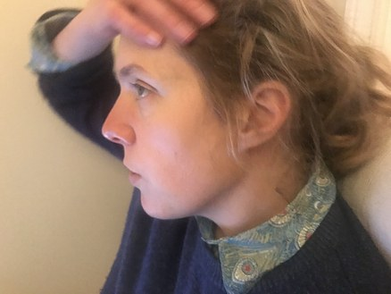
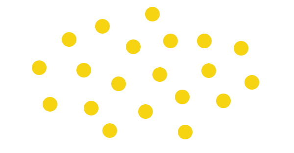
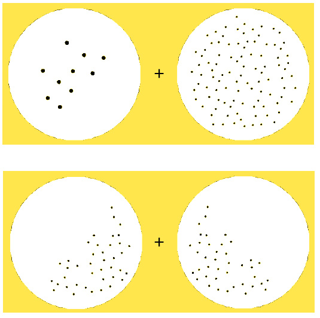
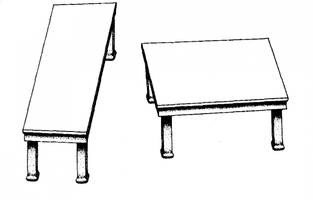
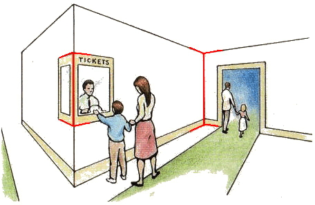
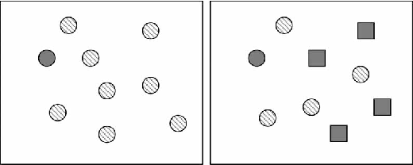

Dr Jessie Munton is a lecturer in philosophy at the University of Cambridge, whose philosophical research spans (visual) perception, psychiatry, and bias. In our conversation, we focus on Jessie's recent work on bias and prejudice. This covers two broad topics. Firstly, we discuss the epistemic status of statistical generalisations about demographic groups; and ask how nominally accurate beliefs about them can go wrong when we 'project' from bare statistics to new scenarios. Secondly, we discuss what the *salience* and ordering of information might have to do with prejudice, and how that might be relevant for search engines. In this article, we summarise and illustrate these ideas and provide both extra examples and further reading.

## Book Recommendations 📚

- [The Condemnation of Blackness](https://www.goodreads.com/book/show/7093931-the-condemnation-of-blackness) by Khalil Gibran Muhammad
- [Race After Technology](https://www.goodreads.com/book/show/42527493-race-after-technology) by Ruha Benjamin
- [The Rationality of Perception](https://global.oup.com/academic/product/the-rationality-of-perception-9780198797081) by Susanna Siegel

 <Book url="https://www.goodreads.com/book/show/7093931-the-condemnation-of-blackness" image="book-jessie-1"/> <Book url="https://www.goodreads.com/book/show/42527493-race-after-technology" image="book-jessie-2"/> <Book url="https://global.oup.com/academic/product/the-rationality-of-perception-9780198797081" image="book-jessie-3"/> 

## Bias and Prejudice

A natural first question to ask is how *prejudice* should be distinguished from *bias*. Jessie suggests that one way to view prejudice is as a *kind* of bias characterised by its negative valence (badness or wrongness). In other words, [bias](https://en.wikipedia.org/wiki/Bias_(statistics)) is often used as a value-neutral, technical appraisal of data and the things we do with it. In simple terms, a statistic can be said to be biased if the process used to reach it is likely to predictably deviate from the actual parameter being estimated. An example is 'selection bias', like when a sample of a population fails to reflect important features of the population as a whole. For illustration, a study conducted at a university about the prevalence of social anxiety might recruit participants with flyers or advertisements. The resulting sample might thereby be expected to underestimate the prevalence of social anxiety, because more outgoing people tend to respond to flyers advertising psychology experiments. [Beyond statistics](https://www.lesswrong.com/posts/ptxnyfLWqRZ98wnYi/biases-an-introduction), a *person* might be said to be biased if they deviate from the norms of rationality in some predictable or systematic way. One example of such a bias (among [many](https://en.wikipedia.org/wiki/List_of_cognitive_biases)) is 'confirmation bias', where a person is more likely to seek out, notice, or remember information that confirms their existing beliefs or values. For instance, I might think that drivers of a certain make of car are particularly negligent; and thereby pick up specifically on infractions committed by those drivers. In one [famous study](https://psycnet.apa.org/record/1954-07342-001), participants watched a film of a Princeton-Dartmouth American football game. Princeton fans reported seeing nearly twice as many rule violations committed by the Dartmouth team than Dartmouth fans. *Prejudice* in this sense might refer to a bias suspected to be derived from negative attitudes, or some other disagreeable trait. Rather than football teams or makes of car, prejudice might account for biased beliefs about demographic groups. In this way, an instance of confirmation bias might be prejudicial if it entrenches an inaccurate and harmful belief about such groups.

But prejudice plausibly extends beyond bias, too — beyond explicitly harbouring false beliefs about groups of people. That's because people might hold prejudiced (patronising or malicious) *attitudes* even when all of their explicit factual beliefs are in order; and they might *behave* in prejudiced ways, such as choosing to exclude people from one's circle or otherwise treat people differently without good reason. This might be true of institutions just as it can be true of individuals: a restrictive and draconian immigration policy might be said to be prejudiced against those people it excludes even if the people who implement it operate under no factual illusions.

Because prejudice is such an all-encompassing and unwieldy concept, Jessie suggests it's unlikely that it might be defined in any neat way: better to deal with its variety and messiness head-on. There is also a sense in which popular uses of these terms are changing:

> Part of what's interesting about this to me is that our sense of these categories, and where boundaries lie between them and what counts as a instance of a specific prejudice like racism or sexism, is really in flux at the moment.

## Biased Perception

The majority of Jessie's research looks at (visual) perception, and perceptual uncertainty in particular. A crucial feature of visual perception is that the raw information our eyes are able to gather does not straightforwardly determine what's 'out there'. Instead, our visual systems have to engage in a constant (automatic) process of inference and guesswork, as Jessie explains:

> The thing that really interested me in philosophy of perception was this tension between how we encounter our perceptual experience naively as something that just puts us immediately in contact with the world and the way the world is quite simply, and then reading a load of vision science and cognitive psychology on the processes that actually underlie visual processing. And the dominant model at the moment really emphasises the way in which your visual experience is this process by which you're trying to figure out what is out there in your environment, on the basis of this retinal stimulation which really underdetermines this result that you get.

A class of [popular](https://global.oup.com/academic/product/the-predictive-mind-9780199682737?cc=gb&lang=en&) [new](https://en.wikipedia.org/wiki/Bayesian_approaches_to_brain_function) [theories](https://www.nature.com/articles/nrn2787) seek to unify a whole range of mental processes, including perception, as a kind of constant 'hypothesis testing'. The upshot of this view of vision as an inferential process is that perception begins with an unshakeable uncertainty, and yet "the result you get is something that feels so clear and straightforward". There’s an endless list of examples which help to demonstrate that your visual experience is less determinate than you think it is. First up is an [example](https://en.wikipedia.org/wiki/The_problem_of_the_speckled_hen) widely discussed in the philosophy of perception — take a look at the dots below.

Each spot should appear clearly distinguished from the next — each one determinate and separate. Now stare at the spots and, without moving your gaze, see if you can tell how many there are. This is difficult, bordering on impossible. While your visual experience seems or appears determinate, you can't read off facts from your perceptual experience that you *could* easily read off, say, an equally determinate photograph — no matter how hard you stare.

A more recent and perhaps clearer demonstration can be found in the more recently uncovered ‘[numerosity adaptation effect](https://en.wikipedia.org/wiki/Numerosity_adaptation_effect)’. Stare at the above ‘+’ sign for 30 seconds, and then turn to the below ‘+’ sign. You may notice that the left side of the display now appears to contain more dots that the right. It really seems like the number of spots differs between the two samples after adaptation, but it doesn't at all.

##### Source: [Wikipedia](https://en.wikipedia.org/wiki/Numerosity_adaptation_effect) (modified)

One of the best ways to make this insight clear is through visual illusions. For instance, our visual systems apparently draw on the context of an image in order to make a guess about the colour of particular parts of it. This can be seen in the '[grey strawberries](https://www.illusionsindex.org/i/grey-strawberries)' illusion. Take a look at the image below. It looks like there's some red in the image. But try covering up all but the apparently red parts, and you'll see that those parts are in fact either grey or blue. Your visual system seems to notice and automatically 'subtract' the blue wash over the image.

##### Source: [Akiyoshi Kitaoka](https://twitter.com/AkiyoshiKitaoka/status/836382313160171521) via [The Illusions Index](https://www.illusionsindex.org/i/grey-strawberries)

Something similar can be achieved with shapes. In the '[turning tables](https://en.wikipedia.org/wiki/Shepard_tables)' illusion, two identical parallelograms appear to be of different proportions (see below).

##### Source: [Wikipedia](https://en.wikipedia.org/wiki/Shepard_tables)

Again, there appears to be some expectation (or ‘perceptual prior’) that we’re looking at a three-dimensional world — that makes this illusion practically impossible to reverse even when we know it's an illusion.

These perceptual priors must either be hard-wired or learned. Some seem almost universal, and extremely hard to reverse by conscious effort or learning; suggesting they are hard-wired. An example is the infuriatingly persistent ‘[hollow face illusion](https://en.wikipedia.org/wiki/Hollow-Face_illusion)’ (watch an example [here](https://www.youtube.com/watch?v=pH9dAbPOR6M)). Fascinatingly, people with schizophrenia are much less susceptible to this and other illusions. One [proposed explanation](https://pubmed.ncbi.nlm.nih.gov/19327402/) is that schizophrenic patients are “less able to employ conceptually-driven top-down strategies during  perception, where incoming sensory data are constrained with reference  to a generative model that entails stored information from past experience”. On the other hand, some of these priors are more responsive to environmental factors. On example is found in investigating the effects of the famous [Muller-Lyer illusion](https://michaelbach.de/ot/sze-muelue/index.html). It turn out that Europeans and Americans are the most susceptible to the illusion, and Kalahari hunter-gatherers are far less susceptible. [One explanation](http://cognitionandculture.net/blogs/simons-blog/culture-and-perception-part-ii-the-muller-lyer-illusion/) is that some people grow up in a ‘carpentered world’ full of right angles, and our visual systems learn to read certain arrow-like shapes as reliable depth cues (see below).

##### Source: [michaelbach.de](https://michaelbach.de/ot/sze-muelue/index.html)

This leads to a big, live question in the philosophy of perception: can our (explicitly held) *beliefs* 'feed back' and affect the things we see? In the jargon, is perception '[cognitively penetrable](http://web.mit.edu/abyrne/www/siegelbyrnerichorthin.pdf)'? Jessie (and many others) are sceptical; because there's a good amount of evidence that our visual systems are '[modular](https://plato.stanford.edu/entries/modularity-mind/)': we can't deliberately tinker with the way they work.

Therefore, the way that *prejudice* or *bias* may enter into perceptual processes are through the inputs perception gets fed, and the post-perceptual processing the person does afterwards. One way our visual systems 'fill in the gap' between the information they get fed and the guesses they come up with is by drawing on past information that they have encountered often. As mentioned, this form of learning is mostly (maybe entirely) proprietary to the visual module(s), so it’s needn’t involve any form of *cognition* — consciously reasoning about and forming explicit beliefs. In how it must begin with uncertainty, and draws (apparently) determinate conclusions partly based on prior experience, perceptual uncertainty turns out to have a quite lot to do with certain kinds of bias or prejudice construed more broadly:

> I was interested in cases where it seems like your visual system is doing that to the absolute best of its ability, but the results are something that looks like a kind of bias or prejudice because the sample it's being fed is in some ways skewed.

For Jessie, these kinds of questions about visual experience led naturally to more general questions about how we resolve various kinds of uncertainty by drawing on information we've gathered in the past. Crucially, "that information we've been fed in the past is always some imperfect subset of the available information" — where that ‘subset’ might not be representative. As such, just as in the 'sub-personal' case of visual perception, it seems possible to end up with apparently biased or even prejudiced beliefs even when the process(es) by which you form those beliefs can't obviously be faulted.

This tension between apparently irreproachable processes and apparently biased outcomes relates to the tension in [behavioural economics](https://www.investopedia.com/terms/b/behavioraleconomics.asp) between all the ways in which people appear to act irrationally, and the plausibly rational reasons underlying those heuristics or biases. For instance, some people may be differentially more likely to form beliefs that would benefit them or ingratiate them within a group, even if some of those beliefs are false. That's not *epistemically* rational, because such people end up with more false beliefs than they would otherwise. But it may be *instrumentally* rational in advantaging those people in other ways, as Dan Williams explains in [our interview](https://hearthisidea.com/episodes/dan) on self-delusion and the signalling role of beliefs. The whiff or paradox came from conflating the two kinds of rationality.

That's an example where forming a belief in a certain way may not be epistemically rational but is apparently practically rational. Jessie's suggestion is broader: that epistemically rational process may yield reliably biased beliefs in certain circumstances; viz. when the information you draw upon to make inferences itself involves some kind of bias.

You can read more about this idea [here](https://80a93457-7df3-471f-8728-538bb500333a.filesusr.com/ugd/131a85_ab515c199ec448b68b5c51f520281cad.pdf).

## Projectability

This leads us on to a discussion of prejudice beyond perception. One non-obvious form Jessie has suggested that prejudice may take relates to the 'projectability' of certain beliefs about statistical generalisations. As Jessie points out, there is a long history of people using accurate statistical generalisations to derive conclusions which are prejudicial and oppressive. In his book [The Condemnation of Blackness](https://www.goodreads.com/book/show/7093931-the-condemnation-of-blackness), Khalil Gibran Muhammad describes how racial disparities in crime statistics were used to illegitimately “write crime into race”; thereby justifying discriminatory and harmful treatment of Black people both within and beyond the United States.

It is a curious truth that some factually accurate statistics — such as, for instance, the fact that Black Americans are far [more likely](https://www.bjs.gov/content/pub/pdf/htius.pdf) to have a homicide conviction then white Americans — reliably elicit discomfort. If they're true, where does this discomfort come from? To a large extent, when beliefs about these statistics are used to justify discriminatory practices, what seems to be at fault is not the beliefs or statistics themselves but the things people do with them or conclude from them. For instance, people with prior prejudiced attitudes and emotions might choose to wield such statistics as mere rhetorical weapons in arguing for some discriminatory policy proposal.

But in such cases, can we also say that anything goes epistemically wrong? Even though the statistics are accurate, can there still be something epistemically flawed with certain *beliefs* about those statistics? In the sense we’re using it, an ‘epistemological’ flaw would be a flaw “in virtue of an irrational response to information, or through a  lack or loss of information”.

To answer this question, Jessie introduces the notion of 'projectability'; explaining that a statistic is said to be projectible if you can "reliably extend it to a new member of the class in question". This is not given by the accuracy of the statistic — which might be accurate but not projectable in certain circumstances, as we'll see. Another way of thinking about projectability is as 'modal robustness', where '[modal](https://plato.stanford.edu/entries/modality-epistemology/)' relates to other possible worlds: what could have been or might be the case.

A statistic is in general not going to be projectable if it depends on fragile, contingent features of the particular population it is concerned with. Conversely, it will be projectable if it's *hard to vary* across different possible worlds. Let's see an example. It turns out that a high proportion of Dalmatians are infertile. Suppose your friend calls you up and explains that's she's wondering whether to get her dog spayed. You look up the statistics and discover this fact that almost all Dalmatians are infertile. You conclude that *this* Dalmatian in question is therefore highly unlikely to become infertile whether or not it gets spayed, and so advise your friend against spaying it — why bother? What you've missed here is that Dalmatians in the UK are infertile *because* we spay them.

In general, this is something like the mistake involved in inferring causation from a single correlation. Being a Dalmatian is correlated with infertility; but it doesn't cause it — spaying does. Spaying in this sense is the [treatment](https://stattrek.com/statistics/dictionary.aspx?definition=treatment) (or independent variable) which explains virtually all of the variance in infertility between Dalmatians and other dogs. Spaying almost entirely 'screens off' or 'accounts for' Dalmatian fertility. Likewise, ice cream sales normally correlate with incidences of sunburn; but eating ice cream does not cause sunburn: I’m not going to get sunburn when I nip to the freezer on an overcast day. For more about responsibly inferring causation from correlation, see the write-up for our conversation with [Jaime Sevilla Molina](https://hearthisidea.com/episodes/jaime).

Note that the idea of 'projectability' goes further than the idea of *[generalisability](https://www.healthknowledge.org.uk/content/validity-reliability-and-generalisability)* (or 'external validity’) in statistics. The result of a study is generalisable if it is robustly applicable to other settings in the actual world. Studies in the social sciences take samples from the populations researchers are ultimately interested in, but those narrow samples are not guaranteed to reflect the makeup of the broader population — recall the example of the university study on social anxiety. As such, it is legitimate and important to ask whether a result generalises. What this question *doesn't* address is whether the result should be expected to hold in circumstances which are not currently the case anywhere — such as *after* some sweeping policy is enacted, or *if* the U.S. had an entirely different history, or if the world were totally fair and just. Generalisability, then, is not about answering questions of the general form, "if the world was different in this way, would this result continue to hold?".

These are inconsequential examples, but Jessie points out that people have a general tendency to 'essentialise' certain statistics about demographic groups — that is, to ignore potential confounding or instrumental variables and instead blindly project the statistical difference to the same people in different circumstances. That, needless to say, is more dangerous than giving bad advice about spaying dogs.

Yet, a statistic can also be wrongly projected without essentialising — the error being alluded to here is not always the error of wrongly attributing everything to innate or essential features of a demographic group. To assume that *every* observed difference were, for instance, the result of socialisation, would also lead to mistakes when projecting (or rather, flatly refusing to project) such differences to possible worlds where those socialising influences are entirely absent. For instance, geriatrics may in part be slower sprinters than their younger counterparts owing to social expectations; but they would remain slower absent those expectations.

Jessie gives an example in terms of gender and maths ability. Women are [outnumbered by men](https://www.weforum.org/agenda/2020/02/stem-gender-inequality-researchers-bias/) in science, technology, and engineering roles; and make up [roughly 20%](https://www.enago.com/academy/gender-disparities-in-stem-what-you-need-to-know/) of STEM majors in the U.S. Men also appear to outperform women at [spatial ability tasks](https://pubmed.ncbi.nlm.nih.gov/7724690/) by about half a [standard deviation](https://www.jstor.org/stable/1130467?seq=1#page_scan_tab_contents). Granting that these statistics are true, we still might ask: what would things look like in a perfectly just or fair world, or a world without any of the patterns of expectancy that exist in ours? To a greater or lesser extent, discriminatory or prejudicial attitudes, norms, social pressures, and institutions presumably account for some of these differences. It would be useful to know, therefore, the magnitude of these differences where nobody is encouraged or expected to take up a certain occupation merely by virtue of social attitudes towards their gender. Importantly, the bare statistics are often unreliable guides to such questions. In order to answer these questions, we are required to think about *explanations* for the observed statistics: in what ways are these differences genetic, innate, biological, hard-wired, essential; and to what extent are they socialised, environmental, or culturally contingent? By [what mechanisms](https://www.gwern.net/docs/iq/2014-hyde.pdf) do these differences emerge? Projecting on the basis of the mere statistics sidesteps these unavoidable questions.

This is no easy task, but neglecting to do it cedes ground to those who do project indiscriminately from bare statistics. Moreover, there are many occasions where we are essentially forced to reason about how a statistic might be projected to new cases. Policy is often constructed in light of relevant studies: but exactly what their results say about what should be done is a question about projectability — you're projecting to the possible world in which some policy is implemented. This brings us back to the example of visual perception, where our visual systems are forced to constantly make 'best guesses' about what you're seeing even in the presence of often severely limited information. This is necessary because visual perception rarely or never has a stable ground or 'sub-floor' from which it can make *sure* guesses: it's never possible, for instance, to be sure that *this* object is really blue, or else cast under a blue light. This is true more generally, as Jessie explains:

> Any time we're thinking about demographic statistics you never have a stable sub-floor, because those categories themselves are shifting and changing and the properties that are associated with them change depending on the ways in which society treats people differently.

Yet, the idea here is that when we form a belief about an accurate statistical generalisation, the belief we form must go beyond the literal statistic in some way in order to be remotely useful. If you read a study which says a sample of 100 dung beetles lived to 3 years on average, you don’t just form a belief about those 100 deceased dung beetles: you now believe something about all dung beetles; and about dung beetles in different environments. Yet, it is precisely when the beliefs we form go beyond the literal content of the statistics that they have the potential to go wrong.

### Averages

One way in a demographic statistic can be wrongly projected is in assuming some averaged result is directly relevant to any given person that result is about. For example, in the late 1940s, the US air force set out to redesign its plane cockpits based on averaged measurements of the human body. The end product was a cockpit which perfectly fitted the 'mean' pilot; but was a poor fit for almost every *actual* pilot. In this case, mere averages are no guide to the distribution of values; nor to the reasons behind them. This mistake is sometimes called the '[flaw of averages](https://hbr.org/2002/11/the-flaw-of-averages)'.

The more directly relevant a statistic is to an individual, the more circumscribed or narrow it is: I am more likely to make an accurate guess of some particular Dalmatian's height by looking up the average height of a male Dalmatian than the average height of a dog, or a mammal. This is again true of demographic statistics. In other words, populations are heterogeneous. In the case of people, they often include individuals from a wide range of cultural backgrounds, ethnicities, ages, and walks of life. As such, a treatment (in both the medical and [economic](https://scholar.harvard.edu/files/kasy/files/1-introduction_to_treament_effects.pdf) sense) can have very different (sometimes unexpectedly harmful) effects on different patients from a heterogenous group.

Here's another example of misreading averages. The U.S. National [Academy of Sciences reports](https://www.nap.edu/read/23550/chapter/1#ii) that the overall, long-run fiscal effect of existing immigrants in the U.S. is positive — about \$58,000 per immigrant. However, it would be wrong to conclude from this that new immigrants should be expected to contribute, on net, about ​\$58,000. The figure for *new* immigrants is in fact roughly ​\$260,000. Again, that's just an average. What if we knew more about a particular new immigrant, and wanted to estimate their long-run fiscal effect? The figures again update if you know that this person's age, or level of educational attainment. In the language of [Bayesian epistemology](https://www.nap.edu/read/23550/chapter/1#ii), we 'conditionalize' on known facts; narrowing down the relevant reference class. The upshot:

> The better your statistics get, in some ways the more useless they get, because they end up applying to one particular individual... the group as a whole has disappeared before your eyes.

The right conclusion to draw from all this is not that accurate statistical generalisations cannot be informative or actionable. What should now be clear is that *bare* statistics do not tell us about where and when they can legitimately be projected; and mere averages do not tell us about the distributions they are averaging over.

Nor is it right to conclude that there are no principled ways of telling where statistics can be projected or of disentangling causation from correlation. For instance, the causal effects of an intervention can be examined through a [randomised controlled trial](https://en.wikipedia.org/wiki/Randomized_controlled_trial) or a [natural experiment](https://en.wikipedia.org/wiki/Natural_experiment). These approaches do have limitations, however. Suppose somebody suggests (recall the maths example) that a particular gender difference is the product of widespread and implicit social biases and norms. This might be the case ex ante, but it's hard to know how you could possibly run a controlled experiment where the experimental group don't have any implicit biases (without rerunning all of society).

## Prejudice as 'Undue Salience'

Next in our conversation, we consider a further plausible form of prejudice relating to the way in which information is ordered and organised. In her writing, Jessie gives an example of how an attitude of familial love can be partly constituted by the way in which certain kinds of beliefs are more readily recalled. In one example, we are asked to imagine Esther: an objectively unexceptional child who is loved by her parents. Esther’s parents hold a number of true beliefs about her — some of which reflect badly on her, some well; but all of which we can suppose are true. When Esther’s parents are asked to talk about their child, or think about her, they tend more often to articulate the positive rather than the negative beliefs. The positive beliefs are easier to ‘reach for’. There is a sense in which Esther’s parents are biased about Esther, but this bias doesn’t involve false beliefs. The bias arises because some beliefs are far more accessible than others.

This is an innocuous but illustrative example of how the way information is organised and ordered can indicate or even constitute an attitude towards somebody. Jessie suggests that this kind of information ordering can sometimes amount to a form of prejudice. For instance, somebody might hold a range of accurate beliefs about an ethnic group of both positive and negative valence, but they might most readily and regularly call to mind the negatively valanced beliefs. Similarly, somebody might just *not have* certain beliefs about a demographic group and have others; and the presence or absence of (accurate) beliefs might itself manifest as a kind of prejudice if the absent beliefs all happen to be positively valanced and vice-versa.

This again relates to visual perception. In our visual experience, certain things 'pop out' from the background: they're visually 'salient'. This means that it is much faster and easier to retrieve information about those things — as demonstrated in visual search tasks. In a 'disjunctive' or 'feature' search, the task is to find some object with some single, unique, identifying feature. In a 'conjunction' search, the task is to find an object with a unique set of features (shape, size, colour, etc.) but no single uniquely identifying feature. Feature searches take much less time to successfully complete, because the objects are [immediately salient](http://wexler.free.fr/library/files/treisman (1980) a feature-integration theory of attention.pdf). Conjunction searches often effectively require the participant to check each item in series, so they take more time.

##### Feature search on the left, conjunction on the right. Source: [ResearchGate](https://www.researchgate.net/publication/24175973_Assessment_of_spatial_neglect_using_computerised_feature_and_conjunction_visual_search_tasks)

There is a (vague) analogy here with the way in which certain features of individuals and demographic groups may stand out more than others for certain people. For instance, the word 'Muslim' might readily trigger for Mary thoughts of terrorist attacks that were reported widely on the news — even if she has a number of other less negatively valanced and equally accurate beliefs about Muslims too. Mary's beliefs about these incidents might be factually accurate, but what might plausibly be going wrong here is not the content of the beliefs, but the way they are ordered in Mary's mind: which beliefs are most salient.

In cognitive psychology more generally, ‘[salience](https://en.wikipedia.org/wiki/Salience_(neuroscience))’ is the word used to refer to the extent to which some feature of the world automatically stands out to an observer. For instance, most of us can't help but notice when our name is mentioned from the other side of a [crowded room](https://en.wikipedia.org/wiki/Cocktail_party_effect), even when we weren't attending to that person's conversation. Which things stand out as salient is often a 'bottom-up' or subconscious process: not normally directed by attention or deliberate thought. Interestingly, [some models](https://www.ncbi.nlm.nih.gov/pmc/articles/PMC3796080/) of psychosis (particularly [schizophrenia](https://www.ncbi.nlm.nih.gov/pmc/articles/PMC4780291/)) attribute the development of psychotic symptoms to 'aberrant salience'; that is, "the attribution of significance to stimuli that would normally be considered irrelevant".

One way of testing people's subconscious ordering of information in the context of demographic groups is to use the somewhat controversial <a href='https://en.wikipedia.org/wiki/Implicit-association_test'>implicit-association test</a> (IAT); which you can take yourself <a href='https://implicit.harvard.edu/implicit/'>here</a>. It should be noted that interventions designed to reduce implicit prejudices have so far <a href='https://www.ncbi.nlm.nih.gov/pmc/articles/PMC6524213/'>yielded</a> at best <a href='https://www.equalityhumanrights.com/en/publication-download/unconscious-bias-training-assessment-evidence-effectiveness'>mixed</a> <a href='https://www.cipd.co.uk/Images/7926-diversity-and-inclusion-report-revised_tcm18-65334.pdf'>evidence</a> for their effectiveness.

### Generalising Salience

In general, let's say that something is more salient when it is more readily accessible: when it is easier to find out about. Certain beliefs, as we have been considering, can be more or less salient. Salience in this sense can have all kinds of causes. On one hand, features of my brain and the ways in which it subconsciously processes information could cause certain features of the world to 'pop out' even when I don't consciously think those features are relevant. Jessie gives an example: a committed feminist may often find themselves processing information about other women's appearances even when they explicitly believe such information to be decision-irrelevant.

Another reason for the generalised form of salience is that certain information might just be easier to find — because there's more of it in the world, and in more obvious places. For instance, TV news stations plausibly fixate on stories of destruction and malign behaviour, and neglect stories of cooperation and incremental improvement. People might end up with strictly accurate beliefs about all these bad things, but it's much harder for them to access information about equivalently important [good things](https://ourworldindata.org/)! And if a library only stocks novels by male authors, it is much harder to learn about novels by female authors — the male-written ones are more salient in your informational environment. 

### Blame

In this article, we've discussed two very broad forms that prejudice might take: as illegitimately projecting accurate statistical generalisations; and as instances of 'undue salience'. This leads to a much wider scope for the kind of thing that can count as prejudicial: beyond just inaccurate beliefs or malign or patronising attitudes. The upshot of this expansion of the bounds of prejudice is that the question of who or what is to *blame* becomes much murkier. Jessie mentions that this question is especially significant in the present moment:

> I think that's part of what people find troubling in the present discourse, is people are trying to wrap their heads around how we can recognise something as an instance of prejudice, even as it seems like the individual in question is not blameworthy.

## Cognitive Flexibility and Search Engines

A person might be assessed from an epistemological standpoint at various levels. At the first and most immediate level, we might ask whether their particular beliefs are true or false, accurate or inaccurate. At the next level up, we might ask whether the [processes](https://plato.stanford.edu/entries/reliabilism/#ProRelForJus) they use for reaching those beliefs: do they *reliably* generate true over false beliefs? Do they *justify* the beliefs they generate? Those processes might still be local to particular contexts — and getting good in one context might in fact impede your ability to form knowledge in some other domain. For instance, you might just become so obsessed with a particular theory or topic that you can't help but view the rest of the world through its narrow lens. Thus, at the next level up, we might also wonder how such processes fare across a wide range of contexts: whether they are 'globally' reliable. To be 'cognitively flexible' in this sense is to be able to reliably generate true beliefs across a wide range of contexts. This relates to prejudice to the extent that forms of prejudice may undermine cognitive flexibility.

Talk about prejudice as it pertains to the ordering of information is bound to be relevant to search engines, and the algorithms they use to rank pages. If certain orderings of information can plausibly exhibit or maintain prejudice, how might these algorithms be used to help or hinder that process? What standard should we hold search engines to?

In *[Algorithms of Oppression](https://nyupress.org/9781479837243/algorithms-of-oppression/)*, Safiya Umoja Noble describes the problems that can arise when search engines like Google return radically different sets of results for different demographic groups, in such a way that very plausibly promotes oppressive and prejudicial attitudes and undermines cognitive flexibility. Google has simply disabled its auto-suggestions for these kinds of search term, but try searching on [Bing](https://www.bing.com) for the phrases "why are white women so..." and "why are black women so...". Notice the suggested completions that come up (beautiful, pretty… and angry, loud… respectively). Clearly, Bing has not decided to entrench the harmful stereotypes that occur here — and presumably they come up because people have searched for these things before. But does this mean the architects of search engines and algorithms have no responsibility to intervene and reverse these biased search results? And even if they do, what would 'taking action' look like in practice?

The idea of cognitive flexibility now enters in. Plausibly, a search algorithm that returns results and suggestions based on what other people have clicked on in the past may entrench patterns of attention and thereby inhibit the formation of new interests and beliefs — in other words, search ranking algorithms may promote or deflate cognitive flexibility. There is strong empirical evidence that personalised content ranking algorithms, such as Google's tailored search results and Facebook's personalised news-stream, lead to isolated '[filter bubbles](https://fs.blog/2017/07/filter-bubbles/)' of information. This may be particularly relevant to democratic [political processes](https://www.wired.com/2016/11/filter-bubble-destroying-democracy/) where the widespread availability of a range of opinions is crucial for an informed electorate. Also note that your filter bubble might be epistemologically problematic even if it reliably generates lots of true beliefs: it's not just the accuracy of the information that matters here, but the range of topics that information is about.

## Further Reading

- 💻 Jessie's [website](https://jessiemunton.wixsite.com/philosophy) and [Twitter](https://twitter.com/alabalawhiskey)
- 📝 [Beyond Accuracy](https://onlinelibrary.wiley.com/doi/abs/10.1111/phis.12150): Epistemic flaws with statistical generalizations
- 📝 [Epistemological Problems of Perception](https://plato.stanford.edu/entries/perception-episprob/)
- 📝 [Bias in a Biased System: Visual Perceptual Prejudice](https://80a93457-7df3-471f-8728-538bb500333a.filesusr.com/ugd/131a85_ab515c199ec448b68b5c51f520281cad.pdf)
- 📖 [Structuring Mind: The Nature of Attention and How It Shapes Consciousness](https://academic.oup.com/mind/article-abstract/128/511/945/5181401?redirectedFrom=fulltext) by Sebastian Watzl (on salience structures)
- 📖 [Visual Intelligence: How we create what we see](http://www.cogsci.uci.edu/~ddhoff/vi.html) by Donald D. Hoffman (on the ways in which the visual system draws on priors, and more)
- 📖 [Blindspot: The Hidden Biases of Good People](http://blindspot.fas.harvard.edu/Book) by Mahzarin Banaji and Anthony Greenwald (on implicit or unconscious biases and prejudice)
- 📝 [Radical moral encroachment: The moral stakes of racist beliefs](https://philpapers.org/archive/BASRME-2.pdf) (on the link between epistemic standards and moral considerations)
- 🔬 [Racial discrimination is associated with distressing subthreshold positive psychotic symptoms among US urban ethnic minority young adults](https://pubmed.ncbi.nlm.nih.gov/24695907/) by Deidre Anglin et al. (evidence for an association between racial discrimination and depression, anxiety, and psychological distress)

If you have any resources to add, please let us know! Drop an email to hello[at]hearthisidea[dot]com.

