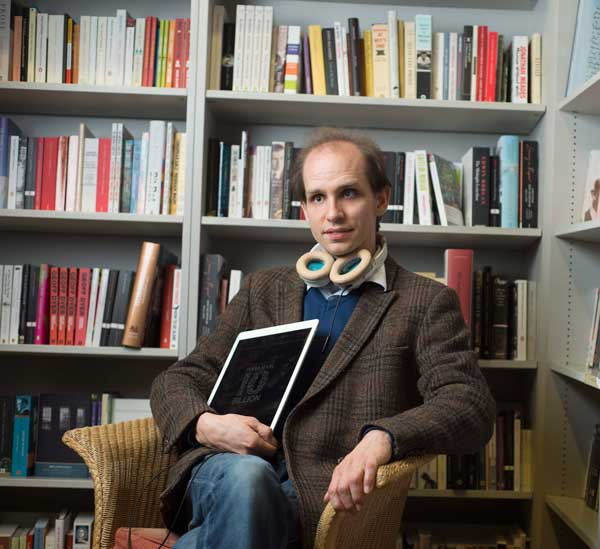
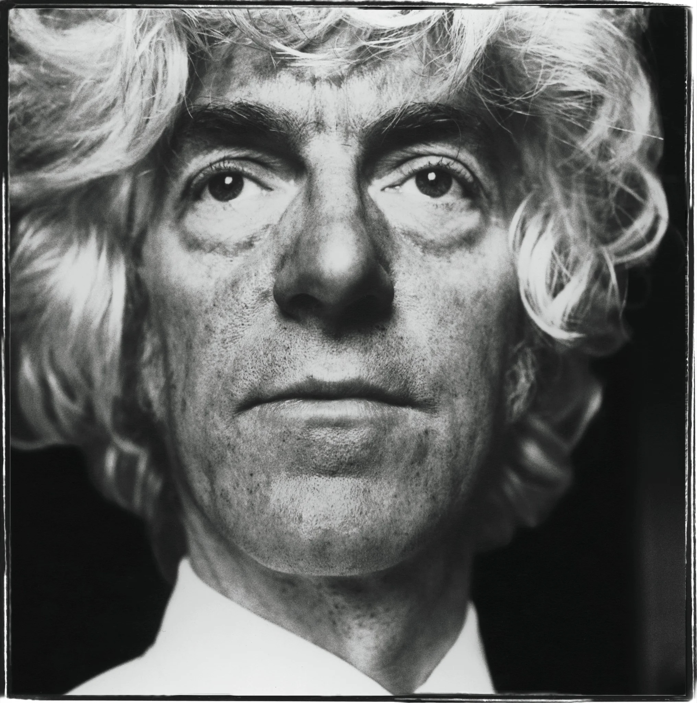
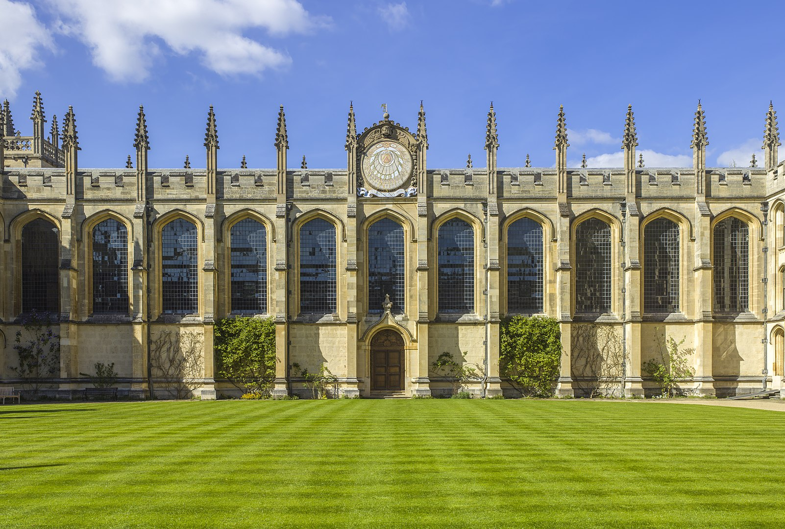
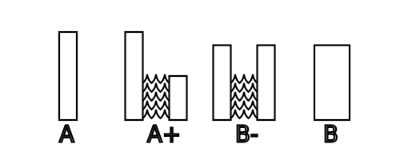
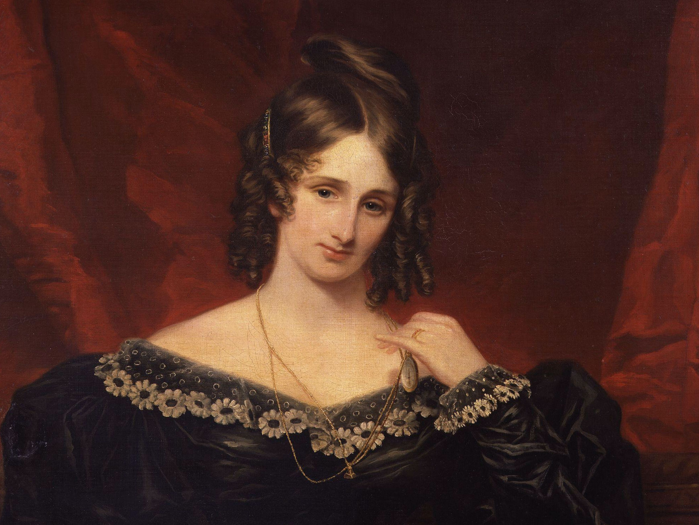
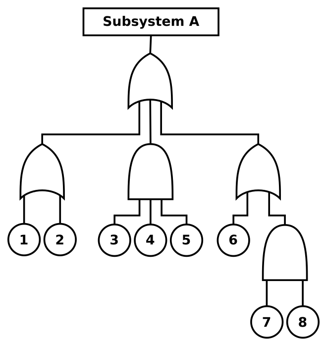
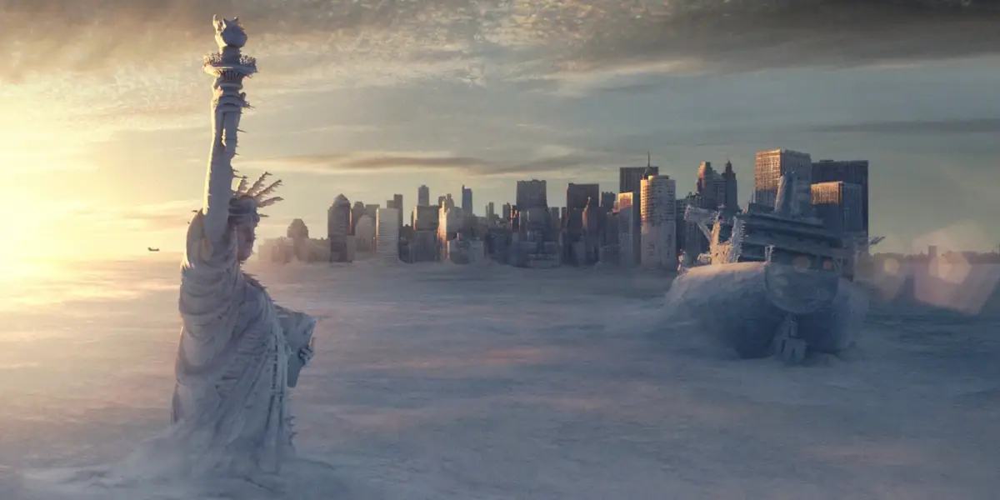
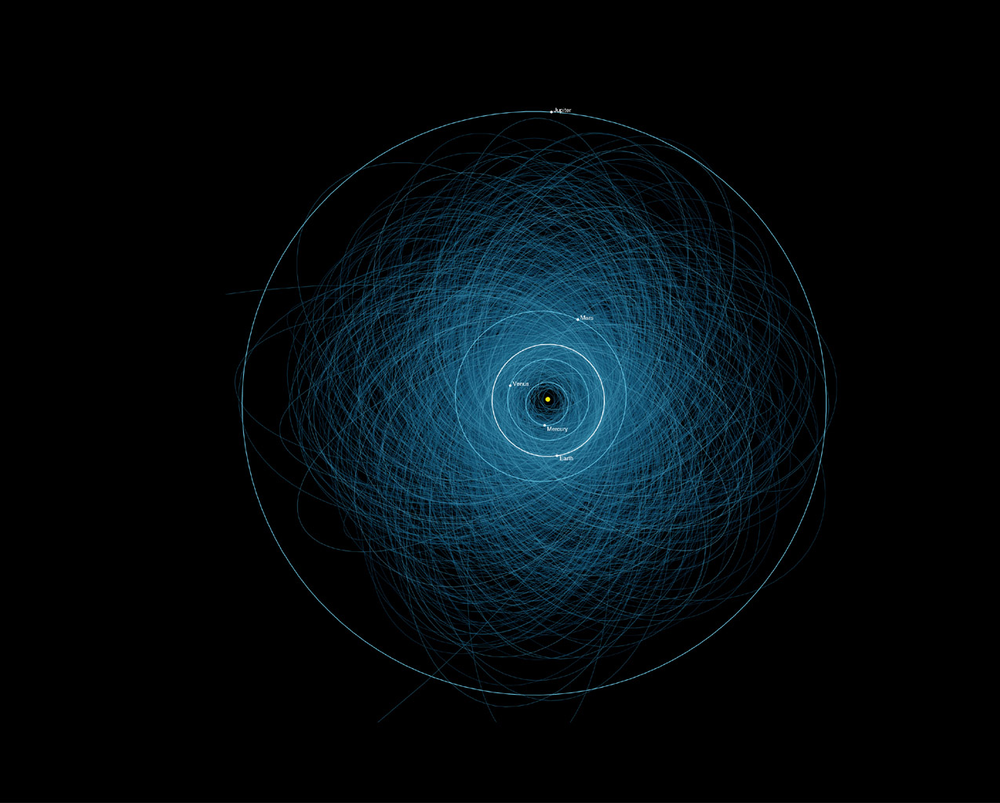

Dr [S. J. Beard](https://sjbeard.weebly.com/) is a research associate at the [Centre for the Study of Existential Risk](https://www.cser.ac.uk/) at the University of Cambridge, and an AHRC/BBC [New Generation Thinker](https://www.google.co.uk/url?sa=t&rct=j&q=&esrc=s&source=web&cd=1&cad=rja&uact=8&ved=0ahUKEwinzaLroeXSAhUk0oMKHZvkDqIQygQIITAA&url=http%3A%2F%2Fwww.bbc.co.uk%2Fmediacentre%2Flatestnews%2F2017%2Fnew-generation-thinkers%23heading-simon-beard&usg=AFQjCNH_ST_F446ObmDAEp5K9XbnBIBSag&sig2=XOBLPQb2y9leO-shISZ-WQ). With a background in philosophy, they work on ethical problems relating to the long-term future of humanity, as well as evaluating [extreme technological risks](https://www.cser.ac.uk/research/).

In our conversation, we discuss the influence of the late philosopher Derek Parfit, and how his writing motivated the modern existential risk movement. We ask about how research at CSER gets done, how to interpret probability estimates about major one-off events like global catastrophes, and how climate change is most likely to precipitate a global catastrophe. Lastly, SJ reflects on their experience running as a political candidate, how incentives in academia may be fixed, and what COVID has taught us about the fragility of global systems. In this article, we summarise and illustrate these ideas; providing both extra examples and further reading.

*Note that while the remainder of this article was written using he/him pronouns, [SJ](https://sjbeard.weebly.com/) now uses they/them pronouns.*

##### Source: Arts and Humanities Research Council

## Book Recommendations 📚

- [Reasons and Persons](https://www.goodreads.com/book/show/327051.Reasons_and_Persons) by Derek Parfit
- [The Dark Forest](https://www.goodreads.com/book/show/23168817-the-dark-forest) by Liu Cixin
- [Silent Spring](http://www.rachelcarson.org/SilentSpring.aspx) by Rachel Carson

 <Book url="https://www.goodreads.com/book/show/327051.Reasons_and_Persons" image="book-simon-1"/> <Book url="https://www.goodreads.com/book/show/23168817-the-dark-forest" image="book-simon-2"/> <Book url="http://www.rachelcarson.org/SilentSpring.aspx" image="book-simon-3"/> 

## Existential Risks

### What is an Existential Risk?

An existential risk is any threat to the long-term potential of humanity. These can be natural risks like asteroid strikes, or anthropogenic risks like engineered pandemics, unaligned artificial intelligence, or runaway climate change. Human extinction — the end of all human *life* — would therefore constitute an existential catastrophe. But the term 'existential risk' captures a broader range of scenarios, since "it can refer to any number of very bad scenarios which are on the same scale as human extinction". For instance, an outcome where humans survive but in *irrecoverably* dire circumstances would amount to something comparable in severity to extinction — either under some dystopian political 'lock-in' or some forced regression to pre-civilisational modes of living.

### Why they Matter

There is no single reason for thinking that existential risk mitigation ought in general to be taken far more seriously than it currently is. Instead, arguments from across a wide range of ethical views and principles all converge on this same conclusion. That said, perhaps the strongest case for taking existential risks seriously relates to the enormous potential that would be wasted if an existential catastrophe were to occur. The philosopher [Nick Beckstead](https://drive.google.com/file/d/0B8P94pg6WYCIc0lXSUVYS1BnMkE/view) has suggested a rough estimation of the magnitude of humanity's future, in expectation. He assumes that we have at least a 1% chance of surviving for another billion years. Conditional on surviving that long, he assumes that we again have at least a 1% chance of (presumably by colonising space) surviving for 100 trillion years. The expected duration of humanity's future lifespan is therefore at least 1% × 1% × 100 trillion = 10 billion years (and this seems like a conservative estimate). Such a staggering timescale presumably involves a similarly vast number of potential lives. Of course, this wouldn't matter if those lives were not worth living. Indeed, if the far future is likely to be characterised by lives not worth living, it may be best to *avoid* such an outcome. Fortunately, there seem to be good reasons to expect the quality of human life to improve over this long sweep of time. For instance, various quality of life indicators have already been steadily but significantly improving over the past century — such as the spread of [democracy](https://ourworldindata.org/democracy), improvements in [happiness and life satisfaction](https://ourworldindata.org/happiness-and-life-satisfaction), and steep reductions in child [labour](https://ourworldindata.org/child-labor) and [mortality](https://ourworldindata.org/child-mortality). Secondly, emerging technologies hold out the prospect of dramatically reducing or [even eliminating](https://www.hedweb.com/) suffering, producing an [abundance](https://ftalphaville.ft.com/2015/10/27/2143173/the-mainstreaming-of-technological-abundance-thinking/) of basic goods, and [eliminating](https://www.oxfordmartin.ox.ac.uk/blog/automation-and-the-future-of-work-understanding-the-numbers/) the necessity for various kinds of unfulfilling labour. Since by definition an existential catastrophe would squander all or nearly all of this immense potential, it seems to follow that we should be prepared to divert more resources than we do at present to researching and acting on the best ways to mitigate existential risks (as long as doing so reliably decreases those risks).

Note that the magnitude of this immense potential seems to imply that nearly all of the severity of some global catastrophe is determined by its effects on the long-term future. Derek Parfit illustrates this point in his book Reasons and Persons, arguing that "if we destroy mankind, as we now can, this outcome will be much worse than most people think". He asks the reader to compare three outcomes:

1. Peace.
2. A nuclear war that kills 99% of the world's existing population.
3. A nuclear war that kills 100%.

(3) is worse than (2), which is worse than (1). But which difference is greatest? Suppose the remaining 1% of humanity in (2) are eventually able to rebuild civilisation to some equivalent level. Although the *percentage* difference between (3) and (2) is nearly 100 times less than the difference between (2) and (1), we should nonetheless think that (3) is *far* worse than (2) than (2) is worse than (1), because (3) irrecoverably curtails the *entire* potential of humanity.

A (total) [utilitarian](https://www.utilitarianism.net/) would think that an existential catastrophe is bad because of the enormous quantity of happiness that has been lost. But happiness needn't be high on your list of priorities to think that the destruction of mankind would be, as Parfit puts it, "by far the greatest of all conceivable crimes". You might also care for scientific or artistic achievement for their own sake, or the realisation of human rights and the flourishing of democracy. The best of all these things, too, seem to lie in the centuries ahead of us. Whatever things you think matter most, an existential catastrophe is all but guaranteed to squander an astronomical amount of it.

But arguing for the badness of an existential catastrophe needn't rely on this 'consequentialist' form of argument at all — it needn't solely point to the astronomical quantities of good things, whatever they are, that an existential catastrophe would waste. Instead, we could straightforwardly appeal to the billions of *present* human lives that would be cut short — and that would likely spend their final moments in pain or anguish. We might also look to our *past*, and notice how an existential catastrophe would mean failing to live up to our obligations or debts towards our ancestors. After all, the human project — every aspect of civilisation that improves our lives today — was the project of many generations reaching across time. So many people toiled over their work in the trust that it would be vindicated by posterity: that it would be made worthwhile by the enjoyment of generations to come. To allow an existential catastrophe to occur would mean betraying that trust. The political philosopher Edmund Burke puts it more elegantly:

> Society is indeed a contract... [it] is a partnership in all science; a partnership in all art; a partnership in every virtue and in all perfection. As the ends of such a partnership cannot be obtained in many generations, it becomes a partnership not only between those who are living, but between those who are dead and those who are to be born.

Finally, we might consider the obligations generated by humanity's *cosmic significance*. If we are alone in the universe, putting a permanent end to our own global civilisation may represent an especially terrible outcome, because it may mark the moment intelligent life is extinguished *for good*.

### What CSER Does

There seems to be a strong case for trying to mitigate existential risks, if doing so is at all possible. But do we have control over the likelihood of human extinction or civilisational collapse? As SJ mentions, people have been thinking about existential risks for centuries; but only recently have people begun to realise that we may be able to answer that question in the affirmative. Thus, only in the last decade or so has a fully fledged movement coalesced around practically dealing with existential risks. What does that work look like? Roughly speaking, it takes three aspects: first, identifying the most likely risks; second, figuring out what could be done to mitigate them; and third, doing those things. The [Centre for the Study of Existential Risk](https://www.cser.ac.uk/) in Cambridge is a research organisation that aims to directly work on the first two aspects, and advocate for the third. Take the threat of an engineered pandemic. Existential risk research might begin by addressing the potential for a man-made organism or virus to wipe out humanity. It might then consider what kind of regulatory bodies and policy options — like moratoria on research — are viable. Finally, based on the recommendations generated, these regulatory bodies might be founded; or governments might enact those moratoria.

## SJ's Background

SJ's engagement with philosophy began with [Civilisation I](https://en.wikipedia.org/wiki/Civilization_(video_game)):

> One of the things I noticed quite early on was that if you were the first person to research philosophy, you got another tech for free... having had that seminal experience, I decided — whatever this thing was  — that this was something I wanted to do.

At age 11 or 12, SJ learned about the PPE course at Oxford University, and "that sounded to me like the degree you should study if you wanted to be good at Civilisation or to do the grand things that Civilisation talks about and plays with". He earned a place on the course — at which point, "I was no longer thinking about life in terms of a video game... I still really liked to do philosophy... but I would really really like to find a way that philosophy can be useful and worthwhile, because it seemed to me that a huge amount of what philosophers talked about wasn't useful or worthwhile."

Thus, after graduating, SJ spent some time doing research for various thinktanks and NGOs. "I was the only person I'd ever heard of who was a freelance researcher in the House of Lords. I got a security pass and just hung around meeting rooms and seeing if any peers needed a speech writing or something; trying to make ends meet."  The upshot was that SJ quickly learned what it looked like to "make a difference in the policy world". The downside? "None of these people wanted a philosopher".

So SJ returned to academia. He enrolled on to LSE's '[Philosophy and Public Policy](https://www.lse.ac.uk/study-at-lse/Graduate/Degree-programmes-2020/MSc-Philosophy-and-Public-Policy)' course. "If any course could help me find a practical use of my philosophical skills that would be it", he thought — and "it kind of didn't". To be sure, SJ was surrounded by people with the same ambitions and ideas, but "no real answers". By this point, the political work had all but dried up; and tutoring work was filling the gap. This tutoring began to stand out as a career option: having dallied at the fringes of politics and decided he wasn't going seriously going to become a politician, "at least I could go and teach these people". So SJ returned to Oxford, resolved to studying for a philosophy PhD and doubling down on academia. Here, he first encountered the work of philosopher Parfit.

> While I was still trying to settle on what I wanted to study, I read through Derek Parfit's *Reasons and Persons* from cover to cover. I loved that book. It's my favourite book ever. I just think it's amazing for the breadth of its vision.

SJ resolved on writing his thesis about some part of the book. He settled on Book 4, which discusses the ethics of future generations: a field known as [population ethics](https://www.philosophy.ox.ac.uk/population-ethics). At the same time, Oxford's [Future of Humanity Institute](fhi.ox.ac.uk/) were hiring for a postdoctoral researcher in population ethics. This was curious, he thought: the field was then perceived as already mature; a "dead-end" for a newly minted PhD. In any case, he applied and got the position.

> I really stumbled in to the existential risk community. And here were the people who had actually achieved what I wanted to do. When I was at the LSE, looking for practical philosophers, I found lots of people who wanted to do this work but didn't have the slightest idea how to do it. When I got to FHI, I found people who not only wanted to do what I had been looking for all along, but were actually making it work.

The first thing SJ did in this postdoc position at FHI was apply for a longer-term role at a similar new institution in Cambridge: the Centre for the Study of Existential Risk, or CSER. "I got the job, and have been in love with the field and with CSER ever since."

And it all started out with a game mechanic in the first Civilisation game!

## Parfit

In the interview, we asked about why Parfit's writing was so influential — on SJ personally, and for the world of moral philosophy in general. Why was Parfit's approach special? To answer this question, SJ suggested, we need to consider his biography.

##### Source: [Steve Pyke](https://www.pyke-eye.com/Published-Books/Philosophers-Volume-I/1/caption)

Parfit originally intended to study history. He was, "by all accounts, one of the most brilliant history students of his generation." But when he applied for a history fellowship at All Soul's college in Oxford, he was rejected. Only then did he decide to pursue philosophy — and taught himself the subject in 18 months. He was then granted a fellowship at All Souls, a college almost almost entirely unique for its total absence of any academic responsibilities: no teaching commitments, no requirements to publish a certain amount in a certain time. As such —

> [Parfit] was able to see a problem, that was a really difficult thony problem, and not worry about the fact that he couldn't solve it... [He] saw this problem in population ethics at some time in 1968, and he *never* solved it. He just kept on working at it.

This, for SJ, explains how Parfit prodigious creative force: "he was able to see a problem and just love it as a problem." So many problems Parfit addressed — from the nature of personal identity, issues in distributive ethics, the search for a 'Theory X' of population ethics, and many more — amounted to a "bottomless pit of doom". But, SJ reflects, that was almost the point: "in exploring this bottomless pit of doom, and its intricate caves, you find many hidden treasures".

When the Victorian [utilitarian](https://www.utilitarianism.net/) moral philosopher [Henry Sidgwick](https://www.utilitarianism.net/utilitarian-thinker/henry-sidgwick) was asked about his book, Parfit once related, “Sidgwick said that its first word was Ethics, and its last failure. This could have been the last word of my [book]." And yet, SJ adds, "for any young philosopher that is such a wonderful thing to come across". The comparison between Parfit and Sigwick is a surprisingly fruitful one. As SJ relates, it was often said of Sidgwick that

> He scouted the landscape and found a desirous space; dug in his spade, vigorously turning over clumps of soil until he came across something sparkling and golden. Then he walked away leaving as his legacy just one sign saying: 'Dig here'.

And that's exactly what Parfit did: find deeply important and almost intractably hard philosophical problems, and work at them without rushing to claim he'd found any answers. In the three and a half decades since the publication of *Reasons and Persons*, the 'dig here' signs planted by the book have indeed spurred and inspired philosophical discussions which continue to thrive in the present day.

## Population Ethics

We asked SJ to briefly introduce some of the questions posed in population ethics, as addressed in Book 4 of *Reasons and Persons*.

Population ethics involves coming up with well-justified general principles for comparing the value of different possible future populations; where those populations can vary by the number of people that make them up, as well as the quality of life for those people. Like much of the rest of moral philosophy, a typical approach to such questions is to elicit intuitions from a range of particular examples, from which the aim is to derive more formal claims: from minimal desiderata ('any reasonable theory should at least...') to fully-fledged theories.

The results of some comparisons are obvious to everyone. For instance, any decent theory should say that a world with 1000 blissfully happy, fulfilled people is preferable to a world in which those same people are only mildly happy, and all else remains equal. Yet, as we explore more (apparently) obvious such intuitions, we quickly find that things do not turn out to be as straightforward as they might seem. As SJ warns:

> All of the various ways you might work that in to your future ethics, including any one that you're thinking about right now dear listener, they're all terrible. They all have really bad implications.

Let's get a sense of how this happens. It seems obvious that between two worlds with the same 'total' quality of life (number of people $\times$ average quality of life), the world in which quality of life is distributed more equally is at least as good as the world in which it is distributed less equally. Call this *Equality*. Furthermore, it seems obvious that a world with some population A plus some extra population B made entirely of people with lives worth living is strictly better than the original population A. Call this *Mere Addition.* Finally, it seems obvious that if some population A is better than B, and B is better than C, then A is better than C. Call this T*ransitivity*. If you have found yourself agreeing with the previous three intuitions, you may be surprised to learn that they entail a conclusion which will likely to seem wrong to you.

### The Repugnant Conclusion

Start with some population A, where everyone in A has a very high quality of life. Now consider a population A+, which includes all the people in A with the exact same quality of life, *plus* an extra group of people of equal size and very slightly lower quality of life — though still worth living. If you could choose to bring about either A or A+, which would you choose? If you agreed to *Mere Addition*, you should think that A+ is better. Now take A+, and consider a population B- of equal size to A+, but where the two distinct groups now have an equal average quality of life. To sweeten the deal , suppose in addition that the average quality of life of the best-off (the initial) group is lowered *less* than the worse-off group's quality of life is raised, such that both the average and total quality of life is higher. If you agreed to *Equality,* you should agree that B- is even better than A+. Finally, let population B just be the population formed where these two groups in B- are merged to form a single group. Nobody's life changes at all here — it's really a difference without a change. So B is equally as good as B-. Now consider the diagram below. The height of each rectangle represents the average quality of life of the group it represents above the point where a life is not worth living. The width represents the number of people — the size of the group. If you agreed to *Equality*, *Mere Addition*, and *Transitivity*, you have agreed that B is strictly better than A.

Now, notice that no part of the above argument relied on any details about the precise size of each group, or the precise differences in average quality of life — as long as it is always good enough that every new life is still worth living. What we agreed was that, for any rectangle — any population of people with lives worth living — there is always some wider, shorter rectangle — some population of people with *more* people and a *lower* quality of life — which is better than the original population. Now imagine repeating the argument for B, to yield population C. We can do this indefinitely. Let's call the limiting case Z. Z is a vast population of people all living lives *just barely* worth living. Since we must prefer each new population to the previous one at every step (as long as we agree to *Equality*, *Mere Addition*, and *Transitivity*), then we must prefer Z to A. Does that sound right to you? Probably not — most people are convinced that a world in which lots of people live amazing lives is better than a world in which a staggering number of people all live lives barely worth living — lives characterised by 'muzak and potatoes', in Parfit's memorable expression. This unsettling result is called the [Repugnant Conclusion](https://plato.stanford.edu/entries/repugnant-conclusion/#AccRepCon) for that very reason. You can read more about it in the write-up for our interview with Vasilis Kotsidis on [Rational Choice Theory and the Repugnant Conclusion](https://hearthisidea.com/episodes/vasilis).

Where did we go wrong? Perhaps you think that the mistake was in moving from A to A+. In other words, perhaps we should reject *Mere Addition*, because adding even lives worth living can nonetheless lower the average quality of life of a population. Instead, maybe what ultimately matters is the *average* quality of life of a population. This view is called average utilitarianism:  it says we should always prefer the population with the highest average quality of life. Is this a way out of the Repugnant Conclusion? Not at all. According to average utilitarianism, a population of a single person leading an amazing life is better than a population of very many people leading lives only a tiny amount less amazing. That already seems wrong, but things get even worse. Consider a population of a single person living a life of unbearable agony. Notice that, by adding a group of a billion people all living lives of only slightly less terrible agony, the average quality of life would be increased. Faced with a choice between those two populations, average utilitarianism prefers the second. That's about as wrong as an ethical theory can get. The repugnant conclusion is just *[incredibly](https://sjbeard.weebly.com/parfit-bio.html)* hard: 

> Like a mathematical fractal, as philosophers have examined it in greater and greater detail, it has seemed to grow in its complexity, and its repugnance. One widely discussed manuscript on the subject, by the Swedish philosopher Gustaf Arrhenius, considers 400 pages of detailed formal arguments on the subject before concluding that the only way out of this mess is to give up on the idea that we can talk about objective ethical truths at all. Another colleague once told me that, as far as he was concerned, it was the greatest proof ever devised for the non-existence of God!

### The Nonidentity Problem

Let's lower ourselves a little deeper into the 'bottomless pit of doom'. The *nonidentity problem* is really a bundle of questions all generated, similar to before, by independently plausible but mutually incompatible intuitions. Conceptually, it occurs prior to any discussion of the Repugnant Conclusion.

In what sense is it good that future people exist? Without coming up with a fully-fledged theory, we can stipulate an obvious-sounding condition: some outcome is good only if it's good *for* someone; and some outcome is better only if it's better *for* someone (or some people). Plausibly, then: whatever the correct theory may be, it's at least got to tell us that if *nobody* in outcome A is counterfactually better off in outcome B, then outcome B cannot be better than A. As SJ puts it: "normally we think that something is good because it's good for someone. The benefit falls to someone — it makes them better off than the otherwise would have been." As Parfit himself puts it: "the “bad” act must be “bad for” someone".  This is called the *Person-Affecting* view. To this we can add a second intuition. Consider some act which brings a person into existence who wouldn't have existed in the absence of that act. Suppose that person's life is unavoidably flawed in some way, but still more than worth living. Such an act — conferring existence on this person is not bad for this person. Call this the *Existence Conferring* view.

This already leads to a conceptual tangle. As SJ points out the *Person-Affecting* view is suited to assessing acts which don't affect whether anybody exists. But it seems to struggle to explain why or in what sense bringing even an amazingly good life into existence is *better* than not doing so. As SJ points out, "there isn't a counterfactual in which a person is better off and one in which they're worse off; there's a counterfactual in which they are better off, and one in which they *don't exist at all*. And it's not clear in what sense it's better for me to exist than not to exist at all." That's because in the case where I'm not brought into existence, there's no me — so nothing to compare against. It certainly doesn't seem *worse* for me not to exist, because again there's *no me*.

The nonidentity problem extends to range of more concrete examples, which show that the *Person-Affecting* and *Existence-Conferring* intuitions together yield intuitively absurd conclusions. Consider this example suggested by Parfit. A community has decided to deplete rather than conserve its resources (e.g. fossil fuels, precious metals, fish stocks, or timber). As a result of this choice, people alive now will live *slightly* better lives compared to if they conserved the resources. However, people born after this decision will live lives of far lower quality than people otherwise would have lived: beyond the shortish-term gains, the overall quality of life will be much lower for centuries (though still worth living). However, note that the people who are born after the choice to deplete resources are *not* the same people as the people who are born after the choice to conserve resources. Why is that? Note if the timing and manner of conception that led to your birth was even minutely different, a different sperm would have fertilised the same egg, and a *[different person](https://plato.stanford.edu/entries/rigid-designators/)* would have been born. The rippling 'butterfly effects' of virtually any act whatsoever, certainly including the relatively major decision to deplete resources, would almost certainly make a counterfactual difference to the identities of every person born after the decision is made. The upshot of this is that there is *nobody* from the generations of people born after the 'depletion' decision was made who is made comparatively worse-off compared to if the community decided to conserve resources. Since nobody is therefore made counterfactually better off if the community decided to conserve resources, then the *Person-Affecting* view says that choosing to conserve resources *cannot be better* than choosing to deplete them. And the *Existence Conferring* view says that choosing to deplete resources is not bad *for* anyone born after that decision is made. This can't be right — it seems obvious that choosing to deplete resources is, morally speaking, strictly worse than choosing to conserve them. More abstractly: a world of 100 people living amazing lives seems better than a world of 100 different people living mediocre lives; even when there's *nobody it's better for*.

Cases like this present a problem for every so-called [person-affecting](https://en.wikipedia.org/wiki/Person-affecting_view) moral theory, such as [contractualism](https://plato.stanford.edu/entries/contractualism/) and even some kinds of person-affecting consequentialism. They are particularly relevant to the discussion of existential risks, because person-affecting views seem to imply that human extinction is not a bad thing, and may sometimes even be a [good thing](https://rucore.libraries.rutgers.edu/rutgers-lib/40469/). 

These questions followed Parfit right until the end of his career — he submitted an [unfinished draft](https://onlinelibrary.wiley.com/doi/epdf/10.1111/papa.12088) addressing these themes shortly before his death. Nearer the end of his life, he had become preoccupied with reconciling different moral theories. "If some theories couldn't accept the value of future lives, then it would be a deep and troubling difference between these two kinds of theories", SJ told us. At first, Parfit was convinced that we should nonetheless reject all person-affecting views, for the reasons outlined above. Yet, in this final year of life, Parfit came to believe that he hade made a mistake in rejecting person-affecting views so readily. SJ relates — 

> "I have a problem with the non-identity problem. Parfit proposed his solution very shortly before his death. He literally sent in his solution, and then died — less than eight hours later... I think the solution is brilliant; and the vast majority of people think it makes no sense whatsoever."

SJ then explains Parfit's proposed solution:

> It may not be better for me that I exist than if I don't exist. But it is still good for me when I exist with a good life; and there is nothing good about my non-existing. So even if it's not better for me, it's still more good for me to exist than not to exist.

Parfit thought person-affecting theories could then be re-written, replacing notions of benefit and 'better for' with notions of 'good for' and 'more good for'. A lot of people take this for "linguistic trickery", others think this move successfully salvages person-affecting views. If it works, then person-affecting views may after all be able to make sense of the profound wrongness of human extinction. SJ himself, along with philosopher Patrick Kaczmarek, has [recently written a piece](https://www.argumenta.org/article/wrongness-human-extinction/) arguing for exactly this. Not everyone agrees. You, dear reader, must form your own opinion!

## Meeting Parfit

SJ relates a story from his own philosophical career which wonderfully evokes Parfit's obsessive, idiosyncratic character.

> I really wanted to meet Derek and talk to him... I actually went to Sweden. He was being given the Rolf Schock prize — kind of like the Nobel in philosophy. There was this big awarding ceremony in Stockholm... I saw Derek afterwards, and I said "Derek, you completely changed my life, your book is amazing, I have all these ideas — can I talk to you about them?". And he said, "No."

But SJ later realised "he wasn't being rude... this was just Derek... he had allocated all his time to thinking and reading and writing. He knew he was in bad health and didn't want to waste any time on me." SJ sent his thesis regardless, and kept Parfit informed with revisions and changes. Then, shortly before he was due to submit his PhD, Parfit got in touch.

> He says — "SJ, I've read your thesis, it's brilliant. Come and see me in Oxford."

They were finally able to have an extended conversation. "Having read so much of his work... I really wanted to understand him". His impression? Parfit was a product of his cultural milieu. He began doing philosophy in 1968 — the year MLK and RFK were assassinated, the year of the Paris uprisings, the launch of Apollo 8, the Prague spring.

> It was the year people were really thinking about changing the world... [Derek] really wanted his philosophy to do that.

In his writing, Parfit came to realise the enormous value of future generations; and the corresponding importance of safeguarding humanity from threats to its survival. And he lived this conviction out in his personal life, too — showing, for instance, a great concern for the environmental impact of his behaviour.

> I think he really believed that one of the reasons people are reckless about the future is that they don't think that there are objective moral facts.

"The problem", SJ tells us,"was that he wasn't very practically minded... he trusted that people would come along and make use of this arguments. And indeed they did." Parfit left an intellectual legacy in the people he deeply influenced with his philosophy or teaching. A new generation of scholars — 'Parfit's children' — have taken up his task enacting his convictions about protecting the future of humanity. This group includes SJ himself, Will MacAskill, Toby Ord, and Hilary Greaves; working at organisations like the [Future of Humanity Institute](fhi.ox.ac.uk/), the [Global Priorities Institute](globalprioritiesinstitute.org/), and the [Centre for the Study of Existential Risk](cser.ac.uk/).

> So many of these people are now still doing philosophy but they're not doing normal philosophy jobs. They're working in the existential risk movement, or the effective altruism movement. They're working to actually make a big difference. And I do think this is part of Parfit's legacy... we can take his theories and really start working on the communication and the application.

SJ's *personal* reasons for pursuing this field? —

> I have to say, hand on heart, it is just the best job in the world... if you get a kick from, as Lewis Carroll said, trying to do six impossible things before breakfast — this is the field for you. [And] working on hard problems that are also relevant to securing humanity's future — you really don't need anything more motivational than that.

## Existential Risk Research

All of this begs the question: what does existential risk research actually involve on a day-to-day basis?

As SJ puts it, the challenge for him is that the theories of population ethics he wants to apply are numerical in nature: they take as inputs populations, levels of well-being and risk, even levels of uncertainty. When it comes to extracting practical insights from these theories, SJ notes, "nobody else is providing these numbers." Indeed, it isn't clear how best to come up with these estimates. A major challenge, therefore, is methodological — or rather dealing with the *lack* of methodology. Some particular problems pertaining to existential risk are indeed well-understood and well-defined technical problems that need solving: puzzles rather than mysteries; *known unknowns*. "But within a lot of the rest of the field there's a lot of bold speculation, and people calling for governance solutions in vague terms... it's far easier to say something in this field than to say something worth listening to." More specifically, existential risk research regularly faces up to two kinds of question: "how likely are certain scenarios, and how much of a difference can we make?". In other words — "where are the tipping points; the interventions with the largest effect?" These are crucial questions for which robust answers are required, but they are so large and nebulous that for a long time "there just weren't any established methods for doing so".

### History

Despite the relative novelty of bringing modern, rigorous methods to bear on the problems, existential risk research has a rich intellectual heritage. This in contrast to the widely-held perception (according to SJ) that concern for existential risk only emerged at some point in the early 2010s. "That's patently false" he says "people have been worrying about this stuff for centuries".

##### Mary Shelley

The first English-speaking writer to consider the risks to humanity posed by emerging technology appears to have been Samuel Butler in 1868. Famous writers were discussing human extinction even earlier — including both Mary Shelley and Lord Byron at the beginning of the 19th century. Even Kant, a notorious opponent of the kind of consequentialist thinking that dominates much modern discussion, considered the importance of human extinction in the 18th century. The difference between then and now, SJ suggests, is continuity: the modern existential risk movement represents a continuously existing group which records and builds on its own research and progress. This marks a sharp contrast with past efforts to grapple with the topic in writing:

> People would write something or talk about this; and often a lot of people would listen. These were high-profile works well read in their own time. But then they would fall by the wayside. And the next person who came and perceived some looming global catastrophe would reinvent the wheel... It's very odd to be in a community who are thinking all the time about the long-term future and humanity as a whole, and who can't see how the discipline we're in has actually been going on for a good many years, and who hasn't been trying to learn from the successes and failures of the past.

Despite this discontinuity, existential risk's intellectual history was deemed significant enough to form the subject of an [extensive review](https://www.sciencedirect.com/science/article/abs/pii/S001632871930357X) conducted by CSER's Thomas Moyhnihan. Even the modern movement has progressed so quickly that SJ sees a need to chart it's own intellectual history. And SJ, too, has recently taken on the related task of conducting a large literature review of past research not explicitly conducted under the 'existential risk' banner but nonetheless applicable to the cause.

> We looked at any time anyone put a numerical estimate on some global catastrophe: all the methods they used, and how they applied them... we discovered a huge underutilisation of available methods.

One such method the review found is fault tree analysis (FTA), a method familiar to engineers tasked with finding the possible failure modes for critical systems. FTA begins by asking: what are the most likely proximate causes of a given failure? Suppose terrible outcome A happens. What were the most likely reasons? Did multiple factors need to occur in conjunction, or is some single factor sufficient? Now for each of these proximate causes B1, B2, etc. — what could have caused these things, and in what combination? And so on.

It isn't hard to see how this method could be put to work in the context of existential catastrophes. Yet, "nobody had tried to do fault tree analysis for catastrophic climate change, for instance — or for a global pandemic".

## Climate Change and 'Global Systems Death Spirals'

What does doing FTA for catastrophic climate change tell us? In other worse: "[Under what](https://www.vice.com/en_us/article/qvg99b/this-guy-studies-the-global-systems-death-spiral-that-might-end-humanity) circumstances could climate change cause a collapse of global civilization?" For existential risk research, this is a central question. But existing research, SJ cautions, has examined the worst-case direct effects of climate change at the expense of potentially more plausible indirect answers to this question.

Where methods like fault tree analysis have been applied to potential global catastrophes (with nuclear security being a caveat), SJ suggests that the standard of scholarship and rigour sometimes falls short of acceptable standards — especially given the stakes. In the case of climate chance, SJ found that the most the most likely catastrophic events were judged to be worst-case runaway warming in the range of 15-20 degrees centigrade, or outlandish scenarios like nuclear reactors flooding and exploding. Instead, SJ and other researchers at CSER "see a much bigger threat in the levels of global complexity within things like the food supply system, and how that relates to global security and loss of biodiversity."

Take sea level rise, for instance — one of the most widely known consequences of global temperature wise. This is clearly no good thing, but it seems plausible that humanity will respond and adapt: "some cities will be protected, others will migrate". In general, single effects like (even extreme) sea level rise seem unlikely to amount *in themselves* to civilisation-ending global catastrophes. As a more likely alternative scenario, SJ and other researchers at CSER have highlighted the potential for climate change to trigger negative feedback loops which undermine the various highly complex and interconnected systems which characterise modern civilised existence. As a [Vice article](https://www.vice.com/en_uk/article/qvg99b/this-guy-studies-the-global-systems-death-spiral-that-might-end-humanity) about SJ's research points out:

> Shut down the grocery stores, turn off the taps, disband the government and very few of us, perhaps apart from a small number of rugged survivalists, would be able to stay alive for long.

Individuals rely on global systems, but the systems themselves rely on one another — and perhaps those interrelationships are more fragile than we might expect. For instance, climate change is likely to continue to undermine food security as previously arable land increasingly faces drought, biodiversity loss and soil erosion leading to crop failures. In turn, this may lead to increased stress on political systems as competition increases over scarcer resources. Such political 'stress' may then boil over into compounded resource management failures, or even conflict. Indeed, [research](https://www.nytimes.com/2015/03/03/science/earth/study-links-syria-conflict-to-drought-caused-by-climate-change.html) has already suggested that a drought linked to climate change may have played a causal role in precipitating the ongoing [Syrian civil war](https://www.nytimes.com/2015/03/03/science/earth/study-links-syria-conflict-to-drought-caused-by-climate-change.html).

> The point we're making with that paper is: if you look at what could go wrong with climate change, the most likely situation is some kind of general systemic collapse of the global order — of complex societies, organised states, global trade... the thing that's going to trigger that isn't one cataclysmic event, this kind of 'Day After Tomorrow' scenario.

##### The Day After Tomorrow: not likely

COVID-19 provided a limited testing ground for this 'fragility' hypothesis: would *this* global disruption reach a tipping point where we see a cascade of system failures? Somewhat reassuringly, the answer (in the short term) seems to have been *no*. As SJ points out, "the global food system was not disrupted by the COVID-19 pandemic... these are [apparently] robust systems."

Even so, research into these interrelations between global systems, their potential climate change-induced failure modes, and policy options for mitigating or isolating those worst effects, all remains speculative and incomplete. That is dispiriting, given the urgency of the topic. But it's also a cause for hope, insofar as it implies that many of the best policy responses may remain underexplored relative to more popular suggestions. SJ recalls reading the Vice article recently written about him — headline: "*This Guy Studies the 'Global Systems Death Spiral' That Might End Humanity*". SJ's first thought: "great, the clickbait worked." But then he noticed how many people, some of which he'd never met, knew the article would be about him.

> How can it be so obvious that this is me? This is an incredibly hard problem — why are there not *thousands* of people working on [these questions]?

Finally, it's not as if the fragility of global systems is some fixed and exogenous fact which we've just got to discover and then work around. "We do have a choice over how resilient we are. How much effort we put into mitigating climate change will have an impact on how resilient we are to that change."

Yet, none of these enormous issues can be tackled by lone researchers, or even groups of a dozen or so researchers at places like CSER —

> There are so many moving parts to this puzzle. Like population ethics, for any one scholar this can be a bottomless put of doom... the big hope I have is that we can draw more and more people in to engaging with this problem.

## Probability and Catastrophes

In order to prioritise work on the most pressing risks, and to understand how various existential risks compare to one another in likelihood, it seems necessary to attribute probabilities to risks. In some cases, this seems harmless enough — for instance, we can narrow the odds of a catastrophic asteroid collision within a given century to within a fairly narrow bound based on records of previous collisions, and the orbits of known '[potentially hazardous asteroids](https://www.jpl.nasa.gov/spaceimages/details.php?id=PIA17041)' (PHAs). We also know something about the effects of such a major collision, because we have good reason to believe that the earth has experienced at least one [previous instance](https://en.wikipedia.org/wiki/Cretaceous%E2%80%93Paleogene_extinction_event), which caused a mass extinction event.

##### Orbits of known PHAs. Source: [NASA](https://www.jpl.nasa.gov/spaceimages/details.php?id=PIA17041)

However, it seems much harder and even less appropriate to attribute numerical probabilities to other kinds of existential risk. Suppose I come across a mysterious kind of slot machine for the first time. I want to know the probability of a 'win' for each spin; so I pull the lever 1000 times, and I win 200 times. I can be pretty confident that the probability of winning for any spin lies somewhere around 20%. Suppose there is some other mysterious slot machine which *nobody* has played. How would I begin to estimate the probability of winning now? Many—even most—of the most concerning risks represent what would be novel events, like mysterious slot machines which nobody has tested. That means we seem to have no *reference class* to go by. This generates two related questions: firstly, how can we possibly begin to reason about the probabilities of various existential risks? Secondly, in what sense is it even *meaningful* to do so? Yet, if we cannot answer these questions we seem to be forced to reason 'in the dark' — without the aid of numbers. 

> The global consequences of nuclear war is not a subject amenable to experimental verification — or at least, not more than once. — Carl Sagan

These are surprisingly deep questions, and their answers lie in the philosophy of probability. What do probabilistic statements mean? What are they *about*? As these questions were debated throughout the 20th century, two broad camps emerged. In one camp were the **frequentists**, who claimed that probabilities described the proportion of certain kinds of event happening within a reference class. My chance of getting heads with this coin is 50% *because* the reference class of flips with this coin contains 50% heads. The simplest and strictest version of frequentism insists that the reference class in question must be the actual track record of the precise thing in question — the past spins of *this* roulette wheel, or past flips of *this* coin. As SJ mentions, proponents of this version "can only really use probabilities to talk about the past". This strict version can be relaxed into a version which expands the reference class to an indefinitely long series of 'as-if' trials (flips, spins, etc.) and defines the probability of some event as the *limiting* proportion of that even within this class. In either case, probability is understood as an objective property of some entity in the world — probability claims are claims about the world. The upshot is that where we don't know about the reference class in question (or there just isn't one), we just can't meaningfully attribute the probability.

In the other camp were the **Bayesians**, who claimed that probability statements were best understood not as being about objective properties of the world, but about one's beliefs. Specifically, probabilities are understood as *degrees of belief* or *credences*. In turn, degrees of belief are often defined or analysed in terms of betting preferences. In short:

> Your degree of belief in E is p iff p units of utility is the price at which you would buy or sell a bet that pays 1 unit of utility if E, 0 if not E. ([SEP](https://plato.stanford.edu/entries/probability-interpret/#SubPro))

Notice how much the Bayesian class of interpretations contrast with the frequentist interpretations. Crucially, probability claims are no longer strictly about proportions of some event occurring within a reference class; or any other objective property of the world. Here's one way to draw out the difference: suppose some supercomputer is due to calculate the 100 trillionth digit of $\pi$ tomorrow. What are the chances that it's even? Intuitively, this question makes sense, and the answer is basically 50%. But for the frequency and propensity interpretations, the 100 trillionth digit of $\pi$ never changes — it's necessarily even or odd with 100% probability (we just don't know which yet). So it's not meaningful to attribute a probability at all. Similarly, what is the likelihood that a person will set foot on Mars by 2030? For the frequentist, there's no reference class so no good answer; whereas the Bayesian is happy to come up with a guess and accept [betting odds](https://www.metaculus.com/questions/349/will-spacex-land-people-on-mars-prior-to-2030/) in line with it. 

Bayesians get their name from their emphasis and reliance upon [Bayes' rule](https://www.lesswrong.com/posts/XTXWPQSEgoMkAupKt/an-intuitive-explanation-of-bayes-s-theorem), which describes how to rationally update one's credence in A in light of evidence B:

$$
P(A|B)=\frac{P(B|A)*P(A)}{P(B)}
$$
Bayes' rule is like bedrock for reasoning about probability. Applying it to betting on predictions represents an unbeatable strategy over the long run. And no matter what your 'prior' probability for A starts out as, with enough new evidence your 'posterior' or 'revised' probability for A will always eventually tend to accurately reflect the world. This means that different people can happily disagree over priors in the absence of strong evidence, knowing that "so long as everyone applies the rule correctly, everyone wins in the long term; everyone's judgements are improved." Because of this, Bayesians can "very happily talk about things that haven't happened yet, so long as we can find some relevant information." As SJ relates, this Bayesian approach enjoyed an early success in estimating the probability of crashes for new aircraft designs. "Standard frequentism says you can't do that. If you've got a new aircraft which has never flow, you can't say anything about the probability of it crashing. It's actually got to crash a couple of times." Bayesians, however, can look to a broader reference class to find their priors: what is the overall likelihood of crashing for any aircraft, for instance? They can then [narrow these estimates](https://www.sciencedirect.com/science/article/pii/S0925753517301868) by focusing on more particular features: the new aircraft has a special wing design. Are other aircraft with this special wing design more or less likely to crash? And so on.

> There was a lot of hostility to this [Bayesian] view in the 20th century, but in the 21st century more and more cases have come up where people using this approach to probability estimates have just performed so much better at making accurate assessments.

The Bayesian approach to statistical thinking was also applied in the political realm to great effect. The U.S. news site [FiveThirtyEight](https://fivethirtyeight.com/) was "one of the first public-facing probability tools that based its judgements on Bayes' rule and didn't try and use frequentist analysis... and its predictions were just so much better than everyone else's." [Decades earlier](https://www.lesswrong.com/posts/RTt59BtFLqQbsSiqd/a-history-of-bayes-theorem), statistics professor John Tukey was enlisted by NBC to predict the 1960 presidential race between Nixon and Kennedy. The race was close, but many TV networks were calling for Nixon. Tukey, uniquely using the less orthodox Bayesian techniques, correctly called Kennedy's victory — but NBC refused to air his prediction before the result was known.

All of this shows that the Bayesian approach is almost certainly the correct way of interpreting and estimating probabilities. That's right: Hear This Idea is taking a stand for Bayesianism. Who said we aim to be neutral? The original question asked (i) how we can begin to reason about the probabilities of one-off existential risks, and (ii) what those probability estimates could possibly mean. The Bayesian interpretation of probability tells us that (i) we can look to relevant reference classes, and update on all kinds of information aside from previous instances of the precise event in question. It also tells us that (ii) the estimate we come up with aren't supposed to be claims to knowledge of the frequency of such events — rather, they're expressions of degrees of belief that they'll happen. For instance: a natural pandemic has never wiped out humanity before; so how can we estimate the chance that one will in the next century? Well, we know how easily a more benign pandemic can spread through the modern world! We can also learn from the dynamics of the [Black Death](https://en.wikipedia.org/wiki/Black_Death), the [Plague of Justinian](https://en.wikipedia.org/wiki/Plague_of_Justinian), the [1918 flu pandemic](https://en.wikipedia.org/wiki/Spanish_flu), and so on — how frequently did they occur? How close did they come to human extinction? The logic of Bayesianism permits these moves and describes how to make them.

That said, concerns about attributing numerical probability estimates to existential risks are partly legitimate. It is true that the probabilities derived from Bayes' rule are only as good as the information inputted into it, and often little can change the fact that there's very little evidence of any kind going around. It is also appropriate to bear in mind that probability estimates for most kinds of existential risk are unlikely to be very *robust*, precisely because they're based on such scarce information. That is to say: the numerical estimates we have now are going to be very sensitive to new arguments and evidence, such that we shouldn't be surprised if they change dramatically. This is unlike the slot machine example, where my estimate of the probability of winning per spin is not going to change much with additional plays of the machine.

Maybe numerical probability estimates are possible and meaningful; but perhaps a better question is — are they *useful*? Do we read too much into them? SJ replies with a gripe — that he is so often asked questions like "what are the top 5 risks?" and "how big are those risks?". Whether the chance of a global catastrophe caused by nuclear war is 1/2000 or 2/2000 is rarely decision-relevant, he says. Instead, for a given risk, "what matters is: how much can we reduce it by?"

Finally, probability estimates may be misleading in cases where the odds of some event occurring strongly depends on what we do about it. "In some sense there actually isn't a risk", says SJ. Some such estimates may even be 'reflexive', in the sense that attributing a high probability X% to some catastrophic event makes people sufficiently worried to massively reduce the risk to Y%, while just attributing that low probability Y% doesn't precipitate these measures and as such turns out to be unduly low. As such, for all the strengths of Bayes' rule, it is important in the information-scarce environment of existential risk research to reach for additional tools, such as fault tree analysis.

## Politics and Academia

Nearer the end of our conversation, we discuss SJ's involvement with politics. We began by asking why he recently campaigned to become a Liberal Democrat MP. SJ gave two answers. Firstly, *outreach* — meeting and getting to know people beyond academic circles. Secondly, *experience* — appreciating how research eventually gets transformed into policy, because "we do not live in a world in which anyone randomly turns academic research into policy decisions".

Policies get enacted with the support of MPs, and MPs answer to their constituents, their party whips, and often other special interest groups. The upshot is that policies need to be based on ideas with broad popular appeal and support — they don't get passed *merely* by virtue of being good ideas. Ideas about mitigating existential risks and [representing future generations](https://www.appgfuturegenerations.com/) may be good, but they're not always immediately intuitive (as we should expect: they wouldn't be neglected otherwise). Incidentally, SJ points out, that's no bad thing: the most likely alternative to a parliamentary democracy is not some enlightened technocracy but some form of oligarchy or tyranny. It does mean, however, that:

> If you can't communicate your idea so that your 6 year-old could understand it, or so that it could make a news story with a sympathetic journalist, it's going to be very hard for it to get space within the political discourse... [but] the alternative would be worse.

Politics is not the only kind of worthwhile outreach in this respect. Other people, SJ points out, spread good ideas in different ways. Some people are excellent science communicators; others take to Facebook to battle conspiracy theorists and trolls spreading disinformation. It happens that "my way of being connected is to just do bread and butter UK politics" — but, SJ stresses, he does not in general recommend following his lead!ou

### A Future for Impactful Academia?

Existing processes and incentives in politics mean it's not always straightforwardly easy to pass rational, impactful policies. In the last part of our conversation, we ask if there is some analogy to be drawn between these political hurdles, and the incentive structures in academia that seem similarly misaligned with impactful research: research which benefits the world over the long-term. Most postgraduate research is funded by competitive grant allocations from governments, and has been [criticised](https://www.shaharavin.com/talk/cavendish-funding-by-lottery/) for "conservatism, inefficiency, and bias". Claims are ruthlessly hedged ("it very well may possibly be the case that...") to avoid the worst effects of criticism. And, at least within philosophy, the scarcity of tenure track positions means a serious reluctance to publish bold, controversial claims or address unusual topics — because the risks of being outcast by the academic establishment are too dire. For a long time, research into existential risk was not recognised as a or legitimate field. While established academics could afford to mention the topic, young researchers knew the chances of receiving funding for the topic were slim. There is a perverse feedback loop at play here: clout begets clout. What can be done?

SJ mentions two models for sidestepping this incentive problem. The first was suggested by fellow CSER researcher [Shahar Avin](https://www.shaharavin.com), who "used computer simulations to explore alternative funding models" for university research. He found that "giving money out at random, by lottery, can be more efficient and less biased than grant peer review". On this suggestion, the funding body would screen out obviously bad ideas but accept many more applications than they could fund. They would then select an entirely random cross-section of those applications. How could this work better? Even if grant-making bodies ultimately care about the long-term impact of the research they fund, by necessity they are going to use a set of selection criteria as proxies for that ultimate aim. But as long as they use any such proxy metrics, researchers are [going to 'game' them](https://en.wikipedia.org/wiki/Goodhart%27s_law): that is, find (often costly) ways to score highly on the proxies irrespective of the ultimate aim(s). And even researchers with noble intentions will be forced to play the game just as long as they know that everyone else is. Moreover, we should expect these proxies to be biased towards the present, and thus away from the ultimate aim of the long-run beneficial consequences of research. For all the sense that was *must* be able to do better, randomly allocating grants has two clear advantages: it's not going to exhibit any biases; and it's not going to be possible to game. SJ's take? "I think it's not viable because it can't politically work... people really want to believe they can make good judgements about what good research is."

SJ suggests another approach: "there are some academics who have managed to step outside of the system and just change it." One such person was the philosopher [Nick Bostrom](https://www.nickbostrom.com/), a trailblazer in the modern existential risk movement.

> Nick Bostrom got a PhD in philosophy in 2000, and he just set out to establish the field of existential risk. And he established the hell out of it.

Bostrom earned a PhD in philosophy in 2000, and shortly thereafter began to write articles in little-known journals about existential risks; suggesting concrete new directions for research. He set up an independent research organisation in Oxford called the [Future of Humanity Institute](fhi.ox.ac.uk/). "Through this amazing force of will, he persuaded others that this could be a viable academic discipline. And they started funding it." Now FHI supports dozens of researchers across disciplines, and has inspired the creation of similar organisations across the world — including CSER itself, established by philosopher Huw Price. SJ relates how Price "put so much effort into what he called academic engineering, which is the question of how do you make an academic discipline where there wasn't one before?".

Nonetheless, as SJ emphasises, existential risk research remains in its infancy. Unanswered questions linger; projects remain to be completed; and few policy changes have been made at the governmental level in response. SJ is optimistic:

> "I do believe we will get there... I just hope we get there soon enough."

## Resources

- 📝 [Funding Science by Lottery](https://www.repository.cam.ac.uk/handle/1810/254730) — Shahar Avin
- 📰 [Researchers Link Syrian Conflict to a Drought Made Worse by Climate Change](https://www.nytimes.com/2015/03/03/science/earth/study-links-syria-conflict-to-drought-caused-by-climate-change.html) — NY Times
- 💻 [All-Party Parliamentary Group for Future Generations](https://www.appgfuturegenerations.com/)
- 📰 [This Guy Studies the 'Global Systems Death Spiral' That Might End Humanity](https://www.vice.com/en_us/article/qvg99b/this-guy-studies-the-global-systems-death-spiral-that-might-end-humanity) — Vice
- 🎧 [The Climate Crisis as an Existential Threat with SJ Beard and Haydn Belfield](https://futureoflife.org/2019/08/01/the-climate-crisis-as-an-existential-threat-with-simon-beard-and-haydn-belfield/?cn-reloaded=1) — Future of Life Institute Podcast
- ✒️ [A centuries-old debate about the ethics of future generations may be drawing to a close, but its conclusions raise as many questions as they answer](https://sjbeard.weebly.com/parfit-bio.html) — Simon Beard
- 💻 [Centre for the Study of Existential Risk](https://www.cser.ac.uk/)
- 💻 [Future of Humanity Institute](https://www.fhi.ox.ac.uk/)
- 📝 [Fault Tree Analysis](https://en.wikipedia.org/wiki/Fault_tree_analysis)
- 📝 [On the Wrongness of Human Extinction](https://www.argumenta.org/article/wrongness-human-extinction/) — SJ Beard and Patrick Kaczmarek
- 📝 [The Paralysis Argument](https://globalprioritiesinstitute.org/william-macaskill-andreas-mogensen-the-paralysis-argument/) — William MacAskill and Andreas Mogensen
- 📝 [Existential risk and human extinction: An intellectual history](https://www.sciencedirect.com/science/article/abs/pii/S001632871930357X) — Thomas Moynihan

Thank you very much to Dr S. J. Beard for his time.

