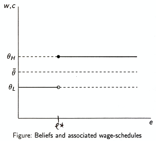
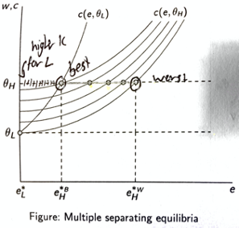

[Dr Sriya Iyer](http://www.econ.cam.ac.uk/people/faculty/si105) is a Reader in Economics at the University of Cambridge and fellow of St Catharine’s College. Her research applies the tools of economics to topics such as religion, development, and education. She has recently published two books on these topics: [Advances in the Economics of Religion](https://www.google.com/url?q=https%3A%2F%2Flink.springer.com%2Fbook%2F10.1007%2F978-3-319-98848-1&sa=D&sntz=1&usg=AFQjCNG-wuIoYnRXz6dtpeAOxgfoD3WTCw), and [The Economics of Religion in India](http://www.google.com/url?q=http%3A%2F%2Fwww.hup.harvard.edu%2Fcatalog.php%3Fisbn%3D9780674979642&sa=D&sntz=1&usg=AFQjCNGyj4dQjDke7hhQ8IErMulz9bqOSA).

In this episode, we begin by outlining what the "economics of religion" is, before considering one of its most important questions: the relationship between religiosity and economic growth. This touches on the role of inequality, Weber's Protestant Work Ethic, and what doing fieldwork in the developing world looks like. Sriya then explains some 'rational choice theories' of religion, which consider how religious organization may compete against each other and how they can try to screen out free-riders. We then move on to discuss her own papers about religious riots in India and how they affected political elections. Lastly, Sriya reflects on some future areas for research, including COVID and mental health.

In the article below, we summarize and illustrate these key ideas; providing both more detail and further reading for listeners who want to find out more.

## Book Recommendations 📚

- Seminal papers in the Journal of Economic Literature
  - [Introduction to the Economics of Religion](https://www.jstor.org/stable/2564806?seq=1) by Laurence Iannaccone
  - [The New Economics of Religion](https://www.aeaweb.org/articles?id=10.1257/jel.54.2.395) by Sriya Iyer
  - [Islam and Economic Performance](https://www.aeaweb.org/articles?id=10.1257/jel.20171243) by Timur Kuran
- [Persecution and Toleration](https://persecutionandtoleration.com/) by Noel Johnson and Mark Koyama
- [Revolt on the Nile](https://www.onlinelibrary.wiley.com/doi/10.3982/ECTA10233) by Eric Chaney

 <Book url="https://www.aeaweb.org/articles?id=10.1257/jel.54.2.395" image="book-sriya-1"/> <Book url="https://persecutionandtoleration.com/" image="book-sriya-2"/> <Book url="https://www.onlinelibrary.wiley.com/doi/10.3982/ECTA10233" image="book-sriya-3"/> 

## The Economics of Religion

The idea of 'Economics of Religion' may, at first glance, seem like a contradiction. Typically, when we think of economics, we think of hyper-rational agents that are characterized by selfishness and material interests. Contrast this with people's strong spiritual and emotional attachments to religion, which preaches virtues like temperance and kindness.

Sriya explains that this dichotomy is mistaken. Economics is ultimately interested in studying human behaviour, and how people respond to incentives. So it is critical to incorporate factors like religion, which shape our beliefs and value systems.

> "It's not really asking fundamental questions, such as how do I attain salvation. We are leaving that to philosophers and others. What we are really asking is more practical questions, like what are the costs and benefits to me to believe in salvation."

Accordingly, the economics of religion focuses on three principal themes ([Iyer, 2010](http://www.econ.cam.ac.uk/people-files/faculty/si105/article.pdf)). Firstly, *identifying what determines religion and religiosity*. A fundamental debate here is around the so-called [**Secularization Hypothesis**](https://en.wikipedia.org/wiki/Secularization), which states that become more secular as they grow richer. Secondly, *examining how religion and religiosity may be described as social capital*. That is: to what degree religion fosters a shared sense of identity and trust amongst individuals — something which is critical for many day-to-day interactions. Lastly: *understanding the micro and macro consequences of religiosity*. This ranges from economic growth — as was first proposed by Weber's [Protestant work ethic](https://en.wikipedia.org/wiki/Protestant_work_ethic) — to education, fertility, and political violence.

### From Adam Smith to the Rational Choice Approach

Whilst the Economics of Religion is still a relatively new field, it is worth reflecting on the intertwined history between religion and economic thought. Many classical economists were deeply religious, as is perhaps unsurprising for people living in 18th-19th century Europe. For example, in his seminal work '[Theory of Moral Sentiments](https://en.wikipedia.org/wiki/The_Theory_of_Moral_Sentiments)', Adam Smith explicitly references God on several occasions. [Some historians and philosophers](https://www.adamsmithworks.org/life_times/adam-smith-ob-religion), in fact, interpret Smith's idea of an "invisible hand" as linked to his belief in divine design, whereby it is natural forces will ensure the creation and distribution of wealth:

> “In every part of the universe, we observe means adjusted with the nicest artifice to the ends which they are intended to produce” — ([Smith, 1759](https://en.wikipedia.org/wiki/The_Theory_of_Moral_Sentiments): II.ii.3.5)

> “When Providence divided the earth among a few lordly masters, it neither forgot nor abandoned those who seemed to have been left out in the partition” — ([Smith, 1759](https://en.wikipedia.org/wiki/The_Theory_of_Moral_Sentiments): IV.i.10)

In his next famous work — [The Wealth of Nations](https://en.wikipedia.org/wiki/The_Wealth_of_Nations) — Adam Smith then turns to look at how market structure can in turn shape religion. In particular, what Smith criticized was the monopoly status that the church enjoyed throughout much of Europe during his time. He noted that state funding untied the church from how well it actually actually served the people, allowing it to rent-seek instead. And if the church was ever challenged by a competitor it could always "call upon the magistrate to persecute, destroy, or drive out their adversaries".

This, he argued, led to widespread laziness in the clergy, which "had neglected to keep up the fervor of the faith and devotion in the great body of people". What was needed was essentially privatization, the introduction of competition — making preachers "depend altogether for their subsistence upon the voluntary contributions of their hearers". In such a case, "their exertion, their zeal and industry, are likely to be much greater". As Smith strongly alluded to, we can no doubt draw a parallel here to the market disruption brought forth my Martin Luther and the Protestant Reformation, which broke the monopoly of the Catholic Church on Christianity. (Although it may be worth pointing out that Smith himself was a Protestant).

Whilst Adam Smith gave us this intuition back in 1772, it wasn't until the 1990s that economics rediscovered it. This revival was led by Laurence Iannaccone, who first found evidence that religious belief is indeed *more intense in countries with more competing churches* ([Iannaccone, 1991](https://journals.sagepub.com/doi/abs/10.1177/1043463191003002002) — he also discusses this in a great [EconTalk episode](https://www.econtalk.org/the-economics-of-religion/)). Subsequent studies often tested this by contrasting the historical "European experience of religious monopoly" with the "American case of religious cacophony" ([Warner, 1992](https://www.cambridge.org/core/books/religion-and-philosophy/22A3A1D5C1B8EBEB6791DA84F283FD98)). More generally, [Barro & McClearly (2003)](https://scholar.harvard.edu/files/barro/files/religion_and_economic_growth_2003.pdf) confirm this finding holds across their sample of 59 countries.

Building on religious markets, Iannaccone formalized a model using [rational choice theory](https://en.wikipedia.org/wiki/Rational_choice_theory). This specified a demand side of consumers with religious preferences and a supply side of religious organizations, who subsequently competed in providing various services [(Iannaccone, 1992)](https://journals.sagepub.com/doi/10.1177/003776892039001012). It was from this insight that much of the following work in the Economics of Religion is built on.

> "Religious economies are like commercial economies in that they consist of a market of current and potential customers, a set of organizations or firms seeking to serve that market, and the religion offered by various organizations" — ([Stark & Finke, 2000](https://www.jstor.org/stable/10.1525/j.ctt1pnf0j))

This origin can be seen as part of a larger movement at the time, which “[extended the domain of microeconomic analysis to a wide range of human behaviour and interaction, including non-market behaviour](https://www.nobelprize.org/prizes/economic-sciences/1992/summary/)”. Iannaccone was in many ways following other seminal works that applied the rational choice approach to novel areas, such as crime ([Becker, 1968)](https://www.nber.org/system/files/chapters/c3625/c3625.pdf), fertility ([Schultz, 1997](https://www.ssc.wisc.edu/~walker/wp/wp-content/uploads/2012/02/schultz97.pdf)), and addiction ([Becker & Murphy, 1988](https://www.jstor.org/stable/1830469?seq=1)).

## The Secularization Hypothesis

### **Labour-Religion Model**

Since at least the 18th century, scholars and writers have been predicting the imminent extinction of religion. This is famously captured by the [Secularization Hypothesis](https://en.wikipedia.org/wiki/Secularization), which states that a*s societies become wealthier, they will move away from religious institutions*.

Whilst many of the causes of secularization are cultural, we can also provide some economic explanations. Take the simple [labour-leisure model](https://www.economicsdiscussion.net/income/individuals-choice-between-income-and-leisure-explained-with-diagram/1196), which treats religion as a form of leisure (given that it costs nothing but requires time).

Suppose there are two goods an individual obtains utility from: consumption $C$ (i.e. buying things) and religion $R$ (i.e. attending church). Consumption has a price of $p$, which requires income, which comes from spending time doing labour $L$ to earn a wage of $w$. This gives us a utility function with a budget constraint:

$\max U(C,R) \quad \text{s.t.} \quad pC \leq wL$

Now assume there is a maximum amount of time available $\bar{T}$ (e.g. there are only 24 hours in a day). Time can either be spent working $L$ or going to church $R=\bar{T}-L$. Thus we can rewrite our equation as follows:

$pC + w\bar{T}\leq wL + w\bar{T} \quad$ (i.e. simply adding our "time endowment", a constant)

$pC+w(\bar{T}-L) \leq w\bar{T}$

$pC+wR \leq w\bar{T}$

The key insight here is that the wage $w$ is the opportunity cost of religion, just like how $p$ is the price of consumption. That is, time spent going to church is time that could be spent earning money to buy goods. We can now see why economic growth reduced religiosity: If an economy grows, wages rise, which mean the opportunity cost of religion rises, meaning fewer people attend church. This is known in economics as the substitution effect.

Source: [Revenue Trades](http://ingrimayne.com/econ/TheFirm/Figure9.5.gif) — where leisure stands in for religion

A much more sophisticated approach is given by [Azzi & Ehrenberg (1975)](https://digitalcommons.ilr.cornell.edu/articles/633/). They look at the household allocation of time across multiple periods and coin the term "afterlife consumption" to explain investment in religious activities.

### Evidence

However, evidence for the Secularization Hypothesis is mixed. An overview of this is given by [Norris & Inglehart (2004)](https://www.cambridge.org/core/books/sacred-and-secular/5CE209CE245D444D40BB44D0DDD78F43), who document how rich countries have indeed become more secular over time, although the rest of the world remains mostly unchanged. This is shown in the figure below Likewise, Our World in Data has a useful [plot of religiosity against log-GDP,](https://ourworldindata.org/grapher/how-important-is-god-in-your-life-vs-gdp-per-capita?time=latest) which a general negative relationship, but also shows there are significant exceptions (e.g. US, Qatar, China). [Buser (2014)](https://papers.ssrn.com/sol3/papers.cfm?abstract_id=2457834) challenges this on a micro-level, by showing that households in Ecuador with higher incomes are actually *more likely* to attend church. Another counter-argument comes from [Ruck et al. (2018)](https://advances.sciencemag.org/content/4/7/eaar8680), who argue that secularization occurred well before economic growth took off.

Source: ["Sacred and Secular" by Norris & Inglehart (2004](https://www.cambridge.org/core/books/sacred-and-secular/5CE209CE245D444D40BB44D0DDD78F43))

<iframe src="https://ourworldindata.org/grapher/how-important-is-god-in-your-life-vs-gdp-per-capita?time=latest" loading="lazy" style="width: 100%; height: 600px; border: 0px none;"></iframe>

In our interview, Sriya explains how she reconciles these ambiguous findings. In the developing world, religious organizations play an important role in providing non-religious services, like education or healthcare, often to people that the government otherwise misses out. Religion thus remains a critical part of people's lives, especially in cases where the benefits of growth and the provision of public goods remain unequal. It is difficult to distinguish between whether religious organizations provide such services out of a moral obligation, or because of competition. Sriya does note that religious organizations are acutely aware of their 'competition', making efforts to keep up and differentiate themselves with the services they provide. For more on this, see Sriya's book "[The Economics of Religion in India](https://www.hup.harvard.edu/catalog.php?isbn=9780674979642)" (a review of which is provided [here](https://booksandideas.net/Gods-and-Rupees.html)), and her [episode on the "Ideas of India" Podcast](https://www.discoursemagazine.com/economics/2020/10/01/ideas-of-india-economics-religion/).

> My view is that inequality is a big part of this story. It may not really be poverty that is driving the evolution of religion, but inequality. As inequality grows, the importance of religion does too.

## Religion as affecting growth

We can also flip the direction of causality and consider how religion shapes the economy. Max Weber provided a famous early statement on this question with his 1904 book ["The Protestant Work Ethic and the Spirit of Capitalism"](https://en.wikipedia.org/wiki/Protestant_work_ethic). In this book, Weber asserts the importance of Protestant values to the formation of markets. This focuses on asceticism, leading to thrift and investment, as well as predestination, which reframed work as the "calling of God".

Although this work of sociology has elicited widespread controversy and debate, several modern scholars have built on the central ideas. [Landes (1998)](https://reviews.history.ac.uk/review/68) restates Weber's thesis in his own book "The Wealth and Poverty of Nations" — viewing the relative religious freedom in Northwestern Europe as key to its development. [Friedman (2021)](https://www.amazon.com/Religion-Rise-Capitalism-Benjamin-Friedman/dp/059331798X/ref=sr_1_1?dchild=1&keywords=benjamin+friedman&qid=1605025597&sr=8-1/marginalrevol-20) is publishing a new book on the relationship between religion and capitalism early next year. Some also link Protestantism, which places great emphasis on reading the Bible yourself, to boosting literacy rates and thereby human capital — although this too is [disputed](https://www.jstor.org/stable/650697?seq=1).

One of the most direct studies of the relationship between religion and growth comes from [Barro & McClearly (2003)](https://scholar.harvard.edu/files/barro/files/religion_and_economic_growth_2003.pdf). They examine 59 countries across almost two decades. Interestingly, they find a complicated picture where "economic growth responds positively to the extent of religious beliefs, notably those in hell and heaven, but negatively to church attendance."

[Gruber (2005)](https://www.nber.org/papers/w11377) builds on this at the micro-level. He overcomes the issue of establishing causality by looking at "density of co-religionists". The intuition behind this approach is that (for example) Catholics who live in more Catholic areas attend church more than those who live in less. He finds that "doubling the rate of religious attendance raises household income by 9.1%, decreases welfare participation by 16% from baseline rates, decreases the odds of being divorced by 4%, and increases the odds of being married by 4.4%."

A lot of studies have also looked into the role of religion in specific regional areas. [Kuran (2004)](https://www.aeaweb.org/articles?id=10.1257/0895330042162421) emphasizes the importance of Islamic doctrines of inheritance. These doctrines placed restrictions on capital accumulation, which Kuran argues remains a critical obstacle facing Middle Eastern economies. [Botticini & Eckstein (2004)](https://www.homepages.ucl.ac.uk/~uctpjrt/jewshistorymarch2004.pdf) examine the role of persecution and educational reforms in the Middle Ages to explain why many Jewish people moved into crafts, trade, finance and medicine. Sriya herself has conducted several studies to explain differences in outcomes between Hindus and Muslims in India. She found differences in educational outcomes ([Borooah and Iyer, 2005](http://www.econ.cam.ac.uk/people-files/faculty/si105/Borooah_Iyer_Decomposition.pdf)) and fertility ([Iyer, 2002](http://www.econ.cam.ac.uk/people-files/faculty/si105/Iyer_JSSR_2002.pdf)), although importantly they can be mediated by socioeconomic factors.

## Religion as a Club Good

One puzzle in applying economics to religion are the seemingly inefficient prohibitions it can impose. Examples include abiding by a kosher diet in Judaism, or praying five times a day in Islam. How can such constraints make sense if we're modeling people as rational economic agents?

Again, there is undoubtably a substantial cultural component to the "strange requirements" of religion. However, a possible *economic* answer was given by [Iannaccone (1992) "Sacrifice and Stigma"](https://www.jstor.org/stable/2138608?seq=1). He views religious restrictions as methods to screen out **free riders**, who enjoy the benefits of religious participation without giving back the appropriate commitment. Doing so, we can find several interesting insights.

Iannaccone's intuition comes from seeing religion as a **club good**. This means it has two key features. Firstly, it is **non-rivalrous:** my faith does not take away your faith because religion is not a scarce resource: there is plenty of God's love to go around! Indeed, and extra person worshiping in the same religious institution may enhance the experience of the existing members. Secondly, it is **excludable:** churches and temples can choose who is part of their congregation and thereby try to ban free riders. The challenge, then, finding out who the free riders are.

### A Model of Religious Free-Riding

Suppose person $i$ lives in a community with $N+1$ identical individuals — that is, $N$ other people plus themselves. Every person tries to maximize their utility, which can come from buying commodities $S$, or from collective religious participation. Religious participation here is made up of two components: the quantity $R$ and quality $Q$. This is constrained by each individual's budget: they can choose to 'buy' secular goods with price $\pi_{S}$ or invest in religion with opportunity cost $\pi_{R}$. Formally, this gives us...

$\max U_(S^{i},R^{i},Q^{i}) \quad s.t. \quad \pi_{S}S^{i}+\pi_{R}R^{i} \leq I$

We assume the quality of religious participation is decided by the *average* investment of *everyone else* $\bar{R}^{i}$. Intuitively, if you have a preference for religion, then you are better off if you live in a community with lots of people who share your devotion. The key feature of this is that this depends on the actions of other people. Your own individual participation $R^{i}$ benefits you directly via quantity but has no indirect effect via quality $Q_{i}$.

$Q^{i}=f(\bar{R}^{i},N)$ where $\bar{R}^{i}=\sum_{k \neq i} \dfrac{R^{k}}{N}$

However, it does affect the quality of the good for everyone else, $Q_{k\neq i}$. Individual participation in religion thus creates a so-called positive externality. This results in a potential for free-riding. Individual $i$ will invest in religion until the marginal cost of doing so is equal to their marginal *private* benefit. That is until the benefit of another "unit" of religion $MU_{R}$ is equal to the benefit of another "unit" of consumption $MU_{S}$ given their respective costs $\pi_{R,S}$. But what $i$ fails to take into account is that the marginal *social* benefit is even more enormous because other people derive value from it. This then leads to **underprovision** of $R^{i}$ from the view of society as a whole. And note that $i$ is just a representative agent; the exact same goes for everyone else too. People are individually optimising but collectively failing!

- Private Optimal Condition: $R_{i}^{Private}$ such that $\dfrac{MU_{R}}{\pi_{R}}=\dfrac{MU_{S}}{\pi_{S}}$ i.e. $\dfrac{\pi_{R}}{\pi_{S}}=\dfrac{MU_{R}}{MU_{S}}=MRS_{RS}$
- Social Optimal Condition: $R^{Social}$ such that $\dfrac{\pi_{R}}{\pi_{S}}=MRS_{RS}+MRS_{QS}$
- $R_{i}^{Private}<R_{i}^{Social}$ — there is underinvestment because $i$ does not take into account $MRS_{QS}$

A general example of this can be shown in the diagram below:

Source: [byui.edu](https://courses.byui.edu/ECON_150/ECON_150_Old_Site/Lesson_11.htm) — A general example of positive externalities

So what can religious organisations do to solve for this underprovision? Note that individuals maximize depending on the relative price ratio of religion versus secular consumption $\dfrac{\pi_{R}}{\pi_{S}}$. This is something that religious organisations can change! By placing a tax $\tau$ on on secular consumption, we can make individual $i$ consume less of $S$ and more of $R$. In fact, we can solve for the optimal tax $\tau^{*}$ that will ensure that $i$ now consumes the socially optimal amount:

- New Private Optimal Condition: $R_{i}^{Private}$ such that $\dfrac{\pi_{R}}{(1+\tau)\pi_{S}}=MRS_{RS}$
- We now have two equations: $\dfrac{\pi_{R}}{(1+\tau)\pi_{S}}=MRS_{RS}$ and $\dfrac{\pi_{R}}{\pi_{S}}-MRS_{QS}=MRS_{RS}$
- Solving this we get $\tau^*=(1-\dfrac{\pi_{S}}{\pi_{R}}MRS_{QS})^{-1}$ whereby $R_{i}^{Private}=R_{i}^{Social}$

Iannacone proposes that many religious stigmas essentially act as a tax on secular consumption. Diet restrictions, religious clothing, and celibacy all limit the amount of alternative secular activities are available without paying an "extreme tax". They are thus practical tools to correct what is essentially a market failure brought about by free-riding on other people's religious devotion.

### A Model of Religious Screening

The above model assumes that all $N+1$ people are identical. We can extend this by introducing a heterogeneous population — that is, people have different levels of willingness to engage in religious participation. Suppose there are two different types, High $\theta_{H}$ and Low $\theta_{L}$. High types are characterized as being more willing to engage in religious participation ($0\leq R^L<R^H$). This might be because high types have a lower cost of doing so ($\pi_{R,H}<\pi_{R,L})$, or get more marginal benefit out of it ($MU_{R,L}<MU_{R,H}$.  Key is that everyone knows what type they are, but not what anyone else is.

We can see that there is a clear incentive for all the $H$ types to join a church together and exclude $L$ types. Remember that as before it is the *average* religious participation $\bar{R}$ that matters. This, not the total participation, is what determines quality $Q^{i}$. By limiting the "club" to themselves, $H$ types can ensure the average is as high as possible. By the same reasoning, there is a clear incentive for $L$ types to break into the $H$ club and 'get to the higher average'. So now the question becomes, how can a church ensure that only $H$ types join?

The key is to find an observable "signal" that is more costly for $L$ types than it is for $H$. For example, consider the effort it takes to make religious sacrifices — call it $e$. Because $L$ are less devoted, these are likely more costly for them at every level. Graphically, that is $c(e, \theta_{L})$ is steeper than $c(e, \theta_{H})$.

Now suppose that a church will decide to admit someone based on their $e$. If $e_{i}<e^{*}$ they will not be admitted; if $e_{i} \geq e^{*}$ then they will be admitted. Agents need to consider their optimum strategy. Sacrificing $e$ is costly, but it could also get them a reward in the form of higher $e$. Let us consider the different options for the $L$ types:

- $L$ still wants to be part of the church and sacrifices $e^{*}$*:* $Q(e^{*})-c(e^{*},\theta_{L})$
- $L$ doesn't want to be part of the church and sacrifices nothing: $Q(0)$
- Suppose we choose $e^{*}$ **such that it is so costly that $L$ gives up: **$Q(e^{*})-c(e^{*},\theta_{L})<Q(0)$

Let us consider the different options for $H$ types:

- $H$ still wants to be part of the chruch and sacrifices $e^{*}$*:* $Q(e^{*})-c(e^{*},\theta_{H})$
- $H$ doesn't want to be part of the church and sacrifices nothhing: $Q(0)$
- Suppose we choose $e^{*}$ **such that $H$ still wants to partake: **$Q(e^{*})-c(e^{*},\theta_{H})>Q(0)$

That is we choose $e^{*}$ to achieve a **separating equilibrium**. The bar is high enough that $L$ no longer has an incentive to join the '$H$ church' since the sacrifice to do so is too much. But, because sacrificing is cheaper for $H$ to do, they do still have an incentive to join the '$H$ church' — that is to 'signal' and distinguish themselves from $L$.

In this way, it turns out that it may be entirely rational for religions to impose these costly stigmas! They are still 'inefficient' in the sense that sacrificing is still unproductive and $H$ types would be better off without this self-imposed restriction. But it is a second-best solution given the problem of imperfect information in distinguishing between $H$ and $L$.

    We also talked about signalling in our <a href='https://hearthisidea.com/episodes/dan'>episode</a> with Dan Williams, as applied to political groups.
    

### Evidence for Religion as a Club Good

There have been several interesting empirical studies that look to test these models of religion as a club good. A seminal paper here is [Berman (2000)](https://www.jstor.org/stable/2586899?seq=1), who applies it to the context of Ultra-Orthodox Judaism. One of the puzzles he investigates is the seeming puzzle that followers in Israel practise 'yeshiva' (a form of full-time religious study) until the age of 40. Ostensibly, this is costly and irrational: it involves sacrificing a lot of time when these people could instead be earning money or acquiring productive human capital. However, Berman notes that being part of this Ultra-Orthodox community also has tremendous value, such as access to a remarkably generous mutual insurance network. From a purely 'economic' perspective, this prolonged yeshiva is thus a necessary signal to screen out people who might want to free-ride on this network without being genuine believers.

An exciting finding here is the role of Israel's compulsory military draft, which one can be exempted for on religious grounds. This effectively subsidizes yeshiva attendance, attracting many free riders who might claim to be Ultra-Orthodox just for this reason. One can typically be drafted until the age of 35, so the requirement to study until 40 (i.e. 5 more years after the subsidy expires) makes it too costly for non-believers. This is underlined by the fact that Ultra-Orthodox men outside of Israel, followers of the same denominations but without the military draft subsidy, are rarely required to remain in full-time yeshiva attendance after the age of 25. In terms of our above analysis, if the potential prize $Q$ increases, so too must the signalling barrier $e^{*}$ to sustain a separating equilibrium.

Another interesting study on this topic comes from [Chen (2010)](https://papers.ssrn.com/sol3/papers.cfm?abstract_id=2975803), who investigates the Islamic resurgence in Indonesia during the Indonesian financial crisis, and finds that this was driven by club goods and group identity dynamics. Here "group identity in the form of religious intensity functions as ex-post insurance", which becomes more valuable during a recession where individuals are otherwise constrained in accessing credit.

## The Political Economy of Hatred

Religion also has an effect on sectarian violence. To explore this topic, we turn to [Glaeser (2002)](https://www.nber.org/papers/w9171), who first suggested that riots could also be analysed using the rational choice approach. Although there is an obvious sense in which religious hatred is inherently irrational, it can nonetheless be modelled according to the laws of supply and demand in a political market. Sriya has written an excellent news article on Glaeser's work [here](https://qz.com/india/1423941/why-indias-economic-growth-hasnt-stopped-religious-violence/), in which she relates it to events in India — where there is frequent violence between majority Hindus and minority Muslims. Here are some excepts —

> According to Glaeser, the **demand for hatred is reflected by the willingness of consumers to listen to hateful stories—which may or may not be true—supplied by politicians**. It is an increasing function of the psychological need for the consumer to hate. For example, if the consumer’s group has just faced a loss, then he or she may have an innate interest in finding a scapegoat to hate. Hatred is a decreasing function of the benefits that a person in the majority group obtains from social or economic interaction with the minority, the value of which we can assume increases as an economy grows.

> [...] Politicians supply stories of past crimes, which transform non-haters into haters, to maximise the number of votes received [...]

> Glaeser’s model suggests that in equilibrium, the level of hatred increases with intergroup economic differences, time spent listening to messages of hatred, the level of funds of the right-wing candidate, the benefits from interactions expropriated by the majority group, and the voter’s interest in the subsidy received from hating. Hatred falls with the number of interactions not carried out specifically with the members of one’s group, the benefits from interactions with minorities, and the funds available to the left-wing candidate. Hatred displays increasing returns and, once started, is costly to curb.

> The size of minorities has an ambiguous effect: if they are large, it is costly for both politicians and voters to hate; but large minorities may increase the majority voter’s innate interest in the benefits of hating. Ultimately, incentives to both voters and politicians must be altered to change the level of hatred in society. Glaeser concludes that economic and social integration and statutes preventing the political use of minorities as scapegoats help fight hatred.

See [Glaeser's article](https://www.nber.org/papers/w9171) and [Sriya's post](https://qz.com/india/1423941/why-indias-economic-growth-hasnt-stopped-religious-violence/) for much more detail on this!

### Religious Riots in India

In our interview, we next discuss Sriya's own paper on how religious riots in India affected the vote share of the BJP, the majority Hindu party. You can read the [full article here](https://www.econstor.eu/bitstream/10419/125042/1/dp9522.pdf) or watch her present it in the video below.

<iframe width="560" height="315" src="https://www.youtube.com/embed/5tRgWS4nGgI?controls=0" frameborder="0" allow="accelerometer; autoplay; clipboard-write; encrypted-media; gyroscope; picture-in-picture" allowfullscreen></iframe>

When examining the relationship between riots and electoral outcomes, the critical obstacle is in establishing causality. Did the riots actually increase the vote share of the majority party? Or did the fact that it was an election year make riots more likely in the first place? Or is there possibly a third factor altogether? Sriya's novel approach is to find an [instrumental variable](https://hearthisidea.com/episodes/jaime). She looks at the random variation caused by Hindu festivals, which are set according to the lunar calendar, coinciding on a Friday, which is a holy day for Muslims. This raises tensions and thus increases the probability of the riots *independently* of other factors.

Applying this method, Sriya finds that "riots occurring in the year preceding an election increases the vote share of the Bharatiya Janata Party by 5 to 7 percentage points in the election." This effect also remains significant up to four districts away. Interestingly, it does not appear to affect turnout (ruling out intimidation tactics) but instead wins over existing voters, suggesting that as religion becomes more salient, the population becomes more polarised. This is a very worrying finding. The only apparent positive note is that the effect does not persist for subsequent elections, suggesting that people do not 'learn' to hate, but are only temporarily affected.

