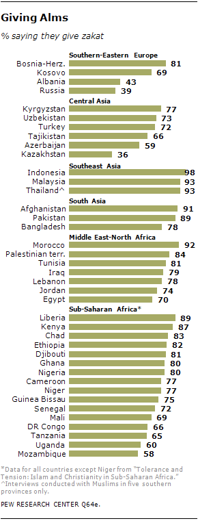

[Luke Freeman](https://www.lukefreeman.com.au/) is the Executive Director of [Giving What We Can](https://www.givingwhatwecan.org/) (GWWC), a community that "aims to create a culture where people are inspired to give more, and give more effectively." Before this, Luke was a entrepreneur and marketing specialist. This included co-founding [Positly](https://www.positly.com/), a start-up that helps social-scientists find high quality research participants.

In this episode, Luke begins by introducing GWWC, including a bit of history behind the Effective Altruism movement and his own journey within it. We then discuss some of the criticisms about foreign aid, such whether it's 'better' than just growing GDP, and the role of RCTs. After that, we unpack what exactly it is that GWWC do, and how listeners can get involved. This includes some  interesting tangents on virtue signaling, risk-taking, and the role of the media in relation to charity. Lastly, we talk about some of Luke's work with Positly as well as his view on how tech and marketing fit into the charity sector more broadly.

Thanks for listening! We'd love to hear what you thought about it — email us at <a href="mailto:hello@hearthisidea.com">hello@hearthisidea.com</a> or use the feedback form at the top and bottom of this page. You can also help more people discover the podcast by <a href='https://twitter.com/intent/tweet?text=Check out Hear This Idea, a podcast showcasing new thinking in philosophy, the social sciences, and effective altruism! &url=https://www.hearthisidea.com via @hearthisidea&' about='_blank'>tweeting about it</a>. And, if you want to support the show more directly, consider <a href='https://tips.pinecast.com/jar/hear-this-idea'>leaving us a tip</a>.

In the article below, we summarize and illustrate these key ideas; providing both more detail and further reading for listeners who want to find out more.

## Book Recommendations 📚

- [Doing Good Better](https://www.effectivealtruism.org/doing-good-better/) by William MacAskill
- [The Precipice](https://www.amazon.co.uk/Precipice-Existential-Risk-Future-Humanity/dp/1526600218) by Toby Ord
- [GWWC Website](https://www.givingwhatwecan.org/)

 <Book url="https://www.goodreads.com/book/show/327051.Reasons_and_Persons" image="book-luke-1" spineColor='#fec202'/> <Book url="https://www.goodreads.com/book/show/23168817-the-dark-forest" image="book-luke-2" spineColor='#0e84c0'/> <Book url="http://www.rachelcarson.org/SilentSpring.aspx" image="book-luke-3" /> 
 

## Giving What We Can

Even before he learned about Effective Altruism or joined Giving What We Can, Luke tells us he was acutely aware of the stark differences in living standards that result from where in the world one is born. Whilst most of us are also indistinctly aware of these differences, looking at the actual numbers can be quite arresting. Consider the graph below, or the ["How rich am I?" calculator](https://howrichami.givingwhatwecan.org/how-rich-am-i) from the Giving What We Can website.

It is thus natural that many people want to "do good" in the world — for instance, to assist those people who are worst-off. This is what [effective altruism](https://www.effectivealtruism.org/) (EA) looks to contribute towards. Within EA, some people see making donations as one potentially powerful way to achieve this. This is where Giving What We Can comes in.

> I actually felt like in some ways the EA movement was waiting to happen [...] People already care about finding the answer to the questions of I can do the most good with my resources.

### Why join Giving What We Can?

Giving What We Can is a community of effective givers that "support each other in our commitments to helping others and learning about effective giving. GWWC aim to create a culture where people are inspired to give more, and give more effectively." You can watch Luke's pitch for it (~10min) here —

<iframe width="560" height="315" src="https://www.youtube.com/embed/QMknz5ygrLI" frameborder="0" allow="accelerometer; autoplay; clipboard-write; encrypted-media; gyroscope; picture-in-picture" allowfullscreen></iframe>

### Giving

In our interview, Luke mentions that GWWC invites people who are ready to make a serious financial commitment towards effective giving. For those people, it acts as a community to provide support, advice, and a sense of belonging. This can hopefully make it easier for members to stick to their donations and encourage more people to join too.

> The overwhelming thing that I hear is a satisfaction that they are able to really live up to their values and do something that they think is important, but probably otherwise would find hard to do on their own.

There are three typical options available to get involved with:

- The **Try Giving Pledge:** 1%+ of personal income for any chosen period;
- **The Pledge:** 10%+ of personal income over your lifetime;
- **Further Pledge:** Giving all income above an inflation-adjusted living allowance over your lifetime.

Whilst these options are in no way legally binding, and entirely voluntary, GWWC does encourage potential members to reflect before taking "the pledge". Some members instead commit to giving later through donor-advised funds. This might be useful for people who are in need of current flexibility or are interested in [patient philanthropy](https://80000hours.org/podcast/episodes/phil-trammell-patient-philanthropy/). GWWC is now also looking to extend pledges to [companies donating 10% of their profits](https://forum.effectivealtruism.org/posts/BSYvy79mBZoGtgAW7/companies-pledge-to-donate-at-least-10-of-profits-to). This was what Sam Harris' [Waking Up](https://www.wakingup.com/) recently did.

US students might also be interested in a similar organization called [One for the World](https://www.1fortheworld.org/). Start-ups with specific liquidity should also check out [Founders pledge](https://founderspledge.com/).

As of November 2020, GWWC has over 5,000 members that have taken The Pledge and about 550 who have an active Try Giving pledge. So far, their members have donated more than \$198m and pledged almost \$2 billion.

> For most people, 10% is a meaningful commitment — but not out of reach or life-changing.

It is clear that giving such a large amount of your earnings may at first seem quite daunting. Luke thus encourages listeners to check out the [testimonials](https://www.givingwhatwecan.org/case-studies-people-who-pledge-to-give/) of people who have already taken for the pledge and to [get in touch](https://www.givingwhatwecan.org/about-us/contact-us/) if they have any questions. For more information and answers to some common concerns, check out GWWC's [FAQ](https://www.givingwhatwecan.org/about-us/frequently-asked-questions/).

##### The GWWC community

### Effectiveness

If we do commit to giving such a large amount to charity, then it makes sense that we want to ensure that this will do as much good as possible. In our previous [interview with Sanjay Joshi](https://hearthisidea.com/episodes/sanjay) (founder of the charity evaluator [SoGive](https://sogive.org/)), we talked about just how much charities can differ in cost-effectiveness.

One common misconception is that joining GWWC means you have to donate to "the most effective charity" and nowhere else — i.e. exclusively to the charities that [GiveWell](http://givewell.org/) and other charity evaluators recommend. But, as we discuss later in the interview, it is extraordinarily naïve to claim to know "the most effective charity", and few people claim to. Charity evaluation is always to some extent an art, depending on questions that require personal reflection. How do we weight reducing the risk of climate versus saving lives today? How do we weight saving 100 lives with a 1% chance of succeeding versus 1 life with a 100% chance? Should we prefer a charity with very robust evidence for effectiveness, or a charity with less evidence but more potential upside?

For GWWC, the essential thing is the process of reflecting on, and then choosing the right charity for you. As you can see from the diagram below, GWWC members donate to 18,500+ different organizations, ranging across all sorts of cause areas.

> GWWC isn't prescriptive of what does the most good, only how you go about it is important—relying on strong evidence and reasoning. We don't know what your moral values are or your appetite for risk is.

Source: [Giving What We Can (2020)](https://www.givingwhatwecan.org/best-charities-to-donate-to-2020/)

Luke also talks about how he thinks about his own personal donations. This was inspired by the work of Budolfson & Spears in "[The Hidden Zero Problem](https://oxford.universitypressscholarship.com/view/10.1093/oso/9780198841364.001.0001/oso-9780198841364-chapter-12)" (2019). The basic point the authors make is that when thinking about the *marginal* effect our donation to charity $C$ has, we can consider the following equation:

$\dfrac{\Delta Lives \, Saved \, by \, C}{\Delta Donation \, to \, C}=(\dfrac{\Delta Lives \, Saved \, by \, C}{\Delta Activity \, by \, C})*(\dfrac{\Delta Activity \, by \, C}{\Delta Budget \, of \, C})*(\dfrac{\Delta Budget \, of \, C}{\Delta Donation \, to \, C})$

If any *one* of the thee terms on the right-hand-side is zero, then the *total* marginal effect will be zero. We should thus make sure that this never happens (to avoid wasting money) — but this can be surprisingly tricky.

Consider the "billionaire problem", where some philanthropists will only ever fund the highest ranked charities. This is a problem if these charities do not currently have the capacity to make use of that money right now. If a billionaire has already reached that threshold, then there is little point in us also donating to that organization. The second term (and thus our total marginal impact) is equal to zero. Instead, we should look "further down the list" to find effective charities that are in genuine need for funding now.

> "There are only a handful of top-ranked EA charities, many of which have a surprisingly low limit (by the organization’s own account) to the resources it can absorb and genuinely turn into welfare gains." — Budolfson & Spears "[The Hidden Zero Problem](https://oxford.universitypressscholarship.com/view/10.1093/oso/9780198841364.001.0001/oso-9780198841364-chapter-12)" (2019)

Likewise, consider the "crowding-out problem", whereby some philanthropists only fund a charity up to a certain level and, once that level has been reached, switch to charity $D$. Thus, if you donate a charity to increase their budget, these philanthropists will stop donating, keeping the charity's overall budget the same. The third term (and thus our total marginal impact) is equal to zero. The question then becomes what charity $D$ this other person will donate to. If $D$ is not effective, then you would be better off donating directly to a next-best charity $E$. That way $C$ and $E$ get funded, rather than $C$ and $D$. Note that $C$ gets the same amount of money in both cases — who it comes from is irrelevant. This is a case where building a community of effective givers can be helpful in order to **coordinate** actions and solve these collective action problems.

> If the person you are crowding out is also someone who cares about giving effectively, and they will fund something else that is effective, then that is not a problem.

Luke talks about how he thus splits up his donations between "gold standard" charities, which have a large amount of evidence behind them, and "taking bets" with more risky charities, which have potentially large but uncertain pay-offs. The latter tend not to receive much attention outside EA circles, precisely because they are risky and niche. There are several [EA funds](https://app.effectivealtruism.org/funds/), run by expert grant-makers, that help pool individuals donations to these.

### Changing the giving culture

Whilst much of GWWC is about people sharing their individual experiences, we also talk to Luke about the organizations broader mission in changing how modern society thinks about effective giving. At the moment, giving 10% of your annual income is clearly still a weird thing to do. But why should that be the case? Are there indications that prevailing attitudes might be changeable?

If we look to many religions, we find long traditions of ordinary people committing themselves to meaningful donations. For example, the [Zakat](https://en.wikipedia.org/wiki/Zakat) is one of the five pillars of Islam and requires that all able adults give 2.5% of their assets (not just annual income!) to those less fortunate. A recent survey found that the percentage of Muslims who do this is high (>50%) across the world (see graph below). Likewise, some branches of Christianity give a [tithe](https://en.wikipedia.org/wiki/Tithe): one-tenth of their income to the church. In countries like Austria and Germany, this has been institutionalized through a *[Kirchensteuer](https://en.wikipedia.org/wiki/Church_tax)* (church tax). Judaism also has similar practices, such as [Terumah](https://en.wikipedia.org/wiki/Heave_offering) and [Ma'aser](https://en.wikipedia.org/wiki/First_tithe).

How do we get to a stage where, even on a secular basis, many more people are willing to become effective givers? In our interview, Luke cites work by Cass Sunstein (see his [book](https://www.goodreads.com/book/show/42068857-how-change-happens), [podcast](https://80000hours.org/podcast/episodes/cass-sunstein-how-change-happens/) or [video](https://www.youtube.com/watch?v=JINJsTsMIAg)).  Building on [Kuran's (1995)](https://www.hup.harvard.edu/catalog.php?isbn=9780674707580) earlier work on "[preference falsification](https://en.wikipedia.org/wiki/Preference_falsification)", Sunstein notes that tendency towards conformity is surprisingly widespread. People can be significantly swayed based on the behaviour of their peers. This applies to a whole range of social movements, such as supporting same-sex marriage, the Me Too movement, and, more darkly, National Socialism. According to Sunstein, they all approximately follow the same underlying dynamics:

> If one person is doing something, embracing, let’s say, a green New Deal, or calling for animal rights, we might think, “Crazy person,” but if 1,000 are embracing an idea or a movement, we might think, “Why haven’t I joined them already?” — [Sunstein "80,000 hours interview" (2019)](https://80000hours.org/podcast/episodes/cass-sunstein-how-change-happens/)

The critical insight is that *some people require less persuasion than others*. This could be either because they are already more convinced by the idea, or because they are more driven by group dynamics in general. Some people might be ready to take "the pledge" when only 10 of their peers have, others only when 1,000 have. This can lead to a potential tipping-point. Once the right number of early-adopters have taken the pledge, some of their peers will be convinced, convincing even more of their peers' peers, and so on and so on. Effective giving takes off and becomes normalized in society.

> “[U]nder the right conditions, and with the right distribution of [individuals’ receptivity to change], a small spark can ignite a conflagration, eventually dismantling the norm." — [Sunstein "How change happens" (2019)](https://www.goodreads.com/book/show/42068857-how-change-happens)

This is part of the thinking of why GWWC has a [public register](https://www.givingwhatwecan.org/about-us/members/) of its members. Not only does this help existing members by acting as a commitment device to keeping "the pledge", but it can also encourage new members to join by signaling strength in numbers.

Luke recognizes that it might still feel uncomfortable to be one of the early-adopters. There is, weirdly, a certain amount of "shame" in donating to charity — we are often scared of coming across as virtue signalling, or 'holier than thou'. We fear that we will be judged by others for thinking that we are judging them. But charity should not be about signaling to others how virtuous a person you are, nor even about making ourselves feel great — it should principally be about actually helping those in need. These these worries certainly should not keep us from doing so.

> Imagine if there was a moment in time where one of your ancestors could have been public about what they thought was best to do around climate change or slavery or women's suffrage and they shut up because they didn't want to virtue signal.

## Thinking about Charity

### Does foreign aid do more harm than good?

Many people have questioned how effective foreign aid can actually be in the long-run and, whether it might even do more harm than good. In her provocative book [Dead Aid](https://www.goodreads.com/book/show/6184317-dead-aid), Dambisa Moyo argues that aid prevents people from searching for their own solutions, corrupts and undermines locals institutions, and creates self-perpetuating aid agencies. There are many often cited case studies of this, such as [donations of used clothes hurting local industry](https://onlinelibrary.wiley.com/doi/epdf/10.1111/j.1468-0297.2008.02190.x) or [aid being used as an extension of Western foreign policy](https://oxfordre.com/politics/view/10.1093/acrefore/9780190228637.001.0001/acrefore-9780190228637-e-332).

> “In the past fifty years, more than \$1 trillion in development-related aid has been transferred from rich countries to Africa. Has this assistance improved the lives of Africans? No. In fact, across the continent, the recipients of this aid are not better off as a result of it, but worse—much worse.” — *[Moyo "Dead Aid" (2009)](https://www.goodreads.com/book/show/6184317-dead-aid)*

Others also point out that aid can perpetuate poverty through propping up extractive regimes. One shocking study is [Nunn and Qian (2014)](https://www.aeaweb.org/articles?id=10.1257/aer.104.6.1630), who show that US food aid shipments actually increase the incidence and duration of civil conflicts in the recipient countries.

These are all reasons for why we should be sceptical of many foreign aid interventions, and in many cases they are entirely legitimate. However, it by no means implies that we should give up on charity as a whole. Instead, we might see this as an argument for why we should be extra careful in looking at where exactly our donations go. If we know there is at least *one* charity that has been thoroughly vetted and detailed evidence of its positive impact — like the [Against Malaria Foundation](https://www.againstmalaria.com/) — then these arguments no longer carry much weight to our personal decision.

Indeed, GWWC note on their website that many of the "[Myths About Aid and Charity](https://www.givingwhatwecan.org/get-involved/myths-about-aid/)" have now largely been debunked. They provide 12 brief answers to the most common objections on their website. We highly recommend you check this out!

> There are plenty of good reasons to donate to charity and increase our foreign aid spending. But myths about the effectiveness of aid persist, making many people concerned about donating. [Let's separate fact from fiction](https://www.givingwhatwecan.org/get-involved/myths-about-aid/). — *GWWC*

This reframes the debate from "Should I donate?" to "*Where* should I donate?". Many organizations exist to help answer this latter question. For example, [GiveWell](https://www.givewell.org/charities/top-charities) provides an abundance of free and high-quality articles on the measurable impact of many leading charities. Much of the underlying academic research comes from MIT's [J-PAL](https://www.povertyactionlab.org/), who publish very accessible blog-posts (e.g. see their one on [malaria bed-nets](https://www.povertyactionlab.org/case-study/free-bednets-fight-malaria)). You might also be interested in listening to our [interview with Sanjay Joshi](https://hearthisidea.com/episodes/sanjay), who founded the charity evaluator [SoGive](https://sogive.org/).

### The 'randomista' debate: RCTs and economic growth

In searching for this demanding standard of robust and direct evidence, much of 'effective giving' has centred on [Randomized Control Trials](https://www.unicef-irc.org/KM/IE/impact_7.php) (RCTs). The use of RCTs in development economics has exploded over the last two decades. In 2019, Abhijit Banerjee, Esther Duflo, and Michael Kremer were [awarded the Noble Prize in Economics](https://www.nobelprize.org/prizes/economic-sciences/2019/press-release/) for pioneering much of this work. An excellent introduction to their insights can be found in their book "[Poor Economics](https://www.goodreads.com/book/show/13616493-poor-economics)".

RCTs have generally be seen as supporting small-scale global health interventions, especially deworming tablets and insecticide-treated nets. This makes a lot of intuitive sense: if we want to save lives (or [QALYs](https://en.wikipedia.org/wiki/Quality-adjusted_life_year)) then we should focus on health directly, and it is in developing countries where most preventable death occurs and where it is cheapest to operate. Indeed, "payouts from the Global Health and Development EA Fund comprise 45 per cent of the total amount of money granted from EA Funds" ([Hillebrandt & Halstead, 2020](https://forum.effectivealtruism.org/posts/bsE5t6qhGC65fEpzN/growth-and-the-case-against-randomista-development)).

However, this approach also has some notable drawbacks. One set of concerns focuses on "external validity" — arguing that experiments often do not generalize. For example, an anti-malaria campaign in Kenya will be much more useful than one in the UK. It is often wrong to assume that just because an intervention worked *somewhere* means that it will work elsewhere. Likewise, there are concerns around "internal validity". Because RCTs are expensive to run and thus often rely on very small sample sizes, this sometimes leads statistical problems. See [Bryan (2019)](https://afinetheorem.wordpress.com/2019/10/17/what-randomization-can-and-cannot-do-the-2019-nobel-prize/) for an excellent and balanced summary of these worries.

Additionally, some critics have noted how RCTs only provide 'raw' results with no underlying theory. Thus, we might know *that* an intervention helped people, but have little idea why. For example, in the famous RCT on deworming ([Baird et al., 2016](https://academic.oup.com/qje/article-abstract/131/4/1637/2468871?redirectedFrom=fulltext)), we see that it boosted wages by 30% in the long-term, but had little-to-no effect on [weight](https://blog.givewell.org/2017/01/04/how-thin-the-reed-generalizing-from-worms-at-work/) or [test-scores](https://www.givewell.org/international/technical/programs/deworming#Short-term_effects_from_Miguel_and_Kremer_2004). So could it be that we are missing something essential? What if the 30% wage boost came at the expense of those who weren't treated, for example? We simply have no way of knowing from a single RCT alone.

A more fundamental critique comes from Lant Pritchett in his article "[Randomizing Development: Method or Madness?](https://d101vc9winf8ln.cloudfront.net/documents/32264/original/RCTs_and_the_big_questions_10000words_june30.pdf?1565974982)" (2019). He notes that focusing on RCTs completely misses the big picture. RCTs are naturally biased towards small-scale interventions that we can actually run experiments with. For example, researchers can directly vary giving people a malaria bed-nets or not; they cannot do the same for financial liberalization or industrial policy. But, in doing this, we neglect all structural and systemic factors — although it is precisely these things which have historically been essential for economic growth.

> "RCTs have focused on topics that account for roughly zero of the observed variation in human development outcomes" — [*Pritchett "Learning about learning from learning about learning" (2018)*](https://lantpritchett.org/wp-content/uploads/2019/01/BsGfacultyseminarnovember2018.pdf)

<iframe width="560" height="315" src="https://www.youtube.com/embed/ct-lWyNEdFY" frameborder="0" allow="accelerometer; autoplay; clipboard-write; encrypted-media; gyroscope; picture-in-picture" allowfullscreen></iframe>

One important lesson we might draw out here is the rise of China. The World Bank states that "[since China began to open up and reform its economy in 1978, GDP growth has averaged almost 10 per cent a year, and more than 850 million people have been lifted out of poverty](https://www.worldbank.org/en/country/china/overview)." This had nothing to do with NGO global health programs; but still marks one (if not the) single greatest reduction in human misery in modern history. So, if we ultimately want developing countries to see the same transformative change, why focus on small-scale RCTs as opposed to economic policy?

This question has more recently been discussed within EA circles. Hillebrandt & Halstead present it in their long-form article "[Growth and the case against randomista development](https://forum.effectivealtruism.org/posts/bsE5t6qhGC65fEpzN/growth-and-the-case-against-randomista-development")". Take a look at the figure below. It illustrates how various economic reforms have affected GDP/capita compared to $1bn worth of a well-established RCT ([The Ultra Poor Graduation Programme](https://www.poverty-action.org/impact/ultra-poor-graduation-model)). We can see that the magnitude of economic reforms, both in gains and losses, are simply of an entirely higher magnitude.

------

So why not then focus on supporting economic policy? As [Smclare & AidanGoth (2020)](https://forum.effectivealtruism.org/posts/a84LrFzSf3sGsYfNr/can-we-drive-development-at-scale-an-interim-update-on) point out in their reply to Hillebrandt & Halstead, the issue is that we still know very little about what drives growth, and thus what policies to support ex-ante. Again, take a look at the graph: getting economic reform wrong can be just as devastating as useful. [Grier provides an excellent overview](https://www.econlib.org/library/Enc/EmpiricsofEconomicGrowth.html) of the current growth literature. In particular, they note the following disconcerting finding:

> [Hausmann, Lant Pritchett, and Dani Rodrik (2004)](https://www.nber.org/papers/w10566) [...] studied eighty-three cases in which a country rapidly increased its growth rate and sustained the increase for at least eight years. Their most statistically significant results are that a financial liberalization raises the probability of a growth increase by around 7 per cent, and that a political regime change toward autocracy (from democracy or less-strict autocracy) raises the probability of increased growth by almost 11 per cent. Most growth increases (which they call “growth accelerations”) are unpredictable, however, and as they put it, “**the vast majority of growth accelerations are unrelated to standard determinants such as political change and economic reform, and most instances of economic reform do not produce growth accelerations**.”

Indeed, it should be noted that before the widespread use of RCTs, development economics did try to focus on macroeconomic reform, especially the 1990s. The resulting '[Washington Consensus](https://en.wikipedia.org/wiki/Washington_Consensus)' and its Structural Adjustment Programs remain incredibly controversial, with issues acknowledged even by the [World Bank itself](https://openknowledge.worldbank.org/handle/10986/7370). See also [Rodrik (2006)](https://web.stanford.edu/group/scspi/media/_media/pdf/Reference Media/Rodrik_2006_Development Economics.pdf) for an excellent take on this.

We can thus see why many effective givers still choose to donate towards evidence-backed global health causes. We can fund it directly, and its benefits are much more tangible.

> Even under very optimistic growth projections, it could take decades to eventually lift everyone on earth out of poverty through economic development that happens more organically. And I find that hard to accept.

That being said, Luke recognizes that there are many kinds of evidence that donors may want to consider — not just RCTs. This is especially true if we care about more abstract causes, such as climate change or nuclear de-proliferation. Many tools for thinking exist to help us with this decision. One very prevalent one in EA is the [Importance-Tractability-Neglectedness framework](https://concepts.effectivealtruism.org/concepts/importance-neglectedness-tractability/), which we talked about in our [interview with Eve McCormick](https://hearthisidea.com/episodes/eve).

> It is a common misconception that our definition of charities that do the most good are all ones backed by RCTs.

## Slow News

One important part of this ITN framework is the idea of 'neglectedness'. A problem is neglected if relatively fewer people know about, care about, or are acting on it than another problem of comparable magnitude.

> Less crowded problems are fantastic opportunities. A popular problem may already be getting a lot of resources.

For instance, very many people are deeply concerned with domestic [terrorism](https://www.tandfonline.com/doi/abs/10.1080/1057610X.2018.1543145?journalCode=uter20), and far fewer people know or care about [diarrheal diseases](https://ourworldindata.org/childhood-diarrheal-diseases). But roughly 16,000 times more people die across the world every year from diarrheal diseases than are killed in a [terrorist incident](https://ourworldindata.org/terrorism#which-regions-experience-the-most-terrorism) on U.S. soil, and over 75 times more than die from terrorist incidents anywhere in the world — and these deaths are at least as preventable as deaths from terrorism. Among the many reasons some problems are more neglected than others is the fact that some problems are more prominent on the news. When people turn to their newspapers, TVs, or radios to learn about the state of the world, they receive — by necessity — a narrow selection of facts. This is no bad thing in itself, but there's a case that the kind of information that makes it into the news leads to biased impressions of the state of world.

A great demonstration of these biased perceptions of the world is provided by the [Gapminder](https://www.gapminder.org/) '[Misconception Study](https://www.gapminder.org/ignorance/gms/)'. The study distributed a quiz, made up of 12 factual questions about the state of the world, to fourteen rich countries through an online panel. Each question was a multiple choice between three options. As such, random guessing — a chimp picking one of three bananas — will score 4 out of 12 in expectation. As it happens, the average score for actual human answers was *worse* than random: a paltry 2.2 out of 12! And only 10% of respondents scored better than random.

##### Source: https://www.gapminder.org/ignorance/gms/

Before reading on, you can take the test yourself [here](https://forms.gapminder.org/s3/test-2018). Spoiler alert!

It turned out that responses were biased in the direction of *pessimism* about the state of the world. For instance, the first question asks, "In the last 20 years the proportion of people living in extreme poverty worldwide, has...?". The options are:

- Almost doubled
- Remained more or less the same
- Almost halved

The correct answer is '[Almost halved](https://ourworldindata.org/extreme-poverty)'. But [60% of respondents](https://drive.google.com/file/d/1rp3Q9rVK2eo5jH7y8KKQVaDg4CFswlmz/view) picked 'Almost doubled' and only 9% picked the correct answer.  You can view all the data from the study [here](https://drive.google.com/file/d/1rp3Q9rVK2eo5jH7y8KKQVaDg4CFswlmz/view). One (certainly not the only) explanation for this may be that the news tends to run overwhelmingly negative stories about low-income countries: civil war, terrorist incidents, natural disasters, and so on. This may bias viewers towards pessimism, because they do not learn about good news — which tends to be gradual and incremental — with a comparable frequency.

Here's Fin from an old [blog post](https://www.finmoorhouse.com/writing/unsung-heroism) — "When was the last time a news reporter declared ,“Part of what it means for something to be news (and considered newsworthy) is and will always be a function of how suddenly a change occurs: that it’s an event rather than a process — that it’s new. It’s not an unreasonable assumption that most improvements in e.g. global health, standards of living, economic indicators are slow and incremental and by definition not newsworthy. Diseases are eradicated and nations lift themselves out of relative poverty over the course of decades; news cycles are not decades long ... I am reporting live from the scene of an enormous conflict that, just today, didn’t happen”?

By contrast, setbacks to progress are normally immediate and identifiable: it is painfully obvious when conflict erupts, or something is destroyed, or fails. Therefore, negative stories are just inclined by their nature to count more often as news. It is both tired and true to say that the news is always depressing, even when so many things are measurably improving. This is often marked up to people’s secret penchant for morbid stories and schadenfreude and whatever else. But remember that there is a more innocuous explanation: that good news is normally slow news, and therefore not news at all." In short: *if it bleeds, it leads*. Luke makes the same point —

> Think of things that make the news. A rare or surprising problem might get lots of attention, while ongoing problems like 'lots of people still have malaria' gets less media attention. Exactly because they're so common, they're not news... It's drilled home to you in journalism: what is news? And **news is not what's important.** News is 'man bites dog' ... we have a much bigger problem of dogs biting men, but 'man bites dog' is news and 'dog bites man' isn't news.

So, counterintuitively, the most widespread and constant and workaday problems are very often also the *most* neglected problems. However, this all raises the question of why we don't see more 'slow news' — news about trends occurring over more gradual timescales, and about facts of global and long-lasting significance. One reason is just terminological, as Luke points out. 'Slow news' just isn't news —

> By the time you get into things that are just important, and communicating them in good ways, at that point it rarely resembles news. It's an academic course, a book, long-form periodical journalism, [or] a magazine.

The question might be rephrased: why don't more people spend more time reading about slow, 'important' developments over ephemeral updates. One reason, Luke suggests, is that "news is built to tap into this need we have in our brain for **novelty**... so it's not really surprising, in many ways." This is depressingly plausible: breaking news does appear to have [addictive qualities](https://elemental.medium.com/breaking-your-addiction-to-breaking-news-be8498b9b7c2) which more long-form, editorial forms of media lack. That doesn't just apply to people glued to their television sets — news is increasingly being consumed from smartphones, whose ability to be constantly refreshed presumably only adds to the jolt of breaking-news dopamine. For instance, both your co-hosts stayed up to follow events on the night of the recent U.S. presidential election. Why? What difference does it make that we know tonight rather than tomorrow morning (or the next day, as the case may be)?

<iframe src="//datawrapper.dwcdn.net/Yjl3e/4/" frameborder="0" allowtransparency="true" allowfullscreen webkitallowfullscreen mozallowfullscreen oallowfullscreen msallowfullscreen width="600" height="600"></iframe>

Of course, this doesn't mean that excellent 'slow news' outlets exist; or media outlets which focus on fascinating, big-picture, questions. For instance, [Tortoise media](https://www.tortoisemedia.com/) features excellent 'slow journalism' from award-winning writers, and it was the biggest journalism project even to be featured on Kickstarter. [The Correspondent](https://thecorrespondent.com/) showcases "unbreaking news", created by Rob Wijnberg. The unparalleled [Our World In Data](https://ourworldindata.org/) features conducts research and produces clear data visualisations on issues closely related to human progress and global development. Vox's [Future Perfect](https://www.vox.com/future-perfect) was [established](https://www.voxmedia.com/about-vox-media/2018/10/15/17969758/vox-future-perfect) to "cover and think critically about the world’s most pressing and under-covered problems through the lens of evidence and solutions.” And the [Delayed Gratification](https://www.slow-journalism.com/) magazine "revisits the events of the last three months to offer in-depth, independent journalism in an increasingly frantic world."

## Tech Entrepreneurship

### Positly and WEIRD Psychology

Before Luke arrived at Giving What We Can, he was a tech entrepreneur. Among his initiatives was [Positly](https://www.positly.com/), an online platform for recruiting and managing participants for research (in social science and health). Expanding the pool of potential participants beyond your immediate geography in this way can often make research faster and more affordable.

> Often, one of the biggest bottlenecks in conducting human subject research is having people to be involved in it.

An interesting promise of this kind of 'distributed' model for research is that it may help remedy an increasing concern that social science research participants are overwhelmingly 'WEIRD'. To spell it out: they're normally **W**estern, **E**ducated, and from **R**ich **I**ndustrialised and **D**emocratic countries. That's because of the volume of social science research which is conducted in Western (mostly U.S.) universities.

This is a problem for external validity. Presumably the aim of e.g. psychology research should be to make true and substantial claims about *people*, not just college students taking part in a study for either class credit or beer money. And it's already known that some WEIRD results don't generalise to other kinds of people. For instance, studies of the 'ultimatum game' showed cultural differences in participants' proclivity for trust and sharing, at least within the narrow bounds of this artificial game ([Oosterbeek et al. 2004](https://link.springer.com/article/10.1023/B:EXEC.0000026978.14316.74)). Participants from various non-Western cultures even differ on their susceptibility to visual illusions ([Segall et al. 1966](https://psycnet.apa.org/record/1967-05876-000)) — a sure candidate for about the only aspect of human psychology safe from cultural differences. The [review article](https://papers.ssrn.com/sol3/papers.cfm?abstract_id=1601785) from which these results are taken even claims that "members of WEIRD societies... are among the least representative populations one could find for generalizing about humans."

Online platforms like Positly could improve on this situation by widening the pool of potential research participants to anyone across the world willing to earn some money by filling in a survey or completing a series of tasks. It then thoroughly screens and vets participants. This contrasts to other, more mass market approaches — most famously Amazon's crowdsourcing marketplace [Mechanical Turk](https://www.mturk.com/) — that often work on a "first-come-first-serve" basis and may have some sampling issues (for well-balanced takes on this see [Paolacci et al, 2010](https://papers.ssrn.com/sol3/papers.cfm?abstract_id=1626226); [Goodman et al., 2012](https://onlinelibrary.wiley.com/doi/full/10.1002/bdm.1753?casa_token=lbp0K4ik2wwAAAAA%3AUeXocp-yn0ruvs4h9H2mahwY1PSabptFTrY21f54AGlDC4mf4OmQP0T4TYQ4cDEG4j0eF1KbAct4Dec); [Mason & Suri, 2012](https://link.springer.com/article/10.3758/s13428-011-0124-6)).

> I definitely believe that this is something that is going to grow. There are obvious reasons why it's not been this way in the past — it's a lot cheaper for researchers to say, "hey, if I can just force all my students to participate in my research, I've got a much cheaper research project and I don't have to spend money recruiting. But you are going to get a very specific type of person.

A less obvious advantage of platforms like Positly is that they enable more targeted *in-person* research — leveraging the way way tech platforms can collect and filter large amounts of data to select participants according to much narrower criteria than before.

For a deep dive into this topic, check out Joseph Henrich's *[The WEIRDest People in the World: How the West Became Psychologically Peculiar and Particularly Prosperous.](https://www.goodreads.com/book/show/51710349-the-weirdest-people-in-the-world)*

This representative sampling issue is also becoming increasingly important in Machine Learning. AI systems require an underlying training data from which it can learn. This in turn requires some for of human-labelling. Think of the reCaptcha asking you to label cars to prove "I'm not a robot"; that's [helping Google to build machine learning datasets](https://www.google.com/recaptcha/about/) to train self-driving cars.

Spotting cars is pretty straightforward. But as problems become harder, such as labelling fake news or identifying images, this will embody a degree of subjectivity. In doing so, AI will internalise all the biases  in the data and the people who labelled it. As [Crawford & Paglen (2019)](https://www.excavating.ai/) point out that this is a real problem: Who gets to decide what images AI will classify as "losers" or "sluts"? We can look at Google's infamous [gorilla problem](https://www.theverge.com/2018/1/12/16882408/google-racist-gorillas-photo-recognition-algorithm-ai) as an extreme example of this going wrong. As [Nooscope.ai](http://nooscope.ai) points out, most AI seems to originate from corporations and universities in the Global North, but underlying this are crowdsourcing platforms, like Amazon's Mechanical Turk. And these in turn rely on cheap labour from the Global South ([at $2/hour](https://arxiv.org/ftp/arxiv/papers/1712/1712.05796.pdf)), who have a clear incentive to work quickly rather than thoroughly.

> "Raw data does not exist, as it is dependent on human labour, personal data, and social behaviours that accrue over long periods, through extended networks and controversial taxonomies" — [Nooscope.ai](http://nooscope.ai)

### Tech in Effective Altruism — Donations

Next, we ask Luke what role he sees for tech start-ups like this one in the effective altruism movement. One interesting potential application is in creating apps, extensions, and websites which make the process of donating to charity easier, more engaging, or even more enjoyable. This approach is exemplified by apps like [Momentum](https://givemomentum.com/) and [Altruisto](https://altruisto.com/), which continue to grow in popularity. If these platforms attract people to the idea of effective giving, this also suggests space for even more EA innovation in the tech space.

On the other hand, the small recurring donations elicited by these apps add up to less than the donations made by people who have made a conscious decision to give away larger sums of money to charitable causes — such as by taking the pledge. While neatly crafted apps can 'nudge' a user into e.g. sending a fraction of each purchase they make to charity, it seems unlikely that a similar approach could cause somebody to make significant decisions about what they want to do with large parts of their disposable income. Presumably, this is the kind of decision needs to be elicited by in-person conversations — and as such it seems like throwing more tech at the problem would distract from the very human decision that significant donation entails.

Luke mentions the success of the '[Defeat by Tweet](https://defeatbytweet.org/faq)' campaign, linked to Momentum, which sends a small donation from a users' account every time Trump tweets. "They're focused on things that really hook into the fact that humans are humans — we're going to like it when we tie things to behavioural cues". Another advantage of these 'automated' donation mechanisms, Luke mentions, is that "they're able to direct funds for people who are less tied to a particular charity to things that would be much more effective". But Luke also emphasises how these solutions are "serving a particular segment of the market". Giving What We Can, on the other hand, addresses a different segment —

> Giving What We Can is not focused on being a donation tool... we're serving a market of people who want to make a significant commitment. They don't want to round up their bank balance or tie it to a behavioural cue — they want to be part of a community.

And the challenge of *growing* this market is not fundamentally a technological one: "we believe that growing the size of the market we're in is a **cultural** project of increasing people's desire to help others."

> The more people who make significant commitments, the easier it is for more people to make significant commitments. And that's the cultural project.

However, these two 'segments' are not entirely separate. Luke mentions that the 'nudge'-style approaches often serve as an entry-point for potential donors to learn more about effective giving, and through which they may learn about the possibility of more significant commitments like the GWWC 10% pledge. For instance, this is a goal of the '[One For The World](https://www.1fortheworld.org/what-we-do)' movement, which encourages people (with a focus on students) to commit to giving 1% of their income to effective charities. Luke uses a 'funnel' analogy, where a wider pool of potential donors may begin with lower-commitment 'nudge'-style programs, and some of those people may then progress to more significant giving behaviours.

### Tech in Effective Altruism — Other Applications

Another potential application is to devise new charitable interventions through building tech infrastructure or otherwise directly solving a problem with a digital tool. One example is [Guesstimate](https://www.getguesstimate.com/), a spreadsheet for representing and combining uncertainties. Another notable application is building better infrastructure for sending remittances between the US and low-income countries. Normally, in order to send remittances back home, immigrants are faced with limited options: basically either MoneyGram or Western Union. Both services typically charge an exorbitant 10% fee.

But both for- and non-profit initiatives are beginning to change this. A mobile phone payments system called [M-Pesa](https://en.wikipedia.org/wiki/M-Pesa) has seen its network of users expend over Africa, having initially been established in Kenya. Lincoln Quirk, a member of the Effective Altruism community, noticed that he could use this network to undercut the fees charged by MoneyGram and Western Union. He founded [Wave](https://www.sendwave.com/), a for-profit social impact start-up which allows immigrants to send money from the U.S. to countries in Africa with much lower fees. Here is 80,000 Hours' Rob Wiblin on Wave's impact:

> For each dollar of revenue that they make, they are saving \$2.33 for someone in the world’s poorest countries. Assuming a 20% profit margin, the figure is \$12 in savings for each \$1 of profit... The potential positive impact of this idea is huge. Annual global remittances are \$450 billion, several times the total global foreign aid budget. The potential impact Wave could have, by lowering the cost of sending remittances by 70 percent, amounts to billions of dollars in extra financial flow from rich countries to poorer countries every year.

For a certain kind of tech enthusiast, they wield a digital hammer for which everything looks like a nail. It's important to caution against this attitude. At least within global health and development, the effects and outcomes that ultimately matter are far more often simple, low-tech interventions: bed nets, deworming pills, food supplements, and so on. That's not for lack of efforts to make flashier, more 'innovative' interventions work — that's because it's so often the unglamorous but effective and cost-effective things that work best and get neglected most often. Indeed, some high-profile efforts have ended in either ambiguous deadlock or outright failure. A notable example is Facebook's [internet.org](http://internet.org) project, which set out a plan to bring free or inexpensive internet to millions of people in low-income countries. This WIRED article describes what happened next. An excerpt —

> At one point, 67 human rights groups signed an open letter to Zuckerberg that accused Facebook of “building a walled garden in which the world’s poorest people will only be able to access a limited set of insecure websites and services.”

The answer, for Luke, is therefore to address things on a case-by-case basis —

> I'm certainly not one of those people whose default assumption is that tech will solve all of our problems. In fact, I've had various experiences with the industry that led me to think that tech can create a lot of problems. Especially venture-backed startups are not going to be the best way to approach a lot of problems, and can be a destructive force in a lot of cases.

### Is Silicon Valley a Force for Good?

On the topic of tech, Luke explains one thing he recently changed his mind about —

> I've shifted my views towards thinking that, at a large, the machine that is venture-backed start-ups typically creates a small number of ultra-wealthy people and some useful products or services ... but can leave a lot of damage along the way.

There are, Luke is keen to point out, plenty of specific exceptions — both in terms of companies and individual philanthropists. Nonetheless, he says "I believe now that there is too much power in the hands of too few" in the world of VC-backed tech. By contrast, this is what Luke likes about the Giving What We Can community: "it's a community of everyday people... we're not waiting around for a few billionaires and governments to take action, even if we want them to."

For instance, Luke mentions an occasion where he attended a marketing conference shortly before the 2016 U.S. presidential election, which was attended by employees of Cambridge Analytica. "They were talking about how they essentially used vulnerabilities in Facebook", and ended up having "a pretty terrible outcome for the world". A key idea here is '[**creative disruption**](https://en.wikipedia.org/wiki/Creative_disruption)'. In the broadest sense, creative destruction occurs where old institutions, conventions, or infrastructure is overturned or destroyed, only to be replaced by something even better.

> I believe creative disruption is a really good thing. But I also believe disruption can just be damage. And it's hard to know ahead of time which it's going to be.

Luke also alludes to a problem of misaligned incentives, which Sanjay Joshi ([Episode 12](https://hearthisidea.com/episodes/sanjay)) calls 'funder-beneficiary separation'. Because appearing to act virtuously as a for-profit company is no guarantee of genuine impact, and there is no norm of doing so, encouraging a company to give to effective charities requires extra effort, as Luke explains —

> It's really hard to act in the public good if most businesses aren't doing it; if your shareholders and investors aren't nudging you to do it. **It's a lot easier to make it look like you're doing good than necessarily do good.**

In sum, Luke is pessimistic about the current net benefits of VC-backed start-ups —

> There are way more examples of people who are using their wealth to generate more wealth, at the cost of increased inequality, protecting dying industries, increasing pollution, and so on.

### Touchpoints and Culture

Luke also introduces a way of thinking about the challenge of nurturing a culture of effective giving — the distinction between '**big**' and '**little**' culture. Culture change requires that ideas are transmitted from person to person, and this can happen on very different scales. **Big culture**, Luke explains, includes Google search results, ideas repeated on TV, and celebrity endorsements — things that most people can trust that most other people will at least have vaguely heard about. Big culture is not targeted, nor personal; but it reaches large numbers: the wide end of the funnel. **Little culture**, on the other hand, is, "what did my friend post on Facebook? What's that banner on your profile picture? What's this pledge certificate on your wall — and what's the conversation we're now having?". Small culture is personal and targeted, and so cannot be replicated en masse.

Another useful concept, taken from Luke's experience in marketing, is the idea of a '**[touchpoint](https://en.wikipedia.org/wiki/Touchpoint)**'. A touchpoint is any kind of interaction between a consumer and a business, brand, or organisation — through e.g. a newsletter, podcast, website, app, or in-person communication. As Luke notes, a well-known (and apparently well-evidenced) marketing principle states that it takes about **seven** touchpoints "before people do what you want them to do". In other words, given that somebody decided to e.g. buy your product or (in the present case) make a commitment to donating to charity, that person will on average have interacted with that product or charity seven times previously. That's one reason why, for instance, Giving What We Can built their '[How Rich Am I](https://howrichami.givingwhatwecan.org/how-rich-am-i)' calculator — people search for "how rich am I", click on the first link, and often accidentally learn for the first time about Giving What We Can. One touchpoint down, about six to go.

Ultimately, Luke argues, the best way to get more people donating more money is to build up all the stages of this funnel, and to work on both big and little culture —

> That's the world i want to live in — where there are more things available to people that nudge them towards more and more effective giving; more conversations they have with their friends; more public figures making significant commitments ... these are all important projects in this even bigger project of having people help others more effectively and using their income to do so.

The effective altruism movement is relatively nascent — around a decade old. What ultimately matters is making the world a better place — improving lives — by acting on the basis of reason and evidence. But there are a number of constraints between that goal and its execution. For instance, research organisations would benefit from [more talent](https://80000hours.org/podcast/episodes/ben-todd-on-what-effective-altruism-most-needs/), and extra funding wouldn't go amiss either. Sometimes the charity you wished was real does not yet exist, in which case it may be best to [establish that charity](https://www.charityentrepreneurship.com/). However, a crucial part of effective altruism is the community of people who have decided to set aside a significant portion of their disposable income to give to effective charities and organisations. Giving What We Can is central to this community. Having spoken to Luke, it sounds like GWWC has an exciting future ahead. If you want to become part of this community of givers, take a look at the website [here](https://www.givingwhatwecan.org/), and read about the pledge [here](https://www.givingwhatwecan.org/pledge/).

Thanks for listening <i>and</i> reading the write-up! We'd love to hear what you thought about it — email us at hello@hearthisidea.com or leave a rating below. You can help more people discover the podcast by <a href='https://twitter.com/intent/tweet?text=Check out Hear This Idea, a podcast showcasing new thinking in philosophy, the social sciences, and effective altruism! &url=https://www.hearthisidea.com via @hearthisidea&' about='_blank'>tweeting about it</a>. And, if you want to support the show more directly, consider <a href='https://tips.pinecast.com/jar/hear-this-idea'>leaving us a tip</a>.

