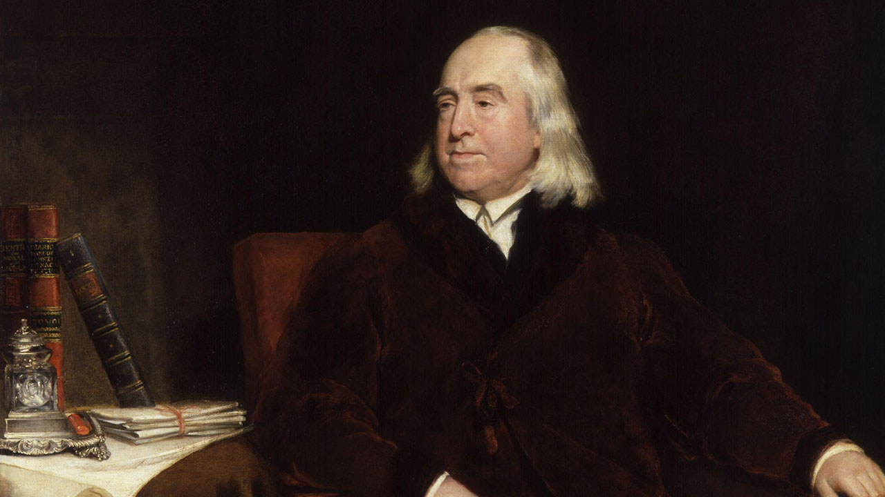

Peter Singer is a moral philosopher and public intellectual, most widely known for his writings about animal ethics and global poverty. 45 years ago he published [Animal Liberation](https://en.wikipedia.org/wiki/Animal_Liberation_(book)), which became something of a founding philosophical statement for the modern animal rights movement. On the topic of global poverty, Singer's 1971 article '[Famine, Affluence, and Morality](https://en.wikipedia.org/wiki/Famine,_Affluence,_and_Morality)' made the case that individuals from rich countries are morally obligated to donate more money to the global poor than is considered normal; becoming one of the most widely discussed and reproduced articles in ethics. More recently, Singer wrote *[The Life You Can Save](https://www.thelifeyoucansave.org/the-book/)*: extending the thesis of 'Famine, Affluence, and Morality' into a guide and rallying call for volunteering time and money toward helping the extreme poor. The book soon spawned a [charity](https://www.thelifeyoucansave.org) of the same name, which recommends effective nonprofits backed by robust evidence, and guides potential donors through various ways to support them. In making these arguments and helping to establish The Life You Can Save, Singer was instrumental in establishing the '[effective altruism](https://www.effectivealtruism.org/)' movement, a now global community focused on using evidence and reason to figure out how to benefit others as much as possible, and taking action on that basis. Nowadays, he teaches at both Princeton University and the University of Melbourne, and [writes for the public](https://www.project-syndicate.org/columnist/peter-singer) about a range of topics in practical ethics.

In our interview, we begin on the topic of animals — the focus of Singer's new book *[Why Vegan?](https://www.goodreads.com/book/show/54922430-why-vegan)*. What is *speciesism*, and how can analogies with other '-isms' bolster the case against eating animals? What do people get wrong about the concept? And if there's a case against human-causes of animal suffering like factory farming, is there a case for intervening in nature to avoid *wild-*animal suffering? We also ask about historical attitudes toward nonhuman animals: why does this concern for animal welfare seem so unprecedented? And how did the history of Western though shape present-day attitudes to animals? After that, we talk about causes of moral progress and the effectiveness of ethical arguments in changing behaviour, what policymakers might be neglecting about the costs of COVID lockdowns, why Peter changed his mind about moral realism, and the value of openly discussing controversial ideas. In this article, we summarise and illustrate the key ideas discussed in the interview; providing extra examples and further reading.

You are encouraged to skip to sections that interest you, using the table of contents. All unattributed quotes are from the interview (unless obviously otherwise).

Thanks for listening! We'd love to hear what you thought about it — email us at <a href="mailto:hello@hearthisidea.com">hello@hearthisidea.com</a> or use the feedback form at the top and bottom of this page. You can also help more people discover the podcast by <a href='https://twitter.com/intent/tweet?text=Check out Hear This Idea, a podcast showcasing new thinking in philosophy, the social sciences, and effective altruism! &url=https://www.hearthisidea.com via @hearthisidea&' about='_blank'>tweeting about it</a>. And, if you want to support the show more directly, consider <a href='https://tips.pinecast.com/jar/hear-this-idea'>leaving us a tip</a>.

## Book Recommendations

- [On What Matters](https://www.goodreads.com/book/show/10727702-on-what-matters-volume-one) by Derek Parfit
- [The Methods of Ethics](https://www.goodreads.com/book/show/851993.The_Methods_of_Ethics) by Henry Sidgwick
- [Strangers Drowning](https://www.goodreads.com/book/show/24611937-strangers-drowning) by Larissa McFarquar

 <Book url="https://www.goodreads.com/book/show/10727702-on-what-matters-volume-one" image="book-peter-1" spineColor='#29282e'/> <Book url="https://www.goodreads.com/book/show/851993.The_Methods_of_Ethics" image="book-peter-2" spineColor='#476484'/> <Book url="https://www.goodreads.com/book/show/24611937-strangers-drowning" image="book-peter-3" spineColor='#dedcdd'/> 

## Speciesism

'Speciesism' is an ethical term popularised in Singer's 1975 *[Animal Liberation](https://en.wikipedia.org/wiki/Animal_Liberation_(book)),* and earlier coined by animal rights advocate [Richard D Ryder](https://en.wikipedia.org/wiki/Richard_D._Ryder). Singer defines speciesism as, “a prejudice or attitude of bias in favor of the interests of members of one's own species and against those of members of other species.” Roughly speaking, an 'interest' of a person or nonhuman animal is just anything that is good or bad for them (note this has nothing to do with being intellectually *interested* in that thing). If a chicken is capable of experiencing pain, then it's reasonable to say that a chicken has an interest in not feeling pain. I too have an interest in not feeling pain, but I also have more complex interests in, for instance, experiencing really good music. Presumably chickens do not have this kind of interest, since they lack the cognitive capacity to properly enjoy and appreciate the Beatles.

In any case, anti-speciesism implies that where nonhuman animals and humans have equivalent interests, to weigh human interests over animal interests amounts to an unjustifiable kind of prejudice. Suppose you're faced with a decision between inflicting an equal amount of physical pain on a monkey or a human. Suppose that all other things are equal: no memory of the pain in either case, no fearful anticipation, no unintended or indirect consequences, and no lasting injury. The anti-speciesist claim is that a moral agent has no reason to inflict the pain on the monkey rather than the human, in virtue of the fact that it's a monkey and the human's a human.

The thought behind speciesism is this: inflicting pain on a sentient being is bad, and bad in proportion to the intensity and duration of the pain. But which biological species that being belongs to seems just as morally irrelevant as, in the human case, a person's racial identity or sexual orientation.

Of course, implicit in the idea of speciesism is a claim that most people most of the time are far from indifferent between the interests of humans and nonhuman animals. In practice, people do hold speciesist attitudes, or at least behave in ways concordant with them. For instance, affluent people are often prepared to spend many thousands of dollars in order to help resolve a chronic pain, or repair an injury. Spending a remotely comparable amount of money in order to resolve an equal amount of pain for a pig seems (to most people) like a laughable waste. And as Singer points out in *Animal Liberation*, brutal experiments of dubious scientific value are routinely performed on primates, but it would be unthinkable to perform the same experiments on cognitively impaired humans of equivalent mental capacity (including the capacities to feel pain and fear). Assuming all else is equal, this strikes the anti-speciesist as a straightforward inconsistency. There are two ways to resolve that inconsistency, but only one acceptable way: to react with a similar kind of outrage to mistreatment of and harms caused to animals as we would to similar harms to humans of comparable cognitive capacity.

In our interview, Peter compares speciesist attitudes to the historical attitudes of racism which sustained the Atlantic slave trade —

> If we think about the really brutal racism of the 18th century which justified Europeans in capturing or buying Africans as slaves and transporting them across the Atlantic to work on their plantations, [this is] clearly a case where a dominant powerful group was using another group who they could overpower as tools, as means to their ends — without any real consideration of the interests of the group in their power. Now think of the relations of humans with nonhuman animals, especially those we breed and raise for food; and I think you have a fairly similar situation. You have one powerful species using members of another species who are sentient beings, who have interests in not suffering and their lives going better for them... and we humans capture them, use them as tools, use them as means to our ends to produce their flesh or eggs or milk, and we do that with no or very little concern for their interests. We're doing it basically for our interest. I think in both cases we have a kind of prejudice or bias which also has a kind of ideology behind it — saying that the dominant group is the superior group, and which we use to legitimise or justify the exploitation of the weaker group.

Speciesism extends beyond the human-nonhuman distinction, and into inconsistent attitudes between various different nonhuman animal species. For instance, animal rescue shelters devote significant resources (time and money) towards rescuing and rehabilitating cute animals so that they might be spared from the stress or fear of an abusive home, or outright neglect. But many of these shelters serve food made from the bodies of animals of equal or greater cognitive capacity, raised and slaughtered in conditions of often extreme stress and fear, for the express purpose of feeding humans. Similarly, meat-eating Westerners are often appalled by the thought of [dog meat](https://en.wikipedia.org/wiki/Dog_meat), consumed across south-east Asia. Both these examples seem to reveal a strictly inconsistent set of moral attitudes, and again there seem to be two ways of resolving the tension: either get over your sanctimonious revulsion at dogs being abused or eaten, or start caring an equivalent amount about the abuses inflicted on less familiar or companionable animals like chickens, pigs, and cows.

## The Scale of the Problem

Pointing out a widespread moral confusion or inconsistency counts as a philosophical 'point' scored, and can at least make for an interesting dinner party conversation-starter. But Singer's case against speciesism and for animal liberation is primarily a piece of *practical* ethics. As such, it (i) depends on facts about the real world; which (ii) lead to a concrete recommendation for how you actually ought to act. On Singer's view, (i) the facts about the extent of human-caused animal suffering are dire; and so (ii) his argument amounts to a call to action — principally to eliminate or at least cut back on our consumption of animal products. This is why the preface to the 1975 edition of *Animal Liberation* begins with an arresting claim:

> This book is about the tyranny of human over non-human animals. This tyranny has caused and today is still causing an amount of pain and suffering that can only be compared with that which resulted from the centuries of tyranny by white humans over black humans. The struggle against this tyranny is a struggle as important as any of the moral and social issues that have been fought over in recent years.

Let's (too) briefly review the facts underlying this claim. It will be necessary to focus on one example for brevity, so I'll consider chickens. First, [behavioral evidence](https://www.ncbi.nlm.nih.gov/pmc/articles/PMC5306232/) indicates not only a capacity for physical pain in chickens, but also for some degree of self-awareness, empathy, and emotional sophistication comparable with larger mammals. Second, an estimated [*50 billion* chickens](https://www.weforum.org/agenda/2019/02/chart-of-the-day-this-is-how-many-animals-we-eat-each-year/) are killed for food every year. This figure is likely an underestimate, because it excludes male chicks and unproductive hens killed in egg production. Even this lower bound implies that more chickens will be killed within the next two years than all humans who have [ever lived](https://www.prb.org/howmanypeoplehaveeverlivedonearth/). The vast majority of these birds will live and die in indoor confinement — not once free to roam outdoors. Moreover, chickens being raised today have been bred to grow around 3 times as quickly as chickens raised in the 1950s while consuming around [one-third the amount of feed](https://pubmed.ncbi.nlm.nih.gov/14601725/). This implies they are likely in [chronic pain](https://opencages.org/blog/investigation-tesco-chickens-in-chronic-pain) for at least the last 20% of their lives — unable to walk because it hurts their inflamed joints. Here is Singer in a [piece](https://go.gale.com/ps/anonymous?id=GALE%7CA156366418&sid=googleScholar&v=2.1&it=r&linkaccess=abs&issn=13626620&p=LitRC&sw=w) he co-authored:

> Enter a typical chicken shed and you will experience a burning feeling in your eyes and lungs. That's the ammonia — it comes from the bird's droppings, which are simply allowed to pile up on the floor without being cleaned out, not merely during the growing period of each flock, but typically for an entire year, and sometimes for several years. High ammonia levels give the birds chronic respiratory disease, sores on their feet and hocks, and breast blisters. It makes their eyes water, and when it is really bad, many birds go blind. As the birds, bred for extremely rapid growth, get heavier, it hurts them to keep standing up, so they spend much of their time sitting on the excrement-filled litter — hence the breast blisters.

Conditions like this are allowed to prevail because it is most economically efficient to allow some fraction of birds to die, in order to save on the costs of e.g. regularly cleaning cages.

Aside from the marked nastiness of conditions for chickens in factory farms, there's another reason I chose to focus on them over other animals raised for meat. Although poultry accounts for about [35%](https://ourworldindata.org/meat-production#what-types-of-meat-do-people-eat) of per-capita meat consumption worldwide, the absolute number of chickens raised and killed every year *dwarfs* the numbers for any other animal. This is mostly attributable to the simple fact that each chicken yields less meat (by weight) than bigger, heavier, livestock. Simply put, this means *more suffering per pound of meat*, all else being equal. Take a look — 

<iframe src="https://ourworldindata.org/grapher/animals-slaughtered-for-meat?time=earliest..2018" loading="lazy" style="width: 100%; height: 600px; border: 0px none;"></iframe>

As animal advocate John Webster summarises, the poultry industry represents  —

> [I]n both magnitude and severity, the single most severe, systematic example of man's inhumanity to another sentient animal. —  *[A Cool Eye Towards Eden](https://www.wiley.com/en-us/Animal+Welfare%3A+A+Cool+Eye+Towards+Eden-p-9780632039289)*

## What Should we Do?

Most people are not indifferent to the suffering of farmed animals, and reading this kind of thing can be quite uncomfortable. But these facts are *urgent* rather than *gratuitous*, Singer claims, because there is something we can do about them. After all, 'we' — in the sense of normal people trying to make a living — are responsible for these great harms in the first place. Singer suggests that the most obvious thing any reader can do to reduce animal suffering is to stop eating animal products, or at least reduce one's consumption.

The reason is fairly clear: choosing to buy e.g. tofu over chicken reduces demand for chicken meat, and so lowers the number of future chickens raised and killed in expectation. After all, the decisions of people like yourself to buy chicken over tofu has something to do with the fact that chickens continue to be raised, and their meat sold. If, for instance, 20% of affluent Westerners spontaneously became vegetarian tomorrow, then meat producers would be incentivised to scale down their production of meat proportionally. The sale of animal meat [already runs](https://www.theguardian.com/environment/2018/feb/26/uk-small-abattoirs-struggle-as-profit-margins-are-squeezed) on slim profit margins, so quantity supplied rather than price would need to be reduced. Similarly, as film cameras were replaced by digital cameras, demand for film cameras decreased. Film camera manufacturers couldn't just lower prices to match the previous quantity demanded, so they scaled down production of film cameras. Buying a digital camera sent a price signal to film camera manufacturers to get worried!

### Practical Objections

But don't these paragraphs smuggle in some sleight of hand? Here's a common reaction to supply-demand arguments for reducing consumption of animal food products: *sure, if 20% of people in my country became vegetarian all at once, meat producers would have to scale down. But that's not going to happen. Instead, you're arguing that Ie, an individual, should change what I buy. And this relies on a comically naïve picture of animal product supply chains. Chicken companies do not look at supermarket data and say, "well, it looks like one less rotisserie chicken got sold last week than normal, so we better order exactly one less chicken from the hatchery next week!". Instead, supply chains are 'lumpy' — they order in large batches, and the sizes of these batches are not sensitive to such small changes in consumption as one person going veggie. So my going vegetarian will not make a difference, even if many people going vegetarian will.*

What this response gets right about Singer's view is that the actual *consequences* of going vegan or vegetarian are what morally matter. Cutting out animal products as a token gesture, or to absolve oneself of complicity, do not seem to constitute strong grounds for encouraging others to do so. The response is also right about the 'lumpiness' of animal product [supply chains](https://lowrysolutions.com/blog/food-traceability-series-meat-supply-chain/). It *is* true that choosing not to buy that rotisserie chicken tomorrow is *unlikely* to make a difference to the number of chickens raised and killed in the future. So what does the response get wrong?

The key phrase in the original argument was *in expectation*. The number of animals ordered by poultry farms is a bit like an arcade 'penny pusher' game in this respect. Most coins fed into the slot make no difference, but the game has got to eventually pay out as coins pile up, so there must be a point where an extra coin makes a big difference. By analogy, orders from the hatchery have got to change in response to changes in demand at some point, so there is a small chance that your swapping out the chicken for tofu could make a very large [counterfactual difference](https://conceptually.org/concepts/counterfactual-thinking). The *expected* impact of a decision is the sum of the possible impacts of that decision multiplied by their corresponding probabilities. For instance, paying \$5 to enter a lottery which pays out \$100 with 20% probability has an expected monetary value of $(80\% \times -\$ 5)+(20\%\times \$ 100)=\$ 16$. Even though you're most likely to lose, you nonetheless stand to *win* money *in expectation*.

Therefore, the mere fact that each individual decision to swap chicken for tofu is unlikely to spare any chickens is not relevant, as long as the decision spares chickens in expectation. Consider a raffle with 100 tickets, which rescues 100,000 chickens just in case someone holds the winning ticket. Tickets cost \$1, and they are being sold to a room of 100 people who you know think like you do. Should you buy one? Not if you require the outcomes of your actions to be positive in all likelihood (i.e. with > 50% probability). If the other 99 people thought this way, it would be completely certain that nobody would hold the winning number, because nobody would buy a ticket. However, if you cared about the positive outcome of your decision *in expectation*, it would presumably be worthwhile to buy the ticket. 99 other people thinking along these lines saves all the chickens with complete certainty.

Maybe the problem isn't so much the 'lumpiness' of consequences, but rather the fact that the hypothetical '99 other people' are not doing their part. In general, we often encounter situations where we think, "it would be better if no one did this sort of thing, but it would make an insignificant difference if I choose not to do it". This often occurs in situations where the consequences of doing something are distributed among a large number of people or animals, such that the difference made by doing it are too small to be perceptible for any individual. For instance, I can be confident that nobody will notice the difference in air quality if I decide to cycle rather than drive to work today, or indeed for the rest of my life. I might then conclude that I have *no* reason to cycle rather than drive, given that I mildly prefer driving anyway. Some people might think our situation with respect to animals is like this: by swapping the chicken nuggets for tofu, I make such an insignificant difference to the companies' bottom lines than I have no reason to make such a switch. The philosopher Jonathan Glover suggests a delightful [thought experiment](https://www.jstor.org/stable/4106873?seq=1) to undermine this [intuition](http://carneades.pomona.edu/2019-Ethics/09.Glover.html):

> Suppose a village contains 100 unarmed tribesmen eating their lunch. 100 hungry armed bandits descend on the village and each bandit at gun-point takes one tribesman's lunch and eats it. The bandits then go off, each one having done a discriminable amount of harm to a single tribesman. Next week, the bandits are tempted to do the same thing again, but are troubled by new-found doubts about the morality of such a raid. Their doubts are put to rest by one of their number who does not believe in the principle of divisibility. They then raid the village, tie up the tribesmen, and look at their lunch. As expected, each bowl of food contains 100 baked beans. The pleasure derived from one baked bean is below the discrimination threshold. Instead of each bandit eating a single plateful as last week, each takes one bean from each plate. They leave after eating all the beans, pleased to have done no harm, as each has done no more than sub-threshold harm to each person.

See also Parfit's '[Mistakes in Moral Mathematics](https://wmpeople.wm.edu/asset/index/cvance/parfit1)' from his *Reasons and Persons*.

A final objection appeals to the perceived *demandingness* of veganism or vegetarianism. For some people, giving up animal products is not a commitment they feel they can realistically make: either they'll give up after a few weeks, or else the sacrifice will just feel too great. Since eliminating animal products is not feasible, the objection goes, *I'll just keep buying what I buy and eating what I eat*. To be sure, some vegans and vegetarians view their choice as a sacrosanct and absolute commitment: eating a single piece of animal flesh almost would be as a good as giving up altogether. This may be for religious reasons, or for a sense of psychological security, or a kind of deontological commitment to absolving oneself of complicity. As for Peter, whose attitudes towards animal issues are grounded in [consequentialism](https://plato.stanford.edu/entries/consequentialism/) —

> I don't think it matters very much if you're not completely strict ... [a]ny reduction in supporting factory-farming in particular, which is where the great majority of animal products are produced, and also inflicts much more suffering on animals than more traditional kinds of farming — any reduction in that is welcome and positive. So I don't think it's an all-or-nothing thing. I certainly would not say "look, unless you become vegan, you might as well go on eating what you're eating now." From my point of view, that would be an absurd thing to say.

Moreover, different animal products often vary considerably in the amount of suffering involved  in producing them. For instance, Brian Tomasik [estimates](https://reducing-suffering.org/how-much-direct-suffering-is-caused-by-various-animal-foods/) that producing 1kg of cow's milk causes around 2 hours of suffering, whereas producing 1kg of eggs from hens in battery cages causes around *64 days* of suffering. What this means is that a few big changes (e.g. not buying eggs) can make a big difference, after which further changes (e.g. swapping cow for plant milk) have diminishing marginal returns. In other words: it might be the case that you could make 50% of the difference you would make by going fully vegan by cutting back your animal product consumption by 10%, and you could make 90% of the difference by cutting back 50%. So if you're not ready to go vegetarian, making a few targeted swaps is *far* from a wasted effort.

Peter also mentions the so-called '[Paris exception](https://www.iamgoingvegan.com/paris-exception/)'. Suppose somebody invites you to a Michelin star restaurant in Paris, and it doesn't have any vegan options. Again, you could be forgiven for ordering the meat option — "I don't think the fact that you've made an exception is a really awful thing to do". Approaching eating animals with an ethics grounded in consequentialism, the lesson is clear: there's no need to get hung up on absolutes, unbreakable rules, or an 'all-or-nothing' attitude in pursuit of making the biggest difference you're realistically able to make.

### Animal Charities

So far, I have only raised abstaining from animal products as a way to make a difference to the scale and severity of harms to animals through factory farming. But this is neither the only, nor the most potentially effective way to make a difference. One limitation of making dietary swaps is that there is ceiling to the extent you can do it: you cannot buy fewer than zero animal products. Another approach is to *donate* money to effective animal charities. One place to find such charities is [Animal Charity Evaluators](https://animalcharityevaluators.org/), who conduct rigorous and extensive analysis to identify those charities which show most promise of making the biggest difference with your donations. Putting definite figures on these charities' impact per dollar is a bit naive, given the difficulty of gathering clear evidence, the uncertainty of various legislative initiatives, and the 'lumpiness' in outcomes from e.g. big corporate campaigns. What is clear is that the most effective such charities seem to be capable of sparing multiple farmed animals per single charitable dollar donated — a hugely impressive achievement.

## Objections to Anti-Speciesism

If you've not already been convinced by anti-speciesist arguments, and arguments for becoming vegan or vegetarian, it's unlikely that the foregoing paragraphs will have done anything to change that. Beyond the *practical* objections to vegetarianism, you may be thinking of counterexamples or counterarguments to the philosophical claims and arguments that seem to ground anti-speciesism. Some of the most popular reactions to anti-speciesist arguments try to point out [ridiculous conclusions](https://en.wikipedia.org/wiki/Reductio_ad_absurdum) which they imagine they entail. Naturally, it is up to the reader to decide whether anti-speciesist arguments are ultimately compelling — and there is reason to be skeptical, given that they imply that most people currently sustain and encourage, with their wallets and eating habits, a moral disaster comparable in scale to virtually any instance of human tyranny across the sweep of history. But it is also the case that some immediate reactions to the arguments are confused — or at least misrepresent Singer's own consequentialist approach to animal ethics. In the interview, we consider some of those arguments.

### Are Animal Lives Worth the Same as Human Lives?

One misunderstanding is that anti-speciesism entails that *all animal lives are equally valuable as all human lives*. The obvious response to such a claim is that it is transparently best to choose to save a single human life over the life of a single e.g. rat — or indeed many rats. What it means for two lives to be 'worth' the same is ambiguous here. If it means that the moral interests belonging to those two beings should be weighed the same, then saying a human life is worth the same as a rat's does not imply that we should be indifferent between killing a rat and a human, because humans presumably just have more demanding and more various moral interests. In particular, most humans are capable of making plans for their future, and seeing themselves as a person extended over time. Plausibly, this means that humans have a special moral interest in not being killed which rats do not have. If saying two lives are equal instead means that we should always be indifferent between ending those two lives at any point in time, then it's clearly wrong to say that all lives are equal. But Singer's consequentialist anti-speciesism doesn't imply anything like this. If killing many rats to save a single human has the best consequences — in terms of suffering and wellbeing — then it would not only be permissible to kill the rats, but morally best. You might be wondering, "hang on, isn't rearing chickens for food just another of these cases where the human benefit justifies the harm to animals?". The response here is that, in weighing the benefits to humans against the harms to animals involved in e.g. raising chickens in factory farms, the scales tip so heavily towards the harms as to downright break the scales. The small additional amount of pleasure a person may experience from eating a chicken burger compared to a veggie burger is barely comparable to the days of pain that a chicken likely experienced in order to be turned into it.

> What is really important about the way we treat animals is that we don't inflict suffering on them unnecessarily, and that we allow their lives to be as pleasant and suitable to their nature as possible. That's a different question from saying: is it wrong to end their lives in a painless way? And that's a more controversial question.

Indeed, Singer makes his case against factory farming and most forms of animal experimentation without appealing to the (supposed) wrongness of killing in itself. If the wrongness of killing a human derives in part from depriving them of the opportunity to see through their plans and wishes; then killing most animals is less wrong in that respect —

> Certainly their interest in continuing their lives is different from ours ... because we have the capacity to envisage our future, to plan our life; and in fact I imagine that you and most of our listeners have been doing things today and for much of the past that wouldn't make sense if you didn't anticipate that you had a future and want that future to be in some way better because of the things you're doing today... but nonhuman animals are not like that. There may be exceptions — chimpanzees or elephants — but most nonhuman animals don't think about the future beyond the relatively short-term ... to take the life of a normal human with all of those plans is to wrong that human in a way that you can't wrong a being that is less future-directed — that is less thinking of its life in a biographical sense. So that's why I don't think there's equal value in all lives irrespective of their cognitive abilities.

### Cognitive Superiority

Another objection to anti-speciesism scrutinises the suggested analogy with other human 'isms' like racism and sexism. It might go something like this: *racism is wrong because it involves claims about the innate moral or cognitive superiority of some races over others which are now entirely discredited — it's empirically false. But clearly most nonhuman animals are inferior along important dimensions relative to humans. So the analogy doesn't hold. And the rationale that justifies using animals for our ends is precisely their lack of important cognitive or self-reflective capacities — a rationale which clearly can't be used to justify using women or people of minority races*. In our interview, Peter offered two responses to this line of objection. His first point is again about consistency —

> [I]f that in fact is the rationale, we don't apply it consistently. Because if there are some human beings — members of our species — who also lack the intellect, use of language, self-awareness, or whatever it is that some people say is the crucial aspect in which we differ from nonhuman animals. Some humans because of intellectual disability are not capable of those things either. But we don't use them in the brutal ways in which we use nonhuman animals. So it seems that we are still making an exception for members of our species.

Peter's second point is that pointing to their lack of important cognitive or self-reflective capacities is just not a just justification of using animals in these "brutal" ways. He mentions a famous quote from the [utilitarian](https://www.utilitarianism.net/) philosopher [Jeremy Bentham](https://www.utilitarianism.net/utilitarian-thinker/jeremy-bentham) —

> [T]he question is not, Can they reason? nor, Can they talk? but, Can they suffer? — Bentham, *[Introduction to the Principles of Morals and Legislation](http://www.self.gutenberg.org/wplbn0001162153-an-introduction-to-the-principles-of-morals-and-legislation-by-bentham-jeremy.aspx?)*

##### Jeremy Bentham

Peter notes —

> When we're talking about inflicting pain on [animals] — does it really matter whether they can reason or talk? Isn't pain bad because of the feeling that it generates because of the suffering?

Lastly, if speciesism means a bias in favor of the moral interests of members of one's own species, this opens a series of questions about the extent to which different animals really have interests — are capable of experiencing pain, for instance. In virtually every commonly farmed animal, behavioral markers and similarities in brain structure decisively indicate a capacity for experiencing at least a limited range of valanced conscious states. But there are always edge cases: at what point are certain animals unable to experience anything like pain, or anything at all for that matter? Given the present state of empirical understanding, making definite claims would be overconfident; although Singer placed the line "somewhere between a shrimp and an oyster" — if only to make *some* guess for guiding action. In our interview, he notes —

> When you come to invertebrates like mosquitoes, it's more difficult to establish whether their conscious at all ... It's not so clear to me whether [the mosquito] is not more like a complicated tiny robot.

For more on this question, see Brian Tomasik's '[The Importance of Insect Suffering](https://reducing-suffering.org/the-importance-of-insect-suffering/)'.

## Wild Animal Suffering

If there's a case against human-causes of animal suffering like factory farming, is there a case for intervening in nature to avoid *wild-*animal suffering? To establish that there is, we first need to decide whether nature is in fact home to a significant amount of suffering. Next, we need to investigate whether there is anything people can do to significantly reduce the amount of suffering without causing other kinds of regrettable or irreparable damage. Finally, we should decide whether doing this would in fact be morally right — paying attention to considerations of preserving nature, and so on.

Here's Richard Dawkins in an unflinching and widely quoted passage —

> The total amount of suffering per year in the natural world is beyond all decent contemplation. During the minute that it takes me to compose this sentence, thousands of animals are being eaten alive, many others are running for their lives, whimpering with fear, others are slowly being devoured from within by rasping parasites, thousands of all kinds are dying of starvation, thirst, and disease. It must be so. If there ever is a time of plenty, this very fact will automatically lead to an increase in the population until the natural state of starvation and misery is restored. In a universe of electrons and selfish genes, blind physical forces and genetic replication, some people are going to get hurt, other people are going to get lucky, and you won't find any rhyme or reason in it, nor any justice. The universe that we observe has precisely the properties we should expect if there is, at bottom, no design, no purpose, no evil, no good, nothing but pitiless indifference. — Richard Dawkins, *[River Out of Eden: A Darwinian View of Life](https://www.goodreads.com/book/show/32275.River_Out_of_Eden)*

Dawkins' perspective is unsentimental and grimly objective. Quite aside from the question of whether humans are obliged to intervene in this situation, Peter observes that the state of the natural world as revealed through this perspective imparts a theological lesson —

> There's a theoretical case for intervening to eliminate wild animal suffering. I suppose it's true that I think the existence of suffering in nature, in wild animals, is something that is bad about the world. In my view, it's evidence that the world was not created by an all-knowing, all-powerful, and all-good being; because I don't think such a being would have created a world in which animals suffer in the way they do.

This is the so-called *[problem of (natural) evil](https://plato.stanford.edu/entries/evil/)*. In short, an all-knowing, all-powerful, and all-good being could and would create a world free, at least, of egregious and meaningless forms of suffering in the natural world — instances of pain or fear which impart no intelligible lessons or carry no discernible upsides. Why, then, does such suffering or 'evil' exist? One answer appeals to how God gifted humans freedom of the will, such that he chooses not to intervene when we use that freedom to cause unnecessary pain or suffering. This popular '[theodicy](https://en.wikipedia.org/wiki/Theodicy)' struggles —frankly, fails — to explain wild animal suffering. Why must mosquitos exist? Why do so many animals live brief, agonising lives, observed by nobody and learning nothing worthwhile in the process?

Next, Peter turns to the question of intervening on wild animal suffering. He argues that some conditions must be met before even considering the option: any intervention must be safe and reliable — in the sense that there ought to be negligible risk of backfiring or unintended harm. Ecosystems are often highly sensitive to changes that might naively appear to be limited in scope. This is partly due to '[trophic cascade](https://en.wikipedia.org/wiki/Trophic_cascade)' effects, where disrupting one level in a food web can lead to many knock-on effects for species elsewhere on the food web, or living in the same ecosystem. [This video](https://youtu.be/ysa5OBhXz-Q) explains how reintroducing gray wolves to the Yellowstone National Park caused such a cascade (a positive one in this case).

These conditions are necessary, but maybe not sufficient, as Peter explains —

> Many people would want to add [that we should intervene only] if we had ways to reduce the suffering without diminishing some of the values that people find in nature ... and in the idea that nature can exist independently of human interference, human management. Many people find some value in the idea of natural processes.

This is a considerably tougher question. Is there something intrinsically valuable about a nature free of human interference? A [utilitarian](https://www.utilitarianism.net/) like Singer is committed to saying no — the only such benefits are the effects on the well-being of people and animals. But this only suggests a further questions, which utilitarians must also consider: just what *are* the morally relevant effects on well-being of maintaining natural spaces — in the sense of protecting the environment, promoting biodiversity, and marking out areas as safe from human 'tampering'? What is the value of being able to walk through a green space, and to see no building in sight? Such questions are often practically urgent — should we cut down this forest, or establish a mine, to boost the local economy and provide materials for building? Should we dam this river to clear room downstream for building, or provide a source of hydroelectric power? Singer discusses these issues in Chapter 10 of his *[Practical Ethics](http://www.stafforini.com/docs/Singer%20-%20Practical%20ethics.pdf).* One consideration he raises there is that the value of preserving nature plausibly increases in proportion with the number of people you expect might be able to enjoy it in the future. Combining this with the empirical claim that, in most cases, vast numbers of people could live to experience the area in question — and the case for preserving the environment looks stronger than suspected.

Here is Singer in an unusually reverent mode —

> I have looked at the paintings in the Louvre, and in many of the other freat galleries of Europe and the United States. I think I have a reasonable sense of appreciation of the fine arts; yet I have not had, in any museum, experiences that have filled my aesthetic senses in the way that they are filled when I walk in a natural setting and pause to survey the view from a rocky peak overlooking a forested valley, or sit by a stream tumbling over moss-covered boulders set amongst tall tree-ferns, growing in the shade of the forest canopy ... for many people, wilderness is the source of the greatest feelings of aesthetic appreciation, rising to an almost spiritual intensity.

## The History of Thinking About Animals

For those who are convinced of the various arguments against exploiting, eating, or otherwise unnecessarily harming animals in the name of human convenience, the whole thing often seems so forcefully obvious in retrospect. After all, the suffering-focused argument against eating animals is not complicated — not even particularly sophisticated:

1. Raising animals as food causes egregious suffering;
2. Choosing not to eat animals reduces the scale of that suffering in expectation;
3. Choosing not to eat animals involves no great sacrifice on your part;
4. If you have an opportunity to eliminate a significant amount of egregious suffering at no great cost to yourself, then you ought, morally, to do so.
5. You ought, morally, to choose not to eat animals.

None of these steps seem to require any modern methods or insights, which raises a worrying question: why didn't we think of this earlier? To be sure, *factory* farming methods are relatively new — but the mistreatment of animals for human ends is not. And while most people can be forgiven for having no cause to reflect on something as removed from their own preoccupations as animal ethics; the same cannot be said for the moral philosophers and other intellectual figures of the past.

Peter points out that this apparent blind spot for the interests of animals makes more sense against a context where the interests of entire groups of people are similarly passed over —

> At a time when people were not even thinking that all humans have the same moral status — in other words, when racism was prevalent — you wouldn't expect many philosophers to come to a view about the moral status of animals.

Perhaps it is more surprising when the thinkers of the past did occasionally discuss the posibility of moral concern for animals. For instance, Peter mentions how the Scottish Enlightenment philosopher David Hume briefly discussed applying a standard of 'gentle usage' to animals. Here is the full passage —

> Were there a species of creatures intermingled with men, which, though rational, were possessed of such inferior strength, both of body and mind, that they were incapable of all resistance, and could never, upon the highest provocation, make us feel the effects of their resentment; the necessary consequence, I think, is that we should be bound by the laws of humanity to give gentle usage to these creatures, but should not, properly speaking, lie under any restraint of justice with regard to them … Our intercourse with them could not be called society, which supposes a degree of equality; but absolute command on the one side, and servile obedience on the other. Whatever we covet, they must instantly resign: Our permission is the only tenure, by which they hold their possessions: Our compassion and kindness the only check, by which they curb our lawless will: And as no inconvenience ever results from the exercise of a power, so firmly established in nature, the restraints of justice and property, being totally useless, would never have place in so unequal a confederacy... This is plainly the situation of men, with regard to animals; and how far they may be said to possess reason, I leave it to others to determine. — David Hume, *[An Enquiry concerning the Principles of Morals](https://global.oup.com/academic/product/an-enquiry-concerning-the-principles-of-morals-9780199266333?cc=us&lang=en&)*

Roughly a century later, the eccentric philosopher and arch-pessimist Arthur Schopenhauer [wrote](https://ivu.org/history/europe19b/schopenhauer.html) —

> The unpardonable forgetfulness in which the lower animals have hitherto been left by the moralists of Europe is well known. It is pretended that the beasts have no rights. They persuade themselves that our conduct in regard to them has nothing to do with morals or (to speak the language of their morality), that we have no duties towards animals; a doctrine revolting, gross, and barbarous. ... I know of no more beautiful prayer than that which the Hindus of old used in closing their public spectacles. It was : 'May all that have life be delivered from suffering!' — from *[On the Basis of Morality](https://www.gutenberg.org/files/44929/44929-h/44929-h.htm)*

Amusingly and perhaps relatedly, Schopenhauer was apparently more attached to animals as companions than humans: he owned a series of [pet poodles](https://www.clappisonvet.com/the-pleasures-of-poodles-to-a-pessimist-2/) throughout his later life, naming them all 'Atma' — the Hindu [word](https://en.wikipedia.org/wiki/%C4%80tman_(Hinduism)) for one's true or innermost soul. He even bequeathed a considerable sum of money to his final and favorite Atma, to make sure he would be properly cared for after Schopenhauer's death.

##### Schopenhauer and his Poodle

Returning to the utilitarians, Peter also notes that Jeremy Bentham had written some unpublished tracts on women's suffrage. Bentham, a contemporary of [Mill's](https://www.utilitarianism.net/utilitarian-thinker/john-stuart-mill), was arguing for voting reform ahead of the 1832 ['Great' Reform Act](https://www.parliament.uk/about/living-heritage/evolutionofparliament/houseofcommons/reformacts/overview/reformact1832/). In public, [he asserted](https://plato.stanford.edu/entries/bentham/) that women ought to be excluded from voting until universal *male* suffrage was achieved. Only in private did he go further in supporting women's suffrage —

> But he has unpublished writings where he's saying of course, women should also have the vote, but basically we can't say this because we'll be laughed at.

Why is this relevant for the present question about animal ethics?

> So if you're going to be laughed at for saying that women should have the vote, how are you going to get off saying that we should give equal consideration to the interests of animals? Not that easy.

That goes some way to explaining why moral thinkers of the past mostly neglected these issues in animal ethics. But the same question can be asked of contemporary views. This is a huge question, of course, and one we will return to. In brief: why haven't attitudes changed more? 

> I attribute it to the power of habit, and the importance that people place on food and the cultural values that food has in terms of, say, Americans sitting down to the Thanksgiving turkey... and that people are just sort of a bit conservative about saying 'nope, I'm not going to take part in that anymore... and it doesn't matter if .. people think that somehow I've gone a bit weird'. I think it's that kind of inertia, that kind of pushback against making a break with conventional diets.

## What Shaped Western Attitudes to Animals?

Next, we ask about what intellectual factors shaped actual attitudes towards animals in the West. As Peter notes, classical thinkers were surprisingly varied in their writings about animals. However, during the Middle Ages, much of this writing was lost. For instance —

> We still don't have the writings of Pythagoras. Pythagoras was a vegetarian, there's plenty of mention of Pythagoras being a vegetarian in the ancient literature. But we don't even really know quite why he was a vegetarian.

Later, Peter notes, the Roman philosopher [Porphyry](https://en.wikipedia.org/wiki/Porphyry_(philosopher)#Against_the_Christians_(Adversus_Christianos)) wrote *[On Abstinence from Animal Food](http://www.tertullian.org/fathers/porphyry_abstinence_01_book1.htm) —* in which he too argues for vegetarianism on ethical and spiritual grounds. He even notes how a disapproval of eating animals extends, on pain of consistency, to a disapproval of using other animal products —

> If, however, some one should, nevertheless, think it is unjust to destroy brutes, such a one should neither use milk, nor wool, nor sheep, nor honey. For, as you injure a man by taking from him his garments, thus, also, you injure a sheep by shearing it.

Later still, during the Middle Ages, the legacy of classical thought was almost entirely preserved and developed by the church. And as Peter notes —

> When people like Thomas Aquinas were writing in Medieval times, *Aristotle* was the only ancient philosopher who they knew.

As such, it was largely Aristotle's views on animals which shaped the church's attitudes — in combination, of course, with parts of scripture which made explicit reference to animals.

> Aristotle had this hierarchical view of the universe that the less rational exist to serve the more rational. And he used that in fact to justify the Greeks having slaves — that the so-called Barbarians were less rational humans than the Greeks, and that's why the Greeks could enslave them. But he also used it to show that animals are there as a means to our ends — they also exist to serve the more rational by providing food, by providing skins and furs and bones for tools and so on. That got taken into the Western tradition particularly by Aquinas, who also had these Christian roots. And the Christian roots seem to reinforce that, because you can find things in the Gospels that suggest that Jesus didn't care for animals either.

What about explicit discussion of animals in the gospels? One case Peter mentions is the [exorcism of the Gaderene swine](https://en.wikipedia.org/wiki/Exorcism_of_the_Gerasene_demoniac), described in the gospels of Mark, Matthew, and Luke. In the [story](https://www.biblegateway.com/passage/?search=Mark+5%3A1%E2%80%9320&version=NRSV), a man possessed by a demon comes from a cave to meet Jesus. Jesus asks the name of the demon, and the reply comes, "My name is Legion, for we are many". To exorcize the man, Jesus transfers the demons into a herd of pigs, about two thousand in number. The man is restored to sanity, but the pigs run into the sea and drown. St Augustine [interpreted](https://books.google.co.uk/books?id=WbkSDAAAQBAJ&pg=PA37&redir_esc=y#v=onepage&q&f=false) this act of Jesus as indicating that we have no duties towards animals. As Peter explains —

> Well, if you cared about animals, and you have the power to get rid of devils, why don't you just evaporate them or something like that?

Deuteronomy, a basis for Hebrew law, contains the edict, "You shall not muzzle an ox while it is treading out the grain". Some [contemporary commentators](https://claudemariottini.com/2013/06/12/paul-and-the-muzzling-of-the-ox/) suggest laws like these emphasise how, "life, even animal life, was precious to God and should be treated with respect". However, Paul (one of the authors of the New Testament) reinterpreted the law as exclusively concerning humans —

> Is it oxen God is concerned about? Or does He say it altogether for our sakes? For our sakes, no doubt, this is written, that he who plows should plow in hope, and he who threshes in hope should be partaker of his hope. ([1 Corinthians 9](https://enduringword.com/bible-commentary/1-corinthians-9/))

For Paul, that God should command humane treatment of animals apparently made no sense; passages suggesting the opposite should be awkwardly reinterpreted as allegory.

Martin Luther [expressed a similar view](https://en.wikipedia.org/wiki/Remember_the_sabbath_day,_to_keep_it_holy#Lutheran_views) in his remarks on commandment to observe the sabbath.

> Further by this sanctification of the Sabbath it is also plainly shown that man was especially created for the knowledge and worship of God. For the Sabbath was not instituted on account of sheep or oxen, but for the sake of men, that the knowledge of God might be exercised and increased by them on that sacred day.

Peter concludes —

> There was plenty of basis there for early Christian thinkers to say we don't have any duties to animals. Aquinas was very explicit about that, and it still hangs around.

How much do these early religious influences 'hang around'? Do people really look to their faith as a guide to the relative merits of [tofurky](https://tofurky.com/what-we-make/roasts/feast/) over turkey? Peter tells us that he was surprised by the extent to which people (particularly in the U.S.) really do appeal to their religion as justification for their attitudes towards animals. He mentions watching an advance screening of Caroline Krauss' '[Moments of Truth](https://momentsoftruthproject.com/)' documentary film project. Peter recalls —

> She was really astounded by how many people came back to saying "well, the Bible says that God gave us animals for our own use — he gave us dominion over them."

## Counterfactual Impact of Animal Advocacy

In the interview, we next ask about the difference that Peter thinks the animal advocacy movement has made, and should be expected to make. There are really two questions here. First, there's the question of whether and to what extent gains have in fact been made for animal welfare, and whether there's reason to expect gains to be made in the near future. Second, there's the question of how much the animal advocacy movement — the protests, books, pamphlets, demonstrations, legal challenges, social media posts, etc. — made a difference; whether it really steered the course the world would otherwise have taken.

Let's very briefly look at the first question. I'll (arbitrarily) designate the year 1970 as our point of comparison. Singer's *Animal Liberation* was published in 1975, so the modern animal advocacy movement fills almost all and only the span of time from 1970 to the present day. The top-level summary is this: while there are promising trends towards improved animal welfare standards, particularly in developed countries, the absolute numbers of animals raised and killed for food has dramatically increased, largely as a byproduct of the otherwise happy story of populous countries developing to the point of being able to afford industrial farming methods (China in particular).

As this chart shows, global meat production has nearly tripled in absolute terms since 1970, with Asia accounting for most of the growth.

<iframe src="https://ourworldindata.org/grapher/global-meat-production" loading="lazy" style="width: 100%; height: 600px; border: 0px none;"></iframe>

In terms of meat production by animal, the headline here is that poultry (mostly chicken) meat production increased in absolute terms almost *tenfold* from 1970 to 2018.

<iframe src="https://ourworldindata.org/grapher/global-meat-production-by-livestock-type?time=1961..latest" loading="lazy" style="width: 100%; height: 600px; border: 0px none;"></iframe>

Incidentally, it turns out that a country's wealth is a very strong determinant of its per-capita meat consumption. This helps explain the increase in meat production worldwide since 1970: countries getting richer.

<iframe src="https://ourworldindata.org/grapher/meat-consumption-vs-gdp-per-capita" loading="lazy" style="width: 100%; height: 600px; border: 0px none;"></iframe>

If you think that current factory farming practices typically involve enormous harms and wastes, this is so far all bad [news](http://news.Is). What about the other side of the story?

Firstly, several pieces of legislation have been passed banning the more egregious tools and methods of factory farming. One examples is [Directive 1999/74/EC](https://en.wikipedia.org/wiki/Directive_1999/74/EC), which enforced a minimum standard for keeping egg-laying hens; effectively banning battery cages. Unfortunately, legislative efforts still seem to focus on the small subset of animals raised [as pets](https://www.gov.uk/guidance/animal-welfare-legislation-protecting-pets). This is also true of money donated to animal charities, as this arresting [chart](images/animal-donations.png) shows.

However, perhaps the *best* news for animal advocates is the rapid growth of the plant-based meat market. [Dollar sales](https://www.gfi.org/marketresearch) in the U.S. alone nearly reached $1 billion in 2019, and plant-based milk already accounts for around 15% of the milk market. More importantly, plant-based sales have [grown](https://www.gfi.org/images/manual/specific-pages/nielsen/media-kit/Plant-Based%20Meat%20Market%20Growth%202017%20to%202019.png) more than 15% YoY since 2017, and show no signs of stopping. The great hope of advocates for meat alternatives is that these products (eventually including cell-cultivated meat) will become so popular, tasty, and price-competitive that they will begin to significantly replace animal-derived meat — downscaling factory farmed meat in turn, and without ever needing to convince consumers through dour moral arguments!

The second question posed above is whether animal advocacy makes a difference. By this, I mean whether the moral arguments, campaigns, etc. all made and will likely make a '[counterfactual difference](https://conceptually.org/concepts/counterfactual-thinking)'.

Here's the case *against* the claim that animal advocacy is necessary, or even particularly effective, for influencing the conditions and numbers of animals in factory farms. First, the number of vegetarians and vegans in the U.S. has remained almost totally constant over the past two decades (see [this recent](https://news.gallup.com/poll/238328/snapshot-few-americans-vegetarian-vegan.aspx) Gallup poll), suggesting that persistent advocacy doesn't change minds as fast as expected. On the other hand, the animal advocacy skeptic might also point to the real likely driver of change in the future — not through more of the same moral arguments plus a hope that things might be different this time around, but through developing animal product alternatives that win out on their own terms. In other words, moral argument won't even be necessary when clean and plant-based meat is more nutritious, tastier, and crucially *cheaper* than meat from animals — so pouring resources into advocacy rather than R&D for these new products is a misguided approach. This is resembles the case that [Bruce Friedrich](https://en.wikipedia.org/wiki/Bruce_Friedrich) made to us in an upcoming episode.

Since Peter is a central figure for the animal advocacy movement, how does he react to this 'bear' case? When we asked him this question in the interview, he made sure to clarify that he and Bruce are in fact good friends, and he understands Bruce's intentions in making arguments that plant-based meat alternatives are likely to make far more of a difference than moral argumentation. As it happens, Peter and bruce's perspectives are not so opposed. What sounds like a straightforward disagreement, Peter stressed, is really a difference in perspective, angle, or emphasis. For instance, Peter agrees that clean and plant-based meat technology hold out a great promise for animal welfare, but —

> A lot of the initial impetus for producing in-vitro meat and plant-based meat — a lot of those companies were founded by people who were persuaded by animal advocacy.

When thinking about the counterfactual difference that animal advocacy made, then —

> If you go back to the start, I think we would be far behind in the production of plant-based and also cellular-based alternatives to products from animals if we hadn't had the animal advocacy.

Another factor Peter mentions is animal welfare legislation, which was and is passed largely because of pressure from the public and interest groups acting out of a moral concern for animals. And this legislation gives a leg-up to the meat alternatives, too —

> That serves to make the [animal] products a little more expensive, and that is going to help the alternatives compete with them.

Finally, Peter recognised the slow growth of vegetarianism and veganism that Bruce alludes to, but points out that this hardly represents a 'failure' given that he had no quixotic ambitions for convincing the world in the first place —

> Bruce is right to say we haven't got anywhere near the majority, and there isn't a trajectory that says, "wait ten years and we will have persuaded the majority through animal advocacy". I wouldn't make any such claim — we're certainly not moving ahead that fast.

## The Power of Moral Argument

In asking about the impact of animal advocacy, we are alluding to a much bigger question about the power for moral argument (or 'reasoning' more broadly) to change behaviour and cause material progress *in general*. This is an absolute beast of an issue — not one likely to admit to definitive answers in a podcast interview! Nonetheless, let's think about the contours of the debate.

On one hand, some critics emphasise how, in many cases, genuine progress in the world is caused not so much by moral argument than by plain economic forces. Readers of *Moby Dick* will know that, around the mid-1800s, whaling was *big* business in the U.S., since whale oil was used as fuel for oil lamps. Unfortunately, whales do no breed or grow quickly, and hunting whales is neither easy nor safe in the best of times. Whales eventually became over-hunted and increasingly scarce. Continued demand and short supply caused prices to rise, and as prices rose the case for developing a more affordable alternative to whale oil became stronger. Soon, commercial alternatives were indeed created: kerosene for lamps, and later electricity and lightbulbs. The switch to electric lights meant progress, on a number of fronts. But it eventually happened not because any significant number of people were convinced not to buy whale oil by moral arguments. Instead, the real hero was plain old supply and demand. These skeptics of the power of moral argument tell us that this is perhaps more typical than a romantic view of history might suggest. To be sure, they continue, moral arguments are often made for some great change prior to the change being enacted — but this alone is no evidence that the arguments made a difference to whether the change happened. The direction of causation is backwards: it is more often the case that people make the arguments when they anticipate that it could be advantageous to do so. As such, moral arguments are more like the plumes of smoke emitted from the top of a steam train than the coal that powers it.

Unsurprisingly, Peter is *not* so pessimistic. He gives the counterexample of the abolition of the Atlantic slave trade —

> I think the abolition of the slave trade — the British abolition movement — was really a victory achieved by a moral movement. I don't think that the economic forces had suddenly made that an unprofitable trade. In fact, when the British government abolished not only the trade but also slavery in Jamaica and other West Indian colonies, they paid what was then a quite substantial amount of compensation. So there was an economic cost to this.

### The Schwitzgebel Study

Peter had recently conducted some empirical work that bears, in microcosm, on this huge question. The work was conducted in collaboration with two other philosophers: Bradford Cokelet and Eric Schwitzgebel. Schwitzgebel, a professor of philosophy at the University of California, had authored a series of ingenious studies which all seem to come down on the side of pessimism with respect to the present question, and skepticism in particular about the impact of moral philosophy. In one of his most notorious studies, he asks a simple [question](http://www.faculty.ucr.edu/~eschwitz/SchwitzPapers/EthicsBooks.pdf): "Are ethics books more, or less, likely to be missing from academic libraries than other philosophy books?” The assumption is that theft and negligence in this context are both bad (unethical), generally speaking, and that professors of ethics are more likely to take out and so fail to return books about ethics. Schwitzgebel [found](https://aeon.co/essays/how-often-do-ethics-professors-call-their-mothers) that ethics books are actually about 50% *more* likely to be missing than non-ethics books taken as a percentage of holdings. The effect was not limited to just a few libraries, or sub-genres, or titles. And tenured ethics professors seem to be ethically unexceptional across the board: in a later study Schwitzgebel found that they are not significantly more likely than their colleagues to donate blood, reply to student emails, donate to charity, give blood, forego eating meat, or regularly call their mothers. However, these experiments don't directly address the influence of reading or discussing moral arguments for the first time. In fact —

> The effect of philosophy on behaviour had never been [studied] in what you would consider to be 'the wild' rather than in the laboratory. It's never been done in a real-world setting with a controlled study.

This time, the question Schwitzgebel was asking along with Singer and Cokelet was '[Do ethics classes influence student behavior?](https://philpapers.org/rec/SCHDEC-2)'. The authors focused on the ethics of eating meat as a case study. The experiment involved assigning 1332 students to one of two teaching groups, an experimental group discussing the ethics of eating meat, or a control group discussing the ethics of extreme poverty and charitable giving; both after having read relevant philosophy articles. Both were taught as part of Eric's intro philosophy course at UC Riverside. Since students bought food using their ID cards, the authors were able to [obtain](https://www.sciencedirect.com/science/article/abs/pii/S001002772030216X) "13,642 food purchase receipts from campus restaurants for 495 of the students, before and after the intervention". In short: "we could identify the students who had been in the meat groups... and we could see whether they bought more meals containing meat after the class than they did before." The crucial test here is, of course, whether the experimental group actually ended up buying fewer meals that contained meat. As it happened, there *was* a statistically significant drop in purchases of meals containing meat for the group who had discussed animal ethics, but not for the control group. Before the intervention, 52% of purchases contained meat, for both groups. The control group saw no change afterwards, but the figure for the experimental group dropped to 45% afterwards. Surprisingly, this study was the "[first](https://www.sciencedirect.com/science/article/abs/pii/S001002772030216X) controlled study of the effects of ordinary philosophical ethics classes on real-world moral choices" — and the result is promising. 

> This was statistically very convincing. And it is, as far as we know, the first time any such properly controlled study has shown that philosophy can have an effect on students taking a class.

## Human Challenge Trials

Drawing nearer the end of our interview, we talk COVID — beginning by asking Peter to explain the case for 'human challenge trials' (HCTs).

Some context: standard procedure for developing vaccines is to administer the vaccine and a placebo to a big sample of people, and then wait to see who ends up getting the disease. If the vaccine is effective, fewer people from the experimental group should end up getting the disease (or at least experiencing severe symptoms). The obvious downside of such a 'brute force' approach is that it's normally going to be the case that most people from both groups never wind up getting infected at all. Of course, you learn nothing about the efficacy of a vaccine from its effects on a person who never gets exposed to a disease, so you can be confident ahead of time that the majority of people taking part in the study will turn out to be informationally useless. Aside from wasting the experimenter's money and the participant's time, this also means that either samples must be very large, or else the experiment must take a long time — in order to wait around until enough people are exposed to the disease. But this is not the only option:

> You're going to have to wait a long time for enough people in your sample to get the disease to know whether the vaccine is protecting them or not. That can take several months. The alternative is to have a group of volunteers who are prepared to actually be infected with the disease. Again, you take the volunteers, you randomly vaccinate half of them and give a placebo to the other half, and then you infect them all with the disease quite deliberately. And then you'll be able to see very quickly whether the vaccine is protecting people or not.

The upshot of this approach is that the vaccine development cycle speeds up significantly, and the end product can be delivered faster.

> So you'll get the vaccine earlier, and of course with the daily death toll from COVID, every day sooner you get the vaccine is going to save thousands of lives worldwide.

Since recording the episode, vaccines appear to have progressed to a point where they're nearly ready to be distributed. To be clear, this does not undermine the case for human challenge trials: it seems likely that more widespread challenge trials would have accelerated progress on the vaccine even further, and saved more lives. Further, there is still good reason to advocate for human challenge trials even after learning that one or two vaccines have been developed. This is because the manufacturing and supply chains just don't exist to produce the billions of doses required for any single vaccine; so the best plan involves distributing multiple vaccines at once. As such, accelerating the development of additional vaccines still stands to save lives.

One worry about human challenge trials might be that too few people would be willing to volunteer to be deliberately infected with COVID.  However, this fear turns out to be unfounded. A website called [1 Day Sooner](https://www.1daysooner.org/) has been collecting the names of prospective volunteers since it launched soon after COVID-19 became a pandemic, and the number of people who have (informally) registered their willingness to participate has now exceeded 38,000.

So why are regulators typically unwilling to begin HCTs? Something sounds ethically dubious about deliberately infecting people with COVID, to be sure — but by stipulation these will be fit, healthy, consenting volunteers. Nor would HCTs amount to exploitation, given that they could just not be paid. [See here](https://www.1daysooner.org/objections-to-challenge-trials) for a more comprehensive list of concerns, but don't expect knockdown objections. Perhaps the best explanations are inertia, the slowness of bureaucracy, squeamishness, or unfamiliarity — not good excuses when about [10,000 people](https://ourworldindata.org/covid-deaths#what-is-the-daily-number-of-confirmed-deaths) are dying every day that a vaccine is not rolled out. Fortunately, it does look as if the UK Government is [now exploring](https://www.thelancet.com/journals/lanres/article/PIIS2213-2600(20)30518-X/fulltext) the possibility of HCTs for January 2021 — good news, but indefensibly late!

## Lockdown Trade-Offs

Next, we briefly consider a crucial and hugely controversial issue: lockdowns. Are they effective? Should they be scaled back or eliminated entirely? And what about their effect on the economy — or indeed any unintended side-effects? Just under two months ago, Singer penned an article titled '[To Lock Down or Not to Lock Down?](https://www.project-syndicate.org/commentary/what-justifies-covid19-lockdowns-by-peter-singer-2020-10?barrier=accesspaylog)', addressing these questions. In that piece, as in our interview, he stressed how the facts do not yet seem sufficiently clear to deliver a clear answer to the questions above. But there are still points to be made.

One crucial point, for Peter, is that we ought to be spending far more attention and resources on thinking seriously about the relative costs and benefits of lockdowns and other measures to curb the spread of COVID. That is not politician / weasel speak for 'lockdowns are a bad idea' — it honestly looks as if policymakers and politicians have on the whole failed to generate and take account of evidence that pertains to the effects of lockdowns beyond the headline figures of 'number of COVID fatalities averted'.

> We ought to be thinking about this, and we ought to be having more discussions of what the costs and benefits are, and how to value them. And this is an activity in which we need both philosophers to discuss some of the value questions, and social scientists and researchers to look at what some of the costs and befits are.

Even if the only morally relevant consideration was *number of lives saved*, there's a case that policymakers may be dangerously omitting second-order, indirect effects.

> [T]he lockdowns seem to have stopped some people going for some routine medical procedures, like various forms of cancer screening. So there's an argument that more people will die of cancer in some time over the next decade. That's just one example — there may be various other ways in which the lockdown is causing people to have poorer health.

More about the impact of the COVID-19 pandemic on cancer deaths can be read [here](https://www.thelancet.com/journals/lanonc/article/PIIS1470-2045(20)30388-0/fulltext).

In addition to the empirical question of 'how many lives do lockdowns save?', there is a host of value questions — sometimes ignored and unanswered, but always lingering behind policy decisions, if only implicitly. One such question is: should we consider something like *years of (healthy, happy) life lost,* in addition to *absolute number of lives lost*? This is relevant because, as Peter points out, many studies only consider the latter.

> Some people say "isn't it relevant that this mostly kills people who are 70+, and therefore the number of years of life lost is less than diseases which kill people who are in their 30s, 40s, 50s, and 60s?" Some people resist that, and say "no, we should count all lives the same". I'm on the side of those who think we should count years of life lost ... it's a greater tragedy if someone dies at 30 or 40 than if they die at my age, for example.

But questions of value extend beyond how we should weigh lives lost, to what other factors (if any) should be considered in deciding whether to implement lockdowns, and how. One obvious additional consideration is the immediate effect on *well-being*. In some cases, it is plausibly best to forego saving lives in order to avoid a large cost to well-being. Artificial examples are easy to come by, but so are actual policy decisions that must, at least implicitly, take a stand on the trade-off. For instance, reducing speed limits by 10 km/h nationwide would likely save [thousands of lives](https://www.treehugger.com/lives-could-have-been-saved-last-years-lower-speed-limits-4855820) from being lost in traffic accidents. But, at some point, a marginal decrease in overall speed limits would be unjustifiable: as cars slowed down, commutes and supply chains would grind to a crawl. There is a consequentialist justification for not radically cutting speed limits, which simply notes that the harms (to well-being via reduced productivity) would outweigh the benefits. But there's also a '[contractual](https://plato.stanford.edu/entries/contractualism/)' justification: it's easy to imagine everyone consenting to — indeed, preferring — a higher speed limit, even while acknowledging the increased risk of dying in a traffic accident. In this sense, it is simply not reasonable to insist that lives must be saved at *any cost*: there is some cost above which the cure plausibly becomes worse than the disease.

The challenge with thinking about such trade-offs is that some 'common currency' is needed to weigh lives saved on the one hand against more ephemeral or varied harms like loneliness, anxiety, economic insecurity, hits to self-esteem from unemployment, and so on. The problem becomes even greater when trying to anticipate and weigh the likely *long-term* consequences of various levels of lockdown, especially considering how apparently small impacts on economic growth rates can [reverberate](https://blog.lareviewofbooks.org/reviews/human-rights-case-economic-growth-tyler-cowens-stubborn-attachments/) for decades to come thanks to the simple mathematics of exponential growth.

Again, it is clear that providing an answer must involve a collaboration between social scientists — to measure actual effects and predict likely future ones — and philosophers — to consider how to weigh those effects against one another. One concrete method popular among health economists is the 'quality-adjusted life year', or  [QALY](https://en.wikipedia.org/wiki/Quality-adjusted_life_year). One QALY equates to a year of good health. A year of life lived in less than perfect health is worth less than a full QALY, in proportion to its subjective quality relative to a year of good health. Scores for various conditions and circumstances can be elicited in various ways. Respondents can be asked a question like "for how many years of life with condition X would you be willing to trade a year of life in good health?" — a 'time trade-off' question. Otherwise, respondents could be asked (somewhat morbidly) at what odds P they would accept a gamble which either restores them to good health with probability P or kills them with probability 1-P. Finally, respondents can simply be asked to rate their ill health on a visual scale, from 0 (not worth living) to 100 (perfect health). As such, QALYs incorporate information not just about the years of life saved, but also about the relative quality of those years. As a measure, however, the QALY is clearly imperfect. One obvious drawback is that quality of life may be too closely tied to quality of health: it is, after all, possible to be unhappy but in good health (and vice-versa). One proposed improvement is the [well-being adjusted life year](https://www.happierlivesinstitute.org/walys.html), which aims to broaden the QALY from quality of health to quality of life, all things considered.

While there is some [evidence](https://www.health.org.uk/news-and-comment/blogs/emerging-evidence-on-covid-19s-impact-on-mental-health-and-health) that the disease and its responses have negatively impacted mental health in the UK, this is all so far entirely theoretical — we haven't weighed in on the question of whether lockdowns as they have actually been implemented are likely to incur costs to well-being which outweigh their benefits. To do so in this context would be naively overconfident.  The point, for Peter, is that we should at least be trying to figure these questions out in the first place.

Peter also notes that we might expect political leaders to bias their decisions towards saving lives over safeguarding well-being. This is because deaths from COVID are both easily measurable and emotionally salient; while the potential harms from lockdown are various in kind, harder to measure, and less emotionally salient because less clearly tied to the disease and its response —

> We should be having more of a debate about this — rather than political leaders saying "no, we've got to go into lockdown, we've got to save lives"... there's a sort of emotional appeal to saying "here's somebody who dies of COVID; you the prime minister could have prevented that by a lockdown but you didn't, so that's a terrible decision you made". Whereas, we don't see the people who die because of not getting a cancer screening test, or suicides from depression... [Those cases] are not attributable in the same way and so they're less salient to us.

## Moral Realism

Next, we turn to the loftier question of 'moral realism'. Roughly speaking, moral realism has two components. First, it involves the claim that moral sentences like 'murder is wrong' purport to express facts about the world — so-called '[cognitivism](https://plato.stanford.edu/entries/moral-cognitivism/)'. As such, just as with non-moral sentences like 'the capital of Nigeria is Abuja', moral sentences can take truth values (are the kinds of thing that can be true or false). This might sound confusingly obvious, so it's useful to think how cognitivism might be wrong. For instance, it might be the case that moral sentences are really a disguised kind of command ("don't murder!"), or desire ("I wish fewer people went around murdering") or attitude ("murder? boo!"). Second, moral realism holds that at least some of these moral claims are *true*. The first doesn't imply the second: some people are cognitivists about moral language, but deny that there are any moral facts or properties, and so affirm that all moral sentences are false (this is called moral '[error-theory](https://plato.stanford.edu/entries/moral-anti-realism/moral-error-theory.html)'). In short, moral realism amounts to the claim that there are moral facts or properties.

Peter was originally a non-cognitivist about moral language. In part, this was because he was influenced by the philosopher [R.M. Hare](https://plato.stanford.edu/entries/hare/), who he came to know while he (Singer) was a BPhil student at Oxford. Hare's view was that sentences like 'murder is wrong' are best understood as *imperatives*, despite their misleading grammatical form. What makes these imperatives distinctively *moral*, on Hare's view, was that they are *[universalizable](https://en.wikipedia.org/wiki/Universal_prescriptivism)*: in making a moral imperative like 'don't murder', I must be willing to commit to repeating and abiding by that same imperative whenever a relevantly similar situation arises, irrespective of the identities of the people involved. For instance, I could not prescribe that people harshly discriminate against some out-group, because I would not agree with the prescription in some parallel world where I happen to belong to the out-group.

For a period of time, this was roughly Singer's own view — until he changed his mind towards moral realism. This was precipitated in part by reading Derek Parfit and re-reading the Victorian utilitarian philosopher [Henry Sidgwick](https://plato.stanford.edu/entries/sidgwick/). In the interview, we ask whether there was a particular insight in Parfit's work that made moral realism begin to sound plausible. Fortunately, there was — but explaining it requires backing up a few steps. First:

> Behind my not being a moral realist beforehand, there was a Humean view about reason.

The '[Humean](https://plato.stanford.edu/entries/reasons-internal-external/#HumTheRea)' view of reasons roughly says that if there is a reason for someone to do something, that person must have a desire that is served by doing that thing. In other words, we derive reasons from our own desires, which themselves cannot be said to be more or less 'reasonable' or 'right'. For instance, I may prefer vanilla ice cream and you may prefer chocolate, but no amount of arguing will decide who is 'right' — that doesn't even make sense as a question. Further, this kind of 'internalism' about reasons implies that reasons are never foisted on us from 'outside' — from beyond what we happen to desire. It is plain to see how a Humean view of reasons is going to make moral realism untenable. If there are moral facts, then there presumably are cases where we have a moral reason to do something even when we don't desire to do it. But the Humean denies this — we have a reason to act morally only when we have the accordant desires to act morally, or to improve the lives of others in some altruistic way.

> We speak not strictly and philosophically when we talk of the combat of passion and of reason. Reason is, and ought only to be the slave of the passions, and can never pretend to any other office than to serve and obey them. — David Hume, *Treatise of Human Nature* ([Part 3, Section3)](https://en.wikisource.org/wiki/Treatise_of_Human_Nature/Book_2:_Of_the_passions/Part_3/Section_3)

As Peter points out, most contemporary economists adopt this 'instrumental' view of reason in their work. Roughly speaking, people come with their various sets of preferences, and the economist's task involves think about trading them off against one another. But the preferences themselves are typically modeled as fixed and given; beyond reproach. As Peter summarises —

> We have ends which are non-rational, and then reason just shows us how to get to those ends.

So, the question of moral realism turns significantly on the question of 'instrumentalism' or 'internalism' about reasons. And Parfit challenges instrumentalism with his example of a person who suffers from 'future Tuesday indifference'. Peter explains —

> This is a person who, just like you and me, doesn't like to suffer pain ... so given a choice between having a mild headache on Wednesday and being tortured on Thursday, this person will immediately say "I'll have the mild headache on Wednesday, of course" ... but this person is different from you and me in that he has this strange indifference to what happens to him on Tuesday. So if you ask him on Monday whether he'd rather have a mild headache today or be tortured on a future Tuesday, he's going to say "well, I don't care what happens to me on future Tuesdays, and I would prefer not to have a headache, so thank you, I won't have the headache today." And then of course he gets tortured on Tuesday ... Now Tuesday comes around, and it's no longer a future Tuesday — it's a present Tuesday. We start torturing him, and he hates it, just as he would hate it on any other day. Parfit's point about this example was that if this person has these preferences ... and there's nothing you can say about the irrationality of those brute preferences ... then you can't say that this person's irrational. But I think it's evident that this person is irrational. And it made me think that maybe rationality isn't just what Hume said.

Of course, a more controversial question is whether ignoring the interests of others is ever *irrational* in the way that the preferences associated with future Tuesday indifference seem irrational. One response to briefly flag here comes from an earlier Parfit, writing in Reasons and Persons, in which he sets out to show how (roughly and maybe inaccurately speaking) *either* it is the case that perfect altruism is rational, or else the rational thing is a perfectly narrow self-interest where you care only about your preferences right now; but the common-sense strategy of caring about some mix your preferences now *plus* the preferences of your future self turns out to be unstable between the two poles.

In any case, Peter concludes —

> Maybe the basis for my rejection of moral realism wasn't as strong as I'd imagined.

## Egalitarianism

On a related topic, we ask Peter about variants on his utilitarianism, including negative utilitarianism, prioritarianism, and egalitarianism. In brief: [utilitarians](https://www.utilitarianism.net/) say that what makes an act morally right is its (likely) consequences: how much better or worse it makes the world. Further, an outcome is good in proportion to the *sum total* of well-being it includes. Thus, a utilitarian doesn't consider how the well-being (or any other good) is *distributed* between people, the bearers of well-being. But some people find this objectionable, because it seems like certain distributions can contain the same total amount of well-being, but can be distributed among people in ways which are more or less *fair*, or *just*. A notable opposing view is [egalitarianism](https://plato.stanford.edu/entries/equality/#KinEga), which in this context says that how *equally* good things are shared between people matters in itself: in addition to the total amount of good stuff involved. We asked Peter whether he found egalitarianism plausible —

> Why don't we focus on egalitarianism rather than maximising well-being? I have to say I don't see egalitarianism as a value in itself ... imagine a world in which there are some people who are suffering greatly, and some people who are living great lives — a very unequal world. You could make the people who are living very good lives suffer just as much as all the people who are suffering. So then everybody would be suffering the same amount, and the world would be very equal. I think this is obviously not a better world, and I don't even think that somehow the fact that everybody's equal is a value which is outweighed by the reduction in happiness ... I just don't see that we've achieved anything.

This is the so-called 'leveling down' objection — which points out that there are situations in which each person's well-being can either remain unchanged or be reduced, leading to a new and more equal state of affairs. Since nobody is better-off by stipulation and some people are worse-off, it seems like the new situation is strictly worse. One response is to agree that the leveled-down situation would be worse, but only because the reduction on total well-being *outweighs* a countervailing improvement in equality, which is intrinsically good. A notable defense of this position can be found in Larry Temkin's *[Inequality](https://blackwells.co.uk/bookshop/product/Inequality-by-Larry-S-Temkin/9780195111491)*.

Peter notes an important caveat —

> That's not to say that I don't favour broadly egalitarian economic policies ... because I think the diminishing marginal utility of more resources to those who are well-off means that you end up with a greater total welfare if you tax people who are wealthy and provide significant benefits to those who are worse-off. So I'm sort of a pragmatic egalitarian ... but not because I think egalitarianism is a separate ideal with intrinsic value of its own.

## Controversial Ideas

Finally, we ask about the role of controversial ideas. Peter is no stranger to controversy: perhaps most notably, a [section on euthanasia](https://www.utilitarian.net/singer/by/1993----.htm) in his 1979 *Practical Ethics* presented the case for allowing parents, in consultation with their doctors, to end the lives of their newborn, in cases where a severely disabling condition means the infant is all but guaranteed to live an enormously difficult, constrained, or painful life — for the child and to a lesser extent for his or her carers. In many cases, the parents and doctors agree that it would not be a good thing if the infant survived to adulthood. Since many such children require a series of surgeries or other interventions in order to have a chance of surviving, normal practice was and remains to simply neglect to perform these surgeries and allow the infant to die naturally, within periods of a few weeks to 6 months. While Singer agreed that it may be best in some such cases that the infant doesn't live, he couldn't defend the idea that the right thing to do was then just to let them die over weeks or months, as he explains in [this Big Think video](https://www.youtube.com/watch?v=m3bd4LH2GXY): "this seems slow, and painful, and terribly emotionally draining on the parents and others." Once the decision is made — on the basis of all the available information — that it would be best for the infant not to live, Singer argued that it should instead be permissible "to make sure that that baby dies swiftly and humanely" through euthanasia.

Some time after the publication of *Practical Ethics*, Singer became the subject of a number of protests in Germany, reacting to this chapter. For instance, in a lecture on the unrelated topic of animal welfare at the University of Zurich, a group of protestors began chanting "*Singer raus! Singer raus!*" ("Singer out!").

From the appendix of the second edition of *Practical Ethics:*

> As I heard this chanted, in German, by people so lacking in respect for the tradition of reasoned debate that they were unwilling even to allow me to make a response to what had just been said about me, I had an overwhelming feeling that this was what it must have been like to attempt to reason against the rising tide of Nazism in the declining days of the Weimar Republic. The difference was that the chant would have been, not 'Singer raus', but 'Juden raus'. An overhead projector was still functioning, and I began to write on it, to point out this parallel that I was feeling so strongly. At that point one of the protestors came up behind me and tore my glasses from my face, throwing them on the floor and breaking them.

Regardless of whether you agree with Singer on the specific issue of infant euthanasia, it seems obviously wrong to censor his arguments, given that they clearly fall within the purview of 'reasoned argument' rather than 'hate speech' or anything close to it. In the interview, Peter mentions the enduring case for freedom of speech made in J.S. Mill's short and powerfully argued *[On Liberty](https://www.gutenberg.org/files/34901/34901-h/34901-h.htm).* Mill notes that disagreement with another person's views actually provides you with a reason to permit that person to voice those views, and engage in open discussion about them. This is because, given that you disagree with them, you think that this person is missing crucial information or relying on flawed arguments. The best (indeed, only) way to correct these mistakes is through discussing them with the person. On the other hand, if *you* happen to be unknowingly misinformed or  confused, then depriving the other person of the opportunity to demonstrate as much means that you miss out on the most useful kind of  information — information that changes your mind! As Mill writes —

> He who knows only his own side of the case knows little of that. His reasons may be good, and no one may have been able to refute them. But if he is equally unable to refute the reasons on the opposite side, if he does not so much as know what they are, he has no ground for preferring either opinion... Nor is it enough that he should hear the opinions of adversaries from his own teachers, presented as they state them, and accompanied by what they offer as refutations. He must be able to hear them from persons who actually believe them...he must know them in their most plausible and persuasive form. — Mill, *On Liberty*

##### J S Mill Reading

Peter adds —

> I think it's the role of philosophers to be prepared to put our ideas out into public discussion, whether they're going to be controversial or not.

And he concludes in the appendix to *Practical Ethics* —

> [I]t is important that many more should be prepared to risk a little hostility from the minority that is trying to silence a debate on central ethical questions.

### Journal of Controversial Ideas

For the reasons outlined above, a number of figures in academia have expressed concern that the present environment is dangerously hostile towards ideas which cause controversy, much as Singer's writing on infant euthanasia caused controversy around three decades ago. For this reason, Singer, along with philosophers Jeff McMahan and Francesca Minerva, has established a [new academic journal](https://journalofcontroversialideas.org/) designed to provide a home for this kind of writing, and in some cases protect the identities of the authors.

> One of the things that we've done is to allow authors to write under a pseudonym. We've done this because we fear that the climate of openness to controversial ideas has narrowed in terms of the range of ideas that people are prepared to consider. There have been a number of incidents where academics, and particularly junior academics who are not in tenured positions, have been pretty viciously attacked. Papers have been withdrawn, jobs that had been offered and accepted have been withdrawn. And obviously this must intimidate particularly younger academics from expressing controversial ideas that might lead to this kind of reaction. I'm a strong believer in freedom of expression — I think John Stuart Mill's greatest work is *On Liberty*, in which he explicitly defends freedom of expression against the fact that it might cause offense to someone.

As of the time of writing, the Journal of Controversial Ideas is [accepting](https://journalofcontroversialideas.org/page/135) submissions.

One more quote from Mill to end with!

> The peculiar evil of silencing the expression of an opinion is, that it is robbing the human race; posterity as well as the existing generation; those who dissent from the opinion, still more than those who hold it. If the opinion is right, they are deprived of the opportunity of exchanging error for truth: if wrong, they lose, what is almost as great a benefit, the clearer perception and livelier impression of truth, produced by its collision with error. (*On Liberty*)

## More Links

More information about Peter, including his most recently published books, can be found at [PeterSinger.info](https://petersinger.info/). You can also follow him on Twitter, where he is [@PeterSinger](https://twitter.com/PeterSinger), and Instagram, where he is [@peter__singer](https://www.instagram.com/peter__singer/?hl=en). His latest book, *Why Vegan?*, is a short collection of writings about the ethics of eating animals. It can be purchased through these links —

- [Amazon](https://www.amazon.co.uk/Why-Vegan-Penguin-Great-Ideas/dp/0241472385) (UK)
- [Penguin](https://www.penguin.co.uk/books/320/320079/why-vegan-/9780241472385.html) (UK)
- [Norton](https://wwnorton.com/books/9781631498565) (US)
- [Goodreads](https://www.goodreads.com/book/show/54922430-why-vegan)

One of Peter's most influential books, *[The Life You Can Save](https://www.thelifeyoucansave.org/the-book/)*, was recently released for free on its 10th anniversary. It is available as either an eBook or audiobook. I recommend the audiobook — it's written by a troupe of guest narrators including Stephen Fry, Kristen Bell, and Peter himself. [The Life You Can Save](https://www.thelifeyoucansave.org) is also the name of an organisation which facilitates and encourages effective giving. For instance, it compiles a list of global health and development charities with robust evidence for being highly effective [here](https://www.thelifeyoucansave.org/best-charities/).

Thank you very much to Professor Singer for his time.

## Further Reading

You may be interested in some of the following resources, which relate to topics covered in this conversation.

- 📺 [Dominion](https://letterboxd.com/film/dominion-2018/) (2018)
- 📝 [How Much Direct Suffering Is Caused by Various Animal Foods?](https://reducing-suffering.org/how-much-direct-suffering-is-caused-by-various-animal-foods/) — Brian Tomasik
- 📝 [Making No Difference](http://carneades.pomona.edu/2019-Ethics/09.Glover.html) — Ethical Theory
- 📝 [Mistakes in Moral Mathematics](https://wmpeople.wm.edu/asset/index/cvance/parfit1) — Derek Parfit
- ✒️ [What if the “most good you can do” is to help animals?](https://nonprofitchronicles.com/2015/04/12/what-if-the-most-good-you-can-do-is-to-help-animals/) — Marc Gunther
- 📺 [The long reach of reason](https://www.ted.com/talks/steven_pinker_and_rebecca_newberger_goldstein_the_long_reach_of_reason?language=en#t-125138) — TED talks
- 📝 [Do ethics classes influence student behavior? Case study: Teaching the ethics of eating meat](https://www.sciencedirect.com/science/article/abs/pii/S001002772030216X)
- ✒️ [The Case for Human COVID-19 Challenge trials](https://www.project-syndicate.org/commentary/ethics-of-human-covid19-challenge-trials-by-peter-singer-and-isaac-martinez-1-2020-08?barrier=accesspaylog) — Peter Singer
- ✒️ [To Lock Down or Not to Lock Down?](https://www.project-syndicate.org/commentary/what-justifies-covid19-lockdowns-by-peter-singer-2020-10?barrier=accesspaylog) — Peter Singer
- 💻 [1 Day Sooner](https://www.1daysooner.org/)
- 📝 [Well-being adjusted life years](https://www.happierlivesinstitute.org/walys.html)
- 🎧 [AI Alignment Podcast: On Becoming a Moral Realist with Peter Singer](https://futureoflife.org/2018/10/18/on-becoming-a-moral-realist-peter-singer/)
- 📖 [*Inequality*](https://www.goodreads.com/book/show/3318787-inequality) — Larry Temkin
- 📝 [Taking Life: Humans](https://www.utilitarian.net/singer/by/1993----.htm) — from *Practical Ethics*
- 📖 *[On Liberty](https://www.utilitarianism.net/books/on-liberty-john-stuart-mill/1)* — John Stuart Mill
- 💻 *[Introduction to Utilitarianism](https://www.utilitarianism.net/)* — William MacAskill