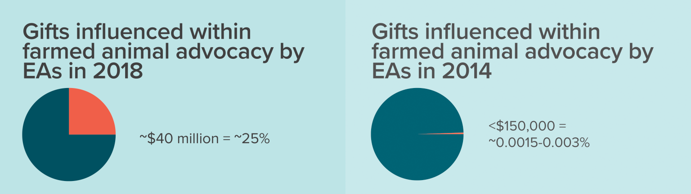

Leah Edgerton is the Executive Director at [Animal Charity Evaluators](https://animalcharityevaluators.org/) (ACE), having previously been the Strategy and Internationalisation Manager for ProVeg International. Manja Gärtner is a Senior Researcher at ACE, and holds a PhD in Economics from Stockholm University.

In this episode, we talk about ACE's work, and the future of the animal advocacy movement. We cover: how ACE goes about evaluating animal charities, the importance of research in animal advocacy, and improving the "health of the movement". We also discuss the role EA has played in the animal advocacy more generally, the ongoing neglectedness of factory farming, and the "meat paradox".

Thanks for listening! We'd love to hear what you thought about it — email us at <a href="mailto:hello@hearthisidea.com">hello@hearthisidea.com</a> or use the feedback form at the top and bottom of this page. You can also help more people discover the podcast by <a href='https://twitter.com/intent/tweet?text=Check out Hear This Idea, a podcast showcasing new thinking in philosophy, the social sciences, and effective altruism! &url=https://www.hearthisidea.com via @hearthisidea&' about='_blank'>tweeting about it</a>. And, if you want to support the show more directly, consider <a href='https://tips.pinecast.com/jar/hear-this-idea'>leaving us a tip</a>.

In the article below, we summarise and illustrate these key ideas; providing both more detail and further readings for listeners who want to find out more.

##### From left to right: Leah, Amelia the cat, and Manja 

## Book Recommendations 📚

- [Animal Charity Evaluators' Blog](https://animalcharityevaluators.org/blog/)
- [Vox's Future Perfect Podcast](https://www.vox.com/future-perfect-podcast)
- [Open Philanthropy's Farm Animal Welfare Newsletter](https://www.openphilanthropy.org/farm-animal-welfare-newsletter-archive)

 <Book url="https://animalcharityevaluators.org/blog/" image="book-ace-1" spineColor='#a5e8ee'/> <Book url="https://www.vox.com/future-perfect-podcast" image="book-ace-2" spineColor='#cbe6f1'/> <Book url="https://www.openphilanthropy.org/farm-animal-welfare-newsletter-archive" image="book-ace-3" spineColor='#1d1d1d'/> 
 

## Animal Charity Evaluators

As the name implies, Animal Charity Evaluators is a non-profit "dedicated to finding and promoting the most effective ways to help animals". They were launched in 2012 by Eitan Fischer as part of the [Effective Altruism](https://www.effectivealtruism.org/) movement (under the original name of 'Effective Animal Activism'). At the time of its founding, EAA was the only organisation providing evidence-based advice to donors looking to give to effective animal charities. However, because animal advocacy remains a comparatively nascent research field, it is equally essential to research and identify highly effective opportunities to help animals as it is to promote these recommendations to donors. Thus, in 2013, EAA merged with Jon Bockman's charity [Justice for Animals](https://animaljusticeproject.com/) to create ACE, joining in a broader mission to develop educational content and research.

As Leah explains to us in our interview, the non-profit is now engaged in a range of efforts to this end. Most prominently, ACE produces a yearly list of recommended charities, helping donors find the best ways that they can help combat animal suffering right now with their charitable donations. Additionally, ACE supports new research, collecting essential information to help inform future decisions. Lastly, ACE cares about improving the "health of the movement", providing resources and funding new ventures. Let's explore each of these tasks in more depth.

## Evaluating Animal Charities

We have discussed the importance of charity evaluation in other episodes. So, if you're looking for background on [cost-effectiveness](https://hearthisidea.com/episodes/sanjay#how-not-to-evaluate-charity-cost-effectiveness) or [RCTs](https://hearthisidea.com/episodes/luke#the-randomista-debate-rcts-and-economic-growth), check out our interviews with [Sanjay Joshi (SoGive)](http://hearthisidea.com/episodes/sanjay/) and [Luke Freeman (Giving What We Can)](http://hearthisidea.com/episodes/luke/). This section will focus specifically on animal welfare and ACE's work.

### Cause Prioritisation for Animals

ACE is committed to [anti-speciesism](https://anti-speciesism.com/), the claim that "[species membership is a morally irrelevant feature](https://plato.stanford.edu/entries/moral-animal/)". This means that ACE cares about the suffering of *all* animals: the welfare of one species is not prioritised another merely by virtue of its belonging to that species — because that species is especially cute, for instance. Applying this principle helps ACE decide where resources might be spent to most effectively reduce total animal suffering. In the event, we see that ACE priorities factory farming over other causes such as shelters or animal testing. Why is this?

Whilst many people might be aware of the extreme scale of meat production (see our [write-up on Peter Singer](https://hearthisidea.com/episodes/peter#the-scale-of-the-problem)), they might not be mindful of how this compares to other causes of animal suffering or exploitation. In the graph below, we see that farming accounts for 99.6% of all animals killed in the US. Animal shelters account for 0.03%.

And yet, this massive imbalance is not even close to being reflected in the proportions of charitable donations which go to animal charities: only 0.8% goes to charities specifically focusing on farmed animals, whilst 66% goes to shelters. Farmed animals are underrepresented by a factor of 124.5 (=99.6/0.8); sheltered animals are overrepresented by a factor of 2,200 (=1/ 0.03/66). Thus, on a per animals killed basis, sheltered animals recieve 273,900 times more charitable donations than farmed animals.

##### Source: ACE ["Why Farmed Animals?" (2016)](https://animalcharityevaluators.org/donation-advice/why-farmed-animals/)

As Leah notes in our interview, this does not mean that we should disregard cats and dogs entirely. However, if our goal is to help the most animals and those who suffer the most, we should be aware that our donations can go much further if they focus on farmed animals. ACE write about reasons for this cost-effectiveness in context of the Humane League [here](https://animalcharityevaluators.org/charity-review/the-humane-league/#c3).

> There's a lot of opportunities out there to improve the lives of farmed animals. So we view that cause area for a donor or an activist who really wants to think about how their individual advocacy can help the highest number of animals and make the biggest difference.

Thus, ACE identifies the following "menu of outcomes" that it believes are the most critical and according to which it will evaluate charities. Note that many of these are related to industrial agriculture, which is one of ACE's main "high priority cause areas".

- Decreased consumption of animal products;
- Increased availability of animal-free products;
- Direct help;
- Improvement of welfare standards;
- Increased prevalence of anti-speciesist values;
- Stronger animal advocacy movement.

For more detail on this list, see ACE's explanations [here](https://animalcharityevaluators.org/research/methodology/menu-of-outcomes/). And for more background on ACE's cause prioritisation (including other areas like wild animal suffering) see [here](https://animalcharityevaluators.org/advocacy-interventions/prioritizing-causes/causes-we-consider/).

### Challenges to Evaluation

The above section might help tell us to identify what *outcomes* a highly effective animal charity is likely to pursue and what *cause area* it is involved in. However, this does not answer which  *interventions* such a charity should undertake to achieve this. For example, if we wish to help the 50 billion chickens killed for food each year, should we support charities that are involved in corporate campaigning, developing meat-alternatives, or political lobbying? As we discuss with Manja, there is a severe lack of information in this regard.

Compare the work ACE does to other charity evaluators who focus on global health, such as [GiveWell](https://www.givewell.org/). In the field of global health, we have the advantage of drawing on a vast research literature to inform cost-effectiveness analyses and causal inferences. Consider the extensive debate on deworming ([Miguel & Kremer, 2004](http://emiguel.econ.berkeley.edu/research/worms-identifying-impacts-on-education-and-health-in-the-presence-of-treatment-externalities); [Joan et al., 2020](http://emiguel.econ.berkeley.edu/research/twenty-year-economic-impacts-of-deworming)) or anti-malaria bednets ([Cohen & Dupas, 2010](https://www.povertyactionlab.org/evaluation/free-distribution-or-cost-sharing-evidence-malaria-prevention-experiment-kenya)). When it comes to animal welfare, there is much less existing empirical work to build upon. In our interview, Manya does say that she believes this will change, and we will highlight some promising work in the Research section of this write-up. But for now, the paucity and underpoweredness of animal studies remains a formidable challenge.

We can also add to this that doing animal welfare research is inherently tricky, because the outcomes that matter are hard to measure. Things like dietary behaviour, consumer attitudes, systems change, and indeed *animal welfare* itself are much more abstract than development goals like income, years of schooling, or life expectancy.

To help overcome these issues, Leah talks about taking a "evidence plus reason" approach. That is, if we have a strong prior and logical reasons for why an intervention is particularly promising, then a lower standard of evidence may be permissible. ACE is explicit about this in their reviews. They assign a confidence rating to each of their assessments for how every charity performs on every criterion.

> We try to not just look at evidence but also reason. So how we can use logical thinking and learning from past movement's successes to take bets on the higher-risk higher-reward interventions to help animals.

More generally, ACE focuses on just a few selected charities (thirteen in 2020) and evaluating these in as much complete detail as possible, using a range of different sources available. ACE is also careful in drawing inferences when data is limited. For example, they use [Guesstimate](https://www.getguesstimate.com/) models to incorporate uncertainty.

### Making Recommendations

Using the above mentioned "menu of outcomes", ACE can first create a theory of change for each charity considered. This method helps ACE systematically categorise a charity's interventions and thus get a better understanding of the total impact created. Below is an example for [The Good Food Institute](https://www.gfi.org/).

Source: ACE ["The Good Food Institute" (2020)](https://animalcharityevaluators.org/charity-review/the-good-food-institute/#comprehensive-review)

> One of the most common failure modes we have seen is charities being unable to grow past a certain point or having management and governance issues that mean they are unable to carry out their great interventions.

<iframe width="560" height="315" src="https://www.youtube.com/embed/_ynoOdCFMzo" frameborder="0" allow="accelerometer; autoplay; clipboard-write; encrypted-media; gyroscope; picture-in-picture" allowfullscreen></iframe>

##### Source: ACE ["The Good Food Institute" (2020)](https://animalcharityevaluators.org/charity-review/the-good-food-institute/#comprehensive-review)

Using this framework, ACE can then evaluate each charity according to standard criteria. They assign a rating to each factor below, which then feeds into a total score.

1. Programs
2. Room for More Funding
3. Cost-Effectiveness
4. Track Record
5. Leadership and Culture
6. Strategy
7. Adaptability

Again, you can find out much more on the rationale behind these criteria at ACE [here](https://animalcharityevaluators.org/charity-reviews/evaluating-charities/evaluation-criteria/#full-criteria-descriptions). And for more detail on estimating cost-effectiveness, see [here](https://animalcharityevaluators.org/research/methodology/our-use-of-cost-effectiveness-estimates/).

We can see that the first three points are pretty standard for charity evaluation: We are interested that a charity conducts impactful interventions [1], that these interventions have scope to grow with marginal donations [2], and that we get the most bang-for-our-buck [3].

What is perhaps more interesting, is that ACE also cares seriously about factors beyond the object-level interventions, and more about charities themselves operate. As Leah says in our interview, these factors are especially pertinent for animal advocacy, which is still a maturing movement where most meaningful change is likely to happen over extended periods:

> One of the most common failure modes we have seen is charities being unable to grow past a certain point or having management and governance issues that mean they are unable to carry out their great interventions.

When thinking about the long-term impact of charities, we can recognise the importance of being able to retain and nurture talent [5], having an overarching plan [6], and showing resilience when shocks like COVID appear [7]. This criterion goes beyond a simple cost-benefit analysis, which often favours marginal and immediate impact (we outline some reasons why [here](https://hearthisidea.com/episodes/sanjay#challenges)).

As Manja notes, there is a sense in which cost-effectiveness is ultimately what matters. The reason that ACE values these further factors like leadership and culture is that uncertainty about cost-effectiveness is unavoidable, and it would be naively overconfident to neglect other sources of information as a guide to a charity's long-run impact.

## Research for Animals

As touched upon in this write-up, one of ACE's big missions is to expand the research being done on animal suffering and from which to base charity evaluations.

We can think about this by drawing a distinction between intervention research and foundational research. To take a straightforward example: suppose I want to evaluate how worthwhile it is to fund a social media campaign encouraging people to go vegetarian. An intervention research question might involve asking how many people I can convince through that campaign. These are the typical questions that charities and charity evaluators can often answer themselves, through 'in-house' studies.

But a more foundational question is: how much does going vegetarian help animals? How many animal lives does it spare? Do people substitute meat by eating more eggs and dairy products? Does being vegetarian also encourage people to engage in other beneficial actions? Because these kinds of question are much more foundational, they often rely on help from the academic community to answer.

In the video below, Leah explains how ACE is trying to help (relevant time stamps are 02:58 — 08:44; there is also a [transcript](https://www.effectivealtruism.org/articles/leah-edgerton-strategic-considerations-for-effective-animal-advocacy)). This effort includes writing [reports on interventions](https://animalcharityevaluators.org/advocacy-interventions/interventions/), [providing funding](https://researchfund.animalcharityevaluators.org/), and creating a [data depository](https://osf.io/v4xpb/).

### Areas for potential work

As we talk about with Manja, there are lots of opportunities for research, especially in the social science and economics. This section showcases some of those areas and examples of recent work. I thank Rossa O'Keeffe-O'Donovan for giving me a guide through this literature.

> I would love to see this become more academic, especially in the social sciences. So I'm hoping that some talented people will dedicate their research to this topic and make this a flourishing field.

- **Elasticities:** How much do people change their meat consumption in response to changes in factors like prices and income? Are people willing to pay more to help animals?
    - Gallet (2010) — [Meets Meta: A Quantitative Review of the Price Elasticity of Meat](https://onlinelibrary.wiley.com/doi/abs/10.1093/ajae/aap008)
    - Lusk & Tonsor (2016) — [How Meat Demand Elasticities Vary with Price, Income, and Product Category](https://onlinelibrary.wiley.com/doi/abs/10.1093/aepp/ppv050)
    - Chang et al. (2010) — [The Price of Happy Hens: A Hedonic Analysis of Retail Egg Prices](https://ideas.repec.org/a/ags/jlaare/97855.html)
    - Olynk et al. (2010) — [Consumer willingness to pay for livestock credence attribute claim verification](https://www.researchgate.net/publication/46536012_Consumer_Willingness_to_Pay_for_Livestock_Credence_Attribute_Claim_Verification)
- **Awareness:** Does media attention help change consumer behaviour? Does labelling? Moral arguments?
    - Tonsor & Olynk (2011) — [Impacts of Animal Well-being and Welfare Media on Meat Demand](https://onlinelibrary.wiley.com/doi/10.1111/j.1477-9552.2010.00266.x)
    - Tonsor & Wolf (2011) — [On mandatory labelling of animal welfare attributes](https://www.sciencedirect.com/science/article/abs/pii/S0306919211000285)
    - Lusk et al. (2013) - [Beliefs and Preferences: Distinguishing beliefs from preferences in food choice](https://academic.oup.com/erae/article/41/4/627/432795)
    - Schwitzgebel, Cokelet & Singer (2020) — [Do ethics classes influence student behaviour? Case study: Teaching the ethics of eating meat](https://www.sciencedirect.com/science/article/abs/pii/S001002772030216X)
        - We talked about this study with Peter Singer in our [episode](http://hearthisidea.com/episodes/peter/) with him — you can read our separate write-up on this [here](https://hearthisidea.com/episodes/peter#the-schwitzgebel-study).
- **Policy:** What laws are best for improving animal welfare? Do bans work?
    - Mullally & Lusk (2017) —[The Impact of Restrictions on Farm Animal Housing on Egg Prices, Consumer Welfare, and Production in California](https://onlinelibrary.wiley.com/doi/abs/10.1093/ajae/aax049)
    - Malone & Lusk (2016) — [Putting the Chicken Before the Egg Price: An Ex Post Analysis of California's Battery Cage Ban](https://jareonline.org/articles/putting-the-chicken-before-the-egg-price-an-ex-post-analysis-of-californias-battery-cage-ban/)
- **Welfare Analysis:** How can we incorporate animals into our decision-making process? How should they be modelled in our social welfare functions?
    - Lusk and Norwood (2011) —[Animal Welfare Economics](https://onlinelibrary.wiley.com/doi/abs/10.1093/aepp/ppr036)
    - Lusk and Norwood (2012) — [Speciesism, altruism and the economics of animal welfare](https://academic.oup.com/erae/article/39/2/189/465316)
    - Johansson-Stenman (2018) — [Animal Welfare and Social Decisions: Is it Time to Take Bentham Seriously?](https://www.sciencedirect.com/science/article/pii/S0921800917304639)
    - Eichner and Pethig (2006) — [Efficient non-anthropocentric nature protection](https://www.jstor.org/stable/41106720?seq=1)

For lots more, do also check out ACE's [research library.](https://animalcharityevaluators.org/researchlibrary/#/) [Rethink Priorities](https://www.rethinkpriorities.org/ongoing-projects#animals) has a range of ongoing projects in this area. [Faunalytics](https://www.farmlytics.com/about) is also a useful resource. If you are looking to write your dissertation on this topic, you may also be eligible to enter the [Forethought Foundation Thesis Prize](https://www.forethought.org/undergraduate-thesis-prize).

### The Meat Paradox

One research area we discussed in our interview is the so-called "[meat paradox](https://en.wikipedia.org/wiki/Psychology_of_eating_meat#Meat_paradox)". This term describes the phenomenon where many people simultaneously care about animal suffering when asked about it, but behave as if they are 'in denial' of contributing to this suffering, when buying and eating animal products.

This links to the psychological effect of "cognitive dissonance" — [which was formalised by Festinger (1962)](https://www.worldcat.org/title/theory-of-cognitive-dissonance/oclc/921356). Cognitive dissonance occurs when an apparent contradiction creates internal discomfort. As Manja explains, people react to this discomfort by either changing their actions (i.e. choosing to stop eating meat) or, as is more common, by changing their their beliefs (i.e. downplaying the extent to which animals feel pain, or one's personal responsibility). Steve Loughnan does much work on this in the context of animal suffering. This [chapter](https://books.google.co.uk/books?hl=en&lr=&id=1jq9DwAAQBAJ&oi=fnd&pg=PT254&dq=meat+paradox&ots=q7Conb79WR&sig=_PJrWPfgH0Z6ZV-rw1tr0HuBmX4) provides a good introduction.

Many people have also linked this to the "dissociation hypothesis". [Science Daily](https://www.sciencedaily.com/releases/2016/10/161011125655.htm) gives the following description.

> Already by referring to what we eat as "beef" instead of "cow," we have created a distance between our food and an animal with abilities to think and feel.

Indeed, studies by [Kunst & Sigrid (2016)](https://www.sciencedirect.com/science/article/abs/pii/S0195666316302768) show that this dissociation grows with how processed the meat. We feel less guilty when eating chopped fillets or nuggets that a whole chicken. Likewise, we feel less guilty if there are no pictures of animals on the packaging.

> Society is making it easier for us to change our beliefs. And this is due to meat eating being a norm and the practices of factory farming being very removed from our lives. Normally, we don't see what is happening in the factories — when we buy meat it's very much removed from the original product.

## Supporting the "health of the movement".

Lastly, as we discuss in our interview, ACE is interested in fostering the broader animal advocacy movement. Leah notes that ACE doesn't just want to end up funding a few, large organisations. Because the movement is still young and mired in a range of uncertainties, there are significant advantages in building up diversity and resilience.

Some of this we have already discussed — such as taking culture and adaptability into account. Moreover, ACE also provides concrete recommendations in their reviews to help charities become more effective, as well as [tools](https://animalcharityevaluators.org/for-charities/) to improve their practices.

> We don't want to be the Oscars of the animal rights movement [...] We genuinely want charities to do well on our criteria and to receive more funding [...] So when possible we want to share resources.

This year, ACE has also launched its [Movement Grants](https://animalcharityevaluators.org/blog/announcing-our-fall-2020-ace-movement-grants/), which provides funding to relatively new non-profits in the animal advocacy movement. We can think of this in terms of the "[explore and exploit](https://conceptually.org/concepts/explore-or-exploit)" trade-off — whereby ACE balances out supporting the most effective currently known interventions with helping to find even more effective interventions for the future. As discussed in the research section, gathering new information is incredibly valuable at this stage. And, as we discussed in our [interview with Luke Freeman](https://hearthisidea.com/episodes/luke#effectiveness), high-risk and high-reward opportunities can often be left unexploited in the non-profit space.

### EA influence in Animal Advocacy

Thinking about why ACE takes this broad approach, we should recognsie that EA has become a very significant player in the animal advocacy movement. And with great power comes great responsibility!

As the graphs show below, in just four years, "EA donations" have increased more than 200-fold from making up a negligible amount of all donations towards farmed animal advocacy, to over 25%. This influence means that Effective Altruism now also needs to begin considering how its activities affect the very structure of the animal advocacy movement, not just how it can make a difference at the margin.

Contrast this to other cause areas, like global health and development. Even though the nominal amount of EA donations is larger ($275m), the relative share this makes up of total humanitarian aid still tiny (0.01%). Thus, charity evaluators in those areas — like GiveWell — do not need to worry too much about e.g. skewing incentives.

Manja also notes the influence EA is beginning to have in many other ways as well. Examples include EA speakers becoming present at animal advocacy conferences, and EA ideas gaining popularity within organisations which are not explicitly affiliated with EA.

In this sense, the influence of Effective Altruism within animal advocacy appears to serve as an early case study of what happens when EA does become more "mainstream" and able to affect big-picture change. As Leah reflects, this promises much more for the future.

> The changes I have seen our movement accomplish in just the last five years was more than what I expected we could accomplish in my lifetime.

Thank you very much to Leah and Manja for their time.

Thanks for listening <i>and</i> reading the write-up! We'd love to hear what you thought about it — email us at hello@hearthisidea.com or leave a rating below. You can help more people discover the podcast by <a href='https://twitter.com/intent/tweet?text=Check out Hear This Idea, a podcast showcasing new thinking in philosophy, the social sciences, and effective altruism! &url=https://www.hearthisidea.com via @hearthisidea&' about='_blank'>tweeting about it</a>. And, if you want to support the show more directly, consider <a href='https://tips.pinecast.com/jar/hear-this-idea'>leaving us a tip</a>.

