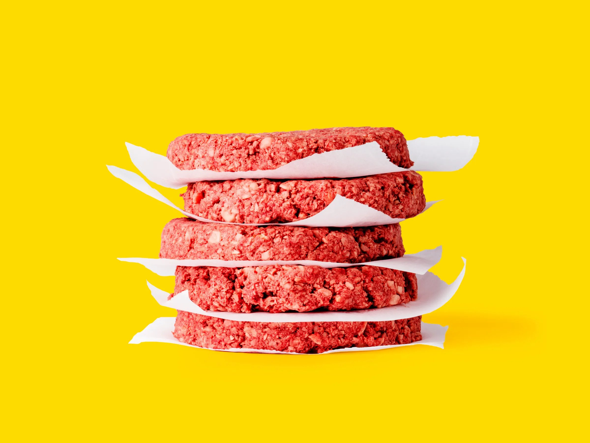
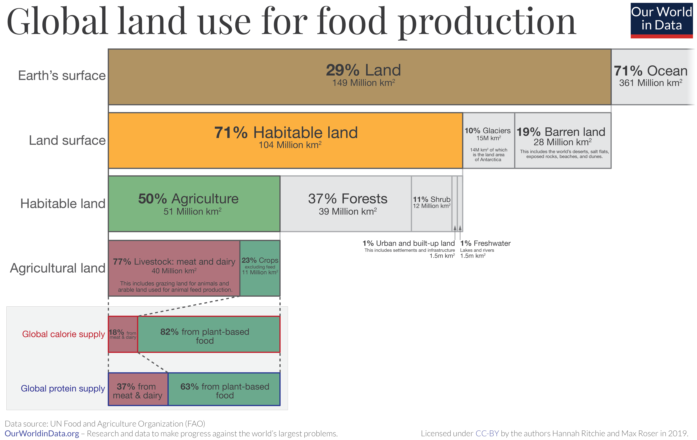
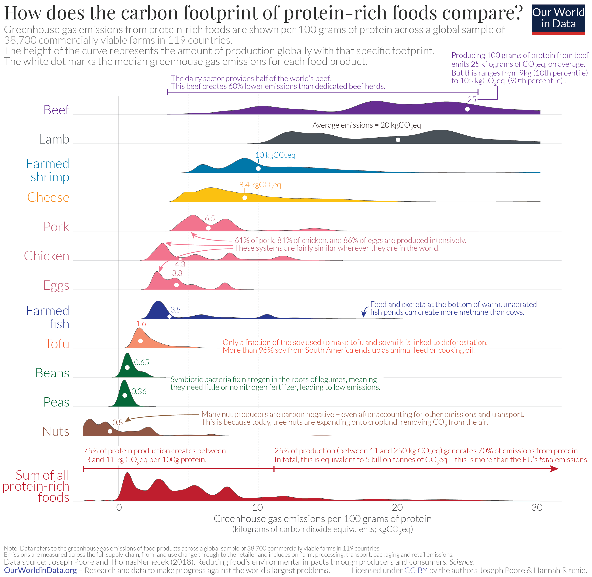

Bruce Friedrich is the co-founder and executive director of The Good Food Institute — a nonprofit that works with scientists, investors, and entrepreneurs to support the development and marketing of cell-cultured and plant-based alternatives to animal food products.

In this episode, we discuss the inefficiencies of meat production, parallels between today's cultivated and plant-based meat and early mobile phone technology, GFI's counterfactual impact, and how to market protein alternatives to consumers.

##### Photo credit: [New York Times](https://www.nytimes.com/2019/03/12/technology/bruce-friedrich-animal-activist.html)

Thanks for listening! We'd love to hear what you thought about it — email us at <a href="mailto:hello@hearthisidea.com">hello@hearthisidea.com</a> or use the feedback form at the top and bottom of this page. You can also help more people discover the podcast by <a href='https://twitter.com/intent/tweet?text=Check out Hear This Idea, a podcast showcasing new thinking in philosophy, the social sciences, and effective altruism! &url=https://www.hearthisidea.com via @hearthisidea&' about='_blank'>tweeting about it</a>. And, if you want to support the show more directly, consider <a href='https://tips.pinecast.com/jar/hear-this-idea'>leaving us a tip</a>.

## Book Recommendations 📚

- [Clean Meat](https://www.goodreads.com/book/show/36101304-clean-meat) by Paul Shapiro
- [Enlightenment Now](https://www.goodreads.com/book/show/35696171-enlightenment-now) by Steven Pinker
- [Sapiens](https://www.goodreads.com/book/show/23692271-sapiens) and [Homo Deus](https://www.goodreads.com/book/show/31138556-homo-deus) by Yuval Noah Harari

 <Book url="https://www.goodreads.com/book/show/36101304-clean-meat" image="book-bruce-1" spineColor='#ffffff'/> <Book url="https://www.goodreads.com/book/show/35696171-enlightenment-now" image="book-bruce-2" spineColor='#090909'/> <Book url="https://www.goodreads.com/book/show/31138556-homo-deus" image="book-bruce-4" spineColor='#150d0b'/> 
 

## The Good Food Institute

First, what is the Good Food Institute, and why is it important?

As we discuss in this conversation, and in [Episode 19](https://hearthisidea.com/episodes/peter) with [Peter Singer](https://www.utilitarianism.net/utilitarian-thinker/peter-singer), turning animals into food on an industrial scale is a fairly bad idea. As we will see, the arguments from food security, global health, environmental harms, and animal suffering are *each* compelling reasons for transitioning away from animal agriculture — jointly, the case is overwhelmingly strong.

But the arguments alone are having a hard time actually changing consumer preferences. Indeed, as Bruce mentions in the interview, nobody *likes* hearing the uncomfortable facts about what goes into our burgers, eggs, or steaks  — we just find ways not to think too hard about them when they're on our plates. And despite the efforts of animal advocates, there's no clear [evidence](https://news.gallup.com/poll/238328/snapshot-few-americans-vegetarian-vegan.aspx) that the number of self-identifying vegetarians and vegans has risen at all over the [past 15 years](https://faunalytics.org/is-the-number-of-vegetarians-on-the-rise/).

As such, the best way to transform food systems away from animals is going to involve more than just repeating those ethical arguments. This is why the Good Food Institute was established: to combine that moral case with **market forces** and **food technology**. The idea is straightforward: once alternative proteins reach price parity or better with animal products, in addition to being healthier and more delicious, they'll just beat the animal products at their own game.

GFI is working towards that outcome through a number of channels:

- Providing **strategic support** to companies — from startups to global corporations — in bringing protein alternatives to market.
- Connecting food scientists, students, and entrepreneurs with opportunities in **academia** and with **non-profits**.
- **Educating** institutions — including grant-makers, corporations, and government bodies — about the importance of alternative protein R&D.
- **Promoting** protein alternatives by working with food retailers to increase the availability and visibility of plant-based products.
- Organising an annual **conference** to bring together "scientists, entrepreneurs, investors, policymakers, and companies" and discuss the future of protein alternatives.

GFI conducts this work across six geographic regions: the US, Brazil, India, Israel, Europe, and Asia Pacific.

##### Source: Wired

## Why Replace Animal Agriculture?

All else being equal, the goals of the Good Food Institute are worthwhile in proportion to the scale and severity of the problems they address. In our [conversation with Peter Singer](https://hearthisidea.com/episodes/peter), we discussed animal suffering as one obvious harm of animal agriculture. Bruce explains —

> What is happening to them on modern farms and in modern slaughterhouses is beyond most of the worst moments of our lives. Maybe occasionally we have moments that are as bad as every waking moment for a battery chicken, but probably not. And that's their entire existence.

But the harms of animal agriculture extend far beyond harms to the animals themselves.

Indeed, issues of 'animal protection' represent only a minor focus for GFI in making the case for developing alternatives to animal agriculture. Relative to other [factors](https://www.gfi.org/why) we're about to discuss, "there's not nearly the sort of institutional focus on animal protection."

What, then, are these other external costs of animal agriculture?

### Inefficiencies in Animal Agriculture

Turning animals into food involves growing (plant) feed for animals, feeding the animals, and then eating those animals in turn. But not all of the energy from the plant feed is converted into the animal product to be consumed by humans — some gets lost on the way. This is an understatement: in every case, *most* of the energy from plant feed is 'wasted' by the animal in moving around, respiring, and growing inedible body parts. In other words, every kilogram of protein or calorie of meat on sale at the supermarket required *many* kilograms of protein and calories of feed.

> A lot of people don't think that much about this, but it's a super intuitive concept. Once somebody just explains — with chickens, pigs, cattle, farmed fish, the vast majority of the calories you feed to them they expend simply existing.

Poultry represent the most efficient means of converting feed inputs into edible outputs. To reach this level of efficiency, the overwhelming majority (>98%) of chickens sold in the developed world are reared in intensive factory farms. Keeping poultry in cramped indoor conditions makes it possible to prevent the birds from spending energy in moving around; while decades of [selective breeding](https://www.researchgate.net/publication/338572894_Genetic_selection_of_broilers_and_welfare_consequences_a_review) has produced chickens optimised for maximum growth rate — right before the point where they fall ill or die at unsustainable rates. Yet, even these birds produce roughly one calorie of edible flesh for every **nine** calories of feed, and one kilogram of animal protein for every **four** kilograms of plant protein.

> It takes nine calories in the form of feed to get one calorie back out in the form of chicken meat.

This is because even selectively bred chickens take 6-7 weeks to grow before slaughter, all while irretrievably spending calories keeping themselves alive and growing inedible body parts.

The efficiency ratios are even wider when considering other animals. [One estimate](https://iopscience.iop.org/article/10.1088/1748-9326/11/10/105002) of the average feed conversion efficiency between dairy, beef, poultry, pork, and eggs gives a figure of **7%-8%**. The feed conversion efficiency of beef, in terms of both protein and calories, is a paltry **3%**. In other words, one kilogram of beef protein requires over 30 kilograms of plant protein to produce.

What's so wrong about this? The key point is that the calories currently being grown to feed animals could instead be grown to **feed humans directly**. As such, turning animals into food (and buying the result) means making a decision to grow food in a way which is neither remotely best nor remotely necessary. As Bruce puts it — 

> That is not morally different from taking eight plates of food, throwing them in the trash, and eating one plate of food.

And while "you or I might not be personally throwing all of that food away", we are nonetheless "entering into an economic relationship" where such gross inefficiencies are unavoidable. 

For more about the ethics and economics of buying animal food products, see the <a href='https://hearthisidea.com/episodes/peter#practical-objections'>'Practical Objections'</a> section of our Peter Singer write-up.

However, the inefficiencies of animal agriculture extend beyond converting feed into edible outputs. Another major inefficiency is the disproportionate amount of *land* used to rear animals for food, versus growing the same calories of plant-based foods. Of all the land area used to produce food in the UK, 63% is used to rear animals, 22% to grow animal feed, and only the remaining 15% is used to grow crops for human consumption — such that 85% of the [land used for food in the UK](https://vegansci.com/2017/03/12/animals-account-for-85-of-uk-food-land-footprint/) is used to provide less than a third of the total calories consumed by Britons. In other words, animal food products in the UK are **10 times**, or **900%** more land-intensive per calorie than plant-based food.

This holds globally, as the charts below show.

<iframe src="https://ourworldindata.org/grapher/land-use-protein-poore" loading="lazy" style="width: 100%; height: 600px; border: 0px none;"></iframe>

##### Source: Our World In Data

> You are literally talking about 9 times as much land, 9 times as much water, 9 times as many pesticides and herbicides.

The numbers pertaining to water use are similarly stark. A [2013 study](https://www.sciencedirect.com/science/article/pii/S2212371713000024) found that all forms of agriculture combined use up to 92% of the world's freshwater. While [growing vegetables](https://waterfootprint.org/en/water-footprint/product-water-footprint/water-footprint-crop-and-animal-products/) requires around 400 litres of water per kilogram of edible output, beef (for instance) requires 15,000 litres.

##### [Forest and Fields](https://commons.wikimedia.org/wiki/File:Forest_and_Fields,_Rond%C3%B4nia,_Brazil_by_Planet_Labs.jpg), Rondônia, Brazil

Bolstering the case for a transition to plant-based alternatives is the fact that land and resource efficiency ('yield') continues to improve for cereals and other crops. As the charts below show, the land required to produce a fixed quantity of cereal has been decreasing at impressive rates.

<iframe src="https://ourworldindata.org/grapher/index-of-cereal-production-yield-and-land-use" loading="lazy" style="width: 100%; height: 600px; border: 0px none;"></iframe>

<iframe src="https://ourworldindata.org/grapher/arable-land-pin" loading="lazy" style="width: 100%; height: 600px; border: 0px none;"></iframe>

As it happens, this wonky-sounding observation indicates a remarkable leap of progress for humanity. The above charts even underrepresent the amount of progress made, because they narrowly miss the [Green Revolution](https://en.wikipedia.org/wiki/Green_Revolution) of the 1950s and late 1960s. During this period, technologies like chemical fertilisers, agrochemicals, improved irrigation, and genetically modified strains of disease-resistant crop dramatically improved yields and likely saved millions of lives from an [anticipated](https://en.wikipedia.org/wiki/The_Limits_to_Growth) food shortage in some of the poorest countries in the world. To give a sense of the enormous implications of these technologies, consider the American agronomist [Norman Borlaug](http://scienceheroes.com/images/stories/Book/Chapter5NormanBorlaug.pdf), who painstakingly bred new high-yield and disease-resistant strains of wheat suitable for use in sub-Saharan Africa. Estimates for the lives saved by Borlaug’s strains of wheat vary from c. 250,000,000 to c. *1 billion* people.

In light of these advances, today's food system has the capacity to adequately feed the entire world — even prior to the efficiency gains in producing protein alternatives that GFI is optimistic about. Yet, because so much human-edible food is instead fed to livestock, a significant number of the world's poorest people remain [undernourished](https://nightingale-owid.netlify.app/grapher/prevalence-of-undernourishment), [stunted](https://nightingale-owid.netlify.app/grapher/share-of-children-younger-than-5-who-suffer-from-stunting), facing [food insecurity](https://nightingale-owid.netlify.app/grapher/number-of-people-severely-food-insecure), or simply [starving](https://nightingale-owid.netlify.app/grapher/global-hunger-index). As Peter Singer notes in *[Animal Liberation](https://www.goodreads.com/work/quotes/1547077)* —

> By ceasing to rear and kill animals for food, we can make so much extra food available for humans that, properly distributed, it would eliminate starvation and malnutrition from this planet.

Indeed, such a switch could plausibly produce a food surplus: *more* than enough to go around. As Bruce summarises:

> It is a crime against humanity, while people are starving, to funnel massive amounts of crops through animals so we can eat animals when those crops should be feeding human beings.

Around a decade ago, the food envoy for the UN branded the practice of burning crops as biofuels a '[crime against humanity](https://www.theguardian.com/global-development/poverty-matters/2013/nov/26/burning-food-crops-biofuels-crime-humanity)'. His reasoning relied on an [FAO](http://www.fao.org/home/en/) [report](http://www.fao.org/publications/sofa/2008/en/) which found that "Europe now burns enough food calories in fuel tanks every year to feed 100 million people", and that rich countries buying crops to be used as biofuels was driving up the price of corn and wheat by [about 30%](https://ieep.eu/publications/biofuels-and-agricultural-commodity-prices-a-review-of-the-evidence-base) — causing more deaths linked to starvation or malnutrition.

But the subsequent year's FAO [report](http://www.fao.org/publications/sofa/2009/en/) found that more than *700* million tonnes of corn and wheat were being fed to farm animals worldwide — not including the over 90% of soy crop that is also fed to farm animals. Including soy, over 1000 million metric tonnes of edible crops were fed to animals the same year — around *10 times* the amount turned into biofuel. The effects resemble the consequences of rich countries buying crops for use as biofuels — except on an even larger scale. Crop prices are again driven up, subsistence farmers are thrown off their land, and resulting water scarcity leads to more and more '[water conflict](https://en.wikipedia.org/wiki/Water_conflict)'. If a senior envoy from the UN was prepared to describe biofuels as a 'crime against humanity', what does this imply about the far greater amounts of edible crops which we 'burn' in the digestive systems of animals?

### Environmental Degradation

> After you grow all those crops, you have to ship them to a feed mill and operate the feed mill, you have to ship the feed to the farm, you have to operate the farm, you have to ship the animals to a slaughterhouse, you have to operate the slaughterhouse. Environmentally, you're talking about multiple extra stages of gas-guzzling pollution-spewing lorries, and you're talking about multiple extra energy-intensive and polluting factories.

In large part because of the inefficiencies described above, turning animals into food tends to cause a disproportionate amount of environmental damage relative to growing plant foods. The UN's Food and Agriculture Organization [has therefore described](http://www.fao.org/newsroom/en/news/2006/1000448/index.html) animal agriculture as "one of the major causes of the world's most pressing environmental problems, including global warming, land degradation, air and water pollution, and loss of biodiversity".

<iframe src="https://ourworldindata.org/grapher/ghg-per-protein-poore" loading="lazy" style="width: 100%; height: 600px; border: 0px none;"></iframe>

The same 2006 FAO report also notes:

- The "livestock sector generates more greenhouse gas emissions as measured in CO2 equivalent – 18 percent – than **transport**."
- Increasing prosperity suggests that animal agriculture is likely to continue scaling up: "Global meat production is projected to more than double from 229 million tonnes in 1999/2001 to 465 million tonnes in 2050."
  - This is true in relative as well as absolute terms: the global "livestock sector" is "growing faster than any other agricultural sub-sector"
- Livestock use "30 percent of the earth’s entire land surface", including 33% of arable land (for producing feed).
  - To accommodate supply to this increasing demand, forests are being cleared for pastures and growing feed. "[S]ome 70 percent of former forests in the Amazon have been turned over to grazing."
- Livestock degenerate the land they graze: about 20% of pastures are already considered degraded "through overgrazing, compaction and erosion".
- Water sources are polluted by "animal wastes, antibiotics and hormones, chemicals from tanneries, fertilizers and the pesticides used to spray feed crops" leading to widespread [eutrophication](https://en.wikipedia.org/wiki/Eutrophication) and biodiversity loss.

A more recent special report on climate change and land from the IPCC (Intergovernmental Panel on Climate Change) also notes that climate change "has resulted in lower animal growth rates and productivity in pastoral systems in Africa" — meaning more land, feed, and animals are required to feed the same number of people. Similarly, while animal agriculture is a leading cause of desertification and soil degradation, these factors in turn "cause reductions in crop and livestock productivity".

The point to underline is that plant foods fare *much* better along all of these metrics: they require fewer factories, far less input resources, fewer chains of transportation, and less land area.

### Global Health

The final major concern we discuss is the effects of animal agriculture on human health, through **antimicrobial resistance** and as a risk factor in generating **zoonotic diseases**.

### Antimicrobial Resistance

In the TED talk below, Leon Marchal describes how the practice of treating animals with antibiotics could lead to "10 million [human] deaths each year by 2050 and damage to the economy as catastrophic as the 2008-2009 global financial crisis".

<iframe src="https://embed.ted.com/talks/lang/en/leon_marchal_the_urgent_case_for_antibiotic_free_animals" width="854" height="480" style="position:absolute;left:0;top:0;width:100%;height:100%" frameborder="0" scrolling="no" allowfullscreen></iframe>

Farmers in the 1950s began to notice how regularly adding antibiotics to animal feed "kept the animals healthy, made them grow faster and caused them to need less feed". Fast-forward to the present-day, and 50% to 80% of antibiotics worldwide are used by animals. But because the animals receive small doses — enough to preemptively ward off disease — some bacteria survive and develop resistance to the drugs. As Bruce emphasises, the animals typically receive the drugs before they fall sick "to keep them alive in conditions which would otherwise be breeding disease". Marchal continues —

> Spread that across an entire industry, and you can understand that we accidentally build up a large reservoir of antibiotic-resistant bacteria.

In the long-run, this contributes to the spread of antibiotic-resistant 'superbugs' which cannot be killed by standard antibiotics — breaking out of farms and into the wider world. And, because so many afflictions can only be treated by antibiotics, this possibility has grave implications human health.

A [report](https://www.who.int/antimicrobial-resistance/interagency-coordination-group/final-report/en/) from the World Health Organisation extrapolates from this trend to reach the alarming conclusion outlined above — a further 10 million deaths by 2050. It also claims that "antimicrobial resistance could force up to 24 million people into extreme poverty" by 2030. Prof Dame Sally Davies, UK Special Envoy on Antimicrobial Resistance and former Chief Medical Officer for England, [has warned](https://www.pharmaceutical-journal.com/news-and-analysis/news/chief-medical-officer-warns-antibiotic-resistance-could-signal-end-of-modern-medicine/20203745.article?firstPass=false) that our current trajectory points towards "the end of modern medicine".

### Zoonotic Diseases

The second health concern from animal agriculture relates to the rapid spread of zoonotic diseases — diseases which originated in an animal and jumped to humans. The central idea is simple: intensive animal farming is a [major risk factor](https://animainternational.org/blog/factory-farming-global-pandemics) for a global pandemic.

This July, the UN environment program released a timely [report](https://www.unenvironment.org/news-and-stories/press-release/unite-human-animal-and-environmental-health-prevent-next-pandemic-un) about preventing future pandemics. It identifies the "increased demand for animal protein" as a major driving factor for the "increasing emergence of zoonotic diseases". As Anima international [report](https://animainternational.org/blog/factory-farming-global-pandemics) —

> Due to the very high density and low genetic diversity of the animals kept there, [factory farms] provide an excellent space for the rapid spread of viruses. This phenomenon is also encouraged by the very high intensity of production, which causes chronic stress and consequently weakens the animals’ immune system. Potential drivers for the transmission of zoonotic diseases also include long-distance transport and the extensive supply chain used by the animal industry.

It is obligatory at this point to mention COVID. Think of the destruction wrought by this disease, with an [infection fatality rate](https://ourworldindata.org/covid-mortality-risk) of something like 1%. Then imagine how much *worse* such a pandemic could get.

## GFI's Theory of Change

The sections above should give a clearer picture of the morally urgent case for changing the way our planet produces its food. But affecting such a change sounds like a tall — even impossible — order. In the next section, we consider how GFI thinks about bringing about alternatives to animal food products through **technological innovation** and **market forces**. In other words: what is GFI's [theory of change](https://en.wikipedia.org/wiki/Theory_of_change)?

### Change the people, or change the food?

The first point that Bruce makes is that reducing consumer demand merely by spreading awareness of the moral case against eating animals has largely failed. To begin with, most people (at least in developed countries) have *already* heard the arguments —

> What appears to be true is that lots of people are vaguely, or even more than vaguely, aware of everything that we just talked about ... people legitimately care about animal welfare.

The problem is psychological: we don't make food choices by consulting our moral conscience!

> We as human beings to be hard-wired to focus when we're making food choices exclusively on physiological well-being.

Bruce frames food choices in terms of Daniel Kahneman's [dichotomy](https://en.wikipedia.org/wiki/Thinking,_Fast_and_Slow) between 'System 1' and 'System 2' modes of thinking. System 1 thinking is fast, instinctive, and emotional; System 2 is deliberative and more logical —

> Where food is concerned, for the vast majority of people, even in developed economies, food is still System 1 thinking. Is it delicious, will is sustain me, does it have a lot of calories, is it reasonably priced — that is what dictates consumer choice for literally everybody ... it is a vanishingly small number of people who might incorporate ethics.

As mentioned, [meat consumption and production](https://ourworldindata.org/meat-production) are rising globally and in developed countries; and per-capita meat consumption in the US was the highest in [recorded history](https://www.ers.usda.gov/amber-waves/2019/december/us-per-capita-availability-of-red-meat-poultry-and-seafood-on-the-rise/). Yet, 2019 was "also *for sure* the year when the highest percentage of Americans understood the external costs of industrial animal agriculture."

And there's no reason to expect this trend to slow down: the UN's FAO [anticipates](https://www.theguardian.com/environment/2011/nov/28/un-farmers-produce-food-population) that farmers must produce 70% more meat by 2050 to meet skyrocketing demand.

Also, note that the capacity to change diets in response to (secular) ethical arguments is likely to be greatest in more developed countries, with greater economic freedom. So even if the 'changing minds' approach worked in countries like the US and UK, it might be unreasonable to expect it to transfer to far more populous countries like China or India.

> We need a solution that doesn't just work where we have maximum educational capacity — [although] I would say that the educational experiment has failed in those places ... this solution needs to work in rural China, and it needs to work in the developing economies where we don't have the capacities to make these educational pleas.

In sum, while the moral case for transitioning away from eating animals is robust and compelling, relying on it alone to win over the world seems dangerously complacent at best, and hopeless at worst.

> So at the Good Food Institute, we think the solution is remaking meat, instead of remaking human decision making.

This approach combines two insights: that demand for meat is unlikely to be significantly directly swayed by the moral case against it, and that it looks technologically feasible to produce **alternative foods** that compete with animal products on every level.

> We can give people the same level of delicious, we can do it more efficiently so it will cost less as it scales up, and we can do it in a way that is safer.

GFI's mission involves reframing protein alternatives away from being the weird, cardboardey, compromise foods marketed exclusively towards veggies; and toward being the default choice for everybody, irrespective of moral persuasion.

> Instead of making products for people who are vegetarians or vegans that aren't quite as good, this is: let's actually hire the scientists to make the products where consumers cannot actually tell the difference.

Why think this is feasible? The short answer, as Bruce explains, is that meat and other animal food products are all made of various **minerals**, **amino acids**, **lipids** (fats), and **water**. Plants have all these things in abundance. It comes down to an engineering challenge: how do we combine those ingredients in creative ways to most effectively 'biomimic' meat?

And for folks with a strong preference for the genuine article, cultivated (or 'clean') meat technology promises an affordable way of growing actual flesh — without the external costs involved in harvesting it from living animals, and requiring a matter of days to grow the same amount it would take e.g. a chicken 6-7 weeks to grow.

Because of all this, major public figures are becoming increasingly excited about the planet-improving promise of plant-based meats. When Bill Gates tried a sample of Beyond Meat's offering, he [remarked](https://www.gatesnotes.com/about-bill-gates/future-of-food) —

> What I was experiencing was more than a clever meat substitute. It was a taste of the future of food.

Eric Schmidt, the CEO of Alphabet (Google's parent company), even [declared](https://www.impactingourfuture.com/sustainable-living/is-plant-based-meat-the-future-of-food/#) that plant-based meat has the potential to "improve life for humanity by at least **tenfold** in the fairly near future"

This, in short, is why GFI is focused on developing new food technologies. But how do they go about supporting their development?

## Supporting Research

This involves connecting talented people with jobs, funding, and scientific roles within academia and for-profit sectors. In rapidly growing fields, major talent bottlenecks can emerge. The idea here is to respond by finding the scientists to hire, and connecting them with suitable roles.

GFI also conduct their own assessments of technological readiness and opportunities for research in cultivated meat. Bruce highlights [this report](https://www.gfi.org/images/uploads/2017/06/Mapping-Emerging-Industries.pdf) as an example, noting that before GFI began conducting these investigations, no [technological readiness assessment](https://en.wikipedia.org/wiki/Technology_readiness_level) had been completed for plant-based or cultivated meat.

Taking a longer-term view, GFI has launched the '[Alt. Protein Project](https://www.gfi.org/blog-alt-protein-project-primer)' — targeting students at colleges and universities with a view to matching them with early-career opportunities, building an 'education pipeline', and fostering a community for mutual support. One exciting suggestion is that more students and researchers could become entrepreneurs — turning their work into a marketable product. For instance, Beyond Meat [began](https://en.wikipedia.org/wiki/Beyond_Meat#History) as a university research project, and spun out into one of the most successful pant-based meat brands in the world. As Bruce underlines in our interview, research in plant-based and cultivated meat is an enormously exciting line of work —

> Remaking meat as a really great career trajectory, where they can do very well for themselves and their families — and where they can also, you know, essentially save the world.

If you are or know a student who may be interested in getting involved, see our 'getting involved' section. For more about GFI's role in supporting research, see their page on '[Advancing Solutions for Alternative Proteins](https://www.gfi.org/alternative-protein-solutions)'.

## Policy

Some of the most transformative technologies in history were originally developed either by government programs, or else with significant government support. This is partly because  the effort may require more investment than most private firms are capable of funding unilaterally, but mostly because research and development is often a kind of [public good with positive externalities](https://www.econlib.org/library/Enc1/PublicGoodsandExternalities.html).

Where firms that did not fund research can nonetheless reap the rewards of the technological breakthroughs made by rival firms, the private benefits of the rival firms' research is said to be 'nonexludable'. The research produces a huge amount of public value, but the firm that conducts it may be unable to 'capture' the value by preventing the rest of the world from benefitting from the research, leading to a market failure. Thus, the benefits to a private firm from R&D may sometimes fail to justify the costs, even when the overall benefits to the world far outstrip those costs.

One solution is for more than one firm to club together and pool their resources into a joint research project, agreeing to share the results. Another solution is **government funding** — particularly when such funding could feasibly turn the nation providing it into a future hub for innovation in the field. Roughly speaking, this works because private companies aim to maximise profits (they don't care about externalities), while government aims to improve social welfare (they do). And this is exactly the situation with respect to protein alternatives — countries are recognising the enormous potential gains from getting in early in a booming industry. A further advantage of government-funded research is that governments can stipulate that it be [open-access](https://en.wikipedia.org/wiki/Open_access) — meaning the results are shared freely.

If this sounds overly optimistic, Bruce mentions that government already funds research on agriculture in general, as well as renewable energy. And the US already requires that taxpayer-funded research be freely available online within a year of publication, and is [rumoured](https://www.nature.com/articles/d41586-019-03926-1) to be planning policies which embrace open-access values even further. It therefore seems clear, Bruce concludes, that "they should be funding the research that will allow us to divorce meat from industrial animal agriculture." As Bruce notes, the US "is just 4% of the global population, but the science we are doing at UC Davis or other universities ... that science can be used globally, because science is a global language."

An instructive analogy might be drawn to green energy technologies. Governments are [currently investing](https://ourworldindata.org/grapher/renewable-energy-investment) in renewable energy, and (partly thanks to these state-sponsored boosts) the price per Watt of renewable sources [continues to decline](https://ourworldindata.org/grapher/solar-pv-prices) at blistering speeds. As a result, renewables are already becoming more affordable than dirty sources of energy. The hope is that there will soon be no reason to prefer to continue burning fossil fuels — just like how GFI hopes plant-based and cultivated meat will surpass animal meat.

## Supporting Companies

GFI's second programmatic area is providing strategic support to companies seeking to develop protein alternatives. This applies to both early-stage startups, and to established companies.

For startups, GFI [provides](https://www.gfi.org/2019) "marketing, design, legal, business, media" support to help them bring their product to market.

Perhaps surprisingly, GFI is also enthusiastic to work with the biggest meat producers in the world in helping them develop and market their own lines of plant-based products.

> We don't want this to be disruption of the food or meat industry, we want this to be transformation of those industries.

It seems reasonable to expect these major companies to embrace opportunities to get involved with such a fast-growing trend — and this is already happening, with [Tyson Foods](https://www.tysonfoods.com/news/news-releases/2019/6/tyson-foods-unveils-alternative-protein-products-and-new-raised-rootedr), [Cargill](https://www.cargill.com/2020/cargill-launches-new-plant-based-protein-brand-plantever), [JBS](https://www.forbes.com/sites/chloesorvino/2020/06/18/the-worlds-largest-meat-seller-embraces-plant-based-proteins-as-pandemic-demand-surges/?sh=7394ed5e3e1e), and [Smithfield](https://www.smithfieldfoods.com/press-room/company-news/smithfield-foods-launches-plant-based-protein-portfolio-under-pure-farmland8482-brand) all recently releasing plant-based products. Another strategy for large companies like these is to invest in startups, as they are indeed doing, with a view to an acquisition.

### What else?

The overview above doesn't cover all of GFI's major initiatives and activities, such as promoting plant-based products and educating institutions. See GFI's '[What We Do](https://www.gfi.org/what)' page for more.

> It's a really fun time to be focused on what I think is absolutely the solution to some pretty big global harms.

## Why focus on rich countries?

In our conversation, we ask why efforts to develop and market protein alternatives are currently so focused on affluent markets. After all, a major reason for supporting these products is that they promise to address food insecurities, which almost exclusively affect the very poorest people in the world. Isn't there something strange about a nonprofit spending most of its time and resources in developing a kind of food which, at least in the short-term, will be enjoyed almost exclusively by relatively rich people? Bruce explains —

> As always with early R&D, it's going to start with the people who can afford to pay for it. But look at something like cell phone technology, in India specifically. India basically leapfrogged landlines for subsistence farmers ... Early cell phones were bought exclusively by the very wealthy when they were initially introduced. Over time, as they scaled up, the price came down and down, and now cell phones are one of the great tools of moving people out of dire poverty and into something that allows them to feed themselves and their families.

In this way, an *ultimate* aim of developing protein alternatives is to "provide quality nutrition to the global poor"; but the most *effective* route to that end goal is to bring the products to market in rich countries so that R&D through competition drives down the cost until they are affordable for more and more people. The reasoning is simple: protein alternatives are not currently at price parity with animal meat. The way to drive down the price is to scale up production, and for plant-based meat companies to spend their profits on innovating their product. Demand for these earlier-stage products is obviously going to be much higher in richer countries, where people can afford to buy such 'trendy' foods — so the plant-based products are going to innovate and improve much faster in rich countries, and are less likely to initially succeed in poorer countries. But the ultimate point is emphatically *not* just that "rich people can have trendy food"!

We also asked Bruce why we should expect that developing economies will demand more meat as they become wealthier. Couldn't the high demand for meat in countries like the United States be explained as a kind of aberration, tied to contingent cultural factors? Indeed, shouldn't we be taking some inspiration or comfort from a country like India, with the highest percentage and absolute number of vegetarians in the world? As Bruce explains, this is misguided thinking.

> It's just a fact for people in developing economies that as their economies become more wealthy, they are going to want to eat meat.

Indeed, demand for animal meat correlates strongly with a country's GDP, as the chart below shows.

<iframe src="https://ourworldindata.org/grapher/meat-consumption-vs-gdp-per-capita" loading="lazy" style="width: 100%; height: 600px; border: 0px none;"></iframe>

> That is only because that's what they can afford. As the world gets wealthier, they aren't going to stop at a tenth of our per-capita meat consumption, or a fifth of our per-capita meat consumption. They will, like humans everywhere and humans for all of time, eat as much meat as they possibly can. So it's really incumbent upon us to make that meat that doesn't have also of those external costs.

As such, while the proximate causes of high rates of vegetarianism in countries like India may be cultural or religious, it seems naive not to expect more people (both absolutely and proportionally) to begin eating meat as those countries develop. Rather than hoping that developing countries decide not to start eating more meat, GFI's approach seems better: rushing to meet these surges in demand with plant-based meat.

> [The idea is] creating a '[leapfrog](https://en.wikipedia.org/wiki/Leapfrogging)' for food in India ... people going directly from not eating meat to eating plant-based meat.

Varun Deshpande, GFI's Managing Director in India, explains the idea in more detail in [his TED talk](https://www.ted.com/talks/varun_deshpande_meat_is_the_new_mobile_leapfrogging_our_way_to_the_future_of_food?utm_campaign=tedspread&utm_medium=referral&utm_source=tedcomshare). In the talk, he draws a comparison with insulin production (for diabetics). Once dependent on animals, the old process was transformed in a "triumph of engineering and ingenuity" into more efficient methods which don't require any animals.

Another perspective on the same question is to note that, even in developed countries, regular servings of meat (i.e. once a day vs once a week) is a historical novelty. Meat was considered a luxury until relatively recently. Nowadays, cheap and popular varieties of processed meat [have been linked](https://www.pcrm.org/good-nutrition/nutrition-information/processed-meat) to a range of health problems. The point? Maybe it's not so accurate to describe modern meat-eating diets as 'natural'.

## What could alternatives proteins look like?

On what kind of timescales should we expect price parity to arrive? And is it possible to predict the market shares of plant-based vs cell-cultivated meat decades from now?

> We see the trajectory pretty clearly now on the plant-based side. The cultivated meat side is a little less clear, a little more speculative, and a little further out. But it won't surprise me if in twenty years you've got both products costing less.

In the excitement surrounding these products, it's easy to forget that alternative proteins make up less than 0.5% by volume in developed economies, and effectively 0% everywhere else — and that cultivated meat has only just arrived on the scene at all!

However, it seems reasonable to predict is that alternative proteins could win out over animal meat in taste. The key insight here, as Bruce explains, is that neither cultivated nor plant-based meats are not constrained by the physiology of animals.

> It's worth remembering that we domesticated a very small number of animals.  We're now eating chicken, beef, pork, and lamb, not because these are the meats that consumers have deemed tastiest. We're eating them because these are the animals that are easiest to domesticate ... Maybe people will turn out to like some wide range of other species better, and it will be just as easy to cultivate those cells as it is to cultivate chicken or beef or pork cells.

Just for fun, here's an excellent explainer on the benefits and state of plant-based meat featuring Bill Gates:

<iframe width="560" height="315" src="https://www.youtube.com/embed/-k-V3ESHcfA" frameborder="0" allow="accelerometer; autoplay; clipboard-write; encrypted-media; gyroscope; picture-in-picture" allowfullscreen></iframe>

## Marketing Protein Alternatives

Even once the technology and supply chains are developed to a point where protein alternatives are seriously competing with animal meat, could there be a further challenge of convincing consumers to trust these new products? Bruce is again optimistic.

> I really don't see this as an issue. I definitely and absolutely don't see it when we hit the products that taste the same or better and cost the same or less.

Bruce explains that even the worst polls about whether people would be up for eating in-vitro meat or lab grown meat are still encouraging. And early signs from existing products are just as positive: companies like Impossible Foods and Beyond Meat are "knocking sales out of the park ... people are enthusiastic about trying them". What explains these positive signals?

Bruce also mentions [consumer research studies](https://www.gfi.org/images/uploads/2020/04/April-2020-GFI-Consumer-Research-Studies-List-2.pdf) conducted globally, including in [China and India](https://www.frontiersin.org/articles/10.3389/fsufs.2019.00011/full), which yielded similar results. As Bruce explains, "physiologically, we are programmed to distrust novel foods" — making these results especially encouraging.

> We're not asking people to think about food differently. We're not asking people to make different decisions when they're making their food choices. We're just making the options significantly better.

## Getting Involved

If you're thinking about getting involved in the world of cultivated and plant-based meat, GFI provides a heap of resources.

- If you are a **student**, check out this [collection of resources for students](https://www.gfi.org/resources.php?audience-page=students), including this [extensive guide](https://docs.google.com/document/d/1hAl_qJdEA6yfvnX266RcOrUzFbeAa4uChioF-X2byCQ/edit) to 'navigating the alternative protein space'.
- If you are a **scientist** or **engineer** with a relevant background, and think you could be a good fit for the kind of research GFI supports, check out their [resources for scientists](https://www.gfi.org/resources.php?audience-page=scientists), including their [grant program](https://www.gfi.org/researchgrants) and their [collaborative research directory](https://www.gfi.org/collaborate).
- If you're an **entrepreneur**, or enthusiastic about joining an early-stage alternative protein startup, GFI has produced a huge number of [relevant resources](https://www.gfi.org/resources.php?audience-page=entrepreneurs), including an ['all-you-can-read' manual](https://www.gfi.org/startupmanual) for food startups.
- If you are a **policymaker**, or on track to become one, you can browse GFI's [resources for policymakers](https://www.gfi.org/resources.php?audience-page=policymakers).
- Finally, if you are curious about **investment** opportunities in the alternative protein sector, GFI has prepared a number of 'state of the industry' reports, a [company database](https://docs.google.com/spreadsheets/d/1JUMBfHa2E4MgX7EVt5SVrSTqP2JKKwZVELYIf8wMmI0/edit#gid=698328806), an [investor directory](https://www.gfi.org/investors), and [much more](https://www.gfi.org/resources.php?audience-page=investors).
- GFI host an [annual conference](https://goodfoodconference.com/) in San Francisco — "the world’s leading event focused on accelerating the marketplace for plant-based and cell-based meat".

Finally finally, you can sign up to GFI's 'Plant-Based Insider' newsletter for "news and opportunities in plant-based foods" by [clicking here](https://www.gfi.org/insider).

## Further Reading

- [The Good Food Institute](https://www.gfi.org/) website
- [Snapshot: Few Americans Vegetarian or Vegan](https://news.gallup.com/poll/238328/snapshot-few-americans-vegetarian-vegan.aspx) — Gallup
- [Is The Number Of Vegetarians On The Rise?](https://faunalytics.org/is-the-number-of-vegetarians-on-the-rise/) — Faunalytics
- [Animal Theology](https://www.goodreads.com/book/show/1659238.Animal_Theology) — Andrew Linzey
- [Christianity and animal rights](https://en.wikipedia.org/wiki/Christianity_and_animal_rights) — Wikipedia
- [Feed-to-Meat – Conversion Inefficiency Ratios](https://awellfedworld.org/feed-ratios/) — A Well Fed World
- [Creating a Sustainable Food Future](https://research.wri.org/wrr-food) — World Resources Institute
- [Energy and protein feed-to-food conversion efficiencies in the US and potential food security gains from dietary changes](https://iopscience.iop.org/article/10.1088/1748-9326/11/10/105002) — Environmental Research Letters
- [The opportunity cost of animal based diets exceeds all food losses](https://www.pnas.org/content/115/15/3804) — PNAS
- [85% Of Land Needed To Produce UK Food Supply Used For Animal Products](https://vegansci.com/2017/03/12/animals-account-for-85-of-uk-food-land-footprint/) — VeganSci
- [Farming Animals Vs. Farming Plants – A Comparison](https://faunalytics.org/farming-animals-vs-farming-plants-comparison/) — Faunalytics
- [Water footprint of crop and animal products: a comparison](https://waterfootprint.org/en/water-footprint/product-water-footprint/water-footprint-crop-and-animal-products/) — Water Footprint Network
- [What is the true cost of eating meat?](https://www.theguardian.com/news/2018/may/07/true-cost-of-eating-meat-environment-health-animal-welfare) — Guardian
- [Green Revolution](https://en.wikipedia.org/wiki/Green_Revolution) — Wikipedia
- [Leapfrogging](https://en.wikipedia.org/wiki/Leapfrogging) — Wikipedia
- [Livestock a major threat to environment](http://www.fao.org/newsroom/en/news/2006/1000448/index.html) — UN Food and Agriculture Organization
- [Special Report on Climate Change and Land](https://www.ipcc.ch/srccl/chapter/summary-for-policymakers/) — IPCC
- [The EAT-Lancet Commission on Food, Planet, Health](https://eatforum.org/eat-lancet-commission/)
- [Environmental impacts of food production](https://ourworldindata.org/environmental-impacts-of-food) — Our World in Data
- [The urgent case for antibiotic-free animals](https://www.ted.com/talks/leon_marchal_the_urgent_case_for_antibiotic_free_animals/transcript?language=en) — TED Talk
- [New report calls for urgent action to avert antimicrobial resistance crisis](https://www.who.int/news/item/29-04-2019-new-report-calls-for-urgent-action-to-avert-antimicrobial-resistance-crisis) — WHO
- [Factory farming is one of the main risk factors of global pandemics. There is an alternative to it](https://animainternational.org/blog/factory-farming-global-pandemics) — Anima International
- [Modernizing Meat Production Will Help Us Avoid Pandemics](https://www.wired.com/story/opinion-modernizing-meat-production-will-help-us-avoid-pandemics/) — WIRED
- [Why Good Food?](https://www.gfi.org/why) — GFI
- [Meat is the New Mobile - Leapfrogging our Way to the Future of Food](https://www.ted.com/talks/varun_deshpande_meat_is_the_new_mobile_leapfrogging_our_way_to_the_future_of_food) — Varun Deshpande
- [Advancing Solutions for Alternative Proteins](https://www.gfi.org/alternative-protein-solutions) — GFI
- [GFI Strategic Plan](https://www.gfi.org/files/gfi/GFIStrategicPlan-v.6-Aug-2020.pdf)
- [Future of Food](https://www.gatesnotes.com/about-bill-gates/future-of-food) — Gates Notes

Thank you very much to Bruce Friedrich for his time.

Thanks for listening <i>and</i> reading the write-up! We'd love to hear what you thought about it — email us at hello@hearthisidea.com or leave a rating below. You can help more people discover the podcast by <a href='https://twitter.com/intent/tweet?text=Check out Hear This Idea, a podcast showcasing new thinking in philosophy, the social sciences, and effective altruism! &url=https://www.hearthisidea.com via @hearthisidea&' about='_blank'>tweeting about it</a>. And, if you want to support the show more directly, consider <a href='https://tips.pinecast.com/jar/hear-this-idea'>leaving us a tip</a>.

