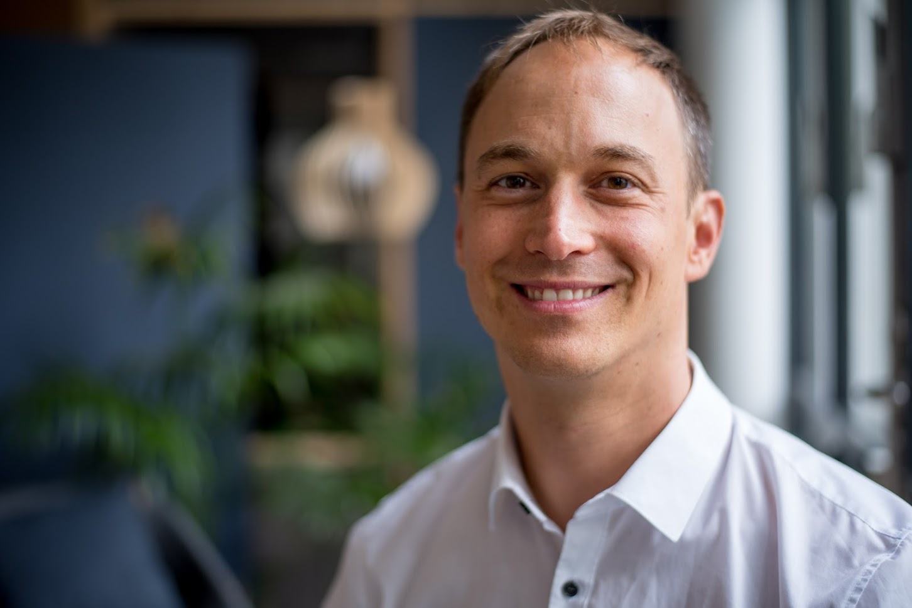
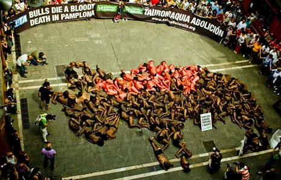
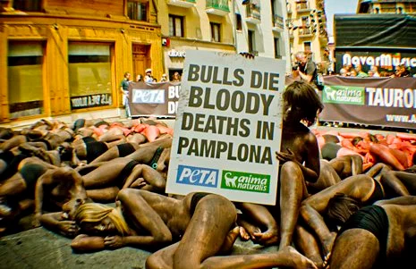
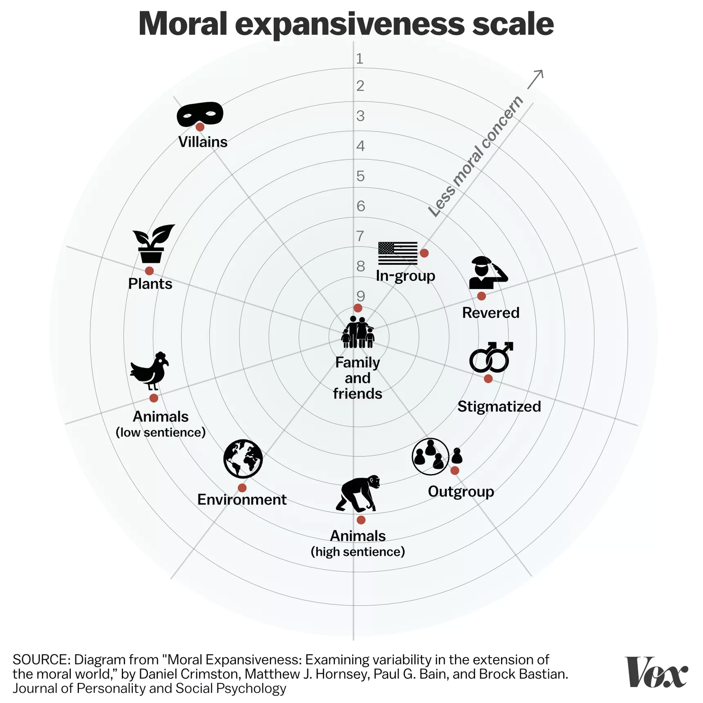
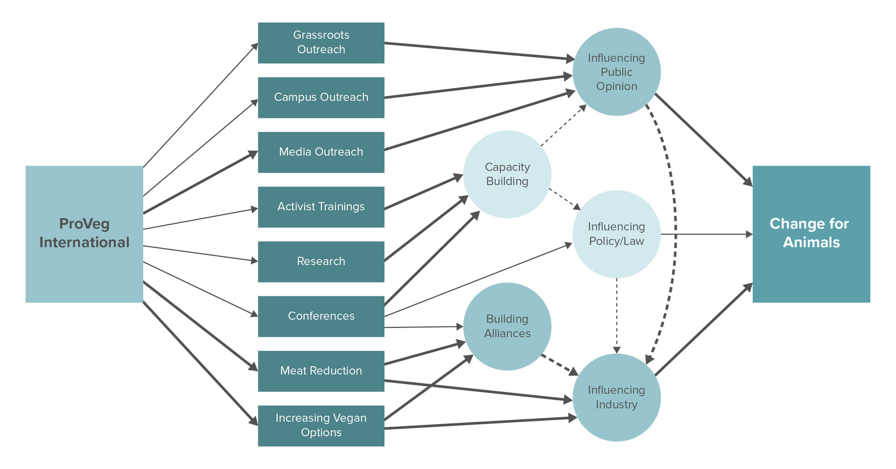
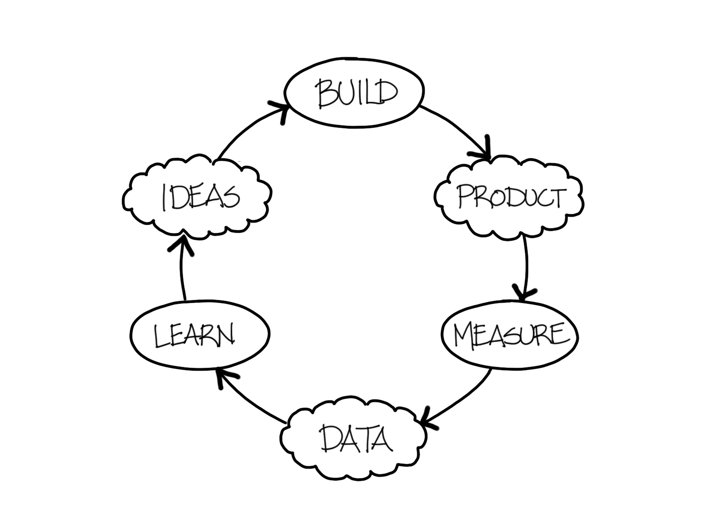

[Sebastian Joy](https://www.sebastianjoy.com/) is founding President of ProVeg International, a food awareness organisation working to transform the global food system. He is also a social entrepreneur: having developed several vegan products and helped launch the international "[50by40](https://50by40.org/)" alliance.

In this episode, we talk about Sebastian's career and the work that ProVeg does. We begin by asking Sebastian how he came to join the animal advocacy movement, reflecting on his early experiences with [PETA](https://www.peta.org/) and the German Vegetarian Society. This brings us to Sebastian's reasons for launching ProVeg. We then talk about the work ProVeg does — especially corporate engagement and how the meat industry operates. Finally, we discuss Sebastian's experiences as a "serial social entrepreneur", and he offers advice about launching and scaling up nonprofit startup ideas.

In the article below, we summarise and illustrate the key points from the episode; providing more detail and further reading for listeners who want to find out more.

## Book Recommendations 📚

- [The Lean Start Up](https://www.goodreads.com/book/show/10127019-the-lean-startup) by Eric Ries
- [How to Create a Vegan World](https://www.goodreads.com/book/show/35468340-how-to-create-a-vegan-world) by Tobias Leenaert
- [Leaders Eat Last](https://www.goodreads.com/book/show/16144853-leaders-eat-last) by Simon Sinek

 <Book url="https://www.goodreads.com/book/show/10127019-the-lean-startup" image="book-sebastian-1" spineColor='#1b743c'/> <Book url="https://www.goodreads.com/book/show/10127019-the-lean-startup" image="book-sebastian-2" spineColor='#3877ba'/> <Book url="https://www.goodreads.com/book/show/16144853-leaders-eat-last" image="book-sebastian-3" spineColor='#ffffff'/> 
 

Thanks for listening! We'd love to hear what you thought about it — email us at hello@hearthisidea.com or leave a rating below. You can help more people discover the podcast by <a href='https://twitter.com/intent/tweet?text=Check out Hear This Idea, a podcast showcasing new thinking in philosophy, the social sciences, and effective altruism! &url=https://www.hearthisidea.com via @hearthisidea&' about='_blank'>tweeting about it</a>. And, if you want to support the show more directly, consider <a href='https://tips.pinecast.com/jar/hear-this-idea'>leaving us a tip</a>.

## Discovering Animal Rights

Looking back, Sebastian tells us, he is quite surprised that he ended up dedicating his life to animal advocacy. He didn't have any special affinity for animals growing up.

> I was not really involved in animal advocacy for a long-time because I'm not particularly fond of animals — I mean I like animals, but I'm not the classical animal lover.

### Neuroscience and animals

Instead, Sebastian's turning point came later in life — especially while studying neuroscience at university. There, he learned about the growing amount of research indicating that many animals animals are conscious and capable of experiencing pain.

A notable indication of this surge in evidence and interest came in the [Cambridge Declaration of Consciousness](https://en.wikipedia.org/wiki/Animal_consciousness#Cambridge_Declaration_on_Consciousness). In 2012, a group of prominent scientists stated that "the weight of evidence indicates that humans are not unique in possessing the neurological substrates that generate consciousness".

This new perspective contrasts with traditional views about animal consciousness. Most notoriously, the early modern philosopher René Descartes argued that nonhuman animals, lacking a soul, are incapable of suffering. Instead, he [compared](https://en.wikipedia.org/wiki/René_Descartes#On_animals) them to clockwork automata: showing signs of distress without any corresponding experience. This 'Cartesian' view was widely held in Europe and North America until the [work](https://en.wikipedia.org/wiki/On_the_Origin_of_Species) of Charles Darwin eventually replaced it. However, even after Darwin, popular opinions about animal consciousness retained some of Descartes' dichotomising between human and nonhuman animals. The idea of the "[scala naturae](https://en.wikipedia.org/wiki/Great_chain_of_being)", or the 'Great Chain of Being' claimed that all species lie on a spectrum of consciousness, with humans on top. This theory has deep origins in religion, because the chain can be extended to include angels and God. This thinking has left a profound impact on how we view other species today, even in some scientific practice until [as late as the 20th Century](https://pubmed.ncbi.nlm.nih.gov/1935002/).

Modern neuroscience and biology has uncovered a more complex state of affairs. Although some animals are clearly more intelligent than others, it's not the case that we can order animals on a single scale of cognitive sophistication (or, if we could, the scale would be arbitrary and uninteresting). Instead, different species adapt in inventive ways to their various 'cognitive niches' — often trading off speed or accuracy in one mental task for skill in another. A delightful example is that chimps [perform better](https://www.newscientist.com/article/dn12993-chimps-outperform-humans-at-memory-task/) than humans in [certain tasks](https://www.cell.com/current-biology/pdf/S0960-9822(07)02088-X.pdf) designed to test short-term memory. One explanation is that humans 'traded off' visual short-term memory capacity for some other, distinctively human, cognitive skill. For more on this, we suggest reading "[Other Minds](https://www.goodreads.com/book/show/28116739-other-minds)". It explores the consciousness of Octopuses — a species that is remarkably intelligent and yet very different to us humans.

<iframe width="560" height="315" src="https://www.youtube.com/embed/nTgeLEWr614" frameborder="0" allow="accelerometer; autoplay; clipboard-write; encrypted-media; gyroscope; picture-in-picture" allowfullscreen></iframe>

### Animal suffering and history

For Sebastian, the awareness that *individual* animals can suffer just like humans do was then combined with the realisation of just how immense the *total* suffering of animals is. Sebastian points to [Peter Singer's](https://www.utilitarianism.net/utilitarian-thinker/peter-singer) *[Animal Liberation](https://www.goodreads.com/book/show/29380.Animal_Liberation)* as an especially significant influence. The book provides a powerful account of how, and at what scale, animals are killed and effectively tortured in the global food system (something we discussed at length in our [episode with Peter Singer](https://hearthisidea.com/episodes/peter) himself).

Sebastian was struck by comparisons between "speciesism" and other historic forms of systematic oppression. He explained how he routinely walked through the [Geschwister Scholl Platz](https://en.wikipedia.org/wiki/Geschwister-Scholl-Platz) during his studies — a plaza named after the [Scholl](https://en.wikipedia.org/wiki/Hans_and_Sophie_Scholl) siblings who led an [anti-Nazi resistance group](https://en.wikipedia.org/wiki/White_Rose) in Munich. While many of us might suspect we too would resisted the "groupthink" of the Third Reich, Sebastian notes that a more challenging question is to ask what "groupthink" we are giving in *today*. In particular, are there modern instances of groupthink that do not require anything as extreme as imprisonment and execution? As Sebastian puts it:

> It's easy to judge the mistakes of parents or grandparents, but what are going to be the mistakes that our future grandchildren will judge us by?

Memorial in the Geschwister Scholl Platz. Source: [Wikipedia](https://en.wikipedia.org/wiki/White_Rose)

## Early Career

Knowing that he wanted to help animals, Sebastian says it took him a long time to figure out how to act on this conviction. He started by getting involved in direct advocacy, helping PETA to raise awareness through publicity stunts. This includes the "ruining the running of the bulls" in Pamplona, shown below.

Source: [PETA](https://www.peta.org/blog/ruining-running-bulls/)

Sebastian talks about how this was a very formative and enjoyable part of his life. However, he began to question whether this was really the best way for him to contribute to the animal advocacy movement.

> There is merit to different forms of activism at different stages of the movement [...] I think it's really important to really sit down and think "Is this the most effective way I can do it?

We can split this question in two:

1. Is direct advocacy *generally* an effective way to alleviate animal suffering?
2. Is direct advocacy the most effective way for *Sebastian* to alleviate animal suffering?

Let's try answering these in turn.

### Direct Advocacy

We hear many common objections against direct activism, such as organising and joining protests and demonstrations. Most importantly from an "effectiveness" perspective: measuring the impact of direct advocacy is notoriously challenging. Consider "ruining the running of the bulls" mentioned above. How many people's attitudes are changed by this protest? How will this translate into people opposing the festival? How influential are those people? How many people do we need to convince in the first place? None of these questions have a clear answer.

Things get even more complicated. Note that the number of bulls harmed in Pamplona (although horrific) is tiny compared to the scale of animal suffering that takes place in factory farms. This is likely even true for the farm animals raised and killed in Pamplona's Navarre region of Spain. Hence, even if the activists are successful in passing a law, we might still ask if those resources could have been better spent elsewhere. On the other hand, we can view individual protests as part of a larger project, drawing out vivid animal abuse instances to help change attitudes more broadly. More complicated *still*, public demonstrations can also unhelpfully politicise and polarise topics. Indeed, PETA itself has been caught in many [controversies](https://en.wikipedia.org/wiki/People_for_the_Ethical_Treatment_of_Animals#Position_within_the_animal_rights_movement) which hurt its own image, and possibly the reputation of the broader animal movement by extension.

Clearly, it is close to impossible to even talk about direct advocacy in terms of quantifiable "effectiveness", especially ex-ante. Because of this problem, advocacy-oriented charities rarely feature at the top of [GiveWell](http://givewell.org/) and [ACE](http://animalcharityevaluators.org/) recommendations.

However, just because we don't have direct evidence that something is effective, it would be inappropriate to conclude that it's not worthwhile. The careers advice organisation [80,000 Hours](https://80000hours.org/articles/the-advocate/) notes that "many of the highest impact people in history were advocates of some kind". These include [Rosa Parks](https://en.wikipedia.org/wiki/Rosa_Parks) — a key figure in the Civil Rights movement, and [Viktor Zhdanov](https://en.wikipedia.org/wiki/Viktor_Zhdanov) — who lobbied WHO to start the smallpox eradication.

[80,000 Hours](https://80000hours.org/) also gives some [important advice](https://80000hours.org/articles/the-advocate/#whats-the-best-way-to-become-an-advocate) about the best ways to become an advocate. It notes that most of the leverage of advocacy comes from changing the behaviour of large (powerful) actors. Thus, advocates should be as close to these large actors as possible. 80,000 Hours therefore emphasises the importance of "professional" positions in areas like policy (e.g. lobbyists), the media (e.g. journalists) and foundations (e.g. grant-makers). This contrasts with the more grassroots outreach which often comes to mind when thinking of advocacy. Indeed, the usefulness of grassroots organising and advocacy is a topic of live debate within EA circles (see discussions [here](https://forum.effectivealtruism.org/posts/BQw4c9GYrpwPYG2i2/are-we-underutilizing-grassroots-style-political-advocacy) and [here](https://forum.effectivealtruism.org/posts/pnsxzyLEp9RiNqNpM/no-more-pandemics-a-lobbying-group)).

For more on direct advocacy in context to animal rights, check out [The Humane League Labs](https://thehumaneleague.org/research-reports/). This is the research arm of the Humane League, conducting independent research to improve the effectiveness of their campaigns.

### Personal Fit and Career Capital

Regarding (2), it is vital to find an area that fits our personal skills. Sebastian himself was sceptical whether direct advocacy was a good fit for him:

> I did think "What is the best way I can contribute?". And it really wasn't clear at the time. I definetly don't have the looks of Pamela Anderson and I cannot sing like Paul McCarthy — but what I could do was management.

We can think about this in terms of "[career comparative advantage](https://80000hours.org/articles/comparative-advantage/)". Sebastian chose to help create an organisation that can support the animal rights movement. In turn, this allows other, better suited, people to do the actual advocacy themselves. Formally, 80,000 Hours [defines](https://80000hours.org/key-ideas/#personal-fit) 'personal fit' as "the ratio between (a) the productivity that person would have in the job in the long-term; and (b) the average productivity of other people who are likely to take the job".

Another important related concept is the idea of 'career capital'. We might already know that we have a comparative advantage in management and a passion for animals (or some other combination of skill and cause area). But this does not mean that we should dive into this area straight away.

The name '80,000 hours' comes from the number of hours the average person works in their lifetime. And if we are looking to do the most good possible, it is critical to reflect on how this can happen *throughout* our career. It may be very worthwhile to "invest" the first 20,000 hours to acquire more skills, which allows us to use the remaining 60,000 hours to achieve far more than we would have otherwise. Indeed, it [appears](https://80000hours.org/key-ideas/#career-capital) that "most people have little impact in their first couple of jobs, while productivity in most fields seems to peak age 40-50".

For this reason, Sebastian spent a substantial part of his early career learning new skills before he set out to start his own NGO. This included getting a Master in Non-Profit management (learning theory) and working for PwC in the private sector (learning practice). He also reflects on opportunities to gain experience for non-traditional career paths, like entrepreneurship:

> [A significant challenge is] getting the right combination between gaining experience in more established settings ... I think it's really good learning the ropes with more experienced people and maybe even joining an environment that allows you to experiment. At ProVeg, we do what's called "intrapreneurship" — people working within the safety of an organisation but can conceptualise new ideas that can then be spun off to create new entities.

## ProVeg International

### Origins and Philosophy

Together with [Tobias Leenaert](http://veganstrategist.org/) and [Melanie Joy](https://www.melaniejoy.org/), Sebastian founded ProVeg International in 2017. Their idea was to merge an array of smaller national movements which they had been previously involved with. Sebastian talks about how he believed this international approach was critical to help the movement gain momentum:

> There is usually always one leading global organisation that stands for the movement. If you think about the environmental movement, you have Greenpeace and WWF. If you think of human rights, people think of Amnesty International or Human Rights Watch. But when it came to the vegan movement, there were tons of national and local brands, but not an international brand that was doing that kind of work.

It is worth noting here that ProVeg draws an important distinction in how it positions itself. Although veganism and animal advocacy have a clear overlap, ProVeg stresses that its focus is on the global food system — not directly on animal welfare. In Sebastian's words:

> We don't frame ourselves as an animal charity but as a food awareness organisation. And we follow what we call the "five pros": pro-taste, pro-health, pro-justice, pro-animals and pro-environment.

Sebastian notes how this message relates to Peter Singer's idea of [expanding the moral circle](https://en.wikipedia.org/wiki/The_Expanding_Circle). This theory describes how we weigh the interests of various groups — and how the scope of interests people have been prepared to take seriously has expanded over time (see the diagram below). **Pro-taste** aims at our current self (who we have the greatest affinity for) and **pro-health** to our future self (who we also have a clear incentive to care for). **Pro-justice** brings in care for other humans, and **pro-animals** other species. Lastly, **pro-environment** provokes us to consider future generations. These different causes help ProVeg to build-up a large moral circle and have at least something that everyone can identify with. The expansiveness of this message helps to reach many people who might otherwise be turned off by narrower messages, which e.g. appeal exclusively to animals.

You can read more about these '5 reasons' [here](https://proveg.com/5-pros/):

> This is also encapsulated in our mission, which is "a world where everybody chooses delicious and healthy food, that is good for all humans, animals and our planet" [...] If you compare this sentence to "we are fighting for a vegan world" you get much more buy-in.

Source: [Vox](https://www.vox.com/future-perfect/2019/4/4/18285986/robot-animal-nature-expanding-moral-circle-peter-singer)

### Theory of Change

Looking at what Pro Veg does, we see five main areas of action:

- **Plant and food cultivation** — This includes the [New Food Conference](https://www.forbes.com/sites/denizgulsoken/2019/04/04/slaughter-free-food-is-the-new-and-the-now-way-of-feeding-the-world/#59c1f1487321), which showcases meat-based alternative worldwide;
- **Corporate engagement** — e.g. launching the [V-Label](https://proveg.com/v-label/), which helps consumers identify vegan and vegetarian products;
- **Policy and advocacy** — e.g. successfully pushing against the infamous [Veggie Burger Ban](https://www.independent.co.uk/news/world/europe/eu-ban-veggie-burgers-campaign-disks-name-change-european-parliament-a8912116.html) in 2019;
- **Movement building** — Including the [Pro Veg Incubator](https://www.notion.so/Sebastian-Joy-def5602f67a64dba929f9c575feabcde), which helped over 40 start-ups across the world, as well as the [50by40](https://50by40.org/) international alliance;
- **Public Education and Media** — e.g. the "[Plant-Powered Pupils](https://www.businesswire.com/news/home/20181211005473/en/United-Nations-Climate-Action-Award-Germany-Time)" initiative in Germany, which helped raise awareness amongst school children.

For more on ProVeg's actions, we recommend checking their [website](https://proveg.com/what-we-do/) and [Wikipedia page](https://en.wikipedia.org/wiki/ProVeg_International). Animal Charity Evaluators (who we interviewed in a [previous episode](http://hearthisidea.com/episodes/ace/)) also conducted a [comprehensive review](https://animalcharityevaluators.org/charity-review/proveg/#comprehensive-review) of ProVeg in 2018.

Source: [Animal Charity Evaluators](https://animalcharityevaluators.org/charity-review/proveg/#comprehensive-review)

## Corporate Engagement

In our conversation, Sebastian talked about what it was like to convince big food companies like Nestlé to change their practices. For ProVeg, this kind of corporate engagement mostly involves highlighting the good of meat alternatives, rather than shaming companies for their bad practices:

> I don't know if I would use the word negotiation for what we do — maybe it's more like seduction. We try to show [companies] what others are doing and what the market potential is.

This point makes sense when we realise that ProVeg needs to have an ongoing relationship with companies in order to have any impact on them at all. But Sebastian also notes that meat companies are realising their business model is changing, and are therefore especially responsive to market-based arguments. In other words, the meat industry wants to avoid becoming the "cigarette of the future".

> Radical change usually happens for two reasons. Either there is a moral conviction — like women's rights or the abolishment of slavery, where you have a big moral outrage of a large part of society. Or this happens if something is incredibly inefficient — like Blockbusters. [...] Meat has the worst from both worlds.

Sebastian points out that very few people have a real underlying incentive to produce meat — supermarkets don't care what they sell to consumers; farmers don't care what they grow; and many meat producers can transition to plant alternatives. This should inspire some hope that food supply chains can change en masse — something we also touched upon in our [episode with Bruce Friedrich](http://hearthisidea.com/episodes/bruce). We can draw a comparison here to the dynamics behind electric vehicles:

> [Car companies] still have a lot of profit coming from the old established markets, and they then use it to invest in the new ones. It wouldn't make Mercedes a bit of profit to sell EVs and then subsidise their old diesels — it's rater the other way around. They are still selling millions of combustion engines, but their profits are used to develop better electric cars. And this is similar to what we see in the food sector.

However, this does not mean that we should assume that everybody's incentives are automatically aligned. Nor should we be so complacent in trusting the market to fully take care of things in time. Like the 'dirty' energy industry, powerful vested interests in animal agriculture are already pushing back. Nonprofits like ProVeg must also be vigilant about big food companies taking advantage of them without enacting material change. This is because the meat industry stands much to gain from "whitewashing", earning consumer trust by working with NGOs and only paying lip service in return.

I highly recommend checking out this [interview with Sharon Nuñez and Jose Valle](https://80000hours.org/podcast/episodes/animal-equality-exposing-cruelty/) for more. Working for [Animal Equality](https://animalequality.org/), they have conducted undercover investigations on animal cruelty and speak to the difficulties in getting companies to change their practices.

## Social Entrepreneurship

In the last part of our conversation with Sebastian, we discussed his experiences as a social entrepreneur. Below is some of the advice he offered.

Sebastian talks about how he tries to follow the [Lean Start-Up](http://theleanstartup.com/principles) method. This idea says that, ex-ante, you should not expect to be able to fully anticipate what part(s) of your start-up will work, and what won't. The best way to find out is to try different experiments, gain "feedback", and re-integrate the results into your product as quickly as possible. Getting a prototype ready and testing it with consumers is absolutely critical here.

> Often I don't really exactly know how it's going to end up or what I actually want to do. Often there is only a market in mind, or an idea.

Source: [The Lean Start Up](http://theleanstartup.com/principles)

------

This links to a second idea that Sebastian mentions: people are scared to share their thoughts and get advice, fearing that others will copy them. However, in social entrepreneurship this fear is irrational, and can prevent you from getting really important advice —

> Sometimes people are a bit too afraid to share their ideas because they are like "Oh my god, somebody might steal it, and somebody else might do it". I certainly had that feeling. But that's the good thing about being in the non-profit world — because you can usually say it's not about getting rich anyway. So if somebody else wants to do it, that's even better! I can then go and find another idea.

Sebastian talks about how this was a key lesson for him when he helped develop Vitamin B-12 toothpaste. Here the team's focus was not to sell a product per se, but rather to get companies to "copy" him: the help the product succeed in whoever's hands. They showed that the toothpaste [worked](https://www.b12-vitamin.com/toothpaste/) and that consumers were interested — allowing companies to go and sell it themselves.

> The amount of good you can achieve is without limits if you don't care who gets the credit.

Source: [Sebastian Joy](https://www.sebastianjoy.com/)

------

Another unique element of non-profit entrepreneurship is that you should make sure you are always at the "forefront" of your cause. In short: NGOs are ultimately trying to *put themselves out of a job*. If you are active in global development, you want to alleviate poverty; if you are fighting for animal rights, you want to end factory farming. On a smaller scale, if you are a social entrepreneur, you want to draw attention to a particular cause area in order to get larger players involved, who can then replace you.

Sebastian reflects on this lesson as the United Nations and other large international players are becoming more  [involved in reducing red-meat consumption](https://www.un.org/en/food-systems-summit) (see Action Track 2):

> If even the government notices that it's a problem we should address, then maybe we should be more at the forefront [...] Like, no government in the world would spend millions of dollars to help the welfare of fish at this stage!

Thus, as the traditional charity space becomes more croweded, social entrepreneurs should look to reorient themselves. Emerging areas here include the welfare of [fish](https://www.fishwelfareinitiative.org/) and [wild-animals](https://www.wildanimalinitiative.org/), trends which are receiving increasing support form the Effective Altruism community. Sebastian notes that this is no coincidence:

> When you know that some big funders are excited about something, that's always a good sign. And that's what I love about the EA movement, because what EA funders think is important and what is important for the world is very much in alignment. When you rely on government funding, they are never going to be at the forefront of innovation.

## Career Resources

We hope that our mini-series on animal advocacy has inspired some of our listeners to take action. To help you get started, we have collected links that highlight some great opportunities. These include full-time positions, internships, and volunteering roles. If you want to find out more ways to get involved, I highly suggest you also check out [Saulius Simcikas](https://forum.effectivealtruism.org/posts/aSBcRu4h2qH5sRypQ/effective-animal-advocacy-resources)' list of resources, and the [Animal Advocacy Careers](https://www.animaladvocacycareers.org/job-board) website. If you have anything you want to add to this list, please do let us know!

### **From the Podcast:**

- [ProVeg](https://proveg.com/):
  - Currently have a range of [open positions](https://proveg.com/job-listing/?language=en), including both freelance and permanent jobs across all seniority levels.
  - Regular Internship scheme (3-6 months). If you are a German citizen, you can also qualify for the [Federal Volunteer Service](https://proveg.com/federal-volunteer-service/) (6-18 months) to receive a monthly stipend from the government!
- [Animal Charity Evaluators](https://animalcharityevaluators.org/):
  - You can find new job opening [here](https://animalcharityevaluators.org/about/contributors/join-our-team/).
  - Regularly hire interns to help with communications and research (4-6 months). There are currently two cycles — one in January and one in March. ACE provide stipends to people in the US, Canada, UK, and Germany.
- [The Good Food Institute](https://www.gfi.org/):
  - Currently have a range of [open positions](https://www.gfi.org/jobs) encompassing development, policy, and SciTech. There is also a regular internship programme and hires and international affiliates.
  - GFI has created a [job-board](https://www.gfi.org/vocation) to highlight opportunities in the broader alt-protein field. You can even register yourself in their [Talent Database](https://airtable.com/shrSwRSv3GbTN8LBi) to help employers find you.

### Other awesome positions (full-time)

- **[Animal Advocacy Careers](http://www.animaladvocacycareers.org/)** — If you are thinking of pursuing a career in animal advocacy, this is one of the best resources out there. They have a continually updating job-board and offer [career-advice](https://www.animaladvocacycareers.org/careers-advice) as well as an [introductory course](https://www.animaladvocacycareers.org/course).

- **[Faunalytics](https://faunalytics.org/)** — If you are in academia and want to support animal advocacy through your research, this is a great resource (including for undergrad dissertations!). Not only do they have a [library](https://faunalytics.org/library/) of the existing literature (see also our [ACE write-up](https://hearthisidea.com/episodes/ace#areas-for-potential-work) on this), they also offer [one-on-one support](http://faunalytics.org/ask-us) to help you find data and design your study.

- **[Charity Entrepreneurship](http://www.charityentrepreneurship.com/blog-content.html)** — If you already have an idea for an (animal) charity or start-up, you can apply to be part of the annual [Incubator Programme](https://www.charityentrepreneurship.com/incubation-program.html). It has helped launch many of the other organisations listed here!
- It is well worth checking out some other opportunities, like [Pro Veg's incubator](https://proveg.com/incubator/), which focuses explicitly on plant-based alternatives

### Volunteering (part-time)

- **[The Humane League:](https://thehumaneleague.org/take-action)** This organisation is active worldwide, and there are several ways you can help out. You can contact your local field organiser [here](https://thehumaneleague.org/volunteer-with-us). The Humane League has been one of ACE's Top Charities since August 2012.
- **[Animal Ethics:](https://www.animal-ethics.org/volunteer/)** In addition to more formal internships, they are currently looking for volunteers to help translate documents. Animal Ethics was an ACE Standout Charity from 2015-17.

Thank you very much to Sebastian Joy for his time.

Thanks for listening <i>and</i> reading the write-up! We'd love to hear what you thought about it — email us at hello@hearthisidea.com or leave a rating below. You can help more people discover the podcast by <a href='https://twitter.com/intent/tweet?text=Check out Hear This Idea, a podcast showcasing new thinking in philosophy, the social sciences, and effective altruism! &url=https://www.hearthisidea.com via @hearthisidea&' about='_blank'>tweeting about it</a>. And, if you want to support the show more directly, consider <a href='https://tips.pinecast.com/jar/hear-this-idea'>leaving us a tip</a>.

