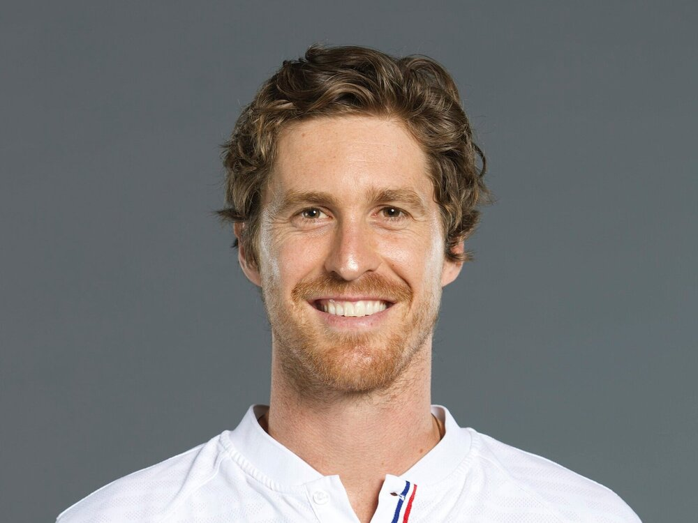
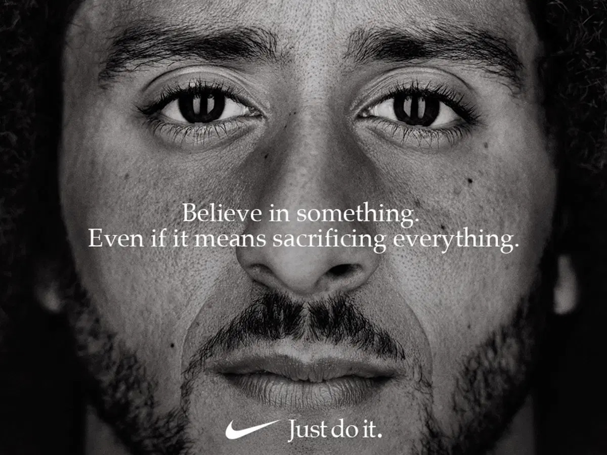
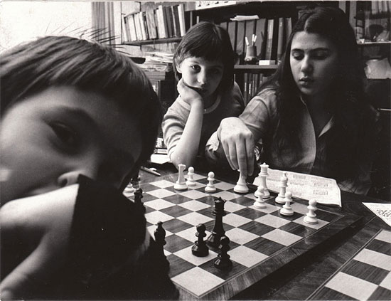
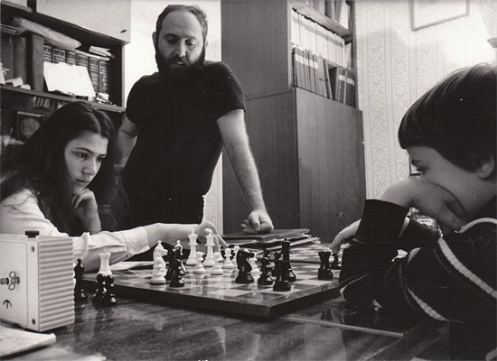
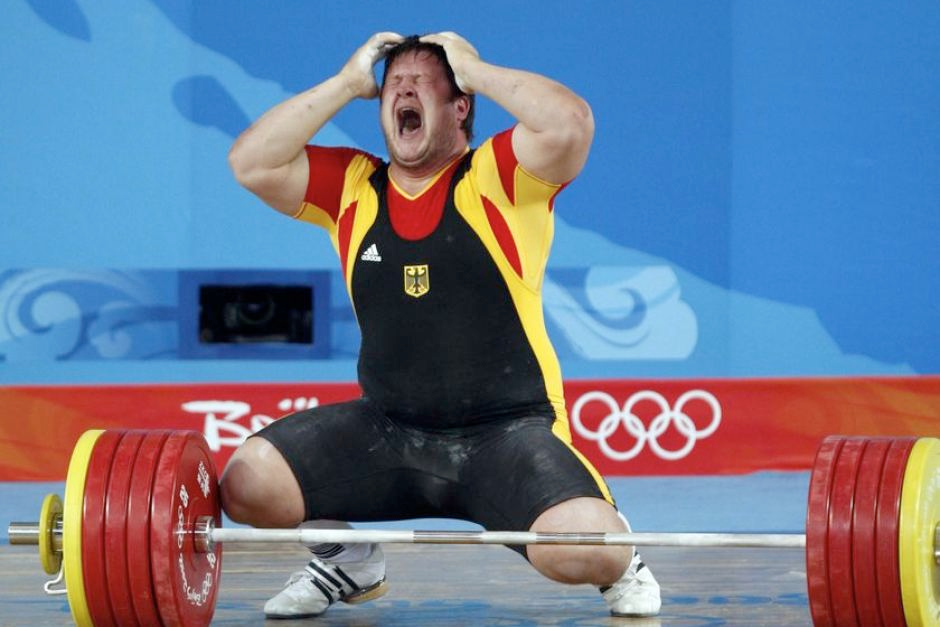

## Marcus' Recommendations 📚

- [Animal Liberation](https://www.goodreads.com/book/show/29380.Animal_Liberation) by Peter Singer
- [Meditations](https://www.goodreads.com/book/show/30659.Meditations)  by Marcus Aurelius
- [Moral letters to Lucilius](https://www.goodreads.com/book/show/46257635-moral-letters-to-lucilius) by Seneca
- The 80,000 Hours [Key Ideas Series](https://80000hours.org/key-ideas/)
  - Also available as a [podcast episode](https://80000hours.org/podcast/episodes/ben-todd-key-ideas-of-80000hours/).
- The [High Impact Athletes](https://highimpactathletes.org/) website

<Book url="https://www.goodreads.com/book/show/29380.Animal_Liberation" image="book-marcus-1" spineColor='#ffffff'/> <Book url="https://www.goodreads.com/book/show/30659.Meditations" image="book-marcus-2" spineColor='#00030b'/>
<Book url="https://www.goodreads.com/book/show/46257635-moral-letters-to-lucilius" image="book-marcus-3" spineColor='#181513'/> 
 

Thanks for listening! We'd love to hear what you thought about it — email us at hello@hearthisidea.com or leave a rating below. You can help more people discover the podcast by <a href='https://twitter.com/intent/tweet?text=Check out Hear This Idea, a podcast showcasing new thinking in philosophy, the social sciences, and effective altruism! &url=https://www.hearthisidea.com via @hearthisidea&' about='_blank'>tweeting about it</a>. And, if you want to support the show more directly, consider <a href='https://tips.pinecast.com/jar/hear-this-idea'>leaving us a tip</a>.

[Marcus Daniell](https://en.wikipedia.org/wiki/Marcus_Daniell) is an Olympian tennis player from New Zealand with 5 ATP titles, quarterfinal appearances at both Wimbledon and the Australian Open. He became involved with the Effective Altruism in 2015 and has since donated 5-10% of his annual income to effective organisations.

In January of this year, Marcus took the [Giving What We Can](https://www.givingwhatwecan.org/) pledge, committing to donate at least 10% of his annual winnings to effective organisations for the rest of his life. Alongside his tennis career, Marcus is presently completing a Masters in Philosophy.

In November 2020, Daniell founded [High Impact Athletes](https://highimpactathletes.org/), a non-profit organisation connecting athletes and the general public with the most effective, evidence-based non-profits in the world.

In the article below, we summarise and illustrate the key points from the episode; providing more detail and further reading.

## Marcus' background

Naturally, Marcus was interested in ideas from effective altruism years before he founded High Impact Athletes. We asked him about how he first began to think seriously about effective charitable giving.

Marcus related a moment which took place during a sushi dinner with friends while on tour in Tokyo. His group had been treated to rounds of sushi — serving up dishes containing fish and meat. After four or five round, chopped *whale* meat arrived on the table. Marcus balked: fish were par for the course, but something seemed especially inhumane about eating a creature most often seen on nature documentaries — "there was just something shocking about the idea". Marcus decided to pass on that particular round — "I couldn't live with myself if I ate that". Walking back to his hotel —

> I was struck by the moral dissonance there — that I couldn't bring myself to even think about eating a whale; but in that same meal, I had eaten tuna, salmon, beef — and I didn't think twice about it. For the first time in my life, that struck me as ridiculous [...] it set off a chain reaction in my mind [...] what is the moral difference there?

Reading more about the harms of animal agriculture, Marcus was especially influenced by facts about the [environmental impact](https://hearthisidea.com/episodes/bruce#inefficiencies-in-animal-agriculture). "That tipped me over the edge", he explained — and he decided to try training for two weeks without meat. Since there was no ethical defence for eating meat any more, the only remaining worry was the possibility of feeling tired or weak without animal food products. Fortunately, Marcus felt fine: [no dip in energy](https://www.mdpi.com/2072-6643/11/1/130). With this, there were no excuses left, and he made a switch to a vegetarian diet.

Later, Marcus learned more about effective altruism in general, through the [80,000 Hours](http://80000hours.org/) website. When he began to make a living through tennis, he pledged to give a proportion to effective charities through [Giving What We Can](https://www.givingwhatwecan.org/) (see also [our episode with Luke Freeman](https://hearthisidea.com/episodes/luke/)). Last year, he pledged 8%. This year, he [upped the figure to 10%](https://highimpactathletes.org/blog/i-just-pledged-to-donate-10-for-the-rest-of-my-life) — for the rest of his life.

## High Impact Athletes

How did High Impact Athletes come about? The story begins with COVID:

> For the first time in my career, that afforded me the opportunity to have a lot of time to think.

With his new free time, Marcus signed up for [Peter Singer's course on effective altruism](https://www.coursera.org/learn/altruism) through the [Coursera](https://www.coursera.org/) platform. This refreshed his commitment to the movement and prompted the question of whether there was more he can beyond giving to charities directly.

At a similar time, Marcus learned about [Raising for Effective Giving (RAG)](https://reg-charity.org/). RAG encourages pro poker players to pledge some of their winnings to effective charities, as well as providing donation advice and charity recommendations. RAG has influenced more than \$14 million to date. This inspired Marcus to think about establishing something similar in the (much larger) world of sport.

As well as the direct donations from the pro athletes who initially sign up, these athletes are also public figures. They often have enormous social media followings, and hence some ability to generate hype and awareness about a cause they care about. One hope for Marcus was that a RAG-style charity for pro athletes could help spread the ideas of effective altruism further than they had been spread before —

> I do think one of the weaknesses at the moment of EA is just how unheard-of it is. It's such a fantastic idea — it's almost a no-brainer [...] that idea should be as mainstream as we can possibly make it.

<!-- -->

So, in late 2020, Marcus founded High Impact Athletes. The mission statement is to "connect athletes and the general public with the most effective, evidence-based non-profits in the world."

> I thought this was a real opportunity to try and bring effective altruism into a more mainstream space, and hopefully sweep up millions of more people into giving effectively and doing the most good possible.

A major positive feature of HIA is its purity of message: the only motivation is to get more people to give to charities that do the most good per dollar donated. Because of this, athletes don't need to second-guess the interests of whoever is pitching HIA to them. On top of that, Marcus himself is an athlete rather than a 'salesperson'-type figure —

> I can gain access to athletes because I am an athlete. I can speak to these people on an equivalent level — I can this is something that I do, here's why I believe in it, and I would really love for you to join me. It's not coming from a manager; it's not coming from a salesperson; it's coming from one of their peers [...] it's a huge weapon in terms of onboarding.

### Concerns

If HIA succeeds, one concern is that it may 'unleash' a distorted or unfinished version of effective altruism before those ideas are properly straightened out. For instance, many people still equivocate between 'effective altruism' and 'earning to give', because ideas about earning to give were widely publicised before they were revised a little. A related worry is that, once they percolate through progressively wider and more general audiences, the ideas of effective altruism (and other comparable philosophical ideas) are going to distort, fade, and simplify. If the initial idea requires a significant amount of nuance and context, there's a worry that the distorted version could end up doing more harm than good.

But Marcus is confident this needn't be a major worry. In terms of the first worry about revision, there is an uncontroversial 'core' to EA thinking, which is very unlikely to be significantly revised, as well as a 'core' roster of cause areas and charity recommendations, which are equally unlikely to become bad calls (even if something apparently *better* calls come along eventually).

In terms of the second worry about the 'second-hand' version of the idea doing more harm than good, the solution is to emphasise the simplest and most uncontroversial claims — claims capable of being relayed on an athlete's Instagram story without being sorely misinterpreted. That means emphasising solid, well-evidenced statements about which interventions do lots of good; and it means perhaps shying away from trickier philosophical concepts.

A related question is whether HIA should therefore reference the area of effective altruism concerned with '[longtermism](https://80000hours.org/articles/future-generations/)' (like mitigating existential risk, AI safety etc.). This remains an open question, although Marcus points out that it's almost certainly best not to introduce EA *through* these more unusual ideas.

This raises a question of how the pitch for effective giving should be tweaked to suit athletes and their fans. The main audience for effective altruism is disproportionately made up of university students (a [2019 survey](https://forum.effectivealtruism.org/posts/wtQ3XCL35uxjXpwjE/ea-survey-2019-series-community-demographics-and) found over 90% had or are completing a post-secondary degree; 20% have attended one of the top 20 universities for their undergraduate studies). These people are, on the whole, unusually keen to learn about more technical, philosophical, or controversial ideas. As such, EA is often pitched by leading with those aspects. Plausibly, a less academic audience is going to respond better by leading with less abstract and more concrete, emotional appeals.

What does this look like in practice? Roughly speaking, we might imagine motivating effective giving from two directions. In the first direction, we begin with abstract principles and then work out what they imply in practice. For instance, we might decide to explain consequentialism in ethics, and consider which kinds of actions have the best consequences. In the second direction, we begin with obvious, shared, concrete cases — and consider whether they suggest general principles which can be extended to less obvious examples. Marcus' example of eating chopped whale is a great example: he began by noticing his aversion to eating one kind of animal, and then began to ask whether the moral reasons for avoiding whale meat actually extend to the animals which he didn't think twice about eating. Applied to charitable giving, most people know of a charity close to home, which does things they respect, and work on a problem they care about. Often, it's possible to show that other charities exist which, for the same donation, are able to achieve *even more* of what the other does in a comparable cause area.

### Liftoff?

The most obvious way HIA could grow in the future is through Marcus, or another member of the HIA team, reaching out to individual athletes and getting them onboard through one-on-one conversations. This is working so far — most member athletes were approached directly, rather than heard about HIA through word-of-mouth.

However, Marcus' ultimate hope is that HIA could grow faster than this in the future. Once high-profile athletes begin to come on board, they might begin to speak about their decision in the public sphere. Other athletes might then pick up on their enthusiasm, and spontaneously decide to learn about effective giving online, before approaching HIA to get involved. Also, followers of the athlete might hear about their decision to become an HIA member, and encourage other athletes to do the same.

Causes, movements, and particular charities have all enjoyed this kind of self-sustaining growth in the recent past — especially when aided by social media. If the rate of people getting involved increases indefinitely over time, some of these movements reach 'liftoff' and hit astronomical levels of support. One example is the [ice bucket challenge](https://en.wikipedia.org/wiki/Ice_Bucket_Challenge), which raised more than \$200 million for the ALS Association and other charities. Its success can be largely attributed to the viral nature of its spread through social media.

A related model for spreading support from an idea appeals to '[network effects'](https://en.wikipedia.org/wiki/Network_effect). In general, a network effect occurs whenever the usefulness or attractiveness of something depends significantly on how many people (who you know) already use it or know about it. Suppose someone invented a new messaging app with better privacy and more features. Even if you would prefer it if everyone used this new app, it still wouldn't make sense to use unless most of your friends started using it too. But when more people begin signing up to the new app, signing up yourself looks more and more attractive.

Something similar can happen with supporting some cause or movement as a public figure. If none of your peers supports the cause, then publicly supporting it looks less attractive for you: you put yourself at more risk of being ridiculed or misunderstood. But when more people voice their support, the risk of supporting it yourself goes down. Note that this can occur irrespective of how worthy the cause actually is! There is a large literature on a related phenomenon called '[peer effects](https://www.encyclopedia.com/social-sciences/applied-and-social-sciences-magazines/peer-effects)', which shows how people consistently take cues from those around them. This includes [educational outcomes](https://www.sciencedirect.com/science/article/pii/B9780444537072000037), [drug use](https://pubmed.ncbi.nlm.nih.gov/15957564/), [political views](https://core.ac.uk/download/pdf/35310896.pdf), and [crime](https://www.mitpressjournals.org/doi/abs/10.1162/REST_a_00685).

In the context of charity, Marcus mentioned that HIA member Stefanos Tsitsipas is friends with basketball player [Giannis Antetokounmpo](https://en.wikipedia.org/wiki/Giannis_Antetokounmpo), who signed a contract worth more than \$200 million with the Milwaukee Bucks. If Stefanos is able to persuade Giannis to pledge even 1% of his earnings, that's an incredible \$2 million dollars!

One example of how this network effect combines with the virality of (social) media may be the [recent support](https://www.theguardian.com/sport/gallery/2020/aug/27/nba-strike-athletes-kneeling-black-lives-matter-protest) for the Black Lives Matter movement in the world of professional sport. A major way of expressing this support has been 'taking a knee' during the U.S. national anthem. In 2016, Colin Kaepernick began sitting through the national anthem at the start of the 2016 NFL preseason, and later switched to kneeling. He received a barrage of [criticism](https://www.businessinsider.com/tucker-carlson-american-society-destroyed-by-nike-colin-kaepernick-2018-9?r=US&IR=T) from right-leaning journalistic outlets. In 2017, some players began imitating Kaepernick's gesture in solidarity. Others began wearing [t-shirts](https://www.usatoday.com/story/sports/nfl/2017/09/24/donald-trump-nfl-player-protests-national-anthem-week-3-response/697609001/) with political messages or even [remained](http://www.tennessean.com/story/sports/nfl/titans/2017/09/24/meghan-linsey-kneels-after-singing-national-anthem-titans-seahawks-game/698362001/) in the locker room during the anthem. Soon, the protests were being discussed in major media outlets, and by major political figures including [President Trump](https://money.cnn.com/2017/09/23/media/donald-trump-nfl-protest-backlash/index.html). As a consequence, issues highlighted by Kaepernick — concerning racial inequality and police brutality — received widespread coverage. Once a critical mass of players and fans began to support the protests, corporations saw an opportunity to associate with the movement through sponsorships. Most prominently, Kaepernick signed a sponsorship with Nike, and Nike's value as reflected by its share price increased by around [\$6 billion](https://www.vox.com/2018/9/24/17895704/nike-colin-kaepernick-boycott-6-billion).

One hope for HIA is to reach a similar kind of 'liftoff', where the message becomes self-sustaining. Of course, it would be a little too hubristic to expect to reach anything near the level of support that Kaepernick's protests sparked. But it doesn't seem unrealistic to expect some kind of 'inflexion point' where the idea begins to spread on its own merit — especially because effective giving is such a compelling idea!

A final, simpler, prospect for growth comes from the fact that some athletes already have a huge following, meaning that they may be able to singlehandedly influence public opinion and even policy. A good example is the English footballer [Marcus Rashford](https://en.wikipedia.org/wiki/Marcus_Rashford), who has organised a series of philanthropic initiatives. Most prominently, Rashford urged the UK government to reverse their decision to cancel the food voucher scheme for schoolchildren in 2020. A day after he wrote a letter to the government, they reversed their decision.

## Sport

In the second half of our interview, we asked Marcus about sport in general: what it's for, what it's like to be a professional athlete, and the point of watching it.

To begin with, we asked Marcus about the psychological traits required to excel at professional sport. In his answer, he emphasised the importance of being motivated, rather than depressed, by constant failure. As he points out, failure never goes away — you just get better. Nor, incidentally, does performing well at your sport get any *easier* — you just get better.

> You fail so much. If you can't deal with the failure [...], then you can't survive.

Marcus gave a great example from tennis: in 2016, Novak Djokovic had one of the most successful seasons of his career, which was one of the most successful seasons for any male tennis player ever. Proportionally speaking, how many points did Djokovic win in 2016? *[57%](https://www.atptour.com/en/news/infosys-novak-djokovic-february-2016/)*. One of the most dominant players of all time could have lost 3% fewer points, and most people wouldn't recognise his name. Similarly, you might have seen this Jordan quote pasted on the wall of a local gym —

> I've missed more than 9000 shots in my career. I've lost almost 300 games. 26 times, I've been trusted to take the game-winning shot and missed. I've failed over and over and over again in my life. And that is why I succeed. — Michael Jordan

Marcus concludes —

> Tennis is a harder testing ground than most, and I think people who can survive tennis and do well in it are well equipped to come out the back of it and do well in other areas.

### Nature or nurture?

Next, we posed an old question to Marcus: to what extent can greatness be trained? The overall answer probably isn't too interesting: in most cases, top athletes benefitted from good genes and a supportive, even pushy, environment.

More interesting are examples of how nature and nurture can lead to success. Marcus mentions the story of [László Polgár](https://en.wikipedia.org/wiki/László_Polgár), the father of the famous Polgár sisters: Zsuzsa, Zsófia, and Judit. The introductory paragraph from his Wikipedia page is worth quoting at length:

> Polgár studied intelligence when he was a university student. He later recalled that "when I looked at the life stories of geniuses" during his student years, "I found the same thing...They all started at a very young age and studied intensively." He prepared for fatherhood prior to marriage, reported People Magazine in 1987, by studying the biographies of 400 great intellectuals, from Socrates to Einstein. He concluded that if he took the right approach to child-rearing, he could turn "any healthy newborn" into "a genius." In 1992, Polgár told the Washington Post: "A genius is not born but is educated and trained….When a child is born healthy, it is a potential genius."

Polgár chose to teach his daughters chess, and they began training intensively from a young age. His efforts paid off for all three of them. Eventually, Judit and Zsuzsa became the best and second-best players in the world, respectively. [Judit](https://en.wikipedia.org/wiki/Judit_Polgár) has defeated eleven current or former world champions — she remains the only woman to have defeated even one in a rapid or classical time control. [Here](https://www.chessgames.com/perl/chessgame?gid=1009882) is her win against former world champion Viswanathan Anand. Marcus concludes —

> I really do think the winning mindset can be trained.

### Unique qualities

What are the qualities common among top sportspeople but relatively less common among other high performers? For Marcus, the answer was *focus* —

> The thing I see in all of the top tennis players is a singularity of focus that borders on, or even crosses into, obsession.

This raises the question of whether the qualities which make for a high-performing athlete are virtues *in general*. Is the kind of obsession required to become exceptionally good at tennis, football, or running, a kind of obsession that serves you well outside the court, pitch, or track? Not so clear, Marcus says — although it would be fascinating to see how Djokovic's life would have gone if sport didn't exist.

### What is sport for?

Next, we ask Marcus about what sport is good for — not just for athletes, but for everyone else.

> It's a fantastic way to release pent-up aggression. It's a rules-driven, restricted way to get an endorphin rush, to cheer and see a battle and pick sides and do all these things which are part of our animal nature, but which society necessarily represses for the main part.

Marcus also underlines the importance of doing sport for its own sake —

> We all need to play. Regardless of your age; we all need to play at something.

### Downsides

Pro athletes often figure as sources of inspiration and aspiration. This is a great thing — people draw on examples of bravery and determination from their sporting heroes to motivate themselves. Beyond this, some people are inspired to follow more directly in the footsteps of their heroes and pursue professional sport themselves. This raises a question of how often the effort required to turn pro turns out to be worth it.

The obvious point to make here is that the people who decided to turn pro who we're most likely to learn about are the people who *succeed* in turning pro. This is known as [survivorship bias](https://en.wikipedia.org/wiki/Survivorship_bias) (check out this [xkcd comic](https://xkcd.com/1827/)). We're far less likely to learn about the many more people who don't quite make it — either turning semi-pro and dropping out, or experiencing some kind of injury or setback. So there's a case that most people have a skewed impression of the *base rate* of successful attempts.

> 99.9% of the people I saw around me growing up — they're not playing tennis anymore. It's a tiny, tiny percentage of people who even get to the stage where they get a pro ranking. And it's only at the point where you get to the peak of that professional pyramid in tennis where you're actually making a living.

Even for those who succeed, the sacrifices required are enormous. In many sports, the only viable route is to begin training very often and very early. Studies take a hit, and so does the social life. And the obsession that Marcus mentions, while perhaps necessary for success, can also cause harm. Consider this despairing quote from futurist and writer [H. G. Wells](https://www.goodreads.com/quotes/7926988-the-passion-for-playing-chess-is-one-of-the-most) —

> The passion for playing chess is one of the most unaccountable in the world. It slaps the theory of natural selection in the face. It is the most absorbing of occupations. The least satisfying of desires. A nameless excrescence upon life. It annihilates a man. You have, let us say, a promising politician, a rising artist that you wish to destroy. Dagger or bomb are archaic and unreliable - but teach him, inoculate him with chess.

### The Olympics

The Olympics [cost a lot of money](https://en.wikipedia.org/wiki/Cost_of_the_Olympic_Games) (and can create a lot of [problems](https://www.investopedia.com/articles/markets-economy/092416/what-economic-impact-hosting-olympics.asp) for the host city). Between the winter and summer games, tens of billions of dollars are spent every four years. Effective altruists emphasise the amount of good that money can do when it's directed towards cost-effective charities — saving lives from tropical diseases, sending children to school, and sparing animals from the fear and pain of factory farming. Spending *billions* of dollar per year in this way could change the world in lasting and significant ways. So should effective altruists feel uneasy about putting on enormous, extravagant shows like the Olympics? Or is this just the kind of fun-hating puritanism that gives it a bad name?

Of course, nobody's suggesting we should cancel the Olympics. But it is useful to think about what makes them so valuable — what justifies their cost.

One answer is the sheer enjoyment of watching top athletes represent your country on the world stage. It's fun to discover sports you might never watch otherwise, and even better to cheer your country's athlete to victory.

> It is really the only event which showcases a vast number of sporting events to the world. Who watches javelin in any other year, except the Olympics?

Indeed, one [study](https://www.sciencedirect.com/science/article/abs/pii/S0047272719300957) found that "[H]osting the Olympic Games in 2012 has provoked a rise in the life satisfaction of Londoners, particularly around the opening and closing ceremonies." A body [of research from the LSE](https://whatworkswellbeing.org/blog/are-the-olympic-games-worth-hosting/) found similar intangible benefits — large enough to justify the cost of hosting. This included inspiring a generation of young people to pick up a sport, sparking enthusiasm for volunteering, and community engagement.

It's also important not to underrate the example set by Olympic athletes, who are normally at the Olympics because they made it their life's mission to excel at their sport. That can be a source of inspiration for many people living in comfortable economic conditions, where that level of sacrifice is rarely ever required.

> A reasonable chunk of the population doesn't have a lot of striving in their lives.

The Olympics stand alone as a truly all-encompassing, international competition. Although international events obviously exist for particular sports, none feature so many countries and celebrate so many different disciplines. And few even approach the staggering [4.7 billion viewers](https://www.nielsen.com/us/en/insights/article/2008/beijing-olympics-draw-largest-ever-global-tv-audience/) that the Beijing Olympics attracted: the largest TV audience for any event in history (other Olympics [reached similar figures](https://www.statista.com/statistics/287966/olympic-games-tv-viewership-worldwide/)).

> [The Olympics are] what I consider to be really the only truly global event that brings companies together, that has a good feeling about it on all sides — perhaps something like that is worth the cost.

The Olympics and other sporting events also play host to stories of sportsmanship, striving, and humanity like almost nowhere else. Marcus mentions a [moment](https://youtu.be/dCVlRFWOjgE) from the Rio games, in which Abbey D'Agostino (USA) and Nikki Hamblin (NZL) fall in a 5000m heat, but support each other through to the finish line.

> That literally had me in tears at the time [...] that is the absolute pinnacle; they might only get to do it once in their lives. And she stopped to turn around and help someone she didn't even know. Human stories like that — and the compassion and empathy and joy that they engender — that probably has moral weight as well.

Also worth mentioning is the story of [Matthias Steiner](https://en.wikipedia.org/wiki/Matthias_Steiner#2008), a German weightlifter. In 2007, while training for the Beijing games, Steiner lost his wife in a fatal car accident. He almost quit entirely. After resolving to keep training, he made the final of the 2008 Olympics. He failed in his attempts at other lifts, forcing him to increase the weight to 258kg on his final clean and jerk attempt in order to win gold. In a moment that's hard to watch without welling up, he completed the lift and broke down in tears. On the podium, he held a photo of his wife. You can watch a video of the event [here](https://youtu.be/lssO92BNsJc) — just make sure there's a tissue box nearby!

##### Matthias Steiner

Lastly, Marcus speculates about another potential benefit of an event like the Olympics. Because they bring countries together in a uniquely positive, celebratory way — is there a case that they actually reduce international tensions and encourage cooperation? And does that mean that the Olympics reduces the risk of nuclear war? That's a more speculative benefit of the Olympics, but it sounds like a suggestion where more research is needed! [This article](https://www.apa.org/international/pi/2012/10/un-matters) is a good start.

### Why watch sport?

For outsiders to the world of sport, the rituals associated with spectating it — and the bitter animosities of supporting teams — can seem totally alien. Where does the enjoyment come from of watching a ball bounce back and forth over a net, or up and down a pitch? And how does that enjoyment occasionally tip into obsession?

Marcus' partner happens to be a student of theology at the University of Cambridge, and Marcus mentions that she had written a poem about the '[soteriology](https://en.wikipedia.org/wiki/Soteriology) of tennis'. Soteriology is the study of religious doctrines of salvation. The comparison between religious rituals and sports spectating is striking and amusing. Take a church service: the crowd is the congregation, the umpire the priest. Everyone's eyes are drawn together watching the same thing and hoping to catch a glimpse of something that rises above normal worldy living: a moment of divine inspiration, or some inspired play that comes out of nowhere.

The novelist and essayist David Foster Wallace once wrote a brilliant article along these lines called '[Roger Federer as Religious Experience](https://www.nytimes.com/2006/08/20/sports/playmagazine/20federer.html)'. Here he lays out his claim —

> The specific thesis here is that if you’ve never seen the young man play live, and then do, in person, on the sacred grass of Wimbledon, through the literally withering heat and then wind and rain of the ’06 fortnight, then you are apt to have what one of the tournament’s press bus drivers describes as a “bloody near-religious experience.” It may be tempting, at first, to hear a phrase like this as just one more of the overheated tropes that people resort to describe the feeling of Federer Moments. But the driver’s phrase turns out to be true — literally, for an instant ecstatically — though it takes some time and serious watching to see this truth emerge.

There is substance to all of the above. Sociologists, psychologists, and scholars of religion are increasingly pointing to the many real similarities between sport fandom and religious membership. Here is sports psychologist [Wann (2001)](https://www.researchgate.net/publication/259578993_The_relationship_between_sport_team_identification_and_need_to_belong) —

> The similarities between sport fandom and organized religion are striking. Consider the vocabulary associated with both: faith, devotion, worship, ritual, dedication, sacrifice, commitment, spirit, prayer, suffering, festival, and celebration.

The founding sociologist Émile Durkheim invoked a useful concept for this comparison: the idea of a 'totem' —

> On the one hand, [the totem] is the external and tangible form of what we have called the... god. But on the other, it is the symbol of that particular society we call the clan. It is its flag; it is the sign by which each clan distinguishes itself from others, the visible mark of its personality.

Religious totems abound: the Star of David, the Christian cross. And so do totems in sport: team colours, chants, traditions. As [one Atlantic article](https://www.theatlantic.com/entertainment/archive/2013/01/just-how-much-is-sports-fandom-like-religion/272631/) puts it —

> [O]ur religious totems, while "officially" symbolizing deities, also implicitly offer vessels for fellowship; licenses to congregate together. As social creatures, there is something universal—and still enduring—in that tribal yearning. Yet the community is often more abstract and imagined than concrete and identifiable.

Here is psychologist [Jonathan Haidt](https://www.goodreads.com/book/show/11324722-the-righteous-mind) —

> [T]rying to understand the persistence and passion of religion by studying beliefs about God is like trying to understand the persistence and passion of football by studying the movement of the ball.

And here is our very own Marcus Daniell —

> Everyone is reacting spontaneously and outwardly and gregariously. Everyone's on their feet, gasping and screaming. It's sort of out of your control, and it picks everyone up. There's this energy and electricity that happens that's hard to explain.

Remarkable, Durkheim had talked about the very same phenomenon in the context of religion, even using the word "electricity". He called it "collective effervescence" — moments of totally shared outpourings of emotion. This requires two ingredients: on the one hand, relative *anonymity*: it's far easier to express more 'embarrassing' emotions when you're part of a crowd of strangers. On the other hand, a shared aim or object of devotion — we need something beyond ourselves to express emotion *about*. It should be clear how church pews and stadium seats play very similar roles.

So sport provides a socially acceptable environment to feel intense group membership, celebration, and vicarious competition. Nearer the end of the interview, we ask whether it can ever also play host to moments of 'beauty' or 'artistry'. Marcus' answer is 'yes', but it's a special kind of artistry —

> It's not a rehearsed thing; it's poetry and flows reacting to external circumstances.

David Foster Wallace agrees —

> Beauty is not the goal of competitive sports, but high-level sports are a prime venue for the expression of human beauty. The relation is roughly that of courage to war.

## Studying philosophy

In the last part of our interview, we talk about studying philosophy. Marcus has recently started on a (remote) philosophy master's degree, and explained that a major motivation was to better explain the ethical ideas that he was advocating for —

> As a vegetarian, I've spent a lot of time banging my head against the wall speaking to people who are interested in vegetarianism but don't change their behaviours even if they agree with the arguments [...] so I think part of it was — how can I be more articulate about vegetarianism or any other ethical position that I would enjoy seeing people pick up on.

In addition, Marcus mentions that studying certain kinds of philosophy can also teach you to *live better.* Ancient philosophy especially blurred distinctions between what would now be called 'self-help' and philosophy. Nowadays, by contrast, there is little room in academia for writing books or papers speculating about how to live a flourishing life. Marcus mentions the recent resurgence of stoicism: a philosophy which emphasises resolution and equanimity in the face of hardship, and that "virtue is the only good". Apparently, one book, in particular, has become a cult favourite in the [NFL](https://www.si.com/nfl/2015/12/08/ryan-holiday-nfl-stoicism-book-pete-carroll-bill-belichick) and the wider world of professional sport. The book is called [The Obstacle is the Way](https://www.goodreads.com/book/show/18668059-the-obstacle-is-the-way) by Ryan Holiday, and the subtitle is *The Timeless Art of Turning Trials into Triumph.* But stoicism has not been the only guide for Marcus and other athletes: he also mentions the influence of Buddhist concepts, like the idea of the 'second arrow'. The Buddha once [taught](http://blog.tarabrach.com/2011/08/learning-to-respond-not-react.html): “If you get struck by an arrow, do you then shoot another arrow into yourself?”. The Buddhist meditation teacher Tara Brach elaborates —

> If we look at the way we move through the day, when something happens, when we have pain in our body, when somebody treats us in a way that feels disrespectful, when something goes wrong for someone we love, that’s the first arrow. Our mind and body go into a reactivity that does not help to bring healing. We blame others; we blame ourselves. That’s the second arrow.

Thank you very much to Marcus Daniell for his time.

## Resources

- The [High Impact Athletes](https://highimpactathletes.org/) website
- [HIA job listing for Director of Operations](https://highimpactathletes.org/jobs)
- [Peter Singer teaches Effective Altruism](https://www.coursera.org/learn/altruism) on Coursera
- [Simon Hampton chats Charity, Covid and Competition with Marcus Daniell](https://youtu.be/a1FBsvLmGBU)
- [High Impact Athletes](https://twitter.com/HIAorg) on Twitter
- [Introducing High Impact Athletes](https://forum.effectivealtruism.org/posts/Fm3HWDZKtwdkvBzGL/introducing-high-impact-athletes) — Marcus Daniell
- [Marcus Daniell](https://twitter.com/MarcusDaniell) on Twitter
- [Just How Much Is Sports Fandom Like Religion?](https://www.theatlantic.com/entertainment/archive/2013/01/just-how-much-is-sports-fandom-like-religion/272631/) — Michael Serazio
- [Olympic truce](https://en.wikipedia.org/wiki/Olympic_Truce)

Thanks for listening <i>and</i> reading the write-up! We'd love to hear what you thought about it — email us at hello@hearthisidea.com or leave a rating below. You can help more people discover the podcast by <a href='https://twitter.com/intent/tweet?text=Check out Hear This Idea, a podcast showcasing new thinking in philosophy, the social sciences, and effective altruism! &url=https://www.hearthisidea.com via @hearthisidea&' about='_blank'>tweeting about it</a>. And, if you want to support the show more directly, consider <a href='https://tips.pinecast.com/jar/hear-this-idea'>leaving us a tip</a>.

