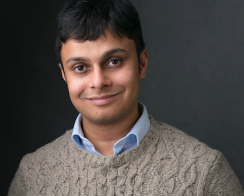
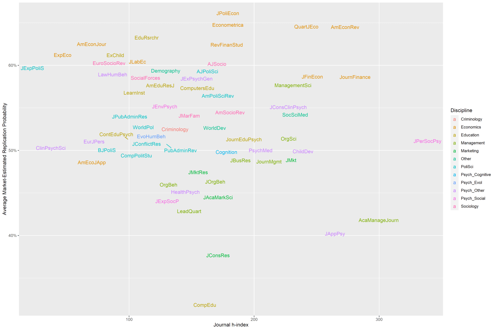

Nikhil Krishnan is a lecturer at the Faculty of Philosophy, University of Cambridge, and Fellow in Philosophy at Robinson College. He also [writes](https://www.notion.so/Nikhil-Krishnan-845050fce07d4d13962724401583d92e) on on history, literature, and culture. His first book, provisionally titled *A Terribly Serious Adventure*, tells the story of philosophy in Oxford from 1900 to 1960.

In this episode, we discussed two broad topics. In the first half, Nikhil relates some of this history of 20th century Oxford philosophy — and, by extension, the history of 'analytic' or 'linguistic' philosophy. In the latter half, we consider some questions about the present and future for academic philosophy, the role of universities, and the place of the peer-reviewed journal.

In the article below, we summarise and illustrate these key ideas; providing both more detail and further readings for listeners who want to find out more.

Thanks for listening! We'd love to hear what you thought about it — email us at hello@hearthisidea.com or leave a rating below. You can help more people discover the podcast by <a href='https://twitter.com/intent/tweet?text=Check out Hear This Idea, a podcast showcasing new thinking in philosophy, the social sciences, and effective altruism! &url=https://www.hearthisidea.com via @hearthisidea&' about='_blank'>tweeting about it</a>. And, if you want to support the show more directly, consider <a href='https://tips.pinecast.com/jar/hear-this-idea'>leaving us a tip</a>.

## Nikhil's Recommendations 📚

- [Wittgenstein](https://letterboxd.com/film/wittgenstein/)  (1993) directed by Derek Jarman
- Bernard Williams on the [Spell of Linguistic Philosophy](https://youtu.be/IVY6t-DaeZw) (1977)
- [English Philosophy in the Fifties](https://www.radicalphilosophy.com/article/english-philosophy-in-the-fifties) by Jonathan Rée

 <Book url="https://letterboxd.com/film/wittgenstein/" image="book-nikhil-1"/> <Book url="https://youtu.be/IVY6t-DaeZw" image="book-nikhil-2" /> <Book url="https://www.radicalphilosophy.com/article/english-philosophy-in-the-fifties" image="book-nikhil-3" spineColor='#ca99b9'/> 
 

## Some history of (Oxford) philosophy

### Philosophy at the turn of the century

We began by considering the state of philosophy at the turn of the 20th century. At this moment in history, Nikhil explains, academic philosophy was stuck in a considerable rut. The dominant question of the time was which of two broad metaphysical theses — '[realism](https://plato.stanford.edu/entries/idealism/)' or '[idealism](https://plato.stanford.edu/entries/idealism/)' — was true. In practice, this limited the scope of philosophical discussion. The details aren't so important (see [here](https://plato.stanford.edu/entries/realism/) and [here](https://plato.stanford.edu/entries/idealism/) for more). What matters is that it had continued at an impasse for years, and the situation was as unproductive in Oxford as it was elsewhere —

> The people who want to do [philosophy] don't have very much to say. They feel like everything that's worth saying has been said by somebody else ... people generally think of themselves as making the same moves again and again.

This might seem surprising, given that philosophers are unusually free to write about whatever topic interests them. Why then did they waste their energies on a debate which had already swallowed so many leading thinkers whilst showing little sign of progress?

> Why was it so hard to change things? I think the most plausible answer is [...] inertia. Why was there this inertia? One answer is the nature of the institutions in which philosophy is done, and the extent to which these institutions encourage innovation.

Nikhil continues —

> [It happens] when you think there's no other question worth pursuing. Perhaps what's worse is when you think that doing philosophy means taking a position on that debate, and then just defending the positions of one's party. It feels like a partisan or tribal conflict, when what you should be trying to do is get to the right answer — and who knows, the answer might be something other than one of the available '-isms', or it might involve changing or rejecting some of the things that other people have said — even if they belong to your 'party' or 'tribe'.

Much of 1900s Oxford's failure to innovate and move past 'partisan' squabbling was due to its methods of teaching. This "training" was geared towards preparing cohorts of young men for careers in the civil service, the clergy, even the colonial service. As Nikhil points out, it's hard to see how ideals like innovation or novelty would be highly valued in such vocations, and so there's reason to expect they were valued in teaching either. 

Further, most philosophers at Oxford spent the overwhelming majority of their time teaching philosophy, rather than doing it — "there aren't many incentives to go and write your own stuff". Teaching at Oxford took the form of 'tutorials': hour-long one-on-one meetings between student and teacher. For all its benefits, this is a time consuming way to teach, and consequently "many of these people just did nothing else." In sum —

> Nothing in the self-conception of the institution made innovation possible, none of it encouraged it.

### The 'linguistic turn'

Early in the 20th century, things began to change. A new kind of philosophy spread through Oxford, and the rest of the English-speaking philosophical world. These new methods turned away from lofty metaphysical questions and towards questions about what our words *mean*, and how we ought to use them. This '[linguistic turn](https://en.wikipedia.org/wiki/Linguistic_turn)' continues to shape much of modern philosophy.

Yet this change did not come from England itself, but began even before the turn of the century, in Germany. An eccentric and relatively unknown logician called Gottlob Frege had been considering the meaning of numerical propositions — sentences with numbers. We can apparently make good sense of these sentences, and this had suggested to previous philosophers that we therefore need to answer questions like 'what are numbers?', and answer them in metaphysical terms.

The philosopher Michael Dummett [claims](https://projecteuclid.org/download/pdf_1/euclid.rml/1204835288) that the linguistic turn can be traced to a single paragraph of Frege's work, in his book called *[Grundlagen](https://en.wikipedia.org/wiki/The_Foundations_of_Arithmetic) (The Foundations of Arithmetic)*. In this paragraph, Frege realises: rather than answer questions about numbers as 'things', can't we just understand their meaning by how they contribute to the meaning of sentences they appear in? And is there any residual metaphysical mystery after we get clear on how numerical language works?

> The hope is that once we answer these questions about how our language works, we'll realise that we've basically said everything that we need to say. What more is left of the question of "what are numbers?" once you know exactly how we do and should think about them? ... It counts as a linguistic turn because it moves away from talking about 'things'  ... and instead you start thinking about your words ... instead of asking "what is this thing called goodness", you ask yourself "what does 'good' mean"?

Frege developed a new way of doing philosophy, which focused on analysing how words and symbols work, and ought to work — particularly as applied to mathematics. This was the groundwork for the linguistic movement that then came to dominate and define Oxford philosophy.

Frege's methods arrived in England by Bertrand Russell at the University of Cambridge. University of Cambridge. Russell, one of the most famous intellectuals of the twentieth century, discovered Frege's work, and was taken by its new methods. Inspired, he joined with the philosopher A. N. Whitehead to embark on an [ambitious task](https://en.wikipedia.org/wiki/Principia_Mathematica): (roughly) grounding maths in logic. They failed, but that is a story for another episode! In any case, Russell began to realise that Frege's methods of analysis could be applied fruitfully beyond maths — to questions about ethics and metaphysics, for instance.

> Once people start getting the hang of the kind of thing Russell is doing, it doesn't matter so much whether they're reading Russell or not — the ideas are in the air, they're part of the currency, they're in the conversation ... Even if you're not particularly interested in the actual maths ... you can still get something of the spirit of the kind of analysis that Russell and others were doing.

In short, this was an optimistic new vision for doing philosophy: it was out with incomprehensible deepisms and multi-syllable German words, and in with precise analysis of language. The idea behind this was that most of us use words sloppily and inconsistently, in large part because we don’t learn language by memorising rules (nor do we need to). That sloppiness leads to confusions and ambiguities; and these in turn generate philosophical ‘problems’. The solution? For each contentious word, grammatical construction, or concept; spell out in perfect clarity what it means and how it works: like a mechanic taking apart an engine to discover what’s causing trouble. The hope was, in piecemeal fashion, to re-construct natural language in unambiguous terms.

Students in philosophy soon picked up on Frege's insights, with Russell as his mouthpiece. As Nikhil mentions, it is natural that this formal, rigorous mode of philosophy should originate in Cambridge rather than Oxford. This is because in Oxford, effectively the only way to study philosophy was as part of a broader humanities degree, like classics.

> As a result, you can get through these four years of university education, and indeed many years of school education, without encountering any maths or any science.

By contrast, in Cambridge, many prominent philosophers were originally trained as mathematicians. And so, Cambridge philosophy took on a much more analytical flavour.

But not everybody doing philosophy in Oxford was pleased with this state of affairs. A bright young student called Gilbert Ryle, initially a classics student when he arrived at Oxford in 1919, had begun to read some of the work that was emerging from Cambridge. Excited by what he found, he begins to spread ideas about 'linguistic analysis' in his own university. He began with a paper drily titled '[Systematically Misleading Expressions](https://sites.ualberta.ca/~francisp/NewPhil448/RyleSystemMisleadExpr32.pdf)'.

Ryle suggests we consider sentences like "unpunctuality is reprehensible", and "virtue is its own reward". Grammatically, they seem on a par with sentences like "ice cream is tasty" — ice cream being a thing in its own right. But he points out that it would be absurd to infer from the grammatical resemblance of "unpunctuality is reprehensible" to "ice cream is tasty" that "unpunctuality" is a *thing*. It's not a *thing* at all — not even some mysterious essence. What the sentence "unpunctuality is reprehensible" really means is something like: "whoever is unpunctual deserves that other people should reprove him for being unpunctual". Similarly, the sentence about virtue means something like "whoever is good, gains something by being good". You can imagine further analysing "is good" in un-mysterious terms too. In short: it's not necessary to think that 'virtue' is some mysterious *thing*, once you properly analyse the language. Few people mistakenly infer that 'unpunctuality' is a mysterious essence from reading off the grammatical form of sentences about unpunctuality. But, Ryle would later argue at length in his *[The Concept of Mind](https://www.goodreads.com/book/show/695125.The_Concept_of_Mind)*, people easily commit this blunder when they talk about the mind. From using language like "she has a sharp mind", and "he has many deep thoughts", we are misled into thinking that "minds" and "thoughts" are mysterious essences — or 'things' of any kind.

As Nikhil explains, this apparently innocuous development gave a new generation of philosophers a foothold to get started in new directions —

> Why I think it seemed exciting is that it actually gave philosophers something to do.

### An example of analysis

Perhaps the most famous application of these methods of linguistic analysis is given by Bertrand Russell's paper '[On Denoting](https://www.uvm.edu/~lderosse/courses/lang/Russell(1905).pdf)'. The legendary polymath [Frank Ramsey](https://en.wikipedia.org/wiki/Frank_Ramsey_(mathematician)) called it a “paradigm of philosophy”. For philosopher Peter Ludlow, it is “*the* paradigm of philosophy”. 

Russell's question was how to analyse 'denoting phrases' — basically sentences containing the word 'the'. By 'analyse', he is interested in some procedure for figuring out when such sentences are true or false, given all the relevant factual knowledge. As Russell points out, any answer must be able to handle cases where the sentence tries but fails to denote anything. 

Here's an example: "the present king of France is bald". A naive answer might say: in instances of "the $F$ is $G$", assume "the $F$" points towards something, and then work out whether that thing is $G$. Indeed, in some cases it may work without a problem. "The spotty dog likes to play fetch" — find the spotty dog and find out if it indeed likes to play fetch. Unfortunately, this naive approach gets hopelessly muddled. What if there are two spotty dogs, and only one likes to play fetch? Is the sentence true or false then?

What about "the present king of France is bald"? What does the phrase "the present king of France" point towards? Some idea of a possible but inexistent present king of France? If so, is that idea bald or not? Do non-existent monarchs tend to have hair? It seems very hard to unambiguously answer whether the sentence is true or false (Russell can't help adding that “Hegelians, who love a synthesis, will probably conclude that he wears a wig”). A natural response is to update the pointing account — *first* you figure out if the thing the sentence is trying to point to is real, and if it isn't real, then apply some other method. Russell points out that “a phrase is denoting solely in virtue of its form”. This won't do. Without knowledge of the world, you clearly cannot read off the grammar of a sentence to find out whether it’s talking about something real. A computer being fed sentences would need to tell how to analyse the sentence just by looking at the sentence. It couldn’t first understand the sentence in order to figure out how to go about understanding it.

Russell’s proposes an alternative to the ‘pointing’ view of definite descriptions. Take a sentence of the form “the $F$ is $G$”. We want to break this down into simpler statements, which a computer might find easier to understand and evaluate. Here’s an initial step:

1. There’s exactly one $F$;
2. That $F$ is $G$.

This is better, but (2) is still ‘pointing’ to something; and pointing is vague and problematic. Here’s an improvement:

1. There’s exactly one $F$;
2. All $F$s are $G$.

This would be a weird thing to actually say, but notice that if there really is just one $F$, then “all $F$s are $G$” is true exactly when “the $F$ is $G$” is true. And no more pointing — progress! We might break the first sentence down further:

1. There’s at least one $F$;
2. There’s at most one $F$;
3. All $F$s are $G$.

Take a moment to consider how this would 'translate' sentences like "the spotty dog likes to bark", and "the present king of France is bald". Just for fun, here's how Russell's analysis of definite descriptions gets expressed in symbolic notation —

$$\exists x(Fx \wedge \forall y(Fy \rarr x=y) \wedge Gx)$$

Hopefully the above helps to give an impression of what this new kind of philosophy looked like.

### Positivism and Ayer

While Russell and his acolytes were developing their brand of maths-infused analysis in Cambridge, a new offshoot from the linguistic turn was growing up in Vienna. This was the so-called '[Vienna Circle](https://plato.stanford.edu/entries/vienna-circle/#Per)' of '[logical positivists](https://plato.stanford.edu/entries/logical-empiricism/)'. What united the group was a respect for scientific methods in delivering knowledge and shaping society, and a strong suspicion of any kind of (unscientific) 'metaphysics' — talk of God, freedom, goodness, and so on. Yet, unlike the empiricists of the previous century, the *logical* positivists were inspired to place the methods of mathematics and logic on the same firm footing as science. The result was roughly the following: a claim is meaningful *just in case* either it's empirically testable (through scientific observation), or it's a logical truth (like "all bachelors are unmarried"). With these 'lego bricks' of particular sense impressions, we can construct grand scientific theories: everything flows from what's in front of our eyes. And if your claim doesn't fit those criteria, all the worse for your claim!

Indeed, the Vienna Circle's appreciation for scientific methods influenced their approach to *doing* philosophy —

> You come up with theories, you test them through experiment. That's the kind of method we want in philosophy in the same way as in anything else. What you *don't* do is to close your eyes, sit in your armchair, and use some mysterious faculty of intuition to just commune with these eternal truths.

In 1933, Gilbert Ryle in Oxford had read about the Vienna circle, and encouraged one of his tutees, [A. J. Ayer](https://plato.stanford.edu/entries/ayer/), to travel to Vienna on a fact-finding mission. Despite his patchy knowledge of German, Ayer was taken by what he learned. Shortly afterwards, he wrote a short and inflammatory book called *[Language, Truth, and Logic](https://en.wikipedia.org/wiki/Language,_Truth,_and_Logic)*. In the book, Ayer espouses logical positivism and marked a clean break with the stuffy, highfalutin dons of old.

##### The Radcliffe Camera and All Soul's College in Oxford

### The Second World War

Three short years after the publication of *Language, Truth, and Logic*, Britain entered the Second World War. As a consequence, Oxford was emptied out of a couple of generations of philosophers, as they left university to join the war effort.

We asked Nikhil about how this qualitatively changed the kind of philosophy that continued throughout the war. As he points out, the most significant change was that women became far more prominent, as their male counterparts left in greater numbers. Nikhil relates an observation of the philosopher [Mary Midgley](https://en.wikipedia.org/wiki/Mary_Midgley) —

> The reason their generation was almost unique was that they got the chance of a proper education where they weren't bullied into silence or submission.

In turn, this demographic change led to a change in how philosophy was conducted. Nikhil describes how, before the war, philosophy took on an unhealthily adversarial, even 'macho, spirit. There was lots of posturing, and a fixation on "showing people up" and "beating them" at any cost.

> The whole tone of things is changed. It's no longer about winning or humiliating your opponent. The way Mary Midgley puts it is that we could actually get started in looking for the truth, and in a cooperative spirit.

One lens through which to view these changes is ethics. Recall the criteria for meaningfulness given by the Vienna positivists: if it's not scientifically testable or logically true, then it's meaningless. Of course, ethical claims like "it's wrong to murder" failed this test. It just cannot be literally true (or false) that murder is wrong. One response is to give up on the possibility of interesting or productive philosophical conversations about object-level ethical questions. This was Ayer's view — he thought that sentences like "murder is wrong" don't try to make a true-or-false claim, but rather express an attitude: something like "Murder? Boo!". According to Ayer, disagreements about whether murder is wrong are on the same footing as disagreements about what flavour of ice cream is best.

> There's no truth, and if there's no truth, then what are we doing disagreeing?

Others, like R. M. Hare, viewed ethical language as a system of prescriptions: less "murder is wrong" and more "I implore you not to murder". This allowed a little more structure to enter in, because prescriptions can be 'universalised' (I should commit to endorsing my prescriptions even if *I weren't me*).

We discuss R. M. Hare's prescriptivism in the '[Moral Realism](https://hearthisidea.com/episodes/peter#moral-realism)' section of our Peter Singer write-up. Singer was a student of Hare, but changed his mind away from prescriptivism.

In any case, the influence of the Vienna circle was to taboo the serious full-blooded investigation of ethical questions as a proper philosophical activity. During the war, philosophers like [Philippa Foot](https://plato.stanford.edu/entries/philippa-foot/), [Elizabeth Anscombe](https://plato.stanford.edu/entries/anscombe/), [Mary Midgley](https://en.wikipedia.org/wiki/Mary_Midgley), and [Iris Murdoch](https://en.wikipedia.org/wiki/Iris_Murdoch) all resisted this sceptical, linguistic turn. Instead, they launched ethics in a new, 'naturalistic' direction. Ethics, they claimed, should involve psychology, and even talk of *human nature*.

> That doesn't involve a laboratory, it involves this careful project of self-understanding.

### Elitism

Next, we ask Nikhil about elitism in 20th century British philosophy. First, virtually all the characters that make up the history of Oxford philosophy in this period are conspicuously wealthy and powerful: often skipping from Eton to Oxford, or descending from aristocracy. Apparently none of the major philosophers of this time arrived from anything less than an upper-middle class background. Second, the story of English-speaking philosophy in the first half of the 20th century basically *is* the story of Oxford and Cambridge philosophy (with some exceptions, of course).

On the first point, Nikhil points out that class differences reflected much the rigid class structure of the time: it just was the case in general that elite universities like Oxford were dominated by very well-off students. This is clearly regrettable, not least because it meant that less talented but better connected applicants were more likely to receive a place than more promising but worse-off applicants.

On the second point, Nikhil mentions that the fact that philosophical progress was so centralised in a few places was less obviously regrettable. One benefit of concentrating philosophers in only a few central places is the '[economies of scale](https://en.wikipedia.org/wiki/Economies_of_scale)' and '[network effects](https://en.wikipedia.org/wiki/Network_effect)' that academic hubs provide. Once some university reaches a critical mass of academics who benefit from talking and working with one another (e.g. from arguing about their ideas, sharing insights and research, sharing out administrative work), then even more academics are going to be attracted towards it, knowing they will work better at such a place than on their own.

As Nikhil points out, there's an analogy to startup 'hubs' here: a startup is more likely to succeed when its founders are surrounded by similar startups, like-minded people, and infrastructure which makes it easier to start that kind of company. As such, certain cities or regions are known as 'the place to be' for starting a certain kind of company. Most famously, the '[Silicon Valley](https://en.wikipedia.org/wiki/Silicon_Valley)' area in California serves as the best-known centre for information technology startups and established companies in the world. An outsider might bemoan the fact that so many successful tech companies emerge from Silicon Valley, and so few from elsewhere, but an accusation of 'elitism' misses the mark. To an extent, the analogy extends to philosophy in Oxford.

> One of the things this tells us is that it's actually really hard to do philosophy on your own ... in practice, it's rarely been the case that people have managed to reach these deep, novel insights just be thinking by themselves. When exciting developments happen is when people are together with other people asking similar questions, getting challenged. That tells us something interesting and I think quite positive about philosophy, which is that philosophy is not a discipline which involves pure solitary thought but one that involves conversation and cooperation.

However, doing philosophy collaboratively works best when disagreement isn't penalised, and when it is done in conditions of intellectual diversity. Adding extra people to the group won't improve the standard of thinking if those extra people think, or at least say, exactly what everyone else is already thinking or saying. Indeed, Oxford was clearly lacking such intellectual diversity at the start of the 20th century. Nikhil explains —

> The big problem is when you stop realising that you're making assumptions or the way in which you do philosophy has presuppositions. And the best way to become aware of the assumptions you're making is by being in the presence of people who don't share those assumptions. And if you don't have those people, and you just have people who agree with you about pretty much everything, then you won't have any disagreement ... I don't think that's healthy for any kind of intellectual enquiry.

## Academic Philosophy — Present and Future

In the second half of our conversation, we consider what the history of philosophy can tell us about how it's done today. We began by asking about lectures. [Henry Sidgwick](https://plato.stanford.edu/entries/sidgwick/) had written a "Lecture against Lectures" in the late 19th century. As Nikhil relates his case —

> If all you're doing is reading things off a piece of paper ... why don't you just publish this stuff? Let people read at their own pace, in their own way.

Philosophy might be especially poorly suited to the lecture format, because of the special emphasis on 'doing' rather than merely 'learning about' it —

> The kind of attitude to knowledge that lecturing encourages is one of passivity. You just think of yourself as a receiver of knowledge, and you treat the person in front of you as a kind of authority ... [but] it's a terrible mistake to think that what your philosophy lecturer has is knowledge of philosophy, and what they've got to do is convey that knowledge to you — and as long as you write down what they say carefully, you will now have got that knowledge.

For Sidgwick, if lectures are to survive, then they might survive as a forum for students to ask questions about some piece of prescribed reading. Yet, the old style of lectures has largely persisted to the present day. But Nikhil points out that progress has been made (from Sidgwick's point of view) — featuring less dictation from sheet of paper, and more interaction. At least in the ideal case, Nikhil concludes, "a lecture is [now] a place where you're actually doing philosophy".

### Is the university outdated?

The modern university system is less than 200 years old, and emerged in historically contingent [circumstances](https://en.wikipedia.org/wiki/Research_university#History). As mentioned, the model of universities as hubs for doing research makes sense — there's no reason to think the 'research university' will or should be replaced in the near future. But universities are also where almost all tertiary (or 'higher') education now takes place. In 2017, 42% of the UK population aged 21 to 64 had achieved higher education [qualifications](https://www.ons.gov.uk/employmentandlabourmarket/peopleinwork/employmentandemployeetypes/articles/graduatesintheuklabourmarket/2017#steady-increase-in-the-number-of-graduates-in-the-uk-over-the-past-decade), most of which came from attending a university. While getting a degree is obviously useful for getting a 'step-up' over non-degree holders, it is still possible to question whether this state of affairs is optimal all things considered. Note that it relies on nearly half of every cohort taking on debt of sometimes many thousands of dollars to attend university for three or more years.

This question has become even more pertinent during the COVID pandemic, which forced almost all university teaching in the UK to become remote. We may very well now ask ourselves whether universities are really the only, or even best, place to learn these qualifications. Nikhil tells us that his experience of teaching through video conferencing has been positive: he has hosted productive conversations with students from 3 continents on a single call. As such —

> It's no longer clear why universities have to be universities of a particular place. Why on earth can't we have these universities that don't have a geographical location at all?

University membership is both [excludable](https://en.wikipedia.org/wiki/Excludability) and [rivalrous](https://en.wikipedia.org/wiki/Rivalry_(economics)): universities can and do choose to turn down many applicants, and earning a place means someone else is less likely to earn one. This makes it a 'private good'. Moreover, university membership is typically exclusive: few students straddle multiple institutions. By contrast, '[MOOCS](https://en.wikipedia.org/wiki/Massive_open_online_course)' — massive open online courses — needn't have any of these features. While teaching involves no personalised human feedback, recorded lectures and test material can be distributed to 10,000 people at almost the same cost as 100 people. This negligible 'marginal cost of reproduction' afforded by the internet means that learning from MOOCS is far less expensive than learning the same material from in-person lectures at a university. Some human interaction can even be introduce, such as through trained teachers or even connecting students in discussion groups and mutual support networks. As a result, it almost becomes possible to imagine remote learning —

> [not] just a substitute for people who can't make it to the real thing, but as something which might in some ways be better than the real thing.

From one perspective, the question here is a question of *how restricted knowledge ought to be*. Is it right that a wall of debt stands between most students and the kind of teaching that benefits everyone? From another perspective, this isn't the right question at all — because so much incredible teaching already is available online, either for negligible cost or entirely for free.

> I've listened to philosophy YouTubers, and many of them are as good if not better than many of my colleagues, including myself.

One example is the '[Great Courses](https://www.thegreatcoursesplus.com/philosophy-and-religion)' series of online lectures, which film the very best lecturers in the world and share their lecture series for a small subscription fee. The reason this model works is again because it costs the Great Courses almost nothing to share their content with an extra marginal person.

Likewise, MIT have filmed and released a huge number of their lectures for viewing online, on their '[OpenCourseWare](https://ocw.mit.edu/)' project. These are the exact same lectures which MIT students pay enormous sums of money for the privilege of waking up early and attending in person. Are those students suckers? Of course not!

As Michael Munger points out in this [EconTalk interview](https://www.econtalk.org/michael-munger-on-the-future-of-higher-education/), the value of physical universities for students extends far beyond teaching. In fact, given that teaching of equivalent quality is so often available online for free, plausibly *most* of the value lies elsewhere. For instance, university is often the first place that students live outside of their family home, and they provide a kind of sheltered intermediary between home and the 'real world' for learning how to live independently. They also select for people of similar ages, interests, and often social class, and house them in close proximity. This makes the university an ideal place to make lasting friendships, embark on group projects (sport, theatre), and hook up with prospective partners. Career partnerships are also often made in university for the same reason. Some economists [have argued](https://spinup-000d1a-wp-offload-media.s3.amazonaws.com/faculty/wp-content/uploads/sites/77/2020/09/MPZ_Main.pdf) that these connections, rather than the signaling value of the degree, account for most of the 'wage premium' associated with elite universities.

Yet, Munger points out that none of these functions are *essential* to the university. It's possible to imagine some physical space performing these co-living and selection functions, while charging a fraction of what universities typically charge. Students might attend these university-substitutes while paying to learn their subject through a MOOC. The combined cost could be far lower, but with almost all the benefits. In other words, the many jobs that a university does could be '[unbundled](https://en.wikipedia.org/wiki/Unbundling)', freeing up more economies of scale for some of those jobs, and allowing universities employees and the universities themselves to specialise further in what they do best.

As Nikhil points out, this vision for the future of the university is not unequivocally good. As is often the case where information technology promises (or threatens) to replace some labour-intensive task inexpensively and at scale, livelihoods are put on the line. In this case, current university teaching staff have specialised skillsets which are not easily transferable to other domains.

> Something seems really sad if these two sets of interests are pitched against one another — the interests of teachers to make a secure living on the one side, and the interests that everybody has in having free access to knowledge.

Yet —

> Whoever solves that problem will be doing something as radical as whoever the person was who transformed the medieval monastery into the modern research university.

This might raise the question of why more prospective students don't already choose an alternative path: forgoing the student debt by enrolling on one or multiple MOOCs, but living in a university town or in a city with lots of social opportunities. Indeed, some universities don't even discourage strangers from strolling in to a lecture that takes their interest. If all of a value of a paid university course came from the factual knowledge it imparts, then students paying nearly £30,000 in the UK, and multiples more in the U.S., likely *are* just being suckers. But most students are not suckers, and it may very well be rational to pay to do a degree. Why, for instance, does anyone pay to study at MIT when so many MIT courses are freely available online? Because of the certification you get at the end: a *signal* to potential employers of your employability.

Employers are not able to learn everything about an applicant from interviews and tests — so other indicators of an applicants competence make a difference. One of these indicators is the applicant's educational achievements. Why? In part, because those achievements indicate that the applicant has learned potentially useful knowledge. This obviously applies in practical or vocational degrees like engineering, physics, or dentistry. But a degree certificate may signal competence totally independently of what the student learned. Indeed, the employer might be confident that the student learned precisely *nothing* useful from their degree, but still treat their degree as an indicator of competence. Why? Because doing well in a degree requires skills and personality traits which are valuable in most forms of employment: conscientiousness, self-motivation, and a tolerance for exceptionally boring activities (revising) and stress (exams). Because a degree certificate effectively increases an applicant's worth to an employer in this way, acquiring the degree may be worth a lot of money to the student, even if they know they could learn everything in the degree for a fraction of the cost on YouTube or elsewhere online.

Below are two examples of the 'signaling' function of education — feel free to skip if this already makes sense.

This example is taken from [Scott Alexander](https://www.notion.so/Nikhil-Krishnan-845050fce07d4d13962724401583d92e), which was based in turn on an example from [Robin Hanson](https://www.notion.so/Nikhil-Krishnan-845050fce07d4d13962724401583d92e).

Suppose that half of potential employees to some company are 'smart' and would contribute a lot of value, and the other half would contribute about half as much. Suppose that everyone knows whether they're 'smart' in this sense. Suppose also that employers can't tell the difference in advance with interviews or tests. Suppose a certain college degree reliably passes 'smart' people, but fails about 50% of not-smart people. Suppose finally that the college degree costs the student \$50k. Notice how there's an equilibrium here where the employer hires non-graduates on a lower starting salary — such that a graduate can expect to make \$60k extra than the non-graduate.

Given this hiring practice, it makes sense for 'smart' people to get a degree, but not for non-smart people. Consider a typical 'smart' person —

> She thinks “I am smart, so if I take the course, I will certainly pass. Then I will make an extra $60,000 at this job. So my costs are $50,000, and my benefits are $60,000. Sounds like a good deal.”

Conversely, the expected benefit of getting a degree for the non-smart person is a 50% chance of passing multiplied by the extra $60k she can expect to make: an expected benefit of $30, minus the $50k cost: not worth it! Alexander summarises — 

> [This model suggests] rational employers will base decisions upon - and rational employees enroll in - college courses, even if those courses teach nothing of any value. So an investment bank might reject someone who had no college education, even while hiring someone who studied Art History, not known for its relevance to derivative trading.

This should all sound quite depressing, because it is. Notice that both 'smart' and 'non-smart' people would be better off if paying for a degree simply *wasn't an option —* the employer could equalise their salaries and increase them on net, such that *both* 'smart' and 'non-smart' students win out.

As Robin Hanson summarises in [his blog post](https://www.overcomingbias.com/2007/01/excess_signalin.html) on the same topic —

> This example illustrates the concept of inefficient signaling: the effort to make yourself look better than others comes in part at the expense of those others, which means that all else equal we do too much signaling.

None of this is to say anything about the many brilliant things about going to university, or about the many ways in which in-person teaching is obviously better than watching a YouTube video. The point of the above is to show that some aspects of studying at university might be improved upon by new models for learning. The most interesting question to ask here, as Michael Munger points out, is not "should universities be replaced?" but rather "what is it about the university that should survive, and what might not?"

We discuss other situations were signalling occurs (like politics) in [episode 6](https://hearthisidea.com/episodes/dan#signals), with Dan Williams.

### Academic journals

Next in our conversation, we consider the role of academic journals. Unless conducted for a book or thesis, almost all academic research — from physics to poetry criticism — is published in an academic journal. Most journals, and virtually all of the most widely-read journals, submit papers to a 'peer review' process, where anonymous academics from the same field make notes on whether the paper is worth publishing. For the more prestigious journals, the majoirty of papers considered are rejected. Those papers are then either submitted to less selective journals, or just as likely shelved. Some journals charge an 'article processing charge', and others charge readers to access their publications; even though peer review is often conducted on a voluntary basis.

There is more to be said about this state of affairs, and how it might be improved, than could be fit into a few paragraphs here! But here are some notes, because it's an important subject. In the interview, Nikhil points out how the fees which journals impose on readers make it prohibitively expensive to do independent research. This is because universities often pay to subscribe to top journals, affording their members to access them for free. For researchers unaffiliated with any university or research institute, they might instead be forced to pay something in the order of £20-£50 *per* article.

> It's particularly problematic in societies where research is publicly funded. You've got all this public money which is going into something which is then put behind a paywall — benefitting a private company whose contribution to that research is at least questionable.

Further, a researcher has few options for disseminating serious research (and having that article widely cited) *without* trying to get her work published by a journal.

This all raises the question of what role journals *ought* to play, in an ideal world. One extreme view says that journals add no value to the scientific or academic process. However, this isn't quite right, because peer review does serve to strengthen disciplinary standards. A researcher is more likely to pay close attention to the validity of their results if they know that somebody like them will be scrutinising the results of their work. And researchers can be more confident that their own work is building on previous work of a high quality if they found that work in a top journal — it can be stressful, burdensome, or plain impossible to vet everything you site otherwise.

In the actual world however, there is remarkably little correlation between a journal's [h-index](https://en.wikipedia.org/wiki/H-index) (a measure of its influence), and the estimated chance that a given article from that journal is replicable. The figure below comes from [fantasticanachronism.com](https://fantasticanachronism.com/).

Yet, something does seem to be wrong with the current model. Plausibly, many journals charge and make an amount of money which far exceeds the value they provide. In other words, they're [rent-seeking](https://en.wikipedia.org/wiki/Rent-seeking): increasing their share of wealth without creating new value. As a 2013 article in *Nature* puts it —

> The biggest travesty [...] is that the scientific community carries out peer review — a major part of scholarly publishing — for free, yet subscription-journal publishers charge billions of dollars per year, all told, for scientists to read the final product.

A further problem is that journals are most likely to publish research that not only meets a high standard of scholarship, but which also presents new and interesting results. This means that a study merely confirming a previous study with more statistical power, or (even worse) a study which finds a null result (no evidence for the hypothesis) is much less likely to be accepted for publication in a top journal. Since researchers advance their careers based on whether and how often they get published in prestigious journals, this skews incentives in unhealthy ways. First, it means that the results of surprising but underpowered studies are not checked to the extent that they probably should be. Second, published articles [bias towards positive results](https://en.wikipedia.org/wiki/Publication_bias). In the sciences, both these effects contribute to the so-called '[replication crisis](https://en.wikipedia.org/wiki/Replication_crisis)'.

> If people are only going to get credit for novel research, then there's going to be very little incentive to publish disconfirming studies, or for people to put money and effort into replicating results.

### Solutions

Fortunately, some new models for publishing academic research are emerging, largely under the banner of the '[open science](https://en.wikipedia.org/wiki/Open_science)' movement ('open scholarship' in the humanities).

One idea is 'post-publication peer review'. On this model, virtually all research meeting some minimum standard is published automatically, and only later is marked with the result of peer-review. While post-publication peer review is typically discussed in relation to science, it might easily be applied to philosophy also.

Another idea is to submit your research to a standard journal for peer review, but to also upload a 'preprint' version of your paper either to your personal website, or to an [open-access](https://en.wikipedia.org/wiki/Open_access) archive like [arXiv.org](https://arxiv.org/).

Lastly, some journals have been established with the express purpose of publishing null results — such as the [International Journal of Negative & Null Results](https://www.journalnetwork.org/journals/international-journal-of-negative-and-null-results), the [Journal of Articles in Support of the Null Hypothesis](https://www.jasnh.com/), and the [Journal of Negative Results in BioMedicine](https://jnrbm.biomedcentral.com/). This is aimed at providing a counter-weight to the novelty bias in most established journals.

### Should philosophy be accessible?

Next, we ask Nikhil about the extent to which academic philosophy should be accessible to the general public. Some commentators regret the extent to which academic philosophy uses technical and domain-specific terminology, and deals with apparently arcane and abstruse topics. They argue that something has gone wrong if a curious member of the public cannot choose a philosophy article at random and make sense of it.

Other commentators note that nobody makes the same point about physics, or biochemistry. So why apply the same standard to philosophy? Like the sciences, sub-fields within analytic philosophy really advanced to a point where technical language and precise concepts are necessary for contributing to the existing literature: forcing oneself to explain everything to an uninitiated reader may be possible, but it would also be massively unproductive.

We asked Nikhil about his view on this question. First, he considered why it is that we apply these different standards to philosophy and the sciences —

> The methods of physics are basically sound. They're getting to truths, and the evidence is that there's all this great technology based on this fundamental physics research ... the trouble is that there's no equivalent at all in the case of philosophy. It doesn't look like there's anything you can point to and say 'philosophy made that'.

One point he made was that it's not the case that all of philosophy needs to fit the same model — there's space for highly technical writing (it's hard to do e.g. mathematical logic without it), and there's space for more accessible writing pitched at a general audience. Further, ultra-technical language can be both used and abused. It can work as a convenient shortcut for complex ideas, and as a way of expressing points with more precision than conversational language allows.

> I think the best defence you can make of technical philosophy is by showing that the technicality is just a way of pursuing something that people care about anyway.

On the other hand, philosophical neologisms and many-syllabled impressive-sounding words can and often do function as little more than a smokescreen for what amounts to either (i) an embarrassingly simple or trivial idea, or worse (ii) a positively bad idea. How might we check against this corrosive latter abuse of obscurity? As Nikhil suggests —

> What you need is some way in which what philosophers say to each other is in some way accountable to what non-philosophers say [so] it's not just them talking their own arcane language[.]

As Nikhil also notes, one solution involves a group of academic philosophers writing for an academic audience, with the goal of advancing philosophy. Another group can perform the function that popular science writers perform with respect to the sciences: explaining ideas to a general audience. Indeed, especially given the growth of the long-form podcast format, philosophy popularisers are reaching surprisingly large and engaged audiences.

The best response, then, is a balanced one. Philosophers ought to meet the reader halfway, and should —

> still feel the pressure of needing to sound basically like a human being ... it's important that you're able to talk in a way that *can* be made accessible to people outside your discipline [but] very little of what's good and important is going to be *instantly* accessible.

### Effective altruism and philosophy

Nearer the end of our conversation, we asked Nikhil about a certain view of philosophy, according to which philosophy is only worth doing to the extent that it makes the world a better place. This is a strong version of an attitude which many 'effective altruists' take with respect to philosophy: a general skepticism of the kinds of philosophy which seem too much like frivolous daydreaming. An implication of the view may be that one's *motivation* for doing philosophy also ought to be the practical, world-improving effects of doing it. But Nikhil notes that "your motivations could come apart from your justifications." He continues —

> When they're [effective altruists] actually doing philosophy, I think they treat it as being valuable for its own sake. There's nothing inconsistent about that ... there are two questions here: what makes something worth doing? And what motivates me to do it? And sometimes you can give the same answer to both questions: the thing that motivates you is also the thing that justifies the thing you're doing. But often they come apart ... it could be the case that what keeps the cancer researcher coming to the laboratory every morning [is] "I just really want to understand this chemical reaction."

Nikhil also points out that even if it is the case that the only worthwhile kinds of philosophy are those kinds which *ex-post* end up having a positive impact on the world —

> It doesn't follow that people should only do the kind of philosophy that's aiming to make the world a better place.

It's almost trivially true that you can't anticipate exactly where some philosophical inquiry will end up before you embark on it (consider: if you could, you've either already embarked on it, or else you're deciding what to conclude before you embark on it, which is bad philosophy). As such, Nikhil says —

> You can't be sure in advance that the next big move in effective altruism won't come from an advance that's made in metaphysics.

He notes that many of the most significant philosophical advances for effective altruists have come from potentially unexpected corners of philosophy, like decision theory.

> The most effective philosophy will be the one that doesn't aim to be effective in the first place.

### History of philosophy

Finally, we asked Nikhil about whether it is necessarily to learn about the history of philosophy in order to do philosophy well. I pointed out that students of maths (for instance) are not taught about the history of maths, and indeed they don't need to be taught about it in order to do maths well. Plus, philosophers of the past made some arguments which now seem silly or bizarre: objects of curiosity rather than real learning. So is philosophy like maths in this respect?

Nikhil points out that one reason students of maths don't need to know much about the history of maths is that maths makes obvious progress. In a sense, all the advances made in the history of mathematics is rolled into the present state of mathematical knowledge, and everything that got discarded is't worth knowing. As such, you can know everything you need to know without learning any history.

> You could use that model to the extent that you're confident that philosophy's making progress ... [but] we don't have any clear or agreed-upon principles that would tell us what counts as progress.

Because philosophy makes less obvious and harder to verify progress, it seems more likely that good ideas will be hiding in the pages of a long-dead and since ignored philosopher, making the study of historical figures potentially more useful. Furthermore, a knowledge of history will prevent you from 'reinventing the wheel' and committing the mistakes of philosophers which are now ignored for good reason.

Nikhil also points to another reason why reading old philosophy, and learning about its history, may be worthwhile. As he notes —

> There are very few people who think, "now that we have the novel, we don't read Shakespeare anymore".

In a sense, Nikhil continues, maths is purely cognitive: it's mostly about getting to the truth and proving more and more things. There may be something personal in the mathematical tracts of history, but this is insignificant. On another extreme, music isn't much about truth — it's more like a mode of self-expression. Philosophy involves a bit of both. At least in part, philosophy has an expressive, even aesthetic, quality. That can make old philosophy intrinsically interesting to read, even when you're confident that the ideas are wrong.

> I don't think it makes it worse at seeking truth that it also does something other than seek truth.

Thank you to Nikhil Krishnan for his time.

## Further Reading

- Nikhil's [personal website](https://nikhilkrishnan.org/)
- Nikhil's [journalism and criticism](https://nikhilkrishnan.org/journalism/)
- [Women in Parenthesis](https://www.womeninparenthesis.co.uk/) (information about Iris Murdoch, Elizabeth Anscombe, Philippa Foot, and Mary Midgley)
  - [Iris Murdoch lifeline](https://www.womeninparenthesis.co.uk/iris-murdoch-timeline/)
  - [Philippa Foot lifeline](https://www.womeninparenthesis.co.uk/philippa-foot-timeline/)
  - [Mary Midgley lifeline](https://www.womeninparenthesis.co.uk/mary-midgley-timeline/)
  - [Elizabeth Anscombe lifeline](https://www.womeninparenthesis.co.uk/elizabeth-anscombe-timeline/)
- [Analysis](https://plato.stanford.edu/entries/analysis/) — Stanford Encyclopedia of Philosophy
- [Vienna Circle](https://plato.stanford.edu/entries/vienna-circle/) — Stanford Encyclopedia of Philosophy
- [Gottlob Frege](https://plato.stanford.edu/entries/frege/) — Stanford Encyclopedia of Philosophy
- A [piece](https://www.arthurquillercouch.com/studies/lecture-lectures-study) about Sidgwick's "Lecture against Lecturing"
- [Systematically Misleading Expressions](https://sites.ualberta.ca/~francisp/NewPhil448/RyleSystemMisleadExpr32.pdf) — Gilbert Ryle
- [Language, Truth, and Logic](https://en.wikipedia.org/wiki/Language,_Truth,_and_Logic) — A. J. Ayer
- [A. J. Ayer](https://plato.stanford.edu/entries/ayer/) — Stanford Encyclopedia of Philosophy
- [On Denoting](https://www.uvm.edu/~lderosse/courses/lang/Russell(1905).pdf) — Bertrand Russell
- [Mary Midgley](https://en.wikipedia.org/wiki/Mary_Midgley) — Wikipedia
- [G.E.M. Anscombe](https://plato.stanford.edu/entries/anscombe/) — Stanford Encyclopedia of Philosophy
- [R. M. Hare](https://plato.stanford.edu/entries/hare/) — Stanford Encyclopedia of Philosophy
- [Is philosophy simply harder than science?](https://www.the-tls.co.uk/articles/philosophy-simply-harder-science/) — David Papineau
- [What is post-publication peer review?](https://blog.f1000.com/2014/07/08/what-is-post-publication-peer-review/) — Eva Amsen
- [Science Fictions: The Epidemic of Fraud, Bias, Negligence and Hype in Science](https://www.goodreads.com/book/show/52199285-science-fictions?from_search=true&from_srp=true&qid=jD51jEjDdv&rank=19) — Stuart Ritchie
- [Michael Munger on the Future of Higher Education](https://www.econtalk.org/michael-munger-on-the-future-of-higher-education/) — EconTalk
- [Cochrane on Education and MOOCs](https://www.econtalk.org/cochrane-on-education-and-moocs/) — EconTalk
- [Daphne Koller on Education, Coursera, and MOOCs](https://www.econtalk.org/daphne-koller-on-education-coursera-and-moocs/) — EconTalk
- [Kling on Education and the Internet](https://www.econtalk.org/kling-on-education-and-the-internet/) — EconTalk
- [After the Virus, Universities Will Survive](https://www.aier.org/article/after-the-virus-universities-will-survive/) — Michael Munger
- [Excess Signaling Example](https://www.overcomingbias.com/2007/01/excess_signalin.html) — Robin Hanson
- [Academic Publishing](https://en.wikipedia.org/wiki/Academic_publishing) — Wikipedia
- [Open science](https://en.wikipedia.org/wiki/Open_science) — Wikipedia

Thanks for listening <i>and</i> reading the write-up! We'd love to hear what you thought about it — email us at hello@hearthisidea.com or leave a rating below. You can help more people discover the podcast by <a href='https://twitter.com/intent/tweet?text=Check out Hear This Idea, a podcast showcasing new thinking in philosophy, the social sciences, and effective altruism! &url=https://www.hearthisidea.com via @hearthisidea&' about='_blank'>tweeting about it</a>. And, if you want to support the show more directly, consider <a href='https://tips.pinecast.com/jar/hear-this-idea'>leaving us a tip</a>.

