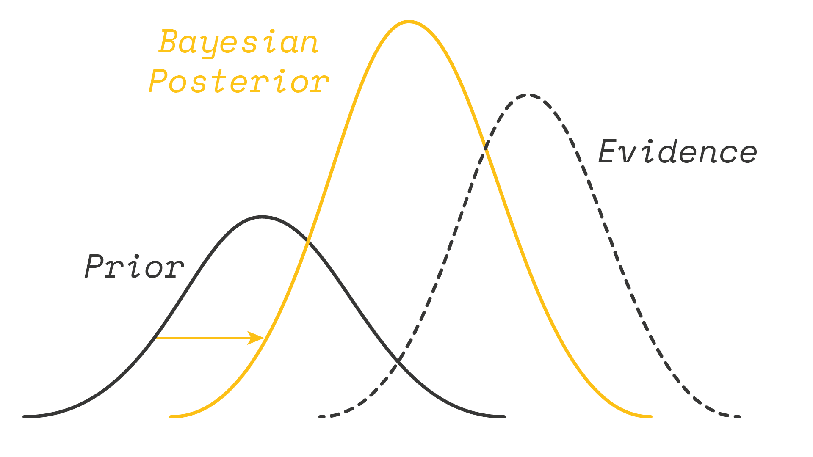
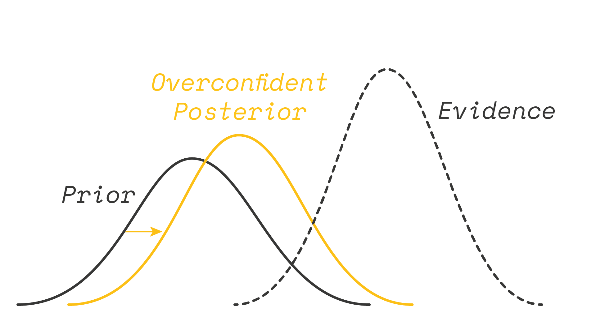
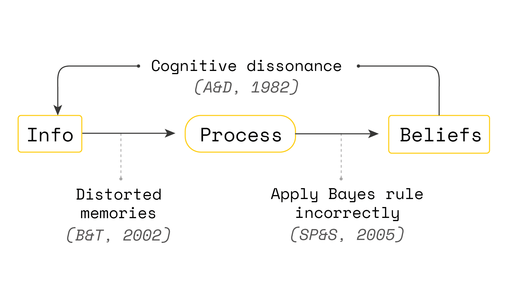
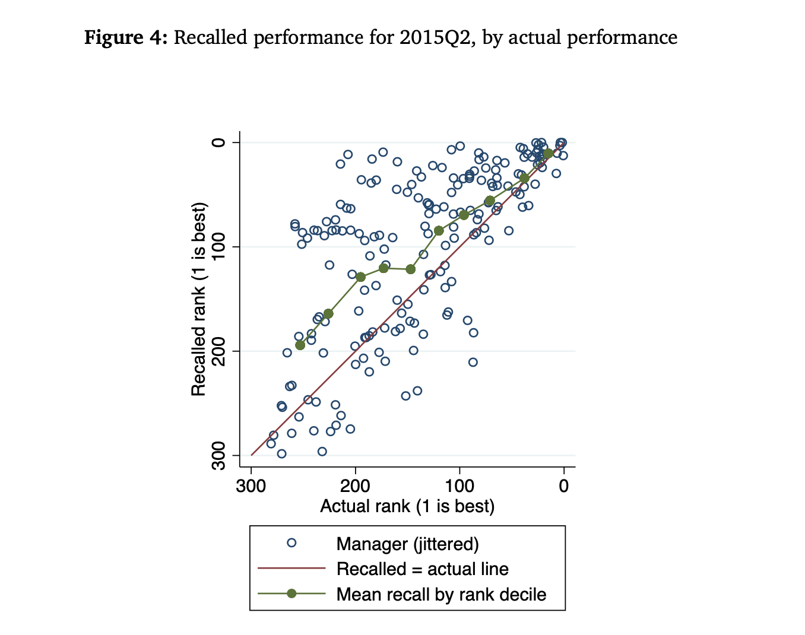
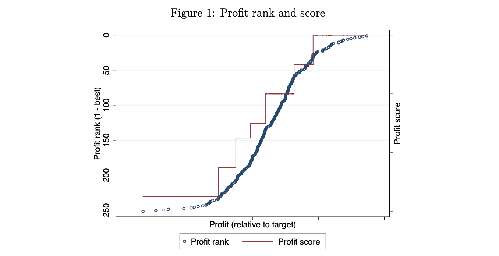
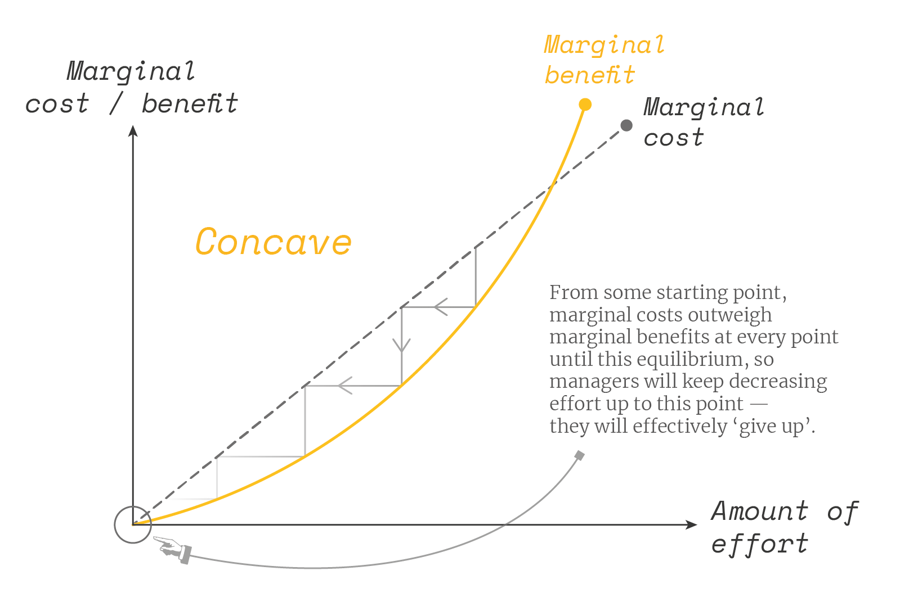
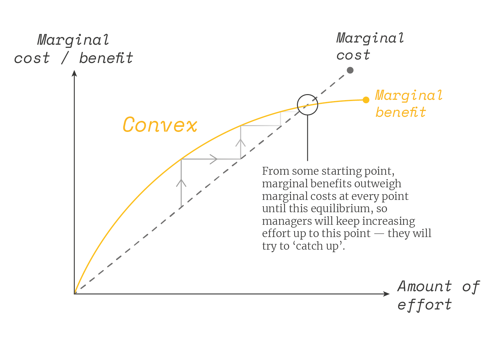

[Julia Shvets](http://juliashvets.com/) is an Economist at the University of Cambridge and fellow at Christ's College. Her research focuses primarily on micro- and behavioural economics: exploring why people make the decisions they make.

In this interview we discuss two of her recent papers. The first is about "overconfidence" — why people often think they are better than they have any reason to be. The second is on "rank incentives" — that is, how much people are inherently motivated by social prestige. We also explore many of the challenges that this research faces, especially what biases lab experiments might have.

In the article below, we summarise and illustrate these key ideas; providing both more detail and further reading for listeners who want to find out more.

Thanks for listening! We'd love to hear what you thought about it — email us at hello@hearthisidea.com or leave a rating below. You can help more people discover the podcast by <a href='https://twitter.com/intent/tweet?text=Check out Hear This Idea, a podcast showcasing new thinking in philosophy, the social sciences, and effective altruism! &url=https://www.hearthisidea.com via @hearthisidea&' about='_blank'>tweeting about it</a>. And, if you want to support the show more directly, consider <a href='https://tips.pinecast.com/jar/hear-this-idea'>leaving us a tip</a>.

## Julia's Recommendations 📚

- [Mindful Economics: The Production, Consumption, and Value of Beliefs](https://scholar.princeton.edu/sites/default/files/rbenabou/files/mindful_economics_jep_2016.pdf)  (1993) directed by Roland Bénabou and Jean Tirole
- [Psychology and Economics: Evidence from the Field](https://www.aeaweb.org/articles?id=10.1257/jel.47.2.315) by Stefano DellaVigna
- [Crime and Punishment](https://www.radicalphilosophy.com/article/english-philosophy-in-the-fifties) by Fyodor Dostoyevsky

 <Book url="https://scholar.princeton.edu/sites/default/files/rbenabou/files/mindful_economics_jep_2016.pdf" image="book-julia-1" spineColor='#95ab9e'/> <Book url="https://www.aeaweb.org/articles?id=10.1257/jel.47.2.315" image="book-julia-2"/> <Book url="https://www.goodreads.com/book/show/7144.Crime_and_Punishment" spineColor='#000000' image="book-julia-3"/> 
 

## Studies in the Lab versus in the Field

Both of the studies we discuss with Julia follow a common theme: they test if phenomenons frequently observed in the lab are also found in the field.

Julia notes that lab experiments clearly play a valuable role. For example, [Daniel Kahneman](https://en.wikipedia.org/wiki/Daniel_Kahneman), [Amos Tversky](https://en.wikipedia.org/wiki/Amos_Tversky), [Richard Thaler](https://en.wikipedia.org/wiki/Richard_Thaler), and others developed the now flourishing field of behavioural economics largely by performing lab experiments. Those lab experiments showed how people exhibit biases and that do not line up with rational homo economicus agents.

However, at the same time, we also have reason to doubt that these same results will hold in the real world. Firstly, by design, lab experiments will rely on a skewed sample. Most studies use student volunteers who are not representative of the wider population. Testing for this directly, studies have shown that [students appear much more greedy playing artificial 'dictator games](https://link.springer.com/article/10.1007%2Fs10683-007-9193-x)' than in analogous real-world situations. This finding makes sense, given they tend to have less money. We can add to this the fact that experiments are typically done at (elite) universities in developed countries, which also selects for a very narrow cultural background that may affect psychology. This problem is known as [WEIRD](https://slate.com/technology/2013/05/weird-psychology-social-science-researchers-rely-too-much-on-western-college-students.html) psychology.

Additionally, participants themselves may act differently in lab experiments than they would in the real world. As Julia notes, this is inherent in design:

> However hard you try in the lab — and some people are very good at this and spend a lot of time thinking about this — the subjects' scenario will always be artificial.

Lab experiments are normally designed to isolate a small set of important factors. Hence —

> When the subject has an hour to work on this experiment, for that window of time, the scenario in the experiment is the only game in town for the subject — they are completely focused on it. And that can generate some pretty artificial results.

Discussing her own research —

> For instance, we see some studies on rank done in the lab experiments that show that people care about ranks. But if that's the only thing that's happening in your experiment, then it's natural that it becomes very salient. So it's hard to conclude if, in the real world, where many things are competing for people's attention, they would care as much about rank.

Thus, for all the value that lab experiments add, it is crucial to observe these behaviours in the field. Of course, this also brings a host of statistical problems — It is much easier to control for things in the lab. However, Julia believes that economics can overcome these issues and deliver insights which lab experiments cannot.

## Overconfidence

The first of Julia's papers we discuss is "[Persistent overconfidence and biased memory: Evidence from managers](https://static1.squarespace.com/static/57bf5311197aea28a6b5c1f0/t/5d0b432f1b89af00016ebad3/1561019187408/Overconfidence_Huffman_Raymond_Shvets_05_03_19.pdf)" (2019), co-authored with [David Huffman](http://www.dbhuffman.com/) (University of Pittsburg) and [Collin Raymond](https://krannert.purdue.edu/directory/bio.php?username=raymondc&username=raymondc) (University of Purdue) .

Overconfidence is a well-documented phenomenon and is frequently cited by psychologists. Perhaps most famously, [Svenson's (1981)](https://www.sciencedirect.com/science/article/abs/pii/0001691881900056?via%3Dihub) found that 93% of American drivers think they are better than the median. In popular culture, we can also think of the radio show [A Prairie Home Companion](https://en.wikipedia.org/wiki/A_Prairie_Home_Companion). Here the fictional town Lake Wobegon is a place "where all the women are strong, all the men are good-looking, and all the children are above average."

But overconfidence is also of particular interest to economists. Adam Smith [remarked](https://www.overcomingbias.com/2007/06/adam_smith_on_o.html) in his seminal *The Wealth of Nations*:

> The over-weening conceit which the greater part of men have of their abilities is an ancient evil remarked by the philosophers and moralists of all ages. Their absurd presumption in their good fortune has been less taken notice of. It is, however, if possible, still more universal.

There have been many studies of overconfidence by Economists "in the field". [Oster et al. (2013)](https://www.aeaweb.org/articles?id=10.1257/aer.103.2.804) show that people at risk of Huntington disease vastly underestimate their threat, as reflected by their retirement decisions. People appear reluctant to carry out an accurate and low-cost genetic test, despite the enormous stakes involved. [Park and Santos-Pinto (2010)](https://link.springer.com/article/10.1007%2Fs11238-010-9200-0) find that chess players are optimistic in forecasting their chess tournament performance, despite having lots of information available (like Elo ratings and past games with their opponents). Lastly, [Hoffman and Burks (2017)](https://www.nber.org/system/files/working_papers/w23240/w23240.pdf) find that truckers are overconfident in predicting the number of miles they drive each week.

Before turning to Julia's results and how they fit into the literature, it was worth unpacking what we mean by overconfidence.

### Overconfidence as Responding to Information

As Julia points out, there is a difference between (what I'll call) "ignorant" overconfidence, and "irrational" overconfidence. She gives the following example:

> Often a lot of the evidence we have [on overconfidence] comes from people trying to predict where they are in the ranking on some measure they have not encountered before, and that they don't have much information [about].

For example —

> Student volunteers are asked, for example, to take an IQ test. Following this test, they are asked to rank themselves against other participants they never met.

In this way —

> People may be overconfident simply because they don't have any other information.

Whilst this "ignorant" overconfidence does exist, it's less clear how it matters. People might guess that they are better drivers than average, but that's because they probably never had a good reason to figure out how good the average driver is, and would have little information to go on even if they did.

Instead, Julia is interested in cases of overconfidence when people really should know better. To test for this, we can look at how people's initial beliefs change in response to information. We might excuse people's initial wrong guesses, but if people stick to these guesses despite glaring evidence to the contrary, then this will start looking like "irrational", rather than "ignorant", overconfidence.

To add some formal language, we can think of this in terms of [Bayesian updating](https://en.wikipedia.org/wiki/Bayesian_inference). If people are perfect information processing machines, then we expect they will update their beliefs according to Bayes rule — regardless of what 'prior' (initial guess) they hold. Given enough observed evidence, their 'posterior' (updated belief) will thus eventually converge to the truth.

But if people are overconfident, then they will (1) hold overconfident priors, and (2) update too slowly away from this overconfidence (if at all). It is this latter phenomenon that Julia wants to test. We cannot necessarily call people irrational for choosing a bad prior, but we can judge their subsequent posteriors accordingly.

### Supply of Overconfidence

How exactly might this overconfidence mechanism work?

> How is it possible that our mind allows us to be overconfident? What's the mechanism by which we don't learn our true chances of succeeding and keep telling ourselves they are bigger than they are?

Julia notes that there could be many reasons. Most obviously, people could be making cognitive mistakes when trying to process information. Famously, Gigerenzer [showed](https://www.bbc.co.uk/news/magazine-28166019) that even most US doctors could not correctly apply Bayes rule to elementary (and consequential) examples. Moreover, [Santos-Pinto and Sobel (2005)](https://www.aeaweb.org/articles?id=10.1257/000282805775014245) suggest that when performance depends on bundles of skills, people base their predictions on whichever is their best skill.

Julia instead asks us to consider that another way people can form overconfident beliefs is by *filtering* the information they use to update their beliefs. [Bénabou and Tirole (2002)](https://econweb.ucsd.edu/~jandreon/Econ264/papers/Benabou Tirole QJE 2002.pdf) [B&T] talk about this mechanism in their article. People might still process information they choose to consider in a Bayesian way, but they can be selective about what data gets processed in the first place. They can use their (skewed) memory to ignore some of the information they don't like and focus on the information they do, supporting their overconfident beliefs.

This explanation offers us a testable prediction: if people's memory plays a role in forming overconfident beliefs, we should expect to find a positive correlation between people's overconfidence and their inaccuracy in recalling memories. By contrast, if our bias is (just) in how we process this information, then we should not see this relationship.

Of course, just finding a correlation is not enough to show that B&T are right. For example, there could be a reverse causality. Individuals "choose" to hold overconfident beliefs and *then* distort their memories to match. We might expect this to be an attempt at minimising cognitive dissonance ([Akerlof and Dickens, 1982](https://www.jstor.org/stable/1831534?seq=1)).

All of these are just theories that attempt to explain the observed behaviour. A great exploration of these different propositions given by [Burks et al (2013)](https://academic.oup.com/restud/article-abstract/80/3/949/1570445). To find any actual conclusive mechanisms, we might also need to look at neuroscientific studies (see [here](https://www.sciencedirect.com/topics/psychology/overconfidence) for an overview).

Nonetheless, showing some sort of relationship between overconfidence and memory would at least be *consistent* with B&T. This relationship is what Julia and her co-authors set out to test.

### Demand for Overconfidence

If we can guess what causes the supply of overconfidence, the natural next thing to ask is what causes the demand. If overconfidence appears to be such a widely spread phenomenon, we might think that there is some sort of rationale behind it. So why exactly do people form overconfident beliefs?

In our interview, Julia explains that problems with self-control might tell part of the story. [Bénabou and Tirole](https://econweb.ucsd.edu/~jandreon/Econ264/papers/Benabou%20Tirole%20QJE%202002.pdf) (2002) describe this using the idea of "motivated beliefs". The key idea here is that overconfidence acts as a remedy to other psychological biases that people have, especially *time inconsistency*.

[Time inconsistency](https://en.wikipedia.org/wiki/Dynamic_inconsistency) is the idea that our preferences change over time so that they lead to unaligned preferences. For example, suppose that I want to play in a chess tournament. Before the tournament, I have a strong preference for playing. But come the morning where I have to do the work, my preferences change, and suddenly, I don't want to get out of bed at all. Here, the pre-tournament "self" and tournament "self" conflict. (See [here](https://academic.oup.com/jcr/article/17/4/492/1797243?login=true) for further discussion; it also relates to the literature on [hyperbolic discounting](https://en.wikipedia.org/wiki/Hyperbolic_discounting)).

Overconfidence might help to overcome this self-control problem by inducing our future selves to work harder than they otherwise would. Julia explains:

> The agent invests — say, getting out of bed for the chess tournament. The agent estimates the probability of the investment succeeding and, if the chance is too low, the agent will not get out of bed. But if in your mind you are over-optimistic of your probability of winning, then you are more likely to get out of bed.

Being overconfident changes the agent's subjective probability and thus their perceived expected value of playing in the tournament. If the agent thinks the chances of winning are higher, then they are less likely to procrastinate. Overconfidence may be a bias, but it might therefore be a bias that helps course correct from other biases!

Another way to frame this is by considering how beliefs could directly enter our utility function ([Bénabou and Tirole, 2016](https://www.aeaweb.org/articles?id=10.1257/jep.30.3.141)). For example, we might enjoy just thinking that we are "sporty", "smart", or "a better than average parallel parker". Anything that threatens this self-image will thus also lower our utility. If we believe we are sporty, then not getting out of bed in the mornings will cause disutility (either by forcing us to change our beliefs somewhat, or through cognitive dissonance). By contrast, if we don't think we are sporty, we cannot be disappointed by our failure to exercise. Being overconfident thus actually increase our incentive to get out of bed, even if it's based on beliefs that might be completely wrong.

This links to our [previous episode](https://hearthisidea.com/episodes/tads) with Tads Ciecierski-Holmes. There we discussed a paper by [DellaVigna and Malmendier (2006)](https://www.aeaweb.org/articles?id=10.1257/aer.96.3.694), where the authors found that gym members could save $600 on average if they switched from monthly contracts to pay-per visits.

One way of interpreting these results is that gym-goers were overconfident in guessing how often they would go to the gym. Another interpretation is that paying monthly fees acts as a commitment device. By buying a gym membership, they were helping to form a belief that they are the type of people who go to the gym regularly. To maintain that belief, they must at least go to the gym *sometimes*. This might work out as more expensive than what the gym-goer would have paid if they paid per visit, but this naive comparison ignores that they might not go to the gym at all without the monthly contract.

### Julia's Evidence on Overconfidence

To test these explanations for overconfidence, Julia and her co-authors joined up with a large food chain, which was able to supply detailed data on its managers' performance from 2008-2015.

The firm uses this performance in "tournament" to rank these managers and pay them a bonus according to their quintile. Managers thus have a clear incentive to pay attention to their rank, since doing so will be useful in securing higher compensation.

Additionally, the firm gives managers detailed feedback every week, including information about their performance and the distribution of other managers' performance. As Julia describes:

> Managers are practically bombarded with information about their rank. This is what we thought was so interesting about this data. When we looked at it, when we saw the incentive scheme worked, how much information the managers were getting, how central this competition was to their daily work — we realised that this was a very good testing ground for whether there was overconfidence in the field.

To test for overconfidence, the authors then ask the managers to forecast their rank for the next quarter. Managers get a financial reward for accurate guesses, incentivising them further. On average, the managers earned $40 for an hour of experiments, which is unusually large compared to standard lab experiments with students. This was required to be comeasurate with the managers’ opportunity cost of time. The authors then compared these results with the actual data.

Doing this, Julia notes that as a group, managers indeed appear overconfident. Only 10% predict they will end up in the worst quintile, roughly 20% said they would be in each of the intermediate quintiles, and 33% thought they would achieve the top quintile. These findings are similar to the American driving statistic we mentioned earlier — most people might believe they are better than average, but this implies at least some people are wrong.

Julia then considers whether managers are overconfident on an individual level. She compares managers' guesses with their actual performance a quarter later. Doing so, she finds managers are not entirely deluded: outcomes and prediction were positively correlated (0.47).

Yet, looking at prediction errors, Julia finds a strong skew towards overconfidence. Only about 33% of managers guess their quintile accurately, and only 20% of managers were underconfident in their prediction (note that we might expect 20% to guess "correctly" just by chance!). That leaves almost 50% of managers thinking that they would end up in a higher quintile than they did.

Prediction errors thus appear highly asymmetric. These findings amount to concrete evidence that people are overconfident in the real world, even (in this case) with cash incentives to form accurate beliefs, and no shortage of information to base those beliefs on.

### Julia's Evidence on Biased Memory

So can selective memory help explain why there is so much overconfidence? This question is the second part of Julia's study. When surveying managers, the authors also ask managers to recall their last role. They then compare these recollections with their actual rank.

We can see the results in the graph below. There are three things to point out here. Firstly, we again see that managers are not entirely disconnected from the truth: there is at least some reality constraint to recalled memories. We can see that the blue dots in the diagram tend to be upward sloping. The correlation of actual and recalled rank is substantial, 0.71, and statistically significant. If you ranked last in the previous quarter, you can't just suddenly "trick yourself" into thinking that you came first.

However, we can also see that what errors do exist are skewed towards flattering self-images. On the diagram, we see far more dots to the left of the red line than to the right. Almost 70% of recall errors are "flattering", compared to 30% being "unflattering". So when people do make mistakes in recalling memories, those mistakes typically happen to increase self-image.

Lastly, we can also see that there is a clear trend in who makes those mistakes. Those who tend to be the most overconfident are those who performed the worst in the last quarter. The green "mean" line closes follow the red "true" line for the very best performers but then deviate from the rank 100 onwards. Formally, "a 1 s.d. increase in Q2 performance is associated with a 0.12 lower probability of having inaccurate memory". This finding seems intuitive. When you performed well last quarter, you don't need to distort the truth to get a positive self-image; when you performed poorly, you do.

The last part was then to look and see if these results are linked. That is, is being overconfident in one's forecasts is linked to being flattering in one's memory? Julia notes that this strongly appears to be the case. Even controlling for many other factors (including gender, age, and experience), those who were the most overconfident were those with the most skewed memories. More precisely, "a 1 s.d. increase in recalled Q2 performance is associated with predicting about 0.5 quintiles higher performance in Q4."

Julia notes that these results surprised her co-authors. They thought that because of the real-world stakes involved, and all the information, that managers would have performed much better than they did. Instead, these results appear pretty damning.

> It's certainly pessimistic for the Bayesian theory of economics. People are not purely bayesian information processors, as economists have modelled them for years.

### Overconfidence and Performance

So what do these results imply for managers? A first impulse might be to try and correct their beliefs. Perhaps we could give them even more information, or somehow penalise overconfident attitudes. But recall that we also hypothesised that there might be reasons why managers "demand" overconfident beliefs about themselves.

> On the one hand, [the managers] are inaccurate, that's clear. But on the other hand, [...] we have now come to evidence consistent with the theory of motivated beliefs. And at the heart of this theory is the conjecture that people persist in overconfidence because they get some benefit from it.

Perhaps most surprisingly, Julia notes that her preliminary findings show that overconfidence has no impact on rank itself. "Managers who are overconfident about Q4 of 2015 do not do any worse, or better, in terms of overall future performance compared to other managers". Overconfident managers appear to do better in some areas (e.g. maximising profits) but worse in others (e.g. service quality). Additionally, if we believe that managers derive some sort of utility form having positive self-images, then trying to change this may be welfare decreasing.

On the one hand, we can certainly think of several situations where overconfidence will be harmful (e.g. in [investment decisions](https://onlinelibrary.wiley.com/doi/full/10.1111/j.1540-6261.2005.00813.x) or [medical diagnoses](https://www.amjmed.com/article/S0002-9343(08)00152-6/fulltext)). On the other hand, confidence also clearly has many benefits, even if it is misplaced(e.g. [encouraging entrepreneurship](https://www.sciencedirect.com/science/article/pii/S0167487006001024?casa_token=NTBvwC2WS7YAAAAA:BmKn_vrKYmXwwvDfBjzd3hU8RGLtKgrpIycGxphgS8vqcFpXPUY_jkr-DeTzrCsU8ZKVhb5POrw)). These questions remain an area for future work to explore, but it does suggest that things are much more complicated than the simple notion the overconfidence is nothing but an error, and an error which can be corrected with more information and incentives.

## Rank Incentives

The second paper we discuss in our interview is Julia's working paper called "[Rank vs Money: Evidence from Managers](https://static1.squarespace.com/static/57bf5311197aea28a6b5c1f0/t/5ecbaff03bbee218edc2be83/1590407153533/Shvets_Rank_v_Money.pdf)". Here she uses the same dataset as before, but is now looking to investigate a completely different phenomenon. In particular, Julia is trying to understand whether people are directly motivated by their relative standing in a group.

This question is less clear cut than it first appears. The core issue is that if we just look at how people respond to their rank, we might pick up on lots of different things. As Julia explains:

> The key issue in disentangling the incentive and the rank effects is that the two usually go together. Think of a sports tournament. The better you rank, the more likely you will win the big monetary prize at the end of it.

To frame this in economic terms, we are interested to see if rank enters the utility function of agents *directly*. If so, this may bring with it very different implications for how we design workplace incentive schemes.

### Julia's Evidence on Rank Effects

Julia pointed out that a quirk in her data allowed her to test for the "rank effect". To calculate the manager's bonus, the firm divides the ranking into bands, with all managers in the same band getting the same bonus. This fact means that if rank and financial incentives aren't smoothly or directly correlated — instead, their relationship follows a step-wise pattern. As Julia notes:

> [Financial incentives] increase when you are near the boundary, then they fall as you get into the middle, and then again they increase when you are near the boundary. This allows us to separately test for the effect of rank and the effect of incentives.

We can also see this in the diagram below. Financial incentives oscillate with rank, and so if effort depends on rank only through the financial incentives, effort should also oscillate with rank.  If, on the other hand, Julia observed a different relationship between effort and rank, then effort cannot be entirely attributed to the financial incentives, and must be due to direct effect of rank on people’s utility. In other words, if people care only about rank incentives, then being close to a pay "boundary" shouldn't matter that much — the difference in rank is only marginal. But if people care only about financial incentives, then these boundaries should be critical — as they make or break what bonus you end up getting. Thus, seeing how much effort does or doesn't "oscillate" with boundaries can give us a direct measure of rank effects.

To test this, Julia looks at how managers respond to their last feedback session in Week 11, just two weeks before the tournament. Here, managers are explicitly told their current rank and how far away they are from the next bonus band.

Julia then looks to see if the manager responds to this information by increasing their effort accordingly and improving their final rank. She finds that there surprisingly appears to be no significant oscillation in the effort:

> What we find is there is very little response to financial incentives. We find a little bit, but it's quite weak and small. But we do find people respond to rank.

### Julia's Evidence on Catching-Up

All of this suggests that rank does indeed enter the utility function directly. If this is the case, we might also wonder what "shape" this rank effect takes. That is whether, in response to "bad news" about their rank, agents try to *catch up* or *give up*.

> A priori, it's not clear what is the direction of ranks effects. Suppose your employer told you that out of 200 people and you ranked 180th in the last quarter. How do you feel about this information?

In economic terms, we are interested to see if the utility from rank is *convex* or *concave*. If you tell someone they are far behind the others, the ‘convex’ person would give up, while the ‘concave’ one would try to catch up. We can show this in the diagrams below:

To test for this, Julia looks at any difference in how much effort people exert according to their rank. She finds that there is no discouragement at the bottom. If anything, there appears to some complacency at the top and the biggest increase in effort at the bottom.

> When a manager gets the bottom rank instead of the top rank in week 11 (in a league table of 80, on average), he improves his profit in the last two weeks of the quarter by 0.3 standard deviations more. Similarly, if he finds he drops from top to bottom rank on service, he responds by improving service by 0.4 standard deviations more.

To get at this further, Julia unpacks what sort of "effort" managers apply. Ranks are given by combining multiple scores for (1) profits, (2) sales, (3) customer service rating, and (4) a review of the store manager. There are thus three ways a manager can try to increase their rank. Julia finds that most managers try to improve whatever measure they are currently performing worse in:

> We see that labour moves in the direction predicted: the idea that managers want to improve their ranking. When managers want to improve their ranking on profit, they cut labour because labour is a cost. When managers want to improve their ranking on service, they increase labour because they get better service.

### Motivations for Rank Effects

Why do managers care so much about their rank, even in cases where there is no apparent financial incentive to do so?

Julia also asks us to consider some explanations which try to understand why this might be the case. The economists Nöldeke and Samuelson [proposed](https://www.jstor.org/stable/3598826?casa_token=0yLuUJpHQaYAAAAA%3AW5XC7qigw4BD1cj7AcE8I0oTSaAmTf8bzeY1qpdVzqroN386HqgAOInuFR4QFKe8nLDMToH5n-6Pw-6jEoJXQYQMOCo5jV_l8KG5p-HYBsYAccRf-yRX&seq=1#metadata_info_tab_contents) that a person's relative standing in a group (i.e. rank) contains useful, action-guiding information. As Julia explains:

> Back in prehistoric times, it was important to look at what other people were doing before you decided because that's how you collected information about the environment. So if your neighbour was working a lot on their land, you concluded that the conditions were such that the harvest would be a good one. So, in turn, you work a lot on your land [...] Observationally this looks like keeping up with the Joneses — I am working hard because my neighbour is working hard, and I want to keep up with them. But fundamentally, the reason was you are trying to *learn* about the environment.

This idea also links to the literature on social learning — [Conley & Udry (2010)](https://www.aeaweb.org/articles?id=10.1257/aer.100.1.35) being the classic example.

Lastly, Julia notes that people might just care about doing the best job they can do, and ranks are an excellent indicator of this. In her words:

> Rank is a really good measure of how well you are doing at your job. Compare it with an absolute measure of performance. Suppose you know your profit figure, but you don't know anyone else. How do you know if this is good or bad?

### Relative Performance Pay

This idea of comparing yourself to others is also linked to relative performance pay. Here your employer now formally links your bonus to how well you do compared to other people, rather than just your absolute performance. We can illustrate this with a simple example.

Suppose that you are a manager and your output is $z_{A}=x_{A}+\epsilon_{A}+\epsilon$, where $x$ is how much effort and some random shock that you cannot control. This unexpected shock is in part individual (sickness, family emergencies etc.) and part general (consumer trends, local economy etc.)

Your employer pays you a base salary $\alpha$ and also wants to reward extra effort $x_{A}$. However, they can only see how much you produce $z$, but they cannot tell how much of this is due to effort $x$ and luck $\epsilon$.

Suppose you just get rewarded on your output:

$w=\alpha+\beta z_{A}=\alpha+\beta (x_{A}+\epsilon_{A}+\epsilon)$

You as the manager would be able to control $x_{A}$, but all of $\beta(\epsilon_{A}+\epsilon')$ remains uncertain and a risk to you. Individuals tend to be risk-averse, so this uncertainty is bad for you.

Alternatively, the employer may be able to look at the performance of another similar manager: $z_{B}=x_{B}+\epsilon_{B}+\epsilon'$. The critical insight is that these other managers are also exposed to the same general shock $\epsilon'$.

So now suppose you get rewarded for much you produce relative to another manager

$w=\alpha'+\beta'(z_{A}-z_{B})=\alpha'+\beta' (x_{A}-x_{B}+\epsilon_{A}-\epsilon_{B})$

You would again be able to control $x_{A}$, and we can also treat $x_{B}$ as fixed (because they will be solving the same problem as you). $\alpha'$ and $\beta'$ would be adjusted to make you as well off as before. But now, the only thing you are uncertain about is $\beta' (\epsilon_{A}-\epsilon_{B})$.

Intuitively, by making relative performance comparisons, all the general shocks cancel out while adding other people's noise. If we reason that general shocks are bigger than individual shocks (which sounds plausible), this decreases the overall risk level. Formally, we require that $var(\epsilon_{C})>var(\epsilon_{B})$.

Depending on how the game is set-up, relative performance pay therefore benefits either the employee (because they bear less risk) or the employer (because they have to pay less of a risk premium). But either way, this outcome is better than before! There are also different set-ups for how this can work, such as [tournaments](https://en.wikipedia.org/wiki/Tournament_theory) or winner-takes-all competitions.

For more on this, check out the "[principle-agent problem](https://en.wikipedia.org/wiki/Principal–agent_problem)". There is a vast literature on these types of contracts, especially as it relates to [CEO pay](https://journals.sagepub.com/doi/abs/10.1177/001979399004300303). Tutor2U give a good [first explanation](https://www.tutor2u.net/economics/reference/principal-agent-problem) of this concept. [Stiglitz (1989)](https://link.springer.com/chapter/10.1007/978-1-349-20215-7_25) is an excellent technical introduction, [Sappington (1991)](https://link.springer.com/chapter/10.1007/978-1-349-20215-7_25) a non-mathematical version.

Thank you to Julia Shvets for her time.

## Further Reading

- Julia's [personal website](http://juliashvets.com/)
- Julia's [Freakonomics interview](https://freakonomics.com/podcast/change-your-mind/)
- JEP's [symposium](https://conversableeconomist.blogspot.com/2015/11/overconfidence-ancient-evil.html) on overconfidence has three great papers on these topics
- Clearer Thinking's [Overconfidence Analyzer](https://programs.clearerthinking.org/overconfidence_analyzer.html)
- Robin Hanson's [blog posts](https://www.overcomingbias.com/tag/overconfidence) on overconfidence (there's lots of them!)
- Kevin Simler & Robin Hanson's [The Elephant in the Brain](https://www.elephantinthebrain.com/) explores similar examples of irrationality in the real world.
- Other papers on rank incentives — [here](https://faculty.wharton.upenn.edu/wp-content/uploads/2012/07/rankincentives_1.pdf) and [here](https://www.sciencedirect.com/science/article/abs/pii/S0047272712000436).

Thanks for listening <i>and</i> reading the write-up! We'd love to hear what you thought about it — email us at hello@hearthisidea.com or leave a rating below. You can help more people discover the podcast by <a href='https://twitter.com/intent/tweet?text=Check out Hear This Idea, a podcast showcasing new thinking in philosophy, the social sciences, and effective altruism! &url=https://www.hearthisidea.com via @hearthisidea&' about='_blank'>tweeting about it</a>. And, if you want to support the show more directly, consider <a href='https://tips.pinecast.com/jar/hear-this-idea'>leaving us a tip</a>.

