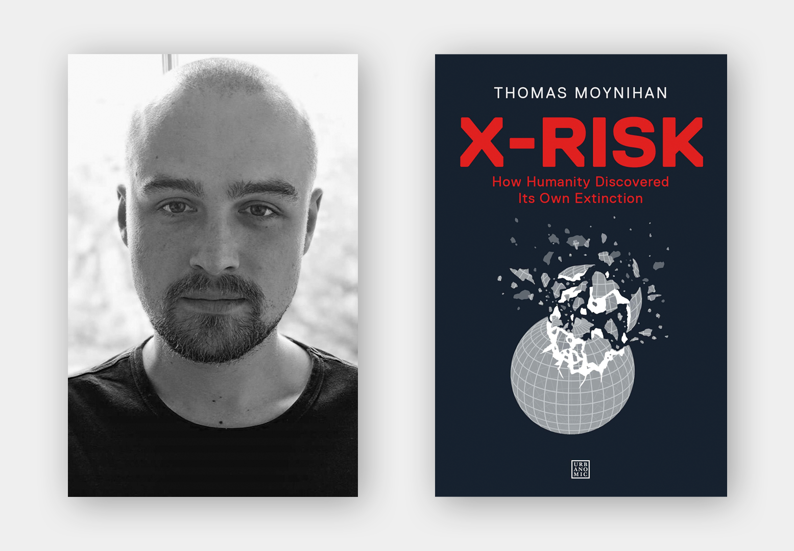

Thomas Moynihan is a writer and researcher interested in the history of ideas surrounding existential risk and human flourishing. He completed a PhD on the history of human extinction, and currently works with Oxford's Future of Humanity Institute. His most recent book is called [X-Risk: How Humanity Discovered Its Own Extinction](https://www.goodreads.com/book/show/54832738-x-risk).

The book charts the gradual realisation of the "perils and promises" that face the human species. Today, we are becoming attuned to the notion that humanity's potential is both potentially enormous and entirely fragile: no laws of nature or outside forces secure us against a wide range of natural and anthropogenic threats. We also recognise the rarity and loneliness of our predicament as intelligent beings in an otherwise apparently sterile stellar neighbourhood. As Moynihan shows, the recognition of existential risk represents a dramatic and revealing turning point in the history of ideas, and the story that leads up to it is rich, expansive, and often surprising. In our conversation, we meet some figures from this story, and discuss the significance of intellectual history more generally.

In the article below, we summarize and illustrate these key ideas; providing both more detail and further readings for listeners who want to find out more. Note that the article is not a transcript: you don't need to listen to the episode to read it, nor should listening to the episode make it redundant.

## Book Recommendations 📚

- [The Great Silence](https://www.goodreads.com/en/book/show/36794252) by Milan M. Ćirković
- [Reforging the Great Chain of Being](https://link.springer.com/book/10.1007/978-94-015-7662-8) by Simo Knuuttila
- [The World, the Flesh & the Devil](https://www.goodreads.com/book/show/564107.The_World_the_Flesh_the_Devil) by by J.D. Bernal

 <Book url="https://www.goodreads.com/en/book/show/36794252" image="book-tom-1" spineColor='#22537e'/> <Book url="https://link.springer.com/book/10.1007/978-94-015-7662-8" image="book-tom-2" spineColor='#bf6452'/> <Book url="https://www.goodreads.com/book/show/564107.The_World_the_Flesh_the_Devil" image="book-tom-3" spineColor='#c8878d'/> 
 

Thanks for listening! We'd love to hear what you thought about it — email us at hello@hearthisidea.com or leave a rating below. You can help more people discover the podcast by <a href='https://twitter.com/intent/tweet?text=Check out Hear This Idea, a podcast showcasing new thinking in philosophy, the social sciences, and effective altruism! &url=https://www.hearthisidea.com via @hearthisidea&' about='_blank'>tweeting about it</a>. And, if you want to support the show more directly, consider <a href='https://tips.pinecast.com/jar/hear-this-idea'>leaving us a tip</a>.

We began by asking Tom about his route to doing [intellectual history](https://en.wikipedia.org/wiki/Intellectual_history), or 'history of ideas'. Tom first studied English at university, and he explains that significant respect was still given family of approaches to criticism that roughly fall under the banners of '[deconstruction](https://en.wikipedia.org/wiki/Deconstruction)' and '[postmodernism](https://en.wikipedia.org/wiki/Postmodernism)'. These schools of thinking, associated with the French continental philosophers [Jacques Derrida](https://en.wikipedia.org/wiki/Jacques_Derrida) and [Michel Foucault](https://en.wikipedia.org/wiki/Michel_Foucault), emphasised attitudes of skepticism, irony, and the rejection of 'grand narratives', objectivity, and claims to progress. For Tom, it was a kind of "very immodest totalisation of modesty, as an intellectual principle". Although these original schools had begun to wane in influence from their late 20th century heyday, Tom notes that their 'suspicious' approach survives in new guises, such as 'critical posthumanism'. He continues —

> Often the way history is practised in this 'suspicious' mode is to use history to delegitimise our current normative standpoints [...] I'm very much interested in countering that by showing that there are places where clear progress has been made.

So Tom switched from English to history, and began searching for under-explored examples of progress in the history of ideas. The idea of *human extinction* turned out to be a clear example: a momentously important idea which emerged into its present form after a long and fascinating series of distinctions, disagreements, and discoveries.

> There are histories of everything [...] there are hundreds of books on the history of apocalypse, or judgement day, but I couldn't find one on the history of human extinction.

In the rest of the article, we consider some highlights from Tom's book and our interview, roughly tracing this history.

## Indestructibility of value

First, what do we (now) mean by an 'existential risk'? In a 2003 [paper](https://www.nickbostrom.com/astronomical/waste.html), philosopher Nick Bostrom describes such risks as "where an adverse outcome would either annihilate Earth-originating intelligent life or permanently and drastically curtail its potential". The philosopher Toby Ord employs an even simpler definition in his book *[The Precipice](https://en.wikipedia.org/wiki/The_Precipice:_Existential_Risk_and_the_Future_of_Humanity)*: existential risks are any risks that "threaten to destroy humanity's long-term potential".

As it turns out, this idea — that humanity's entire potential might conceivably be curtailed — is an surprisingly recent realisation. Tom writes in an [article](https://tankmagazine.com/issue-86/features/thomas-moynihan/) for TANK magazine —

> For most of Western history, value was invariably assumed indestructible in the sense that its aggregate remained constant and was conserved independently of human actions.

This conviction that there can be no threats to humanity's entire potential derives from various kinds of theodicy, wishful guesswork, and philosophical manoeuvring. For instance, many claimed that value — i.e. whatever matters for humans — is somehow timeless, unending or indestructible. If value is indestructible and vouchsafed by some super-human force, then human extinction wouldn't be allowed to happen: it would be too much of a waste to countenance.

In a sense, this flowed from a broader suspicion of any genuinely new twists in the human story: what will happen has already happened, and will recur indefinitely. Again, this straightforwardly rules out human extinction as an unprecedented event par excellence. The ancient philosopher Aristotle exemplified this view, arguing that every valuable discovery has already been discovered many times over — though perhaps forgotten just as often. Writing in the *[Politics](https://classicalwisdom.com/greek_books/politics-by-aristotle-book-ii/2/),* he supposes that "[over] the multitude of years [...] almost everything has been found out." In the *[Metaphysics](https://nathanschneider.info/2009/01/the-origins-of-knowledge/),* he writes that "probably each art and science has often been developed as far as possible and has again perished" — a pattern that occurs "not once nor twice nor occasionally but infinitely often".

In the Middle Ages, religious and secular figures alike tended to imagine the universe as teeming with immutable value. The theologian [Augustine](https://en.wikipedia.org/wiki/Augustine_of_Hippo), writing in the *[Enchiridion](https://en.wikipedia.org/wiki/Enchiridion_on_Faith,_Hope_and_Love)*, considered that the “goodness” of created beings “can be augmented and diminished", but that in the final analysis "all natures are good, because their author is supremely good”. Only our parochial perspective makes it look as if value can be lost from the world, or otherwise can vary over time — “variable good was created and is governed alone by the immutable good.”

The etchings below are taken from a book called *[Conversations on the Plurality of Worlds](https://en.wikipedia.org/wiki/Conversations_on_the_Plurality_of_Worlds)*, in which its author [Bernard Le Bovier de Fontenelle](https://en.wikipedia.org/wiki/Bernard_Le_Bovier_de_Fontenelle) depicted a stellar neighbourhood replete with Earth-like worlds harbouring human-like intelligences.

##### Source: [Arts and Culture](https://artsandculture.google.com/asset/illustration-from-fontenelle-s-conversations-on-the-plurality-of-worlds/zQFodaE3532KQA)

Well into the 18th century, leading thinkers were convinced of this 'suffusion' of value throughout space. '[Bonum](https://www.jstor.org/stable/44617042?seq=1) est diffusivum sui' stated a key scholastic principle: *goodness is self-promulgating*. Even the philosopher Immanuel Kant, who has more of a reputation for dry pedantry than any sci-fi fleets of imagination, mentions in his [*Critique of Pure Reason*](https://en.wikipedia.org/wiki/Critique_of_Pure_Reason) that he is "ready to bet the whole of my earthly goods on my belief that at least one of the planets which we see [i.e. in our solar system] is inhabited." Just as before, the views of Augustine, de Fontenelle, and Kant all but ruled out the possibility of any significant, accidental extinguishing of value from the known universe — because the responsibility to create, confer, and protect things that matter morally is largely *out of our hands*.

It is hard to appreciate just how deep-rooted this worldview was. Apparently, people genuinely struggled to appreciate the idea that some parts of the world might be essentially purposeless, or that by and large *we* get to create and confer value, rather than stumbling upon it anywhere and everywhere. As Tom mentions in the book —

> There wasn't even a word for the notion of abiogenic or abiotic matter, removed from all teleological utility for life. The term 'inorganic' in its modern sense didn't exist until roughly 1800.

Since everything must have been ordained and arranged by some higher purpose or divine power, everything simply must be in its right place. As Tom puts it, there was, prior to a certain point in time, simply no distinction between ethics and physics. Consider how far our conceptual frameworks have progressed, that *not* grasping this distinction is almost impossible to contemplate!

Tom continues —

> [A]s such, since a spiritually unpeopled zone was something morally unreasonable, by this token, it was also physically unthinkable.

This reckless projection of value and purpose also manifested in depictions of our planet. For illustration, the Jesuit scholar [Athanasius Kircher](https://en.wikipedia.org/wiki/Athanasius_Kircher) compiled a [scientific textbook](https://en.wikipedia.org/wiki/Mundus_Subterraneus_(book)) in which he imagined the Earth itself as a kind of living, breathing organism. His vision is depicted beautifully in the drawing below —

This 'everything in its right [place](https://www.youtube.com/watch?v=NUnXxh5U25Y)' thesis ruled out parts of the world not existing for some life-like purpose. Accordingly, many even believed that the *interior* of the globe must be either habitable, or indeed *inhabited*, right through to the 19th century. Tom points out that the astronomer Edmond Halley made remarks to this effect in the 1690s, as did "the anonymous German author of an 1828 book whose title translates as *The Underworld, or Reasons for a Habitable and Inhabitable Interior of our Earth.*"

## Apocalypse

Another obvious and early way to justify a belief in the indestructibility of value involved belief in God, or gods. Simply put, a loving and all-powerful God would never allow its creation to slip up so catastrophically that the lights go out.

But what about religious apocalypses? Doesn't human extinction actually take centre-stage, in at least the Abrahamic religions? Taking Christianity as a clear example, it's true that visions of a Judgement Day could hardly be less subtle. Tom's point, however, is that apocalypse is in fact a kind of *inversion* of extinction — the two ideas are *critically* different. The thought here is that the notion of apocalypse is suffused with meaning, imposed from the outside by a controlling deity. Like drawing the curtains on a play, religious apocalypses happen for a reason — they're often even imagined as *inevitable*. By contrast, human extinction (like any other extinction event) would not occur because it fits into anybody's grand, sensible plan. Instead, it would likely amount to a catastrophic, though totally avoidable, *accident*. Perhaps more importantly, most religious apocalypses involve some kind of conscious life continuing elsewhere — more like a mass evacuation to a perfect and timeless afterlife than the last foreclosure on intelligent life and its prospects for perfection.

Tom notes that the very word 'apocalypse' "derives from words meaning 'unveiling' or 'revelation'. On the other hand, extinction would reveal "precisely nothing, and this is instead because it prognosticates the end of morality and meaning itself [...] apocalypse is undeniably a moral judgement, whereas extinction would spell the end of all morality."

Further, the show would go on without us: the rest of the universe, in a way of speaking, wouldn't notice. Tom writes, "extinction means that the wider universe *continues without our species*. This is generally not a feature of apocalyptic narratives". He captures this difference pithily —

> Where apocalypse secures a sense of an ending, extinction anticipates the ending of sense.

##### Source: [Digital Dante](https://digitaldante.columbia.edu/image/birk-illustrations/paradiso/), Selected illustrations from Birk’s Comedy — Paradiso. Notice the similarity with the frontpiece for Fontenelle's *[Conversations on the Plurality of Worlds](https://en.wikipedia.org/wiki/Conversations_on_the_Plurality_of_Worlds)*, abov*e.*

Lastly, apocalypse is something ordained for us: out of our control. The poet Alexander Pope expressed this brand of cosmic fatalism in his 1733 *[Essay on Man](https://www.poetryfoundation.org/poems/44899/an-essay-on-man-epistle-i)*. On Pope's view, humanity's future lies fully in God's hands: whatever apparently terrible things happen, they must turn out to be ultimately just. In this way, he compares the position of humanity to the position of lambs before slaughter. Since we can neither know nor influence our future, we should frolic and enjoy our fixed annointed time on Earth. Plus, human extinction as trivial from God's perspective as a lamb's gruesome end is from our own —

> Who sees with equal eye, as God of all, A hero perish, or a sparrow fall, Atoms or systems into ruin hurl'd, And now a bubble burst, and now a world.

## Enlightenment

Beginning around the early 1700s, the 'Enlightenment' period issued in the first serious thinking about human extinction. New scientific and statistical methods undermined old ideas about 'eternal recurrence' and the 'indestructibility of value'. Concurrently, secular moral thinkers began to appreciate the *stakes*: that the most significant determinant of humanity's future might not be fate, or God, but in some important sense, humanity itself*.*

On the scientific front, the Enlightenment opened up countless new discoveries, all propelled by an almost unprecedented tolerance of and commitment to scientific methods: the careful gathering of evidence, and an undogmatic obedience to follow where it led. Here's a stupidly brief summary of the insights that followed.

With the development of astronomy, the discoveries of Galileo and Copernicus shifted consensus from a geocentric to a heliocentric model of the solar system. This is a well-known story: the (Catholic) church trying in vain to suppress heretical new ideas and enforce dogma; the eventual 'revolution' in worldview, and its crisp symbolism of religious self-centeredness displaced by a secular sense of cosmic abandonment. As Tom points out in our interview, this potted story is a bit of a caricature. Indeed, the 'Copernican revolution' didn't trigger the sudden, crisply symbolic, shift in perspective that popular portrayals might have us believe. All the same — at some earlier point, most informed people believed they were living in the centre of a universe designed for them. At some later point, they could no longer believe that. In some (perhaps minimal) sense, the Earth's firm standing really was knocked off kilter.

At the same time, the new science of [geology](https://en.wikipedia.org/wiki/Geology) was being uncovered. With this study of layers on layers of rock, formed over eons, emerged a realisation of the deep stretches of Earth's history before humans stepped on the scene. While geologists were piecing together our planet's history, fossil hunters were searching through the rock for clues about ancient forms of life. Surprisingly, the interpretation of the fossil record that seems most natural to us — that most fossils are imprints of long-extinct species — was initially met with resistance. Throughout the Middle Ages, fossils were interpreted as *lusus naturae* — 'jokes of nature'. The idea was that fossils were lowly rocks stepping out of line and trying to imitate animals: "naughty minerals", as Tom puts it. Only during the Renaissance did proto-palaeontologists begin to entertain the 'biogenic' theory of fossil formation — the true explanation, that fossils are imprints of organisms. But since so many of the exotic shapes fossils take on represent no known species, the natural implication was that those species no longer existed. This idea was originally almost impossible to countenance. The naturalist [John Ray](https://en.wikipedia.org/wiki/John_Ray) made this observation, but insisted that these unusual fossils were formed by species still living in some unexplored regions of the world. Soon, apparently forced by the sheer pressure of keeping up such silly explanations, opinion began to swing round towards accepting that some species go extinct.

Later, legendary [earthworm expert](https://en.wikipedia.org/wiki/The_Formation_of_Vegetable_Mould_Through_the_Action_of_Worms) Charles Darwin began to form his theory of 'evolution by natural selection', which situated the human species as continuous and commensurate with other animal species. Combined with the discovery that some (indeed, the vast majority) of once living animal species have since become extinct — the frightening conclusion draws itself.

But perhaps the most under-appreciated development during the Enlightenment was the new science of *probability*. Properly speaking, the subject of probability was inauguarated some time before this period. Philosophers and proto-economists did discuss non-technical kinds of *uncertainty* during the Middle Ages — but *numbers* never entered the picture. The first systematic treatment of *mathematical* probability seems to have been a mid-16th century book called *Liber de ludo aleae* ("Book on Games of Chance"), written by the Italian polymath [Gerolamo Cardano](https://en.wikipedia.org/wiki/Gerolamo_Cardano). More than two centuries later, a Presbyterian minister called [Thomas Bayes](https://en.wikipedia.org/wiki/Thomas_Bayes) published ['An Essay towards solving a Problem in the Doctrine of Chances'](https://en.wikipedia.org/wiki/An_Essay_towards_solving_a_Problem_in_the_Doctrine_of_Chances), in which he presented what is now (arguably) the bedrock of probability theory: [Bayes' rule](https://en.wikipedia.org/wiki/Bayes'_theorem). The rule explained, for the first time, how to reason numerically about events prior to repeat trials. This would prove crucial for assessing risks of the kind that could threaten humanity's entire potential: risks with little to no precedents, with low year-on-year likelihood, but extremely high stakes. Without this Bayesian framework, probabilities could only be meaningfully ascribed to events the [frequency](https://plato.stanford.edu/entries/probability-interpret/#FreInt) with which they occur can either be directly observed or calculated: how often the roulette spin comes up red, or you get dealt a flush in poker. Since this is rarely possible in the case of existential risks, a broader conception of probability was called for, on which probabilities reflect *[degrees of belief](https://plato.stanford.edu/entries/probability-interpret/#SubPro)* rather than precise and objective [propensities](https://plato.stanford.edu/entries/probability-interpret/#ProInt) or observed frequencies. Bayes' developments paved the road for this expansive 'Bayesian' or 'evidential' interpretation of probability, now widely used to discuss the likelihoods of various existential risks. For instance, here are Toby Ord's recent subjective risk estimates for the next century —

| Existential catastrophe via      | Chance within the next 100 years |
| ----------- | ----------- |
| Asteroid or comet impact      | ~ 1 in 1,000,000   |
| Supervolcanic eruption   | ~ 1 in 10,000       |
| Stellar explosion   | ~ 1 in 1,000,000,000     |
| **Total natural risk**   | ~ 1 in 10,000       |
| Nuclear war   | ~ 1 in 1,000     |
| Climate change   | ~ 1 in 1,000       |
| Other environmental damage   | ~ 1 in 1,000 |
| 'Naturally' arising pandemics  | ~ 1 in 10,000       |
| Engineered pandemics  | ~ 1 in 30      |
| Unaligned artificial intelligence  | ~ 1 in 10     |
| Unforeseen anthropogenic risks  | ~ 1 in 30      |
| Total anthropogenic risk  | ~ 1 in 6   |
| Total existential risk | ~ 1 in 6      |

Just as science pointed towards a mature understanding of human extinction, so did philosophy and art. For instance, the Italian writer Giacomo Leopardi expressed a view of human fragility, inspired by the discovery of species extinction through the fossil record. In a series of darkly humorous dialogues, he imagined a time after humans:

> they are all gone, the earth doesn't feel that there is anything missing; and the rivers aren't tired of flowing; and the sea doesn't seem to be drying up, even if it's no longer used for the traffic of ships.

Around the same time, the French economist Henri de Saint-Simon was developing his own version of what now gets called 'big history'. Big history describes the long stretches of time before human civilisation: our long hunter-gatherer past, and the far longer periods absent *Homo sapiens* and even life itself. Saint-Simon also proposed looking at this long past for clues to our species' future —

> It is with geological considerations that we must begin the history of the human species. It is also, and for the same reasons, by geological considerations that we must finish it.

Projecting far forwards on geological timescales, he suggested that the Earth will eventually *dry out* and become totally inhospitable —

> Now, it is obvious that at this time it will be uninhabitable, uninhabited, and that, consequently, after this time, the human species will die out.

Later, the Romantic poet Lord Byron envisioned a time after humans in his suitable titled poem *Darkness* — in some sense prefiguring '[last man](https://en.wikipedia.org/wiki/Last_man)' genre*.* He [went further](https://www.goodreads.com/quotes/8801393-who-knows-whether-when-a-comet-shall-approach-this-globe) still, imagining how humanity might *defend* against existential risks —

> Who knows whether, when a comet shall approach this globe to destroy it, as it often has been and will be destroyed, men will not tear rocks from their foundations by means of steam, and hurl mountains, as the giants are said to have done, against the flaming mass?

The philosopher Nietzche, true to his nihilistic reputation, saw humanity's entire lifetime as a fleeting instance, set against an uncaring cosmic backdrop. This is clearest in his 1873 essay [On Truth and Lies in a Nonmoral Sense](https://en.wikipedia.org/wiki/On_Truth_and_Lies_in_a_Nonmoral_Sense), in which he [considers](https://oregonstate.edu/instruct/phl201/modules/Philosophers/Nietzsche/Truth_and_Lie_in_an_Extra-Moral_Sense.htm) a fable —

> In some remote corner of the universe, poured out and glittering in innumerable solar systems, there once was a star on which clever animals invented knowledge. That was the highest and most mendacious minute of "world history"—yet only a minute. After nature had drawn a few breaths, the star grew cold, and the clever animals had to die.

## Modernity

Moving through the late 19th and into the 20th century, the revelation of human extinction — that it's possible, that humans choices might influence its likelihood, and that these choices matter gravely — continued to dawn in ever more detail and colour. Instead of oblique and poetic references, existential risks were increasingly being discussed rigorously and systematically. For instance, in the first sentence of an essay entitled '[The Extinction of Man](http://www.online-literature.com/wellshg/certain-personal-matters/24/)', science fiction author H. G. Wells declares —

> It is part of the excessive egotism of the human animal that the bare idea of its extinction seems incredible to it.

In fact, Tom claims in his book that this bundle of realisations is in some sense *commensurate with modernity —*

> The shockfront of modernity is a distressed negotiation with the longest-term prospects of humanity.

The realisation that humanity might have some say over whether it meets a premature end came as a parcel with the realisation that humanity might have a say over building a future brighter and grander in scale than any previous age. As Tom writes in his [article](https://tankmagazine.com/issue-86/features/thomas-moynihan/) for TANK magazine —

> This attitude to the future is historically novel. Where prior generations, such as Augustine’s, thought we lived near the terminus of humanity’s mundane saga, many philosophers now believe we might be living at its daybreak.

In this way, the story of ideas about existential risk traces a wider story of thinkers, philosophers, and scientists coming to realise the extraordinary breadth of potential futures for the human species: from existential catastrophes at one extreme, to a kaleidoscope of possibilities on the other; limited by imagination and ingenuity. The two extremes combine to bear on our altruistic obligations today: *because* both extremes are possible — because humanity's potential is both vast *and* fragile — safeguarding that potential looks like an especially noble and pressing use of our collective efforts. As Tom writes —

> Where German historian Reinhart Koselleck once defined modernisation itself as a heightening of the 'demands made of the future', we are now coming to realise that modernity has also always involved a heightening of the *demands that the future makes upon us*.

There are a vast number of potential *future* people, whose quality of life could depend significantly on our behaviour: whether, for instance, we deplete natural resources and degrade the environment in ways that are hard to reverse. But future people depend on us in a far starker way — their very *existence* may depend on choices we make today. It is this dependence that plausibly generates a special kind of responsibility for living people — a responsibility increasingly being foregrounded.

For instance, the moral philosopher [Henry Sidgwick](https://www.utilitarianism.net/utilitarian-thinker/henry-sidgwick) concluded in his 1874 *[Methods of Ethics](https://en.wikipedia.org/wiki/The_Methods_of_Ethics)* that failing to prevent human extinction “would be the greatest of conceivable crimes from a [Utilitarian](https://www.utilitarianism.net/) point of view”.  In his article, Tom traces how the chorus of such voices grew stronger throughout the 1900s. Here is the astronomer Ernst Öpik, [writing](http://adsabs.harvard.edu/full/1967IrAJ....8..139O) in 1973: "Compromise means trading the peaceful existence of yourself and your own generation against thousands of future generations which never will behold the light of day". The year later, economist Robert L. Heilbroner [suggested](https://books.google.co.uk/books?id=rLz0WKzJLfMC&pg=PA106&lpg=PA106) that "hope" lay “in our capacity to form a collective bond of identity with future generations”. A decade later, and Carl Sagan was [remarking](https://books.google.co.uk/books?id=Vo4zS-lGAwsC&pg=PA178&lpg=PA178) that “if we are required to calibrate extinction in numerical terms, I would be sure to include the number of people in future generations who would not be born.” And writing in his 1984 *Reasons and Persons*, the philosopher Derek Parfit memorably summarises the result of his '[nuclear war](https://wmpeople.wm.edu/asset/index/cvance/videos)' thought experiment: “if we destroy mankind, as we now can, this outcome will be much worse than most people think.”

I would also note that Parfit restated this case in stirring terms more than three decades later, in the [third volume](https://www.goodreads.com/quotes/8575881-what-now-matters-most-is-how-we-respond-to-various) of his book *On What Matters* —

> What now matters most is how we respond to various risks to the survival of humanity. We are creating some of these risks, and discovering how we could respond to these and other risks. If we reduce these risks, and humanity survives the next few centuries, our descendants or successors could end these risks by spreading through this galaxy. Life can be wonderful as well as terrible, and we shall increasingly have the power to make life good. Since human history may be only just beginning, we can expect that future humans, or supra-humans, may achieve some great goods that we cannot now even imagine. In Nietzsche’s words, there has never been such a new dawn and clear horizon, and such an open sea.

Looping back to the beginning of this period, the American transcendentalist writer Ralph Waldo Emerson had voiced the same attitude, writing in an [essay](https://en.wikipedia.org/wiki/Politics_(essay)) on politics —

> We think our civilisation near the meridian, but we are yet only at the cock-crowing and the morning star.

This all points at a more expansive set of ideas which include existential risk: the philosophy of *[longtermism](https://www.finmoorhouse.com/writing/longtermism)*. In brief, longtermism is the view that that ethical decisions should be guided by their impact and significance over very long timescales, extending over our entire future: that shaping the long-term future should be a central priority. Such a view implies both that humanity's potential is brilliant enough to bear heavily present choices, and that present choices can decide whether that potential is realised — which is where existential risk enters in. Excitingly, Tom is now setting his sights on a history of longtermist thinking: a project which promises to be at least as mind-expanding as the present one!

## Fragility

While modernity saw heightened alarm at the threat of the extinction of *Homo sapiens*, it also ushered in the theory of evolution by natural selection — a new understanding of humans as one species among many on an evolutionary tree. Some argued that this view rendered human extinction *less* terrible for the following reason: we know that humans evolved from hominid ancestors resembling modern primates, which in turn evolved from less cognitively sophisticated organisms. When *Homo sapiens* rapidly grew in number, they overpowered neighbouring species — most notably the Neanderthals. This makes it look as if our special brand of collaborative intelligence and aptitude for cultural learning is a kind of natural 'well' in evolutionary space: one species is inevitably drawn into it, and that species gets so successful that there's no room for other species to follow. If that's true, then imagine what happens if every human disappeared: in a few million years, some other primate (e.g. chimpanzees) would presumably quickly fill our left-over cognitive niche. Or perhaps an entirely different species, like octopi. In any case, the extinction of humanity likely *wouldn't* entail the permanent extinction of intelligent, civilised life.

Unfortunately, it quickly became clear that this line of thinking doesn't check out; at least, the conclusion seems far too brash. Here is the evolutionary biologist Steven Jay Gould, writing in *[Wonderful Life](https://www.goodreads.com/book/show/36475.Wonderful_Life)*, with his skeptical response *—*

> Run the tape again, and let the tiny twig of Homo sapiens expire in Africa. Other hominids may have stood on the threshold of what we know as human possibilities, but many sensible scenarios would never generate our level of mentality. Run the tape again, and this time Neanderthal perishes in Europe and Homo erectus in Asia (as they did in our world). The sole surviving human stock, Homo erectus in Africa, stumbles along for a while, even prospers, but does not speciate and therefore remains stable. A mutated virus then wipes Homo erectus out, or a change in climate reconverts Africa into inhospitable forest. One little twig on the mammalian branch, a lineage with interesting possibilities that were never realized, joins the vast majority of species in extinction. So what? Most possibilities are never realized, and who will ever know the difference? Arguments of this form lead me to the conclusion that biology's most profound insight into human nature, status, and potential lies in the simple phrase, the embodiment of contingency: **Homo sapiens is an entity, not a tendency**.

As Tom writes in *X-Risk,* it therefore *may well be the case* that *"*the more complex and developed a civilisation becomes, the less likely it is that its techniques and norms will be repeated or replicated elsewhere." Thus, as the American anthropologist [William W. Howells](https://en.wikipedia.org/wiki/William_W._Howells) [summarises](https://www.goodreads.com/en/book/show/604744): "hopes for repetition are not good, and we had better stay the hand that drops the bomb."

## The Time of Perils

Running concurrently to this ethical progress was progress of a more concrete and concerning kind. New *destructive* capabilities were being developed at a furious pace, spurred by the urgency of war. As new technologies expanded the scope of their creator's power to affect the world, so did their powers to destroy it. In the course of only a couple of years, this gradually escalating series of inventions suddenly hit a step change: the nuclear bomb. Nearing the end of the Second World War, a team of scientists — working in secrecy but backed by virtually limitless government support — had developed a weapon capable of unleashing the power locked in atomic bonds in order to flatten cities.

The nuclear weapons were of course deployed in WWII on two occasions, over the Japanese cities of Hiroshima and Nagasaki — the only times they have been used in war. Although Japan surrendered shortly after, the consequences were undeniably awful. Despite this, or perhaps because of it, nuclear stockpiles grew rapidly after WWII. By the height of the Cold War, the combined nuclear arsenals of Russia and the United States numbered above *60,000* warheads.

](images/stockpiles.png)

##### Source: [Our World in Data](https://ourworldindata.org/grapher/number-of-nuclear-warheads-in-the-inventory-of-the-nuclear-powers)

Noticing this new destructive potential, the philosopher Bertrand Russell and physicist Albert Einstein were moved to submit a [co-written manifesto](https://www.atomicheritage.org/key-documents/russell-einstein-manifesto), urging world leaders to resolve any potential Cold War conflicts peacefully: to urgently pull back from any slide towards mutually assured destruction. Although the direct effects of full-scale nuclear war might not be enough to cause human extinction, their words are refreshingly uncompromising —

> Here, then, is the problem which we present to you, stark and dreadful and inescapable: Shall we put an end to the human race; or shall mankind renounce war?

However, while stockpiles continued to grow, another disturbing indirect effect of nuclear weapons was being uncovered. Scientists had begun to raise the possibility that a sufficient number of nuclear detonations could trigger a '[nuclear winter](https://en.wikipedia.org/wiki/Nuclear_winter)', defined as a 'severe and prolonged global climatic cooling effect', and caused by widespread firestorms throwing up soot into the atmosphere.

For the first time, humanity had in its hands the capability of causing its own extinction. The philosopher Toby Ord marks the first detonation of a nuclear device — the [Trinity test](https://en.wikipedia.org/wiki/Trinity_(nuclear_test)) — as the first day in a new era with respect to human extinction: the 'Precipice'. This period, which Ord suggests continues to the present day, is characterised by an unsustainably dangerous mismatch between humanity's advanced destructive capabilities, and its comparatively stunted *wisdom*: its ability to steward such technologies safely and responsibly. While this mismatch stands, humanity will be facing the most dangerous period in its long history.

And while nuclear weapons make for a salient example, the list of potentially catastrophic technologies only grew throughout the late 20th century and up to the present day. Firstly, advances in synthetic biology could enable rogue actors to cheaply fabricate lethal and highly contagious pathogens. Second, many experts in the fields of machine learning and artificial intelligence indicate that the arrival of *general* artificial intelligence — AI more cognitively sophisticated than humans across the board — may not only be possible, but frighteningly nearby. This has prompted worries about accidentally creating a '[superintelligent](https://www.goodreads.com/book/show/20527133-superintelligence)' agent irreversibly endowed with values different from sensible human values, effectively unleashing a force into the world which is at once fundamentally at odds with human values, far more effective than humans at enacting its own values, and almost impossible to shut down or contain.

By all appearances, these man-made technologies pose a far greater threat to the continued existence of humanity — by several orders of magnitude — than all other natural risks combined.

Yet, forecasting future technologies is notoriously — [necessarily](https://medium.com/dorothyknows/david-deutsch-the-unknowable-how-to-prepare-for-it-e1b2c7d78744) — hard. For illustration, at the start of the 20th century, many thought heavier-than-air human flight to be impossible. Wilbur Wright was somewhat more optimistic, guessing it to be at least 50 years away; 2 years before he invented it.

## The Stars

In parallel to the story of the discovery of existential risk runs an interweaving story of the discovery of humanity's place in the cosmos, and the cosmic futures it could one day inherit. On one occasion, these two threads met — in the physicist [Enrico Fermi](https://en.wikipedia.org/wiki/Enrico_Fermi). As one of the chief architects of the Manhattan Project, Fermi was there to witness the Trinity test. Almost exactly five years later, Fermi was talking over lunch at the Los Alamos National Laboratory in New Mexico. A co-worker had mentioned a recent New Yorker cartoon, depicting aliens stealing trash cans (as likely a hypothesis as any).

##### New Yorker, May 20th 1950

Later, the conversation passed from UFOs to other matters. Without warning or context, Fermi exclaimed: "but where are they?". Somehow, it was clear to his conversational partners that he was referring to the the aliens from the New Yorker cartoon. More serious thinking and calculations later, Fermi's lunchtime question became the famous [Fermi *paradox*](https://en.wikipedia.org/wiki/Fermi_paradox): space is vast, and full of opportunities for alien intelligences to emerge and communicate with us. Yet, we hear and see no clear signs of alien intelligence at all. Decades later, SETI — the search for extraterrestrial intelligence — redoubled efforts to pick up even the faintest clues from the night sky static. Still, nothing. What gives?

To discuss proposed resolutions to the paradox would be going far afield. What matters is what Tom points out in our interview and in the book — that Fermi's question and SETI's disappointment bear closely on the story of existential risk. Recall early convictions that space must be teeming with extraterrestrial intelligence. In a certain sense, that lowers the stakes of an existential risk. Human extinction might not mark a significant symbolic loss on any grand cosmic scales because even if humanity doesn't make it, other civilisations might. But with the search for extraterrestrial life yielding nothing, dawned the realisation that the human race might well be the only species to carry the torch for creative intelligence, and responsiveness to moral reasons, in our galaxy — or even the entire affectable or observable universe. That seems to confer a special responsibility: to protect an endowment made all the more precious by its possible uniqueness.

The anthropologist Loren Eiseley captures this sentiment in his unusual book [*The Immense Journey*](https://www.goodreads.com/quotes/209213-lights-come-and-go-in-the-night-sky-men-troubled) —

> Lights come and go in the night sky. Men, troubled at last by the things they build, may toss in their sleep and dream bad dreams, or lie awake while the meteors whisper greenly overhead. But nowhere in all space or on a thousand worlds will there be men to share our loneliness.

Yet, Tom discusses an altogether more positive side to the history of thinking about humanity's place in space. In step with progress in scientific understanding and engineering capability, ideas about journeying into space became increasingly detailed, varied, and grand. As more became known about the laws of nature and the scales of space, these visions of vast life-supporting structures were never ruled out — on the contrary, they became *more* ambitious. This relates to existential risk in two ways: first, it raised the stakes by imagining even grander possible futures for humanity than before. Second, it raises the prospects for eventually achieving security from threats that can be mitigated by spreading beyond Earth (e.g. from asteroid collisions).

One famous proposal for such a megastructure was the 'Dyson sphere', first imagined in the science fiction novel *[Star Maker](https://en.wikipedia.org/wiki/Star_Maker)* and later described in detail by legendary physicist [Freeman Dyson](https://en.wikipedia.org/wiki/Freeman_Dyson). A Dyson sphere (or ring, bubble, or swarm) is in essence some structure constructed around a star, for the purpose of collecting and using the light it emits. This would meet the energy demands of large-scale space settlement: not merely exploring our stellar neighbourhood, but building vast structures with its materials. If it were ever built, a Dyson sphere would represent a firm foot on the next rung of the so-called [Kardashev scale](https://en.wikipedia.org/wiki/Kardashev_scale) — a measure of a civilisation's level of technological advancement in terms of its energy use.

Energy from some derivative of a Dyson sphere might be used to supply power to free-floating human settlements, unmoored from any planet. This next invention is called an [O'Neill cylinder](https://en.wikipedia.org/wiki/O'Neill_cylinder), proposed by physicist Gerard O'Neill. These structures consist of two interlocking cylinders rotating in opposite directions (to counter gyroscopic forces). Like a merry-go-round, anyone living on the inner surface of one of these rotating cylinders would experience a centrifugal 'push' toward the ground, mimicking the effects of gravity (in fact, 'mimicking' is too weak, since the experiences of downward gravity and upward acceleration are indistinguishable). They would be around 5 miles in diameter and 20 miles long.

It wasn't long before images of such structures began to permeate popular culture and even inspire social movements. Many of the most iconic depictions of O'Neill cylinders were created by the artist [Don Davis](https://en.wikipedia.org/wiki/Don_Davis_(artist)), commissioned by NASA to depict descriptions of life beyond Earth. Later, Davis would work on the visual effects for Carl Sagan's *Cosmos* television series, and create several of his book covers. Here's an example —

##### Source: [Wikipedia](https://en.wikipedia.org/wiki/O%27Neill_cylinder#/media/File:Spacecolony3edit.jpeg)

Earlier in the 20th century, a new generation of Russian thinkers and scientists began to investigate interplanetary travel in earnest, inspiring (and inspired by) a philosophical movement called *[Russian cosmism](https://en.wikipedia.org/wiki/Russian_cosmism)*. This coalition of philosophers, scientists, and religious thinkers discussed visions of humanity's space-faring future, blending scientific forecasts with Orthodox theology. Guided by a religious sensibility, they argued that future technology [might be employed](https://theconversation.com/russian-cosmism-a-national-mythology-against-transhumanism-152780) to "resuscitate ancestors, achieve immortality, transform human nature toward its deification, and finally, conquer and regulate the cosmos." Central among this school was the reclusive and idiosyncratic rocket scientist [Konstantin Tsiolkovsky](https://en.wikipedia.org/wiki/Konstantin_Tsiolkovsky) — author of the first serious scientific work on space travel in 1903. In the 1970s, the ideas of pioneering thinkers like Tsiolkovsky were later rediscovered and recombined.

Enthusiasm about space settlement found similarly esoteric and amusing expression in the U.S. Deserving of mention here is the '[L5 Society](https://en.wikipedia.org/wiki/L5_Society)'. Some background: Gerard O'Neill was drawing up his designs for life-supporting space structures just as a group of researchers dubbed the 'Club of Rome' published a book called *The Limits to Growth*, which presented an emphatic case that the Earth would simply run out of resources sometime in the 21st century, causing famine and massive population collapse. Concerned, O'Neill saw his proposals as a starry-eyed solution: to move increasing numbers of humans beyond Earth and into self-sustaining colonies in space. But this raised the question of *where* the settlements might be located. Space, after all, is quite big. The answer is surprisingly neat: where two celestial bodies are placed in mutual orbit, it turns out there are always five points around them in which the gravitational forces of the two large bodies and the centrifugal force of orbit cancel out entirely. These are known as '[Lagrange points](https://en.wikipedia.org/wiki/Lagrange_point)'. Our Earth and the Moon are such a system, and O'Neill chose the fifth such point: Lagrange point 5, or 'L5'. Having authored the technical proposal, O'Neill set his sights on turning his idea into a social movement. Thus, with the help of two of his acolytes, the L5 Society was founded. They even had their own [song](https://youtu.be/dRns6u5bHuw)!

Dyson, O'Neill, and the L5 Society exemplify a new wave of ambitious and (somewhat) practical-minded proposals for securing humanity's future beyond Earth. Clearly only time will tell if Dyson and others' megastructures will ever materialise, and whether humanity's future lies primarily in the stars. What can be said is that space exploration is far from dead since its space-race heyday: a new wave of [commercial ventures](https://www.theverge.com/2019/12/11/20981714/spacex-commercial-spaceflight-space-industry-decade-nasa-business) has led to more frequent launches than ever before. Settling space as a means of mitigating existential risk could end up being more than science fiction.

## Arriving at the present day

The story of the discovery of existential risk culminates with a realisation about the most significant source of such risk: *ourselves*, and the products of our own ingenuity. This reflects three trends that stand out in looking back over the the entire history that Thomas lays out.

*First* is an increasing realisation that our species can go extinct — that existential risk is an entirely real possibility. There are no divine or moral forces looking out for us from the outside, we know that almost every once-living species is now extinct, and emerging technologies apparently pose a more serious threat than all natural risks.

*Second* is the realisation that human extinction matters greatly. After all, so much of what matters to us depends on our continued existence. Value is often *conferred* and *created* by humans — not (entirely) suffused throughout the world independently of any people. And the value that lies in our future might far exceed what lies behind us — not just because standards of living have been reliably improving over time, but because there is so much time ahead of us, and hence so many possible future people. Squandering that vast future could amount to a missed opportunity of terrible proportions. Plus, we may be unique in our galaxy, or the entire observable universe, in our capacity for creativity, imagination, and responsiveness to moral reasons — potentially conferring a special responsibility as the only bearers of this 'torch' of conscious life.

*Third* is the realisation that we — as in humanity as a collective — might have a significant amount of control over whether an existential catastrophe occurs. This is clearly true of anthropogenic risks, since we pose them to ourselves. But it's also plausibly true of the natural risks, given the ever-growing powers of human ingenuity to meet them. With foresight and planning, for instance, we really could deflect asteroids with something like Byron's vision of "tear[ing] rocks from their foundations by means of steam, and hurl[ing] mountains". Even more ambitiously, we might one day spread to the stars, freeing ourselves from the risks that are especially acute when every living person is dotted around a single, fragile, ball of rock.

As the biochemist [Jacques Monod](https://en.wikipedia.org/wiki/Jacques_Monod) poetically [summarises](https://www.goodreads.com/quotes/304823-the-ancient-covenant-is-in-pieces-man-knows-at-last) —

> The ancient covenant is in pieces; man knows at last that he is alone in the universe's unfeeling immensity, out of which he emerged only by chance. His destiny is nowhere spelled out, nor is his duty. The kingdom above or the darkness below: it is for him to choose.

Combining these three insights, we reach a strong conclusion: that mitigating existential risk can and should be a global priority. We've arrived at the present day: *this* is the chapter in the story of x-risk in which we find ourselves. Accordingly, new research institutes have been established with a view to mitigating these risks. These include the [Centre for the Study of Existential Risk](https://www.cser.ac.uk/), the [Future of Humanity Institute](https://www.fhi.ox.ac.uk/), the [Future of Life Institute](https://futureoflife.org/), and the [Berkeley Existential Risk Initiative](https://existence.org/). In turn, organisations have been set up to translate this research into policy, such as [Alpenglow](https://www.alpenglow.org.uk/).

Public intellectuals have also taken on the task of writing in illuminating and inspiring ways about the threats, and the tasks, we face. Tom is one of those people, and you can find out more about his excellent book called *X-Risk* [here](https://thomasmoynihan.xyz/x-risk-how-humanity-discovered-its-own-extinction). As should be obvious, many of the facts and quotations above were lifted straight from it! Another example is the philosopher Toby Ord, who recently published a book called *[The Precipice](https://www.goodreads.com/book/show/50485582-the-precipice)*.

Although many are supportive of this new interest, others aren't convinced. They question why money is being channeled to these highly speculative causes, which often read like bad science fiction, when we're surrounded by so many pressing and urgent problems. To the extent that efforts to mitigate existential risks are valuable, these critics also point out that this is nothing like a novel discovery; rather ancient wisdom dressed up in contemporary clothing for the sake of courting funding and media attention.

Tom's work detailing the history of thinking about existential risk demonstrates that neither reaction is entirely accurate. On one hand, it helps to appreciate the rich and varied perspectives underlying the idea — assuaging worries that the new concern with existential risk is some unfortunate, transitory fad. On the other hand, it becomes clearer just how novel the specific idea really is: and therefore just how much serious thinking remains to be done. As such, intellectual history like this is not only interesting but important: it can buttress and inspire contemporary social movements.

Thank you very much to Thomas Moynihan for his time.

## Timeline

This is largely taken from [Tom's book](https://thomasmoynihan.xyz/x-risk-how-humanity-discovered-its-own-extinction).

- c.350BC — Aristotle claims everything valuable and useful has already been discovered. Ancient philosophers believe "nature does not leave eternally wasted opportunities"
- 1564 — Gerolamo Cardano inaugurates the science of probability.
- 1763 — Thomas Bayes explains how to think about probabilities prior to trials
- 1769 — Marquis de Sade becomes first proponent of human extinction
- 1805 — Grainville publishes first fiction on last man theme and commits suicide.
- 1844 — Prince Vladimir Odoevsky publishes first speculation on omnicide
- 1890s — Russian Cosmism launches with the writings of Federov and Tsiolkovsky
- 1895 — Tsilkovsky provides first vision of a Dyson sphere
- 1937 — Stapledon's *[Star Maker](https://www.goodreads.com/book/show/525304.Star_Maker)* published
- 1950 — Los Alamos luncheon. Fermi comes up with his paradox.
- 1960s — [SETI](https://en.wikipedia.org/wiki/Search_for_extraterrestrial_intelligence) founded
- 1965 — IJ Good speculates about a self-improving AI
- 1973 — [Doomsday argument](https://en.wikipedia.org/wiki/Doomsday_argument) proposed
- 1984 — *[Reasons and Persons](https://en.wikipedia.org/wiki/Reasons_and_Persons)* published
- 1986 — *[Engines of Creation](https://en.wikipedia.org/wiki/Engines_of_Creation)* published
- 2003 — Nick Bostrom [defines and popularises](https://www.existential-risk.org/concept.html) the term 'existential risk'
- 2020 — *[The Precipice](https://theprecipice.com/)* published

## Resources

- [X-Risk](https://www.amazon.co.uk/X-Risk-How-Humanity-Discovered-Extinction-ebook/dp/B084V7PYS8) on Amazon
- [Doomsday's Daybreak](https://tankmagazine.com/issue-86/features/thomas-moynihan/) — Thomas Moynihan
- [Star Maker](https://www.goodreads.com/book/show/525304.Star_Maker) — Olaf Stapledon
- [Forecast for the Next Eon: Applied Cosmology and the Long-Term Fate of Intelligent Beings](https://arxiv.org/abs/astro-ph/0211414) — Milan M. Cirkovic
- [The Extinction of Man](http://www.online-literature.com/wellshg/certain-personal-matters/24/) — H.G. Wells
- The [Russell-Einstein Manifesto](https://www.atomicheritage.org/key-documents/russell-einstein-manifesto)
- [An Essay on Man](https://www.poetryfoundation.org/poems/44899/an-essay-on-man-epistle-i) — Alexander Pope
- [The end of the world: a history of how a silent cosmos led humans to fear the worst](https://theconversation.com/the-end-of-the-world-a-history-of-how-a-silent-cosmos-led-humans-to-fear-the-worst-120193) — long-read in The Conversation
- [Bernal sphere](https://en.wikipedia.org/wiki/Bernal_sphere) — Wikipedia
- [Konstantin Tsiolkovsky](https://en.wikipedia.org/wiki/Konstantin_Tsiolkovsky) — Wikipedia
- [Home on Lagrange](https://99percentinvisible.org/episode/home-on-lagrange/) — 99% Invisible

Thanks for listening <i>and</i> reading the write-up! We'd love to hear what you thought about it — email us at hello@hearthisidea.com or leave a rating below. You can help more people discover the podcast by <a href='https://twitter.com/intent/tweet?text=Check out Hear This Idea, a podcast showcasing new thinking in philosophy, the social sciences, and effective altruism! &url=https://www.hearthisidea.com via @hearthisidea&' about='_blank'>tweeting about it</a>. And, if you want to support the show more directly, consider <a href='https://tips.pinecast.com/jar/hear-this-idea'>leaving us a tip</a>.

