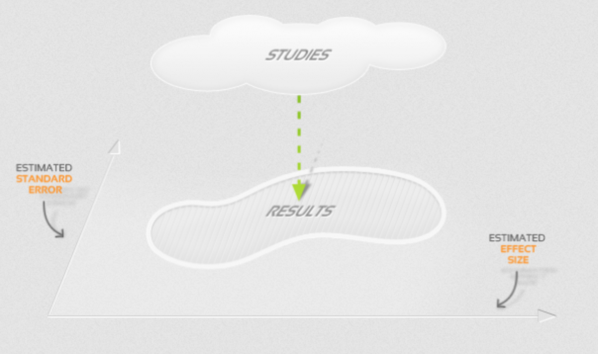
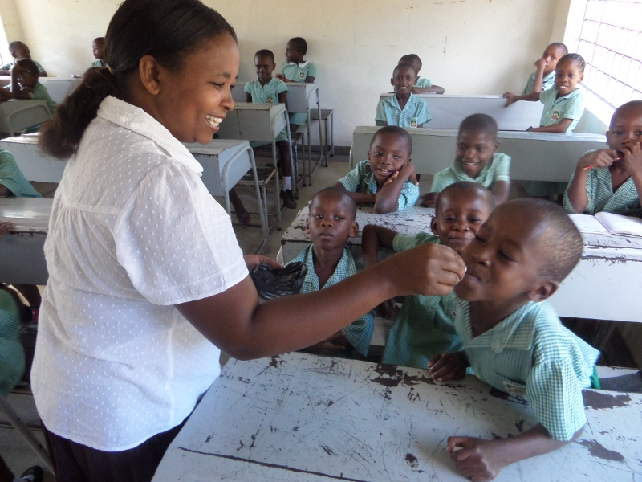
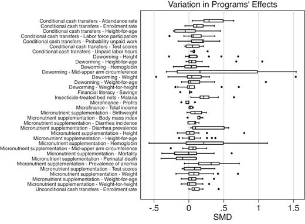
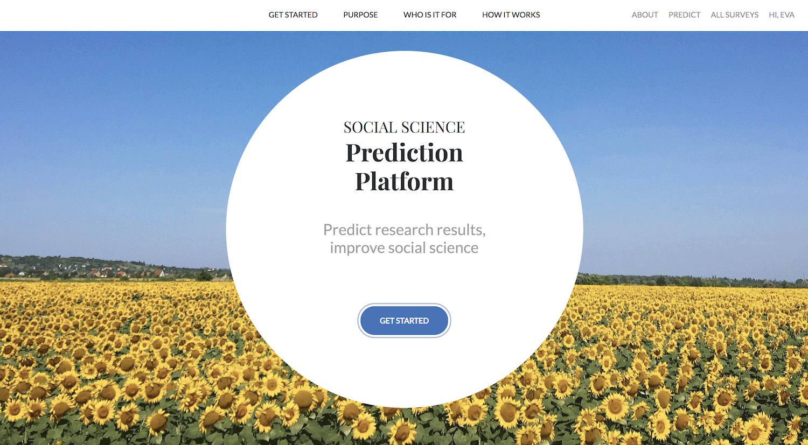
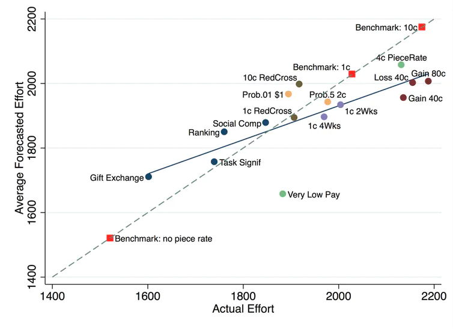

[Eva Vivalt](https://evavivalt.com/) is an Assistant Professor in Economics at the University of Toronto. Her work is focused on reducing barriers to evidence-based decision-making, global priorities research, and cash transfers.

In this episode, we discuss Eva's work on causal inference and forecasting in the social sciences. We begin by discussing how surprisingly little studies in development economics tend to generalise across different contexts and the challenges this creates for global health interventions. We touch upon the differences between "internal" and "external" validity, how academic studies affect beliefs and potential consequences for longtermism.

The second part of our discussion is about forecasting and Eva's involvement in setting up the Social Science Prediction Platform joint with [Stefano DellaVigna](https://eml.berkeley.edu/~sdellavi/index.html). This site tests the ability of researchers to guess the results of studies in advance accurately. Eva talks about how this opens up a fascinating opportunity to spot the most novel studies and how this might help combat the bias against null results in academia.

In the article below, we summarise and illustrate these key ideas, providing more detail and further readings for listeners who want to find out more.

Thanks for listening! We'd love to hear what you thought about it — email us at hello@hearthisidea.com or leave a rating below. You can help more people discover the podcast by <a href='https://twitter.com/intent/tweet?text=Check out Hear This Idea, a podcast showcasing new thinking in philosophy, the social sciences, and effective altruism! &url=https://www.hearthisidea.com via @hearthisidea&' about='_blank'>tweeting about it</a>. And, if you want to support the show more directly, consider <a href='https://tips.pinecast.com/jar/hear-this-idea'>leaving us a tip</a>.

## Book Recommendations 📚

- [Bayesian Data Analysis](https://www.stat.columbia.edu/~gelman/book/) by Gelman et al.
- [Superforecasting](https://www.goodreads.com/book/show/23995360-superforecasting) by Tetlock and Gardner
- [Capital in the Twenty-First Century](https://www.goodreads.com/book/show/18736925-capital-in-the-twenty-first-century) by Piketty

 <Book spineColor='#d52855' url="https://www.stat.columbia.edu/~gelman/book/" image="book-eva-1"/> <Book spineColor='#d51d1d' url="https://www.goodreads.com/book/show/18736925-capital-in-the-twenty-first-century" image="book-eva-2"/> <Book url="https://www.goodreads.com/book/show/23995360-superforecasting" image="book-eva-3" spineColor='#000000'/> 
 

## Context

### Motivation

[Evidence-based policy](https://www.britannica.com/topic/evidence-based-policy) is the idea that decisions and programmes should be "grounded in empirical evidence". For example, it emphasises the importance of conducting Randomised Control Trials (RCTs) to collect data before rolling out interventions on a larger scale.

This approach has gained a lot of popularity since the 1990s. Perhaps most prominently, development economics has seen a "[randomista](https://yalebooks.yale.edu/book/9780300236125/randomistas)" revolution. Banerjee, Duflo, and Kremer were [awarded](https://www.nobelprize.org/prizes/economic-sciences/2019/press-release/) the Noble Prize in Economics in 2019 "for their experimental approach to alleviating global poverty"; their book '[Poor Economics](https://www.goodreads.com/book/show/10245602-poor-economics)' has become an international bestseller; the research centre [J-PAL](https://www.povertyactionlab.org/) has promoted RCTs across the world.

Whilst there have been some criticisms that this maybe has drawn too much attention towards marginal instead of structural solutions, this has undoubtedly made the field more rigorous (*see also our [episode with Luke from GWWC](https://hearthisidea.com/episodes/luke#the-randomista-debate-rcts-and-economic-growth)*). There have been many large-scale successes, from [free malaria bednets](https://www.povertyactionlab.org/case-study/free-bednets-fight-malaria) to "[teaching at the right level](https://www.povertyactionlab.org/case-study/teaching-right-level-improve-learning)" due to RCTs. We can also see this approach as essential to highlighting the [vast differences](https://www.semanticscholar.org/paper/The-Moral-Imperative-Toward-Cost-Effectiveness-in-Ord/1016bb6788716e7b489c08853ce64f0063870a4b?p2df) in the cost-effectiveness of global health interventions and enabling charity evaluators' work (*see also our [episode with Sanjay from SoGive](https://hearthisidea.com/episodes/sanjay#the-moral-imperative-towards-cost-effectiveness)*)*.*

Additionally, we have seen evidence-based policy become influential in other government domains — such as welfare, education, and health. Eva herself is currently involved in a [three-year project](https://openresearchlab.org/basic-income/) in the US that tests the effects of a Basic Income.

Whilst there are considerable benefits to basing policy on more empirical and experimental evidence, Eva notes that it is crucial to interpret these studies carefully. As her research shows, just because your results says that an intervention was very effective in your experiment doesn't mean it will also be effective when you try to scale it up or do it somewhere else. As Eva recalls, some researchers were perhaps too naive about this fact in the earlier days of impact evaluation.

> At the time, there was a narrative like "Go evaluate something and, boom, you're done". It was Impact Evaluation 1.0 [...] I think people are more sophisticated these days.

Perhaps this isn't so obvious. Why wouldn't we expect to get the same results we ran in a study elsewhere? If insanity is "doing the same thing over and over again and expecting different results", then surely the sane thing to do is to assume just that? There are two categories of reasons why one study's results might not hold elsewhere: internal and external validity.

##### Source: [AidGrade](https://www.aidgrade.org/)

### Internal Validity

Internal validity is "the ability to get an unbiased estimate of the effect of interest". In layman's terms, it means that the researchers did everything correctly within the context of our particular study.

For example, if they had a treatment and control group, they properly randomised who goes into what group and control for any confounding variables (avoiding [selection bias](https://hearthisidea.com/episodes/jaime#an-econometric-model-of-causality)). They would also need to have used a sufficiently large sample, avoided any [(observer-) expectancy effects](https://en.wikipedia.org/wiki/Observer-expectancy_effect), prevent participants from dropping out etc. All of this comes back to a good experimental design.

To give a short illustrative example, suppose we are interested to see the effect that the treatment ($T$) of a job-search programme has on the outcome ($Y$) of wages. We are interested in estimating the following equation:

$Y=\beta_0+\beta_1T+e$

Here $b_{0}$ represents the baseline wages that somebody would earn regardless of attending the programme, $b_{1}$ represents the additional wages that the programme creates, and $e$ is the residual (i.e. individual randomness). A non-attendee ($T=0$) would be expected to earn $b_{0}$; an attendee ($T=1$) would be expected to earn $\beta_{0}+\beta_{1}$. A policymaker would be interested in having an unbiased estimate $\hat{\beta_1}=\beta_1$, as this is essentially the benefit that the programme creates. They want to scale this up nationally but first run a pilot programme to collect some data.

A naive approach would be just to run the programme and then compare the wages of those that attended the programme with those that didn't. The problem is that this allows for **selection bias**. For example, if you freely choose to join a job-search programme, you might be more motivated ($X$) to begin with and hence earn higher wages regardless. The "true" equation is actually:

$Y=\gamma_0+\gamma_1T+\gamma_2X+u$

The true effect of the programme is thus $\gamma_1$. But in our naive set-up we actually estimate $\hat{\beta}_1=\gamma_1+\gamma_2$. All attendants receive the treatment and are motivated ($T=1,X=1$); all the non-attendants are neither ($T=0, X=0$). We mistakingly attribute all the "motivation" effect to the programme and thus bias our estimate upwards by $\gamma_2$.

Were we to then scale-up that programme nationally so that everyone (motivated or not) had to take part, we would get much worse results than expected. Running the experiment again gives us different results!

### External Validity

External validity is "the ability to predict results outside of the sample". Here we assume that the researchers have done everything right in their experiment to get an unbiased estimate. However, the conditions in which they did this experiment might be very different elsewhere. As Eva explains:

> You can have a perfectly internally valid study, but it's only valid for that one thing that happened, and it's already in the past. Even if you were to redo it in the same setting, it's not clear that you would necessarily get the same results because, if nothing else, you would have hoped that the previous treatment had changed something.

For example, suppose you run an anti-malaria bed nets programme in a rural Kenyan village. You find that this treatment ($T$) has outstanding effects on people's health ($Y$). Does this mean that running the same treatment in a UK village will produce similar benefits? Clearly not — malaria isn't a problem in the UK, so bed-nets won't have an effect. Note that by the same logic running the same treatment in the *same* Kenyan village again will likely produce lower results, as people will already now have bed nets from the first time.

These examples are perhaps oversimplified, but we see an important point. What greatly matters for the effectiveness of the bed-nets programme are the baseline rates. If there is not much malaria to begin with, then bed nets will not have much of an effect. So will running the same treatment in a *different* Kenyan village produce similar benefits? It's not apparent that it will! It could be that the baseline malaria infection rate is very different, such as the village being on a higher altitude.

One of Eva's [papers](https://evavivalt.com/wp-content/uploads/2015/05/aer20151015.pdf) shows how we can think of external validity as linked to the idea of "Heterogenous Treatment Effects". In our case, we can't say that deworming just has one underlying treatment effect; it fundamentally changes with context. We could get lots of different results about the same intervention that are all internally valid but still different.

Again we start by trying to estimate the treatment effect using this basic equation that researchers will try to estimate:

$Y=\beta_0+\beta_1T+e$

We run this experiment in two contexts, one with additional context $C$ and one without. This context is somehow linked to our treatment $T$ (e.g. the baseline malaria rate matters for bed net effectiveness but differs in two villages). So our "true" equation is actually:

$Y=\delta_0+\delta_1T+\delta_2C+\delta_3T*C+\epsilon$

- Note that if $C=0$, then $Y=\delta_0+\delta_1T+\epsilon$

- Note that if $C=1$, then $Y=(\delta_0+\delta_2)+(\delta_1+\delta_3)T+\epsilon$

In our first study, this additional context doesn't matter ($C=0$), so our "original" treatment effect is $\delta_1$. Estimating this using our basic equation is internally valid (as we get $\hat{\beta}_0=\delta_0; \hat{\beta}_1=\delta_1$).

In our second study, this additional context does matter ($C=1$), so our "alternative" treatment effect is $\delta_1+\delta_3$. Estimating this using our basic equation is also internally valid ($\hat{\beta}_0=\delta_0+\delta_2; \hat{\beta}_1=\delta_1+\delta_3$).

So in both studies, our basic estimation is internally valid but get different results. The underlying treatment effect is heterogeneous across the two contexts. Just running the experiment in one context and then assuming it will generalise in the other would give us misleading results.

We can use this framework better understand lots of academic debates, such as the so-called '[worm wars](https://blogs.worldbank.org/impactevaluations/worm-wars-anthology)'. This discussion was essentially about whether the original findings by [Miguel & Kremer (2004)](https://cega.berkeley.edu/assets/cega_research_projects/1/Identifying-Impacts-on-Education-and-Health-in-the-Presence-of-Treatment-Externalities.pdf) — which showed that deworming was one of the most cost-effective interventions to boost education and health outcomes — are generalisable across different contexts. The debate mattered a great deal because MK's findings are widely used as the benchmark for deworming interventions. For example, GiveWell directly cites MK as why they have deworming charities as four of their [top recommendations](https://www.givewell.org/charities/top-charities).

Note: In our episode with Eva, we did not actually discuss the worm wars. This example here is just to illustrate external validity in the "real world", not an actual discussion of the results. For listeners interested in this topic, you can find good discussions of this <a href='https://blog.givewell.org/2017/01/04/how-thin-the-reed-generalizing-from-worms-at-work/'>here</a> and <a href='https://blog.givewell.org/2017/01/04/how-thin-the-reed-generalizing-from-worms-at-work/'>here</a>.

One aspect particularly worth highlighting for external validity is the role of [El Niño](https://en.wikipedia.org/wiki/El_Niño). When MK did their RCT in Kenya, they ran the experiment during a time of extraordinary flooding caused by the El Niño climate pattern (which happens about once every five years). This fact meant that villages in the study had abnormally high hookworm infection rates, [possibly](https://blog.givewell.org/2012/12/05/revisiting-the-case-for-developmental-effects-of-deworming/#ExtValidity) up two-three times the standard rate. Hence, there is a reason to believe that deworming would have been unusually effective during the study and not generalise to the broader contexts that GiveWell cares about.

Essentially, we can think of El Niño as an "additional context" $C$, which creates a heterogeneous treatment effect. MK ended up measuring $\delta_3+\delta_1$, when most NGOs and governments are interested in $\delta_1$. Relying on El Nino estimates could overstate the actual treatment effect by $\delta_3$. This upwards bias may or may not be enough that deworming isn't one of the most cost-effective interventions out there.

One way to solve this problem is to run a new set of RCTs altogether and try just to measure $\delta_1$. But doing this at the large scale that MK did is very expensive and takes a long time (we still have results coming out [20 years later](https://www.nber.org/papers/w27611)). Moreover, the MK study does have lots of interesting and useful information, which we don't just want to discard. An alternative way is to be careful when interpreting these findings in other contexts. For example, GiveWell uses MK's studies but [adjust](https://docs.google.com/spreadsheets/d/16XOOB1oWse1ICbF0OVXUYtwWwpvG3mxAAQ6LYAAndQU/edit#gid=472531943) their results by 13% and [explicitly account](https://docs.google.com/document/d/18G1ibple0cSP5qk9dCyru_MLe6ghc8qbIqC1ryJCi3o/edit#) for countries' different worm burdens. Thereby GiveWell essentially tries to estimate what $\delta_3$ is and tease out $\delta_1$ accordingly. Doing so, they still conclude that deworming is one of the most cost-effective interventions in global health.

#####  Giving out deworming tablets (Source: [The Good Life Orphanage](https://www.flickr.com/photos/63905858@N00/27273663902/in/photostream/))

### General Equilibirum Effects

Another aspect of external validity to consider is how interventions themselves change as they get scaled up. These are known as General Equilibrium effects. Things might work well to begin but ultimately become self-defeating. As Eva notes, this is a particular threat to the evidence-based approach:

> It's a little bit alarming because you'd think that we do these studies with smaller-scale pilots in the hope that they do very well and we can scale them up to do very well. But there's a number of ways in which that scale-up can kind of break down.

A famous example of this in economics is the "Tennesse Study" by [Krueger & Whitmore (2000)](https://www.nber.org/system/files/working_papers/w7656/w7656.pdf). Also known as Project STAR, it saw almost 12,000 kindergarteners randomly assigned to different class sizes. It was a vast undertaking, lasting nearly 20 years and costing $12m. Its purpose was to see if small classes could positively boost long-term effects on education and wage outcomes. The results were promising, showing that smaller-class students scored significantly higher in tests, lowered racial inequalities, and raised lifetime earnings.

However, [Jepsen & Rivkin (2009)](https://ideas.repec.org/a/uwp/jhriss/v44y2009i1p223-250.html) went on to challenge that, in turn, means that smaller classes are a cost-effective intervention. They pointed out that when California invested a billion dollars into smaller class sizes — a much more enormous undertaking than the original study — this created a demand for around 25,000 new teachers. Inevitably, this sudden rise in demand could not be met and instead saw an influx of much lower-quality staff. Even worse, there was a large reassortment of experienced teachers to newly created positions in affluent communities, deepening inequalities. The final effects were much less impressive than in the KW study. Most of the benefits of class reduction by ten pupils can be offset by a teacher with two (as opposed to one) years of experience — a much more cost-effective method.

Again, the point is not that the KW study was internally flawed. It may very well be that the effect in Tennesse was very cost-effective. The point is that just because it worked well at a \$12m scale does not mean it will work well at a \$1bn scale. When projects get this big, there are lots of factors and unintended consequences we need to consider.

We can imagine lots of other cases too. If an intervention boosts people wages just because it makes them *relatively* more productive, then giving those interventions to everyone will achieve nothing. If everyone has priority boarding, then no one has priority boarding. A pertinent example of this is [Bianchi's (2015)](https://siepr.stanford.edu/sites/default/files/publications/15-008_0.pdf), who looked at the effects of Italy's 1961 rapid increase in university STEM enrollment. It turned out that this education expansion reduced the returns to STEM skills so much that inframarginal students who chose to enrol earned no more than before.

Additionally, we might also consider how implementing the policy itself changes as a programme becomes larger. Typically, small pilot schemes are run by academics and NGOs, highly motivated and skilled in this specific domain. When governments scale these up, we can imagine how these become less effective as bureaucracy is introduced. [Bold et al. (2013)](https://ideas.repec.org/p/csa/wpaper/2013-04.html) provide an interesting case study of this, where the same intervention has a positive effect when NGO-led but zero effects when government-led.

(Eva also mentions how an alternative reason might be that academics and NGOs are also more incentivised to get significant results, so they might put more effort into delivering an intensive treatment. NGOs also typically run studies with smaller samples, which are generally more affected by outliers that drive up effects)

Fortunately, as Eva mentions, there are many organisations focused on precisely this issue of scaling up policy interventions. [Y-RISE](https://yrise.yale.edu/) is an excellent resource for listeners who are interested in more on this!

### Putting this all together

These challenges to evidence-backed decision making can, by and large, be seen as challenges to social science in general. They are also all things that economists have long been aware of ([including](https://economics.mit.edu/files/800) by the randomistas themselves). These concepts are taught in introductory metric classes, and I strongly recommend people who want to learn more check out [Mostly Harmless Econometrics](https://www.mostlyharmlesseconometrics.com/).

In particular, researchers have paid a lot of attention to internal validity. If your results cannot even accurately describe your experiment, it's tough to use them to make recommendations for anything else. As [Campbell (1957)](https://psycnet.apa.org/record/1959-03494-001) famously put it:

> If one is in a situation where either internal validity or representativeness must be sacrificed, which should it be? The answer is clear. Internal validity is the prior and indispensable consideration.

However, just because internal validity is necessary doesn't mean it is sufficient. As we have seen, lots of things can go wrong if you have poor external validity. And in some ways, this is an easier mistake for policymakers because external validity is not as apparent a concept. As we will see, Eva pushes for researchers to pay more attention to these external validity concerns too.

This trade-off is a common critique we hear about RCTs in general. Because RCTs are very good at fully randomising treatment and control groups, they are often treated as a "gold standard" for internal validity. However, as [Young (2018)](https://personal.lse.ac.uk/YoungA/ChannellingFisherQJE.pdf) points out, RCTs are very expensive to run and hence tend to have small sample sizes. This aspect makes them more susceptible to outlier observations, particularly for heterogeneous effects, and thus often predict poorly out of sample even when unbiased.

## [How Much Can We Generalise From Impact Evaluations?](https://academic.oup.com/jeea/article-abstract/18/6/3045/5908781) (2020 Paper)

### Collecting data in development economics

Eva's critical insight into this external validity question is measurable and testable. In development economics, there are often several studies on the same intervention. We can test generalizability just by looking at how well papers predict the results of similar documents in other contexts.

> I thought we have all these results; it would be great to synthesise them and say more about what works in a systematic way because any one study is probably not going to have a complete picture. I didn't quite understand the extent to which any one study doesn't have much of a picture at all.

Eva set out to do this when she founded [AidGrade](https://www.aidgrade.org/), creating a data set of 15,000+ estimates from 600+ papers on 20 types of interventions in international development. Plotting out these meta-analyses, we get the following figure (click [here](https://www.aidgrade.org/meta-analysis) for an interactive version):

### Measuring external validity

The next critical insight is that we don't have to treat external validity as some binary choice which either does or does not hold in a study. Instead, we can be much more precise and look at just how much results tend to generalise. This [paper](https://academic.oup.com/jeea/article-abstract/18/6/3045/5908781?redirectedFrom=fulltext) lays out Eva's methodology. She expands two measures that were developed by [Gelman and Carlin (2014)](https://journals.sagepub.com/doi/10.1177/1745691614551642) to looks at whether studies replicate in the *same* setting — that is a measure of *internal* validity. These measures are as follows: 

- **Type S error:** the probability of an estimate being in the wrong direction
- **Type M error:** the factor by which the magnitude of an effect might be overestimated

Eva's insight was that we build on these concepts to quantify whether studies replicate in different setting — that is a measure *external* validity. This gave us a new way to test generalisability using a Bayesian model (see Eva's paper for more details on how this works).

A Type S error essentially looks to see if, based on other studies, our inference about different study's results will have the correct sign. For example, in the context of external validity, if all the papers suggest that deworming pills increase children's height, then a Type S error will occur if a new paper finds it to have a negative effect.

This criterion might feel like a low bar, especially since we can reasonably think that all of the 20 interventions listed will at least do *some* good. But Eva shows that a surprising amount of studies fail even this test: "an inference about another study will have the correct sign about 61% of the time for the median intervention–outcome pair". In other words, **when existing evidence suggests that an intervention is good, in almost 40% of cases, it ends up hurting people (or vice versa).**

A Type M error is similar but instead looks to see how far apart our "inferred" mean is from the study's actual mean. For example, in the context of external validity, if all the papers suggest that deworming pills will increase children's weight by $X$ standard units, but a new paper finds a significant effect of $Y$, our Type M error will be of size $\frac{Y}{X}$. That is how much the study "exaggerates" from the supposed true effect. In really extreme cases, $Y$ might even fall outside any sort of confidence interval that we can construct around $X$.

Again, the results are pretty shocking. "If trying to predict the treatment effect of a similar study using only the mean treatment effect in an intervention–outcome combination, the median ratio of the root-mean-squared error (pMSE) to that mean is 2.49 across intervention–outcome combinations". In other words, **when you predict a result in a new setting based on existing evidence, you'll likely be wrong by an average of 250%.** For example, if the past data on deworming suggests that it will increase children's weight by an average of +0.75kg, you should expect that a new study will be anywhere between -1.1kg to +2.6kg. Regarding confidence intervals, Eva found that one paper's confidence interval will only contain the mean of a similar study 53% of the time.

As Eva summarises it in our interview:

> The most naive thing you could do is simply pool all the studies together and take the weighted average — that's basically what a meta-analysis does in some way — of all the different studies on this particular topic and use that as your best guess for what comes next. If you do that, good luck to you. You'll find that it has an effect $x$, give or take $x$ itself. I mean, it's worse than that, really; it's pretty bad.

Controlling for some meta-factors helps somewhat. As we have previously hinted at, Eva found that smaller studies tend to have more significant effects. Additionally, government-implemented programmes tend to have more minor results than academic or NGO programmes. There is also some general sampling variance that we expect to occur naturally.

However, Eva notes that the general picture does not really change: There is a lot of variance in external validity, and we can't explain it away.

### Finding evidence-backed interventions

With such considerable uncertainty, is there any hope for evidence-backed policy in the development economics and elsewhere?

Fortunately, Eva points out that external validity varies a lot by the types of interventions. Whilst there are not many intervention-outcomes with a Type S error of below 10%, some do exist: Bed nets reliably decrease malaria and improve health; conditional cash transfers improve education enrollment rates. Looking at the previous figure, we saw just how different confidence intervals are, and some are narrow enough to be deemed reliable.

Asking Eva about what sets apart an intervention with "good" external validity, she answered the following:

> The thing that seemed most predictive from my perspective was how close a relationship there was between the intervention and the outcome. What's the path through which it's meant to have an impact? How direct is that?

> For conditional cash transfers, that's pretty direct. You give people cash, and you explicitly condition on that particular thing [...]. Contrast that with microfinance, which we know doesn't work very well. If you think about it, there are actually many conditions that need to fall in place in just the right way for it to have a real effect. Things need to be screwed up enough that people don't have access to finance but not so screwed up that they can't make profitable use out of it.

### Implications for researchers and policymakers

Eva also notes that her results also shouldn't just be seen as doom and gloom. If anything, it highlights the importance of having evidence that accurately reflects the desired conditions:

> The fact that we can't generalise very well from one context to another doesn't say we should give up the whole enterprise. It says that we should have more local studies if that's the way you want to go. If you need certainty, then you should be doing more studies, not less.

There are some steps that researchers can take to help improve this situation. One is to better communicate to policymakers (and the public at large) about interpreting results. The impact evaluations briefs that policymakers see are much shorter than the academic papers they are based on. Eva notes that major publications like the World Development Report often do not include essential information on contexts, study design, or even standard errors.

Other times, the information is, in fact, not even presented in the original study. In AidGrade's dataset, 20% of papers did not make it clear what type of organisation implemented the program, 25% failed to report how much time had elapsed from the intervention to the collection of data, and fewer than 10% reported a causal chain by which an intervention was thought to work. As we have seen, though, this information can be vital for decision-makers when interpreting the evidence.

Eva has also done work explicitly on how policymakers update their beliefs based on different kinds of evidence. There are generally biases we might want to keep in mind when communicating results, mainly that people tend not to give enough weight to new evidence in general but are over-optimistic about good news. You can find her paper [here](https://evavivalt.com/wp-content/uploads/How-Do-Policymakers-Update.pdf).

> [Policy makers and researchers] had different priors, but not different biases. This really suggested that they were exposed to different information and that this might be what drives the different beliefs that policymakers and researchers have. Maybe they search for information differently. But in terms of how they interpret impact evaluation results, it seems to be roughly the same.

An exciting tangent we touched upon in the interview is how policymakers should act when faced with very limited or uncertain data. As Eva notes, this is linked to ideas of "patient philanthropy" and longtermism. Rather than acting now, we can wait and increase our resources to use at a later date. This makes particular sense if you have any risk aversion or asymmetric pay-offs whereby "getting it wrong" has terrible consequences.

> If you don't know very much, then the temptation is -- and I think it's the right impulse — that if there is some hope you can learn more in the future, then there is some option value to waiting for the future. And if you can push some of the decisions to later, then push some of the decisions to later. You are saying you are still in the "explore" part of the [explore-exploit trade-off](https://conceptually.org/concepts/explore-or-exploit).

## Prediction and Forecasting

If we know that existing studies often fail to generalise, and if running new studies is prohibitively expensive, we might then be interested in other ways to help inform decision making. In the second part of our interview, we move from external validity questions in social science to forecasting. As Eva puts it:

> What can we do instead? I think that's where my work on forecasting is getting into a little bit. Can we forecast some of the results of impact evaluations pretty well? Because if we can, or if we can at least learn how they are wrong and how they can be debiased, then that gives us some kind lever and some ability to say something in those cases where we don't have an unbiased RCT

In the second part of our interview, we then explore her work on the [Social Science Prediction Platform](https://socialscienceprediction.org/). It allows researchers to collect and assess an array of expert forecasts of various studies' effects before they run them.

### [Predict science to improve science](https://science.sciencemag.org/content/366/6464/428.full)

Together with Stefano DellaVigna and Devin Pope, Eva lays out in an [article](https://science.sciencemag.org/content/366/6464/428.full) why they think this can improve science.

Firstly, if academics are pretty good at forecasting studies in advance, we can use their judgements to inform decisions in areas where runnings those studies might not be possible. For example, [DellaVigna and Pope (2018)](https://www.nber.org/papers/w22566) found that a group of 200 forecasters could predict a range of treatments to induce effort very well. We show this in the figure below. As a group, they outperformed 96% of individual forecasts.

#####  Source: DellaVigna and Pope (2018)

Whilst Eva notes that these forecasts are not perfect, they can still be instrumental:

> If you are using [forecasts] in a more principled way, I think they are certainly going to be somewhat informative. I am personally of the belief that if your data source is at least partially informative, then use it. We know it's not 100% correct — nothing is 100%. But if it's partly getting you in the right direction, absolutely use it.

This is a similar effort to other projects that attempt to crowdsource opinions on meta-science. For example, in the wake of the [replication crisis](https://en.wikipedia.org/wiki/Replication_crisis), many organisations have attempted to gather expert opinions to predict what social science studies are robust — as trying to replicate all of them is way too large an undertaking. DARPA's [SCORE](https://www.darpa.mil/program/systematizing-confidence-in-open-research-and-evidence) Project is the most major undertaking, but there are also other [replication markets](https://www.replicationmarkets.com/) that anyone can get involved with (see [here](https://fantasticanachronism.com/2020/09/11/whats-wrong-with-social-science-and-how-to-fix-it/) for a discussion of results).

Secondly, SSPP can help identify which areas are very valuable to explore. If there is no consensus by experts about a specific treatment's anticipated effects, we can likely suspect that gaining more evidence in this domain would be particularly valuable. As the article puts it, we can use forecasts "to gauge which treatment arms would have higher values of information".

Thirdly, we can also use forecasts to better interpret studies afterwards. For example, if we see that academics strongly anticipated that treatment would not work, but then a study finds that it did, we know that this is a novel result that should update views. Having a database of priors allows us to do this in a systematic and Bayesian way. We can also see if people have updated their views the next time a similar study gets done.

> The surprisingness of a result is a little bit of a double-edged sword. If it's really surprising, it's a great contribution — but only if it's correct. There's also a higher chance that it's not replicable for a Bayesian, that you mind some error somewhere, or that there was something special about your context that makes it have less external validity.

Lastly, researchers might also be interested in using academics' forecasts to evaluate their own results. Most of the time, when social scientists run their experiments, they test whether their results are statistically different from zero. Many academics point how there has long been a [publication bias](https://science.sciencemag.org/content/345/6203/1502.abstract?casa_token=VL4fLUtqP4sAAAAA:UyWhD82LBJeChSQJjW54hjYSMevIm6TzSrvugt0hRPokGH5H_IqLgqphCiNd7YET5G5lw5dg8-C0IMc) against such null results, as they are deemed less interesting.

$H_0: \mu=0$

$H_1: \mu\neq0$

But Eva asks "is zero even the right reference point?". For example, if the consensus view is that a treatment has positive effects, finding a null result would be important information. Hence, if priors are collected before carrying out a study, researchers can compare the results to the average expert prediction, rather than to the null hypothesis of no effect. Often, just having a sample of 15-30 predictions is enough to get sufficiently precise (and hence testable) priors.

$H_0: x=\text{forecast prior}$

$H_1: x\neq\text{forecast prior}$

### Covid-19 Model Challenges

Lastly, we talk about how there is scope not just to predict results but even models themselves. Eva discusses her involvement in the [Covid-19 Model Challenges](https://eos.wzb.eu/ipi/shiny-covid-crowdsourcing/). This project invited teams to build a statistical model using a few selected political and social variables to predict future Covid mortality numbers and outcomes in mid-2021.

We can think of why there are numerous advantages to predicting models instead of just outcomes. As Eva reflects:

> I think part of the advantage is if you are asking people to forecast how well models perform, then you can take those models to other data and be informed about more than one context. If you just asked them to predict mortality, well, lots of things can get into that. Say you have a bunch of different parameters in your model. Once those parameters change, you can know what will happen if the coefficients stay the same. Alternatively, you could end up in a world where the coefficients don't stay the same — and here, you would really need a model to get a picture of what is happening.

When we are asked to predict a model, we have to develop both variables that we think are important and weights that indicate just how much we believe they matter. This methodology can help inform predictions in different contexts, rather than having to come up with entirely separate forecasts. For example, suppose we believe that democracy is important for predicting Covid-19 mortality rates. In that case, we can use it as a dummy variable in the same model to forecast both British and Chinese trends.

Explicitly putting variables and coefficients down can also help us learn where we are going wrong. We might have picked the correct variables but chosen the wrong weights. Or it could be that the weights used to be accurate but have "drifted" (e.g. fax machines may have been predictive of business productivity in the 90s; now, if businesses still use fax, it's probably the reverse). These mistakes can be fixed iteratively in a model as we get better data.

Another crucial part of the project is the so-called "stacking" approach. The project asked teams to submit individual models of just three parameters. Then all these models get "stacked" together. The project then rewards teams according to how much "weight" their parameters are given in this meta-model. This set-up incentivises teams to search out unique variables that will add to the wisdom of the crowd.

To give an illustrative example, suppose that I want to develop a model that can predict people's wages $Y$. If I only include a single variable, university attendance, then this will have a certain amount of weight assigned to it:

$ Y=\beta_0+\beta_1\text{University}+\epsilon $

If I add an almost identical variable, like a bachelor's degree, I don't add much new explanatory power, and the weight gets split up between the two variables. If everyone who attended university also has a bachelors degree, then by definition $\beta'_1+\beta'_2=\beta_1$. So our original university variable gets less weight $\beta'_1<\beta_1$.

$ Y=\beta'_0+\beta'_1\text{Univeristy}+\beta'_2\text{Bachelor}+\epsilon$

More generally, we can imagine that adding variables that are correlated will decrease their respective weights. For example, adding school attendance is not identical to university (increasing our model's overall explanatory power) but still somewhat linked (decreasing the total weight given to university).

$Y=\beta''_0+\beta''_1\text{Univeristy}+\beta''_2\text{School}+\epsilon''$

So if we want to add variables that receive the most amount of weight, we want to find ones that (1) explain the outcome a lot and (2) are uncorrelated to other variables already included. This second element is what incentives novel approaches in the "stacking" approach.

Whilst there are many challenges in coming up with good forecasting models, Eva believes that this has vast potential. If things like SSPP and the Covid-19 Model Challenge are successful, we can certainly imagine how they will change how social-science and policy-making get done.

> Ask me to predict a number, and I might take 30 seconds to give you an answer; ask me to predict a model and how this model stacks versus this model and how they all fit together — that's a much harder question to ask. But if people can do it, then that's really informative. So I think one of the things we are learning here is how well people can do and can people put good weights on these models? Really it's about whether this a worthwhile direction to go.

### Resources

- Eva's [website](https://evavivalt.com/) — do get in touch if you are interested in this work (especially, but not exclusively, if you have web development or ML skills)
- AidGrade's [website](https://www.aidgrade.org/)
- SSPP's [website](https://socialscienceprediction.org/) — Grad students can earn a $25 Amazon gift card!
- [Covid-19 Model Challenges](https://eos.wzb.eu/ipi/shiny-covid-crowdsourcing/)
- [Article](https://fantasticanachronism.com/2020/09/11/whats-wrong-with-social-science-and-how-to-fix-it/) on DARPA's SCORE Project
- [The Hidden Half](https://www.goodreads.com/book/show/44776411-the-hidden-half) by Michael Blastland
- [Mostly Harmless Econometrics](https://www.mostlyharmlesseconometrics.com/)

Thank you very much to Eva Vivalt for her time.

Thanks for listening <i>and</i> reading the write-up! We'd love to hear what you thought about it — email us at hello@hearthisidea.com or leave a rating below. You can help more people discover the podcast by <a href='https://twitter.com/intent/tweet?text=Check out Hear This Idea, a podcast showcasing new thinking in philosophy, the social sciences, and effective altruism! &url=https://www.hearthisidea.com via @hearthisidea&' about='_blank'>tweeting about it</a>. And, if you want to support the show more directly, consider <a href='https://tips.pinecast.com/jar/hear-this-idea'>leaving us a tip</a>.

