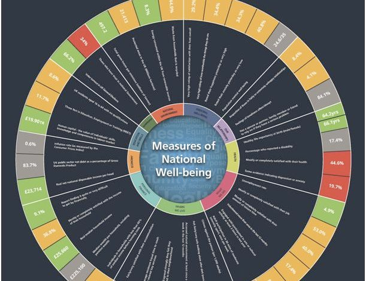

In the article below, we summarise and illustrate these key ideas; providing both more detail and further readings for listeners who want to find out more.

Anna Alexandrova is a Reader in Philosophy of Science at University of Cambridge and a Fellow of King's College, having previously taught at the University of Missouri St Louis. Anna studies the philosophy of social sciences, focusing on the use of formal models and the science of well-being. She is the author of *[A Philosophy for the Science of Well-Being](https://www.goodreads.com/book/show/34342094-a-philosophy-for-the-science-of-well-being)* (2017).

Is there, or should there be, a single measure of overall well-being? Can the science of well-being be objective, or does any plausible measure rely on values? And what do philosophers mean by "well-being" in the first place? These are the topics of the first part of our conversation, which turns into a broader discussion of technocratic versus democratic approaches to constructing measures of well-being.

Next, we discuss the use (and abuse) of formal models in economics. Anna has argued that formal models derived from the '[rational choice](https://www.investopedia.com/terms/r/rational-choice-theory.asp)' framework have become overrated as tools for explanation. Instead, Anna says, the economics discipline would do well to pay more attention to historical explanations and qualitative evidence. We ask Anna about how economics might become more receptive to such alternative methods and sources of evidence.

We finish by talking about Anna's own field of study — philosophy of science — and how it should stand in relation with the sciences. Should philosophers of science stick to asking highly conceptual questions about things like "the scientific method"? Or is it appropriate to weigh in on conversations about more practical matters — about actual norms and institutions?

In the article below, we summarise and illustrate the key ideas from the interview; providing both more detail and further readings for listeners who want to find out more. The article is not a transcript: you don't need to listen to the episode to read it, nor should listening to the episode make it redundant.

Thanks for listening! We'd love to hear what you thought about it — email us at hello@hearthisidea.com or leave a rating below. You can help more people discover the podcast by <a href='https://twitter.com/intent/tweet?text=Check out Hear This Idea, a podcast showcasing new thinking in philosophy, the social sciences, and effective altruism! &url=https://www.hearthisidea.com via @hearthisidea&' about='_blank'>tweeting about it</a>. And, if you want to support the show more directly, consider <a href='https://tips.pinecast.com/jar/hear-this-idea'>leaving us a tip</a>.

## Anna's Recommendations 📚

- [The Pursuit of Unhappiness: The Elusive Psychology of Well-Being](https://www.goodreads.com/book/show/4948737-the-pursuit-of-unhappiness) by [Daniel M. Haybron](https://www.goodreads.com/author/show/3128841.Daniel_M_Haybron)
- [Hunting Causes and Using Them](https://www.goodreads.com/book/show/552618.Hunting_Causes_and_Using_Them) by Nancy Cartwright
- [Uses of Value Judgments in Science](http://web.mit.edu/~sgrp/2006/no1/AndersonUVJS.pdf) by Elizabeth Anderson

 <Book spineColor="#d7d4cf" url="https://www.goodreads.com/book/show/4948737-the-pursuit-of-unhappiness" image="book-anna-1"/> <Book url="https://www.goodreads.com/book/show/552618.Hunting_Causes_and_Using_Them" image="book-anna-2" spineColor="#7da58a" /> <Book url="http://web.mit.edu/~sgrp/2006/no1/AndersonUVJS.pdf" image="book-anna-3"  spineColor="#ff8685" /> 
 

## Measuring Well-Being

In philosophy, ‘well-being’ refers to what is intrinsically or non-instrumentally good for someone. Whereas instrumental goods like wealth are valuable only as a means to something else, well-being is what ultimately makes someone’s life go well. Yet, 'well-being' is not just a philosophical term of art, but "one of those vague concepts that has had a place in many different spheres of life." Here Anna's work can be distinguished from much philosophical writing about well-being — it takes this diversity of conceptions as a starting point, rather than a complication to define away.

> I think it's really important to recognise the parochialism of the question — when a philosopher's asked to define well-being, they will be talking within this specific context, which is doing ethics and metaethics in the analytic tradition in the 20th and 21st century. This is the point at which 'well-being' gets identified with the kind of value which is not moral value, not aesthetic value, and not political value. It's *prudential* value — what is good for someone. It's a circumscribing move which philosophers make which is [sometimes] unrecognisable to others.

Indeed, the idea of distinguishing different kinds of good — from 'well-being' as 'good for me', moral goodness as 'good for others', and even aesthetic goodness — has not always been obvious. Aristotle, for instance, entertained a holistic conception of goodness, where my well-being is largely constituted by both the moral goodness of my actions.

The philosophical concept of well-being is also unusually abstract, Anna points out.

> The person has to be just a person, not someone embedded in a context, in a culture and a history. We try to come up with a theory at the most abstract level which would work for everyone [...] philosophical theorising about well-being is a very peculiar exercise. The big question for me has always been "how do you connect that peculiar exercise to the practise?"

There is a rich and ongoing philosophical discussion about what constitutes well-being at this most general level. For instance, is well-being ultimately constituted by positively valanced experience (hedonism), the fulfilment of certain desires (desire satisfaction theories), or some list of objective goods like knowledge, virtue, and physical health (objective list theories)? Whatever the answer to this question, it prompts a further one: how do we translate from this 'high-level' philosophical theory to various 'mid-level' theories of well-being? Here, a 'mid-level' theory is some account of well-being specific to a particular kind of person in a particular context — such as child well-being, or well-being in the context of palliative care. They also suggest practical measures and indicators, such as stages in infant development or signs of physical discomfort. Mid-level theories pay in generality what they gain in usefulness: they can motivate actual policy or practice. This question of moving from high to mid-level theories, Anna claims, is at least as important as the abstract question about what constitutes well-being *in general*.

> For well-being to become an object of science, it needs to make a trip into another discipline [and so] it loses something and it gains something [...] it will become simpler, it will be more limited, and it will be represented by an indicator.

### How measures get made

How, then, have measures and mid-level theories of well-being been constructed in the past?

An early and prominent conception of well-being comes from the field of economics. As Anna describes it, economists of the 20th century noticed that the clearest counterpart to well-being in their toolbox of concepts was *preference-satisfaction*, since (economic) preferences are well defined and understood. The clearest way to measure preference satisfaction is to look at behaviour — specifically *spending* behaviour. Roughly, the more goods and services I'm able afford, the better off I'm understood to be. Put simply, the more I'm able to afford, the more options are open to me, and more options is always better than fewer. As such, consumption and income became leading indicators of well-being (or 'welfare').

Next in this rough and idealised chronology came research into 'social indicators' of well-being, beyond economic behaviour. Around the mid and late-20th century, development scholars saw a need for a more diverse array of well-being indicators, in order to track the fates of countries emerging from colonialism. These indicators included child mortality, access to education, and life expectancy. One such 'multidimensional' measure is the UN's [Human Development Index](http://hdr.undp.org/en/content/human-development-index-hdi). You can see charts tracking progress on the HDI over time and between countries [here](https://ourworldindata.org/human-development-index).

One philosophical offshoot of the focus on the development context was the so-called 'capability approach' to well-being: construing well-being as something like the freedom to achieve various human ends, such as nourishment, travel, education, and marriage. This approach is associated with Amartya Sen (*[Development as Freedom](https://www.goodreads.com/book/show/173961.Development_as_Freedom)*), and Martha Nussbaum (*[Creating Capabilities](https://www.goodreads.com/book/show/10549868-creating-capabilities)*).

In the 1980s and 1990s, well-being became an object of the psychological sciences. Constructs like [personality](https://en.wikipedia.org/wiki/Personality_psychology) had already been fruitfully explored using new statistical and survey methods, so psychologists began turning their sights to well-being.

Roughly speaking, two kinds of approach have emerged from the psychology of well-being. On the first, well-being is understood in terms of valanced (positive or negative) mental states. I am well if I experience a consistently good state of mind (peace, engagement, happiness) and rarely experience negative states of mind. On this approach, well-being is often measured by averaging or aggregating over many self-reports, prompted by randomly timed nudges through e.g. a mobile app.

On the second approach, well-being is understood in terms of overall judgements about how well one's life is going. This is different from the former approach, because people are free to incorporate factors other than their mood over time. It's also different from 'objective' measures of well-being for just the same reason — if you don't think your spending behaviour pertains to your well-being, you are free to ignore it. This approach led to a family of so-called 'life-satisfaction' measures. For illustration, Ed Diener’s popular ‘[Satisfaction with Life Scale](http://labs.psychology.illinois.edu/~ediener/SWLS.html)’ (SWLS) asks participants to respond to a series of statements on a numerical scale from ‘1 – Strongly Disagree’ to ‘7 – Strongly agree’. The statements include “In most ways my life is close to my ideal.”, and, “If I could live my life over, I would change almost nothing.”. An overall score is generated, which ranges from 0-7.

As these economic, social, and psychological measures were developed over time, and evidence accumulated, the measurement of well-being began to attract the attention of policymakers. As Anna puts it, eager policymakers from the 90s an early 00s could be imagined saying —

> We're going to fix the problems of politics by giving a neutral basis for policy, and that's going to be our evidence-based policy, and for that we're going to need a measure of well-being.

At this stage, however, the policymaker is presented with a grab-bag of options. Can they reasonably defend using just one? Better, and more defensible, to use some complex mix of all the available measures. This kind of result is reflected in the '[Measuring national well-being](https://www.ons.gov.uk/peoplepopulationandcommunity/wellbeing/articles/measuringnationalwellbeing/sept2016)' program organised by the UK's Office for National Statistics, which employed 41 (!) headline indicators. This has since been honed to a [dashboard](https://www.ons.gov.uk/peoplepopulationandcommunity/wellbeing) tracking indicators of health, wealth, education and skills.

### Subjective indicators

As mentioned, one development in the measurement of well-being has been a shift from 'crude' economic indicators (e.g. GDP) to subjective indicators (e.g. the SWLS), and interest in these approaches has recently gained momentum. Indeed, psychologists studying well-being have spend enormous effort constructing new measures, arguing that they should be taken seriously, and insisting that they can be integrated with conventional econometrics.

At the extreme, this new wave of interest in subjective indicators could entail a simplification of existing measures: from the ONS' 'wheel' of 41 indicators, to effectively a single (ultimately important) measure: self-reported well-being. What's the case for such a bold move?

Here's one version of the self-aggrandising 'origin story' for focusing on subjective well-being, which Anna relates to us.

In the late nineteenth century, economists recognised that economics should (ultimately) be about improving happiness. [Here](https://www.goodreads.com/work/quotes/96533) is 'happiness economist' Richard Layard —

> It is actually a rather sorry tale. [These economists] thought of a person's happiness as in principle measurable, like temperature, and they thought we could compare one persons happiness with another's. They also assumed that extra income brought less and less extra happiness as a person got richer.

Yet, throughout the 20th century (so says the 'SWB origin story'), economics became unhealthily fixated on the conceptual neatness that flows from abandoning messy psychological notions for easier to model facts about  consumption and finance. The commendable goal of promoting the happiness of nations was supplanted by the goal of maximising weak proxies for genuine well-being, such as GDP, 'utility', 'social welfare functions', unemployment, and inflation. You can see how well self-reported life satisfaction correlates with GDP [here](https://ourworldindata.org/grapher/gdp-vs-happiness), and read about more empirical results from the study of life satisfaction [here](https://ourworldindata.org/happiness-and-life-satisfaction).

Furthermore, the origin story continues, the reason mainstream economics assumed (and assumes) that consumption can be conflated with or taken as a proxy well-being proper is that economists make a set of assumptions about people act as if they are perfectly rational utility maximisers. But this isn't even approximately true, and so the recommendations of traditional economics aren't even approximately correct. As such, we should go 'beyond the money' and reorient economics toward what matters: how happy people in fact are.

Moreover, life satisfaction ratings provide a summary of people's priorities, as chosen *by them —* so it's the ultimate democratic measure. Who would possibly be against that?

Again, this is roughly the 'origin story' of this new wave of well-being policy optimism. Yet, Anna cautions —

> Origin stories are usually myths — let's keep that in mind.

Perhaps this story is too simple. As Anna explains, consumption surveys and the study of GDP as a policy goal are conducted less naively than their opponents suggest. And it isn't clear that measures of life satisfaction are more democratic than measures of consumption, since people are also free to trade off goods against one another in virtually any way they choose when they spend money. Next, Anna explains her positive concerns with explicitly orienting public policy toward maximising (subjective) well-being.

### Well-being policy as technocracy

The model of policymaking we have in mind here is of a some empirical expert, who constructs and conducts surveys to gauge well-being in a particular place, or before and after some intervention. The expert then reports to the policymaker, who drafts and enacts new initiatives based on the expert's recommendations. The citizens of this government, despite not being consulted on the decision-making process, stand to benefit from the new initiatives. As Anna puts it —

> [W]ell-being policy as proposed by [Layard](https://en.wikipedia.org/wiki/Richard_Layard,_Baron_Layard) and his colleagues has this vision of the expert scientist figuring out what causes well-being, and then the policymaker wants to maximise it, so the [scientist] passes on their knowledge and the policymaker figures out how to implement it.

Yet, this vision smells like the bad kind of technocracy —

> The well-being policy that is based on that does well-being *at* people, not *with* people.

Although there is a democratic flavour to responding to people's self-reported life satisfaction, failing to involve the same people in deliberations about *how* to improve their lives begins to look positively undemocratic. A person's "voice", Anna points out, should amount to more than a single number representing well-being. In other words —

> Life satisfaction is a summary of how well you think you're doing, it is not a summary of what you think matters.

This worry prompts a question —

> What would it mean for well-being policy to be not technocratic, but properly responsive to people's priorities? I think we need to get beyond that model of the expert and the policymaker figuring out what to do.

The idea here is that well-being policy as practiced (and espoused by economists like Layard) involves asking people to report on their life satisfaction through surveys, and then insists on maximising the numbers that come back — without pausing to ask the same people whether this is in fact what they want. Yet, some communities might care about issues of justice, fairness, or equality which do not necessarily manifest as overall deficits in happiness or life satisfaction. The alternative to this technocratic model, Anna suggests, is local democracy and other 'bottom-up' forms of deliberation and decision-making. Nobody is suggesting that local and/or deliberative democracy is remotely easy — indeed, one of the draws of data-driven well-being policy is that it can circumvent these processes ("squabble all you like, the numbers show that a new bike lanes just won't don't make sense on the cost-to-happiness ledger"). Nonetheless, Anna suggests it might be the only way to truly involve interested parties as stakeholders, rather than mere 'receptacles for well-being'.

Maybe this is too harsh. One thing the proponent and opponent of technocratic well-being policy can agree on is that current practise (which might largely ignore direct effects on well-being) falls short of any reasonable ideal for policymaking which is appropriately sensitive to well-being. Perhaps, then, even the opponent of *total* technocracy could agree that more top-down, evidence-based policymaking would be a good thing? Could the worries about involving stakeholders be both legitimate and entirely secondary to the point that *some* amount of broadly technocratic influence would be a good thing?

Anna isn't so sure, and she responds by highlighting a difference between theory and practice —

> The overall vision of a well-being policy is one thing, its implementation in an environment of austerity and the demise of the welfare state means that it gets plugged into existing practises in much more depressing ways than the ideal shows up.

We can imagine a politician explaining —

> Tough luck your housing is so rubbish [...] do some cognitive behavioural therapy to feel better.

Anna also points out that wonky, marginal tweaks aimed at improving measured well-being can crowd out efforts to enact more speculative, less data-driven, and more difficult kinds of structural change.

> There's this temptation to plug it in at the sides wherever we can, instead of recognising this need for deeper reform.

A (tired) medical metaphor comes to mind here, of 'plastering over' symptoms of a disease which runs deeper than the symptoms, and requires entirely different methods to fix.

The philosopher Amia Srinivasan makes a similar point as a critique of attitudes she sees as characteristic of effective altruism —

> The idea that a single anti-worm pill is the key to solving the deep societal injustice of poor education is another instance of the glib ‘freakonomics’ style of thinking that has hijacked much of the field of social studies. Claims for a pharmacological magic bullet as a solution to poor educational attainment in Africa dovetail very nicely with the prevalent ideology of international health governance, which is content to accept structural inequalities in wealth and power while focusing on vertical, narrow, top-down, and ultimately ineffective strategies in alleviating health inequalities.

The philosopher Hilary Greaves has addressed a related critique of effective altruism, to the effect that some problems are uniquely amenable to collective action, but not individual action, such that a focus on marginal (individual) interventions can end up having precisely no effect. You can watch the talk [here](https://www.youtube.com/watch?v=7KMhBrgRObA) or read the slides [here](http://users.ox.ac.uk/~mert2255/talks/collectivist_critique.pdf).

On this point, Anna points out that the margin-focused technocrat stands at one extreme, and the revolutionary at the other, and that the best path lies somewhere between them —

> My worry is that on the revolutionary extreme [...] it just forgets the fact that we've got one life to live. It would be nice to enjoy it a little bit, and sometimes all you need *is* a patch.

The 'lockdown' measures from COVID-19 provide a case where temporary, non-structural fixes really were the best thing: "all I needed were patches to get through that" Anna tells us; — "there was no question of deep structural change".

### Contextual theories of well-being

We've been considering a cartoonish idea of well-being policy as handing out life-satisfaction surveys, and using the results to design and implement policy aimed at improving it. In the last section, we considered a criticism of this approach as overly technocratic: treating people like receptacles of well-being rather than stakeholders deserving of a seat at the deliberative table.

But Anna has also raised another worry with any view that focuses on abstract, 'all things considered' conceptions of well-being, and on measures designed to fit all people in all circumstances. Clearly, phrases like 'well-being' and 'doing well' can be used in reference to all kinds of people (young children, war refugees, Manhattan socialites) in all kinds of contexts (a therapist, a close friend, a stranger asking if you're ok after seeing you fall). How should we make sense of this diversity?

Some argue that phrases like 'well-being' and 'doing well' refer to the same thing for all people and across circumstances (e.g. a certain kind of positive emotional state). Suppose my new boss asks about my well-being having settled into a new job, and I say I'm doing well, although I know that while the job is going smoothly I'm having relationship trouble at home, which is making me anxious. On this view, I have (strictly speaking) used the phrase 'doing well' inappropriately, because all things considered I'm not doing well (which isn't to say I should have told my boss the truth).

Others take a less strict view, on which well-being phrases are 'semantically invariant' (they always refer to the same underlying concept) but 'differentially realizable' — different things constitute well-being in different contexts. For instance, a young child's well-being might primarily be constituted by whether they're hitting developmental milestones, such as displaying an appropriate level of attachment to their primary caregiver. By contrast, whether a high-functioning 30-something is 'doing well' might primarily depend on whether they are actualising their projects, and on their emotional state. Yet, on this view, there's a shared underlying concept.

As Anna explains —

> Let's just think again — my city council decided to improve the well-being of people in Cambridge. What should they be doing? I think what they should be doing is very different from what my therapist should be doing, or what my close friend should be doing, or a development economist who is in charge of an overall region. The benefactor with concern for me as a person [...] she knows my priorities and the distinct challenges that I face [...] talking about my well-being with her should be a very different exercise from talking about well-being with my city council.

Anna has [argued](https://brill.com/view/journals/jmp/10/3/article-p307_3.xml?language=en) for a third view, on which the 'semantic content' of well-being phrases also varies widely across contexts. So not only does the bar for what counts as 'doing well' vary, and not only is 'well-being' realised by different things (developmental milestones versus self-actualisation), but 'well-being' actually refers to different concepts in different contexts.

> We're talking about well-being qua what? Qua individual, qua citizen, qua new mum? [...] These line up naturally with a rejection of the technocratic approach to well-being.

For instance, collective well-being is just conceptually distinct from individual well-being —

> Citizen well-being is not just an addition of all the individual well-beings. Rather, citizen well-being is a different notion.

Contextualism about well-being naturally suggests the importance of building specific theories and measures of well-being for different contexts, rather than insisting on a single, universal measure (like self-reported life satisfaction). These are 'mid-level' theories: so called because they are halfway between otiose philosophical theories and specific, concrete measures.

This said, Anna takes care to [stress](https://brill.com/view/journals/jmp/10/3/article-p307_3.xml?language=en) that a contextual semantics about well-being "does not imply that well-being is relative to individual taste, it need not result in eliminativism about well-being, nor in scepticism about a general theory of well-being." In other words, rejecting the idea of a single, objectively 'correct' measure of well-being does not mean giving up on the possibility of *expertise* about well-being ***\*—\****

> I do believe ultimately that there is such a thing as expertise about the social, and therefore there is expertise about values, because the social is value-laden. So I do passionately believe in social science, and in its power and responsibility. It probably just needs to be more spread-out and connected [with other disciplines].

Readers may be interested in this critical response to Anna's perspective: "[Against Contextualism about Prudential Discourse](https://philpapers.org/rec/FLEACA-4)" (2019).

### Can measures of well-being be objective?

A final and related question concerns whether the science of well-being can be objective. 'Objective' in this sense is contrasted with 'normative' — meaning having to do with judgements about what is good, valuable, right, or wrong. The measurement of weight, for instance, is not especially value-laden: people aren't going to disagree on definitions or measures of weight based on their views about ethics! On the other hand, a concept like health **is *plausibly* value-laden: most cases of ill health are obvious, but edge cases are going to depend on your idea of what a well-functioning body looks like, which sounds like a value judgement.

> Social science is filled with 'thick' concepts — concepts that are partly judging and partly describing, like 'progress', 'well-being', 'resilience', and 'frailty'. Because they are partly value-laden, unless you think you're an expert on values, you're going to need to be inclusive.

So can the science of well-being be objective? Clearly, well-being is a value-laden concept *par excellence*: its definition depends directly on what you think makes a life worth living. But this doesn't necessarily rule out the possibility of a *more or less* objective science of well-being. One possibility is that people's conceptions of well-being tend to be conveniently similar, and another possibility is that different conceptions of well-being are conveniently correlated. On the latter possibility, normative disagreement ends up not mattering, because different conceptions of well-being appear to 'point' to a single empirical 'cluster' or 'factor'. In either case, the science of well-being could end up being like the various health sciences (e.g. nutritional science): the basic being well-established and commanding wide agreement. Some psychologists have suggested that the process of '[construct validation](https://en.wikipedia.org/wiki/Construct_validity)' puts measures of well-being on a similar standing to measures of health. In general, construct validation involves testing to see if a proposed measure (e.g. a set of survey questions) accurately tracks the intended object of measurement, by comparing its results to predicted outcomes, other measures, and background knowledge. Anna is not so hopeful, as she explains in her paper [Is Construct Validation Valid?](https://www.journals.uchicago.edu/doi/abs/10.1086/687941?journalCode=phos) (2016), co-authored with Daniel Haybron.

## Do Models Explain?

Nearer the end of our interview, we discuss Anna work discussing the uses and explanatory power of rational choice models in economics and other social sciences. Her website outlines some key questions —

> What are researchers and users warranted to conclude on the basis of these models? What is their exact role in historical explanation and policy making? What is progress in model-based social science? Is modelling as efficient of a method of inference as its high profile indicates? (On the last question I am growing increasingly skeptical).

In the interview, we focused on one class of models: prisoners dilemmas, and a well-known application of a prisoner's dilemma model to 'explain' the dynamics of trench warfare in World War I.

As Anna puts it, the prisoner's dilemma is the "E. coli" of the social sciences: apparently every other social situation is a kind of prisoner's dilemma, if you squint hard enough. The simplest version of the PD pits two criminals, Alice and Bob, against one another. Alice and Bob are held in separate cells, and are both faced with a simple choice: do you **cooperate** or **defect**? If you cooperate with your partner, and they also cooperate (i.e. you both stay quiet), you both serve one year in prison. But if you cooperate and your partner defect ('rats you out'), you serve 3 years while your partner walks free. If you both defect (you both 'rat' on one another), you both end up serving 2 years. Since the situation is symmetrical, if you defect and your partner cooperates then you get to walk free while your partner gets to spend 3 years in prison. Lastly, you have no means of credibly committing to a course of action in advance and communicating this with your partner (nor vice-versa). Do you cooperate, or defect?

One way this simplest form can be extended is by considering what happens when the game is *repeated*, with the same partner or a pool of other players — how should you update your moves in response to other players' previous moves? Which strategies are 'stable'? Which tend to do best over time? To answer these questions, the political scientist Robert Axelrod designed a series of simulated tournaments between agents using a variety of strategies. The results were described in a landmark paper, co-authored with evolutionary biologist W. D. Hamilton, called '[The Evolution of Cooperation](www-personal.umich.edu/~axe/research/Axelrod%20and%20Hamilton%20EC%201981.pdf)' (1981). The paper soon became the most cited publication in the field of political science. You can play with a delightful interactive demonstration of the tournament [here](https://ncase.me/trust/).

In particular, the winner of Axlerod's first tournament was the 'tit for tat' strategy, which cooperates on the first move, and then does whatever its opponent has done on the previous move. Thus, two tit for tat players will always cooperate in an iterated prisoner's dilemma with an indefinite number of rounds. Axelrod proposed that this result could be used to explain the '[live and let live](https://en.wikipedia.org/wiki/Live_and_let_live_(World_War_I))' dynamic that arose in Word War I, where non-aggressive co-operative behaviour would spontaneously arise. Some excerpts from his paper can be read [here](https://www.gwern.net/docs/economics/1984-axelrod-theevolutionofcooperation-ch4-theliveandletlivesysteminwwi.html).

In her paper co-authored with [Robert Nortcott](https://robertnorthcott.weebly.com/), '[Prisoner's Dilemma doesn't explain much](http://philsci-archive.pitt.edu/15389/1/PD2014-bookfinal.pdf)' (2015), Anna argues that Axelrod's 'explanation' of these periods of cooperation in WWI are less explanatorily successful than he makes out. In fact, she suggests, this example illustrates a more general point that *merely* pointing to some similarities between formal models and real-world phenomena is rarely enough to truthfully say you can explain the phenomena in terms of the model.

> I'm worried about this vision of social science where we prize the generality over the specificity.

In the interview, Anna expresses a general skepticism about this project understanding the social world solely by building up a "library of models", seeing where they might be said to apply, and thereby "finding the unifying logic of social life".

> You scratch the surface and very quickly this falls apart.

This mirrors Anna's skepticism of finding a single, objective measure of well-being which can straightforwardly and directly inform policy. Instead, she suggests, economists and other social sciences would do well to pay more attention to historical explanations and qualitative evidence.

> I think economics for a long time has over-invested in a particular mode of knowledge.

One plausible example of formal models having a large and tangible impact on the real world can be found in the successful design of 'spectrum auctions', especially the 1994 FCC auction in the US, and  the 2000 British 3G telecom licence auction (described as the "[biggest auction ever](http://www.nuff.ox.ac.uk/users/klemperer/biggestpaper.pdf)"). The design of the auctions was informed by [game theory](https://en.wikipedia.org/wiki/Game_theory), the study of a class of models involving strategic interaction between multiple actors. As such, the project was hailed as a triumph for formal models in designing high-stakes, real-world mechanisms.  Yet, Anna stresses in our interview that the prestige and acclaim from this exercise was not fairly distributed — effectively all the glory went to the game theorists, but the auction's success was also made possible by software engineers, experimentalists, lawyers, policymakers, and others.

One view of economics treats the discipline as using formal models to 'uncover' deep truths about collective behaviour, and to predict large-scale trends. However, Anna suggests that the spectrum auctions teach a different lesson: that most progress in economics has been made by economics understood as a kind of *engineering*. In the paper co-authored with Robert Northcott, "[Progress in Economics: Lessons from the Spectrum Auctions](https://www.bbk.ac.uk/philosophy/our-staff/academic_staff/northcott-files/OxfEconhandbook.pdf)" (2014), Anna argues that economics can be said to have progressed not primarily because of progress in its theory-building, but because of progress in know-how about how that theory can successfully get applied.

The paper draws an instructive analogy to a Formula One team —

> The designers in such a team are faced with the challenge of maximizing a car’s speed and reliability while constrained by reg-ulations concerning weight, tires, engine size, fuel capacity, and a host of other details. These regulations typically change each championship season. There is of course a lot of relevant theory to know and, for this reason, senior designers are highly trained engineers. Yet theoretical knowledge alone is not enough. All teams also have huge testing programs, analogous to the experimental test beds of the spectrum auction. For example, new chassis designs are tested extensively in wind tunnels, while in-house drivers take each new model for vast numbers of timed laps on private tracks. Engineers on all teams are highly educated and presumably have very similar levels of theoretical knowledge. Yet, of course, the final results of their efforts—that is, each team’s cars in the races—are far from very similar. On the contrary, some are much more successful than others. And typically it is the teams with the biggest development and testing budgets that end up producing the winning cars. That is, within any one season, the quality of racing cars correlates with teams’ development budgets rather than with their levels of theoretical knowledge [...] Within that time span, the theoretical knowledge being employed presumably does not change significantly. What does improve, rather, is the ability to apply it effectively. That is, the development of better racing cars through the season is due to the accumulation of new context-specific engineering know-how. It is not due to any global nearing to the truth of our underlying theoretical picture of the world.

There's a trade-off here: the more practically applicable a piece of economics (or racing car engineering) is, the less 'exportable' it is to other contexts. Anna's overall point is that the economics discipline may currently be leaning too far on the side of increasingly abstruse, context-free theorising. This reflects her perspective on the measurement of well-being and its relation to policy, where the central idea is an insistence on being sensitive to context, and a plurality of perspectives. If there is an 'Anna Alexandrova worldview', maybe it is a skepticism about the idea of clever people inventing general, one-size-fits-all theories, which are then handed down to implement unquestioningly, accruing all the prestige in the process.

Thank you to Anna Alexandrova for her time.

## Further Reading

- Anna's talks and writing on well-being
  - 📖  *A Philosophy for the Science of Well-Being* (2017)
    - [Introductory chapter](https://www.google.com/url?q=https%3A%2F%2Fphilpapers.org%2Farchive%2FALEAPF-2.pdf&sa=D&sntz=1&usg=AFQjCNGUvo8wiOfJyM7IFJQ3k1LC_w_NXA)
  - 📺  [Justifying Measures of Well-being: Between Psychometrics and Philosophy](https://www.youtube.com/watch?v=9eLdksHMnug&index=6&list=PLXJjMr3T2M7GtNwTY2YtTa0r5S-46VjMV&t=0s) (Leeds, 2012)
  - 📺  [Are social scientists experts on values?](https://www.youtube.com/watch?v=J72q6rEXRK4) (ENPOSS keynote lecture, Krakow 2017)
  - 📺  [Defining Mental Health](https://www.youtube.com/watch?v=fj9XebHeWls&list=PLCCTxX-079mzGgt8ilq9EHq5HfzHZfUxL&index=2) (LSE Popper Seminar 2018)
  - 📺  [When Well-being Becomes a Number](https://www.youtube.com/watch?v=T3GsZ-p0kl0&feature=youtu.be) (UCL STS Department Seminar, 2018)
  - 📝  [Happiness Economics as Technocracy](https://www.google.com/url?q=https%3A%2F%2Fwww.cambridge.org%2Fcore%2Fjournals%2Fbehavioural-public-policy%2Farticle%2Fhappiness-economics-as-technocracy%2FED0C177E734BCAF9458CF4755775B603&sa=D&sntz=1&usg=AFQjCNFUg9G7SkQEbEUMO0Kg486VeKl-Og)
  - 📝  [Mental Health without Wellbeing](https://www.google.com/url?q=https%3A%2F%2Fphilpapers.org%2Frec%2FWREMHW&sa=D&sntz=1&usg=AFQjCNHr7aY0NZqAoYojHpxnZZv5p4xC9A)
  - 📝  [Doing Well In The Circumstances](http://www.google.com/url?q=http%3A%2F%2Fbooksandjournals.brillonline.com%2Fcontent%2F10.1163%2F174552412x628814&sa=D&sntz=1&usg=AFQjCNH7ZTXuHW5DDRRrhkjGLzxeZ0Mtog)
  - 📝  [First Person Reports and The Measurement of Happiness](https://drive.google.com/file/d/0B9W2-e1dn9FOUTRQUW5lOW9Da0E/view?usp=sharing)
  - 📝  [Can the Science of Well-being be Objective?](https://core.ac.uk/download/pdf/35279702.pdf)
  - 📝  [Is Construct Validation Valid?](https://drive.google.com/file/d/0B9W2-e1dn9FOeGZ3R1pGSVQzdUk/view?usp=sharing)
- Anna's writing on models and explanation
  - 📝  "[Progress in Economics: Lessons from the Spectrum Auctions](http://www.google.com/url?q=http%3A%2F%2Fwww.bbk.ac.uk%2Fphilosophy%2Four-staff%2Facademics%2Fnorthcott-files%2FOxfEconhandbook.pdf&sa=D&sntz=1&usg=AFQjCNGEukl1kIugVA8fUHlk4QChMt5bUA)" (with [Robert Northcott](http://www.google.com/url?q=http%3A%2F%2Frobertnorthcott.weebly.com%2F&sa=D&sntz=1&usg=AFQjCNEQnh1aktqN4UZZAX_BlN5Ot-IgUA))
  - 📝  "[It's Just a Feeling: Why Economic Models Do Not Explain](http://www.google.com/url?q=http%3A%2F%2Fwww.bbk.ac.uk%2Fphilosophy%2Four-staff%2Facademics%2Fnorthcott-files%2FJEM13-add.pdf&sa=D&sntz=1&usg=AFQjCNEf9G1i_rzpP4wcX7bxkd2Nww4D8Q)" (with [Robert Northcott](http://www.google.com/url?q=http%3A%2F%2Frobertnorthcott.weebly.com%2F&sa=D&sntz=1&usg=AFQjCNEQnh1aktqN4UZZAX_BlN5Ot-IgUA))
  - 📝  "[The Prisoner's Dilemma doesn't explain much](https://docs.google.com/viewer?a=v&pid=sites&srcid=ZGVmYXVsdGRvbWFpbnxhYWFsZXhhbmRyb3ZhfGd4OjE2NTkzYWUwMDQ0MWQzODM)" (with [Robert Northcott](http://www.google.com/url?q=http%3A%2F%2Frobertnorthcott.weebly.com%2F&sa=D&sntz=1&usg=AFQjCNEQnh1aktqN4UZZAX_BlN5Ot-IgUA))
- Other relevant resources
  - 📝  [A happy choice: wellbeing as the goal of government](https://cep.lse.ac.uk/pubs/download/dp1658.pdf) (Paul Frijters, Andrew E. Clark, Christian Krekel, and Richard Layard)
  - 📝  [Review of 99 self-report measures for assessing well-being in adults: exploring dimensions of well-being and developments over time](https://bmjopen.bmj.com/content/6/7/e010641)
  - 📝  [Measuring Subjective Well-being for Public Policy: Recommendations on Measures](http://eprints.lse.ac.uk/47518/1/CEPSP23.pdf) (Paul Dolan, Richard Layard and Robert Metcalfe)
  - 📝  [A Theory of Measurement](https://dro.dur.ac.uk/20087/1/20087.pdf) (Nancy Cartwright and Norman Bradburn)
  - 📒 [World Happiness Report](https://worldhappiness.report/)

Thanks for listening <i>and</i> reading the write-up! We'd love to hear what you thought about it — email us at hello@hearthisidea.com or leave a rating below. You can help more people discover the podcast by <a href='https://twitter.com/intent/tweet?text=Check out Hear This Idea, a podcast showcasing new thinking in philosophy, the social sciences, and effective altruism! &url=https://www.hearthisidea.com via @hearthisidea&' about='_blank'>tweeting about it</a>. And, if you want to support the show more directly, consider <a href='https://tips.pinecast.com/jar/hear-this-idea'>leaving us a tip</a>.

