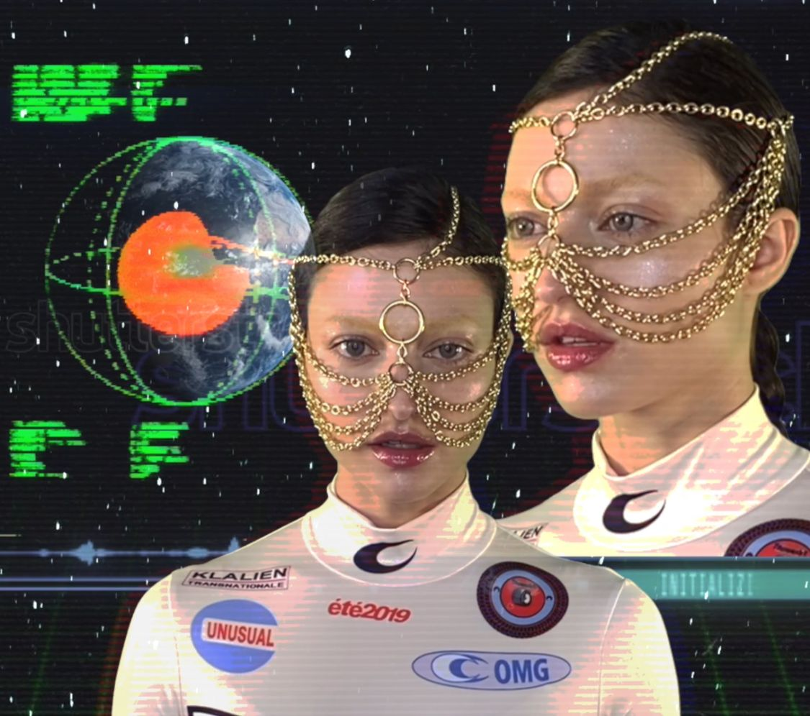
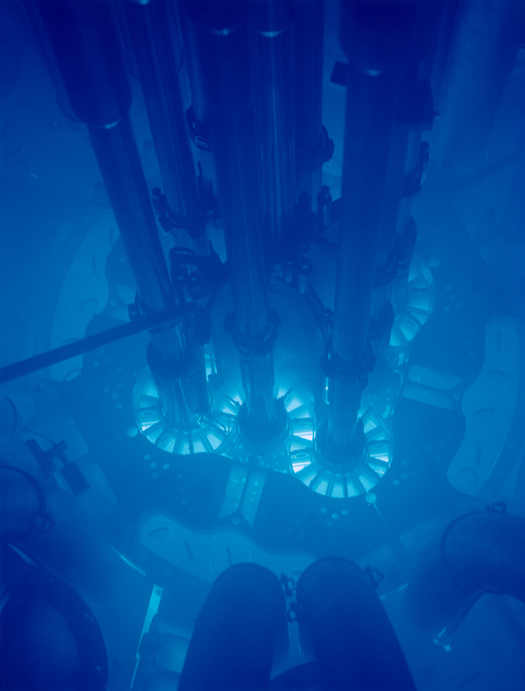

[Isabelle Boemeke](https://twitter.com/isabelleboemeke) is a model, digital fashion designer, and the world's first (and only) nuclear power influencer. She makes educational videos as [Isodope](https://i-sodope.com/).

<h5>Image credit: Isabelle Boemeke</h5>

Thanks for listening! We'd love to hear what you thought about it — email us at hello@hearthisidea.com or leave a rating below. You can help more people discover the podcast by <a href='https://twitter.com/intent/tweet?text=Check out Hear This Idea, a podcast showcasing new thinking in philosophy, the social sciences, and effective altruism! &url=https://www.hearthisidea.com via @hearthisidea&' about='_blank'>tweeting about it</a>. And, if you want to support the show more directly, consider <a href='https://tips.pinecast.com/jar/hear-this-idea'>leaving us a tip</a>.

## Isabelle's Recommendations 📚

- [The Greatest Show on Earth](https://www.goodreads.com/book/show/6117055-the-greatest-show-on-earth) by Richard Dawkins
- [Our Inner Ape](https://www.goodreads.com/book/show/257106.Our_Inner_Ape) by Frans de Waal
- [The Beginning of Infinity](https://www.goodreads.com/book/show/10483171-the-beginning-of-infinity) by David Deutsch

 <Book url="https://www.goodreads.com/book/show/6117055-the-greatest-show-on-earth" image="book-isabelle-1" spineColor="#99004d"/> <Book url="https://www.goodreads.com/book/show/257106.Our_Inner_Ape" image="book-isabelle-2" spineColor="#9ae9fe"/> <Book url="https://www.goodreads.com/book/show/10483171-the-beginning-of-infinity" image="book-isabelle-3" spineColor="#86b5b5"/> 
 

## Isodope links

- [TikTok](https://www.tiktok.com/@realisabelleboemeke) 🎥
- [Instagram](https://www.instagram.com/isabelleboemeke/) 📷
- [Isodope: a radical new voice for nuclear](https://energyforhumanity.org/en/top-ten-facts/isodope-a-radical-new-voice-for-nuclear/) — Energy for Humanity 📰
- [TikTok Influencer ‘Isodope’ Is Stanning for Nuclear Energy](https://www.vice.com/en/article/y3gg3k/tiktok-influencer-isodope-is-stanning-for-nuclear-energy) — VICE 📰
- [This radiant model wants you to stop worrying and love nuclear energy](https://grist.org/energy/this-radiant-model-wants-you-to-stop-worrying-and-love-nuclear-energy/) — Grist 📰
- [Isabelle Boemeke Is the Nuclear Influencer the World Needs](https://www.highsnobiety.com/p/isabelle-boemeke-interview/) — Highsnobiety 📰
- [Ep 312: Isabelle Boemeke - Nuclear Influencer, Isodope](https://www.titansofnuclear.com/experts/IsabelleBoemeke) — Titans of Nuclear 🎙
- [How to Win Friends and Influence feat. Isabelle Boemeke](https://open.spotify.com/episode/5w3ju9iVKVDBAB5XttgQb6?nd=1&si=aRreL4aqRfKOPYDIRSrOBw) — Decouple podcast 🎙
- [Becoming A Nuclear Energy Influencer, Mastering TikTok, & Thinking Like A Scientist](https://www.auxoro.com/podcast/isabelle-boemeke) — Auxoro podcast 🎙

<h5>Image credit: Isabelle Boemeke / Energy for Humanity</h5>

## Things mentioned in the show

- [The Greatest Show on Earth](https://www.goodreads.com/book/show/6117055-the-greatest-show-on-earth) by Richard Dawkins 📖
- [Our Inner Ape](https://www.goodreads.com/book/show/257106.Our_Inner_Ape) by Frans de Waal 📖
- [How to Avoid a Climate Disaster](https://www.goodreads.com/book/show/52275335-how-to-avoid-a-climate-disaster) by Bill Gates 📖
- [Molten salt reactor](https://en.wikipedia.org/wiki/Molten_salt_reactor)
- [Availability heuristic](https://en.wikipedia.org/wiki/Availability_heuristic)
- [Small modular reactor](https://en.wikipedia.org/wiki/Small_modular_reactor)
- [The China Syndrome](https://letterboxd.com/film/the-china-syndrome/) (1979)
- [Three Mile Island accident](https://en.wikipedia.org/wiki/Three_Mile_Island_accident)
- [Chernobyl disaster](https://en.wikipedia.org/wiki/Chernobyl_disaster)
- [Fukushima Daiichi nuclear disaster](https://en.wikipedia.org/wiki/Fukushima_Daiichi_nuclear_disaster)
- [Vajont Dam failure](https://en.wikipedia.org/wiki/Vajont_Dam#Landslide_and_wave)
- [1975 Banqiao Dam failure](https://en.wikipedia.org/wiki/1975_Banqiao_Dam_failure)
- [Natural nuclear fission reactor](https://en.wikipedia.org/wiki/Natural_nuclear_fission_reactor) ([Oklo](https://en.wikipedia.org/wiki/Oklo), Gabon)
- [Deep Isolation Nuclear Waste Disposal Solutions](https://www.deepisolation.com/)
- [Human Interference Task Force](https://en.wikipedia.org/wiki/Human_Interference_Task_Force)
- [Long-time nuclear waste warning messages](https://en.wikipedia.org/wiki/Long-time_nuclear_waste_warning_messages)
- Taylor Wilson
  - [12-year-old builds nuclear fusion reactor](https://www.popularmechanics.com/science/energy/a34312754/12-year-old-builds-working-fusion-reactor-world-record/)
  - [Yup, I built a nuclear fusion reactor | Taylor Wilson](https://www.youtube.com/watch?v=9B0PaSznWJE) — TED
- [Tuskegee Syphilis Study](https://en.wikipedia.org/wiki/Tuskegee_Syphilis_Study) ([video](https://www.youtube.com/watch?v=m63NDZVZRXc))
- [Uranium mining and the Navajo people](https://en.wikipedia.org/wiki/Uranium_mining_and_the_Navajo_people)
- [Enhanced geothermal system](https://en.wikipedia.org/wiki/Enhanced_geothermal_system)

<h5>Above: <a href='https://en.wikipedia.org/wiki/Cherenkov_radiation'>Cherenkov radiation</a></h5>

## Further Reading

- [Nuclear Energy](https://ourworldindata.org/nuclear-energy) — Our World in Data
- [What are the safest and cleanest sources of energy?](https://ourworldindata.org/safest-sources-of-energy) — Our World in Data
- [How to Send a Message 1,000 Years to the Future](https://www.theatlantic.com/technology/archive/2015/02/how-to-send-a-message-1000-years-to-the-future/385720/) — The Atlantic
- [What if I took a swim in a typical spent nuclear fuel pool?](https://what-if.xkcd.com/29/) — Randall Munroe
- [Making a Desktop Fusion Reactor](https://www.youtube.com/watch?v=EVOBk-InL00)
- [A Bright Future: How Some Countries Have Solved Climate Change and the Rest Can Follow](https://www.goodreads.com/book/show/40223272-a-bright-future) — [Joshua S. Goldstein](https://www.goodreads.com/author/show/65091.Joshua_S_Goldstein) and [Staffan A. Qvist](https://www.goodreads.com/author/show/18062389.Staffan_A_Qvist)
- [Advanced Nuclear Energy](https://www.catf.us/work/advanced-nuclear-energy/) — Clean Air Task Force
- [What is Nuclear](https://whatisnuclear.com/)
  - [Nuclear fuel will last us for 4 billion years](https://whatisnuclear.com/blog/2020-10-28-nuclear-energy-is-longterm-sustainable.html)

  

Thanks for listening <i>and</i> reading the write-up! We'd love to hear what you thought about it — email us at hello@hearthisidea.com or leave a rating below. You can help more people discover the podcast by <a href='https://twitter.com/intent/tweet?text=Check out Hear This Idea, a podcast showcasing new thinking in philosophy, the social sciences, and effective altruism! &url=https://www.hearthisidea.com via @hearthisidea&' about='_blank'>tweeting about it</a>.

## Transcript

*This is a machine-generated transcript, so it may contain inaccuracies.*

**Fin 00:05**

Hello, you're listening to Hear This Idea, a podcast showcasing new thinking in philosophy, the social sciences, and effective altruism. In this episode, we talked to Isabel Burmicky, a fashion model and the world's first nuclear power influencer. We chat about why nuclear power should probably be playing a very important role in decarbonizing the world. So it's clean as in emissions free, it's very space efficient, it doesn't depend on the weather, and as you'll hear, it's really surprisingly safe. So when we think about how to phase out fossil fuels, which is obviously a huge task, it looks like nuclear should be in the mix in a big way. But nuclear energy also has a fairly bad reputation. Plus these big infrastructure projects are not cheap. And so not only are very few new plants being built, but also perfectly functional plants are being decommissioned. 

**Fin 00:58**

So, as you'll hear, Isabel decided to use her platform on social media to do something about this bad reputation. And she started making videos explaining nuclear energy to a new audience and hopefully correcting some misinformation. And so far it seems to be working. We also chat about improving how we deal with radioactive waste, how the risks from nuclear stack up against fossil fuels, and also how nuclear energy could become cheaper by using smaller modular reactors. So that's the context. And we started by asking Isabellev how she got into learning about science. 

**Isabelle 01:34**

Yeah, so to get to that question, I need to explain a little bit of my background. So I was born in a very small town in southern Brazil. It's close to the border with Uruguay. And when most people think of Brazil, they think of like the beach and samba and the Amazon forest. But the south is very different. It's all farms. There are these vast green fields, crops and just a bunch of cattle. In the winter it gets actually pretty cold. So it's definitely different than the Brazil people have in their imagination. So I grew up there, very small town, everyone is very Catholic in Brazil. I used to go to Catholic church every weekend with my grandmother. And I actually attended Catholic school up until I was like twelve years old. So the most formative years of my education were in Catholic schools. 

**Isabelle 02:28**

And I believed that God created earth and he created all the animals and humans and the whole story in the Bible. And I remember having science lessons, but they almost always presented scientific theories and scientific information at the same level as creationism, which to the mind of a child, you start believing what your teachers are saying. So I pretty much believed that whole story. Then fast forward a couple of years. I was about 17 years old. I got discovered to be a model, ended up moving to the United States, and one day, by mistake, I ended up reading a book by Richard Dawkins called The Greatest Show on Earth. And it's a whole book about evolution. And I remember this day exactly. 

**Isabelle 03:23****
I mean, I looked at the book instead of a box, it was a beautiful cover, like, covered with flowers, and I honestly just started reading it out of boredom. I had nothing else to read. And I said, okay, this book looks interesting. And I remember sitting there and just reading those pages and thinking to myself, how could I not have known any of this? And just learning about evolution? And that triggered me to go on Amazon immediately and search for books that were similar to that one. So that book really led me down a path of just passion for science and down a path of knowledge and discovery that has been extremely gratifying throughout the years. 

**Fin 04:08**

That's such a fantastic story, and I can empathize with a fair bit of it now. What came next? Did you find more books that ended up influencing you in the same way I did? 

**Isabelle 04:21**

The next book I bought was called Our Inner Ape by a primatologist called Franz Zawal. And it's this really interesting book about primates, other primates, and how their behaviors are similar to humans. And it touches a little bit on evolutionary psychology, which is something that I got super interested after reading that book as well. I had always been interested in human behavior and psychology, and so when I combined evolution and psychology, it was like a dream come true. And that's another goosebump moment. I remember being in my bed and Googling. I actually Googled the words evolution psychology and I came across evolutionary psychology and went down that path a little bit. But just in general, the path of discovery and learning is so fascinating. It's like this whole new universe that you get to explore every time you stumble on a new subject. 

**Fin 05:14**

Yeah, it's amazing. Right? And I think the important thing for me, or the cool thing, is that the learning never ends. You'll never close a book and be like, yep, I've learned most of the things I was curious about, and there is nothing more I care to know is just an endless journey, which is great. 

**Isabelle 05:34**

There is no end. 

**Isabelle 05:35**

It's like a sad realization when you realize that there's so many interesting things in the world that you never learned about. 

**Fin 05:41**

Right. 

**Isabelle 05:42**

But it's also gratifying because, you know, you'll never be bored. 

**Fin 05:46**

Yeah, completely. This is a tangent, but David Deutsch makes this point that there was maybe a time in history a couple of millennia ago where you could really know all the important stuff discovered and written by other humans. But from that point onwards, it just was and is more or less impossible to know everything in that sense. And he has this kind of related thing about scientific progress and the reach of human knowledge where I guess some people think there's maybe this kind of hard limit to scientific progress where you hit diminishing returns or something, but he's like, no, the reach of knowledge is just boundless in this really important sense. 

**Isabelle 06:29**

Right. 

**Fin 06:29**

Which I like. 

**Isabelle 06:30**

I actually tangent, but I actually love David Deutsche. 

**Fin 06:34**

Brilliant. Brilliant. Same. 

**Isabelle 06:35**

Yeah, I read his book of his book, The Beginning of Infinity. 

**Fin 06:40**

It's amazing. 

**Isabelle 06:41**

And it literally changed my life and it made me so much more optimistic about the future of our species. 

**Fin 06:48**

Yeah, completely. It did the same thing for me. Shout out to David Deutsch. Okay, so we're going to talk about climate, obviously, but since we are also talking about your story, and maybe the answer is just no here, but was there a sense in which growing up in Brazil influenced the way you now think about climate issues and I suppose energy poverty in particular? 

**Isabelle 07:13**

Yeah, so I grew up surrounded by nature. My family has a beautiful property close to the city with like, a big waterfall. We used to go there every weekend, ride horses, get food from the garden and play with chickens. So since I was born, I had a very strong connection with nature, which makes me care a lot about preserving the environment. On the other hand, I also have an appreciation for a high energy life, and that's probably precisely because I grew up in Brazil. We didn't have things like a laundry machine or a dishwasher or air conditioning or central heating. And I think a lot of people fail to appreciate how important these objects are in our day to day life. 

**Isabelle 07:58**

They can sound a little bit like luxury items, but in reality, they are some of the biggest contributors to human well being and women's empowerment. So laundry machines and dishwashers gave women more time to dedicate to their studies and career. And heating and air conditioning make people feel comfortable and in some cases can even be life saving. So I have low blood pressure. So remember always feeling lightheaded and exhausted all summer and not being able to sleep because of the heat. So these are all things that have serious impact in people's well being. 

**Fin 08:33**

Yeah, that's such a great point. And I mean, it's obviously still the case in many parts of the world and maybe more so the case over a lot of history where people just spent almost all their time, and especially women, obviously doing things that we would take for granted that machines do, as in we people who own dishwashers and washing machines. But technologies like the Internet and stuff are a bit shinier and more exciting. So maybe this point just ends up. 

**Isabelle 09:06**

Getting really underrated and now people think about it. Now people have free time to fight on Twitter. 

**Fin 09:11**

Exactly. Hashtag progress. All right, so let's talk about climate change in general, and we should just lay out some of the problems, first of all. So maybe a place to start is to hear a bit about the breakdown of how much energy is being used to do different things globally. Like when I think of what kinds of things use energy, I have a vague picture of cars being in there and like electrical appliances and factories. But can you say something about how that all stacks up? 

**Isabelle 09:43**

So right now the global energy consumption is 173,340 terawatt hours and one terawatt hour is equal 1 trillion watt hours. So that's just a lot. A lot of energy. And energy is consumed by all different factors. Primarily transportation globally. So that's things like cars, ships, planes, whatever mode of transportation that uses energy. And then we have electricity, meaning using this primary energy to create electricity to power our homes and offices and buildings and appliances and all of that. And then we have industry, which is manufacturing facilities and making stuff, basically making steel, cement. And then finally we have agriculture, which is the last component. It's kind of hard to come across all the numbers and different sources will tell you different things, but those are in order. So meaning transportation uses the most energy and then we have electricity, industry and so on. 

**Isabelle 10:52**

But yeah, it's just a massive problem that touches on every single thing we do as humans. 

**Fin 10:59**

Yeah, and maybe this is stating the obvious, but presumably there's nothing wrong in itself with expending energy. So what exactly is the problem with where we're getting that energy from? 

**Isabelle 11:12**

Yes, well, the problem right now is that we're getting our energy from fossil fuels. Mostly. Still 84% of the world's energy comes from fossil fuels and that's things like coal, natural gas and oil. And of course, as we now know, burning fossil fuels not only causes air pollution, which already claims lots of lives every single year, but it also increases the average global temperature and it's causing a bunch of other problems and we call that climate change. So yeah, exactly. Like you said, the problem is not how much energy we're using is where we are getting that energy from. And right now it's mostly from fossil fuels which cause climate change. 

**Fin 11:58**

Yeah, fantastic. And now, looking forward to how we get out of this mess, there's this idea that there are really two broad stages here. There's electrifying and there's decarbonizing. Could you just explain what both those things mean? 

**Isabelle 12:13**

So I talked a little bit about climate change and all the different sectors that use a lot of energy. And electricity is a secondary form of energy, meaning it doesn't exist in nature. We have to use another primary source to create it. And those primary sources can be things like the sun, the wind, hydro or splitting atoms like nuclear power. So when people say we have to electrify we just mean that we have to make everything that we can electric. So instead of using gasoline powered cars, we should use electric cars, electric buses, same for heating. Instead of using natural gas to heat our homes, we should use electric heaters. So we just need to get most of our things to be powered by electricity instead of coal, oil or gas directly. 

**Isabelle 13:02**

But then, of course, we need the most important step, which is to decarbonize, which is just to make sure that all of that electricity now comes from clean sources. So again, these are sun, wind, hydro, nuclear, and geothermal. There are some more, but these are like the main ones. So that's what people mean when they say electrify and decarbonize. 

**Luca 13:25**

There's also huge gains you can get from electrification itself right. Which is that these processes are often a lot more efficient. So I think one of the classic examples is kind of looking at electric cars versus diesel cars, which precisely use right. Electric cars use the secondary electricity energy, whilst diesel cars use primary energy. But a lot of energy just gets lost because through the internal combustion engine, you have heat, you have sound, you have all of these kind of sorts of inefficiencies, which also means that you can actually get, in some situations, a lot more bang for your buck if you electrify. So it's not just clean energy, it's also that you need a lot less of it to basically be doing the same things. 

**Isabelle 14:01**

Right, exactly. 

**Isabelle 14:02**

It's just better technologies all around. 

**Fin 14:05**

Yeah. Also, one crazy thing I learned from the new Bill Gates book was that if you look at fuel efficiency for cars over time, it's improved, sure, but only by a little bit over like, the last 50 years, and nothing like Moore's Law for computer chips or something. And then if you look at battery price and capacity and efficiency for electric cars, they're improving so much faster and they're not obviously slowing down. 

**Isabelle 14:36**

I wonder if it's a physical limitation or if it's just that they're efficient enough so people don't need them to be more efficient. 

**Luca 14:44**

Yeah, that's a really good point, actually. And I think it might be something we hit on later as well when we talk about coal prices right, versus nuclear prices and the like. 

**Fin 14:53**

Maybe, yeah, let's put a flag there for sure. But okay, so that's the problem. And we've got this very bird's eye picture of the way forward. But like you said, there are lots of different alternatives to burning fossil fuels to get useful energy. Right. There's hydro and solar and wind and geothermal, the whole gang. But we're obviously going to focus on nuclear power, right? So can you just tell the story of how you started learning about nuclear power and also how you realized it was something potentially important to lend your voice to? 

**Isabelle 15:26**

So nuclear energy first came to my attention through Carolyn Porko. She is a planetary scientist who worked at NASA for many years. So back in 2015 and 2016, she tweeted a couple of times about molten salt thorium reactors and how they were this incredible technology that were much better than current nuclear power plants and so on. And I remember being super curious about it, but at the time, I didn't have the knowledge necessary to learn about molten salt thorium reactors. It was kind of like this obscure technology. It was really hard to find, easy to digest information online. But from that moment on, I remember every time I met a scientist or someone who thought about climate change, I asked them about nuclear power. 

**Isabelle 16:15**

And the responses always seem to be something like, oh, yeah, nuclear is actually pretty good, and we're actually going to need it to solve climate change, but the public perception is terrible. So behind closed doors, everybody seemed to agree that we needed nuclear power and that it was actually much safer than people thought. But nobody felt like they could voice their opinions publicly because of the bad reputation that comes with the technology. So that's when I started to realize that in order to build more nuclear power plants and ultimately avoid a climate disaster, we would need a radical shift in how people perceive nuclear energy. 

**Isabelle 16:55**

And as I started learning about nuclear power in general, I realized how much of this negative perception was actually created by misinformation and the availability heuristic this tendency to overestimate the risk of something happening just based on how many examples you can think about. So airplane crashes come to mind, and I think it's very similar to nuclear power in that you've had this couple handful of accidents that were very catastrophic, but compared to fossil fuels are still much safer. But people tend to remember those events instead of focusing on the everyday winds of how many clean electricity and nuclear reactors have been creating for decades now. 

**Isabelle 17:39**

So I just thought that there was space for someone like me, who doesn't come from academia or the science community to help clear out some of this misinformation and just spread the message in a fun and visually interesting and unusual way. 

**Fin 17:53**

Okay, awesome. There is so much there. So one thing to talk about is just what is the case for nuclear? Given that I imagine some people listening will associate nuclear power with some pretty dodgy things? And then there's this question of given that there is a strong case for more nuclear power, where did its very poor reputation come from? But, okay, let's start with the positive case for nuclear power and all of its upsides. So can you maybe say something, first of all, about just how fission works and also something about what advantages it might have over solar and wind, for instance? 

**Isabelle 18:35**

Yeah. So nuclear power is different than solar and wind in that it uses fuel to create electricity, right? So solar panels are just literally capturing the sun's energy and converting that into electricity, and wind turbines are capturing the wind's energy and converting that into electricity. And nuclear actually uses fuel. So it's a thermal power plant similar to coal and gas power plants in that it uses heat to create electricity. And the difference there is that coal and gas power plants burn coal and gas, respectively to heat water. It's basically just like a fancy tea kettle. You're just literally heating water to create steam, to spin a turbine. And the difference between coal and gas and nuclear is that nuclear uses the splitting of atoms to create energy, to heat water, to spin a turbine. 

**Isabelle 19:35**

So nuclear energy, because it's not burning anything, is carbon free. It doesn't have any emissions. That's why it's considered a clean source of energy. Now, to make the case for nuclear energy, I think that the biggest advantage that fission has over other sources of energy is really how dense it is. And nuclear is the only source of clean energy that's reliable, meaning you can create electricity 24/7 independently of the weather, and that can be built pretty much anywhere. And like I said, because of the density of uranium, we can create a huge amount of energy in smaller spaces and using way less materials, which is good news for the environment overall. 

**Luca 20:22**

One thing I want to pick up on there then, is on some of the, I guess, contrast, as you mentioned, to solar energy and wind power. So you pointed out exactly right, that there's this huge intermittency problem which renewable energies have in that they're not very reliable and they're often only available where it is very sunny or it is very windy. But some people might say, okay, those are limitations, but we can try and overcome those. Finn mentioned how there's these big developments in battery storage. You can also talk about just making energy grids in general more interconnecting. So if energy is produced on the coast, it can go into the mainland. 

**Luca 21:01**

What would kind of be the case of investing in nuclear energy to complement, like, solar and wind, as opposed to just going all in on solar and wind and just trying to fix the problems that it has? 

**Isabelle 21:12**

Well, because we don't know for a fact that those solutions will work. Like, there's theories that they might work, but we haven't done that right. And I think we're talking about avoiding a climate disaster and decarbonizing as soon as possible and doing so by 2050 and things like that. I think it's too much of a risk to try and bet on a technology that has not been proven to work to that level. I think that renewables are great for what they are. We start running into all sorts of problems when we start forcing them to become something that they're not, meaning a firm source of energy, a reliable source of energy. And I don't think there is anyone who actually proposes doing wind and solar only. I think batteries are always a part of the equation. 

**Isabelle 22:06**

And then with batteries, it's of course extremely expensive. So there is a study that came out recently talking about California's decarbonization, pasture decarbonization, and they analyzed all these different scenarios and already Decarbonizing with solar, wind and batteries is more expensive than decarbonizing with solar, wind and something like nuclear, even considering the most expensive type of nuclear. And then there's also all these other issues of how many batteries we would need in order to provide that grid balance. And does it even make sense to build that many batteries to sit there for a big majority of the year and then just kick in whenever there is a period of low winds or a period of low sun and then replace the batteries every ten years? 

**Isabelle 22:58**

So I think there's a lot of unknowns and there's a lot of other things that we need to consider before just jumping in on this let's go 100% solar, wind and batteries route. 

**Fin 23:11**

But equally, just to be clear, you're not saying that we should go the other way and go 100% nuclear, right? 

**Isabelle 23:17**

Not at all. 

**Fin 23:18**

Like, clearly nuclear is not going to solve every problem under the sun, but the idea is that it's underrated and should play a really important role. But it obviously makes sense to have some balance of everything. 

**Isabelle 23:31**

Exactly. Yeah, and I don't even understand people who make the argument that we need this one solution. I think it's a little bit religious, almost. You need this one thing and it's going to solve all of our problems. It's not again, the challenge is huge. The challenge of decarbonizing our energy system is giant. We need to deploy an insane amount of clean energy in the next few decades and we need all of it. And right now, renewables are cheaper and so I fully support deploying them as much as we can right now. But there seems to be consensus that we need something like nuclear, and I say something like nuclear because we need some form of firm clean energy. And that could be things like hydro, geothermal and nuclear. So hydro, as you know, is geographically limited. 

**Isabelle 24:21**

You cannot build a dam in the middle of the country where there is no water and elevation. And geothermal thus far has also been geographically dependent. There's now a lot of breakthroughs in geothermal technology and we can get into details here, but there's a lot of really exciting things happening in geothermal. But again, this is still kind of far away, it's just the beginning of this journey. And then in the nuclear, which we already have, we've already built a lot of these plants and we've had them around forever. And we know that they're very effective at decarbonizing the energy. We've done it before, right? When you look at countries like France and Sweden, they have deployed a very large amount of clean energy and significantly decreased their emissions. And it was all nuclear energy, we've already done it. 

**Isabelle 25:14**

So why not just repeat what has been done in the past instead of batting in this obscure and theoretical technologies? 

**Luca 25:22**

A funny thing, I think that's kind of worth noting that the reason why France's share of renewable energies is so high isn't actually much to do with their environmental concern. It's actually that back in the 70s, they just didn't have a lot of coal or kind of fossil fuels to use, which meant that when the oil shocks happened and you couldn't rely on getting cheap oil from the Middle East, france basically went almost kind of all in on nuclear energy. And that's really paying off now when you kind of realize that it is actually really good to have these non carbon emitting sources of energy. But that, interestingly enough, didn't really come from an environmental concern, but much more from an economical one, actually. 

**Isabelle 25:57**

Yeah, that's exactly right. And I think that a lot of countries that developed their nuclear power plants back in the day were not focused on the environment and were focused on just energy independence and other things like that. But yes, it's totally paying off. I mean, France has 70% of their electricity come from nuclear, and they have consistently one of the cleanest electricity in Europe and one of the cheapest as well. So they export a lot of electricity to other countries, including Germany, who phase out of their nuclear plants or is phasing out of their nuclear plants and ironically, imports electricity from France. 

**Fin 26:35**

So say something about what's happening in Germany and these other countries where plants are literally being shut down, and there's certainly no plans for building new ones. Now, if you said there's an expert consensus for pushing in the direction of nuclear power, what's going on there? 

**Isabelle 26:53**

So, famously, Germany decided to phase out of nuclear after the Fukushima Daiichi disaster. And we know now, looking back, that after they closed a bunch of their nuclear power plants, their reliance on coal increased, and so did their emissions for the years following the shutdown of plants. And now, because of their investment in renewable energy and deployment of that technology, they've finally lowered their emissions. But we know that shutting down nuclear power plants always increases emissions. And I think that Germany, because it's such a powerful country in Europe, kind of influences the culture around. So we see it all over now. We have Belgium announced last year they're closing all their nuclear plants by 2025. And I mean, they've publicly said that all of them will be replaced by natural gas. 

**Fin 27:48**

Which sounds good, right? But just to be clear, natural gas is not good natural gas. 

**Isabelle 27:54**

Let's call it fracked methane. Yes. So it might sound good, but it's actually really bad. And especially when the global conversation right now is about climate change and about how we have this many decades to phase out of fossil fuels and to decarbonize, it just seems like taking steps backwards. And unfortunately, fossil fuels are cheap and they're easy and they're reliable. And so it's very easy for countries to fall back on them. And we see that happening all over. In the US. For example, we're shutting down five plants in the next five years. And these plants alone create more clean power than all of California's wind and solar combined. And California is one of the biggest renewable states in the United States. And as I said before, historically, whenever nuclear plants shut down, emissions increase. 

**Isabelle 28:45**

So it looks a little bit depressing in these places, I'm not going to lie. But on the bright side, there are about 50 reactors currently being built in 16 different countries, most of them in China, India and Russia. And the UAE just this week started operating their first nuclear power plant, which alone will provide about 25% of the country's electricity. So there are things happening, just not in Europe and the United States. 

**Fin 29:13**

No. 

**Luca 29:14**

And I mean, you're definitely so right about the problems with replacing nuclear energy power plants with fossil fuels. I'm sure I'll go, like, on a rant in this in the writer. But like the big thing in Germany, right, is that after you kind of shut down there's now deals with the Russian government about Nordstream, which isn't just a problem because it encourages oil, but it's also dealing although it's making Germany's energy security reliant on Russia, which they haven't had the best historical relations with. And it's just involving a huge amount of corruption, just very like blatant corruption as well of politicians or former presidents of Germany just very clearly now being appointed the heads of these committees and being paid ridiculous amounts of salaries. 

**Luca 29:50**

It's really like a dirty business and one that I think I just get so angry with, right, especially from. 

**Isabelle 29:56**

A country that claims to be the champion of the environment. It doesn't add up. And the main arguments against nuclear power today are cost and time to build. So there basically are no good arguments to shutting down existing safe plants that could run for possibly 80 years, which is what they're getting licenses for now. So there really is no good argument for shutting existing plants and invariably they lead to higher emissions. 

**Luca 30:28**

So you mentioned these two prominent counterarguments you hear about nuclear energy and I'd love to explore these in a bit more depth. So maybe to start off with the cost one, you mentioned that one of the big advantages that fossil fuels have is not just that they're reliable, but also that they're really cheap. And I think one of the things we've seen in America, especially, is that actually fracking is really undermining the kind of market for nuclear energy. If you just kind of have a very liberalized energy market, as you saw in Texas and stuff, it's really hard for nuclear energy to compete. Can you maybe explain a bit about why that is and what kind of solutions we might have to that? 

**Isabelle 31:03**

Yeah, so the interesting thing about nuclear power is that it's actually a huge upfront cost, but then the cost. Of the fuel itself is very cheap and part of it because uranium is not that expensive, but also because, again, the density of the fuel, which means that you need to use less to create more energy. But the problem really is that upfront cost to build a nuclear power plant can cost something like $20 billion. And people look at gas and oil and all this existing technology already it's existing infrastructure. All they have to do is just get more or build pipelines. And also because in a lot of markets in each state has a different regulation. But in a lot of markets, nuclear is not rewarded for being low carbon while renewables are. And so you have that extra challenge added to it. 

**Isabelle 31:52**

But I mean, the cost argument is one that I think is a little bit misguided because obviously we're not accounting for the real cost of fossil fuels and the cost they cause, the damage they cause to the environment and all the cost in the future of cleaning up this mess. And then there's also the fact that, yes, nuclear power plants are expensive to build, but once they're up, they can run for 80 years and then can create electricity for in some cases 3 million people in a single nuclear power plant. And there's also the fact that there's nothing intrinsic to nuclear power plants that makes them so expensive. So they're not made of diamonds. They're made of steel and cement and normal things like that. 

**Isabelle 32:34**

So it's all about really figuring out how to decrease the cost, which this is a whole new topic on its own. But the problem, mainly in countries like the United States is that each one of these plants is one of a kind project, right? So they build it once and then they take a break and then they build a different model in ten years from now. So you don't learn by repeating it and you don't get efficiencies of scale. You're just literally doing this one giant project at a time. 

**Isabelle 33:03**

And then there's a lot of a. 

**Isabelle 33:04**

Ton of safety measures and regulatory issues that come with nuclear power. And a lot of those, I think, are great because they make nuclear actually safe. They actually make nuclear one of the safest forms of energy. But some of those are totally misguided and set up by irrational fears of radiation and irrational fears of nuclear power. So there's obviously a lot of different things that contribute to the high cost, the high upfront cost of nuclear. But there are people trying to solve for that. So now you might have heard of small modular reactors. They're the whole vibe right now in nuclear energy, there are this new generation of reactors that are actually modular. So the different parts are made in a factory. They're going to be shipped like the back of a truck and then just assembled on site. 

**Isabelle 33:56**

So their hope is that by serializing these designs, you can just decrease the costs. Now, of course, a point that I would like to make is that none of this has been built yet. They're all still very much in exploration phase. There are plans to build some in the next five years or so, but we still have to see. 

**Fin 34:15**

Yeah. I love this point that maybe one of the reasons nuclear is relatively costly nowadays compared to other renewables could just because we've built too few plants to really learn from and we've invested relatively little in the R. And D. And then maybe the reason for that is this kind of short sighted, self fulfilling thing where it's like, oh, these plants are too expensive to be economical to build now. Plus they're presumably kind of scary as evidenced by all this strict regulation we've put up around them and so they just stay costly. But the point is the way you drive down costs is for there to be incentives to make the thing cheaper and then opportunities to keep making that thing. 

**Fin 35:00**

So yeah, if there's an upshot, it's that looking at present day prices is sometimes useful, but could actually mislead us when we're thinking about whether to invest in nuclear. 

**Isabelle 35:09**

Remember that this was the argument against renewables for decades, right? The argument against renewables for decades is that they were too expensive and then people worked on reducing the costs. And there you go. Now we have renewables being cost competitive with fossil fuels, even in some cases. So it's all about just building and repeating and trying these different technologies. But of course we cannot do that if the public perception is still really bad, which is why I'm trying to change it. 

**Luca 35:38**

As you mentioned, solar power has seen huge improvements in learning by doing. But that I think is also in large part easier to do because they are kind of smaller units and you can tinker from generation to generation. Like one of the, I think stronger arguments are gallons. Nuclear energy is just because they have such a long lifespan that once you build a nuclear energy plant, they really last, as you said, for 80 years. And you're kind of locked into that technology for that longer period. And I think they take almost 40 years to kind of pay themselves off. 

**Luca 36:04**

And that one of the risks you see is that if you think energy prices are going to keep falling, either in a good way because of solar energy improvements or in a bad way because of kind of fracking improvements, that you might kind of be left in the dust on, like a longer time scale if you're still relying on technology. Kind of 40 years or even 80 years in the past. 

**Isabelle 36:22**

I mean, that's a good point. Just touch back on the cost of solar panels. Yes, of course the cost has reduced dramatically. But the truth is you cannot decarbonize the system with solar panels only. So you have to account for the costs of all the other things that have to come with solar for you to be able to decarbonize your electricity system. Right? So it's solar panels and then it's a bunch of transmission lines and it's a super grid, and then there's all the batteries. So while solar panels themselves are very cheap, all the structure around that you need to allow for solar panels to do any meaningful decarbonization or not, and as I said, are in fact already cost competitive with extensive nuclear. So that's kind of where I am with the cost argument. 

**Isabelle 37:09**

Okay, I understand that the price of panels are themselves cheap, but you can't do that alone. 

**Luca 37:14**

No, I definitely agree. You also have to kind of consider the fact that solar panels are only being used in kind of the most sunny areas at the moment. 

**Isabelle 37:20**

Right. 

**Luca 37:21**

So even if you did try to replace, through some ways, kind of all fossil fuels with solar energy, you're going to have to use them in kind of less efficient areas at some point, and then that's going to increase kind of cost somewhat. But that kind of feels like a different tangent. But just to kind of address some of the kind of common criticisms you hear and to hear your response to them, Isabel, is the second point you mentioned about time to build, and that feels very pertinent, especially from a climate change point. So you could say, look, we're in a climate crisis now. We need to get to a decarbonized energy system by 2050 at the latest. But nuclear power plants take an awful long time to build and they require a very intensive way to build as well. 

**Luca 37:57**

As you mentioned, kind of cement is used a ton there and cement is inherently a very kind of polluting material. There seems to be almost like a way that it might be really low carbon once we get onto this nuclear pathway. But just getting to that takes a long time and is just very energy intensive. Can you maybe address some of those concerns? 

**Isabelle 38:13**

Yeah, for sure. So the slow argument is a bit interesting to me because people have this perception that it takes such a long time to build nuclear power plants. So in fact, in Pakistan just a couple of weeks ago, they finished building a reactor with the help from China. From first day they started getting dirt off the ground to completing the reactor. It took them seven and a half years. Baraka, which is in the UAE, took ten years to build. And even Bogoing in Georgia, which is here in the United States, the only plant that's been built was started in 2013 and is delayed, but it's probably going to take ten years to build or so on. So ten years? 

**Isabelle 38:58**

Yes, it's a lot of time, but if you consider that in these ten years, you can deploy all the solar and winds that you want. It's not going to interfere with the buildout of nuclear power plants. Just deploy all the renewable technology in the next 1015 years while building all these other nuclear power plants, and then by 2050 you can have a stable grid that is only with clean energy, but you have all these different technologies that complement one another. So I don't think that ten years is that big of a deal, considering that we need something like nuclear energy to provide that last ten to 5% decarbonization in the grid. And the other thing is that, again, they last for 80 years, while solar panels and wind turbines last between 25 to 30 years. 

**Isabelle 39:52**

So we need to replace all of those and we're going to need energy forever, right? It's not like we got 2050, we decarbonize everything. Oh, we're not going to need any more energy. No, we're going to need energy forever. So if we can have something that's reliable, again, reliable, and that creates a huge amount of energy in a small space that is going to be there for eight years, I think we should be investing in it. 

**Fin 40:17**

That's a great point. And it occurs to me that even if you expect global population to level off, you still shouldn't expect energy demand and consumption to level off. Which is a good thing, incidentally, right? Because energy use is a pretty good indicator of development. So we're always going to need new solutions, more energy. And it makes sense to think quite long term because of that, right? 

**Isabelle 40:39**

We're always going to need energy. And I think we should just assume that we always need more energy. And using more energy, like you said, Finn, is not the problem, right? It's actually, in fact a good thing because a high energy life usually means a high quality life. If you look at the countries that have the lowest energy consumption, they're also the countries with some of the lowest quality of lives. So what we really need to do is decouple energy consumption from fossil fuel usage, from air pollution, and we can do that through these technologies. 

**Fin 41:14**

Let's dig in on this. Actually, I was surprised by this also, that energy use is a really strong indicator of quality of life and development and it's just a sign of things going well, aside from the massive externalities of the fact that you're burning fossil fuels typically to get the energy. But on this point so there are some people who react to this climate crisis and say, look, we have this crisis because we have massively over consumed and overproduced. And what is just critical, just central now, is to massively cut back on our energy usage. We need to consume far less. And at the more extreme end, there's this idea of returning to a kind of natural pre civilizational state, which is maybe attractive on the face of it, right? So my question is there something wrong with that idea? 

**Fin 42:13**

The idea being focusing on cutting back as the solution and is it possible to have an abundant society that doesn't just mean also more environmental damage and more tearing up the earth to make all this s*** we don't need. 

**Isabelle 42:28**

So I think there's definitely room for better use of energy. There are things like efficiency, right? That alone would decrease our energy consumption by a little bit, but that alone won't decarbonize our energy system and avoid a climate crisis. And I think, again, as with everything, it's a combination of all things yes, let's reduce a little bit of our energy consumption, but yes, let's build clean energy technologies. And this idea of returning to pre civilizational natural state doesn't really resonate with me because I think most people who are saying that don't even know what they're talking about. Nature is beautiful, but it's also harsh. Life pre civilization was hardcore. 

**Isabelle 43:16**

People died in their forty s and they didn't have access to health care and things that we have now precisely because of our energy consumption, right, precisely because the industrial revolution has ignited all these other industries and have created amazing life saving technology for humans. 

**Fin 43:39**

There's this great line you mentioned in another podcast you did, I think, to the effect of nobody has ever lived in harmony with nature, but plenty of people have died in harmony with nature. And that's the name of the game, right? It's just solving the problems imposed on us by nature. 

**Isabelle 43:55**

Exactly. There is no living in harmony with nature. There was just like struggling to survive. There was just like women having ten kids for only one of them to actually survive and make it. So there has never been a moment, and there never will be a moment where everything will be peaceful. It's almost like the human game is problem solving. This is the video game we're in. We just have to solve a bunch of problems. And it seems that the more problems we solve, the more complex they become and they just open up the door to all these other different problems that we now have to solve again and again. So this idea that, oh, we just have to do this one thing and then everything will be great, I think it's a very human narrative. 

**Isabelle 44:42**

We think about that in our lives even, right? Even with things like consumerism, oh, if I only buy this one pair of jeans, I'm going to be happy. And it's so not true. We're constantly dealing with problems and issues. 

**Luca 44:56**

I kind of think as well, that you see these two different visions of kind of environmentalism, right? They're like more techno optimist version and then the kind of degrowth movement. And it always strikes to me as well that it kind of looks at different ways that people can intervene. It's very hard to help encourage the energy transition on an individual level. Correct me if I'm wrong here, I don't really think there's many kind of gofundmes for nuclear power stations. It's just like much too large. You might change your own energy tariff and people do right to green tariffs, but beyond that it's mostly kind of left up to governments and policymakers to decide. Whereas this degrowth thing is something that's very individually accessible. 

**Luca 45:35**

Like you can turn off the light switch, you can stop using plastic bags and you can try and lower your own carbon footprint a lot easier through that way. But just because it's easier to do on an individual level doesn't mean that it's like our collective solution, right? And in many ways it is like these more institutional levers that do encourage growth and do encourage increased energy uses just in a greener way that are better solutions but they're just much harder to access from an individual standpoint. And at least that's what I feel, that a lot of people kind of identify with this degrowth movement more because it's more accessible to them and it's easier to visualize but it might not necessarily actually be the right way to do that. 

**Isabelle 46:10**

Yeah, I think that individual action does have a place and we make fun of the plastic straws because they don't actually have that big of an impact. But at the end of the day, I think they started a conversation around plastics. Yeah, and now we talk about plastics in the ocean and there is more of an awareness of this problem and I think that triggers then people to find solutions and better solutions. So I think there is definitely a place for that but unfortunately that alone won't solve the problem that we're facing right now. And I think that a lot of this philosophy of degrowth. One of the things that bothers me the most is that it usually comes from people in wealthy nations. 

**Isabelle 46:55**

It comes from people who have all the privilege of a high energy life, but who now look at the world and say, well, we kind of have used too many resources. We've burned a little bit too much fossil fuels. We have to stop. But what they don't understand and what they fail to see is that there is billions of people in the world who don't have equality of life that they do and that deserve it as much as they do. Right? Like one of the most cruel things is inequality around the world and the fact that some people, just because of the place they were born into, will have a miserable existence and will not have access to a high quality of life. 

**Isabelle 47:39**

I really have an issue with people who enjoy the privileges of a high energy life telling other people who were born into poverty and who experience energy poverty that they cannot have those things because they kind of already used it too much. I have a real issue with that. 

**Fin 47:59**

Yeah, I have absolutely nothing to add, and I feel kind of terrible for cutting this tangent off now, but let's keep talking about nuclear and let's address this kind of mutant elephant in the room, which is the risks, the dangers of nuclear power. Now, obviously, we have some fairly well known disasters from living history involving nuclear power. And because of them, presumably when most people think of nuclear energy, they're going to think of green, glowing radioactive stuff and generally have this very aversive reaction. So I guess I have loads of questions. One is, well, how dangerous is nuclear power, in fact? So do we have a good idea of how many deaths these disasters cause, for instance? And also, do we have some way of comparing the dangers and harms of nuclear power with other sources of energy? 

**Isabelle 48:50**

Yeah, so maybe I can talk a little bit about why nuclear energy has this bad reputation. And I think it's because it's hard to disentangle the birth of nuclear energy from nuclear weapons. Unfortunately, fission was discovered in 1938, which is just really bad timing. So the first time the world was introduced to nuclear was through bombs testing and then the bombing of Hiroshima and Nagasaki, which are all really dark stains in the history of humankind. So that already obviously makes people wary of the technology, and rightly. So right. If your association is with bombs, of course you wouldn't want that. And then in 1955, the first nuclear power plant started making electricity. And in the 70s, people already started being anxious around nuclear power and was mostly due to fear of nuclear war at the time. 

**Isabelle 49:43**

So a lot of the environmental movement started actually as anti nuclear war. And then once that fear kind of faded away, it was a natural move to merge into antinuclear energy. And then in 79, this movie called China Syndrome came out, which is about a nuclear reactor meltdown. And a couple of months after the movie comes out, a partial meltdown happens at the Three Mile Island power plant in Pennsylvania. So public perception is already not great because this movie comes out, and then, boom, this partial meltdown happens, which just confirms people's biases that the technology is dangerous. So the meltdown didn't actually kill anyone, and there were no adverse health effects caused by the radiation. But that really raised concerns, and the anti nuclear movement gained a lot of strength. 

**Isabelle 50:37**

And then in 86, you have the meltdown at Chernobyl Power Plant, which was a true disaster. Fast forward to 2011. The Fukushima Daichi power plant had a meltdown after a massive earthquake and tsunami. So all of this sounds terrible, right? It's like, oh, my God, all these accidents. There's like three major disasters that culminated in evacuation, deaths and suffering. Like, this is terrible, but how does it actually compare with other forms of energy production? Well, like I said before, 84% of the world's energy still comes from fossil fuels. And burning fossil fuels causes climate change, as we know, but it also causes air pollution. And it's estimated that at least 5 million people die every single year from air pollution caused diseases. 

**Isabelle 51:27**

So for nuclear power, the numbers are a little muddy and like, hard to confirm, but according to the United Nations Scientific Committee on the Effects of Radiation, so far 51 people have died from radiation exposure from Chernobyl. And that includes the first responders that were there when the meltdown happened, while Fukushima has only one confirmed death from radiation exposure. And that's a little bit contested because they don't know. The worker died recently, like a couple of years ago, and he was a worker at Department. So these numbers, I want to be clear that these numbers might change and the estimates vary. And I also want to be mindful that it's not only about deaths. There's a lot of suffering that comes with a disaster like that, with things like evacuation processes. 

**Isabelle 52:17**

And in the case of Fukushima, there were around 3000 deaths that happened because of the evacuation. So they were not related to radiation exposure, which is because these were people who needed ventilators or whatever, people who were older and were evacuated in a rush and just ended up dying and just the suffering of being displaced. But even considering all of that, this number is still pale in comparison to the number of deaths and other problems caused by burning fossil fuels. And even when compared to hydropower, nuclear is still safer. So in 1963 in Italy, a dam failed and killed around 1900 people. And most famously in 1975, a dam in China collapsed and it killed 85,000 people from the flooding. And then you have another one india in 79 that claimed, you know, anywhere between 1800 to 25,000 people. 

**Isabelle 53:16**

And there are more accidents like that. So when compared to these other forms of technology, nuclear is actually pretty safe. And then in the case of renewables, I don't like to talk about the data there because it's a little bit sketchy. It's like people who fell from a solar panel or who jumped off with wind turbine and it's like I don't know if I trust that data. But also another thing to consider is that renewables make up a very small share of the world's energy, while hydropower is the largest source of clean energy and nuclear is the second largest. So as we see more and more renewables being deployed, we might see things happening, although I doubt that they will be to the level of a hydropower dam collapse or something like that. 

**Fin 54:07**

Yeah, and one thing you mentioned earlier as an explanation for these skewed attitudes toward the risks from nuclear was the availability. Heuristic right. And just to say it back. So the idea is that if you give people a list of ways they could die and ask them to estimate the relative risks. They're going to say that the risk of dying from a respiratory disease is maybe less than it is and that the risk of dying from, for instance, a terrorist attack or a shark attack or a plane crash are all much higher than they in fact are. Because it's just much easier to bring to mind examples of reading about those things in the news. 

**Fin 54:50**

And the thought here is that while all three of the nuclear disasters you mentioned were very prominent in the news and continued to loom large in popular culture, I have in mind a certain HBO miniseries, for instance, and probably like Homer Simpson is maybe not the best ambassador for nuclear safety. But you mentioned these hydropower disasters, which I had no idea about. Why doesn't the same thing apply to them? Why aren't people like, oh my God, hydropower way too dangerous? Is there something special about nuclear here? 

**Isabelle 55:21**

Yeah, so I've tried to figure out this before and I think it's special. It's the fact that it's this thing that can literally kill you if you get too much of it in a short period of time and can cause cancer if you get a moderately high amount of it in a certain amount of time. But yeah, people don't never bring up this hydropower collapses and failures. And in fact, like I said, they've killed many more people than nuclear disasters have. And the other thing is that it's not as sexy for a newspaper to report hydropower d*** fail. It's like, man, nobody cares. Now, a nuclear reactor meltdown, that's some juicy stuff. And I think a lot of it is because of, again, pop culture is because we've been conditioned since very little that this is what villains do. 

**Isabelle 56:12**

They get plutonium to make bombs. I think it's just much more interesting for a headline. And even now, last March was the ten year anniversary of Fukushima and a lot of newspapers actually reported the anniversary by implying that 16,000 to 19,000 people died. And the way they made their headlines made it seem like they were talking about the nuclear meltdown when in fact all of those deaths were caused by the earthquake and the tsunami and then also the evacuation. But they never clarify that only one person have died from radiation exposure. So they keep feeding into this fear, which keeps making it kind of a more bizarre technology than it really is. 

**Luca 57:09**

So I definitely want to put a flag in touching on this larger story of kind of villains and plutonium and the like. But one thing I wanted to ask about before that is you mentioned this kind of danger of radiation and the way we've kind of been talking about nuclear energy at the moment is this risk of kind of a nuclear core meltdown or reactor core meltdown and this big disaster happening all of a sudden right now. But one of the other ways that people are worried about radiation are the kind of longer term effects. When you use nuclear energy, there's some waste being produced, and by some accounts, this waste will last for 10,000 years. And we don't really have an idea of what that might look like in this incredibly long time scale, what the world will look like. 

**Luca 57:56**

And I guess there's concerns that this waste can leak and can cause all sorts of problems. And that definitely is something you kind of hear in the discussion as well. Can you address that point at all? 

**Isabelle 58:08**

Yeah, so I think that's one of the downsides of nuclear energy is that it actually creates waste, whereas some other forms of energy don't, like solar, wind and hydro, although they all create different sorts of problems, but not waste. And then the question I always go back to is like, okay, so we have this problem of having extremely radioactive waste. How does it compare to what we have now? The truth is, fossil fuel waste is again causing climate change and including our environment, whereas nuclear energy waste actually because it is so radioactive that people can die if they touched it. The nuclear energy industry is the only energy generating industry that actually is responsible for disposing of their waste. 

**Isabelle 59:02**

So when you go to a nuclear power plant, if you went into the core, which is not advisable, but you would see the fill is this tiny ceramic pellets called uranium pellets, and they're roughly the size of a gun in there. And inside of the core, you have all these tiny ceramic pellets which are the thing that fission and then creates heat and makes steam to spin the turbine and whatever. So once after like four years or so, after they've been used to create electricity, they come out as nuclear waste. Now, one thing that I always like to talk about is that nuclear waste, nuclear energy waste, which is different from nuclear weapons waste, the nuclear energy waste is actually solid, so a lot of people think it's liquid. It's like this green goo, like coming out of a barrel or something. 

**Isabelle 59:59**

So just the same ceramic pellets that went into the reactor come out as waste, what we also call spent fuel. So once they come out of the reactor, they're extremely radioactive and physically hot. So you have to put them inside of a literal pool, a water pool, to cool for a couple of years because they keep getting hot from decay heat. So after they come out of the pool, they put them in this giant concrete and metal casks and just drain all the water from the inside. And then they shut it down and they literally just put it in like the nuclear power plants parking lot, especially in the United States, because we don't have a permanent disposal site for nuclear energy waste yet. Now, some things that I would like to clarify again, it's solid, it's not liquid. 

**Isabelle 01:00:53**

So it's not like gooey oozing everywhere. The other thing is that nuclear waste is actually still 94% usable fuel. So some countries already recycle their nuclear waste and reuse it to power nuclear power plants again. And then they get rid of that 4%, which is like a tiny amount in one of these big concrete casks. You can fit about 3000 people's lives worth of electricity, which is just a lot. And then if you reprocess that, you would get an even smaller amount of waste that you really have to get rid of. And the other thing I always like to talk about is that we once had a natural nuclear reactor on Earth. It was in Gabon, it was called Oklo. And it just so happened that this cave had all of the magic ingredients to create a nuclear power plant. And it did. 

**Isabelle 01:01:56**

Engineers think that it actually created energy for a long time, not like an insane amount of energy, but it did. So the other thing that we can observe is that this natural nuclear reactor also created waste. And when you analyze the waste, it's just sitting there. 

**Isabelle 01:02:16**

It's just sitting there underground. 

**Isabelle 01:02:18**

It didn't move anywhere, it didn't go up to the soil and didn't poison anything. It didn't poison anyone. It was just sitting there underground, decaying away. And the other thing that is good about reprocessing and reusing the waste as energy is that you decrease the amount of time that this waste will be radioactive for. So without reprocessing, the waste is radioactive for tens of thousands of years. And with reprocessing it goes down to something like 500 years. 

**Fin 01:02:48**

Hey listeners. Finn here. I should point out that we ended up recording this over two sessions, which explains the shift in sound you're about to hear. 

**Isabelle 01:02:55**

I don't know if a lot of people have seen pictures of these pools inside of reactors and they think that if they were to swim inside of the pool, they would die. It's actually not true. Even though the pellets are super radioactive, water works really well at blocking radiation. So you could potentially go into the pool and have nothing happen to you. So as they come out, they go into these pools that are inside of the reactor and they just literally sit there for a couple of years, sometimes like five years, to literally cool it down because they're still hot. There is no fission happening at that point, but there is some decay heat, so it keeps the temperature pretty hot. So they have to cool it down. 

**Isabelle 01:03:41**

And after it goes in the pool for a couple of years, these pellets are carried inside of this giant concrete and metal, almost like barrels, and all the water is drained off. So again, it's solid and it's dry. And then these barrels are carried somewhere. In the case of the United States, they're just carried to parking lots, usually within the nuclear power plant facility, because we don't have a final repository, we don't have a final place to dispose of nuclear energy waste. And that's one solution. 

**Isabelle 01:04:18**

Right? 

**Isabelle 01:04:18**

When people say, oh, we don't have a solution for nuclear waste, it's actually not true. Not only do we have a solution, we have several different ones. One of the solutions is to just leave the waste inside of these barrels and let it decay away. But that requires that we have people monitoring the sites and that every 100 years or so we switch the concrete cask because it starts deteriorating. But that's a solution. 

**Fin 01:04:45**

And just to be clear, that's what's happening to most waste in, for instance, the United States nowadays, it just gets left in these containers? 

**Isabelle 01:04:53**

Yes, because there is no final repository. The United States was supposed to build a final repository, meaning just like dig a pretty deep hole and put the waste in there and let it decay. But it turned into a mess. It was supposed to be Yucca Mountain, and there was just a lot of protests. The community didn't want to host it. And some experts say the rock formations are not even suitable for this waste. It is not moving forward and I don't think it will. So the government is looking into possibly looking at another place. But the thing is that they cannot do anything with the waste until Yaka Mountain or something like it is built. And so for now, the waste is just sitting at the nuclear power plants. And people have some concerns with terrorist attacks and stuff like that. 

**Isabelle 01:05:51**

But the truth is, there are videos of this casks being tested. It's actually crazy. They would test the casks having a train hit against it or like drop it from thousands of meters off the ground and just let it fall. And they're pretty indestructible. 

**Fin 01:06:09**

And that's how things are being done nowadays. What's the ideal case? What does good nuclear waste management look like? 

**Isabelle 01:06:17**

Yeah, there are other possibilities. Some of them are being built right now, some of them are in the works, and some of them are theoretically possible, but we haven't done yet again, in the US. So in places like France, which gets 70% of their electricity from nuclear, they reprocess that waste and they reuse it to fill their power plants. And what they end up with is an incredibly small amount of waste that is vitrified. It's transformed into like a glass material and it's put underground again to just let it decay. And whenever the waste is aggressively recycled like that, in about, I think it's like 200 or 300 years, that waste would decay to normal levels of radioactivity, so it wouldn't be damaging to anyone. So that's one thing that we can do in places like the United States. 

**Isabelle 01:07:17**

Just build this, what are called advanced reactors that can use nuclear waste as fuel. And then the other solution is to just dig a really deep hole and again, bury it and let it decay. And the hole is pretty small. I think it's something like 18 to 20 CM in diameter. And so you just dig very deep, you put the waste in there and then you close that hole. So you don't have to actually build a facility underground. It's just digging the hole, putting it there and then sealing it off so nobody has access to it. So, yeah, those are the solutions. So this idea that we do not have technical solutions is misguided. We have to just make a decision and build either this underground facilities or just the holes and leave it there, or just reprocess and use it as fuel. 

**Fin 01:08:17**

Again, I find, like, thinking about these long term solutions really interesting. And there seems to be an important distinction between, as you rightfully said, there being technical solutions and on the other hand, there also being political obstacles. One thing I wanted touch on is when you mentioned this, like Yuka Mountain example, is that this was a project that I think basically goes back to the 1980s and since then has faced various obstacles and challenges, be they right or wrong. But really it's been like in the political pipeline for almost over 40 years now with very little having happened. And it really does make you think, I guess especially in the US in this case. Yeah, like getting the will or the political coalitions ready to at least get some solution. 

**Isabelle 01:09:09**

Yeah, well, it's really challenging because it's nuclear, right? It's nuclear waste. So it has a lot of baggage. The way it was done in the beginning, the government didn't really get the community's approval and consent. So you can imagine how upset a community would be if the government just informed you that they are building a repository to bury nuclear waste in your backyard. And there's a lot of indigenous issues as well. The location is in native lands and so there's a lot of environmental justice issues. I would say it's a very politically complicated topic and just for comparison, because I think it's also important, right. Nuclear energy doesn't exist in a vacuum. Nuclear energy produces this waste, but so does every other form of energy. 

**Isabelle 01:10:01**

Fossil fuels produce a lot of waste and we know they kill at least 5 million people every single year just from air pollution. And on top of it, the waste from fossil fuels is causing climate change, which will kill many more people and cause a lot of human suffering and damages. So nuclear waste is a lot better than fossil fuel waste, objectively speaking. And then when you look at renewables, they don't create waste in the same sense that nuclear does because it doesn't use fuel. But the solar panels and the wind turbines themselves and eventually the batteries, they're also waste. And it's waste that we have technical solutions. Of course, we could recycle some components. Wind turbines, the existing wind turbines are not recyclable the blades at least, so for now they're being thrown in landfills. 

**Isabelle 01:11:03**

There's concerns around solar panels as well, not being recycled or not being collected and put somewhere. So I think it's important for us to talk about waste for every form of energy production because they all have their own issues and challenges and we should be thinking about them now before we create a bigger problem in the future. I think a good example of that is plastic waste. It's something that we didn't really think about. We created recycling, but it doesn't actually work. Nobody is really in charge of it. It's not government mandated that we recycle. Nobody's collecting the plastic and so it just ends up in the ocean or somewhere. So I think we should be thinking about government mandates to also collect and dispose of or recycle renewable energy materials as well, like solar panels and wind turbines. 

**Fin 01:11:57**

I don't know if you've had a chance to look at some of the longtime nuclear waste warning messages. It's a bit of like a crazy idea, but it is thinking that if we're keeping this radioactive waste somewhere for 10,000 years, we have no idea what society or the future will look like there. But we'll presumably want to have some sort of messages that still make it very clear that people shouldn't be touching this stuff. And it's definitely like a Wikipedia rabbit hole, but it's a very fun thing to think of some of the solutions that people have thought about. It's almost like trying to get in touch with aliens or something or trying to communicate with them. 

**Isabelle 01:12:29**

And unfortunately, it's almost comic because the wording they chose was very bizarre. It's things like nothing good is celebrated here. Kind of like cryptic but weird and odd messages that would just make people more curious, in my opinion. 

**Fin 01:12:46**

Yeah, it's either way to telling you not touch the plate because it's too hot or something. Just dig straight down. 

**Isabelle 01:12:52**

Right, exactly. You would die. But no, it's saying like, we don't do anything positive over here and it's just like weird and cryptic. I don't understand what the reasoning was, but it's almost like whenever archaeologists found the Tomes of Tarot, they were reading the scriptic messages and they were just more curious. Right. It feels a little bit the same way. 

**Fin 01:13:14**

One small thing I was going to mention, which is, like my favorite kind of sci-fi solution out there is this idea to create a sort of religion, or I think it's called like atomic priesthood out there. Because when you look at messages that have managed to stand the test of time, religion is like one of the really good ones. And I think if there was some linguist or so who wanted to create this kind of religion around atomic energy as a way to kind of either create these myths or like superstitions or something, I just thought it's a very. 

**Luca 01:13:40**

Funny idea that's so interesting. 

**Isabelle 01:13:42**

I had not heard of it. I hope they're just wanting to do a religion against nuclear waste, not nuclear energy itself. But I would be curious to read more about this crazy solution. It sounds right up my alley. 

**Fin 01:13:56**

It is mad. And this story of the environmental movement's attitude to nuclear power, I agree, is just kind of very convoluted and quite sad in that there were some reasonable concerns in the wake of the development of the bomb and then some kind of increasingly bad science trying to make these very strong connections between the bomb and nuclear power. And then this is this kind of cultural hangover or something where there was enough evidence to be quite confident that the power was more or less safe and just overwhelmingly positive for the world. But those attitudes kind of lagged and it makes me wonder how common that is, just like beyond nuclear, how many of our attitudes are just kind of hangovers, right? 

**Isabelle 01:14:47**

And remember, the people are very resistant to new technologies. It takes a couple of generations usually for the technology to be around, for people to see, oh, okay, it's fine. But in the case of nuclear, I think it's really complicated because the world was introduced to nuclear through nuclear weapons. It started with nuclear weapons testing in the Pacific. And what the United States did there was just awful. They lied to the communities that they were just going to be away from their homes for a couple of days while they conducted some testing. And they bombarded a ton of islands like the Marshall Islands in the Pacific. And basically people couldn't go back to their homes. Some of them did and were exposed to high levels of radiation. 

**Isabelle 01:15:35**

And then they kind of created something to contain the nuclear weapons waste, which is different than nuclear energy waste because it's liquid, so it's actually harder to contain. And so then we have the bombing of Hiroshima and Nagasaki and it's impossible. It's very hard to disentangle that history from nuclear energy because the science behind it is similar. And even the labs that worked on it eventually merged into creating nuclear energy. 

**Fin 01:16:08**

Yeah, I want to string some words together and maybe this will make some sense, but hearing you talk about estus to waste and then just early attitudes to nuclear power in general, there's this kind of pattern or something which looks a bit like what gets called this precautionary principle. And it's something which sounds good on the face of it. It's something like an aversion to new or novel kinds of risks. You hear it a lot in the context of COVID and new vaccines, for instance. And the idea is we have these risks we know, or these dangers we know, and then we have these potential kind of responses to them, but they involve kind of unknowns or unknown risks. And for instance, in the case of waste management, right? 

**Fin 01:17:00**

We have, like you said, we have these new technologies for waste disposal and then we have the default, which isn't terrible, but it could be improved on. And people don't like the new proposals because they're kind of maybe they feel a bit unknown. But what happens there is you just get stuck with the familiar risk. But that familiar risk is almost always actually worse than the new thing. And it's the same with energy. There's the familiar thing, which is burning fossil fuels. Maybe it doesn't feel so bad because it's so familiar, because it's so well known. And the new thing is better, but less well known. You kind of get this slight distortion or bias, which is kind of unfortunate. 

**Isabelle 01:17:36**

That's exactly that. And on top of that, technology has just gotten more complex. And so when you try to explain to people what the technology does, it just gets lost. It just sounds too complicated. It just sounds scary and unknown. And a lot of people are wary of not having long term studies conducted, as you said. In the case of COVID there's a lot of that. And I think that's absolutely a bias, and it's one that I truly don't know how to overcome because of the level of complexity. It's not like putting out more information might be helpful. So it's more about, like I said, unfortunately, waiting for a couple of generations to live with the technology. Which is exactly what's happening with nuclear power, by the way. The main people who are still absolutely against it, those are usually older. 

**Isabelle 01:18:34**

Those are usually folks who, again, grew up with the fear of nuclear war. These are people who did drills in their classroom to find a basement in the case a nuclear weapon was launched. So I don't see myself or anybody else convincing them because it's just too entrenched. But the younger generations, like people are our age and younger. We don't have that gut reaction to it. And we're looking at this problem of climate change with fresh eyes in a very pragmatic way. And we're saying, Wait a second, why. 

**Isabelle 01:19:09**

Are we shutting down those nuclear power plants again? 

**Isabelle 01:19:12**

Like, they make a ton of electricity without any emissions and they're being replaced by gas because we haven't deployed renewables at scale yet. That doesn't make any sense. So what you really see here is a generational divide. And I think it speaks to this precautionary tale, to this bias against new technologies. 

**Fin 01:19:32**

Yeah. 

**Fin 01:19:33**

And when we're thinking about drawing parallels here between nuclear energy and COVID, one thing that really jumps to my mind is the importance of public trust, especially as a way to turn technical feasibilities into political realities. And I guess with COVID you've got a lot of mistrust in the US. Population about vaccination schemes, and especially amongst people of color. There were like, lots of headlines around this, and this can kind of refer back right to things that the US. Government has done in the past, such as the Tuskegee experiments, where they've really undermined the public trust, which is now really hurting them when they do have evidence and a good moral reason to be doing these things now that was really undermined by mistakes that they made in the past. And similarly, we can think about nuclear energy being kind of the same. 

**Fin 01:20:20**

And you mentioned the Yuka Mountains before, right? And there's definitely a parallel here where you've got this Native American community that has a very different impression of the US. Government and lots of reasons to mistrust it, where they wouldn't want the government to suddenly build a long term nuclear waste facility there. Yeah, it's a really interesting thing to kind of think about the importance of public trust and really making sure, I guess, that you're getting things right, not just in the case now, but really setting a precedence and building that trust for future cases, too. 

**Isabelle 01:20:51**

And honestly, it's totally fair. I think, that you hit the nail on the head there, especially in terms of Yaka Mountain, because Navajo Nation, one of the biggest tribes in the United States, they were severely damaged by the nuclear industry. Not the nuclear energy industry as much, but the nuclear weapons industry. So whenever the demand for uranium increased, they started mining for it in Navajo Nation, which is basically the biggest reserve of uranium in the United States. And at the time, they really didn't know what they were doing. So they were mining without the proper safety systems and ventilation, and people got really sick, people got cancer. 

**Isabelle 01:21:39**

And then not only that, they then abandoned a bunch of uranium mines, and one of these mines breached and got into a water system, which then contaminated the water, and a lot of people drank from it. On top of it, a lot of people built their homes with rocks that were highly radioactive, and this is still an unresolved issue. So there are hundreds of abandoned uranium mines in Navajo Nation right now, and it's still a problem. The government now has announced that it will put some money towards cleaning up the sites. So how do you expect this community to want to host now nuclear waste? Of course they won't want to, and they shouldn't. The suffering that they've gone through is horrifying. 

**Isabelle 01:22:30**

And I think a lot of people in the nuclear community, in the nuclear energy community, are pushing for the cleanup of these sites because we understand that this is just unacceptable. And then on top of it, there are things like the Fukushima water release, which, if you ask the scientists, you say, okay, what are the risks of dumping this water into the ocean? Scientists can never say there is absolutely zero risk because they're very precise in their language. But they'll tell you the risk is really small because the water will be processed. And all the radioactive stuff will be taken out, the only thing left in it will be tritium. And tritium has never harmed anyone that we know of. Like in nature, tritium occurs everywhere. The sun is dumping it on us all day, every day. 

**Isabelle 01:23:24**

And if the government cleans up the water to the level they're promising they will, the amount of tritium in that water will be less than the amount of tritium allowed on, like Japanese tap water. Because again, tritium is everywhere. And if you compare to things like hot springs are radioactive. That's why they're hot. The water is hot. That water from Fukushima would be around four times less radioactive than the water in an average hot spring. But again, I don't think people distrust the scientists. They distrust the government. They say, well, what if the government doesn't clean it up to those levels? What if they leave some things behind? And the Japanese government has made statements in the past that were proven then to be incorrect. They once claimed they had cleaned up the water, but they hadn't. 

**Isabelle 01:24:15**

And so these kind of things, they're really not helpful. And it makes people really distrust all sorts of technology. And even in the case of COVID I mean, in the beginning you had the CDC telling people to not wear masks because masks wouldn't prevent the spread of the disease. And it's like, what everybody know? Like why doctors wear masks then? These are things that are just kind of common sense. And when you have big institutions and governments saying these things, it causes a high level of skepticism. And dad, to be honest, I don't know how to solve for yeah, this. 

**Fin 01:24:52**

Is actually something that I hadn't really considered before. Right. But it's very easy to think about all the benefits of nuclear power or whatever other promising technology it is in the abstract. But it's never just the idea of nuclear power. It's never just the technology. It's a technology that's being implemented and rolled out and regulated and governed by a government or just by people. And you can't do that without the trust in the first place. There's this kind of ordering thing. 

**Isabelle 01:25:21**

Right. I think another thing, and this is kind of a prediction, which is I can see a future where a lot of the environmental community will also turn on renewable energy. Because a lot of people have this idea that, oh, the sun and the wind and we're going to build these power plants and wind turbines and they're going to be perfect and we're never going to have to deal with problems from them and we're going to have free sunshine forever. They fail to understand that solar panels and wind turbines are very complex technologies that come with their own downsides. 

**Isabelle 01:25:59**

Right. 

**Isabelle 01:25:59**

You need a lot of rare earth materials. You need a lot of lithium for batteries. The amount of mining that will take place in the next coming decades just to provide the supply of materials necessary for this so called clean energy revolution is obscene and it will come with its own downsides. I don't know what they are. There are issues already in Latin America with lithium and native communities as well. And then if you add on top of it the fact that because renewables are energy dilute, they need a lot more land than something like nuclear, you will have a lot of public opposition as well to these massive solar farms or massive wind farms. 

**Isabelle 01:26:50**

And same with transmission lines because again, with renewables you need to build a lot more new transmission lines because you can put solar panels wherever in the country or the state they make sense. But then you need to connect them to the grid somehow. So you need to build all these new transmission lines which are again huge projects. Right. So I think that we're kind of underestimating the public backlash against renewable energy as well in the upcoming decades. 

**Fin 01:27:20**

Yeah, this is kind of world view, maybe that you occasionally see where some new promising tech comes along and there's some band of proponents that become convinced it can solve every problem it promises to solve and everything's great. And I can't think of a single case where that's just been unequivocally true. Right, so like, technology solves loads of problems and almost always brings some of its own problems too. And then some of those problems get solved in the future by newer technology and just everything is a trade off. Like everything has pros and cons and it's just so easy to get involved with overhyping something. 

**Fin 01:28:02**

And then you get like you mentioned these kind of pendulum swings of backlash and hype and it's just a lot harder and a lot less kind of fun and sexy to really pay attention to the details, to the potential costs of these kind of exciting new texts. And then to say things like on balance or all things considered, this thing is going to be very good, rather than this thing solves everything. 

**Isabelle 01:28:25**

Yeah, I kind of think that the better approach is to just say everything sucks. Something sucks less than other things. Civilization kind of sucks, but lack of was kind of worse. People died a lot younger and they didn't have access to water Resley or food. And nuclear energy and renewables kind of suck. They all come with their own issues, but they suck less than fossil fuels. So the goal is to just move from things that suck more to things that suck less until eventually we can hopefully get to a place where everything sucks a lot less. That was not very intellectual, very eloquent. 

**Fin 01:29:12**

Let's talk about something else which could suck less certainly than fossil fuels, which is fusion. And we've been talking about fission, of course. Yeah. How are you thinking about fusion? Do you think about it when you talk about nuclear or really are you just thinking about fission right now? 

**Fin 01:29:30**

Will it solve all our problems? Will it be the solution to everything? 

**Isabelle 01:29:33**

Is this the one, guys? Everything else was not the thing. But let me tell you about fusion. Sounds very religious, by the way. It's almost like people keep falling over and over for the silver bullet, right? There is always someone that comes and says I got you, I have all. 

**Fin 01:29:51**

Of the solutions and now it's fusion. 

**Luca 01:29:54**

Fusion is the new Jesus made, they're the atomic priesthood. 

**Fin 01:30:00**

Right, right. 

**Isabelle 01:30:02**

Well, I obviously don't think it would solve all the problems, although it is very alluring right because you could have potentially like infinite energy with very little or no waste and without the risk of a meltdown or something like that, which you have with fission. To be honest, I got interested in nuclear and my first curiosity was molten salt thorium reactors because Carolyn Porko tweeted about it. But then I very quickly got into fusion as well. And people in the nuclear community have this saying that you come for the thorium and you stay for the fission. Because most people, when they first hear of nuclear, they of course come across these videos about all the promise of molten salt thorium reactors and the promise of fusion reactors. 

**Isabelle 01:30:55**

And I think they are so compelling because they're technologies that don't exist yet, because as soon as the technology exists and is deployed at scale again, you start seeing all the issues and all the problems that come with it. So I am all for technological innovation. I think we should be investing in fusion and some people are very skeptical that it could ever be achieved at scale. But people were skeptical that you could reuse a rocket and people were skeptical that the internet was going to be a thing. So I truly think there is no limit. And we go back to David Deutsch, our babe here, all of our babe, in that our potential to unlock this new technologies is pretty unlimited. 

**Isabelle 01:31:41**

So I believe there will be a day, it might be ten years from now, it might be 50 or 100 years from now, where we will be able to do it at scale. But for the moment, I am more concerned about fission and just trying to reverse public perception because also these biases and these preconceived notions, they will carry on to fusion as well. If they hear the word nuclear, or if they realize it has to do with nuclear, the biases will carry on as well. So I'm more concerned about that. 

**Fin 01:32:18**

Zooming out a little bit. Can you maybe very briefly explain what exactly fusion is and maybe as well where we're kind of standing at the moment what the current state of the art technology is and what people might be hoping to achieve in the coming decades. 

**Isabelle 01:32:34**

Yeah, so fusion is the opposite of fission. That was not very helpful. So fission. Is basically splitting atoms to get the energy that's inside of the atom, which we know has a lot of energy. And fusion is the opposite of that. It's actually smashing atoms together. It smashes hydrogen atoms together to create energy. And it doesn't come with the waste associated with fusion energy and it doesn't come with the meltdown risk as well. But the complicated thing about fusion and by the way, fusion is what our sun does. So our sun is a huge fusion reactor in the sky. And that's why Elon Musk, when he's asked about nuclear fusion, he always says, we don't need a fusion reactor because we already have one. 

**Isabelle 01:33:21**

So in order to be able to get those atoms to smash and merge together, you actually need an incredibly high temperature, like the temperature that you have in the sun. And you need to smash these atoms at a very high speed as well. So that's why it's been very challenging on Earth to just achieve those speeds and temperature. There are several different companies that are trying to do it using different things, like laser beams and plasma. 

**Fin 01:33:54**

They are so fun to read about, incidentally. 

**Isabelle 01:33:56**

So fun to read about it. By the way, you guys probably know more about it than I do at this point because ever since I realized that fusion is super exciting but kind of farther down the line, I have dedicated all of my time to fission. Fusion has been achieved on Earth, which is something that some people even doubt it could happen. So people have been able to do it, but they haven't been able to sustain it. 

**Fin 01:34:22**

Well, sorry just to interrupt, but I fell down this rabbit hole as well and was surprised to learn that at this point, it's not too difficult if you have the technical trops to build a fusion reactor in your garage with tools you can get online. So that the real challenge, and maybe even the only challenge is reaching existing training. 

**Isabelle 01:34:42**

Right now, the amount of energy that you put into it, into fusing the atoms, is actually larger than the amount of energy that you get out of it. And precisely because I think you cannot sustain the reaction. But yes, I think there was a kid named Wilson Taylor or something like that who created a fusion reactor in his garage when he was 15. He's a genius. He's not like an average 15. I was playing with Barbies. He's like making a fusion reactor in. 

**Fin 01:35:15**

His but there are YouTube tutorials now. This is just like common knowledge, it turns out, right? 

**Isabelle 01:35:21**

Exactly. There is a nuclear fusion influencer and she teaches you how to buy stuff on Target and build your own at home. No, I'm kidding. But maybe there should be. Maybe that's my next step. Yeah, but it's super exciting stuff and I'm all for investing in that. I'm also for investing in enhanced geothermal, which is another source of clean and reliable electricity or energy like nuclear, which traditionally geothermal has been kind of geographic dependent. So places like Iceland that have a lot of volcanic action have a lot of geothermal as well. But places that don't have a lot of volcanic activity traditionally have not been able to tap into it. But now there are new technologies being developed that can also dig very deep underground. 

**Isabelle 01:36:13**

There's kind of like a parallel between nuclear waste and these types of technology actually dig very extremely deep and tap into the Earth's heat, into the Earth's core heat, which by the way also mostly comes from the decay of radioactive materials. So it's all nuclear energy. I think we don't really get to be picky about what technologies we want to invest in and we should be exploring all these different possibilities. 

**Fin 01:36:46**

Yeah, it does strike me that there seems to be some meta point of just taking lots of different bets. And especially if, as you mentioned, any technology at scale will have lots of big problems, it makes sense to try and aim for a portfolio anyway. And then it becomes maybe more of a balancing act between things rather than ignoring anything or investing completely into any single technology. 

**Isabelle 01:37:11**

Right. It also depends on your goal. I think a lot of these agreements also come down to people have different goals. Like again, in the case of Elon Musk, his goal is not, I don't think his goal is decarbonization as much as it is to move civilization towards a renewable source of energy. And so that's why I think he doesn't focus that much on nuclear. If your goal is to solve climate change and create electricity without emissions, then nuclear makes a lot of sense. And a lot of people that are leading the narrative around climate change and environmental issues, they also have the goal of just getting to 100% renewable energy. That's why they rarely include nuclear. I think that's it's slightly misguided for a couple of reasons. 

**Isabelle 01:38:03**

So while the sun and the wind will blow until the sun explodes and everything in our solar system dies, but the materials that make solar panels and wind turbines and batteries are not renewable. Right. They're finite. And in the case of nuclear, if we are able, I mean, there is uranium in the ocean's water and there is a way to mine it from the ocean. It's just expensive at the moment. But if we are to recycle all the existing nuclear waste mine on Earth and also mine in the ocean, nuclear energy basically becomes renewable at that point because we would have enough uranium to last for thousands of years. 

**Luca 01:38:47**

One last kind of criticism I've heard about nuclear energy is this kind of like link to nuclear weapons. So we mentioned how these are like two different things kind of inherently, but they are also linked in some ways, right? Nuclear energy doesn't just produce radioactive waste, it also produces, like plutonium or I guess that is a type of radioactive waste, but it has a special characteristic that it gets used for nuclear weapons. And some concern is that if you spread nuclear energy out, especially to a lot of new countries, these countries can then also be using their nuclear energy programs to produce nuclear weapons. And if you're really concerned about this, then whether you think nuclear energy is good or not on its own merits, you might just be worried that much about proliferation that you kind of conclude against it. 

**Isabelle 01:39:33**

Yeah, so I think it's a valid concern, and I think it has been overblown because if we look at the history of nuclear power plants, we don't see a correlation in the increase of nuclear weapons proliferation after an increase in nuclear energy consumption. Right. So it is a concern, definitely, but it's something that has a lot of safeguards around. So anytime a country wants to start a nuclear power program, they have to go through a long list of regulations, and then they're watched very closely, and all the radioactive and fissile material is inspected a thousand times, and it's measured and weighted, and fissile material doesn't just move around easily. 

**Isabelle 01:40:21**

And what I've even heard is that in some cases, it's better if a country decides to have a nuclear power program, because then you have all these people on the ground that are actually watching it really closely. So if they try to do something shady like create nuclear weapons, you can actually stop them from doing. And these arguments came from people who work in the industry and who work in non proliferation. And the other thing is that most of the risk of bad actors getting their hands in radioactive material comes from the processing plants. So it comes from the beginning, before you get to the uranium pellets. And that is only reserved for certain countries. Like if you open a power plant in the Middle East, let's say, they wouldn't have a reprocessing facility or an enriching facility. 

**Isabelle 01:41:18**

They would only get the fuel already ready to go. 

**Isabelle 01:41:21**

And there doesn't seem to be that. 

**Isabelle 01:41:23**

Much of a risk with the fuel and the after and the waste in itself. It's more about the enrichment. 

**Fin 01:41:30**

Yeah. Look, at some point, we need to mention the fact that you are the world's first and only nuclear power influencer. You obviously mentioned it a little bit earlier. But I do want to talk about the story behind this Isaope character. So I don't know what the question is here. Maybe just something like how did that come about? Where did the idea come from? 

**Isabelle 01:41:55**

Yes, I came to the United States to be a fashion model, and I worked at that for long. I still do work. That's my day job. And the end of 2019, I was very down with all the Australia and Amazon fires, and I remember just feeling really compelled to do something with my platform to help somehow solve the issue of climate change. I didn't know what it was, but I just felt this need and as I started reading into what it would take and what the solutions were, of course nuclear power came again as one of them. And one day, out of the blue, I just decided what if I become a nuclear energy influencer? And of course that sounds ridiculous and so silly, but that's the whole point, right? 

**Isabelle 01:42:46**

If I just said I was a nuclear energy advocate, people wouldn't pay too much attention. So the whole idea is, okay, I obviously have a platform from the fashion world and the algorithm seems to favor me for whatever reasons. So why don't I try to hack social media and the algorithm and create a type of content that people want to consume but that's actually talking about something important, which is in this context, obviously using nuclear energy to solve climate change. So the whole idea was to just really create influencer type of content like makeup tutorials and what I eat in a day videos and workout videos and then merge into talking about nuclear power. And I think it's been quite successful. 

**Isabelle 01:43:38**

It really hooks people who otherwise would never think about nuclear energy or sometimes even climate change and it at least makes them curious enough to do their own research. 

**Fin 01:43:51**

Yeah, well, I just think it's completely amazing and I think there are probably few people in the world who would think of that idea in the first place and then follow through and make it happen. But some might say it's a weird thing to be doing and you have friends and presumably and no agents and whatever. How do they react when you tell them you're a nuclear power influencer? 

**Isabelle 01:44:16**

Not very well. I think people were very confused in the beginning. There were just a lot of question marks and even to this day right, I think my content is very specific and a little weird like you said. But to be honest, the weirdness of it is what I believe makes it work. If it wasn't weird, people wouldn't pay too much attention. So the whole thing is maximizing eyeballs. So the whole idea behind the character and the whole idea behind the tone of voice and the graphs that I use in the back and everything that I do in my videos is to maximize the amount of eyeballs I'm going to get into my content so we can talk about this very important topic. But just to answer your question, they are still confused, I think, and some of them think I'm crazy. 

**Fin 01:45:10**

Yeah. I'm curious what the feedback has been like from people watching these videos. Do you have an impression you're changing anyone's minds or like getting people interested in this stuff? 

**Isabelle 01:45:21**

I don't think I'll ever convince the super anti nuclear, like 60s hippies who grew up with the fear of nuclear war but that's fine. That's not who I'm trying to convince anyways. I'm trying to convince my generation and younger who are the people who are invested in the future of the planet and of the species. So it's been really gratifying to just get people's messages saying, you've opened my eyes and now I'm so much more open. And this is something that is so complex and there's so much misinformation that I don't think it's a quick process. People probably come to my content and they open up their minds a little bit and they do a little bit more research. So I think it's a little bit of a longer process to fully change their minds. But it's definitely being really gratifying. 

**Isabelle 01:46:10**

And one of the best things that I get all the time is just people dming me saying, keep going. What you're doing is amazing. It really helps because some days I look at myself and I say, well, should I really be spending two weeks into creating a video that is kind of weird and a little edgy and is it really having an impact? So receiving all those kinds of messages really help me just keep moving forward. 

**Fin 01:46:40**

Yeah. Fantastic. And I think I asked, oh, have you changed any minds? But maybe that wasn't the right question because maybe it's more important not to spend all this effort winning over Died in the wool antinuclear types, but instead to reach out to people who don't really know about this stuff or care about it at all yet. Right. And for every one antinuclear former hippie, there's presumably a thousand people I don't know my age or younger who could have some influence on the future with a career working on this stuff and who don't yet know it. And stumbling on your videos could be the catalyst. Right. And just in general, it's probably more important to bring people in off the sidelines rather than just bickering with signed up members of the other team, if that makes sense. 

**Isabelle 01:47:27**

Right. And the truth is, all of my content is pretty positive and just highlighting the strengths of nuclear energy and not dismissing other forms of technology precisely for that reason. I don't want to be fighting and trying to convince people who are fundamentally against. I just want to share the facts and let people make their own decisions. And those are usually the undecided or people who just don't have any priors when they come into this conversation. 

**Luca 01:47:56**

I was going to say, I guess if people are listening to this podcast now and they feel motivated either to learn more or to actually get involved, are there any places in particular you would direct them to? Either on the one hand, to kind of learn more about this topic or on the other hand, to actually be involved in this kind of, I guess, like, grassroots movement to help promote nuclear energy. 

**Fin 01:48:17**

Yes. 

**Isabelle 01:48:18**

So from my side, all I really want is for people to have these conversations. If they feel like they've learned something, talk about it with your family, your friends, and share it on social media. And if they want more content and some sources, they can go to my website, isodope.com, and I share there my favorite podcasts and Ted Talks and books and all of that. So it's just easier if they go there and find everything together. 

**Fin 01:48:45**

Yeah, I guess one question here is you talked about the reaction from your peers. What about the reaction from the scientific community? You're like an outsider to these worlds. So what do scientists and nuclear people think about what you're doing? 

**Isabelle 01:49:01**

Mix some were very positive and love what I'm doing because they know that I can reach to an audience that maybe they wouldn't be able to. Right. And others think that is ridiculous, that a model is talking about their field, which I kind of understand. It must be annoying that a complete stranger and outsider just steps in and starts talking about something that you've studied for many years. So it's a little bit of a mix. 

**Fin 01:49:32**

Okay, that's understandable. Now, I guess maybe there are some people listening who are content creators, or they want to start doing something like what you're doing. Maybe not so many people set on becoming the world's second nuclear power influencer, but I'm sure they can talk to you. But maybe a question here is, what is the process behind an isodope video? Just to get some impression of the crazy amount of work that goes into each video. And also, can you say something specifically about how you do fact checking? I know you've mentioned this idea of talking to scientists with different perspectives and getting them to come up with shared estimates, and yeah, I would love to hear you explain how that works. 

**Isabelle 01:50:11**

Yes. I guess a tip for anyone who just wants to start creating content is to just do it. We run into this problem of trying to be too much of a perfectionist, and your video is never going to be perfect and it's never going to be good enough. So you just have to do it and develop a certain rhythm, which I'm kind of saying something I don't do. I try to be more consistent with my content, but it's something that's really hard to achieve. But, yeah, just do it if you're thinking about it. And in terms of how long it takes to do my videos, it takes me about two weeks to make a 1 minute video, and that's when it's really good. 

**Isabelle 01:50:51**

And the reason for that is because from the moment I have the idea, I write it down and then I review it. And then I review it. And I do that about, I don't know, ten times before I get to a script that I'm happy with. Then I record it myself with the green screen in the back and I do some editing and start playing around and usually I hate everything that's written down and so I rewrite it and that process goes on and on. And then finally I record the final. 

**Isabelle 01:51:23**

Cut, which is with the face filters. 

**Isabelle 01:51:25**

And the makeup and everything. And then I do the editing which takes anywhere from three to five days. It's just a lot of editing, it's a lot of pictures and I like to make sure that the frames are changing in exactly the right moment. So there is this rhythm to it and the background is aesthetically pleasing, so it just takes me a very long time to create each one of them. And in the fact checking aspect, I do reach out to a bunch of individuals. I mean, there is some information that are out there and very accessible and come from legitimate websites, so I end up using those. But then in some cases, like in the example that you mentioned is about waste. 

**Isabelle 01:52:15**

So I'm doing this whole series on nuclear waste, which is one of the biggest topics obviously, and I wanted to talk about renewables waste, but there isn't too much data out there on renewables waste. So I initially had worked with a couple of different nuclear engineers to calculate the amount of solar panel waste and wind turbine waste. But of course nuclear engineers are probably biased towards nuclear and I'm sure they know a lot about nuclear waste, but they wouldn't necessarily be the experts in renewables waste. So what I did was reach out to a very prominent pro renewables person on Twitter who I wouldn't say he's anti nuclear, but he's highly critical of nuclear and of course promotes renewable energy. So I reached out to him and asked him to take a look over the calculations and he thought they were done poorly. 

**Isabelle 01:53:17**

So we then started working with him and another nuclear engineer to really get the numbers perfectly. And it's been a very interesting project. It's taking a long time because you have to schedule different people's, times and time zones and all of that and they disagree and so they fight over the numbers. But at the end of the day, I think things like this are very important, right? We can't just make false claims and we can't just accept the data that confirms our priors. We should be looking into counterarguments and we should be looking to collaborate with people who we don't necessarily agree with on everything. So it's been a very helpful exercise in following all of that and I'm excited to just put good information out. 

**Luca 01:54:10**

Into the world, generating original research, right? That's so amazing. I can definitely say as well, I guess from trying to prepare for this episode, if you just try and Google things about nuclear energy in general, you need to be very careful. I mean, there definitely is like good and accurate information out there, but I guess because it is such an emotive topic. There's definitely lots of very interesting sites and very different estimates of kind of the same things as well. 

**Isabelle 01:54:34**

Very different estimates and a lot of craziness on both sides. 

**Fin 01:54:39**

Do you feel like you're converging on some kind of agreement through this process? 

**Isabelle 01:54:44**

I think so. I think partly because of the way I'm communicating, which is and I really mean this, I want renewables to be a part of the energy transition. They're cheap. We should deploy them now. We should be deploying as much renewables as we can right now. And I think that for a long time the conversation around nuclear and renewables has been so polarized and so. 

**Isabelle 01:55:05**

You either belong to one camp or the other. What I'm trying to do is really. 

**Isabelle 01:55:08**

Just say guys, we need all of it. We're fighting over peanuts. 

**Fin 01:55:12**

Yeah. And it feels like there's some lesson here that when you're having conversations like this and it's so much easier to say than to put into practice, obviously. But probably your motivation should just be to figure out what's true and you can have priors and they can be strong but you shouldn't let that shade into something that's just unresponsive to new evidence. Right? Like you're not really allowed to decide that. Your side just has to win before you hear the other side's arguments. But easier said than done. So what you're doing is very impressive. And there's a kind of segue here actually to talk maybe a bit about the environmental movement in general and it's something you've talked a bit about in the past as well. 

**Fin 01:55:54**

There's a question about how easy it is and how easy it should be to change your mind on issues like nuclear energy. And there are plenty of issues like it where taking a certain stance is just bound up with this bundle of beliefs that makes up the environmentalist identity such that there is a kind of quite right and wrong view to take. And sometimes that can be unhelpful because it makes it unnecessarily painful to take a different view. So what's the question here? Maybe first of all, I guess is that true or am I just worrying about ghosts? And then if it is true and this is a stupidly big question, but how do you begin to change those norms and maybe make it a bit less stressful to change your mind about these big important questions? 

**Isabelle 01:56:41**

That's probably not just a problem in the environmental community or movement, it's more a human problem, right? We're extremely tribal and also we have limited amount of time. So whenever we belong to a movement or we belong to a group of people, we take certain assumptions that they make to be the truth just because it's easier than doing all of the research ourselves. So let's say if a lot of people in the environmental movement are antinuclear, whoever joins the movement now will probably be antinuclear, not because they don't believe the science. It's because maybe they're so passionate about something else that they don't have the time to investigate nuclear energy. So they're just taking their peers words for it. And we do it all the time, right? All of us do it. 

**Isabelle 01:57:36**

It's just that we as humans have a limited amount of time to dedicate, to learn the things. And so we just use all these shortcuts. And we know that from cognitive biases, right? 

**Isabelle 01:57:48**

We just use all these shortcuts to. 

**Isabelle 01:57:50**

Make assumptions about the world, even though they might be incorrect. But the only thing we can hope to do is really just keep putting the correct information out into the world and that it will resonate with people however long it takes. 

**Fin 01:58:06**

Yeah, that's right. And I guess it's a fairly endless process. Now we have two more questions which we ask all our guests, and the first one is kind of related, which is what significant thing have you recently changed your mind about and why? 

**Isabelle 01:58:20**

Recently in terms of more long term, like, older things that I changed my mind on, obviously, religion. That was a very big one. And I think actually, whenever I changed my mind about religion, it became so much easier to change my mind about everything. 

**Fin 01:58:36**

That's interesting. What do you mean by that? 

**Isabelle 01:58:39**

Well, because religion is such a big important thing in people's minds, it kind of defines who you are in a lot of ways, especially if you grow up with a certain religion in mind. Like, I was Catholic, and so as a Catholic, we did these certain things. We went to church on the certain days and we prayed. And I think it largely defined who I was for a while. And once I let go of that belief, I think my definition of who I am and my sense of self and identity became much more fluid and much less tied to any specific doctrine or even position. I don't feel tied to any particular position. The only thing it would be very hard for me to change my mind on is the belief that the scientific method is not important. That's the hill die on. 

**Fin 01:59:40**

Yeah, no, completely. I feel the same thing. It's like if you tailor your identity so strongly to believing that P and then you think, well, if I ever stop believing in P, it more or less won't be me anymore. So it doesn't even make sense to stop believing in P. Exactly. 

**Isabelle 01:59:55**

And not only is it possible, I think it's preferable as you learn more and as the world changes as well, so can your opinion and your view of the world. 

**Isabelle 02:00:06**

I'm sure that 20 years from now. 

**Isabelle 02:00:07**

I'm going to look back at all the things that I'm saying now and I'm going to be like, oh, my God. 

**Fin 02:00:10**

Well, I really like the idea of tying your identity to ways of coming up with new beliefs and sorting between them rather than tying your identity to particular beliefs, which could turn out to be wrong. 

**Isabelle 02:00:22**

Right. As a process, as like a way to seek the truth. 

**Fin 02:00:27**

Yeah, no, fantastic. Okay. And the second question we ask everyone is, what three books would you recommend for anyone interested in finding out more about what we've talked about? 

**Isabelle 02:00:38**

So I can talk about the books that changed my life the most, that have been the most impactful. So the first one was obviously The Greatest on Earth by Richard Dawkins, as I mentioned before, just because it opened my eyes to science and evolution. It's a beautiful book and it's very well written. So I recommend that the second one is Our Inner Ape by Franz Dewal, which is he's a primatologist and he kind of compares the behavior of other great apes to humans. And it's just such an interesting lens through which we can analyze ourselves because we tend to think that we're so different from other animals in our actions and our psychology. 

**Isabelle 02:01:22**

But when you see this other great apes carrying out activities that look very similar to us, I think it puts everything into context and it's just a very interesting way to look at ourselves. And of course, the other one is the Beginning of Infinity by David Deutsche. It's funny because everyone who I have recommended it to writes back saying that book literally changed their lives and changed their minds. And it's probably the reason why I'm so tied to the scientific method as a way of understanding the world is probably because of that book. It literally freed me from nihilism, and it is very inspiring and motivating amen. 

**Fin 02:02:05**

I have that book unopened unread on my bookshelf right now. So it's a good nudge to actually read it. 

**Isabelle 02:02:11**

You have to read it. Dream Guest I know, for all of us. 

**Fin 02:02:17**

Okay, very last question is where can people find you online or find isodope online if they want to learn more? 

**Isabelle 02:02:25**

Yeah, so I think the best place right now is to just go on my website, which is www.isotope.com, and that's isodop e.com. And there you have my social media handles and all of that, because my name is kind of complicated and long. 

**Isabelle 02:02:42**

And if I tell people now, they're. 

**Isabelle 02:02:43**

Going to be what? 

**Fin 02:02:45**

Okay, I said that was the last question. The real last question is, how do I pronounce your last name? 

**Isabelle 02:02:50**

I know. So my last name is German. I am Brazilian. I don't speak German, so I'm also butchering my last name. I just want to make that clear. But the way Germans pronounce it is Bermake. I say Bermicki, which is like the Brazilian version of that. 

**Fin 02:03:07**

In that case, Isabelle Boemeke. Thank you very much. 

**Isabelle 02:03:11**

Thank you. 

**Fin 02:03:14**

That was Isabelle Boemeke on decarbonization and nuclear power. As always, if you want to learn more, you can read the write up Fin Hearthisidea.com episodes, isabellev and there you'll find. Links to all the books and articles Isabellev mentioned, along with some further reading. As always, it would be great if you could leave an honest review on Apple podcasts or wherever you're listening to this. If you have constructive feedback, there's a link on the website to anonymous feedback form, and there's a star rating form on each writeup, and you can send suggestions, questions, hate mail and whatever else to feedback. Fin hearthisidea.com. We'd love to hear from you. Finally, if you'd like to support the show more directly, you can leave a tip by following the link in the show notes. Thanks very much for listening.