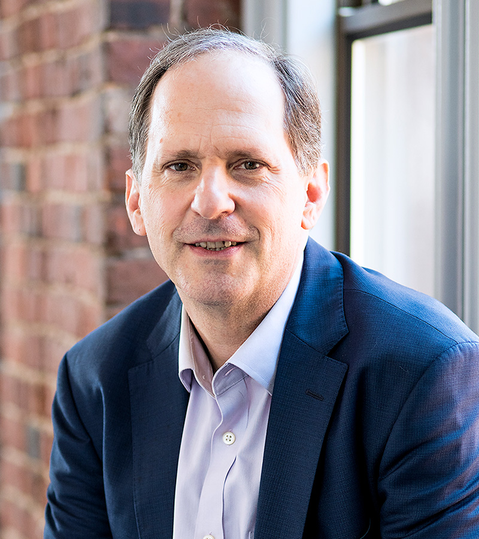

[Armond Cohen](https://www.catf.us/experts/armond-cohen/) is the executive director of the [Clean Air Task Force](https://www.catf.us/). CATF has been rated as the most cost-effective climate change charity, including by organisations such as [Founder's Pledge](https://founderspledge.com/), [SoGive](https://thinkingaboutcharity.blogspot.com/2020/07/recommended-climate-change-charities.html), and [Giving Green](https://www.givinggreen.earth/recommendations).

<h5>Image credit: Clean Air Task Force</h5>

Thanks for listening! We'd love to hear what you thought about it — email us at hello@hearthisidea.com or leave a rating below. You can help more people discover the podcast by <a href='https://twitter.com/intent/tweet?text=Check out Hear This Idea, a podcast showcasing new thinking in philosophy, the social sciences, and effective altruism! &url=https://www.hearthisidea.com via @hearthisidea&' about='_blank'>tweeting about it</a>. And, if you want to support the show more directly, consider <a href='https://tips.pinecast.com/jar/hear-this-idea'>leaving us a tip</a>.

## Armond's Recommendations 📚

- [How to Avoid a Cimate Disaster](https://www.goodreads.com/book/show/52275335-how-to-avoid-a-climate-disaster) by Bill Gates
- [A Bright Future](http://www.brightfuturebook.com/) by Joshua S. Goldstein and Staffan A. Qvist
- [Michael Cembalest's Annual Energy Paper](https://privatebank.jpmorgan.com/gl/en/insights/investing/eotm/annual-energy-paper) by Michael Cembalest

 <Book url="https://www.goodreads.com/book/show/6117055-the-greatest-show-on-earth" image="book-armond-1" spineColor="#e87957"/> <Book url="https://www.goodreads.com/book/show/257106.Our_Inner_Ape" image="book-armond-2" spineColor="#9ae9fe"/> <Book url="https://www.goodreads.com/book/show/10483171-the-beginning-of-infinity" image="book-armond-3" spineColor="#a8b990"/> 
 

For extra credit:
- [Energy Transitions: History, Requirements, Prospects](https://www.goodreads.com/book/show/8110056-energy-transitions) by Vaclav Smil
- [Sustainable Energy – without the hot air](https://www.withouthotair.com/) by David MacKay

## Things mentioned in the show

- Karl Mannheim's [Theory Of Generations](https://en.wikipedia.org/wiki/Theory_of_generations) and [article](http://marcuse.faculty.history.ucsb.edu/classes/201/articles/27MannheimGenerations.pdf)
- James Hansen's [congressional testimony](https://www.bloomberg.com/opinion/articles/2020-01-30/1988-global-warming-forecast-by-james-hansen-proved-mostly-true) and warning about [super pollutants](https://www.nrdc.org/experts/anjali-jaiswal/curbing-super-pollutants-under-montreal-protocol)
- [Toll from Coal](https://www.tollfromcoal.org/#/map/(title:none//detail:none//map:none/US)) infographic on air pollution deaths
- Isiah Berlin's "[The hedgehog and the fox](https://www.blogs.hss.ed.ac.uk/crag/files/2016/06/the_hedgehog_and_the_fox-berlin.pdf)" essay
- [Super hot rock geothermal](https://www.catf.us/wp-content/uploads/2019/06/Super-Hot-Rock-A-Renewable-Energy-Breakthrough.pdf) (see also [wiki](https://en.wikipedia.org/wiki/Enhanced_geothermal_system))
- The [45Q tax credit](https://carboncapturecoalition.org/45q-legislation/) for Carbon Capture and Storage

## Further Reading

- CATF's [Annual Report 2020](https://www.catf.us/wp-content/uploads/2021/02/CAFF-2020-Report.pdf)
- Founder's Pledge [assessment](https://founderspledge.com/stories/the-clean-air-task-force-high-impact-funding-opportunity) of CATF and [climate change report](https://founderspledge.com/research/fp-climate-change)
- Armond's lecture: "[Hedgehogs and Foxes: Toward Climate Pragmatism](https://www.youtube.com/watch?v=3Wrll3ktqpI)"
- [80,000 Hours Podcast w/ Kelly Wanser](https://80000hours.org/podcast/episodes/kelly-wanser-climate-interventions/) on geo-engineering
- [Ezra Klein's podcast series on climate change](https://podcasts.apple.com/us/podcast/we-live-in-the-good-place-and-were-screwing-it-up/id1081584611?i=1000455242142)

## Key Points

**CATF's approach to climate change focuses on technology and policy solutions. It also means being open to changing your mind—**

> We are wonks and plumbers. Our focus is really on relatively technical issues and pragmatic solution pathways. So we do a lot of work trying to understand technology at a fairly deep level [...] Other organisations rely on us for our technical understanding.

> The other part is we have somewhat a different view of the climate situation than other NGOs. We take a very technologically agnostic approach. We support almost anything that's zero carbon, at least exploring it. We think that having multiple options to tackling climate change is absolutely critical. That is not the view of lots of other environmental organisations.

> It's really turning climate change from an identity movement and cultural signifier into a practical plan of actions, and I think we've just crossed that threshold. In my 30 year career I've never seen such a rapid change in the approach of politicians, the general public, and industrial corporations.

(There is a clear link here to the new animal rights movement, which we explore in our [episode](http://hearthisidea.com/episodes/bruce) with Bruce Friedrich from the Good Food Institute)

**Early environmental progress came by focusing on the health effects of air pollution, which had broader public support in the US than climate change —**

> We do all this work on climate and people ask us "Why are you called the Clean Air Task Force and not the Climate Task Force?", and that actually a deliberate choice. Back when we started in the mid-90s, climate didn't really have the traction it does today as a public issue. Our theory was to focus on fossil fuel carbon emitting sources, which have more immediate health effects and that people could observe.

> Our theory of change was that if we could pinch down on the emissions of all these conventional pollutants, in the process effectively force more costs on [unabated] coal generation, that combined with natural gas replacement would get us a long way to our climate goals [...] Now most of the US coal power plant fleet will be retired by the 2030s [...] and a lot of that has to do with the emissions controls from nitrogen, sulphur, and soot.

> We should take positions but hold them lightly, and be open to contrary evidence. I wish there was more of that -- not just in the environmental movement but in the world at large.

**We cannot "de-grow" our way out of this environmental challenge —**

> The overwhelming fact is that the US and Europe together represent something like 35% of the world energy consumption — maybe a bit higher. But in any case, it is the developing word that is going to detemrine the climate future and determine the future of energy.

> Right now, the average African consumes 5% per capita in energy than someone in the OECD does [...] These are energy starved parts of the world; there are still 600 million people with our reliable access to energy. Modernity and humanity is going to require that these folks get access to energy.

> We can cut energy use in half in the OECD but it is going to get swamped by growth this century. To give a factoid, in the last decade, Europe reduced energy demand by 4-6%, but the developing world increased their energy use by 600%.

> The question is "How do you double the energy supply and make it zero carbon at the same time? And 80% of energy at the moment is coming from untreated fossil fuels". [Degrowth] understates the size of the problem and makes people think somewhat less radically of the solution.

**Being a "fox" when it comes to climate change means not going all-in on any single solution —**

> To leap to the conclusion that a wind and solar combination, together with some lithium ion batteries, will solve all the electric grid problems is another hedgehog ideas. It's very sticky in public discourse, because it's very simple, it's very clear, it's very attractive. It might be right; but it might not be. And the fox approach would be to hedging your bets and taking a probalisitc view; multiplying your options rather than restricting them.

Armond identifes five "buckets", all of which we should be pursuing:

1. Renewables
2. Nuclear
3. Fossil fuels with carbon taken out
4. Energy efficiency
5. Carbon removal

> None of these are fatal arguments, but they do suggest that if we really want to get to zero emissions in the space of a few decades, it would be wise to be mindful of the downsides as well as the upsides. And it's just really complicated.

**Bi-partisanship is key for creating effective US climate change policy, and there have been successes —**

> I think we have no choice if we want have stable policy. And we really do need stable and consistent policy over decades, which is what our experience with solar and wind has shown.

> Ping-pong is not good climate change policy

> Big businesses will tell you they are risk-takers, but they hate risk. The whole game is to put risk on someone else and maximise profit. So policy certainty is absolutely what investors are looking for. They need a price signal, they need some sense that these things are going to stick [...] and Legislation tends to be more stable than regulation.

> [The 45Q tax credit] was the first time the US congress has ever enacted an effective price on carbon, which is an interesting precedent. You had Texas republicans voting for basically pricing carbon at $45 a ton, which is quite a leap for those guys to acknowledge the government should be paying to reduce carbon. So you take small steps where you can.

> The big win would be a clean energy standard, which would require more and more of the electricity being produced in the coming decades to come from non-emitting sources, until by 2050 it's one hundred percent [...] We are having good conversations about this and if it's structured correctly, I think there would be people who would buy into that.

**There are big gaps in Africa and Asia for NGOs focused on climate technologies and policy —**

> We really want to grow our partnerships. CATF is based in Boston and Brussels, so we are not going to be necessarily seen as the most important voice in Lagos Nigeria. So the question is who can you find in Nigeria that has local political understanding, connections, and legitimacy to be working in this space.

> In terms of more solutions based approaches and the kind of work we do, there aren't a whole lot of examples [in Asia]. It's an underfunded area and if there are EA philanthropists listening to this, I would urge you to think more about developing that sort of capacity.

That said, Armond highlights that in India, three excellent organisations are:

- [Council on Energy, Environment, and Water](https://www.ceew.in/)
- [Energy and Resources Institute](https://www.teriin.org/)
- [The Centre for Study of Science Technology and Policy](https://cstep.in/)

**There is lots of work left to do if we want to tackle climate change. But there's also lots to be optimistic about —**

> I really thought these [fossil fuel] industries were going to be intransigent and would simply opt for managed decline instead of proactive energy. It's opened up a tremendous amount of solutions space.

> [Solar PV] is great proof of concept, that when you say "we want clean energy" and you are wiling to spend what are really trivial sums in the grand total —billions in R&D in an energy sector that spends $6 trillion ever year — you can have a big effect.

> The most important individual action you can take is vote for people who will take action on this problem [...] By far your biggest impact is as a citizen, not as a consumer.

Thanks for listening <i>and</i> reading the write-up! We'd love to hear what you thought about it — email us at hello@hearthisidea.com or leave a rating below. You can help more people discover the podcast by <a href='https://twitter.com/intent/tweet?text=Check out Hear This Idea, a podcast showcasing new thinking in philosophy, the social sciences, and effective altruism! &url=https://www.hearthisidea.com via @hearthisidea&' about='_blank'>tweeting about it</a>. And, if you want to support the show more directly, consider <a href='https://hearthisidea.com/donate'>leaving us a tip</a>.

P.S. For this and most future episodes, we've chosen to write a briefer write-up than normal. Writing our more involved write-ups often takes longer than producing the episodes themselves, so we're dialling down this effort to focus on producing more episodes. We get the impression this is what our audience would prefer, but let us know if you'll miss the long write-ups! 

