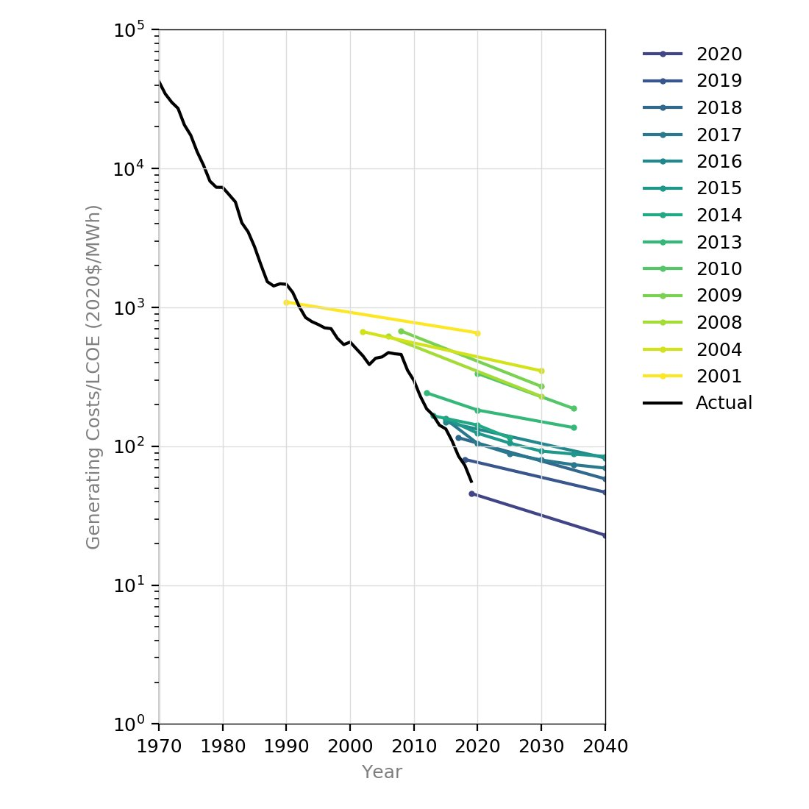

Dr [Matthew Ives](https://www.oxfordmartin.ox.ac.uk/people/dr-matthew-ives/) is an economist and complex systems modeller currently working at Oxford University on the Oxford Martin [Post-Carbon Transition Programme](https://www.postcarbontransition.net/).

<h5>Image credit: Oxford Martin School</h5>

Thanks for listening! We'd love to hear what you thought about it — email us at hello@hearthisidea.com or leave a rating below. You can help more people discover the podcast by <a href='https://twitter.com/intent/tweet?text=Check out Hear This Idea, a podcast showcasing new thinking in philosophy, the social sciences, and effective altruism! &url=https://www.hearthisidea.com via @hearthisidea&' about='_blank'>tweeting about it</a>. And, if you want to support the show more directly, consider <a href='https://tips.pinecast.com/jar/hear-this-idea'>leaving us a tip</a>.

## Matt's Recommendations 📚

- [Thinking in Systems: A Primer](https://www.goodreads.com/book/show/3828902-thinking-in-systems) by Donella H. Meadows and Diana Wright
- [Energy Challenge](https://site.energychallenge.info/) by Matthew Ives et al.
- [The Complexity Economics Revolution](https://static1.squarespace.com/static/54afc2eae4b0fb47dcb12dd5/t/60cb24cb4bcca0585fe38f3d/1623925964305/complexity+economics+revolution+intro+June+12+2021.pdf) (Chapter 1) by J. Doyne Farmer

 <Book url="https://www.goodreads.com/book/show/3828902-thinking-in-systems" image="book-matt-1" spineColor="#9dcd9f"/> <Book url="https://site.energychallenge.info/" image="book-matt-2" spineColor="#9ae9fe"/> <Book url="https://static1.squarespace.com/static/54afc2eae4b0fb47dcb12dd5/t/60cb24cb4bcca0585fe38f3d/1623925964305/complexity+economics+revolution+intro+June+12+2021.pdf" image="book-matt-3" spineColor="#ea6d62"/> 
 

Bonus, in case you want to watch a video about garbage trucks:
- [Garbage Trucks: On Route, In Action!](https://youtu.be/LTUjiLxzDQs)

## Things mentioned in the show
- [Shell: Netherlands court orders oil giant to cut emissions](https://www.bbc.co.uk/news/world-europe-57257982)
- [‘Exceptional new normal’: IEA raises growth forecast for wind and solar by another 25%](https://www.carbonbrief.org/exceptional-new-normal-iea-raises-growth-forecast-for-wind-and-solar-by-another-25)
- [IEA](https://www.iea.org/) solar forescast cost vs actual costs —

## Further reading

- [Sensitive intervention points in the post-carbon transition](https://science.sciencemag.org/content/364/6436/132) by J. Doyne Farmer, Matthew Ives, et al.
- [Are Ideas Getting Harder to Find?](https://web.stanford.edu/~chadj/IdeaPF.pdf) by Nicholas Bloom et al.
- [Shared Socioeconomic Pathways](https://en.wikipedia.org/wiki/Shared_Socioeconomic_Pathways) (Wikipedia)
- [Shock, Stress or Signal? Implications of Freshwater Flows for a Top-Level Estuarine Predator](https://journals.plos.org/plosone/article?id=10.1371/journal.pone.0095680) (Matt's shark tracking project)

Thanks for listening <i>and</i> reading the write-up! We'd love to hear what you thought about it — email us at hello@hearthisidea.com or leave a rating below. You can help more people discover the podcast by <a href='https://twitter.com/intent/tweet?text=Check out Hear This Idea, a podcast showcasing new thinking in philosophy, the social sciences, and effective altruism! &url=https://www.hearthisidea.com via @hearthisidea&' about='_blank'>tweeting about it</a>. And, if you want to support the show more directly, consider <a href='https://hearthisidea.com/donate'>leaving us a tip</a>.

P.S. For this and most future episodes, we've chosen to write a briefer write-up than normal. Writing our more involved write-ups often takes longer than producing the episodes themselves, so we're dialling down this effort to focus on producing more episodes. We get the impression this is what our audience would prefer, but let us know if you'll miss the long write-ups! 

