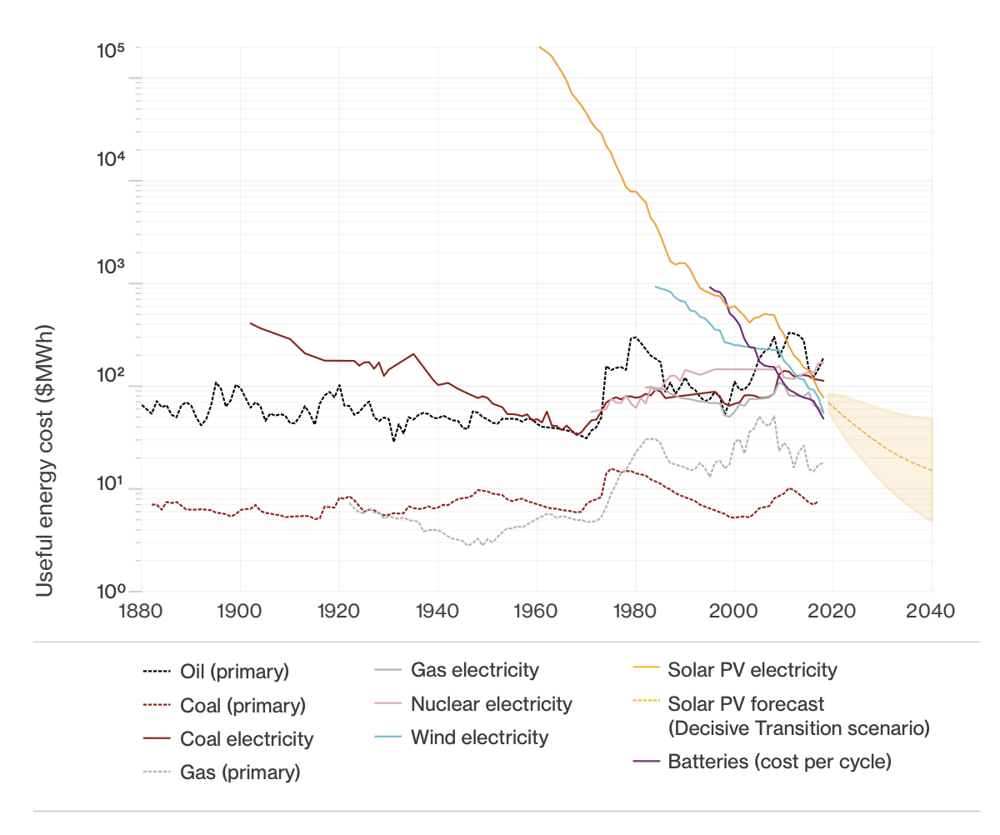
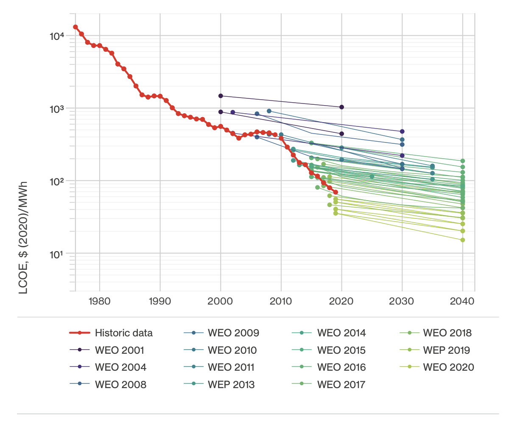
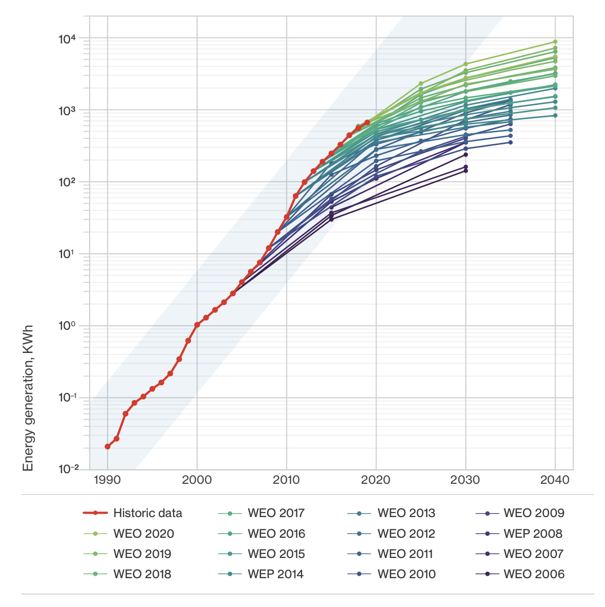

Dr [Matthew Ives](https://www.oxfordmartin.ox.ac.uk/people/dr-matthew-ives/) is an economist and complex systems modeller currently working at Oxford University on the Oxford Martin [Post-Carbon Transition Programme](https://www.postcarbontransition.net/).

<h5>Image credit: Oxford Martin School</h5>

Thanks for listening! We'd love to hear what you thought about it — email us at hello@hearthisidea.com or leave a rating below. You can help more people discover the podcast by <a href='https://twitter.com/intent/tweet?text=Check out Hear This Idea, a podcast showcasing new thinking in philosophy, the social sciences, and effective altruism! &url=https://www.hearthisidea.com via @hearthisidea&' about='_blank'>tweeting about it</a>. And, if you want to support the show more directly, consider <a href='https://tips.pinecast.com/jar/hear-this-idea'>leaving us a tip</a>.

## Matt's recommendations 📚

- [Thinking in Systems: A Primer](https://www.goodreads.com/book/show/3828902-thinking-in-systems) by Donella H. Meadows and Diana Wright
- [Energy Challenge](https://site.energychallenge.info/) by Matthew Ives et al.
- [The Complexity Economics Revolution](https://static1.squarespace.com/static/54afc2eae4b0fb47dcb12dd5/t/60cb24cb4bcca0585fe38f3d/1623925964305/complexity+economics+revolution+intro+June+12+2021.pdf) (Chapter 1) by J. Doyne Farmer

 <Book url="https://www.goodreads.com/book/show/3828902-thinking-in-systems" image="book-matt-1" spineColor="#9dcd9f"/> <Book url="https://site.energychallenge.info/" image="book-matt-2" spineColor="#9ae9fe"/> <Book url="https://static1.squarespace.com/static/54afc2eae4b0fb47dcb12dd5/t/60cb24cb4bcca0585fe38f3d/1623925964305/complexity+economics+revolution+intro+June+12+2021.pdf" image="book-matt-3" spineColor="#ea6d62"/> 
 

Bonus, in case you want to watch a video about garbage trucks:
- [Garbage Trucks: On Route, In Action!](https://youtu.be/LTUjiLxzDQs)

## Things mentioned in the show
- [Complexity Economics](https://www.exploring-economics.org/en/orientation/complexity-economics/) (Explainer)
- [Sensitive intervention points in the post-carbon transition](https://science.sciencemag.org/content/364/6436/132) by Farmer et al.
- [Experience Curve](https://en.wikipedia.org/wiki/Experience_curve_effects) (Wikipedia)
- [‘Exceptional new normal’: IEA raises growth forecast for wind and solar by another 25%](https://www.carbonbrief.org/exceptional-new-normal-iea-raises-growth-forecast-for-wind-and-solar-by-another-25)
- [Estimating the costs of energy transition scenarios using probabilistic forecasting methods](https://www.inet.ox.ac.uk/files/energy_transition_cost_INET_working_paper_with_SI1.pdf) by Way et al.
- [Can stimulating demand drive costs down? World War II as a natural experiment](https://www.inet.ox.ac.uk/files/Lafond-Greenwald-Farmer-WWII_as_natural_experiment.pdf) by Lafond et al.
- [Updating DICE model](https://www.nature.com/articles/s41558-020-0833-x?__ac_lkid=14b0-f639-efd2-f4de175b9c0788e)
- [Intermittentcy Problem](https://en.wikipedia.org/wiki/Variable_renewable_energy#Intermittent_energy_source) (Wikipedia)
- [Stranded Assets](https://carbontracker.org/terms/stranded-assets/) (Explainer)
- [Shell: Netherlands court orders oil giant to cut emissions](https://www.bbc.co.uk/news/world-europe-57257982)
- [Finanical Stability Board's comments on climate risk](https://www.fsb-tcfd.org/about/)
- [Shared Socioeconomic Pathways](https://en.wikipedia.org/wiki/Shared_Socioeconomic_Pathways) (Wikipedia)

## Further reading
- [Noah Smith's take on climate economics](https://noahpinion.substack.com/p/why-has-climate-economics-failed) 
- [Are Ideas Getting Harder to Find?](https://web.stanford.edu/~chadj/IdeaPF.pdf) by Nicholas Bloom et al.
- [Technology life-cycles in the energy sector](https://www.sciencedirect.com/science/article/pii/S004016251500284X)
- [The Economic Implications of Learning by Doing](https://papers.ssrn.com/sol3/papers.cfm?abstract_id=1506343) by Arrow
- [No quick switch to low-carbon energy](https://www.nature.com/articles/462568a) by Kramer and Haigh 
- [On Modeling and Interpreting the Economics of Catastrophic Climate Change](https://dash.harvard.edu/bitstream/handle/1/3693423/Weitzman_OnModeling.pdf?sequence=2) by Weitzman
- [Shock, Stress or Signal? Implications of Freshwater Flows for a Top-Level Estuarine Predator](https://journals.plos.org/plosone/article?id=10.1371/journal.pone.0095680) (Matt's shark tracking project)

## Key points

**Complexity Economics—**
> [Complexity Economics] looks at the economy from a different perspective. We don't rely on some of the big assumptions that are problematic for neoclassical economics, like that we are always in some sort of equilibrium state. We spend most of our time looking at the data and trying to find relationships in the data. We also tend to use methodologies that aren't used as much in neoclassical economics; one example is network theory — understanding network behaviour can give you an idea of what's happening in the economy, like supply chains between companies

**Sensitive Intervention Points—**
> [From the article:] Kick to the current state of the system, moving it onto a new trajectory without any change in the underlying system dynamics. If the new trajectory diverges rapidly from the old trajectory, then a small kick at the right point can trigger a large change. A small kick can be effective when the system is chaotic or when it is near a critical point [...] Shift in the underlying system dynamics, where the rules of the system themselves change and trajectories alter substantially. A shift can be effective even without a kick. In the socioeconomic-political sphere, a shift may entail a change in key concepts and institutions.

**Solar Power—**

> The costs have come down around 5,000x fold and in the last decade it's been declining 10%pa. We have not seen any evidence that this trend won't continue.

> But the key point is that it's based on cumulative appointment. So say at some point you'll have half the world's energy system supplied by solar. You can only double that one more time. There will be certain decommissioning of old stock, but their's a natural end to how much you can deploy.

> Most materials out there haven't changed their costs inflation adjusted through time. We don't really understand why. But one potential answer for fossil fuels in particular is you have to go further and it's harder to goet more out of the ground you take it from the easiest places, you get places at exploring and extracting but because you have to go further and to more remote places it costs more. [...] We also have a cartel selling oil, so we haven't seen what the costs are definitely going to be. But we would expect it to be much lower than what it sells at.

**Experience Curves—**
> [Wright] noticed this trend in costs declining with cumulative production -- that is how much production on top of what you have already built. It's also known by other names, such as experience curves or learning by doing. And don't really understand how it works. But there are certainly features that are common in technologies that have good experience curves, such as modularity and mass production so you can get economies of scale

> The more you invest in these early technologies, the more bang for your buck you get out of it [...] You don't want to put all your eggs in one basket, but you don't want to spread yourself out too thin either

> I'm a modeller myself and I know it's far easier to model problems and barriers -- and we do do that, we put those in -- but we don't put in human ingenuity, we don't put in all those solutions that we haven't even thought of yet. And that's why experience curves are really quite powerful. Because they include those problems being overcome by solutions through time.

**Financial Risk—**
> You can imagine that there are all these assets out there that are on people's books, that will supposedly earn lots of money -- selling oil and gas. They are not worth what they are saying they are worth -- $80 a barrel, which their not. [Oil companies] are defiantly not ignorant of this, I imagine they are quite scared of this risk [...] If anyone is ignorant it is the financial markets, or at least they very optimistic about what the fossil fuel industry will do

**Energy System Models—**

> We would argue that you could these experience curves —or at least the outputs of these experience curve models— into IAMs. I would really like to see this happen, because I am convinced that you would come up with radically different answers. There is this very exciting solution space that these [contemporary] models are not investigating. And part of the reason is that these feedback loops are difficult to model in an optimisation problem, particularly in these big beasts

> Much to the chagrin [of financial markets], their models don't provide any information on probability. Risk is likelihood times consequence. They can give you an idea of the consequence, but they can't give you an idea of the likelihood. [...] They are just projections into the future of certain scenarios. And you can say you believe in one scenario more than the other -- like the "rivalry scenario" or the "sustainability scenario". [...] Some people have taken the fan of all these possible scenarios and put them into a distribution of possible outcomes, but there is not necessarily any scientific credibility to doing that

Thanks for listening <i>and</i> reading the write-up! We'd love to hear what you thought about it — email us at hello@hearthisidea.com or leave a rating below. You can help more people discover the podcast by <a href='https://twitter.com/intent/tweet?text=Check out Hear This Idea, a podcast showcasing new thinking in philosophy, the social sciences, and effective altruism! &url=https://www.hearthisidea.com via @hearthisidea&' about='_blank'>tweeting about it</a>. And, if you want to support the show more directly, consider <a href='https://hearthisidea.com/donate'>leaving us a tip</a>.

P.S. For this and most future episodes, we've chosen to write a briefer write-up than normal. Writing our more involved write-ups often takes longer than producing the episodes themselves, so we're dialling down this effort to focus on producing more episodes. We get the impression this is what our audience would prefer, but let us know if you'll miss the long write-ups! 

