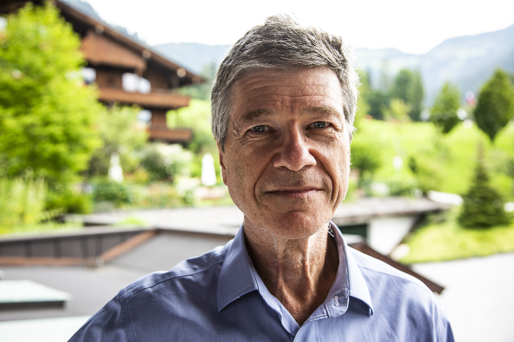

If you enjoyed this episode, you might also like some of our other interviews: <a href='https://www.hearthisidea.com/episodes/eva' target='_none'>Eva Vivalt on evidence-based policy</a>; <a href='https://www.hearthisidea.com/episodes/armond' target='_none'>Armond Cohen on climate change</a>; and <a href='https://www.hearthisidea.com/episodes/luke' target='_none'>Luke Freeman on Giving What We Can</a>.

Professor [Jeffrey Sachs](https://www.jeffsachs.org/) is the Director of the Center for Sustainable Development at Columbia University, President of the UN Sustainable Development Solutions Network, and author of many bestselling books.

In this episode, we talk about:

- The need to **reform the international financial system** and provide developing countries with access to cheap credit — especially during global emergencies;
- Where he sees the **role of mitigating global catastrophic risk in sustainable development**, given the dramatic effect Covid-19 had in disrupting anti-poverty measures;
- The **importance of expert advice and political leadership**, reflecting on the importance of the IPCC in tackling climate change.

In the article below, we summarize and illustrate these key ideas, providing both more detail and further readings for listeners who want to find out more.

## Book Recommendations 📚

- [Black Reconstruction](https://www.goodreads.com/book/show/184612.Black_Reconstruction_in_America_1860_1880?from_search=true&from_srp=true&qid=xAZKKeIBgD&rank=1) by W. E. B. Du Bois
- [Nichomachean Ethics](https://www.goodreads.com/book/show/229349.Nichomachean_Ethics?from_search=true&from_srp=true&qid=90FH8Jeym2&rank=2) by Aristotle
- [Essays in Persuasion](https://www.goodreads.com/book/show/368291.Essays_in_Persuasion?from_search=true&from_srp=true&qid=U9Gt8tRiS9&rank=1) by John Maynard Keynes

 <Book url="https://www.goodreads.com/book/show/184612.Black_Reconstruction_in_America_1860_1880" image="book-sachs-1" spineColor="#ca9aab"/> <Book url="https://www.goodreads.com/book/show/368291.Essays_in_Persuasion" image="book-sachs-2" spineColor="#444444"/> <Book url="https://www.goodreads.com/book/show/229349.Nichomachean_Ethics" image="book-sachs-3" spineColor="#851200"/> 
 

You can find out more reading recommendations by visiting [Book Club with Jeffrey Sachs](https://www.bookclubwithjeffreysachs.org/).

## Take action

As Professor Sachs says in our interview —

> “We can end extreme poverty — we're just not trying very hard.”

Whilst ending extreme poverty may ultimately rely on the actions of government and multinational institutions, each of us can take individual action to help directly improve the lives of the most vulnerable people in the world. Indeed, it may be surprising just [how much impact you can have](https://howrichami.givingwhatwecan.org/how-rich-am-i) even if you don’t consider yourself wealthy. Here are some suggestions for taking action:

- [Donate](https://www.givewell.org/) to the most effective global health and anti-poverty charities in the world. GiveWell identifies the charities that save or improve the most lives per dollar.

- See our [interview with Sanjay Joshi](https://hearthisidea.com/episodes/sanjay) about the importance of charity evaluation.

- [Join](https://www.givingwhatwecan.org/) a community of people giving a significant portion of their income to the world’s most effective charities. You can ‘try giving’ just 1%+ of your income for a year.

- See our[ interview with Luke Freeman](https://www.givingwhatwecan.org/) to learn about Giving What We Can.

- [Plan](https://80000hours.org/) how you can use your career to solve the world's most pressing problems.

- See our (upcoming) interview with Ben Todd to learn about 80,000 hours.

- [Protest](https://actions.oxfam.org/great-britain/save-uk-aid/email-representative/) the UK government’s plan to cut its foreign aid budget by £4bn. If you are a British citizen, contact your MP!

- If you want to volunteer, you can reach out to [Sanjay from SoGive](https://forum.effectivealtruism.org/posts/a5qSgWBLRsicYFRFm/gbp4bn-for-the-global-poor-the-uk-s-0-7) for more info.

## Development economics and ending poverty

**Many people are sceptical about the effectiveness of foreign aid. However, we know about a number of interventions that credibly and reliably improve or save the lives of people in the developing world —**

### Quotes from the interview

> “I used to say, let the Pentagon take a long weekend and then we can end malaria. But even after you prove that [the intervention] works, it doesn't change the politics. You get to a point after a while where you realise, these are arguments thrown up as obfuscations. These are not arguments meant in good faith. These are lazy arguments to disguise the fact that we are only going to give this amount and we'll defend that proposition.”

### Further reading

#### Debate on foreign aid  

- Our World In Data has a great [primer on extreme poverty](https://ourworldindata.org/extreme-poverty). Read this first!

- [William Easterly](https://www.williameasterly.org/)’s [debate](https://blogs.worldbank.org/psd/the-jeffrey-sachs-william-easterly-saga) with Jeffrey Sachs

- Easterly’s [tweet](https://twitter.com/bill_easterly/status/898606621361713153) on how he thinks he was wrong on bednets

- Easterly (2001) “[The Elusive Quest For Growth](https://www.goodreads.com/book/show/36232.The_Elusive_Quest_for_Growth)” and Moyo (2009) “[Dead Aid](https://www.goodreads.com/book/show/6184317-dead-aid)” both argue that Western aid will often do more harm than good

- [Easterly (2007) ](https://www.aeaweb.org/articles?id=10.1257/aer.97.2.328)— “$568 billion in today’s dollars flowed into Africa over the past 42 years, yet per capita growth of the median African nation has been close to zero. The top quarter of aid recipients [...] received 17 per cent of their GDP in aid over those 42 years, yet also had near-zero per capita growth. Successful cases of development happening due to a large inflow of aid and technical assistance have been hard to find.”
  - [Nunn and Qian (2014)](https://www.aeaweb.org/articles?id=10.1257/aer.104.6.1630) found that US Food Aid increases the incidence and duration of civil conflicts in the countries it is trying to help

- Chief of USAID [saying](http://commdocs.house.gov/committees/intlrel/hfa72978.000/hfa72978_0.HTM) in 2001 they couldn’t give HIV medicine to Africans because they can’t tell the time and adhere to schedule

- A [study](https://www.ncbi.nlm.nih.gov/pmc/articles/PMC1808103/) refuting this statement, showing that Africans Take Medicines More Faithfully than North Americans

- Giving What We Can compile a list of [common myths](https://www.givingwhatwecan.org/get-involved/myths-about-charity/) when it comes to giving to charity. See also our [interview with Luke Freeman](https://hearthisidea.com/episodes/luke)

- More recently, the discussion has shifted from a broad macroeconomic discussion about whether foreign aid is good, and towards narrower microeconomic questions of which interventions work, and which unique contexts this might depend on

- Banerjee & Duflo’s (2011) “[Poor Economics](https://www.goodreads.com/book/show/10245602-poor-economics)” is a great introduction to the randomista revolution (and one of our absolute favourites reads!)

  - [GiveWell](https://www.givewell.org/research) and [J-PAL](https://www.povertyactionlab.org/) frequently discuss the latest evidence and studies

  - See also our [interview with Eva Vivalt,](https://hearthisidea.com/episodes/eva/) where she discusses [AidGrade](https://www.aidgrade.org/), a platform that collects the results of impact evaluations

  - Still, there are concerns that just focusing on RCTs may be neglecting the importance of boosting economic growth more generally

  - See our previous write-up on the randomista debate [here](https://hearthisidea.com/episodes/luke#the-randomista-debate-rcts-and-economic-growth)
    - See also [this post](https://forum.effectivealtruism.org/posts/bsE5t6qhGC65fEpzN/growth-and-the-case-against-randomista-development) about the potential limits of the randomista approach

- [The Global Fund](https://www.theglobalfund.org/en/) to fight AIDS, TB and Malaria

- Discussion of the Obama administration's [record](https://www.npr.org/sections/health-shots/2011/12/01/143024108/obama-embraces-end-of-aids-promises-to-accelerate-hiv-treatment) on fighting HIV

- The UK government’s [plans](https://commonslibrary.parliament.uk/spending-review-reducing-the-aid-commitment/) to cut its 0.7% foreign aid budget

#### Reforming education in the developing world

- In 1994, Benhabib & Spiegel [observed](https://www.sciencedirect.com/science/article/abs/pii/0304393294900477) that there was little to no relationship between measured human capital (i.e. education) and income

- It led them to ask “Where has all the education gone?”, and led economists to think about how educational interventions can be made effective in the developing world.

- *Supply Side*: [Banerjee et al. (2007)](https://academic.oup.com/qje/article/122/3/1235/1879525?login=true) found that a crucial factor in India was to “teach at the right level” and provide support to those lagging behind

- *Demand Side*: [Jensen (2010)](https://academic.oup.com/qje/article/125/2/515/1882172?login=true) found that it was also important to communicate just how valuable secondary education is. Just making this information available caused students in the Dominican Republican to stay in school longer.

#### Charging for bed nets

- Distributing bednets appear to be an extremely effective global health intervention. But because bednets require recipients to actively use them (unlike one-off vaccinations for example), there was considerable thought about what effect subsidies might have on behaviour: 

- *Screening effect*: positive price selects those who are likely to use it, reducing wastage. That is, it gets the nets to those who most value them (assuming efficient markets)
  - *Psychological effect*: positive price induce people to use it more if they exhibit “sunk cost” fallacies, thus acting as a psychological commitment device and increasing efficacy;
  - *Price-signals-quality effect*: Charging for bednets may encourage higher use as it indicates they are valuable. This is applicable if we have asymmetric information about the benefits of bed nets;
  - *Entitlement effect*: One-off subsidies may generate unwillingness to pay more for the product later and thus negatively affect long-run adoption;
  - *Learning effect*: Subsidies induce more people to experience benefits and learning the true value of the product.

- [J-PAL (2018)](https://www.povertyactionlab.org/policy-insight/impact-price-take-and-use-preventive-health-products) reviewed five RCTs that looked at the relationship between the price of preventive health products and usage. They found that for most products, usage is as high among beneficiaries of free distribution as among households who pay for it

- [Cohen & Dupas (2010)](https://www.jstor.org/stable/40506276) found that women who received free ITNs are not any less likely to use them than those who paid subsidized positive prices 
  - [Dupas (2014)](https://onlinelibrary.wiley.com/doi/abs/10.3982/ECTA9508) found that there is a learning effect for bednets in Kenya and no anchoring (but note that this may be very specific the product and context)

## Effects of Covid and global finance

**Poor countries do not have as much access to credit as rich countries. This inequality poses a significant obstacle in mitigating the global effects of Covid-19, with governments being constrained in their ability to buy vaccines and stimulate their economies. These trends could lead to potentially long-lasting financial crises.**

### Quotes from the interview

> “What will the scarring be of Covid? Will it lead to a long tail of financial distress and debt distress? One of the things that has happened in the last few months is that Fitch has downgraded systematically one African country after the other in the context of Covid. So the debt crises, although perhaps silent for the moment, are definitely rising.”

> “What strikes me is just how poorly global finance works. It's been an observation for a long time that theoretically finance should be flowing from the capital-rich to the capital-poor countries. Put aside risk issues for just one moment. We have countries that have 1/50 of the capital per person of the rich countries and there is every reason to believe that the social return to this will be very high (it's investing in basic education and healthcare). But we don't have a financial system that finances the accumulation of that capital even in extremely capital scarce settings”

> “On the one hand, it's understandable that there is still a time delay because immunising the world with vaccines that didn't even exist a year ago is not a simple proposition. The fact that there is still no plan to do so is shocking.”

### Further reading

- A [tracker](https://sdg-tracker.org/) for the Sustainable Development Goals

- Assessment of the impact Covid has had on the SDGs: UNDP’s [data](https://data.undp.org/content/assessing-covid-impacts-on-the-sdgs/) and [website](https://feature.undp.org/covid-19-and-the-sdgs/); SDG integration’s [report](https://sdgintegration.undp.org/accelerating-development-progressduring-covid-19) 

- [Fiscal response to Covid-19](https://www.imf.org/en/Topics/imf-and-covid19/Fiscal-Policies-Database-in-Response-to-COVID-19). The Global North has spent huge sums as a response to Covid, of which the US alone accounts for $6 trillion. By contrast, many developing countries have seen their budgets decline as debt vulnerabilities grow

- (Technical) macroeconomic [paper](https://ideas.repec.org/p/cam/camdae/2116.html) and [blogpost](https://voxeu.org/article/economic-consequences-covid-19-multi-country-analysis) on the fiscal impacts of covid

Source: [IMF](https://www.imf.org/en/Topics/imf-and-covid19/Fiscal-Policies-Database-in-Response-to-COVID-19)

- IMF’s [Special Drawing Rights](https://en.wikipedia.org/wiki/Special_drawing_rights) and [role](https://www.brookings.edu/blog/future-development/2020/03/26/imf-special-drawing-rights-a-key-tool-for-attacking-a-covid-19-financial-fallout-in-developing-countries/) in mitigating the fallout of the pandemic

- The [Lucas paradox](https://en.wikipedia.org/wiki/Lucas_paradox) observes that capital does not flow from developed countries to developing countries despite the fact that developing countries have lower levels of capital per worker

- [Alfaro et al. (2008)](https://direct.mit.edu/rest/article/90/2/347/57727/Why-Doesn-t-Capital-Flow-from-Rich-to-Poor) have an empirical study trying to explain this phenomenon and find that institutional quality matters a lot

- [Diamond-Dybvig Model](https://www.journals.uchicago.edu/doi/10.1086/261155) (1983) explains how self-fulfilling panics can cause bank runs. You can read a [simple explainer](https://papers.ssrn.com/sol3/papers.cfm?abstract_id=2186646) here or [watch](https://www.youtube.com/watch?v=YCjTWOqJ_io) a video here

- [Exorbitant Privilege](https://en.wikipedia.org/wiki/Exorbitant_privilege) refers to how the US cannot face a [balance of payments crisis](https://en.wikipedia.org/wiki/Balance_of_payments_crisis), because its imports are purchased in its own currency, the US Dollar), which is the global reserve currency

## Institutions and global risks

**Global Catastrophic Risks can have huge and preventable impacts. If we want to mitigate the outfalls from shocks like Covid-19 in the future, we need to seriously improve our institutions and political leaders. Bringing in scientific and forward planning is key to this —**

### Quotes from the interview

> “The risks of pandemic diseases had already been recognised, even Coronavirus risks were understood. We just didn't prepare for them properly and we didn't react properly. But it wasn't as if the warnings weren't out there. The more one delves into it, especially on the technical level, there was a lot of recognition that the risk of a SARS event could well take place. Our governments are not very good at thinking ahead. [...] We need serious governance. Serious governance means the organisation of government itself so that it is professional, rational, problem solving oriented, and evidence-based.”

> “[Sustainable development is] not so simple, there are shocks, there are unexpected occurrences, there are asteroids, new emerging diseases. There are antibiotic strains that develop. How are you going to handle that? Well, that's what we have Oxford University for, that's what we have think tanks and science around the world and a global network of thinking to help us become aware of those risks and then to analyse what we can do about them. My late colleague at Harvard, Martin Weitzman, was an important proponent of this. When you look at climate change, don't just look at the mean or the average of what can happen, look at the tail of the distribution because that's where most of the action might come for prudential behaviour. We need a risk-based assessment and prudential standards and ethics of prudence also.”

> “Prudence by the way was considered the greatest of virtues by the ancient Greeks [...] it means the capacity to choose good understanding the context in care. Of course, they didn't have all the Bayesian adaptive dynamics that we have. But we now have decision frameworks that can really help us to think about huge shocks at low probabilities and we should be attentive to those. But we should also recognise another core concept and that is planetary boundaries. That when you move beyond known conditions in nonlinear systems a lot of things can go haywire. We are now warmer than at any time in the whole Holocene; we are warmer than at any time during the last 10,000 years, at least if you take century averages and probably decade averages. And that means we are going to see a lot of surprises. Where the heck did that forest fire come from? Where did that typhoon come from? And we're not prepared for that because our politicians want to give a tax cut to their constituents in the next three months, they don't want to prepare for the future.”

### Further reading

- Kenneth Arrow on [asymmetric information](https://link.springer.com/article/10.1007/BF00925335)

- CP Snow (1959) “[The Two Cultures](https://archive.org/details/twocultures00snow/page/3/mode/2up)” (see also the BBC R4 [discussion](https://www.bbc.co.uk/programmes/b01phhy5))

- Weitzman on tail risks from climate change ([accessible](https://scholar.harvard.edu/files/weitzman/files/fattaileduncertaintyeconomics.pdf)) ([technical](https://direct.mit.edu/rest/article/91/1/1/57734/On-Modeling-and-Interpreting-the-Economics-of))

- The [IPCC](https://www.ipcc.ch/) and its [special report](https://www.ipcc.ch/sr15/) on 1.5 degrees warming and tail risks [Section A.3]

- See also our [interview with Matt Ives](https://hearthisidea.com/episodes/matt) on climate change modelling

Source: [IPCC](https://www.ipcc.ch/sr15/chapter/spm/b/spm2/)

- [Future Proof Report](https://www.longtermresilience.org/futureproof) (2021) — How to make the UK more resilient to future catastrophic risks
- Toby Ord (2021) “[The Precipice](https://www.goodreads.com/book/show/50485582-the-precipice?ac=1&from_search=true&qid=6FF3rGZutY&rank=2)” and [further resources](https://theprecipice.com/resources) — A comprehensive survey of the existential threats facing humanity and how to safeguard our potential
- Nick Bostrom (2013) “‘[Existential Risk Prevention as Global Priority](https://www.existential-risk.org/concept.pdf)” and [further readings](https://www.existential-risk.org/) — The go-to paper of the “x-risk” literature

Thank you very much to Professor Sachs for his time.

