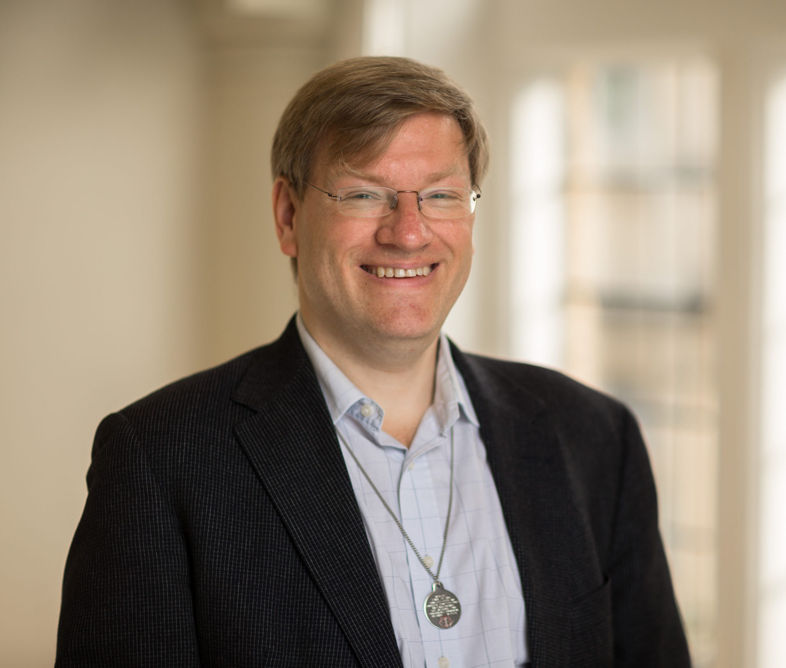
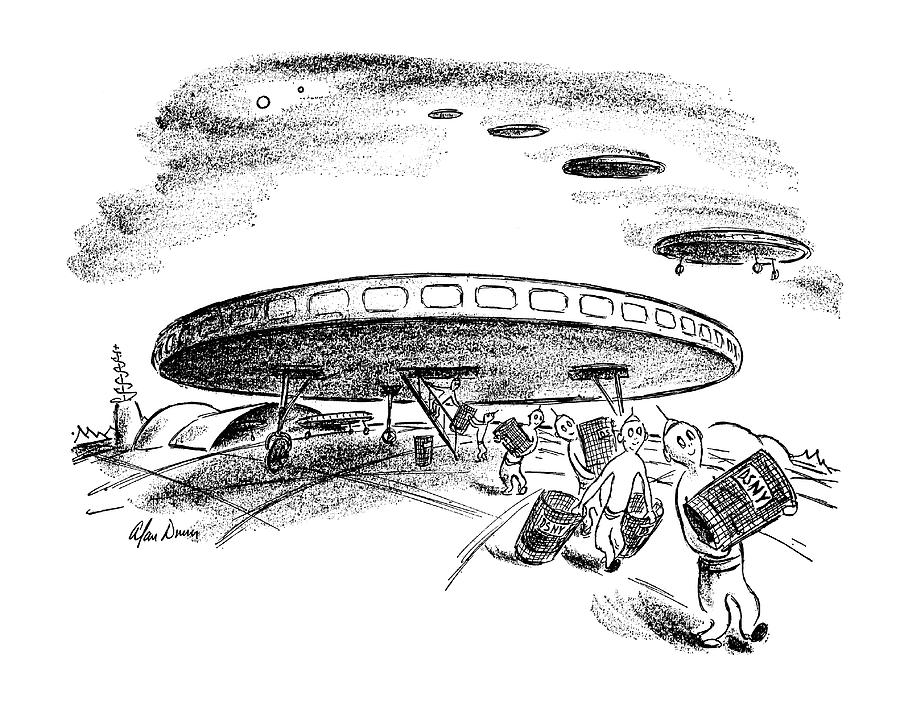
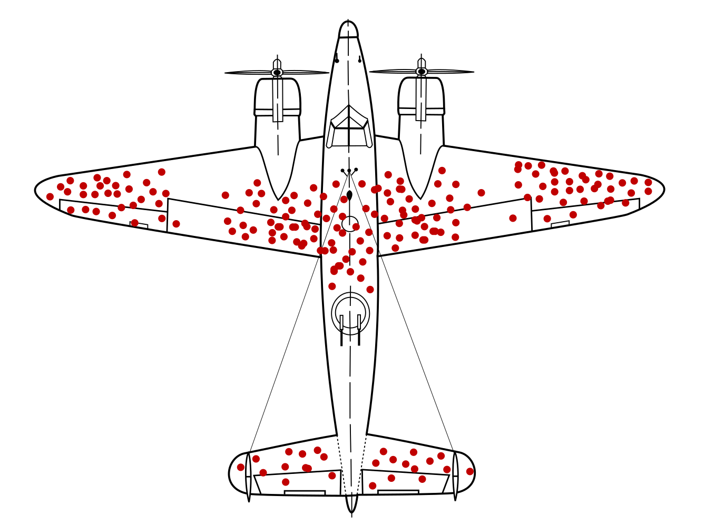

If you enjoyed this episode, you might also like some of our other interviews: <a href='https://www.hearthisidea.com/episodes/tom' target='_none'>Thomas Moynihan on the History of Existential Risk</a>, and <a href='https://www.hearthisidea.com/episodes/simon' target='_none'>Simon Beard on Parfit, Climate Change, and Existential Risk</a>.

Anders Sandberg is a researcher, futurist, transhumanist and author. He holds a PhD in computational neuroscience from Stockholm University, and is currently a Senior Research Fellow at the Future of Humanity Institute at the University of Oxford. His research covers human enhancement, [exploratory engineering](https://en.wikipedia.org/wiki/Exploratory_engineering), and 'grand futures' for humanity.

<h5>Image credit: Future of Humanity Institute</h5>

In our interview, we discuss:

- The [Fermi Paradox](https://en.wikipedia.org/wiki/Fermi_paradox): if the universe is so big, where are all the aliens?
  - The [Drake equation](https://en.wikipedia.org/wiki/Drake_equation)
  - Using "Bayes' theorem" to [update on UFO reports](https://www.notion.so/Anders-Sandberg-28ed3e10f93c4769a7888c16a0b54bb5)
  - What the [timing of evolutionary transitions](https://www.notion.so/Anders-Sandberg-28ed3e10f93c4769a7888c16a0b54bb5) on Earth tells us about the rarity of intelligent life in the universe
- What is '[transhumanism](https://en.wikipedia.org/wiki/Transhumanism)'?
  - The case for ending ageing
  - The '[reversal test](https://www.nickbostrom.com/ethics/statusquo.pdf)' for eliminating [status quo bias](https://en.wikipedia.org/wiki/Status_quo_bias)
  - The intellectual history of transhumanism
- Online communities and movement growth
  - How mechanisms for discussion (forums, blogs, Twitter, email) shape what gets discussed
  - Why hype curves apply to social movements as well as new technologies
  - Why successful political or moral movements often emerge out of nowhere, and why aspiring social movements should aim to influence the next generation, not the current one
- Much more!
  - [Why fridges are underrated](https://twitter.com/anderssandberg/status/1373057016223182848)
  - How to move entire galaxies using aluminium foil

In the article below, we summarise and illustrate these key ideas; providing both more detail and further readings for listeners who want to find out more.

## Book Recommendations

- [Intelligent Life in the Universe](https://www.goodreads.com/book/show/275567.Intelligent_Life_in_the_Universe) by Carl Sagan and Iosif Samuilovich Shklovsky
  - Bonus: [The Drake Equation](https://www.cambridge.org/core/books/drake-equation/D253393BB6E6506F328A30D8293CFAC7) by Douglas A. Vakoch (ed.)
- [Last and First Men/Star Maker](https://www.goodreads.com/book/show/564325.Last_and_First_Men_Star_Maker) by Olaf Stapledon
- [Great Mambo Chicken and the Transhuman Condition](https://www.goodreads.com/book/show/665412.Great_Mambo_Chicken_And_The_Transhuman_Condition) by Ed Regis
  - Bonus: [Mind Children: The Future of Robot and Human Intelligence](https://www.goodreads.com/book/show/648195.Mind_Children) by Hans Moravec

 <Book url="https://www.goodreads.com/book/show/275567.Intelligent_Life_in_the_Universe" image="book-anders-1" spineColor="#061d49"/> <Book url="https://www.goodreads.com/book/show/564325.Last_and_First_Men_Star_Maker" image="book-anders-3" spineColor="#f0ece3"/> <Book url="https://www.goodreads.com/book/show/665412.Great_Mambo_Chicken_And_The_Transhuman_Condition" image="book-anders-4" spineColor="#823957"/> 
 

## The Fermi Paradox

### Discussed in the interview

- [Dissolving the Fermi Paradox](https://arxiv.org/abs/1806.02404) by Anders Sandberg, Eric Drexler, and Toby Ord
- [Eternity in six hours: Intergalactic spreading of intelligent life and sharpening the Fermi paradox](https://www.sciencedirect.com/science/article/abs/pii/S0094576513001148?via%3Dihub) by Stuart Armstrong and Anders Sandberg
- [The Timing of Evolutionary Transitions Suggests Intelligent Life is Rare](https://www.liebertpub.com/doi/10.1089/ast.2019.2149) by Andrew E. Snyder-Beattie, Anders Sandberg, K. Eric Drexler, and Michael B. Bonsall
- [The Major Transitions in Evolution](https://en.wikipedia.org/wiki/The_Major_Transitions_in_Evolution) by John Maynard Smith and Eörs Szathmáry
- [Anthropic Shadow: Observation Selection Effects and Human Extinction Risks](https://www.nickbostrom.com/papers/anthropicshadow.pdf) by Milan M. Ćirković, Anders Sandberg, and Nick Bostrom.
- [UFOs: how to calculate the odds that an alien spaceship has been spotted](https://www.devdiscourse.com/article/technology/1604372-ufos-how-to-calculate-the-odds-that-an-alien-spaceship-has-been-spotted) by Anders Sandberg
- [That is not dead which can eternal lie: the aestivation hypothesis for resolving Fermi's paradox](https://arxiv.org/abs/1705.03394) by Anders Sandberg, Stuart Armstrong, and Milan M. Cirkovic
  - [Wikipedia page](https://en.wikipedia.org/wiki/Aestivation_hypothesis)
- [The dogma of otherness](https://www.davidbrin.com/nonfiction/dogmaofotherness.html) by David Brin
- The [End of Greatness scale](https://en.wikipedia.org/wiki/Observable_universe#End_of_Greatness)

The New Yorker cartoon discussed at Los Alamos:

##### Image credit: The New Yorker magazine

### Quotes from the interview

On the Fermi Paradox —

> If the universe is really big and old, and intelligence can emerge in a lot of places, and it can also spread or at least make a big fuss so you can detect it from afar; shouldn't we be noticing a lot of such fuss? A lot of flying saucers, remote nuclear wars, or at least ruins on other planets? Why do we see an empty sky? Why are there no billboards on the Moon?

On [Eternity in Six Hours](https://www.notion.so/Anders-Sandberg-28ed3e10f93c4769a7888c16a0b54bb5) —

> The reason you don't need astronomical resources to spread life over astronomical scales is that life is all about information.

> Maybe it's absolutely impossible to build nanomachines. [That would be] really weird, given that we actually have in practice nanomachines in all our cells. We are in some sense nanotechnology. You might say you can't make artificial intelligence — which is weird, because we are in some sense a material system with intelligence.

> What we tried to do in *Dissolving the Fermi Paradox* was take [this uncertainty] seriously and actually run through with some actual probability distributions and try to see what happens if you plug in that kind of data? And the cool thing is that we don't solve the Fermi paradox, but it kind of dissolves [...] even if you plug in fairly optimistic values [...] the uncertainty that comes out is [still] very big. My average estimate for the number of civilisations in the galaxy might be a million, but the median one is 10, and I get a 30% chance that we're alone in the observable universe. Now I have a probability distribution that's not unreasonable given the data we have [...] there could be a lot of aliens, but it's also fairly likely that there's nobody around. At this point the empty sky doesn't seem that weird any more.

On observer selection effects and the [timing of evolutionary transitions](https://www.notion.so/Anders-Sandberg-28ed3e10f93c4769a7888c16a0b54bb5) —

> We know life emerged on Earth relatively early in its history. Normally, if you have a long span of time and something happens early we should say "yeah that's probably a likely occurrence, since it happened early on." But in this case, we're also biasing the observation. We are life. We cannot be around on the planet where life emerged ten minutes ago. We need at least some time for [intelligent] life to emerge from the primordial goo. Which means that our observation of Earth's past is suspect because of this.

> Out of a big universe, there are some lucky planets that avoid things and there you get observers, whether humans or aliens, sitting around saying "there doesn't seem to be many giant asteroids hitting us." They could be wrong. We could be living in a super dangerous universe where asteroids typically hit planets every ten minutes. But on some rare planets, you're very very lucky. Now this is disconcerting for thinking about the probability of life. Because if we can't trust the observation from Earth, what are we going to do?

> The funny thing is, when you do the math and see the lucky few planets that end up with having been through all the steps and ending up with observers, they end up roughly equidistant, statistically speaking. There is of course a lot of randomness between the different random planets, but this is roughly where we end up. And the more hard steps you get, the more you get crowded towards the end. So if we had a million super hard steps, we should imagine ourselves being *very* close to the end of habitability. If it's just one hard step, we could be somewhere in the middle without too much problem. So what we did in this paper was basically take the data on when the possible hard steps were taken, and then we just fitted this probability model to it, to get 'what's the overall likelihood of the parameters we get out?'. And that generally fits that there are a few hard steps [...] And we don't know how hard [the evolutionary transitions] are exactly; but that gives us some hint that yeah, intelligent life is very rare in the universe.

> What happens is that you have a few lucky planets that get life, and most of them of course don't develop intelligence anyway, so there is no observer seeing them. And the few rare ones end up with having intelligence emerge just before the end. And they're super rare. But the beings on these planets are going to look back and say "life emerged fairly early here, oh life must be easy. And we're around, so intelligence must be easy. Why are the skies so empty?"

On [UFOs](https://www.devdiscourse.com/article/technology/1604372-ufos-how-to-calculate-the-odds-that-an-alien-spaceship-has-been-spotted) —

> We always package these unknown sightings into our cultural framework. So the funny thing now of course is if I see something weird in the sky and say that might have been aliens, people might not believe me but they're not going to think I'm crazy. But if I said I saw fairies up in the sky, people will say "Anders, are you alright?"

> The recent Pentagon films mostly show weird stuff that could be almost anything. So when you want to update your beliefs you should try to do it in a Bayesian manner. You say the probability of something given the evidence should equal the probability of getting that evidence if this was true, times the basic probability you believe this could be happening, divided by the probability of seeing the evidence.

> If it's easy for advanced civilisations to spread across the universe, maybe advanced civilisations have done so, but they aren't interfering with us, like the prime directive in Star Trek that states that you shouldn't mess around with the primitives. It seems like that 'zoo hypothesis' is very fragile, because it only takes a few alien teenagers who want to [visit] people with their flying saucer to break things.

> The interesting question is: why are people so interested in UFOs? This is part of a modern mythology. To some extent, we have replaced the Greek gods, the heroes, with the cartoon characters. Batman is our new form of Hercules. And indeed many people are using them to reason about the world and mirror virtues and sins in various ways. People are using Star Wars as a mythology. And it makes sense to teach kids about how to behave!

> Western civilisation has this relatively unique property as a civilisation of being slightly obsessed with being wrong. Most civilisations have been very firmly confident that we are the centre of the world, what we know is morally and factually right, and that's it. What has happened in Western civilisation since the Enlightenment is that we have made doubt something very valuable. Actually asking: are we a good civilisation? And seriously trying to find an answer to that and quite often coming up with "no, we're not good enough; or we might actually be quite awful, we should replace ourselves with something better." That has been a winning trick, because we have been inventing new institutions, we have been questioning old things [...] And then of course, the UFO concern: maybe there is a civilisation out there that could do unto us as we have done to others. It both fits in with this guilty conscience and this realisation that we're kind of fragile.

On grand futures —

> The overall structure of the universe has been set mostly by the standard physics [but] intelligent life is a bit like [Maxwell's demon](https://en.wikipedia.org/wiki/Maxwell's_demon) in that thought experiment. By nudging things in just the right moment, it can make things move into a very unlikely state. This is what we're doing all the time on the Earth's surface [so] when you try to search for intelligence in the universe, you want to look for really unlikely states. And an advanced civilisation might do this on an advanced scale and turn the universe into ever more unlikely things. And I think this is good. Entropy is quite boring, but life and intelligence can create these low-entropy states that are full of meaning.

### Further reading

#### Fermi Paradox

- [If Loud Aliens Explain Human Earliness, Quiet Aliens Are Also Rare](https://arxiv.org/abs/2102.01522) by Robin Hanson, Daniel Martin, Calvin McCarter, and Jonathan Paulson
- [Search for Artificial Stellar Sources of Infrared Radiation](http://www.islandone.org/LEOBiblio/SETI1.HTM) by Freeman John Dyson, Science, Vol. 131, June 3, 1960, pp. 1667-1668.
- [Dyson Sphere FAQ](https://www.aleph.se/Nada/dysonFAQ.html) by Anders Sandberg
- [Is there life on other planets? (1962) | RetroFocus](https://www.youtube.com/watch?v=EkvffcxQzMY)
- [Ep. 37 - AI, Aliens, and Existential Risk with Anders Sandberg](https://futuregrind.org/podcast-episodes/2019/5/20/ep-37-ai-aliens-and-existential-risk-with-anders-sandberg) — Future Grind Podcast

#### Exploratory Engineering

- [Engines of Creation: The Coming Era of Nanotechnology](https://www.goodreads.com/book/show/83596.Engines_of_Creation) by K. Eric Drexler
- [How a Nazi rocket could have put a Briton in space](https://www.bbc.com/future/article/20150824-how-a-nazi-rocket-could-have-put-a-briton-in-space?referer=https%3A%2F%2Fen.wikipedia.org%2F) — BBC (on [British Interplanetary Society](https://en.wikipedia.org/wiki/British_Interplanetary_Society#Proposals_for_design_of_space_vehicles) proposal for Moon mission)
  - [More BIS technical proposals here](https://www.bis-space.com/technical-projects/)

#### Evolutionary Transitions

- Wikipedia page on [survivorship bias](https://en.wikipedia.org/wiki/Survivorship_bias)

  

*"The damaged portions of returning planes show locations where they can sustain damage and still return home; those hit in other places presumedly do not survive. (Image shows hypothetical data.)"*

> We can't put armour everwhere, because that would be too heavy. [A statistician] pointed out: put them where there are no bullet holes. Not the places riddled with bullet holes, because those planes still made it home.

- [Anthropic Bias](https://www.anthropic-principle.com/q=book/table_of_contents/) by Nick Bostrom
- [The anthropic principle and its implications for biological evolution](https://geosci.uchicago.edu/~kite/doc/Carter_Phil_Trans_1983.pdf) by B. Carter

#### UFO News

- [What’s Inside the Pentagon’s Long-Awaited UFO Report](https://nymag.com/intelligencer/article/pentagon-ufo-report-what-we-know.html) — NY Mag
- [Book of Ezekiel](https://en.wikipedia.org/wiki/Book_of_Ezekiel#Summary) — Wikipedia

## Transhumanism

### Discussed in the interview

- [The Reversal Test: Eliminating Status Quo Bias in Applied Ethics](https://www.nickbostrom.com/ethics/statusquo.pdf) by Nick Bostrom and Toby Ord
- [The Hedonistic Imperative](https://www.hedweb.com/) by David Pearce
- [Meet the Extropians](https://www.wired.com/1994/10/extropians/) — WIRED Magazine
- [Extropianism](https://en.wikipedia.org/wiki/Extropianism)
- [Humanity+](https://humanityplus.org/) (formerly the World Transhumanist Association)
- [Aleph.se](http://aleph.se)
- [The Toxoplasma Of Rage](https://slatestarcodex.com/2014/12/17/the-toxoplasma-of-rage/) — Scott Alexander / Slate Star Codex
- [Applied Cryptography](https://www.schneier.com/books/applied-cryptography/) by Bruce Schneier
- [Daedalus; or, Science and the Future](https://www.marxists.org/archive/haldane/works/1920s/daedalus.htm) by J. B. S. Haldane
- [The Last Judgment: A Scientist's Vision of the Future of Man](https://www.goodreads.com/book/show/19299088-the-last-judgment) by J. B. S. Haldane
- [The World, the Flesh & the Devil: An Enquiry into the Future of the Three Enemies of the Rational Soul](https://www.goodreads.com/book/show/564107.The_World_the_Flesh_the_Devil) by J.D. Bernal

### Quotes from the interview

On ageing and status quo bias —

> Generally there are a lot of human limitations that really bring us down.  An obvious one is ageing. There is not that much time for any human to actually learn how to be a good human; to acquire skills and wisdom to do actually something good. And then our bodies start breaking down, and we actually lose the energy that we might have needed to use that wisdom in a good way, and our life projects are necessarily cut short. I think we should make ageing and death optional.

> Another thing is our brains: they're probably about the dumbest brains that could produce a global technological civilisation. We normally try to solve this by leaning on each other; a lot of very clever group cognition. But we have demonstrated that we can make things better both in the sense of improving coordination through information networks and outsourcing to machines, but also sometimes improving the brains themselves.

> We have an interesting situation here we might have a status quo bias, where people think this is the ideal length of life; but historically it has been changing. It kind of doubled over the 20th century in many parts of the world, and yet people always felt that this is the right length of life.

> The reason you don't want to have two short lives in favour of one long is that you lose something when you die. We are very contingent beings. Our personality, our way of thinking and looking at the world is something that will never repeat [...] You can't recreate a human. It's fairly easy to recreate a cell with the same genome. If you plant a tree, it's going to grow up roughly in the same way. But when you get to complicated organisms like humans, you don't get the same thing. Something that can never be repeated has been lost. [...] In most cases, there are some unique, very valuable things in a life that are irretrievably lost when that life ends.

> [On the present day as a period of unprecedented knowledge] Even the couch potato who just wants to watch Game of Thrones actually is a highly literate person — by Medieval standards they are a real scholar. They actually know an enormous amount of nontrivial historical information.

> Ageing kills about 100,000 people per day. If there were a disease doing that, we would say "ok, Covid was nothing. We need to fight this with everything we've got." But nowadays people take it for granted and instead say "why should we give any funding to these weirdos trying to slow this down?" Meanwhile, the bodies pile up.

> We might be accepting things that are really unacceptable. One of the beauties of the human condition is that we can adapt to almost anything. That's also one of the great tragedies, because we can adapt to and get used to absolutely horrible things and say, "this is normal, this is fine". So there could be moral disasters unfolding around us that we don't even notice. Historically, we have been accepting of sexism, racism, and homophobia. It might be that now we're starting to realise that factory farming is causing an enormous amount of suffering [...] in 100 years it might be that people will look back and ask "why didn't most people rise up against the chicken farms?"

> As I've matured politically, I still regard myself as a libertarian but now I'm a Bayesian libertarian. I start with this prior that people should be free to do what they want, and governments are pretty dangerous things we should be very careful with; but if there's evidence of a market failure, ok — let's try to fix it in the minimal way possible, let's try to update in a sensible manner.

> Sometimes we were woefully naive. When naive ideas get scaled up, they don't work or cause interesting trouble. Many of the ideas we had about digital currency freeing up people to live in an anarcho-capitalist utopia; ok, Bitcoin didn't quite usher in that golden era. Looking back, some of those arguments were really bad in the first place. Still, it's interesting to notice that the digital currencies [...] seem to be really fruitful.

> Transhumanists were one of the few groups of people willing to take superintelligence very seriously; which then led to very useful research on AI safety. Just because you start out with an unusual angle doesn't mean that you end up with something useless. In fact, the transhuman willingness to realise that the future could be radically better implies by symmetry that it could be radically worse, which means it's a fertile reason to try to work against existential risk and be willing to think unthinkable scenarios. So it's not a coincidence that I'm also doing x-risk research and quite a lot of old-timers in the x-risk community have links to the transhumanist community.

On internet communities —

> The really dramatic transition was the availability of people across the world who could encounter each other. So from the current perspective [...] the 80s were a really weird era, because finding people meant going somewhere, or maybe even writing a letter. Kind of like you would have done in the 16th century with a quill [...] Actually communicating with and finding people with similar views to you was very hard if you had unusual views. It was hard to find the people who shared unusual positions. And then you got online, and mailing lists and [Usenet](https://en.wikipedia.org/wiki/Usenet) [...] allowed people interested in a particular topic to exchange messages about that. That created online communities that later became websites and blogging [...] This meant that people could form communities even when they had very rare preferences. That is the joy and beauty of the 90s. A lot of people ask "what happened in the 90s?" and the answer is the web. The web essentially created the modern world where unusual communities formed.

> As you invent new media, different forms of connection are possible — and also of course different forms of flame wars and disconnection and witch hunt. One shouldn't imagine that these technologies are neutral.

> [On podcasts —] The interesting thing is it creates context. Without context somebody can quote my most outrageous sentence and tweet about it. Look, Anders believes this horrible thing. Without context, it's very easy to make me look like a racist or an idiot. And that can feed on itself. But this is relatively hard to do with sound and video. Also the searchability is interesting. If I say a particular sentence right now, it's very hard to do a Google search for my saying it in a podcast. In a few years, that's not going to be true.

> You could imagine an email system where it cost you a tiny microtransaction to send things. That would have been an internet without spam.

### Further reading

- [Transhumanism and the Meaning of Life](https://www.aleph.se/papers/Meaning%20of%20life.pdf) by Anders Sandberg
- [Oxford University’s Dr Anders Sandberg on if dictators could live forever, the annual risk of nuclear war, solar flares, and more](https://80000hours.org/podcast/episodes/anders-sandberg-extending-life/) — 80,000 Hours podcast
- [Anders Sandberg - Winning the transhuman race](https://www.youtube.com/watch?v=quenQ-_2IRg) (virtual talk)
- [Collection of podcast interviews and panels featuring Anders](https://podcasts.ox.ac.uk/people/anders-sandberg) — Oxford University
- [Grand Futures — Anders Sandberg](https://anchor.fm/utilitarian/episodes/Grand-Futures-with-Anders-Sandberg-eklprg) — Utilitarian podcast with Gus Docker
- [A transhumanist utopia | Anders Sandberg](https://www.youtube.com/watch?v=j_h3L88CW6I) (talk for Institute of Arts and Ideas)
- [215: The long-term future of humanity (Anders Sandberg)](http://rationallyspeakingpodcast.org/215-the-long-term-future-of-humanity-anders-sandberg/) — Rationally Speaking podcast with Julia Galef
- [Anders Sandberg: The State of Transhumanism](https://www.youtube.com/watch?v=beo6u63-mDQ)
- [Shifting Your Brain: Anders Sandberg at TEDxTallinn](https://www.youtube.com/watch?v=5eqAXD_Loic)
- [A History of Transhumanist Thought](https://www.nickbostrom.com/papers/history.pdf) by Nick Bostrom
- [The Fable of the Dragon-Tyrant](https://www.nickbostrom.com/fable/dragon.html) by Nick Bostrom
- [The Epic of Gilgamesh](https://en.wikipedia.org/wiki/Epic_of_Gilgamesh)
- [J. D. Bernal](https://en.wikipedia.org/wiki/J._D._Bernal)
- [J. B. S. Haldane](https://en.wikipedia.org/wiki/J._B._S._Haldane)
- [The Dream Machine: J.C.R. Licklider and the Revolution That Made Computing Personal](https://www.goodreads.com/en/book/show/722412) by M. Mitchell Waldrop
- Micropayments
  - [Saving the Web With Very Small Amounts of Money](https://www.finmoorhouse.com/writing/micropayments)
  - [Misunderstanding Micropayments](http://www.scottmccloud.com/3-home/essays/2003-09-micros/micros.html) — Scott McCloud
  - The [Interledger Foundation](https://interledger.org/)
- [Timothy Leary’s Transhumanist SMI2LE](https://www.universitypressscholarship.com/view/10.7208/chicago/9780226373072.001.0001/upso-9780226372884-chapter-8)

## Online Communities and How Ideas Evolve

### Discussed in the interview

- [The Intellectuals and Socialism](https://cdn.mises.org/Intellectuals%20and%20Socialism_4.pdf) by F. A. Hayek
- [Culture Wars are Long Wars](https://scholars-stage.org/culture-wars-are-long-wars/) by Tanner Greer ([The Scholar's Stage](https://scholars-stage.org))
- [Silent Spring](https://www.goodreads.com/book/show/27333.Silent_Spring) by Rachel Carson
- [Deep Learning in Neural Networks: An Overview](https://arxiv.org/pdf/1404.7828.pdf) by Juergen Schmidhuber
- The [Gartner hype cycle](https://en.wikipedia.org/wiki/Hype_cycle)

  

##### The Gartner hype curve ([Wikipedia](https://en.wikipedia.org/wiki/Hype_cycle#/media/File:Hype-Cycle-General.png))

- [Our Posthuman Future: Consequences of the Biotechnology Revolution](https://www.goodreads.com/book/show/196487.Our_Posthuman_Future) by Francis Fukuyama

### Quotes from the interview

> People quite often imagine that innovations are something that spring up complete and whole, but most innovation consists of taking 90% of things that exist before, putting them together in the right way, and adding — if you're really innovative — 10% of something new. And you quite often need that past innovation because that makes it compatible with existing things.

> When you start out in a particular tribal or ideological corner, it might be hard to escape that. I think that is what we're seeing with the environmentalist movement. They're kind of stuck right now, because they're become partially part of the left. Which means that conservative environmentalism has nowhere to go. It needs to be dropping the conservatism or the environmentalism [but] the success of the green parties in Europe has been very much about making every party, regardless of their ideology, actually try to do something good for the environment. Similarly, you could imagine the same situation for effective altruism. You want all [the parties], regardless of their ideology, to try to be effective altruists. Then *why* they're being effective might be totally different from the conservatives and the leftists.

> I think the hype curve peak for effective altruism has passed. In some sense the honeymoon where things were flocking in has stopped, and there's a lot of critics. Which is brilliant.

> In the long run, even a fairly low growth rate totally takes over and changes things. The web is still transforming the world in a lot of ways [...] many of these things are cumulative. We're still kind of reeling from the industrial revolution, and in some ways we're still adjusting to what we messed up with the agricultural revolution. So we often believe that the latest coolest idea is going to transform the world really soon now. That's a mistake [...] Generally, it needs to take time and [so] we should be planning for the long-term future. I think that's one of the most important issues: we are not going to win this generation maybe, but the next one.

### Further reading

- [Prof Cass Sunstein on how social change happens, and why it’s so often abrupt & unpredictable](https://www.notion.so/hearthisidea/Anders-Sandberg-28ed3e10f93c4769a7888c16a0b54bb5#72866a67484f4698a119c2a5e9c8f9a8) — 80,000 Hours
  - [How Change Happens](https://mitpress.mit.edu/books/how-change-happens) by Cass R. Sunstein
- [Covid-19 and Subjective Well-Being](https://www.bennettinstitute.cam.ac.uk/publications/covid-19-and-subjective-well-being/) — the Bennett Institute

Thank you very much to Anders Sandberg for his time.
