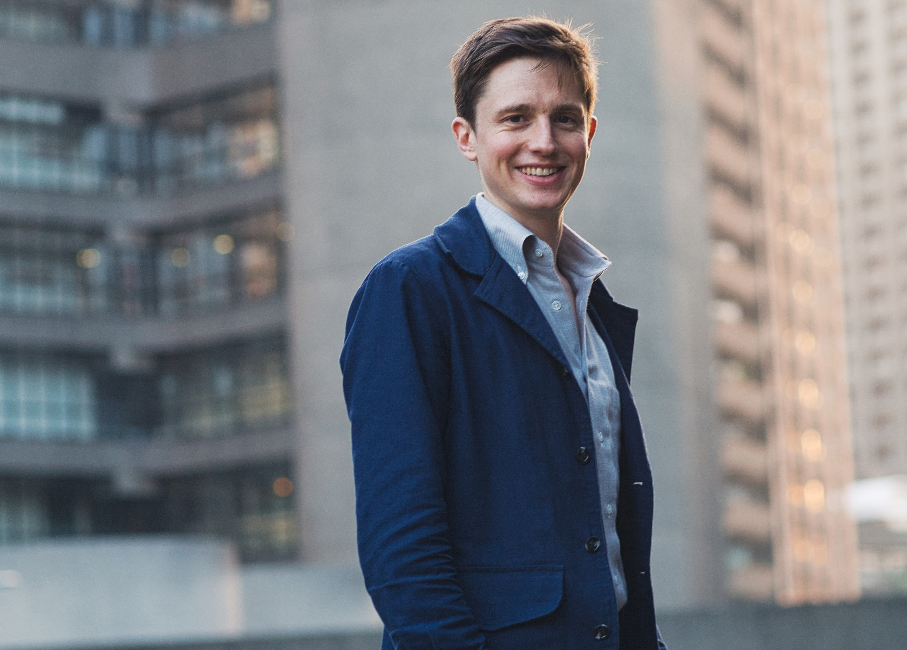
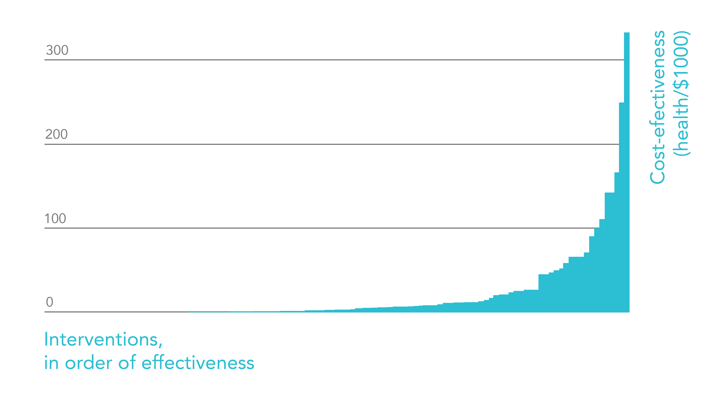

[Ben Todd](https://benjamintodd.org/) is the CEO and founder of[ 80,000 Hours](https://80000hours.org/), and helped to start the[ effective altruism](https://en.wikipedia.org/wiki/Effective_altruism) movement.

[80,000 Hours](http://80000hours.org/about/) is a non-profit that provides free research and support to help people find careers that effectively tackle the world’s most pressing problems.

Ben is the author of the[ 80,000 Hours Career Guide](https://www.amazon.co.uk/80-000-Hours-fulfilling-career/dp/1537324004/ref=sr_1_1?crid=Q48L2NRNWZ55&dchild=1&keywords=80000+hours&qid=1613000252&s=books&sprefix=80000%2Cstripbooks%2C154&sr=1-1#customerReviews) and[ 80,000 Hours’ Key Ideas](http://80000hours.org/key-ideas/).

In our interview, we discuss:

- Why your choice of career could be the most important ethical decision you ever get to make;
- Why some problems are so much more neglected than others (and why that matters);
- 80K’s ‘problem, solution, leverage, personal fit’ framework for choosing a career;
- The idea of using leverage to multiply the difference you're able to make;
- Whether longtermism should be considered a research project or a social movement;
- Should effective altruism have an artistic movement?

## Ben's Recommendations

- 📝 [80,000 Hours Key Ideas Series](https://80000hours.org/key-ideas/)
- 📝 [80,000 Hours Career Planning Guide](https://80000hours.org/career-planning/)
- 🎧 [Alexander Berger on improving global health and wellbeing in clear and direct ways ](https://80000hours.org/podcast/episodes/alexander-berger-improving-global-health-wellbeing-clear-direct-ways/)
- 📖 [The Precipice](https://www.goodreads.com/en/book/show/50485582) by Toby Ord
- 🎵 [Ben's 'Vaguely future' Spotify playlist](https://open.spotify.com/playlist/5yKyxzF12kh9fk6MNi8vYT?si=44ba1d729ca946f8)

 <Book url="https://80000hours.org/key-ideas/" image="book-ben-2" spineColor="#ffffff"/> <Book url="https://80000hours.org/career-planning/process/" image="book-ben-1" spineColor="#ffffff"/> <Book url="https://open.spotify.com/playlist/5yKyxzF12kh9fk6MNi8vYT?si=44ba1d729ca946f8" image="book-ben-4" spineColor="#ffffff"/> 
 

## Choosing a career to work on a pressing problem

### Quotes from the interview

> The name 80,000 Hours is taken from how many hours you have in your career. 40 hours a week, 50 weeks a year, for 40 years is 80,000 hours. Given how much time that is, it's really worth thinking carefully about how we can use it best. If we can find a path that's even 1% more impactful, it would be worth in theory spending up to 800 hours to do that [...] unless you happen to be an heir to a big fortune, your career is the biggest resource you have.

> Often we think about ethical consumption as one of the biggest [ways to do good]. But even if you offset all of your carbon dioxide and stop consuming all these bad products forever, the most you can do is offset one person's consumption. That's the maximum impact of that path. Whereas by figuring out how to use your career well you could achieve many orders of magnitude more impact than that.

> By '[pressing problem](https://80000hours.org/problem-profiles/)' what we mean is not just the world's *biggest* problems, it's the problems where an additional person can make the biggest contribution to them. 

> Neglectedness is one of the most important concepts throughout our advice, and it just comes down to this very general phenomenon where the more people there are working on an issue, the harder it is to make progress. That's just the idea of diminishing returns. That kind of means that the careers we most often think of as ethical or high-impact ones — because everyone knows about those, they're unlikely to be the highest-impact paths for you. If you want to have a big impact you probably need to find something that's at least a bit unconventional.

> In the for-profit world there's this massive incentive to get people to take these profit-making opportunities — namely, profit [...] but in the world of doing good there isn't really any analogous force to really incentivise people to focus on the things that do the most good.

> Which problem [you choose to work on] I think is often the biggest driver [of your impact], and actually the one that gets least discussed normally, because the normal advice is just "choose something you're interested in, we can't really compare these issues".

> It turns out that when social interventions are rigorously tested, a large fraction of them don't actually seem to have any statistically significant effects [...] that means that if you choose a solution [to work on] at random, there's a good chance it's not actually doing anything.

> [On big differences in effectiveness between solutions] It's very hard to internalise how big a deal this is. One way I like to think of it is: if you can find a path that is 100-fold higher impact than the one you're following now, then it means you could work for ten years, achieve as much as what it would take someone like you 1,000 years to do, and then you could spend the rest of your career on a beach.

> Focus a lot on what your next decision is. It's very useful to have some best-guesses at what you should aim for, but a lot of your effort should be figuring out: what am I going to do for the next couple of years? And when you're focusing on a decision like that, I would generally say keep researching it until your answers stop changing a lot. This might not be when you're feeling certain of them — in fact, you'll probably feel really uncertain at the end, but it's more just when your best guess stops being really volatile [...] and then you should try it for a while and re-evaluate [because] the best way to figure out your career is often not a bunch of desk research and discussion, it's actually going and trying things in the world.

### Discussed in the interview

- [The 80,000 Hours website](https://80000hours.org/)
- [Dr Cassidy Nelson on the twelve best ways to stop the next pandemic (and limit COVID-19)](https://80000hours.org/podcast/episodes/cassidy-nelson-12-ways-to-stop-pandemics/)
	- [Cassidy Nelson - Biosecurity: Global Catastrophic Biological Risk Mitigation @ EAGxAustralia 2018](https://www.youtube.com/watch?v=P4RO_W8bmws)
- The[ importance – tractability – neglectedness](https://forum.effectivealtruism.org/tag/itn-framework-1) framework
- [Sanjay Joshi on Charity Evaluation and Nonprofit Entrepreneurship](https://hearthisidea.com/episodes/sanjay)
- The[ DCP-2 and DCP-3 reports](http://dcp-3.org/dcp2) (on global health interventions)

##### Health interventions ordered by effectiveness, from the Disease Controls Priorities Project 2

- [Log-normal distribution](https://en.wikipedia.org/wiki/Log-normal_distribution) and [power law distribution](https://en.wikipedia.org/wiki/Power_law)
- Founder's Pledge — [Climate and Lifestyle: donations and offsetting](https://founderspledge.com/stories/climate-and-lifestyle-donations-and-offsetting)
- [Winner’s curse](https://en.wikipedia.org/wiki/Winner's_curse)
- [Regression toward the mean](https://en.wikipedia.org/wiki/Regression_toward_the_mean)
- [80,000 Hours Key Ideas Series](https://80000hours.org/key-ideas/)
- [80,000 Hours Career Planning Guide](https://80000hours.org/career-planning/)
	- [A (free) weekly career planning course for positive impact](https://80000hours.org/career-planning/process/)

### Further reading

- [The 80,000 Hours Podcast with Rob Wiblin](https://80000hours.org/podcast/)
- [The Optimizer's Curse and How to Beat It](https://www.lesswrong.com/posts/5gQLrJr2yhPzMCcni/the-optimizer-s-curse-and-how-to-beat-it)
- [The role of our Bayesian prior in disagreements over charity assessment](https://www.givewell.org/bayesian)
- [Why we can’t take expected value estimates literally (even when they’re unbiased)](https://blog.givewell.org/2011/08/18/why-we-cant-take-expected-value-estimates-literally-even-when-theyre-unbiased/)
- [This is your most important decision](https://80000hours.org/make-a-difference-with-your-career/)

## On effective altruism and longtermism

### Quotes from the interview

> A high-level definition I would use is: it's the search for the actions that do the most to contribute to the common good, or have the most positive impact. And then you can break that down into roughly two projects. One is an intellectual project, which is  trying to build a research field focused on answering that question. The second is a practical project — actually putting the findings of that research into practice, and actually tackling some of the world's most pressing problems and having a big impact.

> One [example of longtermism] that motivates me is the idea that if we just look around ourselves and bear in mind that we can all blow up at any moment. Which is basically because we've created these nuclear doomsday machines that are constantly on and pointed at each other and controlled by 1960s technology that regularly has errors in it, and just due to an accident we could have an all-out nuclear war.
>
> Then there's this extra bit, which is that if we think about [resolutions to the Fermi paradox](https://hearthisidea.com/episodes/anders#the-fermi-paradox), there's a pretty good chance that we're the only intelligent life in the observable universe. If I think that we built these nuclear doomsday machines that are not good for anyone, and then we destroyed the only intelligent life in the universe, and then the universe is empty for all eternity — that just seems pretty bad.

> When people talk about long-term thinking, what that often means is trying to do projects that last for a few decades rather than over the next election cycle or something. One clarification is when we say 'longtermism' we're thinking ultimately about potentially millions of years, not just the next few decades.
>
> There's [also] a difference between: are we talking about *acting* over long timescales, or are we talking about *benefits* that accrue over long timescales? And longtermism is basically entirely about the second thing. What we're saying is that what ultimately matters is the effects we have on potential future generations. And then the question is how can you generate those effects in the best ways? And that could be through very urgent projects, or it could also be through long-term projects [...] but the thing we care about is benefiting the long-term future. All else equal, we'd prefer to do it quickly!

> I see longtermism as an intellectual movement [...] whereas effective altruism is partly that, but it's also partly a *community* of people who are all trying to do the same thing together.

> [On communicating weird ideas with more familiar examples] Over time I've become more keen on a direct approach. In general, I think the approach of pitching something that's one step away from your main thing and then trying to take people from that secondary to the main thing tends not to be as effective as going straight for the main thing.

> I would love to see more principles-first introductions to effective altruism. Ultimately, it's about the ideas" some ways of doing good have way more impact than others; we need to do rigorous research to find these things [...] In some sense that's ultimately what matters, rather than the specific answers we happen to have found right now.

> There does seem to be a big thing with doing things for the right reasons, where if you go back to earlier where if you do think there are these 80-20 distributions everywhere [...] doing something that's just a bit less good than optimal can actually mean losing a large fraction of the value, because in one of these distributions, often going from the 99th percentile to the 90th is a bigger loss of impact than going from the 90th to the 50th. So actually when you're among the very best things, it actually becomes more important to select carefully when you're already in the tail, which is very counterintuitive.

> Some people were suggesting that we should have effective altruist art, which I think would be a bad idea [...] but I think there are a lot of important ideas in the neighboring space, which could be some of the most important ideas of our time, but don't really have any cultural influence. For instance, the idea that the future could be way better than the present. If you imagine the best moment of your life — whether it's a moment of discovery or love or connection or meaning or whatever it is. Life could be like that all the time — there's no reason why that's impossible. But most educated people think things are getting worse, and that the future's going to be bad and short.

### **Discussed in the interview**

- [Why and how to earn to give](https://80000hours.org/articles/earning-to-give/)
	- [Sam Bankman-Fried](https://80000hours.org/stories/sam-bankman-fried/)
- [How likely is a nuclear exchange between the US and Russia?](https://rethinkpriorities.org/publications/how-likely-is-a-nuclear-exchange-between-the-us-and-russia)
- [Pareto principle](https://en.wikipedia.org/wiki/Pareto_principle)
- Ben's tweet: "[Anyone have examples of a philanthropist helping to create an artistic movement?](https://twitter.com/ben_j_todd/status/1409934595051642887)"
- [The world is much better; The world is awful; The world can be much better](https://ourworldindata.org/much-better-awful-can-be-better) — Our World in Data
- [Technological utopianism](https://en.wikipedia.org/wiki/Technological_utopianism)
- [Was modern art a weapon of the CIA?](https://www.bbc.com/culture/article/20161004-was-modern-art-a-weapon-of-the-cia)
- [Free to Choose](https://en.wikipedia.org/wiki/Free_to_Choose) (film)
- [Patient longtermism](https://80000hours.org/2020/08/the-emerging-school-of-patient-longtermism/)

### **Further reading**

- [An Introduction to Longtermism](https://www.effectivealtruism.org/articles/longtermism/)
- [How much do people differ in productivity? What the evidence says.](https://80000hours.org/2021/05/how-much-do-people-differ-in-productivity/)
	- [EA Forum post](https://forum.effectivealtruism.org/posts/ntLmCbHE2XKhfbzaX/how-much-does-performance-differ-between-people)
- [The case for strong longtermism](https://globalprioritiesinstitute.org/hilary-greaves-william-macaskill-the-case-for-strong-longtermism-2/) by Hilary Greaves and William MacAskill
- [Benjamin Todd on what the effective altruism community most needs](https://80000hours.org/podcast/episodes/ben-todd-on-what-effective-altruism-most-needs/)

## **Follow Ben**

- Ben’s Twitter —[ @ben_j_todd](https://twitter.com/ben_j_todd/)
- Ben’s[ personal website](https://benjamintodd.org/)

## **What next?**

- Visit the [80,000 Hours website](https://80000hours.org/)
- [Join the 80,000 Hours newsletter](http://80000hours.org/newsletter) to get one idea each month from Ben on how to do more good
- Read [more about Longtermism](https://www.effectivealtruism.org/articles/longtermism/)