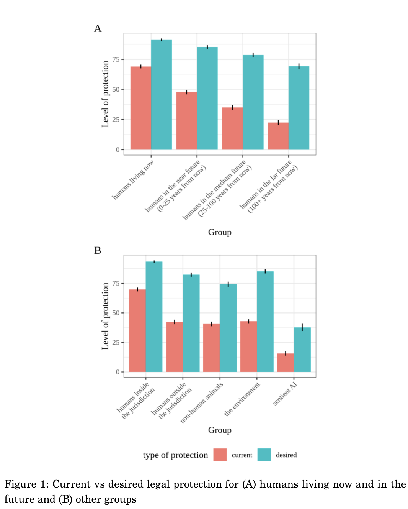
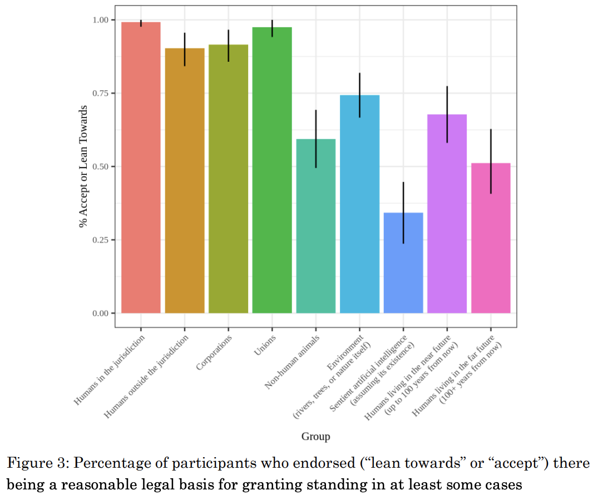

[Christoph Winter](https://www.christophwinter.net/) is an Assistant Professor of Law at ITAM in Mexico, a Visiting Scholar in Psychology at Harvard, and the founder of the [Legal Priorities Project](http://legalpriorities.org/).

 In our interview, we discuss:
 -   A [global survey of legal academics](https://www.legalpriorities.org/research/protecting-future-generations.html) about protecting future generations;
-   How constitutional law might best help in this effort;
-   Endangerment law and the "risk of creating risk";
-   And lots more!

## Christoph's recommendations

- [The Vulnerable World Hypothesis](https://www.nickbostrom.com/papers/vulnerable.pdf) by Nick Bostrom
- [The Weirdest People in the World](https://www.goodreads.com/en/book/show/51710349) by Joseph Henrich
- [The Case for Strong Longtermism](https://globalprioritiesinstitute.org/hilary-greaves-william-macaskill-the-case-for-strong-longtermism-2/) by Will MacAskill and Hilary Greaves

 <Book url="https://www.nickbostrom.com/papers/vulnerable.pdf" image="book-christoph-1" spineColor="#06070c"/> <Book url="https://www.goodreads.com/en/book/show/51710349" image="book-christoph-2" spineColor="#cb542a"/> <Book url="https://globalprioritiesinstitute.org/hilary-greaves-william-macaskill-the-case-for-strong-longtermism-2/" image="book-christoph-3" spineColor="#232b40"/> 
 

## A global survey of legal academics
We discuss this recent [working paper](https://www.legalpriorities.org/research/protecting-future-generations.html) by Christoph and his colleague [Eric Martinez](https://www.linkedin.com/in/eric-grimani)

### Quotes from the interview

What we mean by legal priorities –
> Legal priorities research is first of all based on the idea that legal scholarship should prioritize among possible research questions, ideally using first principles and evidence based reasoning [...] We focus on the protection of future generations and what has been referred to as longtermism. But prioritization itself does not require that. You can prioritize differently. But I think you should be explicit about how and why, and what assumptions you are making.
> In a way legal prioritises research is applied global priorites research -- it's a subfield. Importantly though, it is not a subfield in a sense that we try to solve the biggest problems within law. We still try to solve the biggest problems globally. But we focus on the means of laws

How legal academics think the law should and does protect future generations –
> We asked [legal academics], among other things, to rate how much their legal system first currently does, and secondly, ideally should protect the welfare -- the rights, interest, and well being of humans living now in the near future -- between now and in 25 years time, medium future (25 to 100 years time), and far future (100+ years from now).
> We can see that the gap gets bigger and bigger. That there's not a zero discount rate with regards to the desired level of protection by law professors. But it's not nearly as strong as law professors think it currently is. [...] What [legal protection] should be for humans living in 100 plus years, is roughly the level of protection humans living right now receive. And the estimate that the current level of protection for humans in the far future [...] is roughly a third of what law professors think the protection ought to be
> The gap between the current and desired level of protection is biggest with regards to humans in the far future. Even greater than the gap for non human animals, the environment, humans outside the jurisdictions -- you name it. It is bigger than for any other group that we tested.

How legal academics think law best can protect future generations –
> The ones which performed best [legal mechanisms that academics believe can protect future generations] were constitutional law and environmental law. But you might want to be a bit careful about this, because strikingly -- and I think this is one of the funniest results -- environmental law performed even better than law as a whole [...] Eric and I speculate this may be related to the conjuction fallacy
> According to law professors, climate change scores really high, which also makes some sense, because we know a lot more with regards to how to mitigate the effects of climate change than, say, how to solve the AI alignment problem. And so because we know more about how to mitigate these effects, they might be more confident in saying that, it's more likely that we can have these predictable and feasible effects on the long term future by working on this area.

### Further Reading
- [Conjunction Fallacy](https://en.wikipedia.org/wiki/Conjunction_fallacy)

## Legal protections for future generations
We heavily draw on this [working paper](https://papers.ssrn.com/sol3/papers.cfm?abstract_id=3933683) by [Renan Araújo](https://twitter.com/araujorenan2) and [Leonie Koessler](https://papers.ssrn.com/sol3/cf_dev/AbsByAuth.cfm?per_id=4849501)

### Quotes from the interview
Types of laws that longtermists can use –
> There are two different kinds of legal mechanisms, which are relevant in this regard. The first one being to protect future generations generally. And the second one would be to protect against more specific risks, which may be very beneficial for future generations, particularly if those existential risks. 

The benefits of having broad constitutional protections
> Unfortunately, protection in law does not always mean protection in practice. [...] I think that the strongest de facto protection of future generations right now comes from constitutional provisions that are associated with an expansion from environmental rights. So the German and Brazilian constitutions might be good examples in this case [...] Outlining specific institutions to protect future generations (such as funds, commissioners, and so on) have not led to the strongest de facto protection. I think the example [Araújo & Koessler] point out in in their study are Nigeria and South Sudan, which established funds in their constitutions, but never actually created them. So personally, my best guess -- with an emphasis on guess -- is that associating rights of those in the far future with rights of existing people in the here now might be the best strategy regarding constitutions. Basically claiming that fundamental rights apply, independently of time. But lots more research needs to be done here and potentially also some litigation efforts.
>  Maybe more precise norms are better in the near term. But if we think that humanity's moral circle will continue to expand (and historical trends, at least seem to suggest that this could well be the case) [...] then these broad constitution norms, protecting future generations more generally, can come in really quite handy. They can evolve more progressively, then the narrow norms.

The limits of a purely legislative approach –
> It's not yet clear to me that addressing the legislator, is the best strategy here in general, but especially for LPP. First, future generations cannot vote, which means they are not represented in the legislator and don't have a lobby. And second, everyone else in the long term space is already focusing on that. So you might want to consider focusing a bit more on the judiciary. I'm not sure about this. It's an ongoing question we're looking into. But when you think of [...] liberal democracies, it's the courts that make sure that those are taken care who are in a political minority, right? Even though future generations are far from being in the minority [...] in terms of absolute numbers, their interests are not represented in democratic elections. So going through the courts could be a viable option. But again, we're looking into this and in to what degree litigation might add something that more technical AI safety work or other work on technologies might not be able to offer.

Some facts about constitutions –
> 81 of the present constitutions protect future generations
> The average lifespan of a constitution is actually only 16 years

### Further Reading
- The UK's [Wellbeing of Future Generations Bill](https://lordslibrary.parliament.uk/wellbeing-of-future-generations-bill-hl/)
- The German Constitution's [Article 20a](https://www.gesetze-im-internet.de/englisch_gg/englisch_gg.html) and a recent [lawsuit](https://www.politico.eu/article/germany-climate-change-law-court-rules-partly-unconstitutional/) about climate change
- Our [episode](https://hearthisidea.com/episodes/gillian) with Gillian Hadfield

## Misc.
Thinking about how legal change happens –
> If you look at bigger societal trends or shifts, such as the introduction of human rights, it's really not clear whether one should start with specific legal procedures [...] or whether you have to go back a bit more in the causal chain. For example, to how humans think in general and why this sort of Universalist thinking allowed human rights to be adopted.

Existing regulation –
> Laws are quite abstract by nature and apply also to new scenarios. Just because there's no statute on, say, autonomous driving, does not mean that no laws apply. I often have the impression that people discuss these policy questions very, very quickly without checking what the law currently says, and how one might apply specific laws to a new technology. 
> Just to give to give some examples -- there are tonnes of laws regarding the safe development of new products. I'm far from being an expert, but I cannot imagine that there is a jurisdiction out there that does not have any general laws regarding the safe development of technologies. So before asking what regulation would ideally look like, we often need to ask first, how would this or that case currently be solved and is there really a lot more to be done?

Endangerment law –
> So an example of concrete endangerment law is that if you set a house on fire, and it turns out that there's a person in there which you don't know, then even if this person end up being safe, you will get some extra punishment. Because there was a concrete risk to the life of that person. Now, very similar scenario, only differences, is there was no person in there. No concrete risk at all. But you may still be punished because -- this is where it gets a little tricky -- you risk to put somebody in risk. You take a risk that you are creating a risk for that person.
> his general logic could be applied in some cases that are relevant for longtermists and others caring about existential risks. For example, developing transformative artificial intelligence without making sure this will not go horribly wrong, might already fit this criterion, even if you don't yet fully understand the exact nature of that risk, or who you put under risk.

### Further Readings
- [Moral Uncertainty](https://www.moraluncertainty.com/) by MacAskill, Krister Bykvist, and Toby Ord
- [Perfectionism in political philosophy](https://plato.stanford.edu/entries/perfectionism-moral/#PriStaNeu)

