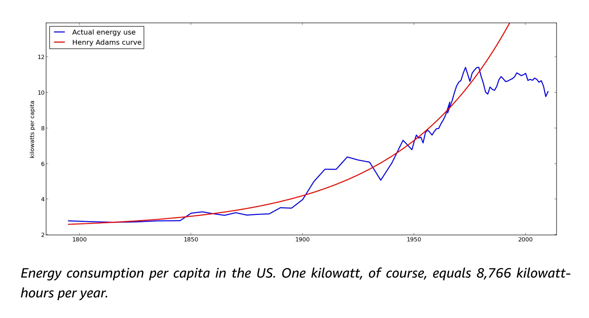

[Michael Bhaskar](http://www.michaelbhaskar.com/about) is a writer, researcher and publisher. He is a former consultant Writer in Residence at [DeepMind](https://deepmind.com/), and most recently he wrote a book called [Human Frontiers](https://www.goodreads.com/book/show/56903763-human-frontiers), which tries to answer the question: “why has the flow of big, world-changing ideas slowed down?”

In our conversation, we discuss —

- The outstanding pace of discovery and invention in the early 20th century, such as the short space of time between discovering the structure of the atom, and building fully functional nuclear [power](https://en.wikipedia.org/wiki/X-10_Graphite_Reactor) [plants](https://www.britannica.com/topic/Calder-Hall-reactor)
- The '[Adams curve](http://wimflyc.blogspot.com/2021/01/the-henry-adams-curve-closer-look.html)'
- How so much of the modern world was invented in exceptional 20th century research institutes such as [Bell Labs](https://en.wikipedia.org/wiki/Bell_Labs) and [Xerox PARC](https://en.wikipedia.org/wiki/PARC_(company))
- Evidence for slowdown in new ideas from analysing the patent record
- Trends in research — age, team size, bureaucracy
- Whether scientific progress is limitless, or whether there are things we'll never be able to know
- Whether 'big ideas' are also [slowing in the arts](https://www.cold-takes.com/wheres-todays-beethoven/)
- Reasons for optimism about progress in big ideas, especially from advanced AI
- Whether across-the-board technological progress is good overall, if it also enables new kinds of risk

## Michael's recommendations
- Ben Reinhardt’s [Idea Machines Podcast](https://benjaminreinhardt.com/podcast/)
- Matt Clancy’s [What’s New Under the Sun](https://mattsclancy.substack.com/)
- [The Great Stagnation](https://en.wikipedia.org/wiki/The_Great_Stagnation) by Tyler Cowen
- [The Dawn of Everything: A New History of Humanity](https://www.goodreads.com/en/book/show/56269264) by David Graeber and David Wengrow

 <Book url="https://www.goodreads.com/book/show/25395278-feeding-everyone-no-matter-what" image="book-mike-1" spineColor="#06070c"/> <Book url="https://www.goodreads.com/book/show/31850765-energy-and-civilization" image="book-mike-2" spineColor="#008a84"/> <Book url="https://www.youtube.com/watch?v=bIAF7kBbGKk" image="book-mike-3" spineColor="#3f435e"/> 
 

## Resources

- [Charles I Jones on growth](https://www.youtube.com/watch?v=x7tk2ryjefQ)
- [Are ideas getting harder to find?](https://www.aeaweb.org/articles?id=10.1257/aer.20180338)
  - Alexey Guzey: [Issues with Bloom et al's "Are Ideas Getting Harder to Find?" and why total factor productivity should never be used as a measure of innovation](https://guzey.com/economics/bloom/)

- The ‘Henry Adams Curve’ — [a closer look](http://wimflyc.blogspot.com/2021/01/the-henry-adams-curve-closer-look.html) by J. Storrs Hall

- [Where is my Flying Car?](https://press.stripe.com/where-is-my-flying-car)
  - Review in [Roots of Progress](https://rootsofprogress.org/where-is-my-flying-car)
- [The ITER Decision and U.S. Fusion R&D](https://issues.org/stacey/)
- [Existential Risk and Growth](https://globalprioritiesinstitute.org/leopold-aschenbrenner-existential-risk-and-growth/)
- Shahar Avin on [funding science by lottery](https://www.repository.cam.ac.uk/handle/1810/254730), and [more writing on science funding](https://www.shaharavin.com/tag/science-funding/)
- [Where's Today's Beethoven?](https://www.cold-takes.com/wheres-todays-beethoven/)
- [Arc Institute](https://arcinstitute.org/)
- [Emergent Ventures](https://www.mercatus.org/emergent-ventures)
- [Fast Grants](https://fastgrants.org/)
- [New Science](https://newscience.org/)

## Transcript

**Fin** 0:04 

Hello, you're listening to Hear This Idea, a podcast showcasing new thinking in philosophy, the social sciences and Effective Altruism. In this episode, we talked to Michael Bhaskar. Michael is a writer, researcher, and publisher. He's a former consultant writer in residence at [DeepMind](https://deepmind.com/), and most recently, he wrote a book called [Human Frontiers](https://mitpress.mit.edu/books/human-frontiers), which tries to answer the question: why has the flow of big, world-changing ideas slowed down? I found that book unusually fun to read so I emailed Michael after I finished it to ask about doing an in person interview, and here we are. We ended up talking about nuclear energy, and [the Adams curve](http://wimflyc.blogspot.com/2021/01/the-henry-adams-curve-closer-look.html), [Bell Labs](https://en.wikipedia.org/wiki/Bell_Labs), trends in research, funding, and academia, and even whether we're seeing stagnation in music and film. So it was pretty wide ranging. It was one of those conversations where we just jumped between a tonne of pretty big ideas and speculations. I really enjoyed it. In fact, I think it's a mark of a good conversation that I ended up with more questions that I started. In particular, I still really want to know whether speeding up big idea generation and other kinds of progress could or should actually be major global priorities? And also, how feasible is an especially long or unrecoverable period of stagnation? Turns out a whole field or community has recently emerged called ‘progress studies’, which is the study of the economic, cultural, institutional changes that have improved standards of living over human history. And it asks how that knowledge can be used to further improve the human condition. I've got to say that Luca and I are still really interested to think out loud about how progress studies - that is, the kind of thing we'll talk about in this conversation - relates to things like Effective Altruism, and [longtermism](https://www.effectivealtruism.org/articles/longtermism), so watch this space. Anyway, a big thank you to Michael for joining us. And without further ado, here is the episode. 

A question we've taken to asking guests at the beginning is: What is the question, can be big or small, that's recently been occupying you?

**Michael** 2:09 

One thing that I'm thinking about is a project that I'm just starting to work on. It's still in very, very, very early stages, but it's looking at the governance of technology and the kind of macro governance of technology to avoid long term bad outcomes. But yeah, it's really early days.

**Fin** 2:27 

And maybe you could describe, without necessarily elaborating at all, what some of these governance challenges are, what some of these mechanisms are, just to give a taste.

**Michael** 2:34 

So just a little taste, something that I've just become, it's become a bugbear of mine, when researching this project is, so often you read books or articles or even podcasts about technology, and people always say that, because we created technology, we can ultimately control it. And you know, that's just ridiculous, because who is the ‘we’? You’re talking about humanity, but humanity doesn't work as a sort of single agent - humanity is full of cross purposes, and people with different incentives and agendas and so on. So appealing to a ‘we’, in the control of governance for technology is just useless at the minute. So one big challenge is how can the world constitute a meaningful ‘we’ that might be invested in solving this problem?

**Fin** 3:28 

And I suppose we'll touch on this general phenomenon later, where pretty much everyone agrees something will be good, but it doesn't happen. Yeah, there's an interesting question there. Why not? But we're going to be talking about your book called ‘Human Frontiers’. As I take it the thesis of the book is that big ideas have been drying up. That has a lot to do with this idea of a [‘great stagnation’](https://en.wikipedia.org/wiki/The_Great_Stagnation). [Tyler Cowen](https://en.wikipedia.org/wiki/Tyler_Cowen) has [written about this](https://tylercowen.com/the-great-stagnation/). But talk about stagnation tends to focus on economic indices, right? And as I take it, you’re interested in something a little broader, or a little different. So could you talk about what you mean by ‘big ideas’? And why focus on them rather than just the economics?

**Michael** 4:05 

Yeah, so I think the core of this whole ‘great stagnation debate’, which is what I call it, I mean, nobody, you know, nobody really sort of says, “right, I am now engaging in the great stagnation debate”, but it is definitely a real thing. And there are lots of people from lots of different areas who for the past decade, or maybe a little more, have been thinking about this question of stagnation. And, yes, I think it really did start with economic writers like Tyler Cowen, you know, a few others. It also started with technologists. So, you know, people like [Peter Thiel](https://en.wikipedia.org/wiki/Peter_Thiel), but actually what I became really interested in was that in so many different little niches, people were talking about this same thing, the same idea of stagnation. And you would have the economists talking about it. You'd have the technologists talking about it. But then when you start burrowing down, you have anthropologists talking about it. You have philosophers talking about it. And so it seemed to me that yes, a lot of those questions about economics are really fundamental, but there was so much more at work. And, you know, a layer deeper in our society from even technology or economics is ideas. It's, you know, it is the kind of common unit that underwrites everything to do with human activity. So, to me, it was a more all encompassing view. And my goal wasn't really to kind of make anything up, it was to try and draw the dots between all of these different things that people were saying, but they weren't really bringing it together and saying, ‘This is the absolute huge case for stagnation’.

### Nuclear power and progress in the 20th century

**Fin** 5:51 

Let's begin with engineering, maybe, in the 20th century. You mentioned something which I hadn't heard of before, before I read the book, which is this [X-10 Graphite reactor.](https://www.energy.gov/management/x-10-graphite-reactor) What was that?

**Michael** 6:02 

Well, that's, you know, pretty much the first nuclear reactor. And so you know, this is a good - nuclear power, and nuclear technologies, are such a great example of how things in the 20th century moved really fast, because, you know, from when you have people first, you know, [Rutherford](https://www.nobelprize.org/prizes/chemistry/1908/rutherford/biographical/) first uncovering the structure of the atom. I think that was 1911, to then [the first test of a nuclear weapon](https://en.wikipedia.org/wiki/Trinity_(nuclear_test)) in 1945. You know, that's a very short space of time. Yeah, in the space of just a few decades, you go from this being really cutting edge, obscure theory, there's only a handful of people in the whole world who can actually understand it, it's, you know, it's really a very kind of niche thing, to suddenly the entire fate of humanity rests on, you know, what before was just a couple of people on a blackboard. And really, that that was just a few years, and then you know, it's providing a new power source very quickly after that first atomic bomb test, and so on. So it is, you know, that reactor is just a symbol of how fast things can translate from pure frontier theory into very, very impactful applications.

**Fin** 7:27 

Sure, and we should clarify that this graphite reactor was early ‘40s.

**Michael** 7:31 

Yeah, I mean, and, you know, it's part of the [Manhattan Project](https://en.wikipedia.org/wiki/Manhattan_Project). Yeah. Obviously, the great, US, well mainly US, effort to build an atomic weapon.

**Fin** 7:43 

And I suppose just to fill in the gap there, the first nuclear power plant was [Calder HalI](https://www.ice.org.uk/what-is-civil-engineering/what-do-civil-engineers-do/calder-hall-nuclear-power-station) think.

**Michael** 7:51 

Yeah, Calder Hall in England. And then that's just a few years later. And then by the mid 1950s, you've got power stations, just, you know, around the world, starting to bring power live to the grid. So, you know, it's, it's really just an extraordinary journey of an idea. And to me, you know, probably, the single most critical thing is just the speed at which, you know, the first idea of the chain reaction, which was, I think it was 1933. You know, then to being a kind of proof of concept of how it might work by about the late 30s. And then to actually a working device, which is the Trinity test in summer of 1945. I mean, that it really is crazy. And then to then deliver nuclear power to the grid so soon after, as well. You know, that is an impressive record. And that was the kind of, that set the benchmark, you know, that set this expectation. You know, I also have spoken to a few physicists about this. And they think, well, you know, why is it that physics has got billions to build things like the [Large Hadron Collider](https://home.cern/science/accelerators/large-hadron-collider)? And that's because they almost even will admit, politicians and funders still have that hangover from the Manhattan Project, where an obscure idea in particle physics can suddenly change the world. Another example, one that I didn't really go into in the book, but I've become really much more aware of, is just again, how quickly theoretical ideas in mathematics became a working computer, in actually, again, a very, very short space of time. You know, like, [Alan Turing](https://en.wikipedia.org/wiki/Alan_Turing)’s seminal paper was published, I think, 35 or 36. Yeah. So that's published in the mid 1930s. Before that, you've got some work from [Hilbert](https://en.wikipedia.org/wiki/David_Hilbert), I think, in the 1920s that had sort of laid the platform and created the problem that Turing was trying to solve, ‘[Entscheidungsproblem](https://en.wikipedia.org/wiki/Entscheidungsproblem)’ you know, I'm not a mathematician. But you know what is still impressive is, you know, when those papers are being written that that is truly frontier stuff. And you know, it is within then a decade that the first computer, although the first computer came a bit after the war, about a decade, you've got a working computer. Two decades later, you know, you've started to get sort of production computers from [IBM](https://en.wikipedia.org/wiki/IBM#History) and stuff, stuff like that.

### Bell Labs and high output research environments

**Luca** 10:28 

Yeah, I'd be curious if you could maybe talk a bit more about like the landscape in which these inventions and big ideas are coming from. So you've kind of touched upon this, like a little bit already, where you refer to, I guess, like this academic setting of like, these theoretical ideas. And then maybe like, with the Manhattan Project, and other things you get, like big government investment. You also have, you know, these like famous, maybe like private company labs, you know, Bell Labs or the others, as well, like, can you talk a bit more maybe about yeah, like the landscape here of in what context these inventions are taking place, almost what the production pipeline here is.

**Michael** 10:59 

Yeah. And I think we've already mentioned that there's this nostalgia element to the whole argument that we're stagnating. And it's something I'm quite alive to because I'm not actually very nostalgic. And I do actually think that most things were probably worse than the past. But I think there were certain features that helped here, I think, one. There were many, many, many, many fewer researchers and fewer opportunities for people to do all this frontier of research, you know, you're really talking about a handful of institutions in Germany, France, Britain, and the United States, probably, where the most cutting edge stuff was happening. **But if you were lucky enough to be in one of those places, you could probably just get in and then do what you wanted for a very long time. You know, somebody like**[ **Max Planck** ](https://en.wikipedia.org/wiki/Max_Planck)**basically did 20 years, published nothing, apparently was doing nothing, but actually, in the end, was revolutionising physics.** And that kind of modus operandi would have been much more common and, and available. So that was a big help. I mean, secondly, and more, more darkly, really, obviously, both nuclear technologies and computational technologies, were given a massive, massive boost by the Second World War. And you know, that put this kind of existential oomph behind them to put the funding in to take the risks to just try everything to make these things happen to get lots of brilliant minds, both in the case of the Manhattan Project and[ Bletchley Park](https://en.wikipedia.org/wiki/Bletchley_Park), into a room together for months at a time, and literally the best people in the world with nothing else to do but solve these really crazily hard problems. And then, you know, whatever it took to make them happen, that was going to happen. Now, you know, nobody wants a war, obviously. But it did mean that things went from being these very loose, free academic ideas that existed in this very low pressure, very unmanaged environment, to then being the full weight of society behind them. That was a kind of almost unique set of circumstances in history.

**Fin** 13:17 

One thing I'm curious to ask about in particular, is Bell Labs.

**Michael** 13:21 

Yeah, so that's another good example, from this period. You know, and again, I don't think, I'm not gonna say it's *just* that period in the 20th century, I think there are other times in history where there have been these these great sort of moments for big ideas, but particularly from, like, I would say, perhaps the middle of the 19th century to towards the late 20th century was especially fertile. And that was the era that Bell Labs was around as well. And you can pretty much take a major fundamental technology to do with the broad digital universe, and chances are it was invented by Bell Labs, which was the, you know, the R&D arm of the [Bell Corporation,](https://en.wikipedia.org/wiki/Bell_Telephone_Company) what is now effectively [AT&T](https://www.att.com/) but had the monopoly on American telephones for a very large period of time. And, you know, Bell Labs just hired tonnes of PhDs, tons of very, very crazy people in many instances, people like [Claude Shannon](https://en.wikipedia.org/wiki/Claude_Shannon), who invented information theory, and I think, wrote one of the seminal papers on that just a few years after Turing in the late 1930s. And it gave them an almost ridiculous, unimaginable amount of freedom given they were a very buttoned up business, just to explore research directions that may or may not have an immediate application to the broad notion of communication. And out of that came all of these really fundamental ideas from information theory, to the transistor, you know, the basic semiconductor building block of almost everything else, to loads of programming languages, lasers, mobile phones, etc, etc. You know, it's basically been called the kind of factory that built the 20th century. And yet, it wasn't alone, either. It was a period in history when a lot of major companies, particularly in America had R&D arms that really were focused on foundational research. And they really were looking at things that were the kind of basic science.

**Fin** 15:41 

I suppose it might be worth putting in a word for Xerox [PARC](https://en.wikipedia.org/wiki/PARC_(company)), as well - a kind of cousin of Bell Labs, more or less the research arm of a photocopier company, which, you know, invented a good fraction of what we now call personal computing,

**Michael** 15:55 

Indeed, a great example and of course, yeah, you know, the graphical user interface - it was invented at Xerox PARC. And they showed Steve Jobs around and he thought, ‘yeah, I’ll have that’ and I think they invented the mouse, and, you know, loads of other things. But again, it was a very free research environment. And it was, it was a very brilliant kind of place. Now, you know, there are still some amazing examples of research labs that do this kind of thing, like, you know, one that I have personal experience of is DeepMind - the AI division of [Alphabet](https://en.wikipedia.org/wiki/Alphabet_Inc.). And, you know, in some ways that really resembles a kind of Bell Labs for the 21st century. It has, you know, tons of PhDs doing really amazing work; they're given a vast amount of freedom to pursue an incredibly long term goal. I guess there are a couple of things to say, though. And firstly, although R&D spend across the board is up, it's much more focused on development, like the amount of corporate spend on fundamental research in aggregate, and as a proportion of the economy, is way down. And governments have had to step in, but you know, it doesn't necessarily completely fill the gap. And there are problems when governments fund things, you know, when a business funds even basic notional, irrelevant research, it is actually very good at then translating that into practical applications. You know, when government funds it, it's still much harder - the transition is harder. And you know, secondly, it's narrower, you know, it used to be that you'd have Bell funding it, but you'd also have people like [DuPont](https://en.wikipedia.org/wiki/DuPont), or [Kodak](https://en.wikipedia.org/wiki/Kodak) and all of these other companies. Now, the last sector where people do this kind of research is tech. So you know, we've gone from this being a broad feature of big business as a whole, to it being something that tech companies do. And it's just another example of how, you know, I think, **I think we're outsourcing our big thinking and our innovation just to a couple, you know, I'd say a handful of West Coast tech companies and you know, that's probably not great. That's not gonna deliver big ideas across the spectrum**.

**Luca** 18:08 

Yeah, like, one quick thought I have here is like, it's funny when you were mentioning, I guess, like Bell Labs and PARC of like, yeah, nowadays, you know, if you think about AT&T and Xerox, right, you don't think about like cutting edge, like research or anything. And I guess the question here now is not about like how these, like individual companies compare 50 years ago compared to now, but whether we have the equivalent of like a [DeepMind](https://en.wikipedia.org/wiki/DeepMind), or whatever, if they're like enough to, like, substitute, I guess, for the research being done there. And if there's just like enough of these, like, orgs, or like research arms now to, you know, be able to keep up at the same pace that they were 50 years ago, is that like, roughly right?

**Michael** 18:43 

I think that's exactly it. I would put it like this, ultimately: I would say, you know, the global economy now, compared to the global economy in, let's say, the Bell Labs’ heyday, late 1940s, that was when they invented the transistor, which, you know, if almost, you had to just pinpoint one thing that they delivered, well, transistors then enabled so much, I mean, otherwise, you know, computers would have vacuum tubes without transistors and that, you know, that would have been very limited. So, you know, the global economy now, I don't know the exact numbers of how many times bigger the global economy is, but it is many, many, many times bigger than the late 1940s. But we don't have many, many, many Bell Labs. Actually, there's probably the same number of really cutting edge corporate research labs now, you know. You've got something like DeepMind, you've got something, you know, a few of the other tech companies have really interesting really kind of frontier labs. But other than that, you don't really see it. Like for example, you might expect that the pharmaceutical companies would have something like a Bell Labs for pharma, but they don't, they just tend to kind of leave that to startups, they leave it to government funded research. But you know, the pharmaceutical industry is way, way bigger than it was and barely existed in the late 1940s. So what I think we haven't seen is the kind of growth in these kinds of organisations that you would have naturally expected.

### Social progress in the 20th century

**Fin** 20:15 

Super. So you've talked a bit about the pace of progress in the 20th century, when we talk about scientific discoveries, and also engineering and research. I wonder if we could zoom out and also just talk about something like how culture and politics changed in the 20th century? Rather than asking something vague, maybe it's worth asking about what you talk about in the book, which is the [Universal Declaration of Human Rights](https://www.un.org/en/about-us/universal-declaration-of-human-rights)? Why is this such a big deal? And actually, how did it come about as well?

**Michael** 20:45 

Yeah, so I'm very much saying that this is a cultural, a political, a intellectual phenomenon, as well as technology, science, business. And,you know, really, I think that was one of the important things in the book, because I think, you know, there are people who've made all those cases, but they haven't then connected it to these other ideas of cultural stagnation or intellectual stagnation. So I take the Universal Declaration of Human Rights as an example of a big idea that was, in my language, ‘given purchase’. So I'll just say that I think all ideas go through three phases: they’re conceived - a conception of the idea is when it initially is thought up. And by the way, I don't think ideas just come fully formed, I think ideas are combinations of other ideas. So they're really interesting, important combinations. So you know, the conception of the idea, you create a new interesting combination. Then you need to execute it, you need to write the paper, you need to build the prototype, just to get something that is going to give that form. And then lastly, it needs to get purchased, that's when it's rolled out or when it's widely accepted, and so on. And until it's gone through all those three levels, I think you haven't sort of achieved an idea or a big idea. It's, you know, it's stuck. If it doesn't get purchase, then most people don't know about it, it's not really impacting the world, it's not qualifying as a big idea. So the Universal Declaration of Human Rights is really interesting, because it was when this idea of innate universal human rights that had existed in some form or another, you know, roughly since the enlightenment, some people would say, you know, way before that, and various precedents. But you know, let's say it's an enlightenment idea, just for the sake of argument. You know, so let's say it's had sort of 250 years. Actually, what happened after the Second World War is that the newly formed UN created a committee, [Eleanor Roosevelt](https://en.wikipedia.org/wiki/Eleanor_Roosevelt), the wife of the former president, chaired the committee. And they thrashed out this pretty remarkable document - the Universal Declaration of Human Rights, which is an incredible synthesis of different cultural, philosophical, even religious traditions, legal traditions from around the world. They argued it out, they took this abstract old idea, put it into a very concrete form, and then somehow managed to get this through the UN and get it formally adopted as a declaration. Now, you know, consider that a few years before that happened - it happened in 1947 - you know, the world was one of concentration camps of, you know, massive battlefields. It's remarkable that such an ambitious intellectual idea could go from the musings of some philosophers and dreamers and political activists to being something that had been, you know, on one level effectively adopted by the human race. You know, so that's a great example of how an idea can translate very quickly, or at least did, but broadly, I mean, just just to go on, you know, I think it illustrates a bit more that I think in the 20th century, there was constant revolutions, of culture, of aesthetics of ideology, all of which have begun to burn themselves out in a very real way. And, you know, an example here is the old [Francis Fukuyama](https://en.wikipedia.org/wiki/Francis_Fukuyama) argument about the end of history. You know, one of the most misunderstood arguments anyone's ever really made. 

**Fin**

Underrated.

**Michael Baskar**

Yeah, and I'm not a sort of massive Francis Fukuyama fan, but I do think he had a point when he said, you know, basically what he's saying is, people no longer are inventing new ideologies and then trying to kind of make these a reality, what people are effectively doing is either just managing an authoritarian regime or managing a somewhat declining liberal democracy, and that those are basically your options. And that's pretty much how it has played out.

### Are ideas getting harder to find?

**Luca** 25:06 

So we've talked, I guess, just now about, like society and cultures and stuff. And we've talked before about technologies. And I guess a big part of your book is like making this interdisciplinary case. That this is like such a cross cutting, phenomenon or like trend or something we keep seeing occurring throughout, like, what is it that links these things? Like before we talk, you know, very specific, you know, cases to do with engineering around like funding around universities and the like, I'm curious about, like, how much of this then can like, generalise to society and culture? Like, what do you think is the common thread here between these things? 

**Michael** 25:37 

The common thread is this idea of ideas, right? So I think that's what really needs to prompt the question, is the fact that all of these different disparate areas appear to display a somewhat similar pattern, even though they're in very different areas. I guess that then does become the question, you know, is there a single cause? And I don't think there is a single cause. I think there are a series of interlinked causes, right? And also, I think it's really important to say, I don't think this idea of stagnation is like a universal sort of rule. There are like important areas where there isn't stagnation, for example, of course, the internet, digital technology has, over the last 40 years, been a major area of boom, of new ideas, of new technologies, and so on. So, you know, it's not like, it's a very simple case. I think what it more is the case, and what is, is a common unit for all of these is that if you want to do something radically original, radically new and hugely impactful, it has become much harder than it was in the past. So that's, I think that the common problem that they all face is that all these ideas are becoming harder to conceive of, and to then roll out and get purchase. 

**Luca**

And exactly, I guess, like, why it's become harder can differ. 

**Michael**

But that's the question is why is this pattern so common? And I think it's because some of the reasons can differ, but there are lots of different reasons that are common to different areas. So I think there is a, there's a set of problems that are out there that are impacting on all of these different things. So you know, some of the issues that mean, you know, you can't just invent a musical genre in the same way, are the same things that will stop you inventing a new branch of science in the same way. So you know, there might be these structural features in the nature of knowledge and human endeavour that they share. Or there might be also the societal features, like, you know, and I'm sure we can come on to it, I think society is way more risk averse than it used to be. And its risk averse, in terms of what science it likes to fund and its risk averse, in what kind of music it wants to fund.

**Fin** 28:01 

Yeah, I guess one picture I have in mind when you’re talking about this is thinking of ideas as little gems or something underground, and the process of coming up with ideas is like the process of mining. 

**Michael** 

I love that!

**Fin**

And, you know, one common cause of finding ideas is something like, well, they get harder to find, because you’ve got to dig down deeper, it's more expensive. They kind of, you pick out all the obvious, big gems. But another explanation might be I don’t know, someone just puts up a sign and bans us from mining, because they think it's too dangerous, and the gems are still there, those are two different causes.

**Michael** 28:30 

That is a really good sort of metaphor for this. And it echoes strongly one that's used by a few economists. There’s an economist called [Charles I. Jones,](https://www.gsb.stanford.edu/faculty-research/faculty/chad-jones) who's written a lot about these questions. And who has established, you know, just a whole bunch of remarkable arguments that support this thesis. So for example, I mean, he's shown how much of US growth over the last 60 years comes from work that was done in the Second World War, just to go back to what we were talking about. So you know, he really has quantified just how much of the growth goes back to that period, and it is a frighteningly large amount. So, you know, if you take away the work that was done in that very small window, then you know, the entire US economy, and by extension, the global economy just looks completely different, just if you take out those sort of years, but in it Charles I. Jones talks about finding fish in a lake. And you know, there might be an awful lot but after a time, you've landed the really easy fish. And you know, then other people have sort of extended it and it's, well the fish are just getting a lot harder to catch. So does that mean there are no fish left? No, but what it means is, is you need better fishing rods, you need better information about where they are and if you're upset that you will catch fewer fish. Yeah, it's basically called the low hanging fruit argument.

**Fin**

Low hanging fish.

**Michael** 

Right, the low hanging fish argument. And this is controversial. A lot of people really hate this. They say that's absolute nonsense. And I think they immediately say, well, you know, Einstein and relativity, you know, that wasn't a low hanging fruit before he thought it up, or something like that. But I think at some level, it has to be true that as time goes on, relatively easier ideas are achieved first. So you would naturally expect things to get harder,

**Fin** 30:30 

I see. And that's going to - sorry - that's gonna cut across in every field of endeavour. Although it's worth mentioning, just very briefly, you know, maybe often the fish are gonna run out, but occasionally, someone will put up a new fishing sign. And that's a different explanation.

**Michael** 30:42 

Yeah, exactly. And that is happening as well. And compounding it.

**Luca** 30:46 

Just to flesh this maybe out a bit as well, because you mentioned Charles I. Jones here, who I think together with, like [Nicholas Bloom](https://en.wikipedia.org/wiki/Nicholas_Bloom) and a few others wrote this, like, famous [‘Are Ideas Getting Harder to Find](https://www.aeaweb.org/articles?id=10.1257/aer.20180338)?’ paper, you can also still see the same amount of like tech progress and stuff, but it can just like require a lot more inputs when it comes to this thing. So I think here the famous example they gave was like Moore's law, which, as you mentioned with like tech still seems to be one of these like big areas, that is still like really thriving, and, you know, still doubling and stuff. But the amount of inputs it requires I think they now mentioned is like 18 times higher than what you used to have in terms of like money or number of researchers and stuff to still make the same amount of progress, still, you know, is happening, but requires more inputs. And that can be a way in which stagnation is almost like masked in a way, right? Where things are getting harder to find, but still making the same progress. We're just now having to put a lot more input into it.

**Michael** 31:32 

Exactly. I mean, that that is exactly it. And this paper is a really brilliant paper. Yeah. So it's Charles Jones, Nick Bloom, [John Van Reenen](https://en.wikipedia.org/wiki/John_Van_Reenen_(economist)), and [Michael Webb](https://www.michaelwebb.co/). And I was already quite far into the research for this book when the paper came along. And then it came along, and I was like, yes, this, this just is a really great concrete, fully worked out example of what is going on. And it is, as you say, Moore's law continues, you know, this extraordinary pace of progress, but it just costs more and more and more, it requires more and more and more researchers to maintain the same level of progress. And that's not just true in computers, they measure this across loads of different fields of R&D from sort of the amount of, you know, crop yields and R&D to medical R&D. And yeah, it's research productivity is constantly going down. It constantly requires more and more and more and more people just to keep the same level of progress. And that very strongly indicates that ideas are getting harder.

**Luca** 32:47 

But I guess also, I mean, this is like, I guess, like going on from this point, even more so. But like, also, just, I guess, the type of like research or like, what research now looks like looks very different. Right? From, I guess, like 50s, or even before though, when you were talking about like Max Planck and stuff too right? When now, research teams or you know, in science are just like much bigger and you have like 20 co-authors, and what have you, and like research, you know, in climate change is incredibly interdisciplinary. So in order to make advancements on climate change, it's not just like one field that needs to make progress. It's a bunch of fields that need to come together to make progress and help and communicate and the like, like, it just seems like much more complicated.

**Michael** 33:19 

Yeah. And this, this is all all kinds of evidence for the stagnation thesis. Yeah, is that authorship of scientific papers is massively going up, kind of mega authorship of papers where you have over 100, or even over 1000s of co-authors is way, way, way up. And the same is true on patents. Yeah, the nature of kind of coordinating interdisciplinary teams makes things really difficult. There are all kinds of problems about getting funding for interdisciplinary work. Yeah, it all builds this picture of a much more tricky research environment. And remember, of course, when we're talking about research, getting harder, research requiring more people, all of those people have way more tools than anyone alive in the 1930s. You know, they can put together simulations on their computer on their mobile phone, that would have been unthinkable to previous generations.

**Fin** 34:15 

So you mentioned patents there. Can you say something about what we see when we look at new ideas in patents over time?

**Michael** 34:24 

Yeah, you know, the patent record has become a goldmine for trying to understand the history of technology, and so there are loads of different things that you can see, when you study the patent record. By the way, actually, some of the interesting statistical work on how you might define a big idea comes from work on patents. So you know, you can very clearly see what are the most influential patents in history, what are the most influential scientific papers in history by their citation records. And that gives you a sort of statistical foundation for thinking about what might constitute the big idea, which I think is a necessary but not sufficient part of the definition. But when you look at the patent record, people have found a lot of surprising things. So patents are not getting more influential over time, you know that they're pretty stable, a lot of the most influential patents are actually very old, which you might expect, but there's no evidence of an increase in the most influential patents. I think one of the most important things that has been found is, if you want to capture a big idea, you're not just looking at a patent, you're looking at a class of patents. And so big ideas, create new classes of patents, and you are not seeing any increase in the rate of patent classes being introduced at all. So that suggests that the number of actual game changing innovations is really stable, because whenever they find something that does that, they have to create a new class. And if anything, it might be slightly slowing down over time.

**Fin** 36:03 

I see. One more trend that might be worth mentioning, is trend in the age of scientific researchers, and especially lead authors on papers. What do we see there?

**Michael** 36:13 

Well, we see it's going up, and we just see everywhere in almost every field, that in order to be the person who is capable of delivering the most frontier ideas, you're getting older, and you know, you study, you know, who who's getting the grants, they are getting older and older over time. And, you know, there is some great work that's been done on this that basically says, well, yes, maybe but that might not matter. And so, you know, I think it's not, it's definitely the case that grant recipients are getting older, in a lot, a lot of fields. People do say, well, underneath the surface, there's a lot going on, you know, those people might just be getting their grant and then handing it out to others and so on, various other sorts of issues with it, that you can take.

**Luca**

Possibly managing teams, and the like.

**Michael**

They’re managing teams and so on. But I mean, which in itself is an example of how science and research has changed and become this much more, yeah, much bigger enterprise in almost every area. But you know, I can't help but feel that, you know, there is just this historical track record of young people coming into a discipline and being the ones to upend it. That, you know, in most areas, the younger you are, the less sort of accumulated capital you have in your area, and the less you're going to fight to protect what you've already achieved. You know, so I do think that there must be some impact to this, it's not necessarily a healthy sign that people have been getting so much older. I think, you know, there are a lot of reasons for it, some of which are about a sort of new conservatism, but a lot of it is just about the structure of academia and research. And some of that is about - we can talk about it more - it's about this burden of knowledge effect. You know, it effectively takes people sort of almost 15 years of work to get to a point where they can turn up at a grant making organisation and say, give me a grant. You know, again, people in, in the past the 1930s, they weren't worrying about doing three postdoc positions, and then like fighting tooth and nail to get a lectureship, which you're probably not going to get, you know, you do a PhD, and then that was probably that. Now you do your PhD, and you're barely even begun the journey. So.

**Fin** 38:47 

Yeah, I suppose in some fields, that's actually necessary. It's not like we have all these kind of self imposed hurdles — if you're wanting to make progress at the frontier of some highly specialised subfield in physics, then you really need to put in the time to reach that level.

**Michael** 39:03 

Exactly, it's necessary. There's simply so much to know, and to master and so much that needs to be done, you know, that it requires a lot more. So you know, that the analogy here is, you know, you have to get to the frontier. But the more people research, the further away the frontier gets. So it just takes you longer to travel there. And moreover, the further away it gets, it's almost like you're only going to work on a narrow, narrow slice of it. And again, that really works against big ideas. And this is something that I I almost think is just so fundamental is that the more the world requires, or the more ideas require massive specialisation, the less possible it is to have these like grand ideas, because you have just been funnelled down to this this tiny place because, you know, that's just where the money nature of knowledge, the structure of where it's got to has has necessitated that, but at the same time it means yeah, if you just want to have some kind of huge field changing idea, like natural selection well, no, because you're just studying this one tiny molecule.

### Progress in physics and the limits of science

**Fin** 40:15 

Yeah, yeah, yeah. One kind of fun philosophical question I wanted to ask here is, if you look at the trend of theoretical physics, in the early 20th century, a patent clerk without much formal training could revolutionise physics, right. And nowadays, the amount of capital expenditure and the size of the team required, just to make some incremental breakthrough at the frontier is so many orders of magnitude bigger than a century ago. Here's two things I can suggest: One is, we've more or less figured it out. We know we need to iron out some details, because we know that, you know, the current picture can be quite right. But it stands to reason that it's so expensive to fill in the last gaps, because it's so few of them. Another story is, we're actually not there at all. In fact, maybe the distance we can still cover in our understanding of theoretical physics is very large. And we've just reached a kind of a barrier much earlier than then we might eventually reach. This is, as far as I can tell, something along the lines of what[ David Deutsch](https://en.wikipedia.org/wiki/David_Deutsch) is trying to say, when he says that progress is in some sense, in some important sense, boundless. I'm wondering what, where you come down on that and what you do with David Deutsches ideas?

**Michael**  41:33 

Yeah. So I think effectively, you're saying there might be two mechanisms at work in physics for why big ideas might slow and one is just that we've done most of it, and we're kind of hitting the edges. That it’s a saturated field. The other just that it is, effectively an infinite space, but just we've hit roadblocks in our journey into it. 

**Fin**

Correct. 

**Michael**

And David Deutsch, yeah, you know, who, who I just think is such an interesting thinker. And, you know, he's a bit punchy and controversial, but I love reading his stuff. I don't know. But I think both are really plausible. I almost think a bit of both in that, let's look at first the kind of limits argument, you know, like we do know that in certain areas, there are hard limits. And we know that in some cases, we may even be getting close to them. For example, there are just obvious hard limitations to the human brain. You know, there are things that you know, I think David Deutsch does disagree with this. But you know, and he sort of sees the human brain as a kind of archetypal, just general intelligence, whereas there are a lot of other people who just think of the human brain as just a very sort of flawed device that has just obvious inbuilt limitations in what it can do. I would definitely come down more on that side. To be honest.

**Fin** 43:06 

I'm curious. So I think I don't come down on that side. I’m curious to know what you think those limitations are?

**Michael**  43:11 

Um, well, I well, loads of them, to be honest. You know, first off, just perceptually we don't have very good senses, you know, there are huge kind of universes of input that we don't have, we have, you know, very weak working memories. We think that we have this kind of generalisable intelligence, because we can do maths, but you know, we really have no experience of anything else than what it is to be a human being. And I just think it's colossally arrogant to believe that just this sort of randomly evolved survival mechanism is capable of understanding any and everything that may exist even sort of in potential. Like, yes, it's very powerful, but the limits to what it can do just seem obvious to me. I mean, you know, the amount of calculations we can perform is, you know, low. Like, you know, there are things that we can't directly understand, we can't directly imagine that say, you know, the multi dimensional multiverse, the kind of thing David Deutsch is looking at. Even he is kind of using mathematical proxies to picture and depict what that is,

**Fin** 44:34 

Yeah, I'm wearing I'm weary of falling down this rabbit hole. So on the perceptual point, we build tools to perceive things we can't perceive with our eyeballs and our ears, right? On the memory point, well, we augment our memory with storage devices like we've been doing. On the imagination point, it's not clear that we need to be able to picture in our mind's eye scientific concepts like a multi dimensional space, and on the kind of intelligence points. I like the analogy to the idea of a computer, the formal idea where, you know, my phone, the laptop in front of me, is limited, it has limited memory and has limited speed. But in an important sense, it can do exactly everything that any other computer can do, because it's [Turing complete](https://en.wikipedia.org/wiki/Turing_completeness), right. And I suspect our minds are like that as well. And so the challenge is to describe some tasks that some other minds could do that a more rudimentary mind couldn't do in the limit of time. And that's the challenge.

**Michael**  45:34 

Here, of course, there's a paradox, because potentially, we can't even think of the things that we can't even think of. So, you know, that's, that's the kind of, yeah, you know, like, there might be loads of stuff that exists out there, but our minds aren't even built to be able to imagine, we don't know, and I completely agree on the point about, you know, prostheses and, you know, yes, and that's where I'm excited for the future, because I think we are building the tools that can enable us to do so much. But you know, just again, sort of push back, because it is a fascinating point, because if, if we are reaching the limits of what the human brain can do, it is part of the explanation. You know, I think one thing that is becoming clear, both from a lot of research in neuroscience and in, you know, now in the limitations of AI, is just how much of our intelligence is embodied, is connected to emotions, and the limbic system, and so on. And the more that we know about intelligence, human intelligence, the more apparent it is that so much of it is about lived bodily existence and experience and emotion. And even, there's a great interesting theory that effectively what consciousness is, is intelligence plus emotion. And that the emotional element is, is the key ingredient of this idea of consciousness. And so the more you see all that, the more you think, well, yeah, you know, we're not just this sort of like, totally generalizable things. It's so specific. I don't know. And I'm not like, I don't hold this opinion at all, very strongly at all, I sort of just prefer it as an example. And yeah, it's really, I'd be very, you know, if David Deutsch were here he’d no doubt, just shoot me down so hard. Like that, I just say, Yes.

**Fin** 47:26 

I'll briefly pick up on one thing you say, which I found very interesting, which is this point that if we can imagine what we can't do, we can describe the things, the limits of our minds, our intelligence or whatever, then they wouldn't be limits, because we could figure out how to break past them. You know, if we can imagine something we can’t yet imagine, then we're already imagining it. So you're faced with a kind of choice between the Deutsch line where you have to say that anything that's possible to know or do, we are capable of doing it or knowing it, or this kind of [mysterian](https://en.wikipedia.org/wiki/New_mysterianism) line, whether it just kind of unknown unknowns, which will forever remain in that bucket. But the middle ground is actually really unstable, as far as I can tell.

**Michael** 48:03 

Yeah, I think two things are simultaneously true. One is that we have this unbelievably complete description of the universe. And two, that there might also be unfathomable further debts to solve. And both of those things are true, because if you think about, like, how much of an explanation we have for almost everything, it's absolutely unreal, you know, people can take us to, to the fractions of a second after the Big Bang, in a lot of detail. It just is the case that there is a lot of knowledge. But it is also the case that there might be just vast areas as well. And I sort of think that might be true. And there are just roadblocks but I think a bit of both, like in just some areas, there already is so much there. You know, you're not likely to revolutionise geology, by finding a kind of fossil that has no consistency with anything that is going on, like in the way that when it was a field that first came about. So yeah, in that sense, I do agree with David Deutsch.

 

**Luca** 49:13 

One interesting thing that I want to like pull out here just from listening to both of you is that like yeah, it's really interesting to like, reflect on just like on a meta point, right? By what we mean by like, collective intelligence and so right. On the one hand, Fin was talking about how we can like augment our intelligence or how we should like really view ourselves in connection with like, certain technologies, such as like having access to the internet, or to phones or to storage or like, what have you and then I think something that you just echoed here but we also talked about previously that it's not just about a single human right. It’s about, like how humans work together and like specialise and share knowledge that way. I think it is just like really interesting, right? To, like, just take this, like, I guess, like bigger perspective and like view on how the whole, like, knowledge ecosystem kind of works together.

**Michael**  49:53 

Yeah. And, I mean, again, that's another thing that makes me optimistic. So I don't want to jump the gun too much. But I think that the two things that make me optimistic for the future are one new tools and something like AI, you know, really in the vanguard of that, that can short circuit various problems that we have. And two is just the fact that, yeah, we're in a situation where ideas now require a really high level of collective intelligence. But you know, that that happens to be at a time when we have a very large global population, it’s better educated, better resourced than ever before, we have a whole bunch of nations effectively capable of delivering work at the frontier - that's never really been true before, it's always been really hyper concentrated in just a few areas. So, you know, from that perspective, yeah, it is now a collective endeavour, you always need to find the most effective mechanisms for doing so. And there are so many kinds of experiments that need to be done, but they're more likely to happen now. The world is more capable, on paper, at least of delivering that sort of collective intelligence than ever.

### What happened to nuclear power?

**Fin** 51:11 

Yeah, maybe we could return to talking about progress in energy and engineering and science. You talked about nuclear energy around the middle of the 20th century. Maybe we could update on what's going on now. So one concept you mentioned in the book is the Adam's curve, what is the idea there?

**Michael** 51:33 

So the Adams curve, what was a curve, was posited as effectively, a rising curve of energy available to, you know, per capita, essentially. And, you know, for a long time that was really going up, and over the period of, you know, the kind of pivotal period when economic growth took off, when, you know, a large volume of technologies were rolled out across the world, that curve went up and up and up. And then basically, it stopped. Just around the point that things like productivity growth also started to, around, you know, from the 1970s on. And so you know, that is something that leads, you know, some people to draw a correlation between the fact that we haven't really been delivering massive boost in energy, like we used to, and that has all kinds of, you know, knock on effects, you know, energy is work, the amount of work that is effectively available to any given person is flat. So various other things are flat.

**Fin** 52:42 

Yeah, yeah, it's really interesting, when you just look at the graph, you see this fairly steady exponential curve, in terms of total energy and energy per person over time. And then, like you said, around the 1970s, it kind of flattens. There’s this line in the book I liked you mentioned - so if pre 1970 energy use trends had continued, This is the Adams curve trend, we'd have access to 30 times as much energy today, likely supplied by novel forms of nuclear power. So there is a link to nuclear here. How does the nuclear story play out beyond the kind of 50s and 60s? 

**Michael** 53:20 

Well, so there would have been two ways of delivering that. And again, it's something that people have looked into, and it would be plausible. You'd effectively need two things, if you're going to deliver that through nuclear power. One is you need to have delivered [nuclear fusion](https://en.wikipedia.org/wiki/Fusion_power) energy. So not [fission](https://en.wikipedia.org/wiki/Nuclear_fission) energy as it is, but you know, the mechanism of the stars here on Earth. You know, the fusion of atoms into, you know, heavier forms. And then miniaturisation of existing fission technologies, you know, not just to sort of small reactors, but like pocket sized things that you could put in a car, and it would go. There are no sort of fundamental scientific objections to either of those things. But they are phenomenal engineering challenges, just as building the first nuclear power plant was, building the first atomic weapons were, you know, absurdly difficult engineering challenges. But whereas those were solved, we never really cracked fusion, it's always been 30 years away. Famously, it's been just an epic quest since the 1950s. And again, miniaturisation just never happened and people just never put the time the research money in that were requisite for such massive challenges. So you know, that explains where you know, you can't have an exponential curve of fossil fuels because you know, they are finite, and you’d pretty quickly have run out and also burned up the whole planet. So those are the only ways you could keep the Adam's curve going. But nobody did. The challenges were much greater than anyone thought. And the sort of commensurate effort required just wasn't matching it. 

**Luca** 55:12 

Yeah. Just a quick kind of like throwback to like a previous interview we did kind of on like fossil fuels. There's like this interesting result that when we were talking to [Matt Ives,](https://hearthisidea.com/episodes/matt) who's like an energy researcher here in Oxford, had is that when you look at like the actual like, cost price of like fossil fuels throughout centuries, they've been like, surprisingly stable. And like one of his like hypothesis, or one of the ideas like there is that we've had like advancements in technology that has like, made these technologies cheaper, but at the same time literally like to go to like Fin’s like mining metaphor, they are just becoming harder to find these things like almost cancel out, that makes it appear that like the price of fossil fuels, like roughly stable, yeah, it's like funny, like, yeah, somewhat tangential.

**Fin** 55:51 

I was surprised that you mentioned then, that in order to have caught up with the Adam’s curve, that is, in order to be kind of 30x, what we are now, we would have required fusion. It seems to me that if fusion wasn't a thing, fission might even just be enough. There's like loads of fissile material lying around, these small reactors you mentioned seem really promising.

**Michael**  56:11 

Yeah, it could just work on fission. I mean, I say fusion because it's, it's a great example of how, you know, having solved, having solved not, you know, or having made incredible progress on, you know, control of fission, and that being a huge part of, you know, the technological toolkit for humanity, people thought that that kind of progress would be maintained on fusion, and it wasn't. So it's just a great example of how, what seemed like it would be a really deliverable idea then wasn't.

**Luca** 56:43 

And I guess it also, like, fusion maybe fits this, like big idea, kind of like, you know, metaphor or like, I think a bit better, were it seems more like a breakthrough technology than like, the power which, you know, has seen, like, pretty steady, drastic decreases. But I guess now it's like, much more incremental and like tinkering to keep getting called costs down. 

**Michael**

Exactly. 

**Luca**

Rather than a big breakthrough to just get the technology working.

**Michael** 57:05 

Yeah. And the day there is a fusion reactor that, you know, has a kind of positive output, what will be a massive breakthrough moment. There are other reasons why I think it's important to say, you know, fusion would have to be part of that mix. And obviously, it's, it's safer than fission and it has fewer waste products. So, you know, it's his all round a kind of cleaner, more palatable thing, if it can be done. And, you know, I think I, you know, want to say as well, you know, I'm not a sort of like stagnation fetishist, because actually, on both miniaturisation and on fusion, there's incredible progress just even in the past few years. And there's suddenly, you know, after decades when fusion has just been funded by a few governments, like, you know, the US government has put quite a bit in but the Russians did British government, French government, it's suddenly now [VC money](https://www.investopedia.com/terms/v/venturecapital.asp) is piling into fusion, there are all of these really interesting startups, they're still the kind of big international collaborations like [ITER](https://en.wikipedia.org/wiki/ITER). So, you know, actually, for the first time in decades on both of those scores, perhaps things are changing, which I think is a really important part of the book. We've had this period of stagnation, but I do think it's plausible that we're in a further pivot point where we might be seeing a real acceleration, like right now.

**Fin** 58:29 

In some sense, fusion is a really great illustration of both stagnation since around the 70s, and some glimmer of hope for the next 30 years or so. You mentioned ITER, that seems like an example to me of how things go badly, like cost overruns, as far as I can remember, on the order of 30 billion euro.

**Luca**  58:49 

So maybe explain what ITER was to sort of give context there for listeners maybe?

**Michael**  58:53 

Yeah. It's been built in Toulouse, just outside Toulouse. About 12 countries are funding it, including yeah, the ones I mentioned, but Japan, Korea, China, Germany. And yeah, it's a multi billion, multi decade project. I mean, I think it's pretty much the biggest building site in France. But it's very unwieldy. It's dogged by political fights. So even before anything happened, Japan and France were in this massive battle over who would host it. So you know, the international politics of it are extreme. It suffers from all of the problems of big science, the bureaucracy, just the sort of group hurdles, the fact everything has to be signed off by 12 different countries, etc, etc. So, what it has is the benefit of a huge budget, which I think is super important, but there are all kinds of issues with it.

**Fin** 59:55 

Yeah. So briefly, you mentioned two facts about R&D spending in the US in the book which really took me by surprise. First is apparently that since 53, the US government has spent about $500 million per year in today's money on fusion. And I think you mentioned a [V2 bomber](https://en.wikipedia.org/wiki/V-2_rocket) costs more than that. And also, secondly, R&D on energy in total, is about 27 billion a year, which sounds like a lot, but it's, at least according to you, less than the US spends on pet food. So both these numbers just see much lower than they could be.

**Michael**  1:00:28 

Yeah, that they're such good examples. Because, you know, yeah, that energy R&D total, that will include all of the kind of R&D from the oil majors and what their R&D is, is kind of looking for a new pot of oil somewhere in the ground that they can dig up. So, you know, like that includes all of the money that is being spent on, you know, developing things like wind turbines and photovoltaics, whatever you want. It's tiny. It's a big number on the face of it, but in terms of like global GDP, given this is pretty much the most foundational stuff of all, and given that we are in a climate emergency, it's crazily low.

**Luca** 1:01:14 

Yeah, there's like two angles here. Like one is, you know, we need new energy just to like decarbonize and like, stop climate change. And this is like, a whole separate conversation, which is like, really interesting. And we've done episodes on and I'm sure we'll like dig into more. But there's this like other really interesting, like, kind of like, meta, like question about, like, what is energy? Like is energy, you know, just to like, enable us to do things that we wanted to do? Or would energy just be like, a supply kind of like shock thing that could like, enable awesome things. Like, for example, if you know, humanity tomorrow just had like, 10 times as much like, quote-unquote, like energy just available? Like, how would that change things? Rather than like, you know, we work out what we want to do first, and then we find energy to get it? Like, what if we just had a really good amount of energy?

**Michael** 1:01:55 

Right. Here’s a really concrete example, and it's from a guy called [J. Storrs Hall](https://en.wikipedia.org/wiki/J._Storrs_Hall)? who's written a book called ‘[Where's My Flying Car?](https://press.stripe.com/where-is-my-flying-car)’, and it's really about this, this question. And, and he's my sort of source on things like the Adam's curve. And basically, he says, for example, you know, so that goes back to this quote, you know, [‘we were promised flying cars, but we got 140 characters’.](https://www.goodreads.com/quotes/697729-we-wanted-flying-cars-instead-we-got-140-characters) And that is, you know, just the argument that basically, innovation stopped everywhere outside digital, we were promised this really great future, and it basically just got funnelled down to things like Twitter and ordering a pizza from your phone. And he says, you know, so flying cars, that's what everyone always says, that's the great disappointment. Where did they go? And he's like, actually, everything about flying cars is really feasible right now, it's really easy, it's really doable, it could be really quiet, it can be really safe, it can just take off, dah, dah, dah, dah, dah - the problem is energy. The problem is that to do it all really feasibly and easily just requires vast amounts of energy. And effectively, it sort of requires basically a mini nuclear power plant inside it. But if you had 30 times more energy, everything like a flying car would just be trivial. You could just do it. So this is the positive case for all of this research is that we aren't able to do a lot. The more you think about it, if we just had unlimited energy on top, the more everything would be cheaper, easier, more possible.

**Fin**  1:03:21 

I feel like it's worth mentioning - more energy doesn't just mean more room for, you know, rich people to buy expensive toys. It means raising the standard of living for everyone.

**Michael**  1:03:30 

Of every human. Yeah. And again, that's another point is, you know, right now, the amount of energy somebody in the States uses is obviously a vast amount more than the average person in India. Yeah. And, you know, perhaps that can come from renewables, but it's just like, well, if everyone in India had the available clean energy, of someone in America then you would expect India to be introducing all kinds of stuff, like America has, over the course of the 20th century. 

**Luca** 1:03:59 

This also gets, I guess, what we've like touched upon in like, a bunch of other conversations about like, what do we mean by like, frontier growth, right? And it's worth like maybe distinguishing, like frontier, like tech development to like, catch-up tech development, right? Where like, frontier is, like, I guess, like just stereotyping here what we're thinking of but like Bell Labs or like other like DeepMind? You know, Western kind of like labs and stuff. And then, you know, we can kind of characterise a bunch of like other growth, that's just like catching up to that level. But really, it's about just getting, as we said before, we just need as many scientists or possibly as many inputs as possible to be at the frontier. And that requires a whole bunch of like, catch up to begin with. Yeah, and helping other like regions develop and stuff.

**Michael** 1:04:36 

That pattern with energy, like, it's true to say that we can see both the positive side and the negative side. Another example of that would be in space travel. Where, you know, we had a great burst of it in the middle part of the 20th century, then effectively nothing for many, many years. But now we're starting to see some really interesting green shoots. It's the exact same pattern with Fusion. So a period of optimism, progress, followed by stagnation, but now as we speak, there's the signs that things might be changing.

**Luca** 1:05:08 

Can I just quickly ask one clarifying question? When we talked before about, like, the Adam’s curve and stuff, and you mentioned that, you know, we should be having energy, you know, 30 times as much as we're seeing now, if we’d been growing at this previous rate, like, what region are we talking about here? Is this like, you know, for the US is this for, like, the Global North? Because, you know, at the same time, I guess, like, since the 70s, or what have you, you know, like China and 1 billion people have kind of been lifted out of like poverty and -

**Michael** 1:05:33 

\- I believe that is for the Global North. He's sort of talking the most energy intensive parts of the global economy. So, you know, he's talking 30 times, US per capita energy consumption. So, you know, but obviously, that should then feed through I mean, you know, if somebody does invent a sort of working fusion reactor, then, you know, I would imagine that will proliferate pretty quickly.

**Fin** 1:06:02 

Those are the trends you often see with new technologies, is that they start in rich countries, and then they become more widely available. And you know, just to go back to this point about energy, that maybe initially, if we're talking about cutting edge reactors in the rich north, they might first benefit people who already use a lot of energy. But broadly speaking, if you want to do a thing, you need energy to do it. And turns out, most people in the world want to do things. So it's going to be useful for, again, pretty much everyone in the world, I suppose. Another comment just to kind of ramble for a bit. There was this part in the book, he mentioned, ‘where's my flying car’, where J. Storrs Hall is talking about the energy usage per capita. Nowadays, in you know, places like the UK or the US, I think it's worth just bearing in mind how gratuitously high that would have seemed to someone, for instance, living 200 years ago. It just would have seemed, you know, grotesque, unnecessary, what I do with like, 100x, the amount of energy that I'm currently using, but nowadays, it doesn't feel like we're using a grotesque amount of energy, maybe some people think we're using like, two times as much energy, but certainly not 1000. So we find things to do with it. And those things are like, genuinely very valuable. In that book, and it's excellent - ‘Where’s My Flying Car’ - one of the things that stood out, is this graph. So on the X, as far as I can remember, it is the proportion of predictions that came through from predictions about future technologies, some number of decades ago, and on the Y is the amount of energy they would have required, maybe it's the other way around, but it doesn't matter. And where the predictions concern technologies that wouldn't, that don't use much energy, such as digital technologies, where we're just talking about, you know, phones and computers. Many of them came true. When the predictions concern things that use a lot of energy, or produce a lot of energy, like new kinds of reactors, like flying cars, anything that's really kind of made out of atoms, rather than bits, they don’t come true. And so at the top right of this, the kind of the top right quadrant of that graph is just totally empty. It’s so clear.

**Michael** 1:08:13 

I would be cautious of sort of overdoing it, I think it's a factor. But one, I think the whole stagnation question is just so overdetermined, it's just so many reasons working all at once. You know, it's partly that, it's partly that we don't have enough energy, but you know, is energy the major blocker in say pharmaceuticals? Not necessarily, you know, I think there are, there are whole different ones there. So, you know, that I think it's partly about attitudes, it's partly about investment. You know, just on, say, to give a different example, like, you know, the first, something like the first 15 people who had a liver transplant died. And if you did that now, and this was a clinical trial, it would have got shut down a lot before the 16th person, say. So that's not about energy, that's about, you know, the tolerance for a different thing has changed. But you know, it all ties together, basically.

### Stagnation in art

**Fin** 1:09:11 

Yeah. Yeah so I guess just to quickly round off, we've been talking about evidence for, examples of, stagnation. Seems like there's a bunch of examples in art. So tell me if I'm wrong - I don't feel like I'm living through some period where some big new genre of music is being developed that we'll look back on in 20 years time and realise this was a huge deal, in the sense that, you know, if I was living in the 50s, like, jazz is just becoming a thing, whatever it is, right, like hip hop in the 90s, and so on. And rather, it seems like maybe genres are being recycled and recombined. I'm not saying that music is bad. I would say that the kind of rate of excellent music being produced is maybe as high as it's ever been. But it feels like the big musical ideas are running out. Do you think that's correct? Or am I just kind of have I got this kind of nostalgia?

**Michael** 1:10:00 

I think you're 100% correct. And yeah, I absolutely think that that is a pattern that you can see so clearly in music, and that you can pretty much see everywhere in the cultural field. So yeah, so you know that the story of music in the 20th century was a story of repeated revolutions where some new kind of music came along, it transformed its sort of subculture, it had a totally new sound that was really shocking. The example I give in the book is the premiere of [Stravinsky's Rite of Spring](https://open.spotify.com/track/33Emxrj5UYbGul05kUr9af?si=cAZ2vho8QSWm1lgm_nmUQA&utm_source=copy-link), a really experimental, you know, extraordinary piece of music that literally initiated a riot in the theatre in Paris, when it was premiered. You know, people went out dressed up in their evening wear, and then, you know, by the end of the evening were sort of throwing seats at the orchestra. And I think the question is, you know, what music would now inspire the same level of just absolute shock and outrage. I mean, it's almost inconceivable that a musical form would. But you know, even up until probably the late 20th century, it was possible for music to viscerally shock people by just the nature of its sound. But that isn't really true. You know, most of the music that is around today, could have been around 20 years ago. You know, you're looking at evolutions on a theme, and I say this - I love music, and I love new music, and I love the really difficult, interesting music - but I don't think we're seeing that kind of revolution. I think that's true in things like cinema, in terms of novel writing, in terms of philosophy, or in terms of the humanities, even social sciences, that we're just not seeing these kinds of revolutionary things, we're basically still living off the playbook that is already written. So again, you know, just to talk about the social sciences as an analogue, just as in music, say something like rock and roll came in, absolutely just had this profound cultural impact. At the same time, you've got in almost any given field, you've got a bunch of thinkers who were just giants in the field who really kind of transformed it. Those figures, you know, most people in most of the fields today just don't see those kinds of people as existing anymore. And yeah, the music case is perfect. I think it really shows, and I don't think it's nostalgia. I think it's just a reckoning with the reality of music, which is being produced in greater quantity and better quality than probably ever. But the paradigm shifts aren’t coming.

**Fin** 1:12:40 

In case listeners are interested. [Holden Karnofsky](https://en.wikipedia.org/wiki/Holden_Karnofsky) recently wrote a blog post called ‘[Where is Today's Beethoven?](https://www.cold-takes.com/wheres-todays-beethoven/)’, and he's talking about this exact question. I think he comes to what I imagined is the same conclusion. 

**Michael**

I think I’ve seen that, I need to read that, yeah.

**Fin**

It’s great, you should totally read it. And I think the idea he settles on is the same kind of explanation you give for other kinds of stagnation, which is this ‘ideas are getting harder to find’, ‘the low hanging fish’ explanation. Yeah. Which is kind of, it's funny to apply it to art, because, you know, like, it's not like you're discovering new kinds of art. But there's something to that.

**Michael** 1:13:12 

This is a really interesting point that comes back to the explanations for this. And we were talking earlier about, you know, is kind of science saturated, in the sense, has it just done most of the work? And this is a really interesting question in art as well. Because take painting - there is like an infinite number of ways that you can apply paint to canvas, right? You know, that that is an infinite space. But the subset of ways you can apply paint to a canvas that are interesting, or beautiful to human being, are much smaller than that infinite space. And the further subset of combinations of paint on a canvas that will change visual culture and art history is possibly a finite set, or is a small set that you might have taken a lot of those things. So painting, like knowledge, might be an infinite space, but that doesn't mean that the important moves within it are infinite as well.

### Causes of slowdown in some fields of research

**Luca** 1:14:13 

Yeah, so let's maybe spend some more time here then, talking about you know, what these causes are across these like different fields, I guess the the big thing that we've like hit on again and again, is this idea of like, diminishing marginal returns, or I guess, ‘low hanging fish’ is the new like phrase, we've kind of coined here. And another thing we've kind of like mentioned at other times, is this concern around like risk aversion or, you know, safety and like just not taking maybe as many like outlandish bets or like chances and failures as we used to. Just on like a big picture, are there any other like big blocks that you know, you think we've missed here or that you would like want to elaborate about? And then let's maybe delve into these a bit more.

**Michael** 1:14:50 

So I’d describe the two big blocks like this: There are issues that come from our sort of the structure of the history of ideas and where we are in that structure at an advanced stage. So there are those. And then there are ideas that come from the kind of, sorry, there are blockers that come from the kind of society that we've built. 

**Fin** 1:15:11 

Yeah. So one general explanation you give in the book, for why big ideas seem to be under supplied, is what often gets called a kind of ‘free rider’ problem, or a public good problem, where maybe the social benefit that is a benefit to everyone from coming up with a great idea is enormous. But the benefit that accrues to me is maybe some small fraction of that, then it might not be worth coming up with the idea, even if the world benefits enormously more than the cost of the idea. Is that roughly right?

**Michael** 1:15:43 

Yeah, right. I think there is now pretty strong evidence that that kind of free rider effect is at work in the production of ideas. And several economists have tried to quantify that. And, you know, they've sort of estimated that, you know, and some people have come up with some pretty extreme measures of it that, you know, suggest that just a fraction of a percent of the total economic gain of an idea it accrues to the inventor, or even the business that that does it. And I do think that's a problem. I think that's a problem because of the kind of demands that are put on businesses whereby they are expected to show a return on all of their activities. And unless they can demonstrate that they are maximising those returns in often a very blunt way, outside of a few tech companies that do effectively have more leeway, most companies just can't do that. So that that free rider problem is a really real effect. And, you know, it's absurd, like all free rider problems, it is sort of absurd, because it's obviously in the world's interests to be delivering these things. 

**Fin** 1:16:57 

Yeah, well, this is what I was going to pick up on is that if this wants to be an explanation of stagnation in particular, that is, why the generation of new ideas isn't just slow, but slowing down, it seems to me that maybe you need to explain why the free rider problem was less of a problem, for instance, 50 or 100 years ago?

**Michael**  1:17:20 

I think well, and I really want to say I think they had a lot of different problems back then. Yeah, but I think businesses and organisations were much freer to pursue a whole bunch of ends. Whereas now I think there is just more pressure on especially businesses, but also institutions, universities to sort of show that they are delivering on their investments according to quite a narrow set of metrics. So, you know, 100 years ago, places, you know, something like, say, Oxford University, it had hardly any funding, but it had hardly any accountability. It didn't, you know, really have to say, ‘oh, well, we've done this with the money’. If you were just a private business, you could do whatever you liked with your money, and there was nothing really to bother you. And even if there were shareholders, they weren't sitting in on the earnings call saying, ‘well, you know, we want to make sure that you're doing what you need to be doing to keep the share price at a certain level’. So I just think it's, it's that demonstration of return. And that constant obsession with a narrow set of metrics has become way more pronounced.

**Fin** 1:18:31 

I see - so the idea is that it’s harder to capture a lot of the social benefit of new ideas, once the metrics that interested parties are measuring you by narrow, and they have narrowed over time for whatever reason.

**Michael**  1:18:44 

Exactly. And it's almost like, well, I think previously, people weren't even trying to capture any metrics. So it was a much fuzzier question. Whereas now, you know, everyone, everything is being measured constantly by someone. So everyone is optimising to that metric. And if you don't, if you're collateral damage, then you are, and ideas often are.

**Luca**  1:19:05 

Yeah, it would be like, yeah, like a bit perverse if like, not having anyone look at like, you know, efficiency or like output or something means that, you know, things are better than you know, if we set like whatever metric, but I think I definitely like yeah, the premise seems to like seem intuitive that you know, being overly stringent on this or being like overly narrow and like, what goals are, and if this is like, you know, your stocks going up or like your next like, quarterly, like profit returns, like going up or something? Yeah. And then that means that you can’t invest right in like, the research side of like, your R&D or something.

**Michael** 1:19:33 

And well, yeah. And I think to some extent, it's, it's almost performative. It's just that, you know, people are doing what they feel is wanted or expected of them, and they almost feel like, you know, there's this pressure, so.

**Fin** 1:19:50 

Yeah, I suppose on the the research side as well, if I'm a research university, and I'm optimising for next year's university rankings, then in makes sense that maybe I will funnel resources into something like marketing and PR.

**Michael**  1:20:06 

Or, or yeah, and I think like this sort of, the equivalent bureaucratic pathology is even worse than in the sort of financialized sense. And it's not just that you funnel money into marketing or whatever, it's that you will funnel research funds into the areas that you think are gonna be most, give you the most sort of return in your university rankings. So, you know, it's universities will do that, but then so will researchers, you know - they need to get jobs, they need to get their next grant. So, you know, when they're looking at what kind of research to pursue, they have to factor in those things. You know, nobody can do what Max Planck did, or you know, what, somebody like a philosopher like [Derek Parfit](https://en.wikipedia.org/wiki/Derek_Parfit) did; you can't just take 20 years to write a book or a paper now, you know, you're constantly having to go for what's gonna keep moving you forward. And and if you take colossal risks with that, then you won't get funded or you might not get the job.

**Fin**  1:21:07 

I suppose very quickly - this is an idea that has come up in the world of effective altruism, and I think it is totally transferred here - which is, if you just do some risky project, that if where if it succeeds, there's an enormous amount of upside, the social benefits are enormous, then how good that could be an expectation is more or less unlimited — the world's a very big place. But how good it could be for you is pretty much capped because the prestige, the status that I claim, this is all more or less capped, it's not kind of linear with how much good you do. And so if you're just a little bit kind of self interested, which is fine, presumably most people are, then you should expect that people are going to be biased against the really ambitious, really high upside projects. And I think that just applies to like, risky, ambitious research.

**Luca** 1:21:53 

I guess also like the same works like in reverse, right? Like, if you think about like failure, right? Cost to yourself versus cost to society - like the cost to society, like if a scientist fails, you know, and like their research ends up being like a complete dead end, or was just a speculation. It's like, okay, we have like many other scientists, but for that single scientist, they stake like, all their reputation and all their prestige and stuff, that's rubbish, right? And I guess, yeah, like, it's easy to say, right, that we need to like, be less risk averse and take more chances and stuff. But if we don't also have, you know, the social or like the institutional, you know, conditions in place to actually make these things like feasible for people to take chances.

**Michael** 1:22:27 

Yeah, I mean, absolutely true. And, you know, it's important to say, as well, this isn't just like, speculation that this kind of stuff happens, you know, there's now a really developed body of literature around trying to kind of quantify what's happening. And, you know, that shows that research that is less exploratory, in sort of really kind of frontier terms can get more citations, and, you know, when job committees are looking to hire, they're looking at citations above all, so that's a real incentive to just pursue a certain kind of work, and so on. I think this is massive, and it's ingrained, and then, you know, all of that dovetails with what we were talking about earlier, which is like the increased specialisation that comes. So you know, you have people both specialising down to tiny, tiny, tiny, tiny, tiny, tiny niches, and then within those tiny, tiny niches, feeling like they can't take colossal risks with their own career. And that there is the research ecosystem. That's really not ideal if you want to be having some kind of radical, mad, game-changing idea.

### What is the longtermist perspective on speeding up technological progress?

**Fin** 1:23:33 

Yeah. Okay. So there's one big question that I've been meaning to ask about all of this, which is: you might take a kind of longtermist perspective, where, if you think about what kinds of things today might stand to improve our prospects over the very long term future, right, and when you take that perspective, it begins to look like the overall trajectory we trace over the future, the very long run future, potentially matters more than whether we can speed along the trajectory we're currently on by a few extra years or decades, right? So on this view, I'm curious whether just uniformly accelerating progress across the board is actually good, on net, right. So one reason you might think is not is if accelerating progress across the board also speeds up the rate at which we discover potentially dangerous technologies, or, you know, the rate at which those technologies become more and more accessible to less trustworthy people. That's a case where it could just be bad. So I'm wondering whether you've thought about that kind of worry?

**Michael** 1:24:41 

Yes. Is the short answer. That was a real question that I kind of kept revolving at the back of my mind is, you know, that one of the kind of core arguments here is that we are generating or delivering fewer big ideas and that this is not a good thing. And that, you know, things that will accelerate big ideas are broadly to be welcomed and things that stop it are broadly to be booed. But it's really just so plain to me that there's nothing like innately good about big ideas. We spend a lot of time talking about nuclear technologies as a sort of good example of a big idea, but it doesn't mean it's a good big idea. Because, you know, it means we live in a world where we've given ourselves the capacity to just destroy all of humanity. I mean, that's crazy. That's not something - clearly not something - to be unambiguously welcomed. So many big ideas are dangerous, or have the potential, you know, to have really dangerous outcomes. Arguably, the critique of Silicon Valley is that it's just generated tons of big ideas, but never really taken responsibility for the consequences of them, many of which are hugely negative. The key for me, I think, is the way you say it - **are big ideas to be welcomed on net? And I think, although there are loads of clear downsides, on net they are. Simply because big ideas are the ultimate kind of foundation stones of our civilization, and they represent the ideas that then kind of form the parameters of what we work in. So without them, we would not have any of the good things that we have. If we stagnate, you know, I think that is probably a recipe for disaster.**

**Fin** 1:26:36 

If anything, more risky?

**Michael**  1:26:37 

Yeah, basically, of the two risks, I think we know for sure that every civilization that basically has stagnated in the past has collapsed. And, you know, they've always had catastrophic collapses sooner or later. And I think that would probably be the fate of ours in time. You know, to go back to energy, you know, unless we have really good answers on energy, how are we going to say to, are we going to say to everyone in India, ‘oh, no, no, you're not, you're not able to have the lifestyle that people in the global north have enjoyed for 50 years’? I mean, how are you going to realistically say that? And then, of course, there's just the whole plethora of challenges that we potentially face, some of which are sort of human created, some of which are just potential natural disasters. Without kind of major fundamental ‘progress’, put that in inverted commas, we're just asking for disaster. So net, I think we need big ideas. But no, they're not to be unambiguously hailed as good.

**Luca** 1:27:43 

Well, this makes me like, think of what we were just talking about before, and I guess like metrics, you know, the the ways that you need to, like, you know, nuance what you're like actually, like measuring or like, at least be aware of it, where when we're thinking about growth, or any statistic that captures growth or technology, be it [total factor productivity](https://en.wikipedia.org/wiki/Total_factor_productivity), or patents or whatever, all of these things, aggregate individual inventions. And I guess, you know, you can go two ways, here, like, one way would be like to evaluate each of these single inventions of is this like, on net good for humanity or not, that we invent this? And then you know, we can leave it up to the inventor or the fund or, you know, some way that like, social input gets given down on this, like single invention. But then we also need to be aware that, as you were talking about just there, that these things are like cross cutting as well. And especially if we're changing things, on this higher level of how society works, or how we're viewing big ideas or inventions as a whole, then we don't, it's not just about like, the individual interventions that, you know, we might have in mind that they will lead to, but about how these things cross cut. And I guess, then we need to think about these like things on net too. But there definitely seems to be like two components here, almost.

**Michael**  1:28:43 

Yeah. And, you know, that just seems to me a really, really difficult problem that I don't even begin to have good answers to, to be honest. You know, I think there's, there's one big problem is how you sort of originate and then give purchase to these big ideas, and then it's almost equally the case, there's a problem of how you manage them. And, yeah, to be honest, in the book, I just didn't even really go there. Because, I mean, you know, this is the kind of question that you guys are working on all the time effectively. That's the sort of mission of, you know, places like the [Future of Humanity Institute](https://www.fhi.ox.ac.uk/) and various other things is, is just to ask, yeah, how the hell are we gonna deal with the kind of ideas that we're rolling out? 

**Fin**

Yeah.

**Luca** 1:29:32 

I'll really quickly like flag this as well because I know we don't have enough time to like really get into the depth of this but there's this [paper](https://globalprioritiesinstitute.org/wp-content/uploads/Leopold-Aschenbrenner_Existential-risk-and-growth_.pdf) written by a guy called like [Leopold Aschenbrenner](https://www.forourposterity.com/), as well on like how x risk and like growth kind of intersect. And you know, I said this is probably worth its own episode, so I'll only like really crudely give an example here. But if you think about like, let's say that there is a 1% chance, right that like an asteroid will crash into the world at some point, and we just treat this as like, kind of exogenous and if we just keep things as being and we never, you know, grow or, like invest in like asteroid deflecting technology or like what kind of have you at some point, if we just stagnate, at some point that will just hit us. The only way I guess is to kind of like move forward, and then hope that even if that growth is risky, it's at least better than just like kind of waiting and then it like hitting you there.

**Michael**  1:30:15 

Yeah. Which I think is really important. But you know, there's [Joel Mokyr](https://en.wikipedia.org/wiki/Joel_Mokyr), the economist and economic historian, you know, he basically says, you know, once you start on the sort of road of, you know, scientific development, industrialization, its like a roller coaster where getting off is worse than staying on.

**Fin**  1:30:41 

Yeah, and I suppose also, whatever the size of the pie is, if the pie is growing, then you have more cause to cooperate, rather than try to fight over the size of your slice compared to your neighbour's slice. 

**Michael** 1:30:51 

If you have more resources and so on, about how to manage the problems that you create. So, you know, and again, like, I sort of argue that I think a lot of the big ideas in the 21st century will be about dealing with the big ideas that we've created. And you know - classic one, mentioned it right at the beginning of the podcast - was, you know, how do we govern a technology like AI? Well, actually, I don't think anyone really knows. That that needs a big idea in sort of politics, in law, in ethical philosophy, how do you do that both practically, and sort of conceptually? That needs a big idea.

**Fin** 1:31:32 

One very last point, and I think this is trite and obvious. But presumably, you can kind of direct what kind of ideas we generate to some extent. So maybe we shouldn't so much fund new ideas in autonomous weapons research, and maybe the idea you mentioned about governing AI for common good, that seems worth looking into. And sure we can't anticipate the exact ideas we'll come up with, because then we would have already come up with them. But I think that obscures the fact that you can at least kind of channel progress in a good-seeming direction. But I thought it might be good to wrap up the conversation by talking about just ideas to get things back on track. Yeah, assuming that is a good thing. And then we can go for some final questions. In the book, you point out that there are some causes for hope, maybe, that this stagnation might be inflecting into a new period of progress, what are those indications?

**Michael**  1:32:33 

So I think there are a load of new technologies that are coming in that are quite clearly accelerating knowledge, and AI, I think would be the most important of those, you know, I'll just point to two things that have come out of DeepMind. One is work that they've done that has effectively solved a 50 year grand challenge in biology - [the protein folding problem](https://deepmind.com/blog/article/alphafold-a-solution-to-a-50-year-old-grand-challenge-in-biology). And that's been an enormous thing, you know, nobody's really had a reliable means to understand how a protein is going to form, you know. You can see what DNA it's got, but that doesn't mean you know what shape it's going to create, and the shape is critical to the function. So you know, that's been this huge thing, they've had these competitions to see who can predict it, nobody had really got that far. DeepMind comes in with some really powerful machine learning techniques, and effectively cracks that. Then even just a few weeks ago, DeepMind has now collaborated with a bunch of mathematicians. And they've started to basically show how AI can come up with some really radical, interesting new ideas in mathematics. And you're seeing this across the board. And, you know, some of the things about machine learning are just really interesting. So, you know, there was this paper that looked at an interesting machine learning algorithm that effectively absorbs something like 3 million papers, from, you know, the very start of the 20 century, right up to the present day. It absorbed 3 million papers in material science. And based on that, they showed that it could predict new kinds of material that have been developed. So you know, you cut it off at a certain point and it predicts stuff that has happened in science, and then is also predicting stuff into the future. And even from that, like you know, various things like emerge from it, it you know, it sort of automatically - nobody gave it the periodic table, but it just learns the periodic table. You know, no human, we talked about the burden of knowledge, there's just so much to know that nobody can really kind of grapple with just the sheer mass of information. But here’s just effectively one AI system that can read really 3 million papers, and then really cut down on that. It can generate new kinds of music, new kinds of texts. So tools like that, tools in biotech, you know, maybe even - God help me - something like [the Metaverse](https://en.wikipedia.org/wiki/Metaverse), you know, it's just all suggesting that there is new ways of doing things that even 10 years ago would not have been feasible, that now are becoming feasible, that, moreover, these tools are attracting massive amounts of investment that, you know, really could be game changing. There are a lot of people who are thinking about the potential applications, as well as engaging in exciting frontier research. So I think that is really interesting.

### Final questions

**Fin** 1:35:34 

Super. Alright, let's go through some final questions to wrap up. I think one important question to ask here is, seems to me, there's a lot of work to be done, for instance, in coming up with new models for grant making, in the sciences, and in academia, and whatever else. So for anyone listening to this, who's maybe in a position to do useful research here, or maybe help on the funding side, what are some ideas you're especially important about which people could potentially get involved with?

**Michael**  1:36:06 

Well, I mean, the first thing I'd say is, I just think the whole space of it is really, really broken. And, you know, I think it, I often used to think, oh, it'd be great to be an academic. I really never think that anymore, because I think almost everyone is not able to pursue the actual kind of research that they really want to pursue. So I just think we need radical experimentation across the board in how research is conducted and how it's financed. And yeah whether that could be an idea, like a grant lottery, where you just don't, you don't even really look in too much detail, as long as things can meet certain criteria, you then just assign and see what happens. I think we need much more open ended, grants much more about funding people, much more that is just potentially just opened up in various ways to different sort of voices. There are a ton of proposals out there, you know, I don't have any original proposals, but there are a whole, there are loads of people who are basically coming up with interesting ways that this could happen. Just make it happen.

**Fin** 1:37:15 

I suppose just to rattle off some names, as a kind of point for someone to Google. [Tyler Cowen](https://en.wikipedia.org/wiki/Tyler_Cowen), set up [Emergent Ventures](https://www.mercatus.org/emergent-ventures), just doing something in line with what you're suggesting. Also [Fast Grants](https://fastgrants.org/). Also this new, I think, research organisation called [ARC](https://arcuk.org.uk/) or A-R-C, also, the new science initiative, [Alexey Guzey](https://guzey.com/), is involved with. There’s a kind of mini movement coalescing, as far as I can tell, which is very exciting.

**Michael** 1:37:44 

There are a lot of people who are kind of on the interstices of technology, and academia and research but who aren't sort of in any one place who are looking at this kind of stuff. So yeah, all of those things are just brilliant examples.

**Fin** 1:38:03 

Super. Penultimate question: which three books or whatever else, articles, podcasts, would you recommend to anyone who's been listening to this and wants to find out more?

**Michael** 1:38:13 

I would recommend a podcast by somebody called [Ben Reinhart,](https://benreinhart.com/) and he has a podcast [‘Ideas Machines’](https://ideamachinespodcast.com/), which just really focuses in on these questions. What are the blockers to having new ideas? And, you know, why are they there? What can we do about it? What are the interesting experiments and initiatives that are going to overcome it? He's got a lot of interesting ideas, and his guests always do. And so when I was researching the book, I'd often be there working on these questions that I thought were pretty much the most important questions in the world. But occasionally, you just think ‘God, am I the only person who is actually interested in this and thinks it's important?’ And so it's nice to always be reminded that other people were too. I would then suggest everyone looks up an economist called [Matt Clancy](http://matt-clancy.com/), who has an incredible resource. His blog is [‘New Things Under The Sun’](https://www.newthingsunderthesun.com/), but he's recently created a huge resource. And this is just dedicated to looking at all of the work and the economics literature around questions of innovation, how new ideas are created, and it is a goldmine. And it's just a brilliant summation of everything. And then on the book, there are so many, but I mean, I would say, Tyler Cowen’s, ‘[The Great Stagnation](https://www.goodreads.com/book/show/10276354-the-great-stagnation)’ was one of the books that really led me on this road and is worth looking at. But you know, there are just too many books that I read. So I'm just going to recommend the book I'm reading at the minute as well, which is by [David Graeber](https://en.wikipedia.org/wiki/David_Graeber), who was an anthropologist and has written about these questions, and an archaeologist [David Wengrow](https://en.wikipedia.org/wiki/David_Wengrow) called ‘[The Dawn of Everything](https://www.penguin.co.uk/books/314162/the-dawn-of-everything/9780241402429)’ and it is an incredible revisionist work of history. And so it's not connected to my book, but I just rather than pick one of the many books, I'm just going to suggest people look at that because it will change, it is potentially a big idea, a rare, big new idea in that book.

**Luca** 1:40:16 

Fantastic. And we'll also obviously plug your own book that you recently wrote called ‘[Human Frontiers: The Future of Big Ideas in an Age of Small Thinking](https://mitpress.mit.edu/books/human-frontiers)’. 

**Fin**

The very last question is: Where can people find you and the book online?

**Michael** 1:40:27 

I can be found on twitter [@michaelbhaskar](https://twitter.com/michaelbhaskar?ref_src=twsrc^google|twcamp^serp|twgr^author). I, you know, if you Google me or find me, and yeah, do say hello.

**Fin** 1:40:36 

Fantastic, Michael Bhaskar, thank you very much. 

**Michael**

Thank you very much for having me. 

**Fin**

That was Michael Bhaskar on stagnation and progress in world changing ideas.

As always, if you want to learn more, you can read the write up at hear this idea.com forward slash episodes forward slash Michael, there you will find links to all the resources that were mentioned, along with, hopefully, a full transcript of the conversation. If you get something out of this podcast, the best gifts you can give us are to either share it with others who might also enjoy it, or even better to leave a review or a comment wherever you're listening to this - apple podcasts or whatever. Got to say that reviews make such a difference. First of all, we know what kinds of things people get out of the podcast, but also they help the podcast become more visible for new listeners. Also, if you have constructive feedback, there is a link on the website to an anonymous feedback form, and there is also a star rating form on the top and bottom of each write up. And you can send suggestions, questions and whatever else to feedback@hearthisidea.com. Thanks very much for listening.

