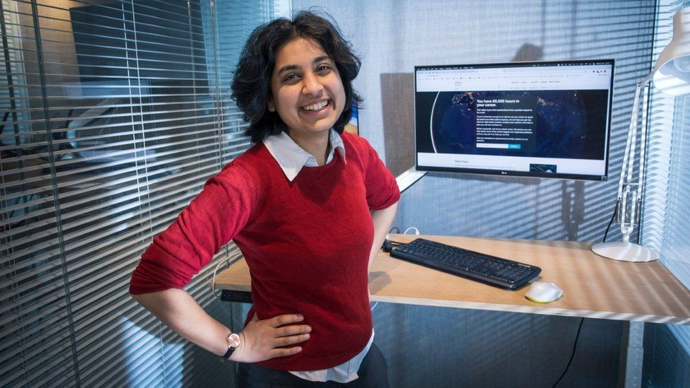
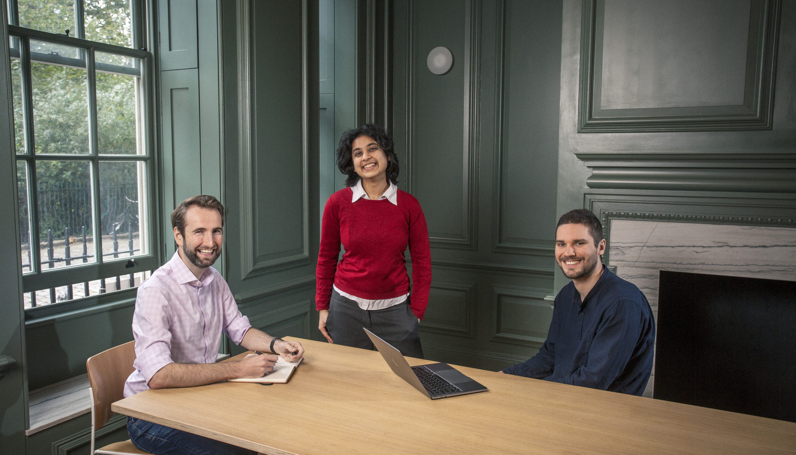

[Habiba Islam](https://twitter.com/FreshMangoLassi) is a member of [80,000 Hours'](https://80000hours.org/) career [advising team](https://80000hours.org/speak-with-us/). She previously worked as the Senior Administrator for the [Future of Humanity Institute](https://www.fhi.ox.ac.uk/) and the [Global Priorities Institute](https://globalprioritiesinstitute.org/) at Oxford. Before that, she qualified as a barrister and worked in management consulting, specialising in operations for public and third sector clients.

First off, here are two important links:

- 80k offer **free** one-on-one career advice calls, and they want to [speak to more people than ever before](https://80000hours.org/2022/01/our-advisors-want-to-talk-with-more-people-than-ever-before/). You can apply here → [**80000hours.org/hti**](https://www.80000hours.org/hti)
- 80k are taking applications to join the advising team — [take a look!](https://80000hours.org/2022/01/open-position-advisor/)

<h5>Image credit: <a href='https://www.bbc.com/news/business-59560538' target='_blank'>BBC</a></h5>

In our conversation, we discuss —

- How to [begin planning](https://80000hours.org/career-planning/summary/) a high-impact career
- How to figure out which problems are most pressing
- Tradeoffs between doing direct work and building career capital
- What one-on-one calls with 80k are like (and why you might consider applying)
- Specific advice for students
- Different motivations and framings for [longtermism](https://www.longtermism.com)
- The case for being ambitious if you want to do good in your career
- Concrete next steps for beginning the process of career planning

##### The 80k team of advisors. Image credit: [80,000 Hours](https://80000hours.org/2022/01/open-position-advisor/)

## Habiba's recommendations

- [What we owe the future](https://www.youtube.com/watch?v=vCpFsvYI-7Y) (40 minute presentation by Will MacAskill)
- [Planning a high-impact career: a summary of everything you need to know in 7 points](https://80000hours.org/career-planning/summary/) by Benjamin Todd
  - Or embark on the full course: [a (free) weekly career planning course for positive impact](https://80000hours.org/career-planning/process/)
- [Be more ambitious: a rational case for dreaming big (if you want to do good)](https://80000hours.org/articles/be-more-ambitious/) by Benjamin Todd

 <Book url="https://www.goodreads.com/book/show/25395278-feeding-everyone-no-matter-what" image="book-habiba-1" spineColor="#0d1927"/> <Book url="https://www.goodreads.com/book/show/31850765-energy-and-civilization" image="book-ben-2" spineColor="#ffffff"/> <Book url="https://www.youtube.com/watch?v=bIAF7kBbGKk" image="book-habiba-3" spineColor="#ffffff"/> 
 

## Resources

- Apply for [free one-on-one career guidance from 80,000 Hours](https://80000hours.org/hti)
- The [Start Here](https://80000hours.org/make-a-difference-with-your-career/) guide on the [80,000 Hours](https://80000hours.org/) website
- [A (free) weekly career planning course for positive impact](https://80000hours.org/career-planning/process/)
- [Planning a high-impact career: a summary of everything you need to know in 7 points](https://80000hours.org/career-planning/summary/)
- [*The Precipice*](https://theprecipice.com) by Toby Ord
- [Magnify Mentoring](https://www.magnifymentoring.org/) (a mentorship network with a focus on women, non binary and trans people of all genders)

## Transcript

### Intro

**Fin** 0:04 

Hello, you're listening to Hear This Idea, a podcast showcasing new thinking in philosophy, social sciences and Effective Altruism. In this episode we talked to [Habiba Islam](https://www.eaglobal.org/speakers/habiba-islam/), who is a member of the [80,000 hours](https://80000hours.org/) career advising team. Before that she worked as the Senior Administrator for the [Future of Humanity Institute](https://www.fhi.ox.ac.uk/) and the [Global Priorities Institute](https://globalprioritiesinstitute.org/) at Oxford. And before that she qualified as a barrister and worked in management consulting. If you've been meaning to get more serious about planning out a high impact career, or switching into one, then the first half of this conversation is for you. Habiba basically guides us through some key questions to ask yourself when you're beginning to plan the next stage of your career and just gave a bunch of really useful advice. Then we talked a bit about Habiba’s job as a career advisor, and how 80,000 hours are helping people start off on careers aimed at having a really big positive impact, such as by giving free one on one career coaching calls. One thing to highlight here is that the 80,000 hours career advising team wants to speak to more people than ever before. So if you're at a stage where you think that you could benefit from maybe - just say, again, *free* - one on one career advice, then you can go to [80,000hours.org/hti](https://80000hours.org/speak-with-us/), that's 80,000 hours, the number, and you can sign up for a call there. And that link is also in the show notes, by the way. Oh, and 80k are also looking to actually [hire a new career advisor](https://80000hours.org/2022/01/open-position-advisor/), so you should totally apply to that if you think that you might be a good fit. And there is a link in the description for that, also. In the second bit of the conversation, we talked about what motivates Habiba in her own work, and in general just about different kinds of motivations for working on longtermist cause areas, especially things which appeal to our sense of justice and fairness, as well as just bringing about the best consequences. And nearer the end, we asked Habiba about the case for aiming high, and why if you want to do as much good as you can, then it can make sense to try being way more ambitious than you might have thought. And I think that's really worth hearing. Okay, without further ado, here's the episode.

Habiba, thanks so much for joining us.

**Habiba** 2:13 

Thanks for having me.

### How to [begin planning](https://80000hours.org/career-planning/summary/) a high-impact career

**Fin** 2:15 

Cool. So a lot to talk about. But I thought we'd begin just by talking about what it's like to get career advising because you are a career advisor at 80,000 hours. So maybe the first question is, if you just imagine someone listening to this, maybe decides maybe pretty soon to like, sit down and really think seriously about their career plans for a high impact career for the first time. What in general does beginning that process of career planning look like?

**Habiba** 2:45 

Yeah, so it might be slightly different from the kinds of things that you often hear as careers advice. If you're thinking about this from the perspective of wanting to plan a career that's going to have a lot of impact, that sort of throws up a few other considerations. So I guess I'd suggest that people start off from the big picture view of like working out what it is that they want out of that career, and everyone has like various different personal priorities, as well as kind of priorities that are impact wise. But getting clear on what those are. And then digging into this question of like, what impact actually means for you, so that you have a sense of what it is that you're trying to try to get towards. So that's those kind of like abstract, like slightly more big picture, things are really helpful to set the scene. And then when you're thinking specifically about career planning, it seems useful to sort of think a little bit backwards from where you might be wanting to head what those kind of longer term potential paths for you might be. Not in really complete detail at this stage, you probably won't be able to predict with a lot of accuracy exactly what your job is gonna look like in 40 years time or something, but getting like a sense of where you might be heading. And then trying to work out what some of your uncertainties might be about how to get from here to there, and how you might make progress on those.

Luca 4:00 

So you mentioned having a positive impact there; when we sit down and start thinking about how to have a positive impact with our career, like how should we reflect what exactly we mean by positive impact?

**Habiba 4:10**  

Yeah, I completely agree that it seems like both an important question and a hard question. And I think what this translates to in the real world, and for your career, is going to be like a bit to do with what you think about various ethical considerations or like your moral view, and also a bit to do with, you know, empirical stuff about the state of the world, and what kind of situation you actually find yourself in. And both those things can be a bit complicated to get a handle on. But it seems worthwhile, at least spending some time just trying to put some words to what your feelings are here, at least as just a starting point. And I think I have found this surprisingly valuable as an exercise to do in the past myself as well, because I sort of maybe went through life sort of vaguely having a sense of what I thought I meant by this, even having like studied moral philosophy and like been aware of Effective Altruism, but actually trying to write down what I thought was quite clarifying in that, you might just like, be able to put words to some things that you do have some level of clarity on, and then just naming some of the things that you're uncertain about as well.

**Fin 5:13** 

Yeah, I guess one question I have here is, I can really imagine hearing that. and thinking, well, I definitely know I care about particular things, right? Like, I really care about climate, and I really care about ending factory farming or something, maybe I can list out those things. But I find it really difficult to figure out what they have in common, if anything,. How might I go about figuring out if there is some kind of underlying or more fundamental, like, ethical view that's kind of connecting those things?

**Habiba**  5:44 

Yeah, that is really tricky. I think it's very tempting to be able to point to things in the world that are concrete examples of like, that seems good and that seems bad. And also, specifically, when people are coming at this from like a career planning perspective, it's often very easy for people to be already filtering with a sense of like, what are the things that I feel like I have any chance of affecting with my career at all? I think it is somewhat helpful to try and do a little bit of abstraction, or at least try and put yourself in the headspace of trying to work out what it is that sort of like fundamentally matters. I guess one helpful thing is that you don't have to do this completely by yourself. There's hopefully some other people who have thought about this as well. Maybe there are groups or communities who have ideas that would resonate with you. So you can you know, for example, look at the 80,000 Hours website; we have [an article](https://80000hours.org/articles/what-is-social-impact-definition/) on what we mean by social impact and partially construed, and that might give you some like prompts for your thinking, you can see which bits of that you agree with and which bits you disagree with. And if you're part of the sort of wider Effective Altruism community, there's like a tonne of resources out there as well in like some, you know, Intro fellowships and things like that, that talk about this. And so I guess there's one thing is, you could like, read some of the things and like, reflect on those and like, chat to other people. But what is it that you're actually doing here? I mean, you can kind of reflect in some ways, the only way you're going to get like some answer to your sort of moral intuitions is like, it's a bit of like reflecting through your, like your own intuitions kind of maybe some thought experiments to try and get a sense of what it is that you that just kind of underlying your, your views here. Yeah. Does that seem like that would be - does that seem like that gets to the thing that you're asking Fin?

**Fin** 7:23 

Yeah, no, totally, I think so. I think, just speaking personally, there's some pattern where, you know, I can start off by naming things, particular things that seem really good, right, and things that seem really bad. And then when I reflect on the reasons then I can kind of maybe figure out some kind of abstract thing that's going on, which explains why I think they're good and bad. But then you get this thing that once you have the more abstract thing in mind, you can use that as a starting point to figure out new things, which you kind of didn't previously consider, that you might actually consider working on, right. So I just want to say, in general, it seems like a really useful process to kind of step back and, and then it kind of steps forwards again.

**Habiba** 8:03 

Yeah, and I think I mostly was talking a bit about this kind of the moral element of it as well, which is something that you can get a grasp on, possibly just like by sitting down and having a thing. Although it's helpful to sort of like read things that other people have written as like prompts. But then there's this whole other empirical bit as well around what positive impact in the world today might mean to you, which I think you can't really work out from just like thinking on by yourself, you really do have to, like, look at the world around you and sort of see see, you know, do you really believe that there are actually like different interventions that some of them could be, you know, 100 times more effective than others? And does that make a difference to which kind of areas you think it's more, more valuable for people to throw their efforts behind? Things like that, I think. And yeah, I think, in general, one of the things I really like about the Effective Altruism community specifically and other kind of intellectual communities have this too, is that we can make progress on these kinds of questions together, and you really don't have to work out them by themselves. And there's like, hopefully, other like, guiding resources that can take you through some of this and you know, you can see what other people think.

**Luca** 9:06 

Yeah, although there like, one point I really liked you having made at the beginning is what I guess it's like emphasis on like, setting explicit time out for doing this and like kind of doing this yourself and like actually writing down these answers yourself or like speaking to somebody else about this and really thinking about it, rather than necessarily, right just like kind of referring or like identifying with a certain like label and then like just assuming that that is like kind of done here. So thinking there's like definitely a big difference maybe between like, saying that, like ‘I am an environmentalist and therefore I want to work on climate’ versus ‘well, why do I care about climate?’, and then working out like the fundamental reasons why and then like, either just like, being able to reflect on this and then understand like, what is like truly motivating you behind that. Yeah, and possibly doing that like throughout like different causes and stuff just seems like for me, like really useful on just like reflecting and not really understanding what you're implicitly doing until you like write it out or talk to somebody about it.

**Habiba**  10:02 

Yeah, I think that's a really good point. Because I think people can come to, for example, the climate example, with lots of different motivations. I mean, maybe you might come to it from a sense of like, of thinking that the environment has value itself. And it's actually like, very, like, you know, maybe maybe like, the environment has rights, or maybe the environment has like, worth independent of humans, and it would be really bad for us to destroy it. Or maybe you're coming at this from a complete different perspective, which is like, actually, fundamentally, the thing they care about is like, humans, or animals suffering, and if we destroy the environment, that's bad, because then it means that like, there's gonna be real people who are having to live through like droughts, and floods and extreme weather events and that kind of thing. So there can be anything that's like people within the environmental movement, who might have very different takes on this kind of thing. And it seems helpful for you to like, tease that out yourself.

**Luca** 10:45 

Yeah. One, like, last question I have on this point is like, I guess, just maybe thinking about this, either through through cases that you've seen or like, even, like, for yourself, like, how much clarity do you expect people are able to, like make on this, I guess, especially when people are doing this, like, for the first time and stuff, especially when we're thinking about like, really deep, like moral foundational questions and stuff. Like, these are definitely ones that I'm like, constantly, like iteratively, like still updating or, like, still super uncertain on. And, you know, at some point you kind of have to make certain decisions and like, start on, like, what seems like a good kind of first output here, or what feels like a good first step to be able to think about this in terms of your career.

**Habiba** 11:24 

Yeah, I mean, you and me both Luca - I still feel like I'm learning and developing my views on ethical considerations. I think that you want to, it's helpful to get some sort of bounded sense of what the space is here. And if you can get a sense of at least certain things that you're like, relatively confident, are sort of part of like things that might that might matter. And maybe there are some other things that you're like less certain about, but at least you sort of like you have, like, already kind of started to stratisfy the space here a bit. And, yeah, I think like identifying things that you want to like, carry on, thinking about or learning about, or diving into a bit more just seems great. But at least like knowing what those things are, seems like a good starting point. So maybe the thing that would be like a good output is being able to write, like, a little paragraph - a few sentences of certain things that you sort of like, you know, your best guess right now, and maybe then a bullet points of the things that you're most uncertain about.

### How to figure out which problems are most pressing

**Fin** 12:24 

Yeah, maybe this will come up later, as well, but I feel like I want to say this is one example of the unreasonable effectiveness of just setting a timer to go and think about something. I guess even it might feel like, well, everything I kind of can do about these, you know, deep seeming questions about what's best overall, I probably already do know, because it's obvious, and then everything else is just mysterious, and I’ll never know. But when you set a half an hour timer, and really sit down to think about things and to learn what you know, try resolving uncertainties, I think you can get quite a quite a long way, at least I felt like I could, when I I tried doing that. So at the start, you mentioned the next chunk of work when you're sitting down to plan out a high impact career for the first time, is something like thinking now about what problems in the world actually look most pressing, given what you've kind of what matters in the abstract. So maybe a question is, where can you begin to look to start thinking about that question, and, and what kinds of considerations are important to bear in mind here as well?

**Habiba** 13:25 

So for getting started on this question of trying to come up with a list of the most pressing problems, again, I think, like turning to other groups, other people's opinions you respect or other like intellectual communities to get like a shortlist or somewhere to get started seems pretty good. So for example, in 80,000 hours, a bit of a plug, like we have a we have a page of [problem profiles](https://80000hours.org/problem-profiles/), where we set out which kind of problems we think might be the most important. I think this isn't the only list that you could start with, you could look at the [UN Sustainable Development Goals](https://sdgs.un.org/goals), or like what progress studies economists think, or just other kinds of intellectual communities that you think are, that sort of seem to be like, pointing at trying to do something that seems good for the world, or just the wider Effective Altruism community and the different kinds of problem areas that people focus on there. And I think that gives you a starting point. I think that something that seems kind of true to me is that there is quite a difference between which problems seem more pressing compared to others, particularly considering just like how high stakes some things might be, given the scale of what's going on in the world right now. And so that might be something that differentiates problems quite significantly from other ones, when you actually get to the fine grained level of what is it actually that I'm going to do with my job? What's the organisation that I'm going to work with? What's the kind of like angle that we have on this problem? And there's still going to be a bunch of different variation between different things like that even within the same problem. I mean, just think about climate change again for an example. They're just like tonnes of different people trying to work on this in like many different ways. So it's definitely going to be a bit of a first step kind of broad brush approach to try and look at problems as a whole, to try and get a sense of which ones seem more important than others. But I think even at this level, even if you think that there's like, within problem variation, it still seems worthwhile to be able to kind of like separate out different clusters of problems. So you might think that you want to look, you want to look for like global problems, rather than like local ones, because those are going to be bigger in scale. You might be wanting to look for things that have, the stakes are sufficiently high that we're dealing with, like, large groups of people or large groups of animals, maybe even you're looking towards things like factory farming, or even like future generations as being kind of like large groups that are being affected. And like, you might want to think about things like the relative neglectedness, and this could be like, you know, how many people are working on this problem, maybe another way of like separating these clusters out, to at least giving you like a first indication of where you want to focus your efforts, even bearing in mind that within the problem, there'll be like, some ways of attacking the problem that are much better than others.

### Personal fit and enjoyment

**Luca** 16:08 

Yeah, so I guess, like, a lot of this conversation has so far focused on this, like, you know, somewhat like intellectual exercise of like working out how impactful or important certain like, cause areas are kind of in this, like, abstract sense. But then there's also this like, really just like, real world personal component of like, you are then going to have to work on this cause or like doing this function or doing this job. And, you know, 80k, you know, it's in the name, you will kind of be allocating, like, 80,000 hours of your time there. And hopefully, you want that to also be time that is like really fulfilling, or just like, really enjoyable and stuff there. And we talked, I think, [Ben Todd](https://hearthisidea.com/episodes/ben), previously around this, like idea of career fit, but yeah, I'm wondering when you're kind of like planning your career, like, how should you think about this aspect, especially how should you maybe like, think about trading this off with working on something that like, seems more impactful or important, but might not be, you know, the, the thing that like, immediately strikes you as the best fit or the most enjoyable, like day to day? Yeah, like, um, for somebody just starting off thinking about this, what should they be thinking of?

**Habiba** 17:12 

Yeah, no, great question. I think it's just like, it's definitely the case, this kind of like finding a career that is a really good fit for you that you're going to find motivating for the long term is a really important part of the equation, definitely. I think there is, yeah to pick up on a couple of points around how to trade this off, so I think one of the reasons why we want to focus so much, at least on setting the scene on thinking about problem areas that you might want to work on, are in part, because to sort of level the playing field a bit, I think a lot of other careers advice out there basically only focuses on like, finding the thing that you love. And so it seems helpful to have a bit of a counterbalance and like try and focus on the impact side of the problem a bit more. There's also I think, a tendency for people to sort of, to, if they're thinking mostly about the personal fit, to mostly consider roles that they are aware of that seemed like similar to things that they've already had some experience of that sort of maybe areas that they're a little bit more familiar with. And maybe putting yourself in this kind of more abstract headspace thinking about the global problems is really useful, because there very plausibly could be ways of working on those problems that wouldn't come immediately to mind. And so for example, you could always earn to give and then you can be funding, go to get a high paying job and earn extra money so that you can be donating it to work on one of these problems. And that can just, that can work on any problem. So there's like, possibly a way of like working on any different problem, through that. Similarly, through advocacy, and like various ways of doing like research or policy, maybe like, relevant to lots of different problems, or even something like, if you have really good organisational skills, or entrepreneurial skills, you can like run an organisation or start something new, which just may be very applicable to lots of different problems. So again, this is kind of part of why I think it's useful to do some of the like, big picture problem thinking first, before you then switch into thinking about the personal fit. But I think once you've got done the big picture problem thinking, and then you've kind of had to think about these different problems, which one seems important, what are the bottlenecks in those areas? What are the kinds of career paths that could be useful for making progress on these problems? Then you get a sort of long list of potential careers. And at this point, I think this is where personal fit is kind of, which of these careers seem really fulfilling to me, really kicks in because that's going to be one of the one of the most decisive factors I think, in picking between the in the long list. Because your career is going to be multiple decades long, like you said, 80,000 hours, and you're going to do your best work when you are really excited to get up in the morning, at least most of the days. And like do your best work, work harder, enjoy working with your colleagues, yeah, just find the work like motivating and enjoyable and are really going to be doing your peak best work, you know, many decades in the future.

**Luca** 19:56 

Yeah, there's maybe like a more basic question here, which I think you were like touching on at the end here, which is like when we use the word like ‘personal fit’ or, like, ‘career fit’ and the like, like, what exactly do we like mean by that? Definitely you know, when thinking back to when I was like 18, it was really hard to know, like, you know, without having tried or without like, having been there a lot of like, would I enjoy being an investment banker and trying to earn a lot of money? Would I enjoy being an academic like, what, what does like fit or something even mean or like, what am I even good at? Are there maybe like any, like signs or indications that you would like recommend people look out for especially when they're like, kind of just trying things out at the beginning? And yeah, like, I guess, trying to evaluate, like, how good fits they are for certain positions?

**Habiba**  20:40 

Yeah, I am extremely sympathetic to the fact that it's really hard to tell very early on, at least for lots of people. I think there are maybe some people in this category who feel that something's just like really clicked for them. And they have like a particular like, they did maths, pure maths research at university, that's the best thing, everything else is terrible. But I think for probably most people, it is really hard to get a very strong sense of being able to predict what it is that what is it that you're going to be really good at, in like 20 years time, when you haven't had that much experience of many things outside of academia, usually at this early stage. I think it's also, even once you start getting experience in, you know, internships, or in your first job even, I think it's very easy to maybe miss attribute how enjoyable you found that time to something around how good I am at that specific task, when it could just be to do with the things that are going on in your like life in general, it could be about that specific role, it could be about the pandemic in this time. It's very, very easily confounded by a lot of other variables. So just to restate, that was all just to restate why I think it's a hard task to actually try and answer your question about, therefore, how could you try and get started tackling this problem, I think you should, in the early stages of your career, you should really be putting yourself in this exploring mindset, and give yourself permission to try out different things and actually try them out quite wholeheartedly to see if they are going to be a good fit before you draw too strong conclusions. But you can be doing this by building up the amount of effort that you're putting into a particular area. So you start off, if you think something's kind of plausible, maybe start off by reading a bit about it, then talking to a bunch of people and trying something out, that takes a couple of weeks, and then maybe trying something out, that takes like a few months, like an internship and then trying for a job. And so at each stage, you're putting in a little bit more effort, and getting a bit more information about whether this works for you. And to go back even one step before that, to work out which of these things you should even try, you can get some information from basically from your, like, your work history, or your studying history so far, you can sort of do something like an energy audit to look back over the last kind of month and and work out which of the things that you did that you found really energising or you feel like you really got into a flow state or something like that. Or you could try and gather a bunch of feedback from other people who know you well, and try and work out what some of your particular strengths are. And you know, see if you can like use that as an input into this kind of calculation around what might you be really good at in the future. We have like some more guidance on this on our website in terms of like articles on personal fit and also on like finding your strengths. But I think fundamentally this thing around yeah the overarching structure might be something like try and work out, try and get some like decently good guesses, and then do this thing of testing them out with increasingly more effort to get more information on each of them.

### Tradeoffs between doing direct work and building career capital

**Fin** 23:38 

Yeah, cool. I feel like I maybe want to add, just speaking personally, that little bit of advice you mentioned about figuring out when you notice that you fall most easily into a kind of flow state - that was really useful for me to think about. So I guess flow state, meaning those stretches of time when you're working and the time just like flies by really quickly and you just get so easily absorbed and you're not very easily distracted. So yeah, here's a question that I was meaning to ask: So it seems to me that often, you can end up trying to decide between maybe two options where one option looks like jumping in to work directly on a problem that you really care about. And another option looks like working on a kind of adjacent problem or something that's not totally related at all. In order to gain experience and skills and connections, which you can then spend later on on the thing you think is most important - so this is called transferable career capital. I guess I want to ask, how should people begin to think about weighing up those two kind of broad strategies when they're thinking about how to have the most impact through their career?

**Habiba** 24:50 

Yeah, really good question. I think you might think that my own career was like went hard on the transferable career capital early on, in that I did like management consulting and got like very general skills. But I think possibly people can do better than I did. So if I were to sketch out this kind of what should you be thinking in terms of career strategy, it seems relatively helpful to think about having three different career priorities. So early on in your career, particularly, you might be wanting to focus on exploring different things. And then you might want to move on to really investing in yourself building up skills, and so you become really good at a particular thing. And then you want to maybe switch into deploying those skills, actually, like caching it all in and doing a bunch of good. I described those like they're sequential, but to be fair, at every stage in your career, you probably want to have like a bit of each of these, and they might be just like in relatively different proportions. So you might be like, likely early on in your career weighted more towards exploration and then towards like investing in skills, and then likely later on switching into deploying those and going for things that are directly impactful. And so that's what I think, so for most people, it seems pretty useful to have in mind something that they might be wanting to do longer time and be really focusing early on on building up that career capital. And you might not want to build up just very broadly transferable career capital that could be useful for anything, which is kind of maybe what I did with consulting, you might want to be a bit more specific. And you might want to build up quite targeted career capital, specifically in the area of like economics of AI, or specifically in the area of like building nonprofits that are longtermist focused or something. But so that's the general advice is probably like probably as a whole, you should be thinking about exploring and then developing career capital. But that said, even early on in your career, you should definitely be keeping an eye out for outstanding kind of opportunities to be able to be doing a tonne of good, even just that at this early stage in your career. And it is just the case that there are a bunch of these kinds of opportunities that do crop up. And so like many of your listeners may be in a position where they're able to get like a junior entry level role at like a really impactful nonprofit or an AI safety company or something. And they're able to like be the best person for that role, and fill that niche and start getting a bunch of experience as well as being able to do a bunch of good early on, and see if you can get something that ticks both boxes; the career capital and also the direct impact. That seems great. So don't like rule those options out. But don't necessarily put too much pressure on yourself to be definitely looking for those early on.

**Luca** 27:26 

Yeah, I guess I wanted to like follow up on that aspect here as well, right. Because when you're I guess broadly talking about building up career capital, it's really about forcing you to take this like long term perspective on your career. And likewise, if you're kind of aiming for like a senior, very specific position, and that is like your goal now, then that is also having to take like a long term perspective to your career. And there seems to be like kind of two challenges to this. One is that you might just be super uncertain about like, what it is you want, or like what you think is most important, and it might turn out that like in 10 years, you know, your views are different, or the world has changed and what have you and actually, you know, things might no longer be the case that this was like the the right approach kind of post hoc. And then there's this like, second aspect as well, which I feel like I could definitely relate and like resonated when you're talking about like management consulting and taking these routes like build up career capital that one of the things that I was like really concerned or worried about is that like my own preferences for what I think is the most impactful or the most important, and like doing good in the world might change depending on the environment that you're in. And yeah, I'm just wondering if there are like any, is there any advice or guidance you would give people when they are like having to take this long term perspective and having to like grapple with these aspects of it?

**Habiba** 28:40 

Yeah, I think is really tricky. And it's definitely extremely tempting if you're, if you're operating under uncertainty, to try and hedge as much as possible, and to try and keep your options open for as long as you can, and in some ways, just be kicking the can down the road for when you actually have to decide and then go all in on a particular area. I think a couple of things that are worth bearing in mind that might push against that instinct are that it's just very possible that being a specialist in a particular area is really valuable. And to become a specialist in a particular area, you maybe just you're going to get gains by starting earlier. So if there's a chance that, you know, if we need people to be professors in bio policy, and have a lot of like expertise in that area, and credentials and respect and connections, they need to be starting on that path, like pretty early. We can't all be kicking the can down the road. And so specifically, this kind of discussion is even harder when you're thinking about coordinating with the community of other people. So instead of trying, instead of thinking so much from the perspective of like, what should I be doing with just my particular career, if you're able to sort of take a portfolio kind of view and consider yourself as part of like a group of other people who are all trying to do good together. It maybe seems a bit more reasonable, you can maybe relax a bit about you know, let's all specialise in slightly different things and trust that, that, you know, even if my particular thing isn't like quite perfect or something, as a community we're investing in the right kind of mix of different areas. And so as a group, we're going to do better, certainly better if people are sort of specialising in their niches, rather than everyone trying to be a bit of a generalist. And so a couple of those things maybe push against this sort of natural tendency to try and like keep options open. So it is still hard, though, I think it may feel like you have to make some calls quite early on about which direction to go in. I guess this means that it's particularly useful if you can try and front load some of the investigation to get to sort of narrow down your uncertainty as much as possible. So perhaps during university or in the first few years, yeah, trying to like, focus in on what would be the biggest thing that would change your mind and which direction to go in. But I think it's in some ways, I think I just like, I think it would be really great if people felt valued and empowered to do the thing that ex-ante seems like a very reasonable thing for a bunch of people in the community to do. Even if x-post different things come to light or something that change people's minds.

**Luca** 31:13 

One impression, I kind of want to run by you is that, like, the more I've seen, just like professionals, or people, like more senior on in their career, it's like really surprising to see just like how much people have been able to switch like even, you know, in their like, you know, late 20s, mid 30s. Like, what, what kind of have you and like pretty drastic career decisions, which was definitely very different to like, what my impression of a career was, again, when I was like 18, or at university where it kind of felt like you choose your subject, and that is like already, like really narrowed it down, and then you choose your first job, and that has really narrowed it down. And these decisions do seem like really, really important, I definitely want to, like diminish that. But like, I think the point is here somewhere that like having decided to like specialise or like go down a route as long as you do like really cool, awesome work down that route, like doesn't narrow things down as much as you expect, like people are able to like value achievements and work and you can make like really drastic changes in your career, like later on, and we’ve definitely had like guests on in the past as well who I think like really exemplify that.

**Habiba** 32:12 

Yeah, it does take the pressure off the decision, off any specific individual career decision, if you realise that this isn't all or nothing, this is like an incremental change in the direction that you're going in.

### What one-on-one calls with 80k are like (and why you might consider applying)

**Fin** 32:26 

Cool. So we've just talked about from a super kind of bird's eye view, what it looks like to really start thinking about planning out a kind of high impact career for the first time. Now it turns out that 80,000 hours are all about this, right? You have a bunch of resources on the website, which help people think this through, go into a lot more detail about the things you've just mentioned. But also 80,000 hours offers one on one career coaching, that's what you do - for free, by the way. So yeah, what does that involve? What does that look like?

**Habiba** 32:58 

Yeah, so people can [apply on our website](https://80000hours.org/speak-with-us/?int_campaign=2021-08__primary-navigation), and then if it seems like we're well placed to help you, then we'll offer a video call, which is, like you said, completely free, and just talk through some of the thoughts that you've got on career planning at this at this stage. So we can talk through things like the problems that you're thinking of working on, the different options that you're considering, and the next steps that you're thinking about right now and see if we can yeah, see if we can help.

**Luca** 33:23 

Cool. And do you have like a profile or like the who are the types of people who should be like, like reaching out like who are you most excited to get to speak to?

**Habiba**  33:33 

So we talk to people at all different stages of their careers from undergraduates to people who are later on in their career and already have experience or are already experienced professionals, we talk to people who have different ranges of thinking about their careers from being like very early on, and not really having like a good idea about exactly which thing is the right fit for them, even to talking to people who are already on a particular path and want to see if they can do that even better, or have even more of an impact on that path. Specifically, I think we're most excited to talk to people who are engaging really seriously with this idea of doing the most good with their career and are like engaging with the kind of like analytical approach that 80,000 hours takes and particularly have some familiarity and interest in the kinds of problems that 80,000 hours talks about on the website.

**Fin** 34:22 

What do you think people really get out of one on one calls; where are they like really most valuable?

**Habiba**  34:29 

Yeah, it's actually just like a wider range of things than people might naturally expect from careers advising. It's like it's not very much focused on like specific advice often, it actually just like covers a tonne of different things. So it can be talking through cause prioritisation and like some moral philosophy with someone who shares your values and can kind of point you in the direction of other resources or talk through some confusions. It can also be like specifically talking about your different career options that you're considering, giving you a sense of what those look like, acting as a bit of a guide to the different areas, talking about what the routes in might be, and helping you weigh up which one thing, which ones seem most valuable, maybe even putting more things on the table that people hadn't even considered so far yet. And there's also a big part that seems valuable about making further onwards connections, being able to introduce people to experts in the areas that they're interested in, or hiring managers. And often those connections are the thing that really last for a long time after the call. And we've had great examples of people, you know, finding their collaborators, and then going on to work in a particular project with them. And then there's a bit around, specifically, helping people work out some specific next steps, turning something into like an actionable plan that they're actually going to be able to do, putting them in the direction of like specific jobs or funding opportunities, or resources or events to go to. And there’s this like overarching thing, maybe around, it’s just kind of nice to talk to someone who shares your values and is thinking about things similarly to you, and maybe like, can provide a bunch of encouragement, especially if other people in your immediate circle, like family and friends, aren’t so familiar with this way of thinking about careers, and maybe think it's like, a bit more unusual to be thinking about something like AI safety or, or like caring about future generations or something like that. And so it just can be like a really helpful, yeah, just like a helpful person to talk to, for a bit of general like validation and encouragement.

**Luca** 36:20 

Totally, yes, fab, and maybe to go down like, Memory Lane a bit, I've got a document open on my laptop, which was from the 16th of July 2020, which was, I think, when we had our first call for my career advice session, and I remember we were talking through like loads of different career paths, like kind of going back now, it's like crazy what I was considering. It was like, everywhere from like, going into, like earning to give, to running for political office, to like doing academic research, like what have you. But I remember one of like, the really awesome, like, benefits I got out of those conversations was, I think you just followed up with like, introducing me to people doing these jobs. And I had like this wonderful month where almost like every week, I had a call to look forward to with like somebody just willing to spend an hour of their time with me, just walking me through my questions like giving me like a very first introduction into like, all of these different fields and stuff. And yeah, I found that like, incredibly valuable, and definitely a big plug. That is an insane amount of value that you can get essentially for free, when you're like stuck, yeah, with these questions and need somebody to talk to or make progress on these things, like definitely made a really big difference for me.

**Fin** 37:24 

Yeah, I will say as well from my own memory, so I spoke to I think a volunteer who was helping do these kind of career talks, but wasn't working for 8k, but we would just go through the 8k material and I got so much out of it. I was just kind of thinking then when Luca was speaking, what, what did I get out of it most? And I feel like so the thing you mentioned Habiba that there's just a lot of value from feeling like, someone kind of actually just cares about what you end up doing and like, is willing to, you know, put in time to like, actually help you, that just felt really cool. Kind of, kind of like embarrassing, like, oh my God, someone’s actually putting in their own time, to like, help me and there's no strings attached, right? They just care about helping people get cool high impact careers. But also, like much simpler benefits. So like, I'm doing, pretty much everything I'm doing now, I'm pretty sure I would have had no idea existed before those conversations. So just like learning that certain routes exist, really important, because almost certainly, some of the coolest routes people can follow will not be the kinds of things that they'll hear about from friends and their parents, or their teachers, or from just like a 10 second Google. But honestly, maybe the best part of doing the career chats for me was like, just because it was the first time I'd sat down to think seriously about what I want to do beyond like, a two month timeframe like in my life. And there's just some value from like, carving out the space, like a structured space to just sit down and do that planning exercise. And it goes, I think I mentioned it before, right? There’s just this like, unreasonable effectiveness to setting a timer and like doing this thing and getting someone to help you with it. So yeah, also found it extremely valuable, and possibly is the reason I'm doing what I'm doing now.

**Luca** 39:09 

Maybe turning the tables and just asking what is it like, on the other end, like being a career advisor and such? Like, how was it for you going through this process or guiding people through this process?

**Habiba**  39:20 

Yeah, it's a really nice job to have, because I get to talk to altruistic, talented people who really care about helping others and just get to try and help them with their careers and are able to and hopefully, I'm able to help them by being able to sort of, you know, like, say useful things to them and like, connect them up with other people. So it's a really nice job to have in there. It's yeah, it's both like it's fun and nice, being able to like talk to people and also just like, yeah, I really feel good about the impact that I'm having and being able to help people to get into even more high impact roles. It's great. The team is lovely as well. And so it's a really nice kind of team to work with at 80,000 hours.

**Fin**  40:00 

One thing I'm interested in is just the numbers here. So can you say how many calls 80k is managing to do per year these days, and also any updates on whether you plan to scale up the operation?

**Habiba** 40:11 

Yes. So we are absolutely in the phase of wanting to very much increase the amount of calls that we're doing, increase the size of the one on one team and increase the number of calls that we're able to do. So last year, we did over 830 calls, which was like a record breaking year for us - that was the most calls that we've done in a year in the whole kind of 10 years that 80,000 hours has been around doing this kind of thing. But we're planning to beat that even more this year, and aiming for something like over 1200 calls, this year. We also part of part of the reason why we're able to do that is that we hired a couple of new advisors to the team, Alex Lawsen and Matt Reardon last year who started, and we're also hoping to hire even more people this year, so very much, really excited about helping more and more people, and yeah, be close to scale up what we're doing.

**Luca** 40:59 

Yeah, just quickly, out of curiosity, are you like hiring at the moment? Or is there any positions that people who might you know, have heard how cool it is to be a career advisor like want to apply this for themselves?

**Habiba**  41:10 

Yes, we are absolutely hiring people right now. There is a job description that we have on our website and an application form. If people are interested, do check that out and put in an application. We'd love to hear from people even if you're like a little bit uncertain about whether this is for you or not. There's very few people who've done a careers advising role precisely like this before, like I did consulting and operations before, and someone else on the team was a teacher. So if this seems like the kind of thing that you might be interested in, then definitely do check it out.

**Fin** 41:38 

And are you able to give some kind of maybe anonymized example of a career change that you think there's a good chance either you or someone on the advising team are actually responsible for?

**Habiba**  41:50 

Yeah, one of the earliest calls that I did was with someone who was doing a PhD on AI regulation, and had come across a bit of the discussions around [Nick Bostrom](https://www.nickbostrom.com/)’s work on super-intelligence, but was interested in this area a bit more. And so we were able to connect him up with some other folks interested in this, who were in the process of setting up the [Legal Priorities Project](https://www.legalpriorities.org/), which is now a fully fledged organisation with a research agenda, and like a fellowship scheme, and the person that we introduced to them was a fundamental part of like setting that up and making that happen. And then we also through kind of staying in touch over the years have helped them out with their career, and they're now sort of been doing like a policy internship at [DeepMind](https://deepmind.com/). And this is one of the cases of yeah, just doing a lot of being able to do these kinds of introductions and like link people up with other people who are thinking about similar things was really helpful in that career.

### Specific advice for students

**Luca** 42:44 

Changing gears a bit, I would be super keen to maybe hear a bit more like specific career advice that like some, like listeners might be wanting. So I maybe propose that we could do like kind of a quick fire round, where I will like, just propose, like some category or somebody who might be like struggling with their career at the moment, and you can tell me any, like hot takes you have, or anything that they might keep in mind. The first of which is kind of considering students - so this might be people who have just finished university, and are just now thinking about, like, what is the first job that they want to be doing like, out of education. Yeah, what should they be thinking about? Is there anything specific you want to advise them?

**Habiba** 43:24 

Yes. So I think the general focus being on exploring paths that seem like they could be really high value, but keeping an eye out for like exceptional opportunities for impact, I think some specific things that come to mind are, it could be a really good time to be doing community building in universities, and there's a big push that the [Centre for Effective Altruism](https://www.centreforeffectivealtruism.org/) has been doing recently around having campus specialists in universities. It just seems like a key time that people get involved in these ideas. And so if you're able to run a really good university group, it can be just like an incredibly high impact thing to do. Beyond that, potentially, doing like junior operations roles, even being like a personal assistant or something like that, to people who are doing really incredibly important work, could be a great thing to be doing early on, you often have like a bit of leeway maybe to do something like a little unusual or a little different before settling down into like a more formal, like career, particularly if you go back to doing like a master's or something like that. You have a bit of a grace period before then to do something particularly exciting.

**Luca**  44:26 

Awesome, and maybe thinking like even before that, so like imagining high schoolers or people who are mostly just thinking about applying to university and just even choosing like what they want to study. Yeah, what are the big questions that they should be thinking about? 

**Habiba**  44:41 

Yeah, tricky. I think really that early on, when you're thinking about your major, I would try not to try not to overthink the thing that you're going to be doing later on in your career or the thing that you think is like definitely the most impactful at this stage. There's maybe you might want to pay attention to some like probably most like useful to pay attention to things that you think you're going to really enjoy and be really good at, at university and then to get really good grades, because those are going to be, they’re going to stick with you and like, hopefully be just useful credentials for later on. I think bearing in mind that also, you could be doing a bunch of other stuff that's really useful, even at university that isn't just for studying that you're doing for your course. So also paying attention to doing like volunteering, or like student organising, or travelling or learning other things outside of your course. All these kinds of things can be just as valuable as the actual formal studying that you're doing as well. So yeah, paying attention to a rounded set of skills and exploration that you're doing early on, as well as kind of yeah, testing things that might be useful for your career, like trying out different internships and things.

**Luca**  45:45 

Fab. And then last one from me is are there any like specific like mentoring or like other resources for like women, non binary or trans people?

**Habiba** 45:55 

Yeah, so I'm on the board of [Magnify Mentoring](https://www.magnifymentoring.org/), which formerly used to be called Wham Bam. But Magnify Mentoring is a mentorship network for people who are interested in Effective Altruism and interested in doing good like, I think particularly through their careers. They have a somewhat of a specific focus on people from slightly more underrepresented groups and like, historically had more of a focus on women and non binary people and trans people of all genders. They now are open to, or at least piloting being open to ,people of all different backgrounds, and but retain some of that kind of like some of the special focus on people from disadvantaged backgrounds or underrepresented backgrounds.

**Fin** 46:35 

So right at the start of the interview, you mentioned that one of the questions people might be interested in asking themselves was something about what they value most or what they think matters most. Yeah, I'm kind of curious, just to hear your personal answer on that question.

**Habiba** 46:50 

Yeah, I do have a quite a mix of different things that go into this. I think it is true to say that I think I have somewhat kind of pluralistic type a lot of like, kind of pluralist instincts. I think I'm not the kind of person who is very signed up to a specific view of, you know, maybe that like only like, only consequences matter and only only welfare, increasing welfare matters. I think that I have always been very pulled by considerations of justice or and also of being a good person, I think. So I have like a mix of these different things going on. I think what drew me to Effective Altruism in the early days, was particularly this sense of being born into a really incredible amount of privilege of being from like a middle class family in the UK. And just having so many advantages, and feeling a sense of that, that seems like that seems like way more than I need, like really unfair. That there are lots of other people in the world that don't have access to those opportunities that I do. And so I think I'm in the early days, when [Giving What We Can](https://www.givingwhatwecan.org/) had that sort of more global health focused pledge that really spoke to that sort of that sense of kind of wanting to give back or wanting to help others who were potentially less fortunate than I was.

### Different motivations and framings for [longtermism](https://www.longtermism.com/)

**Fin** 48:04 

Cool. That's interesting. And I think I can definitely sympathise with a lot of those motivations. And I'm sure lots of people can as well. Which is not to say that you will, you're saying that everyone should feel these things, but there are lots of motivations for the same kind of work. But of course, a lot of the problem areas that 80,000 hours, thinks might be unusually important, or most important, really revolve around this kind of long term perspective, or you're thinking about influencing how things go maybe over very long timescales. Yeah, and I'm curious whether you have thoughts about if you have this kind of these different motivations for doing high impact work in the first place? How might you frame this kind of longtermist work in terms of justice or fairness, as well as just you know, the best consequences?

**Habiba** 48:50 

Yeah, yeah, I'm really interested in this, because I think the wanting to work on things that reduce the chance of a global catastrophe seems like a very sensible and good thing to do from a lot of different perspectives. And I find that very reassuring, I think it is not a very unusual and strange or niche, moral position that might lead you there, I think it actually very much speaks to a bunch of different instincts, including some that might be from a more sort of justice focused framework. And so I don't want to claim that these are decisive arguments, or that I've like fully represented all the arguments that there could be in this space. But I do want to, like, give a bit more space for some of the arguments that speak to some of these justice focused instincts. Because I think that I think they're, like, very relevant, and I'm excited to see more widening of the discussion in this space. But one thing that is like pretty straightforward is that like, if you're very much still within the consequentialist framework, then whatever you value, there's very plausibly more of it - a lot more of it - in the future. And this just isn't just a utilitarian thing. This is like, if you care about people living happy lives and their like welfare, it's very plausible that most of the people that you can affect are going to be in the future. But also, if you just care about having like discovering more inventions, or like knowledge, or beauty, or things like that, a lot of that is going to be in the future as well. So it's like, kind of straightforwardly, this is a, you know, we should not be thinking about, like safeguarding the future of humanity as just tied to like utilitarianism. It's, it's actually like, for many people with many different value frameworks, this seems like an important thing to be doing.

**Fin** 50:34 

Cool. So sounds right, that you certainly don't need to have a very narrow conception of what's valuable in order to buy into the kind of longtermist thing. So yeah, maybe there's another framing that you could speak to, which is you might especially care about representing underrepresented groups. And maybe there's some motivation for certain kind of longtermist work in terms of that idea of figuring out which kind of groups are least represented right now.

**Habiba** 51:08 

Yeah, absolutely. I think that, so this is something that speaks to a slightly different type of moral instinct or moral value that we might have. Because if you're coming from this kind of like justice view of wanting to like represent groups, it doesn't quite work to sort of say, there's going to be more justice in the future, because the future is bigger, because that's not that's not exactly what the instinct is getting to. It seems like the instinct is a bit more about actually, it's really important for us to be paying attention to the interests of groups that otherwise wouldn't be, wouldn't be represented and like making sure that we act towards them, maybe with fairness or something like that. And, you know, there's this long tradition of kind of civil rights and women's rights and LGBT rights as well. And those seem like important kind of moral progress that, hopefully, we've made a bit like that globally. But you might think that, in fact, there are the interests of actually like, billions or trillions of people who are future generations, where how their lives go, and in fact, whether they get to live at all, really hangs in the balance based on what we do right now as the only generation that's alive right now. And it does seem like at the moment, we barely take into consideration the effect that we would have on these people's lives. It doesn't come up very much in conversation when we're thinking about politics. Like when we're thinking about any kind of areas of lives, in business, or even barely in nonprofits, do we really pay attention to the effect that we might be having on these future people? And that, at some point, this starts to seem like quite extraordinarily selfish, that we are maybe only prioritising our own parochial kind of interests, and completely failing to take into consideration what the effects might be on these people in the future. So like, a very, like, very straightforward example of this that I think speaks to a lot of people is, you know, like, climate change, for example. We're the ones who are creating all of this all the problem, we're the ones who are polluting, and it's very plausibly, like, not, not even our children, but maybe our grandchildren, maybe our grandchildren's grandchildren, who are gonna still be living with the consequences of what we do. And we barely take that into consideration.

**Luca** 53:24 

Yeah, like one thing I definitely want to, like, add on here as far as that I do think you're seeing some of these discussions, like, especially around like legal frameworks, or like the interview, I'm kind of thinking of here is like, with the [Legal Priorities Institute](https://www.legalpriorities.org/), or just because you're dealing with law, like it is, by nature, kind of a discussion that's like, very focused around like, rights and justice, and outside of the normal, like, consequentialist, spreadsheet, [EV ](https://en.wikipedia.org/wiki/Enterprise_value)type of calculations, but it's like maybe more associated with with Effective Altruism. And yeah, like, I think I would love to see definitely, like more like justice flavoured like long term approaches, or like, kind of having space there to to flesh these ideas out as well. But that seems like one one place to maybe start, like having that conversation or, yeah, thinking about it.

**Habiba** 54:05 

Yeah, yeah, I do think that the concept of rights and human rights is like, maybe you might point to this as an example of a success of kind of like moral philosophy or political philosophy that this idea of broke out of academia into the mainstream and actually has become a like a very important part of the way that we internationally think about what we ought to be doing. And it just seems like a very plausible way that we should be thinking about future generations as well. There's actually just recently there's been a private member's [bill](https://bills.parliament.uk/bills/2869) by [Lord Bird](https://en.wikipedia.org/wiki/John_Bird,_Baron_Bird) in the UK, which I believe has just been passed in the House of Lords.

**Fin** 54:40 

Yeah, the story of human rights is such a great thing to mention. You know, like 100 years ago, the kind of idea of some kind of very general sense in which all humans have the same rights was like much more far and much more alien, so I'm glad you mentioned that. Cool. So I can try say what's running through my head hearing you say all this is. And I think you're saying something like, look, if you especially care about protecting the rights of future generations, then it does seem pretty obviously good to try to make sure the future generations don't have like really terrible lives. But there's another question, which seems much trickier to me to think about, which is whether, in some sense, future generations have something like a right to exist or a claim to exist. And equivalently whether, in some sense, you're depriving people of that right if they don't exist. And since a lot of longtermist inspired work revolves around trying to reduce the chance that some catastrophe means that people don't get to exist, then yeah, I'm curious how you think about how kind of rights and justice framing slot into the importance of reducing existential risks?

**Habiba** 55:54 

Yeah, that is a great question, but I'm not going to be able to do justice to the political philosophy of thinking about rights in this kind of context, I think this is going to be like, tricky, and I wish I'm sure there's like other people who have thought about this a bit more. I think I maybe want to make the sort of weaker claim that at least it speaks to the motivations for at least some people that even if we're not using kind of rights in a very like technical, like legalistic term, that maybe it speaks to that at least their interests are interests that in some ways, we nowadays should be paying attention to - these the future people's interests. And I think that it goes through the strongest if you're thinking about how their lives go (conditional on them having lives at all) so it feels very like it's pretty hard when you're thinking about the possibility of us creating like dystopian scenarios for future generations, and like things like runaway climate change, or totalitarian lock in or something like that. And there, I think the instinct at least feels pretty strong that future people's interests, and you know, how their lives go seems to be the kind of thing that we ought to pay attention to. I think people maybe have different instincts about whether it really pulls on your moral intuitions that these like future people might or might not get a chance to exist at all. And so here we're thinking more about, like extinction events. And I think I do know some people who have very strong kind of total consequence, total utilitarian kind of instincts, and also take the view, a specific population ethics position, that it would be worse for a person to not exist than to exist. And I think for those people, I think it really does feel very strongly for them, that it would be this immense tragedy, if we didn't take into consideration these future people, and they didn't get a chance to actually even live their lives. I think some people maybe don't feel that quite as strongly. And maybe I put myself a little bit in that camp, that I think the world would be better if they got a chance to live, but I'm not sure if it would be as bad for them, and I know this gets into the weeds a little bit with a kind of technical population ethics question.

**Fin** 58:11 

Yeah, we are not going to resolve those questions in this interview! But yeah, they’re interesting points to think about.

**Habiba** 58:17 

I do want to flag that I'm not a philosopher by trade. And I think maybe I would point people to, for example, Will MacAskill’s book, where he will be talking about this I think a bit more, his book that's going to be coming out soon[ ‘What We Owe the Future’](https://www.basicbooks.com/titles/william-macaskill/what-we-owe-the-future/9781541618633/). I think I just wanted to cover this off, at least because it speaks to, potentially to some people's instincts that people might have in this space, I think it's worth noting.

**Fin** 58:40 

It seems really worthwhile to me to think carefully about these framings as well, because I imagine there are some people who, you know, approach these topics for the first time, see that the case is often framed in terms of the less familiar with, you know, in terms of these kind of consequentialist, or utilitarian flavoured terms, and then they kind of bounce really quickly, because it's like, well, ‘that's not that's not my, my scene’, right, ‘I kind of prioritise or care much more about these different things’. Yeah, maybe another question is, there are some other framings of why you might care about, for instance, reducing existential risks and improving the long term future in Toby Ord’s book, [the Precipice](https://theprecipice.com/) that don't, don't just reference, you know, proving the expected value of the future, but also reference things like our duties generated by the past.

**Habiba** 59:30 

Yeah, I basically, I just, I'm really glad that Toby included a bunch of these other arguments in the Precipice as well. I think I really appreciate the care that he took to present arguments that seem robust, but also speak to different things, not just the size of the future, but also maybe duties to past generations or maybe sort of things around the kind of civilization that we want to be, or potentially our unique place in the universe. And so specifically one of the sections is around like the responsibilities that we might have arising from the past. In particular, maybe, if your view is that we've committed as a species, we've committed some like terrible grave injustices, maybe we have a duty to do something about that, to atone for those past injustices, and to make amends, potentially, even. If that is in fact your view, you might think that it is a prerequisite of us being able to do that, for us to at least continue to exist as a civilization, as a species. And so safeguarding the future of humanity seems important for us to be able to, to get to a position where we can achieve the kinds of things that we actually ought to achieve from a justice perspective.

**Fin** 1:00:45 

Yeah, cool. I really like that. One of the analogies I really like from that book is thinking about humanity as something like a person who is presumably quite early on in their life. And maybe they've done some things already, which they really have come to regret. And you mentioned, like a teenager, right? There's a bunch of stuff like stupid stuff, when they're a bit younger, they get just about old enough to realise the kind of gravity of what they've done. And you can ask, what would be best for them to do. It does feel like just giving up is the wrong answer. And even though in some sense, you can't reverse certain kinds of harms, maybe the best thing to do is really just to get your act together and do as much good going forward as you can, in order to, in some sense, kind of atone for what you've done. So yeah, if the analogy carries over, then that makes a lot of sense to me.

**Habiba** 1:01:27 

Yeah, and there are a couple of points where I think Toby takes this perspective of thinking about humanity as a whole, and like maybe doing an analogy of humanity as a whole or humanity as a species, as you know, as analogous to a person and what would a person do in that situation? And I think those kinds of perspectives also seem to speak to somewhat similar instincts. Like I think if doing the expected value calculations on the size of the future doesn't really like doesn't float your boat, really get to what you care about, then maybe some of these like taking the perspective of humanity as a whole and getting a sense of, you know, what kind of civilization do we want to be, like, maybe we want to be more prudent where we are right now, maybe we want to be wiser, maybe we, maybe it seems better for us to be like modelling, things like passing, you know, passing on the baton of the generations, or these kinds of like, framings I think Toby has in the Precipice, like plausibly speak more to, to people who are inclined to sort of, you know, feel like it's really like actually intrinsically good for humanity to be like doing the right thing, and moving to some of these, like justice instincts sometimes as well.

**Luca**  1:02:35 

And maybe to stay on like, like, wonky philosophy, for a bit longer. Like, it could also just be that there are like lots of like, seemingly plausible arguments, and you're kind of like, unsure about like, which worldviews or which like moral philosophical arguments like hold or are true, and like which ones aren't, right, and then this takes you like, to the whole, like, moral uncertainty or like potentially like, like worldview diversification approach, where things that you mentioned before, things that seem like robustly good to like lots of these arguments. Like maybe are just more indicative that it actually just is good. And just exploring or like fleshing out more of these, like types of arguments, is just useful to make sure if we're, like really confident about this thing, rather than relying on like one crazy EV calculation.

**Habiba** 1:03:21 

Yeah, I mean, yeah, I think particularly, you might think that if you're a bit like me, and you, like have a lot of these kind of consequentialist instincts, and also have some other instincts as well, you might think that it seems important for us to do the thing that will lead to the best consequences, but we want to keep some pretty strong check on making sure that we don't do something that is like, that seems like really bad, like, don't violate these side constraints, like pay attention to some of these, like deontological constraints. And it's possible that you, you might think that you put some credence in these, like justice, the justice focus of like maybe helping people now or something like that being like, quite strong. And like, maybe you might make the argument that those constraints are so strong that they should like take priority or something. But if you bear in mind this moral uncertainty, you should pay attention to the fact that if the welfare of these future people or other things that are happening in the future matters a lot, the stakes could be extremely high, and so you want to be maybe quite cautious about dismissing that view entirely, especially as you're weighing up against some of these other like, dermatological side constraints or like other potential views that might push you in different direction.

**Luca** 1:04:36 

Yeah, like one way that I kind of like think about it is, and I don't know if this is like, either, like completely flawed or like completely obvious, but I'm going to go ahead and say it is like, I often like relate it to this, like post around, I think from GiveWell around like cluster thinking versus like sequence thinking, which is like a very like consequentialist like post right, which is like it's just trying to teach you how to do like good back of the envelope calculations or good like expected value calculations, but the point is that even if you just have a purely consequentialist, like framework, it's just really hard to answer certain things. And often, it's like, more indicative that the right thing has like many kind of like independent arguments that point like in favour of it, rather than, like one really elaborate or like one really detailed argument that might just like be, you know, one parameter can be wrong, and then the whole thing kind of like, falls apart, and that is like a very, like, consequentialist kind of approach just because it's about like, doing maths, or like, like botex, or what have you. But I think that for me, kind of is like how I see like a lot of like, the discussion around like, moral uncertainty or the importance of like engaging with these, like different views and stuff is because maybe it is like, a way to check that you haven't missed anything, or like maybe it's a way to, like, make you more confident in this world where you have this moral uncertainty, or what have you. But I think it's interesting that like, even from a consequentialist point, you can argue that this is like the right thing to do.

**Habiba** 1:05:52 

Yeah, I think for a more thorough examination of moral uncertainty from someone who really knows their stuff, maybe I put you in the direction of like, an[ interview with Hillary Greaves](https://80000hours.org/podcast/episodes/hilary-greaves-global-priorities-institute/), so we have one on our 80,000 hours podcast. But I think in general, I guess from like, from my perspective, I think, you know, one of the things that seemed really good about working on global health and poverty was that like, basically everyone agrees that it was a really important thing to do. Like, you don't have to be a consequentialist to think that we should be helping other people more nowadays. And I think I get like I said, early on, I think I do feel like I get a bunch of, it seems better to me that there are like other sensible reasons why we might find that safeguarding the future of humanity is actually a really important thing to do, that isn't just one particular theory says it's the most important thing to do.

**Fin** 1:06:38 

Yeah. Cool. So because I'm curious how you think people should approach, you know, weighing between kind of good and bad motivations, or like pure and impure motivations for taking certain high impact jobs. And, in particular, do you see places where people kind of go wrong in thinking about these things?

**Habiba** 1:06:57 

Yeah, interesting question. Okay. So I think in replying to this, like, the main bit of me that wants to reply is the like, consequentialist Habiba who basically, is just like, I kind of really want to make sure that these like global problems are solved. So as long as people are really dedicated to doing the thing that is actually going to be helpful, I don't really care what's going on inside their mind. If they're gonna, like, they're gonna, like help other people, if they're gonna save people's lives, gonna eliminate factory farming, are gonna, like, try and work on AI safety, all to the good. And actually, it would be helpful if people, it seems like extra helpful, if people aren't unduly worried about being self critical about what their own motivations are here. So I think that's one point. I think I would suggest that, I think it is like somewhat important that people are like pointing at or aiming to get to the thing that seems really valuable. So even if their moment by moment, or like, day by day kind of motivations are like more to do with how much they enjoy their job, or like wanting to impress their boss, or whatever it is, if over the course of their career, they are, like, in a cool moment, when they think about what they want to do, are interested in having more impact or doing more good with their career, that seems important, because that's going to be your kind of North Star are your guiding light that sort of like guides that where you go with your career. And if people don't have that and are like mostly motivated by something like ‘I want to have like a fun job’, or something, it seems like even if they start off in a place that's doing something pretty good, it seems like unlikely they're going to stick at or carry on doing the thing that's the most impactful for every step of their career for the next kind of few decades or something. So I think I do care about people wanting to go for the thing that actually is particularly, is like impactful, at least in some sense. Yeah. So I think those are my, my two responses.

### The case for being ambitious if you want to do good in your career

**Fin** 1:08:56 

Yeah, that seems totally fair. Like, I think it's just right to say that it's really hard sometimes to just maintain, you know, the kind of ultimate pure motivation day to day. So you want to separate out, you know, the kind of proximal day to day motivations from the kind of ultimate guiding motivations, where it's totally fine day to day to forget the you're working on these problems for this, like, very profound, important reason and just focus on what work’s in front of you, and you know, the kind of particular problems you're trying to figure out. That seems right to me. Cool. So maybe we can ask a last set of questions about being ambitious with your career if you want to aim at having an impact. And on that topic, it looks like things have kind of changed recently, where suddenly there seems to be like much stronger reasons for really thinking big about the kinds of ambitious projects and goals that you can get involved with, if you care about doing good and having an impact. And so first question is why is that, what's changed?

**Habiba** 1:09:58 

Yeah, I mean, I think even taking seemed like a really big picture view of what people have done in the Effective Altruism community over the last like 10 years or so, I think it just seems like people have achieved a tonne of stuff. We've, over the last 10 years, you know, there's like [Open Philanthropy](https://www.openphilanthropy.org/) has committed to be spending like billions of dollars on using the principles of Effective Altruism to do the most good in the world. More recently, we've had the example of [Sam Bankman-Freid](https://en.wikipedia.org/wiki/Sam_Bankman-Fried), who has also made billions doing an earning-to-give strategy in crypto. And then it's also the case that it seems like people have had extraordinary successes in other spheres as well. So we've had you know, Toby Ord, the author of the precipice, being quoted by Boris Johnson, at the UN, and also, you know, the UN Secretary General being kind of interested in like the ideas of existential risk. And so there's been a bunch of progress, I think, across a lot of dimensions, and it seems like we should now maybe, as a community take a bit of a bit of an update from that, it seems like a small group of highly dedicated people can in fact, change the world if they put their minds to it. And so possibly, that should give people a bit of an update that, hey, if you really put your mind to earing to give, maybe it is possible that you can become a billionaire. Or if you want to change politics, or change policy, like it is possible, maybe for you to, to like aim high, and maybe go and become an elected official, or go work in number 10, or in the White House or something like that. So I think that there's like, this general vibe of actually, possibly we can achieve more than you might have otherwise expected. And like maybe people should, like take that on board on an individual level when they're doing some career planning.

**Luca** 1:11:38 

Yeah, I'm curious if you can maybe, like, talk a bit more about like, what that concretely means for people planning their careers, or like thinking about their careers and such. Is this, like, basically, should we take this as, like, people should take more risks, you know, with their career, because in expectation, it will lead to like, more good, because some of these, like standout cases, are, like just so important, or, like, so influential, that this seems to be like what people should be aiming to do with their careers? Or is there a case for like, I guess, like, working hard, or just like dedicating a lot more effort to their careers, like as a whole, because, you know, they just seem to have like, really high returns, like putting effort on these like, yeah, like, um, which of these or like, what other like lessons might there be there?

**Habiba** 1:12:24 

Yeah, good question. So I think one of the lessons that you might have is, you know, we talked about earlier about how you might go about career planning, and maybe you make up a long list of different potential career paths that you could follow. And there's one case that you might take, one sort of one approach that you might take, if you wanted to really embody this kind of ambitious approach is to think about specifically focusing on the upside option for each of these different parts. So just thinking about what does the success story look like? What does it look like in the world where things go incredibly well? And actually pay quite a lot of attention to that specific scenario, when you're kind of ranking the different things that you could do and picking which one you want to go in, kind of all in on at first. And that might mean being pretty open to taking some more like, more uncertain options, more higher risks, more, go for things that maybe there's like a slightly smaller chance that it pans out. But if it pans out, it could be really, really good.

**Fin** 1:13:23 

Yeah, cool. I guess one framing that sounds very similar that I really like is that if you're thinking about what's best for you, personally, then how good things can go kind of levels off quite quickly. So if you make like $10 billion, that's certainly not 10,000 times better than making a million dollars, it's maybe like a few times better. But it is basically 10,000 times better if you want to spend the money that you earn on doing good in the world. So there's much more upside when you're thinking altruistically, then when you're thinking from a kind of personal perspective, and so it requires a bit of a shift of mindset to really see that the upside is very, very high.

**Habiba** 1:14:03 

Yeah, I think that in your personal life, a real drive to make as much money as possible, it just like doesn't have, it's like not a very sensible strategy because like you say, you've just basically got these like pretty strong diminishing returns. And so it's just like incredibly sensible for people to not have this like drive to be as ambitious as they possibly can for their own personal goals. Like there's just like a lot of good reasons why you might not want to make a lot of gambles with things in your personal life. But if you are taking this kind of impartial, impact focused perspective, it actually just seems like being open to taking higher risks just might well be a much better idea.

**Fin** 1:14:37 

Yeah, cool. And I guess another useful framing is to think of yourself as part of this bigger community, or portfolio of different efforts where, you know, in some sense, it's it's quite likely that a lot of them won't pan out, but if there's enough people that some of them will so it makes sense for the overall strategy for everyone to be like aiming at these really cool things rather than for everyone to kind of be be risk averse and like doing the same thing individually.

**Habiba** 1:14:57 

Yeah, absolutely. And I think even better if you, even if you were able to put yourself in a position where you're trying like a somewhat risky thing, but if it doesn't pan out, you don't ruin your life - you land on your feet, and you have useful skills, and you're able to try another thing again. And if that's the kind of position that people can put themselves in, then yeah, definitely, as a community, it seems like we'll just do a lot better if people like feel able to take a few more, take a punt on something that could be really amazing. 

**Luca** 1:15:23 

Yeah, I'm really like, curious on what is like maybe like a fuzzy question, but like, around like how the EA community and so can like support, I guess, like this more risk taking and like, also taking seriously that, like, failure can be like really painful, you know, both in like a financial way, but like, also just like, in an emotional way of like, you know, that like, presumably being really hard. And when we're talking about these, like really risky or these like really like big like one-shot events, like we should, you know, expect that like most things will end in failure, and we should like be looking to like maybe either, like, make people like less scared or less worried about this in the beginning, but then also like thinking about, like, what we can do to like, help people like have another go at things or to help people like be more aware that like failing is like also alright, because if you don't try hard enough that failure is an option then you also don't have like the big like potential like upside either. And yeah, it's very, like, unclear what to actually do about that. Yeah.

**Habiba** 1:16:19 

Yeah, I agree. I think I don't have any great ideas on this. But it does feel analogous to, you know, we can make that community culture where it's like, socially good to, you know, change your mind on something based on new evidence. And in a similar way, maybe we can make a community culture where it's, like, socially good to have like, tried the thing that seemed like it was worthwhile beforehand, even if it didn't work out afterwards.

**Luca**  1:16:39 

I think there's something here as well of how failure, it could have still been the right decision like ex-ante, like I often think about this, like in terms of politics and stuff, where like, if a big bow, if a big bill has like failed, because it fell like a couple of like, like votes short, then like the discrete outcome is like, either you win, or you lose. So like, it's a failure. So the outcome is like zero, but like, if it was like really close, then it probably was like the right decision to have like, gone for this, as long as like, the upside was like really big, or it seems that like in expectation, it was like worth, even if like, the outcomes can often be like, very extreme, or like, even discrete or something. But I think that's like something that has definitely yeah, like helped me like think about it, like more in like, risk taking terms or something.

**Habiba** 1:17:21 

Yeah, I think if the community, if across the community, we're doing the right thing, we should expect some of our projects to not succeed. If all of our projects are succeeding, we're not doing the right thing. We're not - we're being like, way too cautious. Yeah, there should definitely be some times where it turns out it didn't pan out. And yeah, maybe we can try and do what we can to make the community like really supportive of people who give things a go.

**Fin** 1:17:47 

Totally, totally agree. Yeah, I guess one important question is whether there are ways to kind of misinterpret this message about ambition. So what do we not mean when we say that there's a really strong case for ambition now?

**Habiba** 1:18:02 

Yeah, I think one thing is, don't like go gung ho on projects where there's a really wide likelihood of like, it could go really well, or it could go really badly for the world. So we want to probably, when you're thinking about auctions, it seems very likely that you should just be like ruling out actions where if it goes wrong, it makes things a lot worse in the world. Maybe you want to be thinking mostly about actions where the upside is really high, and then if it does fail, then things are not much worse than they are right now.

**Luca** 1:18:36 

Yeah, yeah, that seems like an important like, message, like really iterate that like, the upside can be like, really big and if like the downside like is kind of capped at zero then like that often like favours like risk taking behaviour, just because, you know, the highest you can go is infinity, but the lowest it can go is like finite at zero. But if it's like positive infinity or negative infinity, or like there's only like a small difference here or there, then that's like maybe not not a scenario to take the numbers literally, especially if you're uncertain around those numbers.

**Habiba** 1:19:03 

Yeah. Yeah. And I think it can be hard to find projects that only have a positive outcomes, I guess, especially because a lot of the things that maybe we're dealing with or thinking about are very high stakes, things that might seem like, it's hard to know exactly what's the right the best way for things to develop over the next few decades, or I’ve been thinking particularly about some of these like catastrophic risks or something. But if you can find the things that seem like robustly good to do, then trying to like ambitiously pursue those goals seems good. And there are ideas of this. And I think there's particularly an appetite right now in the Effective Altruism community to support people trying to do those kinds of ambitious projects focused on the robustly good things.

**Fin** 1:19:49 

So I can imagine hearing all this stuff about being ambitious for the first time and thinking that requires quite a big mindset shift from how I was thinking about having an impact with my career beforehand. And that might be quite difficult for me to like really kind of switch into that mode of thinking. So I guess, you know, what do you think are the, like psychological blockers to thinking this way? And how do you think it might be useful to like, change the way you think along these lines?

**Habiba** 1:20:17 

Yeah, I super sympathise with this maybe being an off putting message I think it like can seem really scary, it can seem like a lot of pressure, it can seem like having to take yourself like really seriously and what you can achieve with your career really seriously, which some people might find aversive. It might even just feel like kind of icky, because ambition, maybe seems like the kind of thing that's associated with people wanting to pursue like personal goals and like achieve wealth and fame and like, that doesn't really like vibe with you. And so there's like a bunch of different reasons that I think I very strongly sympathise with like people not feeling like they naturally would want to inhabit this space. I mean, to be clear, if people do find this, just like straightforward and easy to do, then great. But if if people are struggling with this a bit, I think there's maybe like, some different kind of psychological like framings, that people might have that could help with, trying to, like, get something that you feel fully on board with, that you're gonna be able to, yeah, really buy into for thinking about your current career planning. And so maybe one cluster of things could be trying to put the moral framing back into the ambition message. So at the moment, ‘be ambitious with your career' is very much focusing on the instrumental goal of ambition. But maybe you want to bring back in the idea of like, helping as many people as possible or being as like, maximally giving as you possibly can. And maybe that sort of sits better with people, an alternate thing you can do is actually just like focus in on the career goal element of it. And maybe people might find it motivating to, like try and become like world class at a particular skill, or, in a different way, maybe people might like having a specific kind of end goal, like, you know, go work in number 10, or something like that. And like different things might work for different people. And then lastly, maybe there's like a class of different like, yeah, like ways you can hack your animal brain, that you kind of find like useful psychological framings. Maybe this kind of scarcity mindset of like, I've got to use my 80,000 hours, as best as I can, could be like, very giving you a bunch of driving motivation, maybe just thinking about your own legacy reputation, and kind of looking back over your life, at the end of the end of your life, and like wanting to have done yourself proud, could also be like, potentially motivating. And so I think I just want to encourage people to, if you think that this is important, and if you buy the case that you should be ambitious with your career, then just feel like fully empowered to, like, hear that message however, it actually resonates with you. And if one person is kind of telling you the message, in a certain way, and that's like really off putting, then it doesn't have to be the right way for you. You can, there are like plenty of other ways that you can make this work for yourself.

### Final questions 

**Luca** 1:22:53 

Fantastic. Let's move on to our final questions. So maybe one, like immediate question that some listeners might have is suppose that they have a spare hour or two and don't fancy listening to another podcast episode. What do you suggest they do? Like what steps can they take like here and now to help them with their career or to like, help them about anything else we've talked about?

**Habiba** 1:23:15 

Um yeah, shocker! I can't believe anyone wouldn't be up for another couple of podcasts at this point! Maybe one thing might be to just like, check out the 80,000 hours website. I think maybe many of your listeners are familiar with it already. But if not, 80000hours.org and then click on ‘[start here](https://80000hours.org/make-a-difference-with-your-career/)’. And that's a kind of article that takes you through a bunch of our key thinking about how you might want to orient towards thinking about your career, and trying to have the most impact that you can with it. And after, maybe if instead, you're actually just very familiar with 80,000 hours, and are really on board with all of this project, but specifically want to work out what to do with your career right now. You can try and do the Fin thing of, set a timer and see if you can try writing down some of your thoughts on a couple of the first questions. If you want to check out our career planning process that guides you through some of those steps on the 80,000 hours website, or you could jump straight to applying for 80,000 hours careers advising, to speak with the team. So if you want to do that, then we have a special link for Hear This Idea listeners - HTI - so [80000hours.org/hti](https://80000hours.org/speak-with-us/?utm_source=hti+podcast&utm_campaign=2022-02-hearthisidea&utm_medium=podcast) just to go there to our page to apply to speak with the team.

**Luca** 1:24:28 

I think that's the first referral link we've ever had, so that’s very cool! Cool. And then I guess if people have more time available, one of the questions we love asking is like what are three books, articles, films or like other bits of media that you recommend listeners check out if they want to find out more about what we've talked about in this episode.

**Habiba** 1:24:51 

So if people are interested in some of the stuff that we talked about in terms of thinking about future generations, and how disenfranchised they might be, I'd recommend a lecture that Will MacAskill did - ‘[What We Owe the Future](https://www.youtube.com/watch?v=vCpFsvYI-7Y)’, which is on YouTube, which I think he originally did for Harvard students. And it's a good way of, it sort of sets out his current thinking on this, which leans heavily on this kind of framing of representation. And it’s a good sneak peek of what I think is going to be in the book that when it comes out. And then if people are interested in kind of career planning, on 80,000 hours, we have a [career planning course](https://80000hours.org/career-planning/process/) that's eight weeks long, but there is a [summary version](https://80000hours.org/career-planning/summary/) that can give you just the headlines. And that might be a really good thing to just like check out to get a sense of the different stages as we've talked about them. If people are interested in digging into a bit more the case for being ambitious with your career, if you're trying to do good, the rational case for aiming higher, and then they can check out [our article on that](https://80000hours.org/articles/be-more-ambitious/) by Benjamin Todd.

**Fin** 1:25:51 

Super. And the very last question is where can people find 80k, and also you, online?

**Habiba** 1:25:58 

So the 80,000 hours website is [80000hours.org](https://80000hours.org/) and then me, you can probably find me best on Twitter, where my handle is [@FreshMangoLassi](https://twitter.com/freshmangolassi?lang=en-GB) that spelled L-A-S-S-I as in the Indian drink.

**Fin** 1:26:11 

Yeah, that's a really good username. Habiba Islam. Thank you very much.

**Habiba** 1:26:14 

Thank you so much for having me.

**Fin** 1:26:16 

That was Habiba Islam on planning a high impact career, different ways to be a longtermist, and to the case for altruistic ambition. If you found that conversation useful, please do share it around with friends who might also get something out of it, or just share them on that link to apply for career coaching, which we have in the show notes. Also, if you want to help the show out in general, one of the best ways to help is to leave a review or a comment on Apple podcasts or wherever you're listening to this. As always, if you want to learn more, you can read the write up at hearthisidea.com/episodes/habiba. There you’ll find links to all the links and resources that were mentioned, along with a full transcript of the conversation. And finally, if you have constructive feedback, there is a link on the website to an anonymous feedback form. There's also a star rating form on the top and bottom of the write up. And you could send suggestions, questions and whatever else to feedback@hearthisidea.com. Thank you very much for listening.

