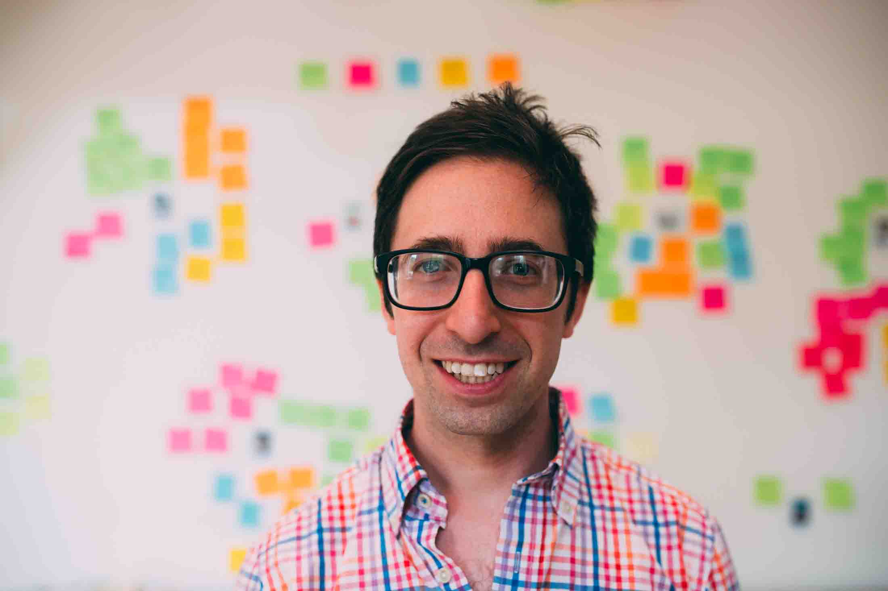

[Sam Hilton](https://www.linkedin.com/in/samuelhilton/) is the Research Director at [Charity Entrepreneurship](https://www.charityentrepreneurship.com/), the Parliamentary Coordinator at the [UK’s All-Party Parliamentary Group for Future Generations](https://www.appgfuturegenerations.com/), and a Research Affiliate at the [Center for the Study of Existential Risk](https://www.cser.ac.uk/)
In our conversation, we discuss —

- Charity Entrepreneurship’s plans for the 2022 [Incubation Program](https://www.charityentrepreneurship.com/incubation-program)
- [Exploratory Altruism](https://3394c0c6-1f1a-4f86-a2db-df07ca1e24b2.filesusr.com/ugd/9475db_a215cf49667a40f7aca07db9c10bd246.pdf) and finding new cause areas
- Lessons for longtermist policy and thoughts on the [Future Generations Bill](https://lordslibrary.parliament.uk/wellbeing-of-future-generations-bill-hl/)

##### Image credit: CSER

## Sam's recommendations

- [How to Launch a High-Impact Nonprofit](https://www.goodreads.com/book/show/60132743-how-to-launch-a-high-impact-nonprofit?from_search=true&from_srp=true&qid=46yedmRuQM&rank=1) by Joey Savoie, Patrick Stadler, and Antonia Shann
- [Epic Measures](https://www.goodreads.com/book/show/22693187-epic-measures) by Jeremy N. Smith
- [The Good Ancestor](https://www.goodreads.com/book/show/51107158-the-good-ancestor) by Roman Krznaric

## Resources

- On Charity Entreprenuership
  - [Test your fit](https://charityentrepreneurship.aidaform.com/CEQuiz) and [apply](https://form.jotform.com/220553894569368) to the incubation program! [Deadline: March 31, 2022]
  - CE’s [resources](https://www.charityentrepreneurship.com/ce-resources) for starting a charity
  - CE research [reports](https://www.charityentrepreneurship.com/research) on “top ideas to start in 2022”
  - IHME’s [Global Burden of Disease](https://www.healthdata.org/gbd/)
- History of global health prioritisation:
  - [Alma Ata Declaration 1978](https://en.wikipedia.org/wiki/Alma_Ata_Declaration) (where global health prioritisation mostly started)
  - [World Development Report 1993](https://openknowledge.worldbank.org/handle/10986/5976) (where the DALY was invented)
  - WHO’s [Investing in Health Research and Development Report 1996](https://apps.who.int/iris/bitstream/handle/10665/63024/TDR_Gen_96.1_pp1-34.pdf) (laid out prioritisation framework)
- On useful policy change
  - Founder Pledge’s [Evidence-Based Policy Cause Area Report](https://founderspledge.com/research/fp-evidence-based-policy)
  - And also “[On the perils of embedded experiments](https://www.ideasforindia.in/topics/miscellany/on-the-perils-of-embedded-experiments.html)”, which critiques J-PAL’s IGI
  - APPG Future Generations’ [Research documents](https://www.appgfuturegenerations.com/research) and [Impact Report](https://forum.effectivealtruism.org/posts/xX2JKae8GyzdY98Zn/appg-for-future-generations-impact-report-2020-2021) (2020-2021)
  - The [Kingdon model](https://www.policynl.ca/policydevelopment/pages/policymodels.html) of policy change and [Overton window](https://conceptually.org/concepts/overton-window)
  - [The COM-B Model for Behavior Change](https://thedecisionlab.com/reference-guide/organizational-behavior/the-com-b-model-for-behavior-change)
  - Lizka’s “[Disentangling Improving Institutional Decision Making](https://forum.effectivealtruism.org/posts/Ds2PCjKgztXtQrqAF/disentangling-improving-institutional-decision-making-2)”
- On longtermist policy
  - Sam Hilton’s “[A practical guide to long-term planning – and suggestions for longtermism](https://forum.effectivealtruism.org/posts/wyHjpcCxuqFzzRgtX/a-practical-guide-to-long-term-planning-and-suggestions-for)”
  - [GCR Policy](https://www.gcrpolicy.com/)
  - Training for Good’s [policy courses](https://www.trainingforgood.com/)
  - The [Effective Altruism Forum](https://forum.effectivealtruism.org/)
  - [The Bulletin of the Atomic Sciences](https://thebulletin.org/)

## Transcript

### Introduction to Charity Entrepreneurship

**Luca 0:06** 

Hey, you're listening to Hear This Idea, a podcast showcasing new thinking in philosophy, the social sciences and Effective Altruism. In this episode, we talked to Sam Hilton, who is the research director at [Charity Entrepreneurship](https://www.charityentrepreneurship.com/), the coordinator at the UK’s [All Party Parliamentary Group for Future Generations](https://www.appgfuturegenerations.com/), and if that wasn't enough, also a research affiliate at the [Centre for the Study of Existential Risk](https://www.cser.ac.uk/). As Sam's bio might make obvious, it is just really cool getting to speak to someone who is involved in both the near-termism and longtermism sides of EA. We begin the interview by talking about Charity Entrepreneurship, which is an incubator scheme to create high impact nonprofits. We talk about why there are these gaps to create new effective charities in the first place and how this compares to expanding [GiveWell](https://www.givewell.org/)’s existing stand-out charities. We then talk about the work that Sam and his research team do in going about to find these new high impact opportunities year on year. And then lastly, we talk about what it's like going through this programme as a participant. For listeners interested, Charity Entrepreneurship is currently recruiting for its new cohort, and the deadline to apply is March 31 [2022]. Topics this year range from road safety in lower middle income countries to meta charities like exploratory altruism. We touch on these topics in the interview itself, but if you want to find out more, we highly recommend you check out the Charity Entrepreneurship website and consider applying. Our interview then turns towards longtermism and we talk a bit about what this entrepreneurship incubator scheme might look like for longtermist ideas. We then talk a fair bit about Sam's experiences and thoughts on longtermist policy, and that includes a fair bit of discussion on the [Wellbeing of Future Generations Bil](https://bills.parliament.uk/bills/2869)l that is currently being discussed in the House of Commons. This is a topic that we’ll hopefully follow up shortly with another episode talking to Lord Bird who is the sponsor of this bill, but I think this is an interesting take to maybe listen to first. But for now, a big thank you to Sam Hilton for joining us, and without further ado: here's the episode.

**Fin 1:59** 

So let's dive in. So you are director of research at Charity Entrepreneurship. Sam, what is Charity Entrepreneurship?

**Sam 2:06** 

Charity Entrepreneurship is an incubation scheme for the charity sector. So let's say that you wanted to found a new charity to make the world a better place, you could come to us and we would help you do that. And applications for people to come found charities with Charity Entrepreneurship are currently open. So that's the sort of really short version of what it is and what it's doing.

**Fin 2:33** 

Cool. Let's do the long version now. So you mentioned applications for what I presume is the incubation programme that you run. So tell us about how that's structured. What kind of support can you get if you apply for that?

**Sam 2:47** 

 

So I work on the ideas team, which means that my job is to come up with ideas for the best things anyone could be doing to make the world better. And we tend to do this by choosing particular cause areas that we think are really important and then sort of diving deeply into those areas, listing hundreds of potential ideas and trying to find out the best ways to do good. And that gets turned into these reports that should guide any potential founders to start these ideas and make reality happen. We then reach out to people who we think can found charities, especially people who could start some of our own ideas, although people with their own ideas are also welcome to apply to the scheme. Bring in some really top talent, we have 1000s of people apply from all sorts of backgrounds. It's not just people who have run things in the past, we think lots of people can found charities, and they come into the incubation programme: eight weeks of solid hard work, like an in-depth training course on what it's like to run a charity, sort of Tinder for co-founders. I think these are all like different ways it's been described, you basically do a task each day with another person or two people, and that task will help you learn how to found a charity. So that might be a website for a new charity in a day, set up a co-founder agreement for your new organisation, work out like what country this particular project should focus its attention on using a weighted factor model. And you'll do this with like, another person or two other people in little teams. And by doing these tasks, not only do you learn a lot and you get feedback, but you meet people and potentially find people who would be willing to co-found an organisation with. That's the first five weeks and then in the second half you're matched with potential co-founders and ideas that you're excited about, people you'll be keen to work with and develop a more concrete plan for what your organisation could do. And this is then sent off to our seed funding network and projects tend to get grants, like up to, nearly $200,000 is probably around the biggest amount to get their project started. And then that's it, then you have a charity and you have some money, and you have a co-founder, and you can go out and make the world better. And we'll keep supporting you for the first year or two, but at that point, you are a founder.

**Fin 5:25**

 

Awesome. Well, maybe this is jumping the gun a little bit, but I'm curious to hear any success stories you want to highlight from the incubation programme so far?

**Sam 5:33** 

Yeah. Not every charity succeeds. There are successes and failures. But like one thing that I have learned since coming to Charity Entrepreneurship is just the charities that are doing well are amazing, like the people running them are amazing, there's just some really incredible work going on here. So, an interesting one, we did a report on lead exposure, and it causes 900,000 deaths a year, and a load of other negative impacts on the world. And the [Lead Exposure Elimination Project](https://leadelimination.org/) was a CE (Charity Entrepreneurship) founded charity. And within like a couple of months of starting a charity, they got the government of Malawi to make plans to get rid of lead in paint, protecting 215,000 kids. There's just an amazing start to something new, like, just within a year, like changing such a major part of world policy, and I'm super excited to see where they go next, because they're still, what, a year and a half old. So that's one story that excites me,

**Fin 6:59**  

That's one of the things that's gonna ask you about is how long should you expect to have to wait before you're, you know, really able to have a real legible impact on the world.

**Sam 7:07**  

So like I was running my own project, which we'll talk about later, doing work in the UK on long-term thinking, in policymaking in Parliament, and future generations policy, and I think it took about a year and a half until we had our first big policy win. And since then, there's been another one roughly every year or so, or maybe a bit more frequent than that. So it seems pretty achievable to be doing stuff fairly quickly, once you get started.

**Luca 7:44** 

I'm curious to hear maybe the other side of this. So when we think about entrepreneurship, I think it's often characterised as, kind of taking this like hits based approach, right? Where you get some like, really, really big successes, but you also get like lots of things that go to null, or, like failures, before you're able to get a charity or get a business that's really working and stuff. And I'm wondering yeah, like, what does that look like at Charity Entrepreneurship as well? Like, do you have kind of a failure rate of Charity Entrepreneurship, like cohorts? And what do like people learn from this?

**Sam 8:17** 

Two fifths of the charities have done super well, and maybe been the unicorns of the charity sector, potentially, like, in the direction of becoming the strongest charities in their relative fields. About two fifths progress but remain fairly small, or it's really hard to measure their cost effectiveness, and we just don't know. And then about one fifth shutdown in the first 24 months. Yeah, I think co-founders, like having a really good co-founder who you can work with, is important. Often this is an issue that can cause a charity to shut down. Circumstances changing - like in particular, a bunch of charities created just before COVID hit, like really struggled. They had plans and then they couldn't really manifest those plans, especially trying to work abroad. So yeah, it won't always go to plan.

**Luca 9:24** 

 

Two fifths sounds like an awful lot though, right? Or at least sounds a lot higher than I would kind of assume kind of going in and stuff - why is that number so high? Is that just because you select for like really good entrepreneurs or is it something just about Charity Entrepreneurship as a field itself? Like, yeah, why is it so high?

**Sam 9:46** 

I think - and obviously, I have some sort of bias here - I think the organisation just has an amazing process. Like we research and find really good ideas that we're fairly confident can drive a lot of change in the world, we recruit excellent talent, and we sort of put that together, and just the whole process seems like an effective way of driving change. Yeah, I would say as well, not everyone who comes on the incubation scheme necessarily founds a charity. So this is two fifths of the people who found charities - it's quite possible, you would join the incubation scheme and not create something. And for those people, we like, try and direct them towards something else. So a lot of people might come on the scheme and then end up at a senior job at a charity that's already been founded, may even end up working for Charity Entrepreneurship, or potentially, like getting a job elsewhere that we can recommend them for. So people often end up with their next step, but it's not always finding a charity. But those that found, a lot of them are successful.

**Luca 10:59**  

I'm curious to hear as well, like, I guess, the case for entrepreneurship more broadly. So I think like, lots of EAs, like when they think about global health and wellbeing think: well, okay, well, hasn't this kind of already been solved? Like GiveWell already has these standout charities that we know to be the most cost effective, right? Like, these are malaria, deworming, things like that. What is the case for creating something new that might not be on that list? Yeah, like why is that a high impact career path, as opposed to working for one of these existing charities or earning to give to one of these charities? 

**Sam 11:37** 

 

Yeah, so for an individual point of view, you can have more impact if you start something. Counterfactually less people are willing to start something new - it's a rare sort of skill to have or thing to want to do, so people don't do it. Charities can tend to hire good talent to work in those places but not necessarily find someone torun something that doesn't yet exist. So there's a good reason to found a charity. Imagine if like, Rob Mathur, who started [AMF](https://www.againstmalaria.com/), had just joined another charity and just been a senior person there - there'd be no Against Malaria Foundation in the world, and so his impact would have just been a lot less. So if we can have people who are aiming to create organisations that are going to be at the very top of their field, then that's worth doing. And then also, from a personal point of view, even if they don't, then that experience, so trying to create an organisation that's going to be at the very top of a field, is going to teach you a lot. It's going to be a really good way to move into maybe being in a senior role at an existing organisation, if that's the direction you want to go, if you don't quite have the same level of success as some of these existing charities. And then from a more theoretical point of view, like why have new organisations at all? Firstly, we don't yet know the best ways of doing good in the world, we're still exploring this. There's a lot of valuable information of being like, what can we find out there? So obviously, GiveWell recommends the Against Malaria Foundation. It recommends deworming. But these are both, like within the same ballpark of global health charities. We're starting charities that are working on policy change, such as affecting lead interventions, we're starting charities that do things similar to what GiveWell charities do but in a slightly different way. We're starting charities in other areas like mental health or health security. So like, yeah, there's so much to learn from trying this, and from these kinds of experiments. And then beyond that, there's different levels of cost effectiveness. And I think, although GiveWell charities are going to be the best charities that can absorb hundreds of millions of pounds, we may well be creating - at one end of the spectrum, we can create charities that are more effective than GiveWell top recommended charities but perhaps like with less ability to scale; maybe they'll never need more than a few 100,000 pounds a year and will never be GiveWell recommended for that reason, but might because they're driving policy change, be much more impactful. And then at the other end of the spectrum, potentially - and we've not yet done this - there’s scope to create charities that are maybe less effective than GiveWell’s top recommended but potentially have much more room to scale. So that's something that we might look at in future, so highly scalable organisations. So GiveWell’s top recommended charities fall within a certain range in terms of scalability and cost effectiveness, and there's opportunities outside that range. And then finally, I just think we're playing a part in creating a world where new organisations in the charity sector are created, can exist, can thrive. Like, this is how it works in industry. That's how the startup world works - we have new organisations, they do great things. And the best ones really do well, and the others don't, and there's change, and the top new organisations make the most money. And that doesn't necessarily happen in the charity sector, like the top charities in the UK have been almost the same decade upon decade. So having a system whereby new organisations can start and actually have a chance of thriving seems like a general improvement to the sector as a whole.

**Luca 16:02** 

So maybe to try and repeat this back to just make sure that I'm understanding it right. It seems that you're describing that there are just lots of different channels of impact. Like some of this is more on the meta end of just being able to build skills of participants going through which might be useful for whatever they go on to do afterwards, and just get to build talent, then this is other like meta angle of just finding new information. So when we think about evidence backed charities, right, like the emphasis on having evidence to do there, and often you don't have that evidence until people actually go out and try these things. Or at least it can, like update us in pretty significant ways to what we thought before. And then there's like on this, I guess, direct impact side, there are these two arguments. One, which is, there might just be loads of low hanging fruit - like GiveWell maybe looks at charities, which are really big in scale and can absorb lots and lots of funding. But that isn't to say that there are loads of smaller areas, which are neglected for whatever reasons, which are just as impactful, potentially, but just haven't been done yet because they're almost like, too small as areas for like big funders to care about, but should be cared about by individuals looking to have an impact. And then there is this thing of like, well, maybe these things can scale and they can compete on this end. And this field is still new. And it's still worth trying out new things in this kind of competitive landscape that you said. Does that sound about right as like kind of summarising what you said there?

**Sam 17:29** 

Yeah, that sounds about right. I would add as well, that we start charities beyond just the kinds of things GiveWell would recommend, like working on meta organisations or working on policy, or working on mental health. So there's another reason on top of that.

**Luca 17:53** 

Right, right. Yeah, that's a really important point, like different criteria for success beyond maybe, like, DALYs [Disability Adjusted Life Years], and what have you.

**Fin 18:00** 

I just want to pick up another thing, you mentioned Sam, and try saying it back as well because maybe I'm getting it wrong. But you said something like, look, for profit companies, they turn over and, and just fail more often than nonprofits. And the reason’s pretty obvious, right? It's like, if you're not making money, that's a really clear signal that you might be better off just trying something else. And you just can't sustain what you're doing right now. That's unlike in a nonprofit world where perhaps there are occasionally fewer really strong signals that what you're doing is less good than something else. And so it's easier to sustain a nonprofit for longer. For that reason, you get lots of startups, new companies in the for profit world to like, enter into the other end of that turnover, just because they're like, you know, there’s a big kind of vacuum, when companies fail. But if there's less of that in the nonprofit world, you’ve kind of got to realise that you've got to do that yourself and like, make those startups happen on your own and just recognise that there's like a big opportunity there, which isn’t naturally going to get filled with like incentives from outside or something. Does that roughly make sense?

**Sam 19:01** 

 

Yeah, I don't know what the ideal amount of startups to lead to like a really functioning ecosystem where, like, really good organisations exist. But I think the charity world does seem quite stagnant. Like the top charities mostly thrive based off their brand, not based off the impact they demonstrate they have. And they mostly remain just the top charities and there's not a lot of chop and change. Hopefully, the effective altruism community can change that through a combination of donating based on like actual impact and effectiveness, and through creating startup charities that have at least some chance of thriving and doing really well and potentially being better than the current top charities. And that ecosystem seems like a really valuable thing for the world to have within the charity space.

**Fin 19:58**  

I can imagine it could seem a bit callous from some perspective to say things like, ‘Oh, I think the you know, the optimal failure rate for nonprofits should be higher from an altruistic perspective’. But also, that's not a crazy thing to say because one read on what you're saying there is, ‘look, I just think there are so many like far better things that could exist, like we could do even better than this. And if that involves like, taking some people from existing nonprofits and moving them into like, newer things, and just trying lots of new things, that could be great, too’. So I guess, yeah, it's worth just appreciating this isn't necessarily like a kind of extremely cold hearted thing to say.

**Sam 20:37** 

 

Whenever I've been running a nonprofit, I've always had in my mind that the aim of what I'm doing should be to close down. There's a problem I'm trying to solve. And I want that problem to be solved, and when it's solved, there should be no need for what I'm doing to exist. Like that's, like what nonprofits should try and do. And ultimately, we as a world have limited resources. And I don't think it's cold to say, we need to make sure that those resources can do as much as possible, we need to help as many people as possible, we need to like care enough to have this kind of like ecosystem where difficult decisions are being made, because that's what's needed to do as much as we can do, and care for the people that we can care for.

**Luca 21:27**  

I wanted to add in this question around how you understand GiveWell and stuff, and maybe one way to frame this is - you mentioned before, like shifting from like charity brands to actually looking at, like what impact they're doing, right? And GiveWell seems like a really good example of like, changing this broader conversation around charity towards them. But then also on this point of like, bigger versus smaller opportunities, as well, as I understand it, right, GiveWell makes these like top standout charity recommendations, but they also have this thing called ‘the Maximum Impact Fund’, which does also fund right like a lot smaller initiatives and a lot more opportunities that happen to appear right, like kind of year from year and also includes these smaller things, which, if I understand it right, like might also include some of the areas that Charity Entrepreneurship is looking to explore.

**Sam 22:13** 

 

Two of our launch charities have received GiveWell grants to date. And we think that one of our charities - [Fortify Health](https://www.fortifyhealth.global/charity-entrepreneurship.html) - has a chance of becoming a GiveWell incubator charity. So yeah, we do create charities that get that funding, and I think that is valuable. And I think that GiveWell’s top recommended charities are restricted to being charities that can absorb a certain large amount of funding, and you will find things that are more effective in terms of cost effectiveness for the world if you remove that restriction. And often those things will be smaller and harder to scale, but potentially having a much greater impact per dollar put in. So making sure that those things exist and are well funded should be something that the Effective Altruism community focuses on. And I think there are opportunities for smaller donors, in particular within the community to find those smaller projects that are perhaps even more cost effective than the most well known recommended projects and help them thrive. Yeah, and also, the other thing about GiveWell is it’s still, like very much focused on global health type interventions. So there is less focus on other areas that we might put our attention towards.

**Fin 23:53**  

So I have a fairly vague abstract question, which is something like: imagine there being concentric circles when it comes to charity ideas. And the innermost smallest circle is ideas, which already have orgs doing like awesome stuff about them - so, deworming, bed nets, food fortification - and then that lies inside a circle where we kind of know about a pressing problem, which really should be being addressed right now, but we haven't quite set up an org to address it. And then like the enormous circle that both of them lie inside is just the space of kind of possible charity ideas that we haven't quite hit on yet, or that we've only just started looking at. And I guess I want to get a sense of how big you think those circles are relative to one another. In other words, just how big is the space of like unexplored territory here? And I guess what drives that is how much time should we be putting into mapping out that territory getting the value information, over just pumping resources into, like existing orgs. Does that make sense?

**Sam 25:03** 

Yes. I find it quite hard to answer because the challenge with the unexplored territory is exploration is more difficult than the things that are in the explored territory. We've explored the areas that are easiest to explore, and the further you go out from your circle, the harder exploration becomes. But I certainly think that the unexplored space is really large. And I'm super excited to see organisations doing new things in this space. I think on topics like mental health, health security, meta science, governance reform, there's all these like, areas that might be, like, really, really impactful for the world, especially over slightly longer timescales. And we have just the like, only the faintest idea of how to even explore these areas and like, what to do in them. But I think like starting things, and seeing what could be created is important, and like learning as much as we can, as we go.

### Generating charity ideas

**Luca 26:29** 

Awesome, I would love to maybe now delve into more of this process that you're involved in in coming up with, like, what potential ideas are actually really promising for Charity Entrepreneurship. And as I understand it, this kind of begins with coming up with a really long list of like, potential cause areas. You know, maybe it's been described as this, like unexplored space. Yeah. Can you walk us through this? Like, what goes into this? And how do you think about brainstorming these ideas?

**Sam 26:57** 

Ideas are fairly cheap, I think it's pretty easy to like, add ideas to a list within a particular cause area. So let's say we take a topic such as mental health, we can then start listing, doing a bit of background reading, just listing ideas that we come across, we can have team brainstorming sessions, and then we can invite other people - and we do invite other people to like add ideas onto the list. And pretty quickly, we find that we have a list of ideas, it's like about 200 plus ideas. So we did health policy recently, I think that was like 300 and something ideas. We're doing health security now, and that's like coming up to 200. We've just done animal welfare, and that was about 250 ideas. And we kind of time cap this. So we don't want to keep earning ideas forever, because we should start moving on to prioritising them. So at roughly 200 to 250 decent sounding ideas, we sort of stop at that and start trying to work out which of them are best. And then in terms of working out which are best, it starts with quite an intuition based decision making process to pull out the top 50. So different people in the team will go through the ideas list, and score them based on how likely we think they are to become a top charity. And then we will sort of compare independent scores and discuss and do little bits of background reading for each 200 or so ideas, until we've got a top 50. And then after that, it's iterative sort of processes where we start with like, a two hour research per idea, and move up in terms of amount of time put in until we're writing 18 hour reports on the top sort of five to 10 ideas for a particular cause area.

**Fin 29:19**

 

Cool. One question that comes to mind is: so you've got this super long list of ideas, and one thing you can do is just go through each one and form like a kind of 30 second prior on how promising you think it seems. I am curious, how accurate do those quick takes tend to be, like how much do they tend to line up with what you ultimately think is most important or are there often lots of surprises and counterintuitive results once you put in the time to really systematise the research?

**Sam 29:48** 

Yeah, so it tends not to be a 30 second quick take as much as a ten minute quick take or five minute quick take, but relatively accurate. Like obviously the sort of bottom chunk of ideas that we don't recommend, we'll never know if there were some gems in there. And I'm sure there are, I’m sure that like, of the 150 ideas that don't make it there will be some things in there that we definitely should have passed. But of the like, top 50 ideas, yeah, the scores do somewhat correlate with the things that we recommend. Not always super strongly, there's always a few things that get to the very top of the list that were fairly low down on like that initial scoring.

**Luca 30:42** 

 

And what kind of heuristics do you use, like for these, like, as you said, kind of 10 minute like documents and stuff? Like what would strike you as a more promising cause versus a less promising cause?

**Sam 30:54** 

So this is for sort of interventions as opposed to causes at this point. We're thinking about whether a small charity created by CE staff could practically implement the idea. We're thinking about the quality of evidence we'll be able to find for the idea. We're thinking about whether it's neglected, and it's likely to be that there is someone or there isn't someone currently doing this idea. We're thinking about risks - so is there some chance this idea has a bunch of problems or causes suffering as well as preventing suffering in some way? We think about scalability, is this idea actually something that could be scaled into a really big project? Or was this like a small problem in a specific area? And I guess, of course, expected impacts like, will this idea make a lot of change in the world?

**Luca 31:58** 

Yeah, yeah. And are there any useful resources to flag? So for example, like the [Global Burden of Disease database](https://www.healthdata.org/gbd/2019), I know is a really, really useful resource to get like, kind of a big picture overview of a bunch of different causes. Are there other things like that you might want to plug? Or, yeah, say this is a really useful resource to make these judgments?

**Sam 32:18** 

Yeah, the Global Burden of Disease database is really good. In global health, in health and development more broadly, we've got some good sort of prioritise lists from organisations such as [Copenhagen Consensus](https://www.copenhagenconsensus.com/), that have like, a lot of ideas that they've researched, and some of their work has been useful. And in animal welfare, we have a welfare point system that we've developed, which is helping us sort of assess and categorise ideas. I would also say having a theory of change for the space you're working in is useful for making these quick judgement calls. So for animal welfare, I spent some time before diving into this mapping out, like, what is happening in this space already? Like, what's the theory of change? What's the thing that like actors here are trying to achieve in different ways in different countries? What comes first, what comes second? Like at what point do we want to drive policy change versus corporate change? How important is an individual changing their diet in this like, grander picture of things? And then having that high level picture can help quite a lot with narrowing down on the details.

**Luca 33:48** 

 

Yeah. One thing I'm curious about that you kind of touched on there before as well, was that what might look like a good cause in the abstract might look different from what is a good cause or like intervention for Charity Entrepreneurship specifically. And yeah, I'm wondering if you can maybe talk a bit more about the specific features that mean that entrepreneurship, or especially this one or two person co-founder model is particularly suitable for this cause as opposed to not? Like, what kind of features might these causes have?

**Sam 34:19** 

 

Yeah, so there's a bunch of small idiosyncratic things that always play a role, like, ‘oh, we started a charity doing something very similar last year, so maybe we should wait a year before starting something else in this domain so we have more information.’ Like this kind of like, little like, quirks of just our process and what we're doing. I think a big factor is how likely we are to find a co-founder to do something. So when we've been looking at animal welfare, we've been thinking about trying to improve coordination in some aspects of the animal movement, but the co-founder to do that would need to be someone who was already known and trusted and respected within the animal movement. And then that obviously is quite a high bar for us to find that person. So yeah, we tend to think about who could do it and what skills they need and how many people like that apply for the incubation scheme. And beyond that, we're not too picky. There are certain things that do seem relatively intractable, but we’re kind of optimistic about what a small dedicated organisation can achieve.

**Fin 35:36**  

Yep. Okay, so right at the end of the research process, you come up with these final in depth research reports. Can you say something about why you make them, and what does the process look like as well?

**Sam 35:51** 

They're made, firstly, for our decision making, so that we can narrow down on the very best ideas for new charities. And then every other aim from that is secondary. They are also made for the new charities so that when someone comes in to start something, they've got a bunch of guidance there on, like, what to do, who to talk to what the evidence for different kinds of interventions within this broader intervention looks like, what kind of countries it might make sense to work in, the kind of pushback that they might expect to get and like how to handle that. And we do like, sort of follow up implementation reports with further information for the co-founders to like, really help them, get their feet under them and get running and starting these projects as quickly as possible.

**Fin 36:48**  

They do also seem like just public goods for the rest of the world because they're public, right?

**Sam**

Yeah.

**Luca 36:55** 

Yeah. I guess on that point, have you ever thought about writing reports on why you chose not to go forward with a cause? So either, right, kind of in this public good sense to make clear why you think certain areas aren't tractable or aren't neglected and stuff that still informs other actors in this space? And maybe a step further from that as well, making clear what things in the world need to change in order for certain cause areas or certain interventions to become more high impact and stuff? Does that make sense?

**Sam 37:28** 

Yeah, totally. We have some upcoming reports on our website on this, so keep an eye out on our research. It's just where it's not as urgent or not a priority, like it does tend to happen when there's like time and capacity for it to happen rather than immediately at the point where the research is finished or something like that.

**Luca 37:52** 

Yeah, there's maybe like - I'm sorry for like, kind of banging on this - I think it's just a really interesting point that I think lots of orgs are kind of struggling with. But it seems almost that you just want to think about different formats that you can put out this information in a way that is less time intensive and maybe reputationally linked, like a report on a website is. And I don't know if the solution is a Twitter thread or a Google Sheets or an EA forum post or something. But in many cases, the work has already kind of been done, right? Where you get to the point that you realise that the decision consequences to not go forward anymore, and all the information that was used to inform that decision has presumably already been collected as such. And then it's more of a messy like notes brain dump or something rather than having to write out a big report, double check everything and do it as such, right? Like just getting that information out for the next person to take it on from there seems valuable.

### CE recommended charities — quick fire round

**Luca (continued)**

We've now talked about the ideation process and how you come up with the recommendations for charities that you would be really excited to set up each year. And I think this year, if I'm understanding it right, you have got five causes that you're looking to get people excited about in the incubation programme. So I thought it could be fun to maybe do a quick fire round, and just quickly hear the elevator pitch for each of these. And who knows, maybe listeners will be excited about one or even more of these and think about applying. Does that sound good? 

**Sam 39.23** 

Yep, let's do it. Awesome.

**Luca 39:24** 

So the first one is road safety.

**Sam 39:29** 

So lots of people around the world die or are badly injured in traffic accidents. It's a huge burden of disease and suffering, and it's fairly preventable. We know the kind of policies that stop injuries, such as seatbelts and speed limits. There's lots of countries that have these policies, and there's other countries that do not. And we think a new organisation working in some of those countries that don't have road safety policies, advocating and building support for them could be a really effective way of saving a lot of lives at very little cost.

**Luca 40:12** 

Awesome. Yeah, one factoid I have here - I don't know if you've looked into this - but the kind of path dependency between seatbelt laws and stuff in the US. So this was, I think, a topic that became very politicised in the late 1980s along this idea of the government telling you to wear a seatbelt, and is that like an infringement on your freedoms or not? And I think one state in particular, New Hampshire, kind of, like kept with this line still today, where they're not making it mandatory as part of their ‘Live Free or Die’ mantra, and seatbelt use there is I think 70% compared to the nationwide average of 90%. And that just strikes me as one of these weird, yeah, path dependency things where policy regimes either choose one way or another, and it has really big consequences, even within the same country. So I think I'm aware that this is mostly in low income countries, and what have you, but I thought it was cool, right, that even in the US, some states have taken very different paths with, like, big consequences for yeah, like road accidents and road safety.

**Sam 41:16** 

Yeah, really interesting. 

**Fin 41:18** 

Yeah. So second example is taxing tobacco.

**Sam 41:22**  

Yeah. So tobacco, and smoking, in particular, are a really big cause of health burden and disease. As far as we can tell, the most effective and cheapest way to reduce tobacco use is for higher tobacco taxes. And we'd be keen to see a new organisation doing more work in this space advocating for tobacco taxation.

**Luca 41:58**

Awesome. Third intervention, I think, is aid quality advocacy.

**Sam 42:03** 

Yeah, so lots of countries provide aid and development funding to other countries to help them grow, to address big issues like global health and development, diseases and so forth. This money is not always given particularly effectively; there are many competing factors the politicians will take into account when this money is given. And more organisations advocating for making sure that those resources do the most good for the greatest number of people and are given towards particularly like evidence backed approaches towards doing good could be really important for changing how that money is spent. And that's billions of pounds from governments given in aid every year. So small changes in effectiveness could have a really positive impact on so many lives around the world.

**Luca 43:16**

 

I guess one question I have, on this intervention in particular is: the case for importance seems really clear, but I'm wondering around the neglectedness of this issue. So I know there are lots of orgs already, like advocating for more foreign advocacy or for better, as like for more foreign aid or better foreign aid, like the [Centre for Global Development](https://www.cgdev.org/). Where are the entrepreneurial pieces or like gaps that you are looking to fill?

**Sam 43:45**  

Yeah, so it really depends a lot on the country. So the Centre for Global Development has a particularly good reputation in the UK and in the US, and it's doing some good work there. But even in those spaces, perhaps only does certain kinds of activism and campaigning. So it will focus on being a reputable think tank and won't necessarily be actively gaining public support for policy change or anything like that as an approach. And then beyond the UK and the USA have less effect. There are other organisations. But each country has their own sort of idiosyncrasies and culture where there are gaps. So there seems to be gaps for organisations particularly focused on evidence in Germany, it seems that there are a lot of aid being currently given by India, but not necessarily a focus on effectiveness there. So if you look at the report, we sort of go through the different ways that aid could be improved in some like specific countries, where we think it might be tractable to focus on for each kind of way that aid and development spending could be better done. So it really depends a lot on the country to country.

**Luca 45:14** 

Awesome. Fourth intervention to ask about is postpartum family planning.

**Sam 45:18** 

I didn't actually write this report. So this was before my time, I don't have strong views on this. But I have been interacting with our previous family planning charity - [Family Empowerment Media](https://www.familyempowermentmedia.org/) - and they just seem to be having a really big positive effect on the world. We think just in terms of lives saved, their work seems at or better than sort of GiveWell’s top recommended charities in terms of effectiveness so far. And then beyond that, how much you value the space might depend on your views on population ethics, and things like that. But I'm definitely excited by the work I've seen in this space so far. Although I can't speak for the specific idea or the research behind it.

**Fin 46:14** 

All right, left as a question for the listeners. I guess the last example here is what you've called exploratory altruism. What do you mean by that?

**Sam 46:22** 

So, this is a meta charity, trying to look at and make the case for new cause areas and new ways of doing good that the Effective Altruism community might not be looking at. So I imagine this organisation would be a small research team, vaguely producing reports to try and influence and improve how people around the world have an impact in various cause areas. So this could be looking at topics such as meta science, or preventing democratic backsliding or governance reform, or pain and suffering or mental health or all these other cause areas that maybe are not necessarily looked at yet within the EA community, and trying to map out the space, the opportunities, the possibilities for doing good, and then use that to try and drive change in some way, whether that's through making actors in that space more effective, or guiding people in the effective altruism community who are already in that space, or trying to shift some of the funding that this community has towards new ways of doing good.

**Fin 47:51** 

 

So is the idea here that, sure, there are a lot of EA orgs that are looking into relatively well mapped out cause areas. But what we want is an org to activate like scouts, you know, and like run ahead and just map out all the areas that the rest of EA writ large, hasn't quite kind of looked into yet, just so we could just, I guess yeah extending this map analogy, just so we can kind of look a bit further and see what we're potentially missing. And the idea is that maybe that kind of highly exploratory research is currently a bit under-provisioned?

**Sam 48:26**

Yeah. I think it's extremely under-provisioned. I got involved in the effective altruism community about 10 years ago. And people's focuses then were on global health and animal welfare and AI risk. And I remember having these conversations at the time where people would be like, ‘but how do you know these are the most effective things?’ And I'd be like, well, we don't and this community is like, a few months old, we're just trying to figure this thing out. And we're gonna do so much more research, and we'll definitely find things that are more effective than this. And then here we are 10 years down the line, and that research into other cause areas has really not happened - no one seems to be focused on this. So, super keen for this exploratory work to happen. Because I'm not convinced that these are the best things out there that anyone could do. I'm not convinced that we shouldn't be focused on global stability, that we shouldn't be focused on preventing people going through extreme pain or torture, or like finding ways to mitigate the chance of wars. And I'm not sure that anyone else is, and certainly a small research team spending some time looking into this seems like a really valuable thing to have in the world.

**Fin 49:48**  

Yeah, I think I'm inclined to agree. Obviously, I've been around EA for much less long than you have, but what you said resonates with me. At the same time, I'm confident this is not a problem with people's attitudes within EA. Like, I'm sure that almost everyone will just nod along and be like, ‘Yeah, totally, we should be exploring, like a tonne of weird new things that no one else is looking at.’ So it's not like people will just disagree. It's just like, I guess we haven't followed through on that commitment, if it is the case that this kind of exploratory stuff is under-provisioned. I guess I'm wondering, what's your story about why we haven't really got around to that thing yet, like what's going on?

**Sam 50:31** 

I think there's a lot of really good things in the world that we have not got around to yet. We're like a really young community, and this is a hard thing to do, to make the case for these new cause areas. So it doesn't shock me that it's not happening. I think perhaps people are a bit too keen just to stop and focus on the area they think themselves is most effective. So like, once you start doing a bunch of research, you find an area you think’s effective and you start working there, it doesn't necessarily leave a lot of people in that space of uncertainty and like, ongoing willingness to explore. So super keen to find those explorers, those doubtful people with like a hint of uncertainty in their hearts who can go out and try and map out the world in ways that are not currently happening.

**Fin 51:29**

Yeah. I guess some of it is like giving people permission to do that. I think everything you said is especially true in longtermist EA, where this chunk of EA is newer than a lot of EA, and so it's been mapped out much less. I'm sure we've missed a lot of really promising ideas. But I wonder if there's a tendency to kind of over defer to what feels like the consensus and maybe get this false impression that longtermist EA is more confident about the best things to do than in fact it is, where in fact, I think there's just there's a very kind of wide uncertainty about what the hell we should be doing. It's just very hard to communicate that. So yeah, I'm kind of pro more loudly and transparently communicating how hard this stuff is to find the best things. It's not like an embarrassing fact right? The world is a complicated place.

**Sam 52:30**

Yeah, I completely agree. I think it's great that there’s people who are like, ‘no, I want to stop exploring, and I want to start having an impact on the world.’ And that's like, wonderful and go them. But should there be like, some, focus exploration team looking at this? Yes. And that's sort of the case for us recommending this as a charity idea. And yes, I do think it's beyond just cause areas. I think there is useful research to be done on different approaches to cause areas, like to what extent can we drive change by shifting the policy world? To what extent can we drive change by shifting how corporates function? Like how valuable are these approaches?

**Fin 53:17**  

Well, in the spirit of being open minded, but not so open minded that our brains drop out, I was curious if you could describe some ideas that you looked into and ultimately rejected.

**Sam 53:30** 

There's a lot of ideas that got rejected, like very early on in the decision making process because, you know, we spent 30 seconds looking at them and think ‘that's a terrible idea.’ And then some of the ideas that we like researched in more depth, but didn't recommend include things such as, let’s see, advance market commitments for health care, improving air quality, perhaps with changes to cars and addressing traffic pollution. We did look into - this is an interesting one - improving air quality by having satellite monitoring to improve enforcement of pollution from really large polluters. And I think the report on that should be up fairly soon. And it seems quite promising. Maybe we'll recommend it in future, it just is the case that for now, we couldn't reach a conclusive view on whether or not the current satellites that we could access would have good enough data for this to work. 

**Luca 54:47**  

Well, maybe let's move on and zoom out of these specific interventions and just talk about Charity Entrepreneurship as a whole again. I think one thing that just strikes me from this conversation is this just seems like a really cool process. And maybe we should just have like, lots more like this. And one thing in particular here is that, as you said, Charity Entrepreneurship looks at wellbeing beyond maybe just like the GiveWell DALY like health interventions approach, but it's still like, from the ideas you've kind of listed here, maybe falls squarely in the like neartermist side of EA than the longtermist side. And I guess one resulting question is, should there maybe be a Charity Entrepreneurship for longtermism too? And I know, this is a question that's kind of already been discussed and such. But yeah, I'm curious to hear your take on that.

**Sam 55:36** 

Yeah, I totally think there should be. Charity Entrepreneurship, does focus a lot more on near term and animal welfare interventions. I personally think as an organisation, we should be willing to look beyond that, and look at a whole range of other interventions, including preventing existential risks. But if we're not going to do that - and we are going to look at some things that cross that border, so we are looking at health security, including biosecurity at the minute. But yes, I think, given the hesitancy of Charity Entrepreneurship to do that work, I would love there to be a longtermist Charity Entrepreneurship out there in the world. I think, to date, there has not been, there's just been a lack of interest in making this happen, or a culture of like, ‘let's do research first in longtermism before we actually like to do anything.’ And I think that's perhaps throwing a barrier up towards anyone in this space really getting things started. And to some degree, that creates a bit of a culture of inaction of ‘oh, well, you can maybe do this, but maybe we should just do more research first,’ means that you never learn by doing. And to some degree, there's been a lack of funding. So I know like maybe half a dozen people who have applied with, like what on the outside seem like fairly reasonable sounding policy, entrepreneurial ideas to like the long term future fund and just not getting funding. Because just the bar for proving these things are definitely good has been very high. This may or may not have been justified. But I do think it's changing. I do think that the [Survival and Flourishing Fund ](https://survivalandflourishing.fund/)and the new [FTX Future Fund](https://ftxfuturefund.org/) seem more willing to fund stuff than we've seen in the past. So I think that might drive people to actually do things, which I would be super excited about.

**Fin 57:49** 

One question is, how else is longtermist entrepreneurship likely to be different from the kind of entrepreneurship that CE helps support?

**Sam 58:01**  

I think it depends. We have, for example, supported EA meta entrepreneurs, and I think probably that's like the closest analogous case. So if anyone’s wanting to try and start longtermist entrepreneurship organisations, I think coming to do a case study of what we've done on EA meta and how it's worked and how it's not worked would be really interesting. I think we have found EA meta to be a slightly more challenging area, our success rate on those charities - still hard to tell, it's early days. But like it's at least harder for us to track the impact of them. And that's probably expected, like they are harder to track the impact of meta organisations. But I think in the longtermist space, there might be a whole bunch of organisations that people create without being able to track the impact particularly well. So we currently have a, like, fail rate, I could imagine longtermist entrepreneurship, like having organisations that just don't fail, because you know, there's no impact measurement. Yeah, so I think that's one difference. I do think there can be impact measurement, I do think on policy stuff you can measure the impact of what you're doing and track the changes you've driven. And I think in terms of like, neartermist policy and longtermist policy, it would be pretty similar. It's just like the specific policies you're advocating for that are different. But you could track the impact of those organisations in pretty much the same way, and it would match a very similar pattern to what we've done.

**Luca 59:49**

Well, one thing I kind of want to pick up on here as well is, it sounds before what you were saying with people applying with specific charities or interventions in mind, like struggling to get funding. That feels a bit still different from I guess, like the pitch for just like, an organisation like Charity Entrepreneurship, whose job is to vet these kinds of like, interventions and charities and then come up with a shortlist that they are excited to get funding and stuff, right. Like there feels like a difference between applying to existing funds with, like concrete proposals versus this, like, in some ways, Charity Entrepreneurship is a meta org, right? And that it’s just like, it’s job is to generate these like good ideas and stuff, maybe just having a longtermist org like that seems like a lower ask to try and create.

**Sam 1:00:38** 

I totally 100% think there should be that kind of organisation. I think just throwing out ideas and asking people to apply for them is not sufficient. For example, in the animal welfare space, the animal welfare fund often does requests for proposals, throws out ideas they want to see happen, and the traction and pick up of that is really low. But at the same time, Charity Entrepreneurship can start a whole bunch of animal welfare charities. So like having that, ‘here's an idea, here's the support you need, here's the co-founders, here's the funding’ all rolled into a simple package does make quite a big difference. So I think that's one thing, I just think people are much more excited by being taken through that process, and you will just get much better talent from having that. And then the second thing I think is about prioritisation; FTX Future Fund have a list of ideas. There's maybe 30 ideas on that list. Having skimmed the list, I think, given the broad range of topics it covers, you can maybe pull a list like the ones that we pull together of like 1000 ideas that seem roughly in that kind of ballpark. And without any sort of rigorous prioritisation, you will get organisations starting projects across so many different things. And, like, what we do is prioritise before organisations get started. So I think that's a mistake that I could imagine longtermist entrepreneurship making, or people trying to start, like charities in the longtermist space making, is just failing to prioritise across the like, many, many hundreds of possible good ideas that are out there.

**Luca 1:02:24** 

Yeah, yeah, that makes sense. I think also maybe to pick up on this FTX Futures point I think they posted, or they posted a call for like, more ideas as well, right beyond the 30 ideas on the website and it got a lot of traction, right, like on the forum, with lots of comments and lots of ideas. Yeah, I think I broadly buy the argument that the shortfall is not that there aren't enough ideas out there to do in the real world, like, on the longtermist side. It is, as you said, like, maybe prioritising amongst these ideas, or being able to evaluate these ideas, to see which ones are worth doing.

**Sam 1:02:59** 

On that call for ideas. I didn't enter the sort of forum post competition, but I did email FTX Fund maybe like 350 or so ideas I had listed, relevant to the things that they were looking for. So there are a lot of ideas out there.

**Luca 1:03:21** 

Yeah, no, and yeah, that's exciting. I think also, like the point around information value and stuff feels really important. Whether it kind of cuts both ways, where on the one hand, you would imagine that information is in many ways even more valuable on the longtermist side because there's less information to begin with, where learning by doing might be even more important. But on the other hand, it's maybe harder to interpret, send feedback or get these feedback loops. But yeah, I think that as a whole it just feels like a really exciting space to see more people evaluating prioritising and then also just doing in the real world. Yeah, let's maybe return back to the incubation programme for this year with Charity Entrepreneurship itself. And I guess one question to maybe ask here is: what makes for a good charity entrepreneur? Or what type of people would you be excited about seeing apply?

**Sam 1:04:16** 

Well, first thing to say is, if anyone is interested, there's a [quiz](https://charityentrepreneurship.aidaform.com/CEQuiz) on the website where you can go and do it. And this should tell you whether or not you would be a good fit for the programme. And applications are open until the end of March, so I really strongly encourage people to go and try the quiz and apply for the programme and find out for themselves that way. And I mean, the really short answers to what makes someone good at starting a high impact charity is: being good at starting things - so entrepreneurial, resourceful, committed, and independent, and then being high impact and impact focused - so someone who's really dedicated and driven to do the thing which will have the biggest effect, to be willing to change their organisation and what they're working on based on what the evidence says, and to try and achieve as much change as possible. So impact focused and entrepreneurial are sort of top of my list of things for starting an impact enterprise. 

**Luca 1:05:28** 

 

Yeah. I'm curious as well. Like, how does imposter syndrome and stuff like this feed into this as well? Because when I think I hear like, ‘oh, you need to be like, entrepreneurial, or you need to be really high impact focus and stuff’ that kind of like is, in some ways a call for excellence, which maybe is just justified but I'm curious of like, yeah, if people are listening to this, and are not entirely sure if they fall under this bucket or that bucket, if they have enough experience or not, like yeah, like what -

**Sam 1:05:57** 

\- So we really don't judge that much based on experience. Like, obviously, it helps, but we have had people who are like recently out of university, we do get a really broad category of people on the programme from all around the world, lots of different backgrounds and countries. It is competitive, there are lots of people who apply to get on the programme. But we think that lots of different people with different backgrounds can create this, create really good charities, and we have an application scheme, and if people are straight out of university and they apply and they do well on the application process, then they will get through and they will get onto the programme. And half of our most successful founders from previous years didn't think they should apply. Like we did, if you're not sure, it is worth people applying. Talent is everywhere. And there are some really good people out there who could do amazing things, and I would highly encourage them to give it a go and take the quiz and apply for the programme.

### Longtermist policy and the APPG

**Fin 1:07:18**

 

Alright, so let's switch gears a bit and talk about longtermist policy. So another thing you've done, Sam, is you helped set up the ‘All Party Parliamentary Group for Future Generations’ - APPG. First of all, can you just tell us what that thing is and what does it do?

**Sam 1:07:37**  

Yeah, so the All Party Parliamentary Group for Future Generations is a group within the UK Parliament, so a collection of MPs, members of parliament and peers, members of the House of Lords who are keen to address the issues affecting the future. So in particular, like political short-termism potential, like risks to the future - be they climate or pandemic or other - and any other issues focused on sort of the long term, on like preventative policy, on intergenerational fairness, and so forth. And I didn't create it - I was involved from the very early stages, but it was set up by a bunch of students who believed that there should be more focus on future generations.

**Fin 1:08:44** 

Super. Can you say a bit about what APPG is currently working on?

**Sam 1:08:50** 

Yes. So we have an inquiry that we've been carrying out into how to ensure that policymaking works for the long term, and that's been like a two year project, and we hope to have that finished in the next month or two and up online. And then after that, we will be thinking about next steps - what the policy recommendations are on that, and if any of our parliamentary members want to take action to drive forward any of those policy recommendations. We also are doing a little bit of international work. So working with the UN and other countries, we'd be doing a bunch with Ukraine recently. And thinking about organising a series of events on like long term thinking in policy making around the world. And there will be events in Parliament, we'll try and get some members of parliament there and also get some other people from around the world to attend and hopefully try and create similar type projects to our project in other countries. There's also a Future Generations Bill going on. So there's an ongoing campaign for that. And we've been supporting recently one MP to do some work in his local constituency, to try and find out what his local constituents want for the future. And we think that's like an interesting experiment, and we’d be keen to see more things like that happening, where people are, like working with small groups of citizens to understand what their needs are for the future and see if they can make that evidence have an impact in their own sort of policy decisions for local areas, as well as obviously, at the national level.

**Luca 1:11:05**  

So I guess one thing that strikes me from from kind of hearing about this, is this seems to be maybe a way of kind of promoting longtermist policy kind of like, broadly, it seems to be a lot around promoting general concepts like future generations and long term planning and what have you, which maybe looks different to promoting like specific interventions around AI or bio risk, and the like. Is that a good way of characterising maybe the work that APPG is doing or how you yourself, maybe think about, like, longtermist policy and the like, or yeah, like what the differences there are?

**Sam 1:11:44**  

Yeah. So the way in my own decision making that I think about it is trying to do a bit of both. I would say, in policymaking, you're often finding various opportunities as and when they come up and capitalising on those. So sometimes, we will have supporters or parliamentarians who are really keen on a particular topic, or people who want to speak to parliamentarians on a particular topic, and then we'll focus on that topic. And that could be anything from how to make sure that education works for the long term to how to make sure that our energy grid is robust to failure to how to prevent pandemics. So yeah, for my own decision making, I've kind of split into two goals. One is to try and make sure that in the next 10 years, the UK becomes a world leader in resilience to extreme risks and is championing those risks globally. And the other, and that's quite specific to a particular subtopic, of like risk focus that I think it's particularly important within the space of future generations. And then the other is a more general one, which is to play a role in ensuring that long term thinking is embedded and ingrained into the policy process in the UK. So a more specific and a more general.

**Luca 1:13:18** 

Yeah, I think I'm curious to maybe hear more of the case for this second part around just embedding long term thinking, like broadly, as opposed to focusing on these much more specific X risks and kind of going all in on there. Like where do you see the the upside for promoting that kind of thinking too?

**Sam 1:13:41** 

Yeah, I think there's two cases here. One is less tied into longtermist thinking and is more just about making sure that policymaking goes well. So if policymakers are making decisions that don't care about the future, they often end up making poor decisions. So when I worked in government it was during austerity and the government was busy, like cutting funding for various departments. And the Audit Office looked back on that and said, ‘well, you're making all these cuts that lead to costs further down the line, like you're making a bunch of short term decisions, even to the sacrifice of the goals that you were statedly trying to achieve.’ And that's just bad policymaking. And if we can have a system that works, that has mechanisms to ensure that short termism doesn't override other factors in the policy decision making process consistently, then we can have better policy, we can perhaps solve some of the big problems that affect our society, or prevent problems getting worse or occurring more than just patching them up after they've occurred. So like one of our main supporters focuses a lot on homelessness and thinks that if we had a better policy process, we could stop people becoming homeless before it happens, rather than deal with it after it's happened. 

**Luca 1:15:10** 

This is Lord Bird, right, presumably? 

**Sam**

Yes, this is the Lord Bird.

**Fin**

Who we should flag we have spoken to, although likely the Lord Bird episode will come out after this one just to confuse people.

**Sam 1:15:22**  

Great, so everyone should look out for that future episode. The other case is perhaps more within the sort of longtermist frame of thinking, perhaps more associated with patient longtermism. And the idea here is that we don't necessarily have good reason to believe that the biggest risks to the future will happen like right now or this decade, or even the century. But if we can have a system that is generally good at identifying dangers and risks, that's resilient to risks that is like, full of people who care about the future and see that as an important topic, then, at that future point, at that time of perils that may or may not be soon, we will hopefully have a system that's better equipped and better prepared to handle that. So how can we improve the extent to which political actors think about the future? How can we improve the extent to which our risk identification systems pick up on new emerging risks that we don't yet know about as and when they occur? All part of this puzzle.

**Fin 1:16:46** 

I guess, to the extent which we're unsure about what these big risks could look like when they materialise, then we should be interested in these cross cutting kind of institutional improvements being just broadly robust, broadly good at making quick decisions when push comes to shove, rather than ‘here's the thing. Let's just go and solve that particular thing.’

**Sam 1:17:08**  

Yes, I think that if I had to make estimates of what the biggest risks are this century, by a significant margin, unknown risks would be at the top of my list. And I know other people think about this, when Toby Ord made his estimates of risks, he put unknown risks, sort of second after AI joint with pandemic risks. But certainly, if I think back 50 years ago, and think like, what are the risks that people in 50 years would have thought would be the big challenges today? I don't think they would necessarily have got it right. When I got involved in EA about 10 years ago, people were talking about the big risks of like, nanotech and AI. And now, there's a lot more focus on AI. So our knowledge of this being a risk, right, has grown a lot more.

**Fin 1:18:01** 

Yeah. So I was going to mention AI, because - correct me if you think I'm wrong - but I noticed that you didn't really foreground risks from AI when you were talking about the APPG. And as we're all aware, you know, lots of people think that maybe AI just poses by far the greatest risk this century. So I'm curious why AI doesn't feature more heavily? Is the issue that it’s just especially difficult to communicate this kind of crazy weird thing to parliamentarians?

**Sam 1:18:43** 

I think it does feature. Feel free to edit and add AI into the list so like climate change, bio, and AI. We have an event next week, which will be after this podcast is on air I assume, with a former minister who worked on tech policy and we're employing Christian, the author of [The Alignment Problem](https://www.goodreads.com/book/show/50489349-the-alignment-problem), talking about policy in that space and what the UK can do. So this is definitely a thing that we do work on. I think it gets a bit less attention for me because the policy seems less tractable right now in a bunch of ways, especially compared to general risk management policy or pandemic prevention, which have got a lot of post COVID interest in both of those. And it's less clear what the most tractable things on AI in the UK right now are. But it's certainly an important thing and certainly, it's a thing that we talk about and work on.

### The Wellbeing of Future Generations bill

**Fin 1:20:03**  

Yeah, cool. That seems totally sensible to me. Can I ask you a slightly more critical or controversial question, which you are totally free to pass up? So APPG has been involved in getting through this bill - the Welfare of Future Generations Bill - which on the face of it looks pretty exciting, certainly, to me, but I'm sure you're aware that some people have raised some worries with the way it's structured currently. So for instance, there are worries that it doesn't really mention existential risks, which you might kind of care especially about. And there are worries about kind of regulatory capture as well. And, you know, ‘well, it's just another quango that's going to make certain infrastructure, valuable infrastructure projects kind of a bit harder to get off the ground. And not much else.’ So, I am curious what you think about those, those critiques and where you think the value of this kind of a bill comes from?

**Sam 1:21:04** 

Yeah, so the APPG has not got this bill through Parliament. It's a private member's bill. It will not pass through Parliament unless there's literally no opposition and all the MPs are like, ‘oh, this should go through without a debate’, which seems extremely unlikely. And therefore, I think it makes more sense to see this as a campaigning tool then the perfect bill that we would want to be passed.

**Luca 1:21:40** 

So if I'm understanding you properly, driving conversation, and getting MPs to talk about concepts like future generations and wellbeing and such. Is that right?

**Sam 1:21:53**  

Yeah. And it's doing a really great job. I do support the bill. On mentioning existential risks - that was a conscious decision made when the bill was drafted, because I talked to people who work on existential risks at the [Centre for the Study of Existential Risk](https://www.cser.ac.uk/) and they advised using the term global risk instead, which has essentially the same meaning, but perhaps a slightly different brand or connotation behind it. I think the idea was ‘we don't yet know what will happen with this bill, or where it will go in Parliament, let's not associate the existential risk idea with it quite yet. Let's just stick to something that doesn't have our sort of brand name in it, which will be global risks.’ I think that was their thinking, you might have to reach out to the staff at CSER to try and dig into that. But yeah, that was a deliberate decision. I think that we've done a bunch of analysis on when long term decision making works well in government. And all the cases we can find involve some external oversight. Which means some like arm's length body that can either input or publish or comment, or, like have a say on government policy as it's happening. Not all the cases, but like the vast majority seem to have that feature. So including that in the bill felt like an important part of the bill. I think that there are some things this bill is not trying to do: it’s not trying to tell government how to behave. It's not trying to tell government what policy makes sense. It’s just trying to provide a tool for addressing political short termism. If government has a set of policies focused on more infrastructure, then I think the bill should help those policies come to fruition if the bill was passed. I think if the government has a bunch of policies focused on sort of climate issues and biodiversity and things like that, then I think the bill should help those policies be passed. It's not telling government what to do.

**Fin 1:24:36** 

Yeah. I mean, I guess another point - this is just me rambling again, but - you know, there is a very long chain between having the ideas in their purest form, and translating them into stuff in the world, especially via policy or politics. And I take it you're just going to need to, you know, compromise on the kind of most out there purest versions of the things you care about, and just accommodate for lots of different interests, and just make it more realistic or something. And there's a challenge in just like, how watered down does it have to be in order to actually happen?

**Sam 1:25:20** 

Yeah, I think there's different stages of a process. So when you're trying to get lots of support from lots of people, having a bill with everybody's ideas in it gets more support from more people, but it's perhaps less the bill that you would ideally draft. And that's maybe more important for the initial campaigning stage. But as ideas look more tractable, it’s probably more important to think about, like, what's the best possible version of this bill? And how do we make that happen? So I think it depends where you are in terms of campaigning, exactly what you want your bills to look like, and where to focus.

**Fin 1:26:05** 

Yeah. You can imagine just thinking that this future generations commissioner doesn't really even approximate the kinds of things that you ultimately care about. Like it's so accommodated lots of different alternative views that that sign isn't even really clear. Like in practice, it's pushing for, you know, kind of cool environmental projects, and also cancelling some infrastructure projects, and almost entirely misses the stuff that was originally motivating the reason to, like care about, you know, not just our children and grandchildren, but potentially the very long term trajectory that humanity takes, and this doesn't have a lot to do with, like, whether this road should be built or something.

**Sam 1:26:47**  

I think we should remember that we don't know how to address political short termism. You may or may not think addressing political short termism is good for the very long term. And probably from a longtermist point of view, the best case for addressing political short termism is something like ‘maybe we'll be in this sort of future time of perils in 50 or 100 years from now and we want to make sure our systems at that point are as good as possible.’ So we probably shouldn't be asking questions like, ‘is this bill in its current form specifically helping? It should probably be questions like, ‘do we think stuff like this is moving countries in the right or wrong direction?’ That might also be unclear. I guess, like one thing that makes me think it's likely to be in the right direction is that it provides an experiment, right? Like, what I would be super keen to see, and we are already starting to see, is people in perhaps just in local areas in their own constituents, or boroughs for like MPs and mayors, like trialling out ways of trying to make politics a bit less short term, seeing how it goes, seeing what we can learn from it. I'd be excited to see a draft version of the Future Generations Bill which had more focus on like, ‘here's when we will review whether or not this bill is working. And here's what we will do as part of that review.’ And recognising that we don't know if this will work, but we want to learn from it.

**Fin 1:28:27** 

No, thanks. That's a really useful clarification, at least for me, I think. I think one of the things I was running together in my head was: whatever is the opposite of political short termism, you know, just call it political longtermism, right, looking beyond just the next like cycle or whatever. And on the other hand this thing called longtermism that EAs care about and talk about, which is this big, like, kind of broadly philosophical worldview, and it seems pretty plausible that addressing political short termism is very useful in various ways if you care about this thing called longtermism, but let's not identify them. For instance, even if you don't care about this kind of, you know, crazy longtermist humanity's trajectory stuff, it still seems pretty robustly good to make sure that political institutions are able to take the next few decades seriously, and like accurately forecast the effects of policies and so on. Also seems plausibly pretty good for longtermists. But they're not the same thing, and so it's not a knock down objection to claim that the connection between, you know, encouraging a bit of foresight on the part of governments doesn't immediately map onto the kinds of outcomes that longtermists care about.

**Sam 1:29:50** 

Yeah. If you want to do something that immediately maps onto the kinds of outcomes longtermists care about, then you probably need to be focusing on specific like risk related stuff. If you generally want to be trying to make sure that political systems work a bit better, and maybe in like 100 years are slightly better at planning for the long term, then maybe things like this are justified from a longtermist point of view. I think they're probably just as well justified from like a neartermist ‘let's try and have policy institutions that work for people right now.’ point of view.

**Luca 1:30:32**  

I suggest we maybe move on from this specific bill, and with maybe some of the last bit of time that we have remaining, maybe ask you, Sam, about some broader lessons or kind of insights around policy. So you've mentioned that you used to work for the government, you were involved in setting up APPG, and I'm sure that you maybe just have some kind of insights on how to do policy, irrespective of what said policy is. So one thing to maybe kick this off is - you mentioned in an EA forum post, that if there's one piece of advice that you would give it is pick your battles well, and make sure you're pushing on doors that will open if pushed. Yeah, can you explain what exactly you mean by this, and in what cases in your own experience does this perhaps apply to?

**Sam 1:31:16**   

So at Charity Entrepreneurship, we've done some looking at policy interventions for new charities and when we're doing that, we put some, like percentage odds on the chance that the policy that we're going to do is going to happen anyway, even if no one campaigns for it, and then we try and like, and what we want to find is a policy idea where our best guess of how likely to happen it is not like, zero, this will definitely never ever happen, and it's not like 100%. Because in the case where like definitely even you could imagine a bunch of other people who aren't us come along and campaign for it, and it still isn't looking like it's going to happen that it's just not that tractable. And in the case where it's definitely gonna happen anyway, what's the point of us doing anything? So trying to find a policy to campaign for is often about finding that thing where it's on political agendas enough, like maybe some other countries have done it, but some haven't. Maybe it's a thing that politicians have mentioned, but never got around to doing. Like these kinds of signals might give you a sense that it’s in that sort of nice zone of ‘we can work with this. We can push this from like 10% to 70%’ or whatever that might be.

**Luca 1:32:45**

Yeah. And when it comes to actually reaching out to politicians or government officials and stuff like, yeah, what are maybe the tools that you can use there? And yeah, things that in your experience have really worked as a good way to reach out to people? Is it for example, just like actually going down to your MP to talk to them? Is it submitting like bits of evidence or kind of like policy briefs? Is it campaigning publicly? Like, yeah, there's possibly loads of avenues for kind of advocacy stuff. Are there like any ones in particular that you want to highlight, or think that these are underrated?

**Sam 1:33:26**  

I'm not sure that like any magic avenue comes to mind; there's different avenues for different kinds of situations - sometimes you want to encourage loads of people to write to their local MP, and I’ve been involved in some of that. Sometimes you want to really target and try and find someone who can connect you to someone who knows a particular person, and then make sure you talk to that person's staff beforehand, get an impression of what they're like, and sort of like have a focused outreach approach. Sometimes you don't want to go to the politicians at all and you might just want to talk to the civil servants, who are doing this sort of wonkish behind the scenes stuff. A lot of what I've been doing in recent years has been like with a certain amount of access to parliamentarians on the parliamentary group. So then it's been a lot of reaching out to people in Parliament who are interested in the topics that we're having events on and inviting them along and trying to engage them with concern for future generations. Yeah, I would say that there's no magic answer here. And maybe just like working campaigning for a period of time will teach you what the tools that exist are, and which ones that you personally are good at using, because that also matters. So far, have you ever seen the film Moneyball? 

**Luca**

Yeah yeah yeah.

**Sam**

Yeh. I mean, I've never seen it, but I've heard it's good. But like, the basic idea in it is that this guy comes into baseball and thinks that you can just do the whole thing better by applying evidence and reason. And like actually measuring some of the data on like runs and stats, and not just relying on which baseball player looks like a baseball player and things like this, and then makes loads of money out of it. In general, I think, over the last 10 years, I've been pretty sceptical of this kind of approach from the EA community, where people have had this attitude of, ‘we can just go into a new cause area where there's loads of existing best practice, and just like completely do it better than everyone else who's ever done it before.’ I think I've become slightly more open to that idea recently, in part by looking at how the animal welfare movement has really changed over the last 10 years, from an organisation that was doing a lot less and focusing mostly on like campaigning to individuals to go vegan, to an organisation that's really driving a lot of change in the world, by focusing on what's effective. And in part by my experience in policy and just like, having read a bunch of organisations’ impact reports in the policy sector, and trying to work out what they're doing - the sector is not very evidence driven. I don't think donors in the sector are very evidence driven, they're just looking for a policy thing that aligns with what they're trying to do. And I think that could change. And I think there's a huge opportunity here for people who are very focused on evidence and driving impact, to push policy a lot more effectively than has currently been happening, to essentially like Moneyball the whole thing. And just like, assess the quality of the work, they're doing the counterfactual, like, impact that they're having, and to like, make sure their campaigns are really focused on something achievable. So I'm not super sure about this. I do feel I've had a lot more impact in this space than expected, but maybe I've just been lucky. But it does seem plausible to me, that a really evidence based approach to policy change is something that could exist and doesn't yet exist and that we should be trying to create.

### Final questions and recommended reading

**Fin 1:37:38**

Super. For the time being, maybe it makes sense to begin wrapping up but I did have a question that I really want to ask you, Sam, which is: you’re one of three legendary EA brothers. And yourself and Jacob, and Benjamin all just seem to be doing, you know, incredible, impactful things with their lives. What is going on there like? What was the - what was the kind of magic ingredient in your shared environment when you were growing up that meant that you all ended up doing these kind of awesome, awesome things?

**Sam 1:38:15** 

I don't have a magic answer to that. I’d like to say, well, obviously I got involved as the eldest, and then they were like, ‘oh, maybe I should do some good too.’ But maybe that's a biassed point of view. I think my family is great. I just think it's something that we all care about, is making the world better as much as we can. And that doesn't seem particularly unusual to me, I guess.

**Fin 1:38:48** 

I mean, it is in fact, unusual, right? So I mean, one question is maybe: is this a peer effect thing? So is the like, you know, Sam found out about EA and is just very persuasive. Is that the right story? Or is it some kind of shared common factor such that if you were raised in isolation, or didn't talk to each other about EA, you might still, like, independently come to the same conclusions?

**Sam 1:39:15** 

I don't think it's a peer effect thing. I wasn't particularly trying to persuade my brothers to get involved in making the world better. Maybe that's because it always seemed obvious to me that it was a good thing and perhaps seemed obvious to them. I don't have a magic answer here.

**Luca 1:39:37**

Well, let's maybe move to wrapping up then. So we have some final questions that we ask all our guests. The first one is: what are three books, articles, films, or whatever other bit of media that you would recommend to anyone interested in finding out more about what we've talked about here?

**Sam 1:39:52**

On Charity Entrepreneurship there's now a Charity Entrepreneurship handbook available called [‘How to Launch a High Impact Nonprofit](https://www.amazon.co.uk/Launch-High-Impact-Nonprofit-Joey-Savoie/dp/B09NGTB8YR)’, and also a[ YouTube channel](https://www.youtube.com/channel/UC1FtyNMLLl8_0QIj8xB7ycw) where you can find a bunch of talks that we've done in the past, and the quiz online where you can find out if you're a good person to start a charity. One book I've read recently is [*Epic Measures*](https://www.amazon.co.uk/Epic-Measures-Jeremy-N-Smith/dp/0062237519), which is about the person who started the global burden of disease, which is a really impressive data collection process that tracks disease burdens globally in a way that hasn't been done before and to me seems powerful, and revolutionary. And that's just like, a nice inspiring story of someone who was dedicated, hardworking, and started something new and impactful, and goes to show the kind of impact that you can have.

**Luca 1:40:54**  

So the thing that this makes me think about as well is this move in the 1990s towards global health R&D. So the two things that I've read on this as well, which were really cool, was the [1993 World Development Report](https://openknowledge.worldbank.org/handle/10986/5976), which I think created the concept of the DALY, and the [1996 WHO report](http://www.who.int/whr/1996/en/whr96_en.pdf), which created a strategy for investing in health R&D, which is insanely similar to I think how EAs like have this importance, tractability, neglectedness framework, and they set it out back in 1996, I think in a really cool way for the burden of disease. So, extra readings. I think if you like that book, you might also like these, like wonky policy reports.

**Sam 1:41:37** 

On longtermist policy stuff, there's not that much to read. I mostly just read lots of government white papers and things like that, and mostly it's very UK focused stuff. So, yeah, not not very interesting answers, maybe things like[ the EA forum,](https://forum.effectivealtruism.org/) maybe the [Bulletin of Atomic Scientists](https://thebulletin.org/), maybe look at some of the resources on the APPG for future generations [website](https://www.appgfuturegenerations.com/). All of these might have little bits of the puzzle. And if you're looking for some general light reading on the topic, perhaps [*The Good Ancestor*](https://www.penguin.co.uk/books/1119119/the-good-ancestor/9780753554517) is a book that I've had recommended, though I've not yet found the time to be myself. 

**Fin 1:42:28** 

Yeah, I fairly enjoyed that book. There are lots of little gems in there that I didn't know about before. So I learned about [Joseph Bazalgette](https://en.wikipedia.org/wiki/Joseph_Bazalgette). He was this Victorian engineer, who more or less designed London's sewers. And the cool thing about this is that he saw far enough ahead to realise that they would need a much larger capacity than they currently needed. And so, you know, designed in this slack, so they were much bigger than most people thought they needed to be. And of course, nowadays, that's just like, panned out incredibly well, because we can still more or less use the infrastructure that he laid down in the Victorian era, so yeah - underrated proto-longtermist, Joseph Bazalgette. 

**Sam 1:43:10** 

On useful reading on policy change: I don't have a great general thing about all the different tools. The [report](https://founderspledge.com/research/fp-evidence-based-policy) for Founders Pledge on evidence based policy cause area has got some decent information in it, especially in the appendix. The strategy documents for the all party parliamentary group for future generations might give some indication of the kind of work that we've done and might be interesting to people. And then there's a bunch of ideas that people might want to look up, such as [Kingdom Theory](https://www.policynl.ca/policydevelopment/pages/policymodels.html), [Overton Windows](https://en.wikipedia.org/wiki/Overton_window), [COM-B](https://social-change.co.uk/files/02.09.19_COM-B_and_changing_behaviour_.pdf) - capability, opportunity, motivation, and behaviour. And some of these ideas are ideas that I use in my strategy making when it comes to policy that might be of interest to people. 

**Fin 1:44:16** 

Cool. So second question we have started asking all our guests is are there any areas or like specific questions that you really most want to see good work on. And just being cognizant that maybe people listening to this could actually just do that work?

**Sam 1:44:35**  

I think longtermist entrepreneurship is the thing we've discussed in the past. Well, that we discussed earlier in this interview. I think there's been a lot of barriers to people doing this; I'd be keen to see them removed, I'd be keen to see people prioritising the options in this space. I’d be keen to see people doing things with like feedback loops, where impact can actually be measured, as work progresses. And I'd be keen to see things that aren't just research, but are actually trying to change the world in some way. I don't necessarily think any of that will be easy. But there is funding for people who are keen to do this and are committed. So that's an exciting set of projects that I'd be interested to happen. And then obviously, all the projects that Charity Entrepreneurship wants to get started, like road traffic safety, improving air quality, and so on and people can apply to the incubation programme and come start some of those.

**Fin 1:45:39**

Cool, amen. Yeah. And also impact evaluation, like external impact evaluation for longtermist orgs, right? Like if the orgs are not going to have time to evaluate themselves, then maybe you could just go around and like, evaluate all the orgs yourself. That's kind of in line with what you said that I'd be especially excited about as well.

**Sam 1:45:59** 

Yes, there's a line on that I can give you which I don't yet know if it's true. But this might be true in a week, which is: Charity Entrepreneurship has also just recommended another idea, which is an external evaluation organisation that can provide resources to organisations wanting external evaluations carried out and support the EA community in that because we think that's an important thing that should happen. So it's not something we've discussed yet. It's a new idea that we've added to the list and we're super keen to have people come and start as well as the other ideas. 

**Fin**

Nice.

**Sam**

I will let you know in a few days if that's actually true.

**Luca 1:46:49** 

And then, very last question, Sam, which is: where can people find you and your work online?

**Sam 1:46:54** 

Contact - the best way to contact is through the Charity Entrepreneurship website, [charityentrepreneurship.com](https://www.charityentrepreneurship.com/) and people from the Charity Entrepreneurship team will be at EAG conferences in London, Oxford, and Boston. So those are the best ways to get in touch.

**Luca 1:47:20** 

Awesome. Sam Hilton, thanks so much. 

**Sam**

Thank you. 

**Luca**

That was Sam Hilton on Charity Entrepreneurship and longtermist policy. As always, you can find the write up at hearthisidea.com/episodes/hilton. There you'll find links to all the books and articles mentioned in the interview alongside a full transcript of our conversation. A big thanks also to our producer [Jason Cotrebil](https://www.linkedin.com/in/jason-cotrebil/?locale=es_ES) for editing this episode and making us sound good. You're awesome. If you're enjoying this podcast, the best gift that you can give us is to leave a review or comment to wherever you're listening to this, be that Apple podcasts, Spotify or whatever. We know that your time is valuable, but reviews really helped us learn how we can improve the show and also gets the algorithm to recommend us to more listeners. You can also send guest suggestions, questions and whatever else to feedback@hearthisidea.com. Thanks very much for listening.
