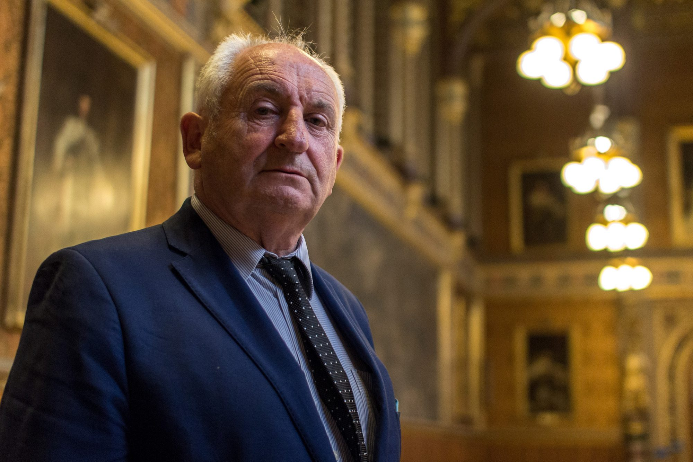

- Lord Bird is the co-founder of [The Big Issue](https://en.wikipedia.org/wiki/The_Big_Issue), a magazine supporting street vendors who are homeless, a crossbench peer in the House of Lords, and co-chair of the [All-Party Parliamentary Groups on Future Generations](https://en.wikipedia.org/wiki/All-party_parliamentary_group). In our conversation, we discuss –
  - The [Well-being of Future Generations Bill](https://services.parliament.uk/bills/2019-20/wellbeingoffuturegenerations.html), which is currently being discussed in the UK Parliament
  - Causes of political short-sightedness
  - Broader social issues facing the UK

##### Image credit: [Radio Times](https://www.radiotimes.com/tv/documentaries/its-a-confederacy-of-amateurs-john-bird-opens-up-the-house-of-lords-in-bbc-documentary/)

## Lord Bird's recommendations

- [Silent Spring](https://www.goodreads.com/book/show/27333.Silent_Spring?ac=1&from_search=true&qid=XsWSgR5khy&rank=1) by Rachel Carson
- [Don't Look Up](https://en.wikipedia.org/wiki/Don't_Look_Up) by Adam McKay
- [The Big Issue](https://www.bigissue.com/) magazine

## Resources

- The Future Generations Bill
  - [Wellbeing of Future Generations Bill](https://bills.parliament.uk/bills/2869) by UK Parliament
    - The [Today for Tomorrow](https://todayfortomorrow.org.uk/) campaign supporting the bill
    - House of Lords’ ["In Focus" Explainer](https://lordslibrary.parliament.uk/wellbeing-of-future-generations-bill-hl/) and [Research Briefing](https://lordslibrary.parliament.uk/research-briefings/lln-2019-0076/) by Chris Smith
    - [Concerns with the Wellbeing of Future Generations Bill](https://forum.effectivealtruism.org/posts/TSZHvG7eGdmXCGhgS/concerns-with-the-wellbeing-of-future-generations-bill-1#How_EA_is_the_Bill_) by Larks and John Myers
  - The Welsh Government’s previous [Wellbeing of Future Generations Act](https://gov.wales/well-being-of-future-generations-wales)
    - An [assessment](https://www.futuregenerations.wales/resources_posts/futuregen-lessons-from-a-small-country/) of the Welsh Future Generations Act
  - [Create your own](https://pol.is/5cafmyhtrx) Future Generations Bill using Pol.is, created by Nathan Young
    - Plus a [report](https://pol.is/report/r8ef5zucaxxvtzkiym69b) of the results (so far)
- Longtermist Institutions
  - [The Long View](https://www.longview.org/_files/ugd/07becb_8fe75ba08a4c457ba2988e96e1ee6654.pdf) (Chapters 4-7) edited by Natalie Cargill and Tyler John
  - [Longtermist institutional reform](https://globalprioritiesinstitute.org/tyler-m-john-and-william-macaskill-longtermist-institutional-reform/) by Tyler John and William MacAskill
    - Plus an associated [EA forum post](https://forum.effectivealtruism.org/posts/op93xvHkJ5KvCrKaj/institutions-for-future-generations)
    - Plus [criticisms](https://blog.jessriedel.com/2020/07/30/comments-on-longtermist-institutional-reform-by-john-macaskill/) by Jess Riedel
  - [Institutions for future generations tag](https://forum.effectivealtruism.org/tag/institutions-for-future-generations) on the EA Forum
  - [Disentangling "Improving Institutional Decision-Making"](https://forum.effectivealtruism.org/posts/Ds2PCjKgztXtQrqAF/disentangling-improving-institutional-decision-making-2) by Lizka
  - [Institutions for the Long Run](https://www.cjlpa.org/_files/ugd/b589e0_6cc51397ac4b4d78b2f68d8f489b0847.pdf) by Fin Moorhouse and Luca Righetti (forgive the self-promotion!)
- Longtermism and Politics
  - [Representation of future generations in United Kingdom policy-making](https://www.cser.ac.uk/resources/representation-future-generations/) by Natalie Jones, Mark O’Brien, and Thomas Ryan
  - [“Don’t Look Up” and the cinema of existential risk](https://www.slowboring.com/p/dont-look-up) by Matthew Yglesias
  - UK Organisations
  - [All-Party Parliamentary Group on Future Generations](https://www.appgfuturegenerations.com/)
  - [Centre for Long-term Resilience](https://www.longtermresilience.org/)
  - [Centre for the Study of Existential Risk](https://www.cser.ac.uk/)
- International Organisations
  - [Simon Institute for Longterm Governance](https://www.simoninstitute.ch/)
  - UN’s [Our Common Agenda](https://www.un.org/sites/un2.un.org/files/unf_our_future_agenda_en.pdf)
    - Plus an associated [EA forum post](https://forum.effectivealtruism.org/posts/Fwu2SLKeM5h5v95ww/major-un-report-discusses-existential-risk-and-future)
  - [Legal Priorities Project](https://www.legalpriorities.org/)
    - Plus our [episode with Christoph Winter](https://hearthisidea.com/episodes/christoph)

## Transcript

### Introduction

**Luca 0:06** 

Hi, you're listening to Hear This Idea, a podcast showcasing new thinking in philosophy, the social sciences and Effective Altruism. In this episode, we talked to Lord Bird. British listeners might know him best as being the co-founder of[ the Big Issue](https://www.bigissue.com/) magazine, which helps to tackle homelessness here in the UK. Lord Bird is also co-chair of [the All Party Parliamentary Group for Future Generations](https://www.appgfuturegenerations.com/), and is the main sponsor of the [Wellbeing of Future Generations Bill](https://bills.parliament.uk/bills/2869), which is what we spend most of this episode talking about. So without getting too far ahead, and into the weeds of parliamentary politics, here is some background information to help fill you in. In the UK, almost all laws that get passed in the legislature, so parliament, they're introduced by the executive, so that's Downing Street. However, typically, every year, some individual politicians will get the chance to submit their own so-called ‘Private Member's bills’. And in the House of Lords 25 ballot bills will be chosen at random that then get priority treatment and just getting to be discussed. Private Member's bills on the whole, typically, they have a very low chance of being passed. So looking at the last decade or so it's been less than 5% that actually make it into law. But more than anything, I think they just serve to draw attention to social issues that would otherwise not be discussed, especially not in big political environments like parliament. Over the last few years, Lord Bird has been campaigning to get his Future Generations bill passed. And this is actually his third attempt to do so. In 2019, it was first interrupted by a general election. In 2020, things were then put on hold because of the pandemic. But then in 2021, the Lord Bird’s bill was the first to be drawn in this ballot initiative, which means that now, come 2022, it's finally getting discussed. The bill has already passed the House of Lords, but now faces the much tougher challenge of being discussed in the House of Commons, with the government having already said that it's basically really sceptical. So why discuss this bill, then, if by all accounts it's extremely unlikely to actually pass? Well, for me, there are at least two reasons. Number one is it's just really interesting hearing how Lord Bird thinks about future generations; I think it's pretty safe to say that Lord Bird comes at this topic from a pretty different angle than a lot of EAs will. And it just seems useful to get a sense of where the potential agreements and disagreements are, especially when we're thinking about getting long term issues discussed in mainstream politics. Number two, is this bill also raises just itself some interesting questions about how EA should think about political institutional design. So there's been some active discussion on the forum, and in some other places about whether the specifics of this bill are a good idea or not. And we've linked to some of these in our write-up. But then this should really get us just thinking about what better or other approaches there might be. What do we mean by long term thinking government? And how would that affect more everyday things like fiscal budgets, infrastructure, investment, and education? I think this might be one of those interviews that probably raises more questions than answers. But honestly, I like that, and I think it's much more interesting that way. So a big thank you to Lord Bird for joining us. And without further ado, here's the episode. 

### From the Big Issue to future generations

So one of the first questions I have is, I think most listeners or people who've come around the work that you've been doing, would probably associate you most with the Big Issue, and I guess, this question of tackling homelessness in the UK - a problem that is really visible and present - but now the thing that we will be talking about in this episode is your work on the well being of future generations, which as an issue is, in some ways, much more abstract and kind of removed from day to day life. So I suppose I'm just curious how you came to I guess switch over or discover, yeah, this new kind of cause area to work on?

**Lord Bird 3:49** 

Well, on the 10th anniversary of the Big Issue, which was on 9/11/2001 - an auspicious day - I was asked by the Times, they said to me, you know, ‘you've been doing the Big Issue now for 10 years. So what are you going to do for the next 10 or 20 years?’ And I said, and it set me off on this path. I said, ‘Look, I've spent 10 years fixing clocks. And now I'm going to spend the next 10 or 20 years preventing the clocks breaking.’ So that's how I set myself out. I've always been a person who will respond as well as I can to an emergency. But I'm always fully aware of the fact that the emergency is there, often, because of the poor quality of social delivery, made by governments, by charities, by businesses and all that and that if I actually wanted to do anything long lasting,I would have to have to move from the emergency to prevention. And in fact, I came up with a methodology which was taken up by people in Australia and New Zealand, I think and other places. And it was called PECC and PECC was P-E-C-C. And PECC was a very simple thing to establish where somebody was working: were they working in prevention? Were they working in emergency? Were they working in coping, sustaining people? Or were they working in cure? And about 80% of the world's social interventionists - whether it's governance, or charities, or wealthy individuals - nearly 80% of all of that work is carried out in emergency and coping. So you can see that there is this kind of overbalance, there's an emphasis on the problem when it's a problem, very little with prevention and very little cure. So that is why for instance, we have a social security system that keeps people in permanent need largely, because we never give them enough money, and we never give them enough support, and we never give them enough education, and skill enhancement. So therefore, what we have is millions of people in the UK and various other places in the world, marking time, treading water. And that kind of permanent emergencyism is something that I wanted to address.

**Fin 6:40** 

I'm curious on that point. Why do you think so few people are interested in anticipating the emergencies on the horizon rather than coping with them once they've arrived?

**Lord Bird 6:52** 

Well, I think largely it's very much to do with the kind of people who have intervened in the crisis of other people. And the people who are intervening are normally people who themselves live in comfort, or live in a sustainable place. So in a sense they are intervenors. So they are givers rather than receivers. Now, if you have a an intellectual tendency as a giver to give, and this is governments, this is everybody, that actually what it means is that you create a set, a series of attitudes, you create the kind of intellectual furniture, which makes you say, ‘Okay, well, what I'm going to do is give that person in need something at the point where the crisis manifests itself.’ So what you do is we have built in the world, but really based on the Judeo Christian principle that we help the starving and we help the poor, and we help the weak. So we've got this kind of mindset. The problem is that most of the people who are givers have absolutely no idea what it's like to be a receiver. I'll give you an example: in 1998, when Tony Blair had come into office, as the new prime minister with a landslide, came in and he said, at a conference, ‘we live in an age of giving.’ And I rang the Guardian and said to them, could they give me a page the next day, because I wanted to slag off Mr. Blair, because obviously Mr. Blair was a part of the problem. And I thought he was going to be part of the solution. And I said to him, I said in the article, kind of open letter, ‘Dear Mr. Blair, if you think we live in an age of giving, doesn't that also mean we live in an age of taking: if we live in an age of taking, have you ever thought of what it's like to be a taker, when you taker? When people are giving things to you, you remember how regretful you are with your parents, when they give you things, when you think you can do it yourself, when they give you advice, when they give you money, and it doesn't mean the same thing if it's the money that you've earned, or you've managed to squirrel away, so you get that kind of sense. As a child growing, you get that kind of sense, that is duplicated many, many times all over the world, when people turn you into and keep you as a kind of refugee. So that to me, there is a real intellectual need. I mean, I'm at the moment involved in redesigning thinking, because I think that the real problem that we have is we look at almost as receivers, takers, as as a different species, we don't actually see them as a part of the of the human race but a subspecies in that way.

**Luca 10:14** 

Yeah, that's interesting. I think I've definitely heard this take in lots of other settings as well. So if you're looking at, for example, global aid, so you know, instead of just looking at the welfare system within the UK, but also, from UK aid to foreign countries and things, it's something we've often heard, in that setting discussed as the funder-beneficiary kind of separation, where it's very hard as the funder to know what the beneficiary actually wants, like what their actual needs are. And that can be the route of lots of inefficient aid. Because without taking that perspective, or without having the beneficiaries involved in either communicating or saying what they want to do with the aid, you can get the wrong perception and end up doing really inefficient aid too..

**Lord Bird 10:56** 

Yeah, and also, I've worked with some groups throughout the world. And it's actually when a local group of people who are who have had lived experience mixed in with professionalism, so you get people who have lived in poverty and in need. And if you mix them up, if you get the cocktail, the ingredients, right - you can't have too much lived experience, and you can’t have too much professionalism - but if you get the kind of thing right, then actually, what you do is you get so close to the problems and the needs, that you then can transcend all of the problems that come from giving and taking, so you overcome that. And I was speaking to somebody about, you know, what they're doing on Mars, you know, when they've got those little robots going around looking at what is available on Mars, what is going on. And the professor whose lecture I went to, who told us about that, said that when somebody is choosing somebody to guide this little kind of robot, the person has to pretend that they are the robot, because it has to make up for the enormous gap, and the fact that they're not getting a full picture of what is actually there. So this kind of idea that NASA or whoever is doing it is you have to, in a sense, take on the feeling of being a robot on Mars. And in a way when I heard that I thought, wow, if only we could get some government ministers who either had the experience or knew about the experience, or could actually simulate the intellectual space of somebody who was down on their uppers. And, you know, I'm not, therefore saying we should all go out and do sleep outs, you know, because I'm very much against sleep outs. But I would love to take some people to the very edge and leave them there. So that they could do that. And sorry, the charity that I worked with over 30 years ago, which took young people and put them in with the living everyday life of people who were wretched, and had been on the streets, and the experiences they had were were something that that brought them so close to the problem that they knew how to intervene.

**Luca 13:36** 

So moving from homelessness to this question of future generations, I'm curious how you see what we just talked about there applying to this domain, where if we're thinking about future generations and trying to empathise or trying to understand or put ourselves in that situation; future generations could just be living in a very different world or just facing very different challenges. When you're thinking about creating a world that is good and addresses the needs, as you said, for these future generations. How should we go about yeah, thinking or putting ourselves in those shoes?

**Lord Bird 14:09** 

Well, you know, I might be giving you a kind of a bit of a cubist view of things, in the sense that it's not all going to flow one into another. But if you look, and I can only really talk about my own trajectory, that about 2012 I got really, really cheesed off with the fact that John Anthony Bird was some kind of social hero. He was a really brilliant chap and patted on the back and people stopping me in the streets. And if they saw me on the telly, it added to that and nearly everybody was saying ‘John Bird you're so brilliant because you know how to think outside the box.’ And in the middle of the night in 2012 I woke up and thought, the only reason people are telling me that I'm thinking out the box is because the box isn't working - the box which is Parliament, which is government departments, which is local authorities, which is anybody - and I thought, you know what I'm gonna do, I'm going to get in the box. I'm not going to become an MP because nobody would take me and I don't have that kind of application - I couldn't sit around listening to people telling me every Friday, you know, their problems. But I thought that what I'm going to do is try and become what's called a people's peer, which is that you apply and go through interviews. And when you do that, and if you get in, and it's very unlikely that you're going to get in, but I put all my eggs in one basket. And I think there were 100s and 1000s of people who apply for this thing. And I actually got accepted in the end of 2015. And then I went into parliament. And I realised I thought, ‘Ha, I'm here, I'm in Parliament, what are the things that I can do most of all?’ I was instantly surrounded by many, many peers, and even members of parliament, who knew me and recognised me. And I was also involved in a film about a year in the life of Parliament. So everybody was saying, ‘Oh, John Bird, new geezer, new kid on the block’ and all that. And virtually everyone came up to tell me some kind of emergency problem that they knew about, whether it was the vendors, you know, homeless people sleeping in the underground, whether it was something from their constituency, or the area, and they wanted to know what I could do. And I had to stop and I said, ‘Look, look, it's very, very interesting, I'm so glad that you are involved in the emergency because someone's got to do it. But I'm here to get rid of poverty, I'm not here to make the core a bit more comfortable. I'm not here for any other reason than prevention.’ So therefore, what I did was I had a bill going through which got kicked into the long grass around credit worthiness and the fact that if you are a renter, then you have to pay more for your credit than if you're a mortgage holder, you know, and we got involved with that. And even though the bill was not accepted, it did change certain things in the way in which somebody with a good rating, because they paid their rent on time, could influence the amount that they had to pay for their credit. So we had some kind of success then. And then we were looking around and the PECC system had been talked about in the Welsh assembly. And then I heard about the Well Being of Future Generations Bill, which had gone through in 2015, and become law. And I became fascinated with that, met with Sophie Howe, who you will know is the commissioner in Wales. And I just thought now, and this is my thinking: this is an aspirational department of Government. This is a new way of thinking. And because it is a new way of thinking, there will be lots of people saying ‘prove it, prove it, prove it.’ And, you know, and expect enormous changes within, you know, five years, 10 years. I thought if there's a government department, and there is legislation that is coming on the statute books, that actually says we now have to think differently, that is an absolutely profound jump in life, even though it may look on occasions because it's slow, but it's going to make any great change in the world. So if I can just say this: if you and I are not very well, and we don't know any reason why we're unwell. And then the next day and the next week and the next month and all that and we don't do anything about it. The day we decide to go to the doctor is an enormous leap, because up till then you were nowhere near the solution. But once you go to the doctor, even if the doctor can do very little or the doctor is incompetent or whatever, you have made a decision that you are going to find a solution. And the problem we have is when I talk to government ministers, when I talk to MPs and Lords and people who are involved in the process, when I talk to social activists, most of them will tell you that what they're doing is essential to what needs to be done. Governments will always tell you two things. They work across department, which is rubbish. They just have the patina of working across departments. That's one thing. And secondly, they always say, ‘yes, yes, we take prevention, and long term planning into account’ - it's absolute crap, what they do is they go through the process of making it look like that. I'm sorry to be so rude. But you know, so in a way, what you've got until somebody says, we've got a problem, until that, and when I saw that legislation, and I spoke with Sophia and I got some of the examples of what had worked in Wales. Very, very minute things, small things, stopping a rail, stopping, you know, taking, spending a billion pounds on making it slightly easier getting out of Cardiff, and all that, I thought to myself, yeah, that the evidence is a bit, you know, it's a long time coming. But when I hear for instance, that in Cardiff now, because Cardiff’s got this big problem around air pollution, because of the nature of the bay and all sorts of stuff like that, the geography. I hear that the Ministry of Transport is working with the health department. Now they’re melding together to solve a problem around air pollution, because they know that it’s a problem for two departments. And actually, that is the beginning of transforming the way that the siloizational policy is broken. So to me the bill, the Act, which is now about six or seven years down the line, will begin to change the way that people do, you know, preventative spending, and all of those kinds of things like that. So I'm there - I hope I've answered the question - I'm there largely as an aspirational person, moving from a very, very practical world of providing people with a means of getting out of crime, getting out to injustice. And moving on to saying, now, let's think about the future. But let's not think about the future in the future. Let's think about the future today.

### The Future Generations Bill

**Fin 22:38** 

I'm curious just to ask about the contents of this Wellbeing of Future Generations Bill. Can you just briefly talk about, what is it calling for?

**Lord Bird 22:48** 

I'll just read here, the headings that we're working on, that the bill underlines. Improving wellbeing, the wellbeing goals, around social mobility, around health, around global responsibility, and about sustainability. And it's about making public bodies progress. Find a way of checking in government departments, what are they doing about social mobility? What are they doing about health? What are they doing about social or global responsibility and sustainability? That kind of is how do we deal with a well being issue - planning and spending. So it's about preventative spending, it's about categorising spending. So for instance, I'll just give you an example: 650 million pounds has been allocated, a campaign that we led, which was about preventing people slipping into homelessness through evictions, because they'd lost their jobs through COVID-19. And we managed to convince the government that they needed to spend 360 million on this problem. And they came up with this money and it's being dispersed to the shires all over England, to the local authorities. Now, the thing about that is, there's one thing, ‘okay, we're going to give you the money.’ The second thing is you have to find out how they're going to categorise that, how they gonna spend that money. What are the categories that they're putting in? Also about writing reports, the idea is, I don't know if you remember the situation we had in October 2019 when the National Risk Register, which looks ahead, came to the conclusion in October 2019 that we had such a good response to, we had a good preparation for pandemics, that what we're going to do, what they did was they closed down the pandemic committee. And they said all their PCR and all that stuff, we were the best prepared in the world, we were the best prepared in the world, and at stages it looked as though we were the worst prepared in the world. And that is largely because you have this kind of strange view, which is you look at the National Risk, and you look at it two years, you may look at it five years ahead. And what we're saying is you have to look over the next 25 years.

**Luca 25:31** 

So around this point around preventative spending and making sure that there's money allocated towards this. And then also hoping that by marking this out, you can see the effects, it kind of opens up this question of how do you measure the effects of preventative spending? Like how do you know whether these things are having a positive impact? Precisely because as you said often you might not see the results until like, 25 years down the line. And also, there's this thing with prevention, right that you don't know if it actually did have an effect, or if this thing just wasn't going to happen in the first place? Like, it's a really, really difficult question. And I'm curious, yeah, whether you are the bill has opinions on how to go about evaluating these things?

**Lord Bird 26:11** 

That is a really, really, probably the most germane question you need to ask. I mean, let's look, just for one moment, let's look at the fact that we have a government which is built on departments. And though they say they're working across, and they're working, you know, their planning for the future. All of that is really not exactly the way that we would be doing it, if we were doing it correctly, especially as almost detached from government itself is a rather small department called the Treasury, and the Treasury will plan, will pay, for airport need in 10, 20, 30 years. They will plan for a railway line that will take you from London to Birmingham, and save you seven minutes or whatever. They will do all of these long term things. Because what they do is they are quite happy to plan for the Channel Tunnel, which took like 12 years to do, and they knew it would be opened by another administration, hopefully, another conservative member, you know, or whatever. So, the Treasury is really good at that kind of thinking. But when you turn around and you say, actually, we fail 35% of our children at school, and they become the the prison population, almost, people who, 90% of people - and I'm telling you from personal experience - 90% of people who go through the prison system are people who've done very badly at school. If you go to the A & E department, and you look around and you talk to people, you will find it's people who were on low wage. That doesn't mean to say that somebody doesn't rush in with a golf accident or something like that, or, you know, fallen off their floating harbour, you know, but the point is, most people who use the A&E are people who are in poverty, who have who have done very badly at school. If we fail 35%, and we don't make an investment in breaking the tyranny of that 35%, then we have the working poor, the under skilled, the people suffering nutritional illnesses clogging up the system, and all sorts of things and filling up the A&E department. On average, in my local hospital, according to a specialist I know, tells me that 50% of the people who go into that hospital and have to be given a bed are people who have nutritional issues. And those nutritional issues are nearly all around race and around class, and all around the fact that they haven't done very well at school. So you've got this kind of thing. So why is it that the government, that the Treasury doesn't say, oh, God, we're spending so much money. 70% of the time spent by parliament, in both houses, is spent on the problems thrown up, the collateral damage done directly by poverty, and the collateral damage that is, so you've got all these kind of weird things. So in a way, what I'm saying is that our bill would want to address that kind of preventative spending, and we'd want to break the power of the Treasury to be so asinine in its thinking so dunderhead in its thinking, that it feels that it's not the most sensible thing on earth to address that 35% of people.

### Siloization

**Luca 30:00** 

This point about siloing is really interesting. And I think I definitely agree that by just siloing things and not having different things communicate with each other, you just miss out on really big and important things. But one of the things in favour of siloing, or taking one of these issues specifically, and really focusing on that, is because you can get more tractable progress that way. So to take climate change again, for example, there's one world where every law that we do we have to consider it's environmental, or it's impact of how it, you know, affects climate change. But that shouldn't prevent just having a whole body or a whole department dedicated towards just trying to dissect climate change, almost top down work out what it is that we need to do, right? It's kind of like, you kind of want to have both right, as well. And then I guess to then apply this more broadly to this question of future generations or well being it's a question around that. Where on the one hand, you can maybe think about making sure that everything that government does intersects with that or is aligned with that, but that shouldn't also prevent you from just working out what are the structural things that are wrong? And, let's fix those right?

**Lord Bird 31:04** 

Well, I mean, that is interesting also, because, you know, to me, I've been saying for quite a while I want to change the argument around climate change, because I want climate change to pass through the prism of the fight against poverty. So in 2008, or 2009, before David Cameron became the Prime Minister, but was the leader of the Conservative Party, we had chats and meetings about when he got in office, he was going to create an enormous amount of green jobs. And they would be green jobs for people like Big Issue sellers, people who had not done very well at school, break the, upskill people. And the green jobs would be about, you know, protecting your home from, you know, wasting energy, it would be about creating forests, and all sorts of stuff like that. And it would also be about challenging the way that our education system has put this kind of difference between us and the natural world. And therefore you would bring the natural world into the school yard, and so that people could begin to understand. So he was talking about almost a kind of green revolution, where it would pass through the prism of poverty. So you would be addressing poverty. And as we know, poverty is not just the physical material world, it's also the mind, the poverty around, you know, not seeing the importance of education, not seeing the fact that you should help your children see that schools are the launching pad for a life that can go almost anywhere, all these sorts of things. So he was talking with me, and I'm sure with others, about this kind of where you address poverty through the climate issue, or you address the climate issue through poverty. So you were trying to do the same things. And that's where my mind is, I want to see education around climate change to be totally transformed. So there's a bill, I think it's the youngest, I think it's a young woman whose name eludes me, who is the youngest MP in Parliament, and she's got a bill about, you know, beefing up our commitment to environmental and climate change education. And I want to be, I hope that if she, if it gets through to the Lord's, that I will be one of the sponsors for that, because I think that is one of the major changes. We need to up our game on how chaotic this world is becoming if we don't address the climate issue. So those are the kinds of when you have siloization, you multiply the problem. Now, an example, I was with another MP, and she said to me that she had a young woman come to see you in the constituency. And they went through a kind of menu of all the things that had gone wrong in her life: she had been abused as a child. She had failed in education; she'd gone into a domestic relationship where she was beaten up and all that sort of stuff; she couldn't get a job; she couldn't be skilled up; she found it very difficult to hold down a job; she had mental health problems, and she was homeless. So you had all of these things. Now if you took that person and stood them in front of the siloized world. You say ‘Alright then, which department’s going to deal with this?’ I mean, for instance, just taking the issue. What about domestic violence? Would you go to the police department? Justice? And would you say can you sort this out? No, you wouldn't. I'll tell you why. Because only 6% of women who have suffered domestic violence ever present themselves at the police, because they don't trust the police. And they often don't trust men. And even they don't even trust the women who are in the police force, because they're trained by a load of men. So you've got this kind of weird thing, you've got this one human being, who could be cut up in parts, and shipped around. So that's where siloization - no one is ever, I have never met a homeless person whose problem was they didn't have a home. What I have met is somebody who has a whole cocktail, a whole, you know, kind of menu of reasons why they are homeless, and you have to get into those demons to sort out somebody; no wonder they don't have a home because they have all sorts of other things before them. So that is the kind of reasoning behind why I think the bill should break through that siloization. That doesn't mean that you can't act in a very rapid sort of way to a problem that comes up.

**Fin 36:27** 

I want to say I've heard something very similar in the context of: if you have a new issue that might be especially important for future generations, there's a good chance it just won't have a natural departmental home yet, right? And so I've at least heard stories where, you know, the issue arrives on the desk of someone at department A, and then it doesn't quite, it's not quite a good fit for them, and they're so overloaded anyway, right, that they're like, well, let's hand this off to the department B. Department B gets the issue, it doesn't quite fit, not sure what to do about it, they'll hand it back to A - nothing gets nothing gets done in the end. So either you need, like Luca mentioned, some department or body that's just like squarely focused on this new issue, so they can't avoid doing something about it. Or you have some cross cutting standards, or bill, like the one that we're talking about, right?

**Lord Bird 37:17** 

That allocation - I mean, it is so interesting that you could put this all down to budgeting. One of the things that you need is you need to revolutionise government budgeting, because government budgeting, I mean, what happened in the, you know, the 2010 coalition, was they ran into a problem, because what they did was they immediately started that they wanted to save 3 to 5% of government spending, by cutting the money that they gave to the counsellors and the local authorities. And what they did was they therefore passed that translates sometimes to 30 or 40% of closing down social support in councils in particular areas. They were looking to save 3 to 5%. But what was interesting about it is they never managed to do that. What they managed to do was, save one and a half percent, and so the cost of austerity, then was hidden. And then it kind of became manifest, and that's why in 2020, when you looked at the hospitals, they were already 85% full, and they were almost full to capacity because of the problems created by this very, very poor budgeting. They'd looked upon it as a budgeting issue. But it became a social issue, and then became a dynamic issue, when we found that our hospitals were too full of poor people in poor health, from poor backgrounds. So we have to revolutionise budgeting, we have to change the way. I mean, I live in Cambridge, and I was told that when they cut the police bill, the local authority, and they cut, what was it social, you know, youth clubs and things like that, support for young people, they found there was enormous increase in crime, and there was no, and then they had to put the police bill up. So therefore, that kind of thinking, where you do that is because they're not doing that. They're doing one thing, and being able to respond to a crime, but they're not being able to respond to *preventing* the crime from happening in the first instance. And I'm fully aware of the fact if you want to get a budget for prevention, how do you recognise prevention? I'm a person who was born into absolute poverty, crime, racism, you know, my family are Irish Catholics treated like a dog you know, in slums of Notting Hill, homeless at 5,6,7, into an orphanage, out of school, running away from school, fighting with teachers, being thrown out, put in prison, put in places for shoplifting, housebreaking, and all sorts of stuff like that. And you get that kind of thing. And you have to find a way of preventing people like me doing it. And it’s so expensive. I mean, I was in an institution that costs three times what it would have cost to put me into Eton. So actually, the cost of running poverty is enormous, absolutely enormous. I mean, I'm a million dollar man. You know, I've had more education spent on me proportionately than you. And probably all of you all your team put together, because I am one of the. So actually, there's a revolutionary argument around budgets, when you look, let's budget more for supporting families, so that they don't fall into poverty, let's budget more so that we spend, so that we notice a child at school like me who can't read and write. What you've got to do is you've got to support that child, because they're going to become a drain on the taxpayer. I mean, as crude as that is, in years, I fortunately was, every time I got nicked, I got taught things, and got new skills that in the end, became transferable skills, which enabled me to talk my way into the middle classes, where I am happily entrenched.

### Treatment versus prevention

**Fin 41:43** 

Yeah, it goes back to the thing you said earlier, where I suppose what you budget for changes, if you extend the time horizon that you care about beyond, you know, three or four years to 10,25,50 or even more years. Then you realise that the things you're spending on now have effects that last much longer than you know, the next political cycle. And in the long run, you'll be either saving money or saving lives, just by taking that kind of very long run seriously, right?

**Lord Bird 42:11** 

Well, I'll tell you, one of the civilising things that happened to me, even though I couldn't read and write, was I spent my time trying to hang around, when I wasn't in the gails, or when I wasn't shoplifting, or housebreaking or whatever, I would go, I would try and reform myself and one of the things to do was to go to the Fulham Public Library. And I'd go to the Fulham Public Library, and I would just sit there, and I'd be amongst all these books, and I couldn't quite understand what was going on. But what I was trying to do was kind of situate myself somewhere different. Now, what have they done to the library system? I go back to Fulham Public Library and it has got a fraction of the support it had, and it is unable to fulfil all those opportunities of prevention, of getting young people in there saying, ‘Yeah, read a book.’ You know, if you throw Jane Austen at someone and get them to read it, the chances are, they're not going to go out robbing old ladies. It’s that simple. And back to the bill, I mean, I want the bill, which is an aspirational bill, and it's very different from all of the work I've done before. It's an aspirational bill that I think aspires to changing the way, if we can get to the fact that we are not thinking correctly, then where we are 90% towards the solution, in my opinion. Could I add something else because I have a yearning to be practical. I have an absolute yearning to be practical. And I’m about to meet with somebody from Cambridge University, who runs a group which looks at the answers to the problems of climate change and things like that. So it's about developing products, developing technological things, so that we can learn, so as well as trying to reduce carbon emissions, as well as kind of getting the government to take climate seriously, this is about let's find the things that you can do, whether it's you know, sowing rain in the clouds and putting iodine in the water, so it grows all this algae, which can can then suck up 70 to 80% of the carbon. There's all sorts of things. And this is an incredibly practical way of looking at climate change and I'm attracted by that. I went to COP26 In order to get angry with people because we were going down the toilet so to speak. I went there to find solutions. And what did I, I met a woman who runs a company that creates water out of air in a, you know, as long as it’s 68 degrees, they can extract the water. And you can, you know, you can do that. Trees that grow in, you know, in desert things, a natural way of consuming and almost eating nuclear waste and turning it into something harmless. So I went there to do all those sorts of all those sorts of practical things. But what's interesting, when I was talking to this professor, I asked her, I said, ‘What can we do, us?’ And she said what I think we've got to do is we got to get into our community, and we got to start building the communities together. We have to start measuring and, and actually bringing in the questions of, you know, getting rid of your plastic bottles, picking up your rubbish, all sorts of things, and actually doing that. And that is so so interesting, because I have always felt that one of the problems with the green issue is it's a very posh person's issue. I was on on a platform at the Labour Party some 20 years ago, when I and George Monbiot spoke - the great George Monbiot, you probably know him - and he stood up there, and he spoke in his kind of patrician sort of way about, you know, what we got to do. And at the end of it, I didn't know what I was going to talk about, and I thought, ‘hang on. I know what the problem is.’ So I stood up, and I said, I don't know how George Mambo relates to the woman on the third floor of a block of council flats over, you know, the environmental issues, what are we going to do about that? Why are we going to break this kind of class divide, and it is by doing things locally. And what I did in 2018, I had a conference in Northampton, where we tried, and this is about the future generations, and it was about bringing together people in the community who never worked together, get the Housing Association working with the estate agent, the estate agent has 125 buy-to-lets that they have to clean, and they have to cut the grass and they have to mend the fences, and the Housing Association is looking for more ways, for more people to employ because 70% of the people who live in their houses are out of work, so that you, so no money needs to change hands. It's not about a gift. It's not about charity, getting the local hospital to buy 9000 loaves a week from the local baker who works with people who have suffered domestic violence. So it's about that. And I think we’ve got to find a way of bringing back the local issue. So that is the way - sorry to go on - but that is the way that you can break the class divide. Because if you are cleaning up, if you're making the world better for people to live in, and they can see it, then that's how they understand environmentalism, not to throw their McDonald's box out of the window as they drive through the village that I live in.

**Fin 48:36**

And just going back to what you said about being practical, right, you start with realising what matters. And then you actually want to end up with doing things in the world and not just be satisfied with making the right noises. That sounds totally right to me. I can imagine for instance, on the Future Generations Bill, you can imagine you know, one way this kind of thing might play out is okay now when I'm you know, submitting my spending report for some department, I've got to write a paragraph or, you know, check a box that I'm, you know, not harming future generations. And I just kind of say the right words and nothing much changes. You could also imagine a version where this actually gets stuff done right? Like this incentivizes people to work on projects which actually have the right effects. So you get this example of pandemic preparedness. You know, this risk register came out, had this kind of blinkered time horizon decided that, you know, pandemic risks weren’t a big deal. If we had extended, you know, their time horizon to realise that in the long run, this risk really is quite quite worrying, then you can imagine that this translates into just concrete stuff in the world like stockpiling masks, and imagine the world would be in where we kind of did that properly, we probably would have saved like 10s of 1000s of life. So, yeah, that kind of really resonates with me.

**Lord Bird 49:51** 

But if you want prevention, what you do is you make sure that you have highly, you skill people away from poverty, so that they therefore are not reduced to having food, which will undermine their health. And they then will at some very, very later stage end up in hospital because of nutritional illnesses around either the quality or the kind of work they do, or because of their intake, or because of the amount of - if you exhaust them, are they going to get out there playing football and running around doing things. And actually, a brilliant piece of prevention is to make people healthy, and to make people healthy, you make them educated, and you move them away from the problems that are presented around, you know, not doing very well at school. So we're coming completely round in the circle. So anyway, so I came up with this concept in Northampton, which kind of didn't quite work. But we're going back to it now. And it's called ‘Social Echoing’. And that is what is your social echo? And we could actually get everybody in the UK or in the world realising what their social echo is and how do they contribute. And it's brilliant when you do that. I mean, some of the work that we did led to people, when COVID hit, they were the first people to go round and look how the weak or the ill, you know, the people who were old, how they were doing in the community, because we'd already kind of built a network. And that's the kind of, so it's the kind of granular which leads up. And then in a sense makes the wellbeing of future generations something, as you say, that is not just all abstract, and all too boxy.

### The future generations principle

**Luca 52:04** 

You mentioned in the bill that there's this concept called the ‘future generations principle’, and I was just wondering, yeah, like what led to - well, first of all, what it is, and then what led to it being included in the bill or what the relevance is?

**Lord Bird 52:18** 

Well, it's it's very, very simple process that I can't explain it. I mean, it's so simple, because what it is, it’s saying, what is the effect that this particular thing that we're doing now, will have in 10,20,30,50 years, on generations who sometimes have not even been born? The best example I can give is what happened in Norway, when Norway passed a law 20 years ago, and it was a very, very simple law. And what it said was, what would development within the city, what effect would that have on family life? What would it have on children? So therefore, if you've got that kind of perspective, you look at, ‘Ah, here's a supermarket, here’s a road, here’s a shopping mall, here’s a community of people living in houses - a third of them are children - here’s a hospital and all that stuff.’ So in a way, it's a very, very simple thing, that what we're saying is not simply ‘what will this do to family life? How will this affect mothers and children?’ It's ‘what will this do?’ And I can give you an example, I was asked to get involved, and I don't want to talk about it because it became almost litigious, I was asked to support a homeless project that wanted to expand its its footprint, you know, wanted to build more dormitories, and the local authority had refused them to do this. And the reason for that was because it was in an area of outstanding natural beauty, you know, one of those. So it would’ve meant carving off, you know, a couple of acres of wood and putting in a service road and stuff like that. And I went and looked at this and they asked me and what they were saying is ‘look, John, you know, we've got so many homeless people in our town, we really, really need it.’ And then I went and spoke to the council and the council said, ‘Well, the thing is, we've offered them another place. We've offered them a brownfield site, they can have even a bigger footprint, but it won't work there because it will, these woods that have been here for 1000s of years. Are we leaving for our children, are we taking from our children something? And it was, it was alarming how, how the thinking was all about the emergency. So anyway, I then passed my opinion back to this organisation who got really cheesed off and accused me of all sorts of things and putting posh things like the environment ahead of homelessness and all that. And, and I said no. And, actually, their argument was they could open the hostel six months earlier than if they'd moved to this new brownfield site, or a year earlier. And that was that so actually, if everything goes through this kind of prism of ‘what does this do for future generations’, then you really do have to stop and think: do we build that road there? Do we put that sewage work, do we move that sewage work there? Do we? And actually it's such a simple, but almost focusing thing, that we are here not simply for ourselves, we are here for the generations to come. And that is why I think that the bill, and the work that Sophie Howe has done in Wales, are beacons for the way that we have to approach the future.

### Reading recommendations

**Fin 56:28** 

And I would add - you don't necessarily need to agree with this - but when we think about how many generations are there to come, you pretty quickly realise it's not just one or two, but potentially just an incredible number, like an incredibly long time before us. So it's a little kind of blinkered to think that we're living in the only important time or something. So yeah, one of the last questions we ask everyone is, what three books or films, articles or whatever would you recommend to someone listening to this, who wants to find out about what you've been talking about?

**Lord Bird 56:57** 

Well, I mean, the first, I mean, I'm sure many of your former people have said, you know, [*Silent Spring*](https://www.penguin.co.uk/books/572/57236/silent-spring/9780141184944.html), which I read and didn't understand in the 60s, when it first came out and have been delving into it recently, which was almost a poetic placing of the problem, not simply in the lives of us, but in the lives of the garden and the lives of the the fields, and the death of birds and stuff like that. And the fact that the author had this heroic fight with the fertiliser industry, you know, she was almost accused of being a communist at the time when that was not a very good thing. I think that's one of the greatest things. With regard to films, I'm, you know, I'm not really a film buff but I know I enjoyed, though it sounds mad to enjoy it and find it as almost a social comedy, was [*Don't Look Up*](https://www.imdb.com/title/tt11286314/), which I was so interested in the characterization of mainly the DiCaprio, I just thought I thought this was such a fun film to watch about an incredibly serious thing. I have been, on occasions, done things with [CSER](https://www.cser.ac.uk/), which is the Centre for the Study of Existential Risk as you know. And you know, asteroids are up there with existential risks, and of course, you know, here we are in the foothills of what could be a very bad war in Europe - Russia and Ukraine. And, I mean, it's so interesting, if you'd had a Wellbeing of Future Generations Bill 50 years ago, we might not have got in that soup, where the West have spent as much time as possible antagonising the old enemy, the USSR, and rubbing its nose in it when it collapsed, and then made such a sense of absolute hatred for the West. And add to that, this kind of going around pretending - this is historical stuff - pretending that the Americans and the British and the French won the second World War, when we know that 90% of all the action, the real action, was done in Russia, and done by the Russians. So these kinds of things. If you want to create a kind of paranoia that produces a dictatorship, then we've gone the right way about it. How you would address that through the well being of future generations I don't know, but it would come down to education on a very, very high theme. And I would want to say well you know, what is the outcome of us doing things in a political social way? Where is it going to leave us? I don't think the Americans intended to create, you know, modern jihadism, when they got all the people together to beat the Russians in Afghanistan, who then became al Qaeda and all those sorts of things, they, I don't think it was their intention to, but in a sense, they created the preconditions for 9/11. That is what is so frightening about the world, because we are always so in, you know, Dragon's Teeth, that will ignite in 10,20 years. So it's all about a major new way of thinking.

### Learn more, and parting advice

**Fin 1:00:53**  

Yeah, well, I will add just on this topic, and on the topic of catastrophic risks, not so much on the government side, but on the philanthropic side, I'm pretty shocked by how little funding there is for nuclear security organisations - a lot of funding has actually has actually moved away in the last couple of years. And so it's in the, you know, it's less than 100 million, probably less than 20 million right now, which is quite concerning, given current events. Alright, how about we ask the last question then, which is: finally, where can people find you and also what you're working on right now online?

**Lord Bird 1:01:32**  

I would like people to look at the Wellbeing of Future Generations Bill. I'd also like them to read the articles that I do, in particular, in the Big Issue, largely because I range over the arts, I range over the sciences, our range of prevention, range over poverty and all that. And what I'm trying to do is create a concept, a really new way. Because I believe very, very strongly that we need to redesign thinking, and I'm, you know, in that area, I was asked a few weeks ago at the Royal College of Art, what would I redesign? I spoke to a number of design students and they asked me what I would redesign. I said: thinking. Because I think thinking is appalling. And one of the problems for me is when you look at all of the people who were involved in preventing crime, or preventing poverty, or preventing the destruction of the planet, they are all like bright lights all over the place. And they don't converge their energy. They don't come together. They don't know. If you went to Greenpeace, you know, Friends of the Earth or somebody else, and you said, I've got a million pounds, I'm thinking of giving it to the World Wildlife Fund or something they’ll say ‘ah, give it to us!’ because there's that competitiveness, which is no different from the competitiveness that happens on Wall Street, and the City of London. We do and this dunderheadedness, this stupidity that we think that what we're going to do is we're going to go out and invent another project, that doesn't relate to all the other projects, so the energy, the concatenation, never takes place. To me that is, and that's what I write about again, and again and again, until we find a way of thinking collectively, and acting individually, we are not going anywhere. My problem is that I see too much of this. And I see, I think also we’re anaesthetising our children through technology and gadgetry and we’re limiting their ability to take on new ideas. So I think there's a major major issue about reinventing education, and I write about that. I'm not the most well informed person, I'm more of a kind of, you know, person who goes on hunches. So if something falls on my head, I talk about it. But I'm not a researcher or anything, and I don't really know if there's a lot of other people saying the same things as I'm saying.

**Fin 1:04:19** 

Well, I guess maybe the last thing to say is there *are* a lot of people, even more and more now thinking about what can we do to protect future generations. You mentioned one of them - Centre for the Study of Existential Risk in Cambridge - there is a couple places in Oxford. But in general, this idea of this kind of long term thinking, longtermism, I see it really taking off for the next few years so it would make sense for both parties to kind of keep talking to one another there.

**Lord Bird 1:04:45** 

Yeah. So I was just gonna say: don't be frightened of the abstract. Don't be frightened of my advice. Don't be frightened of the fact that it does sound or kind of waffly or it sounds imprecise. Because if we can get that, if we can bring that, then we can make it, we can practicalise it if there is such a word, we will find. And that's why I'm doing this social echoes stuff, because I want people on the third floor of the block of houses in Hackney to know damn well that the environment is strong, and is necessary, and it actually should be on their list of priorities, and not just the emergency and the needs of today.

**Fin 1:05:32**

Totally. All the great changes or the great practical improvements we've seen in history started presumably with some kind of hunch, some kind of abstract idea, and then someone did something about them. It's both those things right? Alright, I think that is everything from us. So Lord John Bird, thank you very much.

**Lord Bird 1:05:49** 

Thank you very much. Thank you.

### Outro

**Luca 1:05:52**  

That was Lord Bird on the Future Generations Bill. As always, you can read the write up at hearthisidea.com/episodes/bird. There, you'll find links to all the books and articles mentioned in the interview alongside a full transcript of our conversation. A big thanks also to our producer [Jason Cotrebil](https://www.linkedin.com/in/jason-cotrebil/?locale=es_ES) for editing this episode and making us sound good. If you're enjoying this podcast, then the best gift that you can give us is to leave us a review or comment wherever you're listening to this be that Apple podcasts, Spotify, wherever. We know that your time is surely valuable, but it's really the best way for us to learn how to keep improving the show, and to get the algorithm to recommend us to listeners. You can also send guest suggestions, questions and whatever else to feedback@hearthisidea.com. Thanks so much for listening.
