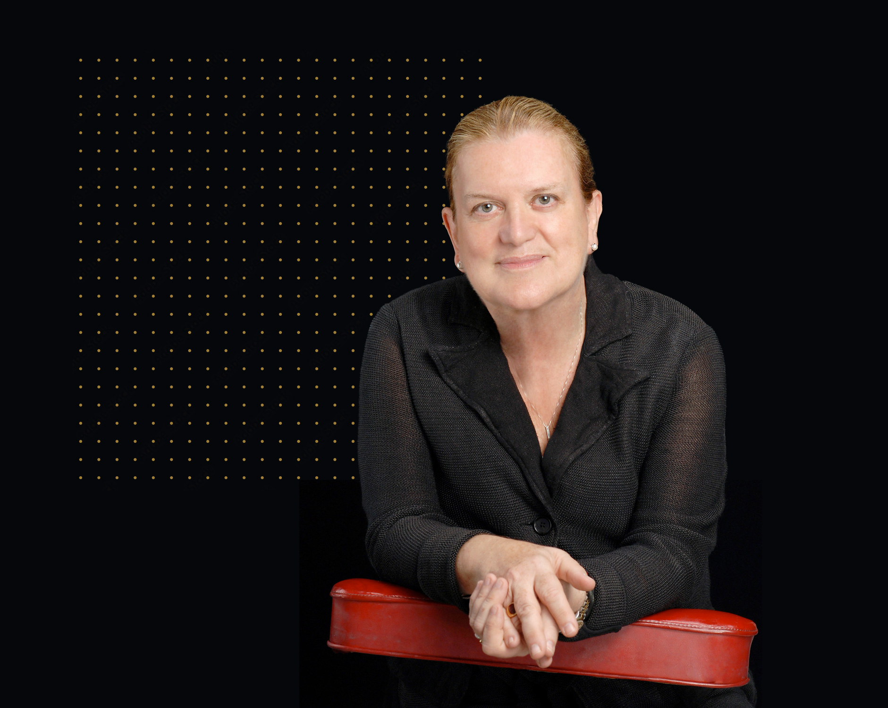

Cristina Bicchieri is the S. J. Patterson Harvie Professor of Social Thought and Comparative Ethics at the University of Pennsylvania. In our conversation, we discuss:

- How to define social norms and distinguish them from similar concepts
- How social norms evolve and why they often persist, even in situations where they are harmful
- Real world applications of social norms for policy, including lessons from covid and high-level decision making

## Cristina's recommendations

* [Economic Action and Social Structure: The Problem of Embeddedness](https://www.journals.uchicago.edu/doi/abs/10.1086/228311) by Mark Granovetter
* [Micromotives and Macrobehaviour](https://www.goodreads.com/book/show/1206321.Micromotives_and_Macrobehaviour) by Thomas Shelling
* [The Moral Basis of a Backward Society](https://www.goodreads.com/book/show/699150.The_Moral_Basis_of_a_Backward_Society) by Edward Banfield
General resources

## Resources

### General

* Cristina’s book [The Grammar of Society](https://www.goodreads.com/book/show/398264.The_Grammar_of_Society?ac=1&from_search=true&qid=HuiP2Tg1E7&rank=1)
* Cristina’s Coursera on [Social Norms](https://www.coursera.org/learn/norm) and [Social Change](https://www.coursera.org/learn/change)
* Cristina’s online lecture on [norm nudging](https://www.youtube.com/watch?v=iIou8JKJAVY)
* [Stanford Encyclopaedia on social norms](https://plato.stanford.edu/entries/social-norms/)

### Pluralistic ignorance

* Prentice, D. A., & Miller, D. T. (1993) [Pluralistic ignorance and alcohol use on campus: Some consequences of misperceiving the social norm](https://psycnet.apa.org/doiLanding?doi=10.1037%2F0022-3514.64.2.243)
* Miller, D. T., & Ratner, R. K. (1998) [The disparity between the actual and assumed power of self-interest](https://psycnet.apa.org/getdoi.cfm?doi=10.1037/0022-3514.74.1.53)
* Allport, F. H. (1920). [The influence of the group upon association and thought](https://psycnet.apa.org/journals/xge/3/3/159/)

### Bad norms persisting

* Bicchieri, C. and Rovelli C. (1995) [Evolution and Revolution: The Dynamics of Corruption](https://journals.sagepub.com/doi/abs/10.1177/1043463195007002007)
* Greif A. (1993) [Contract Enforceability and Economic Institutions in Early Trade: The Maghribi Traders’ Coalition](https://www.jstor.org/stable/2117532)
* Köster, R., Hadfield-Menell, D., Hadfield, G. K., & Leibo, J. Z. (2020). [Silly rules improve the capacity of agents to learn stable enforcement and compliance behaviors](https://arxiv.org/abs/2001.09318)
* Turnbull, C. (1987). [Mountain people](https://www.goodreads.com/book/show/159880.The_Mountain_People) (book)

### Tipping points

* Bikhchandani, S., D. Hirshleifer, and I. Welch (1992). [A theory of fads, fashion, custom, and cultural change as informational cascades](https://papers.ssrn.com/sol3/papers.cfm?abstract_id=1286306)
* [Granovetter, M. (1978). Threshold models of collective behavior](https://www.journals.uchicago.edu/doi/abs/10.1086/226707)
* Kuran, T. (1987). [Preference falsification, policy continuity and collective conservatism](https://academic.oup.com/ej/article-abstract/97/387/642/5190010?redirectedFrom=fulltext&login=false)
* Calzo, J. and Monique Ward L. [Media Exposure and Viewers’ Attitudes Toward Homosexuality: Evidence for Mainstreaming or Resonance?](https://www.tandfonline.com/doi/abs/10.1080/08838150902908049)
* Sunstein, C. R. (2019) [Conformity](https://www.goodreads.com/book/show/42832291-conformity) (book)
  * See also [80,000 Hours interview](https://80000hours.org/podcast/episodes/cass-sunstein-how-change-happens/)

### Sensitivity of norms

* Cialdini, R. B., Reno, R. R., & Kallgren, C. A. (1990). [A focus theory of normative conduct: Recycling the concept of norms to reduce littering in public places](https://psycnet.apa.org/record/1990-30919-001)
* Xiao, E., & Bicchieri, C. (2010). [When equality trumps reciprocity](https://www.sciencedirect.com/science/article/abs/pii/S016748701000022X)
* Fehr, E., & Schmidt, K. M. (1999). [A theory of fairness, competition, and cooperation](https://academic.oup.com/qje/article-abstract/114/3/817/1848113)
* Ball, S. B., & Eckel, C. C. (1996). [Buying status: Experimental evidence on status in negotiation](https://onlinelibrary.wiley.com/doi/10.1002/(SICI)1520-6793(199607)13:4%3C379::AID-MAR4%3E3.0.CO;2-7)
* Henrich, J., Heine, S. J., & Norenzayan, A. (2010). [The weirdest people in the world?](https://www.cambridge.org/core/journals/behavioral-and-brain-sciences/article/weirdest-people-inthe-world/)
  Cooperation and Punishment
* Bicchieri, C., & Sontuoso, A. (2015). [I cannot cheat on you after we talk](https://www.academia.edu/6845793)
* Chavez, A. K., & Bicchieri, C. (2013). [Third-party sanctioning and compensation behavior: Findings from the ultimatum game](https://www.academia.edu/1596846/)
* Fehr, E., & Gächter, S. (2002). [Altruistic punishment in humans](https://www.nature.com/articles/415137a)
* Fehr, E., & Gächter, S. (2000). [Cooperation and punishment in public goods experiments](https://www.aeaweb.org/articles?id=10.1257/aer.90.4.980)
* Bicchieri, C., & Mercier, H. (2013). [Self-serving biases and public justifications in trust games](https://www.academia.edu/1596819/Self_serving_biases_and_public_justifications_in_Trust_games)

### Real world applications

* Kuang, J., Ashraf, S., Das, U., & Bicchieri, C. (2020). [Awareness, risk perception, and stress during the COVID-19 pandemic in communities of Tamil Nadu, India](https://www.academia.edu/54343943)
* Bicchieri, C., Fatas, E., Aldama, A., Casas, A., Deshpande, I., Lauro, M., ... & Wen, R. (2021). [In science we should trust: Expectations and compliance across nine countries during the COVID-19 pandemic](https://journals.plos.org/plosone/article?id=10.1371/journal.pone.0252892)
* Bicchieri, C., & Marini, A. (2015). [Female genital mutilation: Fundamentals, social expectations and change](https://www.academia.edu/15014494/)
* Bicchieri, C., Jiang, T., & Lindemans, J. W. (2014). [A social norms perspective on child marriage: The general framework](https://www.academia.edu/8260831/)
* Bicchieri, C. (2020) [Shifting Social Norms to Mitigate Climate Change in the Anthropocene: A Review and Practical Guide](https://www.academia.edu/44885129/)
* Kuang, J., Delea, M. G., Thulin, E., & Bicchieri, C. (2020). [Do descriptive norms messaging interventions backfire? Protocol for a systematic review of the boomerang effect](https://www.academia.edu/43248556/)

## Transcript

### Introduction

**Luca 0:06**

Hi, you're listening to Hear This Idea. In this episode, we talk to Cristina Bicchieri, who is the Sascha Jane Patterson Harvie Professor of Social Thought and Comparative Ethics at the University of Pennsylvania. Cristina works at the intersection of philosophy, game theory and psychology. And in this interview, we talked to her mostly about her 2006 book, [*The Grammar of Society*](https://www.cambridge.org/core/books/grammar-of-society/2B063E9C9621C2340DEFB2BE15B3AEA5), and what she has done on the topic of social norms since. We begin the interview by talking about what exactly we mean by social norms, and how they are different from similar concepts like conventions and altruism. We then move on to questions of how social norms evolve and why they persist, especially in situations where they are harmful. This includes so called ‘script activation’ in the brain, and how people can form entrenched bad empirical expectations of others around them. And then lastly, we talk about real world policy applications of social norms, including recent lessons from COVID to climate change to improving high level decision making. Personally, I found the topic of social norms pops up a surprising amount in conversations, whether it be ensuring good community norms persist, or trying to reach a tipping point for social change. But I often find it is really hard to get a grip on what dynamics are actually at work here, and how they play out in the real world. So I found Cristina's work really useful in giving a formal framework to many of these fuzzy concepts. And I hope you will do too. So without further ado, here's the episode.

### Norm nudging

**Cristina 1:27** 

One important thing, you'll know that there is all this work on so-called ‘norm nudging’, okay, and what nudging means is that basically, you give information about either what other people do, or what other people approve or disapprove of, okay, in order to change behaviour. And the big problem is that it is not very satisfactory, analytically speaking, because it's like a black box. And there is an input, which is information, a message, etc. and the output is behaviour. And sometimes we get the behaviour we want. Sometimes we don't, sometimes we get it, but it doesn't last, and so on and so forth. So it's very, very important to be able to open the black box. And so one of the kinds of research I'm doing now, not the only one, but it's an important one is trying to understand, for example, what sort of inferences people make when you give them an empirical versus a more normative message. And if it is positive versus negative, and I'm doing an experiment on that. And there are big symmetries, between the empirical and the normative, and also the positive and the negative. And so we have to take into account all that. And of course, there are also some outliers, and we try to understand why there are outliers, what does it mean?

**Luca 3:01** 

Fantastic. That sounds really interesting. And hopefully, we'll get to this again at the end of our conversation around as you said norm nudging and presumably using norms for social policy and kind of like shaping things to do good, but maybe kind of taking a step back for now and just asking a very basic question, which is when you're talking about norms, like what exactly is it that we're talking about? And in your book, The Grammar of Society you spend a lot of time kind of discussing what exactly it is, what that what we mean by a norm. So yeah, why don't we start off there?

**Cristina 3:32** 

Yeah, it's a crucial question. It looks like a simple easy question, because lots of people, for example in social psychology, when they talk about norm, they talk of customary behaviour, okay, a common behaviour etc. And it is too coarse in definition and not very usable when you want to apply it to behaviour, or change behaviour etc. So, to me a norm is a social norm - because there are different types of norms - a social norm, which is the most important, is a rule of behaviour, okay. It can be prescriptive or proscriptive, that is a rule of behaviour; typically informal, because the formal ones are legal rules, okay, an informal rule of behaviour, such that it is supported, let's say, by different types of social expectations. For example, what would we mean empirical and normative? You know, we expect people in our reference network because not all over the world, but we have a reference network, okay, the people that we care about when we have to make a certain decision, to follow it. So the empirical is you know, we know or we expect or were told, et cetera, or we have observed, we know because we have observed that people in our reference network follow these informal rules. And then there is another component, which is only typical of social norms versus descriptive norms, the normative one, okay. Why do we need a normative component with social norms and not with other types of norms? Because social norms exist typically in an environment in which there is a conflict between my welfare and other people's welfare, okay. These are the typical social dilemma tragedies of the common situations, okay, where social norms are typically born, you know, they’re typical, you find them in this type of situation. What does it mean? These are situations where my actions can create negative external effects for other people. So I have to curb in some sense, my desires, you know, and do something more altruistic. Well, social norms need these normative elements, not just a descriptive, then because those are the normative element that tell us, ‘hey, look, you know, most people in your reference network, you know, approve of that, or would disapprove of you, if you don't do that’. And there is that little push that is important. Again, in all these situations where you have a tendency, you may have a tendency, you know, to be selfish.

**Fin 6:48** 

Sounds to me like one component of a social norm is an empirical expectation. So, for instance, if I'm interested in whether or not I should, you know, clear up litter that I see on the street, what kind of expectation I'll have is that, in fact, other people will do that. But you're saying that another important component is that I have an expectation that people *approve* of cleaning up litter and *disapprove* of not doing that. And these are different things.

**Cristina 7:12** 

Exactly, and you need them when I talk of social norms, I talk about these combinations of expectations. But of course, think about it, you may have all these expectations and behave selfishly anyway. You may not care. And so the third important component of social norm is what I call a conditional preference: you prefer to behave in the appropriate way to follow the norm, exactly, because you have those specific expectations. So your preference is conditional on having this expectation. Because if it were unconditional, it could be moral behaviour. For example, you know, I may say, ‘well, whatever other people do, whatever they think is right or wrong, you know, I think it is right to behave in this way’. And this is, it's very important - I am teaching these days exactly what I'm talking to you about. And I have this big rectangle. And on the left, there is descriptive and injunctive, which is what social psychologists talk about - [Cialdini](https://en.wikipedia.org/wiki/Robert_Cialdini) keeps talking ‘descriptive norm’ you know, what people commonly do, injunctive, what is right to do. The problem is, and then I look vertically, and I step back and say, ‘wait a moment, you know, injunctive can be a moral rule. And, you know, a moral rule is not grounded on any expectation, I don't care, you know. I don't hurt innocent people, whatever other people do, I don't kill them.’ Okay. And so, saying that a social norm, like dividing a cake fairly, versus a moral norm, like not hurting, you know, some people, both go under the big hat of injunctive norm is wrong. Why is it wrong? Because when you do applied work, and you want to understand change behaviour, and you want to understand what motivates that behaviour, okay, it becomes crucial to know, is it a moral rule? Are they following it because it's a moral rule or religious rule or whatever, or are they following it because it's a social norm? And the second case is much easier to change.

**Fin 9:46** 

I see. So it's a norm, if my beliefs that people in fact do this thing, and that people approve of doing this thing are what get me to do it or what makes the difference between me doing it and not.

**Cristina**

Correct.

**Fin**

Because I might also just think that like, littering, or having sex before marriage or something is just morally required. And in that case, it's not those beliefs that get me to do it. 

**Cristina 10:10**  

Exactly. And to tell you the truth, for some people, it may be just morally required. You know, some people may be completely insensitive to expectation, etc, what other people are doing or not. You know, there are always, you know, I think there is a normal distribution of types in the population, most types, most of us are conditional types, okay? We care more what other people do, what they think, etc. But there are people who do not, these are the little tails, the angels and the devils. They exist! They exist, but they are really a minority. 

**Luca 10:55**  

Yeah, so maybe to highlight something I think you mentioned in the book, which is that if we just look at behaviour and stuff, right, it can presumably be difficult to differentiate between, I guess, descriptive norms and social norms. So one thing you pointed out is like, okay, let's say imagine, I'm an alien, and I'm just visiting Earth, and suddenly, I see that when it's Winter, people start wearing really big coats. And everybody seems to be doing that. A naive interpretation might just be ‘okay, there is a norm amongst humans to be wearing coats in Winter’. But I guess what you're pointing out here is, people were wearing coats just for their own selfish behaviour, and it's not affecting anybody else. So just the fact that everybody seems to be doing something is not enough for it to be a norm, it has to be conditional - that people are wearing coats because they expect that other people want them to be wearing a coat and that that is the normative, the right thing to be doing.

**Cristina 11:43**  

Exactly, exactly. And, you know, with fashion, there may be a difference, because with fashion, there are expectations involved, and that's what they call a descriptive norm. Okay, a descriptive norm is different from a social norm because it's much weaker. And, you know, it's all based on empirical expectation. So, wearing a coat in winter is a custom. You know, we all do that, because we have the same needs - we want to keep warm. And, the means are very restricted basically, okay. But it is interesting, what you mentioned, you know, even a custom, you know, may shift into a descriptive norm because of fashion. Okay, this is fashionable, especially in younger people, you know, to wear a certain type of coat. Well, that's become a descriptive norm, expectations do matter in that case, okay.

### Convention

**Fin 12:40**  

Right, right. I have one very quick question on definitions. Is there a difference between a social norm and a convention?

**Cristina 12:47**  

Yes, a big difference, huge. A convention is a descriptive norm, okay. What is a descriptive norm in a nutshell, okay? It is a pattern of behaviour, okay, that is common to a certain population or subset of the population such that people follow it because they have certain shared expectations, okay. Now, we can have descriptive norms, very simple, like fashion sense, where the expectation is unidirectional - I want to dress like you, okay. And you don't care about dressing like me, but I want to dress like you. So imitation is typical, underlying certain descriptive norms. In the case of convention it is multi directional. Because I want to behave, let's say, like you do, but you want to behave as I do. So for example, in driving traffic, okay, there is a descriptive norm, because, you know, I go to drive to the right, because I expect you to drive on your right, coming across me, you don't want to cause an accident, etcetera, etcetera. So, there are mutual expectations, okay? And when they are sort of crystallised in a very common continuous behaviour, you have conventions.

**Fin 14:21**  

I see, I see.

**Luca 14:22**  

Yeah so, just to make sure that I'm understanding this right, in this example of everybody wants to be driving on the same side of the road, this is just like everybody wants to be imitating each other. Whereas what we talked about before, what makes social norms kind of interesting or unique is that it goes against, you know, what might be a simplistic interpretation of narrow self interest. But in the case of roads and stuff it is like nobody has a self interest of what side of the road to be driving or, you know, what type of outfits to wear, we just care about being the same as everybody else. So there's not really like a self interest thing. 

**Cristina 14:57** 

More than imitation, you have an interest to be safe. You have an interest to not cause an accident or not to be dead in an accident, so it is perfectly rational for you to coordinate with other people, you know. I will do as other people do, I know that I have to drive on the right side of the road and expect everybody to do so. And they expect me to do it because if we didn't have this almost automatic mutual expectation, it would be a disaster - you would be paralysed, I wouldn't know what to do. Okay, so a convention, if you will, coordinates behaviour, okay. Linguistic convention, same story that coordinates behaviour, okay? I expect you to talk in a particular way and vice versa. And our behaviour is better coordinated. It is perfectly rational to follow a convention, totally rational. Following the social norm, we really push for it. That's why the normative expectations play on.

**Fin 16:05** 

I see. So one question is how, in general, do people form empirical expectations about the kinds of things other people will be doing? Especially when I take it some social norms are kind of about what people do in their private lives, right? You might have norms around premarital sex or something, where most often you're not going to be directly observing that kind of thing. So, what's going on when I form these expectations?

**Cristina 16:30** 

Well, there are many ways to form expectations obviously. The simplest is observation, okay, you observe certain regularities in behaviour and form expectations. And we are beings that are extremely capable of forming expectations, it’s part of being human, we do that all the time, okay. And we try to find patterns, regularities around us. And so, you form expectations as soon as you perceive there is some regularity, you know, in the pattern of behaviour around you. What if the behaviour is not observable, okay? And typically, though, certain consequences may be observable. Okay, so if there is a community that, you know, prohibit, let's say, premarital sex, well you don't see if people have it or not, but you see that there are basically no pregnancies. And then of course, you infer that, ‘okay, this is the behaviour that they follow’. Okay. So it's very important for many behaviours that they are unobservable, we are told, we are made to believe that, you know, there are no consequences because they observe the behaviour, the behaviour prescribed, and they do it, and therefore, we don't see the opposite, okay. But, yeah, it's always, if you will, it’s never precise, okay? It's never precise, but you tend to infer very easily, also children do that, constantly. You know, children infer rules from, you know, behaviour, which really is not a social norm. This is studied in children. You know, children have this capability of inferring constantly rules, even if, indeed, there is no specific rule. But this way, we have this capability, we have evolved it, which is important to survive in a social world, by the way.

**Luca 18:53** 

Yeah. So one really interesting thing that stood out from your book was you made this point that, you know, we're forming empirical expectations all this time, but humans are actually also really bad at judging other people, and that this can lead to some interesting behaviour. So in particular, the thing you pulled out is that we expect others to act much more selfishly than we expect ourselves to do, or in fact, they actually do themselves. And this leads to this interesting phenomenon called ‘pluralistic ignorance. Can you maybe take some time laying this out, and why exactly this matters for social norms?

**Cristina 19:27** 

Yeah. So basically, what happens is the following. I’ll give you an example, easy. You are a student in a classroom, and the lecture is really hard, and you look around, and nobody raised their hand to ask a question, okay. And so you feel sort of embarrassed, you know, doing it yourself. And your typical interpretation is, ‘well, I'm really the only one who did not understand And the other students are much better than me, they understand I don't want to humiliate myself, raising my hand and asking these obviously stupid questions’, and so on and so forth. You know, and clearly this is a case, it is a typical case that I give my students, a case where there is first of all, no transparent communication, okay? We don't talk to each other and say, ‘hey, you know, but that was really difficult. Do you understand?’ ‘No, I don't understand why not’, etc, we don't talk so much about that. So, there is no preliminary transparent communication. And in that situation, you typically - this is another psychological tendency - you typically impute the behaviour of other people, not to the same motives that you have. Okay. But you think, okay, they behave like that why? Because in that case, you know, they know, or because they prefer to behave like the other, because they have no need to ask a question. Okay. So you intend to impute lots of things like preferences, beliefs, etc, to other people that are different from yours. Okay, you feel you're an outlier, and they are the normal people and the normal people know the answer, and the normal people do not ask this question, because it's a stupid question. Exactly. And so there are lots of situations in which basically, we practice pluralistic ignorance. The famous, famous example is the Princeton story, where social psychologists were asked by the parents, you know, ‘what's happening? we need to curb underage drinking.’ There was a lot of drinking, etc. And what should we do? What should we do? And the interesting remedy was, ‘okay, let's ask the students themselves, let's do a survey, and how much they like to drink, etcetera, etcetera’. And the results of the survey were really interesting, because the majority do not feel like drinking so much in the evening in the bar, etc, etc. But in a sense, they felt compelled, because they had the impression that everybody you know, wants to drink, and I am the only one which is wishy washy, I would prefer a coke. So, you know, and the idea is, when this knowledge is made available, then students will drink less, and so on and so forth. And so pluralistic ignorance will be defeated.

**Luca 23:02** 

So, just honing in on I guess why this behaviour seems, you know, ignorant or kind of irrational. It's not that there's something, if I'm understanding you right, it's not that there's something inherently in the fact that I think I'm an outlier or something. It's more that I know that the reason why I'm conforming to this behaviour, is because I am being pushed by this normal, I'm being influenced by other people. However, when I'm thinking like, why are other people doing this? I'm not able to kind of connect the dots that they might be doing this for the exact same reasons as me.

**Cristina 23:33** 

Yes. Yes. There are a lot of psychological studies about this asymmetry in attribution. We generally, you know, very often, especially in a bad situation - this is a little beyond pluralistic ignorance - I tend to attribute my behaviour to the situation; the situation was such that I had to behave like that. But the same behaviour, you know, when it is the behaviour of somebody else, is justified with ‘they prefer to behave like that, it is a choice.’ So, for me, it's not a choice, for them it is a choice. And this asymmetry in attribution is also what happens with pluralistic ignorance, and with lots of other areas of life, I will say.

**Fin 24:24**

And then just to draw out what you said a little while ago, presumably pluralistic ignorance is often bad, insofar as it does harm, right? Sometimes on a larger scale, the example of expectations around alcohol consumption are a good example. But it sounds like the intervention to kind of break that bubble or that spell of pluralistic ignorance is to make it common knowledge, right? And so one way of doing this is to hand a survey, an anonymous survey, and then report the results back to the same people.

**Cristina 25:00** 

Yes. The important thing that people tend not to realise when we talk about, you know, solutions, in this case, you know, a typical solution will be, ‘let's make the statistics known, you know, let's make it known what people, the majority of people, feel about that or think about that’, etc. It's very important that the source of information is credible, you have to remember that. Because very often, when we get some information, we think, ‘okay, well, what is advantageous to them if I change behaviour?’ You know, and it's very, very important. I've been discussing with my students very recently exactly this point. I say, it is not just a question of sending the right information, because they're sending truthful information, but they have to believe it, that is truthful and that you don't have a secondary, you know, interest. This is very important.

**Fin 26:04** 

Yeah, if I got a letter from my college or something, saying, ‘Oh, it turns out, drinking less is trendy now’, or something, that might be factually true, but I'm not going to believe it, because they have their own reason for saying that.

**Cristina 26:14** 

They have an agenda. Exactly. And this is what happens a lot in the developing world, when we do campaigns against, like child marriage, or female genital cutting, etc, etc. And they are typically governmental campaigns, and also very typically people, they start thinking, why do they, you know, do they want to change? You know, our - what they think it is, they don't think in terms of normals, customs etcetera - is our practices we have done for centuries, etc. Why are you coming and telling me to stop now, what's the interest? Okay. And so people have to be really, really, they have to believe that there is no secondary agenda behind that to trust. And typically is much better if the message comes from somebody in their environment, and not somebody outside their environment. You know, that's one of the reasons why so many informational campaigns, you know, against HIV against lots of, you know, behaviour that would be damaging or are effectively damaging, have failed, exactly, because they were not trusted at all. And also, because information alone doesn't go a long way at all.

**Fin 27:42** 

I see. I guess the kind of good news on the flip side is that if you are able to provide this credible information, then it's possible to kind of puncture that bubble, right. And then once you are able to do that it spreads very quickly, and you get this kind of cascade where views flip all of a sudden. So maybe, for instance, attitudes to gay marriage, in the US and the UK, are a good example.

**Cristina 28:06** 

It’s a great example. And I was going to say my next thing, which is, you know, what has been the most successful information? And how was it diffused? Well, soap operas, and I always think this tolerance for gay behaviour, gay couples, and now can marry, well soap operas had a huge impact, because people saw that the friend, the brother, was gay, and he is a completely normal person, even likeable, oh my god! etc. So the presentation of this kind of person, of this kind of behaviour in a familiar, acceptable, normal way, has done tons of good, basically, more than informing, right, and this and that, you know. In America, there have been a lot of soap operas where gay characters were included in a very natural way. You know, they were gay, but they were normal. And so, I think, and they have to last quite a long time for people to get accustomed. It is an interesting psychological reaction it needs to be started that people sort of identify with this character. Okay. They think they are almost family to them. And when people identify so much, etc, economists are studying these effects, the enormous cultural and demographic effects. And of course, is not the information. You don't inform about anything. You see the people living their lives, normally.

### Common knowledge

**Luca 30:11**  

Yeah, I guess I maybe want to delve a bit deeper into this question than here. So we, I guess have on the one hand this story about how these soap operas or how these portrayals in mainstream media help, you know, humanise these characters and show that they're like, much more real and stuff. And then I'm guessing, especially based on our discussion before as well how much this matters, that these portrayals are in the mainstream and that we know that other people are watching this thing as well. And that then becomes common knowledge. 

**Cristina**

Common knowledge. Exactly. 

**Luca**

Yeah. Right. And then I guess it leads into like, what we were talking about before where we're also thinking well, what do other people think? If something is on TV then do I have more confidence in expressing my views saying that homosexual relationships and stuff are alright, in my private life again.

**Cristina 30:59**  

Yes, because there is a sense that lots of people are watching it, especially some very very you know, followed and liked programme etc, you'll have people in the developing world, it’s very interesting. I’ll give you an example. But in India, Africa, etc, these radio or later television soap operas, were listened to by groups of people, friends listen and talk to each other about that. So that there is a sort of collective discussion of these issues, which is crucial, and it’s crucial, again, to common knowledge, because I know that you're watching it and we are commenting on it and so, there is this I would say public knowledge that we are all following the same story, and the we are talking about it, we are commenting on it etcetera, etcetera. So this is really very, very important, the social dimension. Now, in America it is a little bit different, but I know that people who are watching, you know, very, very common settings in soap opera, etc, were talking about that afterwards. So we're talking about what's going on, why they did this, or why they did that, etc, etc. So there was even in a very modern country, this sort of public discussion of what's going on, in this programme.

### Pluralistic ignorance

**Luca 32:45** 

Which then going back to the classroom example, right, is then you know, one of the issues there is that students aren’t able to communicate with each other, that they’re maybe not understanding the syllabus or so, and it's a lack of communication that lets the norm persist.

**Cristina 32:57** 

It’s very different. Pluralistic ignorance, basically there is a disconnect between people's personal beliefs, and people’s normative expectation in some cases, or personnel, empirical and, you know, collective, what the collective does, and these, I must add, allow the survival of very bad behaviours. This is very important, because sometimes we think, ‘okay, how come that there are very negative, inefficient, or really damaging norms surviving?’ Well they survive because of pluralistic ignorance. Okay, because the environment is such that it doesn't allow, you know, transparent communication. And in particular, people realising what other people really do, or, you know, really think about this behaviour.

**Fin 34:00** 

And so the challenge is to figure out how to go from a place where everyone has some kind of private belief that doesn't line up with their behaviour to a place where everyone knows that everyone else has that private belief, and everyone knows that everyone knows that everyone else has a private belief and so on. But it's not easy. But let's get kind of technical again. I guess one question I was curious to ask is: so as I understand that, one way people try to explain why certain social norms exist in the first place, is they'll say something like, ‘well, there are lots of things like collective action problems in the world, and it would be good if the norms we actually see existed, because then they would solve some of these problems.’ And so there's this kind of post hoc explanation, right? Like, they're kind of functionally useful. Another word you might hear is that norms are kind of exogenous in this way. And I understand that you've criticised that kind of way of explaining why norms exist. So what's the criticism?

**Cristina 35:00** 

Well that is a functionalist way you know, it exists because it performs a certain function, it’s like a post hoc ergo propter hoc explanation, but if you think of the evolution of norms, so, which is a little bit of a different story, and you look at environments where certain norms have evolved, certain social norms again, then you see that these were all environments where there were negative externalities produced. So the actions of some people produced the, you know, negative effects on other people. These are typical situations where you want to steer people to a better collective behaviour and better behaviour for the community. Why do you do that? How do you do that? Not why - how do you do that? Well, there is the introduction of some form of sanction, some form of punishment. Okay. So, it's not true that social norms only survive, because if you don't follow them, you will be punished. Because very often they become internalised and you don't need any punishment. But certainly, if you look at the evolution of norms, you know, at the beginning, we get certain certain rules that, you know, we gave us, or that emerge quite spontaneously sometimes, emerge in order to guarantee some form of social order, okay, even if it is a very small group of very small community about the society at large. And they are often accompanied by some form of negative sanction, if you don't, you know, behave in an appropriate way. So the emergence of social norms, not of conventions or other things, because you don't need the negative sanction. You know, it's perfectly rational following that, for a social norm, sometimes conventions become social norms. Why? When not following the convention creates a negative externality for everybody else, then it can become a social norm. But again, this transition in the evolution to social norm is very often accompanied by a form of punishment.

**Luca 37:26** 

That's really interesting. I would love to maybe throw some challenges here your way and hear your take on them. One thought I might have when hearing this is that, sure, you know, norms might be inefficient, or, you know, actually create losses and stuff to the group, but then if we're thinking about norms in this evolutionary capacity, why isn't that the case that just the groups that adopt these bad norms end up getting outcompeted by groups that do not? So even if we have, you know, a bad norm persist for a while, shouldn't this all be self limiting in a way or what would go against that kind of evolution?

**Cristina 38:01**  

This can happen. This can happen. You know, it can happen that a group that has certain historically developed certain types of norms, because they were really constrained in their environment, you know, with an opening up of the environment in some settings, you know, they start competing with other groups that have better norms, better rules. Yes, this happens. Actually, there is a very interesting economic history [paper by Avner Greif](https://web.stanford.edu/~avner/Greif_Papers/1993 Greif AER 1993.pdf) that studies two communities of merchants: the Maghribi, and the Genoese, okay. And they were both flourishing at their times. But the interesting thing is, of course, in order to practise commerce, you have to have trust, you know, you have to have, you know, certain rules, if you will. And what it shows is that, at a certain point, as the economy evolved, and you get in touch with other groups and the market becomes much larger, etc, the Genoese did much better. Okay, again, because their rules and norms were more apt. Okay, they were not designed for the new markets, but they were apt, you know, to respond in a better way to an expanded market versus the Maghrebi’s type of rules. It's very interesting again, you know, we live in a changing world, and our world is particularly quickly changing. You know, it's not what we had 300 years or 400 years ago, and so this constant change and getting in touch with different cultures, etc, has an effect, I think is important on the evolution of norms. And some norms that have stayed there forever may disappear relatively quickly.

### Silly norms

**Luca 40:14** 

Yeah that's really interesting. So I guess if the conditions and such are right, then these bad norms or these inefficient norms can suddenly be out competed and displaced. But another kind of, I guess, functionalist argument I've heard, in fact, by Gillian Hadfield, who came on to our podcast a few episodes ago, was this idea that seemingly silly rules can actually play a useful role in making us more aware of, you know, social sanctions and make us more aware of this. So I guess to maybe simplify somewhat, or recap: the idea here is that, we have, you know, some seemingly not harmful or not inefficient per se, norms, but just kind of silly ones around you know, how you use your cutlery, or should you wear a hat this day or that day, and one of her arguments is that, at least from some of the experiments she was conducting, is that it just makes us more aware that social punishment exists, or that we should be abiding by the group and such that then when it comes to really important, or really good norms, we are already aware of this is the place where we've already learned about them in this way. Yeah. And I was wondering if you have a take on this, either on the research or on the point?

**Cristina 41:26** 

I'm not sure. Okay. So in that case, for example, some purely descriptive norm, let's say, okay, ‘how to wear a hat’, or, you know, something which is completely descriptive, what I call the scripted norm. So it's only based on empirical expectation, nothing else. And, you know, imitation, you want to be like other people, whatever. You know, and they seem to be stupid, well they are not stupid, because they make us aware that of more important rule, etc, etc. I think that, I don't know, you know. I don't know if you can make a final important experiment to show this to support this hypothesis, because you do lab experiments that are usually very limited. But one thing that I can say, looking at children, is that when we study children it’s amazing how children are basically rule machines! That's how they learn language. How do you think they learn language? Because immediately our brain is such that we detect patterns. We are made like that, okay. And so following a rule is the easiest possible thing. And what you see in children up to, you know, four or five years of age, is that for them, almost everything becomes a rule. Even stuff that is not a rule at all, but that's how the mind works. Okay. Everything that you see that something is done by your parents, by other kids, etc. and it's completely incidental, then kids make, you know, we are rule makers, basically. That's how our brains function. So it's not that the simple rule, the stupid rule will lead us then to obey the stronger rule etc. We are rule followers, end of story. There are some interesting experiments, a recent experiment by an economist, he is in Nottingham - [Simon Gächter](https://www.nottingham.ac.uk/economics/people/simon.gaechter), and Simon has done this wonderful experiment in which basically, you know the rule is meaningless. Zero meaning. You know, you cannot think, ‘oh, my God it’s similar to something else’. No, zero meaning. And if people disobey the rule, they get a prize and obeying the rule means you lose money, but if they observe that other people are obeying these stupid rules, they will follow and lose the money. And so it’s a great experiment because the rule is not just stupid or not, is completely insignificant. It means nothing, okay? But the interesting thing is, if you observe other people doing this, even if you know you're going to lose money, they do it. A large majority, not everybody but a large majority, which tells me we are born to be rule followers.

**Luca 45:05** 

Yeah, so maybe to hone in on this, so I should maybe have added before that when Gillian Hadfield was doing these experiments and such, she actually wasn't doing them with either adults or children. She was doing them with these, like, AI systems that I guess learn around their environments and such. And I think one way to maybe summarise her research is that essentially the AI learns in these much more frequent examples of encountering silly rules that if there's some sort of punishment, then it is generally good to follow rules, or it is generally good to follow other people what they are doing. Because, you know, otherwise, you might get a little punishment, but it's just, I think, maybe a lot about learning that rules and punishments and social sanctions and such exists, which means that you're then able to learn much quicker or adapt much quicker, when new rules are introduced, or when you find out about new rules and such. And maybe that then links into this question here, when you're saying that we are born being rule makers of, how intrinsic is that? Or how early on do we learn these things? Is it, you know, before we're already born, that we're born with this rule following thing?

### Rule-following and behaviour 'scripts'

**Cristina 46:09** 

I think it’s intrinsic; we would never learn language, otherwise. It would be impossible, because we implicitly learn a lot of rules of syntax and semantics. How do we learn them? Who knows? But we do. Absolutely. And these studies that are done with children are incredibly interesting. Because they show that very small kids tend to make everything into a role. Basically, it becomes a rule, even if it's not a rule. And so I don't think the story of punishment etc. would help much, because in the end, of course, in the evolution of the mind, from a little child to an adult, you learn lots of things and you learn that somethings are not really rules, is something that will get banished or not, etc, etc. But if we didn't have this innate, I would say, capability of detecting patterns or searching for patterns. The idea is you search for a pattern, okay? It would be very, very hard to establish rules that people follow, etc, etc.

**Luca 47:30** 

One last question that I have on this kind of bad norms kind of persisting and such before we maybe move on is, you had this really amusing anecdote in the book around Turnbull's analysis of I think it was around the [Ik](https://en.wikipedia.org/wiki/Ik_people), around reciprocity and how everybody might realise that rules or norms are really silly or inefficient, and then go on to adapt around that. But yeah, I was just wondering if you could maybe, maybe explain that?

**Cristina 47:54**  

It’s a great example. And I was totally fascinated by the book because the author Turnbull says, well, the Ik really have no rules, etc, and reading these stories made me conclude the opposite: that they have rules, but they are so wedded to the rules, they are so embedded in them, that they try as hell to circumvent them. I’ll give you an example: he sees these people repairing their roofs in the village at the wee hours of the night. So he says, ‘why do you do that?’ And they say ‘well, because if I do it during the day, everybody will come to me and say, let me help you, let me help you. And I don't want that.’ ‘why not?’ ‘Because if they help me then I have then to help them.’ Okay. So, there are very, very strong rules of reciprocity. And they feel that in their condition, they cannot afford this reciprocation; they live basically below subsistence. It is a terrible situation. And therefore, what it made me think is: okay, they have very strong roles, what they try to do is to not put themselves in a situation where they have to obey them. Another interesting story is he notices that hunters go far away to hunt fat, there is a lot of expenditure of time, energy, etc. Why so? Because nobody is watching them and nobody is seeing how much they caught and so they can eat it without sharing. Why, because if somebody of the tribe goes there and sees it, they have to share. So what the tribal example told me is there are very strong norms, and what people are trying to do is circumvent them. Okay. But, interesting question, why didn't they change them? Okay. And probably because they have been there forever, you know, this reciprocation, etc, in a small community helps them survive, basically. And, you know, so they hadn't questioned them ever, they try to circumvent them.

**Fin 50:33**  

Got it. So one question I was curious about is: maybe there are some cases where there's kind of more than one norm, which could tell me what to do in that decision I'm facing and is a bit like, you know, I'm picking from which script to follow. I'm curious whether there are examples of that, and also, just how big is that effect normally?

**Cristina 50:52** 

Well we are surrounded by norms. And, well, it depends, I think, without really being very aware of that, we tend to give priority to the situation we are in, okay. And therefore, you know, to follow the rules that are scripted, if you will, in that situation. I talk a lot about script and scheme, etc, which is very important. Because, you know, we reason by analogy. When I am in a new situation, immediately, without sitting down and thinking for three hours, what immediately happens is I try to assess some similarity with some other situation I've been in. And that's what we do in experiments. And that's why we see so much difference in small society, versus our society, think of [Henrich](https://en.wikipedia.org/wiki/Joseph_Henrich) type of experiments with the same game, etc, a very different result. And so, back to your question, depending on the situation, we have an enormous number of rules and depending on the situation, I really cut down because of the situation, these are the rules that are important in this situation. There may be conflict, there may be conflict of rules. But typically, for example, I did a very interesting example with trust games. And in one game, you know, the investor and the trustee start with the same endowment, the same amount of money. And you see the result, commonly, you know, the investor gives some money, and then the trustee has the money multiplied and he has to reciprocate, okay. And this consistently happens, there is lots of reciprocation. And the rule seems to be reciprocity. Now, slightly changing the situation where the investor starts with a higher endowment than the trustee. Okay, double, actually, but then, you know, he shares the money is multiplied, et cetera. But the problem is at this point, if he shares, they are left with the same amount of money, what happens? Not reciprocity, inequality. So it's very interesting that we have two rules pitted against each other. One is reciprocity, the other is equality. And they tell you to do two very different things. And in that case, the trustee chooses equality. Why? Because it's more in their interest. So basically, when you see that there are several rules that may conflict with each other, I can predict that the subject will privilege the rule that gives them some advantage, but justified advantage.

**Fin 54:08** 

I guess I'm interested in how often those decisions between which kind of script to follow or which norm to go with, how often are they on such a kind of knife edge that you can make quite a big difference in what normal people follow by quite a small change in, you know, the way you frame the experiment you're running, or the way you kind of phrase certain things. Are there examples where even just changes in wording could change the things people do? 

**Cristina 54:32** 

Yes but this is exactly, you know, a confirmation of my point that we can't use a script and schemata to interpret the situation. Think of those games where the friend of mine did that, where she put a star on, you know, in ultimatum games, so when you make an offer, if it's accepted, fine, if it's rejected you both get nothing. And she put a little star either on, you know, a proposer or responder etc. And the fact of the little star, which is absolutely insignificant, made people feel more basically that they could ask more, or they could keep more money. And it's very interesting because you know, nobody says anything. There was no previous test that somebody did better than others etc, nothing. But it's very interesting, they immediately grasp the little star symbol, the symbolic, ‘I have something more than you, then I will give you less.’ Or, you know, if I ever respond that I may ask the contender for a little more. But the interesting thing is the first person who has to offer the money offers significantly less. So, again, it’s very little changes lead us to interpret the situation in different ways. And typically, you know, in a way that makes her better off, I would say. It's very human. It's very common.

**Luca 56:22** 

One point that that's maybe worth flagging here as well, is this question of how lab experiments relate to situations in the real world where I could imagine, for example, if I am a participant in one of these ultimatum games, kind of in the lab and stuff, there probably aren't that many signals or stimuli are such that such a small thing, like a golden star on a piece of paper or something might be the only signal or the only cue for me to interpret what norm might be applying or what context I'm kind of making decisions in. Whereas if I might get the same form with a little star in real life, real life is also a much richer environment where, you know, I might know the other participant, or I might just have lots of other signals from my environment and stuff kind of coming around as well, that this maybe is one of these things as well, that it's careful to interpret results with real life.

**Cristina 57:08** 

Yeah, that's a very good question. This is all the work that Cialdini did on the focus theory of norms, which I like a lot, because basically, what he says is, you know, a lot of people have criticised the use of social norms, they say, ‘well, they cannot predict anything, you know, you can't predict that because there is a social norm, people will follow it.’ And he said, well, not exactly; you have to focus people on the norm, exactly because there are so many, exactly because we live in a world of rules, etc. In order to follow a particular rule, people have to be focused. And that's what I was trying to say when I said, ‘well, it depends on the situation’, because the situation itself very often will focus you on one rule versus another. And that's what Cialdini did with the littering experiment, I know where you were interested in that, basically, and the interesting thing is the following. So they did the psychology experiment in the lab. It’s a fake experiment. Then the real experiment happens in the garage, where they find a flyer, okay, under the windshield, and they have to decide what to do. And if the garage is completely clean, okay, there is a very marginal number of people, you know, very few people will trash. The interesting thing is if the garage is clean, but there is only one piece of trash, this change in idea, you will be focused by looking at a piece of trash, on the cleanness of the garage. And indeed, you know, the percentage of people littering with one piece or zero piece is lower. Okay, the interesting thing is there are threshold effects, because already with two pieces of trash, it goes up, three pieces it goes up, etc, etc. So basically, it looks as if we have thresholds, okay, and I believe we do. And depending on the number of infractions, in this case, we will come to a completely different conclusion. And I think it was a great experiment. And I think again, answering your question, you have to be focused on exactly because as you say, there are many, many conflicting norms, so many different rules, etc. You have to be focused.

### Cognitive shortcuts

**Luca 59:51**  

Kind of maybe zooming out a little bit, but a point that I think is maybe worth emphasising is that I definitely read this take on social norms and such as really making a point that our decisions or where it kind of our mind goes and such is much more involuntary in some ways, right then you normally hear in maybe the economics or the rational choice literature. That rather than going through all of the norms that apply, and which one might be the best fitting, and which one gives me the best benefit, and going through all of these costs and balances, a lot of what you're talking about seems to happen much more automatically or through these kinds of cognitive shortcuts. Do you want to elaborate on that point at all?

**Cristina 1:00:29** 

Well, we use heuristics all the time, to make choices simply because we don't have the luxury of spending that much time,you know, sitting down and thinking, et cetera, et cetera. Of course, certainly, even in decisions where we should pay more attention, like an investing decision, or deciding how much money or if to put any money into a pension fund, you know, people make lots of mistakes, okay, and don't sit down and think or gather all the necessary information, etc. And then they seem to use simple heuristics that sometimes are not that favourable to them. So this is clearly a problem. I think that we tend to use more awareness and thinking, not always, but the kind of situation is a situation where we pay, and we know, we pay a heavy price for making a mistake. So there are situations that, in a sense, force us to think in a more comprehensive way, you know, not using a heuristic but to actually sit down and think what they should do, et cetera, et cetera. Or when you're very sick, and you have to decide should I have a surgery or not? Typically, you will spend more time thinking and being aware etcetera, etcetera. But most of our life, of course, is not like that. It’s not this momentous decision, it's a very simple decision, and we use heuristics all the time. And so following the social norm is something that we naturally do basically, without much, you know, prodding by somebody else. So in my 2006 book, there is, I think it was at the end of chapter one, a section on awareness. It was people, when people think of rationality, they immediately think of awareness. If you're rational, you are aware. Not necessarily. Okay. To make a rational choice doesn't mean that you have to be aware, you can reconstruct it as a rational choice and say, ‘yes, it was an excellent choice.’ But does it mean that you were aware and made all the calculations? No. So you can say that something is rational, without having to ascribe awareness, you know, to the subject. This is very important to understand, especially for people in sociology or whatnot, that don't seem to understand that saying that the choice is rational does not mean in the least that people were aware and made the calculation, etc. This is very important to realise.

**Luca 1:03:26** 

Yeah, I also want to maybe return to this conversation we had around how people were just really unsure what norms might be applying to a situation and you know, either we kind of look at this heuristicly, or we try and actively collect information about the environment or about our other participants, in order to find out which norm kind of applies. And you gave this really interesting example in I believe the same book around communication and cooperation in kind of ultimatum games. Can you maybe introduce that topic for us?

**Cristina 1:03:58** 

Well, communication is crucial. Okay, because think you are in a typical social dilemma game, and there are a lot of experiments that have been done about, you know, the effects of communication. And the interesting thing is, what sort of communications, okay? Because, I mean, it is a very vast subject that I’ll try to summarise by telling you: if the communication is about things that are irrelevant to the game you're playing, nothing happens. In the sense that the result will be identical to the results of a game in which there is zero communication. If you allow the communication to be about the game and what to do in the game, then you have very interesting results, because very often people you know, we discuss what's more convenient to do for just all of them, and they will be making promises. So communication often, when you allow them to talk about the game, leads to promising, to commitment to saying, ‘Okay, you know, let's do this. I promise I will do this, or I will do that.’ et cetera, et cetera. And it's very interesting that especially with a smaller group, people, especially face to face, start trusting each other, and they fulfil their promises, they cooperate. There is an incredible amount of cooperation, if you allow people to discuss the game and what to do in the game. And they end up understanding that it is much better to be cooperative and that, indeed, you know, if the other people promise, we will fulfil our promise. We have lots of data about that.

**Fin 1:05:56** 

Yeah. I was gonna mention a very quick red herring, which is: you mentioned that the fact that people make the rational decision does not imply that they are aware of why that's rational, or what the rational decision was ex-ante. Maybe this is totally obvious, but I feel like I want to say the other direction works as well, right? So like, the fact that you're fully aware of what the rational decision is, certainly doesn't imply that you'll make it. I can think of cases where I would, you know, maybe have an idea of what the rational thing is, but would feel very strange about making it and maybe expectations and norms kind of explain why that is?

**Cristina 1:06:37**  

Well, first of all, you have to clarify whether it is rational for you or rational for the group.

**Fin 1:06:41**  

Right. Self interestedly rational.

**Cristina 1:06:43**  

Okay. If something, well, again - it’s interesting. In this case of communication, everybody knows that, okay, let's say we are four people, and we discuss and we decide that is better for the group, you know, to put the money in, you know, to be counterproductive. This is very interesting. The fact that people communicate and say something is really binding, it’s amazingly binding. And I’ll give you an interesting example. I've done during the summit for several years, some training for UNICEF members, okay. On social norms, measurement, how to change things. And one thing I did was make them play games in small groups. And one of the games was a social dilemma with communication. Okay. And one group didn't do well at all. They were a group of four people and didn't do well at all. And I said, ‘Did you talk? Did you communicate? And there was this lady that said, ‘No, I didn't say anything. Because I knew that if I said and promised, then I would have to do that. And I didn't do it on purpose.’ I mean, it was very interesting. She kept silent because she hoped that other people would put the money in and she would get a bigger price, basically. So people in that case, she knew that if she talked, if she opened her mouth, if she said ‘I will do’, she will do that. So this is an interesting thing. And, you know, there is a conflict, clearly, what is the rationale for her and what's better for the group. But it's very interesting that when you start communicating, and there are various theories about that. One theory is: oh, when you start communicating and making promises, you feel you're part of the group. And so your preferences change dramatically. You know, you don't have more individual preference, you have group preference. This is a theory. Not well supported I must say, but another experiment, etc. Another theory is: when you promise, you are basically in the grip of a promise norm, which is very strong. When you promise, you keep your promise. You can’t promise, you don't open your mouth, and the lady didn't open her mouth. So I think probably a better explanation we should do more experiments of is that when you utter a promise, you commit, usually you stick to that. And again, if you think of what to do in society, not just in an experiment, typically when you commit you want to fulfil your commitment, because there is a strong reputational effect linked to that.

**Fin 1:10:06** 

Yeah. I mean, surely that's what's going on, right? You're inviting opprobrium and sanction if you don't do it. And so you're just changing the payoff?

**Cristina 1:10:13**  

Yes. But the interesting thing is that, you know, nothing changed. You know, if you promise, and then you don't fulfil the promise, there are four people, nobody knows, who did not do the right thing. It’s anonymous. So you can absolutely cheat. But they don't.

**Fin 1:10:35**  

If you are playing a game where you can find out who cheated after the fact, then it's still not obvious what my reason is for kind of, you know, in some way punishing or sanctioning the person who did cheat. It's almost like it's too late, right? Because presumably it's costly to me a little bit to punish someone else.

**Cristina 1:10:53** 

Okay. This is the question, why do people, third party, let's say punishment? You know, third party punishment is the biggest mystery, because second party punishment is: the three of us play together. And, you know, let's say that I cheated and you feel really angry, you want to punish me - it’s a cost to you, but you feel very happy, etc, And think of a third party, who in an experiment, we give this person money that he or she can keep, and this person will observe what we did, and then can punish, they will, they will. It’s very interesting. So people again, we are norm following machines. So if somebody doesn't follow the rules, and of course, in normal life, maybe you don't punish, you know, because the damage has been already done, etc, etc. And in an experiment is a much more constrained situation, the punishment is very cheap, you know, is a few dollars, etc, etc. So you know, you will tend to punish more, because it's an environment that allows you to do that without an enormous cost. But so there is punishment. I've done recently an experiment of punishment and compensation. I have done several experiments, but the last one is the most interesting. It’s punishing a conversation in a game when there is trust, a norm, basically, or reciprocity. And it's very interesting, if you allow people to choose between not just punish or compensate, but also do both. They do very little punishing - people much prefer to compensate the victim. And they spend more money doing that, than they would do in punishment. Now, the only situation where they punish, and they compensate to steal. But they punish when a norm was intentionally violated. Intentionality is crucial. If the choice is the result of a random machine, etc, etc, they will never punish. But still compensate the victim of a random event. And they compensate a lot. They spend their own money to compensate.

**Luca 1:13:26**  

Yeah, I find that really interesting. I think one big lesson that really stands out to me from this whole section is that ambiguity of norms versus specificity of norms seems to really matter. Because a lot of what we're doing is, you know, kind of, very contextual or very dependent on the environment, that if things are really obvious around what norm needs to apply, then it's really hard for us to find an excuse not to do that, or it's somehow costly for us and that dissuades as was the case, right, around making promises. And then you know, even if there isn't really a reason, it's just really hard for me to break my word. Whereas if situations are kind of ambiguous, or it's not exactly clear what kind of norm applies, then it seems to just be a lot easier to interpret it as charitably, or as selfishly for yourself as you want. And you did this, interesting study around this too, right, around what type of uncertainty is it exactly that binds? Is it around normative or is it around empirical expectations? Yeah. Can you elaborate on this?

**Cristina 1:14:24** 

We have experiments on that, actually. Well, I must tell you, as a premise, that whether there is ambiguity, uncertainty, etc. certainly, we, you know, will try to do self serving interpretations, of course. But remember one thing, these interpretations are always interpretations that could be publicly justifiable. People don't do something selfish, and then justify by saying, ‘Oh, I prefer to do that.’ Never. People do bad things, or selfish things, let's say when it is completely justifiable. Okay, I'll give you an example. In a recent experiment with some colleagues, we let people decide. You divide people into separate groups. And one group has to decide about two sentences. One sentence says, most people in the previous group that played this game, cheated for their own benefit. The other sentence says, most people in the previous group who played this game, were completely honest, never cheated. Okay? And the game is a game that was invented by a psychologist. It’s a game in which you toss a die and if the number five comes up, you get a monetary prize, if any other number comes up, but you get nothing. Okay? And we know that there is a tendency to cheat. Why? It is completely anonymous. Okay, and you can say ‘Five!’ And nobody will know if it was a five or a one. Okay. Now, when people have to choose between two sectors, there can be two conditions. In the first condition, they explained this game. Previous people played, we asked, ‘which of the two sentences is true? What do you think they did?’ But that's all they know. Okay? They don't know that, for example, they will have to play the same game afterwards. Okay, so one group is given the empirical sentences, but doesn't know they will have to play. What do they say? Well they say that the true sentence is ‘most people did not cheat.’ Okay. Then you ask a second group, but the only difference is the second group knows that after they answer this question, they will have to play the toss the die game. What happens? The large majority says, ‘the majority cheated.’ And then, of course, you look at what they do. And they cheat in large numbers. So we, you know, we did with normative and with normative, they always choose the sentence most people disapprove of cheating, even if they know they will have to play the game afterwards. And when they play the game afterwards, you know, they cheat quite a bit.
Why, they only manipulate the empirical statement, but not the normative. So we were really surprised, first of all, that people manipulate beliefs to their own advantage. You know we play, oh yes, I believe most people cheated, and it justifies my cheating, etc. And I don't manipulate the normative, because it would be strange to think that, you know, most people approve of cheating. But even if most people disapprove of cheating, it doesn't mean they will not cheat. And so we did a subsequent experiment in which we measure inferences. So we tell people, most people behaved in a very nice way, etc. And what do you think they approve of? They say, of course, this majority who behave in a nice way approve of behaving in a nice way. And then we give another group the opposite statement, most people approve of not lying, how many do you think do not lie? much less than the approval number. Okay, so, there are very different inferences that people draw from empirical versus normative information. First point. Second point, coming back to your question, do we manipulate? Yes. What do we prefer to manipulate? The empirical. What do we prefer to manipulate? Our beliefs about what people did, what was done, actions. Why? Because what we infer from those bad actions is that people approve of them. You know, they did it, they must have approved of it. 

**Fin 1:20:11** 

It's weird that people will manipulate the thing more often, that it’s easier to be shown that you're wrong, right? I'm finding this quite surprising.

**Cristina 1:20:20** 

It's completely fascinating. But we have very, very strong evidence of belief manipulation. Again, especially going back to your question where the information is ambiguous, there is uncertainty, because I give you two sentences and I tell you one is true. Moreover, I forgot to tell you, if you tell me which one is true, you win a prize, they completely disregard the prize. They go for the one that favours you know, they're cheating, basically.

**Luca 1:20:54** 

This is really interesting, I think maybe it's a nice segue now into maybe spending the last part of our conversation talking about some of the real world or I guess policy implications of, what should we do now with all of this seemingly weird and unusual and interesting information around how people behave around social norms? So maybe one way to introduce this is to maybe recap, some of the things we've already touched upon some of the maybe policy implications. One seems to strongly be that a lack of communication, or a lack of clear information can lead to bad, useless norms kind of persisting, and that information interventions that can credibly change empirical expectations can be really powerful. Another point was around this priming, maybe around norms. So context really matters, both in terms of getting people to think about the right norms, but also just in general of avoiding this ambiguity that can then lead to these selfish interpretations. And yeah, I'm wondering, is there anything else that you think we might have missed, or that you want to emphasise of, ‘these are just really important principles around norms that I want policymakers to know and understand?’

### Reference networks

**Cristina 1:22:03** 

Well, one other very important point that I saw with the COVID-19 story, with the pandemic story, when you send a message is to pay enormous attention to the reference network. So sending a message, I remember, I pay a lot of attention, and interest to the content of the message that is sent out to you know, I always want to listen to that. And the first message, I'm thinking of Italy, because I was spending time there in my sabbatical. And the message was very interesting. It said, ‘You should stay home and wear masks and do all these things. Because, you know, COVID is very dangerous for older people, and with people with pre existing conditions.’ Okay. So they were really stressing this group of people, this sub group of people, and I thought that it was quite dangerous, because a younger person would think, ‘Okay, I'm not old to start with. And second, I'm not I do not have pre existing conditions. And therefore, you know, I'm not at risk.’ You know, they were just attaching risk to a very specific subset of the population. And this I thought was then a very wrong message. Why? Because the reference network of a young person is not the 60 year old with diabetes. Okay, well, you may say if your grandparents live at home, et cetera, et cetera, but you know, it's not the right message for them. And so, I think that in general, you have to pay enormous attention to the reference network of different groups.

**Fin 1:24:05**  

And by reference network, do you mean something like the people whose approval or disapproval I care most about?

**Cristina 1:24:12** 

Yes, the people who are immediately relevant to these particular actions that you will perform. So for example, if you are a 15 year old on Tiktok and Instagram, etc, etc, part of your day, maybe all your day, what happens is this community is your reference network, your friends, etc. Not so much your parents or your grandparents or people in their 60s, etc, etc. And so the message you have to send to these very young people who will be maybe through Tiktok etc, is sent by someone like them, okay, because they will listen, it will have an effect. And so, to make a long story short, I I think that when you send a message, you always have to be very, very aware of the reference network, because it's what matters.

**Fin 1:25:08** 

So you describe the kind of message which doesn't work so well. When you led the survey of what kinds of interventions are effective for mask wearing and public health compliance as well, did you figure out any messages, which did work better?

**Cristina 1:25:24** 

Well, there are a lot of studies, but we did an interesting study on nine different countries, a gigantic study, actually. On norm nudging. We used two behaviours, not the mask behaviour, which was different in different countries, but ‘stay home’ and ‘keep your distance’ was almost a universal rule everywhere. And the countries were two countries in Latin America, China, South Korea, four countries in Europe and the US. So quite widespread. Now, you see that if you put people in a condition, and this was experimental with vignette, etc, etc, of, you know, being in a condition in which you think that most people do the right thing and most people approve of it, they say, yes, it should be done. Okay. So it looks as if norm managing was successful, you know, we'd be okay. The problem is that there is a big moderator, and most moderators trust in science. You can give all the messages in the world and choose the best reference network etc. If people in particular in this case, in the case of a pandemic, which is a medical/science case, if there is little trust in science, nothing will work, they will not obey the message. Okay. So we measure trust in science in different countries. And these are of course, averages, but the US has the lowest average of all. Yes! And when I give talks in America, people are not surprised at all. So apparently, it is well known that in the US, you know, again, it’s an average. So there are parts in which there is an enormous trust in science, parts with zero trust in science, on average it is pretty low. Okay. And this is a very important moderator of, you know, giving people information and messages, etc. Because they will not work if they don't trust science.

**Fin 1:27:43** 

Yes, it seems like one thing you can do is try to improve trust in science overall - that sounds like a steep challenge. Maybe another thing you could do is to find people whose reference networks include people who are especially sceptical of, you know, establishment science or something. And then you can get them to say things like, ‘look, I'm sceptical too of big chunks of what, you know, the consensus is. But I really do think that this particular behaviour change is important. Like, I really do think that staying at home is pretty important, because you know, I have loved ones who are especially vulnerable’ or something. And then you’re appealing to the people who are sceptical of science without changing how sceptical they are, maybe that could work as well?

**Cristina 1:28:28** 

I'm not sure because, you know, one thing that has been tried a lot was asking people who were influential with a particular reference group, to come and say it's important to do, exactly what you say, you know, it has been done. And, you know, it may work, or it may not work, it depends. What we find is that people, the no-vaxxers, for example, a significant group, and they have a confirmation bias. Basically, they only look at information that aligns with their beliefs. And if their prior belief is that the big corporations are there, you know, to skin us, you know, they don't do any good and the vaccine is a tragedy and will do God knows what bad things along the line, etc. It’s very hard to convince them. And speaking of that, we did - it’s on Twitter, I posted the study on Twitter - there are two recent studies I posted the second. Basically what we did, we had, I am very interested in studying the perception of inequality, you know, how we perceive that there is much inequality or not etc. And what we saw in another paper we published is that in America, of course, in Europe, there may be very different results, I think, but the more autonomous people feel they are, and they feel that other people are autonomous too, the less inequality they think there is. Okay. Why? Because if you are autonomous, you are the master of your own life. And if you are the master of your own life, they are very optimistic, you can do lots of things to get out of poverty. Society is fair. You know, it praises merit etc, etc. And so there must be very few people. So the more autonomous people are in the US, the less inequality they perceive because they think that poor people are a really small number. They are completely wrong about numbers. So the second experiment, which I put on Twitter, is this: we take these people who have completely underestimated poverty, and we give them census data, about, you know, equality, and there are so many more poor people than they imagined. Do they change their belief? Yes, you know, that they change their belief; they don't believe the census data lies. But then we look at their policy redistribution preferences, they stay exactly the same. So the fact that they now believe that there are so many more poor people does not change the policy implications of that at all. It is a very interesting paper, you know, posted there.

### Trust in science

**Fin 1:31:41** 

Yeah, it reminds me of, I think, Dan Kahan, does some of this work, when you're showing that the most sophisticated hardline climate sceptics are often those people who know the most about the climate science and often more than people who are sympathetic to doing something about climate change. Okay, so here's a natural question, maybe a question to actually kind of begin wrapping up with: what can you do to change people's beliefs about policy change?

**Cristina 1:32:11** 

The policy change, I mean, is very interesting. It has to do also with their belief of their autonomy, their beliefs that people, you know, can do everything on their own, basically, that they don't need a state. Most of these people are libertarians, they think the state is almost useless. Okay. Is good to have a legal system, it is good to be an army maybe, but that's all. Okay. And welfare is basically useless. They believe in charities, for example, if you do this studies, you'll see that people believe in charities and believe that people should give to charity, but it's very private thing - it's *my* decision to give to a charity is not the state, you know, and I have to pay taxes about that, etc. No, no, no, no, you know. They are all very strongly in favour of charities, and very personnel and preferential giving to certain causes, but the state taxing me to give welfare to this particular group? No way. Okay, this is their view. I want to go back to one question you were asking, which I think is very important, which is, should we do better in giving scientific information to people? And I think one very important thing that we have to realise is that people hate uncertainty. And science, by definition, is belief. You know, it's well supported beliefs, but it’s belief. You know, it’s not Truth with a big T. You know, science changes, and especially in a period that we live now with a pandemic, where we learn by doing basically, I think that people have been very upset to listen to contrasting opinions on TV, because for most people, if it’s scientific, it’s one opinion, and it’s the true one. And so to me it seems important to educate people, to what science is, you know. It’s not perennial, eternal truth, it's well supported beliefs. And the problem is, my beliefs may be wrong, but they were well supported by the statistics but all the tools we have, and we believe in, okay, and this is something that the general public does not understand. This is important, that when you communicate science, you have to make people more aware and tolerant of a certain level of uncertainty.

**Fin 1:35:03** 

I like the framing of science as a kind of process for, you know, testing hypotheses rather than some fixed body of knowledge, because it’s not that.

**Cristina 1:35:12** 

Exactly. But this is not what the public at large think about science. And so I’ve heard people - I know no-vaxxers. I know some people who are no-vaxxers. And one of the arguments is ‘Come on, you know, you hear one immunologist saying A and the other immunologist saying B. What does it mean? They have no idea.’

**Fin 1:35:39** 

‘It used to be global cooling? Now, it's global warming.’ That kind of thing.

**Cristina 1:35:43** 

Global warming, not to mention. Yes, exactly.

**Luca 1:35:46** 

Right, and it can lead us presumably, right, to really weird or uncomfortable situations as well, for scientists or communicators, where they then feel obliged to state their results or state their beliefs with much more certainty than might actually be the case, right? And then when things then you know, backfire around mask wearing or certainty around climate models, then it's even worse, right? Because then, of course, if people are overconfident, you should discount them to some degree.

**Cristina 1:36:12**

Exactly. Yeah. It’s a big problem. I think people should be educated - children starting in school - should be educated about science and what it is and what it is not. Okay. This is crucial. And we’re not, obviously, so that's a big problem.

### Final questions

**Fin 1:36:30** 

I think that might be a nice note to wrap up on. Maybe we could move to our to our final questions. What three books or anything else like articles, films? Would you recommend for someone who's listening to this and is interested in finding out more about anything you've talked about? 

**Cristina 1:36:47** 

Well, of course, I recommend my books!

**Fin**

Of course!

**Cristina**

If you're interested, you know, in an analysis of social norms, and the applications, is [*The Grammar of Society*](https://www.goodreads.com/book/show/398264.The_Grammar_of_Society) which I wrote, obviously. Which other books would I recommend? I would recommend, I mean, I don't know if he ever wrote the book, but he wrote some fundamental articles that have been very useful to me, is a sociologist Granovetter. And Granovetter wrote fundamental stuff about basically, threshold, when people change belief, there are always thresholds, and what does it mean, and how you can calculate these thresholds, etc. So he has had an enormous influence on me. Another person who had an enormous influence on me has been Thomas Schelling. And a great book is *Micromotives and Macrobehavior*. You know, Schelling has been absolutely fundamental. And again, lots of stuff Schelling said, you know, in his own way, you can find also in my work, I was very much influenced, you know, by Schelling. And another book, which probably a lot of people have forgotten, but it’s a fundamental book is a book by Banfield, *The Moral Basis of a Backward Society.* It’s one of the best books I’ve read, okay, and it’s a book about what happens if there is no trust. And it’s an analysis of a small Southern village, little town, that will be, in his view, impervious to market forces of capitalism, exactly because there is basically no trust. And he explains why, and it is one of the books that’s had an enormous influence on me. And I think that we can translate that thinking and those results in many, many other situations and societies. Very important. Because, for example, now, I got a big grant to study poverty in the US. And I think one of the big blocks to entrepreneurship, to doing better, is the lack of trust. These communities are plagued by total lack of trust. And so Banfield’s remote Italian village story is very important to read.

**Luca 1:39:34** 

They sound like fantastic recommendations, and we'll put all of these up on our website. The other closing question that we're really keen to ask guests is: we have a lot of students and researchers listening to this, many of whom are looking for new areas to maybe research, so a question to you is - are there any areas or specific questions that you would like to see more good work on?

**Cristina 1:39:55**  

Yes, norm change is a big challenging question; how do norms emerge, and how do norms change? Okay, and, you know, there are lots of attempts to try to explain that. But I think not enough work has been done on that. And why I quoted Granovetter as a great example, because when, you know, to change the norm, you need for example, trendsetters, you know, you need people who start before the norm is well established, people who establish change, but then we all have thresholds. For you will be enough that you see ten people change, to change. For him, it may be 200 people. And so trendsetters may completely fail. Because, you know, we don't reach the right threshold. And, again, Granovetter talks about thresholds and how to feel these big gaps in thresholds, etc, etc. And this is, I think, a very important question to keep in mind, when you study, norm change, when a norm declines, how it dies out, how it emerges, etc, etc, we really know still very little about the dynamics of these processes. And I think this is a big challenge that is very, very important. Also, because very often, when we do intervention, we want to create a new normal or eliminate one. How do we do that? Is the interesting question, I think, for me.

**Luca 1:41:35** 

Fantastic. And then very last question is where can people find you and what you're working on online?

**Cristina 1:41:40** 

I have a [research centre](https://normsandbehavior.sas.upenn.edu/about-center/). It’s a centre for social and behavioural dynamics, it’s at the University of Pennsylvania. If you look at that, if you look at the page, there are lots of publications we have, we have several members, we have a very nice board. Caldini is on the board, for example, for Holsworth is on the board, very big behaviour people they are on the board. And also we do not weekly, but every two weeks, Nobec talks. And people can, you know, ask to be on the list. And these talks are very interesting, because there is a famous person giving a talk on their most recent research. But before the famous person, we asked a very young scholar, young postdoc, young researcher to give us 15 minutes of time presenting new research. So it's very interesting because you really do your research on the youngest people, and then famous people show their new pieces of research, and these are called Nobec talks. Also, I have a page on academia where they can read all my papers and key publishing stuff there. But back to the Nobec talks are very, very well followed. They are very interesting. And I recommend people to go there.

**Luca 1:43:14** 

That's great. No, we'll definitely make sure to include all of those links on our website. When this episode goes up. But for now, Cristina Bicchieri, thank you so much.

**Cristina 1:43:23**  

Thank you so much. It was very interesting and challenging.

### Outro

**Luca 1:43:27** 

That was Cristina Bicchieri on social norms and *The Grammar of Society.* As always, if you want to learn more, you can read the write up to hearthisidea.com/episodes/bicchieri. There you will find links to all the papers and books referenced throughout our interview plus a whole lot more. And if you know of any other cool resources on these topics that others might find useful to them, please send them to us at feedback@hearthisidea.com and we'll add them to the list. Likewise, if you have any constructive feedback, email us or click on the link on the website, where we'll have an anonymous form under each episode. And lastly, if you want to support and help us pay for hosting these episodes online, then you can always leave us this tip by following the link in the description. A big thanks as always to our producer Jason for editing these episodes. And thank you very much for listening.
