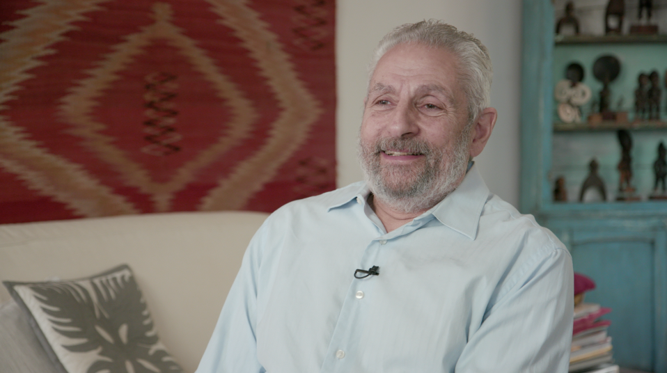
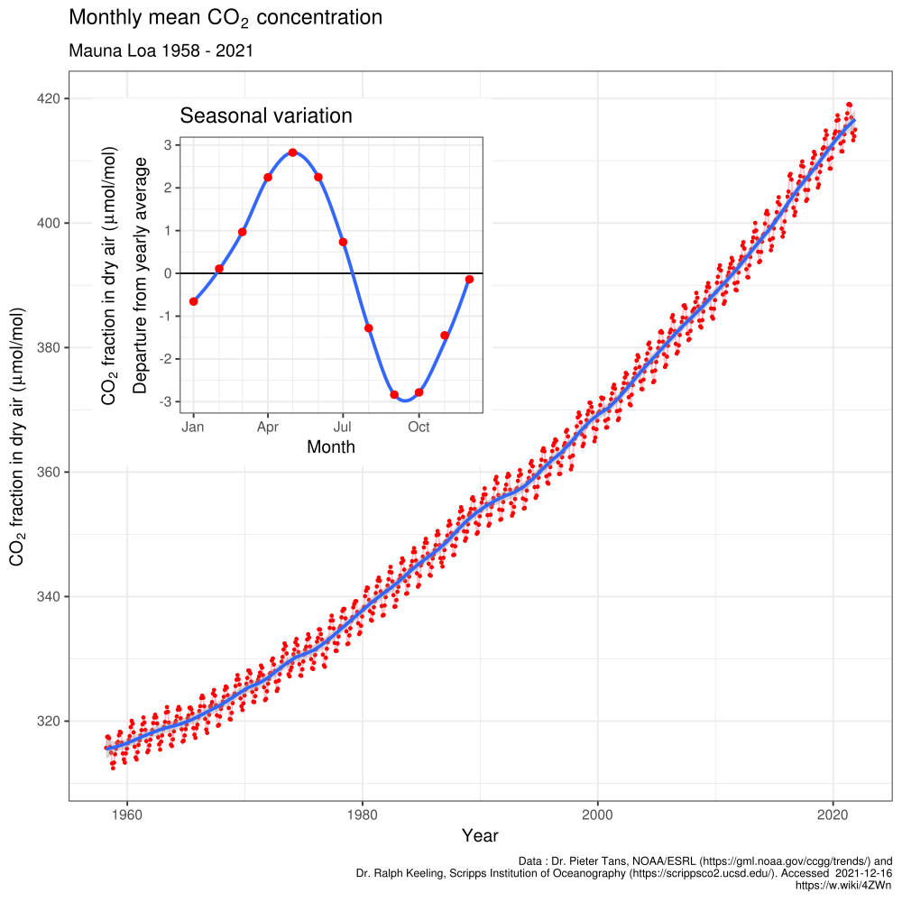
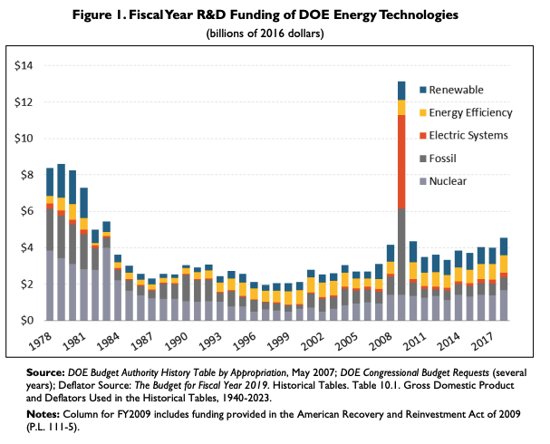
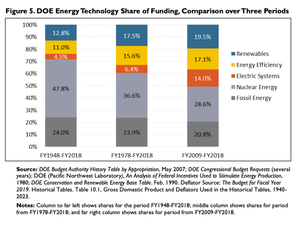
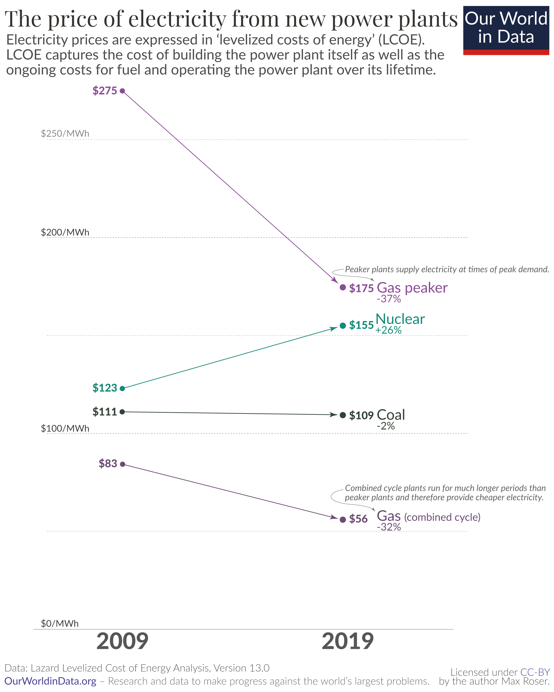

Dr [Spencer R. Weart](https://en.wikipedia.org/wiki/Spencer_R._Weart) served as the Director of the [Center for History of Physics](https://www.aip.org/history-programs/physics-history) at the [American Institute of Physics](https://www.aip.org/) from 1974 to 2009. He is the author of several books, including [The Discovery of Global Warming](https://www.goodreads.com/book/show/78687.The_Discovery_of_Global_Warming) and [The Rise of Nuclear Fear](https://www.goodreads.com/book/show/13601839-the-rise-of-nuclear-fear). In our conversation, we discuss:

* How climate science emerged, what it took for scientists to form a consensus in the mid-1960s, and how that consensus has evolved since
* The IPCC’s emerging understanding of so-called “tipping points” in the climate system, and our current best guesses as to what kind of threat they pose
* Exploring the changing cultural relationship humans have had with nuclear energy — and why it remains stigmatised amongst many environmental groups

## Spencer's recommendations

* [The Discovery of Global Warming](https://history.aip.org/climate/index.htm#contents) (and the [book of the same name](https://www.goodreads.com/book/show/78687.The_Discovery_of_Global_Warming)) by Spencer R. Weart
* [The Rise of Nuclear Fear](https://www.goodreads.com/book/show/13601839-the-rise-of-nuclear-fear) by Spencer R. Weart
* [Climate Change and the Nation State: The Realist Case](https://www.goodreads.com/en/book/show/49933568) by Anatol Lieven

## Resources on Climate Change

Throughout our interview we discuss Spencer's website [Discovery of Global Warming]( https://history.aip.org/climate/index.htm#contents) – "a hypertext history of how scientists came to (partly) understand the problem of climate change".  Below are some notes I took in preparation for the interview. You can find much more detail on the website itself. If you want to dig in deeper into the science, I also recommend [Skeptical Science](https://skepticalscience.com/) as an online resource, which rebuttals climate misinformation and debunked theories.

### Early Science

* Most research begins with flawed theories, which will drive people to propose better ones. Many papers, perhaps most of them, harbour misconceptions or plain errors. After all research by definition operates past the edge of the known. 
* The theoretical possibility of climate change was posited back in the 1800s. In the 1820s [Joseph Fourier](https://en.wikipedia.org/wiki/Joseph_Fourier "Joseph Fourier") proposed the [greenhouse effect](https://en.wikipedia.org/wiki/Greenhouse_effect "Greenhouse effect") to explain why Earth's temperature was higher than the sun's energy alone could explain. In 1856 [Eunice Newton Foote](https://en.wikipedia.org/wiki/Eunice_Newton_Foote "Eunice Newton Foote") demonstrated that the warming effect of the sun is greater for air with water vapour than dry air, and even more for CO2.  Three years later, [John Tyndall](https://en.wikipedia.org/wiki/John_Tyndall) found similar results, and his are now commonly regarded as `foundational to climate science'.
* People believed that many stabilisation mechanisms were in place, in particular that the oceans would just absorb excess CO2. However, [Roger Revelle](https://en.wikipedia.org/wiki/Roger_Revelle) realised in 1957 that because of sea water chemical makeup it would.be re-emited soon after [see Spencer's [essay](https://history.aip.org/climate/Revelle.htm)]
  * A secondary proposed stabilisation mechanism was the vegetation effect, whereby more atmospheric CO2 would stimulate plant growth, which turn helps absorb excess CO2. However, as we know now, at some point CO2 no longer becomes the constraining growth, and excess CO2 might actually lead to soil erosion or dark leaves absorbing more radiation
* Early climate forecasts didn't take into account exponential economic growth, instead assuming linear growth. Hence forecasts like Plass (1956) predicted that human activity would raise global average temperatures by 1.1 degree Celsius per century

### Early Observations

* It was hard to know if CO2 was rising because imprecise measurements, especially because the levels of atmospheric CO2 where still very low. So it was very hard to make out trends from noise.
* Moreover, the rise in dust pollution worked in the opposite direction from the rise in CO2 so nobody could say whether there would be cooling or warming. Some scientists extrapolated out the [Milkanovitch cycles](https://en.wikipedia.org/wiki/Milankovitch_cycles) (variations in Earth's orbit and tilt, affecting the planets worried) and became worried that earth was experiencing global cooling as it was heading to an ice age
  * In fact, some early climate models calculated a temperature rise twice that historically observed. Scientists did get the CO2 increase right but didn't incorporate the partially offsetting `human volcano' from polluting aerosols
* "*The temporary cooling from the 1940s to the 1960s (in the northern hemisphere) had been bad luck for climate science. By feeding skepticism about the greenhouse effect and by provoking some scientists and many journalists to speculate publicly about the coming of a new ice age, the new cool spell gave the field a reputation for fecklessness that it would not soon live down*"
* It was only in 1960 that the [Keeling Curve](https://en.wikipedia.org/wiki/Keeling_Curve) became the first "proof" of Earth's increasing atmospheric CO2 concentration. [see Spencer's [essay](http://history.aip.org/climate/Kfunds.htm)]

### Many interwoven threads

* **Computing**: In the 1950s, scientists began to try and model the climate with computers. However, predictions from such  early models appeared very fragile — even a difference in fifth decimal point on the grid (i.e. a truncated error) would change predictions completely past 20 days. When it came to climate, "there was no long run average to speak of". This intersected with chaos theory, whereby a butterfly wing. By the mid 1970s, many experts found it plausible that at some indeterminate point a small push could trigger severe climate change. [see Spencer's [essay](http://history.aip.org/climate/simple.htm)]

* **Ice Ages**: Early studies of climate change were focused around trying to explain large movements in glaciers. New ice drilling evidence showed that — unlike longhand consensus — there weren't four ice ages that unravelled under tens of thousands of years, but many `mini' ice ages that took sometimes only took hundreds. Paraphrasing Spencer's book, "in the 60s scientists believed ice ages must take tens of thousands of years, in the 70s thousands of years and in the 80s hundreds of years, could actually happen in a few decades." [see Spencer's [essay](http://history.aip.org/climate/cycles.htm)]

* **Ozone Layer**: Experts thought that CFCs were environmentally sound. They were produced in relative small quantities. And they were extremely stable, never reacting with animals and plants. It turned out that the stability itself made CFCs a hazard. They would linger in the air for for centuries and eventually some would drift up into the atmosphere. There UV rays activated them and they became catalysts in a process that destroyed the ozone. This didn't have anything to do with climate change per se. But it demonstrated damage of human pollution, fragility of atmosphere, and that the resulting Montrealt Protocol showed the international community could rally around a scientific message.

### Forming a Consensus

* Early climate science was funded by the US military as part of its fundamental research. Part of this was motivated by early hopes of weaponising the weather. Scientists working on climate change were often doing so as a "side gig".
* But warnings from scientists did reach high-level decision surprisingly pretty quickly!
  * In 1965, the Presidents Scientific Advisory Committee formed a panel on environmental issues including a sub-panel of climate experts who put greenhouse effect on official agenda at highest level of government
  * In 1966, the National Academy of Scientists published report on climate change, observing that it was a real and possibly drastic threat. However, to quote Spencer, **"The primary conclusions was typical of such reports — a maxim that came from the heart of scientists belief in their calling — More Money Should Be Spent on Research"*
* In 1979, The National Research Council released published the “[Charney Report](https://en.wikipedia.org/wiki/Jule_Gregory_Charney#Charney_Report)” – a set estimate of the climate sensitivity, that is  how much Earth would warm if it's CO2 concentration doubled. It split the difference between Hansen's General Circulation Model (~4C) and Manabe's latest figures (~2C), giving a 3C best guess with a 1.5-4.5C range.
  * This result has remained surprisingly consistent for over 40 years now. The IPCC didn't revise it until 2007, and it is now very close at 2.5-4C. However, note that climate sensitivity does not speak as too how much CO2e humans will actually pollute
  * For more details on today's "multiple methods" to calculate climate sensitivity (including models, instruments, paleo evidence, and combined approaches), see this [explainer piece](https://www.carbonbrief.org/explainer-how-scientists-estimate-climate-sensitivity/).

<iframe scrolling="no" frameborder="0" marginheight="0px" marginwidth="0px" style="display: initial; margin: 0 auto;" src="https://cbhighcharts2021.s3.eu-west-2.amazonaws.com/ipcc-ar6/climate_sensitivity_qa.html" width="770px" height="500px"></iframe>

### Science and Politics

* Initial environmental fears weren't focused around global warming at all. Instead they were mostly about nuclear testing changing weather and chemicals. To quote Spencer,
  * "*The charged language of defilement and transgression rarely appeared outside the nuclear and chemical controversies. But for climate too many felt that natural processes somehow followed not only scientific law but also moral law. Since prehistoric times tribal people had attributed climate troubles such as an unusually bad winter to the violation of a taboo and in modern times it bit unknown for preachers to get forgiveness in their prayers for rain. Once people began to grasp that human tech actually could alter the planetary system for better or worse journalists found it easier to suggest that burning fossil fuses could change the climate*"

* However, climate change became a much more political topic in 80s, where it became associated with the green movement and set against the deregulation pro-growth politics of the times. Throughout the decade, US public awareness of the Greenhouse Gas effect rose from 38% to 79%.
  * Though it is also worth noting that Margaret Thatcher was the first major world leader to call out climate changed. As Spencer notes, it may have helped she was a chemist (see this [article](https://www.theguardian.com/science/political-science/2013/apr/09/margaret-thatcher-science-advice-climate-change), for example)

* Scientists themselves also called for more political action in the 1980s. In 1988, the [Toronto Conference](https://en.wikipedia.org/wiki/Toronto_Conference_on_the_Changing_Atmosphere) saw scientists across the world discuss the need for an international response to climate change. In the same year, the [International Panel on Climate Change](https://en.wikipedia.org/wiki/Intergovernmental_Panel_on_Climate_Change) was created as a unique hybrid of a scientific and political body [see Spencer's [essay](http://history.aip.org/climate/internat.htm)]
* The IPCC set led to a new policy-science rhythm: IPCC reviews science twice a decade; international negations are held; nations take actions; repeat. Its first report in 1990 warned that global warming was underway but would take another decade before it could attribute it to humans. Its second report in 1995 reaffirmed the initial results, but this time attributed to humans with certainty.
* However, political action did not follow quickly. For example, the [Kyoto Protocol](https://en.wikipedia.org/wiki/Kyoto_Protocol) (1992) showed climate change was now linked to power struggle between rich and developing — with the former not agreeing to make cuts unless. The US senate rejected it 95–0.

## Resources on Nuclear Power

- [Renewable Energy R&D Funding History: A Comparison with Funding for Nuclear Energy, Fossil Energy, Energy Efficiency, and Electric Systems R&D](https://crsreports.congress.gov/product/pdf/RS/RS22858/17) — Congressional Research Service
  - An over view of how the US government has funded R&D for different energy sources. "For the 71-year period from 1948 through 2018, nearly 13% went to renewables, compared with nearly 5% for electric systems, 11% for energy efficiency, 24% for fossil, and 48% for nuclear."

- [Further Energizing Innovation in Fiscal Year 2023](https://itif.org/publications/2022/05/13/further-energizing-innovation-fiscal-year-2023) — ITIF
  - An overview of the US Department of Energy RD&D budget for FY 2023

The report above contains these two useful graphs. First, R&D funding of energy technologies over time:

Second, energy technology share of funding over three periods:

- [Why did renewables become so cheap so fast?](https://ourworldindata.org/cheap-renewables-growth) — Our World in Data
  - "Fossil fuels dominate the global power supply because until very  recently electricity from fossil fuels was the cheapest. This has  changed dramatically. In most places power from new renewables is now  cheaper than new fossil fuels."

This graph from [Our World in Data](https://ourworldindata.org/cheap-renewables-growth) shows how the price of electricity from nuclear power plants has risen, in contrast to other sources —

## Transcript

### Introduction

**Luca 0:05** 

Hey, you're listening to Hear This Idea. In this episode we talk to Dr. Spencer word, who served as director of the Centre for the History of Physics at the [American Institute of Physics](https://www.aip.org/) from 1974 to 2009. Spencer is also the author of several books, including [*the Discovery of Global Warming*](https://www.hup.harvard.edu/catalog.php?isbn=9780674031890), which has turned into a much more extended online version and which we spend a lot of this episode discussing. Amongst our many topics, we talk about how climate science emerged, what it took for scientists to form a consensus on climate change in the mid 1960s, and how that consensus has evolved since. We then also talk about the [IPCC](https://www.ipcc.ch/)’s emerging understanding of so-called tipping points in the climate system, and our current best guesses as to what kind of threat they actually pose. And lastly, we turn to one of Spencer's other books called [*Nuclear Fear*](https://www.goodreads.com/book/show/1174891.Nuclear_Fear), which looks at the changing cultural relationship that humans have had with nuclear energy, and why it remains stigmatised amongst many environmentalist groups. I've definitely found Spencer's work to be some of the most insightful reading I've done this year. For one, I think that's because despite having heard a lot about climate change in the news, it turns out I just actually really underrated how nuanced and complicated our understanding of the climate system is. I think as Spencer puts it, understanding how scientists themselves have wrestled with these really hard questions over several decades, taking many twists and turns - it just gives you a really great insight into understanding these ideas yourselves, and as I said, how nuanced some of these ideas are. I've definitely had no idea just how little we know about clouds and how important that actually is to understanding how bad climate change could get. But even if you're not interested in climate change itself, I think there are still many important meta lessons to take away on a research level that includes how to approach a problem that just has a lot of deep uncertainty. And that requires you to organise many different disciplines, to collaborate, and probably also requires you to change your deeply held assumptions on several occasions. And then on a policy level, I think some of the takeaways include how to communicate complex topics to decision makers, and also pushing for what at least on the onset are some pretty radical and possibly unpopular policies and turning these to actually be part of the mainstream. So even though this recording ended up being two parts, I still think we could have talked for much longer. If you're interested in learning more, I suggest you check out our links in the write up and also visit Spencer's own website [history.aip.org/climate](https://history.aip.org/climate/index.htm). But for now, without further ado, here's the episode.

**Spencer 2:23** 

Okay, well, my name is Spencer Weart, I'm trained as a physicist. Most of my career I’ve spent as director of the Centre for History of Physics at the American Institute of Physics. So I've been a historian of science and currently my main activity is updating and maintaining my large website on the discovery of global warming.

**Luca 2:44** 

Well, let's start that up with this framing around the discovery of global warming, because it's something that before your work I hadn't really thought of much before. You know, I'm a guy in his young 20s, the idea of climate change has, to me at least, been with me most of my life. And it just seems very obvious that global temperatures are rising, that human greenhouse gas emissions are the driving force behind this, and that resulting climate change will be a really bad thing for humans. But as you point out in your work, none of these things were necessarily obvious, and are even fairly recent discoveries in some cases. And in fact, this process of scientific discovery has a really super interesting history behind it.

**Spencer 3:23** 

Yeah, well, the reason I switched from physics into the history of physics was because I felt that for many people, the best way to understand something is to understand the history of it. That's true, both in science when we start with the simple things, historically, and it's also true of politics and the social things around it. If you don't understand the history, it's like being a person without a memory, you really don't know how you got here.

**Fin 3:47** 

That's interesting. I feel like personally, I would have said, that's definitely true of politics, and it's less clear for me of physics. Can you say more about why it might be useful for me, if I'm a physicist, to understand the history of my field?

**Spencer 3:59** 

Because so often, it starts with the simplest problems, and if you see how the scientists themselves work through it, then it's a good way to understand the science sort of along with the scientists themselves. But it has a deeper thing; you don't really expect everybody to understand the equations of radiative transfer, but everybody can understand the scientific process. That's actually something that you ought to be using in your own life, you know, evaluating evidence and facts and coming to conclusions. So it's valuable to understand the science, it's essential to understand the scientific process.

### Zombie ideas in climate science

**Luca 4:34** 

Yeah. And it definitely felt to me that one of the main takeaways from your books was really just championing that scientific process. If we think that it took many decades for scientists to get to grips with the ideas of climate change, then a naive interpretation might be that maybe the case for global warming just isn't that strong, and that science has a tendency to be wrong or be overconfident. But I think really, as you point out, it speaks much more to how rigorous this work has been that the scientific consensus has in fact changed when new evidence comes to light and that lots of skepticisms around climate change have been seriously explored and tested. And that really 1000s of people have been involved in this process and double checked a lot of a lot of work.

**Spencer 5:14**  

There's an additional thing which applies in climate science, much more than in other fields of science, which is that it's become a big political issue. And people came up with all sorts of reasons as to why we shouldn't believe that humans are causing climate change. And each of these ideas came up, were seriously considered by scientists and refuted, and yet these ideas are still around. Now nothing disappears on the internet - they're what we call zombie ideas. And people run across them. And they ask, ‘Oh, that sounds reasonable’. And if you understand the history, you'll understand exactly the fact that scientists also puzzled over these things and decisively refuted them.

**Fin 5:55** 

Can you say more about zombie ideas?

**Spencer 5:57** 

Yes, I think the phrase, while it was, perhaps not developed but popularised by [Paul Krugman](https://en.wikipedia.org/wiki/Paul_Krugman), who talked about zombie ideas in economics - that people still have ideas about economics that were decisively dismissed by, you know, real professional economists, decades or even generations ago. And the same thing holds with global warming, you can go out on the internet and you can see all sorts of arguments for why you shouldn't believe in global warming, ideas that might have been taken seriously by scientists in the 1970s or 80s, but are now - an example, I think you can find on polls and so forth that 10 or 20% of the public believes that global warming is probably caused by changes on the sun. Which actually, when I was a physicist, I was a solar physicist, so I followed this controversy from the beginning. And for a little while, I thought, ‘well, this is probably not true but there's a valuable argument there’. And then eventually, it turned out to be total garbage. But you can still easily go on the internet, and find the argument that global warming is entirely caused by cyclical changes in the sun.

### Early climate science

**Fin 7:07** 

Right. Well, how about we go even further back in history, then? I'm curious to know: when do you think the idea of the greenhouse effects was first proposed, roughly speaking?

**Spencer 7:22** 

We know exactly because it was proposed by a French scientist named [Joseph Fourier](https://en.wikipedia.org/wiki/Joseph_Fourier), back in the 1820s. And he actually didn't use the analogy of a greenhouse, he used the analogy of a ‘cold frame’, which is a little box with a piece of glass on top of it, that you use to incubate seeds in the winter or in cold weather. And he said, well the earth - he had what was not now accepted as a good argument but it seemed a good argument at the time - that if you take a rock and put it at the earth’s distance from the Sun, it should be very cold. Well, we actually with modern science know that is true. If you've just have a bare rock, like let's say, the dark side of the moon, it will be extremely cold being at this distance from the Sun. So Fourier asked, ‘Oh, what keeps this from happening?’ and the only thing that could do it was the atmosphere. So he compared the atmosphere with a pane of glass, just like on one of these cold frames. And then later on, people said, ‘Oh, well, actually, let's call it a greenhouse. Only some people use cold frames, but everybody knows what a greenhouse is’. It's actually not a very good analogy, because the greenhouse mainly works by just keeping the hot air trapped inside. But nevertheless, it's basically the idea that the atmosphere keeps infrared radiation heat rays from escaping. So Fourier understood this, and it was, I think, quite rapidly accepted by the very few scientists who had any interest at all in these things.

**Fin 8:59** 

Okay, interesting. Is this the same Fourier of [Fourier analysis](https://en.wikipedia.org/wiki/Fourier_analysis)? 

**Spencer**

Yes.

**Fin**

Cool, some legacy! 

**Spencer 9:06** 

Yes. He had some kind of an unfortunate health condition, which meant that heat bothered him tremendously. He went to Egypt with Napoleon and couldn't stand it, and he had to wear heavy clothing all his life and in fact died by tripping on the stairs over his robe and falling down the stairs.

**Luca 9:28**  

I'd love it if you could speak to how Fourier’s idea of the greenhouse gas effect was received by other scientists at the time?

**Spencer 9:36** 

Well, again, there were hardly even any scientists in those days. There were very few people, fewer still were concerned with questions of heat. But the ones who did thought ‘oh, it makes sense’ and like many ideas of the time, it was an idea that made sense but remained to be proven and it was actually proven by [Tyndall](https://en.wikipedia.org/wiki/John_Tyndall). Well, Tyndall was more interested in cold and for two reasons; in the first place, by Tyndall’s time the ice ages had been discovered, although it was still controversial. The idea that at some time, you know, 100,000 years ago, all of Northern Europe had been covered by miles of ice. And the evidence seemed pretty strong, and people began to wonder how could it be possible for, you know, for the earth’s temperature, the earth’s climate to change so radically? Of course, they thought it took hundreds of 1000s of years, so it wasn't anything of immediate concern, but it became one of the great scientific problems of the 19th century: what caused the ice ages? And Tyndall said, ‘Well, if Fourier is right, then the changes in the composition of the gases in the atmosphere could change it.’ And he had a second reason for being interested in this because he was an alpinist. He made some first ascents in the Alps - he almost fell into a crevasse and died on a glacier! So he had a great interest in the physics and so forth of ice. So Fourier, being a consummate experimentalist, devised an apparatus whereby he could actually measure the transmission of heat through gases. And so he tried the normal gases in the atmosphere: oxygen and nitrogen - which by the way, you couldn't just buy them off the shelf, you had to make them yourself - and he found that oxygen and nitrogen were transparent to gases, so he was rather puzzled. But in his laboratory, you know, he had a Bunsen burner he used for making his glassware and he had a gas jet, so he tried what they called ‘coal gas’ in those days, it was generated from coal, it's mostly about natural gas, now, mostly methane, and he found that it blocked the heat raise as effectively as a piece of wood. So that encouraged him to go on and try other gases. And he eventually found that two gases are mainly responsible for it: one is carbon dioxide, and the other is water vapour. So then he went on and developed this to a great extent. But before I go there let me go back to your initial question, how well this was accepted? And there's an interesting footnote, if you will, that shows how widely Fourier’s idea was accepted. And that is a feminist and amateur artist in the United States named [Eunice Newton Foote](https://en.wikipedia.org/wiki/Eunice_Newton_Foote) who had the idea of ‘let's put some gases in glass tubes, and put them outside, or you know, put them in sunlight and see what happens’. And she found that the tube containing carbon dioxide got hotter than normal air, and she correctly figured that it was trapping the heat rays. And he said, well, even perhaps indeed it was changes in the carbon dioxide content of the atmosphere, from volcanoes or whatever, might have explained the ice ages. And this even got published in short form. But there were three problems. In the first place Eunice Foote was an amateur, she'd never published anything else, she was totally unknown. Second, she was a woman, and that always was a strike against you in those days. And third, she was an American and people in those days, scientists from Europe paid very little attention to what came from America. So as far as we know, although she first discovered the carbon dioxide greenhouse effect, a century passed before anybody realised that she was the first one, but it does show that the idea was already widespread before Tyndall, in this case a year before Tyndall.

**Luca 13:50** 

Yeah, that's a really fascinating point. And I think, again, a reminder of how science and society are linked. You mentioned here that a lot of the early work was motivated by trying to understand the ice ages, which I guess is more looking in the past, rather than ahead in time.

**Spencer 14:09** 

Yeah. Well, it was looking ahead in the sense that there was the question ‘when will be the next Ice Age?’ Nobody expected it for 100s or 1000s of years. But nevertheless, it was an interesting question, because by the late 19th century, they recognised that there had been a series of advances and retreats of the great ice sheets, so they presumed that sooner or later - one would hope 10s of 1000s of years later - the ice would come again.

**Luca 14:38** 

Yeah, well, can you maybe speak to that a bit more? I know, for example, that our understanding of how quickly ice ages can come about has changed a lot over time and in turn affected our understanding of climate change too.

**Spencer 14:50**  

Okay, well, that came first from deep sea cores. If you pull up a core of sea of clay from the bottom of the sea - and this was, people began doing this in the 50s, and 60s - then you can extract from the clay, tiny fossil shells, and by an analysis of the isotopes in the shells, you can determine the sea surface temperature at the time that the shell formed and drifted to the bottom of the ocean. And the ice ages showed up very clearly in this. And you could see that the ice ages last 10s of 1000s of years and that the end of an ice age took place over the span of 3000 or 4000 years. It seems that there's another story there, which is that when these layers were laid down, there was what's called bio-probation - little worms go and stir them around. So you can't really see anything that happened in less than a few 100 years, because it's all stirred up. So nobody was looking in these things for rapid climate change. And the general idea, and we're talking now in the 1960s and 70s, was that it would take several 1000 years and we would drift slowly into an ice age, which is by and large true. We know now and that's a story we can get around to later on, perhaps. We know now that things can happen, there's glitches in this process, things can change very suddenly. But the general drift to an ice age takes 1000s and 1000s of years. And this was well understood by the 1970s.

**Fin 16:35** 

And so it sounds to me like over the course of the 60s and the 70s, and into the 80s, as we began to better understand the mechanics behind ice ages, we began to appreciate just how much more sensitive the climate was to fairly small changes such as in CO2 and methane concentration.

**Spencer 16:58** 

Exactly. And the key here was from these sea bed things, and also, these were, you know, in science it’s not enough to find something. People say, ‘Oh, you have to repeat the experiment.’ No, that's not what scientists want to do. They want to find the same results with completely separate means. So there was one of the great heroes of the story, a guy named Willie Broker who only died recently, went tromping around the world to places like dry lake beds in Nevada and coral reefs and so forth. And found there other ways to measure the process of the Ice Age. He saw that the dry lakes in Nevada had filled and emptied with the ice ages. The coral reef showed how the sea level had gone up and down as the ice formed and melted. And so he got very similar results and this corroborated the sequence, the schedule of the ice ages, which has been found in the sea cores, and which was completely different from what the geologists had said. These geologists had converged on something like four great ice ages over the last million years from their evidence of the rocks being pushed around and so on. But it turned out that there have actually been like a dozen over the last million years, we'll go back 40 million years actually. And they were very regular. You could do a - to go back to Fourier - you could do a Fourier analysis and find what the periodicity of them was, and to everybody's surprise it matched a schedule that had already been laid out mathematically in the 1930s by a Serbian mathematician and meteorologist named[ Milutin Milanković](https://en.wikipedia.org/wiki/Milutin_Milanković). Milanković had said: well, you know, the Earth's orbit around the sun is not exactly perfect. It's influenced, especially it gets kind of pulled out of shape as Jupiter goes around. So sometimes it's more nearly circular and sometimes it’s a little more elliptical. Sometimes, as at present, during northern hemisphere winter, we're actually closer to the Sun than during northern hemisphere summer. But other times we might be farther from the Sun during northern hemisphere winter. And what difference does it make? Well, it makes these subtle changes in sunlight as they fall on the Arctic, okay. And so what that means is that the ice will melt in the snowbelt a little earlier or a little later, depending on these astronomical things. And the astronomical timetable exactly matched the actual timetable of the ice ages. Well, these are just tiny little changes in sunlight. How could they do that? And so people at this point, and this was in particular, there was a meeting in Boulder in 1965, when they brought together the solar experts and the volcano experts and the seabed experts, oceanographers, all these different specialties, and computer experts. And what they came out with was, well, the climate system must be very delicately balanced; it just takes a little thing to set off an ice age. And so this was tied in with the origins of chaos theory and the understanding that the flap of a winged butterfly in Brazil can set off a tornado in Texas and that kind of thing, that some natural systems are delicately balanced. This was in contradiction to what most people had believed for generations, there was a long standing belief that the earth is in a natural balance, that there is a balance of nature. You don't have to track it back very far to find that it's a ‘God-given balance of nature that the earth is a fit habitation for human beings’. And so scientists have various ways of showing well, there are stabilisation mechanisms, there are feedbacks, what we call negative feedbacks, which, negative feedback is good because if you get out of shape, it pushes you back to the normal thing. And people had believed that these negative feedbacks would completely dominate any kind of changes. For example, that if you put more carbon dioxide into the air, and we haven't talked about that yet, but if humans put more carbon dioxide into the air, the then the oceans will absorb it, or if they don't go there, if it warms up a little bit, then of course, there's more moisture so clouds will form and reflect sunlight back. So there's these natural mechanisms that will keep everything stable. And it was around 1965, that people began to question this.

**Fin 21:34** 

Right. So just to try saying back what I've heard there: this sounds like a fairly big radical reinterpretation of how the climate works. So it sounds like before around this point, in the 60s, there was this view that climate was some enormous, fairly slow moving, and crucially, self correcting system is a bit like, you know, if you tried to tip over a cruise ship by pushing, and it'll just just kind of bounce back very easily. But now there's a new understanding that, in fact, the climate is very sensitive to very small perturbations. So a bit like how, you know, a butterfly can cause a tornado in Kansas by flapping its wings in Singapore or something, there are these kind of chaotic dynamics, then, that people were first beginning to appreciate around this time. Does that sound right?

**Spencer 22:19** 

Well, there's actually two things going on here. One is the climate and the other is the size of the human perturbation. So let me back off on that one a little bit. Okay, we'll go back to [Arrhenius](https://en.wikipedia.org/wiki/Svante_Arrhenius), in 1897, who was the first person to make an actual calculation. By that time they knew enough about carbon dioxide and so forth that Arrhenius thought he could make an actual calculation of the greenhouse effect. And his interest, of course, was primarily to find out whether the greenhouse effect of carbon dioxide could in fact, be sufficient to cause an ice age. And he went through a year of pencil and paper calculations. It is believed that he did this because he had gotten into a marriage with a scientist, which was a mistake in the late 19th century, because he wanted her to be a housewife. So she left him and took their little boy and he was devastated. And it's believed that that's why he was willing to spend a year sitting down doing pencil and paper calculation, which now you can probably do on your wristwatch in 10 seconds. But at any rate, he calculated that if there was, you know, something happened and volcanoes stopped or whatever, and the carbon dioxide in the atmosphere was cut in half, it would be enough to cause an ice age. You would lower the temperature by several degrees, which averaged over the entire world is definitely enough to cause an ice age. And that was a colleague of his, of the name of[ Högbom](https://en.wikipedia.org/wiki/Arvid_Högbom), who had been studying the motions of carbon dioxide and how much volcanoes produced and so forth. And he had come to the conclusion that, as of that time - the late 19th century - humans were producing as much carbon dioxide as volcanoes were. Humanity had become a geological force. Now, at that time, he and Arrhenius thought that well, the oceans will of course, take up most of it. So it will take centuries before there's much warming. And of course if you were in Sweden, which was where they were, then a couple of degrees of warming did not sound like such a bad idea. So they weren't too worried about it. Now we will skip forward to 1957 because it's the first time that anybody really took this very seriously. [Roger Revelle](https://en.wikipedia.org/wiki/Roger_Revelle) was a consummate oceanographer, one of the principal oceanographers of his generation, you know, understood seawater chemistry very well, realised that sea water doesn't take up carbon dioxide as rapidly as you would think. Because if you add carbon dioxide to sea water of course it makes it more acidic. You're creating a little carbonic acid. But if you change the pH of the seawater that way, then some of the carbon dioxide will evaporate back out. Seawater is actually not just saltwater, it has all kinds of things - boron ions play a role in this. And so it’s a ‘buffered solution’, what the chemists called a buffered solution, it resists change. So, because of the acidification, seawater would only take up half as much carbon dioxide as people had thought. So Revelle thinks, ‘Well, that means you know, if you go back peraneous then well, maybe it won't be, you know, a millennium, but it'll be several centuries before things get warm’. But then, here's something else that was happening in 1957: people were beginning to recognise that we had entered a phase of exponential growth. It seems hard to grasp this, but in the 1930s, people at best imagined linear growth. I mean, there was depression, there were wars, linear growth of humanity and industry on that, we're on a sort of a steady upward thing, or, you know, nobody even thought of China and so forth as industrialising. In Revelle’s time, he realised that it was an exponential - there was doubling like every 30 years, so that we're now twice as many people as in Arrhenius’ time, and there was twice as much carbon dioxide produced per person because of industrialization. And he realised that well, another 30 years is going to be four times as much people and four times as much industrialization, and 16 times as much carbon dioxide would be produced as in Arrhenius’ time and so Revell, for the first time said, ‘Hey, wait a minute, by the start of the 21st century, global warming will be visible. So this is the other side number one, that climate is sensitive. And number two, that we're banging on it with a big hammer.’

### Stabilisation mechanisms

**Luca 26:58** 

But before we get more into the human emission aspect here, I'd love to hear a bit more on this topic of negative feedback loops, which as you described, seems like it was a pretty persistent idea among scientists. You mentioned that one thought was that CO2 would just get kind of absorbed by the oceans, and kind of prevent global warming that way. But can you describe some of the other mechanisms that have been proposed and how scientists think about these now?

**Spencer 27:23** 

Well, first, let me start with the clouds because that was what the people actually mentioned back in Arrhenius’ time. That is something that has actually only been sorted out in the 21st century. And indeed we’re still trying to get an accurate understanding of what's happening to clouds. So for a long time, people were arguing that the increase of clouds would be enough to prevent global warming. Warm air holds more moisture, right? As you know, it's more humid in the summer than the winter, right? You need a humidifier in the winter. There's an equation for how much moisture you add to the air when it warms up. So, if you have global warming the air will hold more moisture. Actually, this is the main factor in the greenhouse effect. Water vapour is a much more important gas than carbon dioxide. However the Earth is a very wet planet. And water vapour, you know water in the atmosphere rains out in a week or so, whereas carbon dioxide lingers in the atmosphere for many centuries. So carbon dioxide acts as the regulator of the average temperature of the atmosphere and therefore it acts as a regulator of how much water vapour is in there. So if Earth were a completely dry planet adding carbon dioxide does a certain amount and might warm it up one degree but throw in the water vapour and all of a sudden you get a lot more water vapour and that adds another couple of degrees to the warming. Okay, so a warmer atmosphere has more water vapour which incidentally is one of the reasons why catastrophic forest fires are increasing. The forests are wetter in the summer. Yeah, okay, so it seems natural that if you have more water vapour, you're going to have more clouds. Unfortunately, what seems natural isn't always the case. There are 100 different types of clouds. They have different effects. Some clouds reflect sunlight, and cool the Earth. Some clouds are kind of thin and they reflect carbon dioxide. There's tropical clouds, there's some clouds which are the result of convection which carries heat to the atmosphere. It's hideously complex and I could talk for an hour in very boring terms as to how people have tried to come to grips with the effects of clouds. Suffice to say that as late as the 1990s there were serious scientists who thought that increasing cloudiness would retarget global warming and there were a few old curmudgeons who said that it would prevent global warming altogether. And it's only I would say in the last 20 years that we've come to understand that global warming actually, on the net decreases cloudiness, or at least decreases the kinds of clouds that would help keep the earth cool. And there's additional worries that if we made the earth's temperature really hot, the clouds, you know, might even disappear. But fortunately, that doesn't seem likely. But it's something that took a very long time to sort out.

**Luca 30:37** 

Yeah, it's really fascinating. I mean, as an outsider, it just seems so bizarre that clouds really seem one of the key open questions of climate change, and yeah, how bad things could get. Yeah, it's definitely not something I would normally have thought to associate with it. Can you describe some of the other proposed self correcting mechanisms? One I definitely want to touch on is the vegetation effect.

**Spencer 31:03** 

Vegetation, that's another matter. And there's a lot going on there. Carbon dioxide is a fertiliser, so the earth is getting greener. On the other hand, the forests in Siberia and Canada are marching northward and they’re dark, because compared with the snow, so they add to global warming by adding their darkness to it. So vegetation is very important for taking carbon dioxide out of the atmosphere. There's a wide variety of effects there. The whole idea of vegetation and the effect of biology is, again, something that has preoccupied many scientists for many years. It's kind of a side issue. You see, this is why I did a website, okay. Because there's 20 different stories of global warming, and they're all taking place simultaneously. And especially in the early days, as the people who are in one strain had never even heard of the people in the other strain. This was why this Boulder meeting was important. It actually got the oceanographers and the volcanologists and so forth in the same room. But by and large, they've been many parallel stories. So you need all your NATO hyperlinks to follow it all!

### Interdisciplinary collaboration

**Fin 32:21** 

So it sounds like the history of understanding climate change is a history of many concurrent tracks - different kinds of people who really should have been talking to one another a little more. I'm curious to know, do you think that is still the case? Do you think there are still isolated groups working on climate change, who really ought to understand more about their respective fields than they currently do?

**Spencer 32:46** 

No, great strides have been made in that direction, as people came to realise the importance of climate change. There were important initiatives precisely to bring people together. And in fact, there were some fascinating interdisciplinary collaborations. For example, the computer modellers wanted to check their computer models against a different planet - we only have one planet to work with. And if you adjust your models so that they work precisely to reproduce the present climate, how will you know if they work with a different climate? Well, we do know a different climate and that's the climate we had during the ice ages. So let's try to model that. And then the question is, what was the climate in the ice ages? So enter from off stage, a totally different group of people, the paleoclimatologists, who have been digging up seashells from the seabed and stuff like that, and they say, ‘Well, your climate doesn't match our climate’. So then they get together over the course of years. They have meetings, they thrash things out, they exchange papers, whose climate is correct? Well, it turned out of course that both were incorrect. The computer modellers started out trying to make their computers match the paleo record and it didn't so the palaeontologist says you're wrong. But eventually it turned out that the palaeontologists said, ‘Oh, I'm sorry, we were wrong. You know, the fact that you couldn't beat your computer into submission shows that there must be something good going on in it.’ So that's just one example of hundreds of collaborations like this, which were organised, eventually, under the United Nations. The United Nations Environmental programme, and the World Meteorological organisation started to form collaborations of which of course, the climax was the Intergovernmental Panel on Climate Change. All climate scientists now are in a certain sense working for the IPCC, their workshops, everything they do, is organised around that. The computer modellers in particular, the IPCC report will only report on things that have been published before the report is finalised. So everybody has a deadline when they're going to publish. Well to computer modellers this is the deadline six years ahead. So they quickly buy their new computers and start gearing up their new models, and then get together and compare their models. Twenty different groups will get together at big international meetings to compare their models and find out why is this model doing that, and your model was better for this thing, and my models are better for that thing. And then they hasten to publish it just in time for the next IPCC report. And that's just an example of what happens in one field. So, in short, the IPCC and all the stuff that happens under it is unquestionably the greatest and best organised engine for the production of important knowledge that has ever existed. It's a remarkable development and entirely International and with great efforts being made to make sure that the developing nations have an adequate representation in the entire process.

**Luca 36:08** 

Yeah, there are just so many sub stories here that really all just deserve their own episode. You know, there's this political story here of how the IPCC came about. There is this also just fascinating story of how climate modelling has been, like, really deeply interwoven with advances in computing. Yeah, it just feels like, for every answer, there are just a tonne more questions, I really want to ask and kind of get lost in.

**Spencer 36:32** 

Ah, that’s the story of climate science!

**Luca 36:35**  

Yeah, let me maybe take a step back here and kind of try to touch on the lots of different themes we've talked about here and kind of emphasise what strikes me here as the the main narrative, which is that there is this big emerging shift happening in how we think about the climate. That before, we assumed that the climate was broadly in balance, and had all of these self correcting mechanisms in place, and that if things do change, we should expect things to change very slowly and gradually over perhaps many 1000s of years. And then also that if we are on any sort of long term trajectory, is that we're heading towards another ice age where things are getting colder rather than warmer. But then, as you've described, touching on all of these things, all three of these assumptions are now being questioned by the scientific community. And this actually seems to paint a much more fragile picture of the climate where things can go, kind of catastrophically wrong. And then this is finally linked with the economic insight that by the 1950s, humans are actually just producing a lot of greenhouse gases by virtue of economies rapidly growing and just having been around for a tonne of time that kind of builds up this cumulative stock. So surely, then, you would just expect that at some point humans should actually be able to see the impact that that we're having, or at the very least kind of hints of this global warming phenomenon taking place. So maybe with all of this elaborate context set up, I want to ask you, Spencer: when did we first start seeing this effect? In the temperature record? And why in some ways did it take so long for people to kind of pick up on it?

### Early climate observations

**Spencer 38:20** 

 

Okay, well, actually, people in the 1930s began to notice that climate was changing, at least around the North Atlantic, which was where everybody who counted was, and geezers in the United States says, ‘oh, it's warmer than when I was a boy. That lake he used to freeze over every winter’, and so forth and so forth. And by this time, they had weather records going back to the 1890s. And it turned out that the grandpa was right, that the thing had been warming. And everybody assumed that this was part of some natural cycle, you know, the whole idea of natural cycles, which you will still hear a lot of people talking about, ‘oh, it’s all just the natural cycle’. This idea was very prominent, and there’s nothing unreasonable about it. You know, the droughts come along in century long spells. Why not? So it seemed like a natural thing. And then especially as temperature records progress, by the time you get into the 1960s it seemed to have levelled off. Now bear in mind, this is all for the northern hemisphere. Nobody knew much about what the temperatures were in the southern hemisphere. We've been able to go back and reconstruct it using things like, you know, the seabed things and also logs from old whaling ships and so forth. We've been able to reconstruct the southern hemisphere temperature but in the 1960s and 70s, they really only knew the northern hemisphere temperature, and they saw that it had been levelling off, maybe even dipping a little bit, and some people suspected, which we now know is correct, that it was because of pollution - the atmospheric pollution and also haze from dust being kicked up from increasing agriculture and so forth. So there was this other human effect, which was coal smoke and industrial pollution and so forth that was actually bringing some cooling, as we now know only in the northern hemisphere. So there were even some ideas that well, they knew that we were going to drift slowly into the next ice age. In fact, it was a little mysterious that we hadn't already been getting cooler because if you follow the Milankovitch cycles then over the next few 1000 years, we should be drifting into a new ice age. That was just the actual natural cycle, that every 10,000 years or so you drifted into an ice age, slowly, but still, it was a little puzzling that we weren't even a little colder than we were now. And then now this pollution would bother it. So there were some scientists who said, ‘Well, we're actually going to have global cooling, because obviously, the pollution is increasing tremendously. And so we're going to have global cooling’. There were actually, it became enough of an interesting issue that somebody did a survey of climate scientists. And there were some who said they'd expect global cooling. There were about as many who expected there was global warming, and the vast majority, then said ‘who knows, we just don't have enough research on it to be able to say’, so it's not that there was a serious movement towards global cooling, it was, you know, just sort of, well, there's this other hypothesis that maybe, you know, maybe this could happen, and a very slow kind of a thing. And you know, 5000 years from now we'll be in our new ice age, or maybe even faster if we put up enough pollution. Well, this only lasted a few years, because by the late 1970s, people said, ‘Well, hey, wait a minute, you know, if we put pollution in the atmosphere, it's going to rain out in a few weeks’. Okay. And in addition, there's this thing called the Environmental Protection Agency, and all the advanced nations are starting to cut back on their pollution. Meanwhile, we put carbon dioxide in the air, it's going to stay there for 500 years, so by around 1978 the whole idea that there was big global cooling had vanished, and everybody agreed that there was going to be global warming. In addition, just around that time, the first models came out that people believed were models that could create a climate that looked like the present climate. This was the work of [Syukuro Manabe](https://en.wikipedia.org/wiki/Syukuro_Manabe) - “Suki” Manabe - and basically a weather bureau facility in Princeton had succeeded in making a model that looked kind of like the present climate. It had a dry southwest, it had rain bands, and you know, the tropical rainforests and so forth. It wasn't very accurate, you know, exact but it looked roughly like the present climate. So Manabe says, ‘Okay, let me put more carbon dioxide in the atmosphere, let me double the carbon dioxide in the atmosphere’. And oh the temperature rises a few degrees. And then there was another guy, another of the great heroes, [James Hansen](https://en.wikipedia.org/wiki/James_Hansen), who had a much cruder model that he could run a lot faster. So you can try out different things in it. And he tried out different ways of adding carbon dioxide and he got the temperature warming up. And in fact, this was serious enough for the President's science advisor, who happened to be a geophysicist, to say that there could be serious implications here, you know it might even affect our energy policies if we don't want to produce much carbon dioxide. 

**Fin**

And whenabouts was this?

**Spencer**

Oh, this is 1979. And so he did what presidential science advisors do, he went to the National Academy of Sciences to get a definitive answer. Now, the National Academy of Sciences doesn't always give a definitive answer, but they'll tell you what they know. They say they may just say ‘we don't know’. But they'll still tell you what the scientists know. So the National Academy of Sciences did what they do, which is they got together a committee of the best experts. The experts interviewed Manabi and Hanson. They tried running other models, they found that no matter what you did, no matter how crude or how sophisticated a model, you can't do anything that looks roughly like the present climate and not have the temperature rise several degrees, if you add more carbon dioxide, so they came to the conclusion that if you double the carbon dioxide in the atmosphere, which at that time they understood was likely to happen by the mid or late 21st century, which seemed very far off, that you would double the carbon dioxide and they said the temperature would rise by three degrees plus or minus 50% - a result which astonishingly is exactly what the current best computer models get, although the 50% has gone down to between two and five degrees, so that's a little higher on the lower. And they said, ‘We have tried, but failed to see any reason why this shouldn't be true’. So, you know, the National Academy of Sciences pronounced, ‘yes, as long as we keep on producing carbon dioxide, there's going to be global warming, enough to cause very serious consequences’. But hey, that's the mid 21st century - far, far away. So all we need to do now is what I call the official model of the National Academy of Sciences - ‘more research on this topic is necessary’.

**Luca 45:46** 

So this seems like another kind of distinct point in the history that you're telling where we see this consensus building now of there actually being human caused global warming. But I also just wanted to pick up on something you said much earlier on about air pollution, which is that it was just really surprising for me to hear, I guess as an outsider, about this duel effect, where on the one hand, greenhouse gases warm the climate, but on the other hand, some air pollution particles actually help reflect sunlight, and thereby actually cool the climate. And that in the early stages, perhaps of industrialization, that was actually enough to obscure what was going on. And even, you know, in the 1950s, also kind of throw climate models or throw climate scientists off as to like, what was happening?

**Spencer 46:29** 

Yeah, so yes, air pollution to this day is a significant effect. And it's a deep problem for the climate scientists, because, you know, coal pollution kills 10,000 people a year just in the United States alone, many more in China. And so we want less of this pollution. But the more you're cutting back, the more it accelerates global warming.

**Fin 46:52** 

I guess I wanted to underline this, just hearing what you're saying there, Spencer. It sounds like there was maybe a run of bad luck when we got this temporary cooling between, you know, the 40s to maybe the 60s, at least in the northern hemisphere, which kind of reinforced this global cooling hypothesis, which turned out to be false of course. However, my impression was that something like the climate consensus was global cooling until fairly late on where it flipped.

**Spencer 47:23** 

Absolutely not. No.

**Fin 47:26** 

That’s not the case? Yeah that's interesting.

**Spencer 47:27** 

No, no. People constantly bring up one Newsweek article on that. And actually, it wasn't the only one, there were a fair number of articles, there were scientists who seriously believed that an ice age was coming. But they were a minority of scientists. There was also a minority who warned about global warming, and the vast majority said, ‘Sorry, more research on this is needed. We're not willing to make a definitive statement’. And finally, in 1979, there was a consensus statement, really. The National Academy of Sciences reports - I'm not aware of any report by the National Academy of Science that ever got it thoroughly wrong, you think they might have given higher priority to things but as far as I know, when the National Academy of Sciences committee, because they are extremely cautious and conservative, they understand that they need to be cautious and conservative, if they say that x is happening, you can be fairly sure that x is happening. And that was 1979. Before that, literally, if you go even into the Newsweek articles, you'll find that the articles say, ‘oh, you know, everybody be excited to come buy our magazine! Look, there's going to be another ice age!’ And then the article says, ‘of course, many scientists disagree with this, and most of them say we can't really say.’

**Luca 48:46** 

On this topic of global warming versus cooling. There is one bit of scientific work that I wanted to particularly highlight. And that's [the Keeling Curve](https://www.nationalgeographic.org/encyclopedia/keeling-curve/). Can you speak to that Spencer?

**Spencer 48:56** 

Okay, so we go back down to 1957. Again, and as I said, that was the point at which for the very first time somebody - namely Roger Revelle, the prominent oceanographer - realised that the rise of carbon dioxide in the atmosphere could be a problem. But as I said, scientists don't like to repeat things. They like to corroborate it with some other thing. So he said, ‘Well, let's see if the carbon dioxide level in the atmosphere is actually rising’. And as it happened, he knew of another young postdoc in Southern California, which was where he was - a guy by the name of [Dave Keeling](https://en.wikipedia.org/wiki/Charles_David_Keeling) -a great gentleman, by the way; I interviewed him and he let me go into his files and so forth so I know quite a lot about his work. Dave Keeling. Loved to be outdoors. He was an outdoorsman, canoed, went under the mountains and so forth. So he had chosen as his postdoc a project to measure carbon dioxide in the atmosphere, which gave him opportunities to go out to pristine locations like mountain tops and so forth. And he was by far the best person in the world who knew how to measure carbon dioxide. So Revelle got some money to hire him to measure the carbon dioxide level and Revelle’s idea was, we’ll measure it in a few very pristine places; we'll measure it in Antarctica, we'll measure it at the top of this mountain volcano in Hawaii. And we'll measure what it is now in 1958, and then we'll come back in 20 or 30 years and see if it's gone up. Keeling was a fanatic for accuracy. All he ever wanted to do was measure things. He spent his entire career measuring things. He’s the first person to spend his entire career on climate change only by measuring carbon dioxide. And Keeling managed to measure the change in two years, he found that in only two years, he was able to see a rise of carbon dioxide in the atmosphere. And indeed, the rise to exactly the extent that Revelle had predicted it would rise from his understanding of the oceans. And that was the beginning of the famous Keeling Curve, which has risen ever since and which is now regarded as the icon of global warming. And it was not Revelle's paper, which people didn't pay much attention to at the time, it was this rise of carbon dioxide, which convinced most scientists to take this seriously. Because again, it was a visual demonstration that the human industry had become a geophysical force, we are more than volcanoes, and we have more influence on our atmosphere than all the volcanoes of the world.

### How climate change science influenced policy

**Fin 51:45** 

It sounds like we have this story taking place over the late 20th century, where we are learning about the mechanisms for climate change. We're also taking measurements, noticing changes in concentration of greenhouse gases, and forecasting out changes in temperature, other changes to climate. But of course, all of this matters insofar as it actually does damage or has an affect which people experience. So I'm curious, when did climate scientists start thinking about calling for something like, you know, political action, or just being worried about this?

**Spencer 52:21**  

Okay, well, it takes two steps. First was the prediction of impact. And then second was the question of what to do about it. So impacts were recognised at the start. Already in 1957, before he published his paper, Revelle was before a congressional committee telling them that the Arctic Ocean could become ice free, which at that time was particularly worrisome because the Russians were there. And that, I think I can quote, that Southern California and Texas could become real deserts. Already that early, they understood the prospects for a mega drought in the southwestern United States. But the most obvious thing was sea level rise. And by 1960, there was a committee brought together that had together, all the experts on global warming. There were about three of them and put them together with people from agriculture and so forth. And they said, well, they didn't really know what all the impacts would be, but they could be pretty sure that the sea level was going to rise and the coastal cities would be inundated. And again, go back to Revelle and people like that said, ‘When will this become obvious?’ And then everybody, from then on, for the next decade said, ‘Well, there's a lot of variability in temperature. So it'll be around the start of the 21st century, that we're going to begin to actually see the temperature rise and the impact’. Now we can only come to the question of when people began to worry about it in policy terms. Well, this really came to the fore during the energy crisis. There was the oil embargo. And well, there were two oil crises. But you will remember under the Carter administration, in particular, there were - you won't remember, but I remember - there were long lines of people trying to get gasoline and of course, the price of gas had shot up. So what are we going to do about that? Well, the Carter administration proposed to mine a lot more coal and convert it into gasoline, synfuels and so forth, which is an extremely dirty process in terms of carbon dioxide. And at this point, there were some scientists who said that is a bad policy. There were actually people writing inside the Carter administration, saying that, you know, ‘you're going to doom our coastal cities’, you know, ‘Washington will be underwater, if we follow this path’. And there were also people saying, and this was already in the 1960s, well, we want a lot of nuclear reactors, and there are many, many good reasons to have nuclear reactors and reason number 15 on the list is they don't produce carbon dioxide. Now that's now come to the fore, but already back then people were arguing for nuclear reactors on the basis that this was the best energy policy to follow. Well, the Carter administration, of course, and all subsequent administrations down until the Biden administration, were perfectly happy to subsidise coal and oil. But if you go back to the Carter administration, you'll find out that already at that time, they were already against it. In terms of a scientific consensus, we have to move forward to 1988. In 1988 there were two significant events. One was that Jim Hansen went in front of Congress and said - global warming is here. It's time to stop waffling, he said, global warming is here. Most scientists didn't think it would show up until around the year 2000. And most scientists didn't even admit that it had started already in 2000. But Jim Hanson said, ‘it's already here’. And he said it in the middle of a very hot summer, the hottest summer on record at that time with wildfires and droughts, and so forth. So it attracted a lot of press attention. And this was the first time that you see global warming showing up in Calvin and Hobbes and Little Orphan Annie and Dick Tracy, and so forth, you know, not just on television - things that people really read, so people started talking about global warming. The second thing that happened in 1988, was that there was a big meeting of scientists, an international meeting of scientists that convened in Toronto, where the scientists had also tried to include a program for international political figures. And they came out, the scientific assembly came out with a declaration that it was time to start thinking about policy. And that, in fact, it was time to stop burning fossil fuels and as rapidly as possible to come to international agreements so that by the year 2000, there would actually be less fossil fuels admitted than in 1988. Now, actually, since 1988, we emitted as much carbon dioxide as in the entire history of the human race before that. But the Toronto meeting was a consensus meeting of scientists with the agreement of a fair number of international political people, that it was time to start taking policy steps. So that's the point at which the world failed to listen to what the scientists were saying.

**Luca 57:43** 

It seems to me kind of sad that a lot of early climate action wasn't really driven by climate concerns, it seems much more due to, as you kind of described, political economy reasons, even if it is now paying big climate dividends. But that leads me to wonder whether there was anything we could have done more, in particular, that scientists could have done more, to try and raise the alarm bells earlier or mobilise climate action sooner, given that it didn't seem maybe super pertinent on the political agenda.

**Spencer 58:13** 

Well, we have a problem here, which is that people don't become scientists because they want to be interviewed on television. And the general attitude of scientists, I would say, up almost until 1988, was that the role of the scientists is to find information and to describe it as accurately as possible. But with all the qualifications of ‘we're not sure about this. And we're a little more sure about that. We’re 99% sure, but not 100% sure of this other thing’, and their job was to send this information up to the politicians or perhaps down to the politicians. And it was up to the policymakers to act on this knowledge. It's a very rational way of looking at things which of course, is how scientists like to think the role operates. And I would say it's only been since the 90s. And there were scientists, [Stephen Schneider ](https://en.wikipedia.org/wiki/Stephen_Schneider)comes to mind as one of the great heroes of people who made great attempts to warn people that the climate could change and that it could change because of human influence. And he was much criticised by his colleagues. Jim Hanson, when he went out and told the press global warming is here, it was submitted to a substantial amount of criticism and these things could actually influence careers if you were regarded as spending your time talking on television when you really ought to be back in your laboratory writing papers. Now these attitudes have changed, as scientists saw that the policymakers are incapable of listening to them and of course, this is a problem not only in climate, but as we have seen in many other areas of science as well, the whole problems of politicisation, which is a more recent problem. But could scientists have done more? Of course, they could have done more. Could policymakers have done more? Well, they're the ones really to blame. But more than that, 1988 was not only a point at which the scientists became politicised, but it was around that time that industry realised that their profits were threatened. 

**Luca 1:00:29** 

One way I want to reframe this question is that I think it just comes back to making decisions under uncertainty when you kind of don't have all the facts available. Like how alert should you be to these potentially very catastrophic risks given that there are still a lot of open questions and disagreements, perhaps? I was kind of surprised by how quickly information actually travelled from the scientific community to the political establishment. That Keeling Curve came out in 1960, and the presidential committee formed only a few years later, and I think [LBJ](https://en.wikipedia.org/wiki/Lyndon_B._Johnson) included climate change in his address in 1965. So it's not that politicians were unaware of the risks that climate change poses, it seems to me that what’s much more surprising or kind of depressing is that it took another 20 years for people to actually take real world action. And I'm wondering if there's anything we could have done rationally before then?

**Spencer 1:01:18** 

Well, we have to realise that there are also countervailing forces, for example, the realisation that lead in gasoline was a problem, it took quite a while before the lead was removed from gasoline. In fact I believe there are still one or two places where you can still breath leaded gasoline. So it takes a while for these things to work through the political system. But climate change is unique in this respect, in that it represents a mortal threat to the most powerful economic configuration that has ever existed in the history of the human race; the fossil fuels industry is basically, I don't know if it's as powerful as China, but it probably is as powerful as Russia, in world affairs. But internationally, I mean, this is the basis of our economy and has been for 100 years. Everybody's livelihood, you know, when the price of gasoline goes up, it makes an enormous difference in everybody's lives. So it's not like you're trying to get the lead out of gasoline, you're trying to change everything in our economy, and people's lifestyles and so forth. And of course, people are going to resist this. And in particular, there are people with control of 10s of billions of dollars who are going to resist this, and they did so. And so this was unprecedented, and resulted in particular and unprecedented attacks on the scientists. You know, there has always been when people wanted to take lead out of gasoline or when people wanted to stop pesticides. You know, [Rachel Carson](https://en.wikipedia.org/wiki/Rachel_Carson) was accused of being a hysterical woman and that kind of a thing, and their science was attacked as being sloppy and so forth. But the climate scientists have been attacked in a completely different way. Completely, you know, even in the cigarette controversy, the tobacco controversy, the health scientists were not accused of being frauds or being hoaxsters, of being dishonest, of being out just for the money, of being a communist socialist, liars and so forth. They were not threatened. They did not receive threatening emails and on occasion need police protection. They did want to not feel so assaulted and demeaned that they contemplated suicide. They did not face lawsuits, even from governments to get at their emails, and so forth. All of these things did happen to climate scientists and are still happening.

**Fin 1:03:59** 

And is the suggestion that the reason climate scientists receive so much opprobrium compared to for instance, doctors warning about tobacco, is because they are making suggestions which run so counter to such enormous moneyed interests that the stakes are too high or something?

**Spencer 1:04:18** 

Exactly. 

**Fin**

Got it. 

**Spencer**

Zillions of dollars, literally billions of dollars have been spent to lobby, on advertising, our entire television and radio networks devote a substantial amount of their efforts to demeaning climate science.

### The IPCC: past and present

**Fin 1:04:38** 

So it seems to be like one of the great political successes, if you can call it political with respect to climate change, is the IPCC. I have a bunch of questions, but maybe you could begin by just explaining how it came to be.

**Spencer 1:04:53** 

Okay, so the IPCC. Okay, so there was the Toronto meeting in 1988 and politicians were horrified. Here's a bunch of scientists, we didn't appoint them, who are these people to tell us what we should do with our policy? And meanwhile, the scientists themselves were realising that they needed some kind of a better unified voice than just having an occasional meeting and unsure pronouncements. So the [World Meteorological Organisation](https://public.wmo.int/en), and the [United Nations Environmental Programme](https://www.unep.org/) under a remarkable fellow, an Egyptian, decided that they should get together some kind of a joint thing. And then the nations said, you know, this is great, and we'll appoint the people, okay. So we're not going to have a bunch of signers appointing the people we're going to, we're going to appoint national representatives. And what's more, we're going to insist that no official summary policy statement be issued, you know, nothing that would impact on policy be issued, except with unanimous consent with the consensus of all the representatives, all the world's governments. Okay, so this is obviously a recipe for paralysis and was probably meant to be. But most of the representatives were, in fact, scientists, and even if you came from Saudi Arabia or whatever, well, I think Saudi Arabia sent a lawyer, but you know, Nigeria, and so forth, they sent the chief of their weather bureau or whatever; they were overwhelmingly scientists, and when push came to shove, you get together, and you talk with people in rooms for hours on end. And eventually the representatives for Saudi Arabia, were just too embarrassed to, you know, keep lying. And so one thing that has to be represented by consensus, when you say consensus, you don't mean that everybody votes yes. You just say, does everybody agree with us? And if nobody stands up and says no, then that's a consensus. And the representatives of Saudi Arabia and so forth, they just at some point, they couldn't bring themselves to stand up and say no. And they can water it down, they can make it as anodyne as possible and at some point, the scientists just by hammering away at the logic for weeks on end and arguing and presenting evidence, they just beat them down. And so the IPCC has been remarkably successful and coming out very, you know, it was always very weasel wordy and full of qualifications, and so forth but in the end, they simply couldn't, nobody could deny the scientific proof. So it's been remarkably successful. So that's the other way it's been successful. It's been remarkably successful in mobilising and organising the science and has been remarkably successful at producing these definitive statements about the grave danger that we're in. They’re increasingly, of course, frantic. You know, every five years, they come out with a statement, that's basically, you know, in the 21st century, the IPCC statements boiled down to ‘We told you, so when are you going to get off and start work? Do what you have to do?’ You asked earlier about this idea of marginal possibilities, and people don't want to take them into account. The IPCC has been conservative in the sense of the word of not wanting to sound too radical or panic people and so forth. You know, we want to be very quiet. Now, if you're a military planner, the conservative thing is to imagine the worst case, okay, that's how military planning goes. To them, it's not conservative to ignore the worst cases, it's just ridiculous. Okay, so the IPCC was conservative in the wrong sense. But they're not considered that conservative anymore. I mean, I think they've come to the middle of the road in terms of the warnings they're issuing, which are pretty hair raising. Other people issue more hair raising warnings but the IPCC’s warnings are certainly enough to impel action.

**Fin 1:09:17** 

Just hearing you say that it does occur to me that it's not clear what conservative does or should mean in this context. Maybe it means that you should pay more attention to these tail risks or worst case scenarios. 

**Spencer**

Yes, exactly. 

**Luca 1:09:30** 

Yeah. Can you maybe take us up to speed Spencer on what these successive IPCC reports have been saying? So I think the first time they met was in 1990.

**Spencer 1:09:40**  

Yeah, they didn't say much in 1990. It was in 1995 that they first said that there's ‘discernible’ global warming. They spent an entire day arguing over that. Finally, the Saudis got worn down and they went through every possible word there's a nice story there but anyway, they finally agreed on ‘discernible’.

### Tipping points

**Luca 1:10:03** 

Yeah. And so with these kind of five year cycles of IPCC reports, as you've kind of earlier described, have there been any, like key changes in the IPCC’s understanding of the science and yeah, how we should think about climate change?

**Spencer 1:10:17** 

Okay. The question is one of what's called tipping points. Okay, a tipping point is when you get positive feedback. Positive doesn't mean good. It means it's a vicious circle. An example being that, we haven't talked about methane as a greenhouse gas, but methane is an important greenhouse gas, and it can be produced by microbes in tundra. And as the tundra warms up, more methane comes out. So more methane, more heating, more heating more tundra warming, more tundra warming, more methane comes up. Is there a tipping point at which this process becomes irreversible? Okay, that's one example. Okay, it was first mentioned in its 2001 report, the IPCC mentioned what they called large scale discontinuities in the climate system. And they estimated that we might start risking it if we reached global warming of four degrees above pre industrial or about a little over one degree now. And they thought they were at a high risk starting at around five or six degrees. Now, that was 2001. And people learn more and more about the tipping points. So in 2015, the IPCC said, well, there might be a threshold moderate risk of two degrees and a high risk of four degrees, not five or six degrees but four degrees. Come the 2018 report, and they saw a risk at 1.5 degrees, which means we could conceivably hit a tipping point by the middle of this century. And their 2021 report said roughly the same thing, that any effect at any time now, that tipping points cannot be ruled out. That was their agreed upon phrase, that at any point hitting a tipping point, which would lead to irreversible changes cannot be ruled out. The example they gave was an icy collapse in Antarctica, which some scientists think has already begun, could mean a two metre sea level rise by the end of the century.

**Luca 1:12:31** 

I think there is such an interesting counter intuitive dynamic at play here, where normally you would expect that as you do more research, you should, you know, have your confidence interval shrink, just because you are presumably better informed. But what it sounds you're describing here is actually the opposite: the more research you do, the more tipping points you become aware of. And so your confidence interval actually increases a huge amount. Is that roughly the right way of putting this?

**Spencer 1:12:56** 

This has been the bane of the computer modellers in particular. You get more computer power, you can do much more, you can do finer, you can investigate processes sooner, for example, cloud processes, okay? Clouds are just incredibly complicated. And as you add more cloud processes and compute them more, you don't get greater certainty. I told you that the attorney committee got three degrees, plus or minus 50%, that is from 2.5 to 4.5 degrees; the latest computer models have a higher range of uncertainty, especially at the upper level, they might they some of the computer models get you a warming with doubling carbon dioxide - which I repeat is in this century - of like six degrees, which would be a total catastrophe. And so at this point, the paleoclimatologists come to the rescue and they say that can't happen, you know, it just just doesn't happen that way. And also, by now, you know, we have almost 100 years of records or certainly 50 years of records of warming and rising carbon dioxide, so we can see how much has actually happened. So they put all that together and say, ‘Well, okay, the rise can be anywhere from two degrees to four or five degrees, maybe with double the carbon dioxide, hopefully, in the lower level rather than the upper level’. To which some people will reply ‘Well, that's all very well using the geological record, but we're now getting into a realm that nobody has ever seen before’. Namely, you know, increasing carbon dioxide at this breakneck pace that has never happened before. So, you know, we really can't be very sure of anything as we get into this new regime that has never been observed. So, yes, the uncertainty has actually increased over time, which doesn't mean that our knowledge has not increased, our knowledge of the uncertainty has increased. If you're walking down the street, you want to have knowledge of the holes that you might step into. Okay. That's, that's better knowledge.

**Fin 1:15:37** 

Yes. So we were unduly certain in the past, and now we know that we ought to have been less certain, now that we know more.

**Spencer 1:15:43** 

Yeah, that's been the story from the beginning. That's right.

**Luca 1:15:47** 

So I would actually love to get stuck into this topic of tipping points more, which, as you've pointed out, has just been receiving a lot more attention from scientists and the IPCC. So can you walk us through perhaps what these main tipping points are, what they look like and what kind of threat they actually pose?

**Spencer 1:16:06** 

If you go back to the early days of the IPCC, there was a suspicion that the climate system was chaotic, and that there were things that could tip it off, but there was just a lot of speculation on what might be. In fact, two of the things that were widely talked about, were a shutdown of the North Atlantic circulation, which has certainly happened in the past, and what somebody called [‘the clathrate gun](https://courses.seas.harvard.edu/climate/eli/Courses/global-change-debates/Sources/Methane-Clathrate-gun-hypothesis/1-Clathrate gun hypothesis-Wikipedia.pdf)’. Clathrates are sort of a type of ice, if you like, that has a lot of methane. And that's at the bottom of the seabed. And if it warms up, then the thought was that the methane would come bubbling out. And more methane in the atmosphere makes for more heat, and then you get a feedback. And maybe all of a sudden, you'd have a runaway of methane and everything would get fiendishly hot. Both of those eventually turned out to be false. The North Atlantic circulation can shut down and in fact, there's some indication that it is shutting down now. But it seems that it takes a long time to change the motion of the entire ocean full of water! So the best guess now is that if it does shut down, it'll take decades at any rate to do so. But it's a rather serious thing and one of the unfortunate things, but not a sudden tipping point to something that appears to be happening. And that clathrate gun turned out to not not be so because it takes a long time for heat to get all the way down to the bottom of the seabed. And the methane as it came bubbling up would probably get dissolved in the water anyway. Meanwhile other tipping points showed up and those we take much more seriously. And those are now subjects of very intense studies. The one that I think the IPCC is most concerned about is the [West Antarctic Ice Sheet](https://en.wikipedia.org/wiki/West_Antarctic_Ice_Sheet), which was pointed out very early as a possible tipping point, which was one of the first ones that were of concern. And so it's always been a concern always on the IPCC’s mind. But they just discounted it as something that could happen during the 21st century. And I think most people, many people still think it's not likely to happen very rapidly in the 21st century. But ice is very complicated stuff. And it seems like every two years there’s a new study of how the ice can disintegrate more rapidly than it was thought in the last 10 or 15 years. There have been several things that turned up that were not really expected, which make it possible that the ice can disintegrate much more rapidly than people had thought, which is not exactly a tipping point for the whole climate system, it’s just a tipping point for the ice. But some experts now think that the disintegration of the West Antarctic Ice Sheet, and probably a good bit of Greenland is irreversible. That it will take centuries at least for the full effects to be shown, but we are now doomed to have sea level rise. And in terms of rapid things, it seems it's possible that bad things will happen before the end of the century, that is to say during the lifetimes of children that are now alive, that there will be episodes of very rapid sea level rise, which has happened in the past, in the geological past. We do find episodes of very rapid rise during the space of less than a century, so that there's no guarantee that can't happen.

**Luca 1:19:49** 

Can you give a layperson kind of explanation as to why this ice sheet melting is a tipping point or could occur really rapidly over decades? Like why wouldn't it be the case that it just gradually melts as temperatures rise?

**Spencer 1:20:01** 

Right. Okay, well, for Greenland, it's fairly straightforward: as the ice streams start to move, it becomes easier for them to move because they scour their bottoms. And as water melts on the top, it finds its way to the bottom and lubricates it. And in addition over the long term, as Greenland gets lower, it gets to lower altitudes where it's warmer. So this is the true tipping point kind of a thing. The lower it gets, the warmer the ice is. And so unless we are actually able to reverse the whole greenhouse effect and pump carbon dioxide out of the atmosphere, there's no way to stop it from going, but it takes 1000 years to melt the whole thing. So eventually the sea level will be much higher, but that takes a long time. West Antarctica is more complicated, there is this effect where the stuff starts moving faster and faster and it gets easier for it to move faster. But there's also what's called grounding points: the ice streams in West Antarctica are held back by the floating ice shelves, they kind of act like a cork in a bottle. And what keeps the ice shelves where they are, is they are grounded - there's a certain point where they touch the bottom of the seabed. The problem is that behind that grounding point, it gets deeper. So if they melt back past the grounding point, then there's nothing to stop it and the whole thing starts sliding down into the ocean. So the sea level is getting higher, which lifts them up and more seriously, and this is a fairly recent discovery, as the oceans get warmer, the warm water goes underneath, and starts melting the stuff from underneath, they had to send a submarine, a robot submarine underneath to verify that this is happening. And then there are these other possible things that happen. As it breaks back, there's the possibility that as the cliffs get higher and higher, they become too high to support themselves. And so they just naturally fall down. And then the cliff behind that is too high and falls down until the whole thing could work its way back in the space of decades, and release the thing. So this is why there's a possibility, and as the IPCC very cautiously puts it, a possibility ‘that cannot be ruled out’ that a West Antarctic ice collapse will come and raise the sea level by metres before the end of the century. And in fact, if we look into the geological past, there have been times in the past when the sea level rose by several metres in much less than the pace of the century. So we don't know what the probability of that is, let us hope it's a low probability, but it cannot be ruled out.

**Luca 1:22:54** 

Yeah. And I guess the point worth emphasising is that even what sounds like a few metres or whatever of sea level rise would in fact displace millions, if not, like hundreds of millions of people if, like I remember.

**Spencer 1:23:06** 

Yeah, you raise the sea level a foot in most places that moves the shoreline back something like 100 feet. It's no trivial effect, particularly since humans like the sea shore. And the human race is concentrated around the seashore, partly because we like the fish, and partly because ocean transport is a very efficient way of getting stuff around. So much of world commerce is located on the seashore. So a tremendous part of our civilization is located within a couple of metres of sea level. So that's that's one. And the other one that deeply concerns people is biological. And there's a couple of things here, the one that's attracted most attention, which has been a concern, actually, for quite a long time is the die back of tropical forests. The Amazon has gotten the most attention, all of the same thing apparently can happen in the Congo Basin too. The Amazon gets rain mainly because the water transpires from the trees. Well over half the rain that falls into the Congo Basin comes from just the moisture from the trees themselves. As the trees start to die off, which can happen in three ways. One is because it's being forested, and that's actually the worst effect. And the second is that things get warmer, so trees just don't like the warmth. And the third thing is that there's periods of drought, and so it burns. And all of these things are happening. And it's pretty clear that if we allow this to continue, that by the end of the century, much of the Amazon will be converted to scrub land, which has a couple of bad effects. One is that all those trees, when they're gone, release their carbon into the air. And the other is that they're no longer taking up carbon. The rainforests have always been a sink for carbon. But in fact, already some of the Amazon Basin is now a net source of carbon, partly because of climate change, and partly because of deforestation. So this is a true feedback effect, you put more carbon dioxide in the air and things get warmer, so the rainforests have a harder time. The other problem which is similar is in soils. Soils currently are a very important net sink of carbon, a lot of the carbon that we put into the atmosphere doesn't stay there, the oceans take up a lot. And a lot of it is taken up by vegetation, and particularly by soils and bacteria in the soil. Now, and again, this is similar to the clathrate gun, but it was generally recognised that this is where the real problem lies, and this is that in soils, and particularly wetlands, wetlands can be in the rain forests, they can be peat, they can be tundra. And tundra is the most concerning part. Because tundra is a very nice way to take up carbon, because mosses and lichens and stuff grow on the surface and they take up carbon, and then as it gets deeper, the bottom gets frozen because if it's far enough north and you go deep enough, the average temperature is below freezing. So it's frozen. This is permafrost. As the world warms the permafrost melts. This is a very familiar phenomenon now and people in Alaska and Siberia, their houses are collapsing because their foundations are built on permafrost. The very forests are collapsing, trees lean drunkenly as the permafrost no longer supports them. And as it warms up, the bacteria in these frozen things start to get active, and they emit carbon dioxide and methane. And in fact, this can be observed, people see the methane bubbling up and coming out. So this is a true feedback effect: more methane, the world gets warmer, the world gets warmer, more of the permafrost melts, and so forth. And this is currently a subject of immense study. Because again, as with ice, it's a very complicated system. As the permafrost melts, some of its slumps, forms lakes, and then this becomes an especially good place for the bacteria to get to work and produce their methane. But on the other hand, as it gets warmer changes happen to the soil biota and are things that may make some of the biological systems take up carbon. There's this very complex, it's a study, literally 1000s of people are working now on the questions of soil. But there's a significant risk here of setting off a feedback thing that ultimately, frankly, may be unstoppable until the world warms up to, you know, 5℃. Not in this century, but soon enough to matter for us. By the 22nd century, you may already reach unsustainable levels. So this is, for many people, the most scary thing is the methane feedback in tundra, and other wetlands.

**Luca 1:28:29** 

It strikes me as well, especially on the point you made before about forest die backs in the Amazon, this contrast, like quite starkly with earlier on in our conversation when we were talking about what people hoped were previous like kind of stabilisation mechanisms, that if there's like more CO2 in the air, then you'll have more plant growth, and that will kind of like offset or balance, that in this case, just by virtue of the climate system being very complex, it can actually work the other way around in these like really counterintuitive ways.

**Spencer 1:28:57** 

That's right, well, actually, so far, the fertilisation effect has worked and we'd be considerably worse off now except that in fact, there has been a good bit of greening and one of the realisations there was, which of course some people understood early on, is it's a basic premise of agriculture, that fertilisation only works up to a certain point, at some point, the plants are taking up all the carbon dioxide that they can, and it's something like nitrogen or phosphorus or one of the other things that limits their growth and you know, it depends on the forest and so forth. But it's clear that before the end of the century, the fertilisation effect, in fact, already the fertilisation effect is slowing down. That's partly because forests are dying and burning and so forth. But beyond that, by the end of the century, we won't get much fertilisation. In fact, because the plants will be taking up all the carbon dioxide they can usefully use in their growth. will be limited by other things like water availability and temperature as the climate changes.

**Fin 1:30:06** 

So you mentioned trees and plants as a way of drawing down CO2. And one point I guess you can make is well, eventually trees die. And when they die, they decompose and release some of that CO2 back into the atmosphere unless they're properly buried or whatever. So yeah, is that a really significant factor? Is that a reason to be relatively less excited about, you know, planting forests and so on for climate reasons?

**Spencer 1:30:35**  

Well, yes and no, because certainly the main thing is just do something *now now now*. So trees are extremely useful for that, and sort of grasses, and so forth. And the other thing is, if you make a forest healthier than a lot of stuff gets stored in the soil, it's not only in wetlands, but in forests, even when the trees die, some of it winds up as soil and gets permanently stored. And the same thing is true for grasslands and peat, and so forth, so that it's not, entirely limited that way, it does help.

**Fin 1:31:13** 

Got it. So here's another thing I want to try asking you about. It seems like much of the expected badness of climate change comes from the unknowns. I guess you've been talking about the known unknowns here, right? The parameters we didn't quite know the value of yet. But also, maybe there are unknown unknowns, right, like entire mechanisms that we are only kind of dimly aware of, because I don't know there are maybe features of warming today that are unprecedented in the paleoclimate record in Earth's history. So I guess the question is something like, how confident can we be in our current models that we're not missing some especially worrying mechanism?

**Spencer 1:32:04** 

Oh, that's right, feedback mechanisms. The climate community had a great scare a couple of years ago, when the the models, some of the very best, most sophisticated models started coming up with predictions of future warming, that could get to three degrees, four degrees, even five degrees; their very best models seem to be predicting the possibility of some kind of a runaway, which had to do with clouds. And in fact, some people showed actually that indeed, if you get hot enough, then the clouds sort of disappear, they evaporate, right, and then if the atmosphere gets hot enough, then you stop having clouds, so that since the reflection of sunlight from clouds is a major thing that keeps the earth in its present temperature, if you lose the clouds, then you’re toast. It does seem however, that that won't happen unless we get a lot warmer. And really, the only thing that gave people confidence that they were doing the clouds wrong in these models, was that they looked into other aspects, other forms of evidence. The climates of the past, we have pretty good evidence now that climates in the distant past, and we have now measurements of climates, from half a dozen different geological eras, didn't warm up to the extent that these what they call the ‘hot climate models’ got. And also, we now have like 50 years of experience of the world getting warmer and carbon dioxide rising, so you can play various games with that and see how the climate system actually has responded. So all this is well and good and it gives us pretty good confidence that the climate models, you know, as checked against actual past climate and so forth, aren't all that bad. The difficulty is that never in the geological past have we experienced rise so fast. And then that the climate models don't have anything really good to calibrate themselves against when we get upward of one and a half degrees. So there's always the possibility that there's something in the climate models that might go bad. And the way the IPCC accounts for this, and, you know, hundreds of people have argued for, you know, many, many hours on Zoom and so forth and in personal meetings as to how best explain and report all of this. As they say, what’s likely, which is sort of 60-70% confidence limits one sigma. And what's very likely, which is 95% confidence limits. So if we believe all these smart people are correct, I think they're right, which of course, they may not be, then you look at their graphs, they really don't like to say this openly, they just say cannot be ruled out and so forth. But if you look into the graphs and tables in the IPCC reports, you find about a 5% chance that under current policies, you know, the kind of policies that we expect such as solar energy rolls out at about the present rate, and that kind of a thing. In other words, unless we make really radical policy changes, then there's about a 5% chance of going above four degrees. Now four degrees is already very bad. Four degrees is already a point at which we probably can't have a civilization as prosperous and stable as we have now.

**Luca 1:36:02** 

And we should also say that's presumably four degrees by the end of this century, right? Not four degrees in general. 

**Spencer 1:36:08** 

Yeah, that's right. We're talking about the end of the century. So there's about a 5% probability of going up to four degrees C or above you know. Once you're above that, who knows where it stops, five degrees or whatever. So 5% chance and [Ramanathan](https://en.wikipedia.org/wiki/Veerabhadran_Ramanathan), who’s one of the great climate scientists, my favourite growing up, says you would not get on an aeroplane that had a 5% chance of crashing.

**Luca 1:36:33** 

Yeah, I think it's the the point you made there at the beginning as well is I think, really underrated and and really scared me when I think I first came across it, which is that if a model tells you that, you know, this is generating catastrophic failures, then it's really hard to tell whether that is actually true or whether it's just because your model is bad and not really having a reference point is really difficult. And I think that also seems to be one of the main arguments for this year's IPCC report relying, as you mentioned, on these kind of multiple lines of evidence and checking models with paleoclimatic evidence.

**Spencer 1:37:08** 

 

Because actually, there's actually been three or four instances when the paleoclimatologists and the climate modellers couldn't agree, and it turned out the palaeontologists were wrong, that the climate modellers had been unable to tweak their models to match what the paleoclimatologists said, and in fact, the models were right. So it gives you confidence in the climate modellers that they couldn’t force their models into the wrong mould. This doesn't say that the hot models are correct, because there's plenty of models that aren't too hot, but it's worrisome. We do not understand clouds. And in particular, we have no way to understand how clouds will act to two degrees C because we have not been able to observe clouds in the Mesozoic era. So we don't really know what the clouds will do. And so there's just always that 5% chance - I'll go along with them, I don't have any reason to say anything different from 5% - that 5% chance that we're on an aeroplane that's going to crash.

### Could climate change cause human extinction?

**Luca 1:38:18** 

Yeah, I want to ask about that specifically, as well. So we were talking before about this chance of being above four degrees, but one thing that seems to really capture public concern as well, is whether climate change can directly lead to an extinction event. So not just one that is for large parts of humanity, but could potentially, you know, lead to entire global human extinction. I'm just wondering what the climate evidence is to assigning credence to these outcomes. So I know there's talk about the runaway greenhouse gas effect, I think you mentioned the cloud breakup before as well. Yeah, what's your take on that?

**Spencer 1:38:59** 

We're fairly confident that the Earth has a mode, which is the dinosaur mode, where it's warm all the way up to the poles, okay. Well, the dinosaurs survived, the animals survived and human beings are very tough. So I don't think we're talking about the extinction of the human race. But on the other hand, I think we're talking about a point where the human race cannot maintain anything like the level of civilization that we have now. Even the very rich people who probably think they can survive and protect themselves by having their private islands or whatever, even the billionaires whose way of thinking is really very different from ours, even they will not be able to survive on that kind of a planet, the 5% planet.

**Fin 1:39:55** 

Yeah, I guess it seems more plausible to me that in that 5% world, that sort of climate breakdown just acts like a factor on all sorts of other things. So even if it wouldn’t directly cause human extinction, it's still bad news, and it still would raise the chance of some other channel by which human extinction might get caused or something similarly bad.

**Spencer 1:40:13** 

Yeah, okay. We're not talking about the extinction of the human race, people are extraordinarily tough. We are talking about the end of everything that we care about.

### What are policymakers most likely to get wrong about climate change?

**Fin 1:40:22** 

So we've been talking about the history of climate change science for a while now. It might be worth taking a bit of time to look forwards. Here's a question I'm interested in: I’m curious if you have thoughts on major ways you see policymakers getting it wrong, that is misunderstanding climate change. And I'm less interested in climate denialism because I’m sure that's wrongheaded. I'm more interested in well intentioned errors, kind of subtle errors that are harder to pick up on.

**Spencer 1:40:55** 

Well, there's always the belief that things in the future will be similar to things in the past. And you would think that the last century would have shown people to abandon that, but it's always very hard to, you know, you probably have to be 80 years old, like me, to realise how vastly things can change in 80 years. So that's number one. People have a tendency, this has been studied extensively, people live on the slopes of volcanoes, okay. The volcano hasn’t erupted in my lifetime, so this is a safe place to live. People, you know, people build nuclear reactors, like Fukushima in a place where there's a record of 1000 year tsunamis and you know, that they just didn't bother to think that if there was every 1000 years a tsunami, maybe this is not the right place to build a reactor, or if so that we should figure out what to do if we get one of these 1000 year tsunamis. People tend to just not like to imagine catastrophic outcomes. So that's one problem. The second problem is just the very familiar problem of people having motivations for dealing with things in the short term. Politicians work on a timescale of the next election or maybe they're farsighted two or three elections ahead. Most captains of industry, they don't look to the next quarterly report, but they certainly don't look, you know, the CEO doesn't expect to be in office more than five or 10 years. So that's about their timescale. So this is just the way our society is structured. People have short timescales.

**Fin 1:42:50** 

Yeah, both these things seem right to me. And both of them strike me as climate agnostic, actually.

**Luca 1:42:57** 

Spencer, I'm curious following up on that question, is there any way that you would see climate policy being tangibly different to how it is now if you felt that people listened more to the science, again, maybe like independently of addressing this concern, or addressing climate change as a generally a much more urgent and important priority, but maybe perhaps as well qualitative shifts from supporting one set of policies as opposed to another?

**Spencer 1:43:26** 

I think what people need to understand is that we need to build out an industrial system as large as the entire fossil fuel system, which is an enormous system that we need to replace, you know, the system that has been the foundation of the industrial economy for the last century, and which has enormous investments. It can be done. The IPCC, in its most recent report very clearly shows that it can be done, in a wartime, we can afford to do anything that we are capable of doing. If we have the people and the technical ability to do it, then we can do it. And not only that, but if we take the amount of money that is now being spent on subsidising fossil fuels, not paying for fossil fuels, but the extra subsidies and the health costs of air pollution and so forth, if we stop spending that on fossil fuels, that is more than enough money to pay for the industrial transformation that is necessary. So it's not a scientific question. It's not a technical question. It's wholly and entirely a political question of reallocating our resources, not finding resources, new resources, not inventing new technologies, just reallocating our resources in a way that will save us from disasters, so therefore, it's a very good investment. It's the best possible investment we can make.

**Fin 1:44:56** 

Let's talk about that enormous effort to electrify and decarbonize, I think it'd be a missed opportunity not to just get at least your very quick impressions on some of the means by which people are suggesting we do this. So consider this a kind of quickfire round. But first of all, if you’re game, I'm curious if you have thoughts about how something like the idea of negative emissions, that is direct air capture might slide into this?

**Spencer 1:45:26**  

Okay, well, the first thing we have to do is capture the carbon dioxide that's being emitted from fossil fuel plants - that's expensive. But it's not all that expensive. Unfortunately, though, all the technologies that have been tried to do it have not worked out very well. But there's a lot of research underway right now and you can just catch it directly, so long as you're doing fossil fuels, and also other places capture it from like cement plants, and so forth. Now, as for negative emissions actually taken out from the atmosphere, that's a very hard haul. And, again, to do that would require building out an industry as large as the entire fossil fuel industry. So it's well worth pursuing research on that, and hopefully, technological breakthroughs. There's certain areas where it's clearly economically viable, such as improving the health of our forests, there's a lot you can do in agriculture, to store carbon better in soil, which you need to do anyway because, frankly, we're we're eating up our soil, we're depleting the stock of carbon on our soil, at a very rapid rate. I'm talking about on a global basis, to a point where entirely aside from climate change, we're going to run into problems with keeping our soils fertile. So there are ways which are economically viable for storing carbon on our soil, which we need to do anyway. So these are fairly clear and obvious ways to remove carbon dioxide from the atmosphere. There's not enough, the whole idea of ‘net zero’ is kind of a diversion from the enormous effort that we need to undertake, in order not to put it there in the first place. It's obviously much easier not to put it there in the first place, than it is to roll out some kind of tremendous industry to pull it back out. So what we do, obviously, electrification, solar and wind are already generally speaking competitive with fossil fuels. There are well known problems in rolling them out and getting enough rare earths and so forth, so people need to attack these problems very vigorously. There are environmental problems with these. These are all technically soluble and again, the IPCC has, you know, hundreds of pages explaining how we do these things. There are problems with solar and wind power, which are already becoming available here, in some parts of the United States, and especially in Western Europe, which is that past a certain point, you can't just drive your electricity from wind and solar alone, because there's days in the winter with no sun and no wind, and so then you can't do it, so that means batteries, and there's a lot of research being done on batteries. The technology is not there yet to do it economically.

**Luca 1:48:28** 

And I guess I'll flag to listeners as well that we have done episodes on some of these technologies as well and the obstacles there.

**Spencer 1:48:36** 

It's not there yet. But the other alternative, which at one time people thought was going to be the complete solution to global warming, is nuclear reactors, and that's, as you're aware, a long story on which I've spent the other half of my working career.

**Luca 1:48:54** 

And I'm very keen to move on to that in a second. But just before, one thing I'm curious to hear maybe your your quick take on is, given the the science implications, and especially maybe the relevance for like these terrorist concerns, is geoengineering or this kind of idea of pumping sulphates and stuff into the atmosphere. Do you have a sense of whether this should be considered or what the science there is at the moment?

**Spencer 1:49:19** 

Yeah, geoengineering, of which there are many varieties, but the cheapest, the most likely variety, is putting a fleet of aeroplanes in the air to spread sulfites around to reflect sunlight off, was proposed very early on, and very early was found to be economically viable. And people recommend doing research on it in case you know, there might be some way to do it reasonably, but it has severe problems. Who is going to do this? Who is going to be trusted to do this? There's an interesting history actually in rainmaking where people got involved in rainmaking. And the problem was that if you make rain on one guy's farm, the guy on the farm next door that didn't get rained on complains that you were stealing their rain. And people were actually going out with shotguns and shooting at rainmaking aeroplanes and so forth. Who's going to decide whose climate gets better because inevitably putting sulphates in the air is not the same as taking carbon dioxide out of the air, that's a totally different thing. And because of the unpredictability of the climate system, we can't even be sure what it will do. But it seems entirely likely that if India tries to cool itself off by putting sulphates out the result will be the monsoon rains in China fail or vice versa. And so we're now talking about causes for war, you know, one party wrecking the other party's things. So, clearly, you need an international regime, and agreement on how to do this. And if you can do that, it's really much easier to make an international regime to stop putting the stuff in the air in the first place. The second problem is, there's even been a good [novel written about this](https://www.goodreads.com/book/show/57094295-termination-shock), the ‘termination effect’, what happens if you stop doing it? Clearly to keep it going, you have to keep putting the sulphates in the air indefinitely. And the longer you do it, the more you rely on the sulphates. And if something like, for example, a war stops you from doing it, then all of a sudden, instead of the climate rising by two degrees over the course of the century, it rises by two degrees over the course of three years. So you've basically ruined civilization by trying to do this and then for one reason or another failing to keep it up. So most people think geoengineering is a terrible idea. And a lot of people think you shouldn't even talk about it, because it gives people an out. There's many people who think, oh, there's a technological solution. What we have to do is have magical batteries. All we have to do is magical geoengineering. And that solves a problem. So we can just go on building coal fired plants. So people feel that geoengineering shouldn't even be talked about. There's other people who say, well, let's keep studying and maybe we'll find some way we can do it successfully. So I have no objection to research. But I do have a great objection to thinking that geoengineering is by any means likely to be able to solve our problem.

### Nuclear hope

**Fin 1:52:39** 

The last technology I'd be curious to hear your opinion on is nuclear fission.

**Spencer 1:52:45** 

Well, this of course, is a long story. Let me just say a word about the Fukushima disaster. Okay. There was hope for a revival of the nuclear industry, actually the nuclear industry is doing quite well thankfully. The Chinese and the Russians are exporting nuclear reactors all over the world, well the Russians were but anyway, the Chinese are exporting nuclear reactors and building them as fast as they can. But in the West, there was hope for a nuclear reactor Renaissance. And that pretty much stopped after Fukushima. So what happened at Fukushima? Okay, they foolishly built a reactor in a zone where you can have a 1000 year tsunami, and this thing had an explosion, not a nuclear explosion, but a steam explosion and sprinkled radioactivity around the vicinity. If nobody had known it was there, or if the government's opinions on nuclear energy had been different, let's say it had been some kind of a chemical thing, okay? There's lots of times when chemical plants go into problems or waste dumps burn and toxic chemicals go into the atmosphere and so on. And people may be evacuated temporarily. And in the case of Fukushima, they might have evacuated people from the very hottest places, and given iodine pills to people in the other areas, because the main problem is you get iodine, and that radioactive iodine comes out of fission things and it gets into your thyroid and gives you a thyroid cancer, which is surgically treatable, but you don't want to have that happen. So if they had treated it as if it was a chemical kind of a thing, then over the course of the next 50 years, nobody really knows, there would have been anywhere from a few dozen to a few 1000 extra treatable cancers which would have been basically invisible among the million or so cancers that normally occur, you probably could have winkled it out statistically, but in terms of daily life it would have made no difference. What they did do though, was they evacuated everybody where there was the slightest bit of additional radioactivity in the air. A result of which was 2000 immediate deaths, 2000 people died during the evacuation, mostly old people yanked out of their homes and so forth. That wasn't the worst of it, though, because the refugees have suffered greatly. We saw this also after Chernobyl, when people are taken away from their jobs and their communities and scattered around the country, they experience all kinds of bad effects. There's depression, there's a rise in the suicide rates and alcoholism and so forth, a very serious increase in morbidity and even in mortality. But that wasn't the worst of the Fukushima thing. The worst thing was the Japanese and the Germans immediately shut down a bunch of their reactors. And since probably the worst thing for human life is not to have power, electricity, and so on, that's very bad. So they burned coal instead. And the best estimate is that as a result of burning these coal plants - of course, coal puts pollution in the air - the best estimate is 30,000, yes, that's 30,000 excess deaths since Fukushima, and counting because these coal plants are still going. So the question comes, why aren't people scared of coal? Why are people scared of radioactivity? People don't really know. There's a long story there, which is the subject of my books on nuclear fear. A very long story. But briefly speaking, in the first place, physically, you're worried about radioactivity, because radioactive atoms can cause cancer or in some cases, mutations. Coal also has stuff in the smoke, a lot of chemicals that cause cancer mutations, and even atoms. For example, it turns out there's an unusual amount of arsenic in coal smoke and coal waste. Well, people worry about plutonium, because it has a half life of 50,000 years. Arsenic also causes cancer mutations. It has an infinite half life, it's an element. And we don't bury it underground, we put it out into the atmosphere. So why aren’t people worried about coal? Well, coal is familiar, we've been living with coal for hundreds of years, you know. So coal is not associated with radioactive monsters, Homer Simpson does not work at a coal fired plant. Coal has never been blamed for things like Godzilla, you know, breathing fiery death rays from his mountain. There's many, many things that are associated like deaths rays, monsters, and so forth. And also, as a physicist said very early in the game, it wasn't 10,000 tonnes of coal they dropped in Hiroshima. When people think of nuclear reactors, they think of nuclear bombs, nuclear terrorists, and the fact that, you know, if there's any way that civilization could be destroyed next week, it's because of the nuclear things. So there are all these prejudices around nuclear energy, which do not go around coal plants. And finally, of course, fossil fuels are the largest economic power that has ever existed in the history of the human race. And there are literally trillions of dollars supporting the continuation of coal fired plants, and coal and oil and natural gas.

**Fin 1:58:28** 

Yeah, it does seem right to me that, at least in large part, one of the explanations of the kind of sorry state of nuclear power, at least in the West, is this bundle of associations, stories and imagery that gets attached to nuclear power, and imagery of the atom in general.

**Spencer 1:58:49** 

My original research when I was back as a postdoc was on the Curies, back at the very origins of atomic energy. And it was astonishing to find that a lot of the prejudices that we have about nuclear energy were already there, the idea of mutant monsters and death rays and so forth, was already there before people actually discovered fission as a way to release nuclear energy. It's a very old complex of ideas that got attached to nuclear energy, and there's nothing like it with coal or even with climate change. Nothing like this tremendous complex of deep psychological and cultural factors. It's most unfortunate. 

**Fin 1:59:28** 

Well, I'd really love to at least scratch away at certain parts of that story, because, like you say, it's a fairly long one, but it's also, I think it’s full of lessons. Maybe one place to start is this character of [Frederick Soddy](https://en.wikipedia.org/wiki/Frederick_Soddy). Can you say something about him?

**Spencer 1:59:45** 

Oh, Frederick Soddy was one of the people who discovered transmutation of the elements. Soddy and Rutherford was the key paper and Soddy undertook to write about the meaning of it. Yeah, Soddy and Rutherford immediately understood when they found transmutation that they were dealing with something that had a lot of cultural significance. Okay, so you can transmute, you can't turn lead into gold but you can turn, you know, uranium does turn into lead over the long run, elements do transmute, but transmutation - that was what the alchemists did. Okay, so what were the alchemists? Well, the alchemists, culturally speaking, were very much related to sorcerers, [Faust,](https://en.wikipedia.org/wiki/Faust) mad scientists, all of these things when you talk about transmutation immediately come to mind. Transmutation involves very deep things, it involves, the old alchemists were only concerned with transmuting lead into gold, they saw this as a spiritual quest, the descent of matter into its primitive, messy state, and then reforming the gold was like a spiritual quest of reforming the spirit. It was like the apocalypse where you know, the world comes to an end and then is reborn into a golden age. So there were a lot of spiritual and psychological factors involved. And then, when you get to Faust, you start to think about the mad scientist who also represents something like the bad father. I'll just give an example. There was, two examples, okay, movies in the 1930s. There was one called [*Dr. Cyclops*](https://en.wikipedia.org/wiki/Dr._Cyclops), and they have very little doubt that the script writers had read Freud's essay on the Cyclops because it was all about a father figure who was the bad father, the authority figure who, in the movie, he shrank people who were spying on his sexual activity. It was very Freudian. It had symbolic sexual activities and people were spying on him and he shrank them to the size of children. And then went about pursuing them - the poster shows him shooting at them with death rays, sort of from the evil eye. The other one was Boris Karloff in [*The Invisible Ray*](https://en.wikipedia.org/wiki/The_Invisible_Ray_(1936_film)). Boris Karloff, who is not playing Frankenstein's monster but is playing the mad scientist himself, who then transformed into a monster. So again, this is the bad father, the authority figure becoming dangerous and glows in the dark and goes around killing people with a touch of his radioactive hands. And I won't even begin to go into the sexual things and so forth. The whole idea of mutation involves the monster, the original monster was a monstrosity was a badly born child. Okay, it was a mutant child. So mutations involve, literally creating monsters. I can just go on and on forever about all the stuff that gets dragged into this. I will say when I started looking into climate change, I was looking to see if there was anything comparable. And the answer's no. People think of climate change and they think of glaciers and polar bears, and so forth. There's none of this deep psychological stuff. Nuclear energy, it turns out from its very origins, has hooks, very deep hooks into all kinds of things, the human psyche, of which the most serious ones are these ones, having to do with authorities and secrecy, the secrets of the atom and so forth, the secrets of creation, and therefore is deeply involved with matters of trust, which is the deepest problem on our society, the matter of mistrust of authorities mistrust of science, so it goes straight to the deepest problems.

**Fin 2:03:41** 

I mentioned Soddy because I hadn’t heard about him before I read your book.

**Spencer 2:03:44** 

Soddy was the first person to suggest that nuclear science could blow up the world by accident. He talked about an apocalypse that killed a scientist in the laboratory. This was back you know, before 1910, there were already people talking about atomic bombs. There were people talking about nuclear terrorists -

**Fin**

HG Wells, [*The World Set Free*](https://mitpress.mit.edu/books/world-set-free)?

**Spencer**

Yeah, then 1913, right, an atomic war followed of course by an atomic golden age with atom powered air cars and free love. There's a lot of positive mythology associated with it as well as negative mythology. All the myths have this double sidedness.

**Fin 2:04:18** 

Yeah, actually, I'd be curious to hear more about this kind of nuclear optimism. So my understanding is that there's these kind of preemptions of the destructive power of, you know, unleashing, uncovering the secret of the atom. And then you get [Eisenhower's Atoms for Peace speech](https://www.iaea.org/about/history/atoms-for-peace-speech), and you get the formation of [the Atomic Energy Agency](https://www.iaea.org/), this just kind of swords into ploughshares, spirit of optimism of you know, using the atom for good. That seemed like a kind of brief, fragile, but extremely interesting phase in the history of attitudes to nuclear.

**Spencer 2:04:52**  

Yeah, well, as I mentioned in *The World Set Free* already in 1913 H.G. Wells imagined an atomic world war would be followed by an atomic golden age with free energy from the atom. And the early atomic scientists kind of hoped for this, they actually hoped that the atomic bomb would make war impossible. Well, that hasn't been true. And yet there are many political scientists and international relations experts who believe that the presence of nuclear weapons has at least prevented the advent of world war three, and has made people much more cautious. So that that's not entirely a false thing. And they also believe that it would be possible to roll out nuclear energy very cheaply. And actually, of course, in France, they succeeded. The majority of France's electricity supply comes from reactors, and they sell it to countries that don't like to have reactors and make money off of these countries. So it wasn't such a false thing. But there was another aspect to it also, which was very much in the mind of Eisenhower and the other people, which was that people were terrified, quite rightly, of nuclear weapons, and it was having a strong effect. And it had a particularly strong effect on children and adolescents that basically their parents couldn't protect them. Okay, the authorities couldn't protect them from the Russian bombers or in the Soviet case from the American bombers. And so this was one of the reasons for the origins of distrust, and Eisenhower and many other people hoped that part of the solution to this problem was to get people to move away from their fears by touting Atoms for Peace, and this had the unfortunate effect of pushing nuclear energy forward faster than it naturally would have done - there was a great deal of effort to get nuclear reactors online for peaceful purposes. And of course it means they weren't as cheap or as safe as they should have been. Like if the scientists, and the technologists and the businessmen had been completely in charge and didn't have this propaganda aspect and also a Cold War aspect to prove we can do everything better than the Russians, if it hadn't had this aspect, it would have been rolled out in a better way. And we wouldn't have had things like, you know, Three Mile Island and Chernobyl probably, although, as I say, you can't avoid industrial accidents, you’re always going to have some industrial accidents. And if the nuclear ones were treated in the same way as other industrial accidents of comparable severity, then we wouldn’t have so much trouble. The other problem with nuclear energy in the West is that it's been very expensive. And it's been very difficult to bring in new reactors, on budget and on time, in fact, they haven't brought them in on budget or on time. That is a general problem in our society, we're not able to bring in subways or bridges or new airports or just about anything on budget or not time. It's a whole separate problem discussion.

### Federal RD&D spending on nuclear and renewables

**Luca 2:08:19** 

On that point, actually, this is one thing I don't think I fully appreciated until relatively recently, but nuclear energy also just seems to have received a lot of the US government's share of energy R&D. Like I think the statistic is something like since World War Two, almost 50% of the Department of Energy's R&D has gone to nuclear energy. For reference, I think fossil fuels are closer to a quarter.

**Spencer 2:08:45** 

Well, that seems entirely likely for several reasons. Number one, the European, especially in the early days, reactors were largely regarded as a way of producing plutonium for atomic bombs. So they always spent a lot of money and reactors were put in submarines, and so forth. So a lot of this money is for military purposes. And secondly, fossil fuels were already a largely mature technology, so the payback wouldn't be so great. And thirdly, of course, there's already an enormous fossil fuel industry that for its own reasons was doing research on how to improve its technologies. So it's hardly surprising.

**Luca 2:09:25** 

But I guess the thing to throw into the mix here is if you compare it then to renewables, like solar and wind, which I think have received something like 10% -

**Spencer**

\- That's right. 

**Luca**

The cost reductions there have been really drastic when you compare to how much money has been spent on on nuclear -

Spencer 2:09:43 

Yeah, even the denialists like [Bjorn Lomborg](https://en.wikipedia.org/wiki/Bjørn_Lomborg) and people like him say that more money should be spent on research on renewables and so forth. It's one of the, you know, the famous symbol is [Jimmy Carter](https://en.wikipedia.org/wiki/Jimmy_Carter) putting solar panels on the roof of the White House and then Reagan coming in and taking them off, which symbolised the cutbacks on solar. And yet for all that the solar industry that we have now was created by government subsidies. Tesla would have gone under except for a government subsidy at an early point. And not just the US government, but in particular, at one point I said, ‘Well, okay, I understand this stuff better than other people. I know that the solar industry is going to be big, I'll put some money into the solar industry as well’. That was a good idea, except that China decided to subsidise the solar industries in order to corner the world market. So the American manufacturers didn't do as well as I had hoped they would. So you know, there's always geopolitical risk investing. So Spain and Germany put a lot of money into subsidising solar energy and getting it out and wind also. So the reason we're now in a position where if we work hard we can save ourselves is thanks to these inadequate, but nevertheless vital subsidies that were given in the past.

**Luca 2:11:19** 

Just to clarify my point from before as well, in relation to this discussion around nuclear - it’s definitely not a normative statement or whether more R&D spending should happen or less, but rather, I guess, just taking seriously the fact that costs are at the moment, a real issue, especially when contrasting it to other energy technologies that seem to, you know, have done a lot better with reducing costs, kind of alongside R&D. I think it just speaks more to how big that maybe engineering or scientific challenge there is.

**Spencer 2:11:51** 

There's never been enough money spent on R&D. And well, you have to talk about research and development and deployment because it's also proven important to subsidise, you know, consumers to buy the stuff. The biggest payback is on R&D, the payback for R&D is just enormous, but it's only a social payback. So you can't expect private people to fund it. It has to come from government, and government doesn't expect a payback for 10 or 20 years and so the politicians aren't so happy doing it. It's always been very severely underfunded. The only good thing that's happened in the last year is the Biden infrastructure bill, which did pass. They gave a big, big step up the R&D in the Department of Energy, which is the first big step up it’s had in I don't know, 30 years or something.

**Luca 2:12:50** 

Yeah, I'll include some graphs actually in the write up to this. It's actually astonishing. I think it's the first time that it's spending more money than it did I think back in the 1980s. It's been really shockingly flat over the past few decades.

**Spencer 2:13:01** 

Yeah, I know. It's just been shameful, shameful, not only our governments but all governments.

### Nuclear fear

**Fin 2:13:08** 

I’d like to jump back on this kind of story of attitudes to nuclear. So we kind of left off around about the 50s. There's a kind of optimism with a flavour of propaganda, subsequent to Eisenhower's speech, and then a few things happen. So there's the [Castle Bravo test](https://en.wikipedia.org/wiki/Castle_Bravo) of the fusion bomb. [Sputnik](https://en.wikipedia.org/wiki/Sputnik_1) is launched in 57. And things change after that. I don't know if you want to speak to both or either of those things?

**Spencer 2:13:43** 

Sure. Okay. Sputnik was not so relevant. Bravo, very much so because the first big hydrogen bomb test turned out to be much bigger than expected. It was much more powerful than they expected. And some of it fell on a Japanese fishing boat that was a few 100 miles away and caused radioactive radiation damage to the fishermen. And also some fell on the Marshall Islands and damaged Marshall islanders. And the Japanese became concerned, they started to measure the radioactivity of tuna fish that was caught in their waters. And they found - no surprise - that it had small amounts of radioactivity. Well to the Japanese, I mean, this is like if Americans found radioactivity in their hamburger. Okay. This is sacred stuff. And, and so because of this, and of course, because of their experience with Hiroshima and Nagasaki, the Japanese began a movement against nuclear weapons, which very rapidly spread around the world as a mass movement against the arms race. And what they wanted to do was to save themselves from nuclear war but what they saw as the best means to rouse people was the fallout from the atomic bomb test was the stuff that had gotten into the Japanese tuna and then it turned out was getting into American hamburgers into American mother's milk and so forth. So, this is a backyard issue. This is one that can stir up people that there's this poisonous substance, you know, never mind that it's vastly less likely to cause cancer mutations than, you know, 1000 of your household products. This this is a product of the atomic bomb. One of my favourite quotes as a child, dad saying ‘mom says you shouldn't eat snow because there was a piece of atomic bomb in it’. It was this horrible, radioactive, mysterious, deeply secret, deeply cosmic force and so forth that was getting into people's homes. So this was their main argument. And it was a very effective argument. And scientists were debating about how many people were being killed or how many children were being born as monsters or miscarried, and so forth. All very deeply emotional things - mother's milk, the deformation of babies and so forth. After the [Cuban Missile Crisis](https://en.wikipedia.org/wiki/Cuban_Missile_Crisis) brought the whole thing to a head, Kennedy and Khrushchev solved the problem. Number one, by making a show of detente, which was sincere and number two by putting the tests underground, so no fallout, and the whole thing just collapsed. And if you look at the movies, the novels, the newspaper articles, all of a sudden, they just disappeared, all of a sudden people stopped talking about nuclear weapons. If you asked people in 1955, what are the most important issues, atomic warfare would have come out on top. If you ask them in 1965, they'd list crime and the economy, and God knows what and you say, ‘What about nuclear war?’ And they say, ‘oh, yeah, I kind of forgot about that. Yeah, that's important, too’. So come along a few years later, and Atoms for Peace was doing very well, people were rolling out reactors. And people started looking at reactors and saying, could that explode like an atomic bomb? Could you produce radioactivity? And all of the arguments about fallout from nuclear bombs, were immediately picked up as arguments against nuclear industry, nuclear waste, follow up from accidents and so on. The same arguments if you saw somebody in 1960, with a sign saying ‘no nukes’, it meant nuclear weapons, if you saw somebody with the sign in 1975, saying 'no nukes' it meant no nuclear reactors. And it was not just the same arguments. In many cases, it was the same people in the same organisations that had argued against the nuclear arms race, who were now arguing against nuclear reactors. This is a phenomenon known in the psychological world as displacement; you're terrified of nuclear weapons, but you find you can't do anything about it. So let's find something else. And declare it's equally dangerous. And certainly, we can do something about it. Let's put our energies on that.

**Fin 2:18:21** 

I guess this is in the early 60s around about now, with the kind of nascent environmentalist movement which gets wrapped up in this kind of suspicion of nuclear, which infuses from weapons, which is a correct apprehension/fear to have, into the nuclear industry in general. 

**Spencer 2:18:41**  

Yeah, there was actually a debate in the early days in the Sierra Club, there was a serious debate over should we support nuclear reactors, because they're good for the environment overall, or should we oppose nuclear reactors? Eventually, they were persuaded to oppose nuclear reactors. But there was a point there when the environmentalists might have supported nuclear reactors as environmentally much friendlier than coal.

**Fin 2:19:06** 

I was gonna ask, it's kind of a bit terrifying or sad if it's true, but this feels to me like in the history of early environmentalism there's this kind of fragility or path dependency on which way they went on nuclear power. And yeah, it seems at least to me easy to imagine things going the other way and nuclear power doing well.

**Spencer 2:19:23** 

Yeah, as they did in France, for example. And for that matter in China and Russia, where France shares with China and Russia that they're kind of willing to put their technologists and engineers in charge of things. They have very good trains, for example, compared to the United States!

**Fin 2:19:41** 

So here's another thing, Three Mile Island, late 70s, I guess kind of cements some of this, like, fear or scepticism about nuclear power, but I actually don't know much about what the reaction was after this incident and indeed, what in fact, happened there. 

**Spencer 2:19:59** 

Yeah, well, actually there's a new documentary just now. I probably shouldn't tout it because it was made by somebody who made a film which was all about how you shouldn't trust capitalists and industry people and so on. It's all about mistrust of the authorities. As if somehow the nuclear industry was worse than other things, but in fact, at Three Mile Island the authorities reacted pretty much the way all industrial ones do. They got confused about their communication, people tried to cover their asses and make things seem better than they should be, and this extended to the government bureaucracy. This is kind of what normally happens with industries, but because it was a nuclear thing, everybody got super terrified, people 1000 miles away thought that their lives might be endangered, it was on the news for weeks. Okay. A year after that, there was a waste dump fire on Staten Island. Okay. A lot of bad chemicals went up into the atmosphere. And so they closed the schools and sent children home, they told people they should stay inside and close their windows for a couple of days until the cloud blew away. The cloud that’s the same thing as with radioactivity, okay, it could cause cancer mutations and probably more immediate things. So it was potentially far more dangerous actually, than Three Mile Island. And there was no big deal. Okay. So the newspapers covered it for a day or so. There was no big government investigations, there was no long deal about it, because this was chemical waste. Okay. It wasn't the secret cosmic forces of the universe governed by strange scientists, and connected with the horrible atomic bombs that are pointed at our heads could be set off at any moment. So it was a normal industrial accident, but it was not treated that way, by the media or by the public, or by the government, for that matter.

**Fin 2:21:59** 

Yeah. I have an incredibly kind of vague question to begin rounding off on. This story, as I take it, one of the kind of claims you're making is that this kind of bundle of imagery around you know, the kind of new alchemy, uncovering kind of mother nature's secrets, also the associations with nuclear bombs. But in other words, cultural associations, and the stories we tell ourselves, these are important factors in explaining the state of nuclear power now, in terms of the energy mix, and so on. This is a pretty interesting, pretty significant claim. And, I guess you've mentioned that it doesn’t really apply to other kinds of energy. And I'm wondering if you have anything to say about, in general, how imagery shapes public attitudes, and what kind of evidence we have for its power to do that. Even beyond nuclear.

**Spencer 2:22:54** 

it all comes down to culture. Ultimately, everything depends on what people believe about things. And in particular, what they are willing to trust and what they are not willing to trust. The nuclear industry is a unique case. You can't extrapolate from the other cases, there's nothing except maybe the Christian religion in our culture that has so many deep psychological and cultural and profound cultural hooks. So the nuclear industry just isn't anything like anything else. It's had a very strong effect on things, more than has happened with other industries, although when you start getting into medicine, of course, you also find extremely important imagery and cultural things involved there. All these things are life and death matters. Millions of people die, because they have wrong thoughts about vaccines or about quack medicines. And I could give many other examples in medicine, where bad imagery, and mistaken cultural attitudes lead literally to large scale deaths.

### How changeable are negative attitudes towards nuclear power?

**Fin 2:24:09** 

So as a last question, I guess a kind of corollary of this story about attitudes to nuclear power is: if they are driven by inaccurate images and beliefs, then presumably, those beliefs are amenable to being changed through accurate, popular portrayals of how nuclear power works. I'm curious how hopeful you are that -

**Spencer 2:24:35** 

\- very, very difficult, very difficult! I could go on, it's so deeply embedded that it's like changing people's attitudes towards living. It can be done. You can change people's attitudes. If they're interested enough in and willing to do it and people's attitudes do change, there were people who were environmentalists who are deeply opposed to nuclear power, people like Amelie Levet and Stuart Brand and so forth, you know, very important environmental people who now say that, yes, maybe they were wrong and we do need nuclear power. So they can be changed. However, the most important thing, frankly, you do surveys, and you'll find the majority of the American public will say, ‘Oh, if nuclear power was significantly cheaper and would lower my electricity charge, I'd accept it’. So this is why R&D into better nuclear reactors and cheaper nuclear reactors is probably the most important way to change cultural attitudes.

**Luca 2:25:41** 

I guess I'm curious about where that leaves us then, looking forward. I guess one question here is: a lot of this discussion has been around US culture, and definitely that has effects globally as well. But I'm curious how much this is maybe already path dependent or kind of set for countries that might still be industrialising? Or are currently asking themselves the question of how much they should have nuclear in their energy mix, and what potential there might be there. But also, just more broadly, I'm curious as to how you see either policy interventions or other recommendations, that should kind of go as a result from this in the nuclear space?

**Spencer 2:26:19** 

Well, obviously, I feel that we should roll out nuclear as fast as possible. Okay, let's be clear about the situation we're in. Okay, according to the IPCC we are going to get into the danger zone, the danger zone is anywhere above 1.5, certainly above two degrees, we are going to get into the danger zone later in this century, unless we change our ways, and changing our ways means now. Emissions are rising, as they have been for the last century. We need to have emissions declining by 2030. And we have to have policies in place by that time that will keep them declining. This means that we're not in a position to talk about what we should do over the long run, we have to make the changes in this decade. We have delayed action for so long that we can no longer delay taking serious action. We are actually at probably, arguably, the greatest crisis point in the history of civilization. And, you know, one of the great crisis points in the entire history of the biology of the planet, that we have to turn things around during the next decade. So people have a hard time accepting this. It means that the people who are politically active now have an incredible responsibility for the entire future of the planet and civilization, you know, it's like we've been put into some kind of science fiction movie, you know, where we have to save the universe. But it is not science fiction. It's in fact. It's geophysics. It's actually all on us, right here and right now. So this means that we have to start taking action immediately to do things. And that certainly includes, you know, the policies that are necessary; includes R&D, so we can roll out better nuclear reactors, and who knows, maybe we'll be able to do do it with batteries, maybe we won't need nuclear reactors, but we need to try everything, we have to do everything. It's all hands on deck, we have to roll out everything we can. We have an enormous change to make in our society, in our industry. And so we have to start doing all of it. And we have to start doing all of it right now.

### Book recommendations and research ideas

**Fin 2:28:40** 

Yes. And that is, I think, a fitting message to end with. Here's a last question, or at least I have a pair of questions: if you imagine someone has listened to all of this and wants something to do next, something to read next - do you have book or film or article recommendations for a kind of immediate next place to learn more?

**Spencer 2:29:07** 

Yeah, sure. In the first place, I assume that you will link to my website, [*The Discovery of Global Warming*](https://history.aip.org/climate/index.htm). 

**Fin**

Of course!

**Spencer**

And *The Discovery of Global Warming* website has a big page of links, which is up to date and curated. So I think that's a good place to look for links on things. And also the website itself has everything. Both short essays and very complete essays on the science if they're interested in the science, so that's what I would recommend. Since you brought up nuclear energy, I have a book called[ *The Rise of Nuclear Fear*](https://www.hup.harvard.edu/catalog.php?isbn=9780674052338), which says much more than I've had a chance to say here. So I'll recommend *The Rise of Nuclear Fear* for that particular issue - not about the current nuclear industry, but about the things we were talking about, the cultural things. And then I have one book to recommend for people who want to know ideas about what to do about politics, especially in the United States. What to do about the political divide, and how we can address it in such a divided nation. And that's by a very interesting person called Anatol Lieven, and the title of the book is [*Climate Change and the Nation State*](https://www.penguin.co.uk/books/313184/climate-change-and-the-nation-state/9780141990545). So for people who really want to think carefully about the political situation and how we can all turn it against climate change, I recommend Lieven’s *Climate Change and the Nation State.*

**Fin 2:30:53**  

Fantastic, and we will link to all of those. So a last question is, there's at least a decent chance that some people listening to this right now are in a place to do research of their own. And so the question is something like, what kinds of research projects, given what we've talked about, are you especially excited to see people go out and do?

**Spencer 2:31:16** 

Well, you know, they would know better than I do. And, frankly, that's not the most important thing - the time for research is almost past. There is some interesting and good research being done, how to persuade people about climate change, how to change attitudes, so that's probably the most important research for development in the current crisis. Of course, as I say, we need enormous amounts of research on tundra, we need enormous research on batteries; the people in those fields know better than I do what they need to do.

**Luca 2:31:54** 

Fantastic. I guess the very last question, then, for us to ask is: where can people find out about you online? Is there any website or Twitter that people could reach out to?

**Spencer 2:32:04** 

Yeah, the website, it’s all there. It's called *The Discovery of Global Warming*. It includes extensive essays with more than 3000 scientific references on the science of climate change, and also some rather longer but not comprehensive essays on the politics of climate change in the United States and the international scientific community. And as I say, it contains a page of recommended links; it contains a short 10 minute history, it contains a link to my book, *The Discovery of Global Warming* which is I guess, about a two or three day read. And it has a one page, maybe two page essay on my general summary of what needs to be done about it. So that's all there on the website. It gets lots of viewers and lots of people use it.

**Luca 2:33:01**  

Yeah, fantastic. I'll add as well that I found it an absolutely tremendous and comprehensive resource.

**Spencer 2:33:07** 

Yeah, on the American Institute of Physics website it’s the most visited page except for the page where you apply for jobs. That gets us, you can imagine, many 1000s of hits.

**Luca 2:33:19**  

Well this is, yeah, fantastic. Thank you so much for your time. Spencer Weart, thank you so much!

**Spencer 2:33:24**  

Okay, always a pleasure.

### Outro

**Luca 2:33:27** 

That was Spencer Weart on the discovery of climate change. As always, if you want to learn more, you can read the write up at [hearthisidea.com/episodes/weart](https://hearthisidea.com/episodes/weart/). There you will find links to all the papers and books referenced throughout our interview plus a whole lot more. And if you know of any other cool resources on these topics that you think others might find useful too, then please do send them to us at feedback@hearthisidea.com and we'll add them to the website. Likewise, if you have any constructive feedback, email us or click on the website, where we have a link to an anonymous feedback form under each episode. And lastly, if you want to support and help us pay for hosting these episodes online, you can leave us a tip by following the link in the description. A big thanks as always to our producer Jason for editing these episodes, and to Claudia for writing the transcripts. And thank you very much for listening!
