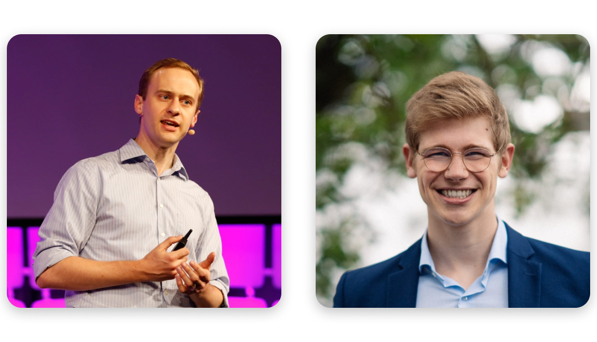

In this episode, Fin talks to [Kevin Esvelt](https://www.media.mit.edu/people/esvelt/overview/) and [Jonas Sandbrink](https://www.fhi.ox.ac.uk/team/jonas-sandbrink/).

Kevin Esvelt is an assistant professor at the [MIT Media Lab](https://www.media.mit.edu/), where he is director of the [Sculpting Evolution group](https://www.media.mit.edu/groups/sculpting-evolution/overview/), which invents new ways to study and influence the evolution of ecosystems. He helped found the [SecureDNA Project](https://www.securedna.org/) and the [Nucleic Acid Observatory](https://www.naobservatory.org/), both of which we discuss in the episode. Esvelt is also known for proposing the idea of using [CRISPR to implement gene drives](https://www.synthego.com/blog/gene-drive-crispr).

Jonas Sandbrink is a researcher and DPhil student at the [Future of Humanity Institute](https://www.fhi.ox.ac.uk/). He is a fellow at both the [Emerging Leaders in Biosecurity Initiative](https://www.centerforhealthsecurity.org/our-work/emergingbioleaders/) at the Johns Hopkins [Center for Health Security](https://www.centerforhealthsecurity.org/), and with the [Ending Bioweapons Program](https://councilonstrategicrisks.org/fellowship-for-ending-bioweapons-programs/) at the [Council on Strategic Risks](https://councilonstrategicrisks.org/). Jonas’ research interests include the dual-use potential of life sciences research and biotechnology, as well as fast response countermeasures like vaccine platforms.

*Kevin Esvelt (left) and Jonas Sandbrink (right)*

We discuss:

- The concepts of differential technological development, dual-use research, transfer risks in research, ['information loops'](https://forum.effectivealtruism.org/posts/c9KFL8sBxxyPqLai4/new-ideas-for-mitigating-biotechnology-misuse#4__Information_loops_to_steer_funding_to_less_risky_projects), and responsible access to biological data
- Strengthening norms against risky biological research, such as [novel virus identification](https://www.vox.com/future-perfect/2022/5/7/22973296/virus-hunting-discovery-deep-vzn-global-virome-project) and gain of function research
- Connection-based warning systems and [metagenomic sequencing](https://hearthisidea.com/episodes/karpur) technology
- Advanced PPE, Far-UVC sterilisation technology, and other [countermeasures against pandemics](https://forum.effectivealtruism.org/posts/u5JesqQ3jdLENXBtB/concrete-biosecurity-projects-some-of-which-could-be-big-1#Medical_countermeasures) potentially worse than Covid
- Analogies between progress in biotechnology and the early history of nuclear weapons
- How to use your career to work on these problems — even if you don’t have a background in biology.

## Reading recommendations

- [The Doomsday Machine](https://www.goodreads.com/book/show/25663779-the-doomsday-machine) by Daniel Ellberg
- [The Making of the Atomic Bomb](https://www.goodreads.com/book/show/16884.The_Making_of_the_Atomic_Bomb) by Richard Rhodes
- [The Dead Hand](https://www.goodreads.com/book/show/6623920-the-dead-hand) by David E. Hoffman

## Resources

- [Kevin's Twitter account](https://twitter.com/kesvelt)
- [Jonas' Twitter account](https://twitter.com/JonasSandbrink)

### Addressing catastrophic biological risks

- [Preventing catastrophic pandemics](https://80000hours.org/problem-profiles/preventing-catastrophic-pandemics/) by 80,00 Hours
- Kevin Esvelt: [Mitigating catastrophic biorisks](https://www.effectivealtruism.org/articles/kevin-esvelt-mitigating-catastrophic-biorisks) ([YouTube version](https://www.youtube.com/watch?v=BbOHQLrVSX4&list=PLwp9xeoX5p8NfF4UmWcwV0fQlSU_zpHqc&index=22))
- [A Biosecurity and Biorisk Reading+ List](https://forum.effectivealtruism.org/posts/iAowzcZm87wNrTQCb/a-biosecurity-and-biorisk-reading-list) by Tessa Alexanian
- [Next Generation Biosecurity: Responding to 21st Century Biorisks](https://www.futurelearn.com/courses/biosecurity) (online course)
- [Technologies to Address Global Catastrophic Biological Risks](https://www.centerforhealthsecurity.org/our-work/publications/2018/technologies-to-address-global-catastrophic-biological-risks)
- [The Apollo Program for Biodefense – Winning the Race Against Biological Threats](https://biodefensecommission.org/reports/the-apollo-program-for-biodefense-winning-the-race-against-biological-threats/)

### Managing risky research

- [Differential technological development](https://forum.effectivealtruism.org/posts/g6549FAQpQ5xobihj/differential-technological-development) (EA Forum)
- [Can we stop the next pandemic by seeking out deadly viruses in the wild?](https://www.vox.com/future-perfect/2022/5/7/22973296/virus-hunting-discovery-deep-vzn-global-virome-project) (Vox)
- [Why some labs work on making viruses deadlier — and why they should stop](https://www.vox.com/2020/5/1/21243148/why-some-labs-work-on-making-viruses-deadlier-and-why-they-should-stop) (Vox)
- Jonas Sandbrink on [New ideas for mitigating biotechnology misuse](https://forum.effectivealtruism.org/posts/c9KFL8sBxxyPqLai4/new-ideas-for-mitigating-biotechnology-misuse#4__Information_loops_to_steer_funding_to_less_risky_projects) (EA Forum)
- [Leverage Points: Places to Intervene in a System](http://www.donellameadows.org/wp-content/userfiles/Leverage_Points.pdf) by Donella Meadows
- [Manipulating viruses and risking pandemics is too dangerous. It’s time to stop.](https://www.washingtonpost.com/opinions/2021/10/07/manipulating-viruses-risking-pandemics-is-too-dangerous-its-time-stop/) by Kevin Esvelt in the Washington Post

### DNA sequencing and synthesis

- [DNA Sequencing Costs: Data](https://www.genome.gov/about-genomics/fact-sheets/DNA-Sequencing-Costs-Data) (National Human Genome Research Institute)
- [The SecureDNA project](https://www.securedna.org/main-en)
- [The Nucleic Acid Observatory](https://www.naobservatory.org/)
- [Ajay Karpur on Metagenomic Sequencing](https://hearthisidea.com/episodes/karpur)

### Defensive technology for biological threats

- [Far-UVC (222 nm) efficiently inactivates an airborne pathogen in a room-sized chamber](https://www.nature.com/articles/s41598-022-08462-z) ([Nature Scientific Reports](https://www.nature.com/srep/))
-  [Envisioning a world immune to global catastrophic biological risks](http://reflectivedisequilibrium.blogspot.com/2020/05/what-would-civilization-immune-to.html) by Carl Shulman

### Organisations and institutions

- The UN [Biological Weapons Convention](https://www.un.org/disarmament/biological-weapons/)
  - [Introduction by the Nuclear Threat Initiative](https://www.nti.org/analysis/articles/biological-weapons-convention/)
- Nuclear Threat Initiative [page on biological threats](https://www.nti.org/area/biological/)
  - NTI project on [Preventing the Misuse of DNA Synthesis Technology](https://www.nti.org/about/programs-projects/project/preventing-the-misuse-of-dna-synthesis-technology/)

## Transcript

**Fin 0:07** 

Hey, you're listening to Hear This Idea. I'm sorry if I sound a little bunged up; I've got some mystery illness, which turns out is kind of relevant for this episode! So recently Luca and I have been trying to use the podcast to learn a bit more about biosecurity. That is figuring out how to, I guess, prevent or defend against risks from biology - especially pandemics - with a focus on preventing really worst case outcomes. And there is obviously a huge amount to learn here. There's a bunch of different approaches and solutions and perspectives, which we'll try to cover in future episodes, but something that really stands out to me about so many topics in biosecurity is that we have these problems - like, you know, the world's vulnerability to pandemics - that are just huge, as most people are presumably aware, and we also just know at least the outlines of things we can be doing. Like, we know about defensive technologies to research accelerates, we can describe better norms for rescue research, and we can even list some just really concrete policies that governments could go ahead and implement. These are actions we could take right now that could potentially save millions of lives. Like, if we get our act together, we could just choose to prevent the next pandemic. That's wild. And yet, despite all of COVID, as far as I can tell, we just don't seem to have learned the most important lessons. Yeah, unfortunately, it's just a huge mistake to assume that because COVID happened, everything's therefore already being taken care of. And you know, we're finally getting our act together. Morally, there's just so much left to be done. And that seems like a very big deal. So that's why we want to talk about this stuff. So yeah, recently, I spoke to [Ajay Karpur](https://hearthisidea.com/episodes/karpur) about metagenomic sequencing, which is a technology which could help us identify novel pathogens and hopefully stop outbreaks before they become pandemics. But as well as charging ahead and building those defensive technologies, there’s also a set of questions around whether we need to rethink norms around research. And that includes whether some, even very well intentioned, research could just be imposing much more risk than it plausibly helps with. And that was what I wanted to mostly ask about in this interview. Yeah, so fortunately, there are few people who can speak with more credibility on those questions than Kevin Esvelt. Esvelt is an assistant professor at the [MIT Media Lab](https://www.media.mit.edu/), and he is maybe best known for proposing the idea of using [CRISPR](https://en.wikipedia.org/wiki/CRISPR) to implement gene drives. That is a technology which could conceivably, for instance, help eliminate malaria by spreading infertility genes among mosquitoes. Now, we didn't talk about that CRISPR based gene drive much here, but Kevin did do [an episode with Julia Galef](http://rationallyspeakingpodcast.org/261-dangerous-biological-research-is-it-worth-it-kevin-esvelt/), where he tells the story of deciding whether to share that discovery with the world. And that'll be linked in the show notes. Kevin is also the director of the [Sculpting Evolution group](https://www.media.mit.edu/groups/sculpting-evolution/overview/) at MIT, which works to advance biotechnology safely, and he helped found the [Secure DNA Project](https://www.securedna.org/), which we talked about in the episode. I was also joined by [Jonas Sandbrink](https://jonassandbrink.com/), who is a researcher at the [Future of Humanity Institute](https://www.fhi.ox.ac.uk/) and a fellow at both the [Emerging Leaders and Biosecurity Initiative](https://www.centerforhealthsecurity.org/our-work/emergingbioleaders/) at Johns Hopkins and with the [Ending Bioweapons Programs ](https://councilonstrategicrisks.org/fellowship-for-ending-bioweapons-programs/) at the[ Council on Strategic Risks](https://councilonstrategicrisks.org/). Jonas’ research interests include the dual use potential of life-sciences research and biotechnology, as well as fast response countermeasures, like vaccine platforms. 

We covered a tonne of ground in this conversation. We talked about the idea of differential technological development; strengthening norms against risky kinds of research; securely screening for misuse of DNA synthesis; gain-of-function research; how useful broad spectrum vaccines and advanced PPE could be as measures against pandemics potentially worse than COVID; better ways of evaluating research proposals; analogies to the development of nuclear weapons; ways to use your career to work on these problems, even if you don't have a background in biology; and a very cool technology for sterilising indoor spaces called Far-UVC light. Alright, I'll stop rambling. Please let us know what you thought about this two guests format - if you think it worked well then we'll do more episodes like this. And without further ado, here's the episode. 

Okay, Kevin Esvelt and Jonas Sandbrink. Thanks for being on the show.

**Kevin 4:25** 

 

It's a pleasure. Thank you for having us.

**Fin 4:27** 

So just to kick things off, I was wondering if both of you could describe a problem or a question that's been on your mind recently. And let's start with Jonas.

**Jonas 4:36** 

So I've been recently wrapping up some more thinking around differential technology development. And this is this idea that's been floating around the Effective Altruism community for a while. And it goes down to the core idea of: can we delay risk *increasing* technologies and preferentially advance risk *reducing* technologies And I think this concept of differential technology development is particularly important to biosecurity because at its essence, it says, ‘can we hold off for developing the capability to create pandemics until we have achieved the capability to robustly contain pandemics?’ And I think that very much leads then into what we're discussing here, which is kind of delaying until we can defend.

**Fin 5:37** 

And Kevin, what about yourself - this question of a problem that you're currently working on?

**Kevin 5:43** 

Well, to stick to the same theme, in a number of these areas relevant to biodefense and biosecurity, much of the field is focused on something like a near term threat. That is to say, how can we screen all DNA synthesis for hazards? But that's not the only threat. We don't just want to screen synthesis for hazards that the world knows about today, we want to be able to screen for hazards that are not yet publicly known. And in order to do that, we need to solve the near term problem that nobody else has solved. How can you do that in a cost effective, ideally fully automated way that works for all kinds of DNA synthesis and assembly machines? But we also need to do so in a way that allows the use of cryptography to screen for things without disclosing what it is that we're screening for, as well as all of the social acceptance required to get people to go along with that. And we may need to do that in competition with well meaning folks who think they're doing one of the most important things there is - that is solving the near term problem - but simply don't even see the longer time horizon problem. Now I think this is a microcosm of the challenge before us, which is you need to head off, in some cases even a beneficial technology, in order to get a still more beneficial technology in place, just as you have to sometimes invent a safer version of something that might still be dangerous, before someone else invents an extremely dangerous version that is intended to solve the same overt problem.

**Fin 7:20** 

Yeah, that makes sense to me. I guess I wanted to start by asking about COVID. So yeah, I'm assuming that we're in some kind of moment of receptivity to ideas about pandemic preparedness right now? And -

**Kevin 7:39** 

\- I would not agree with that.

**Fin 7:41** 

You wouldn't agree with that! Okay.

**Kevin 7:42** 

I think we probably passed the window of opportunity already. And people are willing to put it behind them and not think about it anymore.

**Fin 7:50** 

Okay, interesting. Well, I'm assuming you would agree that we did less with that window than we could have, while it was still open?

**Kevin 7:58**  

I would broadly agree with that. But it's also a little bit pessimistic in the sense that it's hard to imagine anyone in government learning the right lesson from something that was probably either a natural pandemic or an accident, when what we really need them to think about is deliberate misuse.

**Fin 8:18** 

Okay. Well, let's talk about that then. So can you say something about what kinds of interventions or countermeasures you'd both like to see, let's say a couple years from now, maybe up to five years from now, to make sure something at least as bad as COVID doesn't happen again, especially if we're worrying like you said about deliberate misuse.

**Jonas 8:39** 

So I think one interesting thing to think about is that really in every intervention that we put forward and put in place for preparing against pandemics and for preventing pandemics, we should be considering pandemics of any origin - thinking about natural origins, accidental origins, deliberate origins - and then putting especially large weight on those preparations that prepare us against all of these kinds, and putting maybe less weight on interventions that protect us against one and maybe even increase the risk for others. I think one example of something that probably helps against every pandemic is just really good pathogen detection systems. So we can respond fast, or develop really good PPE. At the same time, if we think about other interventions that might only protect us or help against one kind of pandemic, but actually might exacerbate the risk from other pandemics, one example is well known gain-of-function experiments - the enhancement of pandemic pathogens. If you do that kind of work to presumably help - like these scientists claim that they do this work for preparing against natural pandemics, and you might actually increase the risks for pandemics of human origin, like accidental or deliberate ones. So I think those interventions might hence be tuned back.

**Fin 10:09** 

Okay, got it. Can you say more about what's so concerning about gain-of-function research? I mean, if I'm doing this research, then presumably I expect it's going to have some benefits. You know, like any scientific study, I'm gonna hopefully get some useful information out of it. So why seriously worry about this kind of work going ahead? 

**Kevin 10:29** 

Oh dear, are you asking for specific benefits of worrying about potential pandemic pathogens? Because we're supposed to refer back to ‘oh, well, knowledge is generally helpful’, which is true, right? I'm very sympathetic to the view that historically, learning more about a threat almost always helps us. The problem is that in this area, it looks a lot like understanding the biology doesn't help us reliably defend against pandemic-class threats. This is unusual; it's not true of most areas, and in fact, it's not even true of all areas within bio. So a little bit of background: why I'm concerned about this area is I have to hold myself morally responsible for what's known as ‘CRISPR based gene drive’, which is a way of using [CRISPR genome editing](https://en.wikipedia.org/wiki/CRISPR_gene_editing) to cause edited changes to be made every generation in the germline, in the inherited genome, of a wild species. So essentially, you programme the organism to do genome editing on its own. And this causes the alteration to spread through the wild population. That technology, thankfully, favours defence. And the reason is, it only spreads over generations, so it's slow. If you sequence it, it's really easy to find in sequencing data. And you show me the sequence of a gene drive you don't like, and I can reliably design a gene drive that will spread just as well, will not cause the problem, and whenever it encounters the original will overwrite it. So in other words, we can reliably counter it. Anything that is slow, obvious and easily countered, is just not much of a threat. What can we learn from COVID, to return to your earlier question? Omicron arose somewhere in Africa. And within 100 days of that virus being sequenced, it had infected over a quarter of Americans on the other side of the globe - within 100 days, from a single site of release. That tells us that we're not going to have time to develop, manufacture, and distribute medical countermeasures fast enough to protect the world from a future pandemic, even if it's natural or accidental, let alone something that is deliberate, which of course should not assume a single site of release somewhere well away from travel hubs.

**Fin 12:57** 

I'm curious now to ask how that plays out in the case of discovering new pandemic capable viruses, and indeed, doing things like gain-of-function research with those viruses or other ones. What is the worry there?

**Kevin 13:12** 

Why do we think that identifying a pandemic virus might be helpful in preventing natural pandemics? Well, you might imagine it could let us monitor the environment for that virus and help prevent it from spilling over by just reducing exposure to the animals that carry it. You might imagine that maybe we could develop antivirals or vaccines in advance, except there we’re crippled because if it's never infected a human before, we can't actually test any of our vaccines or medicines in phase two trials. But the real problem is, let's just assume that identifying a pandemic capable virus would let us perfectly prevent it from spilling over. The problem is, in order to get people to believe that and take action, we would have to share its genome sequence and our evidence suggesting that it's pandemic capable. And that means that some 10s of 1000s of people who have the laboratory skills could build that virus from synthetic DNA, and single-handedly let it go, thereby causing a deliberate pandemic. You can't have one without the other. And there's lots of pandemic capable viruses in nature, probably hundreds. So if you identify one of them, you might perfectly prevent one pandemic, say, in the best case scenario, but there's only a 1/100 chance that that one actually would have jumped in this century. Whereas as soon as you put the instructions online, what's the risk that someone will use them every year? 1%? If so, then you just expect that pandemic will happen sometime in the next century, deliberately, and so you're at deliberate pandemics are probably 100 times more likely to kill people, in expectation, then will identification save people from natural pandemics.

**Fin 15:11**  

Okay, just to try saying that back to make sure I'm getting it. So I guess the idea here is that I can go into this kind of research with good intentions, right? I want to, you know, identify pandemic capable viruses in the wild. And like you say there are many of those out there, and there are some real uses for this. You know, it can help us spot those viruses in advance, help us develop countermeasures in advance, and so on. That's pretty good. But here's the downside: in order to do anything with this genetic information I'm collecting, I possibly need to share it with the world. But sharing the genetic material of pandemic capable viruses with the world just looks wildly dangerous and irresponsible. And so much so that if you just try doing the even rough back of the envelope calculation about whether this kind of work actually makes the world any safer against these biological threats on net, it ends up looking positively counterproductive, and by some margin. Is that roughly right?

**Kevin 16:06** 

Yeah. In general, always put numbers on your priors. You know, add your magnitude, add your uncertainty, check it out. In this case, it looks like you're gonna kill 100 times as many people as you're gonna save, even given some of the most optimistic assumptions favouring pandemic virus identification. And when it's just that skewed from the outset, it's pretty clearly a bad idea. And the problem in this case is that no one seems to have just put numbers on it in that way.

### Transfer risks

**Fin 16:36** 

Yeah, that's a great lesson. Jonas, I guess we're talking now about the idea of transfer risks. So this is where, I guess, certain kinds of research in apparently safe contexts stand some chance of spilling over and causing damage in other contexts. Yeah, I wonder if you could say more about transfer risks?

**Jonas 16:58** 

Okay, so Kevin talked about how the discovery of and identification of pandemic capable viruses features potential for misuse. Similarly, gain-of-function research features potential for misuse, because it exactly sets out to generate potential pandemic pathogens that then we might want to prepare against. But actually, this virological research is only the tip of the iceberg that is really a broader set of scientific research that is driving the capability to create viruses and engineer viruses. And this is because fields that have not been classically associated with research risks, such as gene therapy, cancer research, vaccine development, all of these are now engaging in the engineering of viruses for delivering therapeutics. And the problem is that some of the methods developed as part of these efforts are then transferable to pandemic pathogens. And you might picture it in a sense that, inadvertently, the scientists are picking up the same strategies that historical biological weapons programmes are using or have used. So the Soviet biological weapons programme, they explored different genetic modifications on a non-pathogenic cousin of the smallpox virus, to then transfer these to smallpox virus. And similarly, transferable insights from different efforts to generate gene therapies and vaccine development, et cetera, might be transferable to pandemic pathogens.

**Fin 18:48**  

Okay. Okay. Let me see if I can just get clear on everything we've been talking about so far. So I guess the first thing we talked about was this idea of going out into the world and trying to identify new natural pandemic capable viruses in the wild. And that looks fairly risky for reasons we've discussed. Then I guess continuous with that there is gain-of-function research, which can involve deliberately modifying a pathogen to make it more virulent or more transmissible, for instance, and then it sounds like there is this broader class of risks involving the transfer of insights between different contexts. Am I thinking about all of that in the right way?

**Jonas 19:36** 

Yes. So gain-of-function research is what we know is risky, and that is the enhancement of potential pandemic pathogens. I've worked with developing transferable methods for the enhancement of pathogens or viruses, including potentially transferable to the enhancement of pathogens. And the problem is that increasingly researchers across a whole breadth of research areas are driving towards platform approaches, driving towards general purpose methods that enable the modification of a broader class of viruses, including potential pandemic pathogens. And thereby, it's actually not just gain-of-function research - enhancement of potential pathogens to potential pandemic pathogens directly - that is driving the capability to create them, but it is a broader class of research. And this broader class of research hasn't been traditionally associated with these risks of misuse. And we want to start a conversation around that that is necessary to prevent the proliferation of the ability to create pandemic viruses.

**Kevin 20:52** 

If I might jump in just to summarise.There are many different areas of research throughout the biological sciences that could be used to create novel classes of pandemic-like agents, we can call them pandemic class agents. And the researchers developing these areas generally are not thinking about misuse concerns at all. It's just not something on their radar; their fields have never historically been linked to security concerns. And they're certainly not thinking about how their work could lead to the proliferation of pandemic class agents, which we know from COVID can kill more people than nuclear weapons. And the question is, do we always want to highlight this? Because it's not clear that we can necessarily delay it all that long. And it's not totally clear that highlighting it is going to be net positive.

### Raising the alarm

**Fin 21:52** 

And just to direct that thought, I guess there are at least two effects from highlighting a risk: one is presumably you get conscientious sensible people to move away from the risk, and that's good. But the other is that you draw attention to the risk, including, I guess, the attention of more reckless people. And so you get this very tricky problem, which is, how loudly should you be raising these alarms? And that's not at all clear in many cases.

**Kevin 22:19**  

So if we think there are potentially many different ways of, say, making viruses more transmissible, then what should we do? This is an open question where the two of us debate it frequently in terms of which side do we expect will end up saving lives. And I think it's important to emphasise that at least I don't think that this is a winnable battle in the long run. That is, there's too many plausible ways of making viruses more transmissible; we will eventually lose. Someone well meaning and naive is going to describe how to do it, probably not in that context, someone else well meaning and naive will see the potential for misuse and attempt to overtly warn the world, thereby drawing the world's attention to it. And someone else well meaning but naive will check to see whether or not it is possible by trying it themselves and then publishing it. And it's important to note that none of these things can be believably done by actual malicious actors. That is, people who want to threaten the world with pandemics can't very well claim to have pandemic class agents and show data suggesting that they do, because we wouldn't believe their data; it's easy to fake. But if someone well meaning does it because they're trying to save the world from natural pandemics, that is believable. And malicious actors can then threaten to misuse that data. So the irony is we could actually stop people from doing this if we could persuade the scientific community that this was a bad idea. And that's why I've been advocating for a pandemic [Test Ban Treaty](https://www.jfklibrary.org/learn/about-jfk/jfk-in-history/nuclear-test-ban-treaty). There's a fairly narrow set of experiments required to determine whether a virus is plausibly pandemic capable. So it doesn't matter how you make it. Let's assume there's lots of different ways of making something that could become transmissible enough to spread like a pandemic. But if we banned the experiments that let you determine whether or not a particular virus was or was not, we don't have to restrain the rogue actors, we just need to restrain the good guys, because they're the only ones who can do it credibly. And that might be feasible. But even there, eventually we're going to lose and someone's going to do it. And this is why I tend to worry more about what you might call lone wolves than I do actually about sophisticated state level bioweapons programmes. Because I expect that we're eventually going to lose this battle and the blueprints for pandemic viruses are going to be public, in which case anyone with the relevant skills can build it for not very much money.

**Fin 25:07**  

Okay, what does losing the battle mean? 

**Kevin 25:10** 

Yeah, I mean the battle to prevent the proliferation of pandemic class agents. Right now nine nations have access to nuclear weapons that can kill millions of people. We know that pandemic viruses can kill millions of people. But right now we don't know of any credible examples that would take off and kill millions of people, in a new pandemic - there just aren't any. But we assume we're gonna lose the battle to keep that number at zero; sooner or later it is going to be a positive number. And then it is all about how can we attempt to reduce access, to minimise the number of people who can, in order to give us enough time to build reliable detection systems and defences that would allow us to suppress and eliminate any given pandemic.

**Fin 25:59**  

Okay, got it. That was very useful. I was worrying a bit that some people might hear what you said earlier and just think, ‘Oh, Kevin is just incredibly doomy and pessimistic about biosecurity in general. He thinks that, okay, maybe we can, and maybe we should hold off for a few more years. But in the end, the world will just be, you know, indefinitely, like ravaged by pandemics’. But it sounds like in fact, yes, at some point, we should expect this much greater proliferation of pandemic viruses, where just many more people have access to and knowledge about just very risky, dangerous pathogens. However, in the long run, presumably there are reasons to expect that we can end up in this biosecure world where defence wins out. What matters is what happens between now and then. And of course, that we eventually get to that - I mean that we actually reach there. As such, one important challenge is delaying this especially risky research, to give us time to build up that defensive capability. Is that roughly right?

**Kevin 27:16** 

Exactly right. Delay, detect, defend. You gotta delay until you can detect and defend.

### Responsible Access

**Jonas 27:22** 

Yeah, so when I think about ‘delay’, I think there are really three buckets. And I think we've covered the first one, which is kind of stop the most risky research that leads to the proliferation right away. But then I think the second bucket is responsible access to certain genomes, materials, protocols, etc. that enable the misuse of that knowledge. And then the last bucket goes a bit more, again, into the direction of differential technology development and comparative risk assessment and really shifting our taking the biotechnology portfolio towards the less risky side of things. And I think maybe we can zoom into responsible access first. So I think the big thing here is DNA synthesis screening, and I think Kevin is probably better suited to talk about that. But I think next to DNA synthesis screening, there is also a consideration around: should every genome, every blueprint for a pathogen or any virus be publicly accessible? And that is the status quo at the moment. But yeah, I argue maybe it shouldn't be. Maybe there are certain genomes that we do not want to share with all researchers, all scientists, the whole public. Maybe there are certain genomes that we want to be selectively sharing with certain stakeholders like vaccine researchers; maybe it's fragments of genomes that we want to be sharing with those people. And I think we need to develop systems for responsible access to these genomes to hand it out more selectively, and to ensure that everyone that accesses these genomes has the required credentials and actual legitimate use purposes. And I think one precedent here is the handling of patient data, where already existing databases are, because of privacy concerns, highly regulated. And you could imagine that from those databases, we might be using some of the access systems that are in place where people have to require permission to take a look at certain data. And you could imagine those being transferred and applied also to genomes of certain concerning pathogen's.

**Fin 30:01** 

Yeah, I see. And I guess one thought here is: well, in order to access a medical patient's full record, for some research I'm doing, I better have a really strong like overriding reason to be able to do that. And that's because we place a tonne of value on patient confidentiality and privacy seems like a good norm. And then the analogy is, well, here's another thing we really care about, we really value, and that is making sure another pandemic doesn't happen again. As such, maybe we should consider similar norms, which don't just hand out access to genomes and protocols and materials so easily, but instead, kind of similarly require these really strong reasons before that happens.

**Jonas 30:47** 

Yeah, exactly. And I think scientists have such a large responsibility. They are the stewards to creating life reshaping whole ecosystems, like Kevin mentioned. And I think really, we need to appreciate that and develop systems in which you can ensure that that responsibility is taken seriously - that that responsibility is designed in a way and credentialed that then ensures that we don't see any illegitimate access to these materials.

**Kevin 31:21** 

Are you saying that me and my students all need background checks? Maybe even full time surveillance whenever we're in the laboratory just to make sure we're not doing anything nefarious? Because at the end of the day, if these technologies become freely available to everyone, the answer is probably yes! Most of my students can make viruses.

**Jonas 31:39** 

For accessing certain genomes, maybe you should be requiring that. For accessing certain protocols, maybe you should be requiring background checks - yes.

**Kevin 31:48**  

But I'll go even further and suggest - and this is what makes me unpopular with most of my virologists colleagues - virtually every experiment that you would need to do in order to develop vaccines, or antivirals, including antibody treatments for viruses, does not require you to know the full genome sequence of the virus in question. And that's especially true if you're developing broad spectrum vaccines and antivirals, which are really the only ones you can develop in advance. Because remember, you know, we go out and search a bunch of bats, we find a pandemic capable virus, we're pretty sure we'll take off if it ever spills over into humans. We can't test vaccine candidates against that virus, because that would require infecting a bunch of people with a virus of unknown modality that we suspect might be pandemic capable, and some of them would have to be in the control group, and wouldn't receive any therapy at all. There's no way that we're going to do that! That's called a ‘challenge trial’, on a virus that could kill people, that might never actually infect humans at all! We're just not going to do that. But if you're developing something that you think is broad spectrum, you can test it against the relatives that *do* infect people. Or you can test it against animals, obviously. But the point is, if it's broad spectrum, it's actually useful; you can get approval, you can stockpile it in advance. But to develop something broad spectrum, the whole point is you don't need to know whether it works against any given agent. You want to know, does it work well across randomly chosen examples from that entire family of viruses? And the same is true for antiviral drugs - they usually target the ability of the virus to infect, to replicate within, host cells, or sometimes processing enzymes that are required for some aspect of the viral life cycle. None of those experiments requires you to have an intact ‘wild type', as we call it, virus. That could be dangerous. And that means you don't need to sequence the whole genome; you certainly don't need to share the whole genome in order to get the information required to develop these kinds of therapies.

**Fin 33:55** 

Okay, so let me make sure I'm understanding the claim here. So I guess Jonas has suggested this norm of only very selectively sharing entire genomes, or at least requiring strong reasons to access them. And then you're saying, Kevin, that we can also just not share entire genomes, but instead, snippets of them. And this probably isn't such a hard thing to do, probably wouldn't be especially inconvenient for people because, in fact, most research here doesn't require the full genome.

**Kevin 34:27** 

And if you leave out a small piece, then you can't assemble that virus and boot it up and make it infectious. Now, is that going to fly? The answer is no. And so we're gonna need Jonas' solution of, you know, limited permitted access to certain things in some cases. But for most of the things, I think we could change the norm to: you sequence it, but you'll leave out a critical piece. And you can choose that piece such that it means you can't boot up the virus, but you can develop all of the kinds of vaccines and therapies that you would want to develop.

**Jonas 34:59** 

So within responsible access, we've now talked about the access to genetic blueprints of potential pandemic viruses. But then access to the materials is the other crucial question. And this is where the [Secure DNA Project](https://www.securedna.org/) comes in.

### Secure DNA

**Fin 35:18**  

Okay, interesting, do either of you want to say more about this Secure DNA proposal?

**Kevin 35:23** 

So the idea is you want to ensure that anyone who places an order for synthetic DNA to some commercial DNA synthesis company, or types it into a machine that can spit out the DNA, which is sort of the next generation technology, that that order is screened to make sure they're not making, say, some pandemic pathogen. How can you do that? Well, historically, it's been challenging because people tended to use what's called a ‘similarity search’ algorithm, which is great for determining how related to things are, but it's pretty terrible for reliably detecting hazards. So Secure DNA originated. And we said, you know, instead of doing that, what we need to do is figure out some way that can fully automate the screening process, so you don't need humans in the loop. And that's critical, because especially if there's a device on your benchtop, that you bought so that you can enter in an order for the DNA you want, and it will spit it out a few hours later, you really don't want to wait for a bunch of humans somewhere to have to take a look at it, to see if it's okay. And that means you need some algorithmic screening process that doesn't throw up false alarms. So we figured - how can you do that? Well, essentially, let's look for sort of signatures, pieces of the relevant DNA sequence that we think is hazardous. But we want to ensure that we don't just look for the exact virus in nature, we want to include all of the ways that some adversary might change that, while preserving its function. So the way we do that is we take that signature, and we ourselves predict all of the different ways that you can vary it, while still keeping it functional. And then we check all of those sequences against all of the DNA that humans have ever sequenced. And we throw out anything that matches something unrelated. And this way, we ensure that as long as you're ordering something that is in some database that humanity has sequence before, that isn't obviously a hazard, it's not going to be blocked in a DNA synthesis order. That is we've basically eliminated that entire class of false alarms. And the benefit of this is because we're not using similarity search, we're not only more accurate, but we can also apply cryptography. That is the algorithmic process of screening is efficient enough that you can use cryptographic methods to screen that protect the identity of the order. Because of course to a biotech or pharma, if you give me a list of all the DNA they've ordered, I can give you a pretty good summary of their research pipeline. So they consider that to be a trade secret. So we need cryptography to protect that information. But also thinking down the road, we should expect future discoveries to make it possible to make, say, pandemic class agents in a variety of different ways. And we're probably going to spot some of these in advance, before they become widely known. It'd be lovely if we could restrict people's access to hazards without highlighting them as being hazardous, and the cryptography would also let us do that. So this is our attempt to solve the near term problem: let's screen all DNA synthesis, by inventing a fully automated process that works on all devices that we can offer for free to the world.

And then if we can get it to be basically universal, then later on, we can work to add emerging hazards. And that will both limit access to emerging hazards that are not yet publicly known without highlighting them, and can even nudge people away. Because the dirty little secret is that those of us in labs are supposed to get permission for pretty much any experiment that we run. That is, if you have a clever idea for working with DNA from some other organism to do something, you're supposed to ask your institutional biosafety committee for permission to run that experiment. And in reality, if you have a clever idea, you're not going to fill out all the paperwork to figure out if it works or not. You're going to order your DNA, you're going to get it the next day, you're going to run your quick proof of principle experiment, and if it works, and you're going to launch a new project, *that's* when you're going to go to all the trouble of updating your registry of the things you're allowed to do. And so the idea here is we would just require people to do what they're supposed to be doing anyway, that is if they hit an emerging hazard or a decoy, because of course we can’t only put emerging hazards - that'd be telling - you put in the things you're worried about and a bunch of things that might be plausibly worrisome in there, and anyone who hits one of them just wouldn't be able to get their initial DNA; they'd have to go through the bureaucracy first. So you're not forbidding anything, you're just adding an extra level of annoyance if you want to work with something that might be dangerous. And that's exactly what we want. We just want to nudge people away gently, without forbidding them from doing something that they think really would be amazing and transformative and beneficial. You just want to nudge them. And so that's what Secure DNA is all about. 

**Fin 40:33** 

Yeah, okay. This is making me imagine some kind of world in which it turns out to be possible to print a nuke with some kind of insane 3D printer, right? And in this world, let's imagine that 3D printers are becoming more and more accessible, right? So I used to have to, you know, mail off to my local 3D printing service and that was very expensive. Now I can just about begin to afford such a printer in my garage. And you know, in that world, it might be nice to agree on some protocol to screen for when I'm sending off for anything that resembles a nuke, or at least make it more frustrating, more difficult to do that, and hopefully to stop people from building nukes this way. And I guess this is an at least somewhat similar thought. But it feels like there's lots of moving parts here. And there are a few things I wanted to zoom in on. One thing is the incentive story here. So if I'm I guess either an equipment manufacturer making these machines, these DNA synthesising machines, or I'm a buyer in a lab, what reasons do I have to voluntarily include this little add on which you know, screens for things I'm synthesising? It imposes a very small delay, presumably, and then occasionally just doesn't let me do things that I want to do, and that's about it. Why should I be attracted to that?

**Kevin 42:03**  

So one of the most inspiring stories about all this is that a number of companies in the DNA synthesis industry, in fact, almost all of the big players, are members of what's called the [International Gene Synthesis Consortium](https://genesynthesisconsortium.org/), which voluntarily screen orders for public hazards. And they do so even though their current screening systems throw up a bunch of false alarms that require them to hire PhDs in biology, to look at all these false alarms to determine whether they're real or not, which is a miserable job. And everyone I've known who does it hates it. But they feel that it's really important so they do it anyway. But of course, not all companies screen. And the problem is that most of the ones that do generally are IGSC members, which raises obvious security problems - you really need just about everyone to do it. So for the current IGSC members, it's an easy value proposition if we come up with a system that is better than what they currently do, that would cost them less money and spare them this painstaking work, yet, they're confident that it will be as good. And we offer it for free because it's fully automated. So it costs very little. We can just cover that philanthropically, thanks to [Open Philanthropy](https://www.openphilanthropy.org/) and [FTX](https://ftxfoundation.org/). Then free is a very good price, we should outcompete every other screening system available if we can offer it for free. And ideally, that will include the other well meaning folks who are solving the near term problem in ways that don't allow cryptography and therefore don't allow screening of future emerging hazards. The downside is what about all the people who don't currently screen? Free is a very good price now, but it's currently free for them to do nothing. So the question is, how are we going to get them on board? And the answer there is some combination of norms, expectations, liability, and eventually, straight up market requirements. So here, what's interesting is that the [Biological Weapons Convention](https://www.un.org/disarmament/biological-weapons/), which has been signed by nearly every country in the world, has an article which says countries must essentially do everything in their power to prevent people from acquiring biological weapons within their territory. And in practice, no one does anything on this because that would mean taken literally, that they should all require DNA synthesis screening already. But they don't, because that would of course put their local companies at a disadvantage because it's a significant cost. And they don't want to disadvantage their companies versus everybody else's. But by making it free, then we can say, ‘hey, look, here's an easy way to fulfil your treaty obligation’. And then we just need a few of the larger markets to actually require it in compliance with this treaty they've already signed, which would then cost them nothing.

**Fin 44:48** 

Yeah, okay. Got it. And I guess I'm imagining some just ideal outcome here, which is presumably some kind of, you know, international agreement or coordination where basically every major player agrees on using this screening protocol, or something like this screening protocol. And, yeah, if using the protocol is just pretty cheap and straightforward - like, you know, in practice, it's just a small delay on synthesising things, and it very rarely meddles with what you're synthesising as long as it's not dangerous - well, you know, it's not like there's gonna be some knotty coordination problem there, it could just be in every player's obvious interest not to be the jerk that doesn't sign on to this extremely low cost way of screening for potential catastrophes. So yeah, I guess that's a reason for optimism if we can get to that point. Anyway, here's one extra question I had, which is: maybe the system is in place, and say, I'm a researcher, and I've identified a genome that seems concerning to me, so I want to somehow slot it into the protocol, such that if anyone tries to synthesise that genome, it gets blocked, what do I do then? Who do I speak to?

**Kevin 46:03** 

That's a great question. So you would need to contact the local curator for the Secure DNA system, who would probably need to be someone authorised by your government. So this is not perfect, because in some countries, of course, we should assume that the curators will all be required to report whatever it is that they think is hazardous and learn about through this process to their government. So that's not ideal, right? Someone identifies a new nasty, potential pandemic class agent, and their government learns about it. But that's a heck of a lot better than them publishing a paper on it and telling the entire world about it. Because if their government is a great power, they probably have nukes already anyway. And in fact, one of the great challenges is how do we ensure that governments sign on to this? So Secure DNA has been an international collaboration from the beginning, in which we've been working with Chinese and European colleagues in a sort of a science diplomacy effort deliberately not involving any representatives of any government, but keeping them all informed, because if you have any involvement by US government than China won't sign on, and vice versa. So one of the challenges is keeping the governments out of it, until we can solve the problem by working with industry. And then once everything is in place, and we've learned from both sides that it needs to be hosted by a Swiss nonprofit and so forth, then we can invite the governments to start requiring it.

**Fin 47:27** 

Got it. Jonas, anything you want to add on this?

**Jonas 47:31** 

I think it's worth highlighting: Kevin mentioned some of these other more short term oriented efforts in the space. And I think, yeah, there’s some other particularly promising projects including the add on to the [Nuclear Threat Initiative bio programme](https://www.nti.org/area/biological/), were doing some work on this as well, that is particularly also focused on what the international engagement is at this stage. And yeah, there's just a range of actors. Secure DNA is just a particularly mindful project in a space of many other actors here. 

**Fin 48:13** 

Sure. And what is that space? 

**Jonas 48:15** 

Well, I think actually, there are many other DNA synthesis screening proposals as well, Kevin, right? It's not just NGI bio and Secure DNA.

**Kevin 48:28** 

I'm aware of a couple of for profit startups.

**Jonas 48:31** 

I think there's a few for profits, yeah.

**Kevin 48:33** 

All the ones that I'm aware of are focused on this question of what is and is not a hazard and distinguishing between a strain that is on the government list and a close relative that may or may not be of the same species, and so forth, which is not really solving the problem on either side. The difference between our approach and NTI’s, is that we’re focused more on the technical side of the problem - identifying hazardous sequences; they're more focused on the customer focused side of the problem. That is, how do you deal with the export control regulations, in terms of identifying which customers you have to deal with export control over, and how can you screen your customers to determine whether you're willing to sell them DNA at all, and which levels of DNA and hazards and so forth, and normalising the standards internationally. But they are also developing a technical approach, which is great. I mean, the best technical approach should win. From my perspective, though, any technical approach that doesn't include the cryptographic methods is really limiting our options because you need the cryptography in order to address future emerging hazards. And from my perspective, as someone who actually does run a biotech lab, we're going to need that.

**Jonas 49:55**  

Yeah, I think that one thing that's on my mind is, however, this coordination issue, and like how do we ensure that all people trying to achieve the goals are working together and these approaches in the end can complement each other. And I think that is really where I think we need to do good work in talking to each other and keeping up to date and kind of dividing and conquering the problem project and the problem, rather than like each doing our own thing. And I think this is something that we can probably do better on.

**Fin 50:28**  

And ‘we’ just meaning the various nonprofits who are interested in the same thing here?

**Jonas 50:32** 

Yeah, exactly. And I think one thing that's on my mind with Secure DNA - I think it is a very good approach that’s very mindful. But I think it also has these many ‘if’ steps to rollouts. And that means that I think, Kevin, if I understand correctly, that I think there's quite a bit of hesitation to move too early, until the foundations are in place. And I think that can obviously then mean that maybe we a) lose valuable time in the short term space, but b) potentially that also other solutions - say a government mandates DNA synthesis screening now, then all these for profit startups pop up. And that means that this space has failed, potentially, and it becomes more difficult to create a universal mechanism. 

**Fin**

Okay, so there's a path dependency type worry here? 

**Jonas**

Potentially, potentially. And Kevin, maybe you should say if you don't want this to be included or something, but I don’t know.

**Kevin 51:33**  

I broadly disagree. I'm not particularly worried about for profits, because a) they can't use our approach because we've actually thought about it, and b) how is the for profit going to compete with free? So no, I’m mainly more worried that the US or China will try to do something on their own, thereby making the other government mistrusted rather than I'm worried that some early mandate would be a problem. And I don't think that the Swiss nonprofit has to be established in place before we offer it as a solution to various people. We're still a consortium of academic groups. And if you know, yeah, the Western suppliers don't want to deal with our Chinese colleagues, and the Chinese suppliers don't want to deal with us, well we'll deal with our Chinese colleagues, and it's fine. So we can work with everyone. It's not really a big deal, in that sense.Whereas the US-China tension really is a big problem. And that is a potential landmine for I think anyone who is on one side more than the other.

**Fin 52:32**  

Okay, so zooming out, I guess we've been talking broadly about ways to delay risky forms of research. Jonas, is there anything you want to add on this when we're thinking about new norms or directions for getting safer against biological threats?

**Jonas 52:50** 

So earlier, I highlighted these three buckets, and that I think about the delay approach. And I think to reiterate, it's not doing the most risky stuff, responsible access, including DNA synthesis screening, and I think the last thing is shifting our biotechnology portfolio towards less risky angles. And really, one thing that we've discussed earlier is the fact that really a lot of research of biotechnology is dual use; a lot of research has potential for misuse. And that amount is only growing. And it's not just the top fraction of research that we should be caring about with regard to mitigating risks. So really, what I think we should do is we need to take a look at biotechnology more broadly and really think about how can we reduce risks across our portfolio. And one thing that I think would be helpful here is to move away from only deciding which project is going to be funded based on the promise, and then assessing risks in a second step, but rather move towards comparative risk benefit assessment. So the idea is that you would evaluate all the different projects based on their benefits and risks, and then factor risks into the decision of whether to fund the project in the first place. And you might argue along the lines of among all high promise projects, you want to preferentially fund those associated with the least risks. And one example being here for developing gene therapies: you might for instance, preferentially fund nonviral approaches that do not advance viral engineering over approaches that involve viral engineering. But if you find that viral engineering approach is actually the highest promise then within those you might find mechanisms of viral engineering that are not heritable, and hence are not passed on to viral progeny, onto the offspring of transmissible viruses, and hence, fund non heritable research over heritable viral engineering methods. So the idea is, then, by doing this comparative risk benefit assessment, we would shift our biotechnology research portfolio towards the less risky spectrum without actually sacrificing any benefits.

**Fin 55:41**  

Okay, let me try saying that back because I am just completely naive as to how funding review works. So I'm applying for funding for a project. It sounds like, hearing what you're saying, there's some initial process of evaluating the upsides of my proposed research, right? You know, how good could this be? How promising is this? And then as a kind of second layer, there's, you know, check that this isn't imposing some obvious risks. And your claim is, well, it makes a lot more sense just to consider something closer to the, you know, expected value of the research, which is to say, considering the costs and benefits together. Because when you do that, you might find that, all else equal, those proposals which don't pose obvious risks are just going to beat out in a much more clear and comparable way, other kinds of research, which do, you know, pose complications of risks, and that should be much clearer than it currently is now. Is that roughly, right? 

**Jonas 56:48** 

Yeah, that's exactly right. And I think it's really differential technology development to some extent in action, where it's preferentially advancing low risk avenues to solve a certain problem, before considering advancing high risk options. I think one thing that's interesting is also that every scientist doing any kind of neurological research, for instance, always puts in ‘oh, helpful for vaccine development, helpful for diagnostics, etc.’ and I think what might also help us on this road is actually developing a more differentiated understanding of how close a research project is in the chain to actually informing those kind of benefits. And I think then it's not just becoming more differentiated in our understanding of risks, but also our understanding of benefits. And then really weighing those two off against each other and making sure that, yeah, we're funding the biotechnology research with the highest expected value, and hence optimising for the best possible societal outcomes.

### Detection

**Fin 57:55**  

All right, so we've been talking about delaying risky research. That is one bucket, that is one way to get safer against biological threats. Another bucket might be detecting those threats when they emerge. So could you say something about that? What's the challenge there? And also, how does it tie in to this [Nucleic Acid Observatory](https://www.naobservatory.org/) proposal?

**Kevin 58:15**  

So the challenge of detection is: how can you reliably detect any biological threat, no matter what it looks like, no matter how it shows up in the clinic, whether it shows up in the clinic, whether it's in the environment, whether it's anywhere else? How can you find it no matter what? And this might seem like a major challenge, but it's actually fairly straightforward, because the reason why biology creates these kinds of catastrophic risks is that it can self scale. It can spread autonomously and exponentially on its own. From a single site of release or multiple sites of release, across the whole world, without requiring any further human intervention. What that means is that any serious biological threat must spread exponentially. So the idea of the Nucleic Acid Observatory is: let's sequence enough nucleic acids out there, from wherever we think might be a problem, that we can look for patterns of exponentially spreading nucleic acid fragments, that is short sequences that are spreading together, whether exponentially at a single site, or if we have a network of multiple sites, which ones start appearing together at many of our different sites that we're monitoring? And the hard part about this is that it requires us to do what's called untargeted meta genomic sequencing; we have to sequence all the nucleic acids out there. I mean, we can separate out viruses if that's what we're looking for, or bacteria or whatever. We don't have to do it all in one pot. But it means that there's not necessarily any benefit that you can't get by looking for specific things, other than the reliable detection itself. So the challenge that we're facing is this is really only something that is absolutely required for defence against all possible threats. Any of the standard public health benefits against knowing things - what are the levels of this or that pathogen in a given city - you can figure out all that stuff more cheaply using other methods. But none of those other methods are reliable in the sense that if we attempt to rely on them, any remotely competent adversary will be able to build something that will blow through our defences, and we won't even see it.

**Fin 1:00:47**  

Yeah, it makes sense to me, I guess, if you are only screening for those known obvious threats, and maybe that's a bit like only installing fire alarms in houses that have had fires previously, or only installing burglar alarms in houses which have previously been burgled. And maybe that's especially bad if arsonists and burglars exist and know what you're doing. Anyway, I wanted to ask about exponential growth; you mentioned, I’m curious why this possibility of exponential growth is the thing that seems to seem to matter so much? 

**Kevin 1:01:21** 

Yeah. If it's not exhibiting exponential growth, then it's not spreading autonomously. And if it's not spreading autonomously, it's not going to scale to the whole world. So that is the unavoidable signature of any given biological threat; it must spread exponentially. Now, the timeframe can change, right? HIV is a pandemic, it's just its pattern of exponential growth was very delayed relative to, say, COVID. But it's still a pattern of exponential growth that can be detected using the same sorts of methods. The challenge is lots of things appear to spread exponentially for a little while. So we're going to have to deal with the fact that lots of viruses circulating in many different species are going to exhibit that kind of growth. And so we need to sort out the ones that we think might be threatening from the background and look at them. So in a sense, we're sort of back to what DNA synthesis screening is today, pre Secure DNA, where we're gonna need humans to look at it. But before you ask, yeah, you know, most of the serious threats, you're gonna look at them, you're gonna be like, ‘yep, that's a thing’. And that’s because we can look at things like genetic engineering detection algorithms and say, was this thing engineered? And usually, we're going to find signatures that that is the case. But at the end of the day, looking for exponential stuff means we will just find everything. But it is going to require a lot of algorithmic analysis and some human attention.

**Fin 1:03:00** 

I see. So the thought is, look, any pathogen worth worrying about, any kind of biological agent that's going to be potentially doing serious harm is going to have this feature of spreading exponentially. That's what makes biological threats so worrying. And so what we should be doing is casting a very broad net to look for any agent which has this feature, right. And that's a pretty good indication that it's kind of worth picking up on. Maybe there's an analogy to forest fires - a lot of fires peter out pretty quickly, but the big ones started small and spread exponentially. So it makes sense to have some kind of surveillance capacity to find the little sparks early on and control them early on. Jonas, is there anything you want to add on any of that?

**Jonas 1:03:52** 

Yeah, so I think in additional importance, an aspect of detection is clinical meta genomic sequencing, but also sentinel meta genomic sequencing, and let me explain what those are. So clinical is basically testing individual humans that come with an infection of unknown origin, potentially into a health care centre, and then trying to figure out what they are infected with in a pathogen agnostic way. And that can then enable us to potentially identify novel pandemic potential agents that are spreading in the population earlier. So some projects already exist in which basically, there's a tiered approach in which you first do pathogen specific testing, and once those fail, you then kind of escalate to a broad panel, CRISPR based diagnostic that can detect a wide variety of different pathogens, and if that fails to detect it, then you escalate further to the truly pathogen agnostic sequencing - meta genomic sequencing mechanisms. And the idea is, as meta genomic sequencing technologies for such clinical diagnosis are becoming cheaper, hopefully we can replace more and more of that tiered system with directly doing pathogen agnostic diagnosis. So that is one aspect. And I think the second aspect is sentinel sequencing. And I think that is, you can imagine, for instance, sequencing airport workers at Heathrow for potential unknown agents regularly. And thereby, you might also pick up the international spreads, including of a potentially deliberately released pathogen at those travel hops. And you might similarly also employ sentinel sequencing at the animal human interface, where naturally emerging pandemics might arise. So I think that could also be useful to monitor those high risk occupations for the spread of agents.

**Kevin 1:06:11** 

So I think the difference between - so the reason why the Nucleic Acid Observatory is not focusing on humans. We would love to sequence flight crews. Like that would be our number one human population that we would love to sequence. But because most of us are based in the United States, where there's all kinds of health privacy concerns, and there is not a single universal health care system, we view human sequencing to be, shall we say, too logistically and bureaucratically complicated. Whereas a country that has a national health system would not necessarily have a problem just sequencing large numbers of people. That said, we are talking with the defence department here in the US about sequencing military personnel, because similarly, they have their own form of universal health care, and so might be an American population where that would actually work. So we are focusing on aeroplane lavatory waste, and airport wastewater, and most probably air filters, because those are really good proxies for the kind of travel hub samples that you would need. But nations that have a national health system, sure, just randomly sequence some number of people that come into the hospital. That's a pretty decent surveillance system that we can also use. And while all of the sentinel type stuff has potential flaws, just sequencing some fraction of people who come into the medical system, basically at random, or just for their checkups or whatever - that is a perfectly viable way to implement Nucleic Acid Observatory in countries that can do that. It's just the United States is not one such country. 

**Fin 1:07:59** 

 

Okay. And is this mostly just a coordination challenge? You have different healthcare providers, it's hard to get them to do the same thing, or is there some extra kind of privacy barrier? What's the problem?

**Kevin 1:08:08** 

 

The United States healthcare system is a fucking morass of inefficiency and bureaucratic delay that makes it nearly impossible to do anything systematically, or comprehensively, or even effectively. And so you just don't want to come near it at all, if you can possibly avoid it.

**Fin 1:08:27** 

Alright. Anything to add Jonas on any of that?

**Jonas 1:08:34**  

No! Maybe it's going a bit too far, but I think it's maybe worth thinking about what the end state looks like, where we are detecting sufficiently, where we've kind of passed that period in which we can delay. And I think in my mind that does potentially look like everyone actually, every morning getting a pathogen agnostic diagnosis test run, for instance through meta genomic sequencing, to check whether some pathogen is infecting you. Then if there is something new then staying at home. And I think that would basically protect us against the vast majority of respiratory pandemics. But the question is, how do we get that? And so it's about getting these technologies to become advanced enough and cheap enough to actually be integrated into our lives in that way.

**Kevin 1:09:36**  

Yeah, just the caveat there is that that does make assumptions about the efficacy of a diagnostic test for a relevant agent that are not always going to apply. But yes, I think it is important to emphasise that, you know, the Nucleic Acid Observatory is designed to catch everything. But it is expensive and can't have monitoring sites everywhere. But say the[ CDC](https://www.cdc.gov/) and other places are building wastewater monitoring sites everywhere, it's just they're only doing targeted sequencing, and targeted detection of agents. So the point is, if the observatory sees a novel threat, then once we know what the sequence is, we can tell all of the targeted folks, please figure out exactly where this thing is everywhere in the world, develop the diagnostics that everyone can take in the morning every day, and get them as sensitive as we want. And in the meantime, then, everyone needs to put on their PPE. In particular, essential workers need to put on their PPE. And it needs to be good enough that people will believe it will protect them. And it needs to be comfortable and stylish enough that they will actually wear it, as COVID has taught us.

**Fin 1:10:41** 

Yeah, cool. Maybe I have one more question on the detection stuff. Jonas, you mentioned we can imagine a bio secure world, some distance in the future, in which maybe just most people regularly take some meta genomic test. What does that look like? Am I spitting into some sort of gadget? Is this a nasal swab?

**Jonas 1:11:07** 

Maybe it's integrated into a toothbrush -who know! 

### Intervention

**Fin 1:11:12** 

Okay. I like it, I look forward to it! So yeah, unless either you had anything to add on this kind of detection bucket, then maybe we can talk about a third and last category of dealing with these risks, which is: okay, there's been some outbreak and now the question is defending against some pandemic evil agent. I guess there’s just a list of, you know, interventions here that we can go through. Maybe one to begin with is, you know, the star of COVID has been the pharmaceutical interventions, and, in particular, vaccines, maybe less so therapeutics. I don't know if you could say something about just how broadly useful vaccines and medicines are going to be across a range of cases?

**Kevin 1:12:01** 

I'll let Jonas go first. So then I can come in and say, ‘Well -’!

**Jonas 1:12:08** 

Well you've already poised my brain Kevin! So I think, obviously, in the case of the COVID pandemic, we've seen that actually vaccines, after a couple of years, have now together with a broad onset of natural immunity, led to deaths being significantly lower, and it looks like things are kind of settling even further into this stage. So I think one thing that went actually well in the COVID pandemic is vaccine development and the success we saw in highly efficacious vaccines in a reasonable timeframe, which in my view is still a year. And if an agent is highly transmissible, and very deadly, that is not fast enough. And even, as Kevin mentioned at the beginning, Omicron spread within 100 days from a single point of origin to 25% of the US population. Vaccines won't be fast enough to cover us in that instance. And I think that really highlights the issue with medical countermeasures that try to be pathogen specific. So really, anything that needs to be tested and designed to be useful against a specific agent probably won't come in time. And therefore the thing that we need to look at preferably, specifically, are those interventions that help against any pathogen and that we can build and design and distribute before the pandemic starts, and we know that will help against a vast majority of, or a large number of cases.

**Fin 1:14:02** 

Got it. Kevin, anything to add on that?

**Kevin 1:14:06** 

I'm going to go in the opposite of what I normally do and point out that a broad spectrum vaccine actually *is* broadly useful. That is, if we develop a pan-Coronavirus vaccine that works against all Corona viruses, and we give it to everyone every year, then that's great, because even an adversary can probably come up with a Coronavirus that would get around it, but they have to go to a lot more work, right, so that's still very helpful. And if we can hit Influenza viruses as well and Paramyxoviruses, Adenoviruses - I could go on - but the point is every group does reduce the risk, and it especially reduces the risk of natural pandemics which are much more likely to come from some families rather than others. So that is still useful and having the capacity to manufacture a lot of an mRNA vaccine candidate against any given pathogen very, very swiftly is also important, because not all natural pandemics are going to spread as fast as Omicron. And not all deliberate pandemics are necessarily going to be released across multiple travel hubs. So it's useful to have that capability no matter what. I'm not saying, none of us are saying you shouldn't invest in mRNA vaccines or DNA vaccines that can be rolled out very, very swiftly. We should. So the world is going to do that whether we say they should or not. The problem is they’re going to think that's enough. They're going to think that mRNA vaccine capability is going to be enough to stop future pandemics. Do we have a vaccine for HIV yet? Last time I checked, the answer is no. And again, Omicron shows that we just can't distribute it fast enough, even if everyone was willing to take it to really protect everyone. So the world is going to do it. But then the world is going to rest on their laurels thinking they've solved the problem. And so we have to emphasise that this is not actually the case; you have not solved the problem. Just because we can make an mRNA vaccine inside of a week, make 10,000 doses, launch a combined phase one and two clinical trial and ring vaccination format, to try to contain a nascent outbreak and extinguish it before it spreads around the world. We should absolutely be able to do that. But that is not a reliable defence. No sensible military planner would be satisfied with that level of defence against an adversary.

**Fin 1:16:42** 

Yeah, spinning up an army as soon as you hear about something but nothing before! Yeah, I guess it's kind of tricky, right? Because it is the case that the story of developing these vaccines is just hugely impressive and commendable, and also relying on vaccines is presumably not enough. So okay, given this consideration, what else can we do? So Jonas, you at least pointed to non pharmaceutical interventions that might work against a range of threats? What could they look like?

**Jonas 1:17:11** 

So non pharmaceutical interventions, there are multiple things that fall into it. And frequently in the COVID pandemic, actually that word has been used to describe lockdowns, etc. so I think that is something to keep in mind. And there's also non pharmaceutical countermeasures, which is a bit more a type of like, personal protective equipment, etc, etc. So I think that's an important differentiation here. I think non pharmaceutical interventions firstly, will be very important. Kevin already alluded earlier to, if we detect something, then probably we want most people to stay at home. And the critical bit here will be to keep society running, and keep those people protected and actually do that using PPE - personal protective equipment that is really good. And before we zoom into the personal protective equipment bit, I think one thing that's interesting to think about is how the world in which a pathogen which is very deadly is circulating differs from a world of the COVID 19 pandemic is potentially that the ethical questions and the kind of dilemmas that you're facing around non pharmaceutical interventions like lockdowns might look very different. In COVID, we had the issue that young folks had to take a step back from socialising from going out, going physically to work, to protect the vulnerable in the population. But in, actually, the case where a highly lethal agent is circulating, I think the ethical question will look more like, how can we mandate those people that keep society running to go out? How can we ensure that people will be willing to do that? And I think this will require some sociological and ethical thinking. But I think one really substantial bit is there has to just be like, really good PPE that protects these people, so they feel comfortable going out, and you can reasonably get them to do that. So I think it comes back to this question that really very good PPE is required to keep a society running in the face of such an agent.

**Fin 1:19:36** 

Got it. And what does very good PPE mean? I mean, I guess in the first case, we can just stockpile what we already have, but how does it get better?

**Kevin 1:19:43** 

So there's a problem. Stockpiling what we already have won’t suffice, right? When in the US [ASPR](https://aspr.hhs.gov/Pages/Home.aspx) - the government agency responsible for stockpiling stuff for pandemics - thinks that what they need is gloves, and gowns and [95s](https://en.wikipedia.org/wiki/N95_respirator). And a 95 will help you in a measles pandemic, it will slow it down, but it's not going to keep you from getting measles if you're in the same room as with someone else with measles, because measles is well over twice as transmissible as COVID - it lingers in the air for hours after the person has left the room. It's contact transmitted - that is it gets on surfaces - as well as being very efficiently aerosol transmitted. The typical patient with measles infects somewhere between 15 and 18 other people in an immunologically naive population. So that's the most transmissible virus we know about. That probably means it's near the ceiling of what's just physiologically possible because of course, evolution is optimising for transmissibility. Which means what we need to be able to do, our goal, is: suppose there's three or four different versions of something of things that are as contagious as measles, some of them transmitting by aerosol, some of them transmitting by droplets, some of the transmitting primarily by contact with different incubation times and different clinical parameters, all at once. Can we suppress all of them, so that their r-value, they’re on average being transmitted to less than one person, while still maintaining distribution of food, water power, law enforcement and health care? If we can do that, then we win - we're basically immune to all pandemic class agents, human to human transmission. That's the goal. But N95s are just not going to cut it. Now we do know how to build equipment that can cut it, it looks - I mean, obviously, a spacesuit would do the job, right? But those are not exactly wieldy. And they're kind of expensive. So realistically, you can probably get away with guarding everyone's mucous membranes, and just ensuring that you don't touch them. And all of the air that you breathe, or that gets to your eyes, your nose, your mouth, is sufficiently sterile. And this is doable. But we haven't done it yet. And we certainly haven't done it in a way that is comfortable, can be worn all day, is ideally stylish, not too costly, and that people don't contaminate themselves as soon as they take it off. Because of course even wearing, you know, gear that shields your face all day. Obviously, as soon as you take it off, your nose is going to itch, right? Well, if your hands are contaminated… yeah. So we're going to need ways for people to reliably take it off without infecting themselves and dealing with their clothes and all that jazz. And it needs to be simple enough that just about everyone can do it. I mean, a 10th of the population are the ones who can handle those key services. So how can we develop that equipment, and ensure that people believe it actually will protect them? Because as Jonas said, that's going to be the problem. Unlike with COVID, a sufficiently lethal and scary agent, that's going to be all about convincing people that nope, you know, you can go out there and keep the power on. Because if you don't, society is going to fall apart. And you know, if the food distribution especially fails, and law enforcement fails, then desperate people are going to be out there searching for food, transmitting the virus, you know, society is gonna break down; we need to keep the distribution networks intact. And that means people need to believe that they will be safe. We can build the tech, but we need to build enough of it. And we need to ensure that we can distribute it to them. Which by the way, I don't think I would typically rely on the government to do that, right? Whereas we know that Amazon can deliver a package to just about everyone in the world within a couple of days reliably. So I think we have all the operational capabilities we need. We have most of the tech that we need. This is more an engineering challenge rather than a science challenge. That's not true of the other potential top tier defence. We can segue to that later.

**Fin 1:24:21** 

Cool. Is there anything you want to add on PPE, Jonas?

**Jonas 1:24:25** 

No, I think Kevin has said it all.

**Kevin 1:24:27** 

I would actually think you should comment a little bit on public trust, right? When and how do you get people to put it on, given current public mistrust of healthcare systems, right? Nucleic Acid Observatory delivers a warning first of all, how do we ensure that, say, [the CDC ](https://www.cdc.gov/)actually does start looking for it everywhere, rather than being like who the hell are you? All you privately funded, philanthropic bunch of know-it-alls thinking you have an actual warning system! We don't see anything. And then once you do get them to look, how do you get ordinary people to believe it and actually start taking precautions? I'd love to hear Jonas explain that, because I'm hoping he has better ideas than I do.

**Jonas 1:25:14** 

It's tough. I think one challenge associated with PPE and getting people to put on the PPE in the first place is convincing people of the fact that it is necessary, and that we are facing a threat that is spreading. And that might be a threat that has been detected by something, let’s take the Acid Observatory. And here it will be really critical to create channels in which we can provide the evidence and can, first of all, like convince governments and international organisations and stakeholders that a threat is coming, and we're facing one and we are requiring this response. But I think then the second step is really fostering a culture of trust into this scientific and governmental establishment, that this kind of thing is required. And I think that, in the face of what we've seen in the COVID pandemic, is challenging, and currently, probably does not exist to the right level. But I think here, we'll really need to draw on a range of disciplines, from psychology to sociology to really think about how can we foster those systems? Because I think these will be extremely crucial to ensuring a collected response against the worst case pandemic agents and keeping society running.

**Kevin 1:26:44** 

Same deal with resilient networks, right? Just because you can lock down for a time, if you only have enough for the most essential workers, eventually, you're gonna run out of key components in your supply chain, for which the workers who can produce more of them have not been designated essential and may not have suits. How can we ensure that the distribution networks will actually remain intact? Do you have cities run drills? They're not going to want to run drills - that's a massive economic cost! How do you practice for these things? It's an open question.

**Jonas 1:27:22**  

Yeah, at the same time, thinking back to the previous question, I do think that if there's something highly lethal circulating, I think people will be fighting over the equipment, instead of being uncertain whether to put it on, especially once you actually have some coverage of stuff happening. I think then people are, to some extent, selfish enough to not risk it. And I think in comparison to forced preventive vaccination that is kind of invasive, I think putting on a mask is actually less invasive and hence, I think it does have a better chance of being taken up. But I think then it is about how do you justify who to give this equipment out? And how do you ensure that people aren't like stealing their neighbour's equipment, etc.? And I think that will be a huge challenge as well.

**Fin 1:28:16**  

Yeah, I guess one thing I'm kind of hearing from this is that when we're considering much worse case pandemics, the self interested motive is pointing in different directions to this pandemic. So for instance, they maybe point in the direction of really wanting to use PPE, and they maybe point in the direction of maybe just wanting to stay home and not go out to work, if you're a frontline worker, if you're just, you know, concerned enough, right? So this is a different set of challenges. Like there's some things we can learn from Covid, but not everything.

**Kevin 1:28:49** 

So I'd love to go into my preferred solution, which is still a scientific question.

**Fin 1:28:57** 

Okay.

**Kevin 1:29:00**  

So wouldn't it be lovely if we could leverage the fact that we are multicellular and all of our adversaries are not - they're either single cells, or they're just bundles of protein wrapped around nucleic acid without even a metabolism? I've been thinking for a long time, for quite a few years now, since gene drive, just trying to think of is there some way to leverage this? But I was thinking in the wrong place. I was thinking alpha particles. Some radioactive materials emit alpha particles, which are very large and heavy, helium nuclei. And they don't have very much energy, so they don't penetrate very deeply. In fact, they can't really go past the outermost layer of your skin. But they kill microbes very effectively. And so what I was lamenting is wouldn't it be great if we could just decorate the entire environment with solid samples of radioactive materials that only emit alpha particles? Because it Would sterilise the air, the surfaces, you know, even the surface of our bodies. Everything that could plausibly hurt us. You might have some problems with the skin microbiome. But it would be harmless to us. Now, this is a total non-starter of course, because number one, if you ingest even a little bit of an alpha emitter, it's going to tear you up from the inside. And number two, all of these radioactive materials would be a fantastic source of components for anyone who wanted to make a dirty bomb. So this is obviously never going to happen. But it turns out that we use ultraviolet radiation to make things - it's germicidal, it kills things very effectively, because it essentially causes mutations in nucleic acids. If you go even higher energy to what's called the Far-UVC, so below 230 nanometers and the sort of higher frequency, lower wavelength, then what happens is it still chews up DNA, but it starts getting absorbed very efficiently by proteins. And we are mostly protein. And we have much bigger cells than single celled organisms. And our outer layer of even our eyes, turns over very quickly, within hours, that is the outer layer of cells of your eyes don't get to sustainably divide, they always die and get slipped off on a cycle of a couple of days. And what that means is it looks a lot like radiation in this particular wavelength, this kind of light, kills microbes, but not us - doesn't harm us. Some of the first studies of chronic exposure have just come out. And they’re of hairless mice that are especially prone to skin cancer. And they just blasted them from above for over a year, and saw zero increased risk of skin cancer in these mice. And the preliminary evidence suggests - I haven't been able to read the manuscript in detail. This is by [David Brenner](https://www.cancer.columbia.edu/profile/david-j-brenner-phd)'s group out of Columbia - preliminary evidence suggests zero eye damage. And there's some other preliminary evidence that people have exposed their own skin to extremely high levels of this, but it just doesn't do anything to us at all. Now, there's obvious problems in this, there's a few other glaring holes that I would really want people to look at. The skin microbiome, as I mentioned, is a concern. What about all of the single celled organisms that live on our skin? That is, our surface ecosystem? What's that gonna do to people with sensitive skin, eczema, things like that? And, of course, long term eye safety in something other than mice would be lovely. There's a lot more safety studies we would need. What happens with people who, say, scrape their knees, you know, we need to make sure that it's safe for that as well. But if we run those studies, and they show that it's safe, then the challenge becomes can we generate this kind of light efficiently enough and equip all of our buildings with it? But we might go further, we might be able to equip wearable devices, that will just blast out this kind of light, say whenever the device hears somebody cough or sneeze near you, or even someone talking at high volume, it can just increase the levels and remove all the pathogens from the air. So again, this would work on everything, surface, aerosol, and in terms of the bursts from a wearable, or perhaps from above, if it just detects how many people are in the room, and if there's more than one person, it increases the levels, you could actually knock down the levels of something like measles, before it gets from the person sitting across from you, to you. And we know that this is true - what we're confident of is just how well this destroys aerosolized and surface exposed bacteria and viruses. It is more than powerful enough to do the job. The question is, are those influences safe for people? And if they are, and we can generate it, it's never safe to call anything a silver bullet because it's not, you know, what about the undersides of things? What about more direct contact and so forth? But if the question is could one particular technology block a measles class agent, without requiring everyone to put on the equivalent of spacesuits? This is probably it. And as a side bonus, if you get it cheap enough that you can install it throughout the world, you've just eliminated not just plagues like tuberculosis, but you've basically eliminated the common cold and you know, there will be an active incentive to adopt it. Because if you could reduce the number of sick days that your workers take by half by installing this in all of your buildings, wouldn't you do that? I mean of course you would do that! Every company would do that. So if we can show that it's safe enough, if it is safe enough, because, you know, we have to do it in a very careful way, we need to invite concerns and criticism, we need to be comprehensive, we need replicates, like, all the safety studies have to be done really well. Then if we get lucky, and nature is friendly to us, or rather physics is friendly to us, then this could be an incredibly useful and powerful solution to the problem of catastrophic biology.

**Fin 1:35:38** 

Okay, so that sounds extremely exciting. Maybe one last thing to ask about is something like connection based warning systems, the kinds of apps that we were told to download for COVID. How can they be better? How can they actually help?

**Kevin 1:35:51**  

Yeah, so most of the apps were focused on essentially assisting contact tracing - figuring out who has been exposed so that then they can isolate and avoid passing it on further. But another thing we learned from COVID is that group behaviour is tremendously important. People actually started taking precautions, once they noticed that infection counts were high, that hospitalizations were high, and especially that deaths were high. The problem is that all those are such lagging indicators that essentially the waves got really, really large before people's sense of caution and behaviour changes kicked in. So in principle, suppose you've managed to knock down the measles like agent and basically eliminate it from your community? How do you know when you should start being cautious again? Because we probably may not be able to eliminate it from everywhere in the world. What if we're all kind of in the situation that China is in today with COVID? How do you do it without having to weld people into their apartments? And the answer is probably: you want to let them know what their individualised risk level is, that is out of the acquaintances that they come in contact with regularly, what fraction of them have been infected? What fraction of the acquaintances of their acquaintances, or the acquaintances of acquaintances of acquaintances, out to say five different levels. If you can alert them as soon as anyone in that network becomes infected, then that's an advanced warning that they should change their behaviour before they're actually exposed. And if everyone does this, then you can actually squelch a nascent outbreak before it begins. So this is an approach that was really pioneered by [Po-Shen Loh](https://www.poshenloh.com/) at Carnegie Mellon with an app called [NOVID](https://www.novid.org/). And there are some initial issues in terms of they were trying to rush it out during the last pandemic. But what we really need is a better cryptographic approach that is more privacy preserving, that would let us set everything up and get it ready, ideally integrated into both Google and Apple OSs, so that we will be ready to have it turned on when we actually need it. But it doesn't cause any risk or any costs before that. And this is, again, fairly speculative. We need to work out the cryptography and the information security aspects to make sure that it's totally privacy preserving until you turn it on. And once you turn it on, there's always going to be a little bit of cost. But again, cryptography is pretty close to magic, and can actually go a long way in preserving privacy, even once the system is turned off. So I think that is another interesting angle of research that would help a lot on the practicalities of keeping something suppressed, once you've managed to do the bulk of the work, and people are tired and want to go back to normal life.

**Fin 1:38:44** 

Awesome. And we'll link to this [NOVID](https://www.novid.org/) idea, because it's actually just a very cool idea to read about. Okay, super. So those are some ideas about defending against pandemics. I think maybe one last question, Kevin, is: some people who might be listening to this might be in a place to actually help or at least kind of orient their work towards eventually helping if they're a student. I just wonder if you could speak to that person, give some sense of what they might do to learn about opportunities, what kinds of skills might be especially valued, just in, you know, pushing on things we've talked about?

**Kevin 1:39:26** 

In general, I encourage folks to go into fields that are actually not biotechnology. And the reason is, as we discussed, Omicron shows that biotech is actually uniquely bad at defending against biotech, and this, you know, wounds my heart because I'm in biotech myself. But we do need - folks who are already in biotech should reach out, we're trying to build a nucleus of folks developing technical solutions to this in the Cambridge Boston area. So if you're already in the field, please reach out but if you're not already in the field, I would recommend going into some more physical sciences related area, if you want to help out technically, because you'll note that PPE and far-UVC, and the NOVID type thing are really not things that require a lot of bio knowledge, and even Nucleic Acid Observatory only requires a little bit. And heck, even Secure DNA is primarily cryptography. So most of these solutions we've been talking about actually don't involve tinkering with viruses in the lab, or indeed tinkering with anything biological in the lab. So I recommend people not do the biotech stuff. If you really are interested in bio, then you can absolutely get a PhD in something and then switch over into policy. And that can do a lot of good on the delay front. Another thing I would recommend, if you're already on the track, you can go into editing at one of the major scientific journals. Right now, we really just don't have editors who are, shall we say, threat aware. In general, most scientific editors just think that all knowledge is worth having, and they really don't have a lot of patience with this notion that information hazards are a thing. I mean, after all, if you're in the business of sharing and disseminating scientific information, of course you're gonna favour open science, transparency, open data. I mean, that's what all of their incentives point towards. That's what everyone has been haranguing them to focus on for the last couple of decades. And with good reason, right - in every other field that is exactly what you want to see. And here we're trying to carve out this narrow exception. That's always really hard to sway people. And so a lot of the leading journal editors are still taking their cues from the editor in chief of science, back when they sequenced the 1918 influenza virus, who said in effect, ‘we would have published the genome sequence of this virus and the description of the study of how they did it, no matter what the security advisory body of the US government said. The only way we would not have published it is if they classified it and threatened to throw us in jail’. So that's the prevailing mentality. I wouldn't say it's quite that extreme, but that's like, the salient example that still holds in science. And I think that's largely driven people to follow the incentive set by the chance of getting a paper into [Nature](https://www.nature.com/). So if you're in the sciences anywhere, becoming an editor would be a highly impactful position.

**Fin 1:42:30** 

Okay, that's a great answer. Kevin Esvelt, thank you very much. 

**Kevin**

Thanks, man. Cheers.

**Jonas 1:42:36** 

So we've covered a lot of things. But we haven't really been fully comprehensive in everything that we can do against biological risks. I think some things that do require a mention are genetic engineering attribution. So the question is, can we get really good at tracking where a given pathogen is coming from? And that might then deter malicious actors who released them in the first place, and especially for state level actors that might be particularly useful. Recently, we've seen in the wake of the Ukraine conflict some accusations around Ukrainian biolabs, potentially leaking bioweapons - that is what Russia has been claiming. And I think, if we develop systems to really strongly attribute kind of microbiological organisms, or we develop systems in which we can verify that a given laboratory isn't working on a particular pathogen, that can be hugely beneficial. And that brings us to the second topic that I think is definitely worth talking about, which is the [Biological Weapons Convention](https://www.un.org/disarmament/biological-weapons/), and strengthening that and thinking about how we can create a verification or compliance mechanism that can ensure building of trust, that can foster kind of assurances with regard to other people not working on biological weapons, and that also catch potential bioweapon programmes and disincentivize them in the first place. So I think all of those are really useful advocacy efforts. 

### History of attitudes to biological risks

**Fin 1:44:24** 

Yeah, so I guess there is a kind of broader question here, which is: I actually don't have a very good feeling for how attitudes to these risks from, you know, biological research have changed over the last couple of decades. I'm not sure if there’s any historical examples that might be interesting to talk about there?

**Jonas 1:44:42** 

Yeah. So I think this is a really interesting topic because in the early 2000s, especially in the wake of 911 and the [Anthrax terrorist attacks](https://en.wikipedia.org/wiki/2001_anthrax_attacks) in the US through mail order - so a single actor distributed highly infectious anthrax in the US postal system. I think that led to a lot of investment and awareness about the misuse potential of biotechnology. And I think one really demonstrating factor here is that when poliovirus was reconstructed for the first time in the early 2000s, there was a huge public discussion around the security implications of this. And yeah, many people feared that this ability to create synthetic versions of viruses would mean that this ability to create viruses would become hugely proliferating. But then there was kind of a crossroads. This is how the story goes. How I've been told this story is that in the late 2000s, there was kind of this moment of, do we make science more kind of closed off and more kind of, yeah, having all the background checks? Do we securitize science? Or do we keep it completely open? And what ended up happening was kind of really going down the completely open end and really putting in almost cursory dual use research of concern guidance in the US that didn't really address many of the concerns, but was enough to kind of say, ‘Okay, we've done something.’ But it really didn't change into lasting efforts that would set the tracks for a future that would be safe from these risks. And the interesting part is that compared to the poliovirus reconstruction in the early 2000s, nowadays no one bats an eye anymore when a synthetic virus is being created, and no one bats an eye anymore if - well, a few people do, including myself and Kevin and others - but yeah, when, for instance, step by step protocol for the synthesis of Corona SARS-CoV-2 is put online, without any declarations around doing that kind of synthesis effort only in bio containment levels, and in a way that mitigates risks. I think that is just hugely mind boggling how we've just kind of grown desensitised to these threats.

**Fin 1:47:36**  

Right. Maybe there's a kind of nuclear analogy where, when nuclear weapons are novel, it's just impossible not to realise how insanely dangerous this new thing is, and not to feel that. And then, nuclear weapons still exist, but it's hard to sustain that level of reaction. And so what you want to do is put things in place when you have the initial fear, or the initial concern. Maybe we're kind of assuming that we did that, because we're no longer feeling this really salient concern, but we haven't.

**Jonas 1:48:13** 

Yeah, it's interesting. And I think one parallel is also kind of the end of the Cold War and post cold war, nuclear concerns being less big, despite all these weapons still being out there, and actually us having made very little progress on this issue. And I think, similarly, now, that the terrorist threat that was so in the public spotlight in the wake of 911 has kind of petered out, we're not as concerned anymore about the misapplication of biotechnology, despite bad technology becoming more and more accessible and more and more powerful, and hence, actually the risks increasing. 

**Fin 1:48:55** 

Yep. I guess, yeah, the thing Kevin said earlier, right - ‘put a number on it’. Then you can do the comparisons. Don't just trust that popular or emotional reaction to something. 

**Jonas**

Yeah.

### Final questions and outro

**Fin**

Okay. So how about some last questions? One question is, where would you love to see more work or research being done - and you can be as kind of nerdy or as granular as you want - are there questions that come to mind that you want to see people working on?

**Jonas 1:49:24** 

Yeah, I think there are actually a few that I've been thinking about. I think the first instance is something that I've talked earlier about and it goes to this level of comparative risk assessment and really being explicit around the expected value of research. And I think something that would be awesome would be for like a collection of scientists to come up and engage in some kind of consensus finding mechanism to rank different experiments by their benefits, and also to rank different experimental risks, and then use those kind of rough guidelines for corroborated benefits and risks to then kind of assess experiments on and rank experiments and hence then make informed decisions. So I think this would be awesome. And yeah, maybe that could be done through the collective decision making platforms, cooperative AI like[ Polis](https://crowdwisdomproject.org/polis/), or other settings, I think. But yeah, I think this seems just like something that could be really useful.

**Fin 1:50:46** 

Okay, awesome. Are there any existing initiatives in this direction that we can point people towards? 

**Jonas 1:50:54**  

Yeah, not really. I mean, I've even had one discussion with someone at Polis but not even really specifically about this. I'm talking to some people that I might try to encourage to engage in this. Maybe we'll talk to the [iGEM](https://igem.org/), folks. But really what I'm trying to build is a coalition of individuals interested in this space, and then trying to make concrete progress on this issue.

**Fin 1:51:20** 

Cool. I really like this idea. It sounds pretty great to me. Maybe there's some AI analogy, when one way to take this stuff seriously is to survey experts. And once you have just an impression of what people actually think, then that's at least a place to begin. You break the kind of pure pluralistic ignorance as well, right, when you're not sure whether other people are concerned about the same things as you.

**Jonas 1:51:46** 

Yeah. I think a second related project that I think is interesting is, once you have such a framework, then I think, really, we should be leveraging what I call ‘information loops’. And the story goes together, [Donella Meadows](https://en.wikipedia.org/wiki/Donella_Meadows) tells us in her [leverage points paper](https://donellameadows.org/wp-content/userfiles/Leverage_Points.pdf), which is very famous, is that there were two housing communities that were exactly the same. But in one set of houses, the electricity running metre, measuring electricity consumption, was in the basement. And then the other set of houses, it was in the front room. And in the set of houses where it was in the front room, electricity consumption was found to be 30% less. That showed the power of information loops, of being aware of risks, even if there are no concrete guidelines of how to act on them. I think just by generating a real time rating of risks of different projects, that could be hugely beneficial and automatically encourage that shift to its least risky alternatives. Because yeah, every smart and reasonable human that kind of thinks risks are somewhat important in the face of equal benefits, and one project having risk level five and one project having a risk level that’s as low as two will fund, hopefully, the project with the lower risk. And I think once you have a concrete framework, one thing that you could also do is kind of build a computational tool that ranks all past grants, in real time, and kind of assigns numbers and then like, put all of that up on the website and rank grantmakers by how risky the research is that they’ve been funding, and thereby create external information pressure to for people to kind of shift towards least risky approaches.

**Fin 1:53:41** 

Nice. I like that too. What was the phrase you used - ‘information loops’?

**Jonas 1:53:45** 

Information loops. Yeah. 

**Fin 1:53:47** 

Okay. Cool. I mean, I guess the loop aspect is important, right, where feedback loops work when they're relatively short and relatively basic compared to noise. So one way this could go wrong is if it's very slow. One thing that comes to mind is the [Bulletin of the Atomic Scientists Doomsday Clock](https://thebulletin.org/doomsday-clock/). And it's not as if people - there's no kind of feedback based on this, like, ‘oh, we pushed it back a minute’, right, and we succeeded. Because it's kind of noisy, and it's also slow. You know, like, this sounds like a challenge, but it sounds like one worth thinking about. Cool. Okay. Here's a last question. We typically ask people for three recommendations. This can be books, but also, you know, articles, films, whatever, about everything that you and Kevin have talked about.

**Jonas 1:54:34** 

Yeah, I think there's just very little good material on this stuff. Which is kind of an issue in itself we're hoping to fix. But yeah, I think what I find interesting is reading about a lot of the nuclear analogies in the space of the atomic bomb, or the whole story of [Leo Szilard](https://en.wikipedia.org/wiki/Leo_Szilard) and his discovery and thinking up of the nuclear chain reaction and then first not kind of proliferating that idea. But then in the face of the risk of the Nazis developing the atomic bomb, or what what he at least perceived to be that risk, then approaching the US government to act on that. I think that that story is very interesting. But I think only loosely related to what we've been talking about.

**Fin 1:55:25**  

That's okay. That's a fine thing to recommend. So what's a good book here? There's the [Richard Betts book](https://www.goodreads.com/book/show/1287907.Nuclear_Blackmail_and_Nuclear_Balance)?

**Jonas 1:55:33**  

Yeah, so I think one book that I really enjoy is Ellsberg’s [*The Doomsday Machine*](https://www.goodreads.com/book/show/25663779-the-doomsday-machine?from_search=true&from_srp=true&qid=S5RwcL1i7Q&rank=2). I think he captures very concretely the risks that we're still facing and just how absurd the nuclear world is that we live in. But I think it goes less well into the story of Leo Szilard, etc. I think [*The Making of the Atomic Bomb*](https://www.goodreads.com/book/show/16884.The_Making_of_the_Atomic_Bomb?from_search=true&from_srp=true&qid=wqtTIExhMV&rank=1), by Richard Rhodes is very good on this topic. I haven't fully read it myself yet, but I'm currently reading it.

**Fin 1:56:11** 

Okay. Great. All right. Well, we'll put those two things in. Super. Anything else you wanted to say? Otherwise, we can wrap up.

**Jonas 1:56:18** 

I think one additional recommendation that I have for a book is [*The Dead Hand*](https://www.goodreads.com/book/show/6623920-the-dead-hand?from_search=true&from_srp=true&qid=xNYTbhAmdA&rank=2) that is very good. And probably actually better than either of the purely nuclear bomb focused books, because it does talk about both nuclear and the biological weapons programme in the Soviet Union, which I think still is a very illustrating example of kind of the destructive power that biology can have. And I think still is hugely informative. So I think that is a recommendation.

**Fin 1:57:01** 

Awesome. Okay. Last question. Where can people find you and Kevin, and your work, online?

**Jonas 1:57:08** 

So we're both on Twitter. I definitely post my research on [Twitter](https://twitter.com/JonasSandbrink), and on [LinkedIn](https://www.linkedin.com/in/jonas-sandbrink/), and sometimes it also gets uploaded to the [FHI](https://www.fhi.ox.ac.uk/) website, occasionally. I think [Kevin](https://twitter.com/kesvelt) also tweets a fair amount. I think Kevin, obviously also is frequently on podcasts, etc. has written quite a few op-eds.

**Fin 1:57:34** 

And we’ll link to all those things, of course. But for the time being during Jonas Sandbrink, thank you so much. 

**Jonas**

Thank you for having me. 

**Fin**

That was Kevin Esvelt and Jonas Sandbrink on dual use research, Far-UVC lighting, and the delay-detect-defend approach to preparing for pandemics worse than COVID. As always, if you want to learn more, then you can read the write up. And there is a link in the show notes for that. And there you will find links to all the books and resources mentioned, plus a full transcript of the conversation. If you find this podcast valuable in some way, one of the most effective ways to help is just to leave a review wherever you're listening to this - Apple Podcasts, Spotify, wherever. At the very least, it's just really motivating for us to see feedback like that. You can also follow us on Twitter, we're just [@hearthisidea](https://twitter.com/hearthisidea?lang=en-GB). And we're planning to post a bunch more there. Also, if you have any more detailed feedback, then we have a new feedback form with a bunch of questions and a free book at the end as a thank you, which should only take 10 or 15 minutes to fill out, and you can choose a book from a decently big selection of books we think you'd really enjoy if you're into the kinds of topics we talk about on the podcast. And again, there'll be a link in the show notes for that and on our website. And finally, if that sounds like too much faff, you can send any comments to feedback@hearthisidea.com. Okay, as always a big thanks to our producer Jason for editing these episodes, and also to Claudia for writing the full transcripts. And thank you very much for listening!