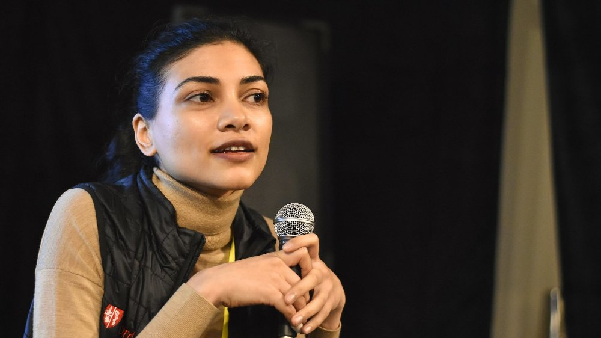

In this episode, Luca talks to Jassi Pannu and Joshua Monrad.

<h5>Jassi Pannu</h5>

<h5>Joshua Monrad</h5>

[Jassi Pannu](https://www.linkedin.com/in/jassipannu/) is a Resident Physician at Stanford, a Visiting Scholar at [John Hopkins](https://publichealth.jhu.edu/), and a Fellow at the [Emerging Leaders in Biosecurity Initiative](https://www.centerforhealthsecurity.org/our-work/emergingbioleaders/).

[Joshua Monrad](https://twitter.com/jtmonrad) is a Biosecurity Program Officer at [Effective Giving](https://www.effectivegiving.org/) and a Researcher at Oxford's [Future Humanity Institute](https://fhi.ox.ac.uk/).

We discuss:

* The post-COVID biosecurity landscape, including the American Pandemic Preparedness Plan
* The Biological Weapons Convention and current issues in dual-use research
* The role of antivirals, increasing vaccine capacity, and market failures
* Similarities and differences between GCBR mitigation and general pandemic preparedness
* How some interventions are underpinned by global cooperation

## Jassi and Joshua's Recommendations

### Jassi

* The Bipartisan Commission on Biodefense's [The Apollo Program for Biodefense – Winning the Race Against Biological Threats](https://biodefensecommission.org/reports/the-apollo-program-for-biodefense-winning-the-race-against-biological-threats/)
* Christian Enemark's [Biosecurity Dilemmas: Dreaded Diseases, Ethical Responses, and the Health of Nations](https://www.goodreads.com/book/show/33255013-biosecurity-dilemmas)

### Joshua

* Kendall Hoyt's [Long Shot: Vaccines for National Defense](https://www.goodreads.com/book/show/13272201-long-shot)
* Tracy Kidder’s [Mountains Beyond Mountains](https://www.goodreads.com/book/show/10235.Mountains_Beyond_Mountains)
* 80,000 Hour’s Bonnie [Jenkins on 8 years of combating WMD terrorism](https://80000hours.org/podcast/episodes/ambassador-bonnie-jenkins-peace-arms-control/)

## Resources

Update: Effective Giving is [hiring](https://effective-giving.homerun.co/biosecurity-program-associate/en)!
[Effective Giving](https://www.effectivegiving.org/) is a philanthropic advisory and grantmaking organization based in Amsterdam with team members across Europe, the US and Asia. Since 2018, EG has collaborated with ambitious philanthropists and an extensive network of independent experts to identify bold projects that have the potential to create outsized impact and make them happen. EG allocated more than $30M in grants in 2021, primarily within the area of biosecurity. In coming years, the organization is poised to substantially expand its team size, grant volume, and geographic reach.

### Post-COVID Policy Landscape

* Bipartisan Commission on Biodefence
  * The [Apollo Program](https://biodefensecommission.org/reports/the-apollo-program-for-biodefense-winning-the-race-against-biological-threats/) and [Athena Agenda](https://biodefensecommission.org/reports/the-athena-agenda-advancing-the-apollo-program-for-biodefense/)
    * Linch's [summary](https://forum.effectivealtruism.org/posts/nkmQfJosPf7huCBkk/notes-on-apollo-report-on-biodefense) on the EA Forum
* White House's [American Pandemic Preparedness Plan](https://www.whitehouse.gov/wp-content/uploads/2021/09/American-Pandemic-Preparedness-Transforming-Our-Capabilities-Final-For-Web.pdf) and [First Annual Report](https://www.whitehouse.gov/ostp/news-updates/2022/09/01/fact-sheet-american-pandemic-preparedness-plan-annual-report/)
* Institute for Progress [Preventing Pandemics Requires Funding](https://progress.institute/preventing-pandemics-requires-funding/) – differences between the White Houses' proposal and the Senate's PREVENT Act
* Glennerster et al. (2022) [Calculating the Costs and Benefits of Advance Preparations for Future Pandemics](https://www.nber.org/papers/w30565)
* BARDA's [Mask Challenge](https://drive.hhs.gov/mask_challenge.html)
  * https://www.theatlantic.com/science/archive/2022/10/pandemic-n95-mask-protection-shortcomings-indoor-air-quality/671723/
* [News article](https://www.science.org/content/article/cycles-panic-and-neglect-head-pandemic-prevention-institute-explains-its-early-death) on the Rockefeller Foundation ending the Pandemic Prevention Institute
* Bill Gate's [How To Prevent The Next Pandemic](https://www.goodreads.com/book/show/59900689-how-to-prevent-the-next-pandemic?ac=1&from_search=true&qid=asb3l8ISEi&rank=1)
* Brauner et al. (2020) [Inferring the effectiveness of government interventions against COVID-19](https://www.science.org/doi/full/10.1126/science.abd9338)

### Dual Use Policy

* [News article](https://www.forbes.com/sites/stevensalzberg/2022/10/24/gain-of-function-experiments-at-boston-university-create-a-deadly-new-covid-19-virus-who-thought-this-was-a-good-idea/) and [Marginal Revolution](https://marginalrevolution.com/marginalrevolution/2022/10/irresponsible-gain-of-function-research.html) on Boston University's Gain of Function Experiments 
* [Nuclear Threat Initiative](https://www.nti.org/)'s [International Biosecurity and Biosafety Initiative for Science](https://www.nti.org/about/programs-projects/project/international-biosafety-and-biosecurity-initiative-for-science-ibbis/)and work on red lines
* Our previous [episode with Tessa Alexanian and Janvi Ahuja](https://hearthisidea.com/episodes/alexanian-ahuja) on [iGEM](https://igem.org/)
* Our previous [episode with Kevin Esvelt and Jonas Sandbrink](https://hearthisidea.com/episodes/esvelt-sandbrink) on Risks from Biological Research
* Center for Health Security's [Recommendations to Strengthen the US Government’s Enhanced Potential Pandemic Pathogen Framework](https://www.centerforhealthsecurity.org/news/center-news/pdfs/220629-RecstostrengthenUSGePPPandDURCPolicies.pdf)
* Pannu et al. (2022) [Protocols and risks: when less is more](https://www.nature.com/articles/s41596-021-00655-6)
* Musunuri et al. (2021) [Rapid Proliferation of Pandemic Research: Implications for Dual-Use Risks](https://journals.asm.org/doi/full/10.1128/mBio.01864-21)
* [1977 Russian Flu](https://en.wikipedia.org/wiki/1977_Russian_flu)
  * Rozo & Gronvali (2015) [The Reemergent 1977 H1N1 Strain and the Gain-of-Function Debate](https://www.ncbi.nlm.nih.gov/pmc/articles/PMC4542197/)

### Biological Weapons Convention

* The [Biological Weapons Convention](https://www.un.org/disarmament/biological-weapons/) – its [9th Review Convention](https://meetings.unoda.org/meeting/bwc-revcon-2022/), [Implementation Support Unit](https://www.un.org/disarmament/biological-weapons/implementation-support-unit), and [Confidence Building Measures](https://www.un.org/disarmament/biological-weapons/confidence-building-measures)
* [Africa CDC](https://africacdc.org/), [VERTIC](https://www.vertic.org/), and X

### Antivirals and Vaccines

* Pannu (2020) [Running ahead of Pandemics: Achieving In-Advance Antiviral Drugs](https://papers.ssrn.com/sol3/papers.cfm?abstract_id=3570737)
* G-Finder [Landscape of Emerging Infectious Disease R&D: From Pandemic Response to Pandemic Resilience](https://www.policycuresresearch.org/2022-g-finder-eid-report/)
  * See also their [interactive database](https://gfinderdata.policycuresresearch.org/) tracking funding for global health R&D
* Monrad et al (2021) [Promoting versatile vaccine development for emerging pandemics](https://www.nature.com/articles/s41541-021-00290-y)
  * Building on Kremer & Snyder (2015) [Preventives Versus Treatments](https://academic.oup.com/qje/article-abstract/130/3/1167/1931641) and Kremer (2000) [Creating Markets for New Vaccines](https://www.journals.uchicago.edu/doi/10.1086/ipe.1.25056141)
  * [News article](https://eu.usatoday.com/story/news/health/2020/11/23/success-pfizer-moderna-mrna-covid-19-vaccines-ushers-new-era/6311228002/) on Moderna and mRNA technology
* [Pneumococcal Advanced Market Commitment](https://www.gavi.org/investing-gavi/innovative-financing/pneumococcal-amc)
* Catillo et al. (2021) [Market design to accelerate COVID-19 vaccine supply](https://pubmed.ncbi.nlm.nih.gov/33632897/)
  * Covid-19 vaccines sold for between \$6 and \$40, much less than the \$5,800 social value of a course of annual capacity in early 2021

### Global Cooperation in Biosecurity

* Pannu (2020) [Inclusive Biomedical Innovation during the COVID-19 Pandemic](https://onlinelibrary.wiley.com/doi/10.1111/1758-5899.12876)
* Pannu & Barry (2021) [The state inoculates: vaccines as soft power](https://www.thelancet.com/journals/langlo/article/PIIS2214-109X(21)00091-7/)
* Pannu & Barry (2021) [Global health security as it pertains to Zika, Ebola, and COVID-19](https://europepmc.org/article/med/34334661)

### Miscellaneous

* [News article](https://www.huffingtonpost.co.uk/entry/anthony-fauci-fighting-covid-19_n_5fc7fed7c5b61bea2b14e3ee) on Fauci visting patients
* [Antimicrobial resistance](https://en.wikipedia.org/wiki/Antimicrobial_resistance)
  * Lancet Report (2022) [Global burden of bacterial antimicrobial resistance in 2019: a systematic analysis](https://www.thelancet.com/journals/lancet/article/PIIS0140-6736(21)02724-0/)
* Karger et al. (2021) [Reciprocal Scoring: A Method for Forecasting Unanswerable Questions](https://papers.ssrn.com/sol3/papers.cfm?abstract_id=3954498)
* Earp et al. (2021) [How social relationships shape moral wrongness judgments](https://www.nature.com/articles/s41467-021-26067-4)

## Transcript

### Intro

**Hear This Idea 0:06** 

Hey, you're listening to Hear This Idea. This is the last episode in our current mini series on biosecurity, at least for now. So far, we've spoken a lot about global catastrophic biological risks and interventions to help mitigate against the very worst kinds of pandemics. However, I also wanted to have an episode that just talks about pandemic preparedness more broadly, both because I think it is just really interesting work that's happening right now, and also to help give context to the larger coalition on biosecurity that exists largely outside of the Effective Altruism community. To help with this, I invited two guests onto the show, Jassi Pannu, and Joshua Monrad. Both have done a lot of work on GCBRs, but also just have a really broad background that I think is really useful for this. Jassi is a resident physician at Stanford and an ELBI fellow and a visiting scholar at Johns Hopkins. Joshua is a biosecurity programme officer at [Effective Giving](https://www.effectivegiving.org/) and a researcher at Oxford’s [Future of Humanity Institute](https://www.fhi.ox.ac.uk/). We begin by talking about the post-COVID landscape of pandemic preparedness, including the current difficulties and getting the US Congress to pass the [American Pandemic Preparedness Plan](https://www.whitehouse.gov/wp-content/uploads/2021/09/American-Pandemic-Preparedness-Transforming-Our-Capabilities-Final-For-Web.pdf). What changes US agencies like [BARDA](https://aspr.hhs.gov/AboutASPR/ProgramOffices/BARDA/Pages/default.aspx) are currently undertaking, the state of the Biological Weapons Convention, and updating governments’ dual-use policies. We then also touch on Jassi and Joshua's respective work on the role of antivirals and increasing vaccine capacity and how they've changed their mindsets. Towards the end of the episode, we then begin discussing the similarities and differences between GCBR mitigation and general pandemic preparedness, false dichotomies between them and how some interventions are underpinned by global cooperation. As you can maybe tell, we really just touched on an extremely wide set of topics and organisations, so I highly suggest you look at the write up to find out more. As always, we also have chapter markers to help you guide around the episode. But without further ado, here's the episode.

**Jassi 1:46** 

So my name is Jassi, Jassi Pannu. And I'm a doctor by training or as the Brits like to say a ‘medic’. I treat patients mainly in California. But I also work once a year in Kampala, Uganda to work at a tertiary referral centre there. In California, I work at Stanford University. But I think that the main reason you invited me here today is actually because I'm a fellow at the [Johns Hopkins Center for Health Security](https://www.centerforhealthsecurity.org/), and there I work on health security, as well as biosecurity.

**Joshua 2:13** 

It's a pleasure to be here. My name is Joshua Monrad. I'm from Denmark, so if anyone's wondering, that's where the accent comes from. How I spend my time: so part time I am a researcher with the Future of Humanity Institute based at Oxford University with a biosecurity research group there. Although these days I spent the majority of my time - almost all my time - in my other role as the programme officer for biosecurity with Effective Giving. I am really thrilled to be here today.

### What We Got Wrong About the COVID-19 Responses and Lessons

**Luca 2:51** 

To try and frame this episode, it seems that a lot of biosecurity discussions at the moment inevitably get framed around COVID-19. So maybe we want to start off this episode by asking what's something that you think listeners, or the Effective Altruism community, might have gotten wrong about how the world responded and learned or perhaps didn't learn from COVID-19?

**Jassi 3:11** 

Oh, that's a good question. I'm not sure that broadly across all of EA, there's a unified interpretation of, ‘What did the world learn after COVID-19?’ But I do feel like often in conversations, I have a sense from people that, to exaggerate a little, we didn't learn much, and that we're back where we started and no progress has been made. And I really feel like if you look at things carefully, that that's not the case. I feel like we have made progress, and a lot of exciting developments have happened in that there is more interest in pandemic preparedness overall, particularly in the US. And so even though I personally would love to see more interest, more investment, and more commitment to pandemic preparedness and pandemic prevention, I still am optimistic about the level of interest that we're seeing, even though I would love to have more.

**Joshua 4:10** 

 

Yeah, I second your note of optimism and think there's a lot of things we can be really not only grateful for, but also optimistic about coming out of the pandemic and further preparedness for future biological events. I think maybe something where I could imagine disagreeing slightly with the kind of people who might be listening to this podcast is on how well mainstream public health institutions and experts did. Obviously, that's a very wide generalisation. But roughly thinking about institutions like the [US Centers for Disease Control](https://www.cdc.gov/) or various ministries and public health or academics working on public health or global health or health security, where I think I've seen a reaction thinking that a lot of the mainstream institutions seemed unwilling to think creatively or innovatively or were too reliant on prior thinking about how to respond to pandemics. One example might be in how vaccines are rolled out: do we prioritise giving two doses to everyone, as is the medical recommendation for a given vaccine? Or do we take a different approach to try and get one dose to as many people as possible, based on the argument of maximising population level immunity? And I saw a lot of people being somewhat exasperated at public health institutions repeating a mantra of ‘We have to follow the evidence. We have to follow existing guidelines and best practices.’ And not to get into the details of this specific question of vaccine dosing, but I think in general, I really recognise that exasperation, and I really do think that the we're outsiders to the public health establishment who came up with really genuinely bright ideas that the establishment should be listening to, but I also think it's just really important to recognise how unprecedented this event was, and how many factors were going including the role of politics or federal governments that might constrain what different public health institutions can do, and secondly, how important it just is to work with the experts who do have decades of experience. I think, rather than seeing it as a sort of adversarial relationship between the new people on the block coming from different disciplines and the existing expertise, seeing it as hopefully as a more collaborative endeavour, which is a two way street, where people from different disciplines can bring new ideas, but also recognise that people have worked in the field for a long time, probably having some tacit knowledge about certain things that shouldn't be blindly deferred to, but should be taken into account.

**Luca 7:20** 

So if I'm right in characterising here, I'm sensing a bit of optimism from both of you. Jassi you mentioned heightened interest in biosecurity and pandemic preparedness to try and stop similar or worse events from happening in the future. And Joshua, if I'm right in summarising what you said, it seems that both smart outsiders can think of really good things, and this can actually have important policy consequences too, and it seems that there is a lot of expertise that was useful either in the past or that is now currently built up to hopefully also be useful in the future. One thing I want to dig into particularly is what the policy landscape looks like at the moment. So Jassi, following on from what you said, I remember there being this meme that went around that post-COVID there might be this open policy window in getting a lot of ambitious legislation passed, the American Pandemic Preparedness Plan from the White House being one of these. But now the way that I read, at least a lot of what's going on on Twitter, is that there's more pessimism about this, that maybe this window has passed, that people are less interested in biosecurity already just a few months after lockdowns in a lot of the Global North ended, but still with with COVID very much raging on. So curious for any of your guys' thoughts on what the landscape here looks like, maybe with a particular focus on the US?

**Jassi 8:50** 

Yeah, it's certainly a discussion that's been happening a lot. I think at the beginning of the pandemic, I was really lucky to participate in this project that was run by a few of my colleagues called the [Apollo Program for Biodefense](https://biodefensecommission.org/reports/the-apollo-program-for-biodefense-winning-the-race-against-biological-threats/). This was something where several of us saw that there might be a policy window and wanted to try and influence it for the better to make sure that resources were being spent on pandemic preparedness, and thinking about how we could get that message across. So what we ended up doing was publishing a report with the [Bipartisan Commission on Biodefense](https://biodefensecommission.org/). This is a well known bipartisan group. It's led by former Senator Joe Lieberman and former Governor Tom Ridge. And a few months into the pandemic, we started working on this and our aim was to produce a technology roadmap for pandemic prevention. And we knew that there were technologies out there, like many of your brilliant podcasts prior talked about, like meta genomic sequencing and other technologies that could be really powerful tools to help us fight, but even more importantly prevent, future pandemics. And we wanted to guide the government, other philanthropists, other funders, to help them learn about these technologies, inform them and also inspire them to see what a future without pandemics could look like, and what technologies would get us there. So this is just me speaking from personal experience, when we're working on this report, we were super optimistic thinking, ‘Look, we can look at, all first year, just finding out about all these amazing technologies and how they could be put towards preventing pandemics in future years’, dreaming up futures where pandemics don't exist, and how amazing that will be for humanity. And we were really optimistic that we could share this our optimism, and persuade a lot of people to put policies into place that would help incentivize these technologies and start funding them. After we published the report, we did find that there was a lot of appetite for a roadmap like this, and there was interest from the government in terms of helping to set funding priorities interest from the Biden administration, but where we really had difficulty was getting spending passed through the US Congress. And I think that that's something that every interest group faces, because it's so hard to get agreement in Congress on particular issues, even bipartisan issues like pandemic prevention, but we still have allies on both sides of the house that are actively working on different types of legislation, and trying to get spending on some of these issues and technology. So I think that during a crisis, everyone is so focused on responding to the crisis, which is completely reasonable. And then now that the crisis is a little bit more under control, there is thinking about how we can restructure agencies or make sure that things like [Operation Warp Speed](https://www.gao.gov/products/gao-21-319) are built into the US federal government, and they don't go away making sure that we institutionalise those capacities and figure out why that worked so well, and how we can keep it going. So I think some of these things are happening. In terms of did we end up revolutionising the government and have them completely changed all of their spending? Of course not, and I think that that's not necessarily the goal. So I think that there is still a lot of exciting legislation that's being drafted. There are exciting things like figuring out how to institutionalise Operation Warp Speed and other things like that that make me optimistic.

**Luca 12:32** 

Yeah, that's a really interesting flag, that this is very much still a live debate and the White House at least seems to be on board and I think has recently pledged up to, or at least being willing to spend over $80 billion, and it's really about getting it kind of through Congress at the moment and finding different avenues there. But I'm curious what seems to be the bottleneck with pandemic preparedness in particular. It was not so many months ago that Congress did pass a big spending bill on climate change, with the [Inflation Reduction Act](https://www.congress.gov/bill/117th-congress/house-bill/5376/text), and you saw similar moves around AI and semiconductors, with the [CHIPS Act](https://www.nist.gov/semiconductors/chips-act). I'm curious what might currently be the bottleneck with pandemics, especially given that at least the legacy of COVID seems to be much more alive than AI and climate, which are more future-looking problems?

**Jassi 13:23** 

Yeah, I think that part of it is that there's a perception that so much money has been spent on COVID, that spending further money has to be very strongly justified and it's hard to whet people's appetite for further spending. There is also a perception that the US government has a certain amount of money for pandemic response and prevention, and that there's a pie, and that the pie has to be split amongst different players, whether it's the CDC, or NIH, or different agencies in the space, different priorities. And there's a lot of discussion about how the pie should be split, as opposed to how do we make the pie bigger for everyone. And it's unfortunate because I think everyone who is interested in this issue has the same priorities. Everyone is trying to prevent future pandemics, respond to the current one, and develop our abilities there. But because there's a perception of it being one pie, then you end up having debate amongst us in terms of, ‘We should fund this instead of this’, as opposed to, ‘Let's all figure out how we can fund everything that we need.’ But of course, I think that happens in a lot of fields, not just ours.

**Joshua 14:49**  

Yeah, and the question of funding I think is one that initially seems sort of puzzling or hard to wrap your head around in the sense of there being this very long standing idea of prevention being so much more cost effective. There's economic analysis after economic analysis. There is a recent one just coming out by Rachel Glenister and colleagues highlighting, not for the first time, that investing before a pandemic is just much more cost effective than waiting for it to occur. But of course, in terms of political incentives, that's not quite how simple the calculus is. I think I'd be interested to hear, Jassi, now we talk about funding, and of course there are a lot of things where you do need financial capital to make things happen, particularly in terms of developing new technologies. There may also be other areas where it's not so much a question of financial capital, but also one of political capital, or of coming up with the right policies to implement, that aren't so much a question of increasing a budget anywhere, but more of maybe regulating something or creating certain norms. So I'd be curious to move the conversation into talking a little bit about different policies outside of advancing technologies and increasing funding for agencies that really do need them. More pure policy approaches for improving pandemic preparedness and global biosecurity. If there's anything you'd like to highlight there.

**Jassi 16:35** 

Well, one comes to mind, but I'm not sure that it's what you intended. So I'll give my example and then feel free to add on in terms of what you're thinking of as well. But what I thought of was an agency within the US federal government called BARDA, Biomedical Advanced Research and Development Authority. It's really meant to address public health priorities, public health technologies and countermeasures, that maybe don't have a place within the private market, that suffer from market failures, or that could be perceived as a public good, and where the government needs to step in and provide some incentive mechanism or some funding to really help the market move forward. So, BARDA wanted to go ahead and try to incentivize further innovation in the PPE space, in particular masks - and when I say masks, I mean masks, not respirators. So they ran this challenge for masks for the public, which is a new category that the US Federal Government at least hadn't really been thinking about too much before the COVID pandemic, because, usually, the public did not need masks. But now, during COVID, there was a lot of interest in trying to figure out new designs and better designs for masks for the public. And so what BARDA did was they had not a significant amount of funding, I think the total amount of funding they put towards this was $500,000 US - in terms of doing new material science research, or setting up a manufacturing line or setting up a new company, that's a really small amount of funding in the grand scheme of things - but with this prize competition, they actually got tens if not hundreds of submissions from different people who were developing new mask designs, and if you just Google ‘BARDA Mask Challenge’, you can see a lot of these designs that they received, which are quite different and innovative and exactly what they wanted. When I spoke with the folks at the US government who designed this mask challenge, one thing that that they mentioned to me was that the typical federal government approach, when they want a new product, such as a new personal protective equipment product, is that they will come up with a concept, they'll come up with a target product profile, and then they will go to a few of the major incumbents, the larger companies and say, ‘Hey, can you manufacture this for us?’, or set up a request for proposals and get some requests from some of these bigger companies. And that's a good established process, but you really will only hear from a few players who are used to interacting with the government. And the cool thing about this mask prize was that they had submissions from people they didn't even know existed or were working on masks, who had completely different approaches to masks, and they really felt like they reached a different community of innovators with this competition, and that they got concept generation in directions that they wouldn't have anticipated. So, I think that's an example of something new and different that the government is trying to do and how they're trying to bring and shout in the PPE space, and they got a lot of positive feedback and good press for that. I think there are criticisms of the mask challenge. The prize funding was quite small and certainly not sufficient for any company to set up a manufacturing line, or to really start going through approval processes with the aerosol regulator in the US with [NIOSH](https://www.cdc.gov/niosh/index.htm) and with FDA, but that's not what the prize was meant for. It was really more of a concept generation prize, and then companies and maybe larger incumbents or new companies can run with the ideas that were brought up during the prize.

**Luca 20:44** 

I'm curious what types of new applicants they were able to crowd in through that competition? Are these startups? Are these research laboratories? Are they companies or university groups? What kind of applicants did they seem to get?

**Jassi 20:59** 

Yeah, they had a whole range really. And so just to be clear, this mask prize was not set up to generate PPE that would be relevant for a GCBR, so when people listening to this podcast look up the mask prize, and they say, ‘Well, this PPE is not going to be useful for a really catastrophic pandemic.’ Yes, you are correct. But that's not what it was designed for, it was more designed for consumer masks. But in terms of the people that they received submissions from, there was a submission from Levi's, the denim company, that had designed masks because they really work with textiles a lot, and so they were able to develop a mask and submit it for the prize. And then there was also a submission from a nanotechnology researcher at Stanford University that had previously never worked in the PPE space, but his laboratory had worked on filter materials, nano filter materials, and during the pandemic, they pivoted towards developing filter materials for masks. And so they developed a new filter material that's based on a nano filter, and they actually started manufacturing and selling those masks. And you could purchase them, although I think they're, they're out of stock currently. But reaching people that you wouldn't normally think of, for example, 3M and Honeywell, some of these larger US manufacturers, reaching outside of that group.

**Luca 22:29** 

Yeah, that's really cool. Especially, as well, if it seems to be growing the field and growing the amount of people with expertise and also outside opinions and approaches, that seems really interesting. Again, circling back to Joshua’s original question as well, which was framed around some of the non-R&D or non-fiscal types of interventions, have you got any policy interventions or things that you would like to see in the space in a similar vein?

**Joshua 22:58** 

I love the example of this initiative focused on personal protective equipment. But I agree with Luke, I'm still finding myself waiting, full of curiosity. I guess one thing in particular I had in mind that you alluded to earlier was this question around oversight for dual-use research - maybe it's helpful to begin by defining what you mean when you say dual-use research. Because that is an area that comes to mind for me where it is not clear that the real challenge is allocating a lot of funding towards this issue, although, of course, people who are working on solving it do need to be able to keep the lights on, and there are certain agencies that can operate more effectively if they're well funded. But fundamentally it's not a problem necessarily of building anything with resources, but rather of governing what already exists. I'd love to start a conversation around this question of more broadly governing the life sciences and biotechnology.

**Jassi 24:06**  

I left the question around dual-use policy and almost feels as though I planted it, because this is something I'd love to talk about. But, yeah, I think you're completely right that addressing dual-use policy, and I'll explain shortly what exactly that means, is not a question of money, and it's not a question of finances. It's really about how do you design a policy that is flexible enough so that it stays relevant as technologies and capabilities are rapidly changing, but that is also clear and specific enough that people can use it and they can read it and understand what it means and see how it clearly applies, and I think that striking that balance is one of the main challenges with designing an effective dual-use policy. So just to go back and describe what dual-use policy is, when I talk about dual-use policy, I'm referring specifically to US federal policy. So people can use dual-use in many other settings. But dual-use research of concern, D-U-R-C, known as DURC, refers to the US federal policies. The original dual-use policies were centred around 15 agents they called agents or toxins, and seven categories of experiments. What that means is that these specific agents or pathogens, and these specific experiments were listed out, and these were the only ones that you had to worry about when it comes to dual-use policy. That actually was a huge achievement, and it was really important for scientists because you needed to explicitly state what it was that dual-use research of concern was so that scientists could know when the policies applied, and when they didn't. And before this definition, scientists continually felt like, ‘Well, all of science could be dual-use, how do we know which science is dual-use, and which is not?’ And so at the time that these policies were being crafted, being specific was really important. And that's how we ended up with this list-based approach. But now, the list based approach seems a little out of date, because with newer biotechnology and newer life sciences techniques, there's a lot of work that isn't captured by this original list that still could be meaningfully considered dual-use research of concern and so we need to figure out better policies to try and capture all of this. Recently, there has been a relevant debate happening around dual-use policy, on Twitter and in real life. It's about a set of experiments that were performed at Boston University. So what appears to have happened is that there were researchers at Boston University that created a hybrid version of SARS-CoV-2, virus. Hybrids are also known as chimaeras, which listeners might have heard being thrown around, especially in the context of pandemic research. So the hybrid they created was a combination of the Omicron spike protein, with the original Wuhan wild type SARS-CoV-2 virus, so they combined those two things. And what this resulted in was a lab-made virus that was more lethal than Omicron, to this specific type of lab mice that they use, which was not just a normal mouse, they use a specific strain of laboratory mice. So it was more lethal than Omicron, but it was less lethal than the original wild type strain. So something in the middle. The reason that they did this experiment was to figure out the characteristics of the spike protein, so they’re trying to learn more about what the spike protein does, how it functions, and that is the scientifically useful thing to try and understand. But what's been interesting is that there's an epidemiologist and a physician, Dr. Marc Lipsitch, who is at Harvard, and now leads the CDC’s new forecasting centre, and what he pointed out on Twitter was that this actually does count as gain-of-function work, at least in his opinion, because even though the ultimate result of what they created, the virus that they created, was less less lethal than the wild type strain, you wouldn't have necessarily known that before you did the experiment. And when you add an Omicron spike protein to a virus, the one thing that we know about Omicron was that it was less susceptible to the original vaccines. And so now you're giving the wild type virus that ability for immune escape, and giving it immune escape properties. So that is also concerning. Overall, this is not the most dangerous kind of what we call ‘gain-of-function’ work or ‘dual-use’ work. They weren't conferring really efficient human aerosol transmission on something that was super virulent and that the human population didn't have existing immunity to it. That's what we would consider some of the more concerning types of these experiments, but in this case, most of the world has already been exposed to Omicron. But as this whole situation points out, the term ‘gain-of-function’ is so broad, it can mean a lot of things. And this could be considered gain-of-function work, and the scientists who were performing it didn't realise that. And it's because that gain-of-function term is so broad and not well understood. And so the reason that there's controversy around the set of experiments isn't necessarily the content of the experiments, as I said, they're not the most concerning kind of gain-of-function. But it's more the fact that the Boston University researchers didn't necessarily realise what they were doing could be considered gain-of-function, and they didn't alert the National Institutes of Health. They didn't alert their institution, and they didn't try and figure out that a special approval for this work was required. And there's another great person on Twitter virologist named [Florian Krammer](https://twitter.com/florian_krammer) - forgive me if I'm pronouncing his name incorrectly. He's a virologist at the Icahn School of Medicine, and he pointed out that one of the reasons that researchers don't reach out to NIH or the Department of Health and Human Services, as they're supposed to, is because the current US dual-use and potential pandemic pathogen policies are hard to parse for scientists. And so he's really advocating for increased transparency and really clear guidance for scientists, and I think that's definitely something that we'll need to incorporate into improvements in US Federal dual-use policy. I think overall it's just an illustrative example of the challenges we currently have around dual-use policy. And I think the other thing to mention is that the work was posted online as a preprint. Which gets to another important aspect, because over the past 10 years journals have often come under scrutiny for publishing gain-of-function work. And so they've become a lot more aware of what the risks around publishing dual-use work are, what we know are information hazards. And it's hard to do that as a preprint server just because of the volume of work that you're looking at, and the volume of work that you're publishing. But interestingly, during the last meeting of - the US Federal Government has this group of scientific advisors called - the [National Science Advisory Board for Biosecurity](https://osp.od.nih.gov/biotechnology/national-science-advisory-board-for-biosecurity-nsabb/) or NSABB, for short, in September, they actually invited an editor from one of the larger life sciences preprint servers specifically to talk about this issue of what happens when you're publishing dual-use work on preprint servers, and it's not getting as much review as under a traditional journal.

**Joshua 31:56** 

I think this was a really interesting case, and I think I also appreciated Marc Lipsitch’s point about looking beyond sort of the specific contents of the experiment, but also looking at how various institutions responded, and one of those institutions is the concern public and people like us people who are listening to podcasts like this, who, I think, rightly, are alarmed about the idea of hazardous experimentation and or hazardous information being published and who are calling for more oversight. I really appreciate your point, Jassi, about focusing on this term of gain-of-function and the inadequacy of simply asking a binary question of whether somebody is gain-of-function or not. And I think, as important as it is to have this - speaking of this policy window we talked about where there actually is some interest - as important as that is to seize that moment to show a lot of concern from the public around this issue and call for action, I think it is similarly important to recognise how actually thorny of a question it is to figure out how to oversee this. It's not just an issue of inaction or of sciences not wanting to have regulations imposed. I think there is some lethargy and some inaction, and there is something about the culture of not wanting to be regulated. But I think it's also just actually a difficult question to find out how to effectively lay out what research should and should not be conducted. And I think there's a couple of reasons for that. One is that, as the term implies, dua-use, often we're talking about research that does have ostensibly benefits and people can disagree about how large are those benefits. Are they just benefits in the sense of being scientifically interesting, or do they actually have public health benefits? But at least in many cases, that will be a legitimately difficult discussion to have, weighing the risks and benefits? So that's one challenge: how do you actually find out where this balance of risk and benefits is? Then another challenge is the challenge of defining something that is - if you just said, ‘Okay, let's ban so-called gain-of-function research, the research that takes a pathogen and gives it a new function like increased fatality or transmissibility or immune escape. Let's just ban that.’ Well, if you just said ban everything that - banned is a crude term - prohibit everything that can be characterised as gain-of-function, you'd have both two different kinds of errors: you'd be prohibiting things that are completely benign, because they might technically be gaining a function for some organism, but but it's actually not dangerous. So it's overly restricted in one sense, and then it's insufficiently restrictive in another sense because there is research that might not be traditional gain-of-function research that still poses a risk by advancing some frontier of what is possible with, for instance, synthetic biology. And this is something I know has been discussed on this podcast before, so I encourage people to check out some of the earlier episodes and some of the work of the people in those episodes. So I think that question of actually figuring out where this red line is not trivial. And then, as Jassi mentioned, you also want something that is both specific enough to be actionable as, as Ford and Kraemer emphasised, some scientists might be interested in complying, but they don't really know where this line is. So we want it to be specific enough to actually tell people, ‘Can you do this or not?’, but also flexible enough to be, shall we say, future proof, and not just be this list of things that we know is concerning now, but then five years from now, when there's been some scientific or technological advance, that list is rendered inadequate. And all at the same time, you also don't want to, in the effort to regulate these things, create further information hazards by pointing out and saying, ‘This is the most dangerous thing to do with biology, everyone agree to not do that one thing.’ Because that might inadvertently shine a light on something that perhaps shouldn't be emphasised in those terms. And then the final thing I want to emphasise is, and I guess this goes back to my previous point about drawing on longer standing expertise is this is not a new dilemma. This is something that has been debated hotly for the past few decades, especially I think in the past decade, since 2011/2012, where there were some particularly controversial and fraught experiments around H5N1 Influenza research. And there has been a lot of work before the pandemic trying to hash out how we should approach this. And I also think it's true that there are new ideas that are coming into this space and this energy of saying, ‘Listen, I can't believe that we're just not really taking seriously the risks of this research’, and the frustration that I see people expressing around that, I think that's it's really positive to see people actually caring. I suppose I want to encourage people to then also really engage with, ‘Okay, assume that we got people to listen and try to do something about this. What exactly should we do?’ I think that's a thorny question. And I know, it's something, Jassi, that you've also been working on, I myself work a little bit with a great group of people at the [Nuclear Threat Initiative](https://www.nti.org/), which has a team on biological risks, and I've been contributing there to a project, coined the ‘red lines project’, also with David Relman at Stanford, of trying to find out where do we draw this line, in terms of what should be permitted or not?

**Luca 38:39** 

Yeah, I'm interested in first asking a clarifying question, and then perhaps a more substantive question. Going back to this - Jassi you mentioned at the start that there is this - regulation or law around 15 particular pathogens that you should at least not do a defined set of experiments on but then there also seems to be this broader set of interventions against potentially dual-use or gain-of-function research that's more driven by social norms around publishing, preprints, funding, whatever else. I guess my clarifying question there is whether this SARS-CoV-2 incident happened to be one of the pathogens and experiments that is, explicitly, red lines, in the legal or regulatory sense, or whether this went against the norms of the profession. And then that in turn leads me to the more substantive question, Joshua maybe for you. If you're interested in mapping out where to draw red lines and what signs to allow and what not to, once you've done that, what are actual intervention points that you can do here, including particularly useful ones that don't just fall within legal and regulatory capacity?

**Jassi 39:56** 

Great question. Maybe I'll just tackle the first clarifying question, and then I'll hand it over to Joshua. So, with regards to this specific US federal policies that might have been applied to this set of experiments, the dual-use research of concern policies would not have applied and furthermore, there is another set of policies called the Enhanced Potential Pandemic Pathogen or EPPP policies, and those frequently, for example, apply to when you are dealing with a known pandemic pathogen or potential pandemic pathogen, such as a avian influenza, and you are doing something that is aimed at enhancing it. So, for example, you're increasing the transmissibility, or you are increasing the virulence. Even then, this wouldn't strictly fall under that category of regulations either. So it really falls more under the third, that you mentioned, of social norms around gain-of-function, and the currently more opaque process of reaching out to NIH, reaching out to NIAID, asking them what they think about this, is there a way to reduce the risks? Should they more carefully have set up some checkpoints along the way? Should they maybe have some laboratory or some surveillance of laboratory staff to make sure that they don't get infections? And just having more processes around and that gets to what Florian is talking about, where that's not totally clear at the moment. But if it's of interest to listeners, there is currently a review that the US government is conducting around whether or not these policies both the dual-use as well as the potential pandemic pathogen policies should be changed and updated to capture work like this or if it shouldn't, and that's currently under debate, and no final decisions have been made.

**Joshua 41:50** 

And maybe to sort of jump on to the second half of Luca’s question, as I understood it. So first of all, I didn't mean to imply with my previous remark about recognising the difficulty of defining where the red line is that we can't do that at all. I do think that. Without getting into the details of listing specific experiments, or categories of experiments, I do think that there are things where it seems that the balance of risks and benefits does not favour carrying this out, or at least not carrying it out without excessive or abundant caution. So let's suppose that we had some sense of where this line is, and we also had some political capital, some political will, where would you actually intervene? And I think there's quite a few places actually where you could do something. You can envision the life cycle of scientific research, starting at what ideas are conceived. And this gets to this question of, ‘What are the norms around research? What ideas do the researchers come up with when they embark on a project? What hypotheses do they want to test, and what methods do they want to use to test them?’ And here, I think there's a lot of good work that is being done across the world, and can be done to really create a culture of responsibility, and a security mindset and safety mindset that does not say, ‘Don't do experiments. Don't take any risks’, but rather say, ‘Be deliberate about how you are trying to achieve a given scientific outcome with which methods and with what balance of risks and benefits.’ There's a lot of actors that work in this space. I think one favourite of mine is the [International Genetically Engineered Machine](https://igem.org/), or iGEM, which was discussed a lot in one of the very recent episodes. I don't know if there's anyone in that sort of changing norms category that you want to highlight, Jassi, or we can continue through the lifecycle of life science.

**Jassi 44:25** 

I would just refer people to the most recent episode and tell them to listen to [Tessa's podcast](https://hearthisidea.com/episodes/alexanian-ahuja) with you all. That's a great example of someone who's thinking about how you can embed this within the social norms.

**Luca 44:37** 

 

One quick question here: because, in the Tessa episode, we talked a lot about iGEM, which is where Tessa is currently working at, I'm curious how else to actually go about changing norms in scientists’ approach or in publishing. How does it actually work? Do you ask a journal, asking the editors or does it involve more public pressures? Is it a ‘leading by example’ way, or are there other ways to get leverage on this?

**Joshua 45:03** 

So I guess the first category I had in mind was really just getting people to voluntarily, or out of their own accord, embrace this idea of weighing risks when pursuing research. But I also think it's about setting the right incentives. And I guess that leads me to the next step that I was going to talk about, which is the question of, ‘Okay, we have certain research being conceived, well what research is being funded?’ And this is where funding agencies, whether governmental, or philanthropic agencies, or bodies, have a say in, ‘What are incentivizing? What are they encouraging?’, and I think this is, of course, why it's so important to have a place like the National Institutes of Health, the NIH, and other agents in the US that are responsible for funding a large portion of research in the US, that they have good policies, when they're evaluating what to fund. But also philanthropic funders, one example is that the [Wellcome Trust ](https://wellcome.org/)does have at least some kind of dual-use policy for evaluating what research to fund. And I think it's both because you can directly have an influence on whether this project goes ahead or not, but also, that spills back into this question of what research are people conceiving off in the first place, because when people think about what research agendas to draw up, they are thinking about what will they be able to get funding for, and you can send a signal. And I think one point that I really liked, that Tessa brought up is, the earlier you can intervene, the better because you don't want to have a situation where someone has invested years to pursue a research project and only then find out that maybe someone doesn't want this to get published, or maybe someone doesn't want you to go ahead with a certain experiment, because it is in fact too risky. So sending that signal in a very transparent way, this is how we think about funding research, and whether it's too risky, I think is hugely important. I think one organisation that - a very recently launched organisation - is hoping to tackle this issue is the [International Biosecurity and Biosafety Initiative for Science](https://www.nti.org/about/programs-projects/project/international-biosafety-and-biosecurity-initiative-for-science-ibbis/) or IBBIS, which was recently unveiled and recently announced their first executive director, Dr. Piers Millett, who used to be Vice President for Responsibility at iGEM. The organisation is brand new, but their positions helped to really continue this long standing conversation around how should funders approach the funding of potentially risky research? And then after the funding stages, there's the question of what research is actually conducted? Even if you had funding in hand, are there any regulations that should simply prohibit you or govern the environment in which you do certain research? And finally, there's this question of what is published. And here journals have played a role and really been part of this conversation, especially in the past decade. There's been some, at least as far as academic academics go, some fairly intense debates around what should and shouldn't be published, and this also looms really large when it comes to incentives because academics are really incentivized to publish and publish in prestigious journals. So if [Nature](https://www.nature.com/) or [Science](https://www.science.org/journal/science?cookieSet=1) as they did in 2011 or 12, publish certain experiments on manipulating H5N1 influenza virus to be more transmissible in mammals, as was the case at that time, that sends a strong signal: if you can manipulate this virus in certain way to give it a new function, that's really concerning, that is publishable. And so it's really important for big journals to be part of that conversation, because they really do create many of the incentives that scientists ultimately are thinking about. Although I also really appreciate your point Jassi about, ‘What about preprint servers and this way of publishing research without review, and how that might change the picture?’ I'd be curious to hear what if you've been doing any thinking on how that, if at all, changes the landscape?

**Jassi 49:39** 

Yeah, it's something that I was, I'll admit, less educated on until I watched the recent National Security Advisory Board for Biosecurity, the NSABB, meeting, where they invited, I think it was an editor from [BioRxiv](https://www.biorxiv.org/), I believe is who they invited, and the person from BioRxiv spoke about how they actually do have a little bit of - I shouldn't say a little bit it sounds like it's not substantial - but they actually had some fair amount of thinking about making sure that they're not publishing work that is concerning or risky. It sounded like what they've been doing is simply turning those manuscripts down, and if something is obviously in violation, or requires further review, they'll just turn it down for publication on the preprint server and go back to the authors and say, ‘Look, this needs more review than we have the bandwidth to handle. So please submit to a journal where they can actually carefully review the risks of this work and how to best publish it.’ I mean, that leaves the window open for them posting it on their own website, posting it somewhere else, and it's not addressing the problem fully. But it did seem like they were aware of the issue and trying to mitigate it somewhat. Although this the Boston University paper did end up being published on a preprint server.

**Joshua 51:02** 

I've heard some people expressed some pessimism around this idea of how do you regulate what information is getting out there and in a time where anyone could post anything on, if not a preprint server because there's some element of governance going on, then on their personal website? I understand that pessimism, but I also do think that it's not quite as binary as whether the information is out there or not. I do think it is the case that it would be better to make sure that the scientists are not creating information in the first place that if shared, would pose a hazard or enable someone to do something dangerous. But having said that, I also think there's a difference between whether something is on a personal website, or on the cover of Nature or Science. And there's also a difference on whether it is published in in full, or maybe you can engage with the authors in a constructive way and say, ‘How about this is published, but maybe certain things are available upon request, or maybe certain things are omitted in terms of details around what exact work was done?’ So I think there's a lot of space between preventing information from being disseminated anyway and doing nothing.

**Jassi 52:36** 

Well, I think enforceability is certainly really difficult, probably the most difficult aspect of information hazards. And one thing that was previously used is the distinction of ‘classified research’, but classified research, where you really have a lot of controls around who can access it, who you can share it with, it has its own set of problems, where as soon as the US is doing classified research on pandemic pathogens, you worry about sending the wrong signal to other communities in other countries of, ‘What is this work that they're doing and why can't be shared?’ So I think there are other ways to share information that are not fully public and on the internet that could be useful. One thing that comes to mind is - I think it was a year ago or so - I published a paper with some colleagues, including Dr. David Relman, about a protocol that had been published in [Nature Protocols](https://www.nature.com/nprot/). And this protocol was a step-by-step recipe for how to genetically engineer SARS-CoV-2 and it provided the exact ingredient list, the quantities of reagents you would need, and the order in which to do all the steps. And that's the point of this journal, Nature protocols, to really make the protocol as easy to replicate and accessible to everyone. But the point that we were making in our response to this article was that the people who were already working on vaccines, who were already involved in the development that needed this kind of technique, they already had this information, or they had asked others directly for it. The only benefit that you're getting by publishing it on the internet, is now giving that capability to a lot of people who had no way to access it before and who are maybe not particularly skilled in the art of dealing with these kinds of protocols and experiments. And that internal information sharing amongst a trusted network that already happens a lot, and it's publishing things for the forever future on the internet that seems quite dramatically different from that and it's less easy to enforce, and it brings up a lot of difficult challenges.

**Joshua 55:08** 

I really liked your article on that subject. And as I think you recognise, again, we have this real dual-use nature of, in many ways, we can use this phrase, you're ‘lowering the barriers’, you're enabling someone to do something that they wouldn't otherwise be able to. And a lot of the time, that's a good thing. Particularly if you're enabling people, people with more limited resources to be able to participate in basic science, and also in sort of the broader bio economy, there's a really compelling case to make for that often. And yet, there will be examples where the benefits of lowering those barriers or increasing that access are simply outweighed by the risks of whether it's an accident from someone with inadequate safety facilities, or inadequate training, or potentially worse, whether it's a misuse for someone with nefarious intentions, those risks might outweigh the benefits of reducing the barriers. Even if you if you have the view that you're very confident that the risks outweigh the benefits, you're at least going to have to engage with the fact that many scientists are going to have a very strong instinct to the contrary, and many people are going to be very rightly concerned also about the equity considerations about who is gaining access. And so I think if you want to make progress on actually regulating some of these things, you have to really understand and engage with those arguments, because you're going to encounter them very often, and you are going to have to have really compelling ways of dealing with them.

**Jassi 56:55** 

I think that's a solid recruiting pitch. We need more people to work on all of these issues, because there's so many, and they're really complicated, and they’re-

**Joshua 57:03**  

I don't want to be making it sound like there's nothing we can do and everything is difficult. If anything, it's a very encouraging call to action. Like you're saying, there is a lot we can do. And I think there is, including on these thorny questions around dual-use, a lot of people have come up with really creative approaches. So it's more of a, ‘Hey, here's an opportunity to make progress on a hard challenge’, rather than a, ‘Progress is doomed to fail’, approach.

**Luca 57:37** 

Right. I guess I also understand you as saying that there is a lot to do on the margin, so to speak, as you say? It's not about a binary ‘Is this available somewhere on the internet, or not?’ If you just focus on that, then you might give up, but there's a lot of value in getting things moved from the spectrum. So if there’s gain-of-function research, making sure that it's not in the most accessible Nature journal, but instead, maybe on a personal website. That is still a big and genuine win, even if it's not the platonic ideal of governing the biosciences.

**Jassi 58:13** 

I'm very sensitive to the need to have open science and especially for the global health setting, increasing access to biotechnology for those communities. I think, luckily, that a lot of the work that we are talking about, that is concerning, with potential pandemic pathogens, and dual-use research, that's an extremely small subset of all of life sciences research. This most concerning work is a very, very small fraction. And it's still unclear as to how much this particular kind of work is needed for things like vaccine development, and how much benefit it has, and whether there are other experimental techniques that could give you the same information that don't carry similar risks. And so I think luckily, right now, we're dealing with a small sliver of science that we should really carefully consider regulating more, but the vast majority of science is not affected by these concerns, as much, as severely.

### Reforming International Frameworks Governing Biosciences

**Luca 59:29** 

So this has been a really interesting discussion around governing biosciences, which is very focused on the decisions of national governments or philanthropists funding sciences, or even individual scientists, and their norms and conduct. But one thing I read that I know we haven't touched on yet in the policy space is these broader international frameworks. So one in particular is the BWC, the [Biological Weapons Convention](https://www.un.org/disarmament/biological-weapons/). Yeah, I'm curious if you guys have any thoughts on particularly interesting reforms or things that could be useful on that front.

**Joshua 1:00:05**  

Yeah, sure. I'm happy to start with that. I'm glad you brought it up. I think it's especially timely, perhaps around the time that this episode is coming out, given that we have in late November and early December of this year, 2022, we have the [Ninth Review Conference of the Biological Weapons Convention](https://indico.un.org/event/1001123/), which, or the BWC for short, which is an international treaty that prohibits the development, stockpiling, and use of biological weapons in all forms, and the Review Conference is an international gathering that takes place every five years, the last one was in 2016, to make progress on maintaining and upholding that strong norm against biological weapons, and also ensuring that that norm is complied with. And I think there's a lot that could be said about the Biological Weapons Convention. I think I'll keep it somewhat brief and just emphasise, I think it really is quite important, I think it's not to be taken for granted that we do have this very strong international norm. There are no publicly professed or disclosed biological weapons programmes in the world. And the fact that that is the case, I think, is a great success for humanity and something that is really important to maintain. At the same time there's also much that remains to be desired for the Biological Weapons Convention, and in particular around how able are we to verify compliance with the convention? And I think with the Review Conference coming up, in addition to this long standing challenge that's been going on for decades around how do you verify whether countries are complying, there's now an additional challenge of political tensions arising from the war in Ukraine, and specifically, allegations from from Russia about illicit activities at Ukrainian labs, which we have seen in other domains. There was recently a conference on the Non-Proliferation Treaty around nuclear weapons where these tensions between Russia and other countries really were at the forefront of the conference and made it really hard to make progress. So I think, in a nutshell, the Biological Weapons Convention has been really important. There is so much more that it could do. And we are not exactly at a period of smooth sailing for international cooperation on making progress on those main remaining challenges on verification of compliance. So I think it's hugely important. Yeah, I'd be curious to hear, Jassi, if this is something that that you've also been spending time thinking about more recently,

**Jassi 1:03:35** 

I completely agree with your comments. And I think it might be useful for listeners: the budget for the Biological Weapons Convention is equivalent to a US McDonald's. The budget is extremely small. And if you imagine a world where you didn't have an international treaty that hundreds of countries had signed on to, to not have biological weapons, and in that world, you could buy one for the price of a McDonald's franchise, you would absolutely want to do that. And here we are, we already live in a world where this treaty exists. And we're not doing enough to support it. It's really quite unique that we have this treaty, and we should try and do more to make sure that it can achieve everything that we hoped that it would when it was first signed.

**Joshua 1:04:30** 

And an interesting thing there is the contrast with the international infrastructure around the equivalent convention for chemical weapons, which, for perhaps interesting historical reasons, has received a lot more attention and a lot more resources in recent decades. It’s, in my mind, quite frustrating that there is this huge disparity in how many resources or how much attention is dedicated to biological weapons given the, in my view, enormous threat that is posed and certainly in the future will be posed by the development of such weapons. I guess to strike one note of optimism: yes, there is a lot of tension on the international stage around multilateral progress in many different domains, at the same time, I also think that - we've talked a lot about the United States - the United States, and certainly also other countries - there was last year conference, a meeting of state parties that made some very reassuring expressions of, or commitments to, supporting the convention, and making progress on building trust around compliance with it. I think there's also a couple of other areas where progress can be made, and one is on this question of getting more countries to sign and ratify the treaty that haven't already. And then to help countries that have done this to draft national legislation to actually govern biological weapons with domestic law legislation. So I think there are some areas where progress can be made.

**Luca 1:06:37** 

Yeah, I'm curious draw out, potential individuals or listeners particularly in mind here, work they could be doing or things in the world that you would like to see,

**Joshua 1:06:52** 

I think the most important progress is going to come from state parties being able to agree on making progress on how to verify compliance with the treaty. And I think it's quite hard for individuals to contribute to that. Ultimately, that's decision making at a very high level that has to come through to make progress in that domain happen. I do think that there are other areas where there's, as I mentioned, a lot of tractable progress can be made. One is around this technical question of let's say, you did have consensus, because the BWC does operate by consensus, around some mechanism for verifying that countries are actually compliant. How would you do that technically? Unlike with a nuclear power plant that is harder to hide, microbiology, synthetic biology happens at very small scales, and it's actually quite difficult to figure out how would you actually have a sense of what is happening, and is it in compliance with the treaty, particularly given that private companies and countries are going to have some interest in maintaining certain privacy around what research they're doing and what activity, even legitimate activities, they're pursuing? And I think that is a technical question that I think it would be great to see more research - there already is a lot out there but - on, ‘If we had the political will for some kind of verification regime, what would that look like technically?’ And then crucially, taking the next step of translating that, bringing that to policymakers, and engaging with policymakers who are going to be assessing this question at the national and international level of what concretely could we actually do to verify compliance? So that would be one technical area where I think research can make progress. And then as I mentioned on this question of helping countries join the treaty that haven't already or supporting countries that are in the treaty, to submit annual reports about their biological activities to build confidence between states, or to draft national legislation, there's a couple of nonprofit organisations that do work in this space that people might be interested in looking into. So one is the [Africa Centres for Disease Control](https://africacdc.org/), their biosafety and biosecurity initiative is working on the African continent in both supporting countries looking to join the treaty and also the question of submitting these annual Confidence Building Measures, these reports. There is also the [Verification Research Training and Information Centre](https://www.vertic.org/), or VERTIC, that provides assistance to nations for compliance with various international agreements and laws, including the Biological Weapons Convention, and also assists on drafting national legislation. And I think another initiative is something where the Johns Hopkins Centre for Health Security where Jassi is, has been doing some work, is working outside of government relations, but between academic institutes, in this case, with the the [Tianjin University Centre for Biosafety Research and Strategy](https://www.centerforhealthsecurity.org/our-work/Center-projects/IAPendorsementTianjinCodes/20210707-IAP-TianjinGuidelines.pdf) on a joint set of biosecurity guidelines for codes of conduct for scientists that, hopefully, will be endorsed at this year's Review Conference, to, again, push the envelope on this question of responsible science being endorsed under the Biological Weapons Convention, so there are examples of nonprofits that I think you're contributing in meaningful ways, and where individuals can either work with those organisations, or perhaps individually contribute to the same whether it's technical research or advocacy priorities.

**Jassi 1:11:27** 

Yeah, I definitely think that Joshua's suggestions form the bulk or the meat of really what you can do and what needs to be done, I can throw on some oddball ideas. I don't think those are really the ones that you should prioritise, but you could, for example, go intern at the [BWC Implementation Support Unit](https://www.un.org/disarmament/biological-weapons/implementation-support-unit/), they do accept interns, so you could go work for them, or, as Joshua mentioned, go work for any of the other think tanks doing excellent work in the space. If you, speaking of helping countries ratify the treaty or change their policies, live in Israel, you could consider advocating for Israel to sign on to the BWC, because they're not currently a supporter. And one really interesting and very much novel idea that I heard from a colleague recently, this colleague is Tara McCauley, she works in the field of blockchain investing currently, I believe, and one thing that she mentioned to me was that there are all these really interesting mechanisms using blockchain to try and facilitate decisions that have to be made by consensus. And so there are ways for you to, for example, put forward your choice, but have it be confidential, and you're using a blockchain mechanism to enforce this, and then it's only once everyone puts in their choices, and they're revealed. She is much more knowledgeable on it than I am, but I just think that if you if you care about this issue, but you work in a completely different field, if you have a conversation with someone who works on the BWC, you never know, you can come up with some interesting ways that you could help. So I would just encourage people to talk to people, if they're curious.

**Luca 1:13:07** 

Put BWC on the blockchain. I love it.

**Jassi 1:13:10** 

There you go. That's the solution! No, I’m just kidding.

### How Much of Pandemic Response Hinges on Vaccine Development?

**Luca 1:13:13** 

No, that's really great. And I think there's so much here to unpack both with BWC and biological weapons and possibly even bioterrorism more broadly, which I think deserves its whole entire episode. But if you guys are alright to move on, I'd love to circle back to some of the original R&D potential interventions here, because we spent a lot of time mapping out the policy landscape, if you will. And one place to kick this off and, again, reflecting on lessons from COVID-19 or not, it seems that a lot of conventional wisdom is that vaccines were really the thing that turned the tide in fighting COVID-19. Stepping back, I'm curious what you guys think about how much of a pandemic response, that phase of the biosecurity process boils down to just accelerating vaccine development, as opposed to other medical countermeasures. Jassi, I know that you in particular have previously written an [article on antivirals](https://papers.ssrn.com/sol3/papers.cfm?abstract_id=3570737), thinking drugs and medications. I'm particularly curious how you see that fitting into the narrative. 

**Jassi 1:14:24** 

First, thanks so much for looking at that article. It's a little bit out of date now, but I appreciate you doing the background research. So it really stems from just my training. My training is as a medical doctor, and so I had an early bias towards being curious about what medical countermeasures were being used for biosecurity and pandemic preparedness. And vaccines have interesting uses in this space where you obviously use vaccines to vaccinate your populations so that they don't suffer from infection. But we also, for example, vaccinate our military, and that's almost more from a deterrence perspective. When you know your opponent's military is vaccinated against something, you're less likely to use it as a biological weapon. And we do vaccinate our military for more things than we do - or at least the US military - for the civilian population. Then vaccines can also be very useful for controlling early outbreaks and preventing things that are just outbreaks from spreading to become epidemics and pandemics. And this technique has been used with a lot of success for controlling Ebola outbreaks, where you would bring vaccination in an early outbreak and prevent it from becoming an epidemic or pandemic. But I think there are also illustrative examples of where vaccines aren't the only tool that we need, because we don't have vaccines for everything. We still don't have the vaccine for HIV, for example. And so we have to remain open to the possibility that we will not develop a vaccine for every potential pandemic pathogen out there, and that perhaps there are risks associated with knowing exactly which pathogen would we have a very difficult time developing a vaccine for and information hazards around that. So I think vaccines are certainly very useful and important, but also there's so much interest in vaccine development that I feel like I can rest easy at night and sleep at night without concern that vaccines will be neglected, at least. And then on your question of antivirals, I think early during the pandemic, I was interested in antivirals, just because as a medical doctor, you learn about antibiotics, and penicillin was just first used to treat soldiers during World War 2, just in the 1940s and sixty years on, it's completely transformed medicine and how we think about bacterial infections. So it's natural for people to think about, ‘Well, what if we could do that with antivirals? And what if we had broad spectrum antivirals that you could use that were as effective as broad spectrum antibiotics, and that you could use without even having to know what virus you were dealing with, and they would be a therapeutic? But I think that the promise of broad spectrum antivirals, it's been something that researchers have worked on for a while and it's never received as much interest as it's receiving now. So just as an example, the US National Institutes of Health, the NIH, have recently announced a new effort where they plan to put $600 million into these new centres called [Antiviral Drug Discovery Centres](https://www.niaid.nih.gov/research/antiviral-drug-discovery-centers-pathogens-pandemic-concern) specifically for pathogens of pandemic concern, and it's AViDD for short. And I think there are seven of these centres that are going to be set up across the US. Stanford is one of them, some researchers at Stanford are one of our one of them. And they're specifically going to focus on antiviral drug discovery for things like pandemic influenza, and other pathogens of pandemic concern. So, antivirals are getting a lot more interest than they ever had before, especially after the use of some of these antivirals during the COVID pandemic. But I think that I would be disappointed in our response if all we focused on was vaccines and antivirals. And I'm really excited that the government is also thinking about funding personal protective equipment and some of these other things because antivirals are inherently a response technique. And it's hard to see how antivirals are going to prevent future pandemics. And I think focusing on prevention is something that medicine does less well. And it's constantly a dilemma that medical doctors are dealing with, and public health and prevention can't be forgotten in this. So even as we're spending money on vaccines and medical countermeasures, I am personally more optimistic about other preventative approaches.

**Luca 1:19:37** 

I think the question on where antivirals fit into pandemic preparedness more broadly, is a really interesting one. It's still an open question in my mind of how much to update from COVID and vaccines given, as you said, we seem to have been very lucky in the case of COVID, maybe in part because the virus inherently and maybe also in part because we already had some lessons from from SARS, but it's really striking how able we were to deal with COVID compared to HIV and other pandemics in the past. But then I think there's also an interesting other point to raise, which is that even if you get the development time to produce vaccines down really quickly, and COVID was really breathtaking here again at smashing the previous record, which I think was four years down to one year, and now there's a lot of talk on getting even that down to 100 days. The other part is also in trying to get vaccines distributed to the places where they're actually needed, there can often be a really big bottleneck, and there definitely seems to be space for antivirals in playing that part, at least to the degree that they are cheaper and also more accessible to low income countries. I think that's also a really important one where I think COVID also taught us in part, the legacy that just because you have a vaccine doesn't mean that everybody and especially the people who need it most have access to it. And there's definitely a whole bunch of bottlenecks in drugs there, as well, maybe speaking to the need of needing more than one product. Really quickly, just to keep monologuing for a bit, I would also plug [G-Finder](https://gfinder.policycuresresearch.org/) as a really useful resource that helps you break down emerging infectious disease R&D spend, and I think, Jassi as you mentioned there, vaccines are really dominating and regularly taking up to half of all R&D spending, whereas I think antivirals and drugs are closer to 10%-

**Joshua 1:21:28**

Wait, half of what kind of spending?

**Luca 1:21:30**

Emerging infectious diseases R&D.

**Joshua 1:21:32** 

I think it's important to emphasise that that's then already a very small subset of the overall pharmaceutical spending base. I think, while I wholeheartedly agree with basically everything Jassi, and you Luca, just said about the importance of having a very versatile arsenal of measures where vaccines are antivirals are but one part, one area where maybe disagreed or hope that I'm wrong was on Jassi’s point about vaccines not being neglected and sleeping easy at night. I think it depends: neglected compared to what? So certainly less neglected compared to before the pandemic, and it sounds like, Luca, that it's a large share of emerging infectious disease R&D. But if you look at overall pharmaceutical research, I believe, certainly it was the case before the pandemic, and I would expect it to still be the case, that it is a fairly small share, especially if you consider the incredible promise it has in terms of social impact. And I hope that it is the case that we have learned a lesson about the importance of proactively investing in vaccine research and development. But I think it's something that will require a persistent effort. And I think one reason why this is important is, as Luca alluded to, the success of the COVID vaccine development process was in part due to previous research on - well, obviously, not SARS-CoV-2 given that it emerged in late 2018 - but unrelated pathogens, and on these. So there's a lot of research done at the US National Institutes of Health. There's an article by USA Today, focusing on the people that did a lot of that research that since ended up partnering with Moderna on leveraging what are known as mRNA technology. And a lot of that research happened well before the SARS-CoV-2 pandemic, not because we knew that this particular pathogen would emerge, but because we were concerned about a general class of pathogens, and we're trying to be proactive in doing more fundamental research that hopefully could be generally useful. And I think that kind of platform approach that is very proactive is likely to be underinvested in relative to how much promise it has.

### Joshua’s Article on Vaccine Development Incentives and Pitfalls 

**Luca 1:24:13** 

Yeah, I think that's a particularly good point to raise, which is to emphasise that the overall pie here is really small, and maybe to further emphasise that. I think if you exclude current COVID-19 R&D spending then I think, overall, the pie for emerging infectious diseases is just barely a billion dollars. And if you look at neglected diseases as a whole, so think malaria, HIV, TB kind of pandemics going on and I think it's 3 billion which in the grand scheme of things is so, so small. I don't know how many McDonald's it would be but I'm sure somebody can do the maths there. But a lot of their really early cost effective analysis, which is a great thing to be notified by, is just looking at how much dollars get spent per DALY or year of life lived per disease. And the stats on these are just truly mind boggling. If you compare it with other diseases like cancer or other things that are maybe more prominent in Global North countries. A lot of this comes out under $30 per year of life lost, each year. It's really quite shocking. I'll link lots of more of that into the show notes. So if we're thinking about what we can do in terms of getting the incentives right here to help hopefully shift more funding and shift more and more interest in developing some of these R&D images? Joshua, you had [a really interesting article](https://pubmed.ncbi.nlm.nih.gov/33574335/), which I think spoke about some of the pitfalls that traditional marketing centres might fall into when we're thinking about pandemics, in particular pandemic prevention, wondering if you can lay out the case there.

**Joshua 1:25:56** 

Yeah, sure. So I believe the article you're referring to is one from a couple years ago, that I wrote with Jonas Sandbrink and Neil Cherian. A fun backstory for that article is, it was in the process of doing research for that, that I believe was the first time I spoke with Jassi, back in early 2020. Because I had been so impressed and inspired by your work on antivirals, and I very vividly recall discussing the early stages of this research with you. So I appreciate the opportunity to discuss that now, a couple years later. And I'm very thankful that while doing that research, in early 2020, that certainly there was a long literature on vaccine development, incentives to build on, there was back then still what I felt were novel things to say, but I'm not sure, given how much interest there has been in the past couple of years. Thankfully, it's no longer the case that I would have anything new to say, because I think a lot of smart academics have really come to this field and thought hard about and advocated for ways of incentivizing vaccine development. But that's a bit of a prelude, to get into sort of the actual ideas from the paper, I think there's two points. One, which goes back a couple of decades, is this idea of advanced market commitments. And this was especially pioneered by now Nobel laureate Michael Kramer, but also many colleagues, on this idea of creating a guaranteed incentive for the development of a product, for instance, a vaccine for which there weren't sufficiently strong commercial incentives to invest in research and development, particularly when compared to more lucrative alternative areas or pharmaceuticals, where there's a lot more revenue and profit to be to be captured. And so the one early idea, among many was this idea of making what's called an advanced market commitment or an AMC by guaranteeing to purchase a certain quantity of a vaccine, if developed successfully, to ensure some demand. And this has been quite successful. There's some research on the effectiveness of this for encouraging development of pneumococcal vaccines. So that's the first basic point which goes back several decades about this idea of, you want to create an incentive to develop something that is not commercially viable by itself, one way of doing that is by guaranteeing to purchase a certain quantity, the product, if successful developed at a certain price. And then a more recent point that has come up is that for vaccines specifically, the ideal scenario is one where very few doses are used because we managed to intervene, managed to develop the vaccine swiftly and stop the outbreak in its tracks before it becomes endemic. And so in a sense, socially, from the perspective of society, the most desirable outcome is one where very few doses are used. But if you're tying the reward to the developer, to the quantity of vaccines that is being used, then the socially optimal outcome, one where the outbreak is stopped very early on and very few doses are used, is not the most lucrative outcome. And to create the right incentives for really investing early and making sure that vaccines develop as quickly as possible, you want sort of those two incentives to align between the interests of society and the interests of a pharmaceutical company. So then you have to think about different ways of how you can incentivize research and development in a way that is not tied necessarily to quantity, but in some other way, tries to make the financial reward commensurate to the full social impact, including the impact that comes from stopping and outbreak very early on. And then a third, further layer to this, and this is the one that is really the main point of our article is that some research isn't just useful for a single pathogen, but has positive technological spillover or positive externalities, for other areas of research. And so if you're thinking about providing a reward that is commensurate to the social value of some product, you should think holistically about and expansively about that social value. To give a very concrete example: we were very fortunate that there was research going into the MERS virus, and the original SARS-CoV virus, because specifically research into the antigens on these viruses, and how to design the antigen for a vaccine was used when somewhat similar, or a virus with a somewhat similar antigen emerged in 2019. And so it was really fortunate that some of that basic research had happened. And we would like to replicate that feat. And one way of doing that is to not just say, if you're thinking about developing a vaccine for MERS, ‘Well, what is the burden of disease for MERS?’ Because in global terms, that's maybe not that large. But to think more broadly, ‘Well, what scientific insights related to potential future pathogens could come from researching this particular virus or doing pharmaceutical development for product focus on this particular pathogen?’ And so more generally, to encourage this, what some, sometimes, we call a ‘platform approach’ to reap some of these positive technological spillovers. So there are a lot of different points, some of which very much owe credit to existing research on the topic, and some of which we advance in our article. Happy to pause or clarify if any of that was a bit technical or unclear.

**Jassi 1:33:30** 

I remember discussing with you, when you were drafting this article, and just loving the concept and being so glad that someone was writing a paper with this focus, because it's really just such a fascinating topic, and it's something that people in public health and medicine don't think enough about. And it really takes that economist mindset to come to this and say, ‘Hey, wait a second, vaccines are functioning like a public good, and they have all these positive externalities and pharma companies are not recouping any financial benefit from having those positive externalities, and how could we incentivize this’, and the whole concept of advanced market commitments, I think is just so brilliant, and it's done so much good for the world, as you mentioned with it the pneumococcal vaccines and really deserving of the Nobel that they won. So, yeah, great paper. I recommend.

**Joshua 1:34:25** 

Well, I think the incredible thing about Michael Kramer is that that wasn't even the work that they got the Nobel for. It's just remarkable that you can get a Nobel Prize and still the Nobel that they did get maybe even wasn't the most impactful work they've done so all credit to Kramer and of course many other researchers on this subject.

### How Pandemic Preparedness Interventions Relates to GCBRs

**Luca 1:34:48** 

So we've yet been been talking a lot about potential policy reforms and R&D projects and also R&D incentives, which I think are really interesting, but I've purposefully been framing this conversation as well in terms of pandemic preparedness, overall, and what the, if you will, mainstream landscape looks like. I'm also acutely aware that a lot of effective altruists, and presumably the both of you, are also particularly interested in global catastrophic biological risks. And I'm keen to spend some time talking or thinking through how some of these interventions from the pandemic preparedness space in general map onto GCBRs, and where there might be trade offs in terms of focusing time, effort, attention again, in the spirit of growing the pie, but also working within constraints there. So I'm curious if either of you want to jump at disentangling some of these debates and giving us a bit of a landscape?

**Joshua 1:35:46** 

Sure. I think that's a really great question to be tackling. And it's something I've been thinking a lot about lately, and I'd love to have a conversation around it. I can't say that I have great answers to the bigger strategic questions, so these are tentative thoughts. But I think, if nothing else, it's really important to have that conversation about how does taking a focus on global catastrophic risks or even existential risks or X-risks, sometimes we use this phrase ‘global catastrophic biological risks’ or GCBRs: what does focusing on those types of risks look like in practice? And is that different from the general project of trying to prevent pandemics of any scale? Let's maybe start with where they overlap. And I think it's really important to emphasise that there are just a lot of things that will make the world safer, full stop, both from the perspective of preventing another pandemic like COVID, and from the perspective of preventing the truly worst case scenarios, the catastrophic or existential risks, including the ones that might even jeopardise the future of humanity. The reason why it's so important to emphasise that is, because it helps us work together with people who have a wide range of motivations and build a broad coalition, and really avoid silos or even adversity between people approaching biosecurity or pandemic preparedness from slightly different angles, and preserving that collaborative coalition building spirit is, I think, extremely important, and, in many ways, it's going to make both objectives more likely of succeeding.

**Jassi 1:37:58** 

Yeah, it's a great question. I think that the conversation we were having just a few minutes ago about vaccines shows you how easy it is to fall into the trap yourself - it's not necessarily a trap, but it's so easy to fall into that thinking of a trade off and one versus the other when in reality, we should be trying to focus on growing the pie, as you mentioned before, and having that really big tent of people who care about pandemics and making sure we're including people who come from public health, they come from biosecurity, they come from security, or military or medicine. All of these people have different expertise and experience. And they might have different interests within. They might care more about natural pandemics, they might care more about deliberately engineered pathogens, and so we need people focusing on all of these different things. Yeah, I think we can chat more about it, and I'm curious to hear also, Luca, how you feel about this discussion as a person who doesn't necessarily work on this day to day and how it sounds to you from the outside?

**Luca 1:39:23**

 

Yeah, I can maybe play the role of giving you guys some false dichotomies, and you can tell me all the reasons why they’re false. One way that I could imagine someone viewing this space is perhaps with the simplification that general pandemic preparedness means stopping natural pandemics, think zoonotic spillover and stuff like that, whereas GCBRs are exclusively focused on engineered pandemics and things that needs some kind of human involvement or gain-of-function research in order to become so infectious and so deadly that it's really able to kill, let's say a bigger than 10% part of the population. So I’m curious how you guys will respond to that characterization.

**Joshua 1:40:19** 

Yeah. Thank you for setting us up with that one. There's nothing more straightforward than claiming that something is not a dichotomy when it might otherwise appear. But I think that is actually the case. And I think, at least in the first half of it, this notion that you should only care about - the people who are caring about - preventing deliberate misuse, so someone actually taking something biological and trying to actively cause harm with it. That is only the people who care about preventing worst case scenarios or extinction level events or existential catastrophes, because that's definitely not the case. The first piece of evidence for this is the fact that people have tried to prevent and have worked very hard to prevent deliberate biological events for a very long time. To take just one milestone in history is the Biological Weapons Convention now has its 50th anniversary. And I think that, and the work on preventing the development of biological weapons, which of course precedes the Biological Weapons Convention. And so, this highlights that there are a lot of people who starkly have cared a lot about preventing misuse of biological agents, forming a wide range of motivations, not just from this existential risk, or long term future angle. And I think as we look forward on the developments on the bio technological and the life science frontier, it will increasingly be the case that, I think, we should really be concerned about the role of engineered pathogens, deliberate release and accidental release of those, not just from the angle of worst case scenarios, but also from the angle of preventing less severe pandemics. I think the general advances in making biotechnology more potent and more accessible are a real concern for everyone. And I think it would be really unfortunate if that got too tightly coupled to this idea of global catastrophic biological risks or even longtermism, because I think it is a global priority from a wide range of moral views. Now, why do people have the sense then that there is this dichotomy? Where does that idea come from? Well, I think that does have some reasonable basis, specifically based on the assumption that if there were to be a very, very severe, even worse than COVID, even much worse in COVID event, one line of reasoning is that this would be more likely to happen from someone who had, or originate from the deliberate engineering of making a pathogen much worse than what we see in nature. And so I guess the bottom line is that it is perhaps the case, and it is understandably the case, that people who worry about worst case scenarios are especially worried about engineered pathogens. I think that makes sense. But they shouldn't be the only ones who are worried about engineered pathogens. So yeah, I guess that's my first attempt at your dichotomy.

**Jassi 1:44:13** 

I really appreciate Joshua's break breaking that down. I think one way you can maybe visualise this is, for example, you could think about a future in which it is very easy to synthesise your own pathogen using a benchtop DNA synthesiser along those lines, and that multiple smaller actors like non-state actors or smaller terrorist groups, use that to continually across the world have smaller outbreaks that are destabilising, and those are not an existential risk, but those are certainly extremely concerning. And it's a different type of threat compared to nuclear or things along those lines because it's just going to be so accessible and vastly cheaper. And so I think it is really important to consider that and not only people who are concerned, as Joshua said about X-risks should be worried about this kind of a future.

**Luca 1:45:14** 

Yeah. One other thing to add to that as well, if we're thinking just about natural and engineered pandemics, there's also maybe a distinction between intent and accident, and there's certainly been lots of historical cases. I think of the Russian flu which back in the 1970s, I think killed close to a million people. And I think there's strong reasons to think that that is allowed, that policies which either go to regulate technologies used in labs or go to make labs safer, seem to have some co-benefit, across both general pandemic preparedness and GCBRs, including many of the things we've talked about previously in the interview. Here's another perhaps slightly more controversial one. One other false dichotomy that somebody might draw is that general pandemic preparedness is largely focused around helping LMICs and low income countries get more equitable access to a lot of, as we said before, drugs, vaccines and other things, versus a lot of GCBR interventions that are either focused on preventing pandemics outright or conditional on a pandemic, or GCBR event happening, making sure that at least a few people survive. So I'm thinking here, more in the style of refuges, or super PPE and the like. And I'm curious how you would see that, where a lot of cost effective general pandemic prevention is about making a pandemic less worse once it happens, versus GCBRs interventions either being focused at the very beginning or at the very end of how a pandemic plays out.

**Joshua 1:47:05** 

Yeah, thanks. I think that speaks to this previous point about, in some cases, we expect there to be an overlap of general pandemic preparedness and preparation or prevention or response to worst case scenarios. But do they sometimes come apart? And I think you alluded to a couple of interventions where that might be the case. So the first one you alluded to is this idea of refuges. I know you had [Ajay Kapoor on to talk a little bit about](https://hearthisidea.com/episodes/karpur) this, which is roughly the idea of ensuring that if there is a pandemic that, or biological event that, spun completely out of control, preventing that from reaching a truly existential or extinction level by having some kind of built refuges into which parts of civilization could retreat, and that is quite explicitly not aiming at stopping pandemics altogether, but rather, ensuring more civilizational survival to it. And so I think that's just an area where you have to be honest and say, that is an intervention aimed at reducing, in this case, extinction risk but not aimed at preventing pandemics more broadly. And I think it would be incorrect to claim that it aligns with this broader public health goal of stopping the spread of disease and stopping outbreaks affecting the whole world. And so refuges is one such and it's probably the most salient one and potentially also the most provocative one. I think there might be other areas where these might come apart. So one might be, if you're evaluating what kinds of diseases to develop medical countermeasures for, if you're truly only worried about the truly worst case scenarios, you're going to be thinking from a mindset of, ‘Well, what characteristics would a pathogen have to cause a truly catastrophic event?’ And that might mean that there are certain pathogens that you don't think, quote-unquote, ‘meet that bar’. And so medical countermeasures for that class of pathogen or that class of biological threats might be a lower priority from the angle of preventing those worst case scenarios. Whereas they would be compelling from the perspective of just, quote-unquote, ‘stopping’ or ‘mitigating’ the impact of a pandemic. And then the last category would be areas where you're trying to advance the frontier of some technology, so making the best possible personal protective equipment, rather than increasing access to or improving the quality of the widely available version of that technology. So that could be, again, personal protective equipment. That's another area where you might have different prioritisation, depending on whether you're worried about truly avoiding extinction, or worried about mitigating the effect or preventing any kind of pandemic, including ones that don't pose existential threat. So my point isn't to highlight necessarily any particular programmes or current projects as being only focused on the worst case scenarios, but rather to point out that, at least in principle, the worst case preparation, and the broad preparation could come apart. And not just for things like refuges or bunkers, but perhaps also for other interventions. And I think it's important to think carefully about where they come apart. And sometimes the fact that they come apart means that they're going to be more neglected, and the wider world is not going to be focusing on that worst case approach. And that's a case for doubling down on it and making sure that it's not neglected. And maybe in other cases, it means that it's going to be harder to build a broader coalition. Because the solution only looks really compelling based on a certain set of worldviews or normative assumptions or priorities.

**Jassi 1:51:59** 

Sometimes you can't necessarily make your whole investment portfolio aligned with being sure with how things play out. I'm just thinking of, for example, who would have imagined in the early days of investing in cell phones, that cell phones would be such a prized possession for people who are in LMICs, but it's really a huge priority for them, and almost everyone has one or wants to have one. And that's not the reason that anyone invested in that technology at the beginning. And you could see how the same thing could happen with investment in this space where you are investing in highly efficacious, really, really excellent, reusable PPE, that is expensive. And it's not clear how that's going to play out, but maybe in the future that reusable PPE is what people globally including in LMICs end up using and turning to. But I think using that as your argument is difficult because no one's going to be able to clearly predict that. And so I think sometimes that can be used as a defence by someone who has not clearly thought things out and is just trying to justify what they're doing. So I think it's a tricky balance.

### GCBR interventions for LMICs and LICs

**Luca 1:53:19** 

I'm curious for the flip side of that argument as well. Maybe ask if there are any GCBR-relevant interventions that involve actions specifically within LMIC or LIC countries?

**Joshua 1:53:36** 

I'm assuming you here mean in ‘Lower-Middle Income Countries’ or ‘Low Income’. Yeah, I think one would be: you might have someone say, ‘Well, what we're really worried about is engineered biology, and things that are happening at the frontier of synthetic biology, other forms of biology.’ And that tends to be places that have more resources. But then if you look down the line, one of the things we've talked about is not just the advancement of the frontier of bioscience and biotechnology, but also the increased accessibility and the lowering of technical and financial barriers to engaging with certain aspects of bioscience and biotechnology. And if you think that those biological and biotechnological capabilities will not only advance but also proliferate in the sense of becoming more widely accessible, then you need to think about not just where do we need good governance now, but where are we going to need good governance a decade down the line or two decades down the line. And this is why, when we previously talked about the Biological Weapons Convention, I was talking about the countries that are not yet signatories, or that haven't yet ratified the Convention. They fall into rough categories: one is Israel, as Jassi mentioned, Egypt, and Syria, where there's some really thorny political reasons pertaining to broader geopolitics and security politics, that I think relate to whether these countries have joined the convention or not. And then there is another category of countries, about a dozen or so, that are fairly small countries, fairly resource-constrained, that have not yet joined the convention. And I think even in countries where we might say, ‘Well, I'm not very worried about bioterrorism originating from a small country of less than a million people, and with limited resources’, as biotechnological capabilities advance and risks proliferate across the world, I think it's really important that we are proactive about putting good governance in place. So that's a really long way of saying that one area where you might have the philanthropic community neglecting progress is where you don't have yet a lot of governance of dual-use research, for instance, or pertaining to the Biological Weapons Convention, based on an assumption that the capabilities are not there yet that pose risk. And here what I'm trying to say is that the operative word is ‘yet’. And of course, it depends a lot on what timelines are you talking about? What technologies do you have in mind? What specific question? I’m making a very, very broad claim here, but it's something I've been thinking about lately and I think is part of a sound long term strategy. We'll have to take that global governance challenge seriously. 

**Luca 1:57:16** 

One other aspect here, particularly on the theme of global governance is also global cooperation and to what degree you can have buy-in there. One particular case study is Indonesia, and its withdrawal from the WHO sampling sharing network. I'm curious if you could give some more context as to that incident. And then maybe also your broader thoughts on the topic.

**Jassi 1:57:45** 

So to provide some background, previously during a prior flu epidemic that was occurring - so the WHO has this global network that countries participate in and it's meant for sharing samples of influenza that are circulating in those countries. And it was really set up for sharing physical samples. And during a prior influenza outbreak that was occurring in Indonesia, Indonesia was sharing samples with this global network. And what ended up happening, the allegation, was that the WHO shared some of the samples with a vaccine developer that was located in Australia. And it seems as though some of the samples that the Australian vaccine developer company used were the samples from Indonesia. And they were able to successfully develop or were in the process of successfully developing a vaccine. And when the Indonesian government heard about this, their first reaction was actually to be extremely frustrated because it seemed like the vaccine was already quite far down the development pathway, and no one had contacted Indonesia or any of the Indonesian officials. No one had included them in any of this. And they felt as though some of their country's property or some of their country's assets were used by another actor, in this case, a foreign nation and a company in a foreign nation to develop something that might be financially lucrative for them. And that Indonesia wasn't given any participation in that. And then furthermore, they were worried that this Australian company would sell doses of the vaccine, and that they would charge an exorbitant price or at least quite a high price, more than Indonesia could afford. And so here Indonesia was feeling as though they had freely shared the samples with the understanding that it would be for everyone's benefit, for every country that participated in this network. But then they found that a private company had been given access to it and was going to potentially sell it back to them. And they were really frustrated. So the minister of health of Indonesia at the time actually published an article about this. But there was a lot of, for lack of a better word, drama at the time, about Indonesia pulling out the network for sharing these samples. And that was really challenging because there was an ongoing outbreak and the WHO, and all the other countries were really invested in having Indonesia be a part of that network. But Indonesia felt as though they had been taken advantage of and pulled out of the agreement, and there was a lot of back and forth. And so that's why now actually, with the upcoming development of this pandemic treaty, and all international agreements related to pandemics and epidemics since then, there's always been a discussion of what happens with intellectual property. And what happens with agreements in terms of how are the benefits of anything that's developed from the samples shared amongst countries. And one suggestion that's been made by many researchers in this space is that these kinds of discussions and agreements have to be put in place before crisis time. Because if you're trying to do this in the middle of the outbreak, and people are negotiating and tensions are high, it's not going to go well. And it didn't go well at the time. So that's why there's a lot of emphasis now on figuring this out in advance.

**Luca 2:01:27** 

I could also imagine essentially a parallel here as well, if you're not just interested in sampling, but also vaccine distribution, consider an outbreak that you want to stop turning into an epidemic, and then in turn, stop it from getting to a pandemic, presumably, a lot of that will also involve making sure that resources go to the most important places as quickly as possible, which if there are some lessons from COVID-19 to learn, it is that once a vaccine is out, there is essentially a big scramble for it. You could imagine some kind of - I don't know if this is the right jargon or not, but - tragedy of the commons, where everybody acts in their own self interest in order to secure their own vaccines, rather than allocating it to the place where it's needed most urgently to prevent an epidemic from turning into a pandemic as well. 

**Joshua 2:02:23** 

I don’t think we have to imagine it. I think that happened over the past few years, quite severely so. But sorry to interrupt-

**Luca 2:02:33** 

No, no, I didn't have more to say. I guess it also goes to emphasise the point that having global cooperation and having national buy-in into that global cooperation is really important and maybe means, again, when you're acting with a lot of uncertainty, I think questions around equity, in this case, national governments’ interpretation of that equity, presumably really matters.

**Joshua 2:02:56** 

One thing I'd love to talk about is this broader point you alluded to Luca about the need for global solutions. So we've talked a lot about the United States. I think we both have some relation to the Effective Altruism community that historically has been very much based in and focused on North America and Europe, for a wide range of reasons, and being fairly geographically and demographically homogeneous, which is a longer conversation itself. But I think when we think about biosecurity, there's also some interesting questions about what interventions really need to be global to be effective. I think that's more so the case for some than for others. There definitely are some interventions where I think it makes sense to really prioritise intervening at least in certain places first, if, for instance, that is where there is a greatest risk posed by the biotechnology sector in particular settings, or the greatest opportunities for making progress. But then there might also be other interventions where you really need it to be to be more global, to be effective. So I don't know if that's something we could reflect on for a moment.

**Jassi 2:04:19** 

Well, I just think that it's a really good and salient point. We had a worldwide experiment in this and it was really challenging. So there's currently an event that Hopkins is hosting in Brussels along with the Gates Foundation. And as part of this event, they are hosting a tabletop exercise, where they intend to bring public health officials as well as political leaders to do this tabletop exercise. And I participated in the test of the tabletop exercise, so I do know the content. They make up some kind of realistic epidemic scenario or early outbreak scenario, and they ask everyone who's at the table to answer the question of, ‘Okay, we have X number of vaccines, they're manufactured in this country, and how do you want to distribute them as the global community?’ And it's really interesting to see because everyone has been given a different role and different incentives that represent the nation that they're coming to the tabletop exercise with. And you have some political leaders who are under extreme pressure to not allow any doses of vaccines that are manufactured in their country from leaving their borders. And then you have public health officials who are saying, well, it from a consequentialist point of view, it makes sense to vaccinate healthcare workers before maybe sending it to LMICs, or maybe you want to vaccinate certain high risk populations, versus, do you want to vaccinate the essential workers? Those are going to be probably two different populations. And so there are so many questions about how you do this, and doing the tabletop exercise just really emphasises that you cannot be doing this in the middle of things happening, you have to have some kind of framework in advance because it's so hard, and it's so easy to just cave to political pressure and realities in the moment of how the decision gets made. So you have to have some kind of framework set up in advance of, ‘This is the best way. This is the way that is probably going to have this outcome.’ And have something that people can kind of latch on to otherwise it's just really hard to make those decisions.

**Luca 2:06:40** 

I'll also just really quickly flag that I think one potentially useful resource here I vaguely recall from having read now many months ago is the [Biosecurity Dilemmas book](https://www.harvard.com/book/biosecurity_dilemmas_dreaded_diseases_ethical_responses_and_the_health_of_n/), which I think has a chapter on this as well. I don't know if there's other resources you want to plug as well, but the moral and ethical issues here and the political economy of this as well is really interesting, fascinating and complicated. So, going back to the original question: Joshua, do you want to add any other examples for what it means for interventions to be global?

**Joshua 2:07:17** 

Beyond this global collaboration and global equity piece, I think there's a couple of things where it's particularly important to have international reach. One would be this question around governing technologies, biotechnologies, bioscience. So one intervention we haven't talked about today, but which often comes up is this idea of screening orders of synthetic nucleic acid like DNA to putting in place a system where if someone orders a synthetic DNA sequence for a known dangerous pathogen, or something we can predict to be dangerous, even if it is not an existing pathogen, you want to have a system in place to flag that, and at the very least check in that the people who are ordering this know what they're doing, and that it would be in safe hands. And I think that's an example of a system where it's hard for me to imagine how that's going to be very effective if it just is implemented, say, in the United States, or just in the European Union. You could imagine if you had one state in the United States that prohibited the purchase of firearms, people might very easily, and I imagine this does happen in practice, acquire that prohibited item just in another state. And you can imagine something very similar happening if you don't have a wider reaching governance of in this case, synthetic DNA, but it could also be other things like certain experiments of concern. And I think maybe it's not the case that you need a perfectly global system, because as I mentioned, it still is the case that capabilities vary very widely. But there are at least a couple of priority areas outside of the United States where you have really growing bio economies and a lot of activity in different areas of biotechnology and synthetic biology, where you can imagine having this screening system in place would be important. I think the same goes for dual-use oversight. I was really pleased to see that the World Health Organisation just put out [a new document on responsible science and dual-use](https://apps.who.int/iris/bitstream/handle/10665/362313/9789240056107-eng.pdf?sequence=1&isAllowed=y). I forget the exact type of document, maybe we can put in the show notes. So that's another thing that I think would need to be fairly International. Similarly, early warning systems, if you're doing surveillance for emerging pathogens, you probably want that, at least if your goal is really, truly to detect and stop a pandemic in its tracks, to be implemented fairly, globally to be effective. And finally, the Biological Weapons Convention is one where I think, especially because it operates on consensus, and especially because there's been a history of there being certain blocks known to have certain interests, I think it's really important to build more international collaborations. And one example of that - there's a lot of things that have been around for a long time - the Johns Hopkins Centre for Health Security has, for example, been leading or contributing to a biosecurity dialogue between US and Southeast Asia. That is just one of many, many examples of regional collaboration in the realm of biosecurity. Another example is that we at Effective Giving have been thinking about how we can increase the reach of the work we're doing and the philanthropic support we provide beyond the United States and the EU to other regions. One example is that we are in the early stages of exploring the idea of providing funding for the establishment of a new health security centre based in Southeast Asia to contribute to emerging research on global catastrophic biological risks and policy advocacy in that region as well to help make some of those interventions I mentioned previously more global. And it's something where we're being advised and working closely with the Johns Hopkins Centre, and I'm very pleased to also get the chance to draw on expertise from people like Jassi and others.

### Jassi and Joshua’s Journeys to Pandemic Preparedness and GCBRs

**Luca 2:12:00** 

One section that I definitely want to hit on before we close the podcast off is a bit about you guys' own journeys. So particularly one thing, I think, is interesting that links the two of you as guests is that if I understand correctly, both of you mostly started in the public health space or that was where your initial interest was in terms of cause areas. And then it was only gradual that you guys move towards pandemic preparedness, and then, GCBRs in particular. I'm curious to hear a bit about you guys' journeys and motivations there. Jassi, do you want to start off with that?

**Jassi 2:12:32**  

Yeah, absolutely. You're completely correct that I started off with an interest in global health. And when I was thinking about how I can get involved in global health, the most obvious and interesting route for me at the time, when I was thinking about this, seemed to be going into medicine. And so I went into medicine with the vision of a future where I would be working for [Doctors Without Borders](https://msf.org.uk/) and working overseas and doing a lot of global health work. And I'm really lucky to now be a part of a residency programme at Stanford, where going overseas and working in Uganda in Kampala, and one of their main referral hospitals there on the infectious diseases ward is part of my training. And that's been a really amazing experience. So I am getting to live a part of what I imagined myself doing, but I didn't really necessarily imagine myself doing biosecurity work. And that more came during medical school, when I was finding that I was becoming more curious about - doctors, we spend so much time just in the hospital and in the clinic, really, really busy seeing so many patients. And I felt like we have something of value that we could add to policy discussions and decision making processes and trying to figure out if there were any doctors who were involved in that. And that's how I got more interested in policy. And I will fully admit that during medical school, I read William MacAskill’s book [Doing Good Better](https://www.effectivealtruism.org/doing-good-better), and really found it just full of interesting and compelling ideas. And as a result of reading that book, I decided to go over to the Future of Humanity Institute at Oxford and do a summer research fellowship, where I was working with Greg Lewis, and that was my first foray into biosecurity. And that experience just completely blew my mind in terms of what you could do within the biosecurity field and all the interesting work and thinking that was happening within it. And, at that point, I decided that I wanted to try and figure out how I could combine these two interests of medicine and biosecurity together and craft some kind of hodgepodge career out of the mix of the two.

**Joshua 2:14:49** 

To the extent that you're doing less, or expect to be doing less clinical medicine than you maybe once envisioned, what do you think you will miss most about that?

**Jassi 2:15:01** 

It's a difficult question for me because I still have this dream of - so there's a physician, his name is Dr. Tom Inglesby, he runs the Centre for Health Security at Johns Hopkins where I currently work, and he's just an amazing example of someone who does incredibly impactful policy work, going to DC and interfacing with the federal government, but then still sees patients on my understanding is on Friday afternoons, still has his clinic where he sees patients -being able to do both of those things. But it's really hard to be excellent at policy and excellent clinical practice, because they're fairly different skill sets, and they both require a lot of time to master. So I think that I would have to cut down significantly on the amount of clinical time that I'm spending in order to try and become better at policy work. And I think that I would just miss that feeling of immediate and direct impact that you can have, when you see a patient, you figure out their problem, you help fix their problem, and you give them the treatment that they need. And in the US, if I am not doing clinical work, then I can feel confident that there is someone else who's going to do that. But in a place like Uganda - I mean, they have excellent trainees and doctors - but they have far, far fewer, especially in the public system. And I can feel less confident that if I'm not there providing that, then there will always be a replacement for me.

**Joshua 2:16:32** 

Yeah, I remember reading, there was an overview done in 2021 when Anthony Fauci of the NIH was becoming a household name. There was some description of his day to day and in the midst of being really central, at least publicly, figure in the American COVID response, also seeing patients quite vigorously and similarly, I think the late Paul Farmer, is another person who combined a career of doing a lot of advocacy and in public health institution building work, while also being extremely committed to seeing patients. The thing you said about the feeling of direct impact, having not practised medicine myself, but I imagine that it also is really helpful for sort of putting things in perspective reminding us why it is that we're doing this. I think one of the crucial insights of Effective Altruism, as I understand it, is the importance of zooming out looking at the numbers, looking at the big picture, really thinking about where can we have a big impact, but I think it's also helpful location to zoom back in and remind ourselves what underlies those numbers? And why should we care about them? Why is it that saving more lives is better? Why is it that preventing disease in more individuals is better? It's because of the horror that disease and loss can inflict in humans. So yeah, I wholeheartedly, even though I'm not a medic myself, relate it to that desire to be a bit closer to the problem in some ways,

**Jassi 2:18:11** 

For sure, but then it's also, on the other hand, when you're so close to the problem all the time, it's hard for you to step back and see the bigger picture. Just a toy example, if more physicians were maybe willing to step back and see the big picture of tobacco and smoking, maybe they all would have focused on making sure that that's more regulated and that you're focusing on the prevention, as opposed to trying to treat patients after the damage has already been done. So yep, definitely, there's always a balance. Both are important. I’m just trying to figure it out and how I'm going to combine the two.

**Luca 2:18:53** 

In a similar spirit to Joshua's question, I'm curious if there's any core insights or intuitions that you feel that you've gained from either clinical medicine or having done fieldwork on emerging infectious diseases in LMICs that you think is really important to hold on to when it comes to your biosecurity work?

**Jassi 2:19:16** 

‘Tacit knowledge’ is a way of describing this. It's those things that you learn that are not textbook in terms of how things actually work on the ground when you're trying to design and implement a programme or design and implement a policy. If you've never tried to be on the ground as the one actually implementing what it is that someone else designed, then you can miss things that are obvious to people who have done that work. And so it was interesting for me when I was working in Kampala to see that you'd have boxes and boxes of tests being brought in. And it was clear that they were HIV tests that had been funded by programmes like [PEPFAR](https://www.hiv.gov/federal-response/pepfar-global-aids/pepfar) and the impact of those programmes, it's huge, but I think that the reason that those programmes have been really successful is because they do try and make sure that they're always in close communication with the people on the ground in terms of what they really need, and how things are being figured out. And I think if you don't have that experience, sometimes it's hard for you to realise these things. And I think it came up during the COVID vaccine distribution plans as well, where you're trying to distribute in LMICs, and if you don't understand how that would actually work, and you don't have the experience of having worked on the ground, then you don't realise where things are gonna break down.

**Luca 2:20:40** 

Joshua, I'm keen to turn the same question or initial question over to you as well, in terms of career journeys. Can you lay out a bit on how you came to work on pandemics and biosecurity? 

**Joshua 2:20:54** 

I guess one way to begin my story was with an interest in antimicrobial resistance, this issue of in particular antibiotic resistance, but that, when I first started learning about it, I think what really, really jarred me was the discrepancy between the severity of the problem, at least according to some advocates and some projections, and the utter lack of attention to it, at least in my immediate environment in the public sphere. And that disconnect really stood out to me and that in combination with the fact that antimicrobial resistance is so uniquely interdisciplinary and ‘across different sectors’ issue where there's lots of interesting economic issues around developing antibiotics and pharmaceutical products, which we've talked about today. And then there's all the whole clinical side of it, the public health side of it, the advocacy side of it. So that combination of it seemingly being enormously large scale while being very neglected, while also potentially being really interesting to work on initially drew me to it. I'm not quite sure. I think antimicrobial resistance and pandemics are not necessarily completely distinct, but on some kind of spectrum. And at some point, I started moving further down that the pandemic end of that spectrum, I remember, I think this is 2017, probably being at a conference in Boston on pandemic preparedness, where I ended up meeting a lot of mentors that really shaped my interest in this area and my path into working in this area. Then, I worked with a couple of different places, briefly with the [Georgetown Centre for Global Health Science and Security](https://ghss.georgetown.edu/), on some pandemic preparedness topics - a fairly brief stint. And then I think that then the next stage was when I did the same fellowship that Jassi did, albeit a few years later at the Future of Humanity Institute here in Oxford, where I moved more in the direction of focusing on these more catastrophic risks, and in particular, on the risk originating from engineered biology, and especially the risks from potentially deliberately released pathogens. I think, maybe somewhat ironically, even though it was housed at the Future of Humanity Institute, one big realisation for me was that, as we've talked a bit about earlier, you need not be motivated by concern for the future of humanity to want to focus on biosecurity, because I think this is such a strong argument from neglectedness for focusing on these risks from the advances in biology and the risks that they pose, or even frankly, the risks posed by engineered biology with the current state of biology, we have had laboratory accidents, we have seen powerful manipulations of existing viruses that could wreak havoc, and the realisation of just how neglected that was, at least a feeling at the time that there just seemed to be such a small community where I was just in the beginning of getting into that field, and very quickly, I felt like I knew a lot of people. I was also very fortunate in being introduced to people like Jassi and having a really sort of privileged network. But I think this feeling of, How can it be that this field is relatively small?’ And yes, people have been working hard for a decade or for decades on these issues, but it's such a small field compared to so many other things out there. And maybe it was a little bit audacious but as I started writing articles on this and started publishing some things on this, this feeling of, it's absurd that I'm even in any position having just started working in this field to - probably not change anything - but even to be contributing to the discussion in some way. In a sane world, there will just be huge institutions with massive resources, and lots of attention such that someone who's just recently finished their education is not going to be knowing most of the people in the field or at least parts of the field and contributing by publishing papers saying anything new. So that feeling of: it doesn't feel like a sane world where this is so neglected. And the fact of it being so neglected is this common argument from low hanging fruit. I don't know if I'd say that the fruit when it comes to dual-use governance and preventing engineered biological catastrophes are low hanging, or at least they're hard to get your hands around. As we've talked, there are lots of really challenging things. But it does seem to me that it's just a field where a lot of really important work needs to happen to stop really, really bad pandemics, regardless of whether you're motivated by the future of humanity as their Institute alludes to or by, frankly, just not wanting another pandemic in our lifetime. And I recognised earlier this important distinction between whether you're focused on the future of humanity or just on stopping pandemics. It does have some implications. But it's not as though biosecurity requires long term focus. So I think that was a big realisation for me. And then that meant that I started doing more work specifically focused on these worst case risks. As I mentioned before, I did a project with the Nuclear Threat Initiative on this question of red lines, and now earlier this year, joined Effective Giving, obviously, the biosecurity grants programme.

**Luca 2:26:49** 

It's really interesting, You can tell me if you feel that this is an accurate description or not, but I find it interesting that there seems to be two parallel journeys for each of you where there's one kind of journey of topics, Joshua, for example, from antimicrobial resistance to public health to pandemics and then to more of these tail end of pandemics. But then also at the same time, this conceptual framework journey as well, where it goes from spotting immediate needs to thinking not just of the population in front of you, but the population as a whole. And then bringing in these other concepts as well, like low hanging fruit, neglectedess. I think that's really interesting.

**Joshua 2:27:34** 

And it's definitely an ongoing journey. I’m very early in my career, and very early, probably also in my conceptual education and insight so if we talk in five years, I am sure that I will look back at how I think about things now, and realise that I'm missing big parts of the picture.

**Luca 2:27:57** 

So Joshua, you've also recently joined Effective Giving as a programme officer, and I'm curious what you've learned so far in that role, working on the grant-making side?

**Joshua 2:28:08** 

 Oh, wow. A lot. As you mentioned, I'm still in my first year in the position, so I'm still at the very steep end of the learning curve. And there's a lot I'm learning every week. I think one big insight for me getting to work on grantmaking is that there’s this perception that I think I see quite often, where people think that in the realm of preventing large scale catastrophes, preventing existential risks, funding is really abundant and as long as you have a good project, there is just going to be no challenge to getting it funded. And I understand why people have that perception. So, [Open Philanthropy](https://www.openphilanthropy.org/) and more recently, the [FTX Future Fund](https://ftxfuturefund.org/) are, of course, really committed to these areas and do deploy resources on a really large scale on the order of hundreds of millions of dollars a year very soon or already, depending on how you define the area of concern. And as I mentioned Effective Giving also has in recent years moved grants or recommended grants on the order of tens of millions of dollars on an annual basis. And there are other grant makers in this realm who are recommending a lot of large grants. And it's easy to think that this means that funding is really not a constraint on making progress in these areas. And it's true in the sense that that's a lot of money. Those are dizzying sums, and you can really do a lot of good with that. But if you take a step back and think of the scope of what we're really trying to do here, to take one example of trying to prevent pandemics, that's a whole of society effort. That's an enormous problem that has so many moving parts that it really is going to require an enormous amount of resources, most likely a large share of which will come from governments, or at least have to be on that scale. And so this idea that there's just plenty of money, and just a lack of good ideas, I think is a little bit misguided in that, if you think about all the things that need to happen for the risk of biological catastrophes to be reduced to an acceptable level, that's going to cost certainly a lot more than the amount philanthropic capital currently committed to it. And then I think another misunderstanding that flows a little bit out of this idea of funding being abundant is this idea that if something hasn't been funded, it's because it's not good work. And I think there's some problems that, as I mentioned, I don't think the funding is actually as abundant as some people imply. And then the second is just that the capacity at these grant maker organisations is somewhat limited in terms of bandwidth to review and find grants. The whole idea is that we want to be looking really carefully and have thought through very carefully how we're deploying this capital. And so that takes time and effort. And I will just very happily admit that there's lots of great opportunities out there that I probably haven't been able to even hear about, or much less assess in detail. So the takeaway is: I don't think funding is as abundant and some people would make it sound like, and I don't think that people should look at the grants recommended and say this is the whole space of good work happening out there. There's plenty of good work that maybe isn't funded by one of these big grant makers. And there's probably also grants that are recommended by us, our colleagues that don't work out exactly as we'd hoped so that equivalence isn't as strong as people might think. And then finally, in terms of what I learned, I think just being at Effective Giving, at least in my experience, has really reinforced the importance of having a really healthy culture in our organisation. I feel so supported by my colleagues, and I think working with people who, first of all, recognise that your well being and your thriving is really important to be able to do good work, but also they just care about you as an individual. And I think that's important to keep in mind, even as we're working on what we think are really important things. I think it's a bit of a cliché, but hard to overstate how important it is to have a healthy and also a professional work environment where you have a bit of a separation between your work and when you're not working, and what is your professional identity and what your personal identity. And at least for me, I've really been lucky to find that in my current job. So I encourage people to think about culture and that kind of well being in the places where they're working.

**Luca 2:33:22** 

You spoke a lot about your work on biosecurity and public health more broadly. But you also seem to have just done a lot of other research work outside of that, including forecasting, and I've even seen a paper on the dynamics of social relationships. I'm just curious to hear, even if it's just a few minutes, a bit more on that.

**Joshua 2:33:43** 

Yeah, sure. I think what you are referring to is that I did some research with Ezra Karger, Philip Tetlock and Barbara Mellers on [different approaches to forecasting on issues where it's hard to actually find out the answer](https://papers.ssrn.com/sol3/papers.cfm?abstract_id=3954498). And then I also did some social psychology research with one of my longer standing mentors and friends, Brian Earp, on what we call ‘[Relational Morality](https://elischolar.library.yale.edu/gsas_dissertations/325/)’. And I think these were both really formative experiences. I think one thing I really got out of it was the difficulty of doing social science well, and the severe challenges that academic social science face and how there's a lot of incentives that push you to overstate the confidence that you have in your findings, and in the in the realm of forecasting, I think this happens a little bit where we have made progress and there are some really interesting insights that have come out of the field of forecasting. But if you really dig into it, it still remains really hard to forecast well in a way that actually guides actions reliably. And it's so important when you're researching these things to really remain committed to being transparent about what you can and cannot infer from the research you're doing. I was just really lucky, I think, to have mentors in particular, Brian Earp, who's a interdisciplinary researcher, who really just emphasised to me from from the first day I was his research assistant, that it's not just this game of finding a p value that makes your paper look good. You really got to do research with integrity, in a way which does kind of go against the grain, to be to be frank, some of the incentives in science but in a way that does even if marginally advance our understanding of how a really messy and complicated world works and resist the temptation of sweeping statements, even if that's what can get you headlines and social rewards and whatnot. 

### Career Advice and Insights

**Luca 2:36:01** 

That's a nice segue into some of the career advice stuff. Do you guys know of any good resources if somebody wants to do research or do science well, whether that be within academia, but also outside, including some of the roles that you guys are doing now. 

**Joshua 2:36:23** 

I think one quick piece of advice, and this is a common one, and sometimes easier said than done, but being proactive and reaching out to mentors has played a huge role in my life. And I call myself really lucky that I had the opportunity to meet some of the people who have mentored me. And think of mentors broadly, mentors can be people who are your peers, and who are at the same stage as you, who you spar with and also then paying it forward by engaging with others to assist them in whatever part of the journey they're in, because it really does pay off. So a bit of a cliché, but I think it really does ring true. And I've alluded to Jassi and I'm meeting, ad that was such an example of ‘I'm doing research on this topic, you've done research on this topic, can we talk about it?’, and here we are several years later remaining connected, and I think collaborating in good ways.

**Jassi 2:37:19** 

And I think that life and research is just so much more fun that way, as well. The worst is trying to do research on your own in isolation, and you really shouldn't be trying to do that anyways. Not to say that you shouldn't have independent thinking, but it's just so much more fun when you have, as Joshua said, sparring partners and people that share interest in the same topics as you and you can just talk about them, with them. It's really fun.

**Joshua 2:37:44** 

Yeah, I think it's really important to have this balance. I do think that maturity and seriousness and professionalism is important to bring. It's really serious stuff we're working on here, the stakes are really high. And in some cases, we are leveraging really serious resources that deserve and mandate being stewarded responsibly and with seriousness. But having said that, I think it's also just really important, like Jassi just said to, to be doing it in good company, and having as good of a time as you can with it, even as you're appreciating the gravity of what you're working on.

**Luca 2:38:28** 

I know I've asked throughout the conversation a lot of the time if you guys can think of examples for concrete things you would like to see in the world. I'm curious if that takes the form of perhaps a research project or an open-ended question that you think a listener or somebody early on in their career and looking into biosecurity could maybe answer, if any examples come to mind.

**Jassi 2:38:53** 

I think within biosecurity, there's just so much work to be done. I will not be able to list everything that I would love to have someone work on, but I think that I'll give some general principles. So I think that within bio, one straightforward way to split things up is to think about whether you have an aptitude for or an interest in technical directions and technical projects versus policy projects. And that's not a clear distinction, but do really like the engineering and science aspects of potentially looking into Far-UVC, or do you find that you're really interested in international organisations and figuring out how they make decisions and how you could improve that, or figuring out how do you operationalize things within the US federal government and things like that. So, yeah, technical and policy, those are two big distinctions or ways that I would break down what people can work on and then within that, there's a lot that people can do. And I think that one guiding principle I would give for anyone who's listening to this podcast, please consider doing a deep dive in a topic. Because I think that within bio, there are a lot of people who do cursory, slightly superficial investigations into a topic. And what we really need more of are people who just declare, ‘I'm going to become an expert on this, and I'm really going to know everything that there is to know on this topic. And I'm not going to be able to learn about everything within bio. So I will delegate and trust that other people will focus on other topics.’ And I think that the more experts we have, then the less duplicate research will be occurring. Less duplication of effort and more actual progress will be made.

**Joshua 2:40:54** 

I think that's a super important insight. And then it also means, on the flip side of that, also rewarding others who have really dived into one thing and encouraging them to do that, so we don't have an environment where people are feeling pressured socially that you have to know everything, or you're going to be called out or seen as not sufficiently generalist, because I think there are really many areas where only the surface has been scratched and that kind of expertise is needed.

### Recommendations from Jassi and Joshua

**Luca 2:41:26** 

Right. And then, to round things off: what are three books, articles, films, or other bits of media that you'd recommend to anyone interested in finding out more about what you're talking about here?

**Jassi 2:41:35** 

Oh, well, I am going to steal one from you, which is the [Biosecurity Dilemmas](https://www.goodreads.com/book/show/33255013-biosecurity-dilemmas) book. It's very, quite excellent. I actually hadn't read it for a while, but then someone told me that they have an audio book, and now I've read it. So I found it great. My second recommendation would be one that has already been plugged for this podcast, and we talked about it earlier, which is the [Apollo Program for Biodefense](https://biodefensecommission.org/wp-content/uploads/2021/01/Apollo_report_final_v8_033121_web.pdf). I think that it's just a really consumable, readable, technology roadmap for what technologies we might want to invest in. And I hope that we will have more documents like this in the future so that I don't keep having to refer to this same one, which is already two years old or so. Because I think more technology roadmaps in this space for PPE, or for UBC would be really useful. And I do know that people are working on that exact thing, so we should have more of those soon. I don't know the specific one, but I'm sure that there is one from either [Michael Kraemer](https://papers.ssrn.com/sol3/papers.cfm?abstract_id=3744271) or [Rachel Glenister](https://www.politico.com/news/agenda/2021/12/22/carbon-removal-advance-market-commitments-525988), or a TED talk or podcasts about advanced market commitments. I just find that that subject is really interesting. And I think that listening to something from either one of those two would be useful for anyone interested in that.

**Luca 2:42:55** 

Great. I'll take it up as well. I just wanted to flag as well, I think that a call for more Apollo-like roadmaps is a great push. I think not just for biosecurity, but also for lots of other cause areas. I think it's a really cool bit to exist and refer people to. I would love to see more of it in lots of different fields too. Same questions to you, Joshua: what are three books that you'd recommend to listeners?

**Joshua 2:43:19**  

The first would probably have to be [Long Shot: Vaccines for National Defense](https://www.goodreads.com/book/show/13272201-long-shot) by Kendall Hoyt, which is a history of the development of vaccines in the 20th century, focusing especially on the United States, and in particular, the role that the US government and military played in the development of a lot of vaccines during a very fruitful time for vaccine development. And the reason I think it's an important history to consider is we talked a lot about the role of pharmaceutical companies, and think pharmaceutical companies do play a very crucial role when it comes to development of vaccines. But actually, historically, governments, especially the US government have played a really central role in vaccine development and I think does continue to do so both in terms of basic science, but also in terms of there are vaccines that are coming out of state-run initiatives, and I think that's important to consider as part of the broader piece of vaccine development. Also, Kendall Hoyt is just really terrific and was someone I connected with when I first started getting interested in pandemic preparedness, now many years ago, and has been a great mentor, so I wanted to give that a highlight. The second would be [Mountains Beyond Mountains](https://www.goodreads.com/book/show/10235.Mountains_Beyond_Mountains), which is a book by Tracy Kidder about the late Paul Farmer, who's a doctor and medical anthropologist. There's a lot I can say about this book. I think in short, first of all it is profoundly inspiring to read about the dedication that Paul Farmer had to his work and medicine and global health. And it's also a book that I think poses a real challenge to people who are inclined to think about prioritisation of limited resources, and how to make the most impact on the margin by instead approaching global health from a more idealistic, and in some ways, radical approach of saying not just what is the best thing to do in the margin, but what is the standard that we should work towards, the standard for health for everyone that every human deserves. And I have at times found this idea loose and frustrating in a year, but I think it has also really challenged me in a good way. And then the last thing I'd recommend is another podcast episode on the [80,000 hours podcast with Ambassador Bonnie Jenkins](https://80000hours.org/podcast/episodes/ambassador-bonnie-jenkins-peace-arms-control/), who is now the Under Secretary of State for Arms Control and International Security Affairs for the United States. It was Ambassador Jenkins, who, a year ago at the Biological Weapons Convention meeting of state parties, gave a statement that I think signalled a lot of renewed US interest in strengthening the Biological Weapons Convention, which I think was really important. Jenkins was also one of the founders of an organisation called [Women of Color Advancing Peace, Security, and Conflict Transformation](https://www.wcaps.org/), which I think is doing some good field building work in that space. And I think it's just a really fun conversation with a really inspiring person as well, touching on some of the same questions around biosecurity that we've talked about today. So that would be my last recommendation.

### Where Can You Find Jassi and Joshua Online?

**Luca 2:46:41** 

Right, fantastic. And then to round things off, where can people find you and what you're working on online?

**Joshua 2:46:46** 

Sure. I tweet, although nowadays a bit less, [@jtmonrad](https://twitter.com/jtmonrad), in one word, and a lot of the academic research I've done, some of which we've discussed today, can be found at my [Google Scholar profile](https://scholar.google.com/citations?user=rzF7Pd0AAAAJ), with my full name, Joshua Teperowski Monrad.

**Jassi 2:47:07** 

People can find me on the [Johns Hopkins Centre for Health Security website](https://www.centerforhealthsecurity.org/our-people/pannu/), and I believe that they can contact me through there as well. My LinkedIn is very easy, it is just [linkedin.com/jassi pannu,](https://www.linkedin.com/in/jassipannu) my first and last name, so you can just search me on there and feel free to send me a message on LinkedIn and I will do my best to reply. And I do try and post recent reports and papers and things like that on there, or on [Google Scholar](https://scholar.google.com.my/citations?user=byqJ6AIAAAAJ&hl=en&oi=sra).

**Luca 2:47:39** 

Great. We'll add links to all of those in the write up. Joshua Monrad, Jassi Pannu, thank you so much.

**Jassi 2:47:46** 

Thank you.

### Outro

**Luca 2:47:47** 

That was Jassi Pannu and Joshua Monrad on pandemic preparedness. As always, if you want to learn more, you can read the write up at https://hearthisidea.com/episodes/pannu-monrad. There you’ll find links to all the papers and books referenced throughout the interview plus a whole lot more. If you know of any other cool resources on these topics that others might find useful to them, please send them to us at feedback@hearthisidea.com and we'll add them to the list. Likewise, if you have any constructive feedback, email us or click on the website, where we have a link to an anonymous form under each episode. And lastly, if you want to support the show and help us pay for hosting these episodes online, then you can also leave us a tip by following the link in the description. A big thanks as always to our producer Jason Cotrebil for editing the episode and Claudia Morehouse for doing the transcript. And thanks very much to you for listening.
