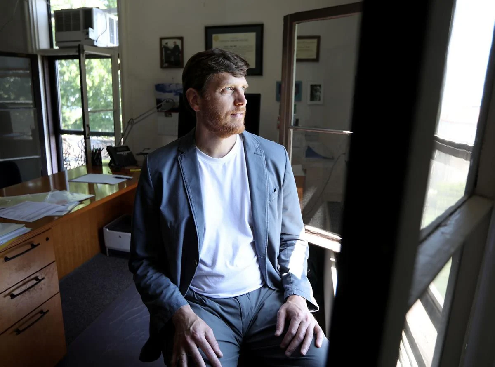

[Greg Nemet](https://www.gregnemet.net/) is a a Professor at the University of Wisconsin–Madison in the La Follette School of Public Affairs and an Andrew Carnegie Fellow. He is also the author of [How Solar Energy Became Cheap](https://www.howsolargotcheap.com/)

In this episode, we discuss:

- The distinct phases that helped solar PV move down its learning curve
- What lessons we can learn on how to accelerate and affect other technologies
- Theories about National Innovation Systems and lock-in

### Greg's Recommendations

* The IPCC's [Sixth Assessment Review](https://www.ipcc.ch/report/sixth-assessment-report-cycle/)
* Kim Stanley Robinson's [The Ministry for the Future](https://www.goodreads.com/book/show/50998056-the-ministry-for-the-future)

### Other Resources

* How Solar Got Cheap [website](https://www.howsolargotcheap.com/) and [book](https://www.goodreads.com/book/show/43669989-how-solar-energy-became-cheap)
* Neil Hacker's [Scaling Carbon Removal](https://www.scalingcarbonremoval.com/posts.html) and [blog](https://neilhacker.com/)
* Our World In Data's [Why did renewables become so cheap so fast?](https://ourworldindata.org/cheap-renewables-growth)
* Frontier Climate's [advance market commitment to accelerate carbon removal](https://frontierclimate.com/) (and [Stripe Climate](https://stripe.com/gb/climate))
* Our related episodes with [Doyne Farmer](https://hearthisidea.com/episodes/farmer) and [Matt Ives](https://hearthisidea.com/episodes/matt)

### Mentions

* US Government's [Project Independence](https://en.wikipedia.org/wiki/Project_Independence)
* [Too cheap to meter](https://en.wikipedia.org/wiki/Too_cheap_to_meter)
* US's government [spending on energy R&D over time](https://crsreports.congress.gov/product/pdf/RS/RS22858/17)
* Origins of the German [Green Party](https://en.wikipedia.org/wiki/Alliance_90/The_Greens#1998%E2%80%932002:_Greens_as_governing_party,_first_term)
* Renewable energy's [duck curve](https://en.wikipedia.org/wiki/Duck_curve) 
* [National Innovation Systems](https://en.wikipedia.org/wiki/National_innovation_system) and [technology lock-in](https://en.wikipedia.org/wiki/Vendor_lock-in#Technology_lock-in)
* Solar niche markets graph —

## Transcript

### Introduction

**Luca 00:05**

Hi, you're listening to Hear This Idea. In this episode I speak to Greg Nemet who is a professor at the University of Wisconsin Madison, as well as andrew Carnegie Fellow. Greg's research is focused on how to affect technological change and he's written the book How Solar Energy Became Cheap, which has become immensely popular amongst both climate and energy experts. I was really excited to get to speak to Greg for two main reasons. Firstly, his telling of the solar PV story is just really fascinating. I imagine that some listeners will be familiar with the learning curve and rights law, which we have discussed in other episodes too, whereby it has been observed that each time solar capacity doubles, prices dropped by around 20%. 

**Luca 00:43**

And that cumulatively that this has led to solar becoming about a thousand times cheaper than it was just a few decades ago. But I imagine that fewer listeners will be familiar with what actually happened in real life that led to these absurdly large cost declines. And really what's behind this kind of observed law? Greg argues that innovation was driven by distinct phases and that the timing of these was arguably contingent on some key policy and individual decisions. So whilst cheap solar has been a great headwind for mitigating climate change and in worse worlds, it could have arrived much later, it could have also arrived a lot sooner. 

**Luca 01:14**

And that brings me to the second reason, which is why I was excited to speak to Greg, which is that I think that there are some important lessons from solar Pve to apply to other technologies both within and beyond climate change. 

**Luca 01:26**

I think that a lot of causes. 

**Luca 01:27**

Promoted by effective altruism are deeply linked to the idea of affecting technological development. For example, accelerating alternative proteins to end factory farming, bringing forth melogenomic sequencing to warn against pandemics, or steering artificial intelligence to be safer and more transparent. That means that there is a lot to learn here from other fields too. Things like grabbing policy windows to push through ambitious agendas roadmapping, how technology can scale from niche markets to widespread global adoption, and what key features let a technology unlock learning by doing and when we need to look for other case studies. All in all, I think that there is a lot in this episode. So as always, there are chapter marks to help guide you through the interview. But without further ado, here's the episode. 

### Welcome, Greg!

**Greg 02:06**

My name is Greg Nemet, I'm a professor at the University of Wisconsin and I work on low carbon innovation. 

**Luca 02:13**

Great. And what is a problem that you're currently stuck on? 

**Greg 02:17**

I think the big question I have is how fast can nascent climate technologies grow and there's urgency to decarbonize our economy by mid century. And so technologies that are just emerging and looking promising and have lots of good attributes are cool if they grow and people can use them, but they're only meaningful for the climate if they get really big and so that they can play a big role in that, there's emergency to doing that. So that's a big question I have. How fast can things grow? 

### Cheap solar could have come much sooner

**Luca 02:48**

One of these technologies that you looked at was solar PV. And I actually wrote a whole fantastic book about and one of the things that really struck me there is, I think, maybe relating to this theme of urgency you mentioned, which is that often I think in discourse you see Iran on the Internet and in policy as well. It's that solar PV, it was this great success story and we saw this really dramatic decline in costs. But I think one of the really interesting things that you raise here is we could have actually gotten to where we are here a lot quicker. And yeah, I just find that like a really interesting framing. And I'm maybe curious for you to kind of expand on what you mean by that. 

**Greg 03:25**

Yeah, I mean, first of all, yeah, no question, it's been a success factor of 10,000 cost reduction. Now it's the cheapest way that humans have ever been able to produce electricity at scale that's with solar. And it's now 3% of the world's electricity supply. And if it keeps growing like it is, it'll be at 50% in the next decade or so. So huge success, but it took a really long time. And if we want to use it as a model for other technologies, we need to go faster. But one thing yeah, people think about is, well, could we have had solar, inexpensive, high performing, reliable solar, sooner than we did? And I think the first thing I would say is, well, when did we get that? And it's really like 2018. 

**Greg 04:04**

We start to have power purchase agreements that are beating fossil fuels without subsidies. So that's a pretty good place to be. But if you look at the history, it took 60 or 70 years to get there from the first commercial solar cell in 1958. And solar has had multiple false dawns. And it's also had periods when something promising happened with the technology and then it was just left to just hang around for long periods of time. And so I put the period from that first commercial cell to the oil crisis in 1973. That 15 years was a wasted period for solar. There was another 15 year period in 1981 when the US cut its R and D budgets for solar by 90% and really only gets picked up by the Japanese with their policy in 1996. So it's another 15 years we lost. 

**Greg 04:56**

And then with the global financial crisis, a lot of countries cut their subsidies for solar for about five years or so. So you add those together, there's at least half the history of solar, about 35 years where weren't doing much with the technology. And we're lucky that it did keep going in those periods in niche markets and with individuals that kept on it. And that was really important. But yeah, I wonder what would have happened if we really made a push on solar earlier. I probably couldn't have gotten all those 35 years back, but I think there's a good reason to think we could have got half of it back. And then so then we got cheap solar 15 or 20 years ago. And at this point, it's a really big part of the whole global energy supply. 

**Greg 05:41**

So that would change things like that might change how a country might deal with an issue like natural gas embargo during the UK crisis. That might be different if were 15 years more forward on solar. 

**Luca 05:57**

Yeah, and I think, again, going back to this theme of urgency, I think it's really interesting to think what these 15 years could have brought us. In some ways, this race to develop cheap solar PV was a race against some big countries like China and India industrializing and trying to get this cheap enough so that as these countries grow, which is really important for all sorts of global health and wellbeing reasons, they can industrialize using clean and cheap energy. And to some degree, you can see the windfall from solar coming there. India has cut its coal capacity by a whole bunch, I think in large part with expectation that solar PV can make up for that shortfall. 

**Luca 06:36**

But if you imagine, right, like, 15 years was really that time that India and Chinese economies kind of took off, and we would maybe just be in a very different place if that had kind of come through. 

**Greg 06:46**

Yeah, I think so, and I think that's a really good way to put it. I think we missed China, and I think if we had inexpensive solar 15 years ago, like 2002, that's the year that China, that's when they joined the World Trade Organization, and all their growth statistics have a kink in 2002. Everything grows faster since then. So, yeah, we could have had China growing on solar, but now we have a chance for India to really develop on solar. But really the opportunity is places like Vietnam, Indonesia, Nigeria, that could be the big growing economies in the next 20 years. And they have a chance to do that without fossil fuels. 

**Greg 07:22**

We'll see if they choose to do that, because those places also have large fossil fuel endowments, but the alternatives now are way more appealing than it would have been 20 years ago. 

**Luca 07:32**

Like solar really interesting, and I guess there's also a point here of like, let's not just lament the past, but also kind of look forward on how we can do better. And I think one of the other interesting themes I want to get into about your book is that I think you really just offer a playbook on how we can do better for the next generation of technologies. And this is urgent, both in climate change, as you said, and I think there's an interesting tangent on CDR that I want to get into, but I think also zooming out. I'm just also really interested in how we can think about this more broadly for other technologies like alternative proteins and what have you, and just yeah, really seeing what the best kind of way to do large scale R and D is. 

**Luca 08:10**

So, yeah, I'd love to dig into that if you're done. 

**Greg 08:14**

Cool. 

### Background on Greg's work

**Luca 08:14**

Again, I guess one other theme or something I want to kind of frame parts of this conversation is I think one of the things that just really struck me about your book is that I think it just offers a really interesting interdisciplinary and really historical take on what happened here with Solar. I think often when you ask people what they think of Solar, you have these kind of learning by doing graphs where the line just kind of goes down. But in some ways, that's just a really big kind of abstraction of what happened here versus I think you really highlight the historical story and some of the real turning points when things went well and when things didn't go well to kind of think about this. 

**Luca 08:50**

So I guess maybe one kind of question off the top that I'm curious about is like, what made you want to take this kind of approach, especially something that feels a lot more interdisciplinary than lots of other takes here. 

**Greg 09:04**

Yeah, I guess that's just my background. I did an undergrad in geography where I took classes in energy systems and in climate change. I did a PhD in this interdisciplinary department called Energy and Resources. And so it was just always inherently you need to look at these problems from multiple angles, otherwise you miss something. And there are insights you get from looking deep and just using econometric tools or using engineering tools or political science tools. For sure those are crucial, but there's something you miss if you don't take a look at the interactions. And I just find it interesting to look at that way. 

**Greg 09:44**

So I think looking at from multiple disciplines like the policy, the engineering, the economics, the markets, entrepreneurialism, the business, and how international relations played into a role in it, I think you kind of need that to explain the whole story and certainly the international parts of it, because that's another thing that people tend to have a lens. They'll see that the most of the interesting things happened in one place, like China, or they'll look at the place that they know well, like their own country. And that's also helpful to go deep in those areas and say something about them. But for Solar, it was so much of this global connection and global innovation system of people moving around and money moving from one country to the other, the machines moving all over the place. 

**Greg 10:26**

And I think that's something that you kind of need to tell the full story. So yeah, I mean, I just find I enjoyed looking at problems that way, and that's been my training, too. And for this particular issue, to understand how solar became inexpensive, I think you really need to international and the interdisciplinary approach. 

**Luca 10:43**

Yeah. And I think it's so important both to just understand what fundamentally went on here, maybe both to extrapolate the curve going forward when we ask ourselves, like, how cheap can solar get? Or when we want to consider in replicating this in other cases, what is the criteria that you need and how can you speed this up? Right. Not just seeing that the learning curve exists, but how can you run down it as quickly as possible? Yeah. So let's maybe start here with these, what feel like kind of distinct four or six phases, depending on how you kind of count them, where solar PV changed both its kind of international setting and really just the pipeline setting or something that it was in. Could you maybe give us a big picture summary of your thesis here? 

### Overview of solar's history

**Greg 11:28**

Yeah, so I think I would start with the first stage just being scientific developments, and that was not to solve any energy crisis or to even advance some new technology. This is like basic science 150 years ago. People trying to understand how materials work, trying to understand the structure of the atom, noticing in experiments they got some strange effects, like when you shine light on a piece of metal, I think it had boron in it at the time, that you can detect an electric current. So this is associated with trying to also understand how electricity worked. So fundamental questions. But there was something about that where it led to fundamental understanding. And that's where Einstein won his Nobel Prize. It wasn't for relativity, it was for understanding how solar panels work. 

**Greg 12:15**

Well, understanding theory behind the photoelectric effect, and I don't think that's inconsequential. I really think that deep understanding is what led people at Bell Labs to be able to develop into it an actual device, because Einstein worked out theory, and then you could start to make something, a device based on that. So it was a very kind of bottom up understanding that led to the first device. So that's kind of the first phase, which really experimentation. The second big push was the 1970s oil crisis. And that's when the US. Really got involved and put big money, a couple billion dollars over the ten year period into solar research and development. And a lot was worked out in that time. Some people argue that the devices that we have today are mostly what got arrived at the end of that period. 

**Greg 13:09**

Lots of R and D went into it. One of the crucial things is it pulled a lot of people into the industry. And so you had expertise that came from people working on the space race, people working on electronics started to work on energy because they saw it was really important, and that helped. And I think that's what's happening today with climate change. We're pulling in really good people that used to be working in other areas. So that makes a big difference. And that was a big part of the US 1970s story. We had the first development of a learning curve. So it was another person who came from another industry, Paul Makok, who moved from Texas Instruments and applied the learning curve to solar. And he turned out to be really prescient with that. 

**Greg 13:47**

And then some of the first purchases of solar panels in the 1970s too. So that was the second big period. Third big period is the Japanese of developing these niche markets. First, it's toys, but then they do the first subsidies for consumers. They create a rebate program. It's the first time that governments gave money to consumers and left it up to consumers to pay for the rest. And it showed that hundreds of thousands of households were willing to do that. That was a new discovery. The fourth phase is that Germany came up with a subsidy program called the Renewable Energy Law, and within it, a feed in tariff. And that just made the market get much bigger all of a sudden. And then the fifth phase is China responding to Germany and entrepreneurs in China developing new plants. 

**Greg 14:33**

A lot of them are trained in Australia, and a lot of expertise comes with their work in Australia. And then they apply it in China and scale it up. And then we eventually get cheap solar. So it's really kind of a relay race, passing the baton among multiple countries. I sometimes try to sum up the whole story in one sentence, and that would be that the US. Created a technology, germany built a market, and China made it cheap. And there's other players. Japan played a role, Australia played a role. But that, I think, are the three phases that are probably kind of the first way to say it, and also something we could take to other places, to other technologies too. 

### Scientific origins

**Luca 15:16**

Yeah, no, it's superb. So, yeah, I really want to dig into each of these phases and maybe ask kind of a few more detailed questions, and then maybe after that, kind of zoom out and just ask around why this technology seems to have had these kind of distinct international phases, like what was going on there? And maybe more fundamentally, how can we replicate this with other technologies too? But, yeah, let's maybe stick with solar and kind of get a bit more into the weeds. So you mentioned, yeah, like, at the beginning, that solar just has this kind of deep scientific connection. And, yeah, one of the really surprising things there is that the solar that we have today seems to still be really rooted in that just basic pattern design that I think like, Bell Labs issued. 

**Luca 15:58**

And, yeah, I'm wondering what exactly you think it is about that kind of like scientific route or something that has enabled solar to get so cheap so quick. 

**Greg 16:08**

Yeah, I think there's this fundamental understanding of how light interacts with semiconductors that allowed a lot of things to happen, allowed people to use that material a lot of different ways to optimize it, to pick a good material like silicon. It also helped that is a material that we know really well from the computer industry. So we know what happens when we add dopants to the semiconductor and which ones to use, how pure it needs to be and we have ways of making that material that are well established. We have equipment that came from that too. So there is this kind of fundamental understanding of how semiconductors work and how light interacts with them that just unleashes the potential. 

**Greg 16:49**

Now the counterfactual or the counter to that is that we also have fundamental understanding of how nuclear fission works and we've also applied that in energy and in a lot of ways had big success with it for a period and then kind of ran into a wall after we got to say 10% of global electricity supply. So it's not the only thing that matters. Other things have to come into play. But if you do have that fundamental understanding that we had a nuclear and we had solar, it does seem to enable growth to happen. It's more easy to predict how things are going to work over time and with other materials and other systems. So yeah, I think that fundamental understanding was really helpful for solar. 

**Luca 17:33**

Yeah, and maybe worth emphasizing as well, just like how long it took to get to this basic kind of scientific understanding as well. So I guess the gap right between Einstein and that first kind of Bell Labs pattern was almost 50 years. And presumably there was a lot more scientific work before Einstein as well. 

**Greg 17:50**

That's like yeah, that's right. Almost 50 years from theory and then before that some experiments with little rods and seeing a little electricity come out of it. But then Bell Ads, I think it was really the adjacent work that they were doing on semiconductors that made them familiar with silicon and then also a need they needed and they were working on the transistor and then they could use power in remote places to power their telecommunication system. So they had an applied need for developing it that wasn't about solving climate change or even about solving the 1970s oil crisis. It was about we need remote power once in a while to power our transistors and our telecom repeater stations. 

**Greg 18:31**

This could be helpful and it turned out to be helpful but it didn't need to be something that had to solve the whole world's problem. I think that also helped get things going. But yeah, it took a while from understanding the properties with Einstein's Nobel Prize winning work and the first commercial cell in 1958. 

### Encouraging fundamental research

**Luca 18:48**

Yeah, and I guess one of the fundamental questions here is how much can you direct this kind of basic scientific research? Right? I think there's like a lot of emphasis that a lot of this fundamental research you can't really direct. You can't really predict in advance of what's going to end up being useful and kind of world changing and what won't. But on the other hand, Bell Lab just seems to be responsible for all sorts of innovations and it's kind of right, like famous for having just been this huge cluster of scientific output that ended up being useful in kind of a huge variety of ways. So, yeah, curious for your thoughts on that. 

**Greg 19:22**

Yeah, I guess a few things. So, yeah, you can't direct innovation in science because there's inherent uncertainty about it, but you can increase the odds. So you can be funding science, you can be encouraging new types of science, you can encourage high risk science, you can encourage science that's likely to fail because that's the only way you get something new to start. And so you need to support risk taking. And Bell Labs is really kind of further along from the research. Peer research is being applied. They had this collaboration among their different divisions that worked really well. There was people have studied the organization of how the offices were laid out there that seemed to work really well. There was space for tinkering, space for possibilities that didn't work out and you weren't punished if it didn't turn into a successful innovation. 

**Greg 20:15**

So I think you can't direct science because you don't know exactly where it's going, but you can increase the probability of success, partly with funding, partly with getting lots of people, getting people from different backgrounds to work together. Having an applied problem seems to help. And then supporting risk by not punishing technical failure. I think those are all things that people have tried to learn from, like you said, from Bell Labs, there's a book called The Idea Factory and that was just kind of this period where they just had one thing after another. But there's also this concept innovation of technological opportunity and sometimes things are just ripe for the picking. 

**Greg 20:51**

And it seemed like with semiconductors and understanding transistor and photoelectric effect, that was all kind of cooking in a lot of ways in the 1940s and then the 1950s, it was ready to go. Maybe you could say something similar with mRNA understanding and developing vaccines based on those. So that when we really needed one, were able to get a vaccine developed in record time. And not just like the fastest ever, but four times faster than the record before that. So sometimes the groundwork has been laid, and when you really try to address the problem, you have a breakthrough, because everything's set up for you to make progress. That's technological opportunity, but you have to. 

### US technology push

**Luca 21:33**

Take advantage of it, I guess, on the point of mRNA not just four times faster than before, but now looking forward, aiming to be three times faster still. So, yeah, some really breathtaking stuff there, but yeah, I guess so. You said that part of the Bell Lab kind of pattern here and stuff came into play because there was some need of it, think kind of NASA and space technology and all sorts of very specialized things. But the 1970s seems to be like the first kind of turning point where this knee just like kind of becomes a lot bigger. And it is because suddenly the whole energy economy, or at least in the US. Really drastically changes. Yeah. Can you walk us through what happened there and what that meant for solar? 

**Greg 22:11**

Yeah, I mean, there was a huge world changing event. October 1973, the Arab oil embargo and all the countries that were supporting Israel in that war, that was the US. The UK. Japan, Canada, the Netherlands all of a sudden had their oil supplies from the Arab nations cut off. And it just went from energy and oil in particular being something that was abundant and super cheap. So cheap that a lot of countries, including the US. Were putting oil into power plants. It's a really low value way to use oil, which is so valuable for mobility and transportation. But it was so cheap and available that were just burning it to make electricity. And you can't imagine doing that today at any large scale. But things changed in 1973 and then it became with a Republican president. 

**Greg 23:06**

President Nixon at the time made it a national priority that were going to make ourselves. And he used this phrase that is still used today. I was fact checking something about it in a Senate race a couple of weeks ago where they used the word of energy independence. And it was coming up on the 200th anniversary of the US in 1976. And the idea is that were going to be energy independent by the end of the decade with this big push called Project Independence. And the idea was to make use of how we'd done things with the Manhattan Project, building four nuclear weapons, the Apollo Project, having seven moon landings and do the same for energy, to make ourselves energy independent. 

**Greg 23:47**

And a lot of money went into research and development, mostly in nuclear and synthetic fuels, like trying to make liquid fuels from natural gas and oil. And a trickle, a little bit of it went into solar. But for solar, that was just gigantic. It just completely transformed it and brought all these people in and really developed. 

**Luca 24:07**

Just because it was tiny field beforehand. Right. I think that's the point to emphasize. 

**Greg 24:12**

Yeah, it was a tiny field. A few dozen people. There was this conference right before the Arab oil embargo like the summer before, where people were talking about solar and thinking about, could we make a research program on it? Could we take it more seriously? And then they had no idea what was coming, and all of a sudden there was like, yeah, could you give us our plans? Because we want to do that, but we want to do it ten times bigger than you would ever have imagined in your stretch goal. And so all of a sudden, it became the focus of solar. Was one of the folk eye in Project Independence. 

### The Cherry Hill Conference

**Luca 24:43**

Yeah, I guess I'm curious to ask about that kind of Cherry Hill conference, specifically of how important was that? Because it seemed that all of a sudden there was this huge political appetite to move money. And I think I have this open question in my head of how important was it that there was some kind of roadmap of what to do here? Some kind of guidance or prepared report or prepared plan that a politician could then pick up and maybe even forex, but at least have some kind of sense of like, okay, I can spend some money or I can allocate something here. 

**Greg 25:14**

Yeah, I think the thing to realize, it was an absolute crisis in very similar ways to the Ukraine invasion. It's been a crisis for Europe and affecting the whole world right now. And when you're in a crisis, not really thinking about the long term, you're not thinking, well, let's work on solar now so that by 2018 we'll have low cost solar beating fossil fuels. No, it's more can this actually help solve our problem that we have in the next few years? And I think if there wasn't some kind of roadmap, if all we had was some evidence from 15 years earlier that there was a 1% solar cell, it probably would have been put even lower on the priority stack. 

**Greg 25:55**

But this way it was a high enough priority because there was plans that were ready, that money could flow, and that was made sense, that you could bring in the right people and make some progress with it. It didn't become answer to the energy solution in the 1970s. Really. The answer was using less energy and becoming more efficient. But the groundwork was laid, and a lot of the progress that happened created the architecture that we use today. And it's really important. It got people into the industry. And that's one thing that I kind of learned from talking to people and interviewing people is people stayed like they came because they thought it was important, and there was money all of a sudden, but they stayed because they just somehow got fascinated with the technology. It was so different. 

**Greg 26:43**

It was potentially it had this elegant Einstein physics behind it. It could solve pollution problems. It could solve some other problems like energy security. So people became passionate about it, and. Then when markets collapsed, funding collapsed. Six or seven years later, a lot of people didn't leave. And I think that was absolutely crucial that we didn't have to start over again after making all that progress. 

**Luca 27:10**

The analogy that I kind of maybe want to draw out here is actually perhaps pandemic preparedness and COVID-19, where you have at least what feels like somewhat of a similar event. If you have this sudden, dramatic political urgency to address this kind of issue and then it being this question of, like, do you have a roadmap of technologies that can prepare the world for pandemics in future? Kind of ready? And in a previous episode, we talked about the Apollo Report, which I kind of understood, just got copy and pasted by the White House for the American pandemic preparedness plan, but laid out, I think, like similar things around metagenomic sequencing. You mentioned mRNA vaccines, like more of this kind of like broad spectrum technologies. Yeah, and all sorts of things. 

**Luca 27:55**

And I think the question here that you kind of touched on how much of it is it about an immediate big injection and funding versus just like, building up this ecosystem that didn't exist prior, I think is really interesting. 

**Greg 28:08**

Yeah. But there's really something to being prepared and being ready. And it's true on technology and it's also true on policy. But having these roadmaps, having these supplies ready, having people trained to work in the area, whether it's genomics or in immunology or in solid state physics or in electricity systems, that makes a huge difference. If there's capacity available that can maybe shift, maybe stop working on whatever they are working on the space program or intercontinental ballistic missiles and all of a sudden start to work on how do we commercialize this solar technology? So having things ready to go when a crisis happens is huge. And it's true in policy too, as we'll see later, talk about later with the German energy vendor and the renewable energy law. They also had policy ready to go when there is a window. 

**Greg 28:58**

So being ready for a window that a crisis can open is a big lesson here in multiple dimensions, technology and policy. 

**Luca 29:06**

Yeah, well, briefly sticking to the kind of US phase, the other interesting kind of theme here that you mentioned was that the share of solar PV specifically out of this big project, Independence, seemed to be just really tiny. And I think it makes sense that governments, especially when it comes to uncertain technology, just want to hedge their bets. And you can also argue that a lot of other useful things came out of this. You mentioned energy efficiency. I think you can probably broadly track fracking back to this and improvements in kind of like natural gas and what have you. 

**Luca 29:40**

But I was really surprised by how, yes, small the share in solar was here, but also that a lot of the tension seemed to between betting on solar versus betting on other technologies, and the US just, like, not betting as hard on solar as they did on some other technologies here. So, yeah, curious for your impressions there. 

**Greg 29:58**

Yeah, I guess one of the issues is we talked about Cherry Hill Conference. They kind of have these plans of a solar program, and then after Project Independence starts, those plans get upgraded a lot. But once they get upgraded a lot, there's still like less than 1% of the overall Project Independence budget. So one thing is there's not that many people available to spend money on, but two, a little bit goes a long way. And that's one of the things about solar. It's small scale, so you can build a solar panel with a couple of people in a laboratory and some material and a little bit of equipment. You can't do that with a nuclear reactor or a synthetic fuels plant there. You're talking about billion dollars minimum to do a demonstration plant. 

**Greg 30:44**

And so I think that's why some of the other investments are so much bigger, is if you want to do nuclear at all, you have to be spending billions just to do research. This is not to build lots of nuclear power plants. This is to build a next generation demonstration plant or to build a in this case, we built like four synthetic fuels plants to take coal and natural gas and make liquid fuels out of them. And that's like $5 billion right there. So, yeah, in a way it shows solar wasn't a big priority. 

**Greg 31:14**

But on the other hand, R and D wise, I would say that the outcomes, technical advances and importance to the long term future were much higher on that 1% that went to solar versus the 30 or 40% that went to nuclear and the other that went to making liquid fuels out of coal and natural gas. 

**Luca 31:34**

Yeah, I think the point of, like, maybe solar just didn't have a lot of room for more funding, right? Like it already. Four x. That's hard to imagine. Kind of like 40 Xing or something, I think is a really important point. But I think there's still something kind of implicit maybe in what I'm reading of what policymakers kind of like long term visions here were and just thinking about, well, how big could solar get if it does pay off or something. And it seems to be that the ambition here was a lot smaller than it ended up turning out to be. And you even had some echoes of this before, right? I think when it came to Eisenhower administration, there was more of a conscious decision on betting on nuclear rather than betting on solar. 

**Luca 32:13**

And to some degree that really flips when it comes to Japan, where I think there was like a more conscious decision that solar would get cheap and then maybe nuclear helps later down the line, but solar kind of first. And it's interesting that there seems to be like some kind of tension here between technologies and that policymakers just have very different understandings of what technologies are ultimately going to pay off. 

**Greg 32:36**

Yeah, it's hard to know ahead of time. On one hand, maybe the obvious implications then is we do a portfolio, place lots of bets. That's what venture capitalists do, that's what people with the stock market do. Why shouldn't we do that with technology and with public investment in research and development for technology? And the reason you can't do it is those investments are not available at any scale. Like you can only do big chunks or do nothing at all for nuclear. And so it kind of forces the issue. And so that came up a couple of times in the 1950s about nuclear, like you said in the 1970s again. But there's something about solar that's completely different. 

**Greg 33:19**

It's small scale, it doesn't suit the energy generation kind of infrastructure, like how the grid works, how it's operated, the fact that we give monopolies to the people that run those plants and provide electricity to people. You can put a nuclear power plant in that system and you really don't need to change that system at all. It's just like another power plant. Whereas with solar you can think about it could be lots of different people with their own small little solar plants. They might not be owned by the utility. It feels like it's a lot more about losing control of the system. 

**Greg 33:59**

And you could argue that's a problem for the reliability of it and the technical stability of it, but you could also argue that's a problem for a company that wants to retain make profits from their monopoly franchise and control as much of it as it can. So there's kind of technical reasons why solar and nuclear are so different, but there's also kind of political power reasons that are at least as important and linger today too. I mean, there's still issues about solar kind of being held back in places because electric utilities don't find it as profitable as other things they might do. 

### Japanese niche markets

**Luca 34:38**

Right? Yeah. Okay. And I guess this is maybe somewhat of a reach, but maybe to try and use this as a segue. I think we're now entering questions of commercialization and like, how can you actually get this technology to pay off? And yeah, I think another thing that I found interesting here is that it seems that when this first push of solar R and D came, the idea was for it to ultimately help serve the grid and have these more utility kind of applications. But really it seemed that solar PV was commercializable, but not in that way. It found like a different set of markets. And that kind of marks this kind of transition from this US r and D phase to what you kind of describe as the Japanese niche markets phase. So, yeah, curious for you to kind of introduce that topic. 

**Greg 35:28**

Yeah, I mean, it was a transition. But it's also just to be clear, it wasn't just that the Japanese were becoming the world super power or appeared to be going to be the biggest economy in the world. That's what it seemed like at the time. And we had the technological prowess in a lot of areas, but the US. Voluntarily shut itself down from advancing solar. So Ronald Reagan wins the 1980 election, comes into office in 1981, and the solar's budget is cut by 90%. So it's 10% of what it was within a couple of budget cycles. And so you can just see what happens, not just to technological progress, but to the people too. So then they have to go into other areas, go to other places, and so the knowledge is just scattered and the progress of solar in the US. Just halts. 

**Greg 36:17**

So it's important or it was really good that there was some country around to pick up the pieces and take solar to the next phase. And so Japan, again, going back to them of being prepared, had also was also cut off from oil supply in the Arab oil embargo and also started its own R and D project called the Sunshine Project. A lot of it was on solar. So they had the Absorptive capacity. This is the idea that they had the technological understanding. They had trained scientists and engineers. They had companies that were involved to do something with solar. And partly what they did is kept up the R and D, but they also started to actually use it in real markets. 

**Greg 36:59**

And they weren't big markets and in a lot of the ways it was just kind of silly stuff, but it was large electronics conglomerates that were really growing with consumer electronics and things like watches and calculators and toys and little lanterns. And they started trying to put just for product differentiation and have a little unique feature, put tiny little solar panels on them. And they did, and they worked. But the crucial thing, if they were going to do that for these really cheap consumer products, the solar panels had to be almost free, like super cheap. And so that was the impetus for getting solar to really start to become an affordable technology and something that could last and be produced at scale. And so that was interesting because it wasn't anything that would affect global energy supply. 

**Greg 37:45**

It didn't help Japan's national security or energy independence, but it got the large companies like Sharp and Sanyo and Panasonic to take the technology seriously and start working with it and include it into their products. So that made a big difference. And they're sometimes called niche markets, these small markets that don't matter in the long term because they're small, but they do matter in terms of moving the technology along and carrying it along to the next market where the demands might be for a cheaper cost or some performance metric. That's different. 

**Luca 38:18**

Yeah. And definitely I think my favorite graph from your book was this kind of, like, demand curve for these niche solar markets where you can see right there as you go from kilowatts to megawatts to gigawatts. What kind of new markets kind of open up that help you get to the scaling, which I think again when we're thinking about, well, what does this learning curve look like in practice here? It is really important that you actually have a commercially feasible way to scale to get to your kind of endpoint. And maybe, again, like, in contrast to nuclear, right? Like, solar just seems to be much more modular and scalable that, on the one hand, also makes it kind of a necessary requirement that you actually have a feasible path to scale here. 

**Greg 38:58**

Yeah, but that's exactly it. So you didn't write it gives you a feasible path to scale because you don't have this binary. Either we build a $5 billion nuclear plant or we don't build anything at all. You can do, oh, well, we'll spend a 40 cent part to go into a watch and have that be a solar panel. And then the next niche market was actually consumers. And Japan tried this thing where they gave people a 50% rebate on a solar panel and the Japanese government would pay half and Japanese consumers paid the other half. And they didn't know how much it would lead to, how many people would do it. It was all voluntary. And they had 200,000 households subscribe to this rooftop subsidy program. 

**Greg 39:42**

And that really showed that there was consumer demand, at least for a niche, at least for a small number of people that wanted the power, wanted to be independent, wanted to be environmentally friendly, all of those things probably together. And that helped too, because then we had a new market. And again, this is going from less than a watt in a calculator to maybe 1000 or 2000 watts on a small home system, but upscaling bigger systems and starting to actually work with real consumers, not just with large companies installing it. So, yeah, that was a big change, that Japanese rooftop program in the mid 90s. 

### Consistent versus spikey funding

**Luca 40:21**

Yeah. And one of the other lessons I took from this Japanese niche markets phase is really that consistency just seems to be really important. In some ways. It's, I think, kind of an indictment of the US boom and bust like R and D cycle, where if you look at US. R and D compared to Japanese R and D was really only a fraction of what the US. Spending, especially at that peak in the 1970s that we talked about before. But really, consistency is maybe more important than you can do more by being having a lower level of R and D funding, but making it reliable and letting people presumably plan careers and bigger projects and stuff around it rather than having this kind of like whiplash between going from really big promises to having these kinds of winters. 

**Greg 41:09**

Yeah, absolutely. It's so good that Japanese had this consistent program. The Germans also had a consistent program, but both of them at lower levels than the US. And I sometimes toy with this thought experiment and I don't know if it's true, but maybe for the whole system, it's not bad to have a few reliable actors that were playing a consistent role the whole time and had absorptive capacity and were training lots of people like Germany, Japan and Australia. And then once in a while, this wild child, the US. Comes in and gets super serious about it for a few years and then gets distracted and do something else. And it's certainly not good for the US. To act that way. They just waste all this money in the boom and then they squander anything that came out of it after the boom. 

**Luca 41:51**

Right. 

**Greg 41:52**

But for the rest of the world, it probably does throw off a lot of spillovers and helpful knowledge that might not have come from this lower level, consistent funding. So I don't know, there is some positive to this kind of overall system that has these consistent players as well as these erratic ones. I mean, if the erratic player was funding consistently at a high level, that would probably made things happen a lot sooner. We'd be talking about this having happened 15 years. So I don't think it's good that they do that. But there is some interesting interaction between having, as you say, these low level, consistent funders of R and D and this one that's more of a boom and bust cycle. 

**Luca 42:31**

Yeah, that's interesting. It kind of makes me think I've heard similar arguments around financial bubbles or, for example, the tech boom in the early 2000s as well, that you need these kinds of moments to build out the infrastructure. Build out the knowledge and stuff that then maybe in the public good sense or something pays off a decade or so later, even if it leaves the original investors bankrupt. Yeah, I think it's interesting. I think the other important theme that you've touched on there is this point of knowledge transfers and I think we'll get more into this towards the end, but really that it matters a lot. That what the US r and D labs do. Spills over into the Japanese labs and then spills over to the German and then the Chinese and yeah, we'll kind of like follow that thread through. 

**Luca 43:16**

But open collaboration and sharing of ideas seems to be a really key theme here. 

**Greg 43:23**

Absolutely. And that's such a big part of this whole thing. It's hard to see how this would have worked if the US. Just kept everything to itself or if China tried to do it all on its own. It's this international collaboration. There's something about the nature of the technology, I think, again contrasted to nuclear. First of all, small scale. The equipment can move around the world, that products can move around the world. A lot of the understanding could fit in someone's, one person's head, and they can move around easily and then go to other places and talk about it. So there's something about that. But plus, with nuclear power, because of the dual use and the military aspects of it, knowledge is restricted. In the US. 

**Greg 44:08**

We have people born in other countries or foreign citizens that can't go into nuclear labs here working on nuclear energy because of this issue, and it just really slows down progress. And solar didn't have any of that. People are all over the place. In Wuxi, in China, there's a Bavarian restaurant because there's so many Germans that had moved to China to help them set up their production lines in the early two thousand s. And so there's that kind of just completely global aspect of knowledge flow that yeah, it was a huge part of the whole progress of the technology. 

### German demand pull

**Luca 44:46**

So I guess with this theme of international spillovers and global cooperation, I think that puts us nicely to get into the next phase, which is the German subsidies phase. So I think maybe the link here is you mentioned that Japan was piloting and trying to see what these kinds of household subsidies looked like, and then Germany really took that and ran with it. Right. It's my kind of understanding here. Could you yeah. Let us know what went on there. 

**Greg 45:14**

Yeah. So the Japanese developed, like I said, the subsidy program for rooftops, and it had this interesting wrinkle that it was a declining subsidy. It started at 50% and went down to zero over ten years. And so it gave you incentive to act early, but it also accommodated this idea that the technology would probably go down in cost over time, and so they wouldn't need as big a subsidy in the later years. And so that was a policy innovation that the Germans then used to say, okay, we'll start with the subsidy program and we're going to turn it down over time because the technology will get better and cheaper and we won't need as much. That was one policy innovation the Germans adopted from the Japanese. The other policy innovation the Germans adapted was from the US. 

**Greg 46:01**

Which in the 1980s in California started offering what were called these standard offer contracts. And it was really to encourage new sources of energy supply. And especially in the 1980s, it was for wind power. And it was a contract that gave a much higher rate than the wholesale rate was, but guaranteed it for ten years. And that led to $2 billion of Wall Street money going into the wind industry in California. And it was this stability, this confidence that investors could get a return on their investment in these expensive wind turbines because they knew exactly what price they were going to be getting for electricity over ten years. And that to an investor is like, where would you ever get that? Like, you never know what's going to happen in another couple of years or five years or ten years. 

**Greg 46:53**

The Germans took that too, with their subsidy programs. They took the Japanese idea. The subsidy this year is X. If you only get your system next year, it's this lower rate. But if you get the subsidy X, you'll get it for not only ten years, for 20 years, they guaranteed 20 years of electricity prices from solar that were higher than the grid price. So, yeah, it was a no brainer for people to take that up. And you had lots of money go in. You had the German market for solar increase by a factor of four in that first year. And then you had people financing these systems at like 2% a year because it was zero risk. People believed that Germany would honor its commitments. You had a 20 year contract at a high price, and it was solar. 

**Greg 47:41**

So he didn't have to worry about what you would pay for fuel or people or anything because he didn't need any of that. So it was an easy no brainer investment that a lot of people took advantage of. And so the market just really grew tremendously from that policy innovation of a declining rebate, but a guaranteed price for 20 years. 

**Luca 47:58**

Yeah, I mean, it's just an insane policy, right? Like kind of like on the face of it seems to be just like such a radical shift in what's going on there. And I think it makes me question, like, why would Germany do this? And I think you can maybe ask yourself similar questions with US. R and D and maybe to some degree as well with the Japanese niche markets. But I think I want to kind of explicitly ask how important were environmental and climate change concerns in making a country like Germany willing to subsidize what I think ended up being over $200 billion in today's terms to get this technology cheaper and more widespread? 

### Importance of the climate movement

**Greg 48:41**

Yeah, pollution and climate were high priorities. I guess I'd make it a couple of points on it. One, it was aligned with a few other priorities, so it had this like a package of priorities that had been in place for a really long time. And then two, it didn't need to be everybody in Germany that felt that way. So it's a parliamentary system. And so you have this Green Party for the first time gets more than 10% of the vote in 1998 election, and so it becomes part of the ruling coalition with the center left party, the SPD. And so it's not that everybody in Germany felt this way, but you did have this party of very committed environmentalists say this is important to us. We're part of the ruling coalition now. 

**Greg 49:25**

We have this policy that we've implemented already in cities in Germany and we have these documents written up. And so you have these two policy entrepreneurs, people that really took it on themselves. One from the Green Party that had a lot of experience and helped write the policy, and then one from the center left party who had been in politics a long time, knew all the people and took it on and sold it to everybody and got it voted on. And in 2000 they had this groundbreaking renewable energy law. But where it comes from, it really has its roots. And Hermann Scheer, the SPD, the center left leader, he was part of this 1968 Revolutionary Party. And a lot of the roots of the German Green Movement come from that era. 

**Greg 50:14**

And it was really about rejecting power structures, rejecting the N*** past that had also roots in the industrial organization in Germany and especially in electric utilities. And then solar comes along as something that allows you to escape some of that. And Herman Sheer called an emancipatory technology. It allowed you to be free of these power structures that had kind of held people down and created problems in the past. And so that was a big part of it. It was kind of this liberation idea. It also coincides with the Chernobyl accident in 1986 where some of the fallout comes to Germany and people in Germany are not supposed to grow or eat vegetables from their gardens for a while and it really brought it close to home as well. 

**Greg 51:04**

And so there's this kind of connection between and also you have nuclear weapons in the 1980s, too, and Germany is on the front lines and this concern about tactical nuclear weapons. And so you kind of can conflate nuclear weapons with nuclear power and then nuclear power in Chernobyl, with nuclear power in Germany, and solar provides a way out of that. And so it was this movement that had long roots but then has this opportunity after 1998 with the Green Party in power to really put some legislation together and sell it. And that's what they did. And so it was kind of a slow burn, building momentum over 30 years or so. But then all of a sudden they get this policy passed and yeah, it's transformative for the solar industry. 

Luca 51:50

Yeah, I find it really interesting because I think 1980s German environmentalism gets a pretty bad rap in some circles today, right? Especially for, I think, kind of like entrenching some anti nuclear sentiments definitely within the country and also plausibly like more internationally. But yeah, I think it's like worth taking a step back and reflecting that. They seem to just have been really key here both in being this minority coalition government. But then also, I think, as you said, the importance of early adopters. You don't need to convince an entire population. You need to convince 510, however many percent, to kind of adopt something here and there. Presumably a lot of these concerns about decentralized power, energy, wanting to explicitly bet on solar because you didn't want to bet on nuclear seem to have really mattered. 

**Greg 52:44**

Yeah, it did really matter, and in a lot of ways I have nuclear engineering colleagues and pronuclear people and I see a lot of the benefits of nuclear too. And so there's this idea that, well, what if we had both? What if we had nuclear power that can help deal with some of the intermittence of sunshine and wind? In a lot of ways that makes sense, but the politics of it aren't well suited to this kind of diverse portfolio of technologies that work well in a new kind of energy system. The politics that supported solar were really running as an alternative to nuclear. And yeah, really, coal is the real enemy in natural gas, and so it should have been those nuclear and solar against coal and gas, but it's just not how the politics worked in Germany. 

**Greg 53:35**

And what Germany did on solar was transformative for the whole world. So if you had to choose between being Pro Solar and going in on that, which is what happened, or being Pronuclear and trying to do that, I just don't think if they had gone pronuclear, we'd be talking about how. What a great thing nuclear power is for the world. Because it probably would have hit the same issue that it's hit since then, too. 

**Luca 54:00**

This is probably definitely a different episode, but possibly even like a different book. But what went on there in 1980s German politics and if there were any flashpoints to make it more a coalition against fossil fuels as opposed to a coalition against nuclear? But I think that is one of the big open questions here. Yeah, there seems to have also been another really key flashpoint, which was around the actual wording of these pieces of legislation and the subsidy program, which I think in many parts was an explicit lesson from the 1980s and kind of the Reagan administration. But I think, yeah, Alsa's is another, like, kind of interesting potential key point for counterfactual impact, where yeah, I'm curious for you to elaborate on. 

**Greg 54:45**

I think another thing that the German coalition and policy did really well is to make some awkward compromises in order to get the policy passed and have it implemented and also have it last for a while. And so one thing they did is they made consumers, households pay for the subsidies, not energy intensive industries. And in a lot of ways it seems unfair. Like if we're having this solar for the energy system and there's big users that are using electricity to make steel and do manufacturing of car parts and do that type of thing, why should they be excluded and why should we make households pay? Because that's super regressive. Because households, the poorer you are, the more you pay for energy, so more of your income you pay for energy. 

**Greg 55:34**

So it just seems like kind of a pretty inequitable way to do it. But it was a deal that they had to make to keep the policy in place and to basically buy off the heavy industry from blocking it. Because the industry that would then say, well, if you make our energy prices higher because we have to pay for these subsidies for solar, we're just going to go shut down our plants and open a new plants in China or Malaysia. So there's always that threat in Germany to do that threat that's perceived seriously. And so that's probably a big reason why companies are off the hook and households pay the bill in Germany. But if they hadn't done that, we probably would not have had a subsidy that was in place for as long as it was. 

### How energy companies missed solar

**Luca 56:21**

Yeah, and I think it highlights the importance of some of these political economy questions. I legit just hadn't thought about the question before of like, yeah, utility companies probably have a good reason not to like solar as a technology. And if solar scales, that will also be to the detriment or as a threat to other technologies with their own industries kind of behind them. Yeah, I'm curious to hear a bit more about that. 

**Greg 56:47**

Yeah, I think the way it's been explained to me, I would just kind of ask maybe from Adele's Advocate position, just like, well, why did electric utilities that make have all this investment in fossil infrastructure, some nuclear, but a lot of coal and gas? Why would they allow this to happen? It's not just that the electric users have to pay. It's that the electric utilities are going to all of a sudden kind of lose their source of revenue because solar is going to undercut them. And they did. And most of the electric utilities in Germany went bankrupt in this period, partly because of wind, partly because of solar, because it really depressed the prices. And all of a sudden electricity got really inexpensive at times and they couldn't make money with their fossil assets. So yeah, I think maybe they didn't take it seriously. 

**Greg 57:34**

That's the explanation I had. Why didn't they see this coming? I think they never took it seriously. It was kind of the focus only large scale matters. So if someone wants to do something with wind and solar, go for it, have fun, it'll make you feel green. It's never going to add up to much, but they underestimated how much it would grow and how much it would actually hurt their profits, and it didn't. So all the major utilities went bankrupt after solar started growing in Germany. But that lesson was learned across the world. And so you started to have opposition to solar in a lot of places after that, including in the US. And in other places as well, especially by utilities, electric utilities that have this sweet deal. They have this monopoly franchise, they don't have to have competition. 

**Greg 58:25**

But here's this technology that people can get away from having to buy from the monopolists and that's a threat. And as solar grows, it becomes actually a real issue for their profits and returns to investors. 

**Luca 58:39**

Yeah, maybe this is too wonky a question, but yeah, I'm curious if you could just spell out because I think it is somewhat counterintuitive of why would a utility company go bankrupt if there is a lot of solar being deployed. So solar definitely was getting cheaper around this time, but it doesn't strike me that fundamentally as a technology it was like producing electricity at orders of magnitude cheaper than nuclear coal was, right, I guess, otherwise we wouldn't have another 20 years in our story of solar getting cheap to be out fossil fuels. 

**Greg 59:10**

Yeah, well, this is getting into wonkiness here, but basically maybe the difference is it's not so much what solar costs versus gas or coal to build, it's what solar costs to run and what gas and coal cost to run and nuclear. And so all of them, if you have to run your plant for a day to produce electricity, you have to pay people, you have to buy coal, you have to buy natural gas and you have to pay for uranium fuel. And those are expensive real costs. But when solar comes in, if it's sunny, it's free. And so the price that solar would bid into market is basically zero. 

**Greg 59:48**

And so these coal companies are competing with solar and all of a sudden the prices go way down because when solar is there or wind is there, the prices are free or zero or very low. So all of a sudden this profitable period becomes unprofitable to them and that's a big reason they went bankrupt. And then it starts happening in the US. Too. And actually the place that it really hits partly solar, wind and also cheap natural gas is nuclear power in the US gets hit by the same issue. And so we start shutting down nuclear plants in the US that are built and that still have many years to run because solar and wind to some extent cheap natural gas make the prices and markets so low that you've got this really expensive technology and you can't get revenue anymore. 

**Greg 01:00:36**

It becomes a problem. 

**Luca 01:00:38**

Yeah, it seems to be, yeah. Correct me if I'm wrong here, but an interesting flip side of one of the critiques of solar is that it's like intermittent energy, that it's not reliable. You need to have some kind of base loads to complement it, unless you have a lot of batteries which then make it a lot more expensive. But this kind of like death spiral dynamic or something that you're like describing here. 

**Greg 01:01:03**

On the death spiral, that's part of what explains it too. So the issue with utilities is they have all this fixed infrastructure, they pay for it by selling electricity. And what happens is people start dropping out of the system because either they don't consume as much electricity, maybe eventually they don't consume any electricity from the utility because they're producing their own. And so the utilities have this fixed cost. And so the only thing they can do if they are losing people or losing megawatt hours to sell is to raise prices. And then if you raise prices even more, people drop out. And so that's the death spiral that utilities start to see coming. And that's why the savvy ones in the US. 

**Greg 01:01:48**

As soon as they start seeing a little bit of solar starting to happen in the market, they start talking to regulators and saying we need to stop it. They don't say that, but they say we need to make solar pay the cost that's imposing on everybody. And that does effectively slow it down. So yeah, there's a real awareness of a threat to the utility model that solar creates. 

**Luca 01:02:12**

Yeah, it seems hard, especially with that dynamic of like, were we kind of lucky that energy companies or utility companies didn't catch on sooner to this and create a lot more obstruction? And if they did, could they have actually killed this or slowed this down by ten or 15 years? Or were we unlucky that the transition to just supporting solar and switching over wasn't quick enough and that we got all of these obstacles or compromises that we really wouldn't have needed if were just running through with it? 

**Greg 01:02:44**

It's a good question. It seems like it was fortunate in Germany because Germany had this kind of big bang of the first really big solar market and the Chinese responded and so much good came out of that. And if utilities had blocked it or softened it or weakened it or shortened it, yeah, you wouldn't have had this big bang. But on the other hand, we did have markets come on after Germany, in Spain, in California, and eventually in China. So I don't know, in a counterfactual world, maybe they become the real drivers of solar and they play the German role, but probably does delay things. And that we have already said it already took longer than it should have, so that probably would have extended the delay even more. 

**Luca 01:03:28**

Yeah. Do you have any good guesses as to why utility and energy companies missed this? Seems like there was a lot of money riding on this and it seems that if anybody was going to catch it would be energy like market experts. 

**Greg 01:03:41**

Yeah, the explanation I got from talking to German politicians is that the utilities were just arrogant and they underestimated that solar would ever grow into anything and be anything big enough to threaten them. So it's only after people see what happened to Germany, like people in the US. And japan and China and Australia and others that they see, okay, this is what can happen if solar starts to grow. So, yeah, it becomes much more of a threat. 

### Chinese entrepreneurs

**Luca 01:04:06**

Yeah. Interesting. Okay, so I guess you alluded it, but yeah, let's get to the kind of last phase, which is China. So there were German subsidies and then China responded, what happened there? 

**Greg 01:04:17**

Yeah, so German subsidy program goes in 2000, and then in 2004, it gets really beefed up, strengthened, and so that's the key period for the German subsidies. But around this time, you've got these Chinese players and Australian players that are starting to commercialize the technology. There's a group that's really central to the whole solar story, university of New South Wales in Sydney, Australia, that has been working on solar since the 70s, especially going to the US and getting equipment and getting training in Canada and other places. So this international flow starts taking Chinese students into their lab and in the mid 90s goes to China to set up manufacturing of solar. And they spent a while there and realized that there was no infrastructure, there was no interest, and there's no way that they could set up solar there. 

**Greg 01:05:07**

So they left China and then they went to India and tried to do it there and didn't work either. So they went to Australia and set up a company called Pacific Solar with funding from the local electric utility. And that played a role, too, because then people in this university lab started to get practical experience with manufacturing and actually selling panels. And then around 2001, of those students that became that was on that 1994 trip to China as a translator, he's Chinese, but worked at University of New South Wales, gets a call from a friend in China and saying, things are changing now. You should come back and take a look. And they spent, like, six months trying to find a place to start a solar business in China and really didn't get anywhere until the very end of that six months. 

**Greg 01:05:54**

And they rounded up $5 million, $5 million to start a manufacturing facility in Wuxi and started with a small, like, ten megawatt per year line. This is like, on the scale of doing tens or hundreds of houses a year. It's, like, really small. And one thing they were able to do, though, was go to a trade show in Germany and say, here are these solar panels. We made them in China. And the Germans, super proud of their technical and engineering prowess, said, well, we're not going to buy something that's made in China. You guys have no experience making solar panels. But what they could say is, well, we have worked on the team that made the world record most efficient solar cells at University of New South Wales. So we know how to make not only solar panels, but really high quality ones. 

**Greg 01:06:47**

And that convinced the Germans and that was their opening. And from there it was iteratively upscaling. But this is not the central government in China and Beijing saying we want to have a solar industry. This is entrepreneurs scrambling to get money sourcing used equipment from all over the world elbowing on their way to a trade show, convincing skeptical Western consumers to buy their panels and then building the next line and doing this without a lot of sleep and scrambling to do it. It's the Wild West of and then when they really had to upscale, when Germany increased their subsidy in 2004, again, they couldn't come to the central government. Solar still wasn't taken seriously, but people in the west, especially in the US, the two things that investors in like 2004, five, six in the US. 

**Greg 01:07:36**

Were interested in, this was the first clean tech boom. So anything environmental. So solar is good there and then China. So if you could do solar and China, you could sell just about anything. And so that's what these Chinese solar companies did. They did IPOs on the New York Stock Exchange and raised hundreds of millions of dollars and then used that money to buy equipment from places like Switzerland and Italy and also the US. They took that equipment back to China to Wuxi, put them together into assembly lines, built more panels, sold them to the Germans, but then also to other places that had subsidy programs, starting like Spain, the UK, california, and eventually China had a market too. So it was really this circular movement of capital and people and machines and final products that is such a part of it. 

**Greg 01:08:27**

And even though kind of the core of it at this period, the 2000 to present period is located now in China. 

**Luca 01:08:34**

Yeah, I think there's like a really interesting spotlight here on just showing people's different motivations here. And again, I think this is really to credit your kind of like, interdisciplinary nature, which is based on a lot of interviews and some of these personal insights. But looking at the China solar PV market, it just sounds incredibly cutthroat and capitalist like competition just seems to have been incredibly fierce, which I guess is great because the thing that they were being fierce about was to get costs down, which is what we ultimately cared about. And building some kind of resilience like supply chains. Right. You kind of described in your book this infamous spike in silicon prices, right? Like in the it really just seems to be this like, okay, prices up, market signal increase supply to get the price down again. 

**Luca 01:09:25**

So I guess that is like bucketing all of the profit and money motivations here. Yeah. So that is to say there's this definitely just this distinct theme of entrepreneurship and profit. And it reads like really ruthless kind of competition. But on the other hand, you mentioned this real importance of New South Wales, which has been working on this topic since the it went through. Right. Like the booms and busts of R and D that were describing before. And it just seemed to be important that a lot of these people were intrinsically motivated either by science and research or also, as were speaking to before, the importance of climate change and environmentalism. 

**Luca 01:10:12**

And I think you described in your book that the leader of this lab was very explicitly saw this as a race against Chinese and India industrialization, and therefore also emphasized the focus on developing these technologies to be applicable for those markets, because that was like, ultimately what he saw as the end game.

**Greg 01:10:32**

Yeah, absolutely. And so if you want to do that, sell to a large developing country because you want them to develop in a clean way, then they can't be super high end, super expensive things that only work for rich consumers. They have to be reliable, they have to not need a lot of maintenance, and they have to be super affordable. And so, yeah, I think going into it that way, I think was important, but interestingly also did not come at the sacrifice of technological prowess. Like, this is a group that was creating record setting efficiency devices year after year. And so it was really, I think, a really intriguing competition or combination of high end technological prowess with understanding that ultimately it needed to be made in a way that was super inexpensive. 

**Greg 01:11:24**

And that's kind of maybe the way you do it is you use smart technology to make it inexpensive. 

**Luca 01:11:31**

Yeah. And what was it about, I guess, this Chinese ecosystem when we're talking about innovation here, that just help them get costs down? 

**Greg 01:11:42**

Yeah, I mean, that's just a combination of multiple things, incremental changes. I think the one thing I talk about is it's iterative upscaling. So we talked about that first ten megawatt line, and then six months later there's a 30 megawatt line. And each time they build a new line, they did something different. They found ways to take a step out of it by combining processes or do something that hadn't been done manually and add a new piece of automation equipment to do that. And so they had lots of chances to introduce these incremental improvements, and they just added up to steady, lead declining costs, because they knew that's what had to happen. And so everything they did was not to make efficiency higher, it was to make cost lower. And they had lots of chances to do it. 

**Greg 01:12:31**

And the other thing that was important to it is they had this ambition. They had this idea that this was going to be a big growing industry. And I guess the way I'd interpret it is that there was more risk to staying small, which means your costs stay high than there would be to expanding, which means your costs will go low. The only risk is that you can't sell all the panels that you make. But that's something that China probably uniquely compared to everybody else in the world, they do not mind developing overcapacity, in part because they've been on this growth trajectory for 40 years. So even if it's overcapacity today, in a year or two, it'll all get used up and they'll need to expand beyond that. And just that's what solar needed. It needed this ambition. 

**Greg 01:13:25**

And one of the German scientists that I talked to about this, who was involved in the German industry, and there was this transition around 2004, five, six, where Germans had the biggest company in the world, and then after that, Chinese did. And he said when the Germans were thinking in megawatts, the Chinese were thinking in gigawatts. They were like three orders of magnitude higher in thinking about how much they would produce, how big their facilities would be, how much they would invest. And that's what solar needed. And that really led to a lot of costs coming down, because you had fixed costs. You could spread over more units. You could start to invest in specialized machinery that didn't make sense at small scale. But at large scale like that, you could get a computer supplier to say, we need a pulse. 

**Greg 01:14:09**

Annealer that works for the solar industry. We don't want your super high end one for the computer industry. Make us one that's cheaper because we don't need quite the precision that they need. So, yeah, that scale also led to a lot of cost reductions as well. 

**Luca 01:14:25**

Yeah. And I guess at some point the government did kind of kick in, right. And started seeing this as a boom for China as well, which seems to have played an important role around, like, 2008 or around the time that Germany was, like, tapering off some of these subsidies as well. 

**Greg 01:14:41**

Solar becomes a strategic industry, and in China, that means something. That means the central government is going to back it up. And that wasn't true before 2008, 2009. The other thing that happened in 2008 2009 is global financial crisis. So countries around the world start cutting their solar subsidies, so that's going to kill the industry. And two, capital becomes really scarce and people don't want to invest in almost anything at that time. So the Chinese central government does what they're good at, they do the opposite. They create their own market and in a couple of years have a feed in tariff like Germany did in China. So we now have the largest market in the world is in China by 2011 2013. And also they make funding available to keep these companies afloat. 

**Greg 01:15:27**

And so it's on the order of $30 to $40 billion in the 2009 2010 period. 

**Luca 01:15:33**

Yeah. 

**Greg 01:15:33**

Wow. When the rest of the world is really suffering. And China is suffering too, because they're trying to export to countries that are now shrinking. But that's what the central government does really well, is like, they keep things alive when the near term forces are likely to make these companies run out of money. So that was huge in that time. That's when the central government finally became a big part of the story. 

### How cheap will solar get?

**Luca 01:15:56**

Yeah, well, and I guess that kind of gets us pretty close to where we are today and makes me want to ask what is probably the obvious question, which is should we expect solar to get a bunch, like cheaper still? Like, are we at the end of the learning curve and are there like real challenges now? Or should we expect that not only will solar get cheaper than fossil fuels and be able to price these out of the markets, but get so cheap that we might just be living in a world with a lot cheaper energy? 

**Greg 01:16:24**

Yeah, no, I think that's where we're going. I think that's it's pretty clear today, 2022, solar is more expensive than it was last year. And that's the first time that's happened in about 15 years. But it all did happen 15 years ago that the learning curve apparently had stopped and solar prices weren't up for a few years in 2006, 2007. But it's just like today everything was getting more expensive. Steel and aluminum and all kinds of commodities were rising in costs in 2006 and seven because of supply chain constraints and rapid growth. Same as now. And what happened with solar after that, 2008 is all this new capacity came online to make purified silicon and to assemble solar panels. And I think that's probably what's going to happen now with some of these input materials like polysilicon that have gotten expensive. 

**Greg 01:17:15**

There'll be a lot more capacity that comes on. There's a lot of countries now that want to have their own domestic manufacturing and so that's going to expand capacity too. So I think it's setting up the stage for more cost reductions. And the other thing about it is we're still on the old generation technology, we're still on sliced silicon wafers that we've been doing for like 40 years now. And the alternatives like thin films, like what went into Calculators and what you might see once in a while on like a jacket that has a little solar panel built into it, those flexible thin films, those have never been more than 10% of the market. And so there's potential though, that those or other new technologies, different types of solar could be layered on top of silicon solar or eventually be their own devices. 

**Greg 01:18:03**

And so there's definitely a lot more room for cost reductions to happen, right? Yeah. 

**Luca 01:18:08**

And do you see that as kind of an extension of this, like China phase where it just ends up being incremental progress in getting these costs down? Or is it new phase, like, should we expect the geographic center of solar to shift or is there like some other key player that is going to be key to this?

**Greg 01:18:26**

Well, I'd say two things are likely to happen. One is we're going to have new materials at some point. So it's kind of like predicting the end of Moore's law with semiconductors and computers. People have been saying that for 20 years. And we're still eking out gains in regular old silicon semiconductors. The same thing with solar. We keep finding ways to keep making it cheaper. And so it's been hard for alternatives to enter in. But I think now that we start to have countries around the world taking solar seriously, realizing that they could maybe build part of their national energy strategy around it, maybe even attract energy intensive industry to those places, maybe especially from places where energy has gotten really expensive, like Japan and Europe. Right now. 

**Greg 01:19:12**

Maybe some of that manufacturing starts to happen in the Middle East, where they've got ample access to solar insulation and access to capital to build lots. And so that's where I could see Solar really making a difference is moving manufacturing around. And then once that starts to happen, then the impetus to have your own domestic manufacturing capability starts to get even higher. And the US. Started that two months ago with the Inflation Reduction Act and having subsidies, like $60 billion of subsidies for clean energy domestic manufacturing. I think we'll see that in other places as well. 

**Greg 01:19:51**

And crucially, I think the place you'd really see it are these places like Vietnam and Indonesia, Malaysia, places in the Middle East and North Africa and other places where if they start to build their future energy supply around solar, then why not start manufacturing some of it there? And you can start the way China started. China started by doing the easy stuff, taking glass and adding that to solar cells that they bought from Germany. And so you could do the same thing in a country like egypt import solar cells from china. Get some chinese to come help, set up a manufacturing line to assemble the panels and glass and go from there. 

**Greg 01:20:32**

So, yeah, I do think China is probably at its high point in terms of concentration of the solar industry, and there's a lot of forces that will lead it to proliferating in other places as well, which I think is a really good thing for all these places. 

**Luca 01:20:45**

Do you see there being any failure modes? If I told you that in ten years sort of just didn't get much cheaper and we're just kind of stuck in a rut? Do you have any guesses as to what would have caused that? 

**Greg 01:20:59**

Yeah, that's a good question. No, I don't know. I think that means that somehow interest rates stay high for, like, 20 years, and it's just too expensive to finance, manufacturing or even purchase solar, make solar farms. I mean, I think that's pretty unlikely. That's about the only thing I can imagine stopping is that it's impossible to finance these projects. But technically, it just seems like there's more room to grow. There's very little that would make it get more expensive. And I can see a lot of reasons why it would get less expensive. But these are the devices. There's still all the implementation of installing solar on people's roofs or doing a big project in the desert and then building a grid that you need to do in a developing country that doesn't have a solid and reliable grid. 

**Greg 01:21:47**

And so there's a lot of other expenses as well. This is not like it's free, although it's a good thought experiment to think what would happen if the solar devices themselves were free or close to free. What if they're just like paint that? You paint a house with solar paint and you just add a couple of electrical contacts to it and then you've got your solar installation right there. And then I think that's not out of the question. And then you can start to think of using it in a lot more places than we do today. So I think, yeah, there's definitely more room to go on that. 

**Luca 01:22:21**

Do you have any guesses as to the macro implications of like if, you know, the now century old dream of energy being too cheap to meter actually gets made right? And like solar just is so cheap that you can paint it on your walls and presumably then also just get your energy for essentially free. Yeah, I think it's a very different world. 

**Greg 01:22:38**

It's a different world, but it puts the pressure away from energy supply, which that's where all the focus has been because it's always been scarce and expensive to do. And that becomes the cheap part. And the important part is building the grid, building the transmission system, doing all the ancillary work that allows you to build a system around a resource that's only there part of the day and part of the year. So building lots of transmission, combining solar with things that are uncorrelated with sun like wind, building storage around it and making demand responsive. And so that's the part where all the effort needs to go in. Even if solar is free, we have to do the whole systemic part and that'll be the challenge. But I'm pretty optimistic that we can figure that out. 

**Luca 01:23:24**

Yeah. One potential failure mode I want to run by you is I guess, framed around that energy has always been like a compromise between being cheap, being clean, and being independent. So giving countries that kind of independence and that the more that solar grows and the more that it is obvious to countries that solar is just a really important industry, we should expect there to be more securitization or like more national interests in securing supply chains, in not collaborating, in really going against what I think a lot of our previous hour of conversation was which was knowledge transfer, shifting global progress, open collaboration and stuff. Like are you worried at all by recent legislation. That puts more of a focus on solar produced in the US. Or solar produced in China, as opposed to just like, open collaboration. 

**Greg 01:24:18**

Yeah, I guess I'm less worried about that for solar than I am for future technologies at our earlier stage, because that international collaboration and movement of people and knowledge and machines and money around the world was so crucial for solar. And we need things to go faster than solar. And that can only slow things down if we say everything has to be bought in America, like, that was originally in the Green New Deal resolution from 2018 or so, that would really slow things down. So for solar, I'm not so worried, though, because we're at the point where maybe that actually would be helpful. It's so concentrated in China right now that if we start to really expand production in other places like Vietnam and Malaysia, which are getting like, 5% of their GDP of their exports are coming from selling solar panels. 

**Greg 01:25:09**

So it's like a huge industry in places, and the US starting to develop its own manufacturing in other places as well. I'm not too concerned about that happening for solar. I am concerned about that for other technologies where we cut off the supply of people and cut off collaboration, especially things for things that are new. Because then I think that puts us more into a world that looks like nuclear power research, where there's a national security aspect of it. There's some collaboration, but it's very formalized and very controlled. And if you are foreign national in a country doing nuclear research, there's a lot of reporting and a lot of surveillance. And so if we have that for other technologies, we'll need to address climate change. It just slows things down. 

**Greg 01:25:55**

So I think for solar we'll be fine because we're kind of past the point where it's really taking off. But, yeah, that kind of unglobalization of knowledge production is a concern. 

### Nine factors for learning-by-doing

**Luca 01:26:08**

Yeah, no, that's a really excellent and yon's answer. Well, yeah, let's maybe turn to these other technologies then. So, yeah, it seems that looking at solar, you kind of drew out these nine key factors that seem to be really important in getting technology to be cheap. And if we want to do not just as good as solar, but a lot better. And net zero is maybe now more urgent than it was 30 years ago. Yeah. To recap, maybe what are the nine key factors here to keep in mind? 

**Greg 01:26:40**

Yeah, I think the parts that I would focus on, maybe just at a slightly higher level than the nine key factors they found for solar is, one about finding ways to develop the technology, so about making sure we have trained scientists and engineers, but other people, too, like marketers and communication. It's all helpful for getting a technology adapted. So there's the people part. There's a research and development focus that's really crucial. The second part, so that's on kind of the technology push or supply. The second part is on the knowledge flows of collaboration that were just talking about. That's crucial, having knowledge move around the world, trying to avoid barriers to collaboration, and then finally creating markets that are growing and robust. And I think robust has a couple of meanings. Robust can mean strong. 

**Greg 01:27:30**

So, yeah, we want strong markets, but it also means that it's insensitive to changes in the environment. And so that's what was really helpful was for solar. When an election was held in 2005 in Germany and the subsidy program was cut substantially, that didn't kill the industry because Germany wasn't the only game in town. There was Spain that was ramping up its subsidies. California had its California Solar Initiative that was just starting up. The UK became a market, italy became a market, and China became its own market after the global financial crisis. So that robustness of markets is really crucial. And so if we can get into a situation where people expect these markets for these new technologies to be growing and not be sensitive to electoral or other issues, then we're in good shape. Then people will invest. 

**Greg 01:28:18**

And if they invest, then it kind of has momentum on its own because that enables things to happen, enables scale, enables automation, enables a lot of these changes that we've seen in Solar and that we're seeing very similar story playing out in batteries for electric vehicles which has been super beneficial and very much along the same lines. 

**Luca 01:28:39**

Do you think that there are any technologies where people overread the lessons of solar PV? I mean, it's been right, like, in many ways, like such a successful case study that I could imagine, yeah, people overread the lessons and miss the nuances that were important for solar that might not replicate with other technologies. 

**Greg 01:28:55**

Yeah, for sure. And that is some of the current work that I've been doing is to look at how can we take the lessons for solar for other technologies? And you get like a day into doing that and you realize, okay, there's other technologies that are just too different. I mean, solar is small scale. It's modular. It's iterative you get lots of chances to improve it. It's got this disruptive aspect where it doesn't have to be 100% performing and it's still fine. But think about nuclear power. It's large scale. It has to be 100% performing all the time. So you need different models for different technologies. So, yeah, I think the key is to say, what's a good analog? 

**Greg 01:29:37**

But it really helps to have analog because when we're talking about technologies and how they get used, it's all these things beyond the technical part. It's how the policy interacts. It's a political economy. How do incumbents react? How do people, if they're using the technology, what do they want from it? If they're not using the technology but just observing it? Do they protest it? Do they block it? Can they? So it's a big system into which these technologies go to succeed or fail. And so it really helps to have something that you can study at the systemic level that gives you some insight on it. And maybe it's not a perfect comparison because it's different in some way, but for example, one technology that people are interested in is removing CO2 from the atmosphere. 

**Greg 01:30:23**

And there's one chemical process called direct air capture where you can react to CO2, add it to it, becomes part of a solvent and then you can strip off the CO2, compress it and stick it underground. So you're taking CO2 out of the atmosphere and putting underground. And that could be a big help for addressing climate change. But the large scale direct air capture plants, that doesn't look like a solar plant. That looks like a chemical refinery or a chemical plant or an oil refinery. And I have a postdoc student working on that now and we tried to come up with a systemic process of figuring out what's a good analog and the one that we arrived at is ammonia synthesis. 

**Greg 01:31:04**

That's taking natural gas and making fertilizer out of it, which became a huge industry and led the green revolution and kind of operated on the same scale. So you need different models for different kind of archetypes of technology. Solar is good for small, iterative modular, high tech, and you need other things like where system integration is a big issue or it's large scale or there's some safety issue that you have to protect against as well. So thinking about ammonia synthesis as a good example of what we might need to do for high temperature, large scale direct air capture as one alternative way of using previous playbooks to inform the future decisions. 

**Luca 01:31:51**

Yeah, well, and presumably as well. Tell me if I'm kind of interpreting you here correctly. But it's not just that. It's a case of like we should only invest in technologies that look analogous like solar, but it's that when we're like aligning our expectations of like, how things will play out and what kind of like rates of progress to expect, then paying attention to these like, nuances and analogies is important. You could also say climate just is really urgent and really uncertain and it's good to diversify across bets. And some bets will be bigger one off things and other things will be more incremental, more kind of like learning curve driven. 

**Greg 01:32:24**

Yeah, I agree. I think that the portfolio approach is needed. We need lots of different approaches and there's places that solar won't be helpful, like making cement, that's going to be crucial. And we could use the energy, the electricity from solar for that. But we're still making CO2 when we react it. So that's something where we need something else. But I don't go all the way into the portfolio. There is more and more evidence that these small scale technologies get adopted more quickly and learn more quickly than large scale technologies. So there's niches where we'll probably need large scale technologies, but there's something about these small scale technologies that makes them counterintuitively. It's probably going to turn out that small scale technologies are more scalable, can get bigger than large scale ones for a variety of factors. 

**Greg 01:33:18**

So I do think we need a variety of bets and different analogs for the different technologies we'll need. But there is an advantage that the small scale technologies have that I think we probably want to overweight in our portfolio. 

**Luca 01:33:34**

What's your take on small modular reactors? 

**Greg 01:33:39**

I guess the small seems better than the large for the reasons were just talking about like lots of different markets it could play in, get chances to improve it, you make lots of them. Doesn't have to be customized on site like large nuclear reactors. You could make a shipyard style factory and be churning them out. So that all helps. The two things that are different than Solar, though, are one, it doesn't have this global innovation possibility because it's got this dual use and there'll be protected intellectual property about it. So that'll make it go slower, that'll make it go more slowly. And two, because you have to keep it safe and you have to keep it cool and you can't let the fuel be stolen. 

**Greg 01:34:26**

There's a lot of extra stuff and it's not like you just put a reactor in a field and let it do its thing like you can with solar panels. You have to protect it, you have to have security and fences and you have to think about people living near it and how they feel about it. So there's a lot of things that solar has that small modular reactors are going to be challenged with. And the key thing for them, though is for small modular reactors is the costs and the tricky thing, and this is something that I've worked with nuclear engineers, they're trying to identify markets for small modular reactors. And the thing that they look at is, well, we could have them compete with diesel generators. There's diesel generators all over the place for hospitals and data centers and backup power. 

**Greg 01:35:19**

The fuel is super expensive. It's based on $100 a barrel oil that gets refined into diesel. And so that's our niche. We can replace diesel generators with nuclear, small nuclear reactors. And that might have been true 20 years ago, but now that we have solar and we have battery storage, that's the alternative. And so if you're trying to convince a hospital or a college campus, you could have a small molecule reactor on your campus and have completely uninterruptible power supply, you could also say, well, we could also have a backup battery that's charged with clean electricity. And so the cost is lower that they have to meet now. And they're just getting started. So it's going to be hard to get going. 

**Greg 01:36:08**

So it'll take a lot of sometimes called subsidies, also called forward pricing, where you figure you're going to ride down the learning curve so you can afford to lose money for a while. 

**Luca 01:36:18**

Yeah, interesting. I mean, correct me if I'm wrong, but I also think diesel generators get used a lot in LMICS or lower middle income countries because they have really bad grids and like a lot of power outages. So having these generators is important. But I'm curious how that works with small modular reactors as well, where presumably having a good grid like matters. 

**Greg 01:36:36**

Yeah, but the other thing, the reason those are appealing in developing countries is they're super cheap to install and you can used equipment from other places that's cheaper still. And small module reactors can give you a lot of things, but being affordable is not something, at least not for quite a while. 

**Luca 01:36:53**

They're going to have to niche markets pick their spots. 

**Greg 01:36:55**

Yeah, pick their niche markets really well because there's probably limited, but there could be a pathway where you start with some really high value places like, I don't know, maybe in the Arctic or find places where hydrogen is valuable and you can make hydrogen with these small modular reactors. And so there's some speculative aspects to it, but all technology has risk into it, so they're just maybe taking a bigger risk than others might. 

### Applying this to other technologies

**Luca 01:37:20**

If there's anything outside of energy or climate change that strikes you as like, hey, this could be a really cool application of these concepts and be really good for the world, but isn't necessarily connected to energy. 

**Greg 01:37:32**

It's a good question. I have a couple students working on a paper on synthetic meat, and there is a climate implication of it that beef production is incredibly greenhouse gas intensive and so to avoid that, but it's also providing food and protein for people that might not otherwise afford it. So that's an area where people are starting to look at how can we study previous technologies to understand how synthetic meat might develop or even identify some policy mechanisms that would allow you to do that? 

### National innovation systems

**Luca 01:38:12**

Yeah, okay. And I guess I'm also keen to just understand a bit better this broader worldview about how technologies work. So one thing that was really emphasized in this solar thing was that different countries have these different innovation characteristics, or you call them in your book, National Innovation Systems. And yeah, I'm keen for you to maybe expand that a little bit and why this geographical focal point can shift or move. 

**Greg 01:38:38**

Yeah, so the national Innovation systems work. And literature really just talks about the fact that countries are different. They have different cultures, they have different education systems, they value different things in society. People choose jobs based on different attributes. It leads them to have capabilities that are distinct and so that China is able to scale up production of technologies really quickly is not specific to solar. That's something that they learned how to do in earlier production processes like textiles and manufacturing low cost consumer products. And a lot of that know how gets applied to solar. And so their national innovation system, a lot of it has to do with that the US. Has this strong scientific basis and really ample research funding in a lot of areas that it's not a surprise that we end up with solar getting developed. 

**Greg 01:39:41**

On the research side, in the US. And other countries have different attributes that lead them to be entrepreneurial or have specific expertise in life sciences versus physics or something like that. So this idea that countries are different and thus the contributions they have to innovation are different is the idea of national innovation systems. And boy, it works so well with solar because in the simple version, the US. Contributed the technology, the Germans contributed a way to create markets and the Chinese figured out a way to scale it up and make it cheap. And so, yeah, there's distinct capabilities. No one country could have done all that themselves. 

**Luca 01:40:20**

And how does the advantageousness of backwardness possibly fit into that? 

**Greg 01:40:25**

I guess there's this idea that if you're missing something like the Japanese have, they're one of the fastest growing economies in the world over the last 50 years until about 20 years ago, and had almost no fossil fuel resources. They import natural gas, they even import coal, and they import all their oil. And yet that hasn't been a negative for them in general because it's led them to have some of the highest energy efficiency in the world. It's led them to be very advanced in terms of science and technology, especially for energy resources. And so there are ways in which not having a resource can make you more creative and more resourceful and allow resources to flow into something that might have longer term benefits that are even better than if you had the resource. 

**Greg 01:41:18**

So there really are some advantages of not being amply endowed with resources, in particular fossil fuel resources. 

### How much does technology lock-in matter?

**Luca 01:41:28**

And do you buy the lock in thesis that if we pick certain technologies at the beginning, it becomes really hard to switch out of them? We're all using the QWERTY keyboard, but I guess in solar it's the point about the sliced wafers. Could we be living in worlds where we have found something different? And actually Solo is like way cheaper now than it is. 

**Greg 01:41:48**

Maybe, but I don't worry too much about that. I think that the Curdy keyboard works pretty well. It's probably more important that everybody has the same exact keyboard and learned it the same way than if there was one that was 10% more efficient because your fingers could get to it better but hadn't actually converged as a dominant one. So there's a sense in which actually picking a dominant design and going with that really helps. And then the question is, well, does that block the long term? Do we end up being stuck in a dead end because we don't have other means at our disposal? We don't have technological diversity. And I guess you have to think about that. But we have lots of research programs on thin film voltavotex and Perovskites and quantum dots and other ways to make electricity from solar. 

**Greg 01:42:36**

And so if we really hit the end of the learning curve or we run out of we're not going to run out of silicon, but if something happens and we just stop making progress, we've got other things to turn to. So I don't worry too much about the locking because it goes hand in hand with a learning curve and scale and trying to have standardization and all the benefits that come from that. So yeah, I think that's something as long as we're preserving some technological diversity on a smaller scale, like with some manufacturing and some R and D, then we have the ability to get out of a dead end if we do hit one. 

### Why were solar forecast so bad?

**Luca 01:43:10**

Why were most solar forecasts so bad? It seems that some people like Makeock got it pretty spot on back in 1975, learning by doing big subsidy program and you're there, but nobody seems to like even now, right? Like with the IEA forecasts and stuff like have picked up on it. 

**Greg 01:43:24**

Yeah, well, I guess the easy answer, and I do this in my energy class, is all energy forecasts are bad oil prices or energy supply. So it's just another one where people get it wrong. But with solar it is systemically wrong. It's always under predicted. How much solar will grow. I don't know. I think there's some bias in models to establish technologies. There's also this idea that even though technologies grow fast at the beginning, they'll eventually slow down. And so all of those models that predict solar not going much faster say, well, it was 30% this year, but that can't keep up, so it's going to revert to something more like 10%, like most technologies. And solar has defied all of that. It's grown at 30% or more for more than 30 years. 

**Greg 01:44:10**

And so that's transformational because then you're doubling every two to three years and that's when you start to say, well, we're at 3% today, but if we do 30% for ten more years, we're going to run out of space in the electricity system for solar because it'll be accounting for most of it. So yeah, the growth is just people just underestimate that it can grow like it has and it's not to grow faster, it's just to keep up what it's been doing. And that's what it seems to consistently do. 

**Luca 01:44:39**

Do you have betting odds for how cheap solar will be in 2050? 

**Greg 01:44:44**

I guess what I would do, it's hard to throw a number off the top of my head, but I would just take the solar learning curve and have it grow at 20% to 30% for the next 28 years and see where you get. And I would bet on that. 

### Closing questions

**Luca 01:44:58**

Yeah. Cool. Final question. So this is just to wrap up. What area or specific question would you like to see more good work on? 

**Greg 01:45:07**

Need more people working on climate change? Need more people working on technology to address climate change? I've worked a lot on the supply side of energy technology, on solar, on wind, on batteries for electric vehicles. But the batteries for electric vehicles starts to go into a different direction where that's actually users. That's an end use technology. And so I think we need is more work like this on end use technology, on lighting, on heating, on cooling, on things people use in their houses, especially in developing countries, because that's where the whole ballgame is. That's where it's all going to happen or not happen is NGS devices in developing countries. So that's the part that really matters. 

**Luca 01:45:48**

That's super interesting, actually. Cooling in developing countries like India, Pakistan, the areas are going to be affected by heat. That is a big research question. I'll link it in the write up, but there's a great resource for that. Cool. What are three books, articles or films or other bits of media that you'd recommend to anyone who wants to find out more about what we talked about here? 

**Greg 01:46:09**

Well, I got to say, I do like this book on climate change called The Ministry for the Future. It's a science fiction book about how things are likely to pan out over the next few decades. It's very well researched, it's unusual for science fiction in not being dystopian. It actually ends up with a relatively about as good as we can expect solution to climate change. And so I think for a lot of people, it's easy to get discouraged about climate change, but that's encouraging. The other thing, and this is something that I worked on, if you look at the this is much more wonky than that one. That's kind of an interesting, clever read. If you want something more wonky, the 50 pages of the IPCC Six Assessment Report on climate change mitigation. 

**Greg 01:47:00**

There's a lot in there that's like years of work by hundreds of scientists approved by the 195 UN countries. And there's optimism in there, too. There's a lot of we're not doing as much, but theme there is signs of progress, challenges remain. The climate problem is getting worse, but the solutions are getting better. And I think if you kind of internalize some of what's there, you could really be really up to speed on where we're at and what the possibilities are. Because I think a lot of people are rooted in discourse that was true ten or 20 years ago, where climate change is just really expensive and we may not be able to afford doing something about it. 

**Greg 01:47:41**

And that's not the way things look now, in part because of all the things that happened with solar, what's happened with electric vehicles, and then what could happen with demand in developing countries. 

**Luca 01:47:50**

Can I push you for a third reading or I mean, the IPCC report is long enough that it counts as two. 

**Greg 01:47:55**

Yeah. And there's three working groups, so there's three of the reports. I guess those are the two I would recommend to start with. 

**Luca 01:48:02**

Yeah, cool. And then like, last question is where can people find you and what you're working online? 

**Greg 01:48:08**

Yeah, probably twitter. I'm at [Greg Nemet](https://twitter.com/GregNemet) on Twitter and I post there and find that a good community of people talking about what's happening with climate change mitigation. That's a good community there. 

**Luca 01:48:22**

Hey, fantastic. Greg Nemet, thanks so much for coming on the show. 

**Greg 01:48:25**

Great. Enjoyed it. Thanks for the questions. 

### Outro

**Luca 01:48:27**

That was Greg Nemet on technological change and how solar PV got cheap. As always. If you want to learn more, you can read the write up Athletesyear.com episodes nibet. There you'll find links to all the papers and books referenced throughout our interview, plus a whole lot more. If you find this podcast valuable, then one of the best ways to help it is to write us a review on whatever platform you're listening to this be that, Apple podcast, spotify, et cetera. You can also give us a shout out on Twitter, where at hear this idea. We also have a feedback survey in the episode description, which should only take five to ten minutes to fill out, and you'll get a free book from us as a thank you. 

**Luca 01:49:00**

And lastly, if you want to support and help us pay for hosting these episodes online, then you can also leave us a tip by following the link in the description. A big thanks as always to our producer Jason for editing these episodes it and thanks very much to you for listening. 
