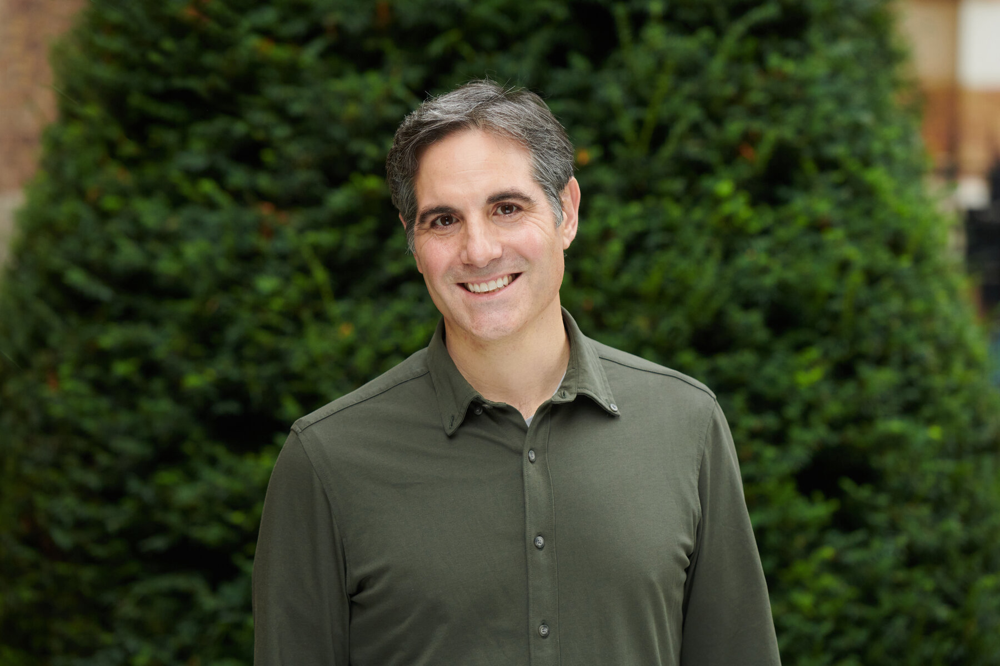

Carl Robichaud co-leads [Longview Philanthropy’s](https://www.longview.org/) programme on nuclear weapons. For more than a decade, Carl led grantmaking in nuclear security at the [Carnegie Corporation of New York](https://www.carnegie.org/), a philanthropic fund aimed at strengthening international peace and security.

Carl previously worked with [The Century Foundation](https://tcf.org/) and the [Global Security Institute](https://gsinstitute.org/), where his extensive research spanned arms control, international security policy and nonproliferation.

In this episode, we discuss:

- Lessons from the Ukraine crisis
- How nuclear nonproliferation treaties are enforced
- China's future as a nuclear power
- Nuclear near-misses
- How effective are missile defence and early warning systems?
- The future of nuclear weapons technology
- The [Reykjavik Summit](https://en.wikipedia.org/wiki/Reykjav%C3%ADk_Summit) between Gorbachev and Reagan
- The [Acheson–Lilienthal Report](https://en.wikipedia.org/wiki/Acheson%E2%80%93Lilienthal_Report) and [Baruch Plan](https://en.wikipedia.org/wiki/Baruch_Plan)
- Lessons from nuclear risk for other emerging technological risks
- What's happened to philanthropy aimed at reducing risks from nuclear weapons, and what philanthropy can support today

### Carl's recommendations

* [*Hiroshima*](https://www.goodreads.com/book/show/27323.Hiroshima) by John Hersey
  * Available [to read on the New Yorker website](https://www.newyorker.com/magazine/1946/08/31/hiroshima)
* *[Fallout: The Hiroshima Cover-up and the Reporter Who Revealed It to the World](https://www.goodreads.com/en/book/show/52764193)* by Lesley M.M. Blume
* *[The Bomb: Presidents, Generals, and the Secret History of Nuclear War](https://www.goodreads.com/en/book/show/50868575)* by Fred Kaplan
* *[The Dead Hand: The Untold Story of the Cold War Arms Race and its Dangerous Legacy](https://www.goodreads.com/book/show/6623920-the-dead-hand?from_search=true&from_srp=true&qid=0RfDpCjLy7&rank=2)* by David E. Hoffman
* [A Most Terrible Weapon](https://warontherocks.com/category/podcasts/a-most-terrible-weapon/) — podcast produced by [War on the Rocks](https://warontherocks.com/)

### Other resources

* [Zero Days](https://letterboxd.com/film/zero-days/) (2016) — documentary about the [Stuxnet worm](https://en.wikipedia.org/wiki/Stuxnet)
  * [Quora answer](https://www.quora.com/What-is-the-most-sophisticated-piece-of-software-ever-written-1/answer/John-Byrd-2) explaining how Student worked
* [The Fog of War](https://letterboxd.com/film/the-fog-of-war/) (2003) — Errol Morris directs this documentary charting the life of Robert Macnamara
* Defence Science Board report on ['Resilient Military Systems and the Advanced Cyber Threat'](https://nsarchive2.gwu.edu/NSAEBB/NSAEBB424/docs/Cyber-081.pdf)
  * [Two](https://www.washingtonpost.com/world/national-security/confidential-report-lists-us-weapons-system-designs-compromised-by-chinese-cyberspies/2013/05/27/a42c3e1c-c2dd-11e2-8c3b-0b5e9247e8ca_story.html) [articles](https://www.businessinsider.com/cyber-exploits-turn-weapons-on-us-2013-3) with commentary
	*[Command and Control: Nuclear Weapons, the Damascus Accident, and the Illusion of Safety](https://www.goodreads.com/en/book/show/6452798)* by Eric Schlosser
* [Worldschoolers Facebook group](https://www.facebook.com/groups/worldschoolers/)

### Corrections

A couple minor inaccuracies are par for the course on a nearly four hour podcast! Carl notes the following corrections, none of which change the substance of the interview:

- When naming nuclear states, Carl mentioned *England* rather than the *United Kingdom*
- When mentioning states which explored a nuclear weapons program, Carl mentioned Spain. While there is some anecdotal evidence that Spain considered nuclear weapons, they are not included in official datasets
- The editor at the New Yorker at the time of the publication of John Hersey's *Hiroshima* was called [Harold Ross](https://en.wikipedia.org/wiki/Harold_Ross), not John Ross