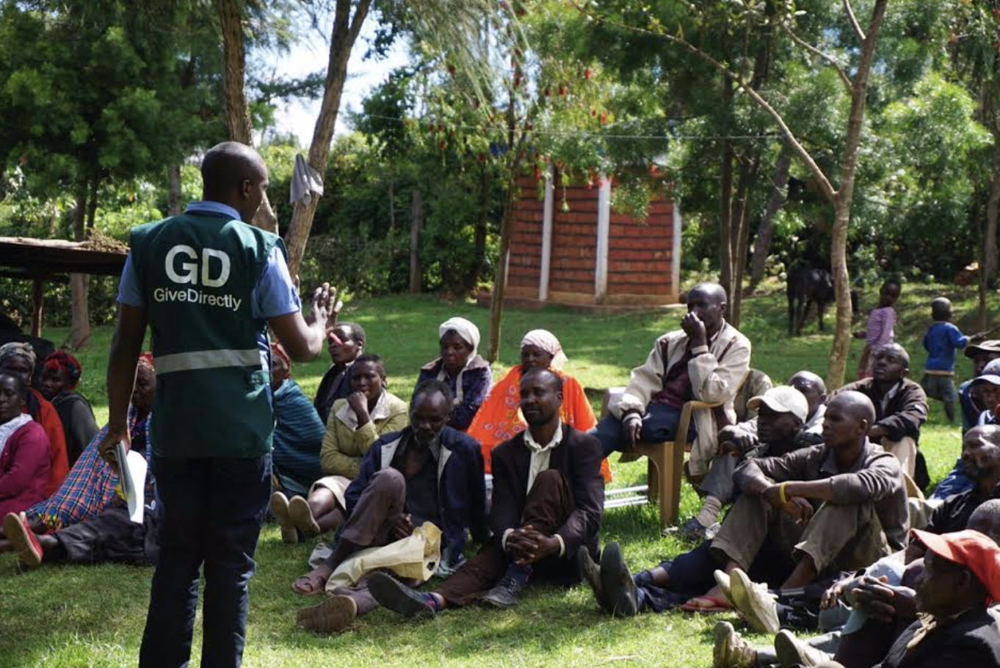
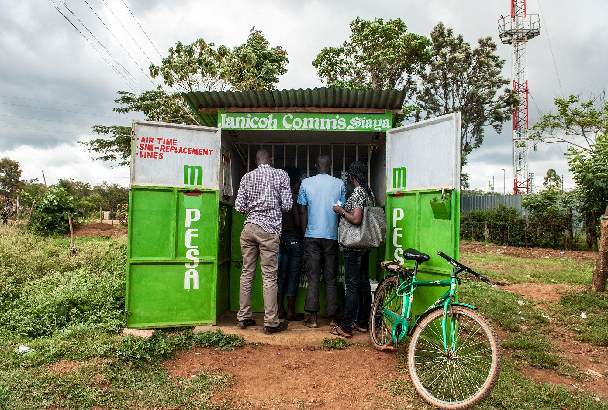

[Rory Stewart](https://www.rorystewart.co.uk/about-rory/) is the President of [GiveDirectly](https://www.givedirectly.org/) and a visiting fellow at Yale’s [Jackson Institute for Global Affairs](https://jackson.yale.edu/). Before that, Rory was (amongst other things) a Member of Parliament in the UK, a Professor in Human Rights at Harvard, and a diplomat. He is also the author of [several books](https://en.wikipedia.org/wiki/Rory_Stewart#Writing_and_documentaries) and co-hosts the podcast [The Rest Is Politics](https://podcasts.apple.com/gb/podcast/the-rest-is-politics/id1611374685).

In this episode, we talk about:

- The moral case for radically scaling cash-transfers
- What we can do to raise governments’ ambitions to end global poverty
- What Rory learned about aid since being Secretary of State for International Development

## Further reading

- GiveDirectly’s work
	- [Own website](https://www.givedirectly.org/)
  - [Dylan Matthew's article](https://www.vox.com/future-perfect/2022/8/31/23329242/givedirectly-cash-transfers-rory-stewart) on “The rise and rise of GiveDirectly”
- Cost-effective analysis on cash transfers
	- [GiveDirectly's analysis](https://www.givedirectly.org/research-on-cash-transfers/)
  - [EconTalk interview](https://www.econtalk.org/michael-faye-and-paul-niehaus-on-givedirectly/) with Michael Faye and Paul Niehaus
  - [General Equilibrium Effects](https://www.givedirectly.org/wp-content/uploads/2019/11/General-Equilibrium-Effects-of-Cash-Transfers.pdf)
  - [GiveWell's analysis](https://www.givewell.org/international/technical/programs/cash-transfers)
		- [GiveWell's announcement](https://blog.givewell.org/2022/08/17/changes-to-top-charity-criteria) on their top charities update
    - [GiveDirectly's reply](https://www.givedirectly.org/giving-directly-still-means-giving-well/) for “Why giving directly still means giving well”
  - [Toby Ord's article](https://www.cgdev.org/sites/default/files/1427016_file_moral_imperative_cost_effectiveness.pdf) on the moral imperative of cost-effectiveness in global health
- Increasing ambition for governments’ development assistance
- [Open Philanthropy's Global Aid Policy](https://www.openphilanthropy.org/focus/global-aid-policy/)
  - [Center for Global Development](https://www.cgdev.org/) (for example: [1](https://www.cgdev.org/publication/how-reverse-decline-poverty-focus-uk-aid),[2](https://www.cgdev.org/publication/uk-aid-spend-2022-oral-evidence-international-development-committee-0)) and its [podcasts](https://www.cgdev.org/commentary-and-analysis)
- [Friends of the Global Fight](https://www.theglobalfight.org/) and [US Global Leadership Coalition](https://www.usglc.org/)

## Transcript

### Intro

**Luca 00:06**

Hi, you're listening to Hear This Idea. In this episode, we speak to Rory Stewart, who is currently the president of GiveDirectly and a visiting fellow at Yale's Jackson Institute for Global Affairs. Of all our guests, I think that it's going to be hard to find someone with such a varied CV as Rory. Most recently, Rory was a British politician, having been a Member of Parliament for almost a decade, and during that time holding several cabinet positions, including briefly acting as Secretary of State for International Development. Before that, Rory was a soldier, a diplomat, a coalition deputy governor in Iraq, ran his own NGO, a professor of human rights, the author of several books, and a podcast host himself. All of that is to say that I think we could have easily asked an audiobook's worth of questions here, but in this interview, we wanted to specifically focus on Give directly to give some context. There have been many randomized control trials and independent reviews which find that just giving money to the extreme poor is actually very cost effective. There are also hopes that this could be repeatable and scalable in a way that nothing else in development economics seems to be.

As with everything, this is actually a pretty wonky literature. For example, the independent charity evaluator GiveWell thinks that whilst GiveDirectly is, quote, "one of the strongest programs", it's found that there continued to be other opportunities, many of them focused on health that can be up to ten times more cost effective on current margins, but would still go unfunded. There's of course, also a range of ethical questions that go into any such cost effective calculations. If you're interested in that literature, then we've added a list of readings on our website, including a podcast interview with GiveDirectly's founders Michael Faye and Paul Niehaus, as well as GiveWell's Writeup on GiveDirectly.

Putting econometrics aside, in this interview we wanted to specifically ask Rory about his ambitious vision for GiveDirectly. Rory argues that we shouldn't just look on the current margin for how to do the most good, which for context for GiveWell is on the order of $500 million a year, but instead try to think seriously about creating a world where we get hundreds of billions of dollars used to end extreme poverty. 

On that scale, Rory says that nothing looks as convincing as cash. Rory thinks that this plan really is feasible, that we can raise and redirect very large amounts of money by changing the minds of people working on large government budgets or at international financial institutions. Rory also very much used to work at these exact kinds of institutions he is now hoping to convince, and also on the exact kinds of projects that he is now advocating that we should replace with a much more straightforward approach of direct cash transfers, since he's therefore radically changed his own mind on this topic. Fin and I were really curious to hear more about what he has to say. So without further ado, here's the episode.

**Fin 02:41**

Okay. Rory Stewart. Thanks for joining us. 

**Rory 02:44**

Great pleasure to be here. Thank you for having me. 

### Why did Rory move to Jordan?

**Fin 02:46**

Fantastic. Well, I understand you're calling from Aman in Jordan, and I'm curious what first brought you to Jordan. 

**Rory 02:53**

I first came here because I was working, along with my wife, with Syrian refugees in Jordan, particularly supporting Syrian refugee craftspeople and helping them set up their businesses and training again. In fact, you can probably hear the call to prayer in the background coming through the microphone at the moment as we're speaking. While I was here, I was approached by GiveDirectly. I went to visit Rwanda with Michael Faye, who's the founder of Give Directly and became really entranced by the model of what they were doing, very excited by what they were doing. And since then, I've been working for GiveDirectly.

**Fin 03:33**

Fantastic. And when was this? When you first moved to Jordan and visited Rwanda as well?

**Rory 03:38**

I moved to Jordan in December 2 years ago, and I went to Rwanda in April of last year.

### Lessons from UK politics

**Luca 03:52**

Before you moved to Jordan and now Give Directly, you had a really long political career and in particular you were Secretary of State for International Development. I'm curious what kind of lessons you learned in that role. Maybe in particular I want to ask how much of the UK's Overseas Development Assistance (ODA) budget you would now allocate to unconditional cash transfers?

**Rory 04:15**

I would allocate the vast majority now of our assistance to unconditional cash.

At the time, I was very resistant and in fact, I think it's something I've had to reflect on a lot: why as Section of State and as a minister before that, I resisted unconditional cash transfers and I'm now total convert. Of course, part of the answer to that is that it was really for me, only being on the ground in Rwanda and seeing the impact for the money first-hand, that I really began to understand how revolutionary it was, how miraculous it was within a bureaucracy like DFID in those days and now the FCDO, there are any number of reasons — psychological, self interested — why people don't like direct cash transfers. One of the biggest reasons of course, is that it raises the question: *what are we all doing*?**

They had many thousands of civil servants — health specialists, nutrition specialists, education specialists — who are putting all this energy into designing these very complicated programs. A single business case would take over a year to design. If the truth was that we're better simply giving unconditional cash, it was slightly doubtful whether any of us were required at all. 

### Why don't governments fill the funding gaps of GiveWell charities?

**Fin 05:39**

Another question we're wondering about is if you're trying to figure out where to spend overseas development assistance, then there are charity evaluators. GiveWell comes to mind as maybe the top one, that spend thousands of person hours trying to find some of the most promising opportunities just to spend money on alleviating poverty [...] Why not just top up all of these recommended charities until they no longer have these big funding gaps which they still have?

**Rory 06:13**

Well, it's an interesting question. I mean, I think Givewell is a very interesting example and I have huge admiration for them. If you look at their recommended charities at the moment, the truth is they would not be able to absorb the kind of cash that I had. I had a budget of $20 billion a year to give away per year. Right. Therefore one of the challenges, in fact, with the GiveWell model is what do you do with the $170 billion a year of international development? How should that be spent? It's all very well finding some very high return investments, specifically in malaria and so, which can absorb 200 or 300 million.

**Luca 06:56**

If the room for more funding is only limited in some sense of maybe 500 million or a billion dollars a year, then I think in some ways that seems even more striking [...] Why does that room for more funding still exist? Is it just because if something is below a billion, then it's not worth even looking at for government?

**Rory 07:19**

The governments will very comfortably make grants. I mean, bureaucracies that are dealing with 20 billion prefer to make larger grants because the admin costs are lower. They prefer to make grants of 10, 20, 30 million if they can, and dream to make 100 million dollar grant. But no, they certainly could. I think it's partly about values and what people's priorities are. In the case of DFID, the central priority was extreme poverty. It wasn't life expectancy or infant mortality, and that is important. *Some* money went into that. In fact, DFID was a big supporter of Gavi and the Vaccine Alliance. Primarily the question that it would have been asking when it was shown a project is: what is the contribution of this to lifting the extreme poor out of poverty? Not what is the contribution of this to ensuring that, bluntly, that fewer children die? That's one of the questions around a number of these evaluators, which are putting a very strong weight on life and perhaps less of a weight on improving people's material conditions. 

### How can governments get more ambitious about overseas aid?

**Fin 08:40**

It occurs to me that there is a question about which areas you might prioritize within overseas development. There's another question about just how high you aim, and in particular, just how large your budget is, how much of your overall spending you're giving to aid. I want to ask how can we get to a world where the UK and other rich countries just have higher ambitions around development. Maybe up to single digit percentages of GDP rather than much less than the 0.7 target we have now. 

**Rory 09:16**

I think that the key to this is hope. The key to this is people believing that there are valuable projects because these development budgets are very dependent on voters. The reality is that there is despair amongst most of the public. The perception is that trillions of dollars has been spent on international development since the Second World War, and particularly in sub Saharan Africa, it's often difficult to feel the impact. I mean, bluntly, there were 170 million people living in extreme poverty in sub-Saharan Africa in 1980. There are 470,000,000 living in extreme poverty in sub-Saharan Africa today. That is notwithstanding the colossal sums of money that are spent. The people like GiveWell are effectively implying at the moment that there's only a few hundred million dollars worth of worthwhile projects at the same time as you're trying to suggest that the world increases expenditure to one or 2% of global GDP, which would take you up into the hundreds of billions. I think there is a paradox here.

### How can GiveDirectly change aid?

**Luca 10:34**

In what ways do you think that an NGO like GiveDirectly can have an effect either in changing voter perceptions or in changing government agendas? What's the kind of limit for what you think is realistic? 

**Rory 10:48**

I don't think there's any limit in the end. I think in the end the logic of cash is overwhelming. There are many other good projects that you can do. Some projects indeed, which at a small scale have a better return on investment. There is nothing which is as replicable or scalable as cash. There's nothing which can reliably absorb hundreds of billions of dollars in the way that cash can. Therefore I think the end of this story has to be the international development community putting the majority of its money into cash. The question is: when will it get there? We've had more than 300 academic studies on cash. We have extraordinary numbers, randomized control tests that we can share, we have benchmarking studies. If you're looking for something that can absorb well, I think two things. Firstly, that can absorb very large sums of money, regardless of context, absorb hundreds of billions of dollars and can be done in Liberia as much as in Kenya.

**Rory 11:49**

They don't require a strong specific route. Secondly, if your primary concern is not niche questions such as health, but poverty in general, in other words — if you're actually genuinely committed to SDG 1 — I think the logic drives you in the direction of cash. The problem is the incredible psychological barriers that exist preventing people giving cash. These psychological barriers are not overcome for most people simply by sharing the results of randomized control tests. It's too easy for people to say: yes, we can see you've been successful at a village level and a district level, but we don't know what's going to happen at a national level. Of course, by the time you get onto a national level, it's very difficult doing an RCT because you've got to a scale where the control group becomes almost impossible. 

**Fin 12:48**

I was actually meaning to ask about almost that exact question. Even if we could persuade people with the very clear results you mentioned at the smaller scale, at the village level, if we're thinking about scaling cash transfers in a big way, then we should be interested in whether they could eventually lift entire countries out of poverty and we should be interested in whether that effect lasts. It's not what you might call a band-aid. We don't have direct evidence of this happening because we haven't tried it yet. I'm curious what you could say to that question. Why expect this to work?

**Rory 13:25**

I think the first thing is that there are two main things that trouble people about the question of these national programs. One, as you say, is the question of the sustainability of it. There Chris Blackman's work in Uganda which traces the impact over not just nine years now, but twelve years, is interesting because it seems that a single transfer of a few hundred dollars twelve years ago, its impact compared to the control group was beginning to drop off after nine years. It diverged again towards the twelve year level, which is very interesting. That's partly because of COVID — what appears to have happened is that the people put sufficient amounts of that money into assets that it gave them resilience through COVID, allowing them to diverge from the control group. That's exciting because it's suggesting that sum of money, which I think in real terms about $350 12 years ago, is something that you can still see a measurable impact compared to the control group twelve years later. 

**Rory 14:28**

So I think that is helpful. Of course, as you say, this is happening at a smaller scale, and that was a semi-conditional transfer directed towards young people working in business. It doesn't tell you everything about what would happen with a similar single cash transfer over twelve years. Actually one of the problems is that running a twelve year randomized control trial is unbelievably expensive and there are very few of them in the world. Second thing I think is the question of macroeconomic impacts, particularly inflation. There we've done a study in Kenya in which it appears at the moment that for every dollar that goes in, there's $2.50 of economic impact across the surrounding area with minimal impact on inflation.

Again, it's difficult to know whether the lack of an inflation impact at a scale of 100 or 1000x would be true. At a scale of 10 million people here, I think you just have to have some courage. You have to say that so much money has been spent with so little impact over the last 70 years that spending two or three billion in a single country on delivering a single transfer to everybody in extreme poverty in that country is worth trying. In the very worst case scenario, it's likely to leave millions of people better off than they were. In the best case scenario, it may well have a transformatory impact on the economy of that country and then provide a model which can then be followed elsewhere. This is another thing that when people talk about return on investment, they tend to be thinking about the immediate impacts in that particular area. Here is the potential return on investment, where spending $3 billion could actually affect the expenditure of the $170 billion a year of international development spend going forward. So could have a much bigger ROI.

Again, calculating this is difficult. And, I was talking to a very distinguished economist ten days ago who's a huge fan of RCTs and of give directly's programs, and her response was, I think this is a very good thing to try. We don't know exactly whether it's going to work, but why not? Why not give it a go? I think this question of why not is important. It's also important, if we to do it, to persuade somebody to give us two or $3 billion to do it. That requires trying to persuade major philanthropists to be interested in doing this kind of thing. Because my instinct is it probably would need to be done by philanthropists first and then later by governments.

**Luca 17:25**

Briefly returning to the kind of question of governments you mentioned before, that civil servants and ministers are acting under all kinds of constraints. Some of those constraints might be put into the category of not being able to have the full information available, or like, having some types of biases that even if they want to prioritize poverty alleviation, they might not be able to do so fully. There might also be a second kind of cluster of reasons that prioritizing poverty alleviation isn't the only incentive or thing that they're maximizing for. I often hear that, I think, in discourse, the overseas development aid also has all other types of priorities from governments and stuff. I'm just curious, from your own experience within government, like how true you feel that is, or how able you think an organization like DFID? 

**Rory 18:20**

Yeah. So, Luca, DFID, of course, under its International Development Act, in its original form, when I ran it, had been very carefully protected from the temptations that other development agencies face. It wasn't allowed to give tied aid, wasn't allowed to build dams with British engineers. The Development Act focused it on the question of poverty alleviation and the culture within that department was pretty allergic to the idea of thinking about the UK national interest or trading benefits, really, these other things. In fact, Andrew Mitchell, who was my predecessor's predecessor, said that he sometimes felt that it was a grand NGO, behaved almost like an NGO. That's of course, changed a bit. If it has become more similar, I think, to other international development agencies in beginning to wonder whether it can leverage soft power or influence through its money. Even in its purer earlier form, there were still many problems. 

**Rory 19:24**

Those problems weren't really about trying to use the money to derive UK national interest benefit. It was much more about the juddering fashions and intuitions of civil servants, politicians and donors. I think one of the fundamental problems international development is a problem of vanity, which is to say people like to believe that somebody generally in the global North knows something that somebody in the global South doesn't. That what they have to do is come up with some cunning idea or some cunning scheme that somebody on the ground has never thought about. The vanity is about thinking that what I'm contributing is not just my money, it's my brilliant brain, it's my brilliant insight. That's one of the things that makes people allergic to cash. Because if you imagine you were a wealthy person and you said, I'm helping poverty in Africa, and somebody said to you, oh, how interesting, what are you doing?

You might be embarrassed to say, well, I'm just giving them cash. You'd prefer to say, oh no, I've invented an amazing new seesaw, which is also a water pump, or I'm giving people chickens because they have eggs. Or I've realized that the one thing that really matters is health. Or the one thing that matters is education. Or the one thing that matters is women. Or the one thing that matters is climate. The humility required to actually say the most respectful, efficient solution is to just get out of the way and let the people who actually live in that community determine what their needs and priorities are is very difficult.

### Lessons about development from Iraq

**Fin 21:14**

Okay, I have a kind of impossibly big question, and it follows from the way were comparing direct cash transfers to, let's say, more structural, more institution-focused, more technical kinds of assistant that you might think of when you're thinking about development. I was interested to know what lessons you learned from the time you spent in Iraq, governing? This is maybe not a two minute answer, but I'm still curious.

**Rory 21:50**

Well, I've been working in and around international development in different ways for almost 30 years now. I'm afraid my fundamental lesson is that the more time I spend in the field — and I've been to, I don't know, over 100 countries — the more disgraceful I find most international development programs to be. And it's terrifying how bad things are. That was true in Iraq, where we spent famously, the US government spent over $3 trillion and have left the country hopefully no better off. I mean, it remains incredibly fragile and incredibly corrupt. Its economy has barely developed. It's true in Afghanistan, but it's true just at a much more basic level in a lot of programs that I saw which been funded by DFID: wash programs in Zambia, health programs in Nigeria, education programs in Malawi. Just very, very, very bad programs. And fundamentally wasteful. Often we were spending, through very reputable UN agencies and NGOs, at times I reckoned something like 90% of the money I felt was being wasted.

**Fin 23:16**

Was this wasted because they were good ideas, but at the level of implementation, things went wrong? Or were they just bad ideas? Or what was the failure?

**Rory 23:26**

Let me give you an example of a program in a particular country. We funded a wash program with a UN agency, and the theory behind it was very appealing. The theory was that one of the reasons why adolescent girls didn't remain in school is because when they had periods, it was very difficult for them to access water and sanitation facilities. Creating water and sanitation facilities within the schools would allow girls to stay longer in school, and those extra years in school would have extraordinary benefits at that level. It's very difficult to disagree with, and many DFID programs, many USAID programs operate at that kind of level — at the level of two or three sentences, which, when shared on a podcast, sound very plausible. In practice, on the ground, what I discovered is that the budget was over $40,000 per school.

What was being done with that money was to employ very expensive engineers to conduct needs assessments, surveys, and studies, at the end of which: two dry latrines — small brick buildings with a hole in the ground — were constructed at a cost of about $1,000 each. Five red plastic buckets were hung on a wall, allowing the girls to take the red plastic buckets to a well few hundred meters away and come back and wash with it. Cost of red plastic buckets: $3. Cost of latrines: maybe $2,000. Cost of project: $40,000. Now, nobody was stealing money, or at least in the way in which we normally think about stealing money. It's exactly what would happen if, instead of giving cash to a village, you tried to achieve the objectives that the village achieves with cash by sending in a UN agency or an NGO to try to deliver those things on *behalf* of the village.

For, let us say, $100,000 [in direct cash transfers] for a typical village in Rwanda, you can find within about three months: the village goes from 40% electrification to 80% electrification; that livestock ownership goes up to 70%; that everybody ends up with the latrine. Everybody ends up with government health insurance, education. Enrolment goes up, nutrition goes up, small businesses are created. If you were to task a UN agency or an NGO to achieve those objectives, you would probably have to pay them a million dollars at least. And it would take a very long time. They would survey every house, they would survey everybody about their educational needs, they would conduct nutrition programs, et cetera. And [...] the same outcomes would cost you 10 or 20 times as much.

**Rory 26:12**

They would survey every house, they would survey everybody about their educational needs, they would conduct nutrition programs, et cetera. And their achievements would cost the same outcomes would cost you ten or 20 times as much. 

### Why autonomy matters

**Luca 26:28**

That's really interesting. I think I often hear two somewhat distinct arguments for crash transfers. One is that by any metric they're just very cost effective. That if you look at the wealth of literature of RCTs, at least on the small scale, there's like a lot of evidence for them, whilst a lot of other interventions, as you said, there have these issues of vanity or biases or just like being very ineffective. I often also hear a more fundamental argument that it is just in principle important to give beneficiaries the agency and autonomy to decide for themselves. What I'm kind of hearing from you is that these two arguments are actually somewhat linked. That it is that like agency on autonomy that makes things effective?

**Rory 27:10**

Absolutely. Because I think that it's important to understand that generally local communities know more, care more, and can do more than a distant donor. You're not simply recognizing their autonomy and dignity, you're recognizing that they actually have epistemological advantages, emotional advantages, practical advantages. One of the biggest advantages that is unlocked by cash is the advantage of being able to do individual programs at the most micro scale. In effect, a cash program will allow each individual to come up with a quite different solution to their programs, to their neighbor, to their problems, to their neighbor. A blanket program might imagine that within a community, the problem for everybody is education, enrollment. Or the problem for everybody is nutrition, because it's a nutrition program, or the problem for everybody is vaccination. In truth, what you find in extreme poverty is that each household has a slightly different relationship to those problems.

I may, through luck, have an aunt who's paid for my kids to go to school. My neighbor may have actually inherited a small plot of land, so in fact, they may be getting more nutritional input. My other neighbor may have a sick relative who requires more money for health, but the cash allows them to adjust. It also allows the village to learn in a way that isn't possible with other programs. Because if you all buy cows, I can then set up a shop selling veterinary medicine, or if you've all been issued with mobile phones to receive your money, I can buy solar panels in order to charge those phones. It's not necessary for somebody to very inefficiently attempt to do a needs assessment in that community. You would never be able to do a needs assessment rich enough to gather that form of information, instead of which those preferences and those needs are directly expressed through the expenditure of the cash.

**Luca 29:43**

I guess I'm still interested in what the role of evidence and impact evaluation is even within this cash transfer framing. Feel free to reject the premise, but if were to imagine that were to do a really large scale cash transfer RCT, and then the evidence just happens to say how inflation actually really is a problem and this takes a large haircut on how cost effective these programs are, would you still be in a position where you would like argue for cash transfers out of these more fundamental, principle and alternative reasons?

**Rory 30:18**

I'd be deeply depressed, Luca. If I managed to raise two or $3 billion from you, did a big national program in a country with, let's say, three or 7 million people living in extreme poverty, I would be doing it on the hope that there would be a significant impact on the number of people living in extreme poverty percentage of people living in extreme poverty in that country and a significant sustainable impact. In other words, that some of these people would graduate, their lives would be transformed. If that turned out not to be the case, that would be a big problem for me, and I would be much less excited by cash. My excitement in cash, yes, has the moral dignity argument, but it's also extremely important to me that I think it is the most efficient, rapid way of transforming people's lives. If I discovered that it wasn't a good way of transforming people's lives, I would lose my enthusiasm for cash quite rapidly.

### Mobile banking

**Fin 31:22**

My understanding is that, concretely, most cash transfers go through mobile banking. This is how the recipient actually gets hold of the money.

**Rory 31:34**

Yeah. 

**Fin 31:34**

I'm curious just how important mobile banking was to enable all of this to happen. As a follow up, I'm interested whether there are other technologies that seem useful for reaching the kind of scale of ambition that you'd like to see in the world.

**Rory 31:48**

Firstly, you're absolutely right. Mobile technology was totally vital. The development of M-Pesa in Kenya and the rollout of mobile money in Africa allows people to give directly. It allows us to send money directly to someone's phone. That cuts out problems of government corruption. That cuts out problems of moving cash in trucks. It cuts out the problem of the head man. It's revolutionary.

But technology actually has other benefits too. One of the things that we've been doing in urban areas where the urban poor own phones is use artificial intelligence for targeting. We do it by analyzing how individuals use their phones, who they call, who the people that they call, where those phones are located, how much is spent on those phones. And in an article in. Nature. A year ago, we argued very strongly on the basis of a collaboration, the University of California and the government of Togo, that the results suggest that you can get information comparable to a 60 minutes household survey from the use of this algorithm.

A 60 minutes household survey can take up to a year to survey a group in a country. This allows us to gather the information in a matter of hours and during COVID to pay over 100,000 people in urban areas almost immediately. So technology can make a huge difference. There are many other things that we think technology could be used for, including fraud detection.

**Fin 33:27**

You mentioned M-Pesa in Kenya. Don't know if you want to say a bit about what that was and how that in particular was useful.

**Rory 33:35**

Well, M-Pesa essentially is a system not just for transferring money to your phone, but using your phone as a bank account and as a debit card. You can buy biscuits by sending a text message. You can withdraw cash by sending a text message. Of course, that gives essentially it banks people as well as, for us, giving us a very rich data set on people's expenditure.

### What are the technical challenges during crisis

**Luca 34:03**

Looking at some of the new programs that give directly is doing, I saw that there are programs such as emergency relief, I believe the earthquake in Turkey also Covid and Yemen and other types of disaster response. I'm curious from a technical angle what some of the challenges are intervening in these crises?

It feels like a very different model. In some senses to what I normally think of as GiveDirectly, which is going into rural villages and serving people. This seems to involve much shorter timelines, and I'm curious what were the challenges in doing that.

**Rory 34:35**

Responding in a conflict zone or a humanitarian context. The first challenge is security. Security for our staff, security for our beneficiaries. The second challenge related to that, of course, is access and identification. The third challenge is the question of the technology that's available, because in some of these contexts, there isn't a well developed mobile money network. If you're operating with Syrian refugees in southern Turkey, we will be transferring money directly to people's bank accounts rather than transferring their phones. We usually have to work with a partner to identify who is most vulnerable in that earthquake zone. In that case, we've focused on Syrian refugees with small businesses. That's something where we coordinate quite closely with UN agencies and others to find that's a neglected group that we think makes a real difference' where we have a good theory of change on why targeting that group helps. It is the case, I'm afraid, that because of conflict, because of natural disasters, but above all, increasingly because of climate, many of the extreme poor of the world are now located in areas which are either conflict affected or extreme risk from climate. Given that our mandate is to support the extreme poor, we cannot neglect operating in these environments, even though we're having to learn all the time about how to change our techniques to work in them more effectively.

### Why GiveDirectly targeted areas affected by crisis

**Luca 36:16**

There does feel like a very concrete, real trade off though, between engaging in some of these spaces which just appear so much more difficult, rather than expanding, give directly's ongoing work in Kenya for example, or other countries. What then is the reason? Is it just as you said, that there's a lot more just like need there and kind of a moral imperative to act in these spaces? Or is it that there's also a lot more attention from the world, more globally, that you're hoping to affect them?

**Rory 36:43**

Yeah, so I think the model that we're pursuing is to balance the two. The majority of our work will continue to be at the moment delivering larger transfers to the extreme poor and more stable areas. You can expect us to do very large programs in places like Rwanda, Malawi, Liberia, but we will also be doing humanitarian, climate related programs. And that's for two reasons. Both because of the extreme need in those places and a projection that over the next 20 to 30 years, the majority of the extreme poor in the world will live in those places, but also because there's much more funding for those areas. We are increasingly approached by philanthropists, governments and others who want to operate in those areas and are looking for somebody to deliver cash there.

### What's next for GiveDirectly

**Fin 37:37**

Yeah, I think you've touched on this more than once, but just, let's say in the next year, what are you planning to work on with GiveDirectly? What's the plan?

**Rory 37:48**

We need to do two things. We need to continue making the case for cash, and that's making the case for cash with two quite different audiences. We need to make case for cash with traditional philanthropic donors who may be more interested in building schools, or digging water wells, or sporting nutrition programs. For them we have to explain that benchmark studies suggest that cash may be more effective than a nutrition program on nutrition, that it may be more effective than a business program on business development. That's a tough thing to explain, but that nevertheless, that's what benchmark study suggests. We have to fight a different argument with the effective altruism community. And with the effective altruism community, we need to say it is true that you may find a few programs worth a few hundred million dollars which bring a good return on investment, but I believe there is nothing comparable to cash if you're interested in addressing global poverty, if you're looking for something that is focused on poverty and has a global application and can actually change the way in which the entire international development system works. I need to get the EA community much more interested in cash and poverty.

### Tension with EA logic

**Fin 39:26**

I guess both of us come from some kind of effective altruist perspective, and I see some tension from my own view of EA. One hand, effective altruists really love to find the very best marginal opportunities where the next million dollars can have the most impact. That's what GiveWell does very well and other evaluators. There's also at least talk about finding, about being scope sensitive, right? Really looking ahead to how do we just make the biggest difference at scale, at maybe the biggest feasible scale? It seems like GiveDirectly speaks to that question, where the "what's marginally best" answers don't really get you there.

**Rory 40:15**

I'm very glad to hear you say that. And I think there are two things. I think one is that one of the advantages of cash is that there is nothing which is as replicable or as scalable. One of the struggles I had working international development, I set up an NGO in Afghanistan in the mid-2000s, 2005. That was very effective in a very specific context. We worked within two city blocks, the old city of Kabul. We spent an enormous amount of money and we made a lot of difference to a few hundred lives. If the World Bank said to me, as indeed they did, could you replicate this in 300 cities across Afghanistan and towns and cities? I couldn't do it because it was so dependent on those particular relationships.

The same is true [generally]. You will find any number of really good schools or clinics run by exceptional individuals. If you say to them can you replicate your school 3000 times? Of course they can't. The genius of that head teacher is local cash is scalable and replicable in a way that nothing else is. It's much more indifferent to context, it's much more indifferent to politics, it's much more indifferent to language, it's much more indifferent to culture. There is almost no limit to how much we can give in cash. Which is the second major point. There are all these philanthropists out there who have literally made, some of them, tens of billions of dollars and who are saying to me that they cannot find projects to spend their money on, that there aren't projects which can absorb the amount of money [...] I can solve that problem for them. This theoretical hundreds of billions that's sitting around at the moment in people who've made giving pledges — if I could even have access to the interest of that money, we could be transforming the lives of tens of millions of people immediately.

### The path to influencing governments' budgets

**Luca 42:16**

Well, I think it is that latter thing that still feels like the biggest crux to me. Again, I guess like reflecting on the effective altruism movement. I think one of the key questions here is how can we do the most good with the resources available to us? Maybe the point of disagreement there is a question of what resources are available to us where in a local sense, you can just think, well, the resources I have, my personal donations, or maybe even the institutions directly within my influence. I'm curious if you can maybe spend some time more clearly spelling out how you see the path to influencing government budgets or large philanthropists, such that we're actually talking about that scale.

**Rory 42:58**

I think that the first thing is to understand that the problem of scale. Annual giving official over to these overseas development assistance is about 180 billion a year. That means over ten years, you're looking at close to 2 trillion. That is a small amount of the overall spend of even governments in the developing world. In most cases, the development system is only about 5% of their GDP. In addition to that is the money [spent] in the world in general; [...] about $85 trillion in 2020. If everybody in the world were to give 0.1%, let alone 1% of their money, there is a colossal amount of money available to tackle the problem of extreme poverty. There is no reason why we could not in our lifetimes, very easily solve the scandal of extreme poverty. To do it, though, requires two things: it requires hope, convincing people there are practical things they can do which will make a difference to extreme poor. Secondly, I think reminding people of why extreme poverty is so horrifying. Because I think one of the sad things is that as we focus more and more on global health and on gender and on climate, we've taken our eyes off the basic reality of what it means to be living in a single room, mud building, eating one meal a day with malnourished children and a low life expectancy and no access to education. And this, that and the other. It's a difficult thing to talk about because we live in a world in which we don't wish to patronize people and we don't wish to propagate poverty porn. We have to find a way of being blunt and brutal about how horrifying poverty is.

### Large donors and the giving pledge

**Fin 44:57**

There is something very strange about the fact that very large donors, for instance, in the US. Who might commit on the order of billions of dollars to a foundation in their name and then, as far as I can tell, often die without having figured out how to give away half of that money. Or at least they're on track to do that. It's kind of confusing when there is such a simple argument to answer. How do you spend that last dollar of your giving? And it's quite simple.

**Rory 45:44**

It's a very interesting question, isn't it? I mean, one problem may be about getting people properly into the field so that they can actually see the before and after. See what somebody in extreme poverty, the conditions they're living in, and then see how much difference is made in a matter of a few weeks by a single large cash transfer to their house, their livelihood, their meals, their livestock, their children, et cetera. It may also be a problem of scale. I mean, it's very easy, I think, oddly, to convince an individual to support an individual. So, there are many people who are happy to give $30 a month and we compare them with one particular woman in Kenya, for example, and they can feel the impact of their money on that individual's life.

**Fin 46:33**

The identifiable victim.

**Rory 46:35**

Yeah. Maybe the problem is that when you scale up and say to the billionaire, you can help with your money 3 million people, or you can lift an entire country out of poverty, they struggle to relate in the same way that you might relate to an identifiable person.

**Fin 46:56**

There are some studies on this. You can just show that there's a way to strictly help more people, but they haven't got names. People will prefer to give the money to the smaller number of people with names. It's kind of baked into our psychology, I guess.

**Rory 47:07**

The problem is that we can of course, we have the technology to share all the names, but once the names get to three and a half million people, names cease to be names.

**Fin 47:17**

Right. It's a long list. Yeah.

### Intermediate stages before a very large scale RCT for cash transfers

**Luca 47:19**

One thing you mentioned closer to the beginning was wanting to run a really large scale RCT, which would likely require philanthropic support in the single digit billions. I'm curious if there are any other intermediate outputs or goals along the way to getting to this vision of a really large scale cash transfer.

**Rory 47:41**

There are many intermediate stages. I mean, I think there's demonstrating it at a smaller scale really powerfully — the impact in an individual district — and using the study on the district to answer all the questions that we need to answer before we go to the national scale. That's something which small donations can really help towards. Both grouping small donations together, which is something that we do a lot of and GiveDirectly, which is people who may be giving as little as $30 a month but put together we have enough money to really demonstrate something to district level all larger donors who are prepared to support, for example, the technology. I mean as we build out the pipes or the rails, allowing us to deliver the money to the extreme poor. That technology platform, that digital public infrastructure, is also very helpful in the future for delivering money to women with children under two or delivering money to somebody in a climate-affected area.

**Rory 48:42**

There is also huge opportunities for people giving it a smaller scale to support some of the enabling elements that would be required for that bigger push.

### Advocacy for cash transfers

**Luca 48:52**

Is there anything in the space of advocacy or targeting some of the institutions or governments you mentioned that on GiveDirectly's radar; or work that you think would be concretely useful in the next five years?

**Rory 49:04**

Again, I think that would be hugely exciting. I mean, we have tended to be a delivery NGO more than an advocacy NGO because we've been very focused on efficiency. We want at our best to be able to say, for every $100 you give, $91 or $93 is arriving on the ground, which we can achieve in some of our very best programs. It is also true that if we're actually going to change the world, we need to change the way that ASAID and the FCDO and the World Bank and the UN think about these things, and the way that other philanthropists think about these things. That does require policy work, that does require thought, that does require advocacy. Again, if there were donors who were prepared to support that in a way that didn't affect our general efficiency, that's something we'd love to do.

### Civil society gets worse at arguing

**Fin 49:51**

Okay, let's do some final questions here's. One, is civil society getting worse at arguing?

**Rory 49:57**

Yes, I think civil society is getting worse at arguing, and I think it's true for a number of reasons. I mean, one of them is civil society itself is under pressure all over the world. Governments are becoming more authoritarian, more populist on every continent, and there has been a marked decline in civil society over the last 17 years.

I also think we live in a culture in which argument itself is controversial, in which challenging opinions is difficult, in which we're increasingly sensitive to some of the problems of asserting an opinion strongly, and that can make argument and persuasion challenging.

### Closing questions

**Luca 50:39**

Final question: where can people learn more about your work and the work of GiveDirectly?

**Rory 50:45**

Well, thank you very much. Please, please go to our website. We're very proud of our website, [GiveDirectly.org](https://www.givedirectly.org/). We've got an enormous amount of data up there, links to academic studies. We've got GiveDirectly Live, which has a random collection of recipient stories which people can look at. I think it's a great resource to begin with if you want to start. Obviously, if you want to reach out to any of our staff, we're very happy to answer questions on individual programs.

**Fin 51:12**

Fantastic. Rory Stewart, thank you very much.

**Rory 51:15**

Thank you, guys.

### Debrief

**Fin 51:18**

Okay, so that was our interview with Rory Stewart. We just ended that ten minutes ago. This is our Luca and Fin debrief. How do you think that went?

**Luca 51:29**

I thought it was a really interesting interview and just getting to speak to somebody like Rory Stewart, who has had such a long career in global development and aid, that's really cool. Also just seeing somebody really fundamentally change his view about what he is.

**Fin 51:43**

What I'm presumably is quite a painful way.

**Luca 51:45**

Yeah. I think that really came through in bits of the interview. I was thinking, like, it used to be the case that we would always end the interview with what's? Like one thing you've changed your mind on? And I think this whole episode was.

**Rory 51:55**

In some ways about that. Yeah.

**Luca 51:57**

What were your main takeaways from the interview?

**Fin 51:59**

Yeah, I think two stood out. One was this fairly bleak picture about just how inefficient much, perhaps most overseas aid from rich countries is just in practice and it's this gap, I guess, between the, like, nice sounding sentences about what the aid is aiming to achieve and then just how that translates to what happens on the ground. The story he told about the program to get some kind of sanitation for girls in school was pretty stark. That's 1 second one was just this kind of crazy mismatch between the fact that big philanthropists and also, I presume, foreign aid departments in rich countries struggle to think how to spend large amounts of money on alleviating poverty and global health and then we just have this answer to spend through to your last dollar and beyond. That seems like pretty good.

**Rory 53:07**

Yeah. 

**Luca 53:07**

Having that answer makes things more depressing in a way.

**Fin 53:10**

Right. 

**Luca 53:10**

Like it can almost be that if it just happened to be the case that development assistance just isn't scalable, the only things you can do are like very small cost effective things.

**Luca 53:20**

But that's it. 

**Luca 53:20**

That would almost be in some ways a less morally demanding world then. No, it is the case that we can grab millions of dollars and have a consistently robust, positive impact.

**Rory 53:32**

Yeah. 

**Fin 53:32**

It raises this question of why this isn't happening already. One answer which I think Rory mentioned was something about the psychology of paying into what is effectively an enormous pot, which is just getting redistributed directly to lots of people, to a very long list of people. This maybe just kind of sounds less impressive or even like you've put less thought into where you want to spend your philanthropic money than some foundation that's set up in your name. One way this overlaps in my head with some of the ideas of EA is this idea of taking your ego out of giving. You're giving to help people, not to make yourself look good unless that can help more people. Yeah, I feel good about some kind of cultural shift in this direction. We're really trying to make it explicit that you're giving you should just be doing often boring things that work rather than sexy things that don't work.

**Luca 54:30**

Yeah, I guess I'm still really intrigued.

**Luca 54:31**

Of how much of that point comes down to vanity and ego as opposed to passiveness. So how much of it is that? No, the person donating wants to have a really smart sounding idea or have something really shiny to point towards versus that just being the default, and most people just don't do that kind of scrutiny, I think. I imagine that is also where looking at different types of donors will get you different answers. I imagine that the kinds of questions are for a civil servant, like in a government or a really large philanthropist are somewhat different than individuals donating, where it's often like, oh, this cause happens to be what the supermarket checkout is asking me to donate.

**Fin 55:09**

Yeah, that's a good point. It's probably much too quick there or, like, lumping people into the same bucket. I guess I was mostly talking or I mostly had in mind very large philanthropic donors, but I guess the stories are different between different people.

**Luca 55:22**

Yeah, I'm still really intrigued, and I think it is still, after this interview, an open question to me, at least, of how much that can be changed or what the route to changing that is. I think this give directly case, and I think Rory Stewart argued pretty powerfully that the world should raise its ambition and we should be doing this. I think a really open question to me is, like, can we do that or can an organization, like, give directly or like an advocacy or actually do that? What is the concrete pathway to getting to that? I really take the point, and I think Rory mentioned that pretty explicitly a critique against effective altruism, looking too narrowly at things on the margin that look really good. I still kind of have this feeling of, like, yeah, if you don't have a lot of resources, then you do triage and prioritize.

**Luca 56:07**

It's not obvious to me whether spending money on advocacy to make the pie bigger and to make it go to cash is at the moment politically feasible or what work can be done to make that politically feasible in the future. I wish we spent a bit more time on that.

**Fin 56:23**

Yeah. Okay, so just to get clear on what you're saying, we agree that it is in some sense possible for aid agencies to divert big parts of their budget to direct cash transfers and for philanthropists to give lots more money to cash transfers. The question is whether it's realistic enough to move far in that direction for it to make sense to start advocating for it. 

**Luca 56:50**

Yeah, I guess I would like to understand a bit better why, historically, has this not been the case, and yet at the same time, we think that going forward, this thing can be changed. I think in one way this asks a really deep question about what evidence for effectiveness looks like. In some ways I would like to have, an Rct on, like, advocating for aid, like, ten times as cost effective as, like, just giving, like, cash directly.

**Fin 57:16**

Yeah. 

**Luca 57:16**

If an organization like Give Directly explores these, like, advocacy things more or at least like supports organizations that do, then I would also like to see the case spelled out for that. I imagine that if a lot of this theory of change comes down to influencing a very small amount of people who control large number of resources, like governments or really large philanthropists, then maybe that study just doesn't exist. I would still want to explore more the intuitive reasons for why that is possible or what concretely gives Rory hope here that this is possible. I really took the message of hope, but I would like to see a bit more spelled out.

**Fin 57:49**

Do we have no indications that aid advocacy can be effective? As in advocacy for better aid policy and more aid spending? Some examples.

**Rory 57:57**

Right. Yeah. 

**Luca 57:57**

So, like, open Philanthropy, who I should flag, is also like my employer. So conflict is there. Did hire a program officer, Nora, recently to do foreign aid advocacy and I think there is a lot of stuff promising there and that's maybe somebody to have on the show to talk.

**Luca 58:11**

About that concretely, but I think it.

**Luca 58:12**

Is a really hard problem.

**Fin 58:13**

Sure. Overall, that was a really great conversation. I thought Rory Stewart very cool that he's now president of Give Directly. Also I'm just genuinely excited to see what they get up to in the next two or three years. I think in some sense right now, they're probably the fastest growing nonprofit in the world.

**Rory 58:31**

Yeah. 

**Fin 58:32**

And if that continues, then that's just great. 

**Luca 58:34**

I think recently Givewell put them off their list of top charities. I think in part because Givewell was having to deal with the fact that there's less funding in this space as they would like to be able to fund everything. I think Give Directly actually just had a really good reply to this, which I think like Rory and we.

**Fin 58:53**

Can link to it as a lot as well.

**Luca 58:54**

Yeah, which we'll like link to. I think I'm really excited to see what this just like, very hopeful and ambitious, like large scale, cost effective cash transfer. Like a looks like love it.

**Luca 59:05**

Let's see in five years.

**Fin 59:06**

Let's do it. 

### Outro

**Luca 59:08**

That was Rory Stewart on give directly and massively scaling cash transfers. As always, if you want to learn more, you can read the Writeup Fin Hearthisidea.com episodes Stewart. They'll find links to all the papers.

**Luca 59:21**

And books referenced throughout our interview, plus.

**Luca 59:23**

A whole lot more. If of any other cool resources on these topics that others might find useful too, then please send them to us at feedback fin hearthisidea.com. Likewise, if you've got any constructive thoughts then please email them to us or click on the website where we've got the link to anonymous form under each episode. You'll also receive a book for filling out our short survey. Lastly, if you want to support and help us pay for hosting these episodes online, then you can also leave us a tip by following the link in the description. A big thanks as always to our producer Jason for editing these episodes and thanks very much to you for listening.

