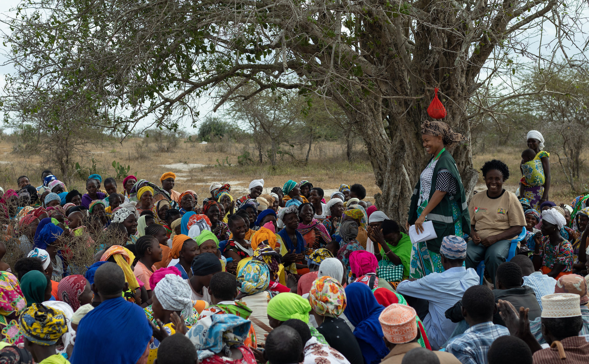

[Rory Stewart](https://www.rorystewart.co.uk/about-rory/) is the President of [GiveDirectly](https://www.givedirectly.org/) and a visiting fellow at Yale’s [Jackson Institute for Global Affairs](https://jackson.yale.edu/). Before that, Rory was (amongst other things) a Member of Parliament in the UK, a Professor in Human Rights at Harvard, and a diplomat. He is also the author of [several books](https://en.wikipedia.org/wiki/Rory_Stewart#Writing_and_documentaries) and co-hosts the podcast [The Rest Is Politics](https://podcasts.apple.com/gb/podcast/the-rest-is-politics/id1611374685).

In this episode, we talk about:

- The moral case for radically scaling cash-transfers
- What we can do to raise governments’ ambitions to end global poverty
- What Rory learned about aid since being Secretary of State for International Development

## Further reading

- GiveDirectly’s work
	- [Own website](https://www.givedirectly.org/)
  - [Dylan Matthew's article](https://www.vox.com/future-perfect/2022/8/31/23329242/givedirectly-cash-transfers-rory-stewart) on “The rise and rise of GiveDirectly”
- Cost-effective analysis on cash transfers
	- [GiveDirectly's analysis](https://www.givedirectly.org/research-on-cash-transfers/)
  - [EconTalk interview](https://www.econtalk.org/michael-faye-and-paul-niehaus-on-givedirectly/) with Michael Faye and Paul Niehaus
  - [General Equilibrium Effects](https://www.givedirectly.org/wp-content/uploads/2019/11/General-Equilibrium-Effects-of-Cash-Transfers.pdf)
  - [GiveWell's analysis](https://www.givewell.org/international/technical/programs/cash-transfers)
		- [GiveWell's announcement](https://blog.givewell.org/2022/08/17/changes-to-top-charity-criteria) on their top charities update
    - [GiveDirectly's reply](https://www.givedirectly.org/giving-directly-still-means-giving-well/) for “Why giving directly still means giving well”
  - [Toby Ord's article](https://www.cgdev.org/sites/default/files/1427016_file_moral_imperative_cost_effectiveness.pdf) on the moral Imperative of cost-effectiveness
- Increasing ambition for governments’ development assistance
- [Open Philanthropy's Global Aid Policy](https://www.openphilanthropy.org/focus/global-aid-policy/)
  - [Center for Global Development](https://www.cgdev.org/) (for example: [1](https://www.cgdev.org/publication/how-reverse-decline-poverty-focus-uk-aid),[2](https://www.cgdev.org/publication/uk-aid-spend-2022-oral-evidence-international-development-committee-0)) and its [podcasts](https://www.cgdev.org/commentary-and-analysis)
- [Friends of the Global Fight](https://www.theglobalfight.org/) and [US Global Leadership Coalition](https://www.usglc.org/)

## Transcript

*Coming soon!*

