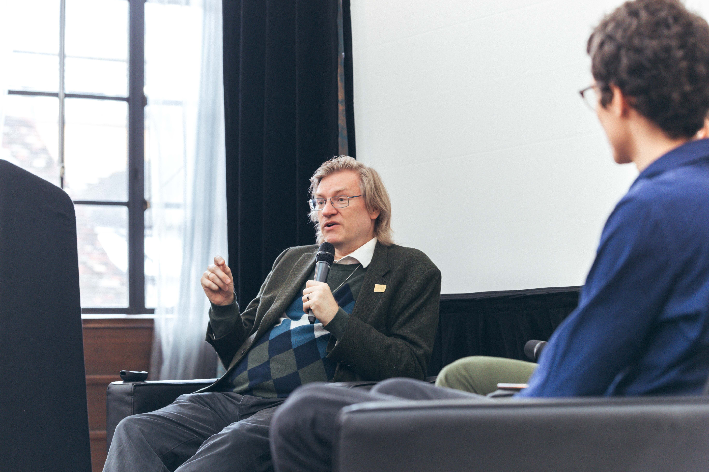

[Anders Sandberg](https://en.wikipedia.org/wiki/Anders_Sandberg) is a researcher, futurist, transhumanist and author. He holds a PhD in computational neuroscience from Stockholm University, and is currently a Senior Research Fellow at the [Future of Humanity Institute](https://www.fhi.ox.ac.uk/) at the University of Oxford. His research covers human enhancement, [exploratory engineering](https://en.wikipedia.org/wiki/Exploratory_engineering), and 'grand futures' for humanity.

This episode is a recording of a [live interview](https://www.youtube.com/watch?v=OMIWsrS39dI&list=PLwp9xeoX5p8PJKPaLePz_nrsQT6Z8X7GQ&index=19) at [EAGx Cambridge](https://www.effectivealtruism.org/ea-global/events/eagxcambridge) (2023). You can [watch the video version of the conversation here](https://www.youtube.com/watch?v=OMIWsrS39dI&list=PLwp9xeoX5p8PJKPaLePz_nrsQT6Z8X7GQ&index=19), and you can [find upcoming effective altruism conferences here](https://www.effectivealtruism.org/ea-global).

We talk about:

- What is exploratory engineering and what is it good for?
- Progress on whole brain emulation
- Are we near the end of humanity's tech tree?
- Is diversity intrinsically valuable in grand futures?
- How Anders does research
- Virtue ethics for civilisations
- Anders' takes on AI risk and whether LLMs are close to general intelligence
- And much more!

## Transcript

**Fin 00:06**

Hey, listeners, you are about to hear our first live interview recorded a few weeks ago at an [EAGx conference](https://www.effectivealtruism.org/ea-global) in Cambridge in the UK. We got to speak Anders Sandberg On, who I probably introduce in the recording. So without further ado, here's the episode.

Okay. Thank you so much. I would normally say that our guest needs no introduction, but since we're recording this, he actually anders Sandberg on is a researcher, futurist, and author. He holds a PhD in computational neuroscience from [Stockholm University](https://en.wikipedia.org/wiki/Stockholm_University), and he's currently a senior research fellow at the Future of Humanity Institute at Oxford. Anders, thanks for joining us. 

**Anders 00:51**

Well, thank you for having me. So what do you want to talk about? 

**Fin 00:54**

That's a good question. Well, here's how we kick off most of our interviews. Can you tell us about a problem which you're currently stuck on? 

**Anders 01:01**

A good problem? I'm stuck on I'm slightly stuck on the question, why are the food combination taboos in Myanmar so extreme in thinking that pigeon and pumpkin is deadly rather than just bad for you, while most food combination taboos are more like, yeah, that's bad for you, or that's disgusting, don't eat it. Why deadly, and why in Myanmar? 

### What is exploratory engineering?

**Luca 01:25**

So I think we're going to spend most of this episode not talking about food combinations, although I would love to do an episode on that as well. Instead, I think we're going to spend a lot of time talking about your upcoming book, Grand Futures. And to maybe frame this discussion, a lot of your book is talking about this idea of exploratory engineering. Could you begin by talking about what that is and what doing this kind of research looks like? 

**Anders 01:46**

Yeah. So when talking about the future, the real problem is, of course, the world is complex, and it's full of people that decide for their own what to do, including mess up things for [futurists](https://en.wikipedia.org/wiki/Futurist). So figuring out where are the limits, what can be done requires some methodology. And exploratory engineering is about figuring out stuff that might be possible to do by trying to do engineering, even though we can't do it yet. So in normal engineering, you get asked to design a car or a building, and then you try to look at the materials you have available and the budget, and you try to find a solution that solves the problem. In exploratory engineering, you start out with not the materials you have, because some of them you might want to say, what are the materials that could exist in this universe? 

**Anders 02:36**

What are the rules of physics and engineer we know actually would apply on any scale? And then you sketch out how to build something the size of a planet or how to move a galaxy, and you essentially work out the engineering details up to some resolution. It might end up with an actual literal blueprint for devices for moving galaxies, but sometimes you do it on a looser scale, and you base it on well understood physics that we know has to be true and well understood engineering principles. And if you're a bit uncertain, you add a safety factor. That means that even though we're a bit uncertain, we know that could certainly be done. What you don't care about here is budget. 

**Anders 03:14**

And you might make a completely ridiculous contraption that actually future engineers would just laugh and scoff at, but you can prove that this could actually exist, and that means that we could move galaxies or we could build that kind of system. And that might be quite interesting for thinking about where are the limits to what intelligence can do in the universe. 

**Luca 03:34**

So could you maybe give a kind of concrete example of what this looks like? In particular, I'm thinking about the [Apollo program](https://en.wikipedia.org/wiki/Apollo_program), if you could maybe talk about that. 

**Anders 03:41**

Well, the Apollo program is interesting because long before the [Kennedy](https://en.wikipedia.org/wiki/John_F._Kennedy) gave any speech about putting a man on the moon and bringing him safely back, that was theme of a paper from a British interplanetary society in the late 1930s. So they worked out, given what they knew about rocketry at the time, what would it take to make a rocket that could actually send a human to the moon and send him back again? It was based on solid rocket fuels. It was supposed, I think, to land in [Lake Tanganyika](https://en.wikipedia.org/wiki/Lake_Tanganyika) in Africa. It was fairly different from the Apollo program, but based on the best engineering and physics knowledge they had at the date. And they showed that, according to that, this ought to work. 

**Anders 04:22**

Then the second world war happened, and the [British Interplanetary Society](https://en.wikipedia.org/wiki/British_Interplanetary_Society) shut down activities for a few years because there were other concerns. But as soon as we reopened, there was an updated version of a paper pointing out those liquid fuel rockets that have been bombarding us for the last few years. Now, we know a bit about their performance. We can update this, and they sketched out how you could do it now based on the knowledge of a [V-2 rocket](https://en.wikipedia.org/wiki/V-2_rocket), et cetera. So in this case, that was a proof of concept that, yes, it's possible to build a rocket and get to the moon. It's just that a better rocket could certainly be designed if you actually put your mind to it and have a big budget of engineers and scientists actually solving the problem. 

**Anders 05:01**

But you can work out the different problems, see what they are, show that there are solutions to that, and you can find even better solutions if you actually want to. 

### Whole brain emulation

**Fin 05:10**

That's a great example. I wonder if another example of exploratory engineering is whole brain emulation, because in principle, we could scan brains to a high enough resolution, and in principle, we could just run them. But I haven't really heard much about where we're at with actually trying to implement some kind of whole brain emulation program. So what's the deal? What's going on with that? 

**Anders 05:30**

So, back in 2008, I had a workshop at home in Oxford about the concept of whole brain emulation, where we brought in computer science people, neuroscientists, nanotechnologists. And we had a very interesting discussion, including the moment where the neuroscientist said, look, this cannot possibly be done because here is a calculation of how much data you get if you scan a brain at the resolution we agree is possible. And obviously there is no way of storing that much data. And simultaneously, all three computer scientists at the table kind of stood up and shouted about data compression. That was a solvable problem. So we basically developed a kind of roadmap. This is an interesting case because we don't fully know for certain that this could work. You could take a brain, fixate it, scan it with the necessary resolution. 

**Anders 06:16**

We can do that on small volumes of brains. Now we have a fruit fly [connectome](https://en.wikipedia.org/wiki/Connectome) that has been fully scanned. We also have more than enough computing power to not maybe run a human brain, assuming a certain resolution in the calculation. But certainly a [fruit fly](https://en.wikipedia.org/wiki/Fruit_fly) brain would be possible. What we don't have right now is taking an image of a fixated brain sliced up and turning that into something you can actually run on your computer because you need to know the parameters of the different neurons we need to develop that technology. So in this case, the exploratory engineering gives us a decent idea about the parts we can do. What just needs a lot of scaling. Some engineers will want to run away and figure out how to make an entire warehouse full of electron microscopes do this. 

**Anders 07:00**

And what robots need to be used to transport brain slices in the right way. Other computer scientists are saying that simulation, you need an enormous amount of interconnect between your processors. Fortunately, I think I have a solution so you can work on that part. What we really need now am I going to organize a workshop about this, actually trying to figure out how to close the loop is can you actually extract function from imagery and what? We probably don't know that yet, but we can. We set up a research program to figure it out. What are the testing systems that we can fill in the details. So in some sense, we don't have exploratory engineering for proving that you can do brain emulation. 

**Anders 07:38**

Indeed, some philosopher would say that, yeah, even if you prove that you can do all of that, I'm going to say that software cannot possibly be conscious, at which point we have a big quarrel, of course, but it's a thing that could be true. We could test that by doing brain emulation. And I'm interested in knowing what resource would it take? How many friendly billionaires would I need to line up in order to get this project going? Could we do it faster than current trends in AI? Or does it look like even if I had all the billionaires piled up behind me, I still couldn't beat what's happening in AI. That would be nice to know if. 

### Are we near the end of humanity's tech tree?

**Fin 08:11**

Any billionaires are watching, we can pass on anda's email address. So I used to play the [Civilization](https://en.wikipedia.org/wiki/Civilization_(series)) video games and in those games there's a tech tree. So you start your civilization at pottery and agriculture and eventually you get a space program. And I was curious if humanity is moving along some kind of tech tree, how far along are we? 

**Anders 08:30**

That is a very fun question. So there is a between the late [Peter Eckersley](https://en.wikipedia.org/wiki/Peter_Eckersley_(computer_scientist)) and [Toby Ord](https://en.wikipedia.org/wiki/Toby_Ord) that by the time we meet aliens, we have reached the end of a tech tree. Basically, there is no new, fundamentally new technologies that can be discovered. Toby thinks this is likely. Peter thought no, we can combine stuff quite endlessly. Tech trees in computer games are a bit misleading because we only get one story about how you develop a technology. So Civilization is based on how technology developed in our world, but maybe on another world where maybe metals were scarce and they were discovered much later, we would have very different technologies achieving different things. Maybe if manganese was much more common, it would be easier to make clear glass and optics would have developed much earlier and would be part of a lot more technologies. 

### How regulation shapes tech development

**Anders 09:21**

So there is a bit of a risk that we look at the tech trees and believe that is the only way a technology can develop. Also, how far are we? Well, one thing might be that if we develop really good artificial general intelligence and get essentially intelligence on tap, we could accelerate our technological development quite a lot. So one possibility is that we just get all the intelligence we can buy and take just advances up until whatever limit there is in a very short while. That assumes, of course, the difficulty of developing new technology keeps being about constant. But we can pour on optimization capacities for intelligence endlessly. But it could of course be that after a while it gets harder. So it might be that actually it levels off and gets slower. 

**Anders 10:04**

Yes, we get technological development, but we need an enormous amount of AI and compute and experimentation to do it, in which case it slows off. The interesting part here is the question about how much intelligence we can cheaply get and how hard technology is. They're totally independent things. There is no reason that they should be matched to each other. So either of these ones so either we might be close to the end of technology or we might be at just the start and we don't know which yet. 

**Fin 10:30**

Interesting. I guess there's a rate at which you get better at solving problems, but as you solve problems get harder to solve. These are two separate variables. Hard to guess how they met out. It's a bit like holding a microphone to a speaker. If you move it a little bit closer, then suddenly you get feedback. But how we get feedback, who knows? 

**Anders 10:44**

Yeah, in the case of feedback, actually, if I'm moving this around, I might notice changes in the sound that gives me some hints. It's a bit like how you use. You can look in dynamical systems like ecosystems and see how they respond to fluctuations. If it takes longer and longer for them to even out a fluctuation, you might be getting close to a tipping point. But we don't know how to do this well for technology, or for science for that matter. On one hand, we have more scientists than ever. Is a rate of progress in science faster than ever? You might argue either stagnation or acceleration, depending on your mood and the kind of data you're bringing around. I'm just mainly confused. But certainly there is so much more science to master before you get to the frontline in many domains. 

**Anders 11:27**

But then you discover that there are big lacunas in what we know that are pretty elementary. So yeah, there might be a lot of low hanging fruit we just haven't bothered to pluck yet. 

**Luca 11:37**

So a lot of exploratory engineering work looks like it's mostly about kind of showing feasibility proofs or something like it is actually possible to do this. It's not, as you said previously, necessarily about showing what the exact solution in reality will be, nor necessarily even about when that solution might appear. I guess one question I have then as well is what are the types of uses or impact that doing this type of work has? Might it lead to of knowing that. 

**Anders 12:02**

This technology is feasible? I think one interesting example is nanotechnology, where [Eric Drexler](https://en.wikipedia.org/wiki/K._Eric_Drexler) did a masterful piece of exploratory engineering, especially in his book NanoSystems, that piles up the evidence that these kind of structures are physically possible. If we could somehow make these gears out of diamond, they would have these amazing properties that we could get manufacturing with these enormous environmental and energy gains. Now, he doesn't say that is the way we want to do nanotechnology. Indeed, we might be ending up with nanotechnology based on completely different styles of chemistry. The reason he was using diamond was that's easy to calculate. He could prove things about diamond systems and simulate them easily. While protein engineering, which might be a much more feasible way right now for actually getting powerful, nanotechnology is much harder to simulate, or at least was in the early 90s. 

**Anders 12:57**

So that proof inspired a lot of people say we should totally do nanotechnology. Then the field kind of got hijacked by a lot of material scientists that wanted to do non science rather than non engineering. So that went off in maybe the wrong direction. But I think it's a beautiful example of showing this is something that looks like it's potentially very powerful, we might want to find a pathway to that historically. Another thing is, of course, could you make heavier than air flight? And people could point at birds and point out birds are heavier than air, so we know that at least some things can fly. And then for a long time, people didn't know how to find a pathway from the machines they could build to something that actually could fly. 

**Anders 13:37**

But there was a fairly clear goal, and you could even start studying the birds and what they did and get interesting hints about aerodynamics, how to steer, and gradually figure out what the problems were. Already one of the earliest engineers thinking about this, [Emanuel Swedenborg](https://en.wikipedia.org/wiki/Emanuel_Swedenborg), a Swedish engineer who's mostly known in Bangladesh and war for his early war conspiracies. He kind of went off the rails there, but he wrote also a paper about how to build a machine to fly into the sky. And it's hilarious because he actually doesn't explain how to do it. He's just correctly addressing the problem. We need a motor that is very light and produces this much force. If we can get that one, we should be able to fly. 

**Luca 14:19**

I guess one model I have here is that by being able to show that something's feasible, you can potentially steer a lot more resources towards that technology. You can show to governments or show to research labs, hey, this thing's actually possible. But there is also something I'm more interested in as well, with the regulatory regimes or governance questions as well. But I think there is a question here that if a lot of governance and regulatory solutions end up being really heavily reliant on specifics how much progress you can make in those realms before you have a better idea of what the concrete solution is. But if you know that something still. 

**Anders 14:49**

Is feasible yeah, I think it depends a lot on the shape and texture of different fields, not only in the sense of what the technology is like and the underlying physics or chemistry or whatever it is, but also the social setup of the field. So when we look at nuclear power, we have an interesting case where in a very rapid development process, people went from, yeah, you can't possibly do nuclear power to oh yes, we can do nuclear power. Now we might need to do nuclear power to make nuclear weapons and then developing nuclear reactors very quickly. And then we end up with a situation that because of some of the scaling properties of nuclear reactors, you generally want to make them fairly big. It's possible to make them small, but bigger ones are better, especially for making [Plutonium](https://en.wikipedia.org/wiki/Plutonium). 

**Anders 15:37**

So there was a demand for big nuclear reactors, but given that they're also useful for nuclear weapons, you also want to control this technology quite a bit. You ended up with a regulatory regime in most places that then locked in the technology more and on one hand led to that. We didn't have a lot of pocket nuclear reactors having pocket nuclear accidents all over the place, which might be good, but we ended up with a few nuclear reactors having big accidents occasionally, but more importantly, being so expensive that actually nuclear power is on the kind of wrong path on cheapness. Meanwhile, solar panels and wind power are getting exponentially cheaper because they have other scaling abilities. And the paraphraxis, the technologies and practices linked to that technology are developing in a kind of virtuous cycle. 

**Anders 16:26**

So the problematic part here is decision makers can sometimes do a lot of helpful things and sometimes harmful things, but it's complicated and many decision makers and many technologies don't understand this very well indeed. I think in general, we don't have a good science of how to set up these feedback loops well and handle the uncertainty because sometimes you do get surprise problems showing up. 

**Fin 16:48**

It occurs to me that we're so used to monotonically increasing progress when it comes to technology. It's much easier to learn things than to unlearn things. But I guess occasionally you can get downward spirals as well. So maybe in the nuclear example you might have engineers get depressed at the rate of progress because it's hard to make much progress through learning from doing. And so they might leave the field. And so the field kind of stagnates and maybe eventually you kind of lose some of this more implicit knowledge and. 

**Anders 17:16**

Sometimes you have problems that field hinge on very small groups of people or even individual examples. I have a friend who told me that his company needed diamond knives to do careful cutting of tissue for a particular application. And then one day he couldn't get them from the company he was normally buying it from. And he asked them and they said, George stopped working here. He's retired. George was the guy who was making these diamond blades and nobody else at the company knew how to do it particularly well. So they were in a bind. Then it turned out that Apple was interested in maybe buying these kind of blades for some purpose and immediately Free company sprung up because Apple has money. Then Apple decided, now we don't need them. 

**Anders 18:00**

But at that point my friend was kind of happily buying these diamond plates because he got to make use of it. But sometimes you have a systemically important, very small roles. There was a company in Japan that a chemical company making a resin used to fixate the integrated circuits into the plastic capsule. And they had a fire in 1996. So the production line and the stores of this special resin was destroyed and suddenly chip prices went through the roof. We didn't know before that we needed this particular resin to that extent and that it was made in one place. 

**Luca 18:34**

There's definitely something interesting here that you only really realize that these things exist when they break or when they're gone. And maybe to kind of change topic somewhat. I'm just really curious what does your day to day look like when you do research, what this actually entail? And especially if somebody is interested in maybe doing work like this, is there any advice you can give or any questions that you'd be really excited people new in this field would maybe take to explore? 

**Anders 18:56**

So my trick of research is to get enormously curious about random questions. I wish I could say, oh yes, I'm making a list of the most important problems in the world and then I'm starting to work on the most important one and picking it apart into the sub problems and finding something that's not how I work. I hear about something cool and then I get interested. And then sometimes that turns out to be irrelevant. So instead of trying to optimize for always working the most important problem ever, and I admire people who can do that and I really love working with them, I instead work on a lot of different problems. Some of them are going to turn out to be important, others are just entertaining, like the food combination issue. That's not directly super important. 

**Anders 19:39**

It has some interesting implications, but it's a bit beside the point. I have another project dealing with volcano engineering ethics, which is probably more important in terms of catastrophic risk. Then I'm working one about governance of [complex adaptive systems](https://en.wikipedia.org/wiki/Complex_adaptive_system), which is probably super important, but much harder. So whenever I get tired of that, I jump back to something else. So I'm cycling between them and getting my little obsession. So my trick is read a lot of books. Textbooks that you can get at use bookstores are great. You can read the first chapters before going to bed and pick up on what do different fields know or think they know and what is their style of thinking. So you acquainted a little bit with how different groups are dealing with it. Generally, I'm a generalist. I like being able to link to other disciplines. 

**Anders 20:27**

It helps. But I'm in the philosophy department because I can get away with everything. And if somebody asks, I say, oh, I'm doing philosophy of x, whether that is philosophy of volcanoes, or philosophy of food or philosophy of the end of the world. But the real story is of course you have links to different disciplines that can run away and ask experts there and work with them to do something really useful. But you get an overview. And my tip on getting into this is just read widely and then write about it first for yourself. You want to write down your ideas and refine them. And then you might write your small essays and then bigger essays and then papers, and before you know it, you might accidentally have written a book. And that's where you really started discovering things. 

**Fin 21:11**

That was really useful and I'd love to read more about the philosophy of volcanoes. Okay, well, you mentioned your book. Let's talk about that. 

**Anders 21:17**

Oh, dear. 

### Why write about grand futures?

**Fin 21:18**

You have, I believe, mostly written a book called Grand Futures about positive, ambitious futures that humanity could achieve. And I want to ask about the motivation. So why write about these positive futures that are so far away? 

**Anders 21:34**

Yeah, so the Future of Humanity Institute has a bit of a reputation of being doom and gloom. We do a lot of existential risk. Existential risk in the abstract, concrete things like [biosecurity](https://en.wikipedia.org/wiki/Biosecurity) and the technical AI security. And quite often I ended up having this question from journalists and others, but how do you even sleep at night dealing with just all these horrible, dreadful things? And I realized we're all super optimistic. We kind of think of it as 90% chance that humanity is going to make it and go to the stars and do fantastic things. But those remaining 10% chance of a horrible, ironic end to the whole endeavor, that's kind of enough to work very hard on avoiding that outcome. And then I realized nobody's actually writing about those other 90%. Maybe I should do that. 

### Favourite footnotes

**Anders 22:19**

So during a hailstorm on a Dutch beach, I realized actually, yeah, I should actually start writing. So then I developed a sketch of the contents of a book, refined that through a few iterations and then started. And then I kept on going. And several years later, I'm happy to say that, yeah, I think the core and main argument and all of that is done. The manuscript is 1400 pages and I'm probably half done actually, in reality, because for actual book writing, getting the core stuff in, that's just the start. You also need to, of course, fills in the little hole, fix the spelling errors, fact check the darn thing, get the publisher to agree on it, have a deaf match, fight with your editor about the footnote on page 505 and so on. 

**Luca 23:06**

I think you mentioned you maybe have a book of footnotes coming out as a sequel as well. 

**Anders 23:10**

Yeah, I fully expect that editors would show up with a chainsaw and say, okay, these footnotes have to go, you don't need them. And then I'm going to fight a bit formally for it, but then move them over to my other book, the Book of Lost Footnotes. That's where you get to read about [Alexander von Humboldt's](https://en.wikipedia.org/wiki/Alexander_von_Humboldt) parrots. That's where we can get into depth about the colors of oxygen crystals and what technology we could make out of them and so on. 

**Fin 23:36**

Can you tell us about one of your favorite football? 

**Anders 23:38**

Well, the short one is actually about oxygen crystals. So we think of oxygen as being colorless, but that's of course, because it's mostly dissolved in the air around it. If you cool down air, you get liquid oxygen, which is actually slightly dangerous. It's a sky blue liquid. And it's of course a very powerful [oxidizer](https://en.wikipedia.org/wiki/Oxidizing_agent), even though it's pretty cold, if you freeze it, you get sky blue crystals under pressure. They undergo phase transitions to other crystal forms with different colors, orange, pink, red and finally black, and finally metallic oxygen. And they have different properties. And I think in a future situation where you have different temperature or pressure, you could build a lot of weird technology out of materials we normally think of as gases and fluids. 

### Diamond anvils

**Anders 24:24**

After all, we are kind of parochial here, living on the surface of a planet at about sea level pressure, which is definitely not zero pressure, but close to by the standards of material scientists squeezing stuff in [diamond anvils](https://en.wikipedia.org/wiki/Diamond_anvil_cell). And at liquid water temperatures, which one level to astrophysicists that's so cold you get molecules, but on another level, whoa, water being a liquid. Oh, that's kind of weird. Even the inhabitants of Neptune would say we know mostly water as this hard rock. 

**Fin 24:55**

Just very quickly, why would better diamond anvils be useful? 

**Anders 25:00**

So right now there is a bit of an uproar, an excited uproar in the world of high temperature [superconductivity](https://en.wikipedia.org/wiki/Superconductivity). So there is some evidence that metal hydrides under high pressure could form room temperature superconductors, not room temperature in the sense that liquid nitrogen room temperature, which might only apply in some remote places in Scandinavia, but actual literal normal room temperature. Other people are disputing this because doing these experiments inside diamond anvils is really tricky. You can get a lot of error sources. There are only a few places that can do it. And of course, people are all arguing about scientific misconduct and whether they believe in this or not. Now, suppose we had easy access to big diamond anvils, so any physics lab could just test it, that we could do other experiments that would be super valuable. 

**Anders 25:47**

And this is a kind of tool that right now is super exotic. But if every physics lab could have it, we would probably see a lot of advancements in this field. It's a bit like [particle accelerators](https://en.wikipedia.org/wiki/Particle_accelerator). Right now there are only a few of them and it's hard to get time. But there are some people who work on desktop particle accelerator. There might be Wakefield effects that could accelerate particles to very high energies on something that you could actually fit onto your desk, assuming a pretty big desk, but that would revolutionize [Particle physics](https://en.wikipedia.org/wiki/Particle_physics). I think many disciplines are like that. If you get the cheap tool, you change the nature of that field. 

**Fin 26:23**

I like the analogy that diamond anvils are a bit like telescopes, but for pressure rather than into space. 

**Luca 26:28**

Going back to the topic of the book, Grand Futures, one question I have is how big does the future need to be in order to kind of stop being action guiding? One specific example I have here is imagine I kind of go and read the book and check some equation. And then it turns out [Dyson spheres](https://en.wikipedia.org/wiki/Dyson_sphere) no longer support ten to the N humans, but ten to the N plus one humans. At what point does that no longer matter in terms of what I should be doing today? 

### Is value linear with the number of people?

**Anders 26:51**

Yeah. So there is this general question does the utility of something scale just linearly or you have some kind of convex curve at levels of and I think most of us have this intuition that if the future contains ten to 100 people, that's an astonishing number. If I then say, oh, I did a miscalculation at ten to 101, is that ten times as good? Most of us wouldn't be that enthusiastic and say, it's ten times as good. Indeed, if I say, oh, I did a miscalculation, it's only ten to the 90 people, most of you would say, that's fine, instead of, oh, you have a horrible piece of news. You said that the future was 10 billion times less valuable than you said yesterday. So some of that is just that we can't naturally grasp its number scales. 

**Anders 27:38**

But I think there might also be some issue that maybe each person has a moral value, but a large conglomerate of people has a value. That is not something linearly. But we might say, yeah, it's a great thing that there is a lot of happy minds in the future, but maybe we don't need to pile them up endlessly. And this, when it comes to human life or happiness, is a bit unclear. It might definitely apply for many other things. When we think about economic growth, for example, being really well off, yeah, after a while it fulfills most desires. If I can get ten golden pyramids or one golden pyramid, okay, one golden pyramid is probably more than enough for a single person anyway. So in that case, adding extra stuff levels of rather quickly. 

**Anders 28:26**

And I think this is something I can't really study very well. Using the physics approach and the engineering approach. I can just tell you how much gold there is in the universe and what it takes to pile it up in a very big amount of gold you probably don't want to have in one place because you get gravitationally going to collapse in a black hole. And that's pretty wasteful. Even though it's going to be very dramatic, you need to put it all into orbits. And indeed, there is an interesting physics problem about how densely you can pack your gold before it starts imploding. But that's beside the point about the value of that exercise. And I think that is another frontier, which I'm not dealing much with in the book. But I do have a chapter. 

**Anders 29:05**

What do different value fears say we should be doing with the universe? Because depending on your value fear, you might have an extremely different future. Even though some things are allowed by the laws of physics, you might still say, yeah, but it's stupid I'm not going to do that. 

**Fin 29:19**

I was meaning to ask about values. So when I think about what some ethical views might tell me about the best possible futures, they might involve figuring out some kind of locally good state of affairs and then just repeating it across the universe tiling the universe with this good thing. And that seems kind of weird, kind of bad even to me. How do you think about diversity as a feature of good features? 

**Anders 29:43**

My personal view is diversity is good, not just instrumentally good, that it's practical to have a diverse group of solving people, or that it's a good thing that an ecosystem has many different species because it's more resilient. But actually, even if nobody ever get to see that ecosystem, even if nothing in that ecosystem is even conscious, it's a good thing for all things considered that are these complex different things. And I think it's an interesting one because thinking about tiling the universe, some value theories are basically saying there is this thing that provides value and it's additive. So whatever you have there you should just have a lot of it and that is producing this dynamics that you want to spread out across the universe and just put everything into the highest value state, whatever it is. 

**Anders 30:28**

Then there is the intuition we normally have which is kind of yeah, but I might be living a good life, but in relationship to other people it's actually locally good. You might imagine a lot of little villages that are all having sensible lives and enjoying themselves and they're sustainable and that seems to be valuable. But do we want a trillion little Cotswold villages where they're all having tea and drink, watching the cricket and enjoying themselves? After a while, again it seems to level off. Once you set a trillion Cotswold villages you've probably seen them all. It again seems that the diversity might actually be doing something here. But building a value theory that values diversity for its own say, turns out to be tricky because we don't have a good measure of diversity, we don't have a good theory of complexity. 

### Is diversity an intrinsic good for humanity's future?

**Anders 31:14**

But I think there is one way we could argue for diversity and complexity and that is getting new kinds of value. Once upon a time the universe was a hot bowl of plasma and that was all there was. After a while it solidified, you got some parts, some rare parts that were rocks of different shapes and planets of different shapes. You got a bit of diversity of objects and you could say maybe there could be a bit of diversity value there. Then you got life. And I think many would say life might have some form of intrinsic value. Then we got conscious life that might have another form of intrinsic value based on that it has experience. We got intelligent life, but might have intrinsic value because of a lot of the high faulting philosophy stuff, that process might continue. 

**Anders 32:00**

We might want to have a lot of diverse, complex system to get new kinds of value and that might actually be really important. Why should they expect that? We have gotten all the kinds of value that are possible to do in this universe. So that might be one of my defenses of diversity. 

### Virtue ethics for civilizations

**Fin 32:15**

Yes. Here's something I was curious about. The last talk in this room was about virtues but it was about virtues for individuals. And I was wondering if there are any really good rules of thumb for a civilization like ours that are distinctive for civilizations rather than people. 

**Anders 32:33**

I think that is a really cool question. I actually tried to write a paper on it and I'm realizing one, I'm not a good virtue ethicist. Two, virtue ethics papers are really fun to read, actually way more fun, I'm happy to say, than what you get in consequential ethics. But you could imagine, could you have a truth seeking civilization that seems to be totally reasonable? You could say this civilization has an internal structure that makes it better at discerning truth and disseminating it and accepting it than some other civilization and it might actually be a good thing for the civilization or at least for its members. Could there be some virtues that you can have as a civilization that you cannot have as a human? And I think it feels rather obvious that would make sense. We can look at environmental virtues. 

**Anders 33:21**

People have been arguing that there are new virtues that have shown up because we have a big impact on nature. So sustainability in some sense would be a civilization of virtue. Now, I can certainly try to be acting in a sustainable way as an individual but many of the things I can do actually don't affect the environment very much. They only work if a lot of people working together about the environment, the conservation of species. Yes, I promise I'm not going to wipe out the species if I have the opportunity. But that's kind of a pointless virtue because it's actually about us together as a society or economy of species doing so. Yes, I do think that it could be true. 

**Anders 34:00**

Civilization virtues, they are interesting because for something to be a virtue you actually need to have internal processes in the thing having the virtue leading to that behavior. It's not just that it's a happy side effect. So although I'm happy with the free markets and they provide prosperity, the invisible hand of a market is not intending to make people prosperous in a well functioning free market. So you can't say it's virtuous in the sense of it's being generous because it's not thinking. It's just a happy side effect if that market works. And I'm hoping we can try to design better civilization of virtues together. Yeah. 

**Luca 34:34**

And there's definitely, like, when we're thinking about the future here as well, I think there's, like, interesting section in your book where you're talking about different galaxy clusters and also having to kind of negotiate what kind of trades might be there in terms of what people's morals. 

**Anders 34:48**

And virtues are, because you might want to do moral trades. It's not always obvious what we should be optimizing for. It might be that in billions of years of time, we're still arguing about it. We still have some people saying, no, we want to tile all the matter we can with happy minds. Actually, this is the happiest mind we ever managed to found. It's a mouse discovering a piece of cheese, and we just want to run it in parallel across entire galaxy clusters. And others are saying, no, we want to run these nice little villages, and others saying, no, we want to think deep thoughts using very vast mindsets, et cetera. Which one of them is right? It might be that we just have to realize that we need to hedge the bets. One of them is perhaps right, but we don't know which. 

**Anders 35:29**

But we can actually run all three in parallel. And if we're in different galaxy clusters that are getting separated by the expansion of the universe so they can't even causally impact each other, so much for better. Those guys doing those very dangerous experience with vacuum decay, they better beyond my cosmological horizon before they turn on their particle accelerator. 

### Is the future too weird to care about?

**Luca 35:49**

Let's move on to the Q and A part of the episode, but maybe to begin, I think we got one question already on Swap Card, which is from Jason Lou, who asks, whenever I think about the super far future inevitably gets super weird, such as digital minds. I struggle to be motivated by these thoughts.

**Anders 36:05**

Yeah, I think it's a real problem in my book. I'm ending up with this grandiose future with nobody around because I don't describe individual lives. I'm trying to actually look at the boundary conditions. I'm trying to understand the very large we in the sense of intelligent life affecting the universe, which leaves out individual lives, individual goals, even the goals of individual civilizations. And I agree that is not as interesting to read as if you could actually have a description of Mrs. Brown, the post-human, what she's actually doing, an Ordinary Day in the Year Million. But that's a very different book. So I'm trying to perhaps the popular version of my book because I want my big version to contain all the equations and math, so I can confidently say, yes, I know how to move a galaxy. This is how you can do it. 

**Anders 36:56**

But then I want the popular version that actually gets into this question, why you actually should feel it in your body that, yes, I want to get to this future. I think part of the problem is most of these presentations will get into one or two possibilities, but they're endless ones. I think the future is hopefully going to be like a big coral reef, an enormous ecological diversity of very different possibilities being pursued by very different kinds of entities. And again, you can zoom in on that very colorful little snail or that interesting and horrifying fish from the deep sea, or you can zoom out and just see this plethora of interesting things. 

**Anders 37:33**

I think that flexibility in perspective is probably necessary to think about these false futures and then use them to motivate yourself to think about, okay, next Tuesday, what do I do to make sure we get there eventually? 

### What's the craziest idea Anders takes seriously?

**Fin 37:46**

Eric Chen asks, what's the craziest sounding idea that you take seriously in the book? 

**Anders 37:53**

Okay, I spent quite a lot of pages looking at faster light transport, and I am not ruling out [wormholes](https://en.wikipedia.org/wiki/Wormhole). And as soon as you have anything that moves information faster than the light, you get time travel. And that in itself is not as bad as the transtemporal computation. After all, you could have a little wormhole in your computer sending the result back to when you start. So you can do computations very fast indeed. You can always get the right result by using various quantum mechanical consistency things. At this point you get computers that are way more powerful than quantum computers are expected to be. They're scarily powerful. That is a very weird universe. I don't think we're living in it. 

**Anders 38:37**

I'm kind of almost hoping we're not living in it, because as soon as you turn on your transtemporal computer, it's probably going to get hacked by superintelligences from the end of time who might want to affect the history. But I think it's something that might very well be possible. The universe could at least be that crazy. Wow. 

### Dyson sphere in Anders' lifetime?

**Luca 38:57**

Sam Peterson asks, do you expect to see a Dyson Sphere in your lifetime? 

**Anders 39:01**

I'm hoping for it. I'm kind of trying to cheat, of course, by being signed up for cryonics, which means that if I die and get frozen and revive, I'm definitely in a world that has pretty advanced nanotechnology. And then Dyson spheres are probably a bit more on the agenda, I think, in terms of the time to build a Dyson sphere, it looks like that's probably on the order of decades. There is more of a lack of question when do we get to the point where we decide we want to do it and when do we then actually manage to fill out the environmental impact Statement? But maybe at that point we might say, okay, it's going to take us 400 years to do the environmental Impact Statement. That's actually quite quick for this kind of project. A good infrastructure requires a bit of planning. 

**Anders 39:43**

Let's do this carefully and hopefully we can be around long lived enough to stand the bureaucracy. 

**Luca 39:50**

Do you think a large part of humanity might seriously decide to at least start this process within your non cryonics lifetime? 

**Anders 39:57**

So a lot depends on what happens over the next few decades. So over recent years, people have stopped talking too loudly about the [technological singularity](https://en.wikipedia.org/wiki/Technological_singularity). I think the idea a little bit had a burnout, but that's partially because it's so hard to make good progress, of actually doing good theorizing about how the rate of technological progress is affected by artificial intelligence. I think we're going to see a revival of those ideas, and certainly the most recent years have seen an enormous step forward in AI capabilities. At the very least, it's going to be a wild decade, even with the current AI capabilities to help research and other things. So I think actually we should expect to see some very dramatic and weird things happening this century. 

**Anders 40:41**

The problem and as an old transhumanist, I'm very well aware that back in the 90s we're talking about the emerging technologies and when stuff would happen, and were totally wrong about the ordering. So were AI is super intelligent and super intelligence. Yes, some singularity next century seems reasonable. And were kind of surprised by the sudden improvement in capability in 2012 when suddenly deep neural networks actually started making progress. That was unexpected. We were expecting that. Yeah, in order to get to space, we need nanotechnology. But nanotechnology is coming. That's very quick. No, that got slowed down mostly, I think, for the kind of sociological reasons in science rather than any practical physical reason. But then we got new space, to everybody's surprise. So the ordering of technologies, we're not very good at predicting these things. 

**Anders 41:31**

Can we predict the rate of technological change? Again, we know that we're pretty bad at it, but we've seen these interesting jumps in capability recently, which makes me both very optimistic that we could get these very powerful technologies before the end of a century. And we are, after all, seeing advances in life extension technology both in the lab, in funding for transitional research, and even in policy. FDA has just given approval for research product to actually do life extension in dogs. The important thing here is not whether that project works, but they're actually treating slowing down aging as at least a veterinary medical condition that you could actually do research on. That's a big deal, regardless of how it goes with this particular project. So I'm rather optimistic. 

**Anders 42:19**

But the downside is, of course, these radical futures could have radical downsides, which is one reason why a lot of us old transhumanists ended up in existential risk research. We're very optimistic and rather scared about some of the shades we get from that very bright future. 

### The 'perpetual PhD' approach to life

**Fin 42:33**

Jambi Ahuja asks, you once suggested that a way to approach life is to treat every three to four years like a PhD project. Could you explain the pros of that pitch? 

**Anders 42:44**

Basically, our lives are long compared to the rate of growth in knowledge. Just before this meeting, I was talking to a geologist who was also at that the table was on the older gentleman, and the older gentleman remembered when [plate tectonics](https://en.wikipedia.org/wiki/Plate_tectonics) actually a few decades became a thing rather than a crazy speculative idea. And the geologist met her. Oh, yes. And I went to a lecture by the person who really proved it, and it was not even a well attended lecture. Stuff happens very rapidly within a lifetime in many disciplines. That means that you might want to go back to school regularly, and you might want to think about, okay, my next three years, what am I going to do? 

**Anders 43:25**

So do a bit of a literature survey, figure out what the concepts might be, try to find some key people in the things that interest you and talk to them and get some ideas. Then you start working on it, and finally, you might want to write up what you have learned, even if it was, I spent my current PhD working insurance, making some money to help my family. That might actually be interesting to write up. And actually, what are the lessons from that? Write them up so other people can learn those lessons. And over a longer span of time, you might want to divide your life into different chunks. I have decided to have a 25 year crisis every 25 years. So my first one lost 10 seconds. What have I done with my life? I'm a quarter century old. 

**Anders 44:10**

I learned a lot of stuff. Maybe I should use them the next quarter century. I did that. So last summer when I was 50, I had my next crisis. Okay, I used it. I reached some degree of academic notoriety. What do I do? Maybe I should actually try steering instead of just going with the flow. Maybe I should aim at projects I think are important, setting up institute. Let's try that for the next quarter century. So I think having these cycles doing a bit of planning, but soft planning, rather than trying to say everything must go according to this five year plan, is the best way of retaining your sanity and steering a bit. 

**Luca 44:45**

On the topic of research advice, some. 

**Anders 44:48**

Bagchi asks, are there certain ideas that. 

### Blogs vs books vs podcasts

**Luca 44:50**

Are better explored in books versus papers versus blogs versus essays? What makes a medium appropriate for communicating an idea? 

**Anders 44:57**

Yeah, some ideas are very self contained, very succinct. You can get them across maybe in a single tweet or in a blog essay, and that's it. You just let them loose in the world. But many ideas need a lot of scaffolding and support. The typical scientific paper consists of arguing, this is an idea you should take seriously, and here is experiments indicating that this idea is not untrue and might actually be important. And then you have an outlook. And here are few things I'm putting flags on that I want to investigate, or I'm telling you to investigate because you got the time and budget. That's the typical trick of doing scientific papers the problem is, if you have a grand vision for something, maybe you end up writing 20 papers and together they form this arc pointing at the big idea. 

**Anders 45:46**

But it might be easier to just write the book about the big idea. One of the problems here might be that the support that makes people take it seriously is going to be a bit lacking. Eric Drexler wrote the [Engines of Creation](https://en.wikipedia.org/wiki/Engines_of_Creation) in the mid 1980s. It's a magnificent book that already contains a lot of very good ideas about why Nanotechnology is super powerful, why it's feasible, why we should be aiming this direction. It inspired a lot of people. However, it didn't really convince many scientists and engineers because there are no equations. Yes, a lot of claims, although if you read it carefully, you realize that there are actually pretty good reasons given in the text. NanoSystems is not a popular book, but it has equations and diagrams and in many ways it should probably have come out before engines operation. 

**Anders 46:32**

That explains to everybody why this is a big deal. So sometimes you might want to write those 20 papers, or at least a big book full of equations, but learning the art of finding the right medium for your idea, I think it's an important thing to investigate, actually. Just getting a feel for different mediums is a very fun thing. Try out what works as a blog post, what works as a tweet, what works as a political statement, and then seeing where do my plans fit in here? Where do I want to get good? 

**Luca 47:03**

What works as a podcast? 

**Anders 47:06**

That's a great question. I think there are different styles of podcasts, so I have his tenders of giving fairly long answers to simple questions. This is not so much a discussion as me giving micro lectures. Whenever you mention a single word, I'm going to go off in a lecture and you seem to be unable to interrupt me. I know other podcasts or kind of friends sitting around the table bickering about stuff. There are many different formats for the ideas and I think figuring out that and figuring out what goes with your personal style is important. And then there is a big question. The audience of podcasts, what do they expect? Quite often we have good tools for selecting music online, but we still haven't found the good tools for figuring out the right podcasts that we would like. 

### Does Anders still think that LLMs are as dumb as rocks?

**Fin 47:51**

It's a good answer. I think we should turn to a question from Twitter. Does he and extend his 2020 judgment about [GPT-3](https://en.wikipedia.org/wiki/GPT-3) being, quote, dumb as a pile of rocks to present day state of the art large language models, or even to all possible deep learning and transformer based language models? 

**Anders 48:09**

I'm still standing by that statement with a little caveat. Piles of rocks have turned out to be much smarter than we had ever expected. So the interesting thing about these language models is that one level. Yes, they're stochastic parrots. Yes, we're just doing token prediction in a stream of tokens. But that might be general enough to do a lot of amazingly interesting things. And at first I thought it's just a reflection of humanity. Take a lot of text written by intentional, intelligent humans and learn the statistical distribution over that, and then you end up with something producing things with the same distribution, and that is just faking intelligence. But that might be good enough to revolutionize a lot of disciplines. 

**Anders 48:54**

What has happened over the past few months is that it's also clear that it can apparently on the fly, generate little simulators for doing stuff. And I think this is very interesting, almost shocking. It's very scary from an AI safety standpoint, but of course it's natural because we make simulators. If I say imagine a scientist believing the following and weird ideas, you immediately start simulating this little scientist in your head and having him spout off various nonsense that I describe as his idea, which is of course, exactly what ChatGPT does when I say, okay, imagine that you're, a scientist, believe in these ideas. This is total normal human activity, but it's a very general form of activity and enables, if not true intelligence, at least something that's very powerful, very useful. So those piles of rocks, they can do quite a lot of things. 

### Is Anders optimistic about AI risk?

**Luca 49:43**

Unfortunately. I think this might have to be our last question, and it's also a very big one. Are you optimistic about AI risk too? If so, why? That's from Ruben Adams. 

**Anders 49:51**

Yeah, I'm generally optimistic and that might be just the genetic effect, my overall personality, et cetera. So one should always take my optimist with a large pinch of salt. But I do think that are we getting a really hard takeoff intelligence? If that happens, then the values and systems embodied in that system that gets very smart because it's self amplifying are going to be totally dominated. And that looks like it has a high likelihood of going deeply wrong if we're having a soft takeoff of intelligence. In that case, a lot of values are going to be represented in this process. It might still go haywire in a lot of bad ways, but a lot of human linked processes are going to be embodied inside of this bigger process and that might actually allow us to get much more alignment. 

**Anders 50:39**

I'm getting more and more optimistic that we can get alignment because we're seeing that the language models are at least faking alignment rather well. We're also faking this alignment really well, which is an amazing discovery that is several weeks old by now, which is, again, interesting how rapidly stuff is playing Tectonics. Yeah. Play Tectonics. And I do think this is reason to be not too despairing about AI alignment. I have friends who really despair and I feel very bad for them because I hope that they realize, no, it's not about facing death with dignity, but rather, whoa, we have a chance here. If this was a movie, this is where the music would really be swelling dramatically and you would get a montage of people sitting, hacking away at the computers. This is where stuff gets really interesting. 

### When can we read Grand Futures?

**Fin 51:25**

Okay, on that note, I'll ask one last question. It's a question I'd very much like to know the answer to. When can we read your book? 

**Anders 51:32**

Oh, dear. The most dreadful question. And you can ask any author, and the answer is, of course, yes. I think I'm done with the main part. I think I'm done with much. But I'm probably halfway through, so it's probably going to be two or three years before it's actually a physical heavy object or even objects you can hold in your hand. But then again, I'm very happy to interact with people and have them do fact checking. And just pointing out Anders, chapter 26 is utterly stupid. Please cut it out. 

### Outro

**Luca 51:58**

Well, at the very least, we'd love to have you on again in two or three years, but until Anders Sandberg on. Thanks so much for coming onto the show. 

**Anders 52:04**

Thank you. 

**Fin 52:11**

That was Anders Sandberg on exploratory engineering value, diversity and grand futures. I should say we owe a serious thank you to the team behind the Eagx conference, especially David Mears, who helped arrange this recording, plus so many great talks over the weekend. Now, if you find this podcast valuable in some way, one of the most effective ways to help is just to write a review on your podcast app like Spotify or the Apple One. And you could also follow us on Twitter. We're just at hear this idea. As always, a big thanks to our producer Jasson for editing these episodes, and thank you very much for listening.

