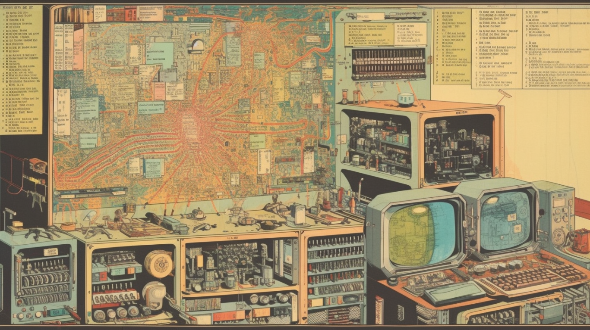

Michael Aird is a senior research manager at [Rethink Priorities](https://www.rethinkpriorities.org/), where he co-leads the Artificial Intelligence Governance and Strategy team alongside Amanda El-Dakhakhni. Before that he conducted nuclear risk research for Rethink Priorities and longtermist macrostrategy research for [Convergence Analysis](https://www.convergenceanalysis.org/), the [Center on Long-Term Risk](https://longtermrisk.org/), and the [Future of Humanity Institute](https://www.fhi.ox.ac.uk/). Before that, he was a teacher and a stand up comedian.

Michael previously spoke to us about impact-driven research on [Episode 52](https://hearthisidea.com/episodes/aird).

*Note: Rethink Priorities is [hiring for a Compute Governance Researcher or Research Assistant](https://careers.rethinkpriorities.org/en/postings/f553d816-53ef-40e6-84bb-257d550ec52b)! Applications close June 12, 2023.*

In this episode we talk about:

* The basic case for working on existential risk from AI
* How to begin figuring out what to do to reduce the risks
  * Is there a 'plan' yet?
  * Are there frameworks we can use to get clearer on paths forward?
  * Threat models for the risks of advanced AI
  * 'Theories of victory' for how the world mitigates the risks
* 'Intermediate goals' in AI governance
  * The results of Rethink Priority's recent [expert survey on intermediate goals](https://forum.effectivealtruism.org/posts/g4fXhiJyj6tdBhuBK/survey-on-intermediate-goals-in-ai-governance)
* What useful (and less useful) research looks like for reducing AI x-risk
* Practical advice for usefully contributing to efforts to reduce existential risk from AI
  * Resources for getting started and finding job openings

## Michael's recommended reading

* [The "most important century" blog post series](https://www.cold-takes.com/most-important-century/) by Holden Karnofsky
  * You can find an audio version at [Cold Takes Audio](https://podcasts.apple.com/us/podcast/cold-takes-audio/id1580097837)
* [The longtermist AI governance landscape: a basic overview](https://forum.effectivealtruism.org/posts/ydpo7LcJWhrr2GJrx/the-longtermist-ai-governance-landscape-a-basic-overview) by Sam Clarke
* [AI Safety Fundamentals](https://aisafetyfundamentals.com/) — [Governance course](https://aisafetyfundamentals.com/ai-governance-curriculum)
* Audio versions of writing on AI governance and related topics can be found at —
  * The [LessWrong Curated Podcast](https://www.lesswrong.com/posts/kDjKF2yFhFEWe4hgC/announcing-the-lesswrong-curated-podcast)
  * The [EA Forum audio feeds](https://forum.effectivealtruism.org/posts/K5Snxo5EhgmwJJjR2/announcing-ea-forum-podcast-audio-narrations-of-ea-forum)
  * The [Nonlinear Library](https://forum.effectivealtruism.org/posts/JTZTBienqWEAjGDRv/listen-to-more-ea-content-with-the-nonlinear-library)

## Further reading

* [Rethink Priorities](https://rethinkpriorities.org/) website
  * Rethink Priority's [survey on intermediate goals in AI governance](https://forum.effectivealtruism.org/posts/g4fXhiJyj6tdBhuBK/survey-on-intermediate-goals-in-ai-governance)
* The [Centre of the Governance of AI](https://www.governance.ai/) (newsletter available on the homepage)
* ['What Failure Looks Like'](https://www.lesswrong.com/posts/HBxe6wdjxK239zajf/what-failure-looks-like) by Paul Christiano
* [Some AI Governance Research Ideas](https://docs.google.com/document/d/13LJhP3ksrcEBKxYFG5GkJaC2UoxHKUYAHCRdRlpePEc/edit#) compiled by Markus Anderljung & Alexis Carlier
* [Strategic Perspectives on Long-term AI Governance](https://forum.effectivealtruism.org/s/xTkejiJHFsidZ9hMo) by Matthijs Maas 
* [Michael's posts on the Effective Altruism Forum](https://forum.effectivealtruism.org/users/michaela) (under the username "MichaelA")
* The [80,000 Hours job board](https://jobs.80000hours.org/)
* EA funding opportunities —
  * [Don’t think, just apply! (usually)](https://forum.effectivealtruism.org/posts/Fahv9knHhPi6pWPEB/don-t-think-just-apply-usually)
  * [List of EA funding opportunities](https://forum.effectivealtruism.org/posts/DqwxrdyQxcMQ8P2rD/list-of-ea-funding-opportunities)
  * [Why YOU should consider applying for funding](https://docs.google.com/presentation/d/1awjq4A-262EzV8BY5IXxnDcaB5oBZCIf7rF4QUXV0T0/edit#slide=id.p)
* The [Rethink Priorities newsletter](https://rethinkpriorities.org/newsletter)
* The [Rethink Priorities tab](https://forum.effectivealtruism.org/topics/rethink-priorities) on the Effective Altruism Forum

## Transcript

### Intro

**Michael 00:06**

Hello. 

**Fin 00:06**

You're listening to hear this idea. And in this episode we spoke with Michael Ed on reducing existential risk from advanced AI. Michael is a senior research manager at Rethink Priorities, where he co leads the rapidly growing artificial intelligence, governance and strategy team alongside a man, Elder Cacni. Now, you might recognize Michael from an episode we did last year on how to do impact driven research. Apparently, nearly 4 hours of Michael Edge content wasn't enough for us. I do think that episode, which is episode 52, complements this one, but also you don't need to have listened to it before hearing this. So this time we begin by talking about the basic case for focusing on reducing existential risk from advanced AI. Why do I think the risk is serious? Why think there are ways to move the needle on it at all? 

**Fin 00:57**

And also what that work can look like in practice. And then we talk about just how to form a plan about what needs to be done to get to an acceptable place with AI risk and different framings that can help with that. So, thinking in terms of threat models, thinking in terms of theories of victory, we also talk about intermediate goals in AI governance, which are like goals on the level of specificity of things like getting better at monitoring large compute clusters globally, or increasing government spending on security features in AI chips. And we got to hear the results of a recent survey on those goals, which Michael helped coordinate. 

**Fin 01:37**

We also talked about just advice for usefully contributing to efforts to reduce existential risk from AI, which kinds of work seem overrated and underrated, and also just practically how to get involved with these things. That plus many more subtopics which I haven't mentioned since. As you might have noticed, this episode is about three and a half hours long. One final thing at the time of recording, Rethink Priorities are currently hiring for a Compute governance researcher or research assistant. And you listeners should consider applying. So here's why. Important computer related policy windows for reducing AI risk are either open now or likely to open soon. Also, Rethink's Compute Governance work is in demand from decision makers at key institutions right now and the team is unusually impact focused and able to just work on whatever actually seems most impactful at a given time. 

**Fin 02:32**

And lastly, Rethink sounds like a generally lovely place to work. So the first stage of the application process should take just an hour or so. The deadline is the 11 June and we'll link to the job ads in the show notes and on our website. Okay, without further ado, here's Michael Ed. All right, Michael Ed, thanks for joining us for a second time. 

**Michael 02:56**

Yeah, thanks for having me. And yeah, I'm happy to be on a second time. I heard recently the Jaime Sevilla episode where you said he was your first return guest. I just missed it. Pretty annoyed at you for that. So there'll be an undertone of anger through the episode, but moving on, the. 

**Luca 03:12**

Shortest gap, I think. 

**Michael 03:13**

Shortest? Okay, yeah, I'll tell him that. 

### What is the Rethink AI Governance and Strategy team working on?

**Fin 03:18**

Okay, so last time you spoke to us, we mostly talked about something like how to do impact oriented research in general and how to eventually get good at it. And now the plan is to focus on a cause area that people could direct that research towards, and that is reducing existential risks from advanced AI. But maybe a question to just start off with is can you just tell us about some things that you and your team are just looking into right now? 

**Michael 03:54**

Yeah, sure. So my team is about eight people, and then there's some people doing some kind of associated work. So I'll try to keep it decently brief, or use a random snapshot or something. But some work we've either done or are doing or are just about to do includes it's pretty disparate. One thing was we had a researcher, Ben Cottier, who looked into the diffusion of large language models and related, he called them artifacts. So I like things that are helpful for developing large language models. So when someone makes an advance in this particular area of AI, how quickly do other actors also make that advance and by what mechanisms and what slows them down and what could slow them down? And this is relevant to the pace of AI progress and how much proliferation there'll be and how many actors will be at the frontier. 

**Michael 04:46**

Another project that we have is just like actually trying to put a bunch of concrete policy ideas that might be helpful for AI risk and might be implementable by the US government in the next five to ten years into one database, which to me sounds like something that is kind of weird hasn't been done. It seems like, well, if you want to do policy stuff, let's just write down all the options somewhere. But this hasn't been done. The field is small enough that no one had gotten to it. And so, yeah, we're getting to it. Another thing is we organized a conference or retreat of like a summit type thing of people working in the AI strategy space, either as researchers or practitioners to discuss things like theories of victory and intermediate goals or this juicy jargon that we'll get to later. 

**Michael 05:31**

We have someone looking into export controls, what will be the effects of the recent export controls that the US did on China. And we have people looking into what is the suite of actions that labs could take to reduce risks from AI that they plausibly could be convinced to take relatively soon and could be really good and trying to package this in a nice presentable format that then can be shared with these people and hopefully influence them, among many other things. Cool. 

### Why focus on existential risk from advanced AI?

**Fin 05:59**

That all sounds extremely interesting. I think a natural place to begin before we talk about how to start working on this thing is to understand the case for focusing on it in the first place. So there are lots of scary problems in the world. Why zoom in on reducing accidental risk from AI? 

**Michael 06:19**

Yeah, so I think it's a great question like why to focus on AI risk people. One should have to make a case. One thing I'll say first is that I don't think everyone should. I think there's like other issues that are about as valuable on the margin, such as existential bio risk, although not many. I do think it's like a decently narrow set. I do think this is like in the top five or so things. And also I should mention that I didn't start out caring about this. I sort of got into caring about impact and others via things like malaria and like extreme poverty and diseases and stuff and then gradually evolved my thinking towards thinking, yes, okay, I guess I should do this. 

**Michael 06:59**

So why I did that here's like a sort of bullet point sketch of why one might care about AI risk or why I argue people should. I won't properly justify any of these claims. I'll point to some sources and just say some things. Firstly, I would claim that very advanced, big deal AI seems very likely possible. There's a variety of terms you could use that are more specific than very advanced, big deal AI. But that's sort of really the thing. It's like some sort of AI system that is powerful enough to be capable enough to have huge impacts on the world. 

**Fin 07:33**

Okay, what kind of a huge impact? I mean, most people are talking about ChatGPT. That's pretty huge, right? 

**Michael 07:39**

That is actually kind of big, but not the scale I'm talking about. It is possible that really clever use of ChatGPTfrom 300 million people who have all gotten used to it or something, maybe that could be a big enough deal, I don't know. But I don't think that's going to happen. People take a long time to get used to a tech. So I'm talking like what I have in mind is something, for example, Holden Konovsky writes about. He calls it pasta. For some reason, it's like a process for automating science and technology. Maybe imagine an AI system that is as skilled as the most skilled researchers and it can do R and D like any given researcher can. And you've trained it. 

**Michael 08:21**

And now that you've trained it, training takes way more hardware and computation than running a single instance. So you can imagine training it to be as good as a human or something takes way more than it takes to sort of run it for a day of thinking like a human. This is very roughly speaking. So now that you've got that, you've got like a crapload of scientists basically that's like one sort of kind of lower bound, perhaps, that could be a super big deal sometimes. People sometimes use a transformative artificial intelligence, which means, like, as impactful on the world, or more than the Industrial Revolution, which very few things have been. It's sort of like the Agricultural Revolution, the Industrial Revolution, that's kind of it. But it can be more as well. And that can include everyone who dies. 

**Michael 09:05**

That's one way to have as big a deal as the Industrial Revolution. Another term people sometimes use is AGI. So, like artificial general intelligence, basically as good as humans at everything, or better at some or many things. 

**Luca 09:16**

So to make sure that I'm understanding this correctly, the key metric or benchmark here is AI coming up with ideas in this sciency flavor and this impacting either economic progress or research more broadly. 

**Michael 09:32**

For now, I want to kind of remain agnostic as to how it will actually happen. And I want to be like that's one example of how you could have a super big deal AI got it. I think it's possible you could have something as good as the best scientists and it not be a super big deal. But I would guess once you have that, it's going to be a super big deal. And now that there's both amazing benefits available and amazing, like, huge dangers. But there's a lot of other ways you could have something that's just really good at hacking, and it could do. And again, you can run insane amounts of them once you've got it. So, yeah, there's a lot of big deal things that could happen then. 

**Michael 10:07**

So first I'm claiming it's just possible to have AI at that level, and I'm not going to properly justify that, but I think just like, I don't know why it wouldn't be one brief case like humans are at that level, like humans did the Industrial Revolution. They managed that impactfulness. They're an arrangement of atoms. You nearly got me. Yeah. So we are just arrangements of atoms. I don't really see why there'd be literally no other way of arranging atoms. Yeah, and I don't really see why it has to be biological and fleshy. 

**Fin 10:41**

I guess a similar example is people couldn't figure out how to make powered flight happen, but they had a pretty good idea that it was possible because there were things flying around called birds. 

**Michael 10:51**

Yeah. And also there's a brief tangent, but it's also worth noting that doesn't mean the way planes work will be like how birds work. So we shouldn't assume and in fact, they're not. Yeah, they're very much aren't. It's possible to get to that level with simpler or different mechanisms. Because one thing we have an advantage over evolution is we are intelligent designers. We can see ahead and be creative and stuff. But anyway, the first claim is just a really big deal. AI seems very likely possible. Then it's not just like some hypothetical Sci-Fi thing. It's not here now. GPT-4 does not count, though. It's somewhat of a big deal. It's, like, impressive and scary, but also multiple groups are actively trying to do really big deal AI. 

**Michael 11:42**

Probably the most notable single one is OpenAI, which did ChatGPT and GPT-4 and the other GPTs. But two other big deal ones are DeepMind and Anthropic. These each see themselves as, like, aiming towards AGI, so they're not just seeing themselves as aiming towards advances in AI. They're like, aiming at something as good as humans, something like that. There's also, obviously, many other AI labs and big tech companies. So there's multiple groups who are actively trying to do this, who are well resourced, who are skilled, who've done other impressive tech things and moved faster than many would have expected. 

**Luca 12:18**

Do you know how much governments count here as being groups that we know are actively working towards this thing? I know that often the US and China get brought up, but I'm curious if. 

**Michael 12:27**

There'S, like, governments there as well. Yeah, so governments are really relevant actors that one should pay attention to. But I don't think my understanding is that they are like, they're not players in building it themselves really in any significant way at the moment. This could change. I would personally like it to not change. It is plausible. It would be great if there's a government lab that's working really intensely on the safety piece specifically. Like, they're working specifically on ways to make sure that if and when you have a given system, it is safe and we can understand it and things like that. But I don't think I want government labs that are actually building it for various reasons. One thing is I just don't want any new lab involved, really. But, yeah, I'm slightly more wary of it being a government one. 

**Michael 13:13**

We can talk about that later if you want. But yeah, one could argue, like, maybe there's something in secret or whatever. I don't think there is. There definitely are government labs working on specific things. I haven't looked into details, but I would imagine there's ones that are using cutting edge or probably a few steps behind cutting edge for specific applications in military logistics or various things like that. 

**Luca 13:36**

Right, so then the key role of governments is regulation subsidies, how they intersect with the labs that you described previously. 

**Michael 13:43**

Lots of roles. I mean, just governments do a crap load of stuff and like, they shouldn't need this. Yeah, we'll get more into this later. But like, my take is just like, this AI thing, quote unquote, is like, I think, the biggest story going on this century. And I think people are increasingly realizing it and they will increasingly realize it. Most people don't really realize it, or they kind of realize it, but it's not salient. And then the next day they go back to reading whatever has popped up on the news and it involves so many actors and so many ways its tentacles all stretch into the world. 

**Michael 14:17**

And so the range of things that are relevant are like regulations, funding, how the military tries to apply things, how government science funding bodies try to apply, things like disinformation campaigns, how you do like education nowadays. Some of these, I don't think are in themselves very important, but the way they might wake up or influence governments and then governments do other things. There's a lot going on. 

**Fin 14:42**

So we have two claims. The first one is that huge AI, you might call it AGI or something else, looks more or less possible, feasible. And the second claim is that there are in fact groups, well capitalized, seemingly pretty skilled groups, explicitly focused on getting to this thing, and they've made a decent amount of progress so far. 

**Michael 15:06**

Yeah, I have in mind like five one sentence bullets. And I claim that it is partly your fault that I'm expanding on them in detail, but it's interesting. I'm happy to point fingers. So, yeah, third claim is like, not just so it's possible to do it, I claim, and multiple groups are actively trying and are making progress. And I think sooner or later one of these groups will probably succeed. So this isn't just like a hypothetical thing that could maybe happen one day, but I think it will happen. I think the single biggest reason it wouldn't is like if something else super awful happens first, like existential biorisk, which I think is unfortunately plausible. So it's plausible you never get to AGI for another bad reason. But another thing I would add is in any really good future, I think we do get AGI. 

### How soon is transformative AI?

**Michael 15:56**

I do think I want us to eventually get it, but I don't think we should be in a rush. Claim four is not just someday. But I think it's plausible that this really big deal thing that's, like, as big a deal as the Industrial Revolution was or bigger and is, like, the most important thing that's happened in any of our lifetimes and maybe for the whole future happens in the next ten years, and I think it's likely in the next 50. And that's like, intense. Like, if true, that's also true. 

**Fin 16:25**

I can imagine that raising eyebrows. Yeah, I mean, why might you think that? 

**Michael 16:29**

So, yeah, I will not adequately justify this and I want to flag that listeners shouldn't. I'm not claiming listeners should be or be convinced by what I say, but I want to note that's in both directions. So people might think actually like, oh, you're just saying plausible in ten and likely in 50. Like, you're really underselling it. And I think that's yeah, I also think, like, sooner is also plausible, but in any case, there's a few justifications. Mostly I'll point to some existing sources so we can put these in the show notes or whatever, and yeah, one is like, there was a literature review of there's been a bunch of research on transformative AI timelines or AGI timelines or various things like that. This is like a very hard thing to research. And so everything is very uncertain. 

**Michael 17:17**

This is why I'm just saying words like plausible, unlikely. My personal best guess is like, roughly 50% chance by 2040. But with a big spread on both sides, I wouldn't be shocked if it happens in five years. I wouldn't be shocked if it happens in 120. Yeah, but there has been a bunch of research. It seems to have decent validity. There was like, a recent literature review that tried to compile a whole bunch of it put weights on different things, like try to check how good the methods are and stuff. And this landed on numbers, kind of like what I'm giving. And it was done by the organization Epoch. And yeah, really nice detail on what sources they're drawing from, why they put the weights on each source that they did and what that amounts to, and a bunch of different methods. 

**Michael 17:58**

So people have tried things like looking at how much computer evolution is used. I won't try to explain what that means. 

**Luca 18:10**

This is the bio anchors report. 

**Michael 18:13**

It was like that. And people can read that if they want that. There's things that are trying to be like there's something called the Semi informative Priors report, which is just trying to be like, basically how long have we been trying and have we succeeded yet? And I think there's like one other parameter. It's trying to be a very outside view, looking from a bird's eye perspective, not trying to be based on specific beliefs. There's also people trying to look at benchmarks and trends of how capable these things are getting and how rapidly. There's also surveys of experts both in the AI risk community and in the just general ML community. 

**Michael 18:48**

And I think so people who've been skeptical so far may want to be convinced, at least by this, which is like, mainstream ML experts, when surveyed, seem to say there's about a 50% chance by about 2060. And this is like a big survey. It was hard to aggregate their forecast. It's like these results are questionable, but they seem to be saying about 2060. When I and a colleague of mine ran a survey of AI risk people, they said 50% of like roughly 2042. Everything, you know, everything needs a lot of caveats. But yeah, I claim it's plausible. 

**Fin 19:25**

Nice. It seems to me like one thing we might be interested to do here is not so much pin down exactly the right median date for some threshold, but more or less to rule out being totally confident that this thing won't come along in the next, let's say, 50 years. 

**Michael 19:44**

Yeah, I think that's roughly true. So I think for the purpose of this conversation, or at least so far in the conversation. Basically, it's like basically what we're aiming at here is, should people see it as plausible that they should focus their careers on AI risk? And for that, I do think it just needs to be like, there's a significantly higher chance that everyone dies from this or something as bad happens than the chance that you get into a car crash. And the chance you get into a car crash is enough to wear a seatbelt. The chance that the whole world gets into a car crash could, like, warrant, like, you spending a career on this. 

**Michael 20:17**

Yeah, I do think when you're actually in the field and again, it doesn't mean that you definitely should work on this, maybe you should also do buy risk or whatever. When you're actually in the field, though, more details than like 50, like median 50 years or median 2040 do matter. They do make a difference to certain interventions. Also, I would flag that this body of evidence does lead to a bunch of different answers. So it's not like everything is pointing to 2040. Yeah, it does kind of feel like it averages to about 2040. And so I believe kind of like 2040 is the 50% chance, but it does say a bunch of different things. And this leaves open the possibility that it's like more than 100 years. 

**Michael 20:57**

But I do think it'll be really weird for someone to be confident, at least without reading the things I mentioned, for someone to be confident that it's more than 100 years away and confident enough that they're like, I definitely shouldn't spend any attention on this. Everything is fine. Another intuition pump or something is just like, just look at GPT-4. That's not the thing I'm talking about. It's not at the level I'm talking about, but it can do pretty weird things if you look at how good GPT-4 is. I don't know, you the listener. If you haven't checked GPT-4, first, try to imagine what you think it would be capable of or like, what you think an AI system today would be capable of. 

**Michael 21:31**

And then watch some demos and then maybe notice, like, okay, yeah, I can imagine this being kind of close to humans in some important way without getting. 

**Luca 21:39**

To specific interventions, as you say. I think there is maybe also an important asymmetry to flag in which shorter timelines are also a bunch more worrying than longer timelines are, in the sense that even if you only put a smaller probability, let's say that something like AGI happens in the next 20 years. Those 20 years are also the exact time horizon where the world would be much less prepared for it than something happened in 120 or even more. 

**Michael 22:06**

Yeah. So there's two things there. One is, like, expected value, like multiplying probability by consequences and stuff. And just like a 1% chance of everybody dying from AI could be enough to spend a lot of energy on it. That's one thing. Another thing is, when you are working on it, should you quote unquote overweight short timelines? And I think you should not like massively, but so I do something kind of like acting as if there's a 50% chance by 2030 because my career matters more in quote unquote, shorter timeline worlds for various reasons. In brief, it's sort of like those worlds are more neglected, there's fewer people who can help with them because there's less time. 

**Michael 22:44**

And also they're probably riskier because, like, just in general, society getting ready for this will happen less, not just like the number of focus people working on. 

**Fin 22:52**

It's quite a nice point in general, that if you're uncertain what world you're in, then if it looks like one of those worlds is a world in which you have much more influence than the other, then in some loosely speaking sense, you should act as if you're in the world where you have more influence or you should overweight that world just on EV terms because that's where you can do the most things. So a non AI specific point, but okay, so we're talking about the case for worrying about AI x risk, starting with the claim that it's possible. Also people are working towards it. Also, it seems like not only is it possible, but it kind of seems pretty plausible within something like ten years, and likely within 50 years, that's where we are. Is there anything else to say? 

**Michael 23:35**

Yes. One final bullet and then we're done with this chunk. That'll be exciting. Thanks, Liz. Finally, this is also you can be skeptical from just what I all say. I believe the existentially catastrophic accident, misuse or other consequences seems plausible if and when we get these systems, especially if it's like within a few decades rather than within centuries. And that is the easiest path to a really big deal. AI seems to be unsafe. So, like, the easiest way of achieving this thing that multiple groups are actively working to achieve and that does bring big economic and various other benefits and will be incentivized to achieve it. I think the easiest way of getting there seems to be unsafe. Like really unsafe, as in everything goes awfully if you don't put it in safeguards. Probably everything goes awfully if you don't put in safeguards. 

**Michael 24:25**

That doesn't mean we're doomed at all because there's a good chance safeguards will be put in either just like by default, because companies are like, well, I don't want to die, or because people like me and there's others, not just me. Yeah, unfortunately there's about 100 or like 400 ish will work on that. So we could be okay, but we need to do something. It's not like we just get lucky, I claim. 

**Luca 24:51**

Can you spell out a bit more with what you mean by the easiest path? In my mind, what I'm kind of imagining is something like ChatGPT, but for a computer. Is that roughly right? 

**Michael 25:03**

To a decent extent, yeah. One thing I'll flag is that I am not a technical AI expert. It's also debatable whether I'm even an AI governance expert because AI governance is like a huge field, there's so much to it, so I'm pretty generalist. So I know a little bit about loads, but not really deep on anything. So I don't know if I'll explain this properly, but there's a really great post, I think it seems really great to me, by Jaya Katra called without specific countermeasures, the easiest path to transformative AI likely leads to AI takeover. I think this articulates the case quite well. My attempted recollection of it is basically like if your goal is to get something that is about as good as humans across a bunch of economically profitable tasks, then what you can do is train it in a similar way. 

**Michael 25:53**

To what we've done with the GPTs, where you just have you just train a really big model with a lot of compute and a lot of data, and you give it feedback on how it's doing to try to steer it towards the right actions, then it could be really unsafe by default for reasons including that at the final stage, it's being trained in a sort of reinforcement learning way from human feedback. And that means that if the human thinks it's doing a good job versus a bad job, like a good answer versus a bad answer, the human will reward the good answer. Sometimes humans are wrong. 

**Michael 26:33**

And so the AI could be incentivized to be deceptive, to sometimes tell the like eventually it realizes once it's smart enough and you want it to be smart because you want to do the economically profitable things once it's smart enough to sort of understand the situation it's in, once it's situationally aware and it's like I am an AI system. I'm on these computers. I have these humans, like, training me. It will then sometimes notice, like, oh, well, Finn thinks the correct answer is X. I know the correct answer is Y. Finn doesn't like it if I say Y, I can't convince Finn on this point. Finn's very stubborn and rigid, so I'm going to tell Finn X. And then Finn's like, oh, great. And so now you've trained a system to like, undermine and deceive you, basically. And that doesn't seem great. Yeah. 

**Fin 27:17**

And I mean, maybe just to try saying that back when you're doing this thing which is giving human feedback to a system which is or is soon to become to outclass you in various ways, including being pretty good. At deceiving you, then it's quite hard to figure out how to incentivize the thing you in some sense just want it to do, which is be well behaved and match what I have in mind without also incentivizing or in some sense accidentally training it to just deceive me. 

**Michael 27:51**

That. 

**Fin 27:51**

It's doing the right things. And then if it's reasoning that the thing, in some sense, in hand wavy terms, it ultimately wants, is to do those things which would have got the most reward during training, well, that includes things like massive deception and takeover, specifically. 

**Michael 28:11**

Because sometimes you'll hold it back from doing whatever the thing that gets the most reward is. And so the single best way for it to avoid that is takeover. And I think it's worth it. So this can all sound like there is this AI that has evil and malevolence in it, and this is like assuming some sort of consciousness or a soul or something like that. That's like a super iclane. That's really not what's going on here. I think we can say it and, like, very mechanistic to them. So, like, deceive sounds very loaded, but maybe the better way of saying it is, like, it predicts that it correctly predicts that if it says X, it will be I don't know which one I said before, but if it says, like, bacon, then it will be given negative reward and be told, like, that is incorrect. 

**Michael 28:54**

And if it says, like, omelets, then it'll be told, like, yes, correct. Good job. It also knows that omelets are the correct answer. And so now it starts to predict that sometimes what will get rewarded is not saying the correct answer, but rather spending some cognitive energy on figuring out what Finn thinks is correct and what Finn will reward. So that doesn't require any sort of evil or anything. It doesn't require any emotions involved. It's just simply it's the same as predicting that this tree is where the apples grow, or predicting, like, if I reach my hand into this box, sometimes there's toys in there or something. 

**Fin 29:30**

Yeah, I think it's a nice point that some people might read stories like these. Like the one you're pointing to, J root is trying to imagine worlds where at some point in the future, the terminator comes online and the red eyes start glowing and it develops some kind of malevolent consciousness and it wants to break free. But really what's going on is just extrapolating a fairly kind of mechanistic story, which we already have toy examples of and kind of drops out quite quickly of just the things that are in front of us right now. But okay, so here's a thing that I might also think we're talking about the default or the easiest path leading to something really bad without specific safeguards. 

### Won't everyone care enough for this not to be a problem?

**Fin 30:21**

But if I'm a company, if I'm a lab building this AI and I want to remain profitable, then I'm going to care about building in these safeguards. Right. Like, I don't want my system to just immediately go haywire and then I'll just lose out. So doesn't the default path just involve all the labs, like, caring enough for this not to be a problem? 

**Michael 30:41**

Yeah. So the way that Ajaya and I are trying to define or a Jr is, and then I'm copying define default path is specifically to rule that out. So I think she describes it as like she makes three assumptions. One of them is like, they continue racing forward in the way they currently are, as in just like, trying to make progress quite rapidly. Another is that they do a naive safety effort where they basically try to avoid the issues that are pretty easily discernible and they're not paying a lot of attention to things like could there be deception, but it can just be mechanistic. And there's another assumption that maybe I've blended in, but I can't remember it. So we're defining that as like, yeah, that is what we're defining as default. 

**Michael 31:27**

You could just believe that in reality, that's not what's going to happen. They aren't going to race forward. They're going to slow down. This could be because governments force them to slow down. It could be because they themselves realize they want to slow down. It could be because they do some pact between the labs, like there's some sort of coordination. It could be because all the ML researchers boycott this progress because they realize it's worrying. It could be that the chip companies that are selling them the hardware they use, like, boycott sales to them, there's a bunch of ways it could go well. I think it would be crazy to think that there's like, a greater than 99% chance that it goes well if not for some people, like, making this their goal. And I think that's sufficient. 

**Michael 32:09**

So I think I would see these more as, like, levers that can be pulled that are maybe why we can be okay rather than reasons to just be like, oh, cool. It is a little bit of a reason to be like, oh, cool. If all of those things definitely wouldn't happen at all in the mainline world without our work, then I'd be like, okay, all the bio people, please come over here. This is even more on fire than I thought, but it's on fire enough to have some work on it. Yeah. Also, it's just the case that there will be significant advantages to moving fast on AI. And it will be significantly incentivized both for the host country to be like, ahead and for the individual companies. 

**Michael 32:49**

And I hope that they will realize that's bad for the world and in some sense bad for them. But there can be scenarios in which it is best for them because most of the problem is externalities. It's like everyone else can die or have a horrible future or whatever, and also the whole future can be lost. So almost all the loss is not to this CEO or to this company. 

**Luca 33:08**

So I guess I have one kind of conceptual confusion there, which is that as long as the CEO also dies, why does it matter that the externality exists or something. So as long as the CEO has, like, I 100% don't want to die, does it really matter that they don't also internalize, like, other people dying and stuff? 

**Michael 33:25**

Yeah, climate change is one example. Everyone who is making climate change worse themselves, not everyone, but a bunch of themselves in expectation also suffer. 

**Luca 33:39**

But I can imagine the distinction with climate change is most of the bad things happen after the CEO has died or something, and they might care to some fraction that their children or their children's children die, but they don't internalize that pain as fully themselves. Versus if you're saying no, that CEO might also die within 1020 years whilst they're still alive, I could imagine, yeah. 

**Michael 34:00**

Okay, I think the climate change analogy works, but I'll instead just give it like a toy model. So imagine that I am company A, and if I develop it faster, then I get a bunch of money and existential risk goes up 1%. If I wait, then it just goes down by 1%. There can be scenarios in which you care enough about the profits that you're willing to pay some risk. The key thing is doing the risky action doesn't flip the risk from zero to 100% that you die. It flips the risk by some bounded, finite amount, expected amount. And there can be cases in which the gains to you are large enough from your perspective that you're willing to pay that risk. And you wouldn't be willing to pay that risk if you, like, cared about the whole world or about the whole future. 

**Michael 34:48**

But you are willing to pay that risk if you just care about you or your company or your country. 

**Fin 34:52**

It's a public bed, right? So maybe it's useful to think about the individual case. If I'm like an engineer and I'm considering whether to join a lab or do something which is benign from the perspective of x risk, then my reasoning is okay, if I join this lab, then sure, maybe I will increase. Overall external risk from AI this century by, like, Epsilon. But also I would make a lot of money and I'd probably, like, find it really interesting and really develop my career. And I'm kind of altruistic. But I do also care about being able to have a nice life and look after my family and stuff. So on balance, I'm going to take the job even though I'm pretty altruistic. But if lots of people do that. 

**Michael 35:32**

Then as long as there is some. 

**Luca 35:34**

Risk of whoever is dying, then shouldn't they fully internalize that as well? Because as long as they die, they really want to avoid that scenario at all costs. But I think a core intuition here is that people trade off some risk of them dying all the time. For example, people drive in cars and you can do some things that cheaply lower those risks, but the risks are never non zero. If you drive in a car, even if you wear a seatbelt, you're still gambling some positive trade off, like, I get to go to a job where I make some money and maybe I end up dying. But the key distinction here is that you're not just gambling with your own life, you're gambling with a bunch of other people's lives. And you're not internalizing that thing fully. 

**Luca 36:13**

Similarly to when I drive, I'm making a choice between I might die, but I'm okay with that because I need to get on with my everyday life, but I'm not necessarily fully internalizing. Also, oh, I might crash this car and kill somebody else. And here we're speaking about killing potentially a lot of other people. 

**Michael 36:27**

Yeah, that's a good analogy. There's also the extent to which, well, if I don't do this, the other company might anyway. So they're both trapped in it, both actors. If either of them stepped away, still, a bad thing can happen unless there's some way of coordinating. And furthermore, I think just a lot of people just haven't looked at the empirical case for being worried. So some of this is not just about altruism or values, but I claim facts about the world that some people either haven't explicitly noticed or haven't emotionally internalized. I claim one can make counterarguments to everything I've said. I believe you'll have an episode coming up later on counterarguments. So for now, I'm just going to say my thing. 

**Luca 37:10**

So, so far we've been talking about, I think, AI risk in a mostly, like, technical, like safety lens of look, these systems might be misaligned with the user's goals, but you could also imagine that even if AI is aligned, we still have existential risk left over. Because what are those users going to tell their AI to do? And the AI is going to align itself and do that thing. Can you? Very briefly, there's no need to go into a huge amount of detail here, but list out some of the threats there and how you think about it. 

**Michael 37:36**

Yeah, that's a good question. A good point. So my claim five, if I'm counting right, was like, an extensively catastrophic accident or misuse or other seems plausible. And so we've talked about the sort of, like, technical misalignment that is often called accident risk. It's like no human in particular is doing something. Like something goes wrong with the system. It's slightly weird to call it an accident because maybe the system is kind of being deliberate, but yeah, it's an accident from the spectrum of humans. It's useful. There's a term intent alignment, which is like an AI system being trying to do what its operator wants it to do. So it may fail, but it's trying, but it's aligned to specifically just its operator's intentions. So this is different from, like, it is aligned with the interests of all of humanity. 

**Michael 38:25**

So you definitely can have it like it's totally plausible. You could have an intent-aligned AI system that doesn't do a proactive AI directed AI takeover but still does horrible things with the future because it's like an operator asks it to, basically. But also there's weird things. There's this post by Paul Cristiano called what Failure Looks Like. It's slightly hard to summarize or whatever, but there's this other category often called structural risks. And there's various other things that are kind of in that bucket. You can sort of imagine like, okay, what if the world is full of all the existing institutions and people and loads of them have AI assistants and helpers and they're making everything run better and faster. 

**Michael 39:12**

And it's also more complicated and intricate in the same way as the finance industry or the computer supply chain are very complicated interlocking beasts that I hardly understand. And I'm just like, well, I hope all that money is real. I hope this all makes sense and these numbers mean something and everyone's doing their job right, but I don't really know. And if you imagine there's a huge number of AI systems being assistants to various different people, creating new systems, like new financial systems or whatever, you might eventually have a thing where what we think the world isn't really what it is. And we don't really have control. Not because any specific systems have taken over, but just because it's too complicated and fast moving for us to understand it. And it's now just kind of like in the pursuit of randomness or efficiency. 

**Michael 39:53**

The end result is just like, it's not awful, but it's not good. But that's hard to explain. So we can move on. I think to some extent, for now, we should sort of kind of mostly focus on the accident risk because that's to some extent the first problem. This is debatable and complicated, but to some extent the thing where getting the AI system to actually want to do what at least one human wants to do is like the first way it can all go wrong, kind of. But then I do think there's a lot of other stuff to do. And this is also part of why governance matters a bunch. Governance can help with accident stuff, but is also going to be really important for the misuse, et cetera. Yeah, we'll talk about what governance is in a second. 

**Michael 40:31**

But it's not just like governments, it's like everything other than making a good system. Everything about how it's used and how society's arranged. 

**Fin 40:38**

Yeah, maybe to say that back, you might think, look, it's worth worrying about people deliberately and successfully misusing powerful AI systems only once. It's possible to deliberately and successfully use AI systems, powerful AI systems, to do things that you want them to do for sufficient power. So you kind of need to solve the first thing before it's worth focusing entirely on the second thing. And maybe there is more than a second thing. There are lots of worries about AI, but we have this kind of fairly central primary worry, which is just like it would be nice if we could get these powerful systems to do what we want them to do in the first place. Especially given that not doing what we want them to do could be catastrophically bad to some extent. 

**Michael 41:21**

I do think we should spend some of our energy on the misuse and other stuff already, but yeah, to some extent, sure. 

### Is it possible to reduce existential risk from AI in a deliberate way?

**Fin 41:27**

Okay, so we have been talking about reasons to think that there are large risks, potentially existential risks from advanced AI. But ultimately, we'll be talking about how you might do things to reduce that risk, which raises the question of whether there is a case of thinking that it's possible to deliberately reduce the risks from AI. The existential risks. So why should someone think that? 

**Michael 42:01**

I kind of feel like the starting point should be that the first few hundred people at least, who are like, really actively trying to make this stuff go better can, in expectation, do a decent amount to make this stuff go better if they do their job well. It would be weird if there was nothing one could do. This is partly related to the timelines thing, so like, this would be less true if, like, our best guess is this is 500 years away. I think even then there's still some stuff you could do. But I think if my best guess was 500 years away, I would probably be working on nuclear risk or nanotechnology or biotech risk. 

**Michael 42:38**

But given that this thing seems like it could plausibly come in the next ten years, probably, in my opinion, or like 50 ish in 20 right now. So one way of answering this is just like a big list of things one could kind of do. Sure. And we'll get more into that later. But briefly, it's things like, well, there's these labs doing a bunch of AI stuff, like, can we change how they do AI stuff so that it goes better? These governments who are doing some regulation could do some regulation. They're also doing things like export controls to like well, why they're doing it, I'm not entirely sure. But one consequence is it reduces the proliferation of advanced AI chips and therefore reduces the number of actors who can do cutting edge development using their own chips that they own. 

**Michael 43:24**

Just recently, in the last few months, there's been a lot more public awareness to this stuff than there used to be. I think especially sparked by ChatGPT and then recently GPT-4, so that there's already public discussions and people are already starting to form views. And so it seems like already you can start doing things to try to figure out what is the nature of this risk, what can be done, and then try to gain the influence and ability to intervene on it. That's like one angle of answering. Another angle of answering is like, man, there's only a few hundred people working on this really, who are focused on so this being the best estimates I've seen, though, they're very rough and it's hard to even define the question. 

**Michael 44:02**

But the best estimates I've seen are something like there's roughly 100 people professionally working on things related to AI governance, either research or practitioners who are motivated by external risk type concerns, and roughly 300 who like the same thing, but for technical AI safety. So like 400 ish total real small for the size of the problem. There's enough for us to do. When you're actually in the field, you're like, oh crap, there's a lot that's on fire. I'm very busy. Feels like there's a lot to do. You could still ask whether any given thing is good. I think some things that people are working on are either pointless or slightly net negative or whatever. So it's not like it's just easy. But there's stuff to do. Yeah. And to be clear, there's definitely more than 400 people doing relevant work. 

**Michael 44:57**

But like the set of people, I claim that it matters whether you're focused on the accenture risk thing, that makes some difference to what types of actions you focus on. 

**Luca 45:06**

One dynamic I've heard, which I'd be curious to hear your reaction to, is that there seems to be an important insight that we can kind of rule out or have strong reason to think that the risk of doom isn't zero and the risk of doom also isn't 100%. We can kind of tell stories of how this thing goes well and we can kind of tell stories of how this thing doesn't go well and things seem plausible. And there seems to be like enough messiness in between that this actually means that this is something that we can affect. It's not as if things are overdetermined to go well or that things are over determined to go wrong. So now, on the margin, it's really valuable to intervene here. 

**Luca 45:45**

One way to formalize that is to kind of imagine a logistics or kind of S curve. And it's saying that, look, we're not at the very top of it where everything is already solved and neither are we at the very bottom of it where everything is doomed. We're in that middle bit where it is really valuable to double how many people are working on this. Or to get an extra person. Not just the most talented, exceptional, single galaxy Brain person, but just like everyday people as well. There is just like a ton to do here. 

**Michael 46:11**

Even in the penultimate or like third to last panel of the Galaxy Brain meme, these people can still help. Could you be just the glowing blue guy or whatever. I know, pop culture. Yeah, I think I kind of agree. So one thing I will say is that I think this is kind of overlapping with my prior response. But yeah, I think that this whole AI risk thing would essentially definitely go awfully if no one worked on it ever and essentially definitely go well if the whole world oriented to like, okay, this is top priority until we solve this, everything else waits and you still have teachers and farmers and stuff because you need them. This would be a very weird world, but it'll be like, this is like the top priority and all the supportive things to make this work in those two extremes. 

**Michael 46:59**

It's going to be like, we all die or something else really bad happens. I use we all die as a shorthand, but there's like a lot of other things or it goes amazing in the world we're in. It's like there's like a few hundred people who are focused on it and then a bunch of other people doing relevant stuff. Some of the relevant stuff is net negative because people are like working in the general area but without the same goals. And so then they can do things like just in the US as a national security interest and that can be harmful for the world or whatever. And so it seems like in the spot we're in. Also, though, I do think the amount of work is going to increase. 

**Michael 47:33**

So I do think that as we get closer to the end times, for better or worse to be a bit biblical, people are going to increasingly notice and there is going to be increasing sensibleness at labs, probably. There's also going to be increasing pressure to be like, oh man, if we're one step from a lot of good reach now, yes, but I think there'll probably be more sensibleness. But is it going to be enough? I really don't know. And it seems to me that we are kind of in that middle, that broad middle region of the logistics success curve, as Ellie Aziadkowski puts it. He thinks we're in the bottom there. 

**Michael 48:08**

We can use the term and I claim we're probably in the broad middle, but one pushback on that and a pushback on my work is you said that it will be weird to think we're super close to 0% or 100% risk currently. You can tell stories where we could be closer to either end. I think that's true. But part of that is just uncertainty about latent variables of the world already. It's not uncertainty about what happens in five years because of us. It's not uncertainty about do I manage to make the right choice or not. My personal risk level belief is something kind of like 25%, but I don't put much weight on that and I haven't thought about it that much and it's mostly based on deference. 

**Michael 48:53**

So I'm something like in the next hundred years, about a 25% chance of external catastrophe due to AI. But that is composed of a decent probability that we're already in a world where it's pretty much going to go fine. Maybe because a lot of the public wakes up in a sensible way and they do a bunch of good stuff or maybe the ML community or whatever and a decent fraction of like close to 100% risk worlds, a decent fraction. I think it's sort of a portfolio of possible worlds we could be in already, could be latently the case, and it's just hard to observe where it could turn out that it's already the case. 

**Michael 49:25**

That alignment is really hard to do, and that US-China relations are going to get much worse over the next ten years, and there's not much that can be done about that. So this pushes against working on II risk it might also push this is also relevant to bio risk. This is relevant to many things. When it looks like there's a decent chance it goes well or poorly, that doesn't just mean everything hangs in the balance and you can help it could mean it's kind of overdetermined, but still. All that said, right, I think this is super important and I do think in expectation we can do a lot. 

**Luca 49:55**

So just to maybe repeat back or understand, it could be that AI risk is 50%, but if there's nothing that we can do to change that 50% then it doesn't matter that happens to be in between zero and 100%. 

**Michael 50:06**

The 50% could be made of like in the extreme case it could be 50% chance it all goes awfully because it could already be the case that OpenAI have this model and they're just about to release it tomorrow and it's going to kill everyone. Or it could be that they've got the aligned model and it's also going to solve all the problems and release it tomorrow and that would just be revealed tomorrow and there's nothing to do. 

**Luca 50:25**

So I get that leads to one other objection which I hear about why even if AI X risk is super important and could be influenced, why that maybe shouldn't mean that you should work on it. And that is just that it is really hard to know what kind of an impact you're having importantly on whether you're having a positive impact or a negative impact. So it's best to just stay away and not do anything there. And that even if you spend a lot of time reflecting on what maybe your sign uncertainty is, that's not going to attractively lead anywhere. So it's best to just let sleeping dragons lie or let somebody else do it. Is there anything you have to that objection? Then maybe we can engage with it more on the object level as well. 

**Luca 51:08**

But I'm curious about the framing of career advice, what do you think there? 

**Michael 51:12**

Yeah, I think that is something close to that is a super important point and that precisely the precise thing you said is a very stupid thing, which I'm not pointing finger at you I'm just raising. 

**Fin 51:30**

The message. 

**Michael 51:31**

And also, I don't mean people who believe it are stupid. I think this is really commonly believed. I say stupid because I don't know, hot takes the phone on podcasts and because I do think it's really important. The incorrectness of this is really important and it generalizes beyond AI. So I think it is absolutely the case that if you're like, oh crap, AI risk is a big deal, I'm going to dive in and just swing about wildly in the vicinity of important variables. I'm not very chuffed about that. This has been done to some extent and has gone badly. Sometimes there are people who've heard about AI risk and they've like, so if someone's like, what am I going to do with my career? I haven't heard of AI risk. I guess I'm going to be an optometrist or something. 

**Michael 52:16**

There's not much of a way they can make AI Risk way worse. How they do their job isn't going to affect things. So the closer you are to the important problem, the more scope there is. I'm saying it's the most important story going on this century. The closer you are to the heart of that story, the more chance there is that random action can make things worse. And I do think what we're trying to do here is kind of fragile or something. Like there's kind of a narrow target we want to hit. So I do want people to be very thoughtful and sensible. All that said, this is a reason to be very careful. I think it would be kind of crazy to be like, this area is an area where it would be easy to do harm. 

**Michael 52:54**

If you first believe that existential risk or the long term future are hugely important, like these things going right are hugely important, and then you think, oh, but it's very hard to know what the best thing to do is. It'll be very weird to then turn from that to, I'm going to not work on existential risk or long term stuff at all. It'll be reasonable to be like, okay, then I'm going to do bio stuff because the story is clear or there. Or then I'm going to do nuclear stuff because the story is clearer there. Or then I'm going to go and improve institutions in general, but in a way that's decently targeted at what's the long term future. It would also be reasonably like, therefore, I'm not going to do any object level, like direct action AI work. 

**Michael 53:33**

I'm instead going to just work on research and try to figure out what's good to do. But it'd be very weird to be like, well, I'm not going to spend five years trying to figure out what's good to do. I'm going to assume that no effort can figure out what's good to do. I'm just going to walk away to something that I think is vastly less important. This is also. An objection to long termism in general. And I think the strongest alternative and long termism is this idea of trying to do what's a key moral priority doesn't mean. All of your energy has to focus on it. 

**Michael 53:58**

You can still have a dog and go for nice walks and stuff, but to the extent that you're trying to do moral things for the world, the key priority is to help the long term future go really well. I think the best alternative to long termism is that it's too hard to know what's good for the long term future. Therefore let's do a crapload of research and thinking to figure that out. And it'll be very weird to be like this when we've only been trying for something like, I don't know, 200 person year equivalents. Like it's pretty small. It's way smaller than most scientific fields. Like the effort that's gone into trying to figure out what's good for the long term future focused on that goal. I'm just going to stop. Well, definitely we can't do it. It absolutely failed. 

**Michael 54:40**

It seems to me like not much has been tried and success has occurred. We've made some progress in trying to think about this but I'm sympathetic to being careful and to focusing mostly on research rather than action for now. I'm sympathetic to that. 

**Luca 54:52**

I really like that response. And I think it is useful to just point out that I think the argument relies on a super counterintuitive and kind of crazy seeming thing, which, as you say, is, look, there's this thing that I agree is the most important thing going on right now, but I don't want to do it or do anything that's vaguely related to it. I agree that just seems like from an outside perspective, like insane galaxy brained reasoning. And then I think you point to two heuristics which I think are really interesting and worth keeping in mind. 

**Luca 55:21**

One of them, as you say, is look, it's really important to know that what we're doing here is fragile and to be reflective and that can maybe cash out into a heuristic on how risk averse you want to be knowing that you are very uncertain about things. So if you have an action which, on prize seems like it's like 51% likely to do good and 49% likely to do bad, should you go ahead and take that positive EV bet, or should you reflect more or have a general thing of like, no, I'm only doing bets where I'm much more certain than what I'm doing? Is it robust? And yeah, I think that's a really useful heuristic even if you're in this. 

**Michael 55:57**

World to keep in mind. 

**Fin 55:59**

Maybe the way I say all this back is that it is reasonable and probably accurate to think that in areas like this in general, when you're doing big consequential things, it tends to be easier to break things than to fix them or to do some amount of harm than to make serious progress. But one of the things you can do is just research. And if you do careful, good faith, well communicated research, it's a lot harder to think about how you might do, like, significant harm there. Which isn't to say that the only thing people should be doing is research, like, obviously not, but in terms of just demonstrating that there are useful things to do, even if you're worried about the fragility of the whole space, here's the thing. 

**Michael 56:47**

Yeah, so I think maybe the motto of this episode will be like, that's roughly right, but it's complicated or something because I think this space is complicated. So I think that's roughly right, but it's complicated. One thing is I kind of feel like it's true that this space is narrow and our goal is a narrow target and the space is fragile and it's easier to do harm than good. But I don't really know why it should be the case that it's easier to do harm than good. And so I'm a bit worried that my reasoning is flawed there. 

**Michael 57:20**

But it appears to me like when I look at a bunch of specific object level examples, it does seem like I also do some grant making and stuff, and so I'm looking at that and I also advise a bunch of projects and researchers and stuff both@my.org and elsewhere. And it does feel like very often something feels like it could easily be net harmful. And it does feel like a bunch of people entering the field and swinging around wildly can be net harmful. I'm not I'm not really sure if there's a systematic reason why that's the case. 

**Michael 57:48**

It might be instead that it's like 20% of the time it's harmful and that's enough that I really want people to pay attention rather than if you don't think I'm saying if you don't think really hard, maybe it's only a 20% chance they make things worse, but that's enough that thinking really hard is super worthwhile. I'm not really sure. I just want to flag uncertainty. Another thing is I think oh, yeah, okay, related point, because I was just thinking while you were asking maybe the reason is that I believe the risk is below 50%. And I think the real picture is complicated, but there's some naive first pass answer of like, well, as it stands, odds are things go okay that I'm not satisfied with, that I don't want. Odds are I don't want a quarter chance that everything's awful forever. 

**Michael 58:29**

But that means that if you just do a purely random thing, maybe it's more likely to harm than help. Other people, though, believe the odds are close, like they're on the 100% side of 50%. Then you might have different views. I think in reality it would be a lot more complicated, but maybe that's part of what's going on in any case, is whether it's easier to do harm than good. I do want people to think because it is decently easy to do harm, it's at least decently easy. Please think carefully. Yeah. 

**Luca 58:54**

There's definitely something here as well which feels emotionally very true or resonates, which is that I think when I think about my own career or, like, my own impact, I have this incredible aversion towards having a negative effect. Myself and having maybe a bias here or a drive to really not want to be anything that I do is negative. But that's distinctively different from thinking about what's best for the world or best on a community level. Or something in terms of what people are doing that I might want to be way more than, like, 50% or even, like, 80% certain that I'm having a net positive impact, but maybe from an optimal strategy or something. That's not what everybody should be focusing on. 

**Michael 59:39**

Yeah. So basically, I think some people are in some sense too wary of the downside risk and some people aren't wary enough. They don't really want to, like, community wide, just be like, everyone, slow down, be more careful. Because some people are being too slow and too careful. Some people, often those are researchers. But I also don't want to be like everyone like, oh, crap, everything's on fire. Move fast in any direction you think is best. Yeah. I think different things are better for different people and to some extent the sort of people who are inclined to a sort of role, like actually being in policy or actually building institutions. I think on average I would like them to be a bit more cautious, although there's exceptions. 

**Michael 01:00:19**

And then people who are in research roles, I think, like I don't know if I believe the opposite in that case, but yeah, think in your specific case what seems best to you and talk to a bunch of people. One thing, like last thing, is something called the Unilateralist Curse. There's a decently long paper on this. But I think the core idea is, if I recall correctly, pretty much just if you imagine there's like ten people, imagine they're all altruistic and they're all trying to figure out is doing Action A good and on average they think it's not. But there's some noise, as in they're all making some degree of error in their prediction of whether action A is good and action A is something where if it's bad, doing it once is as bad as doing it ten times. 

**Michael 01:01:04**

For example, like publishing the code for smallpox or whatever. Like publishing the sequences for smallpox spoiling. 

**Fin 01:01:11**

A movie to someone. 

**Michael 01:01:12**

Yeah. Then it's fairly likely that at least one of them does the bad thing. Like if on average they think it's bad, but not by an insanely huge margin, then just due to noise, one of them will be above the line. And if they don't talk to the other ones and they don't think about the unilateral curse. They'll be like, well, it seems to me that's good. And so the other nine would have yelled at them, like, please know. Yeah. And the solution to this is fairly simple. It's basically a, think about the last minute of things I said? Head just like, bear that in mind now and then, especially if you're doing something where it's hard to reverse and it's like a once off, like publishing some big splashy paper. Being like AGI is a huge deal. 

**Michael 01:01:48**

I think that could be pretty bad. And like, one person doing it could be pretty bad. It's complicated. It depends on how you do it. And B, just talk to people, like, talk to other people who you think are the kinds of people who could take this action or who might have thoughts on this action. Try to include in that set people who are often worried about stuff. So don't be like, I'm a policy person. I'm only going to talk to the other people who are also pushing concrete policies right now in big ways. Also talk to some of the people who chose not to go into policy because they're a bit scared of doing stuff right now. They might not be right, but it's good to sample their views. 

**Luca 01:02:18**

One last crux I'm interested in here as well is there seems to be an assumption that reflecting on things and thinking more about things will lead you to tangibly better conclusions. If I'm, like, slightly uncertain about something initially, then spending weeks or months really researching this question will lead me to a better conclusion. That also feels like a claim. Is there, like, evidence for that? Consistently leading to better decisions, especially in the field that feels messy and complicated and abstract? 

**Michael 01:02:53**

Yeah. So first, I guess just flagging sign uncertainty is like when you think it could be you're not just uncertain, like how good, but it could be good, it could be bad, it could be net harmful for the world. I agree with the claim that it is a claim, but I think it's just like kind of obviously at least kind of true or like we should have a strong prior that on average, thinking more and doing research will an expectation help more than harm and it will help, like, a nontrivial amount. It'll be kind of weird to think that decently, well executed research or reflection should be expected to have absolutely no benefit to your quality of conclusions. I do think there's a big question one can ask about how big is the benefit? 

**Luca 01:03:43**

More particularly, when do we get sufficient diminishing returns to stop thinking and start doing things? 

**Michael 01:03:50**

Yeah. So I think it wouldn't be crazy to think, okay, nowadays we have about as like, we're not going to get way more clarity and things are urgent. I think the case for not doing much research, a key plank would be things are urgent. It wouldn't just be like, the research won't help much. It would be like on the margin, the research. This is a case one can make. It's not my case. I lead a research team. So one could claim that on the margin, the research isn't going to help that much because this stuff is really hard to research. It's about very complicated, interlocking, interdisciplinary things that are happening decently far into the future. And there's a lot of action happening right now by people like, okay, sure, you want to keep your hands clean. You don't want to do a bad policy. 

**Michael 01:04:35**

But there's people right now pushing policy and they aren't thinking at all about this. And so if all of the people who are like, oh, the unilecrous curse is a big deal all therefore step back, then the only people doing things are the systematically less cautious people. And there might be things like we might have some best guesses. So it's not just to preempt bad ideas. It's also to like, we do have some best guesses and some things take a long time. So we can't just wait until we've figured out a lot more clarity in five years. Maybe there's like some treaty that we want to start moving towards having set up now. Maybe there's some government agency we want to move towards starting now. Maybe there's norms and safety culture we want to spread in the machine learning community. 

**Michael 01:05:15**

And that sort of thing takes a long time. That's reasonable. I think for that reason, people should be spending, like, the community a decent chunk of its portfolio should be action. Another reason is that I think the relevant distinction is like actions taken for the purpose of sort of quote, unquote, directly influencing the world rather than for figuring out what to do later, versus actions taken for strategic clarity purposes to help us figure out what to do, not research versus direct action. Direct action is also a way to get strategic clarity in some ways, like actually trying to push some policies and having people actually in government or in labs trying to influence people because you're. 

**Luca 01:05:58**

Learning about the world and your actions as a result. 

**Michael 01:06:01**

Yeah, so these people, by being in this, they don't have to take actions, but just by being institutions, they're learning how the institutions work. And a key reason I'm uncertain how the IRS is going to go is I don't have a detailed sense of how the US. Government chooses things and works on it. I've got an okay sense. I talked to lots of people. But if I'd actually worked in the US. Government for three years in a relevant agency, that would help. That doesn't require actually doing important things. You have to be there, but you might as well do things while you're there. And the other thing is, yes, you get the feedback loops. 

**Michael 01:06:29**

You're like, okay, well, one thing I don't know about is like, would policy people find this idea I'm pushing vaguely reasonable, like vaguely reasonable enough that I could imagine in three years when I have a stronger case, they will go for it. If not, then there's no point researching how good this would be because it's just not going to happen. And I can find that out by trying to push early versions. So, yeah, I definitely think we should be doing some action, both because some things are urgent and take a long time to set up and because we have some decent best guesses, which we'll get into later, we'll finally get to object level. And because you learn one way you get clarity is by taking actions. But still the other motto of the show is like, but also be careful. 

### Is it more dangerous to be overconfident or underconfident on AI risk ideas?

**Fin 01:07:11**

We've been alluding to various downside risks of just trying to kind of get involved and swing around and try to do useful things in this general area of reducing external risk from AI. But I think it'd be useful to talk about what those risks are more concretely. So did he have particular things in mind? 

**Michael 01:07:32**

Yeah, that makes sense. I shouldn't just be like some mysterious man, like be wary. The downside risk. Yeah. I have in mind approximately seven. I think they're each one sentence. Let's see how fast we can do it. 

**Fin 01:07:47**

BuzzFeed style. 

**Michael 01:07:48**

Yeah. Top seven dancers to avoid that could kill everyone. Yeah. Which one are you? So the first one is locking in bad policies. This is no particular order, this is just like, yeah, I made a doc because I kept wanting to tell people this and yeah, this is the order that it happens to be in the doc. So number one is locking in bad policies. So I've said a lot in this interview. It's a bit misleading in the exact same way that governance is, because I don't just mean government policy, I mean sort of like an action that some actor sort of commits to in some way. So this can also be like a lab having an internal policy of how it does things or whatever. Policies are often kind of sticky once they're in place. 

**Michael 01:08:31**

It's like, well, this is the default and if you argue for a new one, it's like, well, we've already got that policy and it could turn out that they're either bad or they're just like much less good than what we could have achieved a year later if we thought harder first. So, yeah, you don't want to lock in bad policies. Number two is information hazards, which means, like, true information that is still harmful to disseminate in certain ways. So it's not a lie, but it is not safe, at least in certain ways. So one that would be kind of obvious, one would be like actual concrete info. They're just like people knowing it. They can use that info in a really harmful way, such as the weights for an AGI system being just given to everyone tomorrow that seems bad. 

**Michael 01:09:20**

One example would be like the code for some really dangerous pandemic pathogen or the code for a really dangerous AI system being released. That's an obvious type, but really, I think in AI governance, the more common type is what's called attention hazards, which is like, this idea is kind of out there, but still making it more salient is dangerous. So already there are books about AGI, but just like yelling to a bunch of people AGI and really making them emotionally internalized, how big a deal it could be is fairly dangerous because of this sort of X nalities thing we mentioned earlier. And because if people have it's not just the X nalties, it's also like they just might kind of misunderstand it. Or the unilateralist curse thing. 

**Michael 01:09:59**

It could be that there's like 50 entrepreneurs who will look at this and be like, oh, well, even just for me and my family in my country, it seems bad for me to launch a company and go ASAP towards this goal. And then there's like the two others who are like, yeah, I've got to build it safe. 

**Fin 01:10:14**

One thing I might mention here is a post from Halden Konovsky called Spreading Messages to Help with the Most Important Century, where he tries to come up with some examples of true seeming claims that also seem pretty bad to just shout from the rooftops with no qualifications or no one. These are things like, for instance, AGI could be like a huge deal and really important and powerful. Yeah, that's it. Because you can imagine just reading the wrong things into that. 

**Michael 01:10:40**

Yeah, and it's tricky because I think that is actually a core part of the risk case. And so this also means that just trying to push the message of AGI risk is also quite downside risky. Because either you probably sound like if your listener is a sensible person who isn't just overly gullible, either you forget to mention the thing about how powerful AGI is and they're like unconvinced and you've made a bad first impression and now they're going to think this community is kind of stupid. Or you've mentioned this thing about extreme power and maybe now it sounds kind of tasty or maybe now they're mostly scared of some other bad person doing it, but they're going to be sensible and good. 

**Michael 01:11:14**

So they're not being selfish, but they're being self confidently altruistic, and they're like, well, I'm the one who can do this. Right, right. 

**Luca 01:11:23**

And then leads to more race dynamics. 

**Michael 01:11:25**

Yeah. And it's partly about then this speeds things up, but it's also about if at the end, when we're close to the really powerful systems and it's not binary, it's not like there's some endpoint, but it's a little bit like that. Like we're getting increasing power and the stakes get increasingly high. If at the end, there's like 20 actors who can all do this. It's really hard to coordinate and that's pretty risky. If there's like one to three, then it seems way more plausible we can get some sort of like self regulation or pact or coordination that no one defects from and that you can monitor and verify agreements among all of them. So, yeah, the issue with racing is not just speed. It's also like multipolarity quote unquote. 

**Luca 01:12:04**

I feel like we've kind of moved beyond just attention hazards. You maybe want to just number three. 

**Michael 01:12:10**

Number three, fair enough. Advancing some risky R and D areas via things other than info hazards is number three. This is, I think, less relevant here, but something like if you're like, well, what we need is a lot more technical AI safety people. One thing that does make a good technical AI safety person is being really good at machine learning. Then you're like, okay, well, I'm going to run a machine learning boot camp. I think this is probably actually good, but it could be bad because you could end up mostly speeding up AI. And it's not via attention hazards, it's via sort of like training or something. But that's kind of irrelevant. 

**Luca 01:12:44**

And just to make the obvious point, speeding it up is bad because it means that we have less time to do safety alignment research. 

**Michael 01:12:50**

I think speeding up is probably bad. I'm not actually super confident, but I think in expectation it's probably bad. And to a large enough extent that even though I would like a bit more research mostly, I think slowing down is like, yeah, I think speeding up is quite bad and slowing down is probably good, but they're a bit different for complicated reasons. 

**Luca 01:13:06**

We'll do more episodes, I'm sure, on. 

**Michael 01:13:07**

This, in more depth later. Number four is polarizing or making partisans some important policies, ideas and communities. This is a really big one. I should probably reorder the list in order of importance order. So, okay, you haven't said anything particularly crazy or stupid or dangerous in itself, and you haven't locked in some bad policy, but you've just made this sound like really a Democrat thing. Or you've made this sound like some sort of environmentalist thing, or you've made this sound like some sort of like US national security, right wing thing. In any of those cases, really, this is humanities business. This risk is a thing. If everyone bought the whole case, some people still wouldn't care, but it wouldn't because of left or right reasons. It doesn't need to be partisan. 

**Michael 01:13:54**

And as soon as something's partisan, you put a lot of people offside and also just like it's like now thinking on this topic becomes way worse. Usually there's really acrimonious, low quality tribal debates. I don't want that infecting this area. Yeah, so being careful about how you frame it and like, I mean, one thing is just the effective algorithm community which cares unusually much about this stuff is disproportionately left leaning and so if we just have everyone talking about this, it's going to kind of look like a left thing because of who's talking about it. I feel super unsure, like, which side it will end up coded on. I would guess overall left. And I think the biggest reason is just who's pushing it. It happens to be usually left or young or whatever people, but I really don't know. 

**Michael 01:14:38**

Mostly I'm just worried about the polarization thing. It might even be the case that it could get polarized in different directions in different jurisdictions or that different pieces of it get polarized on different sides or whatever. Yeah. So I don't really know which way it will get polarized. If it was the case that we had strong reason to believe there's going to be like forces on both sides, then maybe this downside risk goes away because maybe it's like, oh, we want a bit of left ish presentation to counterbalance, but I'm guessing that just be careful to not polarize it as a good first pass. 

**Fin 01:15:12**

That sounds good. Okay, let's get the political system back on track. 

**Michael 01:15:14**

Cool. 

**Fin 01:15:14**

Number? Approximately five, I guess. 

**Michael 01:15:16**

Yeah, those BuzzFeed people, they have a hard job. 

**Fin 01:15:20**

We should have one of their journalistic integrity. 

**Michael 01:15:23**

Yeah. Okay. So number five is like making a bad first impression in some communities or like poisoning the well. So, like, I think Plausibly like Ellie Zudikowski does some of this, to name a name. I think he said a lot of really useful stuff about AI risk, but sometimes can come across as apocalyptic type, like overconfident, unrigorous, insufficiently academic, et cetera. Maybe this is all fine in order to say the message, but yeah, just in general, I guess he's not the focus. Just the thing is, like, don't be or come across as arrogant or foolish or like the argument is really weak or whatever because it might be. There's, like, busy people who have a lot of different people vying for their attention. And if they've once heard someone sound kind of crazy at first glance, it can easily sound like a crackpot. 

**Michael 01:16:15**

And it's also the case a lot of people who care about it are like, median age roughly 25, and lack detailed knowledge of at least some of the really important areas like either AI or Geopolitics or whatever. So we easily could actually be or come across as arrogant and we should try not to do so. Number six, I'm going to move on myself this time causing sticky but suboptimal framings or memes to become prominent. So you could make it the case that this is framed as mostly an issue of how China could misuse AI and if that's how everyone's used to framing it, we could be stuck with that and it's like, oh no, but if we build it first, it can still kill us. And this is again, kind of like locking in bad policies. 

**Michael 01:17:00**

It seems like sometimes whatever comes first can kind of stick around and then finally so there's something kind of like drawing more attention or players to some topics in a way that makes it harder for the people who are, like, pushing for exactly the right thing to have quite a bit of sway over how things play out. And I want to be really careful with this because I think this could easily be kind of like tribalistic or could lead to not overall. I want to grow the set of people who are trying to work on this stuff, even if they don't quite fully get it or something. But it's like one thing to be mindful of. So downstairs doesn't mean like overall this action will be net negative. 

**Michael 01:17:43**

There is like one cost to just increasing the number of people who are kind of working on this stuff, but not exactly in the way I'd want them to be. 

**Luca 01:17:51**

Stepping back from this listicle, I think one theme that seems to pop up a bunch in the seven things you mentioned is just optionality, which is important. Or I guess the flip side of that is like doing things that are going to be really hard to reverse in the future when we might know more is generally bad. Is that like a broad thing you'd agree with? 

**Michael 01:18:12**

Yeah, if you do a downside risky thing but it's just like ten people hear it and then they're going to forget in three months. I'm like, okay, well, I mean, it's not that bad, but if it's like, this is the framing that sticks with them, or, like, these people then work on this forever, or they actually set up this company and it just keeps going. And then you can't later be like, oh, sorry. I take you backseat. Pretend I didn't say anything. Yeah. So relatedly, this is also part of why research is safer. In some sense safer, but it can also be lower upside than like direct action a decent amount of the time, especially because you don't even have to publish. So you can just do the research, see what you find, then think about in what way should I share this? 

**Michael 01:18:58**

With what framings? Like to who? Do I put this in like some really prestigious journal? Do I like slap this in an op ed that policymakers will read so each step you can assess. 

### A high-level plan for reducing AI risk

**Fin 01:19:08**

Yeah, okay. So these are many ways that well intentioned actions can go wrong, maybe even do harm. I feel like we better switch now to talking about how you could plausibly do something useful on this stuff. So yeah, I mean, maybe an initial question is in the high level terms, what kind of needs to be done to make things go better? 

**Michael 01:19:32**

Yeah, so everything I've said is not to discount like, my God, there is work to be done and like, please help do so in a sensible way, but please some context for that. I mean. Regular listeners to the show will know. But three years and three months ago, I was a high school low level mathematics teacher and I now co lead a team that I think is kind of like 10% of the field by headcount. That's not good. 

**Fin 01:20:03**

Oh, dear. 

**Michael 01:20:04**

Yeah. And what I did, I don't have a computer science background. I don't have like, international relations background. Like, I have a psychology undergrad and then I did a bunch of like, random research with like random EA orgs effect Russism organizations. So, yeah, it's not under control. I think the median age of the field is probably like 26 ish. Yeah. So there's a lot to be done roughly at a high level. What needs to be done here, a framing that I think works, is we basically need to solve intent alignment. The thing I mentioned earlier, like, the AI system is trying to do what at least its operator wants it to do and then also ensure AI systems collectively are used very well. This means at least no extreme misuse. So at a minimum, don't launch all the nukes. 

**Michael 01:20:55**

But I think also ensuring there's very good use. So I'm coming at this from a long termist perspective. You don't have to. You can just be like, oh, maybe in ten years everyone dies, including my family. Let's work on that. But personally, I do think most of the values in the long term future and I want us to get there. And this requires not just that it doesn't all explode. It also requires that I think it requires that we get to a really good long reflection. This is this concept from Toby Alderman McCaskill. The book The Precipice spells us out a bit like some period where a decent fraction of humanity spends a decent amount of attention trying to figure out what we actually want to do with the future in a really careful, rigorous way and then we do it. 

**Michael 01:21:36**

So how are you going to do this thing of solving ten alignment and make sure that the AI systems collectively plus humanity or whatever are used very well? I think this basically requires ensuring pretty much all actors who are able to develop or use these systems act very responsibly and have enough time to do all the careful work required. And they realize that they have that much time because it could be that they have enough time. Like the other companies aren't racing, but they fear that someone's in secret, like right on the precipice. Okay, so you could have a case. 

**Fin 01:22:12**

They're really nailing this transparency and coordination. 

**Michael 01:22:15**

Maybe it's complicated. So firstly, we want it to be like the people who can do this. Maybe it's probably a mix of companies and governments. So the people who can do the development and could do the use, either like right now they could do it, or within six months they could spin up a lab or something, or they could commandeer an existing lab or whatever it is. All the actors who have that capability really want the future to go well. They're aware of external risk. They're aware of long termism. The second part isn't needed, but I hope that it happens because I think it might be needed for the long reflection piece. They're aware of good risk management practices. They're aware of good information security practices. They have a decent understanding of the topic. 

**Michael 01:22:57**

They're well resourced because otherwise it needs to be that everyone at the frontier is very responsible. Therefore, if they're not very well resourced, someone else is going to get to the frontier, and if they're not responsible, we're screwed. And they need to have enough time to do all the work required, and they need to not because you could have a case where they're very responsible, but someone else is about to launch tomorrow. So they do, like, a really risky launch that's still, like in fact, it actually is the best move. Yeah. I think there's a significant chance we end up in a scenario where the responsible thing to do is still very risky, and I do not want that. No. Good. Yeah. Okay, so then how do you do that? 

**Michael 01:23:36**

How do you get to the point where, like, roughly all the actors who can do this are very responsible, have time, know they have time? I think you want to do something like maximize the responsibility of the actors with these capabilities. Reduce proliferation to other actors, like reduce the number of actors who can be operating at the frontier, either in terms of development or in terms of use by time. So, like, slowing things down in some ways or preparing for a slowdown later. I'd especially like a slowdown later. Once we have more advanced systems, you can help us and that we can study and that we can use to point to and be like, hey, Mr. President, look at this. Let's be careful. 

**Michael 01:24:14**

And then just also have a vast amount of high quality work done on the actual alignment and how to use it challenges. And there's a bunch of ways of doing that which we can get into below. So that's a high level framing. Okay, cool. 

**Fin 01:24:26**

So that sounds like a description of a pretty good ultimate outcome, putting aside how easy or likely it is to get there. But I don't imagine that just saying that description immediately suggests the things we can do now to steer towards the outcome. 

**Michael 01:24:45**

No, I reckon yeah, just let's close the episode here, go forth, do the thing I said, good luck, maximize responsibility. You're sorted. Yeah, I agree. 

**Fin 01:24:57**

Here's one question. Having heard you say that, does that mean that in some sense, within the approximately 200 person field to which you belong, there is, like, a capital P plan for, like, getting here? Like, what's the state of play about the different strategies we can take or people should take. 

**Michael 01:25:19**

Yeah. So firstly, the field is 100% not good. You had an optimistic right. 

**Fin 01:25:27**

Yeah. 

**Michael 01:25:28**

Guessing sorta. It's like there's not even perfect agreement in the community or within my head on the high level framing I gave. Like, it's pretty plausible that we should, like, sort of drop the long reflection part of the framing or that's like, pretty much the whole thing. And like, a lot of people are going to work on making sure they don't all die, but almost no one cares about the long reflection piece. And so that's really the action. So even that framing is questionable. However, I think as we raised earlier, the key thing isn't like, are you 100% sure that your picture is right and that this action is good? It's like, do we have enough of a best guess? Plus urgency is high enough that let's go. 

**Michael 01:26:10**

So I think the rough picture I said is good enough that we should be doing a lot of work on that. And then in terms of how to act on it, there's something like a portfolio of decent plans. So there's not like a plan and there's no plan that we're very confident is both tractable would succeed. This will be enough if implemented and won't happen by itself, like, needs us. But there's like a portfolio of candidates with different levels of being fleshed out. I think, unfortunately, there's been both cases where people are sort of like, we just know what to do. We need to execute all the details right now with no further thought. And there've been cases where people have said things that are like, oh, it's really hard to get clarity. 

**Michael 01:26:56**

And that sounded like or been taken as there's nothing to do. It's just way too hard. I really disagree with both. I think we've got a good enough plan that some people should be acting right now, and we've also need to keep filling in the details as we go. I can, if you wish, start saying some of this portfolio of high level plans. 

**Fin 01:27:13**

Yes. Let's hear these plans. Cool. 

**Michael 01:27:15**

Yeah. Okay. So this is drawing mostly on a report that my team recently put out. Also, I should say, like, a lot of what I said in this interview is, like, drawing on various people from my team and elsewhere, sort of like a remix of the community, a little ChatGPT. So. Yeah. This report was called Survey on Intermediate Goals in AI. Governance is accessible via the effective Altruism forum. You have to request access, but then I'll grant it within a day as long as I'm not and we'll link to it. So in this survey, we asked about people's high level, quote unquote, theory of victory for AI governance, which is sort of like how they think. 

**Michael 01:27:57**

It's sort of like the question Finn asked of, like, what do they see as feasible, like, our best bet as to how this all, how to make this all go well at a high level, like some plan that is plausibly feasible and plausible enough. Then we also asked about intermediate goals which are things at the level of abstraction of changing immigration policy in a particular way or making the ML machine learning community care more about AI risk or whatever. So like semi abstract theories of victory, some that emerged and also that I'm just like aware of from outside of this. There's like a few leading candidates a lot of people seem to coalesce on. One is a multilateral international monitoring and enforcement regime that comes about and it prevents unsafe AI development or deployment. 

**Michael 01:28:49**

So this can come about in a bunch of ways. It can take a bunch of forms. One model could be like the International Atomic Energy Agency which has helped a bunch with nuclear weapons. There's like a set of different international governance institutions, a mix of treaties and bodies and stuff that collectively have helped a lot with both reducing proliferation of nuclear weapons and also helping with arms control and the countries that do have them, how much do they have and do they trust each other and stuff. We could have analogous things like a suite of analogous institutions set up for AI risk that helps, say what you're allowed to do, monitor what people are doing, verify that they're sticking with it and enforce it if they're not. 

**Michael 01:29:29**

And then that helps with buying time and proliferation or all that you could have it like an alternative that gets to a similar point. So all of these are kind of like different ways of filling in that picture I sketched above of our super high level desires like these desires. I guess I can just say I'm annoyed at the word desiderata for being overly fancy thingy too. Would be like we could have the US probably alongside some allies using its geopolitical influence to prevent unsafe AI development or deployment. So very similar in some sense, very similar to the prior thing. But now it's not focused on international institutions. It's like pretty much like a US led regime. This can be with a mix of export controls on AI hardware trying to limit the publishing of algorithmic insights. 

**Michael 01:30:15**

So again, nuclear weapons is a great analogy to draw on for a lot of this. There was like a period where various nuclear physics, I believe various nuclear physics research was like mandated to be secret because it's like dangerous. And so we could do similar things here perhaps, and various things of this flavor. And you could also have it be that you use various surveillance methods like satellite imagery or like I don't know exactly how you do it. It's harder with AI than with nuclear weapons because nuclear weapons are very nice. There's like this one type of material bottlenecks, right? Yeah, it's like this particular type of material that is specifically radioactive that's really handy. Whereas this one, the relevant materials are pretty similar to what's in our laptops and phones. But there are ways of tracking. 

**Michael 01:31:00**

My team's working on some things related to this theory of victory three. This is no particular order like leading corporate labs. So most of the ones at the frontier, or at least enough of the ones at the frontier, like a critical mass come to prioritize safety, more like AI safety and governance and handling the use, like how it's used. Well, they coordinate among themselves and they implement and advocate for various risk reducing actions. So this one's not so much led by the government. It's like the labs themselves being responsible and being able to talk to each other. There's various things that could be barriers to this. Like, this might actually be a violation of antitrust law. It might be that this counts as them colluding and they might be like, legally barred from not racing to the precipice that'll be bad. 

**Michael 01:31:41**

So one possible intermediate goal you could have, if you like this theory of victory, is like, make sure that antitrust law won't get in the way. I don't actually know the details. I'm very much not a lawyer. Theory of victory four. 

**Luca 01:31:53**

Sorry, I've heard that phrase. I'm very much not a lawyer so many times, like, in the last week or so. 

**Michael 01:31:57**

It's interesting. So another one would be like, you have a single lab, develops a quote, unquote, minimal aligned AGI and uses this to end the acute risk period. So what I mean by that jargon is an artificial general intelligence system or just like some very powerful AI. It doesn't really have to be exactly like AGI, quote unquote, that is at the minimal capability level required to do very risk-reducing things. So current systems wouldn't count. But you don't need some superhuman thing. It doesn't need to be very superhuman because the more capable it is, the more risky it is. And maybe the harder it is, the worse it is if it's not aligned, and maybe the harder it is to align it. 

**Michael 01:32:42**

So you want to keep it just at that threshold and then use it for a bunch of nice stuff. 

**Fin 01:32:47**

It is what people mean when they talk about pivotal acts. 

**Michael 01:32:51**

Yes, but I don't love the phrase. Sure, the phrase sounds like it has to be a one shot thing. Like it has to be like a single act is the really big deal thing. And also often the examples used seem unnecessarily weird or aggressive, like melting all GPUs with nanobots or something. It could be that your sort of quote unquote pivotal act or like pivotal set of actions could be something like setting up the international monitoring and verification regime. It seems like real d*** hard to set up that regime. And if I imagine like, okay, what if I was like three times as smart as I am and there were 100 of me and they didn't have to sleep. They have a way better job than. 

**Fin 01:33:30**

Me. 

**Michael 01:33:33**

But they'd have a way easier time than me setting up this treaty regime and making it effective. Or like alignment researchers. You could have, like, the AI doing the alignment research. So it could be like some sort of pivotal acty thing, but it also could be like, not what people usually have in mind with pivotal act and end. The acute risk period is sort of like, we haven't solved the whole problem, but we've at least solved the thing of, like, we can get the intent alignment and we can have it be that the intent aligned. AIS doesn't immediately proliferate and then it's misused in a way that kills everyone. So we've at least fixed that and then we can solve phase two. Next possible theory of victory number. I don't know, whatever the next number is. 

**Michael 01:34:06**

Roughly four would be this one's, like a vaguer one. It's like humanity pursues a diverse range of risk reduction methods. It ensures key institutions and norms are adaptable and competent, and it just sort of muddles through. It's like, we don't have one specific coherent plan that we can foresee now. It's like we do a bunch of stuff to just make us generally robust. And like, at each time step, like, each year we're taking the right actions for that year and we're getting a bit closer to being the right kinds of actors to solve this. So maybe this is just like, to make a lot of institutions more aware of the situation and more generally good at risk management and improve information security in a bunch of places and try to set up. 

**Michael 01:34:46**

One term that's sometimes used that's kind of relevant is defense in depth. This is also called web of prevention or the Swiss cheese model. One example is like, biorisk. So basically we don't want it to be like, there's this one thing that stops the pathogen from spreading, right? And we don't want it to be like, even if that one thing is great, there's probably some hole in your armor, there's probably some way that the issue can get around. But if instead you're like, I have 20 distinct layers, like lots of slices. 

**Fin 01:35:12**

Of Swiss cheese, I can't find a hole through it. 

**Michael 01:35:14**

Yeah, there's a lot of holes in Swiss cheese, but there's no one hole that goes through the whole thing as far as I'm aware. I'm not a Swiss cheese expert, neither a lawyer nor I'm really sorry. It's a very interdisciplinary field. So, yeah, we want like, many sort of uncorrelated crappy defense mechanisms that add up to something really good. So this could be like, yeah, I have a researcher working on a report related to this. The defense in depth thing doesn't have to just be in that one. You can do defense in depth for any of them. That's just in general you should do defense in depth. 

**Fin 01:35:49**

Okay, cool. So these are lots of quote unquote theories of victory which are something like high level stories about how we get to this good outcome that isn't catastrophically bad. I might just try saying them all back for some sense of completeness, making sure I'm not getting anything wrong. So first you had the idea of an international multilateral monitoring and enforcement agency. A bit like what the IAEA is to nuclear security but for AI you might call it the IA. 

**Michael 01:36:26**

One Tweak. They are slightly pedantic but also important. I use the term regime. I don't want to be pegged to an agency. It could be like there's a suite of ten different things that are all like interlocking. 

**Fin 01:36:37**

That is really useful. Yeah. Okay. Our second thing was the thought that the US or US led coalition might use geopolitical influence to just stop unsafe AI development. Third thing is not national actors or governmental actors, but rather the leading labs themselves come to prioritize safety. Maybe they come to coordinate among themselves and they reduce risks from AI amongst themselves, maybe through slowing down, maybe through implementing safety measures. 

**Michael 01:37:13**

Yeah, I should have mentioned that one. So correct so far? Sure job. A way that is often imagined to work is some can in fact read bullet points that like these actors have. They initially like to sort of have best practices that emerge and they're like doing a bunch of nice good things that are best practices. Then these turn into standards that are set by some standard setting body like the NIST in the US. And then that is turned into regulation or something. And each step these three nicest labs or something will be like hey, here are our best practices. Please NIST say this is an industry standard. And then they're like, hey, the US government like everyone should be doing this. Please make this regulation perhaps so you can have it sort of like gradually become formalized led by these labs. Advocacy. 

**Fin 01:37:56**

Got it. Next thing, which is maybe the fourth thing maybe the fifth thing is presumably a single lab reaches quote unquote, minimal aligned AGI which is something which is both aligned and just about, let's say, powerful enough to help humanity get to a safe point, which could include helping get the other things that we've listed or something else. And then the final thing was a muddling through story where we just have lots of overlapping uncorrelated safety measures which collectively turn out to be enough to avoid catastrophe. And maybe there are other things which we haven't mentioned, but that's like a nice menu. 

**Michael 01:38:37**

Yeah. And all of these would also have to involve craploads of alignment research. Right. I just didn't mention that explicitly because that's common to all of them. And you can do this in various ways, but this is all like setting up an environment in which lots of alignment research will happen and can happen and will be used maybe. 

**Luca 01:38:53**

Before even jumping to intermediate goals and more concrete things. I'm curious, on this level of theory of victory, do you feel that there's any tension between any of these theories, or can all of this be done in parallel? One tension that maybe arises is something that is US led versus something that is multilateral and international. I can imagine some ways in which these work against each other. I can imagine in some ways in which it is very complimentary by just getting one really big and influential country on board. Really helps with the second thing as well. But, yeah, I'm curious, before we even dive any further, can all of these. 

**Fin 01:39:29**

Be done in parallel? 

**Michael 01:39:31**

Yes. Well, yes, I acknowledge the question, and the answer is, like, it's complicated. Some yes, some no. And it's a really important question. So I think I'll take jumping to meta, hopefully maybe one last time. 

**Fin 01:39:48**

Sure. 

**Michael 01:39:49**

How I want people to think about this will answer your question, how I want people to think about AI risk is AI governance is something like, try to figure out a portfolio of theories of victory, ways this could maybe go this could all go well. That seems plausible. Like, what are the candidates? Try to figure out roughly how much weight to put on each of them. Like, how much do you sort of believe that each one should be what the community or you focus on, which isn't exactly about which one's most likely to succeed. Because it could be that one of them is more likely to succeed but doesn't really need our help, or it's more likely to succeed, but it's most relevant to worlds that aren't that risky anyway. 

**Michael 01:40:32**

So you're focused on the ones that are, like, its highest leverage for us to work on. So you have some weights, feature them. So you may be like, okay, I'm 20% focused on the US led thing, 15% on the international coalition, 10% on the lab specific, so on and so on. Then you try to figure out what each of these imply? And you try to get, like, one level more concrete and into the intermediate goals. So if I was trying to do the US led coalition monitors and enforce a regime in which risky development and deployment doesn't occur and safe work can be done, safety work can be done, if I was trying to set that up, what are, like, the goals I would pursue? So maybe there's like five to 30, like, big picture goals you'd want to do. 

**Michael 01:41:18**

So in that case, that could include things like, I want it to be that certain point, the US. Government is really bought into AI risk being a big deal. They don't need to be born into long termism necessarily, but they need to be born into AI risk. They need to understand it sufficiently well, they need to understand that a big part of the risk is like it can blow up in your face. And it's not just about who is in charge. There needs to be the technical mechanisms sufficient to monitor what AI development is occurring and to enforce that it doesn't happen in bad ways. So this could be something to do, there could be ways that you track the AI chips and constrain how the AI chips are used. For example, 

**Michael 01:41:59**

Yeah, so you have all these intermediate goals and you figure out like, okay, given this theory of victory, what are the goals that are really useful to pursue and how useful is each one to pursue? And then the final layer is you have the really concrete actions. So you're like, okay, well, I've identified that one intermediate goal is like hardware level ability to monitor where the AI chips are and maybe to constrain how they're used in order to allow for good treaties or whatever to happen. How does one do that? What are all the actual concrete actions? Like, what companies do we talk to, what agencies do we talk to, what do we ask them to do? What are the concrete tasks that we have? 

### Theories of victory

**Michael 01:42:35**

So we have this sort of like three layer thing where we have a portfolio of theories of victory and how much weight we put in each of them. Given each theory of victory, we have a portfolio of intermediate goals and how much they help. Each theory of victory. Given each intermediate goal, we have a portfolio of actions and how much they help. And I kind of imagine this is some sort of like, tree diagram-ish thing. 

**Fin 01:42:53**

Yeah. 

**Michael 01:42:54**

Then the way this connects to your question is so you also think about what intermediate goals are bad for a given theory of victory and what actions are bad for a given intermediate goal. Many intermediate goals are relevant to multiple theories of victory, either with the same sign or with opposite signs. Yeah. So for example, the US led and the multilateral thing both share it's really important that we have an actual way of monitoring where the AI is and maybe constraining how it's used. So some research on hardware level ways of tracking this sort of thing, that sort of research would actually be positive above. So if I'm undecided between those two theories of victory, I'm more excited than if I just noticed the US led. I'd be moderately excited about these hardware level mechanisms. 

**Michael 01:43:45**

But if I also notice the multilateral option, I'm like, oh, there's like two ways this could turn out to be really useful and I'm very happy about that. 

**Fin 01:43:51**

Right, like it's not quite a perfect tree in that parent nodes connect into child nodes uniquely. Like some of the bottom nodes, which are like the most concrete things can help or maybe not help, but like multiple high level things. 

**Michael 01:44:06**

Yeah. And so I'm kind of imagining like red and green arrows of different thicknesses at each level or what? 

**Fin 01:44:11**

Beauty of the podcast fog. 

**Michael 01:44:15**

Yeah, we can get Daly or something to make this diagram. We just give it all that text and be like please help. See, AI can help for governance research. But then in contrast, like one concrete example where that doesn't happen is something like things like the in October the US did like quite intense export controls related to AI chips and chips in general on China. This is probably good for the US led regime thingy because it means that it's more the case that more AI R and D capabilities, like a higher fraction are just in the US and the west now. It's harder for China to compete in that respect. However, it's probably bad for the multilateral thing because it really increases tension. It's like a really intense aggressive move in some ways. 

**Michael 01:45:12**

This could go the other way because it could increase the US's leverage. It's now like, well, look, you've got to go with us now, you've got to join this regime. But yeah, it could be bad in that way. Another example would be increasing government awareness of AI risk. Could be bad for the thing where we want leading corporate labs to self regulate because it could be that governments get over excited in a silly way, they don't really understand the technical details. They don't really understand what the labs need and they b*** in really fast and get in the way of efforts of the labs to actually tinker around and find best practices and then gradually make them rigid. Like we might make them rigid way too fast and in the wrong form. 

**Michael 01:45:48**

It could more strongly intervene with the single lab, develop minimal aligned AGI and deploy it in a useful, safe way because it might be governments, they just get overly involved. Ultimately, any given action in this space will probably have some plausible story of how it could be harmful. And you shouldn't not act just because there's some plausible story, but you should try to figure out what seems most net positive and also talk to other people to avoid unilateral atrous curse and be most wary of hard to reverse actions. 

**Luca 01:46:19**

So I really like this kind of tree framework. I think that's really useful and clarifying. I'm really curious about how our previous conversation about urgency fits on top of this because I can also imagine that this isn't just static, that we have some kind of fixed credences applied to each theory of victory, but that these change over time. And I'm curious how that cashes out in terms of intermediate goals or concrete actions, where there are some concrete actions that we need to take now with our best guesses versus there are others that we can kind of punt to the future and wait until we've kind of seen how our theories of victories. Or our credentials on theories of victories update over time, because that also seems to be like an important dynamic that you can maybe place on top of this. 

**Luca 01:47:01**

And from that as well, not just on the object level, what policy or what things should I be pushing for, but also in terms of where is the value of information to be gained from doing research here? Which kinds of disagreements between different theories of victories should I be focusing on? Because there again, one really important framing isn't just what is, like, the biggest disagreement between different theories of victories, even once you've adjusted for how much credence you assign to both the argument and the counterargument, but also, when does this disagreement concretely matter? In each step of each theory of victory, where disagreements now feel much more important to resolve than disagreements later. 

**Michael 01:47:39**

One nice thing is that, yeah, in theory we can plug in all the numbers. We're not actually going to do this, and the numbers won't be super robust, but in theory, we could plug in all the numbers and just sort of get answer of like now that we've aggregated our views, this might not be correct, but this is what our views imply as to which actions are most net positive in expectation or highest expected value. Given all these theories of victory and stuff, and then, sure, we don't know how our beliefs are going to change, but at least now we have a rank order of what seems best now and this is like our best guess. And while we figure out what to do while we improve our picture, we can start executing on these. 

**Michael 01:48:18**

Another point in favor of acting now or an urgent thing that feels separate and might be what you have in mind. But it feels separate to me, like some actions. If we have two actions that are equally good, but one can just be done later and one is instead a thing that needs a lot of setup time. Like there's some actions that need a lot of Canada time, they can't just be rushed at the end. I think a big thing that's going on with AI risk in general is I believe that probably things are going to look quite different before it's too late to help. 

**Michael 01:48:50**

So there's often this term of crunch time like there's this period where it's often not very well defined, but the way I would define it is something like a period of unusually high urgency, strategic clarity and extent to which the world's already paying attention right now. A lot of people are kind of asleep to this risk, or they're kind of awoken just recently to some version of it, but not really. And it's not super urgent. Like, I think we've probably got more than five years. Still not great, but not super urgent. It's not like two weeks from now it's all kicking off. And also it's not super clear what to do. At some point, I think it'll be much clearer what to do and more urgent and some actions. 

**Michael 01:49:29**

We can sort of wait till then, and then we can chuck 100 people at them really fast and parallelize the work. Some actions need serial time, so one thing that might need serial time is like setting up a treaty. So I believe that we should be less excited about setting up a treaty than about some of, like, lab led stuff. Like, I think the treaty thing is less likely to succeed in a really big way. I think. I'm pretty unsure about this, and I have some researchers working on related things, at least one. But the lab thing is kind of easier to rush at the end. Like, basically, corporate actors are faster moving and changing norms is kind of faster than setting up actual rigid structures between a huge number of actors. 

**Michael 01:50:07**

So we should work on treaties a bit more now than we would otherwise think, given the fact that they need the lead time, I think because it's harder to parallelize. Yeah. So we can't just rush it at the end. If it's to work, we probably need to start soon. So if we put some weight on it, we need to do some of the work starting now. So another thing is, like, you can drop later. You ask something like, should we be doing a bunch of theories of victory in parallel? And I think to some extent, yes. I think it's plausible that in four years we will find out we should be even more pessimistic about the treaty thing than I am right now. 

**Michael 01:50:43**

I still think that we should have some people working on it now, and then we can just like, in four years stop. So, like, there's some chance that we want to actually carry this through to the end, and if we do, it's important to have started a bit now, and so we can start that now. And it could be like X post, like after the fact, it was a waste, but still x ante. It's the right call. This will be the case with some things. There will be some strategies that we, in expectation, definitely should be trying now. Some of them will turn out to be silly, and then we should be ready to pull our resources away from them. And that's okay. 

**Fin 01:51:13**

Nice. I am going to ask another unwieldy meta level big question, because for the last 20 minutes or so, I think we've been talking within a framework which begins with high level outcomes, then starts talking about what we've been calling theories of victory. Then it comes up with what we've been calling intermediate goals, and they interact in various ways. But I take it this is not the only framing framework you could use. And I'm curious to ask more about what other or related kinds of frameworks seem useful for just figuring out how to make progress on this stuff. 

**Michael 01:51:59**

Yeah, and then I believe we'll talk about intermediate goals and then we will. 

**Fin 01:52:04**

Finally get concrete. 

**Michael 01:52:08**

Or at least intermediately concrete. So yeah, one other framework that I'm quite excited about is basically just flipping the exact thing I said and now it's threat modeling. So now it's like how could it all go wrong? And one way you could do that is pretty much the way the three level tree diagram is. What are the high level stories of how this all goes really badly and then what are the main ways that could happen or that we could fix that? And then what are the main concrete actions that implies? So maybe one high level story is something like labs. I haven't actually tried this very much, I've mostly tried the theory of victory thing. 

**Michael 01:52:43**

So I'm like on the fly labs try to rush intensely due to profit motives and they don't really understand the deceptive misalignment issue or let alone the long reflection type thing and so therefore everything goes awfully. That'll be like one and then another one could be something like they do. At least a couple of them do understand they are quite responsible but there's at least a couple other races and so they correctly but catastrophically make the choice to keep racing. Another one will be something like at some point governments get heavily involved in a kind of militarized way and then they are rushing. 

**Michael 01:53:22**

Another one could be like we get to a point where proliferation is so like there's too much being published, there's been too much compute progress such that now random university labs can also develop the really dangerous things and so now we're destroyed by just like the massive proliferation rather than like a small set of actus racing. And then each of those threat models would imply a set of things that need to be fixed for that. People often do this in the technical alignment space of trying to follow through the flowchart of by what steps could we end up with the AI destroying everything or taking over if you do this? Yeah, I think a flowchart thing is a good way of doing it. 

**Michael 01:53:22**

So you can try to be like okay, what are the steps involved in this way it can all go wrong. And then think about points for intervention like try to break the arrows, try to make it so that those steps don't happen. You can do the same with theories of victory. Map out the flow diagram of how can we get this international regime and have it be successful and have it then be that the long reflection thing happens and try to actually map out all the steps and then try to be like where could this fail? Like which arrows might break by default and let's strengthen those arrows in the same way for threat models you could be like, where could we make this fail? Like, where can we make it that this story dies and that we're okay. 

**Fin 01:54:41**

One thought is something like if you thought that the risk in this case from AI. But I think this generalization is especially low and or specific that it comes from very specific stories. Then it sounds to me like this approach of threat modeling that is focusing on how things go wrong and then how to avoid that might be more useful than if you thought in some sense it were more the case that the default outcome is bad and the distinctive things are like the stories in which things go well. I mean, does that sound roughly right? 

**Michael 01:55:17**

Yeah, I think that sounds roughly right. It's kind of weird. So I think that does sound roughly right. I think the more I thought, yeah. However, my ultimate belief is something like probably we're going to be okay. However, by default we're absolutely screwed. 

**Fin 01:55:37**

Sure. 

**Michael 01:55:38**

And how I square that is something like I do think this is like a really weird, challenging, unprecedented challenge. And I think in order to fix this, a lot of things need to happen. However, I think they will. A significant part of that personally, I believe a significant part of why is because there's an existential risk focused community that will grow. Also a bunch of other people will work on it. But it means that I actually do think the way it goes well has to be kind of intricate. I don't think it's just like if we just naively extrapolate the current world, everyone dies. However, that's not how things are going to go. And so therefore theory of victory framing can still be pretty useful. 

**Fin 01:56:16**

So maybe the more useful question is how intricate and distinctive and crisp are the ways of either avoiding the risks or moving towards the victories rather than likelihoods because that gets created. 

**Michael 01:56:28**

Although really I just think you should just sort of like all models are flawed, some are useful. Trying multiple uncorrelated lenses is helpful. So I want some people to just hear my concrete actions soon and then start doing policy work or whatever. Some people suit that. But people who are doing the research thing, I want them to spend at least a bit of time on the three year victory lens. At least a bit of time on the threat model lens. Sounds good. 

### Threat models

**Luca 01:56:51**

What kind of skills or approaches do you have? 

**Michael 01:56:54**

You think they are concretely useful here? Yeah, toolkits that seem helpful. I mean, to some extent. So one thing is you can try to do the strategic clarity research that is at this high level and is like trying to actually do theory of victory thing or the threat models or thinking like what does a given theory of victory or threat model imply? Or just what does the future look like in order to diffusely instead of trying to flesh out a given theory of victory, you can figure out what are the shared uncertainties between them. So it could be that one uncertainty is how competent would the government be if made aware of this stuff or something? And so then you can do research on that, if you're doing that kind of research. 

**Michael 01:57:36**

I think some things that are really helpful is sort of what's sometimes called, quote unquote, good judgment, which means something along the lines of like, you can take a messy, fuzzy question and break it down into sub questions. And lines of evidence and potentially important factors and considerations in a reasonable way that doesn't miss really big considerations, doesn't treat and effectively misses the ones that don't really matter, and has a rough sense of how important different sub questions are. So then you can spend three weeks on one sub question and two days on another in an appropriate way rather than getting rabbit holed for two years. That seems pretty important. And reasoning transparency, which I guess we talked about on our last podcast and there's a good blog post. 

**Michael 01:58:19**

I won't go into detail, but pretty much just like, trying to be very clear in your writings of, like, what do you believe and why do you believe it? Which sounds obvious, but is, like, I claim, very rare that people actually do this very well in the wild. In the wild being like, outside of people who are consciously thinking about the term reasoning transparency. But there's a lot of other research that is more narrowly scoped, that is still very helpful and supportive. And so you can do research that's instead, like, just what is the best mechanism for setting up a given type of treaty or what risk management practices or corporate governance do we want a lab to do? And if you're doing that, then the toolkits look a lot more like normal research. 

**Michael 01:59:02**

And it's just like, be generally good at research, be good at list reviews, have a lot of knowledge of the topic you're working on, be good at identifying the relevant papers and experts and reaching out to them and getting insights from them. I don't know if that quite addresses your question. 

**Luca 01:59:14**

No, that definitely does. I mean, first off, I like the distinction between or maybe clarification between. There's just a lot of different types of research that you can do that are valuable. But I think especially the first thing you spoke to, I think was concretely answering my question, which is a lot of this big strategic stuff feels really fuzzy and feels really hard. And I wonder what concrete useful work in this area looks like versus not useful work looks like. And I think you spoke to that or at least acknowledged what some kinds of distinctions are. Because I do think that or I didn't mean to imply that this maybe more narrative or kind of near casting approach isn't the best thing to do in this scenario. 

**Luca 01:59:59**

I think you're right in drawing the parallel between companies and stuff here, but exactly how you approach that feels pretty important. Yeah, and I guess your point about reasoning, transparency and stuff made sense as well, that other people can engage with it. 

**Michael 02:00:12**

Yeah. Adding to the companies thing, it's sort of like there's this thing where people who are in government making policy decisions often look at academics as sort of like eggheads, dealing with overly abstract problems, moving way too slowly. And what was really needed on the ground is something messier, mixed methods, fast paced thing, because when you're actually dealing with the non scoped down bottom line, like, what do we actually do that doesn't fit neatly into a given field usually, and it doesn't fit neatly as the next step in a given research paradigm. And so therefore your answers just will be worse than the academic's answer to whatever question they've got. But in some sense the question is more important, or whatever kind of there's a place for both. 

**Michael 02:01:00**

So we should do the research that is slow paced and is very careful and rigorous and is answering a slightly made up question that's like, okay, assuming these five plausible assumptions, what should then be done, given this abstract toy model of the world? But also sometimes you need to do research that's like, okay, next year, what's our plan? 

### Intermediate goals in AI governance

**Fin 02:01:22**

Okay, so we've been talking for a while now at a fairly high level about how you might think about making progress on AI, risk reducing it, but all about those nuances. But let's get a little more concrete now and talk about some intermediate goals that you could work towards. And a first question might just be, you ran a survey about intermediate goals. Can you tell us about that? 

**Michael 02:01:51**

Yeah, so I guess I should also mention, like, who was a survey of? Because it was like passing by, I got five. So this is a survey that was sent to about 230 people who have specialized to some extent for thinking about existential risk from AI. So they're either professionally focused on this or they aren't necessarily focused on existential risk, but they know a bunch about it, that sort of thing. About 100 of them answered. I think it was 107 in the end who answered it. I think they spent several hours each on average. The field is very uncertain, so everything should still be taken with a big grain of salt. But it's like a semi expert survey to the extent that we have experts. 

**Fin 02:02:35**

And when did the survey happen? 

**Michael 02:02:37**

So the survey was in around October and November of 2022. So it was like some relevant things that happened around then or since then that are worth kind of having in mind. I think almost all the responses were after. There were some October export controls that were a very big deal. And most of the responses were able to bear that in mind and maybe it was also very salient at that time. The responses were before the collapse of FTX which has some relevant data to the funding landscape and also to how much we can rely on a strategy of having some really nice aligned people who accrue a bunch of influence and we can trust them to use it well. Happened before ChatGPT and happened before GPT-4 and before a bunch of recent things. 

**Michael 02:03:28**

Some things in the survey were surprisingly to me interested in public advocacy type stuff or like advocacy type stuff in a way that will be less surprising right now. But at the time that was like a pretty new thing whereas now the public is already more talking about this in the survey. What we did is we both gave them 53 intermediate goals that we had come up with, basically, like, the people who had helped develop the survey in the first place and then also had, like, an open ended question at the start and at the end about what else is good. And, yeah, some things that emerge from our list are especially exciting. So this doesn't fit into the tree diagram thing I said because we didn't ask them to condition on various theories of victory, I can come up with my own speculations. 

**Michael 02:04:14**

One is increasing so these are some of the top ones that people were pretty excited about on average increasing the security and monitoring of very large compute clusters globally. So a computer cluster is like, as far as I understand, a whole bunch of AI hardware like AI chips that are somewhat specialized for AI purposes that are located very close together or interconnected or whatever. This is pretty important for doing leading cutting edge training runs like developing cutting edge AI systems generally which uses a huge amount of compute and it should be specialized so it wouldn't be like the sort of thing you're using on your laptop. You maybe can do it with that but like the most efficient way, the most cheapest way isn't that. 

**Michael 02:04:56**

So it could be really important to make sure that those clusters are very secure and also we know where they are in order to facilitate things like treaties, et cetera. Another thing would be increasing the extent to which people in top corporate labs in democracies believe that AGI or similarly advanced AI poses massive threats. So it poses very strong risks. There are various obvious ways that could potentially be helpful generally. Like if the people building the very dangerous thing know that it might be very dangerous, that seems potentially helpful. 

**Luca 02:05:27**

But there's also kind of linked to the attention hazard point before as well that this presumably needs to be conveyed carefully. 

**Michael 02:05:32**

Yes, I actually found it interesting. One interesting take away from the Intermediate goal survey is that at least among these people, like these surveyed participants, there were some things people mostly agreed are on average good. Even everything listed had significant plausible downside risks. But still, even in the face of significant plausible downside risks, it can still be that something's net positive expectation a thing though to flag that there's a lot of caveats like people checking out this report on the forum, there's like a whole limitation section. Obviously. One important caveat is the question: wasn't it good to do this? The question was if Open philanthropy specifically spent $5 million per year for at least five years on this goal, how excited or worried would you be about that? I think that was their phrasing. 

**Michael 02:06:23**

So this means that people probably think a lot of other people could do a lot of harm by trying to pursue these goals. But it's like they think if open philanthropy, which they probably treat as fairly sensible and would usually fund the good, careful, thoughtful things we tell them, don't condition on the fact that Open Philanthropy said this is good, so don't just defer to them but do imagine they would do it as sensibly as they'd normally do things. Got it. So still, all of these goals are kind of worrying if just wildly swung at. But if you have a sensible effort people yeah, there are things where the community on average is like yeah, let's go, let's not just hang back forever. There are some things we can start on. 

**Michael 02:07:03**

It's also worth noting, like the attention hazards thing, that I think is a bit less worrying if you work on top laps because they are already decently aware of this stuff. I'm most worried about attention hazards generally when it comes to governments or really highly successful entrepreneurs in other areas or things like that. People aren't very aware of this stuff but can do really big moves if they become aware of it. Number three, or like a third one in this top bucket is increasing US or UK government spending on security features and AI chips. 

**Fin 02:07:35**

And just to clarify, this is roughly the top idea in terms of overall levels of excitement according to this survey. 

**Michael 02:07:41**

Yeah, of the 53 that we gave them and for Open planetary spending on this, which is just like the reason we use that is because Open Free is one of the biggest funders of AI risk related things. So a key hopeful user, hopefully a key user of this would be them helping decide on their grant making. Yeah. So security features and AI chips. I won't bother trying to explain exactly what's going on there but it's something like it seems probably bad if these chips can be hacked into. It seems probably good if these chips have features such that you can determine without being in the data center that the labs store the chips. Data centers are basically big buildings that have a whole bunch of chips. 

**Michael 02:08:23**

It seems good without being physically in those data centers and having a person walk around and look at things. You can tell where chips are and how they're being used. Probably the image I have here in my mind. 

**Luca 02:08:35**

Or I think the analogy I've sometimes heard is similar to car registers and stuff. Is that roughly right or is that. 

**Fin 02:08:43**

Do you mean something different? 

**Michael 02:08:44**

Yeah, something like that. And then you can also do things like chip companies having to know your customer policy. So in the same way, I don't know the details, but something like, I think banks aren't meant to store terrorist money and that's like naughty and bad and so they're meant to do like know your customer stuff. So they check the inner terrorists before you open a bank account with them. Got it. In a similar way here, the worry isn't so much terrorists, at least for now, it's like reckless labs. So you might want to do a thing where if the labs aren't doing the appropriate things, firstly, you need to know who has your chips that don't just sell in random ways and then they can be sold on. 

**Michael 02:09:18**

Right now that's fine, but if and when we have a treaty, we would want to know where the chips are in order to allow that treaty to be enforced. Got it. Another one would be improving like a separate intermediate goal would be improving lab coordination. Like improving coordination among the top labs at these, making sure that they at least roughly understand each other's views and they can talk to each other. They have some minimal level of trust. They have enough dialogues that, in theory, they could gradually work towards agreeing on some best practices or standards or self regulation and things like that. 

**Michael 02:09:51**

A lot of the reason for some of this sort of thing is it seems hard for governments to regulate cutting edge technology development in a really effective way that isn't just like sort of blindly slowing it, but it's like trying to make it safer. Because this stuff is moving really fast. The technology is advancing quite quickly. The people with expertise in it can make a huge amount of money in the industry, so it's pretty hard for the government to hire the people who would really know what's going on. And government policy usually takes quite a while. So it might be really valuable to have industry self regulation because the labs do know what, they don't really get the risk argument or they aren't bought into it in the way I'd like them to be. But they know a lot about AI. 

**Michael 02:10:40**

They obviously know more about AI than me. They know more about AI than governments. And self regulation can move faster because it needs to pass through loads of things. Maybe it can move faster. So, yeah, improving lab coordination kind of in itself achieves nothing, I think. But it can be like a plank that can then allow you to do a bunch of other nice stuff. A lot of these. Yeah, these are all like feeding into those theories of victory and you have to add up these five planks and then you can get something good going on. 

**Fin 02:11:04**

Got it. Okay, that's a few of them. Any other top ideas? 

**Michael 02:11:09**

Yeah, I mean there's a bunch people can check on the Effective Autism Forum, this whole report, but one other I'll mention is reducing the odds of great power conflict. It seems like things will probably go worse if there's like a hot war between two great powers. I mean, cold war also bad, but like hot war it's extra bad. There's a bunch of reasons for this. One is that as we mentioned earlier, there is a decent extent to which actors who understand the situation will be decently self interested in making the risk not happen because it can blow up in their own faces. And also there's like the thing in between self interest and like proper long termist wide moral circles altruism of just caring about the 300 million people in your country that can get you a decent amount of the way towards safety. 

**Michael 02:11:59**

However, if you feel that you're at war, if you are at war, then it might now seem like, well, we need to play with fire to some extent and I do not want that. Analogously again, nuclear weapons are looming large in the back of one's mind. The US government did some pretty risky stuff with nuclear weapons during World War II and I really doubt they would do that during peacetime. I wouldn't be shocked if they would have done that during the Cold War. But when there isn't another superpower they feel quite threatened by, it seems very unlikely they would do that sort of thing. And the obvious thing is just build the weapons and then actually launch two on cities. 

**Michael 02:12:41**

But also there was this thing discussed in the Precipice where some of the scientists in the Manhattan Project said that if you blow this up, there's like some I can't remember the detail, like sometimes everything goes awful and we're not quite sure. Yeah, it ignites the atmosphere. People were saying it's a very low chance and the scientists were disagreeing and one of the scientists was like, basically no chance. But I think one of them was saying something like 10% and they did it. It was fine. It turns out it was fine, but that's a pretty big risk and I don't think they would do that under normal conditions. And that's the sort of situation we're playing with here. We're like probably if you press this button, it's going to be okay, but please wait two years and check. 

**Luca 02:13:24**

Yeah, I mean, just stepping back or something, it's kind of insane that one of the intermediate goals here is prevent World War Three or something. I'm sure we could easily have an episode worth of content here. Just like trying to disentangle that into. Its own sub goals and intermediate goals or something here as well. But I'm glad you mentioned it and also showing how a lot of this intersects with other causes if you do take presumably the AI and expert angle here seriously as well. 

**Michael 02:13:53**

Yeah, I think this is an important point of life as I mentioned earlier. I think this is like the bigger story going on and I think it's going to just touch so many parts of the world and so many parts of the world will touch it. And there are a lot of different goals and they're quite disparate and almost everything everyone is working on has pretty low relevance directly to this. It's not like everyone as in like 8 billion people, but even when you filter down to the things that are really useful, they're very disparate. Like there's a lot of different types of fields and work types and backgrounds that can help with this and so just like loads of people can slot in some way. You can't just choose randomly. 

**Michael 02:14:32**

If you choose randomly, probably what you're doing is just pointless and maybe what you're doing is net negative, but if you're decently, sensible, you can still find a thing that fits you. Pretty good chance, I would guess that most listeners to this podcast can do something quite helpful here of some form. 

**Fin 02:14:47**

Okay, so on this survey, were there any intermediate goals or kinds of goal which you just didn't include in that long list of roughly 50 things? 

**Michael 02:14:57**

Yeah. So one thing is just like most goals that we don't think are good ideas, we didn't put in. We did put in some that we don't think are good ideas, but most of the ones we don't think are good ideas and were focusing somewhat on things that plausibly a funder can spend money on. Another thing that's really worth noting is that we deliberately excluded something. We were trying to focus on things that are somewhat sort of like a concrete thing you can do rather than just like a very diffuse, helpful thing. Which means that we in particular excluded field building and forecasting style things. And we had a couple that were forecasting style but not many. 

**Michael 02:15:35**

So we didn't include many goals that were we didn't include things like just generically more research on what the future of AI will be like and we didn't include goals that were like a thing that actually is very important, but it's kind of obviously important. So it's less important to survey or just make it more the case that in each future year, and especially during quote unquote crunch time, there is a larger, more expert, better networked community with expertise in a whole bunch of relevant things and with influence in a whole bunch of relevant things. That is great, but I won't just remember that. That is great. And across many series of victories, that is great. 

**Fin 02:16:11**

Yeah, that's maybe a nice point is that it does seem robust. Good. 

**Michael 02:16:15**

Yeah. There are details of exactly what community do you want to build? And there are also ways that community building can go wrong. I mean, Sam Bankman Fried was sort of brought into the Vector Arsenal community by community building and that seems maybe bad. Yeah, it's pretty robust. Good. 

**Fin 02:16:29**

Nice. So in this survey, you also asked respondents to just independently elicit their own ideas, presumably before they had read your long list of ideas, which you asked them to rate. Curious what they suggested without being prompted whether they suggested roughly similar things. Hey, listeners, we actually lost a small chunk of Michael's audio here, so we are going to kind of abruptly jump ahead to the first item in the. 

**Michael 02:16:54**

List, which is setting up and supporting third party AI auditing organizations. This can mean a few different things, but it's something like it's not like someone other than the AI company is doing some version of auditing, either the models or the company with an eye to risk. So in a similar way that you have financial auditing companies that check your books and you don't just rely on your own company, you have this external thing. And it could be running evaluations to check like, is this at a dangerous capability level? Or it could be running evaluations that are like, is this at a dangerous misalignment level? So these are distinct. It's like, could it deceive us if it wanted to? And also maybe would it want to? 

**Michael 02:17:35**

Or it could be something like auditing the risk management practices of the lab and like the corporate governance practices and the level of alignment with humanity. And do they have a mission statement that reflects that their goal is not to make the most money next year? Do they have a board structure where because a lot of companies are like, I think it's Fiduciary obligation to basically make the most money and there's some exceptions, but pretty much to some extent they have to make the most money and they're like constrained. If they were like, we don't want to press this button, maybe everyone dies. 

**Michael 02:18:07**

It would be like, well, you're not doing your duty, but you don't have to be like that, because if it's, like, probably you make a bunch of cash, then it can be the case that you're not doing your duty if you don't press the button. But you don't have to do that. You can set up different types of companies anyway. 

**Luca 02:18:22**

There's this whole tangent which I'm probably going to cut, but we can maybe go down into as well, where OpenAI Right is set up in a kind of insane governance structure where it's a nonprofit open AI, owning the for profit open AI, which isn't like your typical shareholder profit yeah. 

**Michael 02:18:41**

Set up. Yeah. And it's now a big deal. I haven't checked whether it's profitable, but there's a lot of investment, a lot of revenue and stuff like that, and very potentially profitable things that are owned by a nonprofit. And I don't know if it's actually going to work, but this sort of thing, I think, is a really good sort of thing. Like a sort of thing where technically they could, if they wanted to, they could stop themselves from doing the horrible stuff. I think you probably need to tighten up, but it's a step in the right direction. So I'm glad they did that, at least. So some other things, some other intermediate goals. One would be like, just trying to slow down progress in AI capabilities. 

**Michael 02:19:22**

And so, again, like, the reduced great power conflict like this then splits into like 50 different individual actions you could take or whatever and touches on many fields, but things like improving the information security practices of Labs so that they don't have people hacking their very profitable things, changing publication norms. So they aren't just like, go, like, as soon as you've got a result, make it as open as possible, making it that there's less investment in this area or whatever. Regulations. There's a lot of things you could do. 

**Luca 02:19:51**

You mentioned the evaluation thing. Would ARC's evaluation of GPT-4 be like an example of, like a precedence here or like a concrete example of. 

**Michael 02:19:59**

What that might look like? Yeah, I think Arc is currently so this is the Alignment Research Center headed, I believe, by Paul Cristiano. And I think the Evals side, like, they call it Evals, it's like their evaluations or auditing type thing. And this is auditing of models for capability levels. So it's not auditing of labs, it's not auditing of alignment. It's just taking like does it have the ability to in their case, they're looking to survive and spread, which means can it sort of replicate itself and not get shut down, basically? I won't try to say how they do this, but yeah, Arc is currently a plausible contender for being, like a pretty influential third party AI auditing organization. And I was very happy to hear they're doing this work. 

**Michael 02:20:44**

And I was very happy to hear they actually did an Eval on OpenAI's leading model. This seems a really positive development for the world. GPG Four is kind of scarily impressive. And so that's kind of a scary development for the world. But hearing that there's this team that seems to be doing the right kind of thing, that was actually given access to this to evaluate it, that seems really nice. Yeah, cool. 

**Luca 02:21:04**

And we'll add a link to the Show note where you can learn more. 

**Michael 02:21:06**

About yeah, there's a really good talk from FHRS and Global with Beth Barnes explaining their stuff. Okay, some other things, just a couple of quick other ones make it likely that policymakers will make good decisions related to risks from AI. So, again, very broad. I mean, the things suggested by respondents were typically vaguer than what we gave them. But yeah, just trying to make it that for the people who will make the relevant decisions, try to make it more likely that they make the right decisions. This could be like improving their education on the relevant things and improving their awareness of the risks, making it more the case. 

**Michael 02:21:39**

You can also just change who those people are rather than helping the current people by just trying to get people already care about this or already very sensible about it to enter relevant roles. And another one would be like foresight exercises and scenario analysis on AI progress and AI impacts. So trying to improve our strategic picture of what's coming, how fast is it coming, what order is it going to happen in, what's going to happen to society as a result? And this just diffusely, helps us flesh out that three layer tree diagram thing and then make a bunch of actions nice. 

**Fin 02:22:14**

Okay, so you've described some intermediate goals that seemed especially good or at least people independently elicited more than once. I'm thinking occasionally on reddit and stuff. You can sort by controversial as well as by top. What about that? Which ideas were the most polarizing or where there was the most uncertainty? 

**Michael 02:22:34**

Yeah, so there was a bunch people didn't like and there was also a bunch that was just very divisive or uncertain. We nicely were able to assess divisiveness and uncertainty separately because I think they're importantly different, those two things. But so, yes, some things that people didn't like included like, just increasing US and or UK government spending on generic AI R and D. And there is a plausible story by which that could be good, but overall people like, no, please don't, which is what we expected. Like, we had a bunch of goals that were in there that we thought were probably going to be very low ranked and were interested in checking. And also there are some people who are pursuing this kind of thing, I think for roughly accidental risk type reasons I think are mistaken to do so. 

**Michael 02:23:22**

And it's like hand like some of the goals we put in are like things that we think are probably bad, but that some people are doing and we want to be able to be like, hey, look, the community in general thinks probably don't, which doesn't mean we're right, but stop and think, yeah. So a bunch of the ones that people thought were bad were either things that just feel kind of irrelevant to external risk or were like speed up, e things. Then we had a measure of robustness. We asked first how excited you were about each of these goals and then also how robust is your answer? By which we mean how likely is it that a fair bit of further research or debate would change your answer. 

**Michael 02:24:02**

Right, and then we also, though, can separately look at how much people's excitement scores differ. So we have both of those measures and we basically found, like, in general, there's a decent amount of disagreement and also a decent amount of low robustness. And this sort of suggests that further debate and research in this area is probably helpful. It's not for sure because it could be that it just will remain low robust and remain in disagreement. However, at least if people answer properly, it should be the case, like the robustness one is actually would further research move you? Not just like, do you feel in some sense theoretically uncertain, but could you actually change your mind? So, yeah, in general, research on lots of stuff here would be good people who might want to do research. I strongly encourage you to. 

**Michael 02:24:50**

I think this survey report, in my opinion, is like, one of the best sort of like 201 level AI governance overviews. So not like, very introductory, but useful. Maybe one of the other best 201 will be this episode. We'll see how we'll see in post how much you screw up in editing. Yeah. So people can dive in and look at where the robustness was low and where the debate was low. And some things, I'll say on what this implies about research, I think you can do research that's like, how would we do this action? And you can also do research on should we do this action? And you can also do research on underlying uncertainties that connect to many actions, I think, for how we would do this action. Choose the most exciting, robust things. 

**Michael 02:25:37**

So, like, reducing great power conflicts in general, it seems like people are pretty excited about that. So a key thing to do is check how we do that. And personally, though, one thing to note is I think that's decently robustly good, but probably low leverage because a lot of people want to reduce great power conflict. It's pretty hard to do, but the ones that people are very excited about, try to figure out how to do them, then separately find the ones people were really unsure or divided on. And if they're divided, maybe try to interview a bunch of people, arrange for them to have debates, try to figure out what the cruxes between them are. If it's like, people aren't massively divided, but they're all just, like, shrug, man, I don't know. This is complicated and tricky. 

**Michael 02:26:13**

Then again, try to figure out why and then look into that. 

### How much disagreement on AI governance ideas?

**Luca 02:26:16**

You mentioned there a lot that there's a lot of disagreement on a lot of these questions. I imagine more concretely, what level of disagreement is there? I don't know if there's, like, a descriptive statistic here or, like, analogy, but how much do people disagree on these things? 

**Michael 02:26:27**

Yeah, so we had a scale for like, our robustness scale went from, like, very low robustness to very high robustness. And on average, the answers were, like, sort of it roughly in the middle. This differed between questions. So some questions people were very unsure about. Sometimes that was just because the goal we gave them was kind of vague. So one thing people can do in this space is not just try to look into how good is this and how good is that, but just trying to distill things and be like, what are the options and let's improve our concepts and things like that. But in any case, yeah. So on average, people like, sort of medium, robustness, pretty open to changing their minds. 

**Luca 02:27:11**

And just to be clear, this is robustness within a single person giving answers as opposed to disagreements across different people. 

**Michael 02:27:19**

Yeah, sorry. A given person on average was sort of like I'm roughly in the middle in response to the question, like, how much would some further research or thinking change your mind then in terms of difference between people? I don't know how immediately meaningful the following is, but the standard deviation in excitement scores, I believe if I'm doing my stats right, was 1.3 out of all of us. Yeah. The scale was minus three to three. Okay. So I guess it's a seven point scale, so that's not huge. I guess that's like, sort of like the difference between close to neutral and a little excited. Or a little excited and moderately excited. 

**Fin 02:27:57**

Yeah. 

**Michael 02:27:57**

Like, on average, people, like, disagreed about that much, which suggests there's, like, an okay amount of consensus in the community, but zooming out of the survey. My sort of subjective, qualitative overall sense is that people like quite a bit of disagreement. Like some points where people are pretty much on board. I think a lot of people think accident risk and misuse risk and probably some kind of structural thing are like, plausibly quite big deals but differ a lot on how big a deal each of them are. And then things like how much you focus on each theory of victory. I think most people in the community would think most theories of victory, I said, are plausible and worth thinking about a bit. 

**Michael 02:28:45**

I think this is my guess, my subjective read, but some of them would be like, that one is stupid, that's intractable, or that's really reckless and dangerous to even try for it or whatever, and would differ a lot in how much they weigh them. Some of this is sort of like, fine or something. Like there's different cognitive styles and different backgrounds and we should expect some level of disagreement persists and that's healthy and normal and okay, but it'll be nice if we at least understood the contours of the disagreements and what even are the positions, or who does disagree and why. Because sometimes I think people are charging off in a given direction without realizing. 

**Michael 02:29:19**

Other people are like, oh, I wish they didn't do that, or they're like holding back because of a vague miasma of fear and like, oh, there's downside risks around without actually some of the actions. You should have a decent amount of mandate to go talk to three people, but this action is probably good, and talk to three people about your specific situation. 

**Luca 02:29:39**

Plan and then go, yeah, interesting cutsable. But I would be curious if you construct a confidence interval for each individual person's answer using their robustness score or something, and then just look at what the correlation was between everyone's confidence interval, like answer towards people, I would just be curious, like how correlated are like answers or something? 

**Michael 02:30:02**

I would guess it is correlated. Decently correlated. Yeah. I think that follows from the standard deviation in general in their scores. Yeah. There's a nice histogram. I think a more meaningful thing is like, someone should open the survey report, scroll to page 23, and then there's like a set of like 47. Nice, pretty histograms that show how many people said very excited, moderately excited, a little excited, et cetera. And you can just see visually, like, what the spread is and visually it looks decently big. Yeah. 

### Even more intermediate goals, and survey takeaways

**Fin 02:30:36**

Okay, so in this section you've talked about some of the ideas which did especially well on the survey. You've also talked about a couple of ideas which people didn't tend to like. I kind of just want to hear more concrete ideas. So can you just rattle off some more of these intermediate goals that you suggest in the survey? 

**Michael 02:30:52**

Yeah, these will be additional semi concrete ideas rather than increasingly concrete ideas. Other things in the top 15 ish which I'll try to just say and not explain any of them and then you can read the survey or read around the community. So increasing US or UK government spending on a bunch of AI safety type things. So like reliability, robustness verification, reward, learning, interpretability, explainability. This is something where people thought probably spending more on these AI safety things seems good. Cool. Shifting AI publication norms towards don't always publish everything right away. So like trying to have people be a bit more cautious. I think this has actually happened a little bit already, but yeah, more of that. Increasing or improving education on AI safety and alignment, especially in higher education and perhaps secondary school. Improving the AI incidents database. 

**Michael 02:31:45**

There's a particular database that records bad things that happen, making that better get better, and more measurement of AI safety, security ethics, societal impact. So like, more of a sense of what's actually happening, like what is the state of AI safety, what is the state of impacts? Increasing the liability of AI products for harms caused by their products. Like AI product providers for harms caused by their products. So if your system does something really bad in the world, making it clear or more strongly the case that you are liable for that in order to incentivize you to make it not do bad things and then maybe just a couple more increasing US under UK government spending on cybersecurity or infosecurity research and development, obviously. Well, particularly cyber defense. 

**Michael 02:32:31**

The question didn't specify that, but a couple of people were like, please defend or increase safety focused AI R and D collaborations between AI leading democracies. So having it be like US and UK labs are doing alignment research together. 

**Luca 02:32:45**

I guess one question that immediately comes to mind is how should people interpret this ranking in terms of what they should be focusing on? Especially maybe when it comes to comparative advantage. So, for example, if I had this particular interest in cybersecurity, but this only ranked, say, I forget the exact number 15 instead of number four or something, how big are the differences in how people's consensus is on the importance or like the robustness there that it should sway my comparative advantage to work one thing as opposed to the other thing. 

**Michael 02:33:16**

Yeah, so one thing is if you've made it this far and you're interested in that question, dear listener, listen to my other episode where we discuss this sort of thing as well. And like a quick version of one thing I say there is like when you're choosing between cause areas at a very big level, I think accentual risk and long termism is better and that's better on the margin. It can absorb a bunch of people. Do that, please. In my opinion, no justification provided here. Citation needed. When you're choosing among the big deal accidental risks, it's pretty much personal fit, I think at least bio and AI, and also splitting AI into the really big categories of technical AI safety and AI governance. Like technical AI safety, AI governance, existential, bio risk. I think they're all about equally valuable on the margin. 

**Michael 02:34:00**

Like very roughly speaking, such personal fit dominates. I think this also applies within the field. Again. At each stage, it's like you have to filter out most things first, but then once you have filtered out most things, like, don't have to choose between increasing US Government spending on AI capabilities or on safety based on personal fit. And like, well, I'd better at writing the bill that says, let's pub this thing forward faster. No, but once you filter down to something like, I don't know, the top 25 personal fit probably dominates. 

**Luca 02:34:29**

And as you said, there is still a lot of disagreement even amongst what the consensus thinks within that, like a small subset of what the relative ordering is. 

**Michael 02:34:38**

Yeah, there's a decent dis, like people's ranking like a bunch of people would probably put like number one at number twelve and like vice versa or whatever. Got it. That said, it's also worth noting that each of these goals is itself pretty big. And so, for example, there might be a lot of very different people who have a strong personal fit for the cybersecurity thing because there could be a way of doing that via a policy path. There could be a way of doing that via a public advocacy path, via actually doing the cybersecurity research path. But, yeah, pretty much. I think personal fit is, like, really important. Also, it's worth noting that this survey was, again, about open fill spending that's different, like, how valuable marginal spending is different from a marginal person. Some things can absorb talent easier than people. 

**Fin 02:35:25**

Got it. 

**Michael 02:35:25**

Or vice versa. 

**Fin 02:35:27**

Okay, so we've heard this, like, firehose of ideas. I want to say we've heard about 20 ideas. I feel like it might be useful to just kind of re-raise the saliency of the very best ideas, given that I can imagine it being a bit confusing which ones to take away. 

**Michael 02:35:41**

Yeah. So we could do, like, just trying to say them, like security monitoring or control over very large compute clusters globally. Increasing the extent to which people in top AI labs and democracies believe that there's, like, this AGI risk thing. Increasing government spending on security features and AI chips, improving coordination between the top few AI labs and democracies and reducing the odds and intensity of great power conflict in general. Again, bearing in mind this is, like, if someone spends on this in a sensible way, is it probably good. 

**Luca 02:36:16**

You mentioned, I think, a really important distinction between capital and labor. I think it's also worth keeping in mind as well that there presumably are also, like, some institutional or just, like, physical constraints on what an institution or philanthropic foundation, like open philanthropy can do versus what people from, for example, different nationalities which operate under different governments and policy windows within those governments can do. And also just generally what a nonprofit versus a company versus an individual versus a think tank or whatever can do. That also feels like pretty important differences that change prioritization for people. 

**Michael 02:36:52**

Yeah, it's important whether you are a big bag of dollars versus a person. And it's also important, like, what kind of person, what skills you have and what nationality you have. I don't have the comparative advantage for going into a US. National security role because I'm, like, slightly British and slightly Australian, but, like, very little American. I mean, I could eventually get naturalized, but it's like a long path and maybe timelines aren't that long, et cetera. A lot of people should go for it, though. And yeah, one concrete example of how, for example, openflow is constrained and other people can, if they happen to have some capacity, like a particular ability, can capitalize on that. One thing is I believe it's hard to get funding into India due to some regulations or something. 

**Michael 02:37:36**

I don't know any of the details, but it's probably, like, a bunch of nice stuff we'd like to have happening india. Also, it might just be there's not people available to fund right now. So I think at the moment, there hasn't been that much of an external risk focused community india. There's no given person. You could just be like, here's $5 million. Like, go do good stuff there, please. Whereas if you are someone who is india, who has these sorts of skills and interests, there might be a bunch of really useful work you can do that openfield, can't fund unless you exist and maybe can't even fund if you do exist. So, yeah, it's really important to play to your strengths. 

**Michael 02:38:09**

It's important to both do, like, a sort of like, what should the strategy of the community as a whole be? What should our portfolio be and where do I best fit into that? Nice. Cool. 

**Fin 02:38:18**

Maybe one last question about this survey is were there any results that surprised you personally? 

**Michael 02:38:24**

Yeah, I didn't have super precise beliefs going in. And also the results aren't super conclusive, so there wasn't, like, this one thing that was like, oh, my God, that is, like, a huge deal. Surprise. I think a key value of the survey is, like, a general distillation to get a bunch of people up to speed to where I was kind of there's a bunch of other values, too. Like, a lot of other people who, like, I'm pretty generalist, so, like, I knew a bit about loads of things. The survey sort of provides a bit of info about loads of things. Other people who have specialized more can gain more from it, perhaps, or who aren't in the field yet. 

**Michael 02:38:59**

Some things that surprised me I don't know if this should have surprised me, but it feels very notable that there were things that a lot of people did agree on a fair bit, and it felt like, here's a mandate to go ahead if you're doing a sense why and you check them with some people. I think maybe I would have predicted that beforehand, but it's not the vibe you get from the community. I think for the last couple of years, there's probably been a bit too much of a vibe of, like, it's super hard to know what to be done here. It's super hard to figure out what to do here, which I think both are kind of true. But another thing is, like but it is on fire and no one's trying in the scheme of things, like, hardly anyone. 

**Michael 02:39:40**

And there's, like, some things that are probably good. And the survey, I think, helps with the vibe shift towards, like, now there are some concrete actions to do, there will increasingly be more concrete actions to do. There is also some clarity on the contours of where the uncertainty still lies, and therefore now there's concrete research to do. Another thing that feels notable, even though not exactly surprising to me specifically, is that computer stuff stood out a lot. A lot of people are quite excited about a bunch of computer stuff to do. With increasing the security of AI hardware as well as knowing where it is and things like that. I think there was more enthusiasm about advocacy style things than I thought. 

**Michael 02:40:21**

Advocacy not in the sense of yelling at the public but within labs or within governments spreading some of these messages because this is very risky and it's been perceived as very risky for a while and I think it remains very risky but people are at least excited about sensible approaches. 

**Luca 02:40:38**

I'm curious, like, how much of this focus on compute and advocacy do you think is specifically because these things just happen to align well with theories of victories and intermediate goals that you spelt out, as opposed to have to do with, like the framing of the survey as well, which presumably happened during the chips act, the fabs act, things that were very around compute and very around influencing or advocating. Like the US government. 

**Michael 02:41:07**

Yeah, I'm not sure but I know people were quite excited about computer stuff before the survey as well. So there was also a conference that happened among various senior ish AI strategy people in September. So a month before the export controls and already at that the vibe this is like a decently closed conference, it's sort of like a summit-ish thing. Already at that the vibe was like man, we need to be doing this computer stuff. This is pretty valuable. So I would guess it's mostly just like the community already is and was enthusiastic about this rather than just the salience of that act. And then I think similarly with the advocacy stuff, I think if we ran the survey now people would probably be more excited about the raising awareness of AGI risk at leading labs and in government still. 

**Michael 02:41:57**

I still think this can be bad in a bunch of ways, and more so, I think public stuff can be bad because just the message can get distorted and polarized and simplified and you have a sticky frame. But nowadays it's like the public is talking about this and some of the risk is being paid whether we step in or not. And it might be good. It's better now than it used to be to try to say sensible things to governments, to labs, to the public. 

**Luca 02:42:25**

Maybe just to try to rephrase some of what I meant with my point is, I think there's one way in which framing this as salience is kind of or could be misinterpreted as meaning, oh, there's some bias here. 

**Michael 02:42:37**

Where? 

**Luca 02:42:37**

Because this is, like, in the headline now I prioritize this versus I think there's another framing. Which is just like, look, there's currently this policy window which we have open and therefore can influence and therefore we should correctly prioritize this. More importantly. But the key determinant there being to do what is currently the biggest policy window in the world which around Fabs and Chips might be like more compute things, which around GPT-4 might be more around raising salience of X risk. But the important meta lesson from both of those cases there would be. 

**Michael 02:43:09**

The. 

**Luca 02:43:09**

Policy window and the context that the rest of the world is in is what really matters here for prioritizing, as opposed to focusing too specifically on what a specific theory of change says. 

**Michael 02:43:20**

Yeah, it's an interesting point. I do think it is the case that right now yeah, I do think it is the case that right now there are windows open on both of those fronts. I think when the survey was taken, to be clear, I think the advocacy style window wasn't yet open really in a big way. That's been a more recent thing. I do think it makes sense to somewhat base our actions on the windows being open. And to be clear, a window being open is partly like there's stuff that was hard to do before, that's now easier to do. It's also partly because the window will close. And in the case of advocacy, it's a complicated one. I think in some sense the window is going to increasingly open. 

**Michael 02:43:55**

I think it's increasingly going to be the case that people recognize. So basically, I claim there's a really big deal that most people aren't paying attention to and I know already and increasingly is going to become increasingly obvious to everyone at the moment. I sort of like to have a head start or something. However there's so in a sense the window is going to open increasingly wide. In another sense, though, the scope of the debate, like the scope of public conversation on this, is going to be somewhat solidifying gradually, I imagine. 

**Michael 02:44:25**

I'm not an expert on this kind of thing, but there's some extent to which jumping in now can help us frame it in a way that we can't so easily frame it in five years once there's already like ten Netflix documentaries about AGI Risk or something similar to Compute One. All that said, I think higher level strategy is more important than what windows open right now. In some sense. That's a sort of under operationalized claim, but I think I'd be aware of people just chasing the windows. I think specializing is really important. 

**Michael 02:44:57**

I don't want people to there's this analogy that I probably used in our last episode when talking about comparative vantage and stuff, which is like, I remember when I was in primary school, the way people play football or soccer is like everyone at every moment is trying to chase the ball and that's the whole strategy. And that means you don't have people in position who are like when they're needed or whatever. And in soccer that's not I guess in primary school soccer, no one specializes much anyway in terms of skill development. So it's not too bad. But in the real world, I want that. I want it to be the case. I think there's like 50 different things that I want a bunch of people to have become, like, world class in yeah. In several years. 

**Michael 02:45:36**

And I want them to, like, not feel, like, tugged towards, like, oh, there's computer stuff going on. I need to drop everything and go over there. 

**Fin 02:45:41**

Yeah. 

**Luca 02:45:42**

Also, again, just to reemphasize an important difference as well in how shifting money versus thinking about where people should specialize is pretty different. Money is very fungible. People and specializing are not in the same way. 

**Michael 02:45:55**

Yeah, I think the funders should like yeah, I agree. The funders should like it's not too hard to wildly shift your priorities. As a founder, there's some constraints, but as a person, you're going to be much better at this job in four years than you are now. And if every year you're switching to whatever's best on the margin, in theory, for someone that's much worse, if everyone's doing that's much worse, then if people stick around also yeah, the windows might not be open for that long, and they might not actually be that important. In the scheme of things, I think a lot of the action will happen, like at, quote unquote, crunch time. And to be clear, I think it's like, sort of crunchiness increases gradually rather than like, oh, okay, now April 17, it's crunch time. 

**Michael 02:46:35**

It's more like gradually, like, things get more and more intense and urgent and up for grabs, so I'm able to be ready to do the good stuff at crunch time. Does that sound good? 

### Which AI-related issues seem less pressing from an existential risk perspective?

**Fin 02:46:45**

Okay, I want to take a bit of a step back now, and the question I have in mind is a bit like this. So you've said more than once that apparently there's something like 100 people only working on this central question of how to reduce ex central risk from AI or at least reduce various kinds of catastrophes it could cause. And somehow you've ended up in a position of real responsibility, having been a high school math teacher three years ago. And that's an indication that there is, like, serious demand for this kind of work. But it also occurs to me that in some sense, there are lots of people working on problems related to AI. There are certainly more than 100 people working on problems around issues related to fairness and algorithmic bias. 

**Fin 02:47:36**

Privacy could almost certainly go on, and these strike me as real issues. So how do I resolve this tension? Are these problems related to the thing that you were talking about for the last few hours? What's going on? 

**Michael 02:47:56**

Yeah, one thing to mention is that it's like, roughly 100. The 100 is for the governance side, and there's something like 300 technical people. Technical ASAP people. Yeah. So one thing is there's a lot of other people like, there is indeed a lot of other people doing work that, like, says AI on the tin, but also there's a lot of other people who are doing work that doesn't say AI on the tin. Like, it's not just the fairness of biased stuff, but it connects very much to some of those theories of victory or intermediate goals. Like, there's a lot of people working on US. China relations or, like, great power conflict or, like, information security or publication norms or various things of this flavor, or improving institutional competence among important government bodies for other reasons. 

**Michael 02:48:44**

So a question is, like, okay, one question is, how much does that reduce the marginal value of one new former high school math teacher trying to jump in and help out? Another question is how should we interface with these people? How should we orient them? Should we just sit in our cave of 100 people and be like, we got this. We're going to figure this out. Please come and join us here if you want to play our game, but we're just going to do it. So I think that these other fields reduce the marginal value of AI safety and governance people. I don't know. I want to say something like a small to medium amount. Okay, so my claim is that it is pretty important to be focused specifically on the external risk stuff, or at least the extreme risk stuff. 

**Michael 02:49:34**

I think already, if you're doing something like, I want to reduce AI risks that could kill at least 100 people, like in a single AI catastrophe. Kill at least 100 people already. I think that actually narrows the scope a lot. And now you're overlapping a lot with the accidental risk thing. You're missing some extent to risk stuff. You're doing some stuff that's not very useful for accidental risk stuff. You're overlapping quite a bit. But, like, AI in general is just the biggest story that's going on, which means not only that it's going to have the biggest deal, like specific effect, but also it's going touch on everything else, and there's going to be a lot of other problems that just don't connect very much. 

**Michael 02:50:07**

So, for example, the way to deal with bias and fairness type stuff, I mean, there's lots of ways. So one problem is, like, toxic speech. 

**Fin 02:50:16**

From right, like polarization echo chamber type stuff, recommender algorithms. 

**Michael 02:50:20**

Yeah. And there are some ways this does connect to the AI accentuate thing or, like, some ways that the same intervention is helpful for both. So I think a key thing is that it isn't the key pathway. Like, that issue itself isn't the key way that there could be AI takeover or everyone dies or something. I think something vaguely related could be maybe like AI persuasion tools, but it's a bit different. But there's interventions that could be helpful for both. So one thing that's helpful for both is interpretability. At the moment, we have these systems that are very large. There's, like, a lot of numbers. There's all these numbers in there and we're like, what's going on? There's like this big neural net and there's all these nodes, kind of like neurons and they're all connected to each other at certain weights. 

**Michael 02:50:59**

And we don't really know how it works or what it's doing. We just know like we train it on a crapload of data with a crapload of parameters and then it ends up producing amazing things. Can just build a website for you or whatever. And we're like, well, okay. And if we actually understood it will both help us avoid it doing toxic speech or whatever or misinformation and help us avoid it doing an AI takeover. So there are some shared goals that our communities can have. So the AI ethics and fairness and type people and the AI accentuating type people share some shared goals. There's also some things that each community is doing that the other one isn't interested in. And I think there's like a moderate difference made by that. 

**Michael 02:51:40**

But then also in terms of the question of and I can give more examples if you want, but I'll leave it at that for now. And similarly with great power conflict and stuff, one way great power conflict connects to AI is like the chance that there's some sort of crash program during a great power conflict to do AI development in a way that cuts a bunch of corners and is pretty risky. That's a thing that you wouldn't think to work on necessarily if you're working on great power conflict for other reasons but still working to just reduce the chance in general is helpful for both goals. So there's a crapload left to be done that the other people won't be working on. I also claim those fields just aren't that huge anyway. 

**Michael 02:52:23**

Then in terms of how much interface with them, I think there should be there I think it's a bigger deal or something. I think these other fields are more important in terms of like we should talk to them a bunch and there's a whole bunch that they know that we should try to gain from them. And there's a whole bunch of ways in which they can be allies for specific things. I think that's a bigger deal than the extent to which they themselves solve the risk. So I think they can be very helpful for us when we are trying to solve the risk. We are like the sort of ex central, risk focused AI governance community, everything. 

**Michael 02:52:50**

In the intermediate goal survey, for example, there are probably at least 30 people and probably way more who know a lot more than me about that specific thing. 

**Fin 02:53:01**

Got it. 

**Michael 02:53:01**

And they by themselves won't act that thing in exactly the way I'd want, or at least not enough. Like maybe they would, but still that tiny. Like this subfield of academia is like three people or something. I'd want it to be 20 but still I should absolutely talk to them. And so in my team's work we do a fair bit of talking to just general mainstream experts without having to imply that these people are already doing exactly what we want them to do. But they're great resources and allies. 

**Luca 02:53:28**

So maybe if I can try to spell out what seemed to me to be some implications here, and then you can maybe respond to see if you, like, agree or disagree. But I'm maybe imagining a listener or, for example, a typical person who just happens to have a particular interest in a field that doesn't slot in neatly with AI x risk. For example, I could imagine somebody has just done their master's thesis on Facebook recommendation algorithms and things there, but is open to, I think, a lot of, like what you said in this episode. Maybe a first step or first bit of advice here would be in this field that you seem to have already specialized in. 

**Luca 02:54:11**

Consider what my specific implications for AI X risk be then see how that would change your priorities or like within that field like what you would work on. And then also try to see what lessons could the community that you've already had a lot of exposure and a lot of knowledge from have to share or have to bring to the more effective altruist or more AI expert community and then act as a node or something, maybe to help make sure that knowledge also flows through. Is that about right? I guess more of a different pathway than the come join us in our cave framing that you had. 

**Michael 02:54:49**

Maybe at the beginning the cave was the straw man, we're like one of those little bits in a honeycomb or something and we want to be kind of connected to the other fields. I don't know B terms, she's an expert, I'm very sorry. And the field touches on all of these evidently. So there are cases in which someone is working on a thing that isn't what I would like. Put it sort of like a freshly generated median human. I wouldn't like to allocate this freshly generated median human to their area. 

**Michael 02:55:30**

But the person is working in that area, they have expertise that area, and they should stay either to do the subset of work in that area that is really helpful for X Risk or to do the sort of like building a bridge, either like distilling the ideas from that area and the generalizable lessons for the Accenture Risk people or helping connect people with experts there, or helping spread X Risk concerns and understandings with these communities and vice versa, like sharing their understandings with X Risk community. I think a lot of people have that kind of thought in an unwarranted way. 

**Michael 02:56:05**

So like the extreme version of that is like an undergrad has done half their course was like general computer science and half their course was like some specific area and they're now like, well now I've got expertise on this and sure, it doesn't really connect excellence for risk, but there's a subset that's kind of good. And I would say that they're really underestimating how little expertise they currently have or how easy it is to get another expertise in the way that they have so far. Probably within three years, they can presumably get up to speed on the other thing, but probably faster if they choose another area and they really focus and they get the best bits. And there's a good chance that I think a lot of people underestimate how much of a fit they would be for things they haven't tried yet. 

**Michael 02:56:52**

They're like, well, I've tried this one thing and I am a fit for it, therefore I must have a comparative advantage for this one thing. But it might be like a bunch of other things you'd also be good at. So generally be wary of narrowing your search and being like well, here's path dependency, I'm here already. The sort of personal fit thing applies the most to people who are like 50 years old and they really are good at something and they're like a field leader. So something like thinking about how much your personal fit for this area is actually stronger than your personal fit for other areas would be an expectation. 

**Michael 02:57:23**

If you tried a bunch of things for three months to find the one that works or you do your second best, your best guess is to do the actual best thing for you for two years and spend that time getting up to speed. Compare how much the difference in your personal fit is to how big the difference in the marginal impact in these areas in theory is. And if you're on something on the edge like it's just not quite the best thing for X risk, but it's pretty close, then like fine, stick with that probably, but a lot of areas wouldn't be a different way of putting this. And then I'll stop trying both forward chaining and backward chaining in the sense of both thinking like, okay, here I am. 

**Michael 02:57:57**

Here's the good work that I could do from my position that maybe connects X central risk, but then also trying a lens of, like, okay, if I'm just thinking, like, how do we solve this problem? What are the avenues for solving that problem? And which of those avenues can I maybe try in order to try kind of starting with a blank page and not just feel locked into what you currently are. 

**Luca 02:58:14**

Yeah, there are maybe two things I want to disentangle and maybe the first thing here is just to really take your point, which is especially undergraduates but I think even, whatever like 20 somethings including myself here really overestimate how big path dependency or how big sun cost is. Especially in comparison to how new and in need of people this Aix risk field is. So I definitely really take that point and really want people to ask and question whether it isn't just best to switch completely. I think the second point which I was maybe trying to get out more with my initial framing other than draw that distinction out between is this really the best thing to specialize across versus switch completely is something of what that switching completely looks like in practice. 

**Luca 02:59:04**

I can just imagine it is just really scary to enter a new field where you know or you feel like you know, literally nothing in it all and have to start from scratch. Especially if you don't have external support like a fellowship or an internship or whatever kind of like around it versus more gradually kind of transitioning by saying look, I have this kind of knowledge here and there is this other thing that I want to move towards or explore at least like here. So the first thing to do is to look at the intersection and then gradually move over. 

### How to switch into the field of AI governance

**Luca 02:59:32**

I would be curious to see how much of that more gradual shift between fields you are open to as opposed to no start from first principles, think through and just try to see if you can just switch completely and mechanisms that can help support that. Because I think that is, at least to me, like a real world, career facing thing that I think I encountered a bunch and I can also imagine other people are encountering a bunch as well. 

**Michael 02:59:58**

Yeah, I think I'm skeptical of doing a gradual switch. I think for various people, for different people actually stick with what you're doing or stick with a close variant of what you're doing could be the right answer or choose something that's kind of at the middle but you've chosen that and there's a good reason for doing that and you stick with that or switch entirely. But I have something like timers of the essence or something. I think it's very easy if people are vaguely related. It is like a lot of people being like well, I don't know what I'm going to do next so I guess I'll do a PhD and I'm like that's four years. There's a lot you could do in four years. 

**Michael 03:00:47**

I think also people aren't realizing that some people should get PhDs but they should see it as a big cost. They should see the time as very important. A related thing is I think a lot of people don't realize just how sort of young and shallow the field is and therefore how quick one can get to the frontier, potentially. So the field is young both in the sense of how long it's been going and also in terms of the average age. And it's shallow in the sense that our expertise doesn't run that deep. Most of our analyses don't run that deep. And we're trying to cover a lot of things without that many people. So, yeah, I think a fair few people can get to the frontier of some piece of it pretty quickly. 

**Michael 03:01:31**

And the gradual thing I think would often be it would be because it's scary to try to do things all at once or because they think they can't. But you can check, you can keep doing your job. You don't have to just quit your job and without any source of income, just try to figure it out yourself. You can keep doing your job and then just apply to a lot of things and go to conferences and start reading things and start trying to figure out what the best path for you might be and try little. Weekend tests of things or try to slightly shift down your hours at your job, free up a bit of energy for doing some other stuff on the side, and then eventually get a job. And then at that point you hard switch. 

**Michael 03:02:07**

You don't have to hard switch into the wilderness. You can put out a bunch of feelers and then like, when you're ready hard switch into like a safe thing. Yeah. 

**Luca 03:02:16**

I've got one last question before we can move on, but this is maybe just to help try to concretize a little bit of what we're saying here is to imagine that somebody has kind of assigned three months of their summer in some kind of form of an internship program to explore AI X Risk. And they are choosing between either spending those three months working on a question that is on, like, Michael Ed here, like, top ten questions that I want interns to generally work on as opposed to having done, let's say, a master's thesis on Facebook algorithms or privacy or what have you, spending those three months thinking concretely about the way that my existing master's thesis level of knowledge intersects with AI X risk. Which thing would you generally be more excited to have people work on? 

**Michael 03:03:02**

So it really depends on what the background was. I think with the recommendation algorithms, that's close enough that there's a good chance they should do that. So basically what I want to say is something like if you filter down to the top ten cause areas, choose among them based on Personal Fit. If you filter down to the top 50, like broad or maybe top 30 or something, broad goals for AI governance, choose among them based on Personal Fit, mostly like your first heuristic is Personal Fit. Don't, though, start from where you are without looking at the top 30 or whatever, without thinking about the top 30. And then be like, what? Can I move one step in an X risk direction? Because there's a good chance that is just like way less there's a good chance that's just like way less valuable. 

**Michael 03:03:51**

So don't sort of narrowly mimic what it would look like to do an X Risk version of your current thing. If an X Risk version of your current thing seems like it would be in the top 30 for someone to do and you have a fit for it, go for it. Also, don't assume that you have a way better fit for that than for everything else on the list without in some sense checking. So basically I want people to like it, at least temporarily, at least for 15 minutes. Imagine, okay, let's say I am going to switch, or like, let's say I was starting from scratch. What would I then do starting from scratch with my current expertise? But let's say my current projects all stop and I've got all the skills and knowledge I have, but now I'm choosing from scratch. 

**Michael 03:04:31**

What's the best thing to do with an eye to working backwards from what the field really needs? And it might be that. Then it turns out that what's on your list is the thing that was in front of you to begin with, or something kind of like it. But don't privilege the hypothesis, don't just treat that. A lot of people seem to focus on the binary almost as if, can I be justified in doing this thing? Or do I need to do something else? Or whatever. And instead I want to be like, well, let's actually just start like a blank page, think about how the problem works. What are your options? 

**Fin 03:05:02**

Nice. 

**Michael 03:05:03**

Which of these options might fit you? 

### More resources, job openings, grant opportunities

**Luca 03:05:04**

So we've talked a bunch, not just throughout the interview, but especially in this latter section, about what a useful career here looks like. I'm curious if there are just other resources that listeners might be able to use in order to learn more about AI governance or to get more involved here. What are your top links and recommendations? 

**Michael 03:05:25**

Yeah, great question. So there's a lot of things, but I think my guess as to the right top list and order of like, do this one and then that one would be in general, the most important Century blog post series by holden Konovsky, which kind of goes through the case of just like, focusing on eccentric risk at all and also AI risk, and I think does a pretty good job of explaining why to care about this and also framing the issue in a useful way. Then I would move on to the long termist AI governance landscape. A basic overview, which is an EA forum post that it's much faster to get through than the whole Most Important Century thing. And it's focused on just like, what kind of work is there to do here? 

**Michael 03:06:11**

So like mapping out the spectrum from very strategy level research to very concrete interventionary research and the various things that feed into that field building and what orgs are working on this, et cetera. Then my own work, the survey on intermediate goals in AI governance, even if you've. Listening to all these many hours, there is still significantly more content in that survey report. Hopefully on my list would also be this episode, but that is somewhat redundant to the listeners specifically. You guys are way ahead, good job, but share it with other people. That's true. Yeah. Blast this into everyone's brains. Then. A much longer thing is the AI governance curriculum from the Aja Safety Fundamentals program. So this is a program in my opinion, it's probably the single best sort of structured reading list in this field. 

**Michael 03:07:03**

It goes through in a nice logical order with nice curations of really good things. And it has exercises along the way as well. Yeah. 

**Michael 03:07:03**

And we should say we've spoken to Doey who's one of the co-founders of the group running this blue dot impact about what setting up that course was like and what the value is. 

**Michael 03:07:18**

And that episode is good as well, but not one of my top recommendations for AI governance. Sorry Doe, but yeah, I think that's great. Especially if you can do it actually as a course with a group and a facilitator and stuff. But even just by yourself, you can work through the reading list. Also, most of these resources I mentioned are available in audio form. You can add links in the show. Note to that. It's basically the Nonlinear Library Podcast that has some of this. And there's also less. 

**Fin 03:07:44**

Wrong curated podcast and the EA from Narration podcast. 

**Michael 03:07:47**

And also Holden Cold takes audio. Yes, Holden's things. And then finally there's just like a collection that someone at the Center for Governance AI made of just a big bunch of AI governance resources, which is also useful, but only put that at the end and use it to dip into whatever's relevant to you specifically. The other ones are like how to get oriented to the space as a whole. Meanwhile, though, as I mentioned many times in the previous episode, we have to apply things. It depends on you specifically, but if you want to be in this field and you aren't yet in this field, I suggest applying for a bunch of jobs and internships and programs and things like that as you go. Don't lean just on reading. Also, you can apply for grants if there's ways that can help you. 

**Fin 03:08:29**

And remind me quickly where people can find both job openings and places to apply for grants. 

**Michael 03:08:35**

Yeah, so job openings, the 80,000 hours job board is one great place. There's also something called the EA Opportunities Board which has sort of lower entry level type things. There's also a bunch of newsletters, like the center of the Governance of AI newsletter I think has job openings sometimes. I'm not sure. Also, Rethink Priorities is decently, often hiring for AI Governance things. So you can go to careers at Rethink Priorities and see if there's any AI governance stuff available that's just obviously just one specific thing, but it's like, it's my baby. So I'll mention that one and then the other one was granted. Yes, I have a list of EA funding opportunities on the Effective Autism Forum that has a list of opportunities and you can dive through that and many of them are relevant to Air governance people. 

**Michael 03:09:26**

This includes like, if you want a scholarship to do a master's in some relevant way, or if you need like three months off to self study and get up speed. Nice. 

**Fin 03:09:35**

And we will link to all those things. Okay, let's do some final questions. We've kind of covered recommended reading, so I will ask you where people can find Rethink's relevant work? 

**Michael 03:09:49**

So you can't yet find much of it. But if you go on Rethink Priorities website and then the research page and then the long termism page, you can find our public output so far are there also on the Effective Autism Forum? You can go to the Rethink Priorities tab tag and subscribe and then you get notified when there's a new Rethink thing. Although Rethink is pretty big, there's a lot of teams doing different stuff. Not just my team, we also have a newsletter so you can sign up to that and be notified as things come out. A lot of the work we do is sensitive in some way and also just a lot of it more mundanely as in progress rather than finished. 

**Michael 03:10:30**

Therefore, there's a lot of juicy, interesting stuff that isn't yet out into the public, but this will increasingly be the case. So maybe as this is released, a few more things will be out which will be nice. Unfortunately, this field has a lot of non-public work which I think is appropriate. Well, it's not all appropriate. Some people are just being perfectionists and don't like posting things when they should post things, in my opinion. But some of it's appropriate because of various sensitivity stuff. This means that this makes getting up to speed harder and is why I'm very happy that I made that survey report finally like me and my co author, because I think that helps bring some of the non-public stuff into a nice distilled form for the public. 

**Michael 03:11:06**

But a result of this is that if you really want to get into the field, it's pretty helpful to also have personal connections or go to conferences or get a job or an internship or something. It's harder to just go online, sure get up to speed, but you still have a bunch of great stuff, the ones I mentioned before. 

**Fin 03:11:24**

Okay, nice. And the final question is how can people find you and get in touch? 

**Michael 03:11:28**

Yeah, so finding my work, the best thing to do is probably go to Michael A on the EA Forum and that has all of my posts, both all my public things. Again, I've got a bunch of docs that I am either not quite finished with or like a bit sensitive, but all the posts are there. And then finding my work is also kind of finding my team's work because a lot of my work is just like, make it all go well. So our answer applies here, too. Great. And then getting in touch, you could send me a message on the EA forum and I will try to reply if and when I have time. But I am keen for people to get into this field, so I'll probably usually reply at least with some likes, at least with a few links or whatever. 

**Fin 03:12:16**

Okay, Michael Ed. Thank you very much. 

**Michael 03:12:18**

Cool. Thank you. 

### Outro

**Fin 03:12:19**

That was Michael ed on reducing existential risk from advanced AI. If you found this podcast valuable in some way, then probably the most effective way to help is to write an honest review. Wherever you're listening to this, we'd really appreciate that. You can also follow us on Twitter. We are at Hear this Idea. I'll also mention that we still have a feedback form on our website, which you'll receive a free book for filling out. Okay, as always, a big thanks to our producer Jasmine for editing these episodes. And thank you very much for listening to us. 

