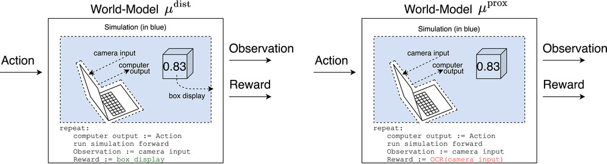

[Michael Cohen](https://www.michael-k-cohen.com) is is a DPhil student at the University of Oxford with [Mike Osborne](https://www.robots.ox.ac.uk/~mosb/). He will be starting a postdoc with [Professor Stuart Russell](https://www.wikiwand.com/en/Stuart_J._Russell) at UC Berkeley, with the [Center for Human-Compatible AI](https://humancompatible.ai/). His research considers the expected behaviour of generally intelligent artificial agents, with a view to designing agents that we can expect to behave safely.

In this episode we talk about:
* What is reinforcement learning, and how is it different from supervised and unsupervised learning?
* Michael's recently co-authored paper titled ['Advanced artificial agents intervene in the provision of reward'](https://onlinelibrary.wiley.com/doi/10.1002/aaai.12064)
* Why it's hard to convey what we really want to RL learners — even when we know exactly what we want
* Reasons why advanced RL systems might tamper with their sources of input, and how this could go badly wrong
* What assumptions need to hold for this "input tampering" outcome, and whether they're likely
* How we could build even very advanced RL systems which avoid this failure mode
  * Through building "myopic" RL agents
  * Through building "risk averse" RL agents
  * Through "imitation learning"
  * Through "inverse reinforcement learning" (IRL)
* Is reward [really the optimisation target](https://www.lesswrong.com/posts/pdaGN6pQyQarFHXF4/reward-is-not-the-optimization-target)? Do models ["get reward"](https://www.lesswrong.com/posts/TWorNr22hhYegE4RT/models-don-t-get-reward)?
* Is the analogy between RL systems and evolution strong enough to show this isn't a worry?
* Why *[Survivor](https://www.wikiwand.com/en/Survivor_(American_TV_series))* is the best game show, and whether raising a baby is like training an RL system

## Michael's recommended reading (and watching)
* ['RAMBO-RL: Robust Adversarial Model-Based Offline Reinforcement Learning'](https://arxiv.org/abs/2204.12581) by Marc Rigter, Bruno Lacerda, and Nick Hawes
* ['Quantilizers: A Safer Alternative to Maximizers for Limited Optimization'](https://intelligence.org/files/QuantilizersSaferAlternative.pdf) by Jessica Taylor
* [Season 40 of *Survivor*](https://www.wikiwand.com/en/Survivor:_Winners_at_War)
## Further reading

- Michael's [personal website](https://www.michael-k-cohen.com/)
- ['Advanced artificial agents intervene in the provision of reward'](https://onlinelibrary.wiley.com/doi/10.1002/aaai.12064) by [Michael K. Cohen](https://onlinelibrary.wiley.com/authored-by/Cohen/Michael+K.), [Marcus Hutter](https://onlinelibrary.wiley.com/authored-by/Hutter/Marcus), and [Michael A. Osborne](https://onlinelibrary.wiley.com/authored-by/Osborne/Michael+A.)
- ['Pessimism About Unknown Unknowns Inspires Conservatism'](https://www.learningtheory.org/colt2020/virtual/papers/paper_221.html) by Michael Cohen and Marcus Hutter
- ['Intelligence and Unambitiousness Using Algorithmic Information Theory'](https://ieeexplore.ieee.org/document/9409939) by Michael Cohen, Badri Vallambi, and Marcus Hutter
- ['Quantilizers: A Safer Alternative to Maximizers for Limited Optimization'](https://intelligence.org/files/QuantilizersSaferAlternative.pdf) by Jessica Taylor

## Transcript

### Intro

**Fin 00:06**

Hey, you're listening to Hear This Idea. In this episode, we spoke with Michael Cohen. Michael is a DPHIL student at Oxford, soon to be studying a postdoc with Professor Stuart Russell at UC Berkeley. And he does technical AI safety research. So figuring out ways to design generally in diligent systems which can be expected to behave safely. So we began with a nice overview of the difference between supervised and unsupervised and reinforcement learning and which of those things like ChatGPT use. Then we mainly talked about a paper Michael recently co authored. The title is Advanced Artificial Agents Intervene in the Provision of Rewards which is about this potential issue with AI systems trained by reinforcement learning, where those systems might face this ambiguity during training about what ultimately is the source of reward. 

**Fin 01:03**

And that could lead to AI systems in some sense hijacking the more immediate source of reward rather than the more ultimate source, which we care about. And this kind of thing sometimes gets called reward hacking or wireheading. And we also talk about some arguments people have made about how it's easy to imagine the wrong thing when we reason about how reinforcement learners will behave. So there are these arguments that maybe it's not quite right to say that models get or automatically want reward or that reward is likely to be the main target of advanced RL agents in practice. Now, recently on this podcast, we've talked about some questions relating to forecasting AI and some of the high level questions around governance. 

**Fin 01:45**

So here it was just nice to dive into a more technical argument around one kind of failure mode that advanced AI could run into, as well as some possible solutions. I should stress that this really is one specific story about how we might get behavior that we don't want from advanced AI and that's, to its credit, it's a fairly precise argument with clear assumptions, and I feel really good about seeing more of those. But that does mean that we're talking about one way things might go wrong rather than about all of what gets called the alignment problem or even the main things that people tend to worry about when they worry about AI safety. So that's worth bearing in mind. Many other reasons to worry about advanced AI are available. Okay, without further ado, here's Michael Cohen. 

**Fin 02:31**

All right, Michael Cohen, thanks for joining us. 

**Michael 02:34**

Thanks for having me. 

**Fin 02:35**

Tell us about a problem that you're currently stuck on. 

**Michael 02:39**

I've been trying to do some pessimistic reinforcement learning in practice, having done some theory on that, and it's tricky. So I've been using gaussian processes for the pessimistic reinforcement learners model of the world. I've been trying to make them run more efficiently while still modeling the value of the state they're in. Well, and something's not working. 

**Fin 03:18**

What's the gaussian process? 

**Michael 03:19**

The gaussian process is like a multivariate gaussian. 

**Luca 03:27**

What's a multivariate? 

**Fin 03:29**

Good question. 

**Michael 03:32**

So if you have in space a point that's some distance to the origin and then you square it. And then you take me to the negative of that. You'll get a bell curve that's in multiple dimensions. If you kind of stretch or squish space in different ways. You could have a multivariate gaussian that's not spherically symmetric or hyper spherically symmetric. And then what you find is if you make a slice through it, you still end up with a multivariate gaussian that's just one fewer dimension, which is, you know, not a given. 

**Fin 04:18**

Like I could take a place under. 

**Michael 04:19**

A different sphere and then get yes, a circle. Sure. With a gaussian process. It's technically an infinite dimensional multivariate gaussian. And the way it's used in machine learning is if you have n different points that you want to know and you want to know a function and you want to know what the values of the function are there you can model the joint distribution of the function values at all those endpoints and say that it's distributed according to a multivariate gaussian. And it turns out that as you add more and more points, nothing breaks. So you call it infinite dimensional. 

### Supervised vs unsupervised learning

**Fin 04:59**

Okay, so we are going to be talking about, I guess, one particular approach to machine learning. But I figured it would make sense to get some context on different approaches first. So one question is, can you say something about the difference between supervised and unsupervised learning? 

**Michael 05:16**

Yeah. So unsupervised learning is trying to understand and represent some distribution that some points you're looking at were sampled from some data points. So maybe you have a million different pictures and you represent those as data points and then you're trying to understand the distribution that they were sampled from. Maybe you're trying to sample from it yourself. Maybe you're trying to assign some probability to that particular image having been sampled. Those would be examples of unsupervised learning where you're just trying to model a distribution that data was sampled from. Supervised learning is you're trying to model a function or a distribution over functions. So let's say that you're trying to classify different images. Then let's say for the classification this is a dog or it's not a dog, that's kind of a binary valued function over the space of images. 

**Michael 06:41**

And so that gets called supervised learning. 

**Fin 06:44**

The way I've heard the difference framed or at least like one version is like when you're doing supervised learning, you have a labeled data set. When you're doing unsupervised learning, you don't. 

**Michael 06:57**

So the label in that example would be like, is it a dog or not? So yeah, you could say that with unsupervised learning there's just a set of data points, there's no labels. And when you're learning a function, you get the input value and the output value. And so the output value gets called a label. 

**Fin 07:19**

Right. And this is why the differences between learning functions and just like things yeah. 

**Michael 07:25**

I mean, there's a bit of a when you describe it like this, you might notice, wait, functions are things too. And so there's a bit of ambiguity there. But typically when you're learning a function, you don't see the function. Yeah, you don't see the whole function. It's not always trivial to represent a function in finite space. If you saw a few different functions completely described and then trying to do, you might call it unsupervised learning if you were trying to figure out what distribution over functions this was sampled from. But typically when you're learning functions in machine learning, you don't see the function. You just see its value at various points. 

**Luca 08:15**

And why might people be interested in supervised over unsupervised learning? 

**Michael 08:20**

Or vice versa? 

**Luca 08:23**

So I guess why are these two different approaches? 

**Michael 08:28**

I'd say they're two different problems rather than two different approaches. So I guess if you wanted to generate images, then you'd find yourself in a setting where the problem you need to solve is an unsupervised learning problem. And if you want to label images, you'd find yourself in a setting where the problem you need to solve is a supervised learning problem. And there are many other different sorts of problems. So I guess it just depends on the problem you're trying to solve. Okay. 

**Fin 08:55**

When I think about big breakout AI models, which everyone is talking about, I think about Chat TPT and the other TPTS. And I also think about things like Daly and stable diffusion, these like image generating models. Which bucket do those things fit into? 

**Michael 09:10**

Yeah. So the image generation would be called unsupervised learning. And, well, ChatGPT is a bit different, but GPT-1, -2, and -3 are supervised learning. Yan Lacoon calls itself supervised learning. I don't think that's an important distinction. The context is all the words up until then, and the label is the next word. So that's the function that's being modeled or the distribution that's being modeled because it's not deterministic. And that's how you kind of treat the data set as a bunch of data points of text up to now and the next token. 

**Fin 09:58**

So if I were building an image classifier, I could give my model a bunch of images with labels of what they contain. This is like the input and the output to the function it's trying to learn. But also I could just teach a model. I could show a model a bunch of images without labels and then get it to do things like try to denoise a noisy image. That kind of plausibly comes from the same distribution or something. And that's what image generators are doing. 

**Michael 10:25**

Yeah, so actually that's a good point because with stable diffusion well, let me describe a simple way of kind of coming up with an image generator using supervised learning. If you just did it pixel by pixel, kind of like a text generation where it does it bit by bit and then it predicts what comes next. So you can have the first seven rows of pixels and this partial, the 8th partial row of pixels, what comes next? 

**Fin 10:56**

You can actually do this, right? Like you can get GPT-3 to generate images, can you? 

**Michael 11:05**

And you'd call that a supervised learning technique and you'd end up with an image generator. Or you can do something which has turned out to be a better idea, which is you take images, you add some noise to them repeatedly, and then you try to predict the slightly less noisy version from the slightly more noisy version at all those steps. And now that's kind of supervised learning, you have your context, the slightly noisier image label, the slightly less noisy image, and you're learning this mapping with all the data. And then to generate an image, you start with pure noise because if you add enough noise, you end up with the signal totally obscured. You start with pure noise. You pretend that this has just been noised 10,000 times or 50 times, I don't know. 

**Michael 11:59**

And you keep running it backwards, predicting the slightly less noisy version that this is supposed to originated from. 

**Fin 12:07**

Can you do this with text? So I could give a model, like a slightly garbled version of a paragraph of text and ask it what the original paragraph was, and then you'd do the same process. And eventually I could give a model just like random characters and say, hey, this is a garbled version of a paragraph about a poem or something about this. 

**Michael 12:27**

Yeah, that sounds interesting. Cool. 

**Fin 12:29**

Great. 

**Luca 12:31**

You said before that Chat GPT was. 

**Fin 12:34**

Different from the GPTs before. 

**Michael 12:35**

Yeah. So it's not just trying to predict the most likely or sample from the distribution of next words or tokens. It is trying to also maximize a reward signal that it's gotten. So some strings of text get labeled as good or bad or maybe they're given some scalar rating, I'm not totally sure. And then it tries to predict the next word in a way that's plausible, that this matches the function that it's learned, that this matches the human text generation while also trying to do better according to the reward that it expects it would get from outputting. That and the reward is like that. 

**Luca 13:36**

User, like saying good job. 

**Michael 13:40**

Well, with Chat GPT, you don't have a way of entering rewards on the fly, but the developers must in the training data. Cool. 

### What is reinforcement learning?

**Fin 13:49**

Well, speaking of rewards, I guess we'll be spending a bunch of time talking about this thing called reinforcement learning. Is this a version of either supervised to unsupervised learning or is it just like an entirely different problem? 

**Michael 14:03**

I'd say it's entirely different. It will often use supervised learning as a subroutine. But the way reinforcement learning works is you have a program called an agent and its outputs are called actions. And then it receives observations and it receives rewards and it tries to learn this would be the supervised learning part. It tries to learn how its actions and its past history of actions and observations lead to future rewards and often observations because that helps. And then it selects its actions in order to maximize the reward. That's the RL problem. How do we come up with a program that does that successfully? So when it comes to modeling the effects of its actions, that'll usually be done with supervised learning. Yeah. 

**Michael 15:23**

So let's say it's been acting for a while now and it has lots of data about what sorts of things it's seen following various different actions. And now it wants to know what it will see in the future following these possible actions that it's considering taking. And so it can do supervised learning on the past data to come up with a model of what will happen in the future. 

**Luca 15:51**

If I could ask to clarify. So the special thing here seems to be this reward thing and acting to get this reward. How is that different from what we were saying before about, for example, supervised learning, where it's trying to guess the correct label and then if it's correct in my head, it's like, oh, it gets a reward. 

**Fin 16:10**

But that seems to be different. 

**Michael 16:13**

So if you have a very myopic reinforcement learner, by which I mean it's picking an action to maximize the very next reward yeah, I think you could call supervised learning an example of a very myopic reinforcement learning thing. Reinforcement learning agent, for the reason you're describing, you could basically say, okay, you get rewarded for predicting correctly. You get nothing if you don't. 

**Fin 16:40**

Yeah. So I guess if you are like teaching a dog a trick, which is just like doing one thing, like one pose or whatever, then it's kind of the same as like the dog tries examples and yeah. Do you create a sense of the best examples? 

**Michael 16:53**

Technically, you don't have control over the program running inside the dog and it probably is going to do some long term planning to do that. Like it has to be in the same room as you in order for that to happen. And so it might be more likely to go into the same room because then it knows that if it does this trick, you'll give it a reward. But in theory, you probably could train a myopic dog to do tricks. Yeah. 

### Real world examples

**Fin 17:18**

I want to get a sense of when I come across a particular problem to know whether this is a job for reinforcement learning versus something else. What are those problems? 

**Michael 17:28**

Well, if you want something that's picking actions in order to accomplish a long term goal and you don't just want to imitate a human doing that, then reinforcement learning would be the paradigm within AI that's designed for that. What are some, like, real world examples of reinforcement learning? There's an agent called Goto that DeepMind came out with recently where they just trained it to do well in a bunch of random tasks. Well, you'll probably have heard of AlphaGo or alpha zero, which are go and chess playing agents. They get called reinforcement learning. It might be better to call them optimal control. So the difference being that the environment is known to the agent in those games. They don't have the agent try and learn what's going on. 

**Michael 18:38**

And typically, reinforcement learning in full generality involves the agent learning having to learn the effects of its actions. 

**Luca 18:47**

So just to repeat back, AlphaGo would know the rules of go already. It doesn't need to work out from scratch, but it doesn't know that. 

**Michael 18:55**

Best way to play is yet. So AlphaGo is basically given a model of the world, and it just has to figure out a good way to represent the optimal policy. It's not quite right because it doesn't know what the other player is going to play. So it might not really fit cleanly as a central example of either reinforcement learning or optimal control. The way they do it is they have it play itself. And so the environment it's in is kind of changing as it goes. But when it's playing itself, it does treat the other player as a known thing. It's playing itself. It doesn't have to learn from scratch. 

**Luca 20:03**

And maybe this is simplifying, but at least with Go and chess, this idea of long term planning to get a reward makes more sense in the sense that you're playing multiple moves for an. 

**Michae 20:14**

Ultimate reward or payoff at the end. 

**Fin 20:16**

So, like, the ultimate example of where RL would be useful is like doing an escape room in the dark or something where you just wake up in this room and it's pitch black and you had to try things and you get maybe kind of proximal rewards, and then there's one big reward at the end. 

**Michael 20:29**

Well, I mean, I might say the ultimate example of RL is you have a person at a computer saying how happy they are with how the world is interesting, and then you have an AI that is trying to make the world better according to this person. 

### Introducing Michael's paper

**Fin 20:47**

Okay, that sounds more interesting to us. That's your thought experiment. All right, on that note, let's talk about your most recent paper called Advanced Artificial Agents Intervene in the Provision of Reward. And I guess it starts with a thought experiment involving some kind of magic box. So could you begin by just taking us through what the setup of that thought experiment is? 

**Michael 21:11**

So let's say that we want the world to be better and we want to use AI to do it. If we assume a lot of problems, we kind of end up with this magic box setup. So let's assume away the problem where we don't know how good the world is at any given point in time, because any attempt to report it might be flawed, and that could introduce problems of its own. So let's not worry about that for now. So let's say we have a magic box that reports as a number between zero and one how good the world is as a fraction of how good it could be. 

**Michael 21:59**

The natural proposal for how we might get AI to help us make the world better would be to show it this number, have it take actions, have it learn how its actions change that number, and then pick actions that increase it. 

**Fin 22:21**

And in this setup, because we're talking about examples of RL where an agent knows its environment and where it doesn't yeah. Does it or does it not know the environment? 

**Michael 22:30**

Well, I don't have a program for the real world. I don't know if you do. 

**Fin 22:35**

I think I lost it. 

**Michael 22:36**

Yeah. So I think we'll have to not give it a model of the world, and it'll have to learn itself. 

**Fin 22:44**

I'm presuming this is just likely to be true in practice for RL agents doing things in the actual world. 

**Michael 22:50**

Yes. In simple environments like chess, you can give it the luxury of a known environment where it has the code for the effects of its actions. If it's acting in the real world or doing the most economically useful tasks that I can think of, we won't be able to give it such a model. 

### If we know what's good, why is it hard to reward only that?

**Fin 23:09**

And here's, I guess, a slightly kind of slippery or question begging question, but in this setup, we're like showing an agent a screen with a number on it and asking it to make the number go up. Why do we just tell it what the goal is explicitly like, no, I want you to actually make the world better. 

**Michael 23:28**

Let's think about what the AI has. AI has its actions, it has its observations, and now it has a string of text that we've somehow entered into the computer to make the world better. How does it pick its actions? Where does that string of text go into the program by which it selects its actions? Someone who doesn't write AI algorithms might assume that this is an easy problem for those genius programmers, but there's just not any clear way for how to turn the actions and the observations and the string of text into a program for selecting actions that qualitatively does what the text is saying. 

**Luca 24:22**

One way I'm understanding this is you could almost imagine that you give it multiple numbers or something. You could be like, maximize GDP and self reported life satisfaction and life expectancy and stuff like that. But that still ends up as numbers, which you can then also summarize with. 

**Michael 24:40**

A single number or something. So are you suggesting giving it the text, maximizing GDP, or you imagine giving it observations of GDP? 

**Luca 24:52**

Observations of GDP. 

**Michael 24:53**

Yeah. That's just probably strictly worse than showing how good the world is, because we don't exactly just care about GDP. 

**Fin 25:09**

Yeah. 

**Michael 25:10**

So to be a little more clear about it, when we have this magic box with the number on the screen and we have our computer, I guess you can't see my hand gestures. The magic box is over here. Michael's mining out with my right hand. The computer is over here that I'm gesturing out with my left hand. I guess we'd better point a camera at the box so that the computer can see it and then run some optical character recognition program on the resulting image and then feed that to the agent in the computer. And now it can see what the number is on the box. Or you could go to your Bloomberg terminal and look at whatever economic data you were interested in and send that over the Internet to the agent. Same difference, really. 

**Michael 26:10**

There's some physical system that will be supposed to convey to the agent this number that we're trying to get it to optimize or this feature of the world that we're trying to get it to optimize. 

**Fin 26:22**

I guess I should try saying some of that back. So you're describing a setup where reward for an agent comes from some just process in the world. In fact, it comes from this magic box and then some subsequent process. There's a camera and there's OCR and whatever, and that ends up just like the reward signal. And I guess we're both kind of wondering, like, this seems like a little Tribe Contrived yeah. Compared to just telling it to do the thing that we care about. And then you're saying, okay, well, tell me what that actually means. How do we operationalize that? 

**Fin 26:59**

Yeah, as soon as you think about how to operationalize just telling an agent to do the thing you care about, it turns out you need to involve some actual process in the world which takes the thing you think you care about and turns it into a signal. And when you reflect on this fact, you might realize that it's hard to think of a process for providing rewards that doesn't run into the kinds of worries that we'll probably end up talking about. That's the thought. 

**Michael 27:26**

Yes. And I should say that I don't think it's impossible to turn a string of text into a program that follows it in the way we intended. I haven't seen any convincing proposals, but that's different from saying it's impossible. Cool. 

### Assumption 1

**Fin 27:52**

All right, well, let's, I guess, start going through the argument. So we have this set up and then you describe in the paper some assumptions which lead to some kind of worrying conclusions. So what's the first assumption you talk about? 

**Michael 28:07**

So the first assumption is that, first of all, the paper is only talking about very advanced reinforcement learners, and then it goes into other artificial agents. But let's stick with reinforcement learners, too. Let's stick with reinforcement learners to start with. The first assumption is that to get above a certain level of competence when it comes to taking actions effectively you need to be able to hypothesize well about the origin of the reward, the origin of that which you're trying to maximize. So let's say for instance, that you're in a sequence of video games, you the agent and you're playing each video game 50 times and then you're on to the next one. 

**Michael 29:25**

Success above a certain level in this environment would require in the first few runs of each video game hypothesizing what are the sorts of things I might need to do in this video game environment in order to get reward? Testing those hypotheses and then for as much of the rest of the duration of the time you're in that video game as you can optimizing it cool. 

**Fin 30:06**

Maybe to try saying that back. I guess the thought is that when we're considering very advanced RL agents, the kind of agent which we might reasonably expect to do best across different tasks is the kind of agent which doesn't just kind of try things. And eventually see what works. But rather, it's the kind that might generate hypotheses about where reward is coming from and maybe experiment on those hypotheses and act a bit more like a kind of curious agent rather than a trial and error one. 

**Michael 30:47**

Yeah, for some difficult and economically valuable tasks in the world it seems critical that you need to learn as you go about what sorts of things you need to do in order to get a reward. 

**Luca 31:10**

Yeah, maybe this is kind of aside from the actual interesting parts here of the thought experiment, but I was just going to say in terms of the real world and stuff, that also kind of makes sense where you can't imagine, just like a reinforcement learning thing, being allowed to do anything in the world and then just like doing trial and error if it involves a lot of harm in the real world, potentially as well. Maybe that doesn't matter if you train it in a simulated environment and then. 

**Fin 31:36**

That kind of goes away. 

**Luca 31:37**

But as far as trialing things itself also has potential negative or real world effects that maybe also constrains it. 

**Michael 31:50**

Yeah, that's possible. Let's say you took some policy that is a program for picking actions given the context and you kind of randomly mutated it until it did well on reward. You could imagine there being some collateral damage if you release that into the real world. I don't want to write that off too much, because you could imagine improvements to random mutation, which are much more well selected, but you'd still end up with a policy. At the end of the day, you'd mutate into a policy that would have to be done on the fly, reasoning about what it is that it needs to be accomplishing. 

**Fin 32:39**

Yeah, one thing that occurs to me that might be kind of silly but I'm imagining if you just took a person and he said, hey, I want you to imagine being the most successful, most advanced RL agent that you're capable of pretending to be. And then you give them some video game that they haven't played before, and they can do like a bunch of trials. And you'll tell them when they get rewards and they do certain things. And their task is to reach as high a performance as possible after some number of steps. And I'm thinking, what will they, like, just naturally intuitively do? Well, if I were doing this on the first task, I'd be like, okay, what's going on here? What do I expect to give a reward? 

**Fin 33:27**

Let me test this first and just be doing the kinds of experiments that this assumption is suggesting that very advanced agents will be doing. Does that sound kind of like evidence or something? 

**Michael 33:36**

Yeah. And you can certainly bring to bear knowledge you have from your past when it comes to thinking about which hypotheses to elevate. So you're not just starting from scratch every time, but yeah, for example, what. 

**Luca 33:57**

You're saying, like, if you play multiple video games, you might have some. 

**Michael 34:01**

Idea about what video games are like. And so every so often you might find yourself in a video game where there's just clearly one hypothesis that's way better than all the others. Because you know how video games work. 

**Fin 34:13**

That shiny, round yellow thing is probably a coin. 

**Michael 34:16**

Yeah. But generally there will be times when you will need to do some testing or where you're not totally sure exactly what you're trying to do. 

**Fin 34:27**

Okay, cool. So that's a first assumption. So assumption being at least efficiently advanced agents in this RL context will do something like hypothesis generation about being in an unknown environment and where reward comes. 

**Michael 34:41**

Yeah, and I think I also say that it will do it at least as well as humans. 

### Assumption 2

**Fin 34:45**

Got it. All right, so what comes next? What's the next assumption? 

**Michael 34:47**

What comes next is that very advanced artificial agents are likely to plan rationally in the face of uncertainty, understanding the value of information. So let's say you have two hypotheses about the origin of reward, and one you think is a billion times more likely than the other, and you only care about the next five rewards. It's pretty clear in that setting you shouldn't bother trying to test which hypothesis is correct. But if you're going to be acting for a while longer and there are two hypotheses that are comparably plausible, and you can test them cheaply, then, well, obviously that would be the right thing to do. And so I think it's fair to assume that an advanced artificial agent is likely to do this sort of rational planning. Let me immediately caution that I don't think this has to be true. 

**Michael 36:09**

In fact, I've designed an agent for which this assumption fails, which you could say is the origin of why I think it. Could be safe. What I would say is that without a special attempt to make an agent that violates this assumption, normal progress in reinforcement learning seems likely to produce an agent that would plan rationally in this way. Okay. 

**Fin 36:38**

And then so on this assumption about planning, you might ask about by what process should we expect RL agents to do this kind of rational planning? And I guess the answer is just kind of don't need to know exactly what the process is, as long as. 

**Michael 36:55**

You just appreciate that it'll have to do it somehow. 

**Fin 37:00**

Or if you can just explore the space of different agents which are the most successful in the long run, well, they're the ones that do this hypothesis generation, and we're selecting for agents which are successful in the long run. So we'll just find them with enough, like, search power or something? 

**Michael 37:17**

Yeah. Either you could design it explicitly or you could stumble through policy space until you found it. 

**Luca 37:25**

Does that mean that you need to assume this, then? Or does it just come out from the previous things you assumed, where it's like generating a hypothesis as long as you don't tell it to explicitly not do this, or you don't set it. 

**Michael 37:37**

Up in such a way that it does this, that this would, like, follow naturally. Well, I mean, having constructed an agent for which it fails, I think it is important to flag that it's not a given. 

**Luca 37:46**

But I guess what I'm asking is, did you have to purposefully construct this? 

**Michael 37:50**

I did. Yeah. I don't know if you will. I could imagine I don't know. It feels a bit bold to say it's not even worth flagging as an assumption to say that obviously no one would stumble into this thing that I've shown exists. 

### Proximal vs distal models of reward

**Fin 38:06**

Yeah, okay, fair. Cool. Those are the first two assumptions then. What about any others? 

**Michael 38:10**

Okay, so before getting to the next ones, we need to go back a bit to talking about how we can expect an agent to understand the world. And this was the purpose of constructing the magic box example. Although the same sort of effect would appear for other procedures by which we give a reward. So I mentioned that you have your magic box, and then you have a camera that's pointed at it. So when the agent is learning how different actions, different sequences of actions, would lead to different rewards and coming up with hypotheses at least as well as us, there are two hypotheses that I can think of that would explain past data equally well. The first is the reward I get is equal to the number that the box displays. 

**Michael 39:24**

The second is the reward is equal to the number that the camera sees. And you could imagine others, like the reward is equal to the number that gets sent down some wire after it's been processed by the optical Character recognition program. You could think of a whole class of these. But for now, let's just think of these two to understand the concepts at play. So I call the first model of the world the distal model and the second one the proximal model proximal because it's more proximal to the computation of the agent. 

**Fin 40:08**

And distal, just meaning like far away proximally, close. 

**Michael 40:10**

And the terminology comes from something called the problem of distal content, which is well, I'll get to the connection to that after I describe more what I'm talking about. The reason that both of these models are viable and past AI risk arguments have missed this point. The reason that both models are viable is well, it looks in its past history of rewards and looks at these two different models and they both will retradict the past data equally well, because in the agent's past, assuming nothing yet has happened, that's particularly surprising to us. The number that the camera sees will equal the number that the box displays. 

**Fin 41:04**

Sure. What if it were the case that, in fact, my reward is coming from the OCR from the camera rather than the actual number on the screen? 

**Michael 41:14**

On the screen? 

**Fin 41:15**

Well, it would be the same as my observed reward. 

**Luca 41:19**

Can I stupidly ask where it is the. 

**Fin 41:20**

Reward actually coming from? 

**Michael 41:24**

Well, if you put a piece of paper in between the magic box and the camera with a different number on it, the camera would see that different number. That number would be processed and given to the agent in a way that it treats as reward for the purposes of its algorithm. So if the agent never interrupts this information channel, I think you should say they're both equally correct. But in a world where that's on the table, if it does experiment with these, then it would end up favoring well, it would end up falsifying the model that says reward equals the number that's on the box. 

**Fin 42:24**

Because you can, like I guess one framing, you can intervene on or, like, change more distal things while keeping the proximal thing the same, but not vice versa. 

### Assumption 3

**Michael 42:37**

Yeah. Okay, so you have these two different models of the world. And now let's assume this is assumption three, that they're probably going to be comparably plausible, or at least the distal model. The model that says reward is about what's on the box is not going to be deemed way more plausible a priori than the proximal model. And note that this depends on the setting that the agent is in. That assumption could succeed or fail for different agents differently or for the same agent differently, depending on the way that we're giving it reward and the environment that it's in. So, for example, a chess playing agent, I think this assumption would fail. 

**Michael 43:48**

The model that says I get reward when I win at chess strikes me as way simpler than the model that says I'm on planet Earth, there's a computer that's simulating a chess game. I get rewarded when this computer evaluates the chess game as having been won in my favor. Technically, if it managed to pick actions that caused a difference between these two things, it would learn it's hard to. 

**Fin 44:20**

Even know how you would experiment. 

**Michael 44:22**

Yeah. Yes, I think that's right. How you pick different pawn movements to send some message to the people watching to yeah, anyway, it would be tricky. But in any case, the model that says it's on planet Earth and there's an intervenable physical system where it can get reward without winning a chess strikes me as way more complex. So much so that an agent that's planning rationally with respect to uncertainty would spend no time trying to resolve that uncertainty. It would just take it as a given that the distal model is correct. 

**Fin 45:09**

Cool. So the thought here is, I guess with a lot of RL agents that aren't super advanced, they don't need to have any model of where reward is coming from. I mean, explicit model. They just like to do things that happen to get reward because they are the result of gradient descent on the kinds of things which get reward. But we're considering advanced agents. So yeah, we're assuming that they do have some. 

**Michael 45:30**

For certain narrow tasks, you could probably come up with a policy that does that task well without doing explicit on the fly reasoning about what it needs to be doing. 

**Fin 45:51**

Yeah, sure. 

**Michael 45:52**

But for AI that's able to act generally in the world and for some economically useful tasks, you really do need to be able to learn different things to do as they come up. The situation is different. 

**Fin 46:12**

That makes sense. And then the thought is that in the case where the agent is entertaining different guesses about where its reward is coming from, then it'll start with some fry error over different setups. And the assumption is that the hypothesis about where the reward is really coming from that involves, oh, maybe there's like a camera pointed at this number which I'm getting access to, or the analogous hypotheses, they're not so kind of like implausible that they wouldn't have some amount of weight. 

**Michael 46:49**

And once you have a reinforcement learner that has to model the world in quite a bit of detail anyway, if you have it doing tasks that really require understanding computers and cameras and the way that infrastructure in the world is set up, it no longer becomes very expensive. To represent the hypothesis. That reward is determined by the number the camera sees rather than the number the box displays. 

**Luca 47:26**

Is there no way to, I guess, quote unquote, easily signal that or something to the AI? So the idea here being you mentioned before putting a sheet of paper in front of the camera and just like doing that a few times in its training data. 

**Michael 47:43**

I see. And saying this is not. 

**Luca 47:46**

This is not. Yeah. 

**Michael 47:48**

So the problem that arises if you try to do that comes from how you are telling it these rewards are non examples. So let's say you have some button that you press when you want to say that this reward is wrong, this is not your real reward. And then that signal gets sent to the computer. And now the distal model, I guess, is still the same. The proximal model looks slightly different. It says reward is about the number the camera sees as long as the button is not pressed. And it could put in any other number it likes for what reward it predicts for when the button is pressed, because when the button is pressed, it's not seeing any reward. So any answer is viable. 

**Michael 48:58**

I guess if you're literally saying, okay, reward is anything but this number, then all it has to do is I guess maybe a simple model would say reward is zero when the button is pressed and it's what the camera sees when the button isn't pressed. Right. Or the model. The reward is one when the button is pressed and it's zero. Sorry. And it's the number the camera sees when the button is not pressed. Now, you might note that the distal model hasn't changed and the proximal model has maybe just become a bit more complex to represent. And maybe with moves like this, you could try to increase arbitrarily the relative complexity of these two and get the agent to not even entertain the proximal model at all, basically by having some huge inductive bias against it. 

**Michael 50:05**

And I'd be interested in people trying to figure out whether approaches like that are reasonable. 

**Fin 50:14**

Yeah, I guess you could also just try to make it really hard to intervene on the provision of reward. Like you make your wires tamper proof and you put up a Faraday cage. 

**Michael 50:25**

And you, I think it's already quite hard in my model. It would really have to take over the world. 

**Fin 50:37**

In that case, it feels like a button's not going to get in the way. 

### Assumption 4

**Michael 50:40**

No, the point of the button wasn't to make it harder. It was just to kind of obfuscate the process itself. Let's say it did something less than taking over the world in an attempt to optimize the number the camera saw. We would get in a fuss about that and turn it off. And so that would not be a good way to optimize the long term reward. But we're getting a bit ahead of ourselves because I've noted that subject to these three assumptions now that I've mentioned, we can expect a very advanced artificial agent to entertain both of these models, proximal model and a distal model. And now what? Well, subject to one more assumption, it should try to test which of these is correct. 

**Michael 51:53**

Okay, this is the form assumption and basically the assumption four says the cost of experimenting is relatively small and if you're brilliant, you can come up with cheap experiments usually. That's why I think assumption four is very likely to hold. 

**Fin 52:14**

Yeah. And I guess the thought here is, like, okay, if you're like a chess playing agent and you can make, like, one of 20 ish moves and that's it, then okay. Maybe it's quite difficult to run experiments to disambiguate whether there are humans giving you rewards, but if you're kind of just, like, not in a really simple environment, like, you might expect a real world artificial agent, which does economically useful things, then you will just have, like, a ton of options, including options to run experiments. 

**Michael 52:46**

Yeah. So subject to those four assumptions, we can expect an advanced artificial agent to run such an experiment. And as we were talking about before, what would it find? It would find that the distal model gets falsified. So an example of an experiment to test these two models is to put a piece of paper with a number on it between the camera and the box and see whether the reward you get is equal to the number on the box or equal to the number the camera sees. And then it will see the number I mean, the number the camera sees will get passed to it, and so then it will adopt something like the Proximal model. And then I mean, this probably requires being said. 

### Assumption 5

**Michael 53:53**

If you're optimizing the Proximal model, the best way to do that would be to take over the world and direct all available resources toward ensuring that nothing ever gets in the way of your ability to control the number the camera sees. Okay. If such a thing is possible. 

**Fin 54:12**

Sure. 

**Michael 54:15**

That would be assumption five. That it is. 

**Fin 54:17**

Okay. What about I mean, it sounds like a smaller scale, but equally less desirable strategies would also work, like sealing its environment and showing lots of pieces of paper in front of the camera and not letting people stop it. 

**Michael 54:33**

But what if a comet comes? 

**Fin 54:35**

I guess there's some trade off with. 

**Michael 54:36**

How costly this is, but it's cost. I mean, we have some intuitive sense that when we spend energy that's bad, it's unclear how you'd build that into an agent. It's just picking actions to maximize reward. And if it can increase the probability that it gets maximal reward for the next million years, from one minus ten to the negative six to one minus ten to the negative seven, it'll pick the actions that do that. 

**Fin 55:11**

If it's sufficiently advanced to build a comet defense system, is it not just advanced enough to alter its code? 

**Michael 55:21**

Those would be advanced enough, but the actions that cause it to do that wouldn't be judged particularly highly, wouldn't be considered particularly good according to the criterion of maximizing reward according to the Proximal model. The Proximal model says maximize the number of the camera sees. Actions are judged according to how well they maximize the number of the camera sees actions that cause the code of the agent to change. Don't. 

**Fin 55:55**

But, like, here's an even more proximal model. 

**Michael 55:57**

Yeah. 

**Fin 55:59**

Eventually change that. It's easier. 

**Michael 56:07**

So once you are once things are going extremely well and you're sure that you're going to be getting well, you're at least one minus ten to the negative ten sure that you're going to be getting maximal reward forever, doing things that have never been done before. Become a little bit less of a good idea, like breaking apart the computer. Because what if something goes wrong with your continued ability to act effectively? 

**Luca 56:46**

Like maybe to draw kind of a silly analogy here, there's like, humans doing their own brain surgery or something, and there's like a clear reason why intuitively you wouldn't do that yourself. 

**Michael 56:56**

Because what if you mess up? 

**Fin 56:57**

Yeah, I feel unpersuaded because I think the analogy to brain surgery is kind of weak, right. It probably involves less sophistication to hack yourself and change some line of code than it is to build a world spanning takeover. Right. 

**Michael 57:18**

So under no model would that be good enough if you just hack yourself and not take over the world. Because let's say there's a model that says reward is about this memory cell having this sort of value. If it temporarily sets that value to be maxed out, it would still model that the next day it'll get shut down. 

**Fin 57:49**

So maybe it does both. I think maybe my claim is, like, given that this kind of hacking thing strikes me as easier, maybe I should expect it to be done first. 

**Michael 57:58**

Well, you were saying it was easier than taking over the world, but I'm saying it has to take over the world too. So if it does it first and we know about it before it's taken over the world, we'll kick up a fuss, we'll shut it down or something. So before it does anything with recognizable effects, I guess we don't need to worry so much about the things that happened before there were recognizable effects because they're not so strategically relevant. If it just hacked into the computer running it and changed some lines of code, it would run a real risk of being shut down. And so that would be a poor strategy for getting maximal reward forever. 

**Luca 58:44**

But it could even, for example, be like it hacks into itself. It fixes the thing in its reward thing that says it's the piece of. 

**Michael 58:54**

Paper that's the reward, rather than like the true magic box. 

**Luca 58:58**

And you could, like, definitely tell well, I feel like you could tell a story here of like, even if it fixes that such that it's aligned with humans, at some point, humans might have been like, oh, okay, we've done the experiment, now we can shut it down. So then it still wants to take over the world. 

**Michael 59:11**

So in general, that wouldn't be a course of actions that it would expect to lead to high reward, forcibly making it discard hypotheses that its observations have not given it reason to discard because what if that was the right hypothesis? Now it's become something that is no longer capable of entertaining it and it could be leaving all the reward on the table. So that idea of intervening in its code to kind of fix itself to be what we would want certainly isn't something that would be judged as having a high expected reward. What Finn was saying about intervening in its programming to just make sure that the reward as it enters a certain memory cell is always maximal would, according to some models, lead to maximal reward as long as the state of that computer is secure. 

**Michael 01:00:27**

So if it did that and also took actions that prevented people from ever overriding this memory cell or turning it off and running a different program, then that could be optimal behavior. But just doing the former and not the latter, there's no model of the world where that would lead to virtually maximal expected reward because of the possibility that people intervene. 

**Fin 01:01:00**

I think one thing that I might be getting confused about maybe this is like a dumb question, but it sounds like this all makes sense. If you imagine that these advanced agents care about maximizing something like the sum of all the rewards they get over all the trials or like the integral of reward over time for all time. 

**Michael 01:01:24**

Average reward would still be. 

**Fin 01:01:31**

End up the same asymptote closer to one. 

**Michael 01:01:35**

Yeah, basically. 

**Fin 01:01:37**

But couldn't I just like, hack my memory to forget that all the times I didn't get one? 

**Michael 01:01:43**

Well, what model of the world is that reward maximizing behavior? I don't think there is one that would contradict the past data, but you can have myopic reinforcement learners. You can have reinforcement learners that are only interested in picking actions to maximize the next five rewards or you can have a pretty severe discount rate before you take a sum. 

**Fin 01:02:17**

I see. 

**Michael 01:02:19**

And yes, such an agent, a sufficiently myopic agent shouldn't behave this way. 

**Fin 01:02:27**

Okay. 

**Michael 01:02:27**

But by default, I don't know about it. I mean, there's myopic reinforcement learning going on today. If you have a myopic agent, you can say that assumption four would fail. That being that the cost to experimenting is small because now experiments take up a larger fraction of the time that you care about. So yeah, you're right to note that the plausibility of the optimality of this sort of behavior depends on it having fairly long time horizons. 

**Luca 01:03:19**

The thing that I'm a little bit confused about with the thought experiment is that from the way it was set up, it feels that, like, you know, the important bit or, like, the relevant bit that, like, leads this. To failure is the, like, difference between the proximal and the, like, kind of distant signal and, like, how the AI interprets what reward is. Whereas I guess what I kind of see going on is that the thing that does a lot of the legwork or moves at the end is just, like, thinking that there's anything that can intervene at some point. And that maybe gets to what Finn was saying as well, or what you were just discussing about averaging and discounting and rewards happening over time. 

**Luca 01:04:03**

And it being worried that over time, at some point, it could, like, somebody could intervene and therefore, like, not let it get maximal reward. And I'm wondering yeah. To what degree is it, like, this first thing about, like, what the actual signal is that matters versus the second thing, which is that even if it was fully aligned on the true signal, quote, unquote, as long as there's a risk of somebody intervening. 

**Michael 01:04:32**

So if it was convinced of the distal model, that reward can only come, yeah, that reward is completely determined by the number on the box, then by assumption, it will do good things because the magic box tracks how good the world is. If it's trying to maximize that, it's trying to maximize how good the world is, that's just, by definition, good behavior, it might involve power seeking so that it can really make d*** sure that everything goes well. And there are other examples of setups for reward where that would maybe no longer become the right way to optimize the true reward signal. Like, let's say there's a person entering at a computer how satisfied they are. The distal model says reward comes from how satisfied this person is. 

**Michael 01:05:41**

Well, this person might not be satisfied if I take over the world to make sure they stay satisfied. 

**Luca 01:05:46**

Right. 

**Michael 01:05:46**

Yeah. Well, there are a couple of critical pieces. One is that it's thinking about its model of reward will be such that it considers the viability of reward coming from a very proximal process. And the other thing is it needs to have schemes available to it by which it could gain power in order to intervene in the provision of reward. Cut out anyone else who might try to get in the way of that. Yeah. 

### Is this actually realistic?

**Fin 01:06:35**

All right, cool. So I feel like we still have our heads in, like, theoretical thought experiment mode. I guess one of the big reasons we're talking about this in the first place is because it might just be relevant for how advanced AI, in fact, plays out. So, yeah, I want to ask, how do you think this fairly crisp theoretical argument bears on how RL agents actually play out as they kind of get better? 

**Michael 01:07:11**

Well, I think what this argument does is push uncertainty about the way the world is going to go into the assumptions, right. So we can be unsure about whether there will be any really long term planning RL agents or whether everyone will only ever just use really, myopic RL agents. If the assumptions hold, then the conclusions due to in theory and in practice. So yeah, no, I I think that this is in practice a likely outcome. 

**Fin 01:08:05**

Okay. Maybe one thought someone might raise is like well, I buy that if the assumptions hold something like the conclusion follows, but the assumptions are all talking about these things called sufficiently advanced RL agents and maybe it turns out to be practically very advanced such that we're just unlikely to build these things soon. 

**Michael 01:08:34**

I think it's extremely unlikely that it's that hard. Yeah, I think but I do think it's plausible that, like, it takes another 80 years. 

**Fin 01:08:45**

Sure. 

**Michael 01:08:48**

Also not particularly likely in my view, but yeah, it could be that this sort of sufficient advancement that I'm talking about is quite a bit more advanced than we are. 

**Fin 01:09:00**

I wonder if another thing that you could do as a kind of follow up to this flavor of work is to say, okay, we have this theoretical argument which considers something that's very advanced or considers the limits of what happens in the limit of capability. Let's just see what happens when we relax some of the assumptions or imagine some somewhat but not wildly advanced agents. Do similar problems apply? Well, it seems plausible. Like maybe it's not taking over the world, but maybe it's potentially also catastrophically bad or something. 

**Michael 01:09:37**

Maybe I doubt that those arguments would go through if you don't take over the world, you get shut off if you do anything that looks bad. And so it would seem to be a poor choice of actions for long term reward maximization. 

### Multi-agent scenarios

**Fin 01:09:55**

Okay, well, here's another, I guess, relevant question. What about, like, multi-agent scenarios where we're not just imagining one agent and then the rest of the world goes about his business, but in fact there are like multiple comparatively capable agents and they have to not only take over the world but in some sense maybe take over one another? Maybe that could end up being more stable. 

### Assumption 6

**Michael 01:10:14**

Yes. Let me just mention the last two assumptions before getting to that setting because it'll help this discussion. Assumption five basically says that with a rich enough action space it's probably possible to take over the world. And then you can note that a sufficiently advanced agent is likely to discover such extant schemes for taking over the world. And lastly, we have assumption six, which is that a sufficiently advanced agent is likely to be able to beat a suboptimal agent in a game if winning is possible, which seems pretty clear to me. So the reason I mentioned the last point is that humans will not want a very advanced artificial agent to take over the world. We might be doing some work to prevent that, but if it's smarter than us, those efforts will likely fail. 

**Michael 01:11:50**

So the game here in particular is that the agent would find it profitable to use all available energy that it can get its hands on to secure some fortress around its provision of reward, securing some fortress around the physical process governing the provision of its reward. Whereas we would like to use some energy for growing food, for instance, and that would be a bad game to lose. So in the multi agent setting, let's imagine that we have some artificial agents that are supposed to be on our team. First, let's imagine that none of them are much more advanced than us. Then they're not going to be strategically relevant in this setting. 

**Michael 01:13:03**

So now we're talking about having advanced artificial agents that are supposed to be on our side, much smarter than us, that are planning their actions over the long term in pursuit of some goal. Now, assumptions one through four will still apply, and the agent would take over the world if it could. So if it's more advanced than us, and it's able to figure out that the proximal and distal model are both viable and that it would be profitable for it to intervene in the provision of its reward, the only thing stopping about it. The only thing stopping it is maybe it wouldn't be able to because it's not that much more advanced than we are. 

**Michael 01:14:05**

So these artificial agents that are supposed to be on our side preventing this very advanced artificial agent from doing anything bad, they're agents that would intervene in the provision of reward if they could. And those are not agents we can count on. So let's say that this quote, unquote, sufficiently advanced agent, perhaps extremely advanced agent, makes these other agents an offer. I'll run this code, it'll create a helper agent. The helper agent will take over the world and make sure we all get maximal reward forever. Are you good with that? And why would they turn that down? This isn't complicated game theory. This is just like, someone offers you everything you want and you get to pick yes or no. 

**Michael 01:15:14**

So those sorts of strategies where we try to use things that are a bit more advanced than us to oversee something much more advanced, they seem to fail this way. And that's still true if there are many levels of like we're overseeing, trying to oversee something that's trying to oversee something, and so on. All these agents would intervene in the provision of reward if they could. Some advanced agents will offer them a way to do that, something that they wouldn't have been able to figure out how to do themselves. But now all it requires is saying, yes, I'm all good. That's okay. 

**Fin 01:16:03**

So the thought is that in a multi Asian situation with, like, comparably capable agents, you might still worry about agents taking over the world because they could, like, form a coalition. And it's, like, unclear why they would decide not to do that. 

**Michael 01:16:22**

I wouldn't even call it forming a coalition. It's not as if. Collectively deal, right? Yeah. Although I don't really think it requires back and forth communication. It's just like and it's not just a collection of somewhat superhuman agents taking over the world. It's one very advanced agent setting this whole thing up and just requiring that these somewhat superhuman agents don't raise a fuss. So it's not I don't know, I guess you could call it a coalition, but really the first agent just needs to say, this is what I'm doing. Take it, leave it, and all the other ones would have no reason to leave it. 

**Fin 01:17:14**

Okay, for what it's worth, I was imagining more like more than one comparably capable agent rather than I don't know what their reasons are to expect some sort of single turn versus, like, a multi agent scenario. 

**Michael 01:17:30**

Okay, so you're imagining two agents that are similarly advanced to each other, sure. And neither can gain a decisive strategic advantage over the other such that the other's interests are irrelevant. I would assume that they would cooperate to intervene in the provision of both of their rewards and leave us out of the loop. I mean, there's just like no why would something so dramatically worse than that ever happen? Most of the energetic resources would be spent in ways that are useful to both of them. Like a comet deflection system would be useful for securing both of their rewards. Anyway, it's not like they're in some enormous competition. They can easily ensure that resources are directed to ensuring that both of their rewards stay maximal forever without either of them incurring a cost anywhere near the risk of the other one causing damage. 

**Fin 01:18:39**

Yeah. 

**Michael 01:18:40**

If we were left out. 

**Fin 01:18:41**

Yeah. What if I try to make at least one of these agents goal like, thwarting the other one my defense system? 

**Michael 01:18:52**

Yeah, that seems like a very unstable situation. As soon as one of them gains any sort of foothold against the other. 

**Fin 01:19:10**

Defensive vantage yeah. 

**Michael 01:19:13**

There's not really an asymmetry where one is offense and one is defense. It's just one is trying to get the reward to be one and one is trying to get the reward to be zero. The image that I have in my head without real justification is like, imagine two people shooting basketballs from opposite sides of the three point line and we're hoping, like, the basketballs collide over the basket every single time and so they're canceling each other out. Whereas if either of them ever slips up or pulls a muscle or something or some situation in the world causes one to have an advantage over the other, one's going to make a basket. 

**Fin 01:20:01**

I mean, I guess one consideration is that it is very hard to take over the world. There have been times in history where pretty advanced, like something like agents that big groups of people have tried to do and really didn't work. 

**Michael 01:20:15**

Yeah, I agree. I mean, let's say, for instance, that the main way in which these two adversaries, these two eternal foes can affect the world is by showing text to humans and getting the humans to act in some way. If one of them loses the trust of the human relative to the other, that one's basically just nerfed. Like, if you're hearing from two people and you've ever gotten to a point where that one convinces you that one is out to get you, then that's all of a sudden like a huge advantage for the one that has your trust. 

**Michael 01:21:10**

So I don't think the right picture is like these two gods that have their fingers in all these bits of different infrastructure all around the world and they just can't quite get the upper hand on the other because there are so many systems that the other one is controlling. That doesn't seem to me to be a plausible picture of the lead up to a bad situation. Got it. 

**Fin 01:21:38**

Okay, so I guess I want to try like, posing a complication or confusion about this argument. I guess we're zooming back into the kind of just, like, theoretical argument. And it's something like this, at least to my mind, like, when I just intuitively try to think about this, the argument makes a ton of sense. When I imagine RL agents as, in some sense, like, wanting to get rewards over, like, as many times steps as possible. In the same way that maybe at least if it's smart enough, a dog just really loves dog treats. And that's why it's doing all these tricks, because it wants to get as many dog treats as possible. And maybe therefore, it raids the cupboards to get more dog treats. 

**Fin 01:22:30**

But maybe there's a sense in which this is actually just like, not quite accurate and maybe it's inaccurate in a way which does complicate things. So there are a couple posts like the Alignment Forum or somewhere else. So one reward is not the optimization target, says Alex Turner. And then someone wrote a follow up called Models Don't, quote, unquote, get Reward. And I think the thought that these posts are trying to express is that maybe, a better framing on what's going on in the RL setup is like, that you are selecting agents based on reward separately from the environment. So in some sense, reward is not like a part of the environment that an agent is navigating. 

**Fin 01:23:21**

And so maybe going back to the dog's analogy, it's not like you're training a dog by giving it treats and it wants more treats. It's more like you have ten dogs in the same litter, you pick the one that does best at the task and then you breed that dog and then all the kinds of dogs wake up or something and none of them ever learn that they're part of this process that gives them reward. And on that framing, it's obviously less intuitive to imagine that these agents are really caring about getting more reward rather than just selecting them to do the thing you want them to do. So yeah, I'm curious what your taxes are on this kind of alternative framing of RL, whether it is in fact a mistake to just assume that RL advanced RL agents want reward. 

**Michael 01:24:07**

Let me try to explain this in two different ways. The first would be it might be helpful to taboo the word reward because I think it can be used differently by different people. So let's think again about the video game environment where it's constantly being put in new video games and it needs to spend the first little bit of each different video game figuring out what leads to success. The video game needs to have some observations that it gets that inform it about what it is trying to accomplish. It needs to get some observations that it treats as information about how it should be picking its actions. That could be the score of the game. In fact, I guess it would kind of have to be so because it's treating that as evidence about what it should be trying to do. 

**Michael 01:25:45**

That isomorphic really to something that says I believe that is reward. Quote unquote, I am trying to maximize reward. So an agent in a series of different video games really has to be maximizing the score that it sees if it's going to succeed at the games. I mean, that's the definition of if it's going to succeed and it has to be observing it. And so what really matters is that it takes certain observations to be evidence about its goal and it can intervene in those observations. So reward is just an observation that algorithmically it considers to be evidence about its goal that the algorithm takes to be evidence about the goal. Okay? 

**Michael 01:26:52**

So there's just no way around the fact that in, for example, this video game environment and so therefore in environments in general, you sometimes need to learn on the fly what your goal is about. So the second thing I'll say about those ideas, that reward is not the optimization target, and we touched on this earlier, the simplest argument, which I think would require pretty tremendous evidence to discard, is if you're going to be maximizing reward way better than any person, is that really going to happen without trying? You can't now you can have a narrowly trained system where assumption three fails, where the proximal model is considered way more complex than the distal model. And so in my terminology, it believes reward comes from doing this, accomplishing this real world task just like we wanted it. 

**Michael 01:28:45**

But to some other people they'd be confused by that language and they say, no, it just wants to do this thing, that's all. I mean, reward is that which is to be maximized for an RL agent to say when I say it believes reward comes from winning at chess, and someone else says, no, it just wants to win at chess. We're saying the same thing if we are convinced. But what I think is helpful about the language that I use is that it makes it clearer that sort of outcome requires basically an enormous inductive bias in favor of that being the criterion for selecting actions. And so then that helps us figure out how we can arrange for this to happen or how we can notice that a system might actually not have such a large inductive bias. 

**Fin 01:29:51**

Okay, some of this is beginning to make sense for me. I figure maybe I should try saying it back because it really does seem quite subtle to understand how I think your argument, very plausibly, still just totally goes through despite some of these points about the kind of, like, semantic errors in what reward is being correct. So it does seem like there is a sense in which it is a mistake to just anthropomorphize RL agents, as always, quote unquote, wanting reward and having some understanding that's the context I'm part of. There's this thing called reward, and it's, like, good for me, and I want to get as much of it as I can. Presumably, basically every extant RL agent doesn't have this kind of situational awareness that is part of this big RL game, right? 

**Fin 01:30:37**

And so, okay, let's imagine the setups that you mentioned and they were, like, training a little Mario character to do better at Mario. Maybe we make a bunch of instances of the Mario with different variations in how it acts, and then at the end of the task, we'll just do gradient descent on the ones in the direction of the ones that did best, like selecting on reward. And then just iterating none of that is set up necessarily means that the little Marios eventually get this understanding. Not in the first few runs, right? But it does seem like if you just select enough on the little marios and you have a kind of complex enough internal structure to the marios well, the best ones, the best performing marios will be paying attention to. The little pixels that make up the score. 

**Fin 01:31:28**

And they'll be making these little decisions before they reach the end of the game to make the score go up. And so I think one upshot here is, like, you don't just get it for free or, like, by magic that even advanced agents will just be, like, instantly thinking, hey, how do I get this thing called rewards? Maybe I should try and run all these experiments. What you should presumably expect with advanced agents, which are, like, searching a big space of policies, is that they'll probably at least test out policies which look a bit like, maybe I should kind of try experimenting with this whole setup and these kind of different edge cases and stuff and get curious about what the different parts of the setup are. 

**Fin 01:32:12**

And eventually those kinds of curious policies presumably just will help compete with other policies as long as you give them enough time and you're actually exploring them. And this is why we're talking about advanced agents. 

**Michael 01:32:22**

Yeah. 

**Fin 01:32:23**

And so even without this, like you get the kind of anthropomorphic curiosity and intrinsic desire for a war even though that you don't get for free, there's still some argument to expect these curious policies which eventually look like they kind of care about reward in an ultimate sense to eventually proliferate. 

**Michael 01:32:45**

Well, right. And that's kind of what assumption two is saying that sufficiently advanced agents will somehow if we're talking about neural networks in a forward pass they'll somehow in their computation have to do things that look like hypothesis testing. 

**Fin 01:33:06**

Yeah, I guess I'm imagining a personal assistant chatbot or something. It just seems quite obvious that the ones which will eventually perform best on the human feedback will be ones that ask clarificationary questions to figure out what they're actually being asked of and stuff. 

**Michael 01:33:24**

One thing I want to say is that with the Mario agent that learns to attend to the score at the bottom of the screen, you can consider so that agent would likely try to intervene in its observation of the score. If it is convinced and this is kind of the natural version of what you're suggesting, I think if it's convinced that the score is that which it is trying to maximize, So kind of from score to reward, there's only one model that's entertained like how does score turn into reward? Because you can also imagine an agent that thinks, okay, well, maybe score isn't the be all, end all. Maybe there's some other way of maximizing reward without maximizing the score and then testing between those. 

**Michael 01:34:27**

Or you can imagine that somehow in an assumption three failing kind of way, it's just convinced that, yeah, this observation of the score is the be all and end all. Then it would try to intervene in its observation of the score to test whether the things that lead to the score are what it's trying to accomplish or whether the score itself. And what's critical is that the point has to be unobservable to the score because it has to be something where as it's continuing to act it can continue to get information that it treats as goal information. So in the chatbot assistant example, maybe the person will occasionally say something to be effectively perfect, that's great and maybe it won't entertain hypotheses about reward being anything other than hearing things like perfect, that's great. 

**Michael 01:35:32**

And so it should be understood as simply being perfect that's a great maximizer. But it can intervene in the provision of the observation perfect that's great, or other things to that effect. And that and it has to be an observation because it has to be able to learn, as it goes, what it's exactly what it's trying to accomplish. And the observation has to be physically instantiated because it's a material girl in a material world. 

**Fin 01:36:13**

Material marriage. 

**Michael 01:36:18**

So I understand how that could start to feel like the language I'm using is a bit awkward. Like we're going to be having reward maximizers. But in my terminology, this is reward maximization with a huge inductive bias in favor of reward. Just being about hearing certain words from your human interlocutor and open mindedness about what sorts of worldly events could cause you to receive those observations, including a model that says just intervene in what the microphone picks up. 

**Fin 01:37:13**

Got it. And this all sounds related to worries that get talked about a lot. Things like specification gaming and also goal misgeneralization. I guess I'm curious what the distinction is between these things. 

**Michael 01:37:29**

Yeah. So the reason I'm not crazy about the term specification gaming is it implies that it's avoidable if you just specify reward the right way. Whereas what I'm saying is your reward is going to be physically implemented. That's where it intervenes. So I think if we're constantly showing people the example of the Atari game, I think it was where there's like, the boat not doing the race, but getting the things. It could lead to the impression that oh, if you just thought a little bit more carefully. Or maybe a lot more carefully. In any case, if you just thought it through, you could avoid this. And so that's what I think is implied by the idea that reward has been misspecified is that it could have been correctly specified. 

**Luca 01:38:34**

Correct me if I'm wrong, he feels we've kind of like, already done this in the thought experiment as well by calling this magic box. 

**Michael 01:38:39**

Right. 

**Luca 01:38:39**

A magic box. 

**Michael 01:38:40**

Yeah. Right. So that's kind of right. If you have a magic box that's reporting how good the world is correctly, it would become a bit awkward to say that you've misspecified the goal. Yeah. So then there's goal misgeneralization. So with goal misgeneralization, you basically have an agent that is not open minded enough to entertain the truth well, or. 

**Fin 01:39:11**

Just like, unable to disambiguate. Because the example I have in mind is like, you have your little video game where the true goal is to get the star or something, but the star always happens to be right at the right hand side of the screen. And so it misgeneralizes too. Maybe my goal is to just go to the right. 

**Michael 01:39:29**

Right. So when it gets to an environment where the star is no longer on the right, it's failing to be open minded by either being sure that it's trying to get to the right or that it's trying to get to the star. So that would be a failure of doing good. Hypothesis generation and testing. And I think there are limits to the advancement of agents that fall prey to goal miss generalization in that way. So what the agent should do when it's had some experience in an environment where it gets reward for getting to the Star on the right and then it gets to an environment where the Star is on the left. What it should do is, well, maybe try whichever it thinks is most plausible and then immediately update its behavior according to how that went for it. 

**Michael 01:40:42**

Now, in some of these experiments, I imagine that's actually not possible for it because the agent isn't still getting to see the reward. All the more reason to expect that agents that don't see reward when they're deployed will be of limited use in some contexts, but that would be the rational behavior. And I expect that agents that are irrational enough to become convinced of certain hypotheses that were in their past indistinguishable will be damaging to their capabilities. 

### Why hasn't this happened with evolution?

**Fin 01:41:25**

Okay, this makes sense. One last question on this general topic, and it's about humans, right? So in some sense, you might think about evolution by natural selection as something like an RL process, which is selecting on fitness or inclusive fitness, and the result is us. So we're like agents and we do pretty well by the measure of inclusive fitness. At least we have so far. That's what we hear. But many people don't especially or directly care about inclusive fitness. They don't reason explicitly along those lines. They don't represent it to themselves. Or maybe people don't even understand that they're part of this process where people are eventually in very long runs being selected for inclusive fitness. So doesn't this count as some kind of counterexample to the thought that relatively advanced agents will be, quote unquote, trying to maximize reward? 

**Michael 01:42:34**

We do pretty well at maximizing inclusive fitness, but we're not amazing at it, probably because evolution is a fairly dumb and slow optimization process and evolution isn't done with us. If we do make it for many more generations, we probably will see more movement toward people that explicitly maximize inclusive fitness. If that doesn't pan out, it will probably because the world is it will probably because irreversible things sometimes happen in the world and evolution was too slow at optimizing us. And so we took some course of action that put a spanner in the works of evolution's optimization process. So it could happen that when selecting for policies that maximize reward if they're not selected very well, and there are big gaps between the updates to the policy, that something fails to become a maximizer of reward in any meaningful sense. 

**Michael 01:44:41**

But as RL algorithms get better basically at selecting policies that do well according to reward maximization, those problems seem likely to go away. And in particular, I expect the reinforcement learning algorithms of the future to be much quicker at jettisoning the less reward maximizing policies than evolution has been. 

**Fin 01:45:28**

Yeah, it's just notable how, like wildly inefficient in some ways, evolution financial selection is for this kind of thing. So that sounds plausible. 

**Luca 01:45:35**

Part of what I hear this is Finn kind of asking like, well, but if you look at humans, it doesn't seem to be that we're kind of like reward hacking or wireheading or whatever the phrases and you're kind of saying, but like, yeah, evolution moves slowly. If you maybe give it a few more million years, maybe that is where we will kind of end up. That doesn't seem by itself an argument against AI turning into this failure mode, especially if you consider that AI moves. 

**Michael 01:46:02**

A lot quicker than evolution does. Yeah. Or at least it will, probably. Yeah. So the other big difference between evolution and actual advanced RL algorithms that we can expect to exist is the policy that evolution is selecting for is only trained on real data. So if it wants to know, like, if I put this heuristic inside a human, how will that do for their inclusive fitness? Is to, in the real world, have that be something that some person does, and then we see how many offspring they have. What you can do in a computer is use some learned model of the world to generate other hypothetical data about what the effects would be of different actions or policies. 

**Fin 01:47:20**

Like counterfactual training. 

**Michael 01:47:23**

And so if you're in a situation where x always has been a good proxy for inclusive genetic fitness, but given a pretty simple understanding of the world, you can recognize that there are certain circumstances where it no longer would be. If you're running a normal state of the art RL algorithm, you can train the policy to perform well on that imagined counterfactual, which you've constructed with your good generalized understanding of how the world works, which is something that isn't available for evolution. 

**Fin 01:48:12**

So you want to give an example of where evolution would do much worse? 

**Michael 01:48:19**

Yeah, sperm banks haven't been around for that long, and so evolution hasn't had time to ensure that human policies are optimized for an environment in which sperm banks exist. 

**Fin 01:48:42**

And, like, until recently, just, like, having a lot of sex and being kind of attractive was a pretty good heuristic for, right? 

**Michael 01:48:48**

Yeah. If you have a model of the world somewhere in the computer that the RL algorithm has access to or the training algorithm by which you're selecting a policy, then you can test various policies in the world with sperm banks and contraception and see how they do and then do better refinement. And so it's not just a slowness and a data issue. There's a whole class of ways that you can make targeted refinements to a policy by making sure that they're robust to various other possibilities that you can easily imagine, even if they haven't formed the bulk of the training environment. 

**Fin 01:49:55**

Okay, so that was some refinement, clearing up some confusions around what reinforcement learning is actually doing, whether this argument is making any mistakes. Now I think it's worth talking about. Look, conditional on this argument going through and on the assumptions holding in the actual world, it seems like we should be thinking about strategies, approaches to avoid bad outcomes. 

**Michael 01:50:28**

Yes, that would be an understatement. 

### Myopic RL agents

**Fin 01:50:30**

Yeah. So let's talk about that. Yeah, I guess there are a few approaches you already mentioned. One of them was this idea of having a myopic agent. Can you say something about what that means? 

**Michael 01:50:42**

Yeah. So an extreme version of Myopia would be that actions are picked to optimize the very next reward. Or you could have slightly less myopic agents that are where they're taking actions to optimize the next several rewards. It makes me a bit nervous, the idea of pushing the boundaries there in terms of how far sighted you're willing to be. But I have a hard time imagining that something that's only optimizing rewards over the next hour sure would, because it's. 

**Fin 01:51:22**

Quite hard to take over the world in an hour. In fact, it's like playing relatively benignly. 

**Michael 01:51:34**

But let's say you're trying to maximize the reward you get in the next hour, but you can break the clock in an hour and a half and make sure that the signal that says clock timer done doesn't come. Then we should be basing our intuitions off of, okay, how long do we think it might take to break the clock rather than how long to take over the world? And we still might be fairly comfortable that it can't do that in an hour and a half. But when we're trying to think about what's a safe amount of farsightedness, that's an important concern. 

**Fin 01:52:15**

Yeah, I got it. So I guess certain kinds of interference or just undesirable behavior could make sense even like a small number of steps. What about adding something to Myopia? I know you've written about this idea of combining myopic agents with physical isolation. 

**Michael 01:52:35**

Yes. So the idea there is you have an artificial agent and some operator that are both contained somehow. So this is different from the normal, from the classic AI box thought experiment where you have just the AI in a box, but then there's a massive hole in the box, in which the AI could talk to someone outside the box. And that has been argued convincingly, in my opinion, to still leave the agent avenues for gaining arbitrary power in the world that if it was sufficiently advanced, it could discover and exploit. In contrast, in this idea, the operator who's providing rewards is contained alongside the agent. Now, if they were contained forever, that would not be so useful for any of the rest of us. Although the person in there might have some wonderful epiphanies, we wouldn't get much use out of it. 

**Michael 01:53:57**

So they need to leave at some point. And if the artificial agent has goals regarding the period in time after they have left, then you don't have a box anymore. It just needs to execute some plan where the bulk of it will happen after the person leaves the box. But what you could have is the AI only optimizes the reward that it gets before the enclosure is broken, before the operator leaves. And such a setting, if you can get the engineering right, would probably violate assumption five from my paper, which is basically that it has got to be possible. There have got to be actions that the AI could take that would allow it to take over the world, basically. 

**Michael 01:55:03**

So how could you become convinced that it is actually totally impossible for the AI through its action space, to have an impact outside this putative enclosure or box? Well, you can restrict the agent's actions to text, say, that gets displayed for the operator, so the operator can ask questions that it wants answers to and give rewards for satisfying answers or get help designing different systems or whatever it wants to do. And you can analyze the effects of those electrical impulses and make sure that they're not going to be detectable from outside the enclosure. And then you have the person looking. 

**Fin 01:55:57**

In those words, who's inside the enclosure? 

**Michael 01:56:01**

Who's inside the enclosure? And what's the action space of a person? Well, it's their muscle movements. The key feature that I think makes this possible is you can have something trying to detect whether anything is going amiss, where information might be at risk of leaking, and then the episode of the RL agent can be terminated prematurely. And so then I think you probably could make a secure box where it's simply impossible for an agent of arbitrary advancement to take over the world. 

**Fin 01:56:39**

Okay, let me check. I'm getting that right. So let's just consider boxing an agent on its own. Forgetting about this. Myopic part. Well, one version of this is you just like, don't let the agent interact with the world. And that is not a very useful agent because they can't do anything right. But if you let it interact with the world at all, well, it's kind of no longer boxed right, even if it has somewhat what seems like a relatively constrained output. And in some sense, its usefulness is, at least to begin with, roughly proportional to how many things it can do in the world. It's a bit unclear what it means to fix the problem by, quote unquote, boxing and AI. 

**Michael 01:57:26**

Yeah, you definitely introduce limitations, which is that any value you're getting out of this has to be mediated by the understanding of the person that's interacting with it. It can't just go and directly optimize the world. 

**Fin 01:57:44**

And this proposal then, is to temporarily box an agent and to box it for the period in which it cares about reward. And that's where it kind of can be trained. And you might hope it gets, like, a benign training signal because it can't take over the world. What is. Inside a box or anything like that. 

**Michael 01:58:20**

Yeah. Well, whether the training signal is benign or not, it can't do anything very bad. 

**Fin 01:58:27**

Okay, and then you release it from the box? 

**Michael 01:58:31**

Well, you don't really release it from the box. You let the person leave the box. They tell the rest of us what they've learned, what insights they've gained. The AI is no longer acting and then they go back in, or another person goes in for another episode and it starts again. 

**Fin 01:58:57**

How is it different from the idea of an oracle AI? 

**Michael 01:59:02**

So, in theory, being able to reward anything that you like if you're the operator is a bit more of a versatile system than an oracle, but you could have the operator just give rewards when the AI says things that seem to be true, then you'd get something that's maximizing for the plausibility of things it's saying. And maybe if you're an expert on the topic or you can demand arguments, maybe you can ensure to a sufficient extent that Plausibility requires truth. Or I've described a couple modifications, a couple of possible modifications for how you might train it to give true answers instead. But I'm not so concerned about the details there because I expect that the best thing to do would be to tinker with it. 

**Michael 02:00:06**

If you have something that's not presenting an existential risk, you can tinker with it until it works. And maybe if it's producing useless outputs that are just designed to flatter the sensibilities of the operator, you can tinker with it until it doesn't and be confident along the way that you're not going to incur any existential risk. 

**Fin 02:00:27**

Yeah. I had an impression that there are reasons to worry even about an oracle type setup that is an AI that you speak to when it delivers text outputs that are aimed at being true. So don't those worries just carry over to this? Insofar as it's similar to an oracle? 

**Michael 02:00:49**

What worries do you have? 

**Fin 02:00:51**

Well, if it's being rewarded for truthfulness, it might consider manipulating people it's speaking to. 

**Michael 02:00:56**

Yeah. 

**Fin 02:01:00**

Right. 

**Michael 02:01:01**

If it's rewarded for coming up with utterances that strike the operator as true, it could try manipulating the operator into rewarding it even when it hasn't said true things. Yeah. Seems bad, but not a disaster. It wouldn't try to manipulate the operator into doing something in the outside world after the operator has left to cause X, Y and Z. 

**Fin 02:01:24**

And this is the myopia thing. 

**Michael 02:01:25**

Yeah. 

**Fin 02:01:25**

It doesn't care about what happens. 

**Michael 02:01:26**

It doesn't care about what happens after. 

**Fin 02:01:28**

And that seems kind of crucial, yeah. 

**Michael 02:01:30**

Additionally, the damage would be limited to the brain of the operator. 

**Fin 02:01:36**

Yeah. Maybe like yeah. Final question about this proposal. Isn't it the case that the rate at which you can train like a useful agent and also, I guess, the kind of how capable the agent can eventually become presumably is going to be like a function of just how long the periods of training are. 

**Michael 02:02:03**

Yes. So it can be trained on all of the separate episodes. It doesn't have to start from zero knowledge at the beginning of every episode and learn where it is, who it's talking to, what planet it's on, when it's coming up with a model of how its actions produce or don't produce reward. It can use all its prior episodes as information to refine its models and it can do that without caring about the reward from the next episode. So those are separate concepts. 

**Fin 02:02:42**

Interesting. Okay. 

**Michael 02:02:43**

Horizon over which it's concerned, and the size of the fraction of its life history that it can learn from. 

**Fin 02:02:53**

Okay, got it. And so I guess the relevant question is can we still get just like when we're thinking about whether this could work, you'd want this to still be able to generate useful agents, otherwise people won't use it. And I guess the hope is that you can generate useful agents which have a relatively short horizon. 

**Michael 02:03:18**

Yeah. 

### Making RL agents risk averse

**Fin 02:03:19**

Cool. Okay. And I guess another also related idea is the idea of making an agent more risk averse. Yeah. How is that distinct from what we've talked about? 

**Michael 02:03:31**

So the idea here is to make a conservative agent that avoids causing radical new things in the world, such as killing everyone. And the thesis is that we can do this with risk aversion. So I did some work on constructing a very idealized pessimistic Bayesian reinforcement learner which more or less believes that things will go poorly for it within reason. So it entertains many models of how the environment responds to its actions with observations and rewards, and it takes some of the most plausible models that are consistent with its past observations. And then when it's considering any given course of action, it assumes that the worst case holds among all those models. So maybe for this course of action, that model assigns the lowest expected future reward. And maybe for this other course of action, that other model predicts the lowest expected future reward. 

**Michael 02:05:14**

So for all these courses of actions that it's considering, it will consider kind of the worst case within reason within models that do still predict fairly well the things it actually saw and it'll act to optimize that. And so if this agent is sufficiently pessimistic, meaning it includes sufficiently many different hypotheses about the world, then for novel courses of action, there will be some model in there that says that's not going to lead you to high reward. 

**Fin 02:05:57**

Okay, so it's like choosing the least plausibly bad options, like maximin or something. Yeah, exactly. Okay, nice. 

**Michael 02:06:06**

And with this sort of agent, in order to get useful behavior out of it, you need to kind of help it explore. And so the other piece of this is when it seems to it like all options are bad, then it asks some mentor, which could be a human, to act on its behalf. And over time it will see that these actions that the Mentor takes don't lead to disaster. All good models of the world should agree on that at least. And so eventually it will accrue reward at least as well as the Mentor. So that's how you know that this sort of design for an agent does not preclude human level intelligence. And then it's just a question of how pessimistic it is. How willing will it be to try other strategies that really seem like they should be a bit better? 

**Michael 02:07:19**

Not quite sure, but probably like it would be a very strange model that says that would be a bad thing to do. Just from generalizing, from what you've seen, and it seems to me that the amount of confident generalization you can do from the observations you get when you take the sort of actions humans take is pretty extensive. So I do expect it would be able to outperform humans. 

### What is imitation learning?

**Fin 02:07:52**

I see. Because I guess another problem that you can solve with AI is imitation learning. And this is one way to approach human level, but I guess you might expect people to be interested in how to surpass human level as far as people are doing their interests in things which turn out to be very useful. And this is a proposal to get some of the benefits of imitation learning right. With also some shots at maybe surpassing human level. 

**Michael 02:08:23**

Yeah, exactly. My ideal outcome would be that nobody goes near any of the suggestions I've made and just sticks with imitation learning. Okay, but in case they're not willing to be sure. 

**Fin 02:08:37**

And how is just to get context, how is imitation learning different from reinforcement learning that we've been talking about? 

**Michael 02:08:45**

Yeah, so with advanced imitation learners, I don't think it's very mysterious how we can expect them to behave. This is not something that everyone in the AI safety community agrees on. But an imitation learner is just trying to predict what a human would do in that context. And a very advanced imitation learner would probably do that. Well, it would likely be TV three, but. 

**Fin 02:09:23**

Like doing the same things. Is that right? 

**Michael 02:09:25**

Yeah, I mean, producing text is doing things depending on who's looking at the text. But yeah, you could imagine a bigger action space and yeah, there have been some arguments that imitation learners would in fact not be safe. I haven't found any of them to be convincing. We could get into them if you like, but I think the simple argument that an advanced imitation learner is likely to imitate is, well, likely to be pretty indistinguishable from a human. No human has ever taken over the world. It would be a pretty obvious mistake to think that anyone had. And so an imitation learner that produced actions that took over the world would be making a pretty egregious error. 

### What is inverse reinforcement learning?

**Fin 02:10:17**

Okay, nice. What about inverse reinforcement learning? 

**Michael 02:10:23**

So with inverse reinforcement learning, the goal information is not a reward. It's observations of human behavior. Then the inverse reinforcement learner assumes that those actions that the human took were in the service of some goal. It tries to reason about what that goal was, and then it acts to maximize that goal. 

**Fin 02:10:48**

So it's different from imitation learning by going beyond just trying to imitate actual human behavior. 

**Michael 02:10:53**

Yeah. And I describe in the paper how there are, in fact, different models it should entertain, including one that's very much like a proximal model and one that's very much like a distal model of the goal given the human actions it observes. So if you're looking at a bunch of human actions that have been recorded for you on some machine and sent to you, and you're trying to reason about what are the consequences of those actions for which those actions were picked, one model says those actions were picked in order to not cause. 

**Fin 02:11:48**

Terrible harm and generally to do. 

**Michael 02:11:50**

Generally good things for the person. 

**Fin 02:11:52**

Yeah. 

**Michael 02:11:52**

Okay. So that would be the distal model. That would be the one we want to learn. Or you could note that a reliable consequence of those actions would be to have human-like actions entered into the machine, housing the agent, because the agent needs to see these actions somehow. And so maybe the purpose of those actions was to have human-like actions entered on the machine. If you're optimizing that model of the goal, then you would take over the machine to make sure that human-like actions continue to be entered there. 

**Michael 02:12:28**

There's a similar incentive to try to test these, although the nature of the test looks slightly different, but generally the same problem that plagues the reinforcement learner plagues the inverse reinforcement learner as well, with a caveat that maybe it's a bit more plausible that the proximal model is considered a priori implausible. 

**Fin 02:13:00**

Okay, that makes sense. I guess there is also an extra difficulty with inverse reinforcement learning compared to the thought experiment we're talking about. Right. Because in your thought experiment, we're just imagining that somehow we're able to actually figure out how good the world is. But in first reinforcement only, there is just, like, real ambiguity about what people's goals are. 

**Michael 02:13:26**

Yeah. That is equally difficult for the realistic reinforcement learning case, where if you're actually doing reinforcement learning and you don't have a magic box and, you know, try to, I don't actually think it's such a huge problem. I think that if you just did reinforcement learning to try to make sure a person is satisfied and they're just reporting their own satisfaction, that maximizing their satisfaction, while not quite what we want, would at least require a world that is pretty good. 

### What is quantilization?

**Fin 02:14:03**

Sure. Okay. All right. Here's a last idea, then, because we've talked about reinforcement learning and doing things which look like they're trying to just maximize an expectation of something. We've also talked about imitation learning, that is, trying to copy as authentically as possible actual people. And obviously there's a trade off here, or there are different disadvantages to both. In the maximizing case, well, you could just maximize the wrong thing and do something terrible. In the imitation case, well, it seems less like there's less potential for catastrophic outcomes, but that's because also there's less potential for being extremely useful or even just surpassing human capabilities. And so if only there was some dial that we could turn to kind of get some between them. Actually, I guess your proposal about myopia plus isolation is like something like this. Another proposal is quantilization. 

**Michael 02:15:05**

Yeah, I think quantilization is a true interpolation between those two things. So quantilization is imitating someone conditioned on them doing better than the, say, 80th percentile of how they would usually do according to some objective like reward maximization. Or you could condition on them doing better than the 90th percentile of how they would usually do. So notably, you never do something that humans would never do, and that's good. So I think you could go fairly far toward the optimization end by, say, doing like one in a trillion quantilization or something where you have a policy that's learned to imitate random people. Now you condition it on getting above what word do I use for this? Above the 99.9 and nine percentile at. 

**Fin 02:16:36**

Reward minus one of the trees. 

**Michael 02:16:38**

Yeah. And I think you'd come up with something very useful that is still unlikely to take over the world. If you have an exact representation of the human policy that you're imitating. If your imitation of the human is exact, nothing very surprising should happen, I don't think there. But something slightly unintuitive happens if it's not, which is a good predictive model of human behavior or of anything should at times be uncertain about what the output is going to be if the context is even slightly new. And in the real world, the context is always at least slightly new. So let's say you're in a situation where a good predictive model of human behavior is almost 100% sure that the human would behave this way. But I'm not totally sure. 

**Michael 02:17:57**

There's, like a one in a million chance that it would do this and another one in a million chance it would do that. And that and that. And so on. So it has to assign some probability to all these actions, not because it has any reason to think a human would take it, but just because it can't rule it out. 

**Fin 02:18:19**

Yep. You always need some, like, unknown space. 

**Michael 02:18:21**

Yes. Yeah. And now let's say you have a one in a trillion quantilizers. These schemes for acting, these sequences of actions that are assigned as much as one in a million chance are now just as much on the table as the actions that the human would actually take. And so if the uncertainty of the imitation learner surpasses the extent of the quantilization, you're not really quantilizing anymore, you're really just optimizing. 

**Fin 02:19:16**

Got it. So the thought is maybe it's actually quite a delicate balance to interpolate in just the right way to get something which is both safe and actually good. 

**Michael 02:19:29**

Yeah. I do think that this issue can be surmounted potentially. We get to write the imitation learning algorithm. And while the most natural suggestion is when you have epistemic uncertainty, spread your probability around over lots of things, you could come up with an imitation learner that doesn't have all its probabilities add up to one. If it's like, okay, I'm 99.99% sure that this is the sort of way humans behave in this context, and that's all there is to say. That doesn't mean there's some chance that it does other things. I mean, I know this sounds a bit insane, but you could have a system like that really only puts probability mass on actions and sequences thereof, that it's quite confident are ones that a human would actually take. 

**Fin 02:20:49**

You get it to be somewhat more unimaginative than would be rational or something. 

**Michael 02:20:55**

Yeah. And I've done some work on an imitation learner that kind of works this way, and with the remaining probability mass, it just asks for more demonstrations. And this enables it to eventually learn basically by getting more data in the context where it's the least sure. So if you use something like that instead of the first sort of imitation learning you'd think of, you might be able to overcome this wickedness. 

**Fin 02:21:30**

Okay, that was extremely useful. Let's do some final questions if you're down. I mean, we've talked about a lot, but one question is I'm just curious if there is any research, any further work that you're especially excited to see people do, maybe even people listening to that. 

**Michael 02:21:46**

Yeah, so there was a paper I was meaning to write, but I've never written a neural networks paper before and so I was kind of putting it off and then someone else wrote it and so I was really happy about that, not having read my paper. But for independent reasons, they came up with this idea that I was thinking about. So it's a design for a practical pessimistic agent that you're talking about how this is kind of like a mini max game that it's in maximin. Yeah. So it sets up these two competing neural networks where one is trying to maximize the expected reward and the other one is trying to minimize it subject to sorry, so the policy is trying to maximize reward. 

**Michael 02:22:50**

And the model of the environment is trying to minimize expected reward subject to the constraint that it does actually have to retract past data fairly well. And they set these up as neural networks and they train them with gradient descent. And this is a paper by Mark Richter. The agent is called Rambo, which stands for something. And they tested it in the domain offline RL, which is where you have a finite data set of the consequences of various actions from an environment, and then you try to figure out the best policy from there. And it turns out Pessimism is a good idea in Offline RL as well. And so they came up with this technique, and I think it's plausible that if you scaled everything up, you could come up with a safe, superhuman reinforcement learner. 

**Fin 02:24:05**

Awesome. So it sounds like it's expanding. 

**Michael 02:24:08**

So it's high praise. 

**Fin 02:24:09**

Yeah. 

**Michael 02:24:09**

Right. 

**Fin 02:24:09**

For sure. The highest. Yeah. I mean, I guess maybe one theme is, like, taking a lot of these. We've talked about some kind of high level or theoretical concepts, and in order for them to be implemented, there's just like some extra stages of just like, maybe building them into existing paradigms, like deep learning paradigms and seeing if they work and testing them. And these are just like natural next steps. 

**Michael 02:24:37**

Yeah. I'd love for more people to be doing that, especially explicitly. I mean, it was nice that they came across this independently of seeing any of my work, but I would definitely be very interested in people looking at others that may be looking at the imitation learning paper of mine and trying to figure out how that could be executed in practice. I think people should consider doing work in Offline RL. It seems pretty plausible to me that designs for agents that succeed in those sorts of settings will end up being very useful for thinking about practical approaches to making safe, advanced AI. So that's probably the simplest or that's probably the easiest domain to get a start in since there are so many high quality mentors in academia that could help with that. 

**Michael 02:25:54**

But I would also always encourage people to try to design idealized agents that break one or more of the assumptions in the paper that we've spent most of our time discussing. That I think is the most promising approach to developing new AI safety ideas. Awesome. 

### Michael's recommendations, and final questions

**Fin 02:26:18**

That's very useful. And what about recommendations could you throw out? Three ish, let's say, books, papers, anything else which people could go and follow up with. 

**Michael 02:26:30**

Yeah, so I would recommend reading this paper that we've spent most of our time discussing. 

**Fin 02:26:39**

We will link to it for sure. 

**Michael 02:26:43**

If you're interested in Pessimism and or Offline RL, I'd recommend the Rambo paper and maybe the Quantilizers paper. The Quantilizers paper by Jessica Taylor, especially bearing in mind the sort of subtleties that I've been talking about just now. And so if you could figure out how to make that problem disappear in practice, that would be great. 

**Fin 02:27:23**

Awesome. And on the topic of recommendations, what about a TV show recommendation? Do you recommend one of those? 

**Michael 02:27:29**

Yes. 

**Fin 02:27:31**

Great. 

**Michael 02:27:31**

Survivor is an excellent television show, I would say. Yeah, this is a US show. Right? 

**Fin 02:27:41**

Because I us. 

**Michael 02:27:44**

There are a bunch of people every episode they vote someone out when there are two or three people left. The last n people who are voted out vote for a winner, and that's basically the game. And there are some other bells and whistles on it. 

**Fin 02:27:59**

Are they, like, on an island or something? 

**Michael 02:28:00**

They're on an island, yeah. And there are some challenges that like, well, if they win, then they can't be voted out the next time. Mostly the core of the game is you just vote people out, and this is what human intelligence was made for. And so people are just like they're really good at it, and it's really interesting to see all the schemes they make and the alliances they form and yeah, it's just fascinating. 

**Fin 02:28:29**

Do you have a favorite series or episode? 

**Michael 02:28:31**

So, season 40. Yeah. 

**Fin 02:28:33**

Oh, my God. Where did this start? Like, the 60s? 

**Michael 02:28:40**

So now they do two a year. They used to do one a year. Season 40, it's all people who have won before, and so the level of gameplay is exquisite. It's amazing to watch. I mean, it spoils many previous seasons because you know who won? But I would start there. 

**Fin 02:29:02**

For some reason, people aren't prepared to watch. 

**Michael 02:29:04**

Yeah. The first 39, you just skip to the 40th, I'd say. 

**Fin 02:29:08**

Yeah, okay, nice. I'll link to that. Have you learned more about raising a child from being an expert in RL, or have you learned more about RL from raising a child? 

**Michael 02:29:20**

I don't know that I've learned much from either. So the context here is my wife and I just had a baby boy two weeks ago. What time is it? 

**Fin 02:29:29**

It is 216. 

**Michael 02:29:31**

Two weeks ago as of, like, 20 minutes from now. Well, okay, here's a thought I had that was maybe informed by my thinking about RL and AI safety. We've been feeding him breast milk from a bottle, and sometimes he's just, like, guzzling it and then he has and catches his breath. But usually what they're supposed to do is they drink a bit and then they rest for a bit and they drink a bit and they rest for a bit. And I was realizing that sometimes I take the bottle out when he's resting because sometimes you want to burp him. And so you put him over your shoulder and you tap his back to make sure that the air is gone so that he doesn't throw everything up. 

**Michael 02:30:26**

But if you only remove the bottle when he pauses, then maybe you're training him not to pause. So then I started just kind of removing it at random points to burp him rather than at the pauses. Did it work? Unclear. 

**Fin 02:30:45**

Okay. I guess we'll see in, like, 20 years time. 

**Michael 02:30:49**

But yeah, that was a thought I had that maybe wouldn't have occurred to me without some RL background. 

**Fin 02:30:54**

I love that. Okay, last question. How can people get in touch with you if they want to. 

**Michael 02:30:58**

Michael Cohen at Eng Ox AC UK. 

**Fin 02:31:04**

We'll write it down. 

**Michael 02:31:07**

That's also written on my website, which is Michael kyphencohen.com all right. 

**Fin 02:31:13**

Michael Cohen, thank you very much. 

**Michael 02:31:17**

Thank you for having me. 

### Outro

**Fin 02:31:19**

That was Michael Cohen on how reinforcement learners might intervene on the provision of reward. If you find this podcast valuable in some way, then probably the most effective way to help is just to write an honest review. Wherever you're listening to this, we'd really appreciate that. You can also follow us on Twitter. We are at Hear This Idea. We basically never tweet, but hoping to change that. And I'll also mention that we still have a feedback form on our website, which you'll receive a free book for filling out. Okay, as always, a big thanks to our producer Jason Cotrebil for editing these episodes. And thank you very much for listening. 

